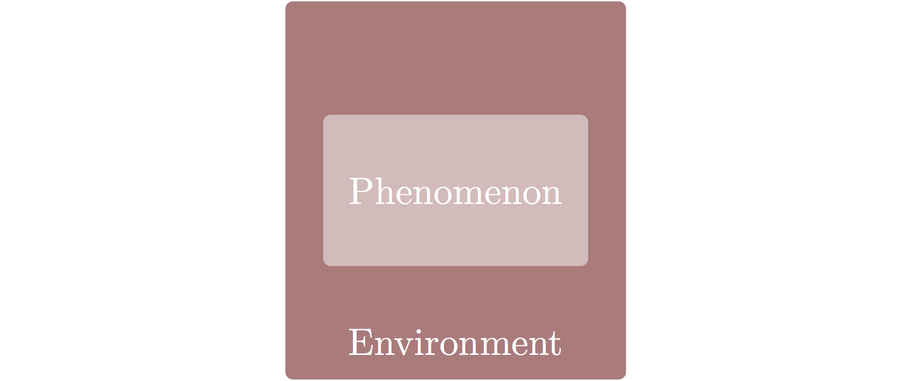
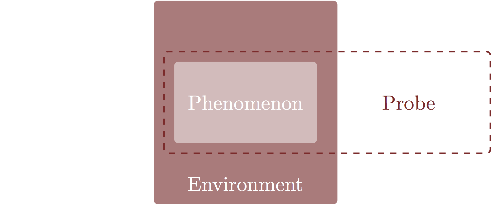
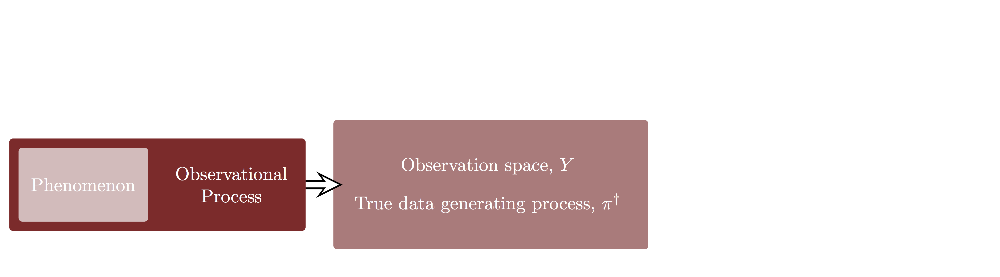
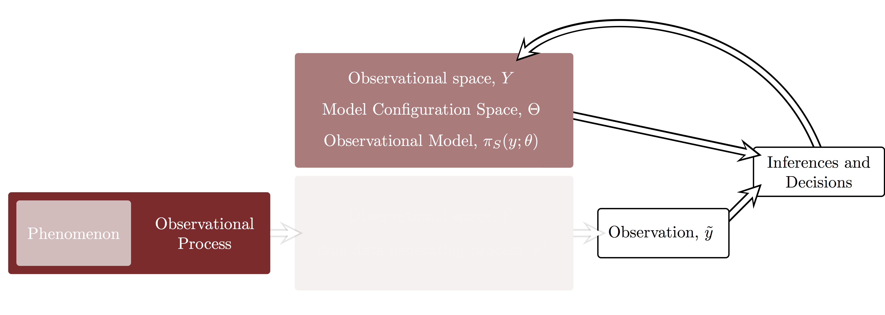
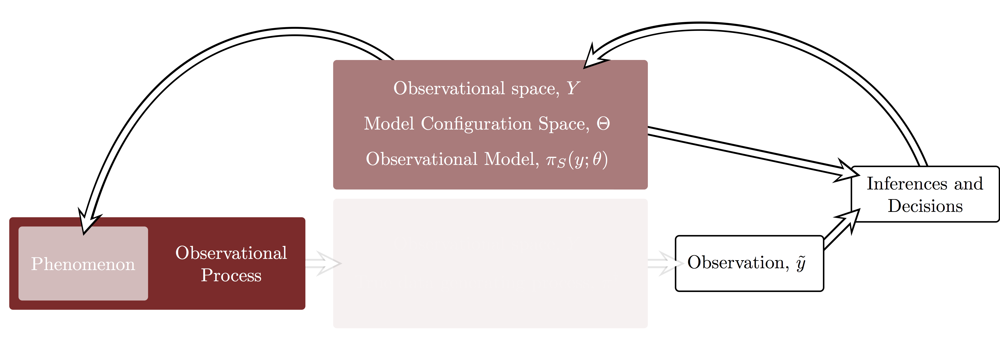
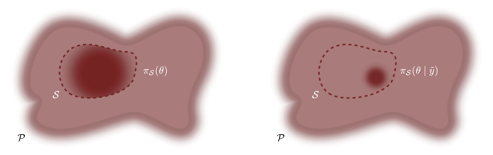

```{r setup, include=FALSE}
knitr::opts_chunk$set(comment=NA)
```

Decision making is a critical task that spans not just science and industry but
arguably the entire human experience.  At the same time, decision making in
complex circumstances is notoriously subtle and counterintuitive.  How do we
make principled decisions between a set of actions, $A$?  If we could quantify
our _utility_ for each action,
$$ 
\begin{alignat*}{6}
U :\; &A& &\rightarrow& \; &\mathbb{R}^{+}&
\\
&a& &\mapsto& &U(x)&,
\end{alignat*}
$$
then we could simply select the action with the highest utility, 
$$
a_{*} = \underset{a \in A}{\text{argmax}} U(a).
$$
In practice, however, even the most rigorous utility assignments will depend on 
circumstances we do not know with perfect certainty and we must rely on 
_inferences_ to inform those circumstances and motivate effective decision 
making.

Bayesian inferences utilizes probability theory to quantify information about 
statistical models derived from both domain expertise and observed data, which 
in turn naturally advises principled decision making.  In this case study we'll
review the foundations of statistical models and Bayesian inference relevant 
for practical applications.  In the appendix I'll also present a short 
introduction to frequentist inference with comparisons to the Bayesian paradigm.

I take an observational perspective here that presumes the existence of a true
data generating process that generates the observations from which we learn.
That perspective is not universal and clashes with some philosophical 
perspectives on Bayesian inference, and indeed statistics in general, that are 
often emphasized in introductory texts.  Fortunately in most cases the 
differences between these perspectives don't have any consequences for how the 
resulting methodology is implemented in practice but it helps to keep in mind
the different perspectives when comparing to other literature.

# Probabilistic Modeling

Models are approximations of the complex dynamics that drives the observable 
phenomena in the world around us.  They provide the setting in which we can
formalize learning and decision making and hence are a foundational aspect to
any rigorous analysis.  In this section we review latent observational 
process, the data generating processes they incite, and the probabilistic models
that attempt to capture the relevant structure of those data generating 
processes.

## The Observational Process

A typical abstraction in applied analysis is to assume that we are making
decisions about how to interact with some latent _phenomenon_.  Consequently
our inferential target is the phenomenon itself.  

No material phenomenon, however, exists in isolation.  Any phenomenon relevant 
to statistical inquiry must manifests within some latent system that includes,
at the very least, the mechanisms with which we can interact with it.  In other 
words we can observe the phenomenon of interest only through its surrounding 
_environment_.

<center>

<br>
```{r, out.width = "75%", echo=FALSE}

```
<br><br>

</center>

Consequently in order to make the desired inferences we need an observational 
_probe_ that explores the environment and, hopefully, the phenomenon of 
interest.  

<center>

<br>
```{r, out.width = "75%", echo=FALSE}

```
<br><br>

</center>

The interaction of the probe with the environment and the phenomenon defines an 
_observational process_ which examines the latent system and generates explicit 
observations that are sensitive to the phenomenon of interest. 

<center>

<br>
```{r, out.width = "75%", echo=FALSE}
knitr::include_graphics("figures/inferential_config/observational_process/observational_process/observational_process.png")
```
<br><br>

</center>

An observational process encompasses any methodology that measures, collects, 
curates, or manipulates observations sensitive to the latent phenomenon.  This 
includes, for example, both dedicated experiments explicitly designed to 
interrogate the phenomenon of interest as well as retrospective analyses of 
incidental experiments or previously conducted experiments designed for other 
purposes.

In encapsulating the phenomenon of interest our probe intersects only part of 
the surrounding environment.  Consequently the observational process will
be sensitive to only those elements of the environment relevant to the probe.
Often well-designed experiments can better isolate the target phenomenon,
yielding much cleaner observational processes and more informative observations.

There are typically many ways to interrogate an environment and the phenomena
it exhibits, and hence may possible probes.
<center>

<br>
```{r, out.width = "100%", echo=FALSE}
knitr::include_graphics("figures/inferential_config/observational_process/multiple_probes/multiple_probes.png")
```
<br><br>

</center>

Each of these probes defines its own observational process, each of which can 
become the basis of independent analyses or components in a more sophisticated
analyses.

<center>

<br>
```{r, out.width = "100%", echo=FALSE}
knitr::include_graphics("figures/inferential_config/observational_process/multiple_observational_processes/multiple_observational_processes.png")
```
<br><br>

</center>

Consequently observational processes are bespoke to not only a given phenomenon 
but also the specific details of the probe used to investigate it.

## The True Data Generating Process

** Intro sentence discussing possible values that observations can take,
define observation space here and don't wait until later **
Fundamentally what makes inference so subtle is that realizations of an 
observational process do not yield single observations.

The realized observations, for example, may exhibit _aleatoric_ variation due
to _ontological_ stochasticity inherent to the latent phenomenon, its
environment, or the probe used to interrogate them.  For example, the atomic
decays that give rise to radiation occur in random directions and at random
intervals due to their quantum mechanical nature.  

At the same time the realized observations may exhibit _epistemological_ 
uncertainty due to limitations in how accurately we can observe the latent 
system.  Lengths of an object reported using a ruler, for example, are limited 
by the precision of the markings and the resolution of the human eye; they 
will not in general be consistent from person to person or even a single person
from time to time.  Similarly, the increasingly common digital means of 
collecting and processing data are limited by the numerical precision of the
intermediate computations.

Ultimately we can't discriminate between the nature of this behavior.  For 
example one can always argue that seemingly ontological variation is a result of 
the imprecise observation of complex but deterministic dynamics, such as those
arising in chaos theory.  Fortunately the exact philosophical nature of this 
behavior isn't relevant in practice because these different perspectives all
manifest in the same mathematical assumptions.

Regardless of its interpretation, we presume that this behavior is sufficiently 
regular that, while it cannot be quantified with any single observation, it can 
be quantified with a _distribution_ of observations.  More formally we embody 
the  observational process with a probability distribution over the _observation 
space_, $Y$, of possible observational outcomes, with realizations of the 
observation process becoming samples from that distribution.  

Probability distributions over the observation space are in general denoted
_data generating processes_, and the probability distribution that captures the
observational process in a given application denoted the _true data generating 
process_, $\pi^{\dagger}$.  

<center>

<br>
```{r, out.width = "100%", echo=FALSE}

```
<br><br>

</center>

In order to distinguish points in the observation space from realize 
observations I will decorate the latter with a tilde, $\tilde{y}$.

<center>

<br>
```{r, out.width = "100%", echo=FALSE}
knitr::include_graphics("figures/inferential_config/dgp/dgp4/dgp4.png")
```
<br><br>

</center>

In any given application the true data generating process is unknown and,
practically, unknowable.  Inference is then tasked with understanding the true
data generating process using a given observation as the only expression of that 
latent data generating process.  In particular, inference hopefully advices 
decisions about how to interact with the latent phenomenon.

<center>

<br>
```{r, out.width = "100%", echo=FALSE}
knitr::include_graphics("figures/inferential_config/dgp/dgp6/dgp6.png")
```
<br><br>

</center>

Knowledge of true data generating process would, however, provide the necessary
context for calibrating decision making processes informed by observations. 
Consider formalizing a decision making process as map from the observation
space to the action space,
$$ 
\begin{alignat*}{6}
a :\; &Y& &\rightarrow& \; &A&
\\
&y& &\mapsto& &a(y)&.
\end{alignat*}
$$
Given a knowledge of the latent system we could hypothetically construct a 
utility function for each possible action, $U : A \rightarrow \mathbb{R}^{+}$, 
which would then quantify the benefit of the decision making process in light 
of a given observation as
$$ 
\begin{alignat*}{6}
U \circ a :\; &Y& &\rightarrow& \; &\mathbb{R}^{+}&
\\
&y& &\mapsto& &U(a(y))&.
\end{alignat*}
$$
We could then establish the distribution of outcomes by pushing forward the
true data generating process through this composite function.

Unfortunately this calibration is purely hypothetical.  In any realistic 
application we are not able to quantify the latent system sufficiently well to 
construct an exact utility function, nor do we know the true data generating
process.

## The Observational Model

At this point we have presumed the existence of a true data generating process
but we don't know what form it will take in any given application.  In order to
find the appropriate data generating process we would consider as many possible
candidate data generating processes as possible.  Ideally we would search 
through the space of _all_ data generating processes, that is all probability 
distributions over the observation space, $\mathcal{P}$,

Unfortunately this _big world_ of data generating processes is just too large
and complex to be able to quantify in any practical application.  Indeed the 
depths of this space is where mathematicians lurk, and that alone should be 
reason enough to stay away.  "Some of my best friends are mathematicians" he
says in vain as everyone leaves the room...

In any case, in practice we have to limit our search to something more 
tractable.  That is we have to consider only a _small world_, 
$\mathcal{S} \subset \mathcal{P}$, or data generating processes.  This small 
world defines the _observational model_ with each individual data generating
process, or _model configuration_, defining a possible mathematical narrative 
of how the data could be generated.  

<center>

<br>
```{r, out.width = "75%", echo=FALSE}
knitr::include_graphics("figures/small_world/small_world/small_world.png")
```
<br><br>

</center>

Our inferential goal is then to quantify which of these model configurations are
similar to the true data generating process, and hence useful for informing our
ultimate decisions.  If the small world contains the true data generating 
process then basing our inferences on the observational model incurs no losses.
An exhaustive search through the small world will always take into account the
true data generating process.  

In practice, however, we need not be so fortunate, and the true data generating
process may lie outside the scope of the observational model.

<center>

<br>
```{r, out.width = "75%", echo=FALSE}
knitr::include_graphics("figures/small_world/small_world_one/small_world_one.png")
```
<br><br>

</center>

Indeed in practice this circumstance is the rule rather than the exception.
In applications observational models are limited by the constraints of 
mathematical and computational feasibility and will be unable to fully capture
the, frankly ridiculous, complexity of the natural world.

The inferences generated from an observational model that doesn't contain the
true data generating process, may still be meaningful so long as the data 
generating processes it does contain captures the structures relevant to our 
decision processes.  For example, an ecological model that neglects quantum
mechanics and general relativity is too meager to capture the _entirety_ of 
observations of animal migration.  Most ecological research, however, is 
sufficiently useful without having to consider what might happen if birds
started migrating at the speed of light or quantum tunneling through 
geographical impediments.  At the same time, research considering navigation
by magnetic field might need a more sophisticated consideration of quantum
mechanics.

Ultimately the observational model is an _approximation_ to the true data 
generating process, a realization that resonates with the famous quote of
George Box that "all models are wrong but some are useful".  Some use that quote 
to motivate carelessness with the observational model, but Box was arguing the
opposite.  Only with respect for the given application and careful work can we 
develop an observational model that sufficiently well-approximates the true data 
generating process.

Consideration of the observational process that gives rise to the true data
generating process is critical to principled model development, but we always
have to be careful to recognize the limitations of any observational models.

### The Generative Structure of an Observational Model

The richer the observational model the more each model configuration will 
emulate the _generative_ structure of the observational process, from the 
latent phenomenon through the surrounding environment to the final observational
probe.  Reasoning about the structure of this generative process is particularly
effective in the design of useful observational models.  

Consider specify our observational model with a collection of probability 
density functions, $\pi_{\mathcal{S}} (y ; \theta)$, where the _parameters_
$\theta$ identify each model configuration.  The parameters of those models 
following the generative structure of the observational process might then 
decompose into parameters for each phase, 
$$
\theta = \{ \theta_{\text{phenom}}, 
\theta_{\text{envir}}, \theta_{\text{probe}} \}.
$$
The separation between environmental and probe parameters, however, need not 
always be so clean, especially for more primitive approximations to the true 
data generating process.  For example is the influence of the person collecting
the data better classified as part of the environment or part of the probe?
Taken together the non-phenomenological parameters are sometimes denoted
_systematic_ parameters. 

In addition to facilitating the design of the observational model for a single 
probe, this generative decomposition also motivates principled observational
models for multiple probes.  For example, two probes might interrogate the 
same phenomenon, but they won't experience exactly the same environment and 
probe circumstances.  Consequently we might specify the observational model as
$$
\begin{align*}
\pi_{\mathcal{S}} (y ; \theta)
=& \;\;\;
\pi_{\mathcal{S}} (y_{1} ; \theta_{\text{phenom}}, 
\theta_{\text{envir}}, \theta_{\text{envir}, 1}, 
\theta_{\text{probe}}, \theta_{\text{probe}, 1})
\\
& \cdot
\pi_{\mathcal{S}} (y_{2} ; \theta_{\text{phenom}}, 
\theta_{\text{envir}}, \theta_{\text{envir}, 2}, 
\theta_{\text{probe}}, \theta_{\text{probe}, 2}),
\end{align*}
$$
where the subscripted parameters, such as $\theta_{\text{envir}, 1}$ are unique 
to a specific context and the non-subscripted parameters, such as 
$\theta_{\text{envir}}$, are shared across contexts.  The better we can model 
the systematic structure of the observational process the better we can build 
analyses that study the same phenomenon across different experiments, or develop 
hypotheses about the outcomes of new experiments targeting the same phenomenon.

For example, consider a latent phenomenon that influences a binary response in 
the environment.  We might model this response with an unknown probability, $p$,
of the binary response taking the value $y = 1$ instead of $y = 0$.  The 
specifics of the observational model then depend on the structure of the
observational probe.  

If we probe the system once and record the binary outcome then we might utilize 
a small world of Bernoulli distributions,
$$
\pi_{\mathcal{S}} (y ; \theta) = \text{Ber} (y \mid p).
$$
Presuming that the system is memoryless then repeated probes might be modeled
as a product of independent Bernoulli distributions that are all parameterized 
by the same latent probability parameter,
$$
\pi_{\mathcal{S}} (y_{1}, \ldots, y_{N} ; \theta) = 
\prod_{n = 1}^{N} \text{Ber} (y_{n} \mid p).
$$
Alternatively we might repeatedly probe the system only to record the total 
number of $y = 1$ responses, $k$ in which case we could apply a model of 
binomial distributions parameterized with the phenomenological probability,
$$
\pi_{\mathcal{S}} (k; \theta) = \text{Bin} (k \mid p).
$$
Finally probing until $k$ unity responses are observed could be modeled with
negative Binomial distributions parameterized by the phenomenological
probability,
$$
\pi_{\mathcal{S}} (k; \theta) = \text{NegBin} (k \mid p).
$$

A simple binary response quantified by a phenomenological probability is, 
however, a relatively crude approximation to much more sophisticated latent 
structure.  The more deeply we look at the observational process the richer 
our observational model will have to become.  

That binary response, for example, might correspond to the capture of a 
particular species in an ecological experiment.  In that case the probability
of capture might not be a single, monolithic parameter but rather the outcome
of the population dynamics between the species of interest, the species on which
it preys, and the species which predate it.

It could also correspond to the alarm of a detector that has recorded enough 
incident radiation to pass a certain threshold.  Here the latent probability 
would be a consequence of the possible sources of radiation, including radiation 
from particular sources of interest as well as the irrelevant background sources 
that permeate the environment.  Depending on the precision required of the
desired inferences we might also have to model the detector response itself,
including calibration of the incident radiation flux to the electronic signals
which are ultimately integrated to trigger the detection.

Each deeper look into the observational process discerns more detail and a 
richer generative structure.

### Limitations of Observational Models

Regardless of how sophisticated our observational model might be it will 
always be an approximation to the complexity of the true data generating process
and we have to be ever mindful of the limitations of a particular model in the
context of a particular analysis.  

For example, the observational model might approximate the true data generating 
process only within a certain regime of behaviors.  At the same time the 
approximations might accurately capture only some behaviors but not others.
A given observational model can express the large scale structure of the latent
system but make no attempt to incorporate the structure at smaller scales.
It might capture statistical relationships between phenomenological parameters 
but fail to accurately convey the physical dynamics or explicit causal structure 
of the phenomenon and its interaction with the environment.  

Consequently we have to be extremely careful to employ model-based inferences 
only within the regimes where the approximations are reasonable and sufficient
for the decisions that we want to inform.  In other words, we have to develop a 
model that's just accurate enough for the given application.

Another subtly with the approximate nature of the observational model is that
a given observational model might be a reasonable approximation for _many_
true data generating processes.  This is particularly common for observational
models that focus on capturing the _emergent_ behaviors of a complex 
observational process.  At sufficiently coarse scales much of the latent 
structure averages out and only the most coherent of the latent behaviors
survive.  All true data generating process with similar emergent behavior can
then be equally well-approximated by the same observational model.

Linear regression, for example, can be interpreted as a deterministic linear
relationship between observed variables convolved with the variation captured
by a distribution represented by a Gaussian probability density function.
This linear relationship can then be considered as a leading-order approximation
to rich phenomenological behavior with the Gaussian variation approximating 
the environmental and probe behaviors.  Any true data generating process with 
the same first-order phenomenological behavior and emergent environmental and 
probe behaviors will be reasonably approximated by the same linear regression 
model. 

That said, the exact interpretation of an observational model will depend on 
the unique context of the specific true data generating process.  The art of 
designing a useful observational model is not just the choice of 
parameterization and probability density functions but also the establishment of 
the surrounding context that gives those parameters and densities meaningful 
interpretation.

### Model-Based Calibration

While we cannot perfectly calibrate a decision-making process without knowing 
the true data generating process, we can define a proxy calibration within the
context of a given observational model.  

Firstly we assume that for each model configuration $\theta$ we can define 
utilities for all available actions,
$$ 
\begin{alignat*}{6}
U:\; &A \times \Theta& &\rightarrow& \; &\mathbb{R}^{+}&
\\
&(a, \theta)& &\mapsto& &U(a, \theta)&.
\end{alignat*}
$$
Given a particular model configuration we can then compute the utility of an 
observation-informed decision-making process with the composition
$$ 
\begin{alignat*}{6}
U \circ a :\; &Y \times \Theta& &\rightarrow& \; &\mathbb{R}^{+}&
\\
&(y, \theta)& &\mapsto& &U(a(y), \theta)&.
\end{alignat*}
$$
Finally because each model configuration identifies a data generating process 
we can compute _expected utilities_ over the possible observations, 
$\bar{U}(\theta) = \mathbb{E}_{\pi_{y;\theta}} [ U(a(y), \theta) ]$, 
for each possibility.  Alternatively we could push each of the data generating 
processes through the composite utility function to give a full distribution 
of the utilities for each model configuration.

How we ultimately exploit these expected utilities or utility distributions 
depends on how we handle the model configuration dependence.  No matter how we
end up employing these model-based utilities we have to be vigilant in
recognizing they are only as good as the observational model itself.

# Bayesian Inference

Once an observational model has been established, and its limitations 
acknowledged, we can consider _model-based inferences_ that identify which model 
configurations are most consistent with the true data generating process.  
Unfortunately without knowing the true data generating process these inferences
can be informed only by the information inherent in observed data and our own
domain expertise.

Consequently the observational model both plays two critical roles. Firstly
it defines a context for constructing inferences from observations.

<center>

<br>
```{r, out.width = "100%", echo=FALSE}
knitr::include_graphics("figures/inferential_config/model_config/model_config3/model_config3.png")
```
<br><br>

</center>

In particular, model-based inferences take the form of a quantification of which 
model configurations are consistent with the observed data. 

<center>

<br>
```{r, out.width = "100%", echo=FALSE}

```
<br><br>

</center>

Secondly those model-based inferences then inform decisions about how to 
interact with the latent phenomenon, bridging the gap between the observable
data and the unobservable latent system.

<center>

<br>
```{r, out.width = "100%", echo=FALSE}

```
<br><br>

</center>

The utility of those decisions will of course depend on how well the 
observational model approximates the relevant properties of the true data 
generating process.

Bayesian inference uses probability theory to quantify inferences within a 
model configuration; neighborhoods of the small world allocated more 
probability are more consistent.  We don't, however, choose a probability
distribution arbitrarily -- there is a natural procedure for updating a _prior 
distribution_ that encodes our domain expertise about the model into a
_posterior distribution_ that identifies those model configuration consistent 
with both our domain expertise _and_ the observed data.  Inferences and 
decisions, and predictions all follow from natural probabilistic operations.

## The Bayesian Model

Once we accept the use of probabilities to quantify inferences within the
small world, the observational model becomes more than just a collection of
data generating processes -- it becomes a conditional probability distribution
over the product of the observational space and model configuration space, 
$Y \times \Theta$,
$$
\pi_{\mathcal{S}}(y ; \theta) \rightarrow \pi_{\mathcal{S}}(y \mid \theta).
$$

A _prior model_ is defined by a marginal distribution over the model 
configuration space, $\pi_{\mathcal{S}}(\theta)$, that that encodes domain 
expertise about the observational model and possibly its context within the true 
data generating process and latent observational process. For example, a prior 
distribution might suppress model configurations that, while not entirely 
impossible, stress the accuracy of the modeling approximations.

Once introduced the prior distribution complements the observational model to 
give a _Bayesian model_ defined as a joint distribution over $Y \times \Theta$,
$$
\pi_{\mathcal{S}}(y, \theta) 
= 
\pi_{\mathcal{S}}(y \mid \theta) \, \pi_{\mathcal{S}}(\theta).
$$
It is this joint distribution that ultimately defines inferences over the
model configuration space.

Although the observational model and prior model have been introduced 
separately it is typically the full Bayesian model that they define that
facilitates model development  Once we separate the model configuration space 
into phenomenological, environmental, and probe parameters, for example, the
full model can be decomposed into a sequence of conditional distributions that
follows the generative structure of the true data generating process,
$$
\begin{align*}
\pi_{\mathcal{S}}(y, \theta) 
=& \,
\pi_{\mathcal{S}}(y, \theta_{\text{phenom}}, \theta_{\text{envir}}, \theta_{\text{probe}}) 
\\
=& \;\;\;
\pi_{\mathcal{S}}(y | \theta_{\text{phenom}}, \theta_{\text{envir}}, \theta_{\text{probe}}) 
\\
& \cdot \pi_{\mathcal{S}}(\theta_{\text{probe}} | \theta_{\text{phenom}}, \theta_{\text{envir}}) 
\\
& \cdot \pi_{\mathcal{S}}(\theta_{\text{envir}} | \theta_{\text{phenom}}) 
\\
& \cdot \pi_{\mathcal{S}}(\theta_{\text{phenom}}).
\end{align*}
$$
This generative decomposition not only facilitates the development of coherent
yet sophisticated models, it also allows different parts of the model to be 
isolated and modeled separately which is hugely beneficial when the development 
is being done by a large team and not any one individual.

## The Posterior Distribution

Evaluating the joint probability density function of the full Bayesian model
at an explicit observation defines a conditional probability density function
over the model configuration space given that observation,
$$
\pi_{\mathcal{S}}(\theta \mid \tilde{y}) 
\propto
\pi_{\mathcal{S}}(\tilde{y}, \theta),
$$
or, with the proper normalization,
$$
\pi_{\mathcal{S}}(\theta \mid \tilde{y}) 
= 
\frac{ \pi_{\mathcal{S}}(\tilde{y}, \theta) }
{ \int \mathrm{d} \theta \, \pi_{\mathcal{S}}(\tilde{y}, \theta) }.
$$
This conditional probability density function defines the _posterior 
distribution_ that quantifies our probabilistic inferences over the model 
configuration space.  More formally, this derivation is an application of
_Bayes' Theorem_, hence the name Bayesian inference.

Consider writing the joint probability density function as
$$
\pi_{\mathcal{S}}(y, \theta)
=
\pi_{\mathcal{S}}(y \mid \theta) \, \pi_{\mathcal{S}}(\theta).
$$
Evaluating the probability density functions in the observational model at
the given observation defines the _likelihood function_,
$$ 
\begin{alignat*}{6}
l_{\tilde{y}} :\; &\Theta& &\rightarrow& \; &\mathbb{R}^{+}&
\\
&\theta& &\mapsto& &\pi_{\mathcal{S}}(\tilde{y} \mid \theta)&,
\end{alignat*}
$$
which increases around model configurations that are more consistent with the
observed data.

Using this decomposition the posterior density function can be written as
$$
\pi_{\mathcal{S}}(\theta \mid \tilde{y}) 
=
\frac{ \pi_{\mathcal{S}}(\tilde{y} \mid \theta) }
{ \int \mathrm{d} \theta \, \pi_{\mathcal{S}}(\tilde{y}, \theta) } \cdot
\pi_{\mathcal{S}}(\theta).
$$ 
This form demonstrates that the posterior density function, and hence the
posterior distribution itself, concentrates on those model configurations
that are consistent with _both_ our domain expertise, as encoded in the prior 
density function, and the observation, as encoded in the likelihood function.

In other words we can interpret this application of Bayes' Theorem as a
procedure for _updating_ the prior distribution into a posterior distribution.
Bayesian inference is a _learning_ process where what we know after the
observation, as encoded in the posterior distribution, is just the combination 
of what we knew before the observation, as encoded in the prior distribution, 
and what we learned from the observation, as encoded in the likelihood function.

<br><br>

<br><br>

Critically, the final shape of the posterior distribution depends on the  
_interaction_ of the prior distribution and the likelihood function for the
observed data.  For example, when the likelihood function concentrates in a 
small neighborhood of the model configuration space it dominates the shape of
the posterior density function,

<br><br>

<br><br>

In other words, the information encoded in the posterior distribution is 
governed by what we learn from the observation, and even vague priors are
sufficient for useful inferences.

The observational model, however, isn't always so well-behaved.  In particular,
our probe might not be sufficiently sensitive to the phenomena of interest at
the scales approximated by the observational model.  In that case the 
observational model is said to be _weakly-identified_ and the likelihood 
function tends to disperses over far regions of the model configuration space
for most, if not all, observations.  In circumstances like these the form of the
posterior distribution is strongly influenced by the form of the prior 
distribution; a careless prior distribution will propagates to a careless 
posterior distribution.

<br><br>

<br><br>

In order to compensate for breadth of poorly-identified likelihood functions 
we need the prior distribution to incorporate more domain expertise.  At very
least we want the prior distribution to suppress extreme, although not 
entirely impossible, model configurations.

<br><br>

<br><br>

Consequently in order to ensure robust Bayesian inferences we need to develop
the prior model in the context of the observational model, and perhaps even the
context of the latent observational process it approximates.  This is greatly
facilitated by not modeling the two components  independently but rather 
developing the full Bayesian model all at once.

## Making Inferences

By construction all of the information deemed relevant to our inferences is 
encoded in the full Bayesian model or its interaction with the observed data, 
and hence manifests within the posterior distribution.  Consequently any 
inferential query we might pose can be answered only with valid operations 
on the posterior distribution which formally all reduce to the evaluation of
expectation values.  In other words, any question we ask in Bayesian inference
is encoded in a real-valued function over the model configuration space, 
$g : \Theta \rightarrow \mathbb{R}$, and the corresponding answer is given by
the posterior expectation value, 
$$
\mathbb{E} [ g(\theta) ]
=
\int_{\Theta} \mathrm{d} \theta \, \pi_{\mathcal{S}}(\theta \mid \tilde{y}) \,
g(\theta).
$$

For example, we might ask _where_ in the model configuration space our posterior 
concentrates.  We can answer this with the posterior means or even the posterior
medians.  Similarly the _breadth_ of this concentration can be quantified by 
the posterior standard deviations of even posterior tail quantiles.

The key step in implementing any Bayesian analysis is then the computation of 
the posterior expectation values for whatever functions are deemed relevant to
the analysis.  Here algorithms like Markov chain Monte Carlo prove essential,
consuming unnormalized posterior density functions and returning estimates of 
posterior expectations along with quantification of the estimator errors.

## Making Decisions

Our ultimate goal is to make decisions given the available information, and
Bayesian inferences implemented as posterior expectations readily inform
robust decision making.  

As we saw before, a model-based utility function 
$$ 
\begin{alignat*}{6}
U:\; &A \times \Theta& &\rightarrow& \; &\mathbb{R}^{+}&
\\
&(a, \theta)& &\mapsto& &U(a, \theta)&.
\end{alignat*}
$$
wasn't immediately applicable for making decisions because of the dependence
of the configurations in our observational model.  The posterior distribution,
however, quantifies which of those model configurations are consistent with the
available information.  Consequently we can compute _expected utilities_ as
the posterior expectation values
$$
\bar{U}(a, \tilde{y}) = 
\mathbb{E}_{ \pi_{\mathcal{S}}(\theta \mid \tilde{y}) } [ U(a, \theta) ]
=
\int_{\Theta} \mathrm{d} \theta \, \pi_{\mathcal{S}}(\theta \mid \tilde{y}) \,
U(a, \theta).
$$
Note the implicit dependence on the observation due to the dependence of the
posterior distribution on the observation.

The optimal decision _in the context of the available information_ is then 
given by taking the action that maximizes these expected utilities which 
defined the _Bayesian decision making process_
$$
a_{*}(\tilde{y}) = \underset{a \in A}{\text{argmax}} U(a, \tilde{y}).
$$
Mathematically Bayesian decision theory is relatively simple and quite natural,
but it can be a conceptual paradigm shift for many because of its consideration
of the uncertainty inherent in the posterior distribution.  Indeed many common
fallacies arise from ignoring posterior uncertainty or presuming irrelevant 
models.  Forcing oneself to go through the steps of developing a Bayesian
model and computing expected utilities can be a powerful way of avoiding common
mistakes and facilitating more robust decisions.

That said, Bayesian decision theory strives only to make an optimal decision 
in the context of the available information.  There is no guarantee that the 
resulting decision-making process will perform well across the distribution of 
observations that arise from the true data generating process.  For that we 
need to go one step further and _calibrate_ our decision-making process over 
an incidence of reasonable observations.

## Making Predictions

Assuming that the latent observational process is stationary, predictions are
straightforward to make given a particular model configuration, and hence a 
single data generating process.  The distribution of predictions is just defined
by that data generating process.  

Unfortunately in Bayesian inference there is no natural way to isolate a single  
model configuration in order to make predictions.  What we can do, however,
is take expectations over _all_ of the data generating processes in the 
observational model, with those model configurations allocated higher 
probability more strongly influencing the resulting predictive distribution.

Because we have two distributions over the model configuration space available 
in Bayesian inference, we have two natural predictive distributions.

### The Prior Predictive Distribution

One choice of distribution which we can use to average over the data generating 
processes in the observational model is the prior distribution.  This
expectation yields the _prior predictive distribution_ whose density is given
by
$$
\pi_{S}(y) = \int_{\Theta} \mathrm{d} \theta \, 
\pi_{\mathcal{S}}(\theta) \,
\pi_{\mathcal{S}}(y \mid \theta).
$$

The prior predictive distribution is most strongly influenced by those model 
configurations most consistent with the domain expertise encoded in the prior
distribution.  In other words the prior predictive distribution quantifies our
best understanding of the scope of reasonable observations using only the domain 
expertise that we've considered.  This allows us to make predictions before
we've made any observations, which is useful when we want to consider how our 
inferences and subsequent decision-making processes might play out before we
probe the latent system.

### The Posterior Predictive Distribution

This leaves the posterior distribution as our other option.  The posterior 
expectation over the observational model yields the _posterior predictive 
distribution_ whose density is given by
$$
\pi_{S}(y \mid \tilde{y}) = \int_{\Theta} \mathrm{d} \theta \, 
\pi_{\mathcal{S}}(\theta \mid \tilde{y}) \,
\pi_{\mathcal{S}}(y \mid \theta).
$$

The posterior predictive distribution is influenced by the model configurations
consistent not just with the considered domain expertise but also the particular
data we've observed.  This makes it ideal for informing predictions about 
future interactions with the latent system that are as precise as possible.  

Comparisons between the posterior predictive distribution and the true data 
generating process also provide a measure of how well our model approximates
the latent system.  Although we can't explicitly form these comparisons in
practice, _estimates_ of these comparisons form the basis of all predictive 
model validation procedures, including information criteria and cross 
validation.

# Bayesian Calibration

Ideally the true data generating process, or at least the best approximation 
to it within our observational model, would fall into a neighborhood of high
posterior probability so that our inferences would be accurate in the context
of the true data generating process.  It would even better if the posterior
distribution converged to a delta function around the best data generating 
process in the observational model as the size of the observation, and hence
the information about the true data generating process it contains, grew to be
infinitely large.  

In general, however, there are no such guarantees in Bayesian inference.  The 
posterior distribution simply follows the information encoded in the model and 
the observation, and without a carefully-designed Bayesian model it can chase 
irrelevant quirks of a given observation away from better data generating
processes.

At the same time it can be difficult to develop principled priors to compensate
for any limitations in the observational model because of the dependence of the
likelihood function on the observed data.  While some observations might yield 
perfectly well-behaved likelihood functions, some observations might conspire to 
yield poorly-identified likelihood functions and some might give likelihood 
functions that strongly concentrate away from the better data generating 
processes.  Without having a sense of what observations, and hence which 
likelihood function behaviors, to expect, we are starved for information to 
guide principled model development.

One possible resolution is to repeatedly simulate observations from a known
data generating process and run our analysis to completion, scrutinizing the 
resulting behavior of the likelihood functions and posterior distributions or
the outcomes of a decision-making process in the context of the known simulator 
truth.  The efficacy of this approach, however, depends on how well that
data generating process approximates the relevant features of the _true_ data
generating process.

Fortunately in Bayesian inference we have a natural data generating process that
captures our uncertainty about the true data generating process before we've
examined the observed data -- the prior predictive distribution. 

Studying the distribution of posterior behaviors resulting from prior predictive 
observations allows us to identify vulnerabilities in our full Bayesian model 
that limit the accuracy of our inferences.  In particular, we can quantify if 
our model is good enough to ask the inferential questions, or inform the 
decisions, required of a given analysis; we can formalize this calibration by 
constructing the distribution of utilities, $U(a(y), \theta)$, induced by the 
Bayesian joint distribution, $\pi_{\mathcal{S}} (y, \theta)$.  We can even use 
the distribution of posteriors to calibrate the accuracy of our Bayesian 
computation in a procedure known as _simulation-based calibration_.

That said, the conclusions we draw from these calibrations will be limited by 
the quality of the initial Bayesian model that gives rise to the prior 
predictive distribution that we employ.  If we are not confident that our 
observational model accurately approximates the true data generating process
or that our prior model encodes reasonable domain expertise, in particular 
sufficient domain expertise to regularize any misbehavior of plausible
likelihood functions, then of what use are these calibrations?  

In practice these calibrations serve as a way of _bootstrapping_ model 
development.  Starting with an initial crude model we can use these calibrations
to identify the limitations of that model and inform improvements such as 
more sophisticated observational models, more precise domain expertise, or 
even more robust methods for computing expectations.  This information is 
critical to a _principled Bayesian workflow_ for model development.

At the same time the Bayesian model used for constructing the calibrating 
prior predictive distribution need not be the same Bayesian model we use in our
posterior analysis.  We could, for example, use a more sophisticated, and more
expensive, model to calibrate a cruder approximation that we aim to employ in
a given application.  Indeed this asymmetry mirrors practice common in the 
sciences.

# Conclusion

Bayesian inference is a versatile methodology for fusing information from 
observations and domain expertise into coherent inferences and decision-making
processes.  The probabilistic foundations of the methodology ensure that the 
mechanisms for evaluating, analyzing, and criticizing inferences are all 
implemented by the natural operations in probability theory.  

Conceptually this makes Bayesian computation particularly well-suited to 
automation once a full Bayesian model has been specified.  In practice automated
computation can't quite be realized, but with the careful utilization of modern 
tools we can get impressively close.  Moreover, carefully-designed probabilistic 
programming languages provide the means for practitioners to specify the broad 
extent of models that arise in applications.  

Together probabilistic programming and state-of-the-art Bayesian computational
methods provide a complete platform for implementing Bayesian inference in 
practice.  Indeed that is the basis for Stan.

# Acknowledgements

I am indebted for the feedback from those who have attended my courses and 
talks.

A very special thanks to everyone supporting me on Patreon: 

# Appendix A.1: Frequentist Inference {-}

Bayesian inference is just one approach to quantifying consistency between data
generating processes in the observational model and observed data.  The more
orthodox approach in academia is _frequentist_ inference which eschews 
probabilities for binary quantifications of consistency.

The fundamental difference between Bayesian and frequentist methods is that the
latter makes the strong philosophical assumptions that probability theory can
be applied to _only_ events that can be repeated infinitely often.  In that way
probabilities can be _defined_ as the long run frequencies of these events, and
because all observers would encounter the same frequencies these probabilities 
would be physical and independent of the observer.  

Unfortunately this definition quickly runs into technical difficulties.  Not
only can we not actually realize the infinite, perfect replications needed to 
define the limiting frequencies in practice, this infinite limit is subtle and 
not always so well-defined.  Consequently formal frequentist inference pulls a 
mild bait and switch -- the frequency definition of probabilities is replaced 
with Kolmogorov's axioms, only the restricted applicability to repeatable 
events.

Consequently if we presume that the circumstances of an observation can be 
exactly replicated then we can still use probability theory to describe the 
distribution of possible observations.  We can longer, however, use probability
theory to also quantify information about the model configuration space itself.

We are then left with binary quantifications of consistency; model 
configurations are either consistent with the observation or they're not. An 
immediate shortcoming of such binary quantifications is that they're much less 
informative than posterior distributions as a probability distribution can 
encode far more information than a step function.  A more serious weakness is 
that once a model configuration is deemed inconsistent it can no longer inform 
decisions.  An overaggressive quantification can be lead astray to irrelevant 
features of an observation and end up throwing the data generating processes in 
the observational model that best approximation the true data generating 
process, if not the true data generating process itself.

To compensate for this frailty the frequentist approach treats inference itself 
as a decision-making process and carefully calibrates those decisions to ensure
that the binary quantifications are well-behaved _on average_.  

More formally, binary quantifications of consistency are defined by _estimators_
that deterministically map observations into some binary quantifications of the 
model configuration space.  If we treat the possible quantifications as actions, 
$a$, then an estimator defines a decision-making processes, a(\tilde{y})$, that
we can then calibrate with a model-based utility function, $U(a, \theta)$.

If we presume that $\theta$ is the true model configuration then we can use the 
corresponding data generating process to define expected utilities of a given 
estimator over the possible observations,
$$
\bar{U}(\theta) = \int_{Y} \mathrm{d} y \, \pi_{\mathcal{S}}(y ; \theta) \,
U(a(y), \theta).
$$
Because of the foundational assumptions of the frequentist perspective we are 
limited in how we can take into account the dependence on the presumed true
model configuration.  Just about the only thing that we can do is report the
_worst case utility_,
$$
U^{*} = \underset{\theta \in \Theta}{\text{argmin}} \bar{U}(\theta).
$$
In that way we can calibration the worst case behavior of the estimator, at 
least provided that the true data generating process is contained within the 
observational model.

For example, we might use _point estimator_ that maps observations into single 
model configurations,
$$ 
\begin{alignat*}{6}
\hat{\theta}:\; &Y& &\rightarrow& \; &\Theta&
\\
&y& &\mapsto& &\hat{\theta}(y)&.
\end{alignat*}
$$
In that case we might exercise a utility function that considers the distance 
between the point estimate and the presumed true model configuration,
$$ 
\begin{alignat*}{6}
U:\; &Y \times \Theta& &\rightarrow& \; &\mathbb{R}^{+}&
\\
&(y, \theta)& &\mapsto& &| \hat{\theta}(y) - \theta |^{2}&.
\end{alignat*}
$$
For each model configuration we'd then compute the expected utility 
$$
\bar{U}(\theta) = \int_{Y} \mathrm{d} y \, \pi_{\mathcal{S}}(y ; \theta) \,
| \hat{\theta}(y) - \theta |^{2}.
$$
and then summarize the expected performance of the point estimator with the
worst case utility.  

Alternatively we might consider _confidence sets_ that map observations into 
entire sets of model configurations, 
$$ 
\begin{alignat*}{6}
\widehat{\Delta \theta}:\; &Y& &\rightarrow& \; &\mathcal{T}&
\\
&y& &\mapsto& &\widehat{\Delta \theta}(y)&,
\end{alignat*}
$$
where $\mathcal{T}$ is an appropriate $\sigma$-algebra over the model 
configuration space.  Here we might employ a utility function that considers 
whether or not the estimated set includes the presumed true model configuration,
$$ 
\begin{alignat*}{6}
U:\; &Y \times \Theta& &\rightarrow& \; &\{0, 1\}&
\\
&(y, \theta)& &\mapsto& &\mathbb{I}[ \theta \in \widehat{\Delta \theta}(y) ]&.
\end{alignat*}
$$
The expected utility for a given model configuration is then the probability
of containment, or _coverage_,
$$
\begin{align*}
\bar{U}(\theta) 
&= 
\int_{Y} \mathrm{d} y \, \pi_{\mathcal{S}}(y ; \theta) \,
\mathbb{I} [ \theta \in \widehat{\Delta \theta}(y) ]
\\
&= \mathbb{P} [ \theta \in \widehat{\Delta \theta}(y) ].
\end{align*}
$$
In other words, our confidence set is playing [ring toss around the presumed
truth](https://twitter.com/epiellie/status/1073385427317465089) and we want to 
know how often we score a ringer.  The final calibration of a confidence set is 
then the smallest probability across all possible presumed true model 
configurations,
$$
U^{*} = \underset{\theta \in \Theta}{\text{argmin}} 
\mathbb{P} [ \theta \in \widehat{\Delta \theta}(y) ].
$$

Importantly, frequentist inference does not define a particular inferential 
procedure over an observational model but rather a definite procedure for
calibration estimators over an observational model.  In order to develop a
frequentist analysis we need to specify not just our observational model but 
also an estimator and its associated utility function and then carry out the 
worst case utility analysis.

The worst case analysis is extremely conservative -- an estimator might be 
well-behaved for most reasonable model configurations but its worst case 
behavior can be dominated by the behavior of extreme, but not impossible, model 
configurations.  That said, if we can engineer an estimator with an acceptable
worst case loss then we have confidence of that its behavior will be robust, at
least within the context of the assumptions of the observational model.

In practice, however, the worst case utility is typically infeasible to compute 
for nontrivial models, even with simple estimators.  At the same time computing 
the worst case utility of more sophisticated estimators can be infeasible even 
for simple models.  Consequently most frequentist results are limited to 
careful pairings of models, estimators, and utility functions that admit 
convenient calculations.  

Because these are the only available results, they are often forced into 
applications where the assumed observational model is a poor approximation to 
the system being analyzed and the assumed estimator is irrelevant to the overall 
inferential goals of the analysis.  This is why frequentist methods are so often
presented as black boxes that consume data and excrete inferences without any 
consideration of the implicit assumptions.  

That said, there is a particular circumstance where such general results can be 
applicable to many systems: the magical land of asymptotics.

# Appendix A.2: Asymptotics {-}

Consider an observation comprised of many identical and independently generated
components, $y = \{ y_{1}, \ldots, y_{N} \}$ with the observation space defined
as the product over each component observation space, $\times_{n = 1}^{N} Y$.

As the number of these components, $N$, grows our observation should assimilate
more information, and eventually only those model configurations that closely 
approximate the true data generating process should have any chance of being 
estimated as consistent with the observation.  In other words, the likelihood
function should concentrate around the true data generating process.

At the same time, when we consider an observation with an increasing number of 
components the idiosyncratic properties of any particular component observation
should average out.  How the likelihood function concentrates around the true
data generating process should largely be irrelevant of the particular details
of any given observation.

These intuitions are formalized in the theory of _asymptotics_.  Here we assume
that the likelihood function for any observation is smooth and then consider the 
_maximum likelihood estimator_,
$$
\theta_{\text{ML}}(y) =  
\underset{\theta \in \Theta}{\text{argmin}}
\pi_{\mathcal{S}}(y ; \theta).
$$
If the observational model contains the true data generating process, 
$\pi^{*}(y) = \pi(y ; \theta^{*})$ for some true model configuration 
$\theta^{*}$, then under some relatively mild technical conditions the 
distribution of maximum likelihood estimates converges towards $\theta^{*}$ as 
the number of component observations increases.  In particular, for sufficiently 
large $N$ the maximum likelihood estimator approximately follows a Gaussian 
distribution,
$$
J(\theta_{\text{ML}}(y)) \cdot (\theta_{\text{ML}}(y) - \theta^{*}) \sim 
\mathcal{N}(0, 1),
$$
where $J$ is the _Fisher information matrix_ which evaluates the expectation 
value of the Hessian of the log likelihood function,
$$
J_{ij}(\theta) = \int_{Y} \mathrm{d} y \, 
\pi_{\mathcal{S}}(y ; \theta)
\frac{ \partial^{2} }{ \partial \theta_{i} \partial \theta_{j} } 
\log \pi_{\mathcal{S}}(y ; \theta).
$$

Once this asymptotic behavior takes hold the expected utility becomes a Gaussian
integral which will be straightforward to compute, if not outright analytic, for
many utility functions.  Moreover, because the distribution for the maximum
likelihood estimator depends only on the true model configuration we don't have
to worry about figuring out a worst case expected utility, as all of the 
expected utilities will be the same.

Consequently in this asymptotic limit we can construct point estimators and 
confidence sets with known calibrations regardless of the specifics of the 
observational model.  To implement them in practice all we have to do is compute
a straightforward maximization of the likelihood function and _maybe_ verify
that the observation has enough independent components for the asymptotic limit
to be a reasonable approximation.

Verifying for what $N$ a given observational model is well approximated by
asymptotic behavior, however, is no trivial task.  Simpler models will converge
to the asymptotic limit faster and hence be well approximated with smaller $N$,
while more complex models will typically require larger $N$.  Working out the
exact details of this convergence, however, requires serious mathematical tools.

Perhaps more importantly, the assumption that the observational model contains
the true data generating process can obstruct the applicability of the 
asymptotic limit altogether.  Recall that observational models are themselves 
often crude approximations to the true data generating process.  For small $N$
the observation will be only weakly informative and we can't resolve the system 
well enough to notice the approximation.  As we collect more components and 
$N$ increases, however, our observations become informative enough that we can
resolve the limitations of the observational model.  In other words, as we try
to escape to the asymptotic limit the assumption that the observational model 
contains the true data generating process become harder and harder to justify.

Consider, for example, an observational model where we ignore any heterogeneity 
in the processes that generate each component of the observation so that we need
only a few, fixed parameters.  For sufficiently many components the asymptotic 
limit will well-approximate the homogenous observational model.  In that limit,
however, our inferences for the fixed parameters become precise enough that we
become sensitive to the heterogeneity that we ignored.  Even though the 
homogenous observational model converges to the asymptotic limit it _diverges_
from the true data generating process and the limit becomes largely irrelevant.

The ultimate utility of the asymptotic limit depends on the existence of a 
moderate $N$ for which the observational model converges close enough to the 
asymptotic limit without diverging too far from the true data generating 
process.  Demonstrating that such an $N$ exists, and then identifying it if it
does, in a particular application is an extremely challenging task.

Still, frequentist asymptotics have become the norm in many applied fields
because of their easy implementation, especially if the underlying assumptions 
aren't examined too closely.  Indeed frequentist inference has become so tightly
bound to the asymptotic limit in much of the academic literature it becomes the
basis for unfounded comparisons to Bayesian methods.

A common refrain is that frequentist methods are significantly less 
computationally demanding than Bayesian methods.  This comparison, however, is 
between not the general application of the two methodologies but rather 
frequentist methods in the asymptotic limit and general Bayesian methods 
_without_ the luxury of that limit.  A single optimization through the model 
configuration space is undoubtable less computationally demanding than the 
survey of the model configuration space needed to accurately approximate
posterior expectation values, but this isn't a balanced comparison.

The asymptotic limit drastically simplifies the structure of the observational 
model, reducing the burden of _both_ frequentist and Bayesian computation.  In
the asymptotic limit we no longer need to rely on the general Bayesian tools 
for computing posterior expectations and can instead utilize approximate
algorithms that exploit the asymptotic structure. If the limit well approximates 
the observational model in a given application then any fair comparison has to 
allow both methodologies to take advantage in which case the computational 
burden becomes practically equivalent.

On the other hand, if the asymptotic limit poorly approximates the observational
model then we have to rely the general frequentist and Bayesian methodologies.
Here we can no longer rely on the asymptotic calibration of maximum likelihood 
estimators and instead have to engineer bespoke estimator and go through the 
costly calibration process in its entirety.  In comparison, building and 
calibrating a Bayesian model is often much less computationally demanding.
