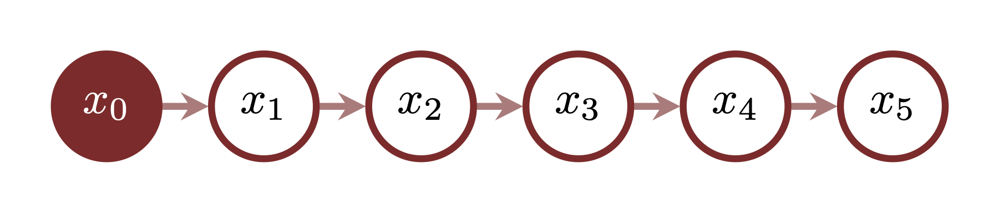
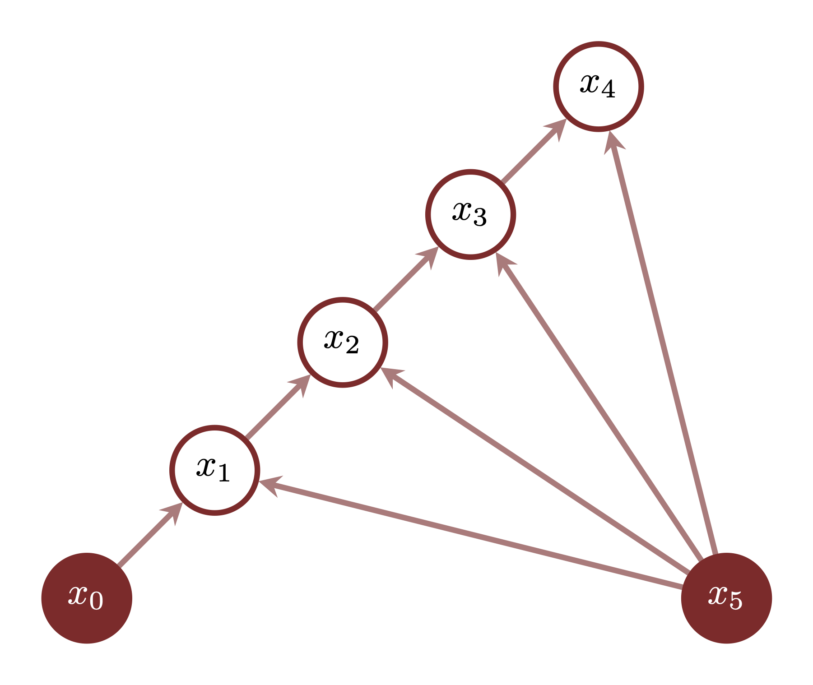
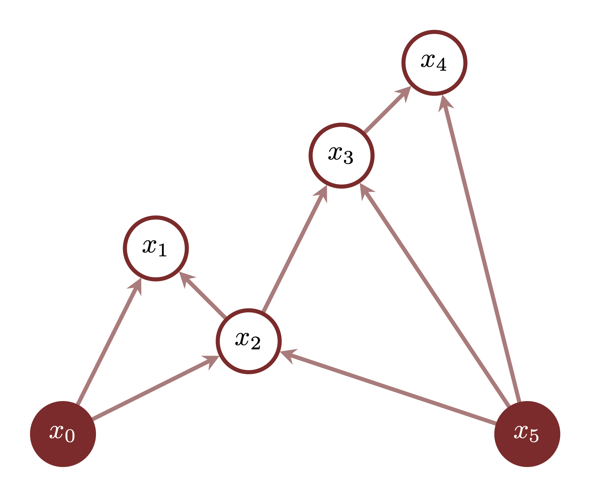

```{r setup, include=FALSE}
knitr::opts_chunk$set(comment=NA)
knitr::opts_knit$set(global.par = TRUE)
```

Brownian motion is a fundamental stochastic process over trajectories that 
expands around a given initial state.  A _Brownian bridge_ restricts this 
Brownian motion to trajectories that also converge to a given terminal state.
In this case study we will briefly review the implementation of both Brownian 
motion and Brownian bridges in Stan.

For a more rigorous discussion of Brownian motion and Brownian bridges see for 
example @Pavliotis:2006.

# Preparation S

Before demonstrating how to implement Brownian motion and Brownian bridges in 
Stan we need to set up our local environment.  Embracing vanity we first
configure our graphics.

```{r, warning=FALSE, message=FALSE}
library(colormap)

c_light <- c("#DCBCBC")
c_light_highlight <- c("#C79999")
c_mid <- c("#B97C7C")
c_mid_highlight <- c("#A25050")
c_dark <- c("#8F2727")
c_dark_highlight <- c("#7C0000")

nom_colors <- c("#DCBCBC", "#C79999", "#B97C7C", "#A25050", "#8F2727", "#7C0000")

c_light_teal <- c("#6B8E8E")
c_mid_teal <- c("#487575")
c_dark_teal <- c("#1D4F4F")

c_light_trans <- c("#DCBCBC80")
c_dark_trans <- c("#8F272780")
c_green_trans <- c("#00FF0080")

par(family="serif", las=1, bty="l", cex.axis=1, cex.lab=1, cex.main=1,
    xaxs="i", yaxs="i", mar = c(5, 5, 3, 1))
```

Then we ready Stan's `R` interface and my recommended diagnostics.

```{r, warning=FALSE, message=FALSE}
library(rstan)
rstan_options(auto_write = TRUE)
options(mc.cores = parallel::detectCores())
parallel:::setDefaultClusterOptions(setup_strategy = "sequential")

util <- new.env()
source('stan_utility.R', local=util)
```

Finally let's define some functions for visualizing trajectory behavior.

```{r}
plot_realizations <- function(t, x, name, ylim=c(-3, 7)) {
  I <- length(x[,1])

  plot_idx <- seq(1, I, 80)
  J <- length(plot_idx)
  line_colors <- colormap(colormap=nom_colors, nshades=J)

  plot(1, type="n", xlab="Time", ylab="State", main=name,
       xlim=c(t[1], t[length(t)]), ylim=ylim)
  for (j in 1:J)
    lines(t, x[plot_idx[j],], col=line_colors[j], lwd=2)
}

plot_marginal_quantiles <- function(t, x, name, ylim=c(-3, 7)) {
  probs = c(0.1, 0.2, 0.3, 0.4, 0.5, 0.6, 0.7, 0.8, 0.9)
  cred <- sapply(1:length(t), function(n) quantile(x[,n], probs=probs))

  plot(1, type="n", main=name,
       xlab="Time", ylab="State", xlim=c(t[1], t[length(t)]), ylim=ylim)
  polygon(c(t, rev(t)), c(cred[1,], rev(cred[9,])),
          col = c_light, border = NA)
  polygon(c(t, rev(t)), c(cred[2,], rev(cred[8,])),
          col = c_light_highlight, border = NA)
  polygon(c(t, rev(t)), c(cred[3,], rev(cred[7,])),
          col = c_mid, border = NA)
  polygon(c(t, rev(t)), c(cred[4,], rev(cred[6,])),
          col = c_mid_highlight, border = NA)
  lines(t, cred[5,], col=c_dark, lwd=2)
}
```

```{r, warning=FALSE, message=FALSE, echo=FALSE}
t_min <- 0
t_max <- 1
N <- 500

ts <- seq(t_min, t_max, (t_max - t_min) / (N - 1))

left_idx <- 1:(N - 2)
center_idx <- 2:(N - 1)
right_idx <- rep(N, N - 2)

x_left <- +1
x_right <- -1

simu_data <- list("N" = N, "ts" = ts, "x_left" = x_left, "x_right" = x_right, 
                  "left_idxs" = left_idx, 
                  "center_idxs" = center_idx, 
                  "right_idxs" = right_idx)

set.seed(9958284)

fit <- stan(file='stan_programs/simu_brownian_bridge.stan', data=simu_data,
            warmup=0, iter=1000, chains=1, seed=494838,
            algorithm="Fixed_param", refresh=0)

samples <- extract(fit)

N_obs <- 10
obs_idx <- 25 * (1:N_obs)

r <- 12

sigma <- 0.1
x_obs <- rnorm(N_obs, samples$xs[r, obs_idx], sigma)

stan_rdump(c("N", "ts", "x_left", "x_right",
             "N_obs", "obs_idx", "x_obs", "sigma"), 
           file="data/obs.data.R")

xs <- samples$xs[r,]

stan_rdump(c("xs"), file="data/truth.data.R")
```

# Brownian Motion

Brownian motion features a few useful interpretations.  On one hand we can 
interpret it as a probability distribution over continuous but 
non-differentiable trajectories across some time interval $t \in [0, T]$ bound 
to a fixed initial state $x(t = 0) = x_{0}$.  At the same time we can interpret 
it as an evolving probability distribution specified by a probability density 
function that expands around the initial state,
$$
\pi(x_{n} \mid x_{0}, t_{n})
=
\text{normal} \left( x_{n} \mid x_{0}, \sqrt{t_{n}} \right).
$$

From either perspective if we project Brownian motion to only a finite set of 
states
$$
\{ x_{1}, \ldots, x_{n}, \ldots, x_{N} \}
$$
at the times
$$
0 < t_{1} < \ldots < t_{n} < \ldots < t_{N}
$$
then it reduces to a finite-dimensional probability distribution specified by 
the probability density function
$$
\pi(x_{1}, \ldots, x_{N} \mid x_{0}, t_{1}, \ldots, t_{N})
=
\prod_{n = 1}^{N} \pi(x_{n} \mid x_{n - 1}, t_{n}, t_{n - 1})
$$
where 
$$
\pi(x_{n} \mid x_{n - 1}, t_{n}, t_{n - 1})
=
\text{normal} \left( x_{n} \mid x_{n - 1}, \sqrt{t_{n} - t_{n - 1}} \right).
$$
The longer the gap between sequential states the less coupled they will be.

<center>
<br>
```{r, out.width = "50%", echo=FALSE}

```
<br><br>
</center>

Given $x_{0}$ and the times $t_{1}, \ldots, t_{N}$ this Brownian motion is 
straightforward to implement in Stan.  Note that I use $1$-indexing in the Stan 
program for convenience which ever-so-slightly deviates from the $0$-indexing 
used in the mathematical notation and figures.

```{r}
writeLines(readLines("stan_programs/brownian_motion_prior_cp.stan"))
```

Before attempting to fit this model we need to define the states.  Here we will 
use a relatively fine discretization of the time interval $[0, 1]$.

```{r}
t_min <- 0
t_max <- 1
N <- 500

ts <- seq(t_min, t_max, (t_max - t_min) / (N - 1))
```

The variable `x_left` will capture the initial state at $t = 0$.

```{r}
x_left <- +1

data <- list("N" = N, "ts" = ts, "x_left" = x_left)
```

With the states ready we can attempt to fit the Brownian motion model in Stan.
The parser diagnostic here is a false positive due to packing both the fixed 
initial state and the other, varying states into a single array.

```{r, warning=FALSE, message=FALSE}
fit <- stan(file='stan_programs/brownian_motion_prior_cp.stan', 
            data=data, seed=494838, refresh=2000)
```

Unfortunately Stan's dynamic Hamiltonian Monte Carlo sampler is repeatedly 
hitting the maximum treedepth wall.  The `n_eff` and `Rhat` warnings here are 
false positives from the fixed initial state.

```{r}
util$check_all_diagnostics(fit)
```

The problem here is that this centered parameterization of the Brownian motion 
model induces strong correlations between all of the neighboring states.  These 
strong correlations require a small step size and very long numerical 
trajectories for Hamiltonian Monte Carlo to be able to accurately explore.

```{r}
samples <- extract(fit)

par(mfrow=c(2, 2))

plot(samples$xs[,10], samples$xs[,11], col=c_dark, pch=16,
     xlab="x_10", xlim=c(0.25, 1.75), ylab="x_11", ylim=c(0.25, 1.75))

plot(samples$xs[,11], samples$xs[,12], col=c_dark, pch=16,
     xlab="x_11", xlim=c(0.25, 1.75), ylab="x_12", ylim=c(0.25, 1.75))

plot(samples$xs[,12], samples$xs[,13], col=c_dark, pch=16,
     xlab="x_12", xlim=c(0.25, 1.75), ylab="x_13", ylim=c(0.25, 1.75))

plot(samples$xs[,13], samples$xs[,14], col=c_dark, pch=16,
     xlab="x_13", xlim=c(0.25, 1.75), ylab="x_14", ylim=c(0.25, 1.75))
```

We can avoid these correlations with a non-centered parameterization of the 
model.

```{r}
writeLines(readLines("stan_programs/brownian_motion_prior_ncp.stan"))
```

```{r, warning=FALSE, message=FALSE}
fit <- stan(file='stan_programs/brownian_motion_prior_ncp.stan', 
            data=data, seed=494838, refresh=2000)
            
util$check_all_diagnostics(fit)
```

The nicer geometry afforded by the non-centered parameterization is no problem 
for Stan to quantify both quickly and accurately.  Using this fit we can 
immediately visualize the Brownian motion.

```{r}
samples <- extract(fit)

par(mfrow=c(1, 2))

plot_realizations(ts, samples$xs, 
                  "Prior Trajectory Realizations\nBrownian Motion Model", 
                  c(-3, 3))
abline(h=data$x_left, col="gray80", lwd=2, lty=3)

plot_marginal_quantiles(ts, samples$xs, 
                        "Prior Marginal Quantiles\nBrownian Motion Model", 
                        c(-3, 3))
abline(h=data$x_left, col="gray80", lwd=2, lty=3)
```

If we have observations of any states then this Brownian motion model becomes a 
prior model that we can update into a posterior distribution.  Consider, for
example, a normal observational model with a known variability,
$$
\pi(x_{\text{obs}, m} \mid x_{\text{obs_idx}(m)}, \sigma)
= 
\text{normal}(x_{\text{obs}, m} \mid x_{\text{obs_idx}(m)}, \sigma),
$$
which we assume gives rise to the following observation.

```{r}
data <- read_rdump("data/obs.data.R")

par(mfrow=c(1, 1))

plot(data$ts[data$obs_idx], data$x_obs, pch=16, col=c_mid_teal, 
     xlim=c(0, 1), xlab="Time", ylim=c(-3, 3), ylab="State")
```

Adding this observational model to our Stan program allows us to quantify the 
Brownian motion trajectories that are compatible with this observation.

```{r}
writeLines(readLines("stan_programs/brownian_motion_post_ncp.stan"))
```

```{r, warning=FALSE, message=FALSE}
fit <- stan(file='stan_programs/brownian_motion_post_ncp.stan', 
            data=data, seed=494838, refresh=2000)

util$check_all_diagnostics(fit)
```

With this non-centered parameterization we see no indications of fitting 
problems that would instill doubt in the accuracy of our posterior 
quantification.  

Indeed the resulting posterior stochastic process threads through the 
observed data.

```{r}
samples <- extract(fit)

par(mfrow=c(1, 2))

plot_realizations(ts, samples$xs, 
                  "Posterior Trajectory Realizations\nBrownian Motion Model", 
                  c(-3, 3))

abline(h=data$x_left, col="gray80", lwd=2, lty=3)

points(data$ts[data$obs_idx], data$x_obs, pch=16, cex=1.00, col="white")
points(data$ts[data$obs_idx], data$x_obs, pch=16, cex=0.75, col=c_mid_teal)

plot_marginal_quantiles(ts, samples$xs, 
                        "Posterior Marginal Quantiles\nBrownian Motion Model", 
                        c(-3, 3))

abline(h=data$x_left, col="gray80", lwd=2, lty=3)

points(data$ts[data$obs_idx], data$x_obs, pch=16, cex=1.00, col="white")
points(data$ts[data$obs_idx], data$x_obs, pch=16, cex=0.75, col=c_mid_teal)
```

# Brownian Bridges

One limitation of the Brownian motion model is that it can account for only an 
initial condition.  In some applications, however, we privileged with 
_boundary conditions_ that fix both an initial state at $t = 0$ _and_ a terminal 
state at $t = T$.  Without being able to accommodate this terminal condition the 
Brownian motion model can provide poor inferences as we extrapolate to later 
times.

For example let's assume that we know that our system converges to a terminal 
state `x_right = -1` at $t = T$.  Inferences using the Brownian motion prior 
model poorly capture the true behavior of the system as we move further away 
from $t = 0$ and closer to $t = T$.

```{r}
truth <- read_rdump("data/truth.data.R")

par(mfrow=c(1, 2))

plot_realizations(ts, samples$xs, 
                  "Posterior Trajectory Realizations\nBrownian Motion Model", 
                  c(-3, 3))

abline(h=data$x_left, col="gray80", lwd=2, lty=3)
abline(h=data$x_right, col="gray80", lwd=2, lty=3)

lines(data$ts, truth$xs, lwd=3, col="white")
lines(data$ts, truth$xs, lwd=1.5, col="black")

points(data$ts[data$obs_idx], data$x_obs, pch=16, cex=1.00, col="white")
points(data$ts[data$obs_idx], data$x_obs, pch=16, cex=0.75, col=c_mid_teal)

plot_marginal_quantiles(ts, samples$xs, 
                        "Posterior Marginal Quantiles\nBrownian Motion Model", 
                        c(-3, 3))

abline(h=data$x_left, col="gray80", lwd=2, lty=3)
abline(h=data$x_right, col="gray80", lwd=2, lty=3)

lines(data$ts, truth$xs, lwd=3, col="white")
lines(data$ts, truth$xs, lwd=1.5, col="black")

points(data$ts[data$obs_idx], data$x_obs, pch=16, cex=1.00, col="white")
points(data$ts[data$obs_idx], data$x_obs, pch=16, cex=0.75, col=c_mid_teal)
```

A Brownian bridge restricts Brownian motion to respect a complete set of
boundary conditions.  Mathematically the behavior of each state in a Brownian 
bridge is defined conditional not on a single previous state but rather on two 
_bounding_ states,
$$
\pi(x_{n} \mid x_{l}, x_{m}, t_{l}, t_{n}, t_{m})
=
\text{normal} \left( x_{n} \mid 
x_{l} + \frac{t_{n} - t_{l}}{t_{m} - t_{l}} \, (x_{m} - x_{l}),
\sqrt{ \frac{ (t_{m} - t_{n}) \, (t_{n} - t_{l}) }{ t_{m} - t_{l} } } \right).
$$
where
$$
t_{l} < t_{n} < t_{m}.
$$

A consistent model for multiple interior states is then defined through a 
conditional decomposition of the form
$$
\pi(x_{1}, \ldots, x_{N} \mid 
    x_{0}, x_{N + 1}, t_{0}, t_{1}, \ldots, t_{N}, t_{N + 1})
=
\prod_{n = 1}^{N} \pi(x_{\text{center}(n)} \mid 
x_{\text{left}(n)}, x_{\text{right}(n)}, 
t_{\text{left}(n)}, t_{\text{center}(n)}, t_{\text{right}(n)})
$$
where 
$$
t_{\text{left}(n)} < t_{\text{center}(n)} < t_{\text{right}(n)}
$$
and
$$
\text{center}^{-1} \circ \text{left}(n) < n
\\ 
\text{center}^{-1} \circ \text{right}(n) < n.
$$
In other words we need to surround each interior state with two states that 
have already been considered in the decomposition.

Given a consistent decomposition the Brownian bridge model is straightforward to 
implement in Stan.  With wisdom aforethough we jump directly to a non-centered 
parameterization.

```{r}
writeLines(readLines("stan_programs/brownian_bridge_prior_ncp.stan"))
```

```{r}
writeLines(readLines("stan_programs/brownian_bridge_post_ncp.stan"))
```

Fortunately there are many decompositions that we can employ in practice; here 
we will explore just a few.

## Sequential Decomposition

One possibility is to run through each of the interior states in order, using 
the previous state and the terminal state as boundaries.  I will refer to this 
as a _sequential decomposition_.

<center>
<br>
```{r, out.width = "50%", echo=FALSE}

```
<br><br>
</center>

This decomposition is particularly straightforward to implement programatically.

```{r}
data$left_idxs <- 1:(data$N - 2)
data$center_idxs <- 2:(data$N - 1)
data$right_idxs <- rep(data$N, data$N - 2)
```

Given the decomposition we can quantify the consequences of the Brownian bridge 
prior model with Stan.

```{r, warning=FALSE, message=FALSE}
fit <- stan(file='stan_programs/brownian_bridge_prior_ncp.stan', data=data,
            seed=494838, refresh=2000)
```

In this case we have multiple false positives from the two fixed boundary states
that we've included in the `xs` array.

```{r}
util$check_all_diagnostics(fit)
```

Like the Brownian motion model all of the realized trajectories are bound to the
initial state, but unlike the Brownian motion all of the realized trajectories 
are also bound to the terminal state.

```{r}
samples <- extract(fit)

par(mfrow=c(1, 2))

plot_realizations(ts, samples$xs, 
                  "Prior Trajectory Realizations\nBrownian Bridge Model", 
                  c(-3, 3))

abline(h=data$x_left, col="gray80", lwd=2, lty=3)
abline(h=data$x_right, col="gray80", lwd=2, lty=3)

plot_marginal_quantiles(ts, samples$xs, 
                        "Prior Marginal Quantiles\nBrownian Bridge Model", 
                        c(-3, 3))

abline(h=data$x_left, col="gray80", lwd=2, lty=3)
abline(h=data$x_right, col="gray80", lwd=2, lty=3)
```

Adding the observational model allows us to quantify the trajectories compatible 
with not only the initial state and terminal state but also the observed data.

```{r, warning=FALSE, message=FALSE}
fit <- stan(file='stan_programs/brownian_bridge_post_ncp.stan', data=data,
            seed=494838, refresh=2000)
```

```{r}
util$check_all_diagnostics(fit)
```

```{r}
samples <- extract(fit)

par(mfrow=c(1, 2))

plot_realizations(ts, samples$xs, 
                  "Posterior Trajectory Realizations\nBrownian Bridge Model", 
                  c(-3, 3))

abline(h=data$x_left, col="gray80", lwd=2, lty=3)
abline(h=data$x_right, col="gray80", lwd=2, lty=3)

lines(data$ts, truth$xs, lwd=3, col="white")
lines(data$ts, truth$xs, lwd=1.5, col="black")

points(data$ts[data$obs_idx], data$x_obs, pch=16, cex=1.00, col="white")
points(data$ts[data$obs_idx], data$x_obs, pch=16, cex=0.75, col=c_mid_teal)

plot_marginal_quantiles(ts, samples$xs, 
                        "Posterior Marginal Quantiles\nBrownian Bridge Model", 
                        c(-3, 3))

abline(h=data$x_left, col="gray80", lwd=2, lty=3)
abline(h=data$x_right, col="gray80", lwd=2, lty=3)

lines(data$ts, truth$xs, lwd=3, col="white")
lines(data$ts, truth$xs, lwd=1.5, col="black")

points(data$ts[data$obs_idx], data$x_obs, pch=16, cex=1.00, col="white")
points(data$ts[data$obs_idx], data$x_obs, pch=16, cex=0.75, col=c_mid_teal)
```

## Recursive Decomposition

Instead of working through the interior states sequentially we can also work 
through them with recursive bisections.  We start by selecting an interior state 
$x_{s}$ temporally bounded by the initial and terminal states,
$$
t_{0} < t_{s} < t_{N - 1}.
$$
This choice bisects the remaining states into two segments: one with states 
bounded by $t_{0}$ and $t_{s}$ and the other with states bounded by $t_{s}$ and 
$t_{N - 1}$.  At this point we can repeat the procedure on each group until we 
have exhausted all of the interior states.

<center>
<br>
```{r, out.width = "50%", echo=FALSE}

```
<br><br>
</center>

Programming this decomposition is a bit more difficult, but still manageable
with some careful recursion.

```{r}
construct_boundaries <- function(left_idx, right_idx) {
  
  delta <- right_idx - left_idx
  if (delta > 1) {
    center_idx <- left_idx + delta %/% 2
    
    idxs <- list(c(left_idx, center_idx, right_idx))
    idxs <- append(idxs, construct_boundaries(left_idx, center_idx))
    idxs <- append(idxs, construct_boundaries(center_idx, right_idx))
  }
}
```

For example we recover the decomposition in the figure using `0`-indexing,

```{r}
idxs <- construct_boundaries(0, 5)
for(idx in idxs) {
  cat(paste0(idx, ","))
  cat("\n")      
}
```

Our Stan implementation, however, requires `1`-indexing. 

```{r}
idxs <- construct_boundaries(1, data$N)

data$left_idxs <- sapply(idxs, function(idx) idx[1])
data$center_idxs <- sapply(idxs, function(idx) idx[2])
data$right_idxs <- sapply(idxs, function(idx) idx[3])
```

Despite the additional complexity in constructing the decomposition the 
Brownian bridge model behaves the same.  For example the prior model results in 
the same realizations as before.

```{r, warning=FALSE, message=FALSE}
fit <- stan(file='stan_programs/brownian_bridge_prior_ncp.stan', data=data,
            seed=494838, refresh=2000)
```

```{r}
util$check_all_diagnostics(fit)
```

```{r}
samples <- extract(fit)

par(mfrow=c(1, 2))

plot_realizations(ts, samples$xs, 
                  "Prior Trajectory Realizations\nBrownian Bridge Model", 
                  c(-3, 3))
abline(h=data$x_left, col="gray80", lwd=2, lty=3)
abline(h=data$x_right, col="gray80", lwd=2, lty=3)

plot_marginal_quantiles(ts, samples$xs, 
                        "Prior Marginal Quantiles\nBrownian Bridge Model", 
                        c(-3, 3))
abline(h=data$x_left, col="gray80", lwd=2, lty=3)
abline(h=data$x_right, col="gray80", lwd=2, lty=3)
```

Likewise the posterior inferences are equivalent.

```{r, warning=FALSE, message=FALSE}
fit <- stan(file='stan_programs/brownian_bridge_post_ncp.stan', data=data,
            seed=494838, refresh=2000)
```

```{r}
util$check_all_diagnostics(fit)
```

```{r}
samples <- extract(fit)

par(mfrow=c(1, 2))

plot_realizations(ts, samples$xs, 
                  "Posterior Trajectory Realizations\nBrownian Bridge Model", 
                  c(-3, 3))

abline(h=data$x_left, col="gray80", lwd=2, lty=3)
abline(h=data$x_right, col="gray80", lwd=2, lty=3)

lines(data$ts, truth$xs, lwd=3, col="white")
lines(data$ts, truth$xs, lwd=1.5, col="black")

points(data$ts[data$obs_idx], data$x_obs, pch=16, cex=1.00, col="white")
points(data$ts[data$obs_idx], data$x_obs, pch=16, cex=0.75, col=c_mid_teal)

plot_marginal_quantiles(ts, samples$xs, 
                        "Posterior Marginal Quantiles\nBrownian Bridge Model", 
                        c(-3, 3))

abline(h=data$x_left, col="gray80", lwd=2, lty=3)
abline(h=data$x_right, col="gray80", lwd=2, lty=3)

lines(data$ts, truth$xs, lwd=3, col="white")
lines(data$ts, truth$xs, lwd=1.5, col="black")

points(data$ts[data$obs_idx], data$x_obs, pch=16, cex=1.00, col="white")
points(data$ts[data$obs_idx], data$x_obs, pch=16, cex=0.75, col=c_mid_teal)
```

## Data First

This second decomposition strategy also sets the stage for more elaborate 
strategies that can be useful for optimizing posterior geometry, and hence 
computational performance.  In general we should achieve the nicest posterior 
geometry when the most constrained states appear earliest in the conditional 
decomposition; the fixed boundary states should appear first followed by the 
observed states and then finally the unobserved states.

We can readily achieve this in practice by first decomposing the observed 
states, and then decomposing the unobserved states between the observed states 
and the boundary states.  For example consider five total states including the 
boundary states $x_{0}$ and $x_{4},
$$
\{ x_{0}, x_{1}, x_{2}, x_{3}, x_{4} \}.
$$
If $x_{2}$ informs observations but $x_{1}$ and $x_{3}$ do not then the 
compatible decomposition would start by surrounding the lone observed state,
$$
\{ x_{0}, x_{2}, x_{4} \}.
$$
This leave us to decompose the unobserved states between $x_{0}$ and $x_{2}$
and the unobserved states between $x_{2}$ and $x_{4}$.  Because there is only 
one interior state in each of these segments these decompositions are immediate,
$$
\{ x_{0}, x_{1}, x_{2} \}
\\
\{ x_{2}, x_{3}, x_{4} \}.
$$

Programmatically we start by appending the initial and final state indices to 
the observed state indices, if they aren't already included.

```{r}
buff_obs_idx <- obs_idx

# Add left boundary if necessary
if (obs_idx[N_obs] < data$N)
  buff_obs_idx <- c(buff_obs_idx, N)

# Add right boundary if necessary
if (obs_idx[1] > 1)
  buff_obs_idx <- c(1, buff_obs_idx)
```

Next we decompose these constrained states using whichever strategy is most 
convenient.  Here we will use the recursive strategy.

```{r}
init_idxs <- construct_boundaries(1, length(buff_obs_idx))

idxs <- lapply(init_idxs, function(idx) c(buff_obs_idx[idx[1]], 
                                          buff_obs_idx[idx[2]], 
                                          buff_obs_idx[idx[3]]))
```

Finally we decompose the unobserved states between each of the constrained 
states; once again we employ the recursive strategy here.

```{r}
for (n in 1:(length(buff_obs_idx) - 1))
  idxs <- append(idxs, 
                 construct_boundaries(buff_obs_idx[n], 
                                      buff_obs_idx[n + 1]))

data$left_idxs <- sapply(idxs, function(idx) idx[1])
data$center_idxs <- sapply(idxs, function(idx) idx[2])
data$right_idxs <- sapply(idxs, function(idx) idx[3])
```

# Conclusion

As with Brownian motion the analytic conditional density function that defines a
Brownian bridge makes it straightforward to implement in practice.  Constructing
the necessary decomposition of the states, however, is a bit more intricate for 
the bridge than the motion.

In theory we can define bridges for any stochastic process, but in general these 
bridges will rarely admit analytic conditional density functions like that of
the Brownian bridge.  Moreover, when these bridges do admit analytic results 
they can be quite complicated.  See for example the bridge for the 
Ornstein-Uhlenbeck stochastic process presented in @Corlay:2013.  

That said with this Ornstein-Uhlenbeck bridge we can conceivably approximate the 
bridge from a stochastic process defined through a stochastic differential 
equation in the same way that the Euler-Maruyama method approximates the 
stochastic process itself.

# Acknowledgements

I thank Ramiro Barrantes Reynolds for helpful comments.

A very special thanks to everyone supporting me on Patreon: Aapeli Nevala, 
Adam Bartonicek, Adam Fleischhacker, Adan, Adriano Yoshino, Alan Chang, 
Alan O'Donnell, Alessandro Varacca, Alexander Bartik, Alexander Noll, 
Alexander Rosteck, Anders Valind, Andrea Serafino, Andrew Mascioli, 
Andrew Rouillard, Andrew Vigotsky, Angie_Hyunji Moon, Angus Williams, 
Antoine Soubret, Ara Winter, Arya, asif zubair, Austin Rochford, 
Austin Rochford, Avraham Adler, Ben Matthews, Ben Swallow, Benoit Essiambre, 
Bertrand Wilden, Bo Schwartz Madsen, Brian Hartley, Bryan Yu, 
Brynjolfur Gauti Jónsson, Cameron Smith, Camron, Canaan Breiss, Cat Shark, 
Charles Naylor, Chase Dwelle, Chris Jones, Chris Zawora, Christopher Jenness, 
Christopher Mehrvarzi, Chuck Carlson, Cole Monnahan, Colin Carroll, 
Colin McAuliffe, Cruz, D, Damien Mannion, Damon Bayer, Dan Killian, 
dan mackinlay, Dan Muck, Dan W Joyce, Dan Waxman, Dan Weitzenfeld, Daniel, 
Daniel Edward Marthaler, Daniel Hocking, Daniel Rowe, Darshan Pandit, 
Darthmaluus , David Galley, David Humeau, David Wurtz, dilsher singh dhillon, 
Doug Rivers, Dr. Jobo, Dylan Murphy, Ed Cashin, Ed Henry, edith darin, Eduardo, 
Eric LaMotte, Erik Banek, Ero Carrera, Eugene O'Friel, Evan Cater, 
Fabio Pereira, Fabio Zottele, Felipe González, Fergus Chadwick, Finn Lindgren, 
Florian Wellmann, Francesco Corona, Francis, Geoff Rollins, George Ho, 
Granville Matheson, Greg Sutcliffe, Guido Biele, Hamed Bastan-Hagh, Haonan Zhu, 
Harrison Katz, Hector Munoz, Henri Wallen, Hugo Botha, Huib Meulenbelt, 
Håkan Johansson, Ian , Ignacio Vera, Ilaria Prosdocimi, Isaac S, J, 
J Michael Burgess, Ja Li, Jair Andrade, James McInerney, James Wade, JamesU, 
Janek Berger, Jason Martin, Jason Pekos, Jeff Dotson, Jeff Helzner, 
Jeff Stulberg, Jeffrey Erlich, Jesse Wolfhagen, Jessica Graves, Joe Wagner, 
John Flournoy, Jon , Jonathan H. Morgan, Jonathan St-onge, Jonathon Vallejo, 
Joran Jongerling, Jose Pereira, Josh Weinstock, Joshua Duncan, Joshua Griffith, 
Joshua Mayer, Josué Mendoza, Justin Bois, Karim Naguib, Karim Osman, 
Keith O'Rourke, Kejia Shi, Kevin Foley, lizzie , LOU ODETTE, Luiz Pessoa, 
Luke Hewitt, Marc Dotson, Marc Trunjer Kusk Nielsen, Marcel Lüthi, 
Marek Kwiatkowski, Mario Becerra, Mark Donoghoe, Mark Worrall, Markus P., 
Martin Modrák, Marty, Matthew, Matthew Hawthorne, Matthew Kay, Matthew Quick, 
Matthew T Stern, Matthieu LEROY, Maurits van der Meer, Maxim Kesin, 
elissa Wong, Merlin Noel Heidemanns, Michael Colaresi, Michael DeWitt, 
Michael Dillon, Michael Lerner, Mick Cooney, Mikael Koponen, Mike Lawrence, 
Mutual Information, Márton Vaitkus, N Sanders, Name, Nathaniel Burbank, 
Nic Fishman, Nicholas Clark, Nicholas Cowie, Nicholas Erskine, Nicholas Ursa, 
Nick S, Nicolas Frisby, Noah Guzman, Octavio Medina, Ole Rogeberg, Oliver Crook, 
Olivier Ma, Omri Har Shemesh, Pablo León Villagrá, Patrick  Kelley, 
Patrick Boehnke, Pau Pereira Batlle, Paul Oreto, Peter Smits, 
Pieter van den Berg , ptr, Putra Manggala, Ramiro Barrantes Reynolds, 
Ravin Kumar, Raúl Peralta Lozada, Reece Willoughby, Riccardo Fusaroli, 
Richard Nerland, Robert Frost, Robert Goldman, Robert kohn, Robert Mitchell V, 
Robin East, Robin Taylor, Rong Lu, Ryan Grossman, Ryan Wesslen, Rémi , S Hong, 
Scott Block, Scott Brown, Sean Pinkney, Sean Wilson, Serena, Seth Axen, shira, 
Simon Duane, Simon Lilburn, Srivatsa Srinath, sssz, Stan_user, Stefan, 
Stephanie Fitzgerald, Stephen Lienhard, Steve Bertolani, Stone Chen, Sus, 
Susan Holmes, Svilup, Sören Berg, Tagir Akhmetshin, Tao Ye, Tate Tunstall, 
Tatsuo Okubo, Teresa Ortiz, Thiago  de Paula Oliveira, Thomas Kealy, 
Thomas Lees, Thomas Vladeck, Tiago Cabaço, Tim Howes, Tobychev , Tom Knowles, 
Tom McEwen, Tommy Naugle, Tomáš Frýda, Tony Wuersch, Virginia Fisher, 
Vitaly Druker, Vladimir Markov, Wil Yegelwel, Will Farr, Will Kurt, 
Will Tudor-Evans, yolhaj , yureq , Zach A, Zad Rafi, Zhengchen Cai, and
Zwelithini Tunyiswa.

# References {-}

<div id="refs"></div>

# License {-}

A repository containing the material used in this case study is available on
[GitHub](https://github.com/betanalpha/knitr_case_studies/tree/master/brownian_bridge).

The code in this case study is copyrighted by Michael Betancourt and licensed
under the new BSD (3-clause) license:

https://opensource.org/licenses/BSD-3-Clause

The text and figures in this case study are copyrighted by Michael Betancourt
and licensed under the CC BY-NC 4.0 license:

https://creativecommons.org/licenses/by-nc/4.0/

# Original Computing Environment {-}

```{r, comment=NA}
writeLines(readLines(file.path(Sys.getenv("HOME"), ".R/Makevars")))
```

```{r, comment=NA}
sessionInfo()
```
