```{r setup, include=FALSE}
knitr::opts_chunk$set(comment=NA)
```

In my [previous case study](probability_theory.html) I introduced probability
theory but treated probability distributions as monolithic objects given to us
by some higher mathematical power.  To really take advantage of probability
theory in practice we'll need to _build_ probability distributions from the
ground up, and _conditional probability theory_ will prove to be a vital tool
in that construction.

This case study will introduce a conceptual understanding of conditional
probability theory and its applications.  We'll begin with a discussion of 
marginal probability distributions before introducing conditional probability
distributions as their complement.  Then we'll examine how different conditional 
probability distributions can be related to each other through Bayes' Theorem
before considering how all of these objects manifest in probability mass 
function and probability density function representations.  Finally we'll
review some of the important practical applications of the theory.

# Compressing Probability Into Marginal Distributions

A _projection operator_, $\varpi: X \rightarrow Y$, maps points from a _total 
space_ $X$ to points in a _base space_ $Y \subset X$.  All of the points in $X$
that project to the same base point $y \in Y$ form a _fiber_ attached to $y$,
$$
F(y) = \left\{ x \in X \mid \varpi(x) = y \right\}.
$$

<br><br>
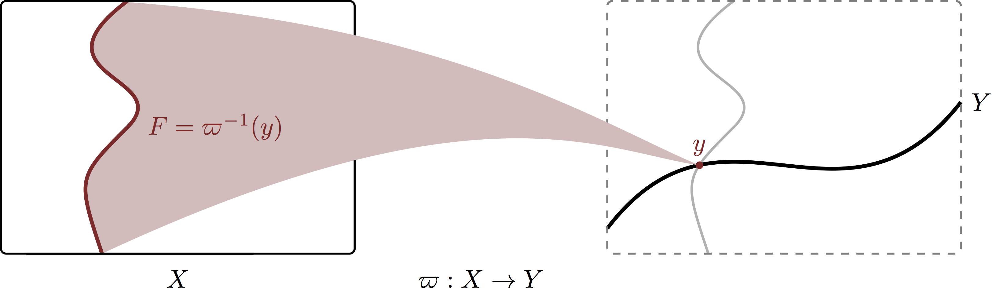
<br><br>

The total space then decomposes into the union of these fibers,
$$
X = \cup_{y \in Y} F(y),
$$

<br><br>
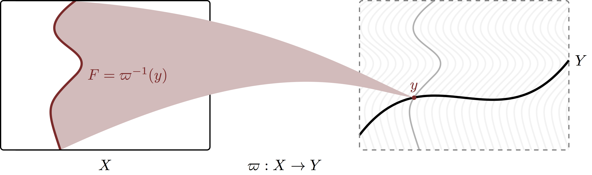
<br><br>

which then collapse to the base space under the projection operator.
Moreover, under reasonable conditions the fibers will all be copies of a common 
_fiber space_, $F$ regardless of the base point, 
$$
F(y) = F, \forall y \in Y.
$$

Under those same reasonable conditions, a $\sigma$-algebra on $X$ naturally 
defines a $\sigma$-algebra on $Y$ and the projection operator is measurable with 
respect to the two.  Consequently any _joint probability distribution_ on $X$ 
will transform into a unique _marginal probability distribution_ on $Y$.  More 
commonly we say that we _marginalize out_ the fibers,
$$
\mathbb{P}_{\pi_{*}} [ B ]
=
\mathbb{P}_{\pi} [ \varpi^{-1}(B)],
$$
where
$$
\varpi^{-1}(B) = \cup_{y \in B} F(y).
$$

<br><br>
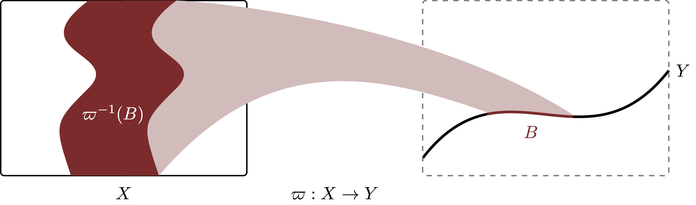
<br><br>

By pushing a probability distribution on $X$ along the projection operator we
compress all of the probability along the fibers onto the corresponding base 
points and lose all of the information about how probability is distributed 
along the fibers themselves.

This process is a bit more straightforward when we are dealing with a product
space, $X \times Y$, where each point can be identified with the components
$(x, y)$.  Any such product space is naturally equipped with the _component
projection operators_ 
$$
\begin{alignat*}{6}
\varpi_{X} :\; &X \times Y& &\rightarrow& \; &X&
\\
&(x, y)& &\mapsto& &x&
\end{alignat*}
$$
and
$$
\begin{alignat*}{6}
\varpi_{Y} :\; &X \times Y& &\rightarrow& \; &Y&
\\
&(x, y)& &\mapsto& &y&.
\end{alignat*}
$$

The $X$-projection $\varpi_{X} : X \times Y \rightarrow X$ compresses all points
in the product space with the same $X$-component to the corresponding point in
$X$, loosing all information about the $Y$-components.  Consequently every fiber
is a copy of $Y$,
$$
F(x) = \varpi_{X}^{-1}(x) = Y.
$$
<br><br>
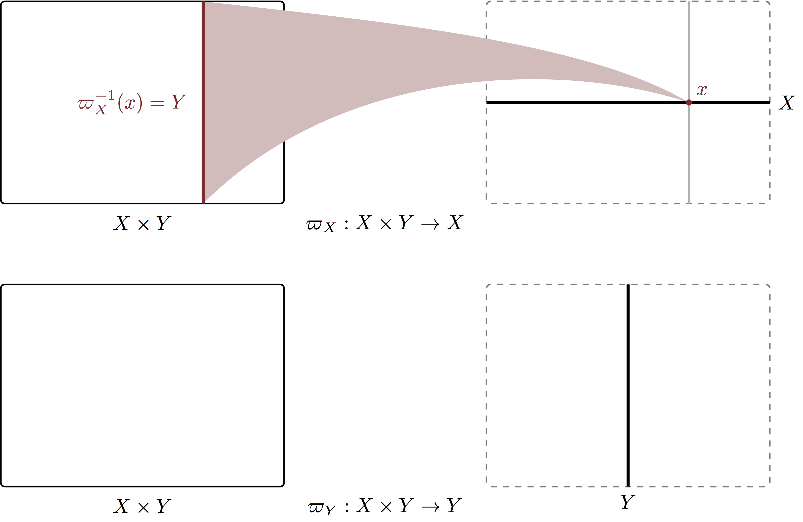
<br><br>

In particular the product space decomposes into the union of many copies of $Y$.
<br><br>
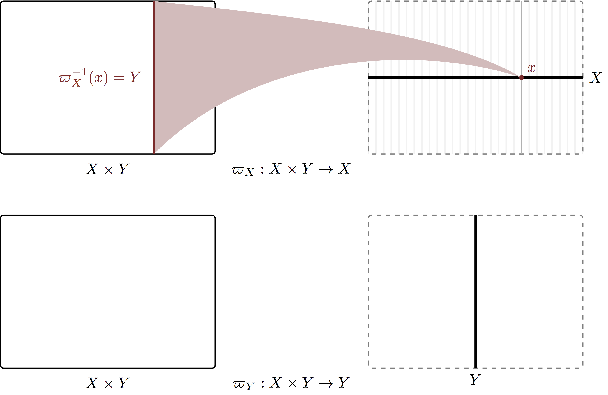
<br><br>

At the same time the $Y$-projection $\varpi_{Y} : X \times Y \rightarrow Y$ 
compresses all points in the product space with the same $Y$-component to the
corresponding point in $Y$, loosing all information about the $X$-components.  
Every fiber with respect to the $Y$_projection is then copy of $X$,
$$
F(y) = \varpi_{Y}^{-1}(y) = X.
$$
<br><br>

<br><br>

Consequently the product space _also_ decomposes into the union of many copies
of $X$!
<br><br>
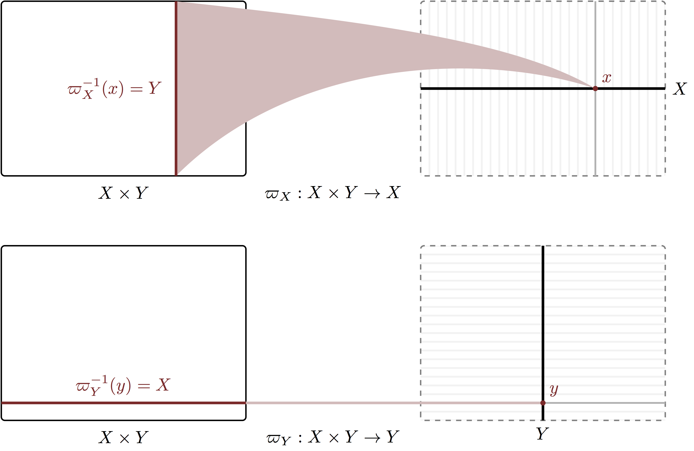
<br><br>

Pushing a distribution defined on $X \times Y$ forwards along $\varpi_{X}$
compresses all probability along $Y$ to give a marginal probability distribution 
over $X$ defined by
$$
\mathbb{P}_{\pi_{X*}} [ B ]
=
\mathbb{P}_{\pi} [ \varpi^{-1}_{X}(B) ]
$$
Equivalently, pushing that same distribution forwards along 
$\varpi_{Y}$ compresses all probability along $X$ to give a marginal probability 
distribution over $Y$ defined by
$$
\mathbb{P}_{\pi_{Y*}} [ B ]
=
\mathbb{P}_{\pi} [ \varpi^{-1}_{Y}(B) ]
$$

<br><br>
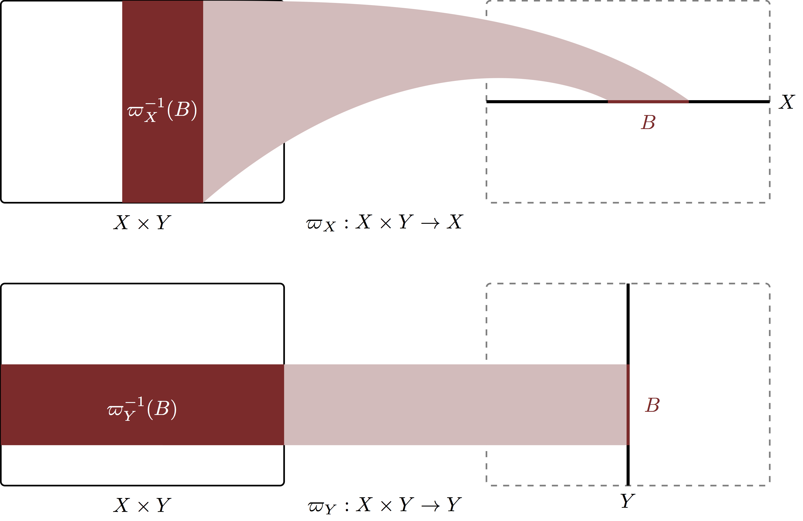
<br><br>

Consider, for example, the three-dimensional space, $\mathbb{R}^{3}$, whose
component spaces we typically denote _axes_ with the labels $X$, $Y$, and $Z$,
$$
\mathbb{R}^{3} 
= \mathbb{R} \times \mathbb{R} \times \mathbb{R}
= X \times Y \times Z.
$$
The coordinate functions serve as projection operators onto the three axes;
for example the $x$ coordinate identifies the position in $X$.  Marginalizing 
out $X$ transforms a probability distribution over $X \times Y \times Z$ into a 
probability distribution over the two-dimensional space, 
$Y \times Z = \mathbb{R}^{2}$.  Further marginalizing out $Y$ then gives a 
probability distribution over the one-dimensional space, $Z = \mathbb{R}$.

# Conditional Probability Distributions

Projection operators allow us to transform a probability distribution over a 
space to a probability distribution on some lower-dimensional subspace.  Is it 
possible, however, to go the other way?  Can we take a given marginal 
probability distribution on a subspace and construct a joint probability 
distribution on the total space that pushes forward back to that marginal?  We 
can if we define a probability distribution over all of the fibers in order to
specify the information lost in the compression to the marginal distribution.

A _conditional probability distribution_ defines a probability distribution over
each fiber,
$$
\begin{alignat*}{6}
\mathbb{P}_{F \mid Y} :\; &\mathcal{F} \times Y& &\rightarrow& \; &[0, 1]&
\\
&(B, y)& &\mapsto& &\mathbb{P}_{F \mid Y} [B, y]&.
\end{alignat*}
$$
where $\mathcal{F}$ is the induced $\sigma$-algebra over the fiber space under
the usual regularity conditions on the projection operator that we've been
assuming.

<br><br>
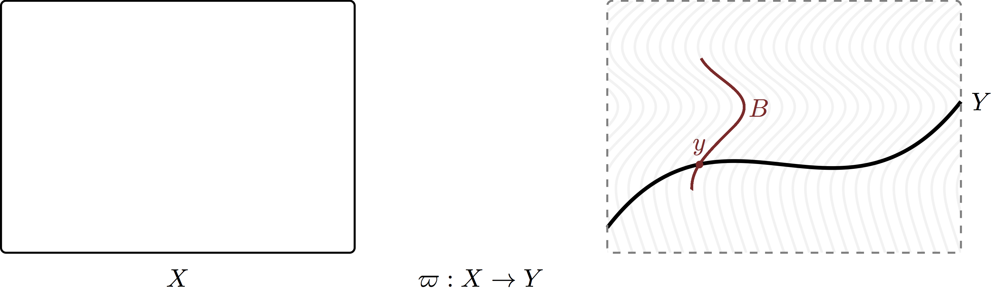
<br><br>

Evaluated at any $y \in Y$ the conditional probability distribution defines
a probability distribution over the corresponding fiber.  On the other hand, 
when evaluated at a given subset $B \in \mathcal{F}$ the conditional 
probability distribution becomes a measurable function from $Y$ into $[0, 1]$ 
that quantifies how the probability of that set varies as we move from one fiber 
to the next.

Together with a marginal distribution, $\pi_{Y}$, we can then implicitly define 
a _joint probability distribution_ over the total space by specifying the
probability of any set on $X$.  First we decompose the set along the fibers by
taking its intersection with each fiber.

<br><br>
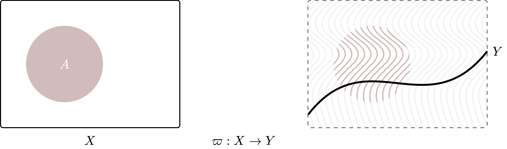
<br><br>

We can then compute the probability allocated to each of these intersections 
using the conditional probability distribution,
$$
p(y) = \mathbb{P}_{F \mid Y} [A \cap \varpi^{-1} (y), y]
$$

<br><br>
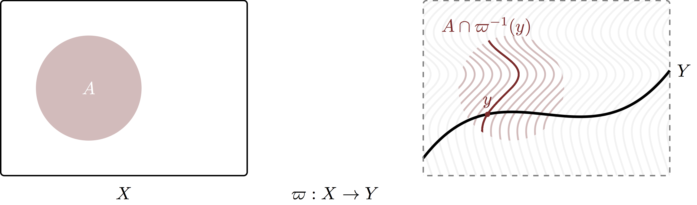
<br><br>

This yields a real-valued function on the base space, $p : Y \rightarrow [0, 1]$
and in order to aggregate all of these probabilities together to compute the 
total probability allocated to the set $A$ we take the expectation of this 
function,
$$
\begin{align*}
\mathbb{P}_{X} [ A ]
&=
\mathbb{E}_{Y} [ p(y) ]
\\
&=
\mathbb{E}_{Y} [ \mathbb{P}_{F \mid Y} [A \cap \varpi^{-1} (y), y] ].
\end{align*}
$$
The induced joint distribution on the total space is consistent in the sense
that if we push it forward along the projection operator we recover the input
marginal distribution with which we started.

To reinforce these ideas let's consider how conditional probability 
distributions manifest on a product space, $X \times Y$ with respect to the 
$Y$-projection $\varpi: X \times Y \rightarrow Y$.  As we saw in the previous
section, in this case the fiber space is $X$.

The conditional probability distribution here is a set of probability 
distributions over $X$ indexed by the base point $y \in Y$,
$$
\begin{alignat*}{6}
\mathbb{P}_{X \mid Y} :\; &\mathcal{X} \times Y& &\rightarrow& \; &[0, 1]&
\\
&(B, y)& &\mapsto& &\mathbb{P}_{X \mid Y}[B, y]&.
\end{alignat*}
$$

<br><br>
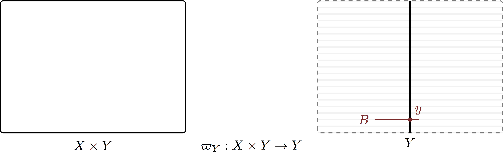
<br><br>

We can use this probability distribution to _lift_ a marginal distribution on
$Y$ to a joint distribution on $X \times Y$ implicitly by providing 
probabilities to any well-behaved subset $A$ of $X \times Y$ in three steps.
First we decompose $A$ into stripes formed by intersecting $A$ with each fiber.

<br><br>
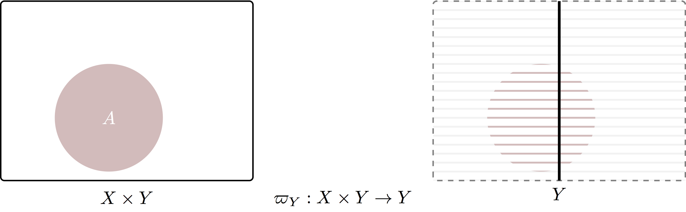
<br><br>

We then compute the probability allocated to each of these intersections using
the conditional probability distribution,
$$
p(y) = \mathbb{P}_{X \mid Y} [A \cap \varpi^{-1} (y), y]
$$

<br><br>
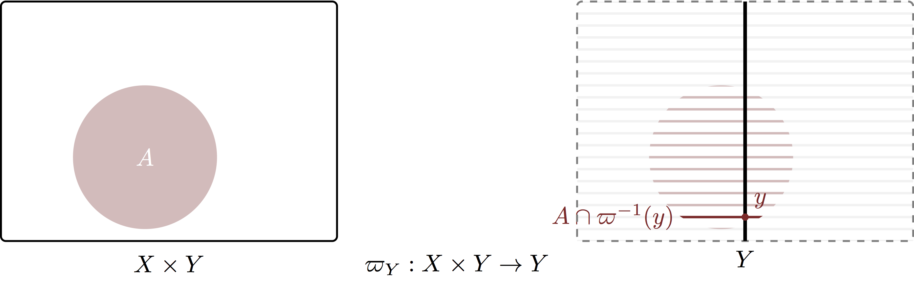
<br><br>

Finally we aggregate these fiber probabilities together into a total probability
on the joint space by taking an expectation,
$$
\begin{align*}
\mathbb{P}_{X \times Y} [ A ]
&=
\mathbb{E}_{Y} [ p(y) ]
\\
&=
\mathbb{E}_{Y} [ \mathbb{P}_{X \mid Y} [A \cap \varpi^{-1} (y), y] ].
\end{align*}
$$

# Representations of Conditional Probability Distributions

Because conditional probability distributions are just collections of regular
probability distributions they admit the similar representations.  We just have
to allow those representations to vary with the conditioning base point.  To
avoid some technical subtleties we'll limit our consideration here to product
spaces, $X \times Y$.

## Conditional Probability Mass Functions

When the components spaces $X$ and $Y$ are discrete we can represent the
conditional probability distributions with _conditional probability mass 
functions_.  

For example, a conditional probability mass function with respect to the 
$X$-projection is defined as
$$
\begin{alignat*}{6}
\pi_{Y \mid X} :\; &Y \times X& &\rightarrow& \; &[0, 1]&
\\
&(y, x)& &\mapsto& &\pi_{Y \mid X} (y \mid x)&.
\end{alignat*}
$$
Giving a probability mass function for the marginal distribution, $\pi_{X}(x)$,
we can immediately construct a probability mass function for the corresponding
joint distribution as
$$
\pi_{X \times Y} (x, y) = \pi_{Y \mid X} ( y \mid x ) \pi_{X} (x).
$$

Similarly, a conditional probability mass function with respect to the
$Y$-projection is defined as
$$
\begin{alignat*}{6}
\pi_{X \mid Y} :\; &X \times Y& &\rightarrow& \; &[0, 1]&
\\
&(x, y)& &\mapsto& &\pi_{X \mid Y} (x \mid y)&.
\end{alignat*}
$$
Giving a probability mass function for the marginal distribution, $\pi_{Y}(y)$,
we can immediately construct a probability mass function for the corresponding
joint distribution as
$$
\pi_{X \times Y} (x, y) = \pi_{X \mid Y} ( x \mid y ) \, \pi_{Y} (y).
$$

We have two different ways to decompose joint distribution over a binary product 
space into a conditional distribution and a marginal distribution, but these
two decompositions are not independent.  _Bayes' Theorem_ defines a relationship
between these two decompositions, allowing us to reconstruct one from another.

The manifestation of Bayes' Theorem for probability mass functions follows from
identifying the two different decompositions of the joint probability mass 
function,
$$
\begin{align*}
\pi_{X \times Y} (x, y) &= \pi_{X \times Y}(x, y)
\\
\pi_{Y \mid X} ( y \mid x ) \, \pi_{X} (x)
&=
\pi_{X \mid Y} ( x \mid y ) \, \pi_{Y} (y),
\end{align*}
$$
which we can manipulate to give
$$
\pi_{Y \mid X} ( y \mid x ) = 
\frac{ \pi_{X \mid Y} ( x \mid y ) \, \pi_{Y} (y) }{ \pi_{X} (x) }
$$
or
$$
\pi_{X \mid Y} ( x \mid y ) = 
\frac{ \pi_{Y \mid X} ( y \mid x ) \, \pi_{X} (x) }{ \pi_{Y} (y) }.
$$
In words, given the marginal probability mass functions we can recover any
conditional probability mass function from the other.

## Conditional Probability Density Functions {#sec:conditional_densities}

Equivalently, when the components spaces $X$ and $Y$ are subsets of the real
numbers we can represent the conditional probability distributions with 
_conditional probability density functions_.  

For example, a conditional probability density function with respect to 
the $X$-projection is defined as
$$
\begin{alignat*}{6}
\pi_{Y \mid X} :\; &Y \times X& &\rightarrow& \; &[0, 1]&
\\
&(y, x)& &\mapsto& &\pi_{Y \mid X} (y \mid x)&.
\end{alignat*}
$$
Giving a probability density function for the marginal distribution, 
$\pi_{X}(x)$, we can immediately construct a probability density function for 
the corresponding joint distribution as
$$
\pi_{X \times Y}(x, y) = \pi_{Y \mid X} ( y \mid x ) \, \pi_{X} (x).
$$

Similarly, a conditional probability density function with respect to the 
$Y$-projection is defined as
$$
\begin{alignat*}{6}
\pi_{X \mid Y} :\; &X \times Y& &\rightarrow& \; &[0, 1]&
\\
&(x, y)& &\mapsto& &\pi_{X \mid Y} (x \mid y)&.
\end{alignat*}
$$
Giving a probability density function for the marginal distribution, 
$\pi_{Y}(y)$, we can immediately construct a probability density function for 
the corresponding joint distribution as
$$
\pi_{X \times Y} (x, y) = \pi_{X \mid Y} ( x \mid y ) \, \pi_{Y} (y).
$$

The manifestation of Bayes' Theorem for probability density functions follows 
from identifying the two different decompositions of the joint probability 
density function,
$$
\begin{align*}
\pi_{X \times Y} (x, y) &= \pi_{X \times Y} (x, y)
\\
\pi_{Y \mid X} ( y \mid x ) \, \pi_{X} (x)
&=
\pi_{X \mid Y} ( x \mid y ) \, \pi_{Y} (y),
\end{align*}
$$
which we can manipulate to give
$$
\pi_{Y \mid X} ( y \mid x ) = 
\frac{ \pi_{X \mid Y} ( x \mid y ) \, \pi_{Y} (y) }{ \pi_{X} (x) }
$$
or
$$
\pi_{X \mid Y} ( x \mid y ) = 
\frac{ \pi_{Y \mid X} ( y \mid x ) \, \pi_{X} (x) }{ \pi_{Y} (y) }.
$$
In words, given the marginal probability density functions we can recover any
conditional probability density function from the other.

For example, a joint Gaussian probability density function on $\mathbb{R}^{2}$ 
is given by
$$
\pi(x, y) =
\frac{1}{2 \pi \sigma_{x} \sigma_{y} \sqrt{1 - \rho^{2}} }
\exp \left[
- \frac{1}{2} \frac{1}{1 - \rho^{2}}
\left( \left( \frac{ x - \mu_x }{\sigma_{x}} \right)^{2}
- 2 \rho \frac{x - \mu_x}{\sigma_{x}} \frac{y - \mu_y}{\sigma_{y}}
+ \left( \frac{y - \mu_y}{\sigma_{y}} \right)^{2} \right)
\right],
$$

<br><br>
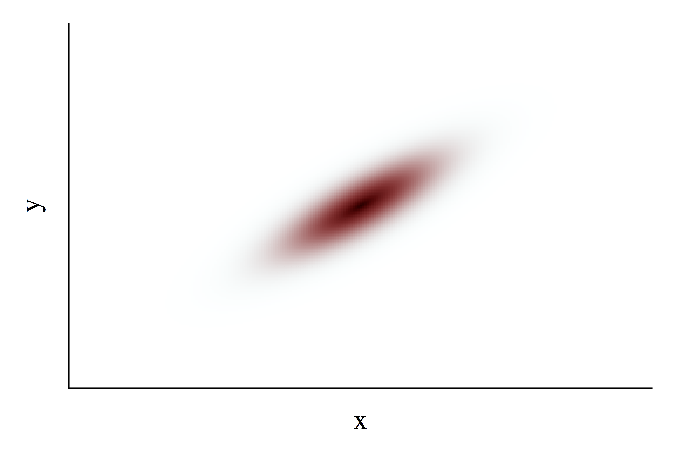
<br><br>

The probability density function for the marginal distribution on $x$
is given by
$$
\begin{align*}
\pi(x) 
&=
\int \mathrm{d}x \, \pi(x, y)
\\
&=
\frac{1}{\sqrt{2\pi \sigma_{x}^{2}}}
\exp \left[ - \frac{1}{2} \left( \frac{x - \mu_x}{\sigma_{x}} \right)^{2} \right]
\end{align*}
$$

<br><br>
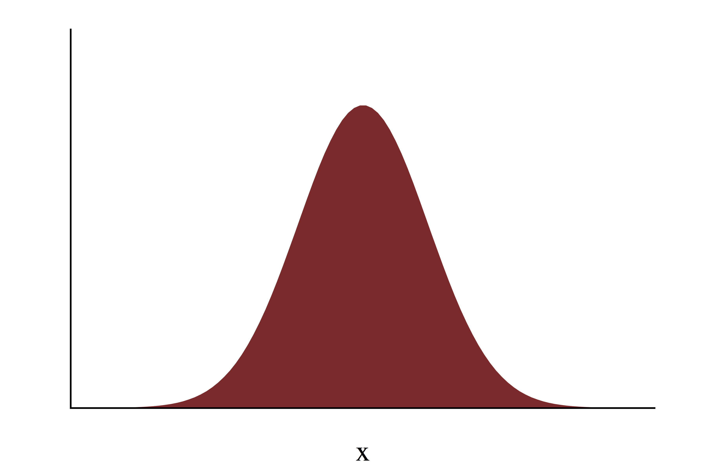
<br><br>

with the corresponding conditional probability density function on $y$ given by
$$
\pi(y \mid x) =
\frac{1}{ \sqrt{ 2 \pi \sigma_{y}^{2} (1 - \rho^{2}) } }
\exp \left[
- \frac{1}{2} \frac{1}{\sigma_{y}^{2} (1 - \rho^{2})}
\left( y - \mu_y - \frac{\sigma_{y}}{\sigma_{x}} \rho (x - \mu_x) \right)^{2}
\right].
$$

<br><br>
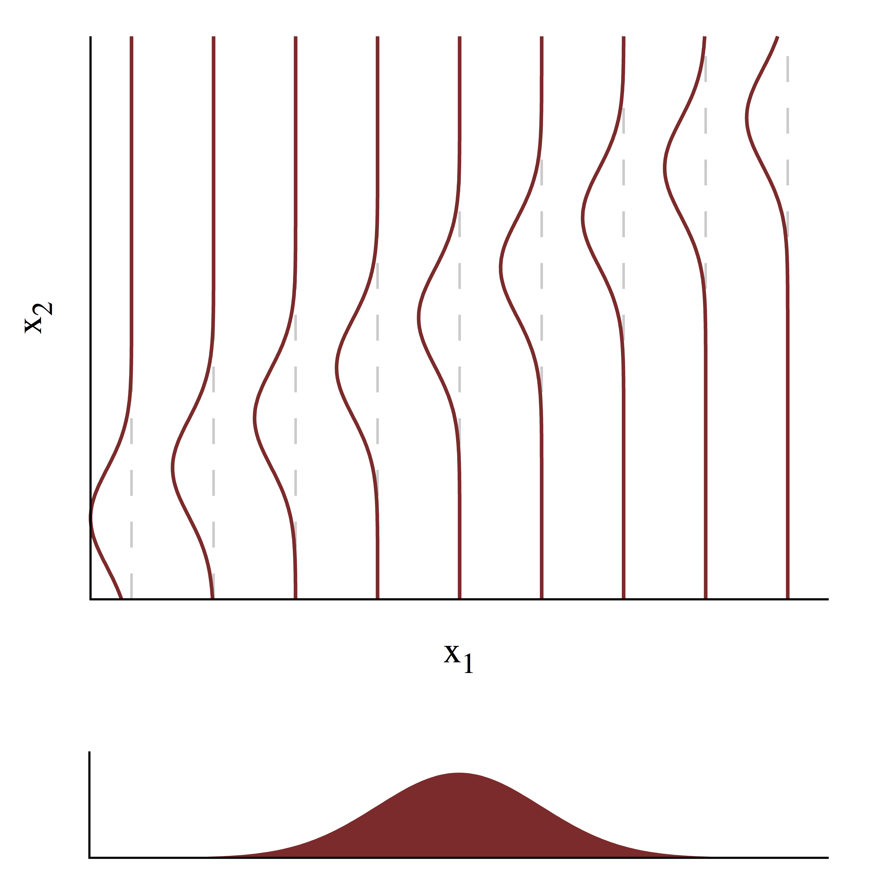
<br><br>

With a little bit of algebra one can show that Bayes' Theorem gives
$$
\begin{align*}
\pi(x \mid y) 
&=
\frac{ \pi(y \mid x) \pi(x) }{ \pi_{y} }
\\
&=
\pi(x \mid y) =
\frac{1}{ \sqrt{ 2 \pi \sigma_{x}^{2} (1 - \rho^{2}) } }
\exp \left[
- \frac{1}{2} \frac{1}{\sigma_{x}^{2} (1 - \rho^{2})}
\left( x - \mu_x - \frac{\sigma_{x}}{\sigma_{y}} \rho (y - \mu_y) \right)^{2}
\right].
\end{align*}
$$

## Mixed Representations
 
When the fiber space is discrete and the base space is real, or vice versa, a 
probability distribution on the total space admits a _mixed representation_ 
comprised of a product of a conditional probability mass function and a 
marginal probability density function, or vice versa.  

For example, a discrete fiber with a real base space defines a probability
distribution over a joint product space that contains _both_ discrete and 
continuous properties.  Because discrete and real representations both take the 
form of functions, these mixed representations are straightforward to construct 
and utilize when computing probabilities and expectations on the total space.
We just have to be careful to sum when appropriate and integrate when 
appropriate.

## Sampling From Conditional Distributions {#sec:conditional_samples}

A sample from a joint probability distribution on the total space defines a 
sample for the marginal probability distribution on the base space once the 
sample has been passed through projection operator,
$$
\left\{ \varpi(x), \ldots, \varpi(x_{N}) \right\}.
$$

<br><br>
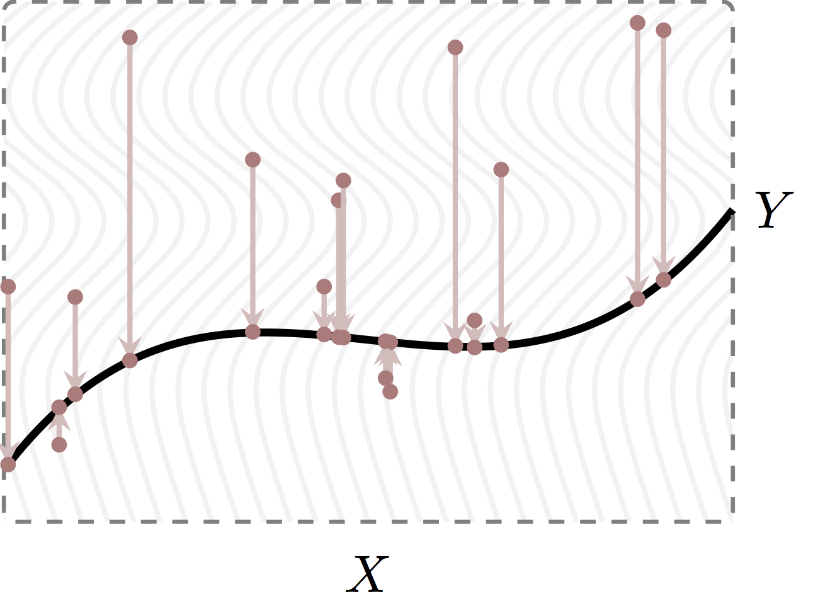
<br><br>

A sample from the total space, however, will not in general contain enough 
information to construct a sample from a conditional probability distribution
over a specific fiber.  The problem is that in most cases the joint sample will 
have a vanishingly small probability of falling into a given fiber. 

<br><br>
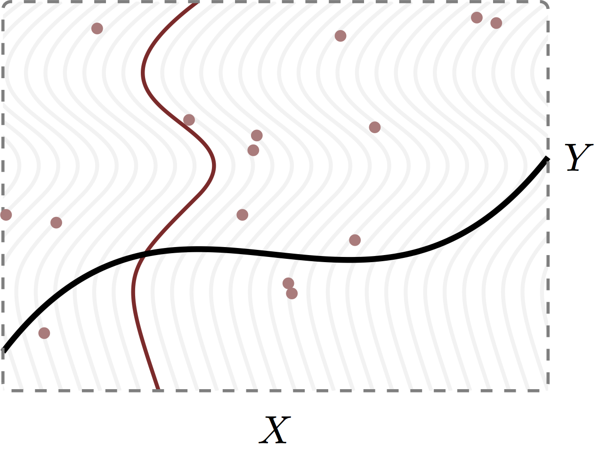
<br><br>

Instead we have to first condition on a particular fiber and then generate 
samples from the corresponding probability distribution.

For example, to sample from a conditional distribution that admits a Gaussian
probability density function in `R` we can do 
```{r}
mu_x <- 0
sigma_x <- 1
x <- 2

mu_y <- 0
sigma_y <- 1

rho <- 0.8

cond_mu <- mu_y + (sigma_y / sigma_x) * rho * (x - mu_x)
cond_sigma <- sigma_y * sqrt(1 - rho * rho)

N <- 10000
cond_samples <- rnorm(N, cond_mu, cond_sigma)

c_light <- c("#DCBCBC")
c_light_highlight <- c("#C79999")
c_mid <- c("#B97C7C")
c_mid_highlight <- c("#A25050")
c_dark <- c("#8F2727")
c_dark_highlight <- c("#7C0000")

x <- seq(-8, 8, 0.001)

plot(x, dnorm(x, cond_mu, cond_sigma), type="l", col=c_dark_highlight, lwd=2,
     xlab="x", ylab="Probability Density",
     cex.lab=1.5, cex.axis=1.5, cex.main=1.5, cex.sub=1.5, yaxt='n')

hist(cond_samples, breaks=seq(-8, 8, 0.1), 
     col=c_dark, border=c_mid_highlight, probability=T, add=T)
```

We can then use the conditional samples to compute conditional expectations,
such as conditional means
```{r}
identity <- function(y) {
  return(y)
}

cond_mean <- function(x, mu_x, sigma_x, mu_y, sigma_y) {
  cond_mu <- mu_y + (sigma_y / sigma_x) * rho * (x - mu_x)
  cond_sigma <- sigma_y * sqrt(1 - rho * rho)
  (mean(identity(rnorm(10000, cond_mu, cond_sigma))))
}

x <- seq(-8, 8, 0.001)
mu_y_x <- sapply(x, function(p) cond_mean(p, mu_x, sigma_x, mu_y, sigma_y))

plot(x, mu_y_x, type="l", col=c_dark_highlight, lwd=2,
     xlab="x", ylab="Conditional Mean of Y Given X",
     cex.lab=1.5, cex.axis=1.5, cex.main=1.5, cex.sub=1.5, yaxt='n')
```

## Extra Credit: Bayes' Theorem

Bayes' Theorem is much deeper than its manifestation as a relationship between
probability mass functions or probability density functions.  Formally it 
provides a way of _updating_ marginal distributions into conditional 
distributions on a product space, giving a way to unfurl the probability at a 
base point across the corresponding fiber.

At a fundamental Bayes' Theorem defines a relationship between _marginal 
expectations_ and _conditional expectations_.  For example,
$$
\mathbb{E}_{\pi_{X}}[\lambda(x, y) \cdot f(x)] 
= \mathbb{E}_{\pi_{X \mid Y}}[f(x)],
$$
where the function $\lambda$ is given by the Radon-Nikodym derivative
$$
\lambda(x, y) =
\frac{ \mathrm{d} \pi_{Y \mid X} }{ \mathrm{d} \pi_{Y} } (x, y).
$$
At the same time
$$
\mathbb{E}_{\pi_{Y}}[\kappa(x, y) \cdot g(y)] 
= \mathbb{E}_{\pi_{Y \mid X}}[g(y)],
$$
where
$$
\kappa(x, y) =
\frac{ \mathrm{d} \pi_{X \mid Y} }{ \mathrm{d} \pi_{X} } (x, y).
$$ 

This formal result clarifies that Bayes' Theorem defines how a marginal 
distribution is updated to a conditional distribution based on information
about the corresponding fiber.

Deriving the manifestation of Bayes' Theorem for representations from this
formal result is straightforward once the expectations are replaced by the
appropriate calculations.  For example, on a discrete space we have
$$
\begin{align*}
\mathbb{E}_{\pi_{X}}
[ \frac{ \mathrm{d} \pi_{X \mid Y} }{ \mathrm{d} \pi_{Y} } (x, y)\cdot f(x)] 
&= 
\mathbb{E}_{\pi_{X \mid Y}}[f(x)]
\\
\mathbb{E}_{\pi_{X}}
[ \frac{ \pi_{X \mid Y} (x, y) }{ \mathrm{d} \pi_{Y} (y) } \cdot f(x)] 
&= 
\mathbb{E}_{\pi_{X \mid Y}}[f(x)]
\\
\sum_{x \in X} \pi_{X}(x) 
\frac{ \pi_{X \mid Y} (x, y) }{ \mathrm{d} \pi_{Y} (y) } f(x)
&= 
\sum_{x \in X} \pi_{X \mid Y} (x, y) \, f(x)
\end{align*}
$$
which is true for any $f$ if and only if
$$
\pi_{X \mid Y} (x, y)
=
\pi_{X}(x) \frac{ \pi_{X \mid Y} (x, y) }{ \mathrm{d} \pi_{Y} (y) }.
$$

Similarly for real spaces,
$$
\begin{align*}
\mathbb{E}_{\pi_{X}}
[ \frac{ \mathrm{d} \pi_{X \mid Y} }{ \mathrm{d} \pi_{Y} } (x, y)\cdot f(x)] 
&= 
\mathbb{E}_{\pi_{X \mid Y}}[f(x)]
\\
\mathbb{E}_{\pi_{X}}
[ \frac{ \pi_{X \mid Y} (x, y) }{ \mathrm{d} \pi_{Y} (y) } \cdot f(x)] 
&= 
\mathbb{E}_{\pi_{X \mid Y}}[f(x)]
\\
\int \mathrm{d} x \, \pi_{X}(x) 
\frac{ \pi_{X \mid Y} (x, y) }{ \mathrm{d} \pi_{Y} (y) } f(x)
&= 
\int \mathrm{d} x \, \pi_{X \mid Y} (x, y) \, f(x)
\end{align*}
$$
which is true for any $f$ if and only if
$$
\pi_{X \mid Y} (x, y)
=
\pi_{X}(x) \frac{ \pi_{X \mid Y} (x, y) }{ \mathrm{d} \pi_{Y} (y) }.
$$

# Applications of Conditional Probability Theory

Ultimately it is conditional probability theory that provides the versatility to 
make probability theory an invaluable tool in applied problems.  

## Generative Modeling

Conditional probability distributions are critical when we want to construct 
sophisticated probability distributions over high-dimensional spaces.
By reducing the specification of the ungainly joint probability distribution
to a sequence of lower-dimensional conditional probability distributions and
marginal probability distributions we can more easily reason about the structure
of the distribution and better incorporate domain expertise.  

This method of constructing a joint distribution from intermediate conditional 
probability distributions is known as _generative_ modeling.  A generative model
might begin with only a few variables, but additional variables can then be 
introduced to expand the initial model into a higher-dimensional space.  Each
sequential addition affords the opportunity to analyze and understand the 
intermediate model before adding more complexity.

<br><br>
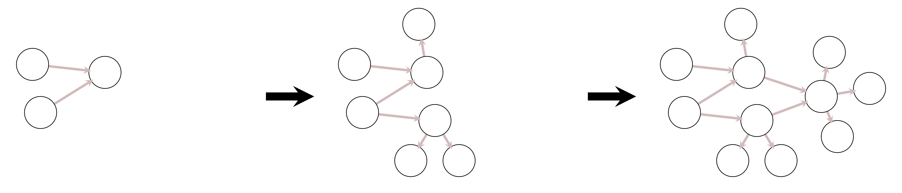
<br><br>

Here circles denote collections of variables while arrows denote conditional 
dependencies between those collections that would be specified by a particular
conditional probability distribution function.  A joint distribution that can be
decomposed into distributions for individual variables in this way is also known
as a _graphical model_.

At the same time we can exploit conditional probability theory to build a joint
distribution in reverse.  Here we start with a marginal distribution over some
variables before replacing the marginal distribution with a distribution 
conditioned on new variables.  We can then iterate, at each stage replacing the 
marginal distribution with an expanded distribution.

<br><br>
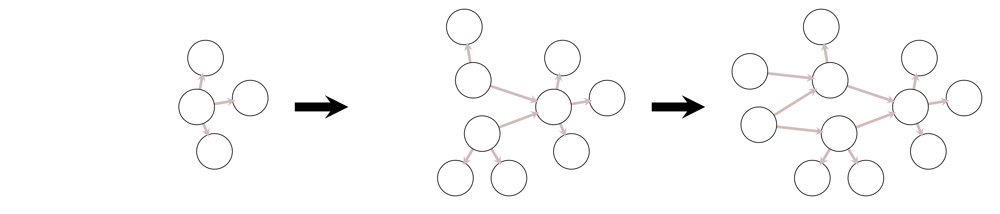
<br><br>

Conditional sampling provides an immediate method of generating samples from
generative distributions.  We simply sample from the latent marginal 
distribution and then sample from each conditional distribution in succession.
```{r}
S_x <- rnorm(N, mu_x, sigma_x)
cond_mu <- mu_y + (sigma_y / sigma_x) * rho * (S_x - mu_x)
cond_sigma <- sigma_y * sqrt(1 - rho * rho)
S_y <- rnorm(N, cond_mu, cond_sigma)

plot(S_x, S_y, col=c("#8F272720"), lwd=2, pch=16, cex=0.8,
     xlim=c(-4.5, 4.5), xlab="x", ylim=c(-4.5, 4.5), ylab="y")
```

This _ancestral sampling_ technique is particularly useful when the intermediate
conditional probability distributions are one-dimensional and admit procedures
for efficient exact sampling.

Sampling from any of the conditional distributions not part of the generative
structure, however, is more challenging as those conditional distributions have 
to be derived from Bayes' Theorem.  In these cases we often need to abandon 
exact sampling and instead focus on generating _correlated samples_ with more 
advanced techniques like Markov chain Monte Carlo.

## Bayesian Inference

Bayesian inference exploits conditional probability theory to construct a formal
procedure for learning from data.

We start with a model configuration space, $\pi(y ; \theta)$ that defines a
collection of mathematical narratives for how observations, $y$, are generated 
encoded as probability distributions indexed by parameters, $\theta$.  If we
allow probability distributions to encode information about the parameter
space, then the model configuration space also defines a conditional probability
distribution, $\pi (y \mid \theta)$ over the product space $Y \times \Theta$.

Given a an explicit observation, $\tilde{y}$, we can use Bayes' Theorem to 
update a _prior distribution_, $\pi(\theta)$, encoding domain expertise into a 
_posterior distribution_, $\pi(\theta \mid \tilde{y})$, that quantifies how 
consistent the model configurations are with both our domain expertise and the 
observed data.  Inferential queries about the observation process itself are 
then answered by expectation values of various functions.

In practice the delineation between the observational model, 
$\pi (y \mid \theta)$, and the prior, $\pi(\theta)$, is not always distinct and
it is often easier to reason about the joint model,
$$
\pi(y, \theta) = \pi(y \mid \theta) \, \pi(\theta).
$$
Simulating data from this joint model is then a straightforward application of
ancestral sampling through the prior and then the observation model.

Generating samples from the posterior to approximate expectations is much more
subtle.  In practice we typically rely on Markov chain Monte Carlo to generate
posterior samples, or other computational methods entirely.

# Conclusion

As we saw in the [previous case study](probability_theory.html) probability
distributions can encode useful information in many practical applications.
What our initial coverage of probability theory doesn't tell us how to do,
however, is _construct_ those probability distributions to encode specific
information in the first place.  It's only with the introduction of conditional
probability theory that we have the tools needed to develop probability
distributions that encode the principled information we need to deploy them in
practice.

# Acknowlegements

I thank Aki Vehtari for helpful comments and everyone who has attended my 
courses, especially those who contributed feedback.

A very special thanks to everyone supporting me on Patreon: Aki Vehtari, Austin 
Rochford, Bo Schwartz Madsen, Cat Shark, Charles Naylor, Colin Carroll, Daniel 
Simpson, David Pascall, David Roher, Elad Berkman, Finn Lindgren, Granville 
Matheson, Hernan Bruno, J Michael Burgess, Joel Kronander, Jonas Beltoft 
Gehrlein, Joshua Mayer, Justin Bois, Lars Barquist, Marek Kwiatkowski, Maurits 
van der Meer, Maxim Kesin, Michael Dillon, Ole Rogeberg, Oscar Olvera, 
Riccardo Fusaroli, Richard Torkar, Sam Petulla, Sam Zorowitz, Seo-young Kim, 
Seth Axen, Simon Duane, Stephen Oates, Stijn, and Vladislavs Dovgalecs.

# Original Computing Environment

```{r}
writeLines(readLines(file.path(Sys.getenv("HOME"), ".R/Makevars")))
```
