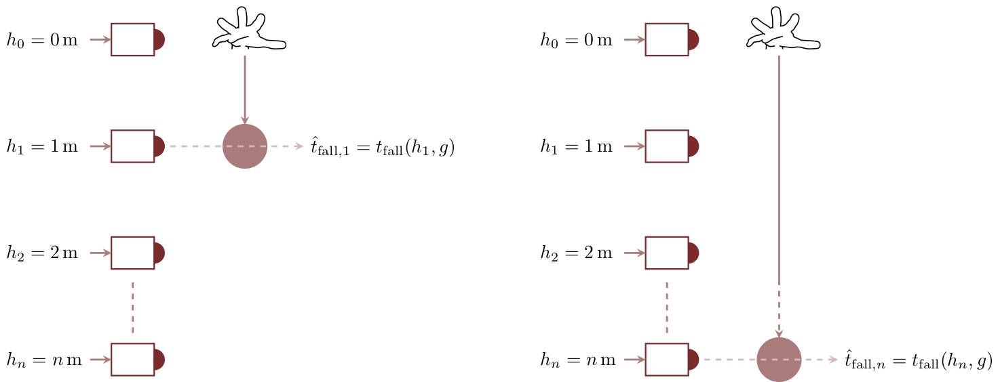
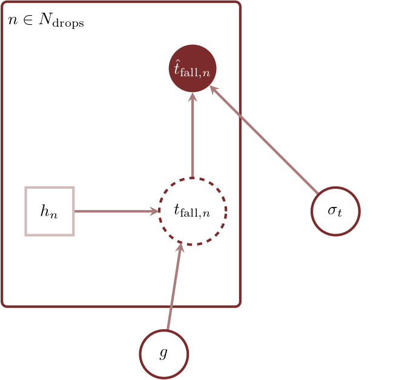
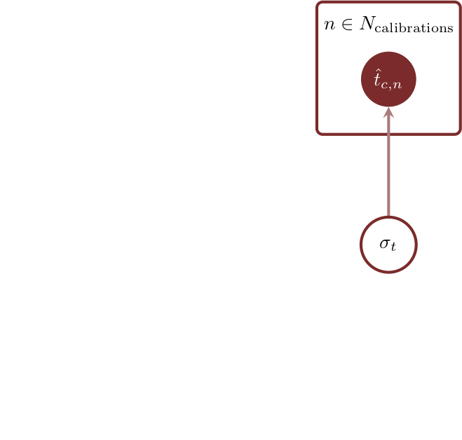
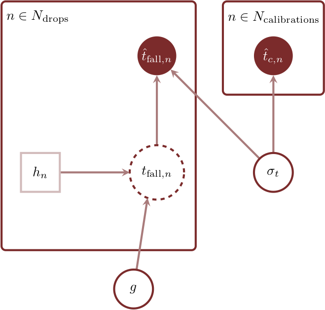
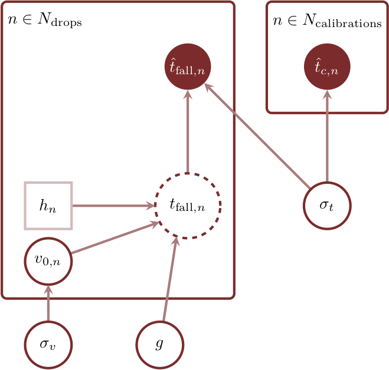
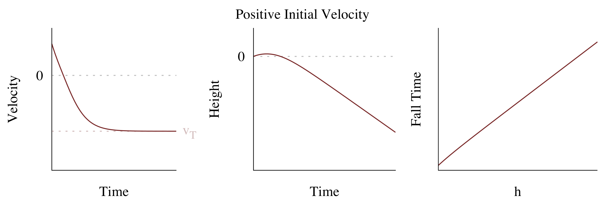
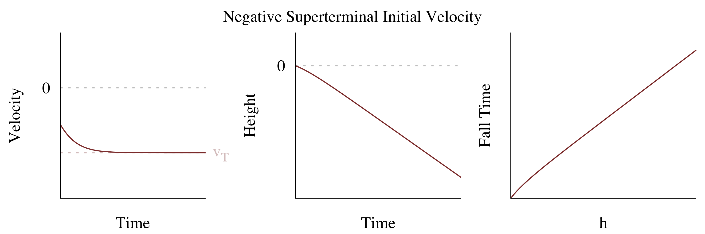
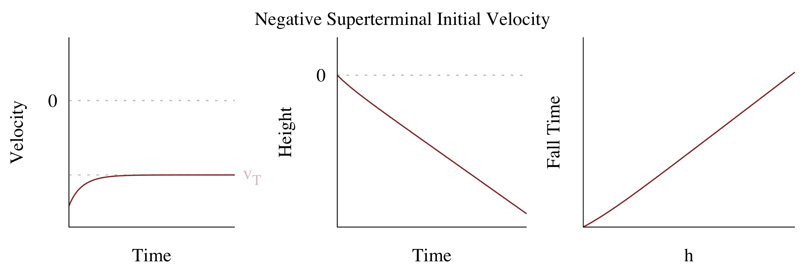
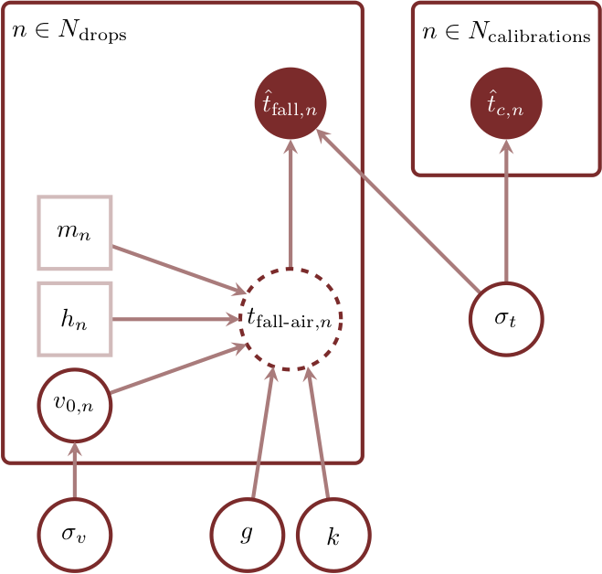

```{r setup, include=FALSE}
knitr::opts_chunk$set(comment=NA)
```

The concept of measurement and inference is often introduced through what are
_supposed_ to be simple experiments, such as inferring gravity from the time it
takes objects to fall from various heights.  The _realizations_ of these
experiments in practice, however, are often much more complex than their
idealized designs imply, and any principled statistical analysis will have to go
into much more detail than one might expect.

At the same time these simple experiments can provide an elegant demonstration
of many of they key concepts of a principled Bayesian workflow where an initial
model based on the theoretical experimental design is continuously expanded to
capture all of the important features exhibited by the realization of the
experiment.  In this case study I attempt to infer the local gravitational
acceleration from falling ball measurements, along the way illustrating
strategies for identifying model defects and motivating principled model
development.

# Experimental Design

As with most introductory experiments, our experimental design is relatively
straightforward.  The experiment begins with a round ball held above an array of
evenly-spaced detectors that record when an object passes through their line
of sight.

<center>
<br>
```{r, out.width = "25%", echo=FALSE}
knitr::include_graphics("figures/experiment/setup.png")
```
<br><br>
</center>

At $t = 0$ the ball is released and begins to fall under the influence of
gravity.  The time at which the ball reaches each detector is recorded as the
ball falls, providing what should be enough information to infer the
gravitational acceleration.

<center>
<br>
```{r, out.width = "75%", echo=FALSE}

```
<br><br>
</center>

This procedure is repeated 200 times for one particularly heavy rubber ball and
then for another 200 times with a much lighter, styrofoam ball.  Our first
objective is to model the data for the heavy ball.

# Exploratory Data Analysis

Before considering our initial model let's take a look at the data to get a feel
for how the observations evolve with height.  The right time for exploratory
data analysis is a somewhat contentious issue as we have to make sure not to
impose too many insights into our initial model lest we risk overfitting to this
particular data set.  Here we're just hoping to get a superficial perspective
on the structure of the measurement and so I'm not worried about taking a look
this early, but there's little harm in waiting to look at the data until after
the initial model has been built _provided that you have a strong understanding
of the experimental design_.

First let's set up our `rstan` environment

```{r}
library(rstan)
rstan_options(auto_write = TRUE)
options(mc.cores = parallel::detectCores())

util <- new.env()
source('stan_utility.R', local=util)

c_light <- c("#DCBCBC")
c_light_highlight <- c("#C79999")
c_mid <- c("#B97C7C")
c_mid_highlight <- c("#A25050")
c_dark <- c("#8F2727")
c_dark_highlight <- c("#7C0000")

c_light_trans <- c("#DCBCBC20")
c_dark_trans <- c("#8F272720")
c_superfine <- c("#00000060")
```

and read in our initial fall data for the heavy ball.

```{r}
fall_data <- read_rdump("falling.data.R")
```

When visualizing this data it's important to maintain the relationship between
the observed fall times and the corresponding heights, as it is that sequential
structure that allows us to infer the trajectory of the ball in each drop.  One
way we can represent each drop is with a line connecting the observed times at
each height; we can then visualize the entire data set with an ensemble of
such lines.

```{r}
plot(1, type="n",
     xlab="Heights (m)", xlim=c(1, 6),
     ylab="Fall Times (s)", ylim=c(0.25, 1.25))
for (n in 1:fall_data$N_drops)
  lines(fall_data$heights, fall_data$obs_t_fall[n,], col=c_superfine)

lines(fall_data$heights, fall_data$obs_t_fall[83,], lwd=3, col=c_dark)
lines(fall_data$heights, fall_data$obs_t_fall[132,], lwd=3, col=c_mid)
lines(fall_data$heights, fall_data$obs_t_fall[191,], lwd=3, col=c_light)
```

Immediately we see a nonlinear relationship between the observed fall times
and height, with the additional time needed to fall to higher heights getting
shorter consistent with a negative acceleration.

Interestingly the observations in each drop also exhibit some systematic
structure -- the measurements for _all_ heights within a drop tend to deviate up
or down together.  This suggests that something in the realization of the
experiment may be varying from one drop to another.

# Vacuum Packed

Our initial model will be based on the kinematics of an object in free fall,
$$
t_{\text{fall}} = \frac{v_{0} + \sqrt{ v_{0}^{2} + 2 g \, h}}{g},
$$
where $v_{0}$ is the initial velocity, $g$ is the gravitational acceleration,
and $h$ is the height.  For a derivation of this equation see the
[Appendix](#sec:vacuum).

Because the ball is released from rest we set $v_{0} = 0$ and our initial timing
model becomes
$$
t_{\text{fall}} = \frac{\sqrt{2 g \, h}}{g} = \sqrt{ \frac{2 \, h}{g} }.
$$

In order to build a full observational model we need to complement this
phenomenological model with a model of the experiment itself, which in this
case requires modeling the detectors that record the time when the ball reaches
each height.  Let's presume that the timing resolution of the detectors is
sufficiently good that we can approximate it with a normal probability density
function and a common scale, $\sigma_{t}$, without having to worry about the
possibility of negative measurements.  Based on our exploratory data analysis
the validity of this approximation requires _at least_ sub-second timing
resolution.

Our observational model is then defined mathematically by
$$
\begin{align*}
t_{\text{fall}, n} &= \sqrt{ \frac{2 \, h_{n}}{g} }
\\
\hat{t}_{\text{fall}, n} &\sim \text{normal}(t_{\text{fall}, n}, \sigma_{t}).
\end{align*}
$$
We can also represent this with the probabilistic graphical model

<center>
<br>
```{r, out.width = "50%", echo=FALSE}

```
<br><br>
</center>

or the Stan program

```{r}
writeLines(readLines("fit1_obs.stan"))
```

Once we introduce a prior model for the detector resolution, $\sigma_{t}$, and
the gravitational acceleration, $g$, we can fit both simulated data and our
actual observations.

## Principled Priors

As mentioned in the previous section, the validity of our normal approximation
to the detector resolution requires that we have at least sub-second precision.
Ideally we would know much more about the resolution of our detectors from the
manufacturer, but for now let's assume that the resolution of the detectors
should be much better than sub-second and we can adopt a conservative prior that
contains our model within that precision,
$$
\sigma_{t} \sim \text{normal}(0, 0.5).
$$

Unfortunately gravity is not manufactured by a known company so we don't have
quite as much domain expertise about $g$.  Were we more experienced physicists
we could use constraints from other experiments to inform a principled prior
for the gravitational acceleration, but we don't have the luxury of that
experience here.  Instead all we have to utilize is the vague domain expertise
that the gravitational acceleration is quoted in units of meters per second
squared, which implies an order of magnitude of 1 in those units.  A
corresponding weakly informative prior might then probabilistically contain our
model to the interval
$$
0.5\,\frac{\mathrm{m}}{\mathrm{s}^{2}}
\lessapprox g \lessapprox
50\,\frac{\mathrm{m}}{\mathrm{s}^{2}}.
$$

Here I'll use an inverse gamma probability density function to specify the
shape of the weakly informative prior and set the scales by requiring that only
1% of the probability falls below 0.5 and above 50.  It's not obvious which
parameters of the inverse gamma family matches this behavior, but we can find
them numerically be exploiting `Stan`'s algebraic solver.

```{r}
writeLines(readLines("inv_gamma_tune.stan"))
```

Setting the lower and upper quantiles to 0.5 and 50, respectively, we get

```{r}
tune_data <- list("l" = 0.5, "u" = 50)

stan(file='inv_gamma_tune.stan', data=tune_data, iter=1, warmup=0, chains=1,
     seed=4838282, algorithm="Fixed_param")
```

We have to be careful, however, to ensure that this prior model isn't in
conflict with any additional domain expertise we have about the experiment
itself.  In particular we know from common experience that objects dropped from
reasonable heights, like the one to six meters used in our experiment, will take
on the order of _seconds_ to fall.  If our model predicts an excess of
significantly smaller or larger fall times then we will have to reevaluate our
prior model. 

In order to convert this vague domain expertise into something more quantitative
we have to identify exactly which interval defines "an order of magnitude of
seconds".  Here I'll take a lower bound of one tenth of a second and an upper
bound of a minute,
$$
0.1\,\mathrm{s} \lessapprox t_{\text{fall}} \lessapprox 60\,\mathrm{s},
$$
either of which seems really extreme for a body in free fall at these heights.

To evaluate our prior model in the context of our domain expertise we can
analyze the implied prior pushforward distribution of $t_{\mathrm{fall}}$
and the prior predictive distribution of $\hat{t}_{\mathrm{fall}}$ using the
samples derived from the Stan program

```{r}
writeLines(readLines("simu_prior1.stan"))
```

Let's generate an ensemble of 1000 samples.

```{r}
R <- 1000


simu_fit <- stan(file='simu_prior1.stan', data=fall_data,
                 iter=R, warmup=0, chains=1, refresh=0,
                 seed=4838282, algorithm="Fixed_param")

simu_params <- extract(simu_fit)
simu_mu_t_fall <- simu_params$mu_t_fall
simu_obs_t_fall <- simu_params$obs_t_fall
```

With the simulations in hand we can readily visualize the prior pushforward
distribution.

```{r}
probs = c(0.1, 0.2, 0.3, 0.4, 0.5, 0.6, 0.7, 0.8, 0.9)
cred <- sapply(1:length(fall_data$heights),
               function(h) quantile(simu_mu_t_fall[,,h], probs=probs))

plot(1, type="n", main="Prior Pushforward", xlab="Heights (m)", xlim=c(1, 6),
     ylab="Expected Fall Time (s)",  ylim=c(0.05, 70), log = "y")
polygon(c(fall_data$heights, rev(fall_data$heights)), c(cred[1,], rev(cred[9,])),
        col = c_light, border = NA)
polygon(c(fall_data$heights, rev(fall_data$heights)), c(cred[2,], rev(cred[8,])),
        col = c_light_highlight, border = NA)
polygon(c(fall_data$heights, rev(fall_data$heights)), c(cred[3,], rev(cred[7,])),
        col = c_mid, border = NA)
polygon(c(fall_data$heights, rev(fall_data$heights)), c(cred[4,], rev(cred[6,])),
        col = c_mid_highlight, border = NA)
lines(fall_data$heights, cred[5,], col=c_dark, lwd=2)

lines(c(0.9, 6.1), c(0.1, 0.1), lty=2, lwd=2, col="black")
lines(c(0.9, 6.1), c(60, 60), lty=2, lwd=2, col="black")
```

It looks like our domain expertise encoded in the weakly informative prior for
the gravitational acceleration already guarantees reasonable fall times.  This
prior pushforward check, however, provides additional confidence in our prior
model.

While we're here we can also analyze the prior predictive distribution to
ensure that the observational process doesn't introduce unreasonable variation
in the observations.

```{r}
cred <- sapply(1:length(fall_data$heights),
               function(h) quantile(simu_mu_t_fall[,,h], probs=probs))

plot(1, type="n", main="Prior Predictive", xlab="Heights (m)", xlim=c(1, 6),
     ylab="Observed Fall Time (s)",  ylim=c(0.05, 70), log="y")
polygon(c(fall_data$heights, rev(fall_data$heights)), c(cred[1,], rev(cred[9,])),
        col = c_light, border = NA)
polygon(c(fall_data$heights, rev(fall_data$heights)), c(cred[2,], rev(cred[8,])),
        col = c_light_highlight, border = NA)
polygon(c(fall_data$heights, rev(fall_data$heights)), c(cred[3,], rev(cred[7,])),
        col = c_mid, border = NA)
polygon(c(fall_data$heights, rev(fall_data$heights)), c(cred[4,], rev(cred[6,])),
        col = c_mid_highlight, border = NA)
lines(fall_data$heights, cred[5,], col=c_dark, lwd=2)

lines(c(0.9, 6.1), c(0.1, 0.1), lty=2, lwd=2, col="black")
lines(c(0.9, 6.1), c(60, 60), lty=2, lwd=2, col="black")
```

As expected the sub-second precision implied by our prior model for $\sigma_{t}$
is enough to ensure a reasonable prior predictive distribution.

Happy with our prior model we can now move forwards with the full Bayesian model
$$
\begin{align*}
g &\sim \text{inverse-gamma}(1.49, 2.83)
\\
\sigma_{t} &\sim \text{normal}(0, 0.5)
\\
t_{\text{fall}, n} &= \sqrt{ \frac{2 \, h_{n}}{g} }
\\
\hat{t}_{\text{fall}, n} &\sim \text{normal}(t_{\text{fall}, n}, \sigma_{t}).
\end{align*}
$$
as encoded in the Stan program

```{r}
writeLines(readLines("fit1.stan"))
```

## Bread Simulacrumbs

To set some expectations for what a productive fit would look like let's fit
our model to one of the data sets we just simulated from the prior predictive
distribution.  If we were being fully responsible we would fit _all_ of the
simulated observations to calibrate our expectations to the full breadth of
possible outcomes.  Unfortunately we don't have time for that in this little
case study!  That said if you're interested in improving your fluency with these
concepts an analysis of the full prior predictive ensemble would make an
excellent self-guided exercise.

Let's see what happens when we fit the 100th simulation:

```{r}
simu_idx <- 100

simu_data <- fall_data
simu_data[['obs_t_fall']] <- simu_obs_t_fall[simu_idx,,]
```

```{r}
fit <- stan(file='fit1.stan', data=simu_data,
            seed=4938483, refresh=0)
```

The fit doesn't exhibit any failed diagnostics,

```{r}
util$check_all_diagnostics(fit)
```

and the marginal posteriors satisfyingly contain the simulated ground truth,
even though this is not necessarily guaranteed.

```{r}
params = extract(fit)

par(mfrow=c(2, 1))

hist(params$sigma_t, breaks=50,
     col=c_dark, border=c_dark_highlight, main="",
     xlab="sigma_t (s)", yaxt='n', ylab="")
abline(v=simu_params$sigma_t[simu_idx], col=c_light, lty=1, lw=3)

hist(params$g, breaks=50,
     col=c_dark, border=c_dark_highlight, main="",
     xlab="g (m/s2)", yaxt='n', ylab="")
abline(v=simu_params$g[simu_idx], col=c_light, lty=1, lw=3)
```

What we really want to focus on here, however, is the relationship between the
posterior predictive distribution and the simulated data.  Because our model
contains the true data generating process in this simulation circumstance the
relationship that manifests here provides a baseline for "good enough" when
tackling the real data.

To visualize the posterior predictive distribution I'll plot quantile ribbons of
the _residual_ distribution given by subtracting the observed fall data from the
posterior predicted fall data within each drop.

```{r}
plot_residuals <- function(data, para, n, ymin=-0.2, ymax=0.2) {
  probs = c(0.1, 0.2, 0.3, 0.4, 0.5, 0.6, 0.7, 0.8, 0.9)
  cred <- sapply(1:length(data$heights),
                 function(h) quantile(para$obs_t_fall_post_pred[,n,h] - data$obs_t_fall[n,h], probs=probs))
 
  plot(1, type="n", main=paste("Drop",n), xlab="heights (m)", xlim=c(1, 6),
       ylab="residuals times (s)",  ylim=c(ymin, ymax))
  polygon(c(data$heights, rev(data$heights)), c(cred[1,], rev(cred[9,])),
          col = c_light, border = NA)
  polygon(c(data$heights, rev(data$heights)), c(cred[2,], rev(cred[8,])),
          col = c_light_highlight, border = NA)
  polygon(c(data$heights, rev(data$heights)), c(cred[3,], rev(cred[7,])),
          col = c_mid, border = NA)
  polygon(c(data$heights, rev(data$heights)), c(cred[4,], rev(cred[6,])),
          col = c_mid_highlight, border = NA)
  lines(data$heights, cred[5,], col=c_dark, lwd=2)
 
  lines(c(0.9, 6.1), c(0, 0), lty=2, lwd=2, col="black")
}
```

Looking at four "arbitrary" drops shows no signs of misfit.  The residual
ribbons scatter around zero, exhibiting no _systematic_ deviations that might
indicate structure missing from the model.  Remember that these are only 80%
credible intervals so we don't expect that every observational will fall within
the ribbons; indeed it would be suspicious if they did.

```{r}
par(mfrow=c(2, 2))


plot_residuals(simu_data, params, 20)
plot_residuals(simu_data, params, 83)
plot_residuals(simu_data, params, 132)
plot_residuals(simu_data, params, 191)
```

## Ah, Real Numbers!

Confident in our initial model, especially our understanding of it, we can now
consider fitting the observed data for the heavy ball.

```{r, cache=TRUE}
fit <- stan(file='fit1.stan', data=fall_data,
            seed=4938483, refresh=0)
```

As with the simulated fit we don't see any indication of diagnostic problems

```{r}
util$check_all_diagnostics(fit)
```

and the marginal posteriors look reasonably well-behaved.

```{r}
params = extract(fit)

par(mfrow=c(2, 1))
  
hist(params$sigma_t, breaks=seq(0.04, 0.06, 0.0005),
     col=c_dark, border=c_dark_highlight, main="",
     xlim=c(0.04, 0.06), xlab="sigma_t (s)", yaxt='n', ylab="")

hist(params$g, breaks=seq(9, 10, 0.01),
     col=c_dark, border=c_dark_highlight, main="",
     xlim=c(9, 10), xlab="g (m/s2)", yaxt='n', ylab="")
```

But how to our posterior predictive residuals behave?

```{r}
par(mfrow=c(2, 2))

plot_residuals(fall_data, params, 20)
plot_residuals(fall_data, params, 83)
plot_residuals(fall_data, params, 132)
plot_residuals(fall_data, params, 191)
```

The residuals for Drop 20 and Drop 191 look good, but the residuals for Drop 132
and Drop 83 exhibit suspicious systematic behavior where _all_ of the residuals
are coherently biased _in the same direction_.  Residuals deviations at a single
height might be due to fluctuations in the observed data, but _coherent_
residual deviations at all of the heights is more worrisome.

To move forward we need to investigate the nature of these deviations, in
particular whether or not we can come up with a reasonable hypothesis as to
how our initial model is flawed and how to address that flaw in an expanded
model.  These investigations are often greatly facilitated by introducing
additional data and seeing if the deviation persists and, if it does, better
resolving its behavior.

# Calibrate Good Times, Come On!

One way to better resolve the potential misfit would be to simply drop more
balls.  Running the entire experiment over and over again, however, can be
excessively expensive.  Moreover, data from the entire experiment might inform
our parameters sufficiently weakly that larger data sets won't offer much more
resolution.

Often it is more productive to complement the experiment with _different_
observational processes that isolate and inform only specific parts of the
model.  By constraining these specific parts of the model the complementary data
can allow the full experimental data to better resolve everything else, giving
us a clearer picture of what we need to address the potential misfit.

One way that we can complement our falling data here is to measure the detector
response directly.  For example we can move objects past each detector at
precisely known times, observe the time recorded by the detector, and then use
that data to inform the resolution parameter $\sigma_{t}$.

Studying differences between the inferences informed by the calibration data
alone and the inferences informed by the falling and calibration data together
can provide a wealth of information about our initial model.

## Second Opinion

If we can directly observe the detector response to a known stimulus then our
calibration model is simply
$$
\begin{align*}
\sigma_{t} &\sim \text{normal}(0, 0.5)
\\
\hat{t}_{c, n} &\sim \text{normal}(0, \sigma_{t}).
\end{align*}
$$

<center>
<br>
```{r, out.width = "50%", echo=FALSE}

```
<br><br>
</center>


```{r}
writeLines(readLines("fit_calib.stan"))
```

In a more sophisticated analysis the calibration model might involve additional
parameters, and hence additional domain expertise elicitation to specify a
principled prior model.  Ideally we would take care to perform prior pushforward
and prior predictive checks and fit simulated data for the full calibration
model as well before proceeding.

For now let's be a bit cavalier and move directly to reading in and fitting the
calibration data using this simple calibration model.

```{r, cache=TRUE}
calib_data <- read_rdump("det_calib.data.R")

calib_fit <- stan(file='fit_calib.stan', data=calib_data,
                  seed=4938483, refresh=0)
```

We see no indications of problems with the fit

```{r}
util$check_all_diagnostics(calib_fit)
```

but the marginal posterior for $\sigma_{t}$, shown here in medium red, exhibits
a _drastic_ conflict with the inferences from our initial fit, shown here in
lighter red.

```{r}
calib_params = extract(calib_fit)

par(mfrow=c(1, 1))

hist(calib_params$sigma_t, breaks=seq(0.0, 0.06, 0.001),
     col=c_mid, border=c_mid_highlight, main="",
     xlim=c(0.0, 0.06), xlab="sigma_t (s)", yaxt='n', ylab="")
hist(params$sigma_t, breaks=seq(0.0, 0.06, 0.001),
     col=c_light, border=c_light_highlight, add=T)
```

If we trust our calibration model then this inconsistency suggests that our
initial model is not fitting the falling data well.  This commonly happens when
the model isn't sophisticated enough to capture the relevant features of the
true data generating process and the resulting posterior ends up contorting
itself into an odd region of the model configuration space to achieve the least
worst fit.

Ideally we would perform a thorough posterior predictive analysis of the
calibration fit to justify putting our faith in it and casting our suspicions
on the initial falling model.  For example a thorough posterior predictive
analysis could identify heterogeneity in the responses of each detector that
might be need to be modeled.  Here we're just going to pretend that the
calibration data comes from a trusted source and train our suspicions onto our
initial model.

## Concordant

We can further analyze the inconsistency between inferences from the two sources
of data by fitting a joint model to both data sets _at the same time_.  In
particular, the calibration data should regularize the detector resolution
parameter enough to limit how much the rest of the model can contort itself into
awkward configurations.

<center>
<br>
```{r, out.width = "50%", echo=FALSE}

```
<br><br>
</center>

```{r}
writeLines(readLines("fit2.stan"))
```

After joining the data sets together we can fit the combined model.

```{r, cache=TRUE}
joint_data <- c(fall_data, calib_data)

joint_fit <- stan(file='fit2.stan', data=joint_data,
                  seed=4938483, refresh=0)
```

There are no indications of fitting problems here, but keep in mind that
trying to fit inconsistent models jointly often does result in pathological
posterior geometries which can frustrate accurate computation. 

```{r}
util$check_all_diagnostics(joint_fit)
```

As expected the posterior distribution from the joint fit, shown here in dark
red, is a _compromise_ between the inferences from the two independent fits,
shown here in the same medium red and light red as above. That said, the
compromise is skewed towards the larger detector resolutions preferred by the
initial model.

```{r}
joint_params = extract(joint_fit)

par(mfrow=c(2, 1))

hist(joint_params$sigma_t, breaks=seq(0.00, 0.06, 0.001),
     col=c_dark, border=c_dark_highlight, main="",
     xlim=c(0.00, 0.06), xlab="sigma_t (s)", yaxt='n', ylab="")
hist(calib_params$sigma_t, breaks=seq(0.0, 0.06, 0.001),
     col=c_mid, border=c_mid_highlight, add=T)
hist(params$sigma_t, breaks=seq(0.0, 0.06, 0.001),
     col=c_light, border=c_light_highlight, add=T)

hist(joint_params$g, breaks=seq(9, 10, 0.01),
     col=c_dark, border=c_dark_highlight, main="",
     xlim=c(9, 10), xlab="g (m/s2)", yaxt='n', ylab="")
```

The regularization induced by incorporating the calibration data limits how
strongly the rest of the model can contort itself to fit the data, leading to
even stronger systematic deviations in the posterior predictive residuals.

```{r}
par(mfrow=c(2, 2))

plot_residuals(fall_data, joint_params, 20)
plot_residuals(fall_data, joint_params, 83)
plot_residuals(fall_data, joint_params, 132)
plot_residuals(fall_data, joint_params, 191)
```

Something is definitely wrong with our initial model!

# Shake It Off

In order to identify the prominent flaws with our initial model we have to
carefully evaluate our experimental design for elements that might not be
fully realized in practice.  We then need to determine whether the failure of
the assumed compliance can manifest the deviations we've observed.

Our initial experimental design here presumes that the balls are dropped from
rest, with vanishing initial velocity.  Is that a realistic assumption, however,
given that the balls were dropped from peoples' hands?  Just how still are
peoples' hands when performing the experiment, especially when they are pumped
full of the adrenaline that accompanies a good physics experiment?  At the same
time how good are people at releasing the ball without imparting an initial
impulse, for example by pushing the ball down with their palms or by pulling it
up with their fingertips? 

Varying initial velocities will influence each observation within a drop the
same way.  A positive initial velocity will increase the fall times for the
first height and then all subsequent heights, while a negative initial velocity
will get the ball to the detectors faster and reduce the fall times.  This
behavior is consistent with the systematic variations we saw way back in our
exploratory data analysis, providing even more motivation for the hypothesis.

Let's consider a model where the ball is allowed a different, non-zero initial
velocity at every drop to account for shaking hands or varying impulses imparted
onto the ball from different release techniques.  In terms of our model that
requires introducing a new latent initial velocity parameter for _every drop_,
increasing the dimensionality of our model configuration space from 2 to 202!
Such a drastic increase of dimensionality can impede many computational
algorithms, but because we have dynamic Hamiltonian Monte Carlo on our side our
modeling ambitions won't be so easily curbed.

To build a full Bayesian model also need to model how these initial velocities
are distributed from drop to drop.  This model could be informed by domain
expertise about hand physiology or additional calibration data that records the
velocity of balls as they are first released from experimenters' hands.  Here I
am just going to assume that the initial velocity distribution is specified by
a zero-centered normal probability density function,
$$
v_{0, n} \sim \mathrm{normal}(0, \sigma_{v}),
$$
with the scale itself a parameter with its own prior model,
$$
\sigma_{v} \sim
\mathrm{normal} \left( 0, 1 \frac{ \mathrm{m} }{ \mathrm{s} } \right).
$$
The prior model here is informed by very basic domain expertise on hand
physiology.

Our expanded model is then specified by the graphical model

<center>
<br>
```{r, out.width = "50%", echo=FALSE}

```
<br><br>
</center>

and the Stan program

```{r}
writeLines(readLines("fit3.stan"))
```

Importantly we have had to employ the full kinematic model for the fall times.

If this were a more serious analysis we would stop and perform a full
simulation analysis of this expanded model.  We'd want to perform prior checks
to make sure that the distribution of fall times implied by the expanded model
are still reasonable and that the additional parameters don't introduce any
degeneracies into the model that limit the precision of our inferences.  Such
an elaborate analysis is outside of the scope of the short case study, but it
would provide another excellent self-guided exercise for the enthusiastic
reader.

Cavalierly running Stan without this more careful analysis

```{r, cache=TRUE}
vary_velo_fit <- stan(file='fit3.stan', data=joint_data,
                      seed=4938483, refresh=0)
```

we don't see any indication of computational struggles with the flurry of new
parameters.

```{r}
util$check_all_diagnostics(vary_velo_fit)
```

Excitedly the marginal posteriors show no tension with the inferences from the
isolated calibration fit!

```{r}
vary_velo_params = extract(vary_velo_fit)

par(mfrow=c(2, 2))

hist(vary_velo_params$sigma_t, breaks=seq(0.0, 0.06, 0.0005),
     col=c_dark, border=c_dark_highlight, main="",
     xlim=c(0.0, 0.06), xlab="sigma_t (s)", yaxt='n', ylab="")
hist(joint_params$sigma_t, breaks=seq(0.0, 0.06, 0.0005),
     col=c_light_trans, border=c_light_highlight, add=T)

hist(vary_velo_params$sigma_v, breaks=seq(0, 1, 0.01),
     col=c_dark, border=c_dark_highlight, main="",
     xlim=c(0, 1), xlab="sigma_v (m/s)", yaxt='n', ylab="")

hist(vary_velo_params$v0, breaks=seq(-3, 3, 0.01),
     col=c_dark, border=c_dark_highlight, main="",
     xlim=c(-3, 3), xlab="v0 (m/s)", yaxt='n', ylab="")

hist(vary_velo_params$g, breaks=seq(9, 10, 0.01),
     col=c_dark, border=c_dark_highlight, main="",
     xlim=c(9, 10), xlab="g (m/s2)", yaxt='n', ylab="", ylim=c(0, 500))
hist(joint_params$g, breaks=seq(9, 10, 0.01),
     col=c_light_trans, border=c_light_highlight, add=T)
```

By allowing the initial velocities to vary from drop the drop our inferences for
the detector resolution $\sigma_{t}$ become consist with the inferences from the
calibration data alone, suggesting that this expanded model is much better at
capturing the relevant structure of the true data generating process, and that
our inferences will be much more trustworthy.

Of course the real test of this expanded model is the behavior of our posterior
predictive residuals.

```{r}
par(mfrow=c(2, 2))

plot_residuals(fall_data, vary_velo_params, 20)
plot_residuals(fall_data, vary_velo_params, 83)
plot_residuals(fall_data, vary_velo_params, 132)
plot_residuals(fall_data, vary_velo_params, 191)
```

The systematic deviations that we saw before have vanished, leaving only
scattered deviations consistent with the fluctuations in the observed data.  In
particular, the residual distribution looks similar to what we saw when fitting
the simulated data.

# Light As A Feather

Filled with optimism from our successful fit we can now consider the second
ball that was dropped.  This second ball features the same exact size and
shape as the first ball, but being made of styrofoam it is substantially
lighter.  Given that our model is not influenced by the mass of the falling
ball, however, this _shouldn't_ make a difference in the data or the fits.

Comparing the data for both balls, however, suggests that this isn't a
particularly safe presumption.

```{r}
par(mfrow=c(1, 2))

c_superfine <- c("#00000060")
plot(1, type="n", main="Heavy Ball",
     xlab="Heights (m)", xlim=c(1, 6),
     ylab="Fall Times (s)", ylim=c(0.25, 2))
for (n in 1:fall_data$N_drops)
  lines(fall_data$heights, fall_data$obs_t_fall[n,], col=c_superfine)

lines(fall_data$heights, fall_data$obs_t_fall[83,], lwd=2, col=c_dark)
lines(fall_data$heights, fall_data$obs_t_fall[132,], lwd=2, col=c_mid)
lines(fall_data$heights, fall_data$obs_t_fall[191,], lwd=2, col=c_light)

light_fall_data <- read_rdump("falling_light.data.R")

plot(1, type="n", main="Light Ball",
     xlab="Heights (m)", xlim=c(1, 6),
     ylab="Fall Times (s)", ylim=c(0.25, 2))
for (n in 1:light_fall_data$N_drops)
  lines(light_fall_data$heights, light_fall_data$obs_t_fall[n,], col=c_superfine)

lines(light_fall_data$heights, light_fall_data$obs_t_fall[24,], lwd=2, col=c_dark)
lines(light_fall_data$heights, light_fall_data$obs_t_fall[121,], lwd=2, col=c_light)
lines(light_fall_data$heights, light_fall_data$obs_t_fall[197,], lwd=2, col=c_mid)
```

The time trajectories for the lighter ball appear almost linear, although the
systematic deviations from drop to drop persist.

Because our model does not depend on mass in any way it shouldn't be able to
accommodate both of these behaviors at the same time, but we can stubbornly
try anyways.

Let's apply our varying initial velocity model to light ball data jointly with
the calibration data.

```{r, cache=TRUE}
light_joint_data <- c(light_fall_data, calib_data)

light_fit <- stan(file='fit3.stan', data=light_joint_data,
                  seed=4938483, refresh=0)
```

There are no diagnostic problems,

```{r}
util$check_all_diagnostics(light_fit)
```

but the inferences implied by marginal posteriors are completely different from
those given by the fit to the heavy ball data!  The inferences for the
detector resolution are also inconsistent with the inferences based on the
calibration data alone.

```{r}
light_params = extract(light_fit)

par(mfrow=c(2, 2))

hist(light_params$sigma_t, breaks=seq(0.0, 0.1, 0.001),
     col=c_dark, border=c_dark_highlight, main="",
     xlim=c(0.0, 0.1), xlab="sigma_t (s)", yaxt='n', ylab="")

hist(light_params$sigma_v, breaks=seq(1, 2.5, 0.01),
     col=c_dark, border=c_dark_highlight, main="",
     xlim=c(1, 2.5), xlab="sigma_v (m/s)", yaxt='n', ylab="")

hist(light_params$v0, breaks=seq(-3, 3, 0.01),
     col=c_dark, border=c_dark_highlight, main="",
     xlim=c(-3, 3), xlab="v0 (m/s)", yaxt='n', ylab="")

hist(light_params$g, breaks=seq(1, 3, 0.01),
     col=c_dark, border=c_dark_highlight, main="",
     xlim=c(1, 3), xlab="g (m/s2)", yaxt='n', ylab="")
```

This inconsistency is worrisome because the experimental design and, well,
gravity itself, are not supposed to have changed between balls.  Perhaps the
light ball data was collected using different detectors or by experimenters with
drastically different dropping techniques, but it's pretty unlikely that the
light ball was dropped in an entirely different universe with its own
gravitational acceleration.

The inconsistencies in the fits to the two data sets indicates that our model
our model is not generalizing to both contexts, but it does not tell us which,
if any, of the fits are accurate and which are biased by misfit.  _If_ our fit
to the heavy ball data were accurate then the model must be contorting itself
into poor configurations in order to fit the light ball data.  One possible
interpretation is that the light ball fit is concentrating around model
configurations that drastically lower the force of gravity and give each ball a
strong downward kick, inducing straighter trajectories consistent with what we
see in the data.

If the model is contorting itself then it's sufficiently flexible to recover a
somewhat reasonable fit to the data.  That said there is a "U"-shape systematic
in the posterior predictive residuals across all of the drops which is a cause
of concern.

```{r}
par(mfrow=c(2, 2))

plot_residuals(light_fall_data, light_params, 24)
plot_residuals(light_fall_data, light_params, 59)
plot_residuals(light_fall_data, light_params, 121)
plot_residuals(light_fall_data, light_params, 197)
```

What happens when we fit data for both balls at the same time?  The individual
fits were inconsistent, and based on what we've already seen we should expect
the joint fit to compromise between them and concentrate on model configurations
that aren't really consistent with either.

```{r, cache=TRUE}
all_data = list("N_heights" = fall_data$N_heights,
                "heights" = fall_data$heights,
                "N_drops" = fall_data$N_drops + light_fall_data$N_drops,
                "obs_t_fall" = rbind(fall_data$obs_t_fall, light_fall_data$obs_t_fall))

all_data <- c(all_data, calib_data)

both_fit <- stan(file='fit3.stan', data=all_data,
                 seed=4938483, refresh=0)
```

There are no problems with the computation

```{r}
util$check_all_diagnostics(both_fit)
```

but the joint posterior indeed concentrates around model configurations that
aren't favored by either individual fit.  There is also a clear multimodality in
the population of initial velocities corresponding to the drops from each data
set.

```{r}
both_params = extract(both_fit)

par(mfrow=c(2, 2))

hist(both_params$sigma_t, breaks=seq(0.0, 0.1, 0.001),
     col=c_dark, border=c_dark_highlight, main="",
     xlim=c(0.0, 0.1), xlab="sigma_t (s)", yaxt='n', ylab="")

hist(both_params$sigma_v, breaks=seq(1, 3, 0.01),
     col=c_dark, border=c_dark_highlight, main="",
     xlim=c(1, 3), xlab="sigma_v (m/s)", yaxt='n', ylab="")

hist(both_params$v0, breaks=seq(-6, 3, 0.01),
     col=c_dark, border=c_dark_highlight, main="",
     xlim=c(-6, 3), xlab="v0 (m/s)", yaxt='n', ylab="")

hist(both_params$g, breaks=seq(1, 6, 0.01),
     col=c_dark, border=c_dark_highlight, main="",
     xlim=c(1, 6), xlab="g (m/s2)", yaxt='n', ylab="")
```

Contrasting inferences from fits to each data set individually and fits of all
the data jointly is a powerful way to identify where a model will fail to
generalize in practice, and hence where the model might need additional
structure.

Our Solomanian fit yields a poor compromise, with both data sets being too
stubborn and the inferences from the joint model suffering.  This is also clear
in the posterior predictive residuals.  The heavy ball drops are not longer
being fit well, exhibiting a strong linear deviation across all drops

```{r}
par(mfrow=c(2, 2))

plot_residuals(all_data, both_params, 20,  ymin=-0.5, ymax=0.5)
plot_residuals(all_data, both_params, 83,  ymin=-0.5, ymax=0.5)
plot_residuals(all_data, both_params, 132, ymin=-0.5, ymax=0.5)
plot_residuals(all_data, both_params, 191, ymin=-0.5, ymax=0.5)
```

while the "U"-shaped deviation persists in the light ball drops.

```{r}
par(mfrow=c(2, 2))

plot_residuals(all_data, both_params, 200 + 24,  ymin=-0.5, ymax=0.5)
plot_residuals(all_data, both_params, 200 + 59,  ymin=-0.5, ymax=0.5)
plot_residuals(all_data, both_params, 200 + 121, ymin=-0.5, ymax=0.5)
plot_residuals(all_data, both_params, 200 + 197, ymin=-0.5, ymax=0.5)
```

The posterior predictive residual distribution covering zero as it seems to do
here is not enough -- the residuals themselves should be uncorrelated between
heights.  This systematic shape within each drop alone is worth tracking down;
the fact that its consistent from drop to drop is even more compelling.

# Air Conditioning

There is no end to the aspects of nature that our model has so far excluded, and
it's easy to be overwhelmed by the possibilities.  In order to make our
investigation more manageable we have to focus on the evidence quantified by
exactly how our current model is failing.

Our initial model appeared to work well for the heavy ball data but performed
much worse for the light ball data.  The most prominent difference between the
two data sets is the mass of the balls being dropped which didn't factor into
our simple kinematic free fall model.  Are there more sophisticated dynamics
that are affected by the mass of the falling body that we can consider?

Once we realize that we're not not dropping balls in a vacuum it becomes a
little more clear that yes, there is.  Our initial model assumes that the only
force acting on the falling balls is gravity.  The experiment, however, takes
place not in a vacuum but in air, and air induces a drag force on moving bodies.
Moreover, the ultimate influence of the drag force depends on the mass of the
falling body -- for heavier objects it can be negligible but in general it
becomes more significant for lighter objects.  In fact the lighter the body
becomes, the less the body accelerates and the straighter the fall times will
evolve with height, exactly as we see in the light ball data!

This is an ideal hypothesis for further investigation.  It expands our existing
model by weakening one assumption, and that assumption is coupled with many of
the systematic deviations that caused us to doubt that existing model.  The
expanded model also has a clear phenomenological structure that will facilitate
interpretation and prior specification.  These nice features don't imply that
this particular hypothesis is correct, but they will make it easier to
analyze whether it improves our fit.

Let's assume a _quadratic_ drag force directed opposite to the current velocity,
$$
F = -\mathrm{sign}(v) \cdot k \cdot v^{2},
$$
where
$$
k = \frac{1}{2} \rho \cdot A \cdot C_D
$$
with $\rho$ the density of air, $A$ the cross sectional area of the falling
body, and $C_D$ a unitless drag coefficient that depends on the properties of
the surface of the falling body.

Working through _a lot_ of integrals we can actually work out the fall times
[analytically](#sec:fluid),
$$
t_{\text{fall, air}} =
\frac{\left| v_{T} \right|}{g}
\left\{
\begin{array}{ll}
\mathrm{acosh} \, \exp \left(
\frac{g \, h}{\left| v_{T} \right|^{2}} + \frac{1}{2}
\log \left( 1 + \left(\frac{v_{0}}{\left| v_{T} \right|}\right)^{2} \right) \right)
+ \mathrm{atan} \frac{v_{0}}{\left| v_{T} \right|},
& 0 < v_{0} \;\,
\\
\mathrm{acosh} \, \exp \left(
\frac{g \, h}{\left| v_{T} \right|^{2}} - \frac{1}{2} \log \left(1 - \left(\frac{v_{0}}{\left| v_{T} \right|}\right)^{2} \right)\right)
+ \mathrm{atanh} \frac{v_{0}}{\left| v_{T} \right|},
& -\left| v_{T} \right| \le v_{0} \le 0
\\
\mathrm{asinh} \, \exp \left(
\frac{g \, h}{\left| v_{T} \right|^{2}} - \frac{1}{2} \log \left( \left(\frac{v_{0}}{\left| v_{T} \right|}\right)^{2} - 1 \right)\right)
+ \mathrm{acoth} \frac{v_{0}}{\left| v_{T} \right|},
& v_{0} \le -\left| v_{T} \right|
\end{array}
\right. .
$$
where
$$
\left| v_{T} \right| = \sqrt{ \frac{m \, g}{k} }
$$
is the magnitude of the _terminal velocity_ of the falling object.  Science is
more fun with hyperbolic trigonometric functions.

Each branch of this analytic result corresponds to a different qualitative
behavior.  When the initial velocity is positive the drag will be aligned with
gravity as the object rises before starting to oppose gravity when the object
starts to fall.  As the object falls it accelerates until the drag force
balances with the gravitational force and the object equilibrates at its
terminal velocity where the fall time increases only linearly with height.
This initial rise also introduces a small offset in the fall times.

<center>
<br>
```{r, out.width = "90%", echo=FALSE}

```
<br><br>
</center>

When the initial velocity is negative the drag force will fight against the
gravitational throughout the entire trajectory.  If the initial velocity is
greater than the terminal velocity, or _subterminal_, then the object will
accelerate until it reaches terminal velocity.

<center>
<br>
```{r, out.width = "90%", echo=FALSE}

```
<br><br>
</center>

On the other hand if the initial velocity is _superterminal_ then the object
will decelerate until it reaches terminal velocity.

<center>
<br>
```{r, out.width = "90%", echo=FALSE}

```
<br><br>
</center>

Our expanded model incorporates the mass $m$ and coefficient $k$ of the ball
for each drop while updating the fall time model to incorporate drag.

<center>
<br>
```{r, out.width = "50%", echo=FALSE}

```
<br><br>
</center>

All that's left is specifying a prior model for $k$.  The density of air is
relatively stable at $\rho = 1.26$ kilograms per meters cubed and the cross
sectional area for both balls equals $A = 0.005$ meters squared.  For
relatively smooth surfaces the order of magnitude of the drag constant $C_{D}$
is typically between 0.1 and 10, which suggests a prior containing our
inferences to
$$
0.1 \lessapprox C_D \lessapprox 10
$$
or
$$
0.3 \frac{\mathrm{g}}{\mathrm{m}}
\lessapprox k \lessapprox
30 \frac{\mathrm{g}}{\mathrm{m}}.
$$

Once again we employ an inverse gamma probability density function tuned with
an algebraic solver to ensure the desired tail behavior.

```{r}
tune_data <- list("l" = 0.3, "u" = 30)

stan(file='inv_gamma_tune.stan', data=tune_data, iter=1, warmup=0, chains=1,
     seed=4838282, algorithm="Fixed_param")
```

Assuming that rubber and styrofoam surfaces have the same drag coefficient we
now have our full Bayesian model for both balls that includes the effects of air
resistance.

```{r}
writeLines(readLines("fit4.stan"))
```

If we performed a full suite of simulations with this model, as we would do if
we were responsible analysts, then one thing we would see is that $g$ and $k$
are poorly identified when using only data from very light balls.  The problem
is that the dynamics of light balls almost immediately equilibrate to terminal
velocity.  Subsequent measurements will be able to inform the parameters only
through the magnitude of the terminal velocity,
$$
\left| v_{T} \right| = \sqrt{ \frac{m \, g}{k} },
$$
which constrains only the _ratio_ of $g$ and $k$.  Fortunately even the crude
domain expertise incorporated into our prior model should be sufficient to
regularize this degeneracy.  Intrepid readers, however, are encouraged to run
the simulations and verify for themselves!

Let's jump straight to analyzing the light ball data complemented by the
detector calibration data.

```{r, cache=TRUE}
ar_fit <- stan(file='fit4.stan', data=light_joint_data,
               seed=4938483, refresh=0)
```

There are no indications of computational problems, consistent with a faithful
fit.

```{r}
util$check_all_diagnostics(ar_fit)
```

The marginal posteriors feature a wealth of good news.  By modeling the drag
due to air resistance the inferences informed from the light ball only are
consistent with the inferences informed by our simpler model without air
resistance using the heavy ball data.

```{r}
ar_params = extract(ar_fit)

par(mfrow=c(3, 2))

hist(ar_params$sigma_t, breaks=seq(0.015, 0.025, 0.0001),
     col=c_dark, border=c_dark_highlight, main="",
     xlim=c(0.015, 0.025), xlab="sigma_t (s)", yaxt='n', ylab="")

hist(ar_params$sigma_v, breaks=seq(0.25, 0.75, 0.005),
     col=c_dark, border=c_dark_highlight, main="",
     xlim=c(0.25, 0.75), xlab="sigma_v (m/s)", yaxt='n', ylab="")

hist(ar_params$v0, breaks=seq(-3, 3, 0.1),
     col=c_dark, border=c_dark_highlight, main="",
     xlim=c(-3, 3), xlab="v0 (m/s)", yaxt='n', ylab="")

hist(ar_params$k, breaks=seq(1, 1.4, 0.005),
     col=c_dark, border=c_dark_highlight, main="",
     xlim=c(1, 1.4), xlab="k (kg/m)", yaxt='n', ylab="")

hist(ar_params$g, breaks=seq(9, 11, 0.01),
     col=c_dark, border=c_dark_highlight, main="",
     xlim=c(9, 11), xlab="g (m/s2)", yaxt='n', ylab="")
```

The posterior predictive residuals are gorgeous, without a hint of the
"U"-shaped deviation that we saw before or any other systematic deviations.

```{r}
par(mfrow=c(2, 2))

plot_residuals(light_joint_data, ar_params, 24)
plot_residuals(light_joint_data, ar_params, 59)
plot_residuals(light_joint_data, ar_params, 121)
plot_residuals(light_joint_data, ar_params, 197)
```

The expanded model, however, will be of limited use unless it can fit the data
from both balls.  To investigate let's fit all of the data jointly.

```{r, cache=TRUE}
all_data = list("N_heights" = fall_data$N_heights,
                "heights" = fall_data$heights,
                "N_drops" = fall_data$N_drops + light_fall_data$N_drops,
                "obs_t_fall" = rbind(fall_data$obs_t_fall, light_fall_data$obs_t_fall),
                "m" = c(fall_data$m, light_fall_data$m))

all_data <- c(all_data, calib_data)

ar_both_fit <- stan(file='fit4.stan', data=all_data,
               seed=4938483, refresh=0)
```

The diagnostics are clean

```{r}
util$check_all_diagnostics(ar_both_fit)
```

and we are treated to wonderful marginal posteriors that not only are
consistent with our initial fit of the heavy ball but also are more precise due
to the additional information in the light ball data!

```{r}
ar_both_params = extract(ar_both_fit)

par(mfrow=c(3, 2))

hist(ar_both_params$sigma_t, breaks=seq(0.015, 0.025, 0.0001),
     col=c_dark, border=c_dark_highlight, main="",
     xlim=c(0.015, 0.025), xlab="sigma_t (s)", yaxt='n', ylab="")
hist(vary_velo_params$sigma_t, breaks=seq(0.015, 0.025, 0.0001),
     col=c_light_trans, border=c_light_highlight, add=T)

hist(ar_both_params$sigma_v, breaks=seq(0.25, 0.75, 0.005),
     col=c_dark, border=c_dark_highlight, main="",
     xlim=c(0.25, 0.75), xlab="sigma_v (m/s)", yaxt='n', ylab="")
hist(vary_velo_params$sigma_v, breaks=seq(0.25, 0.75, 0.001),
     col=c_light_trans, border=c_light_highlight, add=T)

hist(ar_both_params$v0, breaks=seq(-3, 3, 0.1),
     col=c_dark, border=c_dark_highlight, main="",
     xlim=c(-3, 3), xlab="v0 (m/s)", yaxt='n', ylab="")
hist(vary_velo_params$v0, breaks=seq(-3, 3, 0.1),
     col=c_light_trans, border=c_light_highlight, add=T)

hist(ar_both_params$k, breaks=seq(1.1, 1.3, 0.005),
     col=c_dark, border=c_dark_highlight, main="",
     xlim=c(1.1, 1.3), xlab="k (kg/m)", yaxt='n', ylab="")

hist(ar_both_params$g, breaks=seq(9.5, 10.5, 0.01),
     col=c_dark, border=c_dark_highlight, main="",
     xlim=c(9.5, 10.5), xlab="g (m/s2)", yaxt='n', ylab="")
hist(vary_velo_params$g, breaks=seq(9.5, 10.5, 0.01),
     col=c_light_trans, border=c_light_highlight, add=T)
```

Reassuringly the posterior predictive residuals look good as well.

```{r}
par(mfrow=c(2, 2))

plot_residuals(all_data, ar_both_params, 20)
plot_residuals(all_data, ar_both_params, 83)
plot_residuals(all_data, ar_both_params, 132)
plot_residuals(all_data, ar_both_params, 191)
```

```{r}
par(mfrow=c(2, 2))

plot_residuals(all_data, ar_both_params, 200 + 24)
plot_residuals(all_data, ar_both_params, 200 + 59)
plot_residuals(all_data, ar_both_params, 200 + 121)
plot_residuals(all_data, ar_both_params, 200 + 197)
```

# Perfektionist

Just because the posterior predictive residuals we spot checked at a few drops
don't show any signs of systematic deviation doesn't mean that our model
captures the true data generating process exactly, or will be able to generalize
to data from any falling object.

Many subtle effects could be hiding in the actual realization of our experiment.
The resolution of the detectors, for example, could be heterogeneous or even
biased, requiring a more sophisticated detector model and correspondingly more
structured calibration data.  Our assumption of equal drag coefficients might
be flawed, requiring different drag coefficients for each unique falling object.
Similarly different heavy and light balls might be used in the experiment,
leading to additional sources of variation from drop to drop that have to be
modeled if we want to accurately recover the gravitational acceleration.  At the
extreme end of possibilities we might at some point have to consider
generalizations of Newtownian mechanics itself.

When analyzing an experiment you have to be its worst critic.  Go through the
experimental design with a vigilant, pessimistic perspective and write down
_anything_ that could induce differences between the experimental design and its
actual realization.  It's hard to imagine just how ridiculous those differences
can be until you've discovered them in actual analyses.

If we're particularly suspicious about any particular element then we should
form bespoke summary statistics that target how these forms of misfit might
manifest in the observed data to provide a more stringent check of how
sufficiently well our model is performing.

# Conclusion

Even seemingly simple experiments are teeming with subtle structure that can
corrupt our ability to make inferences about latent phenomena.  Only by
carefully modeling the prominent systematic structure can we isolate the
phenomena of interest and start making productive inferences.

Beginning with relatively simple examples like this is a useful way to
acclimate yourself to methods for modeling an _entire_ experiment, and start
to train yourself to look out for all of the fun surprises hiding in real data
everywhere.

# Appendix: Integral Party {-}

In this appendix I carefully derive the kinematic models used in the main text.
Be warned, however, as there are _too many_ integrals here and so you probably
should stop reading unless you really appreciate a good transcendental function.

...

...

...

...

Are they gone?  Awesome, it's just us integral junkies left and we can have a
proper integral party.  I mean we get to play with almost all of the hyperbolic
trigonometric functions!  Strap in for the ride.

## Falling in a Vacuum {- #sec:vacuum}

In a vacuum a falling body follows the trajectory defined by
$$
\Delta y = y - y_{0} = v_{0} t - \frac{1}{2} g \, t^{2},
$$
or
$$
0 = - \frac{1}{2} g \, t^{2} + v_{0} t - \Delta y
$$
with the solutions
$$
\begin{align*}
t
&= \frac{- v_{0} \pm \sqrt{ v_{0}^{2} - 4 (-\frac{1}{2} g) (-\Delta y) }}{2 \, (-\frac{1}{2}g)}
\\
&= \frac{v_{0} \mp \sqrt{ v_{0}^{2} - 4 (-\frac{1}{2} g) (-\Delta y) }}{g}
\\
&= \frac{v_{0} \mp \sqrt{ v_{0}^{2} - 2 g \, \Delta y }}{g}.
\end{align*}
$$

For a ball falling from a height $h$ we have $\Delta y = - h$ and
our solutions become
$$
t_{\text{fall}} = \frac{v_{0} \mp \sqrt{ v_{0}^{2} + 2 g \, h}}{g}.
$$
A positive solution requires taking the positive root, finally giving the
fall time
$$
t_{\text{fall}} = \frac{v_{0} + \sqrt{ v_{0}^{2} + 2 g \, h}}{g}.
$$

## Falling in a Fluid {- #sec:fluid}

Kinematics in a fluid is complicated by drag.  Let's presume that air resistance
can be modeled with a force proportional to the square of the velocity and in
the opposite direction of the motion,
$$
F_{D}
= - \text{sign}(v) \frac{1}{2} C_{D} \, \rho \, A \, v^{2}
\equiv - \text{sign}(v) k \, v^{2},
$$
such that the equations of motion become
$$
\begin{align*}
m \, a &= F
\\
m \frac{ \mathrm{d}^{2} y }{ \mathrm{d} t^{2} }
&= F_{G} + F_{D}
\\
m \frac{ \mathrm{d}^{2} y }{ \mathrm{d} t^{2} }
&= - m \, g - \text{sign}(v) k \, v^{2}
\\
\frac{ \mathrm{d}^{2} y }{ \mathrm{d} t^{2} }
&= - g - \text{sign}(v) \frac{k}{m} \, v^{2}.
\end{align*}
$$

We can solve for the trajectory by integrating the equations of motion twice;
the first integral yielding the velocity as a function of time and the second
yielding the position as a function of time.  We can than invert the latter to
identify the fall times.  The exact solution, however, will depend on the sign
of the drag force.

In equilibrium the drag force and gravitational force balance, implying that
the terminal velocity of the falling object is given by
$$
k \, v_{T}^{2} = m \, g,
$$
or
$$
\left| v_{T} \right| = \sqrt{ \frac{m \, g}{k} }.
$$
Because our objects are _falling_ the sign of the terminal velocity will be
negative,
$$
v_{T} = -\sqrt{ \frac{m \, g}{k} }.
$$

### Down, Down, Down: Subterminal Velocity

Let's initially assume that the initial velocity is negative so that the drag
force is always positive.  In this case the equations of motion become
$$
\begin{align*}
\frac{ \mathrm{d} v }{ \mathrm{d} t } &= - g + \frac{k}{m} \, v^{2}
\\
\frac{ \mathrm{d} v }{ - g + \frac{k}{m} \, v^{2} } &= \mathrm{d} t
\\
\int_{v_{0}}^{v} \frac{ \mathrm{d} v' }{ - g + \frac{k}{m} \, v'^{2} }
&=
\int_{0}^{t} \mathrm{d} t'
\\
-\frac{1}{g} \int_{v_{0}}^{v} \frac{ \mathrm{d} v' }{ 1 - \frac{k}{m \, g} \, v'^{2} }
&=
\int_{0}^{t} \mathrm{d} t'
\\
\int_{v_{0}}^{v} \frac{ \mathrm{d} v' }{ 1 - \frac{k}{m \, g} \, v'^{2} }
&=
- g \int_{0}^{t} \mathrm{d} t'
\\
\sqrt{\frac{m \, g}{k}} \int_{\sqrt{\frac{k}{m \, g}} v_{0}}^{\sqrt{\frac{k}{m \, g}} v}
\frac{ \mathrm{d} u }{ 1 - u^{2} }
&=
- g \int_{0}^{t} \mathrm{d} t'
\\
\left| v_{T} \right| \int_{\frac{v_{0}}{\left| v_{T} \right|} }^{\frac{v}{\left| v_{T} \right|}}
\frac{ \mathrm{d} u }{ 1 - u^{2} }
&=
- g \int_{0}^{t} \mathrm{d} t'
\end{align*}
$$

Now we have to be careful about the initial velocity as it will control the
analytic form of the integral on the left-hand side.  In Case I the initial
velocity is greater than the terminal velocity,
$$
-\left| v_{T} \right| < v_{0} < 0,
$$
and the falling object will accelerate in the negative direction until it
reaches terminal velocity, while in Case II the initial velocity is less than
the terminal velocity
$$
 v_{0} < -\left| v_{T} \right|,
$$
the falling object will accelerate in the positive direction until it reaches
terminal velocity. We have to be careful to treat these two cases separately in
order to get well-defined results.

In Case I the magnitude of the initial velocity is less than the terminal
velocity, and the domain of integration will be always be bounded between $-1$
and $1$.  In that case the integral results in an inverse hyperbolic tangent,
$$
\begin{align*}
\left| v_{T} \right|
\left[ \mathrm{atanh} \frac{v_{I}}{\left| v_{T} \right|} - \mathrm{atanh} \frac{v_{0}}{\left| v_{T} \right|} \right]
&=
- g \, t
\\
\mathrm{atanh} \frac{v_{I}}{\left| v_{T} \right|} - \mathrm{atanh} \frac{v_{0}}{\left| v_{T} \right|}
&=
- \frac{g}{\left| v_{T} \right|} t
\\
\mathrm{atanh} \frac{v_{I}}{\left| v_{T} \right|}
&=
- \frac{g}{\left| v_{T} \right|} t + \mathrm{atanh} \frac{v_{0}}{\left| v_{T} \right|}
\\
\frac{v_{I}}{\left| v_{T} \right|}
&=
\mathrm{tanh} \left(- \frac{g}{\left| v_{T} \right|} t + \mathrm{atanh} \frac{v_{0}}{\left| v_{T} \right|} \right)
\\
v_{I}
&=
\left| v_{T} \right| \,
\mathrm{tanh} \left(- \frac{g}{\left| v_{T} \right|} t + \mathrm{atanh} \frac{v_{0}}{\left| v_{T} \right|} \right).
\end{align*}
$$

Integrating one more time then gives
$$
\begin{align*}
\Delta y_{I} &= \int_{0}^{t} \mathrm{d} t' \, v
\\
\Delta y_{I}  &= \int_{0}^{t} \mathrm{d} t' \,
\left| v_{T} \right| \,
\mathrm{tanh} \left(- \frac{g}{\left| v_{T} \right|} t' + \mathrm{atanh} \frac{v_{0}}{\left| v_{T} \right|} \right)
\\
\Delta y_{I}  &=
\left| v_{T} \right| \int_{0}^{t} \mathrm{d} t' \,
\mathrm{tanh} \left(- \frac{g}{\left| v_{T} \right|} t' + \mathrm{atanh} \frac{v_{0}}{\left| v_{T} \right|} \right)
\\
\Delta y_{I}  &=
\left| v_{T} \right| \left(-\frac{\left| v_{T} \right|}{g} \right)
\int_{0}^{-\frac{g}{\left| v_{T} \right|} t} \mathrm{d} u \,
\mathrm{tanh} \left(u + \mathrm{atanh} \frac{v_{0}}{\left| v_{T} \right|} \right)
\\
\Delta y_{I}  &=
-\frac{ \left| v_{T} \right|^{2} }{g} \int_{0}^{-\frac{g}{\left| v_{T} \right|} t} \mathrm{d} u \,
\mathrm{tanh} \left(u + \mathrm{atanh} \frac{v_{0}}{\left| v_{T} \right|} \right).
\end{align*}
$$

Somewhat amazingly this integral admits a closed form solution,
$$
\begin{align*}
\Delta y_{I} &=
- \frac{ \left| v_{T} \right|^{2} }{g}
\left[
\log \, \mathrm{cosh} \left(- \frac{g}{\left| v_{T} \right|} t + \mathrm{atanh}  \frac{v_{0}}{\left| v_{T} \right|} \right)
- \log \, \mathrm{cosh} \left(0 + \mathrm{atanh}  \frac{v_{0}}{\left| v_{T} \right|} \right)
\right]
\\
\Delta y_{I} &=
- \frac{ \left| v_{T} \right|^{2} }{g}
\left[
\log \, \mathrm{cosh} \left(\mathrm{atanh} \frac{v_{0}}{\left| v_{T} \right|} - \frac{g}{\left| v_{T} \right|} t \right)
- \log \, \mathrm{cosh} \, \mathrm{atanh} \frac{v_{0}}{\left| v_{T} \right|}
\right]
\\
\Delta y_{I} &=
- \frac{ \left| v_{T} \right|^{2} }{g}
\left[
\log \, \mathrm{cosh} \left(\mathrm{atanh} \frac{v_{0}}{\left| v_{T} \right|} - \frac{g}{\left| v_{T} \right|} t \right)
- \log \sqrt{ \frac{1}{1 - \left(\frac{v_{0}}{\left| v_{T} \right|}\right)^{2} } }
\right]
\\
\Delta y_{I} &=
- \frac{ \left| v_{T} \right|^{2} }{g}
\left[
\log \, \mathrm{cosh} \left(\mathrm{atanh} \frac{v_{0}}{\left| v_{T} \right|} - \frac{g}{\left| v_{T} \right|} t \right)
+ \frac{1}{2} \log \left(1 - \left(\frac{v_{0}}{\left| v_{T} \right|}\right)^{2} \right)
\right]
\end{align*}
$$

As above we set $\Delta y_{I} = -h$ and then solve for the time until impact,
$$
\begin{align*}
\Delta y_{I} &=
- \frac{ \left| v_{T} \right|^{2} }{g}
\left[
\log \, \mathrm{cosh} \left(\mathrm{atanh} \frac{v_{0}}{\left| v_{T} \right|} - \frac{g}{\left| v_{T} \right|} t \right)
+ \frac{1}{2} \log \left(1 - \left(\frac{v_{0}}{\left| v_{T} \right|}\right)^{2} \right)
\right]
\\
-h &=
- \frac{ \left| v_{T} \right|^{2} }{g}
\left[
\log \, \mathrm{cosh} \left(\mathrm{atanh} \frac{v_{0}}{\left| v_{T} \right|} - \frac{g}{\left| v_{T} \right|} t_{I} \right)
+ \frac{1}{2} \log \left(1 - \left(\frac{v_{0}}{\left| v_{T} \right|}\right)^{2} \right)
\right]
\\
\frac{g \, h}{\left| v_{T} \right|^{2}} &=
\log \, \mathrm{cosh} \left(\mathrm{atanh} \frac{v_{0}}{\left| v_{T} \right|} - \frac{g}{\left| v_{T} \right|} t_{I} \right)
+ \frac{1}{2} \log \left(1 - \left(\frac{v_{0}}{\left| v_{T} \right|}\right)^{2} \right)
\\
\log \, \mathrm{cosh} \left(\mathrm{atanh} \frac{v_{0}}{\left| v_{T} \right|} - \frac{g}{\left| v_{T} \right|} t_{I} \right)
&=
\frac{g \, h}{\left| v_{T} \right|^{2}} - \frac{1}{2} \log \left(1 - \left(\frac{v_{0}}{\left| v_{T} \right|}\right)^{2} \right)
\\
\mathrm{cosh} \left(\mathrm{atanh} \frac{v_{0}}{\left| v_{T} \right|} - \frac{g}{\left| v_{T} \right|} t_{I} \right)
&=
\exp \left(
\frac{g \, h}{\left| v_{T} \right|^{2}} - \frac{1}{2} \log \left(1 - \left(\frac{v_{0}}{\left| v_{T} \right|}\right)^{2} \right)\right).
\end{align*}
$$

Being careful to take the negative root of the inverse hyperbolic cosine to
ensure a positive solution this becomes
$$
\begin{align*}
\mathrm{atanh} \frac{v_{0}}{\left| v_{T} \right|} - \frac{g}{\left| v_{T} \right|} t_{I}
&=
- \mathrm{acosh} \, \exp \left(
\frac{g \, h}{\left| v_{T} \right|^{2}} - \frac{1}{2} \log \left(1 - \left(\frac{v_{0}}{\left| v_{T} \right|}\right)^{2} \right)\right)
\\
\frac{g}{\left| v_{T} \right|} t_{I}
&=
\mathrm{acosh} \, \exp \left(
\frac{g \, h}{\left| v_{T} \right|^{2}} - \frac{1}{2} \log \left(1 - \left(\frac{v_{0}}{\left| v_{T} \right|}\right)^{2} \right)\right)
+
\mathrm{atanh} \frac{v_{0}}{\left| v_{T} \right|}
\\
t_{I}
&=
\frac{\left| v_{T} \right|}{g}
\left[
\mathrm{acosh} \, \exp \left(
\frac{g \, h}{\left| v_{T} \right|^{2}} - \frac{1}{2} \log \left(1 - \left(\frac{v_{0}}{\left| v_{T} \right|}\right)^{2} \right)\right)
+
\mathrm{atanh} \frac{v_{0}}{\left| v_{T} \right|}
\right].
\end{align*}
$$

### Down, Down, Down: Superterminal Initial Velocity

In Case II the magnitude of the initial velocity is greater than the terminal
velocity and the domain of integration will be always be less than -1.  In that
case the integral results in an inverse hyperbolic \emph{co}tangent,
$$
\begin{align*}
\left| v_{T} \right|
\left[ \mathrm{acoth} \frac{v_{II}}{\left| v_{T} \right|} - \mathrm{acoth} \frac{v_{0}}{\left| v_{T} \right|} \right]
&=
- g \, t
\\
\mathrm{acoth} \frac{v_{II}}{\left| v_{T} \right|} - \mathrm{acoth} \frac{v_{0}}{\left| v_{T} \right|}
&=
- \frac{g}{\left| v_{T} \right|} t
\\
\mathrm{acoth} \frac{v_{II}}{\left| v_{T} \right|}
&=
- \frac{g}{\left| v_{T} \right|} t + \mathrm{acoth} \frac{v_{0}}{\left| v_{T} \right|}
\\
\frac{v_{II}}{\left| v_{T} \right|}
&=
\mathrm{coth} \left(- \frac{g}{\left| v_{T} \right|} t + \mathrm{acoth} \frac{v_{0}}{\left| v_{T} \right|} \right)
\\
v_{II}
&=
\left| v_{T} \right| \,
\mathrm{coth} \left(- \frac{g}{\left| v_{T} \right|} t + \mathrm{acoth} \frac{v_{0}}{\left| v_{T} \right|} \right).
\end{align*}
$$

Integrating one more time then gives
$$
\begin{align*}
\Delta y_{II} &= \int_{0}^{t} \mathrm{d} t' \, v
\\
\Delta y_{II}  &= \int_{0}^{t} \mathrm{d} t' \,
\left| v_{T} \right| \,
\mathrm{coth} \left(- \frac{g}{\left| v_{T} \right|} t' + \mathrm{acoth} \frac{v_{0}}{\left| v_{T} \right|} \right)
\\
\Delta y_{II}  &=
\left| v_{T} \right| \int_{0}^{t} \mathrm{d} t' \,
\mathrm{coth} \left(- \frac{g}{\left| v_{T} \right|} t' + \mathrm{acoth} \frac{v_{0}}{\left| v_{T} \right|} \right)
\\
\Delta y_{II}  &=
\left| v_{T} \right| \left(-\frac{\left| v_{T} \right|}{g} \right)
\int_{0}^{-\frac{g}{\left| v_{T} \right|} t} \mathrm{d} u \,
\mathrm{coth} \left(u + \mathrm{acoth} \frac{v_{0}}{\left| v_{T} \right|} \right)
\\
\Delta y_{II}  &=
-\frac{ \left| v_{T} \right|^{2} }{g} \int_{0}^{-\frac{g}{\left| v_{T} \right|} t} \mathrm{d} u \,
\mathrm{coth} \left(u + \mathrm{acoth} \frac{v_{0}}{\left| v_{T} \right|} \right).
\end{align*}
$$

Our luck runneth over because this integral \emph{also} admits a closed form
solution,
$$
\begin{align*}
\Delta y_{II} &=
- \frac{ \left| v_{T} \right|^{2} }{g}
\left[
\log \, \mathrm{sinh} \left| - \frac{g}{\left| v_{T} \right|} t + \mathrm{acoth}  \frac{v_{0}}{\left| v_{T} \right|} \right|
- \log \, \mathrm{sinh} \left|0 + \mathrm{acoth}  \frac{v_{0}}{\left| v_{T} \right|} \right|
\right]
\\
\Delta y_{II} &=
- \frac{ \left| v_{T} \right|^{2} }{g}
\left[
\log \, \mathrm{sinh} \left|\mathrm{acoth} \frac{v_{0}}{\left| v_{T} \right|} - \frac{g}{\left| v_{T} \right|} t \right|
- \log \, \mathrm{sinh} \,  \mathrm{acoth} \frac{\left| v_{0} \right| }{\left| v_{T} \right|}
\right]
\\
\Delta y_{II} &=
- \frac{ \left| v_{T} \right|^{2} }{g}
\left[
\log \, \mathrm{sinh} \left| \mathrm{acoth} \frac{v_{0}}{\left| v_{T} \right|} - \frac{g}{\left| v_{T} \right|} t \right|
- \log \sqrt{ \frac{\left(\frac{\left| v_{T} \right|}{v_{0}} \right)^{2} }{1 - \left(\frac{\left| v_{T} \right|}{v_{0}}\right)^{2} } }
\right]
\\
\Delta y_{II} &=
- \frac{ \left| v_{T} \right|^{2} }{g}
\left[
\log \, \mathrm{sinh} \left| \mathrm{acoth} \frac{v_{0}}{\left| v_{T} \right|} - \frac{g}{\left| v_{T} \right|} t \right|
+ \frac{1}{2} \log \frac{1 - \left(\frac{\left| v_{T} \right|}{v_{0}}\right)^{2} }{\left(\frac{\left| v_{T} \right|}{v_{0}} \right)^{2} }
\right]
\\
\Delta y_{II} &=
- \frac{ \left| v_{T} \right|^{2} }{g}
\left[
\log \, \mathrm{sinh} \left| \mathrm{acoth} \frac{v_{0}}{\left| v_{T} \right|} - \frac{g}{\left| v_{T} \right|} t \right|
+ \frac{1}{2} \log \left( \left(\frac{v_{0}}{\left| v_{T} \right|} \right)^{2} - 1 \right)
\right].
\end{align*}
$$

As above we set $\Delta y_{II} = -h$ and then solve for the time until impact,
$$
\begin{align*}
\Delta y_{II} &=
- \frac{ \left| v_{T} \right|^{2} }{g}
\left[
\log \, \mathrm{sinh} \left| \mathrm{acoth} \frac{v_{0}}{\left| v_{T} \right|} - \frac{g}{\left| v_{T} \right|} t \right|
+ \frac{1}{2} \log \left( \left(\frac{v_{0}}{\left| v_{T} \right|}\right)^{2} - 1\right)
\right]
\\
-h &=
- \frac{ \left| v_{T} \right|^{2} }{g}
\left[
\log \, \mathrm{sinh} \left| \mathrm{acoth} \frac{v_{0}}{\left| v_{T} \right|} - \frac{g}{\left| v_{T} \right|} t_{II} \right|
+ \frac{1}{2} \log \left(\left(\frac{v_{0}}{\left| v_{T} \right|}\right)^{2} - 1 \right)
\right]
\\
\frac{g \, h}{\left| v_{T} \right|^{2}} &=
\log \, \mathrm{sinh} \left| \mathrm{acoth} \frac{v_{0}}{\left| v_{T} \right|} - \frac{g}{\left| v_{T} \right|} t_{II} \right|
+ \frac{1}{2} \log \left( \left(\frac{v_{0}}{\left| v_{T} \right|}\right)^{2} - 1 \right)
\\
\log \, \mathrm{sinh} \left| \mathrm{acoth} \frac{v_{0}}{\left| v_{T} \right|} - \frac{g}{\left| v_{T} \right|} t_{II} \right|
&=
\frac{g \, h}{\left| v_{T} \right|^{2}} - \frac{1}{2} \log \left( \left(\frac{v_{0}}{\left| v_{T} \right|}\right)^{2} - 1  \right)
\\
\mathrm{sinh} \left| \mathrm{acoth} \frac{v_{0}}{\left| v_{T} \right|} - \frac{g}{\left| v_{T} \right|} t_{II} \right|
&=
\exp \left(
\frac{g \, h}{\left| v_{T} \right|^{2}} - \frac{1}{2} \log \left( \left(\frac{v_{0}}{\left| v_{T} \right|}\right)^{2} - 1 \right) \right).
\end{align*}
$$

The hyperbolic sine is one to one so we can immediately invert without having to
worry about signs,
$$
\left| \mathrm{acoth} \frac{v_{0}}{\left| v_{T} \right|} - \frac{g}{\left| v_{T} \right|} t_{II} \right|
=
\mathrm{asinh} \, \exp \left(
\frac{g \, h}{\left| v_{T} \right|^{2}} - \frac{1}{2} \log \left( \left(\frac{v_{0}}{\left| v_{T} \right|}\right)^{2} - 1 \right)\right).
$$

Because the initial velocity is negative both terms inside of the absolute value
are negative and we have to introduce a minus sign to invert the square root,
$$
\begin{align*}
- \left( \mathrm{acoth} \frac{v_{0}}{\left| v_{T} \right|} - \frac{g}{\left| v_{T} \right|} t_{II} \right)
&=
\mathrm{asinh} \, \exp \left(
\frac{g \, h}{\left| v_{T} \right|^{2}} - \frac{1}{2} \log \left( \left(\frac{v_{0}}{\left| v_{T} \right|}\right)^{2} - 1 \right)\right)
\\
- \mathrm{acoth} \frac{v_{0}}{\left| v_{T} \right|} + \frac{g}{\left| v_{T} \right|} t_{II}
&=
\mathrm{asinh} \, \exp \left(
\frac{g \, h}{\left| v_{T} \right|^{2}} - \frac{1}{2} \log \left( \left(\frac{v_{0}}{\left| v_{T} \right|}\right)^{2} - 1 \right)\right)
\\
\frac{g}{\left| v_{T} \right|} t_{II}
&=
\mathrm{asinh} \, \exp \left(
\frac{g \, h}{\left| v_{T} \right|^{2}} - \frac{1}{2} \log \left( \left(\frac{v_{0}}{\left| v_{T} \right|}\right)^{2} - 1 \right)\right)
+
\mathrm{acoth} \frac{v_{0}}{\left| v_{T} \right|}
\\
t_{II}
&=
\frac{\left| v_{T} \right|}{g}
\left[
\mathrm{asinh} \, \exp \left(
\frac{g \, h}{\left| v_{T} \right|^{2}} - \frac{1}{2} \log \left( \left(\frac{v_{0}}{\left| v_{T} \right|}\right)^{2} - 1 \right)\right)
+
\mathrm{acoth} \frac{v_{0}}{\left| v_{T} \right|}
\right].
\end{align*}
$$

### Up, Up, and...Back Down Again

If the initial velocity is positive then the drag force will be negative until
the ball reaches it apex.
$$
\begin{align*}
\frac{ \mathrm{d} v }{ \mathrm{d} t } &= - g - \frac{k}{m} \, v^{2}
\\
\frac{ \mathrm{d} v }{ - g - \frac{k}{m} \, v^{2} } &= \mathrm{d} t
\\
\int_{v_{0}}^{v} \frac{ \mathrm{d} v' }{ - g - \frac{k}{m} \, v'^{2} }
&=
\int_{0}^{t} \mathrm{d} t'
\\
-\frac{1}{g} \int_{v_{0}}^{v} \frac{ \mathrm{d} v' }{ 1 + \frac{k}{m \, g} \, v'^{2} }
&=
\int_{0}^{t} \mathrm{d} t'
\\
\int_{v_{0}}^{v} \frac{ \mathrm{d} v' }{ 1 + \frac{k}{m \, g} \, v'^{2} }
&=
- g \int_{0}^{t} \mathrm{d} t'
\\
\sqrt{\frac{m \, g}{k}} \int_{\sqrt{\frac{k}{m \, g}} v_{0}}^{\sqrt{\frac{k}{m \, g}} v}
\frac{ \mathrm{d} u }{ 1 + u^{2} }
&=
- g \int_{0}^{t} \mathrm{d} t'
\\
\left| v_{T} \right| \int_{\frac{v_{0}}{\left| v_{T} \right|}}^{\frac{v}{\left| v_{T} \right|}}
\frac{ \mathrm{d} u }{ 1 + u^{2} }
&=
- g \int_{0}^{t} \mathrm{d} t'
\\
\left| v_{T} \right|
\left[ \mathrm{atan} \frac{v}{\left| v_{T} \right|} - \mathrm{atan} \frac{v_{0}}{\left| v_{T} \right|} \right]
&=
- g \, t
\\
\mathrm{atan} \frac{v}{\left| v_{T} \right|} - \mathrm{atan} \frac{v_{0}}{\left| v_{T} \right|}
&=
- \frac{g}{\left| v_{T} \right|} t
\\
\mathrm{atan} \frac{v}{\left| v_{T} \right|}
&=
- \frac{g}{\left| v_{T} \right|} t + \mathrm{atan} \frac{v_{0}}{\left| v_{T} \right|}
\\
\frac{v}{\left| v_{T} \right|}
&=
\mathrm{tan} \left(- \frac{g}{\left| v_{T} \right|} t + \mathrm{atan} \frac{v_{0}}{\left| v_{T} \right|} \right)
\\
v
&=
\left| v_{T} \right| \,
\mathrm{tan} \left(- \frac{g}{\left| v_{T} \right|} t + \mathrm{atan} \frac{v_{0}}{\left| v_{T} \right|} \right).
\end{align*}
$$
Note that the velocity vanishes when
$$
0 = v =
\left| v_{T} \right| \,
\mathrm{tan} \left(- \frac{g}{\left| v_{T} \right|} t_{\mathrm{apex}} + \mathrm{atan} \frac{v_{0}}{\left| v_{T} \right|} \right)
$$
or
$$
\begin{align*}
0 &=
\mathrm{tan} \left(- \frac{g}{\left| v_{T} \right|} t_{\mathrm{apex}} + \mathrm{atan} \frac{v_{0}}{\left| v_{T} \right|} \right)
\\
0 &= - \frac{g}{\left| v_{T} \right|} t_{\mathrm{apex}} + \mathrm{atan} \frac{v_{0}}{\left| v_{T} \right|}
\\
\frac{g}{\left| v_{T} \right|} t_{\mathrm{apex}} &= \mathrm{atan} \frac{v_{0}}{\left| v_{T} \right|}
\\
t_{\mathrm{apex}} &= \frac{\left| v_{T} \right|}{g} \, \mathrm{atan} \frac{v_{0}}{\left| v_{T} \right|}
\end{align*}
$$

Integrating one more time then gives
$$
\begin{align*}
\Delta y &= \int_{0}^{t} \mathrm{d} t' \, v
\\
\Delta y &= \int_{0}^{t} \mathrm{d} t' \,
\left| v_{T} \right| \,
\mathrm{tan} \left(- \frac{g}{\left| v_{T} \right|} t + \mathrm{atan} \frac{v_{0}}{\left| v_{T} \right|} \right)
\\
\Delta y &= \left| v_{T} \right| \int_{0}^{t} \mathrm{d} t' \,
\mathrm{tan} \left(- \frac{g}{\left| v_{T} \right|} t + \mathrm{atan} \frac{v_{0}}{\left| v_{T} \right|} \right)
\\
\Delta y &=
\left| v_{T} \right| \left(- \frac{\left| v_{T} \right|}{g} \right)
\int_{0}^{- \frac{g}{\left| v_{T} \right|} t} \mathrm{d} u \,
\mathrm{tan} \left(u + \mathrm{atan} \frac{v_{0}}{\left| v_{T} \right|} \right)
\\
\Delta y &=
- \frac{\left| v_{T} \right|^{2}}{g} \int_{0}^{- \frac{g}{\left| v_{T} \right|} t} \mathrm{d} u \,
\mathrm{tan} \left(u + \mathrm{atan} \frac{v_{0}}{\left| v_{T} \right|} \right),
\end{align*}
$$
which has the closed form solution
$$
\begin{align*}
\Delta y &=
- \frac{\left| v_{T} \right|^{2}}{g}
\left[
- \log \cos \left( - \frac{g}{\left| v_{T} \right|} t + \mathrm{atan} \frac{v_{0}}{\left| v_{T} \right|} \right)
+ \log \cos \left( 0 + \mathrm{atan} \frac{v_{0}}{\left| v_{T} \right|} \right)
\right]
\\
&=
\frac{\left| v_{T} \right|^{2}}{g}
\left[
 \log \cos \left( - \frac{g}{\left| v_{T} \right|} t + \mathrm{atan} \frac{v_{0}}{\left| v_{T} \right|} \right)
- \log \cos \left( 0 + \mathrm{atan} \frac{v_{0}}{\left| v_{T} \right|} \right)
\right]
\\
&=
\frac{\left| v_{T} \right|^{2}}{g}
\left[
 \log \cos \left( - \frac{g}{\left| v_{T} \right|} t + \mathrm{atan} \frac{v_{0}}{\left| v_{T} \right|} \right)
- \log \cos \mathrm{atan} \frac{v_{0}}{\left| v_{T} \right|}
\right]
\\
&=
\frac{\left| v_{T} \right|^{2}}{g}
\left[
 \log \cos \left( - \frac{g}{\left| v_{T} \right|} t + \mathrm{atan} \frac{v_{0}}{\left| v_{T} \right|} \right)
- \log \sqrt{ \frac{1}{1 + \left(\frac{v_{0}}{\left| v_{T} \right|}\right)^{2} } }
\right]
\\
&=
\frac{\left| v_{T} \right|^{2}}{g}
\left[
 \log \cos \left( - \frac{g}{\left| v_{T} \right|} t + \mathrm{atan} \frac{v_{0}}{\left| v_{T} \right|} \right)
+ \frac{1}{2} \log \left( 1 + \left(\frac{v_{0}}{\left| v_{T} \right|}\right)^{2} \right)
\right].
\end{align*}
$$

At the apex of the trajectory the ball reaches a height
$$
\begin{align*}
y_{\mathrm{apex}}
&=
\frac{\left| v_{T} \right|^{2}}{g}
\left[
 \log \cos \left( - \frac{g}{\left| v_{T} \right|} t_{\mathrm{apex}} + \mathrm{atan} \frac{v_{0}}{\left| v_{T} \right|} \right)
+ \frac{1}{2} \log \left( 1 + \left(\frac{v_{0}}{\left| v_{T} \right|}\right)^{2} \right)
\right]
\\
&=
\frac{\left| v_{T} \right|^{2}}{g}
\left[
 \log \cos \left( - \frac{g}{\left| v_{T} \right|} \frac{\left| v_{T} \right|}{g} \, \mathrm{atan} \frac{v_{0}}{\left| v_{T} \right|}
 + \mathrm{atan} \frac{v_{0}}{\left| v_{T} \right|} \right)
+ \frac{1}{2} \log \left( 1 + \left(\frac{v_{0}}{\left| v_{T} \right|}\right)^{2} \right)
\right]
\\
&=
\frac{\left| v_{T} \right|^{2}}{g}
\left[
\log \cos \left( - \mathrm{atan} \frac{v_{0}}{\left| v_{T} \right|} + \mathrm{atan} \frac{v_{0}}{\left| v_{T} \right|} \right)
+ \frac{1}{2} \log \left( 1 + \left(\frac{v_{0}}{\left| v_{T} \right|}\right)^{2} \right)
\right]
\\
&=
\frac{\left| v_{T} \right|^{2}}{g}
\left[
\log \cos \left( 0 \right)
+ \frac{1}{2} \log \left( 1 + \left(\frac{v_{0}}{\left| v_{T} \right|}\right)^{2} \right)
\right]
\\
&=
\frac{\left| v_{T} \right|^{2}}{g}
\left[
\log 1
+ \frac{1}{2} \log \left( 1 + \left(\frac{v_{0}}{\left| v_{T} \right|}\right)^{2} \right)
\right]
\\
&=
\frac{\left| v_{T} \right|^{2}}{2 g}
\log \left( 1 + \left(\frac{v_{0}}{\left| v_{T} \right|}\right)^{2} \right).
\end{align*}
$$

The total fall time will then be the time it takes it reach the apex,
$t_{\text{apex}}$, plus the time it takes to fall from $y_{\text{apex}}$
back to zero and then down $h$ starting at zero initial velocity,
$$
\begin{align*}
t_{III}
&= t_{\text{apex}} + t_{I}(h + y_{\text{apex}}, 0)
\\
&=
t_{\text{apex}}
+
\frac{\left| v_{T} \right| }{g}
\left[
\mathrm{acosh} \, \exp \left(
\frac{g \, (h + y_{\text{apex}})}{\left| v_{T} \right|^{2}} - \frac{1}{2} \log \left(1 - \left(\frac{0}{\left| v_{T} \right|}\right)^{2} \right)\right)
+
\mathrm{atanh} \frac{0}{\left| v_{T} \right|}
\right]
\\
&=
t_{\text{apex}}
+
\frac{\left| v_{T} \right|}{g}
\left[
\mathrm{acosh} \, \exp \left(
\frac{g \, (h + y_{\text{apex}})}{\left| v_{T} \right|^{2}} - \frac{1}{2} \log 1 \right)
\right]
\\
&=
t_{\text{apex}}
+
\frac{\left| v_{T} \right|}{g}
\left[
\mathrm{acosh} \, \exp \left(
\frac{g \, (h + y_{\text{apex}})}{\left| v_{T} \right|^{2}} \right)
\right]
\\
&=
t_{\text{apex}}
+
\frac{\left| v_{T} \right|}{g}
\left[
\mathrm{acosh} \, \exp \left(
\frac{g \, h }{\left| v_{T} \right|^{2}}
+
\frac{g }{\left| v_{T} \right|^{2}} y_{\text{apex}} \right)
\right]
\\
&=
\frac{\left| v_{T} \right|}{g} \, \mathrm{atan} \frac{v_{0}}{\left| v_{T} \right|}
+
\frac{\left| v_{T} \right|}{g}
\left[
\mathrm{acosh} \, \exp \left(
\frac{g \, h }{\left| v_{T} \right|^{2}}
+
\frac{g }{\left| v_{T} \right|^{2}} \frac{\left| v_{T} \right|^{2}}{2 g}
\log \left( 1 + \left(\frac{v_{0}}{\left| v_{T} \right|}\right)^{2} \right) \right)
\right]
\\
&=
\frac{\left| v_{T} \right|}{g} \left[
\mathrm{acosh} \, \exp \left(
\frac{g \, h }{\left| v_{T} \right|^{2}}
+
\frac{1}{2}
\log \left( 1 + \left(\frac{v_{0}}{\left| v_{T} \right|}\right)^{2} \right) \right)
+
\mathrm{atan} \frac{v_{0}}{\left| v_{T} \right|}
\right]
\end{align*}
$$

### General Solution

The general solution patches each case together,
$$
t_{\text{fall, air}} =
\frac{\left| v_{T} \right|}{g}
\left\{
\begin{array}{ll}
\mathrm{acosh} \, \exp \left(
\frac{g \, h}{\left| v_{T} \right|^{2}} + \frac{1}{2}
\log \left( 1 + \left(\frac{v_{0}}{\left| v_{T} \right|}\right)^{2} \right) \right)
+ \mathrm{atan} \frac{v_{0}}{\left| v_{T} \right|},
& 0 < v_{0} \;\,
\\
\mathrm{acosh} \, \exp \left(
\frac{g \, h}{\left| v_{T} \right|^{2}} - \frac{1}{2} \log \left(1 - \left(\frac{v_{0}}{\left| v_{T} \right|}\right)^{2} \right)\right)
+ \mathrm{atanh} \frac{v_{0}}{\left| v_{T} \right|},
& -\left| v_{T} \right| \le v_{0} \le 0
\\
\mathrm{asinh} \, \exp \left(
\frac{g \, h}{\left| v_{T} \right|^{2}} - \frac{1}{2} \log \left( \left(\frac{v_{0}}{\left| v_{T} \right|}\right)^{2} - 1 \right)\right)
+ \mathrm{acoth} \frac{v_{0}}{\left| v_{T} \right|},
& v_{0} \le -\left| v_{T} \right|
\end{array}
\right. .
$$

# Acknowledgements {-}

I thank all the students who attended my MIT and Caltech courses for their
sincerity and enthusiasm spending the first day dropping balls and recording
fall times when they were expecting to learn statistics.

A very special thanks to everyone supporting me on Patreon:
Abhinav Katoch, Abhishek Vasu, Adam Slez, Aki Vehtari, Alan O'Donnell, Alex Gao, 
Alexander Bartik, Alexander Noll, Anders Valind, Andrea Serafino, 
Andrew Rouillard, Andrés Castro Araújo, Antoine Soubret, 
Arya Alexander Pourzanjani, asif zubair, Austin Rochford, Aviv Keshet, 
Avraham Adler, Ben Matthews, Bradley Wilson, Brett, Brian Callander, B
rian Clough, Brian Hartley, Bryan Galvin, Bryan Yu, Canaan Breiss, Cat Shark, 
Chad Scherrer, Charles Naylor, Chase Dwelle, Chris Cote, Chris Zawora, 
Cole Monnahan, Colin Carroll, Colin McAuliffe, D, Damien Mannion, dan mackinlay, 
Dan W Joyce, Daniel Elnatan, Daniel Hocking, Daniel Rowe, Daniel Simpson, 
Danielle Navarro, Darshan Pandit, David Pascall, David Roher, Derek G Miller, 
Diogo Melo, Ed Berry, Ed Cashin, Eddie Landesberg, Elizaveta Semenova, 
Erik Banek, Ero Carrera, Evan Russek, Felipe González, Finn Lindgren, 
Francesco Corona, Garrett Mooney, George Ho, Granville Matheson, Guido Biele, 
Guilherme Marthe, Hamed Bastan-Hagh, Haonan Zhu, Hernan Bruno, Ilan Reinstein, 
Ilaria Prosdocimi, Isaac S, J Michael Burgess, JamesU, Jeff Dotson, 
Jeffrey Arnold, Jessica Graves, Joel Kronander, John Helveston, Jonathan Judge, 
Jonathan Sedar, jonathan St-onge, Josh Weinstock, Joshua Cortez, Joshua Duncan, 
Joshua Mayer, Josué Mendoza, JS, jsdenain, Justin Bois, Juuso Parkkinen, 
Karim Naguib, Karim Osman, Kazuki Yoshida, Kejia Shi, Kyle Ferber, Kádár András, 
Lars Barquist, Leo Burgy, lizzie, Luiz Carvalho, Lukas Neugebauer, Marc, 
Marc Dotson, Marc Trunjer Kusk Nielsen, Mark Donoghoe, Markus P., Martin Modrák, 
Matthew Kay, Matthew Quick, Matthew T Stern, Maurits van der Meer, Max, 
Maxim Ananyev, Maxim Kesin, Michael Colaresi, Michael DeWitt, Michael Dillon, 
Michael Griffiths, Michael Redman, Michael Thomas, Mike Lawrence, Mikhail Popov, 
mikko heikkilä, mogs tau teta tau, Nathan Rutenbeck, Nicholas Cowie, 
Nicholas Knoblauch, Nicholas Ursa, Nicolas Frisby, Noah Guzman, Ole Rogeberg, 
Oliver Clark, Olivier Ma, Onuralp Soylemez, Patrick Boehnke, Pau Pereira Batlle, 
Paul Oreto, Peter Heinrich, Peter Schulam, Pieter van den Berg , Reed Harder, 
Riccardo Fusaroli, Richard Jiang, Richard Torkar, Robert Frost, Robert Goldman, 
Robert J Neal, Robert kohn, Robin Taylor, Sam Zimmerman, Sean Talts, 
Seo-young Kim, Sergiy Protsiv, Seth Axen, Shira, Simon Duane, Simon Lilburn, 
Stephen Lienhard, Stephen Oates, Steve Bertolani, Steven Langsford, Stijn, 
Sue Marquez, Taco Cohen, Teddy Groves, Teresa Ortiz, Think_Med, Thomas Littrell, 
Thomas Vladeck, Tiago Cabaço, Tim Howes, Trey Spiller, Tristan Mahr, 
Tyrel Stokes, Vanda Inacio de Carvalho, Vasa Trubetskoy, Ville Inkilä, 
vittorio trotta, Will Farr, William Grosso, yolhaj, and Z.

# License {-}

A repository containing the material used in this case study is available on
[GitHub](https://github.com/betanalpha/knitr_case_studies/tree/master/falling).

The code in this case study is copyrighted by Michael Betancourt and licensed
under the new BSD (3-clause) license:

https://opensource.org/licenses/BSD-3-Clause

The text and figures in this case study are copyrighted by Michael Betancourt
and licensed under the CC BY-NC 4.0 license:

https://creativecommons.org/licenses/by-nc/4.0/

# Original Computing Environment {-}

```{r, comment=NA}
writeLines(readLines(file.path(Sys.getenv("HOME"), ".R/Makevars")))
```

```{r, comment=NA}
sessionInfo()
```
