```{r setup, include=FALSE}
knitr::opts_chunk$set(comment=NA)
knitr::opts_knit$set(global.par = TRUE)
```

Gaussian processes are a powerful approach for modeling functional behavior, but
as with any tool that power can be wielded responsibly only with deliberate
care.  In this case study I introduce the basic usage of Gaussian processes in
modeling applications, and how to implement them in Stan, before considering
some of their subtle but ubiquitous inferential pathologies and the techniques
for addressing those pathologies with principled domain expertise.

# Modeling Functional Relationships

A common problem in probabilistic modeling is capturing the impact of some
continuous variable, $x \in X$, such as the known time or spatial location at
which a measurement is made.  Even once we've chosen an appropriate
observational model, for example $\pi(y; \theta, \phi)$, and identified which
parameter is influenced by the covariate, for example $\theta$, we still have to
model the _functional relationship_ between that parameter and the covariates,
$\theta = f(x)$.

For example consider a normal observation model where the covariates influence
only the location parameter,
$$
y \sim \text{normal} \left( f(x), \sigma \right).
$$
In this special case of modeling the structure of the location parameter we can
interpret the observed data $(y_{n}, x_{n})$ as points scattered around the
location function $f(x)$ and overlay them on the same plot, even though they
technically live in different spaces.

<center>
<br>
```{r, out.width = "75%", echo=FALSE}
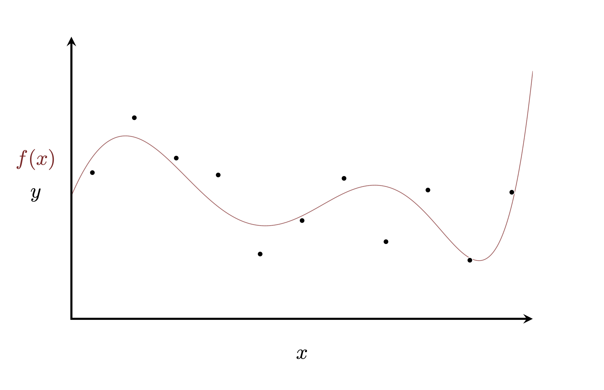
```
<br><br>
</center>

In some cases this functional relationship is motivated by explicit generative
models, but when we aren't privileged with that depth of understanding we have
to consider more heuristic models.  For example if $\theta$ takes values on the
entire real line then we can consider a linear approximation where we assume a
linear relationship between the covariate $x$ and the parameter,
$$
f(x) = \alpha + x^{T} \cdot \boldsymbol{\beta}.
$$

<center>
<br>
```{r, out.width = "75%", echo=FALSE}
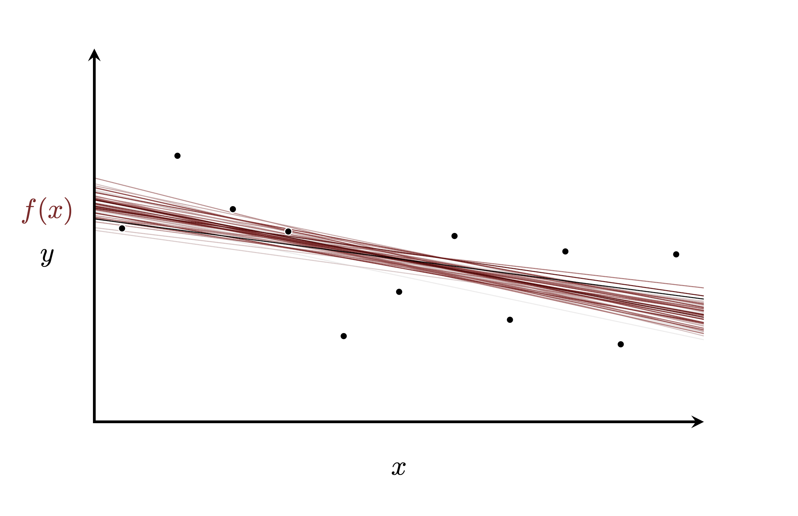
```
<br><br>
</center>

This approximation, however, is often not rich enough to capture the functional
behavior that manifests in a given system.  A more sophisticated heuristic model
might consider a higher-order polynomial approximation that captures more
complex functional behaviors than the linear model.

<center>
<br>
```{r, out.width = "75%", echo=FALSE}
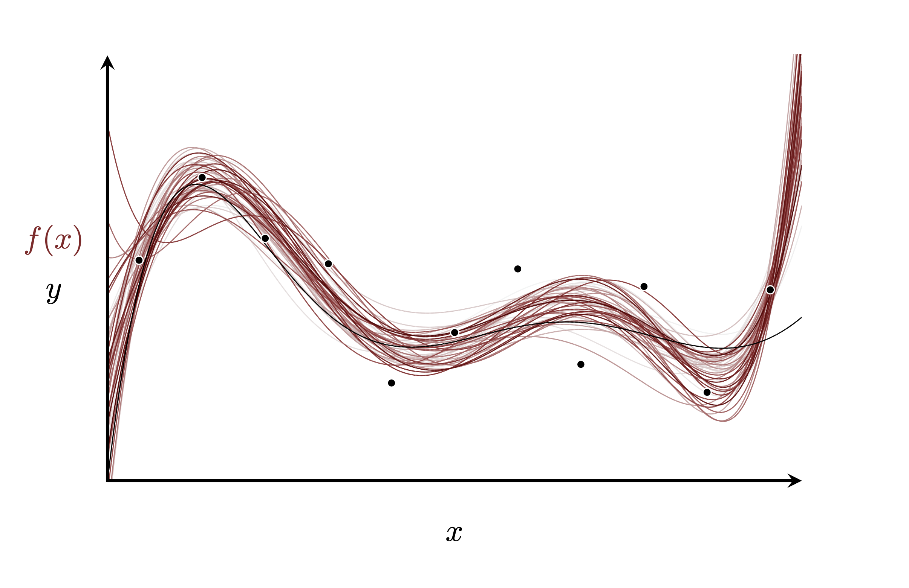
```
<br><br>
</center>

As the order of the polynomial grows, however, the space of polynomial functions
starts to be dominated by more extreme functional relationships that usually
conflict with our own domain expertise.

<center>
<br>
```{r, out.width = "75%", echo=FALSE}
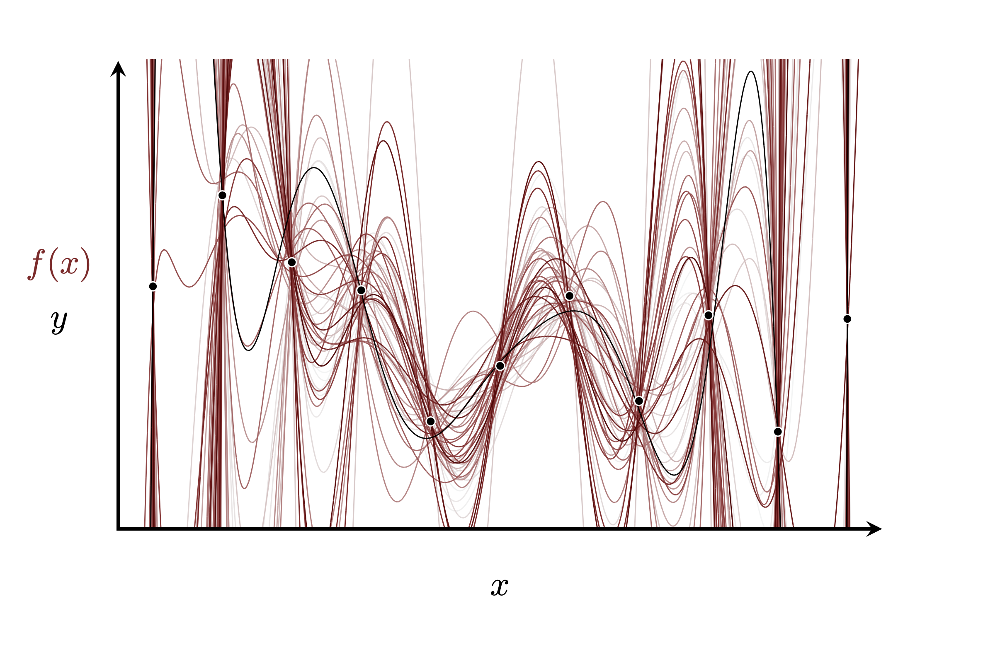
```
<br><br>
</center>

Unfortunately this behavior is somewhat inevitable.  In practice it is
incredibly difficult, if not outright impossible, to engineer function spaces
that are rich enough to capture complex behaviors of interest without also being
so large that those desired behaviors are overwhelmed by less desirable
behaviors.  To compensate we need to ensure that our probabilistic model for
the functional behavior provides sufficient regularization, concentrating on the
desired behaviors while suppressing the undesirable behaviors.

Principled regularization, however, requires not only understanding what
behaviors are consistent with our domain expertise and which are not but also
how these behaviors are related to our representation of the function space.
For example robust use of the polynomial model requires understanding how all
of the polynomial coefficients interact to control the overall function
behavior, which quickly becomes unmanageable as the order of the polynomial
grows.  Interpretable regularization requires much more than just shrinking all
of the coefficients towards zero!  Polynomial models are problematic not because
they're too flexible but rather because it's challenging to regularize that
flexibility in a principled way.

_Gaussian processes_ define probabilisitic models of functional behavior not
through any finite-dimensional parametric model but rather by defining
probability distributions over function spaces directly.  This more direct
approach can drastically improve the interpretability of the model and hence
facilitate its principled use.

## Gaussian Processes In Theory

Gaussian processes are built on top of a sophisticated, and honestly a bit
overwhelming, mathematical foundation [@CramerEtAl:2004; @RasmussenEtAl:2006].
In this case study we will consider only a relatively simple abstraction of that
theory that will be sufficient for their basic use with one-dimensional
covariate spaces.  The deeper theory becomes much more relevant when
approximations are concerned; see [Section 4.3](#sec:approximations) for a
limited discussion.

A Gaussian process defines a probability distribution over functions; in other
words every sample from a Gaussian process is an _entire function_ from the
covariate space $X$ to the real-valued output space.

<center>
<br>
```{r, out.width = "75%", echo=FALSE}
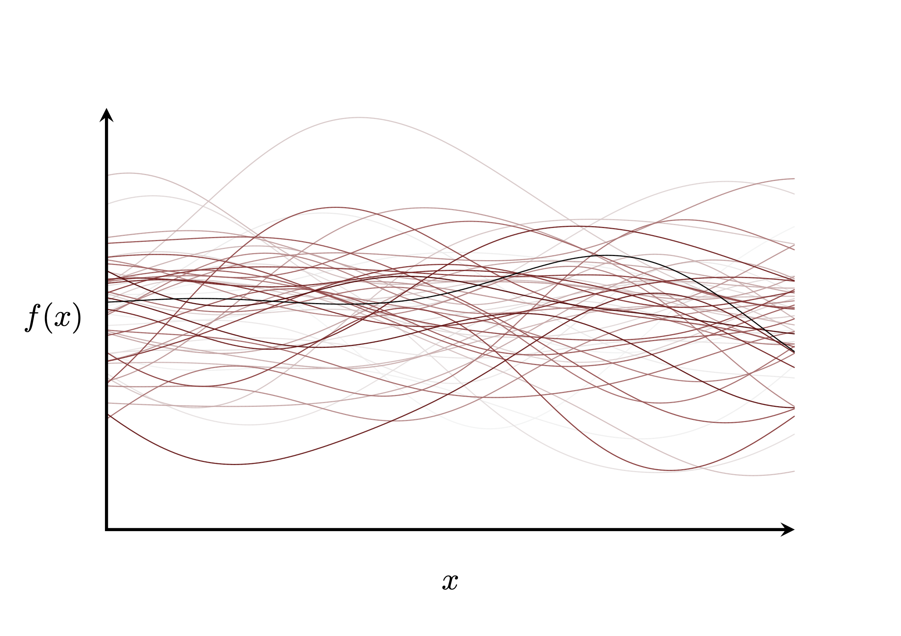
```
<br><br>
</center>

These realizations are said to be infinite-dimensional in the sense that in
order to specify an entire function we need to specify the function value at
every one of the infinite covariate values in $X$.

### Visualizing Gaussian Processes

We have a few natural ways to visualize a Gaussian process in one-dimension.

_Spaghetti plots_, for example, visualize some typical functional behaviors,
including most importantly the typical correlations between function values, by
overlaying an ensemble of function samples.  Unfortunately spaghetti plots are
not without some fundamental limitations. A small ensemble allows us to readily
resolve individual function behavior but only poorly quantifies the entire
Gaussian process, especially in the tails.  On the other hand a large ensembles
better characterizes the full breadth of typical behavior at the expense of
obfuscating the individual functional behavior in the bulk of the distribution.

<center>
<br>
```{r, out.width = "100%", echo=FALSE}
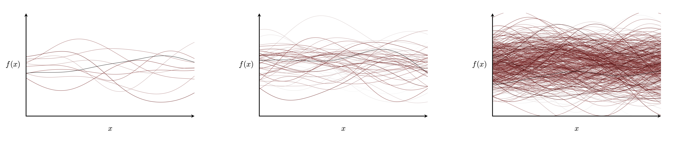
```
<br><br>
</center>

Judicious use of color and transparency, as well as animation, can reduce these
limitations somewhat.  Because ensemble visualizations are not estimating
any particular expectation value, however, we cannot quantify exactly how
faithful of a picture they're providing.

Alternatively we can consider _ribbon plots_, sometimes known as _fan plots_,
that visualize the ensemble with marginal quantile intervals at each covariate
value.  Here I use ribbons covering the 10%-90%, 20%-80%, 30%-70%, and 40%-60%
quantile intervals as well as one for the 50% medians.

<center>
<br>
```{r, out.width = "75%", echo=FALSE}
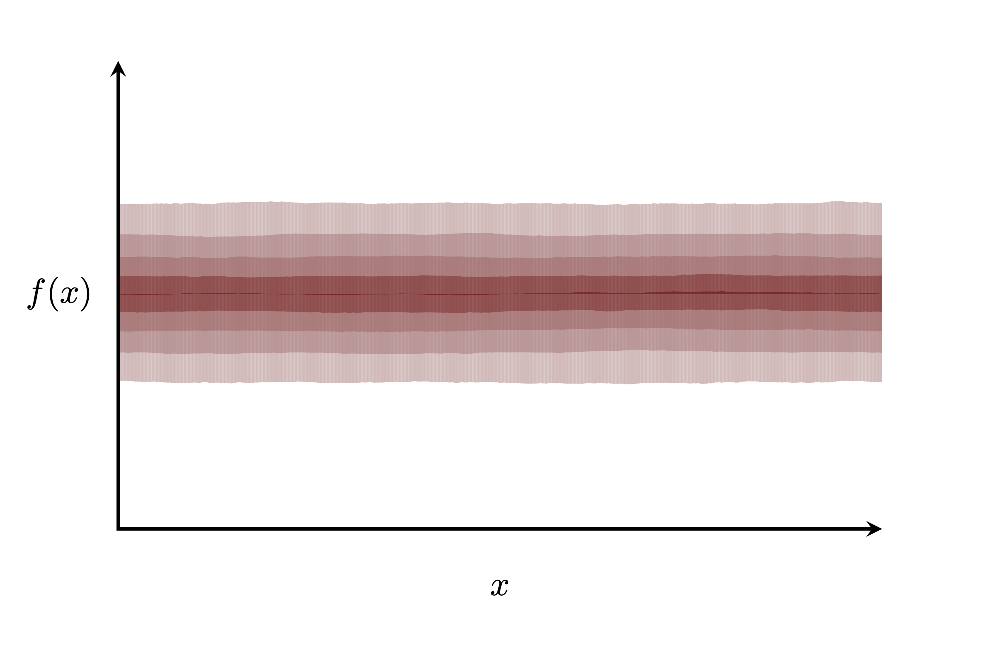
```
<br><br>
</center>

Ribbon plots quantify the ensemble behavior of the distribution of function
behaviors at each covariate value, but only at the expense of ignoring the
correlations between different covariate values.  In particular by visualizing
only the marginal quantiles the ribbons will make the ensemble appear narrower
than it actually is and the joint coverage will be underestimated.

Ultimately no visualization of a space with more than a few dimensions will be
without tradeoffs, but complementing spaghetti plots with ribbon plots can
perform reasonably well for understanding the basic behavior of a Gaussian
process.

### Parameterizing Gaussian Processes

The space of all Gaussian processes is parameterized by two functions.  A
_mean function_ $m : X \rightarrow \mathbb{R}$ defines the baseline function
around which the Gaussian process concentrates while the _covariance function_
$k : X \times X \rightarrow \mathbb{R}^{+}$ quantifies the variation around that
baseline.

Because every Gaussian process can be recovered by adding the mean function to a
corresponding zero-mean Gaussian process,
$$
\begin{align*}
f &\sim \text{GP}(0, k)
\\
m + f &\sim \text{GP}(m, k),
\end{align*}
$$
we can focus our attention on zero-mean Gaussian processes, and the influence of
the covariance function, without any loss of generality.  Indeed this
perspective is quite natural from the modeling perspective where Gaussian
processes are often added to some presumed functional relationship, say one
motivated by a simple mechanistic model, to capture residual behavior.  See
[Section 4.1](#sec:additive) for some additional discussion.

For a zero-mean Gaussian process the behavior of the sampled function is
completely determined by the covariance function.

The marginal variation of function values at any given covariate value is
determined by the _diagonal_ evaluations of the covariance function where the
same value is used for both arguments, $k(x_{1}, x_{1})$  The larger the
covariance function output the more the function values $f(x_{1})$ will vary
around the zero baseline.

<center>
<br>
```{r, out.width = "100%", echo=FALSE}
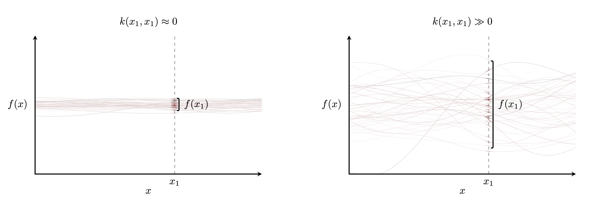
```
<br><br>
</center>

Similarly the correlation between function values at different inputs is
determined by the _off-diagonal_ evaluations of the covariance function where
different values are used for each input.  The larger the normalized covariance
function output,
$$
\frac{k(x_{1}, x_{2})}{ \sqrt{ k(x_{1}, x_{1}) \cdot k(x_{2}, x_{2})} },
$$
the more correlated $f(x_{1})$ and $f(x_{2})$ will be with each other.  In other
words if we fix $f(x_{1})$ to a particular value, or equivalently filter all of
the possible functions except those that happen to have the right value of
$f(x_{1})$, then the larger the normalized covariance function the _less_
$f(x_{2})$ will vary around $f(x_{1})$.

<center>
<br>
```{r, out.width = "100%", echo=FALSE}
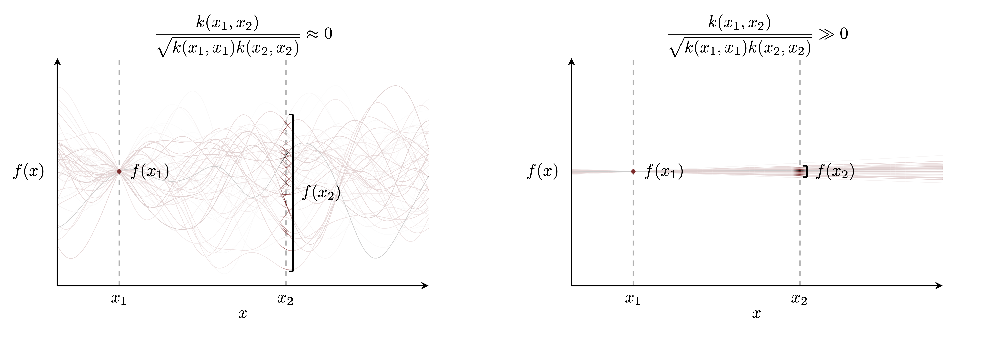
```
<br><br>
</center>

In applications we often consider _stationary_ covariance functions that depend
on only the relative distance between covariate values,
$$
\Delta x = | x_{1} - x_{2} |.
$$
In this case we can visualize the marginal and correlation structure of the
covariance function by plotting its values verses distance in a _covariogram_,
or its normalized values verse distance in a _correlogram_.

<center>
<br>
```{r, out.width = "100%", echo=FALSE}
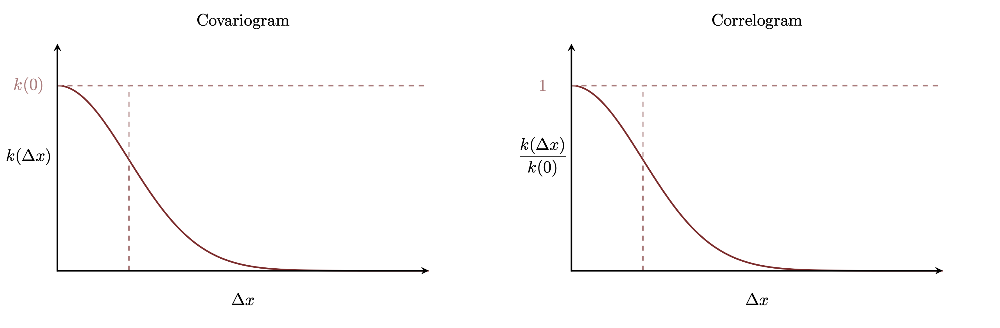
```
<br><br>
</center>

The marginal variation, which is constant for all covariate values
$$
k(x, x) = k(0),
$$
is given by the initial value while the decay of the covariance function with
covariate distance determines for long correlations persist.  A stationary
covariance function that decays slowly will generate functions that are rigid
while faster decay will lead to functions that fluctuate much more strongly.
If the covariance function decays quickly enough then the realized functions
may not even have well-defined derivatives!

### Gaussian Process Modeling {#sec:modeling}

Given an observational model $\pi(y; f(x), \phi)$ a Gaussian process can be
used to define a prior model for the functional relationship $f$.
Conditioned on observed data the posterior distribution for $f$ will quantify
the functional behavior compatible with both the observed likelihood function
and the Gaussian process prior model.

<center>
<br>
```{r, out.width = "100%", echo=FALSE}
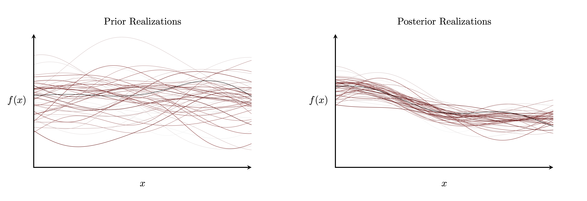
```
<br><br>
</center>

When modeling a location function we can visualize the influence of the
likelihood function by overlaying the data and the posterior function
realizations.

<center>
<br>
```{r, out.width = "100%", echo=FALSE}
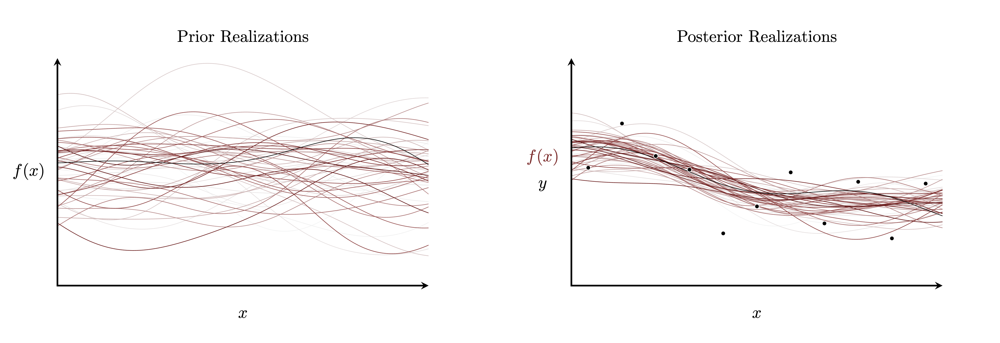
```
<br><br>
</center>

That posterior distribution, however, may not itself be a Gaussian process.  In
fact the posterior distribution for $f$ will be a Gaussian process if and only
if the observational model is specified by a family of normal probability
density functions,
$$
y \sim \mathrm{normal} \left( f(x), \sigma \right).
$$
In this case the posterior Gaussian process is defined by the modified
covariance function
$$
k_{\text{post}}(x_{1}, x_{2})
= k_{\text{prior}}(x_{1}, x_{2}) + \sigma^{2} \delta_{x_{1}, x_{2}},
$$
where
$$
\delta_{x_{1}, x_{2}}
=
\left\{
\begin{array}{rr}
1, & x_{1} = x_{2} \\
0, & x_{1} \ne x_{2}
\end{array}
\right. .
$$

## Gaussian Processes In Practice

Although the theory of Gaussian processes can be compelling, in practice we can
never completely realize it.  The problem is that with only finite computational
resources -- both in terms of instruction processing and memory -- we'll never
be able to manipulate an entire sampled function.

Fortunately the practical implementation of a Gaussian process becomes
infinitely easier -- literally -- if we consider not _all_ function values but
rather only those at a _finite_ number of covariate values which I will denote
as a _grid_.  In this case the function values over the grid follow a
distribution specified by a multivariate normal density function completely
determined by the Gaussian process.

First consider the behavior of a single function value at the covariate point
$x_{1}$,
$$
f_{1} = f(x_{1}).
$$
Each sampled function reduces to single value of that function evaluated at
$x_{1}$, and the variation of those function values is completely specified by a
normal density function with location parameter given by evaluating the mean
function at $x_{1}$ and variance given by evaluating the covariance function at
$x_{1}$ in both arguments,
$$
\pi(f_{1}) = \text{normal} \left( f_{1} \mid m(x_{1}), \sqrt{ k(x_{1}, x_{1}) } \right).
$$

<center>
<br>
```{r, out.width = "100%", echo=FALSE}
knitr::include_graphics("figures/univariate_projection/univariate_projection.png")
```
<br><br>
</center>

The distribution of multiple function values proceeds with a vector of
location parameters given by evaluating the mean function at each covariate
value,
$$
m_{n} = m(x_{n}),
$$
and a covariance matrix of parameters given by evaluating the covariance
function at each pair of covariate values,
$$
K_{nm} = k(x_{n}, x_{m}).
$$
This realized covariance matrix is also known as the _Gram matrix_.

<center>
<br>
```{r, out.width = "100%", echo=FALSE}
knitr::include_graphics("figures/multivariate_projection/multivariate_projection.png")
```
<br><br>
</center>

Once we've constructed a multivariate normal density function the implementation
of a Gaussian process reduces to the manipulation of multivariate normal density
functions which themselves consist of a series of well-known linear algebraic
operations.

For example to simulate sampling a function from a Gaussian process and then
evaluating that sampled function at the grid of covariate values we can just
directly sample from a multivariate normal random number generator.  Indeed this
is how I have been making the function realizations plots this entire time.  In
each plot I discretize the covariate space into 551 equally-spaced points,
sample from the corresponding 551-dimensional multivariate normal random number
generator, and then let `gnuplot` interpolate between sampled values with lines.
If we zoom into any of the plots then the deception becomes a little bit more
evident.

<center>
<br>
```{r, out.width = "100%", echo=FALSE}
knitr::include_graphics("figures/zoom/zoom.png")
```
<br><br>
</center>

We can also consider _predictions_ by taking advantage of the conditional
structure of a multivariate normal density function.  Consider a grid of
observed covariate values
$$
\{ x^{\text{obs}}_{1}, \ldots, x^{\text{obs}}_{N_{\text{obs}}} \}
$$
where we know the function values $f(x^{\text{obs}}_{n})$, and a grid of
unobserved covariate values where we want to predict the function values,
$$
\{ x^{\text{pred}}_{1}, \ldots, x^{\text{pred}}_{N_{\text{pred}}} \}.
$$
The parameters of the multivariate normal density function of the combined
covariate values decomposes into the parameters of the multivariate normal
density function for each component grid plus the mixed covariate function
evaluations.

<center>
<br>
```{r, out.width = "75%", echo=FALSE}
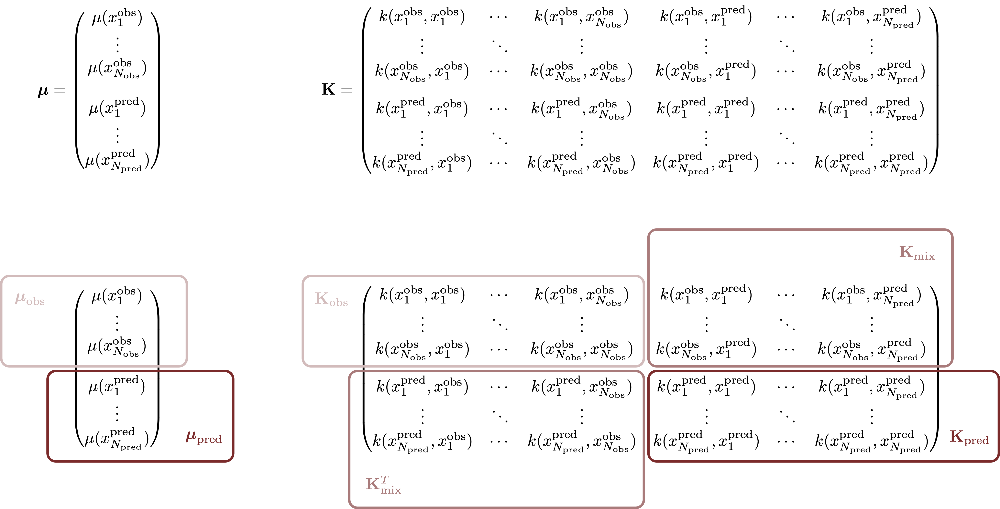
```
<br><br>
</center>

More compactly
$$
\mathbf{m} =
\begin{pmatrix}
\mathbf{m}_{\text{obs}} \\
\mathbf{m}_{\text{pred}}
\end{pmatrix}
$$
and
$$
\mathbf{K} =
\begin{pmatrix}
\mathbf{K}_{\text{obs}} & \mathbf{K}_{\text{mix}} \\
( \mathbf{K}_{\text{mix}} )^{T} & \mathbf{K}_{\text{pred}}
\end{pmatrix}.
$$

The conditional probability density function for the unobserved function values
$(f_{\text{pred}})_{n} = f(x^{\text{pred}}_{n})$ given the observed function 
values $(f_{\text{obs}})_{n} = f(x^{\text{obs}}_{n})$ falls into the 
multivariate normal family,
$$
\pi(\mathbf{f}_{\text{pred}} \mid \mathbf{f}_{\text{obs}}) =
\text{multi-normal} (\boldsymbol{\mu}, \boldsymbol{\Sigma})
$$
with the location parameters
$$
\boldsymbol{\mu}
=
\mathbf{m}_{\text{pred}}
+ ( \mathbf{K}_{\text{mix}} )^{T} \cdot ( \mathbf{K}_{\text{obs}} )^{-1}
\cdot (\mathbf{f}_{\text{obs}} - \mathbf{m}_{\text{obs}})
$$
and the covariance matrix parameters
$$
\boldsymbol{\Sigma}
=
\mathbf{K}_{\text{pred}}
- ( \mathbf{K}_{\text{mix}} )^{T}
\cdot ( \mathbf{K}_{\text{obs}} )^{-1}
\cdot \mathbf{K}_{\text{mix}}.
$$

Inference with Gaussian process priors proceeds similarly.  Once we've
identified the covariate values at which we have observations or will want to
make predictions we can specify the marginalized prior model with the
corresponding multivariate normal density function.
$$
\begin{align*}
f \sim \text{GP}(m, k) & \quad \rightarrow \quad  f_{n} \sim \text{multi-normal}(\mathbf{m}, \mathbf{K})
\\
\pi(y_{n}; f(x_{n}), \phi) & \quad \rightarrow \quad \pi(y_{n}; f_{n}, \phi).
\end{align*}
$$

If the observational model is normal then we can generate predictions
analytically with the conditioning operations for the _posterior_ covariance
function we introduced in [Section 1.1.3](#sec:modeling).  Calculating the
conditional location parameters in this way is also known as _kriging_,
especially in the geological literature.

By working directly with a finite-dimensional projection of a Gaussian process
we avoid all of the impracticalities of infinite-dimensional spaces.  At the
same time because we never actually realize the latent infinite-dimensional
function space I hesitate calling Gaussian processes "infinite-dimensional" or
"non-parametric".  In practice a Gaussian process model will always manifest
in a finite number of parameters!

Working with finite-dimensional projections, however, is not without its
limitations.  Once we've projected a Gaussian process onto a finite grid we
cannot investigate functional behavior elsewhere; contrast this for example
with a polynomial model that allows the possible functional behavior to be
evaluated at _any_ input point.  In order to investigate functional behavior at
new covariate points we have to create a larger grid and project again,
constructing an entirely new multivariate normal density function and repeating
all of the subsequent linear algebra.  Unfortunately Gaussian processes are
awkward when we can't specify all of the relevant covariate values ahead of
time.

Moreover while the manipulations of a projected Gaussian process are technically
possible, they are definitely not cheap.  The cost of all of these operations
scales with the _cube_ of the total number of grid points being considered due
to the required matrix inversions.  This unfortunate scaling limits the size of
grids with which we can work given the fixed computational resources typical in
practice.

## Covariance Functions and You

The ultimate utility of a Gaussian process model depends on the specific choice
of covariance function; the better a chosen covariance function captures the
functional behavior consistent with our domain expertise the better behaved our
inferences will be.

From this perspective we are fortunate that the breadth of covariance functions
is absolutely massive.  That breadth can be expanded even further with
operations that combine individual covariance functions into new, well-defined
covariances functions.  For example we can define new covariance functions with
point-wise addition of existing covariance functions,
$$
k(x_{1}, x_{2}) = k_{\alpha}(x_{1}, x_{2}) + k_{\beta}(x_{1}, x_{2})
$$
and point-wise multiplication,
$$
k(x_{1}, x_{2}) = k_{\alpha}(x_{1}, x_{2}) \cdot k_{\beta}(x_{1}, x_{2}).
$$

At the same time that breadth can be overwhelming, especially when first
learning about Gaussian processes.  For a thorough but readable review of
common families of covariances functions and their properties I recommend
[@Abrahamsen:1997].  In this case study, however, we will focus on a single
family of covariance functions: the _exponentiated quadratic_ family.

The covariance functions in the exponentiated quadratic family are stationary,
decaying exponentially fast with the squared distance between the covariates
being compared,
$$
k(x_{1}, x_{2}) = \alpha^{2}
\exp \left( - \frac{1}{2} \left( \frac{ |x_{1} - x_{2} |}{\rho} \right)^{2} \right).
$$

<center>
<br>
```{r, out.width = "75%", echo=FALSE}
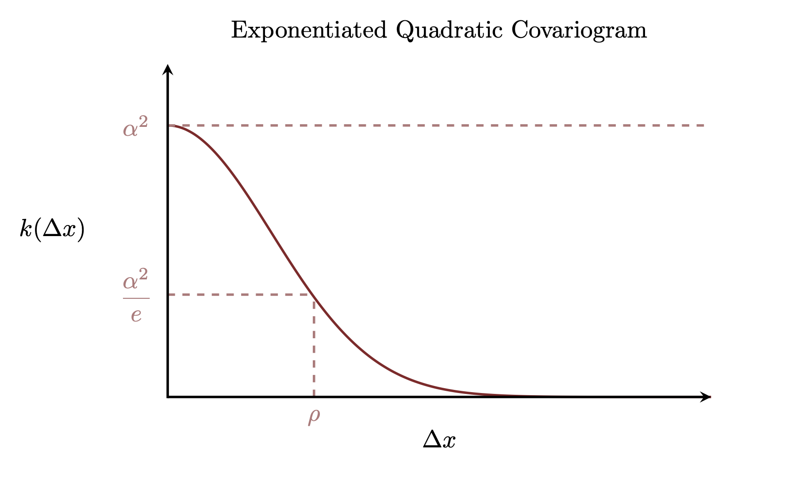
```
<br><br>
</center>

Because Gaussian processes have been developed independently in different fields
this family is also known by a few different names, for example the
_squared exponential_ family and the _radial basis function_ family.  The one
name we shouldn't be tempted to call it a "Gaussian" family despite the
similarity of the covariance function to a normal probability density function.
The problem is that similarity is only superficial and using "Gaussian" here
only confuses the covariance function, the Gaussian process that it specifies,
and the normal probability density function given by the finite dimensional
projection of that Gaussian process.  As awkward as "exponentiated quadratic"
may be to say it's one of the better options!

The parameter $\alpha$ is known as the _marginal deviation_ as it controls the
marginal variability of function values at all covariate values,
$$
\begin{align*}
k(x_{1}, x_{1})
&= \alpha^{2}
\exp \left( - \frac{1}{2} \left( \frac{ |x_{1} - x_{1} |}{\rho} \right)^{2} \right)
\\
&= \alpha^{2}
\exp \left( - \frac{1}{2} \left( \frac{0}{\rho} \right)^{2} \right)
\\
&= \alpha^{2}
\exp \left( - 0 \right)
\\
&= \alpha^{2}.
\end{align*}
$$
Consequently when $\alpha$ is small the variation in the function values at
every covariate input are suppressed, and when $\alpha$ is large the variations
are amplified.

<center>
<br>
```{r, out.width = "100%", echo=FALSE}
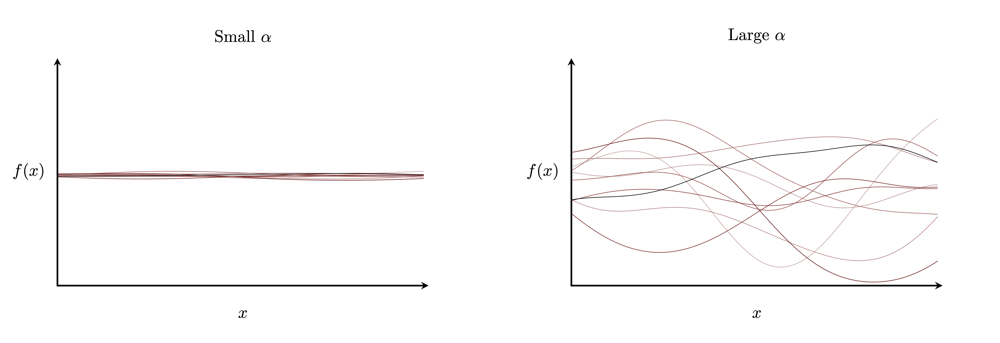
```
<br><br>
</center>

The parameter $\rho$ is known as the _length scale_ as it controls how quickly
the correlations between function values decay,
$$
\begin{align*}
\frac{ k(x_{1}, x_{2}) }{ \sqrt{ k(x_{1}, x_{1}) \cdot k(x_{2}, x_{2})} }
&=
\frac{ \alpha^{2}
\exp \left( - \frac{1}{2} \left( \frac{ |x_{1} - x_{2} |}{\rho} \right)^{2} \right) }
{ \sqrt{ \alpha^{2} \cdot \alpha^{2} }}
\\
&= \frac{ \alpha^{2} }{ \alpha^{2} }
\exp \left( - \frac{1}{2} \left( \frac{ |x_{1} - x_{2} |}{\rho} \right)^{2} \right)
\\
&=
\exp \left( - \frac{1}{2} \left( \frac{ |x_{1} - x_{2} |}{\rho} \right)^{2} \right).
\end{align*}
$$
When $\rho$ is small the correlations between function values at even close
covariate inputs are weak and the realized functions are more flexible and
"wiggly".  As $\rho$ increases, however, the correlations persist to longer and
longer distances resulting in more rigid functions.

<center>
<br>
```{r, out.width = "100%", echo=FALSE}
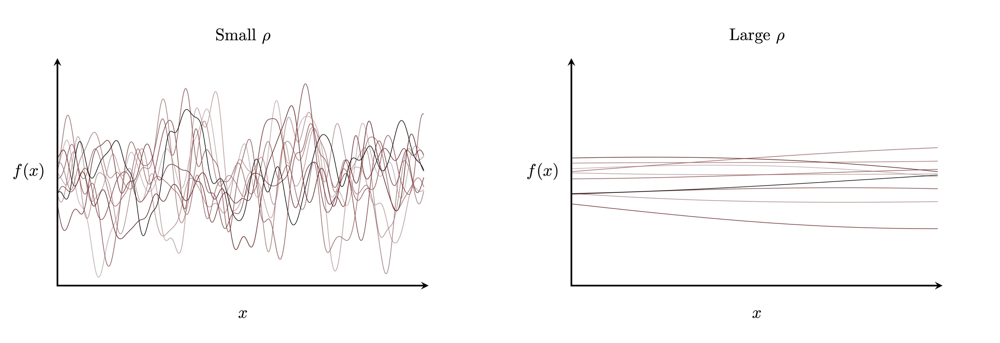
```
<br><br>
</center>

To build intuition for how these parameters interact with each other it helps to
examine the behavior of the Gaussian processes as both $\alpha$ and $\rho$ are
varied from small to large values.  Translation into an alignment chart is left
as an exercise for the reader.

<center>
<br>
```{r, out.width = "100%", echo=FALSE}
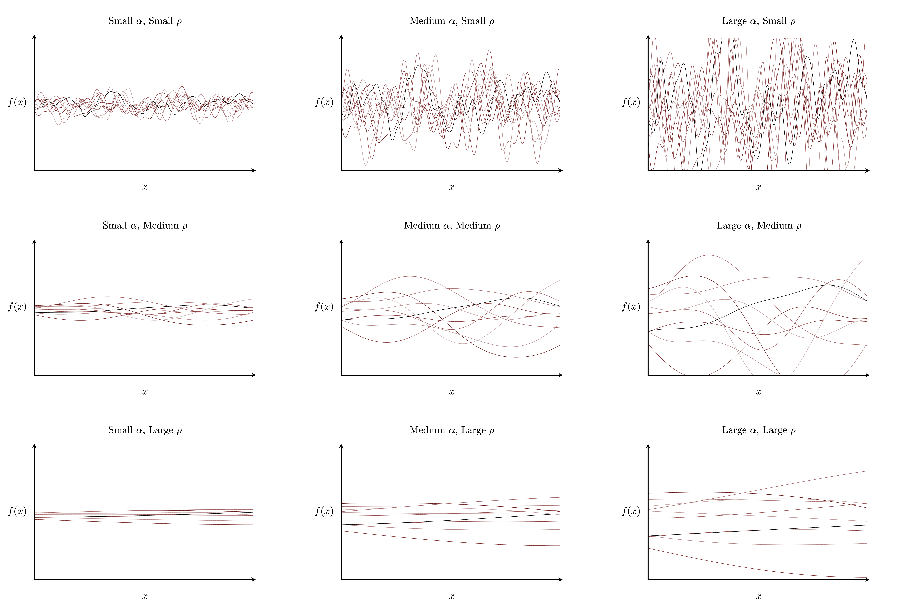
```
<br><br>
</center>

Another way of interpreting the exponentiated quadratic parameters is as
scalings of the function input and output values.  Multiplying $\alpha$ by a
constant, for example, is mathematically equivalent to multiplying all of the
realized functions that same constant.  Similarly multiplying $\rho$ by a
constant is equivalent to multiplying the absolute covariate values, and hence
also their relative distances, by that same constant.  In other words we can
quantify the behavior of every exponentiated quadratic covariance function by
using $\alpha$ and $\rho$ as the units for the $y$ and $x$ axes, respectively.

<center>
<br>
```{r, out.width = "100%", echo=FALSE}
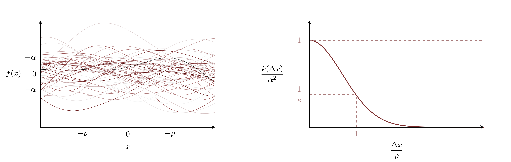
```
<br><br>
</center>

Although we won't be using it in this case study I do want to mention one more
family of covariance functions.  The _Matérn_ family generalizes the
exponentiated quadratic family with the introduction of a _smoothness_
parameter $\nu$,
$$
k(x_{1}, x_{2})
=
\frac{ 2^{1 - \nu}}{\Gamma(\nu)}
\left( \sqrt{2 \nu} \, \frac{ |x_{1} - x_{2} |}{\rho} \right)^{\nu}
K_{\nu} \left( \sqrt{2 \nu} \, \frac{ |x_{1} - x_{2} |}{\rho} \right),
$$
whre $K_{\nu}$ is a modified Bessel function of the second kind.

The smoothness parameter controls, well, the smoothness of the realized
functions by quantifying how many higher-order derivatives will be well-defined.
Formally for any integer $k \ge \nu$ the $k$-th order derivatives of the
realized functions will not exist.  For example if $\nu = 2.5$ then the
realized functions will have well-defined derivatives at only zeroth, first,
and second-order where as if $\nu = 0.5$ then the realized functions will have
only well-defined zeroth-order derivatives which ensures continuity but not much
else.

<center>
<br>
```{r, out.width = "100%", echo=FALSE}
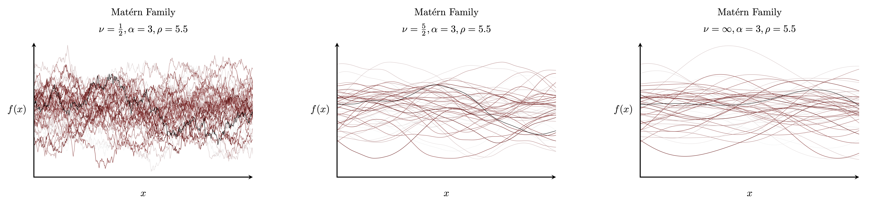
```
<br><br>
</center>

<center>
<br>
```{r, out.width = "100%", echo=FALSE}
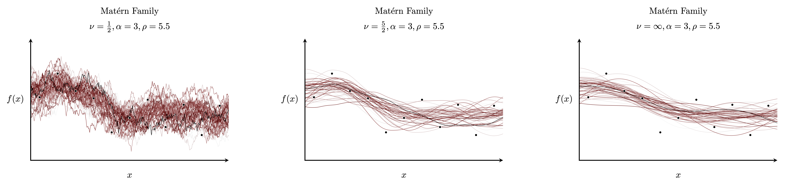
```
<br><br>
</center>

In the limit $\nu \rightarrow \infty$, when derivatives of _all_ orders are
well-defined, the Matérn covariance functions reduce to the exponentiated
quadratic covariance functions.  While this infinite smoothness is natural in
many applications it may not be appropriate when modeling functions that
feature occasional, sudden changes such as natural and political boundaries that
are common in spatial statistics.

# Implementing Gaussian Processes in Stan

With a reasonable understanding of Gaussian processes and their practical
realizations we can now consider how to implement them in Stan.  In this
section we'll consider Gaussian processes operations given a _fixed_ Gaussian
process, in particular a fixed element of the exponentiated quadratic family.

## Simulating From A Gaussian Process

Simulating from the finite projection of Gaussian process prior is
straightforward once we've specified the covariate grid.

First let's set up our `R` environment.

```{r, message=FALSE}
library(rstan)
rstan_options(auto_write = TRUE)
options(mc.cores = parallel::detectCores())
parallel:::setDefaultClusterOptions(setup_strategy = "sequential")

util <- new.env()

par(family="CMU Serif", las=1, bty="l", cex.axis=1, cex.lab=1, cex.main=1,
    xaxs="i", yaxs="i", mar = c(5, 5, 3, 5))
```

Now we can define the covariate grid,

```{r}
N = 551
x <- 22 * (0:(N - 1)) / (N - 1) - 11
```

the parameters that specify our particular Gaussian process,

```{r}
alpha_true <- 3
rho_true <- 5.5
```

and then pack everything together,

```{r}
simu_data <- list(alpha=alpha_true, rho=rho_true, N=N, x=x)
```

In order to sample from the Gaussian process projected onto our covariate grid
we just need to construct the Gram matrix and then sample from the corresponding
multivariate normal random number generator.

```{r}
writeLines(readLines("stan_programs/simu.stan"))
```

Here we use Stan's builtin `cov_exp_quad` function for evaluating the Gram
matrix and then add a _nugget_ or _jitter_ of $10^{-10}$ to the diagonals
elements in order to stabilize the subsequent numeral linear algebra
calculations.  Often the nugget is taking to be square root of the floating
point precision, which would be $10^{-8}$ for double precision calculations,
but for this particular example we can be a bit more aggressive.

We can generate exact samples by running the `Fixed_param` sampler in Stan,
which just evaluates the `generated quantities` block that calls the
multivariate normal random number generator.

```{r}
simu_fit <- stan(file='stan_programs/simu.stan', data=simu_data,
                 warmup=0, iter=4000, chains=1, seed=494838,
                 algorithm="Fixed_param", refresh=4000)
```

To visualize the sampled functions we'll use some visualization code in the
auxiliary `gp_utility.R` script.

```{r}
source('gp_utility.R', local=util)
```

For example we can overlay some of the functions in a spaghetti plot,

```{r}
util$plot_gp_prior_realizations(simu_fit, x, "Realizations")
```

or plot marginal quantiles to summarize the aggregate behavior,

```{r}
util$plot_gp_prior_quantiles(simu_fit, x, "Marginal Quantiles")
```

## Simulating From A Gaussian Process Model

Incorporating this Gaussian process into a generative model is straightforward.

Consider for example using this Gaussian process as a prior model for the
location function in a normal observational model,
$$
\begin{align*}
f &\sim \text{GP}(0, k_{\text{eq}})
\\
y_{n} &\sim \text{normal}(f(x_{n}), \sigma).
\end{align*}
$$

Once we've specified a true measurement variability we can simulate observations
by sequentially sampling the function values along the covariate grid and then
the observations at each of those points.

```{r}
writeLines(readLines("stan_programs/simu_normal.stan"))
```

```{r}
sigma_true <- 2
simu_data$sigma <- sigma_true

set.seed(2595)
simu_fit <- stan(file='stan_programs/simu_normal.stan', data=simu_data,
                 warmup=0, iter=4000, chains=1, seed=494838,
                 algorithm="Fixed_param", refresh=4000)
```

Now in addition the plotting some of the functions sampled from the Gaussian
process prior,

```{r}
util$plot_gp_prior_realizations(simu_fit, x, "Prior Realizations")
```

and the marginal quantile ribbons,

```{r}
util$plot_gp_prior_quantiles(simu_fit, x, "Prior Marginal Quantiles")
```

we can also plot the marginal quantile ribbons of the prior predictive
distribution that convolves the Gaussian process prior with the observational
model.

```{r}
util$plot_gp_prior_pred_quantiles(simu_fit, x, "Prior Predictive Marginal Quantiles")
```

Let's grab the first simulation for closer inspection.

```{r}
f <- extract(simu_fit)$f[1,]
y <- extract(simu_fit)$y[1,]

c_mid_teal="#487575"

plot(x, f, type="l", lwd=2, xlab="x", ylab="y",
     xlim=c(-11, 11), ylim=c(-10, 10))
points(x, y, col="white", pch=16, cex=0.6)
points(x, y, col=c_mid_teal, pch=16, cex=0.4)
```

In practice we are often interested in the functional behavior beyond just the
observed covariate values.  To emulate this circumstance let's define a
measurement by the observations at just eleven evenly spaced points along
the covariate grid.

```{r}
observed_idx <- c(50 * (0:10) + 26)
N_obs = length(observed_idx)
x_obs <- x[observed_idx]
y_obs <- y[observed_idx]
```

The entire grid, however, will be considered for predictions.

```{r}
N_predict <- N
x_predict <- x
y_predict <- y

plot(x, f, type="l", lwd=2, xlab="x", ylab="y",
     xlim=c(-11, 11), ylim=c(-10, 10))
points(x_predict, y_predict, col="white", pch=16, cex=0.6)
points(x_predict, y_predict, col=c_mid_teal, pch=16, cex=0.4)
points(x_obs, y_obs, col="white", pch=16, cex=1.2)
points(x_obs, y_obs, col="black", pch=16, cex=0.8)
```

In order to use this simulation in the next section we'll put everything in a
safe place.

```{r}
stan_rdump(c("N_obs", "x_obs", "y_obs",
             "N_predict", "x_predict", "y_predict",
             "observed_idx"), file="output/normal.data.R")

stan_rdump(c("f", "x"), file="output/gp.truth.R")
```

The same construction works for more sophisticated models, as well.  For example
consider using the selected Gaussian process as a prior model for the log
intensity in a Poisson observational model,
$$
\begin{align*}
f &\sim \text{GP}(0, k_{\text{eq}})
\\
y_{n} &\sim \text{Poisson}(\exp(f(x_{n}))).
\end{align*}
$$
The log link function here ensures that the unbounded Gaussian process is
compatible with the positivity of the Poisson intensity parameter.

Simulating an observation from this model proceeds just as for the normal model.

```{r}
writeLines(readLines("stan_programs/simu_poisson.stan"))
```

Note that by setting the `R` seed again here we ensure the same permutation of
the generated samples in `RStan` as above so that the first iteration, which
we'll use for our simulated data, will use the exact same function realization.

```{r}
set.seed(2595)
simu_fit <- stan(file='stan_programs/simu_poisson.stan', data=simu_data,
                 warmup=0, iter=4000, chains=1, seed=494838,
                 algorithm="Fixed_param", refresh=4000)
```

```{r}
util$plot_gp_prior_realizations(simu_fit, x, "Prior Realizations")
```

```{r}
util$plot_gp_prior_quantiles(simu_fit, x, "Prior Marginal Quantiles")
```

```{r}
util$plot_gp_prior_pred_quantiles_disc(simu_fit, x, "Prior Predictive Marginal Quantiles")
```

```{r}
f <- extract(simu_fit)$f[1,]
y <- extract(simu_fit)$y[1,]

N_obs = length(observed_idx)
x_obs <- x[observed_idx]
y_obs <- y[observed_idx]

N_predict <- N
x_predict <- x
y_predict <- y

plot(x, exp(f), type="l", lwd=2, xlab="x", ylab="y",
     xlim=c(-11, 11), ylim=c(0, 8))
points(x_predict, y_predict, col="white", pch=16, cex=0.6)
points(x_predict, y_predict, col=c_mid_teal, pch=16, cex=0.4)
points(x_obs, y_obs, col="white", pch=16, cex=1.2)
points(x_obs, y_obs, col="black", pch=16, cex=0.8)

stan_rdump(c("N_obs", "x_obs", "y_obs",
             "N_predict", "x_predict", "y_predict",
             "observed_idx"), file="output/poisson.data.R")
```

## Fitting A General Gaussian Process Posterior

Fitting the posterior of a Gaussian process model is also straightforward
using the Markov chain Monte Carlo capabilities of Stan.  Here we include all of
the function values of interest in the `parameters` block and then specify the
joint probability density function, including the contributions from the
projection of the Gaussian process prior model and the observational model at
the observed covariate values, in the `model` block.

Keep in mind that this model is using a fixed Gaussian process specified by the
exponentiated quadratic covariance function parameters passed in through the
`data` block.

```{r}
writeLines(readLines("stan_programs/fit_normal.stan"))
```

```{r}
truth <- read_rdump("output/gp.truth.R")

data <- read_rdump("output/normal.data.R")
data$alpha <- alpha_true
data$rho <- rho_true
data$sigma <- sigma_true
```

```{r, cache=TRUE, warning=FALSE, message=FALSE}
normal_fit <- stan(file='stan_programs/fit_normal.stan', data=data,
                   seed=5838299, refresh=1000)
```

To check the fit let's load my `stan_utility.R` script for its diagnostic
functions.

```{r}
source('stan_utility.R', local=util)

writeLines(capture.output(util$check_n_eff(normal_fit))[1:5])
writeLines(capture.output(util$check_rhat(normal_fit))[1:5])
util$check_div(normal_fit)
util$check_treedepth(normal_fit)
util$check_energy(normal_fit)
```

Unfortunately the diagnostics clearly indicate that Stan is not able to
accurately quantify the posterior for the projected function values.  We may be
able to moderate the computational problems, however, by employing a
_non-centered parameterization_ of the function values.  A non-centered
parameterization takes advantage of the fact that
$$
\mathbf{f} \sim \text{multi-normal} ( \boldsymbol{\mu}, \boldsymbol{\Sigma})
$$
is equivalent to
$$
\begin{align*}
\tilde{\mathbf{f}} &\sim \text{multi-normal} (\mathbf{0}, \mathbf{I})
\\
\mathbf{f} &= \boldsymbol{\mu} + \mathbf{L} \cdot \tilde{\mathbf{f}}
\end{align*}
$$
where $\mathbf{L}$ is the Cholesky factor of the covariance matrix,
$$
\boldsymbol{\Sigma} = \mathbf{L} \mathbf{L}^{T}.
$$
Parameterizing the latent functions directly or through the non-centered
parameterization specifies the same probability distribution, but the latter
enjoys a nicer posterior geometry when the likelihood function is relatively
diffuse.

The non-centered parameterization, and the recovery of the centered function
values, is straightforward to implement in Stan.

```{r}
writeLines(readLines("stan_programs/fit_normal_ncp.stan"))
```

```{r, cache=TRUE}
normal_fit <- stan(file='stan_programs/fit_normal_ncp.stan', data=data,
                   seed=5838298, refresh=1000)
```

Not only does this run significantly faster but also there are no indications of
inaccurate computation.

```{r}
util$check_all_diagnostics(normal_fit)
```

Confident in our computation we can analyze the posterior, first with a
spaghetti plot.  Note that the true function doesn't look out of place compared
to the included posterior realizations.

```{r}
util$plot_gp_post_realizations(normal_fit, data, truth,
                               "Posterior Realizations")
```

We can also consider a ribbon plot, although we have to be a bit more careful
with the interpretation.  Because we're looking only at marginal quantiles the
ribbons won't properly capture correlations between the function values and
consequently will appear narrow than they should be.  The fact that our ribbons
span only 10% to 90% quantiles also visually suppresses the tails a bit;
estimating more extreme quantiles accurately would require running longer Markov
chains.  In any case when judging the posterior fit through these ribbons we
have to take these considerations into account not expect that the true function
be exactly contained within the ribbons.

```{r}
util$plot_gp_post_quantiles(normal_fit, data, truth,
                            "Posterior Marginal Quantiles")
```

Finally we can consider a ribbon plot of the posterior predictive distribution.
Comparing these ribbons to the observed data in black implements a posterior
_retrodictive_ check while comparing the ribbons to the held out data in teal
implements a posterior _predictive_ check.

Because posterior predictive intervals have no coverage guarantees in general
for either retrodictions or predictions, we can't quantify either check by
counting how many observations are within the quantile ribbons.  Instead this
visualization provides a qualitative check for any systematic deviations that
might indicate limitations of our Gaussian process model.

```{r}
util$plot_gp_post_pred_quantiles(normal_fit, data, truth,
                                 "Posterior Predictive Marginal Quantiles")
```

The advantage of probabilistic programming is now that we know how to implement
a Gaussian process in one generative model it becomes straightforward to
implement in another.  Here let's consider using a Gaussian process to model the
log intensity of a Poisson observational model.


```{r}
writeLines(readLines("stan_programs/fit_poisson_ncp.stan"))
```

```{r}
data <- read_rdump("output/poisson.data.R")
data$alpha <- alpha_true
data$rho <- rho_true
```

```{r, cache=TRUE}
poisson_fit <- stan(file='stan_programs/fit_poisson_ncp.stan', data=data,
                    seed=5838298, refresh=1000)
```

The fit looks good.

```{r}
util$check_all_diagnostics(poisson_fit)
```

We can visualize the posterior over functions, which is no longer a Gaussian
process, using spaghetti plots

```{r}
util$plot_gp_post_realizations(poisson_fit, data, truth,
                               "Posterior Realizations")
```

or ribbon plots.

```{r}
util$plot_gp_post_quantiles(poisson_fit, data, truth,
                            "Posterior Marginal Quantiles")
```

Visual posterior predictive and retrodictive checks proceed in exactly the same
was as before.

```{r}
util$plot_gp_post_pred_quantiles_disc(poisson_fit, data, truth,
                                      "Posterior Predictive Marginal Quantiles")
```

## Simulating From An Analytic Gaussian Process Posterior

When the observational model is specified by a family of normal probability
density functions we can also take advantage of the analytic Gaussian process
posterior covariance function and conditional linear algebra operations to
exactly sample function values conditioned on the observed data.

Instead of adding a nugget to the diagonal elements of the Gram matrix we add
the square of the measurement variability and then perform all of the necessary
linear algebra in the `gp_pred_rng` function.

```{r}
writeLines(readLines("stan_programs/fit_normal_anal.stan"))
```

Because we can sample the posterior function values exactly we no longer need
to run Markov chain Monte Carlo and can instead use the `Fixed_param` sampler.

```{r}
data <- read_rdump("output/normal.data.R")
data$alpha <- alpha_true
data$rho <- rho_true
data$sigma <- sigma_true

normal_fit_anal <- stan(file='stan_programs/fit_normal_anal.stan', data=data,
                        iter=4000, warmup=0, chains=1, seed=5838298,
                        algorithm="Fixed_param", refresh=1000)
```

This yields equivalent results,

```{r}
par(mfrow=c(1, 2))
util$plot_gp_post_quantiles(normal_fit, data, truth,
                            "MCMC Posterior Quantiles")
util$plot_gp_post_quantiles(normal_fit_anal, data, truth,
                            "MC Posterior Quantiles")
```

but at much lower computational cost.

# Inferring A Gaussian Process

In the previous section we inferred functional behavior assuming a fixed
Gaussian process, in particular a fixed Gaussian process specified by particular
exponentiated quadratic parameter values.  For most applications, however, we
won't have enough domain expertise to specify any single Gaussian process a
priori.  Instead we will need to _infer_ a Gaussian process within an
appropriate family.  More practically we will need to infer the covariance
function parameters that specify a unique Gaussian process, for example the
$\alpha$ and $\rho$ that specify an element of the exponentiated quadratic
family.  Here we will consider a normal observational model where we will also
have to infer the measurement variability $\sigma$.

Unfortunately inference within a family of Gaussian processes is frustrated by
degeneracies inherent to the flexibility that make Gaussian processes so useful
in practice.  In order to enable practical inference we need to consider
principled regularization that moderate these degeneracies without compromising
the utility of the resulting inferences.  Fortunately if we look carefully
enough we'll see that the structure of Gaussian processes naturally guides this
regularization.

In this section we'll see how these degeneracies manifest in the fragility of
point estimation before using full Bayesian inference to investigate the
nature of these pathologies.  Through that investigation we'll learn a little
bit about how Gaussian process inference interacts with the observed covariates
and then motivate prior modeling techniques that allow us to take full
advantage of exponentiated quadratic Gaussian processes in practice.

## Maximum Marginal Likelihood Estimation

Let's begin with point estimation where we endeavor to find and then use only a
single Gaussian process in our inferences.  In particular we'll use a _maximum
marginal likelihood estimator_ given by the exponentiated quadratic parameters
that optimize the likelihood of the observed data after the functional
behavior has been integrated out.

Note that maximum marginal likelihood estimators are subtly different from
maximum a posterior estimators that optimize the marginal posterior density
function of the exponentiated quadratic parameters.  The key difference arises
in the presence of constraints, such as the positivity of $\alpha$ and $\rho$.
While the maximum marginal likelihood, and hence maximum marginal likelihood
estimators, is invariant to unconstraining transformations the marginal
posterior density function, and hence maximum a posteriori estimators, is not.

We already implemented the marginal likelihood analytically in the
`fit_normal_anal.stan` program.  In order to fit the posterior covariance
function parameters all we have to do is move them from the `data` block to the
`parameters` block.

```{r}
writeLines(readLines("stan_programs/fit_covar1.stan"))
```

The maximum marginal likelihood estimator, or an approximation thereof, is then
given by running Stan's optimizer.

```{r}
gp_opt1 <- stan_model(file='stan_programs/fit_covar1.stan')
opt_fit <- optimizing(gp_opt1, data=data, seed=5838298, hessian=FALSE)

alpha <- opt_fit$par[2]
rho <- opt_fit$par[1]
sigma <- opt_fit$par[3]

sprintf('alpha = %s', alpha)
sprintf('rho = %s', rho)
sprintf('sigma = %s', sigma)
```

The small $\sigma$ suggests that the optimal Gaussian process supports functions
flexible enough to capture most of the variation in the observed data.  In order
to investigate exactly how flexible those functions are we can generate
posterior samples conditioned on the maximum marginal likelihood parameters.

```{r}
pred_data <- list(alpha=alpha, rho=rho, sigma=sigma,
                  N_obs=data$N_obs, x_obs=data$x_obs, y_obs=data$y_obs,
                  N_predict=data$N_predict, x_predict=data$x_predict)
pred_opt_fit <- stan(file='stan_programs/fit_normal_anal.stan', data=pred_data,
                     iter=1000, warmup=0, chains=1, seed=5838298, refresh=1000,
                     algorithm="Fixed_param")
```

Unfortunately the resulting functional posterior concentrates around functions
that strongly fluctuate away from the true functional behavior.

```{r}
par(mfrow=c(1, 1))

util$plot_gp_post_realizations(pred_opt_fit, data, truth,
                               "Posterior Realizations")
```

```{r}
util$plot_gp_post_quantiles(pred_opt_fit, data, truth,
                            "Posterior Marginal Quantiles")
```

Comparing the observed data in black to the posterior predictive distribution we
can immediately see that the posterior retrodictive, or in sample, performance
is quite good.  At the same time, however, the large deviations between the
unobserved data in teal and the posterior predictive distribution indicate
terrible posterior predictive, or out of sample, performance.  In other words
the strong fluctuations in the functional posterior are characteristic of
overfitting to the observed data.

```{r}
util$plot_gp_post_pred_quantiles(pred_opt_fit, data, truth,
                                 "Posterior Predictive Marginal Quantiles")
```

One thing that we always have to consider when using point estimates is their
stability.  Unstable point estimates suggests a degenerate marginal likelihood
function that is poorly quantified by _any_ single point.

Let's try the fit again, only this time with a different random number generator
seed that will select a different starting point for the parameters.

```{r}
opt_fit <- optimizing(gp_opt1, data=data, seed=2384853, hessian=FALSE)

alpha <- opt_fit$par[2]
rho <- opt_fit$par[1]
sigma <- opt_fit$par[3]

sprintf('alpha = %s', alpha)
sprintf('rho = %s', rho)
sprintf('sigma = %s', sigma)
```

Although the estimated value for $\alpha$ is similar, the values for $\rho$ and
$\sigma$ have almost switched.  The larger value of $\sigma$ suggests that the
functional posterior will more closely resemble the Gaussian process prior which
will concentrate on wiggly functions due to the small value of $\rho$.  To
confirm this hypothesis we sample from the functional posterior as before.

```{r}
pred_data <- list(alpha=alpha, rho=rho, sigma=sigma,
                  N_obs=data$N_obs, x_obs=data$x_obs, y_obs=data$y_obs,
                  N_predict=data$N_predict, x_predict=data$x_predict)
pred_opt_fit <- stan(file='stan_programs/fit_normal_anal.stan', data=pred_data,
                     iter=1000, warmup=0, chains=1, seed=5838298, refresh=1000,
                     algorithm="Fixed_param")
```

Indeed the typical functions fluctuate more quickly and don't seem to be
strongly influenced by the observed data.

```{r}
util$plot_gp_post_realizations(pred_opt_fit, data, truth,
                               "Posterior Realizations")
```

The weak influence of the observed data is more evident in the ribbon plot.
Because of the large $\sigma$ and small $\rho$ the posterior concentrates on
functions that are only locally influenced by the observed data, returning to
behavior more typical of the Gaussian process prior inbetween.

```{r}
util$plot_gp_post_quantiles(pred_opt_fit, data, truth,
                            "Posterior Marginal Quantiles")
```

```{r}
util$plot_gp_post_pred_quantiles(pred_opt_fit, data, truth,
                                 "Posterior Predictive Marginal Quantiles")
```

The strong sensitivity of the maximum marginal likelihood estimator to the
initial condition suggests that the marginal marginal likelihood function itself
may be degenerate.  While we might be able to investigate that degeneracy from
a theory perspective we won't be able to investigate it empirically without
moving beyond point estimation.  To investigate the entire breadth of the
maximum marginal likelihood function we'll need Markov chain Monte Carlo.

## Exploring the Marginal Likelihood Function

As I discuss in my
[degeneracy case study](https://betanalpha.github.io/assets/case_studies/identifiability.html#4_Diagnosing_Degeneracies),
Markov chain Monte Carlo, in particular the stubborn effectiveness of
Hamiltonian Monte Carlo, is a powerful tool for investigating the features of a
likelihood function even if we aren't necessarily interested in Bayesian
inference.  Let's see what we can learn about the marginal likelihood function
of our Gaussian process model and why maximum marginal likelihood was so
unstable.

### Uniform Prior Model

Consider the Stan program that we used above which, without an explicitly
specified prior model, presumes a prior model specified by improper uniform
prior density functions.

```{r}
writeLines(readLines("stan_programs/fit_covar1.stan"))
```

We now let Hamiltonian Monte Carlo take the program for a spin.

```{r, cache=TRUE, warning=FALSE, message=FALSE}
fit <- stan(file='stan_programs/fit_covar1.stan', data=data,
            seed=5838298, refresh=1000)
```

Innocent and naive in our hopes for the fit, let's take a look at the
diagnostics.

```{r}
util$check_all_diagnostics(fit)
```

Oooph, something _really_ unpleasant is going on.

Let's examine the posterior scatter plots, being careful to separate the
divergent and non-divergent transitions.

```{r}
c_dark_trans <- c("#8F272780")
c_dark_highlight_trans <- c("#7C000080")
c_green_trans <- c("#00FF0080")

partition <- util$partition_div(fit)
div_params <- partition[[1]]
nondiv_params <- partition[[2]]

par(mfrow=c(1, 3))

plot(log(nondiv_params$rho), log(nondiv_params$alpha),
    col=c_dark_trans, pch=16, cex=0.8, xlab="log(rho)", ylab="log(alpha)")
points(log(div_params$rho), log(div_params$alpha),
      col=c_green_trans, pch=16, cex=0.8)

plot(log(nondiv_params$rho), log(nondiv_params$sigma),
    col=c_dark_trans, pch=16, cex=0.8, xlab="log(rho)", ylab="log(sigma)")
points(log(div_params$rho), log(div_params$sigma),
      col=c_green_trans, pch=16, cex=0.8)

plot(log(nondiv_params$alpha), log(nondiv_params$sigma),
    col=c_dark_trans, pch=16, cex=0.8, xlab="log(alpha)", ylab="log(sigma)")
points(log(div_params$alpha), log(div_params$sigma),
      col=c_green_trans, pch=16, cex=0.8)
```

While the values of $\sigma$ look reasonable, the values of $\alpha$ are
unusually large and the values of $\rho$ are absolutely massive.  In fact
$$
\exp(700) \approx 10^{304}
$$
just about saturates the maximum value of the double precision floating point
numbers used by Stan.  In other words the Markov chains are concentrating around
infinity as much as the floating point numbers will allow them!

This behavior is typical of uniform density functions -- uniform is better
thought of as" "concentrating around infinity" rather that "flat" -- but the
fact that this behavior manifests in the posterior density function indicates
that the marginal likelihood function is itself flat, at least for large enough
values of $\rho$.

In order to understand why the marginal likelihood function is degenerate for
large values of $\rho$ let's take another look at the observed data.

```{r}
par(mfrow=c(1, 1))

plot(1, type="n", xlab="x", ylab="y", main="", xlim=c(-11, 11), ylim=c(-10, 10))
points(data$x_obs, data$y_obs, col="white", pch=16, cex=1.2)
points(data$x_obs, data$y_obs, col="black", pch=16, cex=0.8)
grid <- sapply(0:10, function(n) abline(v=2 * n - 10, col="gray80", lwd=2, lty=3))
```

Recall that because the exponentiated quadratic covariance function is
stationary the correlations between function values are determined entirely by
the distances between covariate values.  In particular we can learn about the
length scale $\rho$ only through the distances between the covariates in our
observed data.  Because our covariate grid spans only the range
$-10 \le x \le 10$ our observed data _cannot inform length scales above 20_!

In other words the degeneracy in the marginal likelihood function that we've
encountered is a fundamental limitation of our experimental design.  There is
simply no information about length scales larger than the maximum distance
between the observed covariates.

### Containment Prior Model {#sec:containment_prior}

To ensure a well-defined posterior density function we need a prior model that
can suppress infinity and compensate for the degeneracy of the marginal
likelihood function.  The modeling question is exactly how strongly our domain
expertise allows us to suppress infinity along each parameter direction.

One particularly tempting strategy is to design a prior model that suppresses
length scales larger than the maximum distance in the observed data, exactly
compensating for the inherent degeneracy of the marginal likelihood function.
The problem with this approach, however, is that in general there is no reason
why our domain expertise would be related to the observed covariate values.  In
particular there is no reason why length scales larger than the the maximum
distance that we happen to observe are inconsistent with our domain expertise.

A principled prior model can consider only _how the covariates are observed_
rather than any particular values.  For example consider a fixed covariate grid
that has been carefully designed to be sensitive to the length scales of
interest.  This deliberate experimental design implies than length scales larger
than the span of the covariate grid actually are inconsistent with the domain
expertise that motivated the design, in which case we can use that span to set
the scale of our prior model for $\rho$.

Without that relationship a prior model based on the span of the covariates will
overfit to the initial data and prematurely limit the scope of future
inferences.  Even though the span of the initially observed covariates does not
inform larger length scales future observations may very well introduce more
distant covariates that do.  Without any generative process relating the
observed covariates to the length scale we will have to focus on eliciting
domain expertise about $\rho$ directly.

Understanding the fundamental degeneracy of the exponentiated quadratic marginal
likelihood function tells us what information we need in our prior model to
ensure well-behaved inferences.  We cannot, however, always assume that the
needed information can be elicited from our domain expertise.  In particular
sometimes we just don't have enough information to inform a sufficiently
well-behaved posterior distribution.

Here let's assume that the covariate grid was deliberately designed based on
our knowledge of the functional length scales so that a prior that suppresses
length scales larger than 20 is compatible with our domain expertise.
Specifically let's take a half-normal probability density function with scale
$$
\rho
\sim
\text{half-normal} \! \left( 0, \frac{\Delta x}{3} \right)
=
\text{half-normal} \! \left( 0, \frac{20}{3} \right),
$$
which puts around 1% of the prior mass above $\rho = 20$.

While we're considering more careful prior models let's also add prior density
functions for $\alpha$ and $\sigma$ that contain them around zero with scales
that are consistent with our hypothetical domain expertise,
$$
\begin{align*}
\alpha &\sim \text{half-normal}(0, 2)
\\
\sigma &\sim \text{half-normal}(0, 1).
\end{align*}
$$

This more thoughtful prior model is straightforward to incorporate into our
previous Stan program.  Here we'll also include simulations of the posterior
functional behavior.

```{r}
writeLines(readLines("stan_programs/fit_covar2.stan"))
```

```{r, warning=FALSE, message=FALSE}
fit <- stan(file='stan_programs/fit_covar2.stan', data=data,
            seed=5838298, refresh=1000)
```

Unfortunately the diagnostics indicate divergent iterations and incomplete
exploration of the posterior density function.  Our better prior model resolved
one issue only to uncover another, which unfortunately is a fact of life in
many analyses.

```{r}
util$check_all_diagnostics(fit)
```

Let's investigate the problem with scatter plots between the unconstrained
parameters separated by divergent and non-divergent transitions.

```{r}
partition <- util$partition_div(fit)
div_params <- partition[[1]]
nondiv_params <- partition[[2]]

par(mfrow=c(1, 3))

plot(log(nondiv_params$rho), log(nondiv_params$alpha),
    col=c_dark_trans, pch=16, cex=0.8, xlab="log(rho)", ylab="log(alpha)")
points(log(div_params$rho), log(div_params$alpha),
      col=c_green_trans, pch=16, cex=0.8)

plot(log(nondiv_params$rho), log(nondiv_params$sigma),
    col=c_dark_trans, pch=16, cex=0.8, xlab="log(rho)", ylab="log(sigma)")
points(log(div_params$rho), log(div_params$sigma),
      col=c_green_trans, pch=16, cex=0.8)

plot(log(nondiv_params$alpha), log(nondiv_params$sigma),
    col=c_dark_trans, pch=16, cex=0.8, xlab="log(alpha)", ylab="log(sigma)")
points(log(div_params$alpha), log(div_params$sigma),
      col=c_green_trans, pch=16, cex=0.8)
```

While neither the $\rho$-$\alpha$ nor $\alpha$-$\sigma$ scatter plots look
ideal, the $\rho$-$\sigma$ scatter plot looks particularly pathological.  Once
$\log(\rho)$ drops below 0.7 or so the posterior samples suddenly change behavior
and disperse across the values of $\sigma$ consistent with the prior model.
Moreover the divergent transitions concentrate on the edge of that plateau.

```{r}
par(mfrow=c(1, 1))

plot(log(nondiv_params$rho), log(nondiv_params$sigma),
    col=c_dark_trans, pch=16, cex=0.8, xlab="log(rho)", ylab="log(sigma)")
points(log(div_params$rho), log(div_params$sigma),
      col=c_green_trans, pch=16, cex=0.8)
abline(v=log(2), col="gray80", lwd=2, lty=3)
```

To better understand what's going on in that small length scale plateau let's
investigate some of the functional behavior in that region.

```{r}
util$plot_low_sigma_gp_post_realizations(fit, data, truth,
                                         "Posterior Realizations with sigma < 0.5")
```

The Gaussian processes in this plateau support functions that very closely,
if not exactly, interpolate through the observed data in which case the
measurement variability $\sigma$ is completely uninformed by the marginal
likelihood function.

One of the advantages of Bayesian inference is that the posterior distribution
aggregates both the more reasonable functional behavior above $\rho = 2$ with
the overfitting behavior below.

```{r}
util$plot_gp_post_realizations(fit, data, truth,
                               "Posterior Realizations")
```

In particular the better behaving configurations moderate the influence of
the overfitting model configurations, limiting the corruption of any well-posed
posterior expectation value.

```{r}
util$plot_gp_post_quantiles(fit, data, truth,
                            "Posterior Marginal Quantiles")
```

```{r}
util$plot_gp_post_pred_quantiles(fit, data, truth,
                                 "Posterior Predictive Marginal Quantiles")
```

Why does this overfitting behavior suddenly appear at $\log(\rho) \approx 0.7$,
or $\rho \approx 2$?  Let's look at our observed data again.

```{r}
plot(1, type="n", xlab="x", ylab="y", main="", xlim=c(-11, 11), ylim=c(-10, 10))
points(data$x_obs, data$y_obs, col="white", pch=16, cex=1.2)
points(data$x_obs, data$y_obs, col="black", pch=16, cex=0.8)
grid <- sapply(0:10, function(n) abline(v=2 * n - 10, col="gray80", lwd=2, lty=3))
```

The threshold $\rho = 2$ is exactly the _minimal_ distance between the observed
covariates.  Just as the data don't inform length scales larger than the
maximum covariate distance they also don't inform length scales _shorter_ than
the minimum covariate distance.  Gaussian processes with length scales shorter
than the minimal covariate distance support functions that are pinned near the
observed data but are poorly constrained elsewhere.

In other words we've encountered another limitation of the experimental design,
and all of the considerations of the previous section immediately apply.  To
prevent this degeneracy of the marginal likelihood function from propagating to
the posterior density function we need a prior model that suppresses Gaussian
processes with smaller length scales.  Whether or not we can do this in a
principled way depends on what domain expertise we can elicit.

### Informative Prior Model

Let's presume that the covariate grid was chosen deliberately and motivated by
domain expertise about both large _and_ small length scales.  In other words
we can reasonably build a prior model that suppresses both length scales above
20 and below 2.

While there are multiple families of prior density functions that suppress both
zero and infinity here we'll use an
[inverse gamma family](https://betanalpha.github.io/assets/case_studies/probability_densities.html#35_the_inverse_gamma_family).
The probability density functions in the inverse gamma family all feature
particularly strong suppression towards zero which is well-suited to moderating
the threshold behavior of the small length scale degeneracy.

We can select a particular element of the inverse gamma family by specifying
quantile constraints consistent with our domain expertise, for example
$$
\begin{align*}
0.01 = \mathbb{P}[0, l]
&= \int_{0}^{l} \mathrm{d}\rho \, \text{inv-gamma}(\rho \mid a, b)
\\
0.01 = \mathbb{P}[u, \infty] = 1 - \mathbb{P}[0, u]
&= 1 - \int_{0}^{u} \mathrm{d}\rho \, \text{inv-gamma}(\rho \mid a, b).
\end{align*}
$$
To solve for the parameters that identify the inverse gamma density function
with these tail quantiles we appeal to Stan's algebraic solver and a careful
initialization.

```{r}
writeLines(readLines("stan_programs/prior_tune.stan"))
```

```{r}
fit <- stan(file='stan_programs/prior_tune.stan', iter=1, warmup=0, chains=1,
            seed=5838298, algorithm="Fixed_param")
```

We don't have to be precious about the exact values so I'll round to the first
decimal place.

```{r}
c_dark <- c("#8F2727")
c_dark_highlight <- c("#7C0000")

lambda <- seq(0, 25, 0.001)
dens <- lapply(lambda, function(l) dgamma(1 / l, 4.6, rate=22.1) * (1 / l**2))
plot(lambda, dens, type="l", col=c_dark_highlight, lwd=2,
     xlab="lambda", ylab="Prior Density", yaxt='n')

lambda98 <- seq(2, 20, 0.001)
dens <- lapply(lambda98, function(l) dgamma(1 / l, 4.6, rate=22.1) * (1 / l**2))
lambda98 <- c(lambda98, 20, 2)
dens <- c(dens, 0, 0)

polygon(lambda98, dens, col=c_dark, border=NA)
```

Now let's update the prior contributions in our Stan program and see how we do.

```{r}
writeLines(readLines("stan_programs/fit_covar3.stan"))
```

```{r, warning=FALSE, message=FALSE}
fit <- stan(file='stan_programs/fit_covar3.stan', data=data,
            seed=5838298, refresh=1000)
```

Thankfully all of the diagnostic checks now pass without any indication of
fitting problems.

```{r}
util$check_all_diagnostics(fit)
```

By suppressing the degenerate plateaus at both small and large length scales
we're left with a reasonably well-behaved posterior density function that
doesn't frustrate the exploration of Hamiltonian Monte Carlo.

```{r}
partition <- util$partition_div(fit)
nondiv_params <- partition[[2]]

par(mfrow=c(1, 3))

plot(log(nondiv_params$rho), log(nondiv_params$alpha),
    col=c_dark_trans, pch=16, cex=0.8, xlab="log(rho)", ylab="log(alpha)")

plot(log(nondiv_params$rho), log(nondiv_params$sigma),
    col=c_dark_trans, pch=16, cex=0.8, xlab="log(rho)", ylab="log(sigma)")

plot(log(nondiv_params$alpha), log(nondiv_params$sigma),
    col=c_dark_trans, pch=16, cex=0.8, xlab="log(alpha)", ylab="log(sigma)")
```

The posterior distribution for the Gaussian process and observational model
parameters also capture the true values from which the observed data were
simulated.

```{r}
params <- extract(fit)

c_light <- c("#DCBCBC")

par(mfrow=c(1, 3))

alpha_breaks=10 * (0:50) / 50 - 5
hist(params$alpha, main="", xlab="alpha", ylab="",
     col=c_dark, border=c_dark_highlight, yaxt='n')
abline(v=alpha_true, col=c_light, lty=1, lwd=3)

beta_breaks=10 * (0:50) / 50 - 5
hist(params$rho, main="", xlab="rho", ylab="",
     col=c_dark, border=c_dark_highlight, yaxt='n')
abline(v=rho_true, col=c_light, lty=1, lwd=3)

sigma_breaks=5 * (0:50) / 50
hist(params$sigma, main="", xlab="sigma", ylab="",
     col=c_dark, border=c_dark_highlight, yaxt='n')
abline(v=sigma_true, col=c_light, lty=1, lwd=3)
```

Similarly the functional posterior captures the true functional behavior.

```{r}
par(mfrow=c(1, 1))

util$plot_gp_post_realizations(fit, data, truth,
                               "Posterior Realizations")
```

```{r}
util$plot_gp_post_quantiles(fit, data, truth,
                            "Posterior Marginal Quantiles")
```

This all manifests in a posterior predictive data that covers both the observed
data _and_ the unobserved data exceptionally well.

```{r}
util$plot_gp_post_pred_quantiles(fit, data, truth,
                                 "Posterior Predictive Marginal Quantiles")
```

By heeding our computational diagnostics we were able to not only identify the
degeneracies in the marginal likelihood function but also confirm their origin
and work out an appropriate resolution with prior modeling.

## Back To The House That Karhunen–Loève Built

With a better understanding of the degeneracies inherent to inference over the
exponentiated quadratic family of Gaussian processes let's return to maximum
marginal likelihood and see if we can't do any better.

The plateaus in the marginal likelihood function at small and large length
scales help to explain why the optimization that we employed performed so
poorly.  Because the marginal likelihood function is constant in these regions
the gradients will vanish, and any gradient-based optimizer will either freeze
or continue on based on any inertia inherent to the algorithm.  Where the
optimizer encounters either plateau is highly sensitive to where the optimizer
is initialized, which manifests as the instability we saw above.

We can avoid these degenerate plateaus, however, by using our final prior
density function above as a penalty function in the optimization.  In Stan this
corresponds to using the same model block but switching the fitting algorithm to
optimization.  The only change we'll make to the Stan program is to remove the
predictions in the `generated quantities` for convenience.

```{r}
writeLines(readLines("stan_programs/fit_covar3_no_pred.stan"))
```

```{r}
gp_opt2<- stan_model(file='stan_programs/fit_covar3_no_pred.stan')
opt_fit <- optimizing(gp_opt2, data=data, seed=5838298, hessian=FALSE)


alpha <- opt_fit$par[2]
rho <- opt_fit$par[1]
sigma <- opt_fit$par[3]

sprintf('alpha = %s', alpha)
sprintf('rho = %s', rho)
sprintf('sigma = %s', sigma)
```

While both $\alpha$ and $\rho$ are underestimated relative to the true values
of $3$ and $5.5$, respectively, $\sigma$ is quite close to the true value of
$2$.

More encouraging these estimates appear to be stable relative to random
initializations.

```{r}
opt_fit <- optimizing(gp_opt2, data=data, seed=95848338, hessian=FALSE)

alpha <- opt_fit$par[2]
rho <- opt_fit$par[1]
sigma <- opt_fit$par[3]

sprintf('alpha = %s', alpha)
sprintf('rho = %s', rho)
sprintf('sigma = %s', sigma)
```

```{r}
opt_fit <- optimizing(gp_opt2, data=data, seed=2485813, hessian=FALSE)

alpha <- opt_fit$par[2]
rho <- opt_fit$par[1]
sigma <- opt_fit$par[3]

sprintf('alpha = %s', alpha)
sprintf('rho = %s', rho)
sprintf('sigma = %s', sigma)
```

To see how well this Gaussian process captures the true functional behavior we
can generate posterior realizations as before.

```{r}
pred_data <- list(alpha=alpha, rho=rho, sigma=sigma,
                  N_obs=data$N_obs, x_obs=data$x_obs, y_obs=data$y_obs,
                  N_predict=data$N_predict, x_predict=data$x_predict)
pred_opt_fit <- stan(file='stan_programs/fit_normal_anal.stan', data=pred_data,
                     iter=1000, warmup=0, chains=1, seed=5838298, refresh=1000,
                     algorithm="Fixed_param")
```

Overall the functional posterior captures the true functional behavior
reasonably well.

```{r}
util$plot_gp_post_realizations(pred_opt_fit, data, truth,
                               "Posterior Realizations")
```

```{r}
util$plot_gp_post_quantiles(pred_opt_fit, data, truth,
                            "Posterior Marginal Quantiles")
```

That said we can see a mild pull away from the true functional behavior and
towards the observed data.

```{r}
util$plot_gp_post_pred_quantiles(pred_opt_fit, data, truth,
                                 "Posterior Predictive Marginal Quantiles")
```

While a strongly-informative penalty function does drastically improves maximum
marginal likelihood estimation, we have to be careful with the practicality of
this result.  Without having already quantified the entire posterior
distribution we never would have ben able to motivate the needed penalty
function in the first place.  Once we've quantified the posterior distribution
what additional utility does a point estimate offer?

## One Singular Fluctuation

Taking the derivation of principled regularization for granted we can still ask
what advantage, if any, Bayesian inference over the exponentiated quadratic
family has over properly-penalized point estimation.  Bayesian inference
inherently provides better uncertainty quantification the exponentiated
quadratic and observational model parameters than the maximum marginal
likelihood estimate, but what difference is there in the inference of the
_functional_ behavior?

Let's compare the two results side by side.

```{r}
par(mfrow=c(1, 2))

util$plot_gp_post_realizations(fit, data, truth,
                               "Posterior Realizations (Bayes)")

util$plot_gp_post_realizations(pred_opt_fit, data, truth,
                               "Posterior Realizations (MML)")
```

```{r}
util$plot_gp_post_quantiles(fit, data, truth,
                            "Posterior Marginal Quantiles (Bayes)")
                      
util$plot_gp_post_quantiles(pred_opt_fit, data, truth,
                            "Posterior Marginal Quantiles (MML)")
```

```{r}
util$plot_gp_post_pred_quantiles(fit, data, truth,
                                 "Posterior Predictive (Bayes)")
                           
util$plot_gp_post_pred_quantiles(pred_opt_fit, data, truth,
                                 "Posterior Predictive (MML)")
```

Although the differences are relatively small in this case the full Bayesian
inference captures more functional behavior that better contains the true
functional behavior, as well as providing more accurate predictions for both the
observed and unobserved data.  The superiority of averaging over the Gaussian
processes in the squared exponential instead of resorting to a single element is
no accident,  but rather a critical consequence of Gaussian processes
themselves.

To help understand why let's first consider the concept of the _support_ of a
probability distribution in a given parameterization of the ambient space.  The
support is defined as the smallest subset of the ambient space with probability
one.  Because conditions like "smallest" depend on the choice of
parameterization so too will the definition of support!  The support of a
probability distribution within a given parameterization also defines the range
of samples from that distribution.

For example consider a probability distribution specified by a normal
probability density function within a given parameterization of the real line.
The support in that parameterization is the entire real line, and a draw from
the corresponding normal random number generator can take values anywhere on the
real line.  If we reparameterize with an exponential transformation then the
distribution is specified by a log normal probability density function while the
support, and range of possible sample values, shrinks to the positive real line.

Similarly we can ask what the support of a Gaussian process might be.  By
definition the support has to be contained within the infinite-dimensional space
of all real-valued functions, but it's not clear how many functions the support
of any one Gaussian process actually encapsulates.  Remarkably the support of
any single Gaussian process is only an _infinitesimal_ slice of the space of all
functions.  Although that slice is still technically infinite-dimensional --
infinities are weird -- it encodes only a limited amount of possible functional
behaviors.

A related question is how much the support of different elements of the
exponentiated quadratic family overlap with each other.  The stronger the
overlap between Gaussian processes with similar marginal variation and length
scale parameters the less sensitive our inferences will be to the choice of any
single element, and the better point estimation will perform.  Unfortunately
the overlap is exactly zero, even for Gaussian processes with infinitesimally
close parameters.

In other words every exponentiated quadratic Gaussian process supports its own
distinct set of functional behaviors.  Consequently if we cannot infer the true
element exactly then any inference of the exponentiated quadratic family will
never be able to capture the true functional behavior.

Although this sounds dire the consequences are not _quite_ as dramatic in
practice.  The actual differences in functional behavior between different
exponentiated quadratic Gaussian processes with similar parameters is often
microscopic and unresolvable without nearly infinite amounts of data.  When we
average over the entire family of Gaussian processes, however, we aggregate
all of these microscopic differences into a significant increase in the
complexity of functional behavior captured in the model.

The utility of full Bayesian inference becomes particularly evident when the
regularization of the prior model isn't as strong as we might want it to be and
overfitting model configurations propagate to the posterior distribution like we
saw in [Section 3.2.2](#sec:containment_prior). While a point estimate might be
vulnerable to these overfitting model configurations any posterior expectation
will weight them against better behaved model configurations, moderating their
influence and yielding much more robust inferences.

# Advanced Topics

Although this case study is meant to serve as only a basic introduction to
Gaussian processes and their use in probabilistic modeling, I do want to touch
on a few advanced topics that one will eventually encounter when moving beyond
these basic applications.

## Additive Functional Models {#sec:additive}

One of the most common uses of Gaussian processes in probabilistic modeling is
not to model the entirety of a functional behavior but rather just the residual
behavior around simpler model.  Given the parametric function $f_{0}(x, \phi))$
we might model the functional behavior as
$$
f(x) = f_{0}(x, \phi) + f_{1}(x)
$$
where
$$
f_{1} \sim \text{GP}(0, k_{1}).
$$
If the residual behavior is particularly sophisticated we might add multiple
Gaussian processes,
$$
\begin{align*}
f(x) &= f_{0}(x, \phi) + \sum_{n} f_{n}(x)
\\
f_{n} &\sim \text{GP}(0, k_{n}),
\end{align*}
$$
where each component Gaussian process is responsible for modeling a particular
kind of functional behavior.  Because adding zero-mean Gaussian processes is
equivalent to adding a single zero-mean Gaussian process with an additive
covariance function,
$$
\begin{align*}
f_{n} &\sim \text{GP}(0, k_{n})
\\
\sum_{n} f_{n} &\sim \text{GP} \! \left( 0, \sum_{n} k_{n} \right)
\end{align*}
$$
these additive models are sometimes also referred to as additive covariance
function models.

For example consider modeling counts arising from some source whose intensity
is increasing with time, such as events in a growing population.  A simple model
might consider a Poisson observational model whose log intensity depends
linearly on time,
$$
pi(y; \alpha, \beta, t) = \text{Poisson}(y; \exp(\alpha + \beta \cdot t)).
$$
We can model a richer time dependence by adding a Gaussian process to the log
intensity,
$$
\begin{align*}
\log \lambda &= \alpha + \beta \cdot t + f(t)
\\
f &\sim \text{GP}(0, k).
\end{align*}
$$
If we want to model a more structured residual then we can add multiple
Gaussian processes,
$$
\begin{align*}
\log \lambda &= \alpha + \beta \cdot t + \sum_{n} f_{n}(t)
\\
f_{n} &\sim \text{GP}(0, k_{n}),
\end{align*}
$$
for example with each component Gaussian process responsible for modeling
residuals at different time scales.

The challenge with these models -- and really any additive model -- is ensuring
that the components do not support overlapping functional behavior.  If two
components can capture the same behavior then posterior inference will have to
explore both possibilities, inducing degenerate if not outright multimodal
posterior density functions.

In the Poisson model with
$$
\begin{align*}
\log \lambda &= \alpha + \beta \cdot t + f(t)
\\
f &\sim \text{GP}(0, k).
\end{align*}
$$
this requires that the Gaussian process specified by the covariance function
$k$ assigns little if any probability around functions that are approximately
linear in the span of the observed times.  When adding multiple Gaussian
processes together we also have to ensure that the functions supported by the
component Gaussian processes are sufficiently different.

If we don't know the covariance function for the residual Gaussian processes
exactly and instead want to infer them from within a family of Gaussian
processes then the only way that maintain the needed separation is through the
prior model over the family.  For example if we add multiple exponentiated
quadratic Gaussian processes together then we need to ensure that the prior
models for the marginal variation or length scale parameters have negligible
overlap.  In the Poisson time series example this might be achieved with the
prior model that concentrates each length scale parameter around a distinct
scale, such as
$$
\begin{align*}
\mathbb{P}[0.5 \, \mathrm{s} < \rho_{1} < 5 \, \mathrm{s}] &= 0.99
\\
\mathbb{P}[0.5 \, \mathrm{min} < \rho_{2} < 30 \, \mathrm{min} ] &= 0.99
\\
\mathbb{P}[0.5 \, \mathrm{hr} < \rho_{3} < \infty ] &= 0.99.
\end{align*}
$$
Ultimately Gaussian processes are like any other modeling technique -- they
perform best when used generatively rather than as a black box!

## High-Dimensional Covariate Spaces

Inferring functional behavior with Gaussian process priors can be considered a
form of _interpolation_.  The observational model constrains the functional
behavior _at_ the observed covariate values while the structure of the
covariance function constrains how that behavior propagates _between_ the
observed covariate values.

The less distance between the observed covariates the less work the Gaussian
process prior has to do and, generally, the more precise the inferred
interpolation will be.  When the observed covariates are far apart, however, the
interpolations become more uncertain unless the Gaussian process prior
compensates by concentrating on a smaller set of functional behaviors.

Unfortunately large distances are typical as the dimension of the covariate
space increases.  As I discuss in my
[probabilistic computation case study](https://betanalpha.github.io/assets/case_studies/probabilistic_computation.html#223_(d_rightarrow_infty)_is_the_loneliest_number)
even if we can maintain the distance along each dimension, the total distance
between any set of points in the covariate space will grow with the increasing
dimension.  Consequently for a fixed number of observed covariates values and a
fixed Gaussian process prior the interpolation uncertainty will also grow.

In order to maintain the same predictive power between the covariate values we
have to increase either the number of observed points or the domain expertise
encoded in the Gaussian process prior model, typically exponentially so in both
cases.  Because of the costly scaling of Gaussian process computations, we can
increase the number of covariate only so much in practice.  At the same time
we rarely have exponentially more domain expertise about the functional behavior
between the observed covariates just waiting to be exploited.

These challenges are not unique to Gaussian processes but are instead inherent
to any probabilistic interpolation method.  Interpolation of functional behavior
between observed points simply becomes a poorly-posed problem beyond a few
dimensions.  Ultimately interpolation methods like Gaussian processes are just
mechanisms to convert domain expertise into prior models for functional
behavior.  If we don't provide enough useful domain expertise then the resulting
prior models will be poorly informed no matter the details of that mechanism.
Unfortunately we rarely have much domain expertise about the behavior of
high-dimensional functions.


This has critical implications for _emulation_ methods that try to model the
behavior of expensive functions from a few costly evaluations.  In low
dimensions prior information about the functional behavior encoded in the
Gaussian process can lead to reasonably precise inferences both around and far
away from the evaluated points, but the model becomes less and less useful as
the dimension of the input space increases.  Probabilistic interpolation with
Gaussian processes might perform better than other interpolation methods against
this scaling, but ultimately there's only so much information that can be
exploited, and questions about the unknown function that can be answered.

## Approximating Gaussian Processes {#sec:approximations}

Because the practical implementation of Gaussian process is so expensive there
is a vast literature on Gaussian process _approximations_ that compromise some
of the structure of the covariance function in exchange for drastically reduced
cost.  The challenge with employing these approximations is ensuring that they
don't compromise so much of the structure that we loose the interpretability
that makes Gaussian process prior models so useful in modeling.

Principled approximations of Gaussian processes require a deeper understanding
of the theoretical foundations of Gaussian processes than what I have introduced
here.  Most of them use the theory to pivot from constructing the covariance
matrix of any finite dimensional projection to directly constructing the
corresponding _precision matrix_.  This dual approach not only can be cheaper
but also is better suited to sparse matrix approximations; the precision matrix
can often be well-approximated by a sparse matrix even when the covariance
matrix cannot.

The precision matrix can also be directly related to alternative representations
of Gaussian processes, such as _spectral densities_ and _stochastic differential
equations_.  Although these are more mathematically sophisticated
representations they can offer a wealth of understanding about the functional
behavior encoded within a Gaussian process, complementing the interpretability
of the covariance function representation.

For an example of the machinery required to project Matérn Gaussian processes
onto a set of finite basis functions, such as splines, see [@LindgrenEtAl:2011].

One helpful way of evaluating Gaussian process approximations is through
_backwards error analysis_.  Instead of trying to quantify the approximation
error directly we can sometimes identify the Gaussian process that is _exactly_
specified by an approximation and then compare that Gaussian process to the
desired Gaussian process that we are trying to approximate.  These comparisons
often provide more information about how much the structure of the Gaussian
process is compromised than many direct error quantifications.

# Conclusion

Gaussian processes provide a powerful yet principled technique for modeling
functional behavior, with applications spanning relatively simple regression
models to sophisticated generative models.  Incorporating entire families of
interpretable Gaussian processes offers even more modeling capabilities, but
only at the expense of degenerates once we condition on any finite set of
observations.  Fortunately principled prior modeling of these families can
suppress these pathologies, leaving us with rich models spanning a massive space
of well-behaved functional behaviors.

# Acknowledgements

I thank Dan Simpson, Aki Vehtari, Rob Trangucci, Maggie Lieu, Finn Lindgren,
and Jeremy Silver for helpful comments.

A very special thanks to everyone supporting me on Patreon: Aapeli Nevala,
abcnap, Abhinav Katoch, Abhishek Vasu, Adam Bartonicek, Al King, Alan O'Donnell,
Alex ANDORRA, Alexander Bartik, Alexander Noll, Allison M. Campbell,
Anders Valind, Andrea Serafino, Andrew Rouillard, Annie Chen, Anthony Wuersch,
Antoine Soubret, Arya, asif zubair, Austin Rochford, Austin Rochford,
Avraham Adler, Bao Tin Hoang, Ben Matthews, Ben Swallow, Benjamin Phillabaum,
Benoit Essiambre, Bo Schwartz Madsen, Brian Callander, Brian Hartley, Bryan Yu,
Cameron Smith, Canaan Breiss, Cat Shark, Chad Scherrer, Charles Naylor,
Chase Dwelle, Chibuikem Nwizu, Chris Zawora, Christopher Mehrvarzi,
Cole Monnahan, Colin Carroll, Colin McAuliffe, D, Damien Mannion, dan mackinlay,
Dan W Joyce, Daniel Hocking, Daniel Rowe, Darshan Pandit, David Burdelski,
David Humeau, David Pascall, Derek G Miller, Diogo Melo, Doug Rivers, Ed Berry,
Ed Cashin, Elizaveta Semenova, Erik Banek, Ero Carrera, Ethan Goan, Evan Russek,
Fabio Zottele, Federico Carrone, Felipe González, Fergus Chadwick, Filipe Dias,
Finn Lindgren, Florian Wellmann, Francesco Corona, Garrett Mooney, Gene K,
Geoff Rollins, George Ho, Georgia S, Granville Matheson, Guido Biele,
Guilherme Marthe, Hamed Bastan-Hagh, Hany Abdulsamad, Haonan Zhu, Ian ,
Ilaria Prosdocimi, Isaac S, J Michael Burgess, Jair Andrade Ortiz,
James McInerney, James Wade, JamesU, Janek Berger, Jeff Dotson, Jeff Helzner,
Jeffrey Arnold, Jeffrey Burnett, Jessica Graves, Joel Kronander, John Flournoy,
John Zito, Jonathan Sedar, Jonathan St-onge, Jonathon Vallejo, Jose Pereira,
Josh Weinstock, Joshua Mayer, Josué Mendoza, jsdenain , Justin Bois,
Juuso Parkkinen, Karim Naguib, Karim Osman, Kazuki Yoshida, Kejia Shi,
Kádár András, Lars Barquist, Leo Burgy, lizzie , Luiz Carvalho,
Lukas Neugebauer, Marc Dotson, Marc Trunjer Kusk Nielsen, Mark Donoghoe,
Markus P., Martin Modrák, Martin Rosecky, Matt Wescott, Matthew Kay,
Matthew Quick, Matthew T Stern, Maurits van der Meer, Maxim Kesin,
Michael Colaresi, Michael DeWitt, Michael Dillon, Michael Griffiths,
Michael Grosskopf, Michael Redman, Michael Tracy, Mikael Elhouar, Mike Lawrence,
Mikhail Popov, mikko heikkilä, MisterMentat , Márton Vaitkus, N Sanders,
Nathan Rutenbeck, Nerf-Shepherd , Nicholas Cowie, Nicholas Erskine,
Nicholas Knoblauch, Nicholas Ursa, Nick S, Nicolas Frisby, Noah Guzman, Okada,
Ole Rogeberg, Oliver Clark, Oliver Crook, Olivier Ma, Omri Har Shemesh,
Pablo León Villagrá, Patrick Boehnke, Pau Pereira Batlle, Paul Oreto,
Peter Smits, Pieter van den Berg , Pintaius Pedilici, Ravin Kumar, Reed Harder,
Riccardo Fusaroli, Richard Jiang, Richard Price, Robert Frost, Robert Goldman,
Robert kohn, Robin Taylor, Roofwalker, Scott Block, Sean Talts, Seth Axen,
Shira, sid phani, Simon Dirmeier, Simon Duane, Simon Lilburn, Srivatsa Srinath,
Stephanie Fitzgerald, Stephen Lienhard, Stephen Oates, Steve Bertolani, Stijn,
Stone Chen, Sue Marquez, Sus, Susan Holmes, Suyog Chandramouli, Sören Berg,
Teddy Groves, Teresa Ortiz, Thomas Littrell, Thomas Siegert, Thomas Vladeck,
Tiago Cabaço, Tim Howes, Tim Radtke, Tom McEwen, Tommy Naugle, Trey Spiller,
Tuan Nguyen Anh, Tyrel Stokes, Vanda Inacio de Carvalho, Vince, Virginia Webber,
vittorio trotta, Will Dearden, Will Farr, William Grosso, yolhaj , yureq , Z,
and ZAKH.

# References {-}

<div id="refs"></div>

# License {-}

A repository containing the material used in this case study is available on
[GitHub](https://github.com/betanalpha/knitr_case_studies/tree/master/gaussian_processes).

The code in this case study is copyrighted by Michael Betancourt and licensed
under the new BSD (3-clause) license:

https://opensource.org/licenses/BSD-3-Clause

The text and figures in this case study are copyrighted by Michael Betancourt
and licensed under the CC BY-NC 4.0 license:

https://creativecommons.org/licenses/by-nc/4.0/

# Original Computing Environment {-}

```{r}
writeLines(readLines(file.path(Sys.getenv("HOME"), ".R/Makevars")))
```

```{r}
sessionInfo()
```
