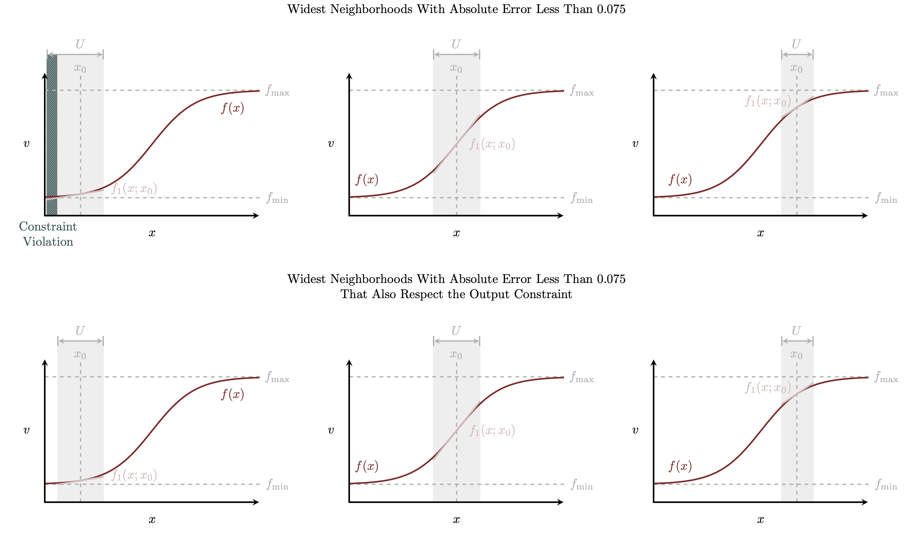

```{r setup, include=FALSE}
knitr::opts_chunk$set(comment=NA)
knitr::opts_knit$set(global.par = TRUE)
```

Taylor approximation is a powerful and general strategy for modeling the
behavior of a function within a local neighborhood of inputs.  The utility of
this strategy, however, can be limited when the output of the target function is
constrained to some subset of values.  In this case study we'll see how Taylor
approximations can be combined with transformations from the constrained output
space to an unconstrained output space and back to robustly model the local
behavior of constrained functions.

We will begin by examining some of the limitations of directly Taylor
approximating constrained functions before demonstrating how these limitations
can largely be avoided by removing the constraint before constructing a Taylor
approximation and then incorporating it back afterwards.  Next we will discuss
in detail two common constraints and implement those insights with explicit
examples and then finish off with a short discussion of multi-dimensional
function approximation.

# Approximating Functions With Constrained Outputs
#### The Legend of Zelda: A Link To The Real Line {-}

In this section we'll explore the difficulties that can arise when constructing
Taylor approximations of constrained functions and how we can avoid some of
those difficulties with the application of a _link function_ and its inverse.
Finally we'll discuss one of the key properties that makes a link function
particularly useful in practical modeling.

## Direct Taylor Approximations

I present Taylor approximation theory in great depth, perhaps even too much
depth, in Section 1 of my
[Taylor modeling case study](https://betanalpha.github.io/assets/case_studies/taylor_models.html#1_Taylor_Approximation_Theory).  To summarize: a Taylor
approximation captures the behavior of a real-valued function
$f : X \rightarrow \mathbb{R}$ in a _local neighborhood_ $U$ around some
_baseline input_ $x_{0}$,
$$
f_{I}(x; x_{0}) \approx f(x)
$$
for $x \in U$.

<center>
<br>
```{r, out.width = "100%", echo=FALSE}

```
<br><br>
</center>

More precisely a Taylor approximation uses the differential structure of $f$ at
$x_{0}$ to inform an $I$th-order polynomial function that approximates the exact
functional behavior within this local neighborhood.  A good approximation can be
engineered by building a sufficiently high-order polynomial or restricting the
local neighborhood to a narrow interval of inputs around $x_{0}$.

Because of this local context Taylor approximations can theoretically be applied
to any real-valued function, including those whose outputs are confined to some
subset of the real line, $f : X \rightarrow V \subset \mathbb{R}$.

<center>
<br>
```{r, out.width = "50%", echo=FALSE}

```
<br><br>
</center>

While the polynomial functions that form a Taylor approximation have
unconstrained outputs the outputs within a small enough local neighborhood will
satisfy the given constraint.

<center>
<br>
```{r, out.width = "50%", echo=FALSE}

```
<br><br>
</center>

If the neighborhood is too large, however, then evaluations of the Taylor
approximation at some inputs will return outputs that violate the constraint.

<center>
<br>
```{r, out.width = "50%", echo=FALSE}

```
<br><br>
</center>

When the baseline $x_{0}$ is close to the constraint boundary the constraint can
be violated even when the absolute approximation error is small.

<center>
<br>
```{r, out.width = "50%", echo=FALSE}

```
<br><br>
</center>

In other words enforcing compatibility between a specific Taylor approximation
$f_{I}(x; x_{0})$ and an output constraint restricts the geometry of the local
neighborhoods.  If we know the local differential structure of $f$ then we may
be able to explicitly work out what inputs will lead to constraint-violating
Taylor approximation outputs and then craft appropriate local neighborhoods.
When we are _inferring_ that local differential structure, however, establishing
local neighborhoods that avoid constraint violations becomes much more
difficult.

Constrained functions also have a strong influence on the local error of Taylor
approximations.  Constrained functions that are smooth need to be highly
nonlinear near a constraint boundary in order to contort their outputs away from
the boundary and avoid violating the constraint.

<center>
<br>
```{r, out.width = "75%", echo=FALSE}
knitr::include_graphics("figures/taylor/contortion/contortion.png")
```
<br><br>
</center>

Because of this nonlinearity Taylor approximations will behave very differently
when the baseline input $x_{0}$ is close to a constraint boundary and when it is
far away.  Away from the boundary constrained functions will tend to be more
linear which makes Taylor approximations of a fixed order $I$ more accurate.
This then allows the Taylor approximation to be employed over a wider local
neighborhood.  Near a constraint boundary, however, constrained functions will
tend to exhibit stronger nonlinearities which introduce large approximation
errors that require smaller local neighborhoods.

<center>
<br>
```{r, out.width = "100%", echo=FALSE}

```
<br><br>
</center>

Alternatively if we need to fix the local neighborhood then this varying
curvature will require carefully tuning the order of the Taylor approximation
for each baseline $x_{0}$.

The strong sensitivity to the baseline input substantially complicates the
implementation of Taylor approximations for constrained functions.  Unless we
need to evaluate the constrained function only far from the constraint
boundaries direct Taylor approximation will be at best a fragile approach to
modeling the exact functional behavior.

## General Taylor Approximations

If Taylor approximating constrained functions is so difficult then why don't we
just eliminate the constraint before building a Taylor approximation in the
first place?

Consider a one-to-one function that maps the constrained output space to the
entire real line,
$$
g : V \rightarrow \mathbb{R}.
$$
The function $g$ is referred to as a _link_ function because it "links" the
nominal constrained output to an unconstrained output.

Composing the link function with the constrained function of interest defines
a completely unconstrained function,
$$
\begin{alignat*}{6}
g \circ f :\; &X& &\rightarrow& \; &\mathbb{R}&
\\
&x& &\mapsto& &g(f(x))&.
\end{alignat*}
$$
Without any output constraints $g \circ f$ should be must easier to approximate
with a Taylor approximation,
$$
g \circ f \approx (g \circ f)_{I}(x; x_{0}).
$$

That said our model depends on the function $f$, not the composed function
$g \circ f$.  In order to incorporate this Taylor approximation into our model
we need to undo the action of the link function.  Mathematically we achieve this
by applying the _inverse_ link function,
$$
\begin{alignat*}{6}
g^{-1} :\; &\mathbb{R}& &\rightarrow& \; &V&
\\
&w& &\mapsto& &g^{-1}(w)&,
\end{alignat*}
$$
to the unconstrained composition,
$$
\begin{align*}
f
&=
\mathbb{I} \circ f
\\
&=
(g^{-1} \circ g) \circ f
\\
&=
g^{-1} \circ (g \circ f).
\end{align*}
$$
Because we required that the link function is one-to-one this inverse function
will always be well-defined.

Substituting our Taylor approximation for the unconstrained composition
$g \circ f$ then gives a _general Taylor approximation_
$$
\begin{align*}
f
&=
g^{-1} \circ (g \circ f)
\\
&\approx
g^{-1} \circ (g \circ f)_{I},
\end{align*}
$$
or for a given input,
$$
f(x) \approx g^{-1} \left( (g \circ f)_{I}(x; x_{0}) \right).
$$
This construction results in a local functional model that _always_ respects the
output constraint regardless of the chosen input neighborhood.  Moreover,
because the link function is one-to-one we don't lose any information going to
the constrained space and back.

A well-chosen link function can also have the added benefit of warping the
constrained function, allowing us to better resolve all of the rapidly changing
behavior near the output boundaries.  When the composite function $g \circ f$
exhibits more uniform curvature the Taylor approximation
$(g \circ f)_{I}(x; x_{0})$ will be much less sensitive to the choice of input
baseline and hence much easier to wield in practice.

<center>
<br>
```{r, out.width = "100%", echo=FALSE}

```
<br><br>
</center>

If we need to model functional behavior in only a small neighborhood of inputs,
with output values far away from the constraint boundaries, then a Taylor
approximation model can be directly applicable. When we need to consider wider
ranges of input values, or perhaps more realistically when we don't know what
range of inputs values we might need to consider, then a general Taylor
approximation becomes a more robust tool.

Mechanically the warping of any polynomial function, with or without the
Taylor approximation interpretation, through an inverse link function is often
referred to as _general linear modeling_ or _generalized linear modeling_
[@McCullaghEtAl:1989]. The same construction with piece-wise polynomial models
is also sometimes referred to as _general(ized) additive modeling_.  That said
the use of "linear" and "additive" in this terminology can be confusing for the
same reasons discussed in Section 2.3.3 of the
[Taylor modeling case study](https://betanalpha.github.io/assets/case_studies/taylor_models.html#233_Linear_Verses_Linearized_Models).

## Productive Link Functions

Given a link function $g: V \rightarrow \mathbb{R}$ and any function
$h : \mathbb{R} \rightarrow \mathbb{R}$ the composition
$$
\begin{alignat*}{6}
h\circ g :\; &V& &\rightarrow& \; &\mathbb{R}&
\\
&y& &\mapsto& &h(g(y))&
\end{alignat*}
$$
will also define a valid link function that we can use to construct a general
Taylor approximation.  In other words there will be an infinite number of link
functions compatible with any given output constraint.  This then raises the
question of what properties separate the link functions that are more useful in
practice from those that are less useful.

When working with tools like Hamiltonian Monte Carlo smoothness is a virtue so
at the very least we want our link functions to be as differentiable as
possible.  That still leaves, however, an infinite number of possibilities.

From the Taylor approximation perspective the ideal link function is one that
converts the initial constrained function into a polynomial function,
$$
g \circ f(x) = \sum_{i = 0}^{I} \beta_{i} x^{i}
$$
that can be reconstructed exactly with an $I$th-order Taylor approximation.
When we are trying to infer the constrained function $f$, however, we typically
won't have the information needed to even attempt to engineer such a link
function.

A more practical consideration for Bayesian modeling is how a link function
transforms the _additive_ structure of a Taylor approximation.  Recall that a
Taylor approximation is built up from a sum of terms; at zeroth-order we have a
constant intercept, at first-order we have the component covariate
perturbations contracted against a one-dimensional array of parameters,
$$
\Delta \mathbf{x}^{T} \cdot \boldsymbol{\beta},
$$
and so on.  The contractions that give these higher-order terms can also be
written as sums of intermediate components,
$$
\Delta \mathbf{x}^{T} \cdot \boldsymbol{\beta}
=
\Delta x_{1} \, \beta_{1} + \Delta x_{2} \, \beta_{2} + \ldots.
$$

Because of this additive structure each of the summands influences the Taylor
approximation _independently_ of the others: the term
$\Delta x_{2} \, \beta_{2}$ will influence $f_{I}(x; x_{0})$ in the same way
regardless of the value of $\Delta x_{1} \, \beta_{1}$ or any of the other terms
in the Taylor approximation.  This allows us to independently elicit domain
expertise for each of the individual terms, greatly facilitating prior modeling.

A nonlinear inverse link functions, however, convolves all of these
contributions together so that they cannot be reasoned about so separately.
Because
$$
g^{-1}(\alpha + \Delta \alpha) \ne g^{-1}(\alpha) + g^{-1}(\Delta \alpha).
$$
the influence of second term $\Delta \alpha$ on the overall constrained
functional output will change depending on the configuration of the first term
$\alpha$.  In order to build a principled prior model for both contributions
$\alpha$ and $\Delta \alpha$ we have to reason about their _joint_ behavior,
complicating the modeling process.  Building a principled prior model for the
many contributions in even a low-order Taylor approximation can quickly become
overwhelming.

That said while a nonlinear inverse link function will not preserve additive
structure it might _translate_ it into some other interpretable, algebraic
structure.  In this case we can use that translation to connect our domain
expertise to the configuration of each individual term in the latent Taylor
approximation.

More formally if
$$
g^{-1}(\alpha + \Delta \alpha) = g^{-1}(\alpha) \ast g^{-1}(\Delta \alpha)
$$
for some interpretable, binary operation $\ast$ then we may be able to translate
our domain expertise about the constrained functional behavior to each term
$g^{-1}(\alpha)$ and $g^{-1}(\Delta \alpha)$ and then through the link function
back to $\alpha$ and $\Delta \alpha$.  Although still more complicated than
prior modeling for an untransformed Taylor approximation this decomposition will
be a huge benefit when we cannot take the output constraints for granted.

This preservation of algebraic structure is an exceptional property that few if
any link functions will exhibit.  For a given constraint there is often a unique
link function that preserves algebraic structure.

# Some Productive Link Functions
#### The Legend of Zelda: Link's Functional Awakening {-}

In this section we'll consider two common output constraints -- positive and
interval -- and the link functions that are naturally compatible.
applications.

## Positive Constraints { #sec:positive }

Let's start with a positive constraint $V = \mathbb{R}^{+}$ that excludes
negative output values.  In other words we will be interested in modeling
functional behavior of the form $f : X \rightarrow \mathbb{R}^{+}$.

### The Log Link Function

Given the positivity constraint we will need to engineer a link function of the
form $g : \mathbb{R}^{+} \rightarrow \mathbb{R}$.  An immediate candidate is one
of the most ubiquitous functions in applied mathematics: the natural logarithm
function,
$$
\begin{alignat*}{6}
\log :\; &\mathbb{R}^{+}& &\rightarrow& \; &\mathbb{R}&
\\
&v& &\mapsto& &\log(v)&.
\end{alignat*}
$$
This infinintely-differentiable log function maps inputs larger than $1$ to
positive real numbers and inputs smaller than $1$ to negative real numbers,
with $1$ falling right in the middle at zero.

<center>
<br>
```{r, out.width = "50%", echo=FALSE}
knitr::include_graphics("figures/log/link/link.png")
```
<br><br>
</center>

The corresponding inverse is given by the natural exponential function,
$$
\begin{alignat*}{6}
\exp :\; &\mathbb{R}& &\rightarrow& \; &\mathbb{R}^{+}&
\\
&w& &\mapsto& &\exp(w)&.
\end{alignat*}
$$
Here all positive inputs are mapped to the interval $(1, \infty)$ while all
negative inputs are mapped to $(0, 1)$, with $0$ being mapped in between to $1$.

<center>
<br>
```{r, out.width = "50%", echo=FALSE}

```
<br><br>
</center>

In this circumstance I often think of the exponential function as the result of
a line that has been bent over to satisfy the positivity constraint, although
this picture is admittedly a bit subjective.

<center>
<br>
```{r, out.width = "100%", echo=FALSE}

```
<br><br>
</center>

Ubiquity alone does not make the log function a useful link function.  What
really matters is how it transforms addition.  Conveniently the exponential
inverse link function maps addition into the next simplest operation:
multiplication,
$$
\exp(\alpha + \Delta \alpha) = \exp(\alpha) \cdot \exp(\Delta \alpha).
$$
This allows us to reason about each contribution as independent _scalings_ of
the positive functional output.

### Prior Modeling

Because the exponential inverse link function maps addition to multiplication we
can reason about the functional output of a general Taylor approximation
$$
\exp \left( \alpha + \sum_{j = 0}^{J} \Delta \alpha_{j} \right)
$$
as a baseline output
$$
\exp \left( \alpha \right)
$$
that is  _proportionally_ scaled by the remaining terms,
$$
\exp \left( \alpha \right) \,
\prod_{j = 0}^{J} \exp \left( \Delta \alpha_{j} \right).
$$
In other words we can elicit domain expertise about each term in the latent
Taylor approximation by reasoning about the possible proportional changes that
the term induces.

For example let's say that we are interested in modeling the relationship
between an organism's body mass, $m$, and the temperature of its environment,
$x$, with the general, first-order Taylor model
$$
m(x) = \exp \left( \alpha + \beta \, (x - x_{0}) \right).
$$

Here the exponentiated intercept defines the baseline body mass.  Any domain
expertise about the range of reasonable baselines informs the distribution
of $\exp(\alpha)$ which then informs the distribution of $\alpha$.

The linear term then allows the environmental temperature to scale this baseline
value up or down.  Eliciting domain expertise about the reasonable proportional
changes directly informs $\exp \left( \beta \, (x - x_{0}) \right)$ which we can
then use to inform a prior model for $\beta$.

For instance if even extreme environmental changes can modify the baseline body
mass by only a factor of two then the reasonable values for this term will
concentrate within the interval
$$
\frac{1}{2} \lessapprox \exp \left( \beta \, (x - x_{0}) \right) \lessapprox 2.
$$
This implies that reasonable values for the the linear argument concentrate
within the interval
$$
- \log 2 \lessapprox \beta \, (x - x_{0}) \lessapprox \log 2.
$$
If environmental temperatures can vary by at most ten degrees Celsius
$$
| x - x_{0} | \le 10 \, C
$$
then
$$
\begin{align*}
- \frac{\log 2}{10 \, C} &\lessapprox
\beta \lessapprox
\frac{\log 2}{10 \, C}
\\
- 0.069 \, C^{-1} &\lessapprox \beta \lessapprox 0.069 \, C^{-1}.
\end{align*}
$$
Contrast this to the $\text{normal}(0, 1)$ or even $\text{normal}(0, 100)$
component prior models that are often recommended as defaults.

More informative domain expertise would lead to even tighter constraints.
If we knew that body mass is unlikely to change by more than 10% then we would
need a prior model that constrains
$$
0.9 \lessapprox \exp \left( \beta \, (x - x_{0}) \right) \lessapprox 1.1,
$$
which requires a prior model for the the linear argument that concentrates
within the interval
$$
\begin{align*}
- \log 1.1 &\lessapprox \beta \, (x - x_{0}) \lessapprox \log 1.1
\\
- 0.1 &\lessapprox \beta \, (x - x_{0}) \lessapprox 0.1.
\end{align*}
$$
When environmental temperatures can vary by at most ten degrees Celsius the
reasonable values for the slope would have to concentrate in the interval
$$
\begin{align*}
- \frac{0.1}{10 \, C} &\lessapprox \beta \lessapprox \frac{0.1}{10 \, C}
\\
- 0.01 \, C^{-1} & \lessapprox \beta \lessapprox 0.01 \, C^{-1}
\end{align*}
$$
which, despite the relatively weak domain expertise that we have elicited, is
even narrower than most default prior models!

The ability to reason about proportional changes makes the log link function,
and the exponential inverse link function that complements it, _incredibly_
powerful in practice.

That said the nonlinear nature of the exponential inverse link function does
complicate this component prior modeling strategy a bit.  Recall that the
pushforward prior model for the output of a Taylor approximation is amplified
relative to the component prior models for each of its individual terms.  For
example if the component prior models for the individual terms are given by
$$
\alpha_{j} \sim \text{normal}(0, \tau)
$$
then the pushforward prior model for their sum will be inflated by a factor of
$\sqrt{J}$,
$$
\sum_{j = 1}^{J} \alpha_{j} \sim \text{normal}(0, \sqrt{J} \, \tau).
$$
When the input space is high-dimensional or the order of the Taylor
approximation is large there will be many individual terms and this inflation
can be substantial.

In a general Taylor approximation the inverse link function amplifies this
inflation which can make it even more problematic.  Pushing the latent
distribution of Taylor approximation outputs through the exponential inverse
link function stretches the distribution out towards larger and larger values
which can quickly transcend our domain expertise.

<center>
<br>
```{r, out.width = "75%", echo=FALSE}

```
<br><br>
</center>

Consequently when using a component prior model for the parameters in a general
Taylor approximation we have to be vigilant in investigating prior pushforward
checks for the distribution of constrained function outputs.  If the pushforward
distribution extends too far into extreme values then we have to go back and
narrow the latent component prior models as necessary.

### Discrete/Log/Exponential Regression

To demonstrate the application of the log link function let's consider the
regression of a discrete variate that can take only positive integer values.
An immediate candidate for the probabilistic variation in this case is a
Poisson distribution whose intensity parameter is given by a function of the
covariates,
$$
\pi(y \mid x, \theta) = \text{Poisson}(y \mid \lambda(x, \theta)).
$$

We start by configuring our local `R` environment.

```{r}
c_light <- c("#DCBCBC")
c_light_highlight <- c("#C79999")
c_mid <- c("#B97C7C")
c_mid_highlight <- c("#A25050")
c_dark <- c("#8F2727")
c_dark_highlight <- c("#7C0000")

c_light_teal <- c("#6B8E8E")
c_mid_teal <- c("#487575")
c_dark_teal <- c("#1D4F4F")

library(colormap)
nom_colors <- c("#DCBCBC", "#C79999", "#B97C7C", "#A25050", "#8F2727", "#7C0000")

par(family="CMU Serif", las=1, bty="l", cex.axis=1, cex.lab=1, cex.main=1,
    xaxs="i", yaxs="i", mar = c(5, 5, 3, 5))
   
set.seed(29483833)
```

```{r, warning=FALSE, message=FALSE}
library(rstan)
rstan_options(auto_write = TRUE)            # Cache compiled Stan programs
options(mc.cores = parallel::detectCores()) # Parallelize chains
parallel:::setDefaultClusterOptions(setup_strategy = "sequential")

util <- new.env()
source('stan_utility.R', local=util)
```

Next we'll define all of the useful visualization functions that were first
introduced in the Taylor modeling case study.

<details>
<summary>Click for the definition of all of the visualization functions.</summary>
```{r}
plot_line_hist <- function(s, min_val, max_val, delta, xlab, main="") {
  bins <- seq(min_val, max_val, delta)
  B <- length(bins) - 1
  idx <- rep(1:B, each=2)
  x <- sapply(1:length(idx),
              function(b) if(b %% 2 == 1) bins[idx[b]] else bins[idx[b] + 1])
  x <- c(min_val - 10, x, max_val + 10)

  counts <- hist(s, breaks=bins, plot=FALSE)$counts
  y <- counts[idx]
  y <- c(0, y, 0)

  ymax <- max(y) + 1

  plot(x, y, type="l", main=main, col="black", lwd=2,
       xlab=xlab, xlim=c(min_val, max_val),
       ylab="Counts", yaxt='n', ylim=c(0, ymax))
}

marginal_location_median <- function(f, name, bin_min, bin_max, B) {
  if (is.na(bin_min)) bin_min <- min(f)
  if (is.na(bin_max)) bin_max <- max(f)
  breaks <- seq(bin_min, bin_max, (bin_max - bin_min) / B)

  idx <- rep(1:B, each=2)
  xs <- sapply(1:length(idx),
               function(b) if(b %% 2 == 0) breaks[idx[b] + 1] else breaks[idx[b]] )

  N <- dim(f)[1]
  prior_f <- sapply(1:N,
                    function(n) hist(f[n, bin_min < f[n,] & f[n,] < bin_max],
                                     breaks=breaks, plot=FALSE)$counts)
  probs = c(0.1, 0.2, 0.3, 0.4, 0.5, 0.6, 0.7, 0.8, 0.9)
  cred <- sapply(1:B, function(b) quantile(prior_f[b,], probs=probs))
  pad_cred <- do.call(cbind, lapply(idx, function(n) cred[1:9, n]))

  plot(1, type="n", main="",
       xlim=c(bin_min, bin_max), xlab=name,
       ylim=c(min(cred[1,]), max(cred[9,])), ylab="Counts")

  polygon(c(xs, rev(xs)), c(pad_cred[1,], rev(pad_cred[9,])),
          col = c_light, border = NA)
  polygon(c(xs, rev(xs)), c(pad_cred[2,], rev(pad_cred[8,])),
          col = c_light_highlight, border = NA)
  polygon(c(xs, rev(xs)), c(pad_cred[3,], rev(pad_cred[7,])),
          col = c_mid, border = NA)
  polygon(c(xs, rev(xs)), c(pad_cred[4,], rev(pad_cred[6,])),
          col = c_mid_highlight, border = NA)
  lines(xs, pad_cred[5,], col=c_dark, lwd=2)
}

conditional_location_median <- function(obs_covar, x_name, f, y_name,
                                        bin_min, bin_max, B) {
  breaks <- seq(bin_min, bin_max, (bin_max - bin_min) / B)
  idx <- rep(1:B, each=2)
  xs <- sapply(1:length(idx), function(b)
    if(b %% 2 == 1) breaks[idx[b]] else breaks[idx[b] + 1])

  S <- length(f[,1])

  probs = c(0.1, 0.2, 0.3, 0.4, 0.5, 0.6, 0.7, 0.8, 0.9)
  cred <- matrix(NA, nrow=9, ncol=B)

  for (b in 1:B) {
    bin_idx <- which(breaks[b] <= obs_covar & obs_covar < breaks[b + 1])
 
    if (length(bin_idx)) {
      bin_f_medians <- sapply(1:S, function(s) median(f[s, bin_idx]))
      cred[,b] <- quantile(bin_f_medians, probs=probs)
    }
  }

  # Compute graphical bounds before replacing NAs with zeros
  ymin <- min(cred[1,], na.rm=T)
  ymax <- max(cred[9,], na.rm=T)

  for (b in 1:B) {
    if ( is.na(cred[1, b]) ) cred[,b] = rep(0, length(probs))
  }

  pad_cred <- do.call(cbind, lapply(idx, function(n) cred[1:9, n]))

  plot(1, type="n", main="",
       xlim=c(bin_min, bin_max), xlab=x_name,
       ylim=c(ymin, ymax), ylab=y_name)

  polygon(c(xs, rev(xs)), c(pad_cred[1,], rev(pad_cred[9,])),
          col = c_light, border = NA)
  polygon(c(xs, rev(xs)), c(pad_cred[2,], rev(pad_cred[8,])),
          col = c_light_highlight, border = NA)
  polygon(c(xs, rev(xs)), c(pad_cred[3,], rev(pad_cred[7,])),
          col = c_mid, border = NA)
  polygon(c(xs, rev(xs)), c(pad_cred[4,], rev(pad_cred[6,])),
          col = c_mid_highlight, border = NA)

  for (b in 1:B) {
    if (length(which(breaks[b] <= obs_covar & obs_covar < breaks[b + 1]))) {
      lines(xs[(2 * b - 1):(2 * b)],
            pad_cred[5,(2 * b - 1):(2 * b)],
            col=c_dark, lwd=2)
    }
  }
}

marginal_variate_median_retro <- function(obs, pred, bin_min, bin_max, B) {
  if (is.na(bin_min)) bin_min <- min(pred)
  if (is.na(bin_max)) bin_max <- max(pred)
  breaks <- seq(bin_min, bin_max, (bin_max - bin_min) / B)

  idx <- rep(1:B, each=2)
  xs <- sapply(1:length(idx),
               function(b) if(b %% 2 == 0) breaks[idx[b] + 1] else breaks[idx[b]] )

  filt_obs <- obs[bin_min < obs & obs < bin_max]
  obs <- hist(filt_obs, breaks=breaks, plot=FALSE)$counts
  pad_obs <- do.call(cbind, lapply(idx, function(n) obs[n]))

  N <- dim(pred)[1]
  post_pred <- sapply(1:N,
                      function(n) hist(pred[n, bin_min < pred[n,] & pred[n,] < bin_max],
                                       breaks=breaks, plot=FALSE)$counts)
  probs = c(0.1, 0.2, 0.3, 0.4, 0.5, 0.6, 0.7, 0.8, 0.9)
  cred <- sapply(1:B, function(b) quantile(post_pred[b,], probs=probs))
  pad_cred <- do.call(cbind, lapply(idx, function(n) cred[1:9, n]))

  plot(1, type="n", main="",
       xlim=c(bin_min, bin_max), xlab="y",
       ylim=c(0, max(c(obs, cred[9,]))), ylab="Counts")

  polygon(c(xs, rev(xs)), c(pad_cred[1,], rev(pad_cred[9,])),
          col = c_light, border = NA)
  polygon(c(xs, rev(xs)), c(pad_cred[2,], rev(pad_cred[8,])),
          col = c_light_highlight, border = NA)
  polygon(c(xs, rev(xs)), c(pad_cred[3,], rev(pad_cred[7,])),
          col = c_mid, border = NA)
  polygon(c(xs, rev(xs)), c(pad_cred[4,], rev(pad_cred[6,])),
          col = c_mid_highlight, border = NA)
  lines(xs, pad_cred[5,], col=c_dark, lwd=2)

  lines(xs, pad_obs, col="white", lty=1, lw=2.5)
  lines(xs, pad_obs, col="black", lty=1, lw=2)
}

conditional_variate_median_retro <- function(obs_var, obs_covar, pred_var,
                                             x_name, bin_min, bin_max, B) {
  breaks <- seq(bin_min, bin_max, (bin_max - bin_min) / B)
  idx <- rep(1:B, each=2)
  xs <- sapply(1:length(idx), function(b)
    if(b %% 2 == 1) breaks[idx[b]] else breaks[idx[b] + 1])

  S <- length(pred_var[,1])

  probs = c(0.1, 0.2, 0.3, 0.4, 0.5, 0.6, 0.7, 0.8, 0.9)
  obs_var_medians <- rep(NA, B)
  cred <- matrix(NA, nrow=9, ncol=B)

  for (b in 1:B) {
    bin_idx <- which(breaks[b] <= obs_covar & obs_covar < breaks[b + 1])
 
    if (length(bin_idx)) {
      obs_var_medians[b] <- median(obs_var[bin_idx])
      bin_pred_medians <- sapply(1:S, function(s) median(pred_var[s, bin_idx]))
      cred[,b] <- quantile(bin_pred_medians, probs=probs)
    }
  }

  # Compute graphical bounds before replacing NAs with zeros
  ymin <- min(min(cred[1,], na.rm=T), min(obs_var_medians, na.rm=T))
  ymax <- max(max(cred[9,], na.rm=T), max(obs_var_medians, na.rm=T))

  for (b in 1:B) {
    if ( is.na(cred[1, b]) ) cred[,b] = rep(0, length(probs))
  }

  pad_cred <- do.call(cbind, lapply(idx, function(n) cred[1:9, n]))

  plot(1, type="n", main="",
       xlim=c(bin_min, bin_max), xlab=x_name,
       ylim=c(ymin, ymax), ylab="y_pred")

  polygon(c(xs, rev(xs)), c(pad_cred[1,], rev(pad_cred[9,])),
          col = c_light, border = NA)
  polygon(c(xs, rev(xs)), c(pad_cred[2,], rev(pad_cred[8,])),
          col = c_light_highlight, border = NA)
  polygon(c(xs, rev(xs)), c(pad_cred[3,], rev(pad_cred[7,])),
          col = c_mid, border = NA)
  polygon(c(xs, rev(xs)), c(pad_cred[4,], rev(pad_cred[6,])),
          col = c_mid_highlight, border = NA)

  for (b in 1:B) {
    if (length(which(breaks[b] <= obs_covar & obs_covar < breaks[b + 1]))) {
      lines(xs[(2 * b - 1):(2 * b)],
            pad_cred[5,(2 * b - 1):(2 * b)],
            col=c_dark, lwd=2)
   
      lines(xs[(2 * b - 1):(2 * b)],
            c(obs_var_medians[b], obs_var_medians[b]),
            col="white", lwd=3)
   
      lines(xs[(2 * b - 1):(2 * b)],
            c(obs_var_medians[b], obs_var_medians[b]),
            col="black", lwd=2)
    }
  }
}

conditional_variate_median_retro_residual <- function(obs_var, obs_covar,
                                                      pred_var, name,
                                                      bin_min, bin_max, B) {
  breaks <- seq(bin_min, bin_max, (bin_max - bin_min) / B)
  idx <- rep(1:B, each=2)
  xs <- sapply(1:length(idx), function(b)
    if(b %% 2 == 1) breaks[idx[b]] else breaks[idx[b] + 1])

  S <- length(pred_var[,1])

  probs = c(0.1, 0.2, 0.3, 0.4, 0.5, 0.6, 0.7, 0.8, 0.9)
  cred <- matrix(NA, nrow=9, ncol=B)

  for (b in 1:B) {
    bin_idx <- which(breaks[b] <= obs_covar & obs_covar < breaks[b + 1])
 
    if (length(bin_idx)) {
      bin_pred_medians <- sapply(1:S, function(s) median(pred_var[s, bin_idx]))
      cred[,b] <- quantile(bin_pred_medians, probs=probs) - median(obs_var[bin_idx])
    }
    if ( is.na(cred[1, b]) ) cred[,b] = rep(0, length(probs))
  }

  pad_cred <- do.call(cbind, lapply(idx, function(n) cred[1:9, n]))

  ymin <- min(pad_cred[1,], na.rm=T)
  ymax <- max(pad_cred[9,], na.rm=T)

  plot(1, type="n", main="",
       xlim=c(bin_min, bin_max), xlab=name,
       ylim=c(ymin, ymax), ylab="y_pred - y_obs")

  abline(h=0, col="gray80", lwd=2, lty=3)

  polygon(c(xs, rev(xs)), c(pad_cred[1,], rev(pad_cred[9,])),
          col = c_light, border = NA)
  polygon(c(xs, rev(xs)), c(pad_cred[2,], rev(pad_cred[8,])),
          col = c_light_highlight, border = NA)
  polygon(c(xs, rev(xs)), c(pad_cred[3,], rev(pad_cred[7,])),
          col = c_mid, border = NA)
  polygon(c(xs, rev(xs)), c(pad_cred[4,], rev(pad_cred[6,])),
          col = c_mid_highlight, border = NA)

  for (b in 1:B) {
    if (length(which(breaks[b] <= obs_covar & obs_covar < breaks[b + 1]))) {
      lines(xs[(2 * b - 1):(2 * b)], pad_cred[5,(2 * b - 1):(2 * b)],
            col=c_dark, lwd=2)
    }
  }
}

plot_marginal <- function(values, name, display_xlims, title="") {
  bin_lims <- range(values)
  delta <- diff(bin_lims) / 50
  breaks <- seq(bin_lims[1], bin_lims[2] + delta, delta)

  hist(values, breaks=breaks, prob=T,
       main=title, xlab=name, xlim=display_xlims,
       ylab="", yaxt='n',
       col=c_dark, border=c_dark_highlight)
}

plot_marginal_comp <- function(values1, values2, name,
                               display_xlims, display_ylims, title="") {
  r1 <- range(values1)
  r2 <- range(values2)

  bin_lims <- c(min(r1[1], r2[1]), max(r1[2], r2[2]))
  delta <- diff(bin_lims) / 50
  breaks <- seq(bin_lims[1], bin_lims[2] + delta, delta)

  hist(values1, breaks=breaks, prob=T,
       main=title, xlab=name, xlim=display_xlims,
       ylab="", yaxt='n', ylim=display_ylims,
       col=c_light, border=c_light_highlight)

  hist(values2, breaks=breaks, prob=T, add=T,
       col=c_dark, border=c_dark_highlight)
}
```
</details>

In this exercise we'll use simulated data saved into the local `data` object.

<details>
<summary>Click for spoilers on how the data are simulated.</summary>
```{r}
writeLines(readLines("stan_programs/simu_log_reg.stan"))
```

```{r, warning=FALSE, message=FALSE}
simu <- stan(file="stan_programs/simu_log_reg.stan",
             iter=1, warmup=0, chains=1,
             seed=4838282, algorithm="Fixed_param")

X <- extract(simu)$X[1,,]
y <- extract(simu)$y[1,]

data <- list("M" = 3, "N" = 1000, "x0" = c(0, 2, -1), "X" = X, "y" = y)

range(data$X[,1])
range(data$X[,2])
range(data$X[,3])
```
</details>

We begin the analysis proper by taking a quick look at the simulated data.  As
expected the observed variates take only positive integer values and there does
seem to be some nontrivial correlations between those variates and the observed
covariates.

```{r}
par(mfrow=c(3, 3), mar = c(5, 5, 2, 1))

plot_line_hist(data$X[,1], -1, 1, 0.1, "x1")
plot_line_hist(data$X[,2], -1, 5, 0.25, "x2")
plot_line_hist(data$X[,3], -10, 0, 0.25, "x3")

plot(data$X[,1], data$X[,2], pch=16, cex=1.0, col="black",
     main="", xlim=c(-1, 1), xlab="x1", ylim=c(-1, 5), ylab="x2")

plot(data$X[,1], data$X[,3], pch=16, cex=1.0, col="black",
     main="", xlim=c(-1, 1), xlab="x1", ylim=c(-10, 0), ylab="x3")

plot(data$X[,2], data$X[,3], pch=16, cex=1.0, col="black",
     main="", xlim=c(-1, 5), xlab="x2", ylim=c(-10, 0), ylab="x3")

plot(data$X[,1], data$y, pch=16, cex=1.0, col="black",
     main="", xlim=c(-1, 1), xlab="x1", ylim=c(0, 60), ylab="y")

plot(data$X[,2], data$y, pch=16, cex=1.0, col="black",
     main="", xlim=c(-1, 5), xlab="x2", ylim=c(0, 60), ylab="y")

plot(data$X[,3], data$y, pch=16, cex=1.0, col="black",
     main="", xlim=c(-10, 0), xlab="x3", ylim=c(0, 60), ylab="y")
```

If we want to model these observations with a Taylor model then we need to
choose a baseline.  In a real analysis we would inform these baselines with
domain expertise, but here I'll just impose some component baselines by fiat.

```{r}
data$x0 <- c(0, 2, -1)
```

For our first model let's be a little sloppy and ignore not only the positivity
of the variates but also their discreteness.  In particular instead of starting
with the Poisson model for the probabilistic variation we'll start with a
normal model and a completely unconstrained first-order Taylor approximation for
the location function.

When the marginal variate distribution concentrates on sufficiently large values
this approximation might not be terrible.  That said, positive variates are
guaranteed only when the location function is everywhere positive which limits
the valid configurations of the Taylor approximation.

Without any interpretable context we don't have the domain expertise to build a
principled prior model so as with the baselines I'll just impose one.  This
prior model, however, is not entirely arbitrary.  It is designed to
approximately restrict the location function to positive outcomes, consistent
with our assumption that the normal model will be valid.

```{r}
writeLines(readLines("stan_programs/normal_linear_prior.stan"))
```

```{r, warning=FALSE, message=FALSE}
fit <- stan(file="stan_programs/normal_linear_prior.stan",
            data=data, seed=8438338, refresh=0)

samples = extract(fit)
```

Indeed the induced behavior of the location function outputs is mostly contained
to positive values, although there is some mild leakage into negative values.
So long as the observed variates are large enough this shouldn't be too
problematic.

```{r}
par(mfrow=c(1, 1), mar = c(5, 5, 3, 1))
marginal_location_median(samples$mu, "mu", -20, 60, 40)
rect(-20, 0, 0, 400, col=paste0(c_light_teal, "33"), border=FALSE)
```

```{r}
par(mfrow=c(1, 3), mar = c(5, 5, 2, 1))

conditional_location_median(data$X[,1], "x1", samples$mu, "mu", -1, 1, 20)
abline(v=data$x0[1], lwd=2, col="grey", lty=3)
rect(-10, -20, 10, 0, col=paste0(c_light_teal, "33"), border=FALSE)

conditional_location_median(data$X[,2], "x2", samples$mu, "mu", -1, 5, 20)
abline(v=data$x0[2], lwd=2, col="grey", lty=3)
rect(-10, -20, 10, 0, col=paste0(c_light_teal, "33"), border=FALSE)

conditional_location_median(data$X[,3], "x3", samples$mu, "mu", -10, 0, 20)
abline(v=data$x0[3], lwd=2, col="grey", lty=3)
rect(-10, -20, 10, 0, col=paste0(c_light_teal, "33"), border=FALSE)
```

Convolving these sampled location function outputs with the normal variation
only increases the leakage into constraint violating behaviors.

```{r}
par(mfrow=c(1, 1), mar = c(5, 5, 3, 1))
marginal_location_median(samples$y_pred, "y", -30, 70, 30)
rect(-30, 0, 0, 400, col=paste0(c_light_teal, "33"), border=FALSE)
```

```{r}
par(mfrow=c(1, 3), mar = c(5, 5, 2, 1))

conditional_location_median(data$X[,1], "x1", samples$y_pred, "y", -1, 1, 20)
abline(v=data$x0[1], lwd=2, col="grey", lty=3)
rect(-10, -20, 10, 0, col=paste0(c_light_teal, "33"), border=FALSE)

conditional_location_median(data$X[,2], "x2", samples$y_pred, "y", -1, 5, 20)
abline(v=data$x0[2], lwd=2, col="grey", lty=3)
rect(-10, -20, 10, 0, col=paste0(c_light_teal, "33"), border=FALSE)

conditional_location_median(data$X[,3], "x3", samples$y_pred, "y", -10, 0, 20)
abline(v=data$x0[3], lwd=2, col="grey", lty=3)
rect(-10, -20, 10, 0, col=paste0(c_light_teal, "33"), border=FALSE)
```

While this model isn't entirely consistent with the known constraints it might
be a reasonable approximation.  Of course hope alone isn't sufficient
statistical reasoning.  To verify whether or not this model is a decent
approximation we have to fit it to the observed data.

```{r}
writeLines(readLines("stan_programs/normal_linear.stan"))
```

```{r, warning=FALSE, message=FALSE}
fit <- stan(file="stan_programs/normal_linear.stan", data=data,
            seed=8438338, refresh=0)

util$check_all_diagnostics(fit)
```

The lack of diagnostic warnings might give us hope, but the inferred location
behaviors stray pretty far past the positivity constraint.

```{r}
samples = extract(fit)

par(mfrow=c(1, 1), mar = c(5, 5, 3, 1))
marginal_location_median(samples$mu, "mu", -20, 50, 30)
rect(-20, 0, 0, 400, col=paste0(c_light_teal, "33"), border=FALSE)
```

To really critique our model, however, we need to consider retrodictive checks.
Unfortunately the retrodictive behavior of the marginal variate distribution
leaves something to be desired.  The retrodictive variate distribution not only
spills below zero but also doesn't match the asymmetric shape of the observed
data.  Ultimately it doesn't look like the observed variates are not far enough
away from the positivity boundary for that boundary to be ignorable.

```{r}
par(mfrow=c(1, 1), mar = c(5, 5, 3, 1))
marginal_variate_median_retro(data$y, samples$y_pred, -50, 80, 50)
rect(-50, 0, 0, 400, col=paste0(c_light_teal, "33"), border=FALSE)
```

The conditional retrodictive checks suggest that our first-order Taylor
approximation for the location function might be too rigid, but that might also
be an artifact of the normal variation model.

```{r}
par(mfrow=c(2, 3), mar = c(5, 5, 3, 1))

conditional_variate_median_retro(data$y, data$X[,1], samples$y_pred,
                                 "x1", -1, 1, 20)
rect(-10, -50, 10, 0, col=paste0(c_light_teal, "33"), border=FALSE)

conditional_variate_median_retro(data$y, data$X[,2], samples$y_pred,
                                 "x2", -1, 5, 20)
rect(-10, -50, 10, 0, col=paste0(c_light_teal, "33"), border=FALSE)

conditional_variate_median_retro(data$y, data$X[,3], samples$y_pred,
                                 "x3", -10, 0, 20)
rect(-10, -50, 10, 0, col=paste0(c_light_teal, "33"), border=FALSE)

conditional_variate_median_retro_residual(data$y, data$X[,1], samples$y_pred,
                                          "x1", -1, 1, 20)
conditional_variate_median_retro_residual(data$y, data$X[,2], samples$y_pred,
                                          "x2", -1, 5, 20)
conditional_variate_median_retro_residual(data$y, data$X[,3], samples$y_pred,
                                          "x3", -10, 0, 20)
```

Keeping in mind potential limitations in a first-order Taylor approximation
let's prioritize the potential improvement of the variation model.  One way to
accommodate an asymmetric variate distributions is to drop the strong assumption
of normal variation in faovr of the assumption of Poisson variation that is much
more appropriate for our observed variates.

An immediate problem with this pairing of a Poisson variation model and an
unconstrained Taylor approximation is that the Taylor approximation can output
negative location values where the Poisson mass function is completely
_undefined_.  Constrast this to the normal variation model where negative
location values could lead to poor inferences and predictions but didn't
obstruct the evaluation of the model itself.  In order to implement the Poisson
model we have to be careful to avoid these ill-defined evaluations.

Trying to explicitly constrain the configuration of a first-order Taylor
approximation so that its outputs will be positive for all the observed
covariate inputs is typically infeasible.  We can, however, reject Markov
transitions that stray into constraint-violating configurations before we try to
evaluate the Poisson model.  We just have to be careful to initialize the Markov
chains in positive configurations so that Stan's Hamiltonian Monte Carlo sampler
will be able to adapt from these initializations.

Here we'll use a heuristic that avoids negative outputs with high probability
while also covering most of the span of the prior model.  As always with Markov
chain Monte Carlo the more diffuse the initializations the better we can
empirically diagnose convergence.

```{r}
pos_inits <- list()

for (c in 1:4) {
  beta <- rnorm(3, 0, 1)
  alpha <- -min(data$X %*% beta) + 5
  pos_inits[[c]] <- list("alpha" = alpha, "beta" = beta)
}
```

We begin, as always, with an investigation of the prior model and its
consequences.

```{r}
writeLines(readLines("stan_programs/poisson_linear_prior.stan"))
```

```{r, warning=FALSE, message=FALSE}
fit <- stan(file="stan_programs/poisson_linear_prior.stan",
            data=data, seed=8438338, refresh=0,
            init=pos_inits)
```

In Stan calling the `reject` function effectively forces the current numerical
Hamiltonian trajectory to diverge.  Consequently each transition that ends with
a call to the `reject` function is tagged as a divergent transition, and we can
use the divergence diagnostic to see how often the function was called.

```{r}
util$check_all_diagnostics(fit)
```

The high percentage of divergences indicates that without the rejections our
prior model places a quite a bit of probability on Taylor approximation
configurations with negative outputs.  The constant rejections to avoid these
constraint violations compromises the efficient exploration of Hamiltonian Monte
Carlo, and with enough rejections the exploration will eventually devolve into a
computationally wasteful random walk.

That said the rejections do ensure that the positive location function
constraint is satisfied.

```{r}
samples = extract(fit)

par(mfrow=c(1, 1), mar = c(5, 5, 3, 1))
marginal_location_median(samples$mu, "mu", -5, 60, 50)
rect(-20, 0, 0, 400, col=paste0(c_light_teal, "33"), border=FALSE)
```

```{r}
par(mfrow=c(1, 3), mar = c(5, 5, 2, 1))

conditional_location_median(data$X[,1], "x1", samples$mu, "mu", -1, 1, 20)
abline(v=data$x0[1], lwd=2, col="grey", lty=3)
rect(-10, -20, 10, 0, col=paste0(c_light_teal, "33"), border=FALSE)

conditional_location_median(data$X[,2], "x2", samples$mu, "mu", -1, 5, 20)
abline(v=data$x0[2], lwd=2, col="grey", lty=3)
rect(-10, -20, 10, 0, col=paste0(c_light_teal, "33"), border=FALSE)

conditional_location_median(data$X[,3], "x3", samples$mu, "mu", -10, 0, 20)
abline(v=data$x0[3], lwd=2, col="grey", lty=3)
rect(-10, -20, 10, 0, col=paste0(c_light_teal, "33"), border=FALSE)
```

The Poisson variation model then ensures that the predicted variates are
positive as well.  Note the asymmetry in the prior predictive distribution.

```{r}
par(mfrow=c(1, 1), mar = c(5, 5, 3, 1))
marginal_location_median(samples$y_pred, "y", -5.5, 70.5, 76)
rect(-20, 0, 0, 400, col=paste0(c_light_teal, "33"), border=FALSE)
```

```{r}
par(mfrow=c(1, 3), mar = c(5, 5, 2, 1))

conditional_location_median(data$X[,1], "x1", samples$y_pred, "y", -1, 1, 20)
abline(v=data$x0[1], lwd=2, col="grey", lty=3)
rect(-10, -20, 10, 0, col=paste0(c_light_teal, "33"), border=FALSE)

conditional_location_median(data$X[,2], "x2", samples$y_pred, "y", -1, 5, 20)
abline(v=data$x0[2], lwd=2, col="grey", lty=3)
rect(-10, -20, 10, 0, col=paste0(c_light_teal, "33"), border=FALSE)

conditional_location_median(data$X[,3], "x3", samples$y_pred, "y", -10, 0, 20)
abline(v=data$x0[3], lwd=2, col="grey", lty=3)
rect(-10, -20, 10, 0, col=paste0(c_light_teal, "33"), border=FALSE)
```

Will this rejection mechanism be robust enough to let us fit the observed data?
There's only one way to find out.

```{r}
writeLines(readLines("stan_programs/poisson_linear.stan"))
```

```{r, warning=FALSE, message=FALSE}
fit <- stan(file="stan_programs/poisson_linear.stan", data=data,
            seed=8438338, refresh=0, init=pos_inits)
```

Oh, no.

```{r}
capture.output(util$check_n_eff(fit))[1:10]
capture.output(util$check_rhat(fit))[1:10]
util$check_div(fit)
util$check_treedepth(fit)
util$check_energy(fit)
```

Let's try to break these diagnostic failures down one by one, starting with the
divergences.  The large proportion of divergent transitions is consistent with
excessive rejections which compromise the Markov chains' ability to explore the 
truncated parameter space.  

To better resolve this truncated region Stan tries to adapt the symplectic 
integrator step size in some of the Markov chains to very small values.

```{r}
sapply(1:4, function(c) get_sampler_params(fit, inc_warmup=FALSE)[[c]][,'stepsize__'][1])
```

Normally the length of the numerical Hamiltonian trajectories would increase to
compensate for such small step sizes, but most of the numerical trajectories are
prematurely truncated by those rejections.


```{r}
par(mfrow=c(1, 1), mar = c(5, 2, 2, 1))
steps <- do.call(rbind,
                 get_sampler_params(fit, inc_warmup=FALSE))[,'n_leapfrog__']
hist(steps, breaks=seq(-0.5, 220.5, 1), main="",
     col=c_dark, border=c_dark_highlight,
     xlab="Number of Leapfrog Steps", yaxt="n", ylab="")
```

The stunted trajectories result in extremely inefficient exploration.  We don't
see blobs in the pairs plots but rather traces of random walks!

```{r}
samples = extract(fit)
unpermuted_samples <- extract(fit, permute=FALSE)

par(mfrow=c(2, 2), mar = c(5, 5, 3, 1))

for (c in 1:4) {
  plot(samples$alpha, samples$beta[,1],
       main=paste("Chain", c), col=paste0(c_light, "33"), pch=16, cex=0.8,
       xlab="alpha", ylab="beta[1]",
       xlim=c(20, 23), ylim=c(-1, 0.5))
  points(unpermuted_samples[,c,1], unpermuted_samples[,c,2],
         col=paste0(c_dark, "33"), pch=16, cex=0.8)
}
```

The random walk behavior is even more clear if we zoom in to the individual
Markov chains.

```{r}
par(mfrow=c(2, 2), mar = c(5, 5, 3, 1))

for (c in 1:4) {
  plot(unpermuted_samples[,c,1], unpermuted_samples[,c,2],
       main=paste("Chain", c), xlab="alpha", ylab="beta[1]",
       col=paste0(c_dark, "33"), pch=16, cex=0.8)
}
```

In fact the exploration is so slow that the individual Markov chains have not
yet had the opportunity to converge to each other which explains all of the
split $\hat{R}$ warnings.  Here the large values of split $\hat{R}$ indicate not
any real multimodality in the posterior distribution but rather a lack of
convergence of the individual Markov chains.

Even if we ignored these computational issues the approximation of the posterior 
fit afforded by this poor exploration doesn't even come close to conforming to
what we see in the observed data.

```{r}
par(mfrow=c(1, 1), mar = c(5, 5, 3, 1))
marginal_variate_median_retro(data$y, samples$y_pred, -5.5, 60.5, 66)
rect(-20, 0, 0, 400, col=paste0(c_light_teal, "33"), border=FALSE)
```

```{r}
par(mfrow=c(2, 3), mar = c(5, 5, 3, 1))

conditional_variate_median_retro(data$y, data$X[,1], samples$y_pred,
                                 "x1", -1, 1, 20)
rect(-10, -20, 10, 0, col=paste0(c_light_teal, "33"), border=FALSE)

conditional_variate_median_retro(data$y, data$X[,2], samples$y_pred,
                                 "x2", -1, 5, 20)
rect(-10, -20, 10, 0, col=paste0(c_light_teal, "33"), border=FALSE)

conditional_variate_median_retro(data$y, data$X[,3], samples$y_pred,
                                 "x3", -10, 0, 20)
rect(-10, -20, 10, 0, col=paste0(c_light_teal, "33"), border=FALSE)

conditional_variate_median_retro_residual(data$y, data$X[,1], samples$y_pred,
                                          "x1", -1, 1,  20)
conditional_variate_median_retro_residual(data$y, data$X[,2], samples$y_pred,
                                          "x2", -1, 5, 20)
conditional_variate_median_retro_residual(data$y, data$X[,3], samples$y_pred,
                                          "x3", -10, 0, 20)
```

Because of the poor exploration we can't trust the posterior computation which
means that we can't determine if the retrodictive tension is due to the
computational problems or the model itself.  We could try to run _many_ more
iterations to give the random walks more time to expand into the posterior
distribution, but here we'll so straight to a modeling solution that avoids the
need for rejections entirely.

In particular perhaps a link function will prove to be more robust than forcing
the positivity of the location function with brute force rejections.  To that
end let's appeal to a general Taylor approximation where the linear model is
wrapped in an exponential inverse link function to manifestly enforce
positivity.  In this regression context the latent Taylor approximation directly
models the _log location_ function.

This approach, however, will require a translation of our initial prior model.
For the intercept the thresholds
$$
13.35 \lessapprox \alpha \lessapprox 36.65
$$
become
$$
\begin{align*}
\log 13.35 &\lessapprox \alpha \lessapprox  \log 36.65
\\
2.59 &\lessapprox \alpha \lessapprox 3.60.
\end{align*}
$$
We can ensure soft containment to this interval with a normal prior model given
by the location parameter
$$
\mu_{\alpha} = 0.5 \cdot (2.59 + 3.60)
$$
and scale parameter
$$
\tau_{\alpha} = \frac{1}{2.33} \, \frac{ 3.60 - 2.59 }{ 2 }.
$$

For the slopes we need to consider the possible proportional changes to the
intercept-only baseline.  The variation
$$
\beta \, x = 3 \cdot 2.33 = 6.99
$$
in the linear model roughly corresponds to a
$$
\frac{25 + 6.99}{ 25 } = 1.28
$$
proportional change.  This suggests
$$
-\log(1.28) \lessapprox \beta \lessapprox \log(1.28)
$$
in the exponential model.

```{r}
writeLines(readLines("stan_programs/poisson_log_linear1_prior.stan"))
```

```{r, warning=FALSE, message=FALSE}
fit <- stan(file="stan_programs/poisson_log_linear1_prior.stan",
            data=data, seed=8438338, refresh=0)

samples = extract(fit)
```

Wrapping the Taylor approximation in an exponential inverse link function
enforced positivity but it does result in a heavy upper tail.  In this case that
upper tail doesn't stretch too far, but if it did we might want to be more
aggressive with our prior modeling of the latent Taylor approximation.

```{r}
par(mfrow=c(1, 1), mar = c(5, 5, 3, 1))
marginal_location_median(samples$mu, "mu", -5.5, 90.5, 50)
rect(-20, 0, 0, 400, col=paste0(c_light_teal, "33"), border=FALSE)
```

```{r}
par(mfrow=c(1, 3), mar = c(5, 5, 2, 1))

conditional_location_median(data$X[,1], "x1", samples$mu, "mu", -1, 1, 20)
abline(v=data$x0[1], lwd=2, col="grey", lty=3)
rect(-10, -20, 10, 0, col=paste0(c_light_teal, "33"), border=FALSE)

conditional_location_median(data$X[,2], "x2", samples$mu, "mu", -1, 5, 20)
abline(v=data$x0[2], lwd=2, col="grey", lty=3)
rect(-10, -20, 10, 0, col=paste0(c_light_teal, "33"), border=FALSE)

conditional_location_median(data$X[,3], "x3", samples$mu, "mu", -10, 0, 20)
abline(v=data$x0[3], lwd=2, col="grey", lty=3)
rect(-10, -20, 10, 0, col=paste0(c_light_teal, "33"), border=FALSE)
```

With our model enforcing both positive location function outputs and positive
variates the prior predictive distribution is consistent with our knowledge of
the variate structure.

```{r}
par(mfrow=c(1, 1), mar = c(5, 5, 3, 1))
marginal_location_median(samples$y_pred, "y", -5.5, 90.5, 96)
rect(-20, 0, 0, 400, col=paste0(c_light_teal, "33"), border=FALSE)
```

```{r}
par(mfrow=c(1, 3), mar = c(5, 5, 2, 1))

conditional_location_median(data$X[,1], "x1", samples$y_pred, "y", -1, 1, 20)
abline(v=data$x0[1], lwd=2, col="grey", lty=3)
rect(-10, -20, 10, 0, col=paste0(c_light_teal, "33"), border=FALSE)

conditional_location_median(data$X[,2], "x2", samples$y_pred, "y", -1, 5, 20)
abline(v=data$x0[2], lwd=2, col="grey", lty=3)
rect(-10, -20, 10, 0, col=paste0(c_light_teal, "33"), border=FALSE)

conditional_location_median(data$X[,3], "x3", samples$y_pred, "y", -10, 0, 20)
abline(v=data$x0[3], lwd=2, col="grey", lty=3)
rect(-10, -20, 10, 0, col=paste0(c_light_teal, "33"), border=FALSE)
```

How do our posterior inferences fare?

```{r}
writeLines(readLines("stan_programs/poisson_log_linear1.stan"))
```

```{r, warning=FALSE, message=FALSE}
fit <- stan(file="stan_programs/poisson_log_linear1.stan", data=data,
            seed=8438338, refresh=0)

util$check_all_diagnostics(fit)
```

With the exponential inverse link function doing all of the work we no longer
see any indications of computational problems.

```{r}
poisson1_samples = extract(fit)
```

Before consulting the posterior retrodictive checks let's utilize a nice feature
of the Stan modeling language.  Because the Poisson probability mass function is
often used with the exponential link function Stan includes a `poisson_log_lpmf`
function that integrates the two automatically.  In addition to making the code
a bit cleaner this integrated implementation is able to take advantage of some
cancellations to ensure better numerical stability and even a small decrease in
computational cost.  Note that, perhaps confusingly, the naming refers to the
initial log link function and not the exponential inverse link function that is
actually being applied.

```{r}
writeLines(readLines("stan_programs/poisson_log_linear2.stan"))
```

```{r, warning=FALSE, message=FALSE}
fit <- stan(file="stan_programs/poisson_log_linear2.stan", data=data,
            seed=8438338, refresh=0)

util$check_all_diagnostics(fit)
```

As with the initial implementation there are no indications of computational
problems.  More to the point the two implementations yield equivalent posterior
inferences, at least within the finite precision of floating point arithmetic.

```{r}
poisson2_samples = extract(fit)

par(mfrow=c(2, 3), mar = c(5, 1, 3, 1))

plot_marginal_comp(poisson1_samples$alpha,
                   poisson2_samples$alpha,
                   "alpha", c(3.4, 3.6), c(0, 50))

plot.new()
plot.new()

plot_marginal_comp(poisson1_samples$beta[,1],
                   poisson2_samples$beta[,1],
                   "beta_1", c(-1, -0.2), c(0, 6))
plot_marginal_comp(poisson1_samples$beta[,2],
                   poisson2_samples$beta[,2],
                   "beta_2", c(0.2, 0.4), c(0, 20))
plot_marginal_comp(poisson1_samples$beta[,3],
                   poisson2_samples$beta[,3],
                   "beta_3", c(0.45, 0.55), c(0, 60))
```

Those inferences, however, are meaningless if the model isn't adequate.  Indeed
when we consult the posterior retrodictive checks we see that is still
substantial retrodictive tension.  The posterior predictive distribution
exhibits a deficit relative to the observed variates both close to zero and
above fifty.  There is then a corresponding excess in the bulk, especially in
the right "shoulder".

```{r}
par(mfrow=c(1, 1), mar = c(5, 5, 3, 1))
marginal_variate_median_retro(data$y, poisson2_samples$y_pred, -0.5, 99.5, 25)
rect(-20, 0, 0, 400, col=paste0(c_light_teal, "33"), border=FALSE)
```

Putting this altogether the observed variates seem to be _overdispersed_
relative to the retrodictions.

The conditional checks exhibit some mild tension, but overall the Poisson
variation model seems to be the most likely culprit.

```{r}
par(mfrow=c(2, 3), mar = c(5, 5, 3, 1))

conditional_variate_median_retro(data$y, data$X[,1], poisson2_samples$y_pred,
                          "x1", -1, 1, 20)
rect(-10, -20, 10, 0, col=paste0(c_light_teal, "33"), border=FALSE)

conditional_variate_median_retro(data$y, data$X[,2], poisson2_samples$y_pred,
                          "x2", -1, 5, 20)
rect(-10, -20, 10, 0, col=paste0(c_light_teal, "33"), border=FALSE)

conditional_variate_median_retro(data$y, data$X[,3], poisson2_samples$y_pred,
                          "x3", -10, 0, 20)
rect(-10, -20, 10, 0, col=paste0(c_light_teal, "33"), border=FALSE)

conditional_variate_median_retro_residual(data$y, data$X[,1], poisson2_samples$y_pred,
                                   "x1", -1, 1, 20)
conditional_variate_median_retro_residual(data$y, data$X[,2], poisson2_samples$y_pred,
                                   "x2", -1, 5, 20)
conditional_variate_median_retro_residual(data$y, data$X[,3], poisson2_samples$y_pred,
                                   "x3", -10, 0, 20)
```

What can we do to add a little bit more flexibility to our variation model?  One
approach is to generalize the Poisson model to a negative binomial model.
Because the negative binomial model includes the Poisson model as a special
case, this model expansion doesn't force excess structure unless it will
actually ease the retrodictive tension.  For more discussion of the relationship
between the Poisson mass function and the negative binomial mass function see
[my density case study](https://betanalpha.github.io/assets/case_studies/probability_densities.html#36_the_negative_binomial_family_2:_electric_boogaloo).

Stan's implementation of the negative binomial model uses a concentration
parameter $\phi$ where the Poisson model is recovered in the limit where
$\phi \rightarrow \infty$.  In order to inform a prior model for this new
parameter let's consider the variance of the negative binomial model relative
to the Poisson model,
$$
\frac{ \mathbb{V}_{\text{NegBin}}[y] }{ \mathbb{V}_{\text{Poisson}}[y] }
=
\frac{ \mu + \frac{ \mu^2 }{ \phi } }{ \mu }
\\
=
1 + \frac{ \mu }{ \phi }.
$$
Our prior model for the latent Taylor approximation is roughly centered on
output values of $\mu \approx 10$ which results in
$$
\frac{ \mathbb{V}_{\text{NegBin}}[y] }{ \mathbb{V}_{\text{Poisson}}[y] }
\approx
1 + \frac{ 10 }{ \phi }.
$$
Softly constraining $\phi$ _above_ 1, or $\phi^{-1}$ _below_ 1, allows the
variance of the negative binomial model to increase by an order of magnitude
relative to the Poisson model.

As in the Poisson model our implementation can take advantage of a specialized
negative binomial probability mass function that automatically applies the
exponential inverse link function to the first argument.  We do have to do a bit
of work, however, in order to keep $\phi$ above 1 by working with its inverse.

```{r}
writeLines(readLines("stan_programs/neg_bin_log_linear_prior.stan"))
```

```{r, warning=FALSE, message=FALSE}
fit <- stan(file="stan_programs/neg_bin_log_linear_prior.stan",
            data=data, seed=8438338, refresh=0)

samples = extract(fit)
```

Because our prior model for the Taylor approximation has not changed the
exponential inverse link function gives the same heavy tail for the location
function outputs as before.

```{r}
par(mfrow=c(1, 1), mar = c(5, 5, 3, 1))
marginal_location_median(samples$mu, "mu", -5.5, 90.5, 50)
rect(-20, 0, 0, 400, col=paste0(c_light_teal, "33"), border=FALSE)
```

```{r}
par(mfrow=c(1, 3), mar = c(5, 5, 2, 1))

conditional_location_median(data$X[,1], "x1", samples$mu, "mu", -1, 1, 20)
abline(v=data$x0[1], lwd=2, col="grey", lty=3)
rect(-10, -20, 10, 0, col=paste0(c_light_teal, "33"), border=FALSE)

conditional_location_median(data$X[,2], "x2", samples$mu, "mu", -1, 5, 20)
abline(v=data$x0[2], lwd=2, col="grey", lty=3)
rect(-10, -20, 10, 0, col=paste0(c_light_teal, "33"), border=FALSE)

conditional_location_median(data$X[,3], "x3", samples$mu, "mu", -10, 0, 20)
abline(v=data$x0[3], lwd=2, col="grey", lty=3)
rect(-10, -20, 10, 0, col=paste0(c_light_teal, "33"), border=FALSE)
```

The additional flexibility of the negative binomial variation model, however,
introduces much more asymmetry and dispersion in the prior predictive
distribution for the variates without compromising the positivity constraint.
We might even be tempted to argue that this model allows for too much
dispersion, but for now we'll continue with the relative conservative model.

```{r}
par(mfrow=c(1, 1), mar = c(5, 5, 3, 1))
marginal_location_median(samples$y_pred, "y", -0.5, 99.5, 50)
rect(-20, 0, 0, 400, col=paste0(c_light_teal, "33"), border=FALSE)
```

```{r}
par(mfrow=c(1, 3), mar = c(5, 5, 2, 1))

conditional_location_median(data$X[,1], "x1", samples$y_pred, "y", -1, 1, 20)
abline(v=data$x0[1], lwd=2, col="grey", lty=3)
rect(-10, -20, 10, 0, col=paste0(c_light_teal, "33"), border=FALSE)

conditional_location_median(data$X[,2], "x2", samples$y_pred, "y", -1, 5, 20)
abline(v=data$x0[2], lwd=2, col="grey", lty=3)
rect(-10, -20, 10, 0, col=paste0(c_light_teal, "33"), border=FALSE)

conditional_location_median(data$X[,3], "x3", samples$y_pred, "y", -10, 0, 20)
abline(v=data$x0[3], lwd=2, col="grey", lty=3)
rect(-10, -20, 10, 0, col=paste0(c_light_teal, "33"), border=FALSE)
```

To see whether the negative binomial model is actually an improvement or not we
have to construct posterior inferences.

```{r}
writeLines(readLines("stan_programs/neg_bin_log_linear.stan"))
```

```{r, warning=FALSE, message=FALSE}
fit <- stan(file="stan_programs/neg_bin_log_linear.stan", data=data,
            seed=8438338, refresh=0)

util$check_all_diagnostics(fit)
```

Once again there are no indications of computational problems.

At the same time the retrodictive checks are oh so fantastic.  Both the marginal
and conditional checks show excellent agreement between the posterior predictive
behaviors and the observed behaviors.

```{r}
negbin_samples = extract(fit)

par(mfrow=c(1, 1), mar = c(5, 5, 3, 1))
marginal_variate_median_retro(data$y, negbin_samples$y_pred, -0.5, 99.5, 25)
rect(-20, 0, 0, 400, col=paste0(c_light_teal, "33"), border=FALSE)
```

```{r}
par(mfrow=c(2, 3), mar = c(5, 5, 3, 1))

conditional_variate_median_retro(data$y, data$X[,1],
                                 negbin_samples$y_pred,
                                 "x1", -1, 1, 20)
rect(-10, -20, 10, 0, col=paste0(c_light_teal, "33"), border=FALSE)

conditional_variate_median_retro(data$y, data$X[,2],
                                 negbin_samples$y_pred,
                                 "x2", -1, 5, 20)
rect(-10, -20, 10, 0, col=paste0(c_light_teal, "33"), border=FALSE)

conditional_variate_median_retro(data$y, data$X[,3],
                                 negbin_samples$y_pred,
                                 "x3", -10, 0, 20)
rect(-10, -20, 10, 0, col=paste0(c_light_teal, "33"), border=FALSE)

conditional_variate_median_retro_residual(data$y, data$X[,1],
                                          negbin_samples$y_pred,
                                          "x1", -1, 1, 20)
conditional_variate_median_retro_residual(data$y, data$X[,2],
                                          negbin_samples$y_pred,
                                          "x2", -1, 5, 20)
conditional_variate_median_retro_residual(data$y, data$X[,3],
                                          negbin_samples$y_pred,
                                          "x3", -10, 0, 20)
```

The concentration of the marginal posterior for $\phi$ far from $\phi = \infty$
indicates that the most consistent model configurations really do need to take
advantage of the excess dispersion offered by the negative binomial model.
Posterior inferences for the latent Taylor approximation are similar to those
from the Poisson fit, which is consistent with the variation model being the
source of the previous retrodictive tension.  That said the better variation
model does allow for the Taylor approximation to be inferred with greater
precision.

```{r}
par(mfrow=c(2, 3), mar = c(5, 1, 3, 1))

plot_marginal_comp(poisson2_samples$alpha,
                   negbin_samples$alpha,
                   "alpha", c(3.4, 3.7), c(0, 30))

plot_marginal(negbin_samples$phi, "phi", c(3.5, 6.5))

plot.new()

plot_marginal_comp(poisson2_samples$beta[,1],
                   negbin_samples$beta[,1],
                   "beta_1", c(-1, 0), c(0, 6))
plot_marginal_comp(poisson2_samples$beta[,2],
                   negbin_samples$beta[,2],
                   "beta_2", c(0.1, 0.5), c(0, 20))
plot_marginal_comp(poisson2_samples$beta[,3],
                   negbin_samples$beta[,3],
                   "beta_3", c(0.4, 0.6), c(0, 50))
```


While domain expertise about location function constraints can sometimes be
ignored in regression modeling, more often than not their neglect will lead to
frustrating computational and inferential problems.  By employing a general
Taylor approximation we can ensure that any constraints in the location function
will always be satisfied.  This not only avoids those problems but also allow us
to focus on principled critique of the modeling assumptions themselves.

## Interval Constraints { #sec:interval }

A positivity constraint is defined by a lower constraint boundary.  In this
section we'll consider what happens when we complement that lower boundary with
an upper boundary to form an _interval_ constraint.  In particular we'll look
at functional behavior constrained to the unit interval,
$f : X \rightarrow [0, 1]$.

### The Logit Link Function

A link function compatible with the unit interval constraint will take the form
$g : [0, 1] \rightarrow \mathbb{R}$.  There are a few common mathematical
functions of this form, but here we'll consider the _logistic unit_ or _logit_
function [@Berkson:1944],
$$
\begin{alignat*}{6}
\mathrm{logit} :\; &[0, 1]& &\rightarrow& \; &\mathbb{R}&
\\
&v& &\mapsto& &\log \frac{v}{1 - v}&.
\end{alignat*}
$$
This logit function maps inputs in the upper half interval,
$\left( \frac{1}{2}, 1 \right]$, to positive real numbers and inputs in the lower
half interval, $\left[0, \frac{1}{2} \right)$, to negative real numbers.  The
central value $\frac{1}{2}$ is mapped to $0$.

<center>
<br>
```{r, out.width = "50%", echo=FALSE}

```
<br><br>
</center>

The corresponding inverse function is known as the _logistic_ function,
$$
\begin{alignat*}{6}
\mathrm{logistic} :\; &\mathbb{R}& &\rightarrow& \; &[0, 1]&
\\
&w& &\mapsto& &\frac{1}{1 + \exp(-w)}&.
\end{alignat*}
$$
Reversing the action of the link function all positive inputs are mapped to the
upper half interval $\left( \frac{1}{2}, 1 \right]$ while all negative inputs
are mapped to the lower half interval $\left[0, \frac{1}{2} \right)$, with $0$
mapped back to $\frac{1}{2}$.

<center>
<br>
```{r, out.width = "50%", echo=FALSE}

```
<br><br>
</center>

As with the exponential function it's not too difficult to imagine the logistic
function arising from a line that's contorted to fit into the unit interval.

<center>
<br>
```{r, out.width = "100%", echo=FALSE}

```
<br><br>
</center>

Care is required when implementing the logistic function in practice.  For
large negative inputs the exponential function can overflow to positive
infinity which then causes the logistic function to underflow to zero.  To avoid
this issue we can use an equivalent implementation for negative inputs,
$$
\text{logistic}(w) =
\left\{
\begin{array}{rr}
\frac{1}{1 + \exp(-w)}, & w \ge 0 \\
\frac{\exp(w)}{1 + \exp(w)}, & w < 0
\end{array}
\right. .
$$
In this way the exponential function will always return a number between 0 and
1 and there is no risk of floating point instability.

One unfortunate feature of the logit link function is that it does not preserve
algebraic structure as neatly as the log link function.  In particular the
inverse link function evaluated on a sum does not neatly decompose into some
sequence of logistic evaluations over the individual summands:
$$
\mathrm{logistic}(\alpha + \Delta \alpha) \ne
\mathrm{logistic}(\alpha) \ast \mathrm{logistic}(\Delta \alpha),
$$
for any _common_ binary operator $\ast$.  In the [Appendix](#sec:appendix) we
will actually construct such an operator and show that it is intimately
related to, of all things, special relativity!

In any case without a decomposition by a common operator prior modeling is not
as straightforward with the logit link function as it is for the log link
function.  That said we can engineer a useful decomposition by working not with
the interval outputs directly but rather with a transformed space intermediate
to the unit interval and the entire real line.

### Odds

The logit function can be decomposed into two steps -- the unit interval
constrained input $v$ is first mapped to the positive output,
$$
o(v) = \frac{v}{1 - v},
$$
which is then sent through a log function to remove the positivity constraint,
$$
w(o) = \log(o).
$$

<center>
<br>
```{r, out.width = "50%", echo=FALSE}

```
<br><br>
</center>

If we interpret $v$ as a probability of some repeatable event then this
intermediate quantity $o$ has an interesting interpretation.  Formally let $v$
be the probability of a success in Bernoulli trial, in which case $1 - v$
becomes the probability of a failure.  For any number of independent trials $N$
we can write
$$
\begin{align*}
o
&= \frac{v}{1 - v}
\\
&=
\frac{ p_{\text{success}} }{ p_{\text{failure}} }
\\
&=
\frac{ p_{\text{success}} \, N }{ p_{\text{failure}} \, N}
\\
&=
\frac{ \left< N_{\text{success}} \right> }{ \left< N_{\text{failure}} \right> },
\end{align*}
$$
where $\left< N_{\text{success}} \right>$ and
$\left< N_{\text{failure}} \right>$ are respectively the expected number of
successes and failures across those $N$ trials.

From this perspective the intermediate variable $o$ can be interpreted as the
gambling _odds_ of these hypothetical Bernoulli trials.  Similarly the logit
function
$$
\text{logit}(v) = \log \frac{v}{1 - v} = \log o
$$
is sometimes also referred to as the _log odds_.  The more descriptive
"odds ratio" and "log odds ratio" are also sometimes used.

Odds are often verbalized as a comparison between the numerator and denominator,
"$\left< N_{\text{success}} \right>$ to $\left< N_{\text{failure}} \right>$".
For example the unit interval-constrained value $v = \frac{3}{4}$ corresponds to
the odds
$$
\begin{align*}
o
&=
\frac{ v }{ 1 - v }
\\
&= \frac{ \frac{3}{4} }{1 - \frac{3}{4} }
\\
&= \frac{ \frac{3}{4} }{ \frac{1}{4} }
\\
&=
\frac{3}{1}
\end{align*}
$$
which might be verbalized as "three to one odds".

Like many not intimately familiar with sports gambling I have had a difficult
time trying to build up useful intuition about the relationship between odds and
probabilities.  So far my best intuition is _geometric_.  By definition
$$
o =
\frac{ \left< N_{\text{success}} \right> }{ \left< N_{\text{failure}} \right> }
$$
which we can rearrange to give
$$
\left< N_{\text{success}} \right> = o \, \left< N_{\text{failure}} \right>.
$$
In other words we can think of the odds as a _slope_ that determines how quickly
the expected number of successes needs to grow to match an increase in the
expected number of failures.

The larger the odds the steeper this line, the more expected successes we have
for every expected failure, and the higher the probability of a success.  When
the odds are zero the line is horizontal and we never expect to see a success,
corresponding to a probability of zero.  Likewise when the odds are infinite the
line is vertical and we never expect to see a failure, which corresponds to a
probability of one.  When the odds are one the expected number of successes
perfectly balances the expected number of failures, equivalent to a probability
of one half.

<center>
<br>
```{r, out.width = "50%", echo=FALSE}

```
<br><br>
</center>

In the opposite direction we can recover an unit interval-constrained value from
an odds through the formula
$$
\begin{align*}
o &= \frac{v}{1 - v}
\\
o - v \, o &= v
\\
o &= v + v \, o
\\
o &= v \, (1 + o)
\end{align*}
$$
or
$$
v = \frac{o}{1 + o}.
$$

<center>
<br>
```{r, out.width = "50%", echo=FALSE}

```
<br><br>
</center>

When C-3PO informed Han Solo that the possibility of successfully navigating an
asteroid field is approximately three-thousand, seven-hundred and twenty to one
he was implying that every successful passage would, at least approximately, be
accompanied by 3720 failures.  This corresponds to the passage probability
$$
\begin{align*}
p
&=
\frac{o}{1 + o}
\\
&=
\frac{ \frac{1}{3720} }{ 1 + \frac{1}{3720} }
\\
&=
\frac{ 1 }{ 3720 + 1 }
\\
&=
\frac{1}{3721}
\\
&\approx
0.000268
\\
&\approx
0.0268\%.
\end{align*}
$$

### Prior Modeling

Given the logit link function any general Taylor can be written as
$$
\begin{align*}
v(x)
&= \mathrm{logisic} \left( (\mathrm{logit} \circ f)_{I}(x; x_{0}) \right)
\\
&=
\frac{1}{1 + \exp \left( - (\mathrm{logit} \circ f)_{I}(x; x_{0}) \right) }
\\
&=
\frac{\exp \left( (\mathrm{logit} \circ f)_{I}(x; x_{0}) \right)}
{1 + \exp \left( (\mathrm{logit} \circ f)_{I}(x; x_{0}) \right) }.
\end{align*}
$$
Comparing to this to the previous equation for the interval-constrained output
as a function of the odds,
$$
v(x) = \frac{o(x)}{1 + o(x)},
$$
we can equate the odds with the exponential of the latent Taylor approximation,
$$
o(x) = \exp \left( (\mathrm{logit} \circ f)_{I}(x; x_{0}) \right).
$$
Consequently the individual terms in a latent Taylor approximation decompose
into proportional modifications to the base odds,
$$
\begin{align*}
o \left( \alpha + \sum_{j = 1}^{J} \Delta \alpha_{j} \right)
&=
\exp \left( \alpha + \sum_{j = 1}^{J} \Delta \alpha_{j} \right)
\\
&=
\exp(\alpha) \, \prod_{j = 1}^{J} \exp( \Delta \alpha_{j} )
\\
&=
o(\alpha) \, \prod_{j = 1}^{J} o( \Delta \alpha_{j} ).
\end{align*}
$$

If we can translate our domain expertise about interval-constrained outputs to
the intermediate odds then we can build up a component prior model for the terms
in a latent Taylor approximation using the same strategy that we introduced for
the log link function.  We first quantify the reasonable values of the base odds
before quantifying how much each remaining term might proportionally scale that
base value.

That said eliciting domain expertise about odds and their proportional changes
is by no means trivial.  One complication is that proportional changes of the
odds will have different consequences on the final, interval-constrained output
depending on the precise value of the base odds.  When the base odds are close
to $1$ proportional changes will propagate into relatively large changes in the
interval-constrained output.  The variation in the odds will propagate into much
smaller variation in the interval-constrained output, however, when the base
odds are much smaller or much larger than that central value.  In these cases
the variation will also be slightly skewed.

<center>
<br>
```{r, out.width = "100%", echo=FALSE}

```
<br><br>
</center>

With enough study of this curve we may be able to become reasonably proficient
at translating domain expertise on the interval-constrained outputs to domain
expertise on the intermediate odds.  When the interval-constrained output admits
a frequency interpretation, however, we can also use the expected number of
events interpretation to facilitate this translation even more.

Recall the relationship
$$
\left< N_{\text{success}} \right> = o \, \left< N_{\text{failure}} \right>.
$$
If we fix $\left< N_{\text{failure}} \right> = 1$ then
$$
\left< N_{\text{success}} \right> = o.
$$
In this case any change to the odds will mirror the change in the expected
number of successes, and vice versa.  In other words asking how the number of
expected successes for every expected failure might vary directly elicits domain
expertise about the variation in the odds.

Consider, for example, the relationship between the probability that an
individual in a certain community will be infected with a disease, $p$, and
their temporal exposure to other infected individuals, $x$.  We can model this
relationship with the general Taylor model
$$
p(x) = \mathrm{logistic} \left( \alpha + \beta \, (x - x_{0}) \right).
$$
In this case
$$
\exp \left( \alpha \right)
$$
defines the odds of infection at the baseline exposure, $x_{0}$.  Any domain
expertise about the baseline incidence would inform a prior model for
$\mathrm{logistic} \left( \alpha \right)$ which would inform a prior model for
the odds $\exp(\alpha)$ which would then finally inform a prior model for
$\alpha$.

The linear term scales the baseline odds up or down depending on any excess or
scarcity of exposure.  Eliciting domain expertise about the reasonable
proportional changes in the odds then directly informs
$\exp \left( \beta \, (x - x_{0}) \right)$.  For example let's say that
exposures of twenty minutes above baseline could correspond to at most twice as
many infected individuals for every non-infected individual, while exposures
twenty minutes below baseline could correspond to at least half as many infected
individuals.  In this case our domain expertise implies
$$
\frac{1}{2} \lessapprox
\exp \left( \beta \, (x - x_{0}) \right)
\lessapprox 2
$$
or
$$
- \log 2 \lessapprox \beta \, (x - x_{0}) \lessapprox \log 2.
$$
Diving through by the perturbation
$$
\Delta x = x - x_{0} = 20 \text{ minutes}
$$
gives
$$
\begin{align*}
- \frac{ \log 2}{ 20 \text{ minutes} } &\lessapprox
\beta \lessapprox
\frac{ \log 2 }{ 20 \text{ minutes} }
\\
- 0.035 \text{ minutes}^{-1} &\lessapprox
\beta \lessapprox
+ 0.035 \text{ minutes}^{-1}.
\end{align*}
$$
More moderate variations in the expected number of infected individuals would
result in even narrower prior models for the slope.  For instance if we expect
at most only 10% more infected individuals after that twenty minute exposure
then we would have
$$
\begin{align*}
- \log 1.1 &\lessapprox | \beta | \, 20 \text{ minutes} \lessapprox \log 1.1.
\\
- \frac{ \log 1.1 }{ 20 \text{ minutes} } &\lessapprox
\beta \lessapprox
\frac{ \log 1.1 }{ 20 \text{ minutes} }
\\
- 0.0048 \text{ minutes}^{-1} &\lessapprox
\beta \lessapprox
+ 0.0048 \text{ minutes}^{-1}.
\end{align*}
$$
As we also saw with the log link function comparing these scales to the scales
in commonly recommended default prior models shows just how conservative those
recommendations can be.

All of this said, eliciting a component prior model in this way does not
guarantee that all of the prior consequences will be consistent with our domain
expertise.  In particular we need to be vigilant in investigating how any
component prior model pushes forward to interval-constrained output values.  The
many terms that result from a high-dimensional input space or a high-order
Taylor approximation can quickly inflate the prior variation of the Taylor
approximation output.  This variation can then saturate the logistic inverse
link function, resulting in an excess of prior probability concentrating at the
boundaries.

<center>
<br>
```{r, out.width = "75%", echo=FALSE}

```
<br><br>
</center>

Without a sufficiently informative likelihood function this prior preference for
extreme outputs will propagate to a posterior preference, resulting in awkward
inferences if those boundaries are not in fact consistent with our domain
expertise.  Interval-constrained outputs, however, are often employed in models
where informative likelihood functions are not always common.  For example the
likelihood function in a Bernoulli regression model is informed by binary data,
and each observational provides literally only a bit of information.  In order
for these crumbs of information to build up into an informative likelihood
function we need a wealth of observations, and when we aren't privileged with
such wealth investing in a consistent prior model can drastically improve our
inferential and predictive performance.

Consequently eliciting a component prior model by considering proportional
changes in the odds is a useful first step in prior modeling but it should not
be the final step.  After constructing a component prior model we should always
check the induced behavior on the interval-constrained outputs for any
inconsistencies with our domain expertise.  Any tension we encounter can be used
to improve the initial component prior model, at which point we can iterate as
necessary.

Prior pushforward checks are especially important while we are trying to build
up intuition about the complex interplay between probabilities, odds, and
logits.  If any misunderstandings lead to a poor prior model then we'll be able
to catch the problems by examining the induced behavior for the
interval-constrained outputs before it causes any inferential havoc.  To this
day I still don't trust any prior model that I've constructed for a general
Taylor model without first consulting this check.

### Binary/Logit/Logistic Regression

Let's once again appeal to a regression application for demonstration, this time
a regression of a binary variate that can take only two values -- zero and one.
As the most general model for binary outcomes is given by a Bernoulli
distribution the natural conditional variate model will be given by
$$
\pi(y \mid x, \theta) = \text{Bernoulli}(y \mid p(x, \theta)).
$$
This regression goes by many names, but perhaps the most infamous name is
_logistic regression_.

We begin by simulating some complete observations and storing them in the `data`
variable.

<details>
<summary>Click to spoil how the data were simulated.</summary>
```{r}
writeLines(readLines("stan_programs/simu_logistic_reg.stan"))
```

```{r, warning=FALSE, message=FALSE}
simu <- stan(file="stan_programs/simu_logistic_reg.stan",
             iter=1, warmup=0, chains=1,
             seed=4838282, algorithm="Fixed_param")

X <- extract(simu)$X[1,,]
y <- extract(simu)$y[1,]

data <- list("M" = 3, "N" = 1000, "x0" = c(-1, 0, 1), "X" = X, "y" = y)
```
</details>

The binary variates can make it difficult to see any systematic covariation in
the raw data alone, but there are enough hints to suggest that a regression
model might provide some useful insights.

```{r}
par(mfrow=c(3, 3), mar = c(5, 5, 2, 1))

plot_line_hist(data$X[,1], -3, 1, 0.2, "x1")
plot_line_hist(data$X[,2], -5, 5, 0.2, "x2")
plot_line_hist(data$X[,3], -2, 4, 0.2, "x3")

plot(data$X[,1], data$X[,2], pch=16, cex=1.0, col="black",
     main="", xlim=c(-3, 1), xlab="x1", ylim=c(-5, 5), ylab="x2")

plot(data$X[,1], data$X[,3], pch=16, cex=1.0, col="black",
     main="", xlim=c(-3, 1), xlab="x1", ylim=c(-2, 4), ylab="x3")

plot(data$X[,2], data$X[,3], pch=16, cex=1.0, col="black",
     main="", xlim=c(-5, 5), xlab="x2", ylim=c(-2, 4), ylab="x3")

plot(data$X[,1], data$y, pch=16, cex=1.0, col="black",
     main="", xlim=c(-3, 1), xlab="x1", ylim=c(0, 1), ylab="y")

plot(data$X[,2], data$y, pch=16, cex=1.0, col="black",
     main="", xlim=c(-5, 5), xlab="x2", ylim=c(0, 1), ylab="y")

plot(data$X[,3], data$y, pch=16, cex=1.0, col="black",
     main="", xlim=c(-2, 4), xlab="x3", ylim=c(0, 1), ylab="y")
```

When working with binary variates its useful to compare the covariate
distributions for $y = 0$ and $y = 1$, for example with overlapping histograms.

<details>
<summary>Click for the definition of the histogram comparison visualization function.</summary>
```{r}
plot_line_hist_comp <- function(s1, s2, min, max, delta, xlab,
                                main="", col1="black", col2=c_mid_teal) {
  bins <- seq(min, max, delta)
  B <- length(bins) - 1
  idx <- rep(1:B, each=2)
  x <- sapply(1:length(idx),
              function(b) if(b %% 2 == 1) bins[idx[b]] else bins[idx[b] + 1])
  x <- c(min - 10, x, min + 10)

  counts <- hist(s1, breaks=bins, plot=FALSE)$counts
  y1 <- counts[idx]
  y1 <- c(0, y1, 0)

  counts <- hist(s2, breaks=bins, plot=FALSE)$counts
  y2 <- counts[idx]
  y2 <- c(0, y2, 0)

  ymax <- max(y1, y2) + 1

  plot(x, y1, type="l", main=main, col=col1, lwd=2,
       xlab=xlab, xlim=c(min, max),
       ylab="Counts", yaxt='n', ylim=c(0, ymax))
  lines(x, y2, col=col2, lwd=2)
}
```
</details>

This gives a more informative picture for how the overlap of the $y = 0$ and
$y = 1$ observations varies with the component covariates, but by no means
enough to obviate the need for model-based inferences.

```{r}
par(mfrow=c(1, 3), mar = c(5, 5, 2, 1))

plot_line_hist_comp(data$X[,1][data$y == 0], data$X[,1][data$y == 1],
                    -3, 1, 4 / 20, "x1", "", "black", c_mid_teal)
text(-1.25, 75, cex=1.25, label="y=0", pos=4, col="black")
text(0, 70, cex=1.25, label="y=1", pos=4, col=c_mid_teal)

plot_line_hist_comp(data$X[,2][data$y == 0], data$X[,2][data$y == 1],
                    -5, 5, 8 / 20, "x1", "", "black", c_mid_teal)
plot_line_hist_comp(data$X[,3][data$y == 0], data$X[,3][data$y == 1],
                    -2, 4, 6 / 20, "x1", "", "black", c_mid_teal)
```

As it is not implemented in base `R` I'll also define the logistic inverse link
function.  Here I'm not being particularly careful about the numerics; the
implementation will overflow is any input is too negative, but it will be
sufficient for the particular covariate inputs that we will be using here.

```{r}
logistic <- function(xs) {
  1 / (1 + exp(-xs))
}
```

Finally before fitting any models we need to tweak our regression retrodictive
checks a bit.  The checks introduced in the Taylor modeling case study and used
above are based on bin medians, and this works great for continuous and even
integer variates.  For binary variates, however, the outcome of the median will
have to interpolate between $y = 0$ and $y = 1$, and that interpolation will
depend on the particular median implementation used.

For binary variates we can avoid this implementation dependence by using bin
averages.  Bin averages have the added benefit of being interpretable as the
_empirical probabilities_ within each bin.

<details>
<summary>Click for the definition of the visual retrodictive check functions.</summary>
```{r}
marginal_e_prob_retro <- function(obs_var, pred_var) {
  breaks_delta <- 1.0 / length(obs_var)
  breaks <- seq(- 0.5 * breaks_delta, 1 + 0.5 * breaks_delta, breaks_delta)

  post_pred_e_probs <- sapply(1:4000, function(n) sum(pred_var[n, ]) * breaks_delta)

  hist(post_pred_e_probs, breaks=breaks,
       main="", xlab="Empirical Probability", yaxt='n', ylab="",
       col=c_dark, border=c_dark_highlight)
  abline(v=sum(obs_var) * breaks_delta, col="white", lty=1, lw=4)
  abline(v=sum(obs_var) * breaks_delta, col="black", lty=1, lw=2)
}


cond_e_probs <- function(x, y, breaks, total_counts) {
  counts <- hist(x[y == 1], breaks=breaks, plot=FALSE)$counts
  p <- counts / total_counts
  replace(p, is.na(p), 0)
}

conditional_e_prob_retro <- function(x_obs, y_obs, y_pred, min, max, delta,
                                     xlab, main, col) {
  breaks <- seq(min, max, delta)
  B <- length(breaks) - 1

  idx <- rep(1:B, each=2)
  xs <- sapply(1:length(idx),
               function(b) if(b %% 2 == 1) breaks[idx[b]] else breaks[idx[b] + 1])

  total_counts <- hist(x_obs, breaks=breaks, plot=FALSE)$counts

  obs <- cond_e_probs(x_obs, y_obs, breaks, total_counts)
  pad_obs <- do.call(cbind, lapply(idx, function(n) obs[n]))

  post_pred <- sapply(1:4000,
                      function(n) cond_e_probs(x_obs, y_pred[n, ], breaks, total_counts))
  probs = c(0.1, 0.2, 0.3, 0.4, 0.5, 0.6, 0.7, 0.8, 0.9)
  cred <- sapply(1:B, function(b) quantile(post_pred[b,], probs=probs))
  pad_cred <- do.call(cbind, lapply(idx, function(n) cred[1:9, n]))

  plot(1, type="n", main=main,
       xlim=c(min, max), xlab=xlab,
       ylim=c(0, 1.01), ylab="Empirical Probability")

  polygon(c(xs, rev(xs)), c(pad_cred[1,], rev(pad_cred[9,])),
          col = c_light, border = NA)
  polygon(c(xs, rev(xs)), c(pad_cred[2,], rev(pad_cred[8,])),
          col = c_light_highlight, border = NA)
  polygon(c(xs, rev(xs)), c(pad_cred[3,], rev(pad_cred[7,])),
          col = c_mid, border = NA)
  polygon(c(xs, rev(xs)), c(pad_cred[4,], rev(pad_cred[6,])),
          col = c_mid_highlight, border = NA)

  for (b in 1:B) {
    if (total_counts[b] > 0) {
      lines(xs[(2 * b - 1):(2 * b)], pad_cred[5,(2 * b - 1):(2 * b)],
            col=c_dark, lwd=4)
      lines(xs[(2 * b - 1):(2 * b)],  pad_obs[(2 * b - 1):(2 * b)],
            col="white", lwd=3)
      lines(xs[(2 * b - 1):(2 * b)],  pad_obs[(2 * b - 1):(2 * b)],
            col=col, lwd=2)
    } else {
      polygon(c(xs[(2 * b - 1):(2 * b)], rev(xs[(2 * b - 1):(2 * b)])),
              c(0, 0, 1.01, 1.01),
              col="#EEEEEE", border = NA)
    }
  }
}

conditional_e_prob_retro_residual <- function(x_obs, y_obs, y_pred, min, max, delta,
                                              xlab, main, col) {
  breaks <- seq(min, max, delta)
  B <- length(breaks) - 1

  idx <- rep(1:B, each=2)
  xs <- sapply(1:length(idx),
               function(b) if(b %% 2 == 1) breaks[idx[b]] else breaks[idx[b] + 1])

  total_counts <- hist(x_obs, breaks=breaks, plot=FALSE)$counts

  obs <- cond_e_probs(x_obs, y_obs, breaks, total_counts)
  pad_obs <- do.call(cbind, lapply(idx, function(n) obs[n]))

  post_pred <- sapply(1:4000,
                      function(n) cond_e_probs(x_obs, y_pred[n, ], breaks, total_counts))
  probs = c(0.1, 0.2, 0.3, 0.4, 0.5, 0.6, 0.7, 0.8, 0.9)
  cred <- sapply(1:B, function(b) quantile(post_pred[b,] - obs[b], probs=probs))
  pad_cred <- do.call(cbind, lapply(idx, function(n) cred[1:9, n]))

  ymin <- min(cred[1,])
  ymax <- max(cred[9,])

  plot(1, type="n", main=main,
       xlim=c(min, max), xlab=xlab,
       ylim=c(ymin, ymax), ylab="Empirical Probability")

  abline(h=0, col="gray80", lwd=2, lty=3)

  polygon(c(xs, rev(xs)), c(pad_cred[1,], rev(pad_cred[9,])),
          col = c_light, border = NA)
  polygon(c(xs, rev(xs)), c(pad_cred[2,], rev(pad_cred[8,])),
          col = c_light_highlight, border = NA)
  polygon(c(xs, rev(xs)), c(pad_cred[3,], rev(pad_cred[7,])),
          col = c_mid, border = NA)
  polygon(c(xs, rev(xs)), c(pad_cred[4,], rev(pad_cred[6,])),
          col = c_mid_highlight, border = NA)

  for (b in 1:B) {
    if (total_counts[b] > 0) {
      lines(xs[(2 * b - 1):(2 * b)], pad_cred[5,(2 * b - 1):(2 * b)],
            col=c_dark, lwd=4)
    } else {
      polygon(c(xs[(2 * b - 1):(2 * b)], rev(xs[(2 * b - 1):(2 * b)])),
              c(0, 0, 1.01, 1.01),
              col="#EEEEEE", border = NA)
    }
  }
}
```
</details>

Okay, with all of that out of the way we can finally start modeling, or at least
do as much modeling as we can within the confines of regression.  Given the
pretty substantial discrepancy between the real line and the binary set
$\{0, 1\}$ we'll skip past the normal linear model here and go straight to a
Bernoulli model where the probability parameter is directly modeled by a
first-order Taylor approximation without any inverse link function.  This is
often referred to as a _linear probability_ model.

Following the exponential regression demonstration here I will impose a
covariate baseline around which we can build Taylor approximations in lieu of
of any applicable domain expertise.

```{r}
data$x0 <- c(-1, 0, 1)
```

Before looking at any data we will be responsible and examine the properties of
the given prior model.  To avoid violating the unit interval contraint imposed
by the Bernoulli model we use the same brute force `reject` strategy that we
employed in the log link function demonstration.

```{r}
writeLines(readLines("stan_programs/bernoulli_linear_prior.stan"))
```

Unfortunately initializing the linear probability model is no easy feat.  For
example simulating slopes from a unit normal model results is a distribution of
linear contributions to the Taylor approximation that extends far below zero and
above one.

```{r}
beta <- rnorm(3, 0, 1)
range(data$X %*% beta)
```

Finding a valid initialization of the slopes ends up being much more difficult
here than it was for the linear Poisson model.  To move forward we'll just set
the slopes to zero and hope that the Markov chains will be able to expand to all
of the non-zero slopes consistent with the prior model.

```{r}
interval_inits <- list()

for (c in 1:4) {
  beta <- c(0, 0, 0)
  alpha <- rnorm(1, 0.5, 0.1)
  interval_inits[[c]] <- list("alpha" = alpha, "beta" = beta)
}
```

With this narrow initialization Stan is able to get up and going.

```{r, warning=FALSE, message=FALSE}
fit <- stan(file="stan_programs/bernoulli_linear_prior.stan",
            data=data, seed=8438338, refresh=0,
            init=interval_inits)
```

Unfortunately _all_ of transitions are divergent.

```{r}
util$check_all_diagnostics(fit)
```

Recall that any Markov transition that ends with an evaluation of the `reject`
function in Stan is counted as a divergence.  This embarrassment of divergences
is most likely due to the abuse of the `reject` function as the individual 
Markov chains keep trying to explore Taylor approximation configurations that 
aren't consistent with the unit interval constraint.

As in the Poisson linear model this abuse results in relatively short numerical 
Hamiltonian trajectories.

```{r}
sapply(1:4, function(c) get_sampler_params(fit, inc_warmup=FALSE)[[c]][,'stepsize__'][1])

par(mfrow=c(1, 1), mar = c(5, 2, 2, 1))
steps <- do.call(rbind,
                 get_sampler_params(fit, inc_warmup=FALSE))[,'n_leapfrog__']
hist(steps, breaks=seq(-0.5, 128.5, 1), main="",
     col=c_dark, border=c_dark_highlight,
     xlab="Number of Leapfrog Steps", yaxt="n", ylab="")
```

With only impeded numerical trajectories to guide them the Markov chains devolve
into mild random walk behavior.  That said there does seem to be enough
exploration to resolve the basic structure of the posterior distribution.

```{r}
samples = extract(fit)
unpermuted_samples <- extract(fit, permute=FALSE)

par(mfrow=c(2, 2), mar = c(5, 5, 3, 1))

for (c in 1:4) {
  plot(samples$alpha, samples$beta[,1],
       main=paste("Chain", c), col=paste0(c_light, "33"), pch=16, cex=0.8,
       xlab="alpha", ylab="beta[1]",
       xlim=c(0, 1), ylim=c(-0.5, 0.5))
  points(unpermuted_samples[,c,1], unpermuted_samples[,c,2],
         col=paste0(c_dark, "33"), pch=16, cex=0.8)
}
```

This poor exploration also explains the smattering of split $\hat{R}$
diagnostics that are slightly above one.  While these could indicate
multimodality they are more likely to be caused by poor exploration which
renders the corresponding split $\hat{R}$ diagnostic excessively noisy.  Indeed
if we plot the estimated effective sample sizes against the estimated split
$\hat{R}$ we see that the large split $\hat{R}$ estimates arise from expectands
with very low estimated effective sample sizes due to the strong
utocorrelations.

```{r}
par(mfrow=c(1, 1), mar = c(5, 5, 3, 1))

fit_summary <- summary(fit, probs = c(0.5))$summary

plot(fit_summary[,'Rhat'], fit_summary[,'n_eff'],
     col=c_dark, pch=16, cex=0.8,
     xlab="Split Rhat", xlim=c(0.95, 1.15),
     ylab="Estimated Effective Sample Size", ylim=c(0, 2100))
```

<details>
<summary>Click for a technical addendum on this plot.</summary>
Unfortunately Stan's default effective sample size estimator complicates this
analysis.  In theory effective sample size estimators should be independently
derived from the empirical autocorrelations in each Markov chain, but Stan made
the, in my opinion, poor design choice of constructing an effective sample size 
from all of the Markov chains at once.  This ensemble effective sample size
estimator includes an ad hoc correction that regularizes the outcome if the
split $\hat{R}$ estimator is large; the logic was that this should be the safest
outcome when the effective sample size estimator can't be trusted.  

The unfortunate consequence of this heuristic is that multimodal behavior will 
artificially force the ensemble effective sample size estimator to small values
regardless of the actual empirical autocorrelations.  Because of this it is
difficult to discriminate between good exploration of a multimodal distribution
and bad exploration of a unimodal distribution.

In the future I will provide my own effective sample size estimator without this
correction, but for now we should use this effective sample size verses
$\hat{R}$ plot only with care.
</details>

Comparing the very narrow marginal prior distributions recovered by our fit to
the normal densities specified in the Stan program we can see just how much of
the model configuration space is excluded by the unit interval constraint.

```{r}
par(mfrow=c(2, 3), mar = c(5, 1, 3, 1))

plot_marginal(samples$alpha, "alpha", c(-4, 4))

plot.new()
plot.new()

plot_marginal(samples$beta[,1], "beta_1", c(-4, 4))
plot_marginal(samples$beta[,2], "beta_2", c(-4, 4))
plot_marginal(samples$beta[,3], "beta_3", c(-4, 4))
```

Interestingly the prior pushforwrd distribution for the output probabilities
seems to concentrate away from the unit interval boundaries.  Given all of the
rejections, however, this may be an artifact of the incomplete quantification
of the prior model.

```{r}
par(mfrow=c(1, 1), mar = c(5, 5, 3, 1))

marginal_location_median(samples$p, "p", 0, 1, 20)

par(mfrow=c(1, 3), mar = c(5, 5, 2, 1))

conditional_location_median(data$X[,1], "x1",
                            samples$p, "p", -3, 1, 20)
conditional_location_median(data$X[,2], "x2",
                            samples$p, "p", -5, 5, 20)
conditional_location_median(data$X[,3], "x3",
                            samples$p, "p", -2, 4, 20)
```

Confusing stubbornness with thoroughness let's push ahead to the posterior
analysis of the linear probability model in spite of the awkward prior
behaviors.

```{r}
writeLines(readLines("stan_programs/bernoulli_linear.stan"))
```

```{r, warning=FALSE, message=FALSE}
fit <- stan(file="stan_programs/bernoulli_linear.stan",
            data=data, seed=8438338, refresh=0,
            init=interval_inits)
```

Although the custom initialization allows the Markov chains to run, the outcome
isn't particularly satisfactory.  The plethora of divergences indicates that the
posterior distribution for the Taylor approximation configuration pushes right
up against the implicit constraint imposed by the Bernoulli model; sadly the
likelihood function has not saved us.  Moreover _every_ expectand now exhibits a
worrisome split $\hat{R}$.

```{r}
util$check_n_eff(fit)
capture.output(util$check_rhat(fit))[1:10]
util$check_div(fit)
util$check_treedepth(fit)
util$check_energy(fit)
```

Once again trying to enforce the the output constraint with rejections results
in an awkward posterior geometry that frustrates efficient exploration.  In
particular Stan ends up adapting to small symplectic integrator step sizes and
short numerical Hamiltonian trajectories.

```{r}
sapply(1:4, function(c) get_sampler_params(fit, inc_warmup=FALSE)[[c]][,'stepsize__'][1])

par(mfrow=c(1, 1), mar = c(5, 2, 2, 1))
steps <- do.call(rbind,
                 get_sampler_params(fit, inc_warmup=FALSE))[,'n_leapfrog__']
hist(steps, seq(-0.5, 64.5, 1), main="",
     col=c_dark, border=c_dark_highlight,
     xlab="Number of Leapfrog Steps", yaxt="n", ylab="")
```

This in turn results in inefficient random walk exploration that only slowly 
meanders away from the individual initializations.

```{r}
samples = extract(fit)
unpermuted_samples <- extract(fit, permute=FALSE)

par(mfrow=c(2, 2), mar = c(5, 5, 3, 1))

for (c in 1:4) {
  plot(samples$alpha, samples$beta[,1],
       main=paste("Chain", c), col=paste0(c_light, "33"), pch=16, cex=0.8,
       xlab="alpha", ylab="beta[1]",
       xlim=c(0.45, 0.52), ylim=c(0.28, 0.35))
  points(unpermuted_samples[,c,1], unpermuted_samples[,c,2],
       col=paste0(c_dark, "33"), pch=16, cex=0.8)
}
```

The large split $\hat{R}$ warnings are also consistent with poor exploration.

```{r}
par(mfrow=c(1, 1), mar = c(5, 5, 3, 1))

fit_summary <- summary(fit, probs = c(0.5))$summary

plot(fit_summary[,'Rhat'], fit_summary[,'n_eff'],
     col=c_dark, pch=16, cex=0.8,
     xlab="Split Rhat", xlim=c(0.95, 1.8),
     ylab="Estimated Effective Sample Size", ylim=c(0, 5000))
```

Without taking the posterior computation too seriously let's look at the
recovered behavior of the Taylor approximation.

```{r}
par(mfrow=c(1, 1), mar = c(5, 5, 3, 1))

marginal_location_median(samples$p, "p", 0, 1, 20)
```

Interestingly there don't see to be many probabilities near the constraint
boundaries of $p = 0$ and $p = 1$.  This could be because the corresponding
configurations of the Taylor approximation aren't consistent with the
observed data, but it could also be because the brute force constraint
enforcement frustrates computation in those regions as it seemed to do in the
prior model.

Looking at how the probabilities vary with the input covariates we also see that
the probabilities don't get very close to $p = 0$ or $p = 1$ -- note the
vertical scale of the plots -- even when one binary outcome dominates the other
in the observations.  This is consistent with the linear probability model being
too rigid.

```{r}
par(mfrow=c(2, 3), mar = c(5, 5, 2, 1))

plot_line_hist_comp(data$X[,1][data$y == 0], data$X[,1][data$y == 1],
                    -3, 1, 4 / 20, "x1", "", "black", c_mid_teal)
text(-1.25, 75, cex=1.25, label="y=0", pos=4, col="black")
text(0, 70, cex=1.25, label="y=1", pos=4, col=c_mid_teal)

plot_line_hist_comp(data$X[,2][data$y == 0], data$X[,2][data$y == 1],
                    -5, 5, 8 / 20, "x1", "", "black", c_mid_teal)
plot_line_hist_comp(data$X[,3][data$y == 0], data$X[,3][data$y == 1],
                    -2, 4, 6 / 20, "x1", "", "black", c_mid_teal)

conditional_location_median(data$X[,1], "x1",
                            samples$p, "p", -3, 1, 20)
conditional_location_median(data$X[,2], "x2",
                            samples$p, "p", -5, 5, 20)
conditional_location_median(data$X[,3], "x3",
                            samples$p, "p", -2, 4, 20)
```

Most importantly, however, we also see strong tension in the conditional
posterior retrodictive checks.

```{r}
par(mfrow=c(1, 1), mar = c(5, 5, 3, 1))
marginal_e_prob_retro(data$y, samples$y_pred)
```

```{r}
par(mfrow=c(2, 3), mar = c(5, 5, 3, 1))

conditional_e_prob_retro(data$X[,1], data$y,
                         samples$y_pred, -3, 1, 4 / 20,
                         "x1", "", "black")
conditional_e_prob_retro(data$X[,2], data$y,
                         samples$y_pred, -5, 5, 8 / 20,
                         "x2", "", "black")
conditional_e_prob_retro(data$X[,3], data$y,
                         samples$y_pred, -2, 4, 6 / 20,
                         "x3", "", "black")

conditional_e_prob_retro_residual(data$X[,1], data$y,
                                  samples$y_pred, -3, 1, 4 / 20,
                                  "x1", "", "black")
conditional_e_prob_retro_residual(data$X[,2], data$y,
                                  samples$y_pred, -5, 5, 8 / 20,
                                  "x2", "", "black")
conditional_e_prob_retro_residual(data$X[,3], data$y,
                                  samples$y_pred, -2, 4, 6 / 20,
                                  "x3", "", "black")
```

Without investigating further we can't be certain whether these retrodictive
inconsistencies are due to failures in computation or failures in the linear
probability model itself.  As we did above we'll avoid having to experiment with
much longer Markov chains and instead see if the introduction of a link function
to corral the enforce the output constraint performs any better.

Because our initial prior model supported Taylor approximations that violated
the probability constraints we can't consistently translate it to a prior model
for a general Taylor approximation that respects those constraints.  Instead
we'll use unit normal prior models, which now will be defined over the logit
probability space instead of the linear probability space, and examine the
prior consequences for any inadequacies.

```{r}
writeLines(readLines("stan_programs/bernoulli_logit_linear_prior.stan"))
```

```{r, warning=FALSE, message=FALSE}
fit <- stan(file="stan_programs/bernoulli_logit_linear_prior.stan",
            data=data, seed=8438338, refresh=0)
```

Given the tantrums of the linear probability model seeing no diagnostics
warnings is quite the treat.

```{r}
util$check_all_diagnostics(fit)
```

The marginal posterior distributions are all consistent with the unit normal
prior models specified in our Stan program.

```{r}
samples = extract(fit)

par(mfrow=c(2, 3), mar = c(5, 1, 3, 1))

plot_marginal(samples$alpha, "alpha", c(-4, 4))

plot.new()
plot.new()

plot_marginal(samples$beta[,1], "beta_1", c(-4, 4))
plot_marginal(samples$beta[,2], "beta_2", c(-4, 4))
plot_marginal(samples$beta[,3], "beta_3", c(-4, 4))
```

This prior model, however, is relatively conservative given the observed
covariates.  The prior pushforward distribution for the probabilities piles up
at the interval boundaries which induces a mild preference for extreme
probabilities relative to more moderate probabilities.  This may be a problem if
the observed data don't prove to be sufficiently informative.

```{r}
par(mfrow=c(1, 2), mar = c(5, 5, 3, 1))

marginal_location_median(samples$logit_p, "logit_p", -10, 10, 20)
marginal_location_median(logistic(samples$logit_p), "p", -0, 1, 20)
```

```{r}
par(mfrow=c(2, 3), mar = c(5, 5, 2, 1))

conditional_location_median(data$X[,1], "x1",
                            samples$logit_p,
                            "logit_p", -3, 1, 20)
conditional_location_median(data$X[,2], "x2",
                            samples$logit_p,
                            "logit_p", -5, 5, 20)
conditional_location_median(data$X[,3], "x3",
                            samples$logit_p,
                            "logit_p", -2, 4, 20)

conditional_location_median(data$X[,1], "x1",
                            logistic(samples$logit_p),
                            "p", -3, 1, 20)
conditional_location_median(data$X[,2], "x2",
                            logistic(samples$logit_p),
                            "p", -5, 5, 20)
conditional_location_median(data$X[,3], "x3",
                            logistic(samples$logit_p),
                            "p", -2, 4, 20)
```

To see what the data has to add let's consult the posterior distribution.

```{r}
writeLines(readLines("stan_programs/bernoulli_logit_linear.stan"))
```

```{r, warning=FALSE, message=FALSE}
fit <- stan(file="stan_programs/bernoulli_logit_linear.stan",
            data=data, seed=8438338, refresh=0)

util$check_all_diagnostics(fit)
```

Delightfully there are no signs of computational problems.

The strong contraction of the marginal posterior distributions relative to the
marginal prior distributions indicates that the data are indeed reasonably
informative.

```{r}
linear_samples = extract(fit)

par(mfrow=c(2, 3), mar = c(5, 1, 3, 1))

plot_marginal(linear_samples$alpha, "alpha", c(-0.75, 0.25))

plot.new()
plot.new()

plot_marginal(linear_samples$beta[,1], "beta_1", c(1.5, 4))
plot_marginal(linear_samples$beta[,2], "beta_2", c(-0.25, 0.5))
plot_marginal(linear_samples$beta[,3], "beta_3", c(-2, 0))
```

With the influence of the likelihood function the posterior distribution shies
away from the extreme probabilities favored by the prior model.

```{r}
par(mfrow=c(1, 2), mar = c(5, 5, 3, 1))

marginal_location_median(linear_samples$logit_p, "logit_p", -10, 10, 20)
marginal_location_median(logistic(linear_samples$logit_p), "p", -0, 1, 20)
```

Overall the logit linear probability function appears to be much more flexible
than the linear probability function.

```{r}
par(mfrow=c(3, 3), mar = c(5, 5, 2, 1))

plot_line_hist_comp(data$X[,1][data$y == 0], data$X[,1][data$y == 1],
                    -3, 1, 4 / 20, "x1", "", "black", c_mid_teal)
text(-1.25, 75, cex=1.25, label="y=0", pos=4, col="black")
text(0, 70, cex=1.25, label="y=1", pos=4, col=c_mid_teal)

plot_line_hist_comp(data$X[,2][data$y == 0], data$X[,2][data$y == 1],
                    -5, 5, 8 / 20, "x1", "", "black", c_mid_teal)
plot_line_hist_comp(data$X[,3][data$y == 0], data$X[,3][data$y == 1],
                    -2, 4, 6 / 20, "x1", "", "black", c_mid_teal)

conditional_location_median(data$X[,1], "x1",
                            linear_samples$logit_p,
                            "logit_p", -3, 1, 20)
conditional_location_median(data$X[,2], "x2",
                            linear_samples$logit_p,
                            "logit_p", -5, 5, 20)
conditional_location_median(data$X[,3], "x3",
                            linear_samples$logit_p,
                            "logit_p", -2, 4, 20)

conditional_location_median(data$X[,1], "x1",
                            logistic(linear_samples$logit_p),
                            "p", -3, 1, 20)
conditional_location_median(data$X[,2], "x2",
                            logistic(linear_samples$logit_p),
                            "p", -5, 5, 20)
conditional_location_median(data$X[,3], "x3",
                            logistic(linear_samples$logit_p),
                            "p", -2, 4, 20)
```

All of that said, the posterior retrodictive checks suggest that examining the
posterior distribution may be a bit premature.  While the marginal behavior of
the empirical probabilities looks okay the conditional behavior is off.  In
particular it looks like the model is still too rigid to match the empirical
behavior in the tails of $x_{2}$, and maybe also $x_{3}$.

```{r}
par(mfrow=c(1, 1), mar = c(5, 5, 3, 1))
marginal_e_prob_retro(data$y, linear_samples$y_pred)
```

```{r}
par(mfrow=c(2, 3), mar = c(5, 5, 3, 1))

conditional_e_prob_retro(data$X[,1], data$y,
                         linear_samples$y_pred, -3, 1, 4 / 20,
                         "x1", "", "black")
conditional_e_prob_retro(data$X[,2], data$y,
                         linear_samples$y_pred, -5, 5, 8 / 20,
                         "x2", "", "black")
conditional_e_prob_retro(data$X[,3], data$y,
                         linear_samples$y_pred, -2, 4, 6 / 20,
                         "x3", "", "black")

conditional_e_prob_retro_residual(data$X[,1], data$y,
                                  linear_samples$y_pred, -3, 1, 4 / 20,
                                  "x1", "", "black")
conditional_e_prob_retro_residual(data$X[,2], data$y,
                                  linear_samples$y_pred, -5, 5, 8 / 20,
                                  "x2", "", "black")
conditional_e_prob_retro_residual(data$X[,3], data$y,
                                  linear_samples$y_pred, -2, 4, 6 / 20,
                                  "x3", "", "black")
```

This particular pattern in the conditional retrodictive residuals suggests that
our first-order Taylor approximation may be insufficient.  Consequently let's
see what happens when we incorporate a second-order Taylor approximation behind
the logistic inverse link function.

Without any explicit context to motivate domain expertise we'll continue to lean
on a relatively heuristic prior model that very mildly regularizes the quadratic
contributions with a scale reduced by a factor of two.  Given the sloppy prior
modeling a preliminary prior analysis is even more important.

```{r}
writeLines(readLines("stan_programs/bernoulli_logit_quad_prior.stan"))
```

```{r, warning=FALSE, message=FALSE}
fit <- stan(file="stan_programs/bernoulli_logit_quad_prior.stan",
            data=data, seed=8438338, refresh=0)

util$check_all_diagnostics(fit)
```

For the range of the observed covariates the factor of two reduction in the
prior scale doesn't actually impose much regularization on the quadratic
contributions of the second-order Taylor approximation.  Consequently the
induced probability distribution concentrates at the boundaries even more
strongly.

```{r}
samples = extract(fit)
par(mfrow=c(1, 2), mar = c(5, 5, 3, 1))

marginal_location_median(samples$logit_p, "logit_p", -10, 10, 20)
marginal_location_median(logistic(samples$logit_p), "p", -0, 1, 20)
```

```{r}
par(mfrow=c(2, 3), mar = c(5, 5, 2, 1))

conditional_location_median(data$X[,1], "x1",
                            samples$logit_p,
                            "logit_p", -3, 1, 20)
conditional_location_median(data$X[,2], "x2",
                            samples$logit_p,
                            "logit_p", -5, 5, 20)
conditional_location_median(data$X[,3], "x3",
                            samples$logit_p,
                            "logit_p", -2, 4, 20)

conditional_location_median(data$X[,1], "x1",
                            logistic(samples$logit_p),
                            "p", -3, 1, 20)
conditional_location_median(data$X[,2], "x2",
                            logistic(samples$logit_p),
                            "p", -5, 5, 20)
conditional_location_median(data$X[,3], "x3",
                            logistic(samples$logit_p),
                            "p", -2, 4, 20)
```

Rarely is this kind of behavior consistent with our domain expertise, but
without any explicit domain expertise to contrast against here let's see if the
observations can calm things down a bit on their own.

```{r}
writeLines(readLines("stan_programs/bernoulli_logit_quad.stan"))
```

```{r, warning=FALSE, message=FALSE}
fit <- stan(file="stan_programs/bernoulli_logit_quad.stan",
            data=data, seed=8438338, refresh=0)
```

We do see a few warnings, but because they all correspond to constant
predictions we can safely ignore them as false positives.

```{r}
capture.output(util$check_n_eff(fit))[1:10]
capture.output(util$check_rhat(fit))[1:10]
util$check_div(fit)
util$check_treedepth(fit)
util$check_energy(fit)
```

Comparing the marginal posteriors from the first-order and second-order models
we see a substantial shift in the behavior of the intercept and first-order
slopes.  This is consistent with the quadratic terms allowing the model to
relax from the contortion forced by the rigidity of the first-order model.

```{r}
quad_samples = extract(fit)

par(mfrow=c(4, 3), mar = c(5, 1, 3, 1))

plot_marginal_comp(linear_samples$alpha, quad_samples$alpha,
                   "alpha", c(-0.5, 2), c(0, 5))

plot.new()
plot.new()

plot_marginal_comp(linear_samples$beta[,1], quad_samples$beta1[,1],
                   "beta1_1", c(0, 4), c(0, 3))
plot_marginal_comp(linear_samples$beta[,2], quad_samples$beta1[,2],
                   "beta1_2", c(-0.5, 0.5), c(0, 8))
plot_marginal_comp(linear_samples$beta[,3], quad_samples$beta1[,3],
                   "beta1_3", c(-2, 0), c(0, 3))

plot_marginal(quad_samples$beta2_d[,1], "beta2d_11", c(-1.5, 1.5))
plot_marginal(quad_samples$beta2_d[,2], "beta2d_22", c(-2, 0))
plot_marginal(quad_samples$beta2_d[,3], "beta2d_33", c(-1, 1.5))

plot_marginal(quad_samples$beta2_o[,1], "beta2o_12", c(-1, 1))
plot_marginal(quad_samples$beta2_o[,2], "beta2o_13", c(-1, 1.5))
plot_marginal(quad_samples$beta2_o[,3], "beta2o_23", c(-0.5, 0.5))
```

The observed data appear to be informative enough to shepherd the posterior
distribution away from the upper boundary, but we still see strong concentration
at the lower boundary.  This suggests that some more careful prior modeling
might be beneficial.

```{r}
par(mfrow=c(1, 2), mar = c(5, 5, 3, 1))

marginal_location_median(quad_samples$logit_p,
                         "logit_p", -20, 10, 20)
marginal_location_median(logistic(quad_samples$logit_p),
                         "p", -0, 1, 20)
```

As we hoped the second-order Taylor approximation seems to provide much more
complex functional behaviors.

```{r}
par(mfrow=c(3, 3), mar = c(5, 5, 2, 1))

plot_line_hist_comp(data$X[,1][data$y == 0], data$X[,1][data$y == 1],
                    -3, 1, 4 / 20, "x1", "", "black", c_mid_teal)
text(-1.25, 75, cex=1.25, label="y=0", pos=4, col="black")
text(0, 70, cex=1.25, label="y=1", pos=4, col=c_mid_teal)

plot_line_hist_comp(data$X[,2][data$y == 0], data$X[,2][data$y == 1],
                    -5, 5, 8 / 20, "x1", "", "black", c_mid_teal)
plot_line_hist_comp(data$X[,3][data$y == 0], data$X[,3][data$y == 1],
                    -2, 4, 6 / 20, "x1", "", "black", c_mid_teal)

conditional_location_median(data$X[,1], "x1",
                            quad_samples$logit_p,
                            "logit_p", -3, 1, 20)
conditional_location_median(data$X[,2], "x2",
                            quad_samples$logit_p,
                            "logit_p", -5, 5, 20)
conditional_location_median(data$X[,3], "x3",
                            quad_samples$logit_p,
                            "logit_p", -2, 4, 20)

conditional_location_median(data$X[,1], "x1",
                            logistic(quad_samples$logit_p),
                            "p", -3, 1, 20)
conditional_location_median(data$X[,2], "x2",
                            logistic(quad_samples$logit_p),
                            "p", -5, 5, 20)
conditional_location_median(data$X[,3], "x3",
                            logistic(quad_samples$logit_p),
                            "p", -2, 4, 20)
```

Indeed directly comparing the inferred probability functional behaviors we see
that the second-order model affords much more flexibility, especially with
respect to $x_{2}$.

```{r}
par(mfrow=c(2, 3), mar = c(5, 5, 5, 1))

conditional_location_median(data$X[,1], "x1",
                            logistic(linear_samples$logit_p),
                            "p", -3, 1, 20)
conditional_location_median(data$X[,2], "x2",
                            logistic(linear_samples$logit_p),
                            "p", -5, 5, 20)
conditional_location_median(data$X[,3], "x3",
                            logistic(linear_samples$logit_p),
                            "p", -2, 4, 20)

conditional_location_median(data$X[,1], "x1",
                            logistic(quad_samples$logit_p),
                            "p", -3, 1, 20)
conditional_location_median(data$X[,2], "x2",
                            logistic(quad_samples$logit_p),
                            "p", -5, 5, 20)
conditional_location_median(data$X[,3], "x3",
                            logistic(quad_samples$logit_p),
                            "p", -2, 4, 20)

mtext("First-Order Taylor Approximation", side=2, line=0.5, at=3.0)
mtext("Second-Order Taylor Approximation", side=2, line=0.5, at=1.4)
```

This added flexibility results in a glorious posterior retrodictive check.

```{r}
par(mfrow=c(1, 1), mar = c(5, 5, 3, 1))
marginal_e_prob_retro(data$y, quad_samples$y_pred)

par(mfrow=c(2, 3), mar = c(5, 5, 3, 1))

conditional_e_prob_retro(data$X[,1], data$y,
                         quad_samples$y_pred,
                         -3, 1, 4 / 20,
                         "x1", "", "black")
conditional_e_prob_retro(data$X[,2], data$y,
                         quad_samples$y_pred,
                         -5, 5, 8 / 20,
                         "x2", "", "black")
conditional_e_prob_retro(data$X[,3], data$y,
                         quad_samples$y_pred,
                         -2, 4, 6 / 20,
                         "x3", "", "black")

conditional_e_prob_retro_residual(data$X[,1], data$y,
                                  quad_samples$y_pred,
                                  -3, 1, 4 / 20,
                                  "x1", "", "black")
conditional_e_prob_retro_residual(data$X[,2], data$y,
                                  quad_samples$y_pred,
                                  -5, 5, 8 / 20,
                                  "x2", "", "black")
conditional_e_prob_retro_residual(data$X[,3], data$y,
                                  quad_samples$y_pred,
                                  -2, 4, 6 / 20,
                                  "x3", "", "black")
```

Without any indications of retrodictive tension we can be at least temporarily
satisfied with our general Taylor model.

# Multi-dimensional Link Functions
#### The Legend of Zelda: M Swords Adventures {-}

Our discussion so far has focused exclusively on modeling constrained functions
with one-dimensional outputs.  Some applications, however, require a
multi-dimensional output space.

In general the construction of a multi-dimensional link function follows almost
exactly from the one-dimensional case.  For the input space $X$ and
multi-dimensional output space $Z$ a multi-dimensional link function will map
$Z$ to an unconstrained, $D$-dimensional real space,
$$
g : Z \rightarrow \mathbb{R}^{D}
$$
while its inverse will map from that real space back to $Z$,
$$
g^{-1} : \mathbb{R}^{D} \rightarrow Z.
$$
Critically this invertibility implies that $Z$ and $\mathbb{R}^{D}$ are, in some
sense, equivalent spaces.  Mathematically we say that the two spaces are
_isomorphic_.

A general Taylor model for a function $f: X \rightarrow Z$ follows from a given
link function as in the one-dimensional case.  We build a Taylor approximation
for the composition
$$
(g \circ f) \approx (g \circ f)_{I}(x; x_{0})
$$
and then warp that latent Taylor approximation with the inverse link function to
approximate the original function,
$$
f \approx g^{-1} \left( (g \circ f)_{I}(x; x_{0}) \right).
$$

If $Z$ is built up from a product of $M$ one-dimensional spaces,
$$
Z = Z'_{1} \times \ldots \times Z'_{m} \times \ldots \times Z'_{M},
$$
then any multi-dimensional function $f : X \rightarrow Z$ will decompose into
$M$ functions,
$$
\begin{alignat*}{6}
f :\; &X& &\rightarrow& \; &Z&
\\
&x& &\mapsto& &( f_{1}(x), \ldots, f_{m}(x), \ldots, f_{M}(x))&,
\end{alignat*}
$$
one for each of those component spaces,
$$
\begin{alignat*}{6}
f_{m} :\; &X& &\rightarrow& \; &Z'_{m}&
\\
&x& &\mapsto& &f_{m}(x)&.
\end{alignat*}
$$

When these component output spaces are one-dimensional and unconstrained,
$Z'_{m} = \mathbb{R}$, then a multi-dimensional Taylor approximation of $f$
also decomposes into individual Taylor approximations for each of these
component functions,
$$
f_{m}(x) \approx (f_{m})_{I}(x, x_{0}).
$$
If the component output spaces are one-dimensional but constrained then we can
model each component function with a general Taylor approximation,
$$
f_{m}(x) = g^{-1} \left( (g \circ f_{m})_{I}(x, x_{0}) \right).
$$

Some applications, however, introduce constraints that couple all of these
component functions together.  Consider for example a categorical observation
which can take one of $M$ unordered values.  We can model these observations
using a _categorical distribution_,
$$
\pi(m)
=
\left[ \prod_{m' = 1}^{m - 1} p_{m'}^{0} \right] \,
p_{m}^{1} \,
\left[ \prod_{m' = m + 1}^{K} p_{m'}^{0} \right]
=
p_{m}
$$
parameterized by the $M$ probability variables
$$
\{ p_{1}, \ldots, p_{m}, \ldots, p_{M} \}
$$
satisfying the _simplex_ constraint
$$
\begin{align*}
0 \le p_{m} \le 1
\\
\sum_{m = 1}^{M} p_{m} = 1.
\end{align*}
$$
I will refer to this parameter space as the _M-simplex_, $\Delta^{M}$.

In order to introduce a deterministic dependence between points in the
$M$-simplex and some input space $X$ we might consider replacing each variable
with the output of a component probability function,
$$
p_{m} = p_{m}(x).
$$
Modeling these component probability functions with $M$ one-dimensional general
Taylor approximations can guarantee that the interval constraints are satisfied
but it cannot ensure that the normalization constraint is satisfied at the same
time.

Instead we need a multi-dimensional inverse link function that can couple the
component Taylor approximations in just the right way to satisfy the simplex
constraint.  For example we might consider using the _softmax_ function
$$
\text{softmax} : \mathbb{R}^{M} \rightarrow \Delta^{M}
$$
defined by
$$
\begin{align*}
p_{m}
&= \text{softmax} ( w_{1}, \ldots, w_{m}, \ldots, w_{M} )
\\
&\frac{ \exp( w_{m} ) }{ \sum_{m' = 1}^{M} \exp( w_{m'} ) }.
\end{align*}
$$
This gives the general Taylor approximation
$$
p_{m}(x) =
\frac{ \exp \left( (f_{m})_{I}(x, x_{0}) \right) }
{ \sum_{m' = 1}^{M} \exp \left( (f_{m'})_{I}(x, x_{0}) \right) }.
$$

Dividing two of these probability functions gives
$$
\begin{align*}
\frac{ p_{m}(x) }{ p_{m'}(x) }
&=
\frac{ \exp \left( (f_{m})_{I}(x, x_{0}) \right) }
{ \sum_{m'' = 1}^{M} \exp \left( (f_{m''})_{I}(x, x_{0}) \right) }
\,
\frac{ \sum_{m'' = 1}^{M} \exp \left( (f_{m''})_{I}(x, x_{0}) \right) }
{ \exp \left( (f_{m'})_{I}(x, x_{0}) \right) }
\\
&=
\frac{ \exp \left( (f_{m})_{I}(x, x_{0}) \right) }
{ \exp \left( (f_{m'})_{I}(x, x_{0}) \right) }
\\
&=
\exp \left( (f_{m})_{I}(x, x_{0}) - (f_{m'})_{I}(x, x_{0}) \right),
\end{align*}
$$
or
$$
\log \frac{ p_{m}(x) }{ p_{m'}(x) }
=
(f_{m})_{I}(x, x_{0}) - (f_{m'})_{I}(x, x_{0}).
$$
Consequently we can interpret the difference between latent Taylor
approximations as quantifying the _relative_ change in output probabilities.

That said the softmax function is not one-to-one.  Instead it is _many_-to-one:
translating the inputs by any real number results in the same output
probabilities,
$$
\begin{align*}
\text{softmax}(w_{1}, \ldots, w_{m}, \ldots, w_{M})
&=
\frac{ \exp( w_{m} ) }{ \sum_{m' = 1}^{M} \exp( w_{m'} ) }
\\
&=
\frac{\exp(\alpha)}{\exp(\alpha)} \,
\frac{ \exp( w_{m} ) }{ \sum_{m' = 1}^{M} \exp( w_{m'} ) }
\\
&=
\frac{ \exp( w_{m} + \alpha ) }{ \sum_{m' = 1}^{M} \exp( w_{m'} + \alpha ) }
\\
&=
\text{softmax}(w_{1} + \alpha, \ldots, w_{m} + \alpha, \ldots, w_{M} + \alpha),
\end{align*}
$$
so that an infinite number of inputs all map to every output.  Because of this
the softmax function is not invertible, we can't define a corresponding link
function $g$, and we can't interpret the general Taylor model
$$
\text{softmax}\left( (f_{1})_{I}(x, x_{0}), \ldots,
                     (f_{m})_{I}(x, x_{0}), \ldots,
                     (f_{M})_{I}(x, x_{0}) \right)
$$
as an approximation of some $g \circ f$.

While this may just sound like just a mathematical technicality is also has
important practical consequences.  The degeneracy of the softmax function
implies that any configuration of the component Taylor approximations equivalent
up to intercepts will be indistinguishable by observed data.  This results in a
degenerate likelihood function and potentially a degenerate posterior
distribution that will frustrate not only computation but also inferential
performance.

The fundamental problem here is that the $M$-simplex $\Delta^{M}$ is not
isomorphic to $\mathbb{R}^{M}$ but rather $\mathbb{R}^{M - 1}$! Consequently a
proper inverse link function needs to be of the form
$$
g^{-1} : \mathbb{R}^{M - 1} \rightarrow \Delta^{M}
$$

One way to construct such a function is fix any one of the inputs to the softmax
function to zero,
$$
\begin{alignat*}{6}
g^{-1} :\; &\mathbb{R}^{M - 1}& &\rightarrow& \; &\Delta^{M}&
\\
&(w_{1}, \ldots, w_{m}, \ldots, w_{M - 1})& &\mapsto&
&\text{softmax}\left( 0, w_{1}, \ldots, w_{m}, \ldots, w_{M} \right)&,
\end{alignat*}
$$
so that
$$
\begin{align*}
p_{m}
&=
g^{-1}(w_{1}, \ldots, w_{m}, \ldots, w_{M - 1})
\\
&= \text{softmax}\left( 0, w_{1}, \ldots, w_{m}, \ldots, w_{M - 1} \right)
\\
&=
\left\{
\begin{array}{rr}
\frac{ 1 }
{ 1 + \sum_{m = 1}^{M - 1} \exp( w_{m'} ) }, & m = 1 \\
\frac{ \exp( w_{m} ) }
{ 1 + \sum_{m' = 1}^{M - 1} \exp( w_{m'} ) }, & m > 1
\end{array}
\right. .
\end{align*}
$$

We can now define a multi-dimensional link function as the inverse of $g^{-1}$,
$$
\begin{alignat*}{6}
g :\; &\Delta^{M}& &\rightarrow& \; &\mathbb{R}^{M - 1}&
\\
&(p_{1}, \ldots, p_{m}, \ldots, p_{M})& &\mapsto&
&(w_{1}, \ldots, w_{m}, \ldots, w_{M - 1})&,
\end{alignat*}
$$
with
$$
\begin{align*}
w_{m}
&=
\log \frac{ p_{m + 1} }{ p_{1} }
\\
&=
\log \frac{ p_{m + 1} }{ 1 - \sum_{m' = 2}^{M} p_{m'} }
\\
&=
\log \frac{ p_{m + 1} }
{ \left( 1 - \sum_{m' \ne 1, m + 1} p_{m'} \right) - p_{m + 1} }.
\end{align*}
$$
This function is also known as the _multilogit_ function.

In a general Taylor approximation
$$
\begin{align*}
\log \frac{ p_{m}(x) }{ p_{1}(x) }
&=
\log
\frac{ \exp \left( (f_{m})_{I}(x, x_{0}) \right) }
{ 1 + \sum_{m'' = 2}^{M} \exp \left( (f_{m''})_{I}(x, x_{0}) \right) } \,
\frac
{ 1 + \sum_{m'' = 2}^{M} \exp \left( (f_{m''})_{I}(x, x_{0}) \right) }{ 1 }
\\
&=
\log \frac{ \exp \left( (f_{m})_{I}(x, x_{0}) \right) }{ 1 }
\\
&=
\log \exp \left( (f_{m})_{I}(x, x_{0}) \right)
\\
&=
(f_{m})_{I}(x, x_{0}).
\end{align*}
$$
In other words we can interpret the component Taylor approximations as
quantifying the change of each probability function _relative_ to the fixed
$p_{1}$.  This interpretation provides the scaffolding for translating domain
expertise about probabilities to multilogits, and hence principled prior
modeling.

# Conclusion
#### The Legend of Zelda: A Link Between Worlds {-}

Augmenting Taylor approximations with link functions introduces a general method
for consistently modeling the behavior of constrained functions within a local
neighborhood of inputs.  When the link function preserves algebraic structure
this approach also facilitates principled prior modeling.

Given the ubiquity of constrained location functions in many heuristic
conditional variate models -- for example the positive intensity parameter in
Poisson observational models and the interval probability parameter in Bernoulli
observational models -- general Taylor models are widely applicable in, at the
very least, Bayesian regression analyses. 

The even greater ubiquity of constrained functions beyond the location function
of regression models makes general Taylor models even more useful.  Consider for
example a _heteroskedastic_ model where the variation of the observations itself
varies with some external variables,
$$
y_{n} \sim \text{normal}(\mu, \sigma(x)).
$$
A consistent model for the function $\sigma(x)$ requires positive outputs which
we can readily accommodate using a general Taylor approximation with the log
link function,
$$
y_{n} \sim
\text{normal} \left( \mu, \exp \left( f_{I}(x; x_{0}) \right) \right).
$$

All of this said the utility of link functions transcends local Taylor
approximations.  Instead of locally modeling the composition $g \circ f$ with a
Taylor approximation we might model it more globally with a gaussian process,
spline, or other functional model that extends to all inputs.  Applying the
inverse link function to this latent model then insures that the output
constraints will never be violated.

# Acknowledgements

A very special thanks to everyone supporting me on Patreon: Aapeli Nevala,
Abhinav Katoch, Adam Bartonicek, Adam Fleischhacker, Adan, Adriano Yoshino,
Alan Chang, Alan O'Donnell, Alessandro Varacca, Alexander Bartik,
Alexander Noll, Alexander Rosteck, Anders Valind, Andrea Serafino,
Andrew Mascioli, Andrew Rouillard, Andrew Vigotsky, Angie_Hyunji Moon,
Ara Winter, asif zubair, Austin Rochford, Austin Rochford, Avraham Adler,
Ben Matthews, Ben Swallow, Benoit Essiambre, Bertrand Wilden, Bryan Yu,
Brynjolfur Gauti Jnsson, Cameron Smith, Camron, Canaan Breiss, Cat Shark,
Charles Naylor, Chase Dwelle, Chris Jones, Chris Zawora, Christopher Mehrvarzi,
Christopher Peters, Chuck Carlson, Cole Monnahan, Colin Carroll,
Colin McAuliffe, Cruz, Damien Mannion, Damon Bayer, dan mackinlay, Dan Muck,
Dan W Joyce, Dan Waxman, Dan Weitzenfeld, Daniel, Daniel Edward Marthaler,
Daniel Rowe, Darshan Pandit, Darthmaluus , David Burdelski, David Galley,
David Humeau, David Wurtz, dilsher singh dhillon, Doug Rivers, Dr. Jobo,
Dr. Omri Har Shemesh, Dylan Murphy, Ed Cashin, Ed Henry, Edgar Merkle,
edith darin, Eric LaMotte, Erik Banek, Ero Carrera, Eugene O'Friel, Evan Cater,
Fabio Pereira, Fabio Zottele, Felipe Gonzlez, Fergus Chadwick, Finn Lindgren,
Florian Wellmann, Francesco Corona, Geoff Rollins, George Ho,
Granville Matheson, Greg Sutcliffe, Guido Biele, Hamed Bastan-Hagh, Haonan Zhu,
Harrison Katz, Hector Munoz, Henri Wallen, Hugo Botha, Huib Meulenbelt,
Hkan Johansson, Ian , idontgetoutmuch, Ignacio Vera, Ilaria Prosdocimi,
Isaac S, Isaac Vock, J, J Michael Burgess, Jair Andrade, James McInerney,
James Wade, Janek Berger, Jason Martin, Jason Pekos, Jeff Dotson, Jeff Helzner,
Jeff Stulberg, Jeffrey Burnett, Jeffrey Erlich, Jesse Wolfhagen, Jessica Graves,
Joe Wagner, John Flournoy, Jon , Jonathan H. Morgan, Jonathan St-onge,
Jonathon Vallejo, Joran Jongerling, Joseph Despres, Josh Weinstock,
Joshua Duncan, Joshua Griffith, Josu Mendoza, JU, Justin Bois, Karim Naguib,
Karim Osman, Keith O'Rourke, Kejia Shi, Kevin Foley, Kristian Grdhus Wichmann,
Kdr Andrs, lizzie , LOU ODETTE, Luiz Pessoa, Marc Dotson,
Marc Trunjer Kusk Nielsen, Marcel Lthi, Marek Kwiatkowski, Mario Becerra,
Mark Donoghoe, Mark Worrall, Markus P., Martin Modrk, Matthew,
Matthew Hawthorne, Matthew Kay, Matthew T Stern, Matthieu LEROY,
Maurits van der Meer, Maxim Kesin, Merlin Noel Heidemanns, Michael Colaresi,
Michael DeWitt, Michael Dillon, Michael Lerner, Mick Cooney, Mikael,
Mike Lawrence, Mrton Vaitkus, N Sanders, Name, Nathaniel Burbank, Nic Fishman,
Nicholas Clark, Nicholas Cowie, Nicholas Erskine, Nicholas Ursa, Nick S,
Nicolas Frisby, Octavio Medina, Ole Rogeberg, Oliver Crook, Olivier Ma,
Pablo Len Villagr, Patrick  Kelley, Patrick Boehnke, Pau Pereira Batlle,
Peter Smits, Pieter van den Berg , ptr, Putra Manggala,
Ramiro Barrantes Reynolds, Ravin Kumar, Ral Peralta Lozada, Riccardo Fusaroli,
Richard Nerland, Robert Frost, Robert Goldman, Robert kohn, Robert Mitchell V,
Robin East, Robin Taylor, Rong Lu, Ross McCullough, Ryan Grossman, Ryan Wesslen,
Rmi , S Hong, Scott Block, Scott Brown, Sean Pinkney, Sean Wilson, Serena,
Seth Axen, shira, Simon Duane, Simon Lilburn, Srivatsa Srinath, sssz, Stan_user,
Stefan, Stephanie Fitzgerald, Stephen Lienhard, Steve Bertolani, Stone Chen,
Sus, Susan Holmes, Svilup, Sren Berg, Tagir Akhmetshin, Tao Ye, Tate Tunstall,
Tatsuo Okubo, Teresa Ortiz, Thiago  de Paula Oliveira, Thomas Kealy,
Thomas Lees, Thomas Vladeck, Tiago Cabao, Tim Radtke, Tobychev , Tom Knowles,
Tom McEwen, Tom Frda, Tony Wuersch, Virginia Fisher, Vitaly Druker,
Vladimir Markov, Wil Yegelwel, Will Farr, Will Kurt, Will Tudor-Evans,
woejozney, yolhaj, yureq, Zach A, Zad Rafi, and Zhengchen Cai.

# Appendix A: Hyperbolic Geometry {-#sec:appendix}
#### The Legend of Zelda: The Hyperbolic Adventure of Link {-}

Probabilities are intimately related to other interval-constrained quantities
including, perhaps surprisingly, velocities in the theory of special relativity.
In this appendix we'll analyze the algebraic and geometric structure of these
spaces and demonstrate a variety of interesting connections between
probabilities and relativistic velocities.

## A.1 Generalizing Addition {-}

We cannot add and subtract arbitrary elements of a constrained space without
violating the constraint.  For example subtracting $v_{2} = 3$ from $v_{1} = 2$
gives a negative number which violates a positivity constraint,
$$
v_{1} - v_{2} = 2 - 3 = -1 < 0
$$
even though both inputs are positive.  Similarly adding $v_{1} = 3/4$ and
$v_{2} = 2/3$ gives a number larger than one which violates a unit interval
constraint,
$$
v_{1} + v_{2} = \frac{3}{4} + \frac{2}{3} = \frac{17}{12} > 1
$$
even though both inputs are within the unit interval.

When the output of an operation is not contained in the same space as the inputs
we say that the space is not _closed_ under that operation.  Consequently we can
say that positive real line is not closed under addition and subtraction, nor is
the unit interval.

We might then ask whether we can construct some generalized notion of addition
that does respect given constraints.  In other words can we define a binary
operation
$$
\begin{alignat*}{6}
\star :\; &V \times V& &\rightarrow& \; &V&
\\
&v_{1}, v_{2}& &\mapsto& &v_{1} \star v_{2}&?
\end{alignat*}
$$

One way to construct such an operation is to apply an inverse link function to
the two inputs, sum the resulting unconstrained values using the usual addition
operation, and then apply the constraining link function.  In other words given
the link function
$$
g : V \rightarrow \mathbb{R}
$$
and the corresponding inverse link function
$$
g^{-1} : \mathbb{R} \rightarrow V
$$
we can define the binary operation
$$
\begin{alignat*}{6}
\star :\; &V \times V& &\rightarrow& \; &V&
\\
&v_{1}, v_{2}& &\mapsto& &g^{-1}( g(v_{1}) + g(v_{2}) )&.
\end{alignat*}
$$

For example in [Section 2.1](#sec:positive) we introduced the link function
$g(v) = \log(v)$ and the inverse link function $g^{-1}(w) = \exp(w)$.  This pair
defines the binary operation
$$
\begin{align*}
v_{1} \star v_{2}
&=
\exp \left( \log(v_{1}) + \log(v_{2}) \right)
\\
&=
\exp \left( \log(v_{1} \cdot v_{2}) \right)
\\
&=
v_{1} \cdot v_{2}.
\end{align*}
$$
In this case the generalized addition operator is just multiplication!  This
explains why proportions are so natural when using the log link function and its
inverse.

## A.2 Hyperbolic Addition {-}

If $V$ is a bounded interval, $V = [a, b]$ then a natural link function can be
constructed from the hyperbolic arctangent function,
$$
\begin{alignat*}{6}
g :\; &[a, b]& &\rightarrow& \; &\mathbb{R}&
\\
&v& &\mapsto&
&w = \alpha \,
\mathrm{arctanh} \! \left(
\frac{ 2 \, v }{b - a} - \frac{b + a}{b - a}
\right)&,
\end{alignat*}
$$
for any positive scaling coefficient $\alpha \in \mathbb{R}^{+}$.  The
corresponding inverse link function is given by the hyperbolic tangent function
$$
\begin{alignat*}{6}
g^{-1} :\; &\mathbb{R}& &\rightarrow& \; &[a, b]&
\\
&w& &\mapsto&
&v =  \frac{b - a}{2} \, \left( \tanh \left( \frac{w}{\alpha} \right)
    + \frac{b + a}{b - a} \right)&.
\end{alignat*}
$$

For safety we can explicitly verify that these transformations are indeed
inverses:
$$
\begin{align*}
g\circ g^{-1}(w)
&=
\alpha \, \mathrm{arctanh} \!
\left( \frac{ 2 }{b - a} \, g^{-1}(w) - \frac{b + a}{b - a} \right)
\\
&=
\alpha \, \mathrm{arctanh} \! \left( \frac{ 2 }{b - a}
\left( \frac{b - a}{2} \,
\left( \tanh \left( \frac{w}{\alpha} \right) + \frac{b + a}{b - a} \right) \right)
- \frac{b + a}{b - a} \right)
\\
&=
\alpha \, \mathrm{arctanh} \!
\left( \tanh \left( \frac{w}{\alpha} \right) + \frac{b + a}{b - a}
- \frac{b + a}{b - a} \right)
\\
&=
\alpha \, \mathrm{arctanh} \!
\left( \tanh \left( \frac{w}{\alpha} \right) \right)
\\
&=
\alpha \, \frac{w}{\alpha}
\\
&= w.
\end{align*}
$$

For this choice of link function the generalized addition operator becomes
$$
\begin{align*}
v_{1} \star v_{2}
&=
g^{-1}( g(v_{1}) + g(v_{2}) )
\\
&=
\frac{b - a}{2} \,
\left( \tanh \left( \frac{g(v_{1})}{\alpha} + \frac{g(v_{2})}{\alpha} \right)
+ \frac{b + a}{b - a} \right).
\end{align*}
$$
Before substituting the link function we can use the addition formula for the
hyperbolic tangent function to simplify,
$$
\begin{align*}
v_{1} \star v_{2}
&=
\frac{b - a}{2} \, \left(
\tanh \left( \frac{g(v_{1})}{\alpha} + \frac{g(v_{2})}{\alpha} \right)
+ \frac{b + a}{b - a} \right)
\\
&=
\frac{b - a}{2} \, \left(
\frac{ \tanh \left(
\frac{g(v_{1})}{\alpha} \right) + \tanh \left( \frac{g(v_{2})}{\alpha}
\right) }
{ 1 + \tanh \left(
\frac{g(v_{1})}{\alpha} \right) \, \tanh \left( \frac{g(v_{2})}{\alpha}
\right) }
+ \frac{b + a}{b - a} \right).
\end{align*}
$$

At this point we can substitute the link function into each term,
$$
\begin{align*}
\tanh \left( \frac{g(v)}{\alpha} \right)
&=
\tanh \left(
\frac{1}{\alpha} \alpha \,
\mathrm{arctanh} \!
\left( \frac{ 2 \, v }{b - a} - \frac{b + a}{b - a} \right) \right)
\\
&=
\tanh \left(
\mathrm{arctanh} \!
\left( \frac{ 2 \, v }{b - a} - \frac{b + a}{b - a} \right) \right)
\\
&=
\frac{ 2 \, v }{b - a} - \frac{b + a}{b - a},
\end{align*}
$$
which gives
$$
\begin{align*}
v_{1} \star v_{2}
&=
\frac{b - a}{2} \, \left(
\frac{  \tanh \left( \frac{g(v_{1})}{\alpha} \right)
      + \tanh \left( \frac{g(v_{2})}{\alpha} \right) }
{ 1 + \tanh \left( \frac{g(v_{1})}{\alpha} \right) \,
      \tanh \left( \frac{g(v_{2})}{\alpha} \right) }
+ \frac{b + a}{b - a} \right)
\\
&=
\frac{b - a}{2} \, \left(
\frac{  \frac{ 2 \, v_{1} }{b - a}
      - \frac{b + a}{b - a}
      + \frac{ 2 \, v_{2} }{b - a}
      - \frac{b + a}{b - a} }
{ 1 + \left( \frac{ 2 \, v_{1} }{b - a} - \frac{b + a}{b - a} \right)
      \left( \frac{ 2 \, v_{2} }{b - a} - \frac{b + a}{b - a} \right)}
+ \frac{b + a}{b - a} \right)
\\
&=
\frac{b - a}{2} \, \left(
\frac{ \frac{ 2 \, v_{1} + 2 \, v_{2} - 2 (b + a) }{b - a} }
{  1 + \frac{ 4 \, v_{1} \, v_{2}
 - 2 \, (b + a) \, (v_{1} + v_{2}) + (b + a)^{2} }{(b - a)^{2}} }
+ \frac{b + a}{b - a} \right)
\\
&=
\frac{b - a}{2} \, \left(
\frac{ \frac{ 2 \, v_{1} + 2 \, v_{2} - 2 (b + a) }{b - a} }
{  \frac{ 4 \, v_{1} \, v_{2} - 2 \, (b + a) \, (v_{1} + v_{2})
 + (b - a)^{2} + (b + a)^{2} }{(b - a)^{2}} }
+ \frac{b + a}{b - a} \right)
\\
&=
\frac{b - a}{2} \, \left(
\frac{ \frac{ 2 \, v_{1} + 2 \, v_{2} - 2 (b + a) }{b - a} }
{  \frac{ 4 \, v_{1} \, v_{2} - 2 \, (b + a) \, (v_{1} + v_{2})
 + (b - a)^{2} + (b + a)^{2} }{(b - a)^{2}} }
+ \frac{b + a}{b - a} \right)
\\
&=
\frac{b - a}{2} \, \left(
\frac{ \frac{ 2 \, v_{1} + 2 \, v_{2} - 2 (b + a) }{b - a} }
{  \frac{ 4 \, v_{1} \, v_{2} - 2 \, (b + a) \, (v_{1} + v_{2})
 + 2 \, a^{2} + 2 \, b^{2} }{(b - a)^{2}} }
+ \frac{b + a}{b - a} \right)
\\
&=
\frac{b - a}{2} \, \left(
\frac{ (b - a) \, ( v_{1} + v_{2} - (b + a) ) }
{ 2 \, v_{1} \, v_{2} - (b + a) \, (v_{1} + v_{2}) +  a^{2} + b^{2} }
+ \frac{b + a}{b - a} \right).
\end{align*}
$$

This operator has a few interesting properties.  Firstly because this formula is
symmetric in $v_{1}$ and $v_{2}$ the generalized addition operator will also be
symmetric,
$$
v_{1} \star v_{2} = v_{2} \star v_{1}.
$$

Additionally one input at the lower boundary will result in a lower boundary
output for any other interior input,
$$
v \star a = a \star v = a
$$
for any $v \ne b$.  We can verify this by direct calculation,
$$
\begin{align*}
v \star a
&=
\frac{b - a}{2} \, \left(
\frac{ (b - a) \, ( v + a - (b + a) ) }
{ 2 \, v \, a - (b + a) \, (v + a) +  a^{2} + b^{2} }
+ \frac{b + a}{b - a} \right)
\\
&=
\frac{b - a}{2} \, \left(
\frac{ (b - a) \, ( v - b ) }
{ 2 \, v \, a - b \, v - a \, b - a \, v - a^{2} + a^{2} + b^{2} }
+ \frac{b + a}{b - a} \right)
\\
&=
\frac{b - a}{2} \, \left(
\frac{ (b - a) \, ( v - b ) }
{ v \, a - b \, v - a \, b + b^{2} }
+ \frac{b + a}{b - a} \right)
\\
&=
\frac{b - a}{2} \, \left(
\frac{ (b - a) \, ( v - b ) }
{ -v \, (b - a) + b \, (b - a) }
+ \frac{b + a}{b - a} \right)
\\
&=
\frac{b - a}{2} \, \left(
\frac{ (b - a) \, ( v - b ) }
{ (b - v) \, (b - a) }
+ \frac{b + a}{b - a} \right).
\end{align*}
$$
So long as $v - b \ne 0$ we can cancel the common terms to give
$$
\begin{align*}
v \star a
&=
\frac{b - a}{2} \, \left(
\frac{ (b - a) \, ( v - b ) }
{ (b - v) \, (b - a) }
+ \frac{b + a}{b - a} \right)
\\
&=
\frac{b - a}{2} \, \left(
-1 + \frac{b + a}{b - a} \right)
\\
&=
\frac{b - a}{2} \, \left(
\frac{b - a + b + a}{b - a} \right)
\\
&=
\frac{b - a}{2} \, \left(
\frac{-b + a + b + a}{b - a} \right)
\\
&=
\frac{b - a}{2} \, \left(
\frac{2 \, a}{b - a} \right)
\\
&=
a.
\end{align*}
$$

Similarly an input at the upper boundary saturates the output that the upper
boundary,
$$
v \star b = b \star v = b
$$
for any $v \ne a$.  Once again we can verify by direct calculation,
$$
\begin{align*}
v \star b
&=
\frac{b - a}{2} \, \left(
\frac{ (b - a) \, ( v + b - (b + a) ) }
{ 2 \, v \, b - (b + a) \, (v + b) +  a^{2} + b^{2} }
+ \frac{b + a}{b - a} \right)
\\
&=
\frac{b - a}{2} \, \left(
\frac{ (b - a) \, ( v - a) ) }
{ 2 \, v \, b - v \, b - b^{2} - a \, v - a \, b + a^{2} + b^{2} }
+ \frac{b + a}{b - a} \right)
\\
&=
\frac{b - a}{2} \, \left(
\frac{ (b - a) \, ( v - a ) ) }
{ v \, b - v \, a - a \, b + a^{2} }
+ \frac{b + a}{b - a} \right)
\\
&=
\frac{b - a}{2} \, \left(
\frac{ (b - a) \, ( v - a) ) }
{ v \, (b - a) - a (b - a) }
+ \frac{b + a}{b - a} \right)
\\
&=
\frac{b - a}{2} \, \left(
\frac{ (b - a) \, ( v - a) ) }
{ (v - a) \, (b - a) }
+ \frac{b + a}{b - a} \right)
\end{align*}
$$
If $v - a \ne 0$ then we can cancel the common terms to give
$$
\begin{align*}
v \star b
&=
\frac{b - a}{2} \, \left(
\frac{ (b - a) \, ( v - a) ) }
{ (v - a) \, (b - a) }
+ \frac{b + a}{b - a} \right)
\\
&=
\frac{b - a}{2} \, \left(
1 + \frac{b + a}{b - a} \right)
\\
&=
\frac{b - a}{2} \, \left(
\frac{b - a + b + a}{b - a} \right)
\\
&=
\frac{b - a}{2} \, \left(
\frac{2 \, b}{b - a} \right)
\\
&=
b.
\end{align*}
$$

Finally the identify element for this operator is given not by $0$ as we
might expect but rather by the center of the interval,
$$
v \star \frac{b + a}{2} = \frac{b + a}{2} \star v = v.
$$
To verify we grind,
$$
\begin{align*}
v \star \frac{b + a}{2}
&=
\frac{b - a}{2} \, \left(
\frac{ (b - a) \, ( v + \frac{b + a}{2} - (b + a) ) }
{ 2 \, v \, \frac{b + a}{2} - (b + a) \, (v + \frac{b + a}{2})
 +  a^{2} + b^{2} }
+ \frac{b + a}{b - a} \right)
\\
&=
\frac{b - a}{2} \, \left(
\frac{ (b - a) \, ( v - \frac{b + a}{2} ) }
{ v \, (b + a) - v \, (b + a) - \frac{(b + a)^{2}}{2} +  a^{2} + b^{2} }
+ \frac{b + a}{b - a} \right)
\\
&=
\frac{b - a}{2} \, \left(
\frac{ (b - a) \, ( v - \frac{b + a}{2} ) }
{ - \frac{1}{2} b^{2} - b \, a - \frac{1}{2} a^{2} + a^{2} + b^{2} }
+ \frac{b + a}{b - a} \right)
\\
&=
\frac{b - a}{2} \, \left(
\frac{ (b - a) \, ( v - \frac{b + a}{2} ) }
{ \frac{1}{2} b^{2} - b \, a + \frac{1}{2} a^{2} }
+ \frac{b + a}{b - a} \right)
\\
&=
\frac{b - a}{2} \, \left(
\frac{ (b - a) \, ( v - \frac{b + a}{2} ) }
{ \frac{1}{2} (b - a)^{2} }
+ \frac{b + a}{b - a} \right)
\\
&=
\frac{b - a}{2} \, \left(
\frac{ 2 ( v - \frac{b + a}{2} ) }{ b - a }
+ \frac{b + a}{b - a} \right)
\\
&=
\frac{b - a}{2} \, \left(
\frac{ 2 \, v - (b + a) + (b + a) }{ b - a } \right)
\\
&=
\frac{b - a}{2} \, \left(
\frac{ 2 \, v }{ b - a } \right)
\\
&=
v.
\end{align*}
$$

This interval-constrained algebra also defines what is known as a
_hyperbolic geometry_.  To see why let's consider the hyperbola
$$
-\frac{4 \, a \, b}{(b - a)^{2} } v^{2}
+ \frac{4 (b^{2} - a^{2}}{(b - a)^{3}} \, v \, y
- \frac{4}{(b - a)^{2}} y^{2} = 1
$$
with the positive $v$ solutions
$$
z = \frac{b + a}{2} \, v \mp \frac{b - a}{2} \sqrt{v^{2} - 1}.
$$

<center>
<br>
```{r, out.width = "50%", echo=FALSE}

```
<br><br>
</center>

Notice that as $v \rightarrow +\infty$ this hyperbola is bounded below by a line
with slope $a$ and above by a line with slope $b$,
$$
\begin{align*}
\lim_{v \rightarrow +\infty} \frac{y}{v}
&=
\lim_{v \rightarrow +\infty}
\frac{b + a}{2} \mp \frac{b - a}{2} \sqrt{1 - \frac{1}{v^{2}} }
\\
&=
\frac{b + a}{2} \mp \frac{b - a}{2}
\\
&=
\frac{(b \mp b) + (a \pm a)}{2}
\end{align*}
$$
which equals $a$ for the first branch and $b$ for the second branch.

<center>
<br>
```{r, out.width = "50%", echo=FALSE}

```
<br><br>
</center>

We can parameterize this hyperbola with a hyperbolic angle $w \in \mathbb{R}$.
The coordinates of the point along this hyperbola given by the angle $w$ are
given by
$$
\begin{align*}
z_{1} &=
\frac{b - a}{2} \sinh \left( \frac{v}{\alpha} \right)
+ \frac{b + a}{2} \cosh \left( \frac{v}{\alpha} \right)
\\
z_{2} &=
\cosh \left( \frac{v}{\alpha} \right)
\end{align*}
$$
for any positive scaling coefficient $\alpha \in \mathbb{R}^{+}$.

<center>
<br>
```{r, out.width = "50%", echo=FALSE}

```
<br><br>
</center>

A _ray_ connects the origin to the point $(z_{1}(v), z_{2}(v)$, and the
_ray slope_ is the slope of this line.  For a given parameterization the ray
slope becomes
$$
\begin{align*}
m(v)
&=
\frac{z_{2}(v)}{z_{1}(v)}
\\
&=
\frac{   \frac{b - a}{2} \sinh \left( \frac{v}{\alpha} \right)
       + \frac{b + a}{2} \cosh \left( \frac{v}{\alpha} \right) }
{ \cosh \left( \frac{v}{\alpha} \right) }
\\
&=
\frac{b - a}{2} \tanh \left( \frac{v}{\alpha} \right) + \frac{b + a}{2}
\\
&=
\frac{b - a}{2}
\left( \tanh \left( \frac{v}{\alpha} \right) + \frac{b + a}{b - a} \right).
\end{align*}
$$
This, however, is exactly the link function that we introduced above! Indeed the
geometry of this specific hyperbola confines the ray slopes to the interval
$[a, b]$, which is the same constraint enforced by the inverse link function.

In other words we can interpret the unconstrained image of the link function
$g([a, b])$ as a parameterization of this particular hyperbola.  Likewise the
domain $[a, b]$ can be interpreted as the collection of ray slopes.  From this
perspective the generalized addition operator defines the subtle way in which
translations along the hyperbola transform the ray slopes.  Because of this
$\star$ is sometimes referred to as defining _hyperbolic addition_.

<center>
<br>
```{r, out.width = "50%", echo=FALSE}

```
<br><br>
</center>

Compare this construction to that of circular geometry.  An angle $\theta$
parameterizes the circle and the slope of the line that connects the central
origin to a point on the circle defines the tangent $\tan \theta$.  Adding
angles together generates rotations along the circle with the tangents
transforming as
$$
\tan(\theta_{1} + \theta_{2})
=
\frac{ \tan \theta_{1} + \tan \theta_{2} }
{ 1 - \tan \theta_{1} \, \tan \theta_{2} }.
$$
The key difference is that a circular angle is confined to a closed circle while
a hyperbolic angle is completely unconstrained.

## A.3 Relativistic Probabilities {-}

When working with probabilities $p \in [0, 1]$ we have $a = 0$ and $b = 1$.  In
this case the link function reduces to
$$
\begin{align*}
l
&=
g(p)
\\
&=
\alpha \, \mathrm{arctanh} \! \left(2 \, p - 1 \right)
\\
&=
\frac{\alpha}{2} \log \frac{ 1 + 2 \, p - 1 }{ 1 - 2 \, p + 1 }
\\
&=
\frac{\alpha}{2} \log \frac{ 2 \, p }{ 2 - 2 \, p }
\\
&=
\frac{\alpha}{2} \log \frac{ p }{ 1 - \, p }.
\end{align*}
$$
Taking $\alpha = 2$ recovers the logit function that we introduced in
[Section 2.2](#sec:interval).

Similarly the inverse link function becomes
$$
\begin{align*}
g^{-1} (l)
&=
\frac{1}{2} \, \left( \tanh \left( \frac{l}{2} \right) + 1 \right)
\\
&=
\frac{1}{2} \, \left(
\frac{ \exp \left( \frac{l}{2} \right) - \exp \left( -\frac{l}{2} \right)}
{\exp \left( \frac{l}{2} \right) + \exp\left(- \frac{l}{2} \right)} + 1 \right)
\\
&=
\frac{1}{2} \, \left( \frac{2 \, \exp \left( \frac{l}{2} \right)}
{\exp \left( \frac{l}{2} \right) + \exp \left( -\frac{l}{2} \right)} \right)
\\
&=
\frac{\exp \left( \frac{l}{2} \right)}
{\exp \left( \frac{l}{2} \right) + \exp \left( -\frac{l}{2} \right)}
\\
&=
\frac{1}
{1 + \exp \left( -2 \, \frac{l}{2} \right)}
\\
&=
\frac{1}
{1 + \exp \left( -l \right)},
\end{align*}
$$
which is the logistic function, as expected.

The action of the hyperbolic addition operation becomes
$$
\begin{align*}
p_{1} \star p_{2}
&=
\frac{1}{2} \, \left(
\frac{ p_{1} + p_{2} - 1 }
{ 2 \, p_{1} \, p_{2} - (p_{1} + p_{2}) + 1 }
+ 1 \right)
\\
&=
\frac{1}{2} \, \left(
\frac{ p_{1} + p_{2} - 1 + 2 \, p_{1} \, p_{2} - (p_{1} + p_{2}) + 1 }
{ 2 \, p_{1} \, p_{2} - (p_{1} + p_{2}) + 1 } \right)
\\
&=
\frac{1}{2} \, \left(
\frac{ 2 \, p_{1} \, p_{2} }
{ 2 \, p_{1} \, p_{2} - (p_{1} + p_{2}) + 1 } \right)
\\
&=
\frac{ p_{1} \, p_{2} }
{ 2 \, p_{1} \, p_{2} - (p_{1} + p_{2}) + 1 }.
\end{align*}
$$
Familiarity with this somewhat obscure hyperbolic addition operator gives
us another way to translate domain expertise through the log link function
besides working with intermediate odds.

That said with some clever manipulations the denominator can be simplified to
$$
\begin{align*}
2 \, p_{1} \, p_{2} - (p_{1} + p_{2}) + 1
&=
p_{1} \, p_{2} - p_{1} + p_{1} \, p_{2} - p_{2} + 1
\\
&=
p_{1} \, ( p_{2} - 1) + (p_{2} - 1) + p_{1} \, p_{2}
\\
&=
(p_{1} - 1) \, (p_{2} - 1) + p_{1} \, p_{2}.
\end{align*}
$$
In this case if neither $p_{1}$ nor $p_{2}$ are at either boundary then we can
write
$$
\begin{align*}
p_{1} \star p_{2}
&=
\frac{ p_{1} \, p_{2} }
{ (p_{1} - 1) \, (p_{2} - 1) + p_{1} \, p_{2} }
\\
&=
\frac{ \frac{p_{1}}{ p_{1} - 1} \, \frac{p_{2}} { p_{2} - 1 } }
{ 1 + \frac{p_{1}}{ p_{1} - 1} \, \frac{p_{2}} { p_{2} - 1 } }
\\
&=
\frac{ o_{1}(p_{1}) \, o_{2}(p_{2}) }
{ 1 + o_{1}(p_{1}) \, o_{2}(p_{2}) }.
\end{align*}
$$
The summation formula becomes quite natural when written in terms of the
odds!  Even if we work with the hyperbolic addition operator familiarity with
the odds will still be helpful.

Hyperbolic addition also shows up in the theory of special relativity where
velocities are bounded by the speed of light, $v \in [-c, c]$.  Here
$$
b = -a = c
$$
and the link function reduces to
$$
\begin{align*}
\eta
&=
g(v)
\\
&=
\alpha \, \mathrm{arctanh} \! \left( \frac{v}{c} \right)
\\
&=
\alpha \, \frac{1}{2} \log \frac{ 1 + \frac{v}{c} }{ 1 - \frac{v}{c} }
\\
&=
\alpha \, \log \sqrt{ \frac{ 1 + \frac{v}{c} }{ 1 - \frac{v}{c} } }.
\end{align*}
$$
When $\alpha = 1$ this unconstrained transformation of the velocity is known as
a _rapidity_ [@TaylorEtAl:1965].

The corresponding inverse link function reduces to
$$
\begin{align*}
g^{-1} (\eta)
&=
c \, \tanh(\eta)
\\
&=
c \, \frac{e^{\eta} - e^{-\eta}}{e^{\eta} + e^{-\eta}}.
\end{align*}
$$

In this case the action of the hyperbolic addition operator becomes
$$
\begin{align*}
v_{1} \star v_{2}
&=
c \, \left(
\frac{ 2 \, c \, ( v_{1} + v_{2} ) }
{ 2 \, v_{1} \, v_{2}  + 2 \, c^{2} } \right)
\\
&=
\frac{ 2 \, c^{2} \, ( v_{1} + v_{2} ) }
{ 2 \, v_{1} \, v_{2}  + 2 \, c^{2} }
\\
&=
\frac{v_{1} + v_{2} }
{ \frac{v_{1}}{c} \, \frac{v_{2}}{c} + 1 },
\end{align*}
$$
which is exactly the formula for adding relativistic velocities!

Because probabilities and relativistic velocities can both be be described by
hyperbolic geometries they can be related to each other in a variety of
different ways.  For example recall that by definition
$$
\begin{align*}
\frac{p}{1 - p}
&=
\\
p
&=
o \, (1 - p)
\end{align*}
$$
or, in expectation,
$$
\begin{align*}
p &= o \, (1 - p)
\\
\frac{ \left< N_{\text{success}} \right> }{ N }
&=
o \, \frac{ \left< N_{\text{failures}} \right> }{ N }
\\
\left< N_{\text{success}} \right>
&=
o \, \left< N_{\text{failures}} \right>
\end{align*}
$$
In other words the odds is the slope between the expected number of failures
and the expected number of successes.

On the relativistic side consider a particle that starts at position $0$ at time
$0$ and moves to position $x$ by time $t$ so that the velocity is given by
$v = x / t$.  _Light-cone coordinates_ [@Zwiebach:2009] mix space and time,
$$
\begin{align*}
x^{+} &= \frac{c \, t + x}{\sqrt{2}}
\\
x^{-} &= \frac{c \, t - x}{\sqrt{2}}
\end{align*}
$$
so that
$$
\begin{align*}
\frac{ x^{+} }{ x^{-} }
&=
\frac{c \, t + x}{\sqrt{2}} \, \frac{\sqrt{2}}{c \, t - x}
\\
&=
\frac{c \, t + x}{c \, t - x}
\\
&=
\frac{1 + \frac{x}{c \, t} }{t - \frac{x}{c \, t} }
\\
&=
\frac{1 + \frac{v}{c} }{1 - \frac{v}{c} }
\\
&=
\exp \left( \log \left( \frac{1 + \frac{v}{c} }{1 - \frac{v}{c} } \right) \right)
\\
&=
\exp \left( 2 \log \sqrt{ \frac{1 + \frac{v}{c} }{1 - \frac{v}{c} } } \right)
\\
&=
\exp \left( 2 \, \eta \right),
\end{align*}
$$
or
$$
x^{+} = \exp \left( 2 \, \eta \right) \, x^{-}.
$$
In other words the exponentiated rapidity is the slope between the first light
cone coordinate and the second light cone coordinate.

Plotting lines in these two spaces allows us to directly compare odds to
exponentiated rapidities, logit probabilities to rapidities, and probabilities
to velocities.

<center>
<br>
```{r, out.width = "100%", echo=FALSE}

```
<br><br>
</center>

All of this is to say that if one deeply understands logits and logistics then
they will already have a pretty strong grasp on the theory of special
relativity, even if only implicitly.  Similarly a thorough understanding of
special relativity is a strong preparation for understanding logit
probabilities.  Alternatively this connection makes it clear that understanding
logit probabilities is as subtle and complex as understanding special
relativity, which may help set the proper expectations when approaching this
material!

# References {-}

<div id="refs"></div>

# License {-}

The code in this case study is copyrighted by Michael Betancourt and licensed
under the new BSD (3-clause) license:

https://opensource.org/licenses/BSD-3-Clause

The text and figures in this case study are copyrighted by Michael Betancourt
and licensed under the CC BY-NC 4.0 license:

https://creativecommons.org/licenses/by-nc/4.0/

# Original Computing Environment {-}

```{r, comment=NA}
writeLines(readLines(file.path(Sys.getenv("HOME"), ".R/Makevars")))
```

```{r, comment=NA}
sessionInfo()
```
