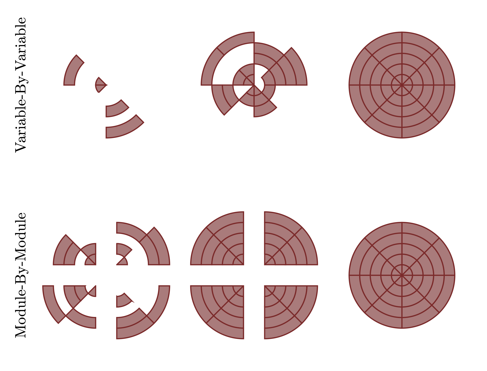
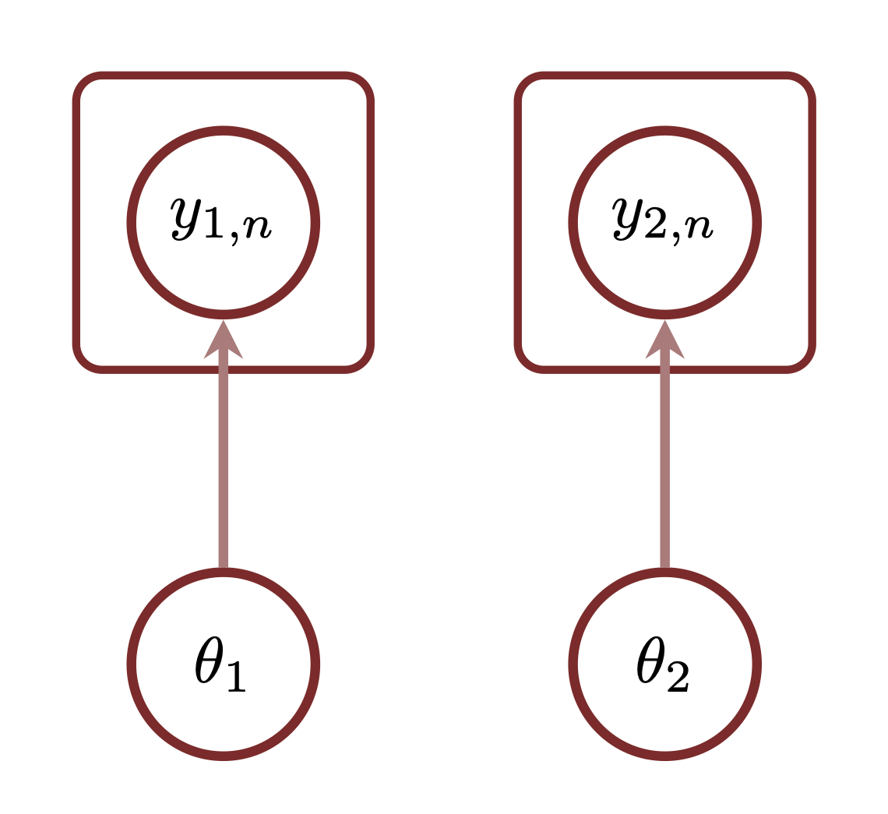
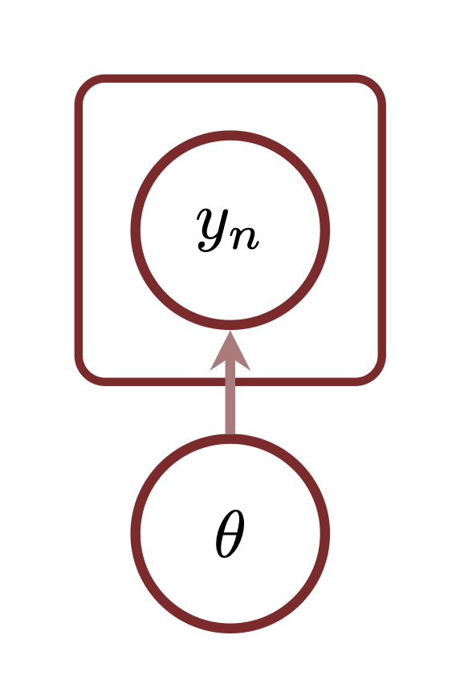

```{r setup, include=FALSE}
knitr::opts_chunk$set(comment=NA)
```

Generative modeling is often suggested as a useful approach for designing
probabilistic models that capture the relevant structure of a given application.
The specific details of this approach, however, is left vague enough to limit
how useful it can actually be in practice.  In this case study I present an
explicit definition of generative modeling as a way to bridge implicit domain
expertise and explicit probabilistic models, motivating a wealth of useful model
critique and construction techniques.

# Generating What Now?

An immediate problem with the concept of "generative modeling" is that the term
isn't always used consistently.  In particular what makes a model "generative"
can be very different in fields dominated by machine learning and fields
dominated by contemporary applied statistics.  To construct any self-consistent
formalization of the term we have to be careful to differentiate between these
two colloquial uses.

## Generative As Sampling

In machine learning a generative model is typically defined as a probabilistic
model of all quantities that vary from observation to observation; in other
words a model over the entire observational space, $Y$ [@Bishop:2006].  For
example given an observational space parameterized by two variables
$y = (y_{1}, y_{2})$ the conditional model $\pi(y_{1} | y_{2} ; \theta)$ would
not be generative because it lacks a probabilistic model for $y_{2}$.
Such incomplete model specifications, often denoted _discriminative_ models,
commonly arise in regression modeling where the observational space $Y \times X$
separates into variates, $y \in Y$, and covariates, $x \in X$, and only the
conditional relationship $\pi(y | x; \theta)$ is modeled.

One immediate benefit of a model $\pi(y; \theta)$ that spans the entire
observational space is that, at least in theory, we can construct exact sampling
mechanisms for all of the variables in the observational space,
$$
\tilde{y} \sim \pi(y; \theta),
$$
for each model configurations $\theta$.  For example the non-generative
conditional model $\pi(y_{1} | y_{2} ; \theta)$ admits sampling mechanisms
for $y_{1}$ only once $y_{2}$ has been fixed to a particular value, but we have
no natural way to choose such a value.  The generative model
$\pi(y_{1} | y_{2} ; \theta) \pi(y_{2}; \theta)$, however, admits sampling
mechanisms for $y_{2}$ which then enables ancestral sampling.

Indeed the phrase "generative model" is often used colloquially to imply
probabilistic modelings equipped, if not outright defined, by an explicit, exact
sampling mechanism from which we can "generate" samples in practice.  I will
refer to this notion as _procedurally generative_.

One way to construct explicit, exact sampling algorithms is to utilize a
conditional decomposition of the observational model $\pi(y; \theta)$ into a
sequence of one-dimensional conditional probability distributions,
$$
\pi(y_{1}, \ldots, y_{n}, \ldots, y_{N}; \theta)
=
\left[ \prod_{n = 2}^{N} \pi(y_{n} | y_{1}, \ldots, y_{n - 1}; \theta) \right]
\, \pi(y_{1}; \theta),
$$
where each $y_{n}$ is a one-dimensional variable.  If we can efficiently
generate exact samples from these one-dimensional distributions then we can
generate exact samples from the entire model through ancestral sampling.

In contemporary machine learning ancestral sampling mechanisms have largely
given way to _pushforward_ sampling mechanisms.  Here the observational model
$\pi(y; \theta)$ is defined only implicitly as the pushforward of some simple
base distribution, $\pi(x)$, along a family of complicated transformations,
$\phi_{\theta} : X \rightarrow Y$,
$$
\pi(y; \theta) = (\phi_{\theta})_{*} \pi(x).
$$
If the base distribution is engineered to admit an efficient exact sampling
mechanism then we can immediately generate exact samples from these pushforward
distributions by applying the transformations to base samples,
$$
\begin{align*}
\tilde{x} &\sim \pi(x)
\\
\tilde{y} &= \phi_{\theta}(\tilde{x}).
\end{align*}
$$
These families of complex transformations are often built out of popular machine
learning techniques for function approximation, such as neural networks and
kernel methods, resulting in popular methods such as Generative Adversarial
Networks [@GoodfellowEtAl:2014].

A procedurally generative _Bayesian model_ $\pi(y, \theta)$ requires an exact
sampling mechanism that samples the variables in the observational space _and_
the model configuration space.  For example by exploiting the conditional
decomposition
$$
\pi(y, \theta) = \pi(y | \theta) \, \pi(\theta)
$$
we can build a procedurally generative Bayesian model by combining a
procedurally generative observational model $\pi(y | \theta)$, as discussed
above, with a procedurally generative prior model $\pi(\theta)$.  Because we
cannot generate samples from unnormalizeable prior models, such as those
specified by uniform density functions over the real line, these improper prior
models immediately obstruct procedurally generativity.

That said procedural generation doesn't require that we utilize this particular
conditional decomposition.  _Any_ conditional decomposition of the full Bayesian
model $\pi(y, \theta)$ into well-defined, one-dimensional conditional
probability distributions will admit ancestral sampling, and there are many of
these conditional decompositions to consider.  For example a relatively
low-dimensional model $\pi(y_{1}, y_{2}, \theta_{1}, \theta_{2})$ admits 24
different one-dimensional conditional decompositions!

<center>
<br>
```{r, out.width = "100%", echo=FALSE}
knitr::include_graphics("figures/procedural_decomp/procedural_decomp.png")
```
<br><br>
</center>

In practice some of these decompositions might result in simpler conditional
dependencies which can facilitate the implementation of ancestral sampling.
The practical challenge is engineering not just any conditional decomposition
but a particularly useful one.

## Generative As Story Telling

In applied statistical settings "generative" more commonly refers not to how a
model is implemented but rather how the model is _interpreted_.  Here generative
describes models that follow the progressive structure of some assumed data
generating process; in other words they model not just the outcome of a
measurement but also the internal composition of that measurement.  I will refer
to this notion of generative as _narratively generative_.

Any model with a narrative interpretation tells a set of stories, and
consequently we can utilize familiar storytelling techniques to understand the
structure of these models.  For example consider that stories are often told as
a sequence of smaller, constituent stories, with each constituent story building
upon and referencing previous constituent stories in the progression of the
overall narrative.  Books are constructed from chapters, television series from
episodes, plays from acts, and so on.  Likewise a narratively generative model
can be built from smaller, component models, each capturing one part of some
larger data generating story.

A narratively generative Bayesian model $\pi(y, \theta)$ defines a collection of
mathematical stories for how the data could be generated, with the model
configurations $\theta$ labeling each story.  The narrative structure of these
stories implies a distinguished conditional decomposition of $\pi(y, \theta)$
where each conditional distribution captures just one part of the data
generating story.  This distinguished conditional decomposition then immediately
defines a distinguished directed graphical model representation where leaf nodes
can contain only data variables and any root nodes can contain only model
configuration variables.

For example consider the Bayesian model that we introduced in the previous
section, $\pi(y_{1}, y_{2}, \theta_{1}, \theta_{2})$.  The simplest narratively
generative decomposition separates the joint model into an observational model,
$\pi(y_{1}, y_{2} | \theta_{1}, \theta_{2})$, and a prior model,
$\pi(\theta_{1}, \theta_{2})$.

<center>
<br>
```{r, out.width = "25%", echo=FALSE}

```
<br><br>
</center>

A more refined story further decomposes the observational model or the prior
model.

<center>
<br>
```{r, out.width = "75%", echo=FALSE}

```
<br><br>
</center>

The most refined story decomposes both of these component models into
one-dimensional component models.

<center>
<br>
```{r, out.width = "100%", echo=FALSE}
knitr::include_graphics("figures/narrative_decomp/3/3.png")
```
<br><br>
</center>

Each of these directed graphical models captures a different set of mathematical
narratives for how the assumed data generating process might behave.  The fewer
variables in each node the more refined those stories are.  The simpler and more
coherent the overall narrative the fewer arrows will connect each node, and the
more linear the probabilistic graphical model will appear.  The more convoluted
the story the more the nodes will influence each other, and the more connected
the network of arrows between the nodes will be.

<center>
<br>
```{r, out.width = "75%", echo=FALSE}

```
<br><br>
</center>

Conditioning on observed data $\tilde{y}$ results in a posterior distribution
over the model configurations
$$
\pi(\theta \mid \tilde{y}) \propto \pi(\tilde{y}, \theta)
$$
that quantifies how consistent each the possible mathematical stories is with
those observed outcomes.

<center>
<br>
```{r, out.width = "40%", echo=FALSE}

```
<br><br>
</center>

In other words an ideal narratively generative model captures all of the
possible data generating stories so that our posterior distribution can identify
which of those stories well-approximate the true data generating process.

By introducing a precise interpretation for internal structure of a model, this
narrative perspective provides a bridge between explicit mathematical models and
our implicit domain expertise.  This connection then provides a foundation for a
wealth of powerful modeling techniques.

For example this bridge can help us understand the limitations of a given model
and any derived inferences.  If the mathematical stories captured by the model
are meaningful only in a narrow circumstance then we know that we shouldn't
expect any inferences or predictions derived from that model to be useful
outside of those circumstances.

At the same time understanding the circumstances in which those mathematical
stories are relevant also facilitates model critique.  If none of the stories
are even approximately relevant to a given application then we probably should
consider another model.  This critique is especially useful in the use of
prefabricated models which are often applied without any consideration of
relevance.  By first recognizing the mathematical narratives implicit in a
prefabricated model we make it easier to recognize when that model is applicable
and when its not.

Perhaps most importantly a narrative perspective aids the development of bespoke
models customized to a given application.  Narrative structure provides the
foundation on which we can translate our implicit domain expertise about a
system being studied into explicit probabilistic models.  We will explore
narrative model building techniques in depth in
[Section 2](#sec:building_techniques).

## The Best of Both Worlds

Models that are both procedurally _and_ narratively generative are particularly
useful in practice.  While the narrative focus facilitates model building
through narratively meaningful conditional decompositions, the procedural focus
allows us to _simulate_ from the data generating processes assumed by that model.

These simulations are extremely useful for evaluating the consequences of our
modeling assumptions, including prior checks, algorithmic Bayesian calibration,
and inferential Bayesian calibration.  For more see
[my workflow case study](https://betanalpha.github.io/assets/case_studies/principled_bayesian_workflow.html).

# Advanced Narrative Techniques {#sec:building_techniques}

Embracing a narrative focus not only clarifies many of the more subtle aspects
of probabilistic model building but also motivates a variety of powerful
model building techniques, each derived from an intuitive storytelling
consideration.  In this section we'll review many of these insights and their
practical consequences.

## Clear and Concise Language

Poor story telling can obfuscate even the simplest story, burying a
straightforward narrative underneath confusing language and unnecessary
complexity.  In narratively generative modeling the language in which we tell
our stories is the _parameterization_ of the observational space and the model
configuration space; in particular these parameterizations determine the
complexity of any conditional decomposition of the joint model.  Consequently
the apparent intricacy of a narratively generative model can be determined more
by how these spaces are parameterized rather than any inherent complexity of the
stories they describe.

For example consider the common assumption that an identical measurement is
repeated $N$ times without the outcome of the replications directly influencing
each other in any way.  If we directly parameterize the observational space with
the variables that capture the individual outcome of these measurements,
$y_{1}, \ldots, y_{n}, \ldots, y_{N}$, then this narrative assumption implies
that these variables are conditionally independent given a particular
configuration of the measurement process,
$$
\begin{align*}
\pi(y_{1}, \ldots, y_{n}, \ldots, y_{N}, \theta)
&= \pi(y_{1}, \ldots, y_{n}, \ldots, y_{N} | \theta) \, \pi(\theta)
\\
&= \left[ \prod_{n = 1}^{N} \pi(y_{n} \mid \theta) \right] \pi(\theta).
\end{align*}
$$
Moreover these conditional distributions are exactly the same.

This conditional independence implies a particularly streamlined directed
graphical model representation.  Because the conditional distributions are
identical we can also utilize the plate notation for an even more compact
notation.

<center>
<br>
```{r, out.width = "100%", echo=FALSE}
knitr::include_graphics("figures/iid/iid.png")
```
<br><br>
</center>

While reparameterizing the observational space away from this natural
parameterization doesn't change the stories captured by the mathematical model,
it does complicate the resulting narratively generative structure.  For example
if we consider parameterizing the observations in terms of the _differences_ of
each measurement,
$$
\begin{align*}
\Delta_{1} &= y_{1}
\\
\Delta_{2} &= y_{2} - y_{1}
\\
&\ldots
\\
\Delta_{n} &= y_{n} - y_{n - 1}
\\
&\ldots
\\
\Delta_{N} &= y_{N} - y_{N - 1}
\end{align*}
$$
such that
$$
y_{n} = \sum_{n' = 1}^{N} \Delta_{n'},
$$
then the conditional decomposition becomes much complicated,
$$
\pi(\Delta_{1}, \ldots, \Delta_{n}, \ldots, \Delta_{N}; \theta)
=
\left[ \prod_{n = 2}^{N}
\pi(\Delta_{n} \mid \Delta_{1}, \ldots, \Delta_{n - 1}, \theta) \right]
\, \pi(\Delta_{1} \mid \theta) \, \pi(\theta).
$$

Even for the case $N = 3$ the directed graphical model representation becomes
difficult to draw clearly.

<center>
<br>
```{r, out.width = "100%", echo=FALSE}

```
<br><br>
</center>

An insightful parameterization of the observational and model configuration
spaces can better reveal the latent narrative structure of a model, facilitating
not only model building but also computational inference with that model.

## Flashbacks and Flashforwards

Stories proceed in a sequence of causes and effects, with each constituent story
capturing one, the other, or both in the progression of the narrative.  These
constituent stories are often presented in a strict temporal order, but
non-chronological presentation can be a useful technique for emphasizing certain
aspects of the larger story.

Similarly narratively generative models do not need to follow an absolute
chronological progression.  More generally the sequential structure of a
narratively generative model is constrained by only the influences between the
constituent models that are captured in their conditional dependencies.
Component models that depend on the outcomes of other component models must be
placed later in the progression.

This ordering of the component models, and the mathematical stories they
capture, is often said to define the _causal structure_ of the data generating
process.  Like "generative" the term "causal" is used inconsistently across
fields which often causes, pun absolutely intended, confusion.  For example in
physics causality refers to _all_ of the possible physical influences that one
system can exert an other, limited largely by physical distance between the two
systems and the speed with which interactions can be exchanged across that
distance.  On the other hand in statistics and computer science causality
typically refers not to all possible influences but rather to only those
influences that are explicitly modeled.  In any practical model we ignore an
infinity of physical interactions that we assume are too weak to meaningful
affect a given data generating process.

To avoid any confusion between these different notions of causality I will refer
to the this latter interpretation as defining the
_narratively generative structure_ of a model.

## Serialization {#sec:recursion}

As we discussed above narratives often naturally decompose into constituent
stories.  In many cases those constituent stories can also be decomposed into
even smaller, more confined stories.  Epic fiction can span multiple books, each
book spanning multiple chapters, each chapter spanning multiple encounters, and
so on.  Plays are organized into acts, each of which is organized into scenes.

Similarly if the component models from which a narratively generative model
is built are also narratively generative then they too can be decomposed into
smaller component models.  If any of those smaller component models are
narratively generative then they can be further decomposed, and so on.  In other
words narrative generativity is often _recursive_.

<center>
<br>
```{r, out.width = "100%", echo=FALSE}

```
<br><br>
</center>

Such recursive, narratively generative structure can drastically facilitate the
development of expansive, intricate, and yet self-consistent narratives.

For example instead of trying to build a narrative by piecing together detailed
scenes in sequential order, it is often much more productive to _outline_ the
overarching plot as a sequence of broad arcs, each of which can then be
elaborated into more smaller scenes that are more manageable to construct in the
necessary detail.  Likewise the most effective way to develop a sophisticated
probabilistic model is often to first develop a crude model of the entire data
generating story before refining the initial component models of that basic
narrative into more elaborate models until the overall model is rich enough to
capture the relevant behaviors.  As our applications grow in complexity building
models from the top down is often much less overwhelming then trying to build
them from the bottom up!

<center>
<br>
```{r, out.width = "100%", echo=FALSE}

```
<br><br>
</center>

Even in the cases where bottom up development is more effective than top down
development, however, any recursive, narratively generative structure can still
be useful.  In particular the recursive structure might motivate a useful
_modular_ approach.  Instead of assembling the final model variable-by-variable
modular construction first assembles the variables into intermediate component
models, or modules.  These component models can then be assembled into larger
component models, which can then be assembled into even larger component models,
and so on, until we finally piece the full model together from the largest
component models.

<center>
<br>
```{r, out.width = "75%", echo=FALSE}

```
<br><br>
</center>

Because we have to assemble only a small number of modules together at each
stage this modular approach compartmentalizes the model building complexity
which often makes the task much more manageable in practice.  Moreover while
many modules need to be built custom for each particular application, some
modules that capture more universal behavior can be used repeatedly not only
within a single model but also across different models.  Once we familiarize
ourselves with the properties of one of these general components it becomes
available for any future modeling problem.

## Writing To The Audience {#sec:resolution}

Every story can be told at different levels of sophistication.  The richer our
vocabulary the more intricate of a story we can tell, but the most detailed
story isn't always the most appropriate for a given audience.  Similarly the
most sophisticated model that we can construct isn't always the most effective
model for a given application.  Sometimes a relatively simple model, which
captures the most relevant behavior without introducing extraneous complexity,
is most appropriate.

In statistical applications the appropriate level of detail is often determined
by the measurement process itself.  Any finite measurement resolves the latent
structure of an observed system only so well, and realized observations are
sensitive to only those features of the system that manifest strongly enough in
the measurement process.  The more precise the measurement process the finer the
details that we can resolve.

<center>
<br>
```{r, out.width = "100%", echo=FALSE}

```
<br><br>
</center>

Too much sophistication in our story telling can be not only wasteful but also
computationally problematic.  When a complex model is only weakly informed by
observations the resulting likelihood functions are prone to strong degeneracies
that can frustrate accurate and efficient computation.

Consequently our priority is usually not to build the most complex model
possible but rather to build a narratively generative model that
self-consistently captures the most pronounced features of the observed system,
perhaps in addition to any weaker features that might be of particular
inferential interest.  The recursive modeling building strategy that we
discussed in [Section 2.3](#sec:recursion) is especially helpful here; by
iteratively refining an initial crude model we can self-consistently incorporate
more and more detail until we've converged to the necessary level of
sophistication.

Narratively generative models built in this way will rarely depend on the
fundamental degrees of freedom of the system being studied, assuming that those
degrees of freedom even exist.  Instead these coarse-grained models capture the
mutually compatible features that _emerge_ from those degrees of freedom at a
given resolution, or in other words the _emergent phenomena_.

All of this said we have to keep in mind that a narratively generative model
motivated by the limitations of one measurement process will not necessarily be
sufficient for modeling the outcomes of _other_ measurement processes.  For
example if we repeat a measurement then the combined observations may be able to
resolve more detailed structure.  In this case we might have to further refine
the initial model in order to draw inferences that can take advantage of the
additional information in the combined observations.

Similarly if our inferential goals depend on details that fall below the
resolution of a given measurement process then our initial model may provide
only a washed-out approximation of that relevant structure.  In order to
accurately quantify uncertainty about those finer details we would need to once
again further refine the initial model until we've reached a sufficient level of
sophistication.

## Mixed Genres

While many stories naturally separate into constituent stories, some stories are
indivisible.  Similarly not every probabilistic model will be narratively
generative.  If we do not understand some aspect of a data generating processes
well enough then we may not be able to motivate component models with any useful
narratively generative structure.

Moreover some stories that can be divided are still best told all at once.
Likewise not every narratively generative model needs to be decomposed into
simpler models.  As we saw in [Section 2.4](#sec:resolution), when a measurement
process is not able to resolve the resulting substructure such a decomposition
can introduce unnecessary complexity that can be more harmful than beneficial.

In general a narratively generative model will decompose into a mixture of both
narratively generative and non-narratively generative component models.  Some of
the narratively generative component models might then further decompose into
one-dimensional conditional distributions but some might be best left whole.
This results in directed graphical model representations with separate nodes for
each variable and nodes that encapsulate multiple variables, respectively.  At
the same time the non-narratively generative components will also define nodes
that encapsulate multiple variables.  The broader definition of directed
graphical models that I introduced in my
[product space case study](#https://betanalpha.github.io/assets/case_studies/probability_on_product_spaces.html)
can accommodate all of these nodes, making it particularly useful for working
with models that capturing the intricate complexity of realistic applications.

<center>
<br>
```{r, out.width = "75%", echo=FALSE}

```
<br><br>
</center>

Critically having some non-narratively generative component models does not, and
should not, prevent us from modeling other components narratively generatively
where ever possible.  In the social sciences, for example, the latent
phenomenology is often far too complex to be modeled with anything but a
heuristic model that captures some of the more pronounced emergent behaviors.
That heuristic component model, however, can often be paired with a narratively
generative component models of the rest of the measurement process.  By
exploiting our domain expertise of both the experimental design, _and how that
design was actually implemented_, these narratively generative component models
can account for important selection biases and contaminations that would
otherwise corrupt the relationship between observations and the heuristic
phenomenological model.

In other words "narratively generative" is not a binary qualification of a
probabilistic model.  Some models have deeper narratively generative structure
than others, but that doesn't necessarily make them more useful.  Narrative
generativity is not a goal in of itself but rather a tool to help coalesce our
domain expertise and facilitate the development of the most useful model
possible in any given application.

## A Tangled Web

Some of the most engaging narratives don't follow just one story but rather
multiple, branching storylines at the same time.  Likewise some of the most
useful narratively generative models consistently incorporate multiple
measurement processes into a single, coherent model.

<center>
<br>
```{r, out.width = "75%", echo=FALSE}

```
<br><br>
</center>

By restricting any shared behavior to the same component models a narratively
generative model automatically captures the interactions between multiple
measurement processes.  Critically inferences from the combined model
_automatically_ incorporate any correlations between observations realized from
those measurement processes.  In other words incorporating the narratively
generative structure of multiple measurement processes into a single narratively
generative model implements _data fusion_.

One way to build a narratively generative model that consistently incorporates
multiple measurement processes is to first build a model for one measurement
process and then construct branches where the remaining measurement processes
diverge.

<center>
<br>
```{r, out.width = "50%", echo=FALSE}

```
<br><br>
</center>

Alternatively we can build narratively generative models for each measurement
process and then merge them together by consolidating any repeated component
models into one.

<center>
<br>
```{r, out.width = "100%", echo=FALSE}

```
<br><br>
</center>

To see the utility of modeling all of the relevant measurement processes at the
same time see let's consider a simple example with two observational models that
share a common parameter, $\pi(y_{1} \mid \theta_{1}, \phi)$ and
$\pi(y_{2} \mid \theta_{2}, \phi)$, and a separable prior model
$$
\pi(\theta_{1}, \theta_{2}, \phi) =
\pi(\theta_{1}) \, \pi(\theta_{2}) \, \pi(\phi).
$$

Without a joint model we have to construct our inferences iteratively, using one
observation to inform a posterior distribution that serves as a prior model when
fitting the other observation.  Starting with the first observation we can
construct the posterior distribution
$$
\pi(\theta_{1}, \phi \mid \tilde{y}_{1})
\propto \pi(y_{1} \mid \theta_{1}, \phi) \, \pi(\theta_{1}) \, \pi(\phi)
$$
which pushes forward to a marginal posterior distribution for $\phi$,
$$
\pi(\phi \mid \tilde{y}_{1}) =
\int \mathrm{d} \theta_{1} \, \pi(\theta_{1}, \phi \mid \tilde{y}_{1}).
$$
We can then build a posterior distribution for $\theta_{2}$ and $\phi$ informed
by both observations by using this marginal posterior distribution as the prior
model for $\phi$,
$$
\pi(\theta_{2}, \phi \mid \tilde{y}_{1}, \tilde{y}_{2})
\propto
\pi(\tilde{y}_{2} \mid \theta_{2}, \phi) \, \pi(\theta_{1}) \,
\pi(\phi \mid \tilde{y}_{1}).
$$
Finally this second posterior distribution lets us characterize the marginal
posterior distributions
$$
\pi(\theta_{2} \mid \tilde{y}_{1}, \tilde{y}_{2})
=
\int \mathrm{d} \phi \,
\pi(\theta_{2}, \phi \mid \tilde{y}_{1}, \tilde{y}_{2})
$$
and
$$
\pi(\phi \mid \tilde{y}_{1}, \tilde{y}_{2})
=
\int \mathrm{d} \theta_{2} \,
\pi(\theta_{2}, \phi \mid \tilde{y}_{1}, \tilde{y}_{2}).
$$

This procedure, however, does not allow us to characterize the marginal
posterior distribution for the first parameter informed by both observations,
$\pi(\theta_{1} \mid \tilde{y}_{1}, \tilde{y}_{2})$.  Instead we have access
to only the marginal posterior distribution informed by the first observation,
$$
\pi(\theta_{1} \mid \tilde{y}_{1})
=
\int \mathrm{d} \phi \,
\pi(\theta_{1}, \phi \mid \tilde{y}_{1}),
$$
which will in general differ from
$\pi(\theta_{1} \mid \tilde{y}_{1}, \tilde{y}_{2})$.  Although the second
observation $y_{2}$ is conditionally independent of $\theta_{1}$, it does inform
$\phi$ which then allows $y_{1}$ to better inform $\theta_{1}$, resulting in a
more informed marginal posterior distribution!

This inability of this sequential approach to characterize all of the relevant
marginal posterior distributions is not its only weakness; rarely is it feasible
to implement in practice at all.  The problem is that we typically cannot derive
the marginal probability density function $\pi(\phi \mid \tilde{y}_{1})$ in
closed form, which then prevents us from specifying the necessarily probability
density function
$$
\pi(\theta_{2}, \phi, \tilde{y}_{1}, \tilde{y}_{2})
=
\pi(y_{2} \mid \theta_{2}, \phi) \, \pi(\theta_{1}) \,
\pi(\phi \mid \tilde{y}_{1})
$$
in tools like Stan.

On the other hand once we incorporate both observational models into a single,
narratively generative model,
$$
\pi(y_{1}, y_{2}, \theta_{1}, \theta_{2}, \phi)
=
\pi(y_{1} \mid \theta_{1}, \phi) \, \pi(y_{2} \mid \theta_{2}, \phi) \,
\pi(\theta_{1}) \, \pi(\theta_{2}) \, \pi(\phi),
$$
we can immediately construct a joint posterior distribution over all of the
parameters at the same time,
$$
\pi(\theta_{1}, \theta_{2}, \phi \mid \tilde{y}_{1}, \tilde{y}_{2})
\propto
\pi(\tilde{y}_{1} \mid \theta_{1}, \phi) \,
\pi(\tilde{y}_{2} \mid \theta_{2}, \phi) \,
\pi(\theta_{1}) \, \pi(\theta_{2}) \, \pi(\phi).
$$
By automatically incorporating all of the inferential correlations between
$\theta_{1}$, $\theta_{2}$, and $\phi$ this joint posterior distribution allows
us to characterize _all_ of the the marginal posterior distributions,
$\pi(\theta_{1} \mid \tilde{y}_{1}, \tilde{y}_{2})$,
$\pi(\theta_{2} \mid \tilde{y}_{1}, \tilde{y}_{2})$, and
$\pi(\phi \mid \tilde{y}_{1}, \tilde{y}_{2})$, with appropriate expectation
values.

Working with the full narratively generative model all at once not only requires
fewer steps, and hence fewer opportunities to introduce mistakes, but also is
much more practical to implement!

## Sequels and Spinoffs

Integrating multiple _realized_ measurement processes into a single narratively
generative model allows us to make self-consistent inferences from the different
observations generated by those measurements. Integrating realized and
_hypothetical_ measurement processes together allows us to make predictions that
_generalize_ beyond the realized measurements entirely.

<center>
<br>
```{r, out.width = "85%", echo=FALSE}

```
<br><br>
</center>

Observations from the realized measurement processes inform any common component
models which then inform predictions for any speculative measurement processes
that generalize to new circumstances.

To demonstrate let's again consider the two observational models that share a
common parameter, $\pi(y_{1} \mid \theta_{1}, \phi)$ and
$\pi(y_{2} \mid \theta_{2}, \phi)$, and a separable prior model
$$
\pi(\theta_{1}, \theta_{2}, \phi) =
\pi(\theta_{1}) \, \pi(\theta_{2}) \, \pi(\phi).
$$
Without any observations the prior predictive distribution for the second
observation,
$$
\pi(y_{2}) = \int \mathrm{d} \theta_{2} \, \mathrm{d} \phi \,
\pi(y_{2} \mid \theta_{2}, \phi) \, \pi(\theta_{2}) \, \pi(\phi),
$$
quantifies our best predictions for the outcomes of the second measurement
process.

As before an observation $\tilde{y}_{1}$ informs a posterior distribution for
$\theta_{1}$ and $\phi$,
$$
\pi(\theta_{1}, \phi \mid \tilde{y}_{1})
\propto \pi(y_{1} \mid \theta_{1}, \phi) \, \pi(\theta_{1}) \, \pi(\phi),
$$
which then yields a marginal posterior distribution for $\phi$,
$$
\pi(\phi \mid \tilde{y}_{1}) =
\int \mathrm{d} \theta_{1} \, \pi(\theta_{1}, \phi \mid \tilde{y}_{1}).
$$
This marginal posterior distribution then informs a posterior predictive
distribution for $y_{2}$,
$$
\pi(y_{2} \mid \tilde{y}_{1}) =
\int \mathrm{d} \theta_{2} \, \mathrm{d} \phi \,
\pi(y_{2} \mid \theta_{2}, \phi) \,
\pi(\theta_{2}) \,
\pi(\phi \mid \tilde{y}_{1}).
$$

Alternatively we can directly construct the same posterior predictive
distribution from the joint posterior distribution of all of the parameters,
$$
\begin{align*}
\pi(y_{2} \mid \tilde{y}_{1})
&=
\int \mathrm{d} \theta_{1} \, \mathrm{d} \theta_{2} \, \mathrm{d} \phi \,
\pi(y_{2} \mid \theta_{2}, \phi) \,
\pi(\theta_{1}, \theta_{2}, \phi \mid \tilde{y}_{1})
\\
&\propto
\int \mathrm{d} \theta_{1} \, \mathrm{d} \theta_{2} \, \mathrm{d} \phi \,
\pi(y_{2} \mid \theta_{2}, \phi) \,
\pi(\tilde{y}_{1} \mid \theta_{1}, \phi) \,
\pi(\theta_{1}) \, \pi(\theta_{2}) \, \pi(\phi).
\end{align*}
$$
Once again with the joint narratively generative model we can derive the desired
result in fewer steps that are also more straightforward to implement.

Ultimately the narratively generative structure of a model is what allows us to
extrapolate from the particular circumstance of an observation to new, not yet
observed circumstances.  The more refined the narrative the more sophisticated
these generalized inferences and predictions can be.

## Unreliable Narrators

Of course just because someone tells a story doesn't guarantee that the story
can be trusted.  Likewise just because we've built a narratively generative
model doesn't guarantee that the model will actually be useful in any given
statistical application.

In order to ensure that a narratively generative model captures the relevant
features of a system being studied we have to carefully assess it against both
our own domain expertise and the details of any observed data.  Discrepancies in
these comparisons inform holes in the stories our model tells, and any
narrative interpretation of these holes motivates an improved narration and,
hopefully, a better model.

General strategies for model assessment and critique are considered in my
[workflow case study](https://betanalpha.github.io/assets/case_studies/principled_bayesian_workflow.html).
Narratively generative structure is particularly useful for motivating
summary functions and statistics that isolate meaningful structure, and hence
interpretable prior and posterior retrodictive checks.

Altogether a narratively generative perspective is particularly well-suited to
iterative model development.

# Anthology of Interest

It's often said that in order to become a better writer one has to read as
much as possible.  Similarly the more we can expose ourselves to examples of
narratively generative model building the better we'll be able to employ the
approach in our own problems.  In this section we'll review some simplified
model building exercises that demonstrate many of the narrative techniques
introduced above.

## 2 Become 1

First let's consider a somewhat abstract example where we want to combine two
measurement processes, the first resulting in $N_{1}$ observations,
$\{y_{1, 1}, \ldots, y_{1, N_{1}}\}$, and the second in $N_{2}$ observations,
$\{y_{2, 1}, \ldots, y_{2, N_{2}}\}$, into a single model.

The simplest story is that these measurement processes do not influence each
other at all, in which case we can model them with completely uncoupled
observational models,
$$
\begin{align*}
\pi(y_{1, 1}, \ldots, y_{1, N_{1}}, y_{2, 1}, \ldots, y_{2, N_{2}}, \theta_{1}, \theta_{2})
&= \;\;
\left[ \prod_{n = 1}^{N_{1}} \pi(y_{1, n} \mid \theta_{1}) \right] \pi(\theta_{1})
\\
& \quad \cdot
\left[ \prod_{n = 1}^{N_{2}} \pi(y_{2, n} \mid \theta_{2}) \right] \pi(\theta_{2}).
\end{align*}
$$

<center>
<br>
```{r, out.width = "40%", echo=FALSE}

```
<br><br>
</center>

A more complex story might consider interactions between the two measurement
processes.  For example we might know that the phenomenology that manifests in
the first measurement process also influences the second measurement process.
This particular narratively generative assumption implies that the model for
$\theta_{2}$ should depend on the model configuration $\theta_{1}$.  Here let's
assume a _deterministic_ dependence where we model $\theta_{2}$ as the output of
some deterministic function of $\theta_{1}$ and some new variables $\psi$ that
characterize the possible functional behaviors,
$$
\begin{align*}
\pi(y_{1, 1}, \ldots, y_{1, N_{1}}, y_{2, 1}, \ldots, y_{2, N_{2}}, \theta_{1}, \psi)
&= \;\;
\left[ \prod_{n = 1}^{N_{1}} \pi(y_{1, n} \mid \theta_{1}) \right] \pi(\theta_{1})
\\
& \quad \cdot
\left[ \prod_{n = 1}^{N_{2}} \pi(y_{2, n} \mid \theta_{2}(\theta_{1}, \psi)) \right] \pi(\psi).
\end{align*}
$$

<center>
<br>
```{r, out.width = "40%", echo=FALSE}

```
<br><br>
</center>

In order to specify an explicit model we need to specify an explicit functional
form for this dependence, $\theta_{2}(\theta_{1}, \psi)$.  A deep theoretical
understanding of this system might motivate a particular model, but if the
interaction is weak enough then we can also consider an approximate linear
dependence,
$$
\theta_{2}(\theta_{1}, \psi)) = \alpha + \beta \cdot \theta_{1},
$$
resulting in the final model,
$$
\begin{align*}
\pi(y_{1, 1}, \ldots, y_{1, N_{1}}, y_{2, 1}, \ldots, y_{2, N_{2}}, \theta_{1}, \psi)
&= \;\;
\left[ \prod_{n = 1}^{N_{1}} \pi(y_{1, n} \mid \theta_{1}) \right] \pi(\theta_{1})
\\
& \quad \cdot
\left[ \prod_{n = 1}^{N_{2}} \pi(y_{2, n} \mid \alpha + \beta \cdot \theta_{1}) \right]
\pi(\alpha) \, \pi(\beta).
\end{align*}
$$

<center>
<br>
```{r, out.width = "40%", echo=FALSE}

```
<br><br>
</center>

If this linear approximation is sufficiently accurate then this model may be
able to reasonably approximate the true data generating process.

## Intervention Circumvention

Narratively generative structure is particularly useful for comparing and
contrasting mathematical models with similar, and hence easily confused,
assumptions.

Consider for example an experiment that is made under carefully controlled
circumstances quantified by the variables $x \in X$.  If the resulting data
generating process is assumed to vary across these circumstances then any
compatible observational model for the outcomes $y \in Y$ will take the form
$$
\pi(y, \theta; \tilde{x}).
$$
Inferences derived from this model are applicable whenever those circumstances
can be similarly controlled.

<center>
<br>
```{r, out.width = "30%", echo=FALSE}
knitr::include_graphics("figures/examples/intervention/1/1.png")
```
<br><br>
</center>

In more chaotic settings, however, the circumstances might not be fixed.  If the
variables $x$ also vary with each realized observation then they have to modeled
along with the outcomes, $y$,
$$
\pi(y, x, \theta).
$$
Our previous model is no longer appropriate in these settings.

<center>
<br>
```{r, out.width = "30%", echo=FALSE}
knitr::include_graphics("figures/examples/intervention/2/2.png")
```
<br><br>
</center>

An appropriate narratively generative model for this system has to quantify how
both $y$ and $x$ are generated in each observation, which requires a more
sophisticated story and more assumptions.  For example if the circumstances $x$
are generated before the nominal measurement outcome $y$ then the conditional
decomposition
$$
\pi(y, x, \theta)
= \pi(y, x \mid \theta) \, \pi(\theta)
= \pi(y \mid x, \theta) \, \pi(x \mid \theta) \, \pi(\theta)
$$
specifies the natural narratively generative model.

<center>
<br>
```{r, out.width = "30%", echo=FALSE}
knitr::include_graphics("figures/examples/intervention/3/3.png")
```
<br><br>
</center>

Moreover if the conditional model for $y$ and $x$ are parameterized by different
model configuration variables then the narratively generative model reduces to
$$
\begin{align*}
\pi(y, x, \theta_{1}, \theta_{2})
&=
\pi(y \mid x, \theta_{2}) \, \pi(x \mid \theta_{1}) \,
\pi(\theta_{1}) \, \pi(\theta_{2})
\\
&=
\pi(y \mid x, \theta_{2}) \, \pi(\theta_{2}) \,
\pi(x \mid \theta_{1}) \, \pi(\theta_{1})
\\
&=
\pi(y, \theta_{2} \mid x) \,
\pi(x, \theta_{1}).
\end{align*}
$$

<center>
<br>
```{r, out.width = "30%", echo=FALSE}
knitr::include_graphics("figures/examples/intervention/4/4.png")
```
<br><br>
</center>

The first term in this particular narratively generative model,
$\pi(y, \theta_{2} \mid x)$, has the same mathematical structure as the model
for the controlled experiment, $\pi(y, \theta; x)$.

<center>
<br>
```{r, out.width = "70%", echo=FALSE}
knitr::include_graphics("figures/examples/intervention/5/5.png")
```
<br><br>
</center>

Indeed if the $x$ are modeled with a Dirac distribution that concentrates
entirely at $\tilde{x}$ then the model for the uncontrolled experiment reduces
to the model for the controlled experiment,
$$
\pi(y, x, \theta_{1}, \theta_{2})
=
\pi(y, \theta_{2} \mid \tilde{x}) \, \delta(x - \tilde{x})
=
\pi(y, \theta_{2}; \tilde{x}).
$$
These narrative assumptions allows us to compare and contrast the appropriate
models for the controlled and uncontrolled measurements.

This, however, is far from the only narratively generative model that might be
applicable to the uncontrolled setting.  For example the conditional models for
$y$ and $x$ might share a dependence on some of the model configuration
variables,
$$
\begin{align*}
\pi(y, x, \theta_{1}, \theta_{2})
&=
\pi(y \mid x, \theta_{1}, \theta_{2}) \, \pi(x \mid \theta_{1}) \,
\pi(\theta_{1}) \, \pi(\theta_{2}),
\end{align*}
$$
which prevents the narrative from decomposing into independent stories for how
the variables $x$ and the variables $y$ are generated.

<center>
<br>
```{r, out.width = "30%", echo=FALSE}
knitr::include_graphics("figures/examples/intervention/6/6.png")
```
<br><br>
</center>

Alternatively if the measurement process censors certain circumstances $x$
depending on the outcome $y$ then we might have to instead consider the
conditional decomposition
$$
\pi(y, x, \theta)
= \pi(y, x \mid \theta), \pi(\theta)
= \pi(x \mid y, \theta) \, \pi(y \mid \theta) \, \pi(\theta).
$$
where $\pi(x \mid y, \theta)$ models the censoring process.

<center>
<br>
```{r, out.width = "30%", echo=FALSE}
knitr::include_graphics("figures/examples/intervention/7/7.png")
```
<br><br>
</center>

The mathematical distinction between some of these models can be subtle, but
a narratively generative perspective often provides a clarifying interpretation.
For example the models $\pi(y, \theta_{1} \mid x)$ and $\pi(y, \theta; x)$ might
be exactly the same mathematically, but they have different narratively
generative interpretations which makes then appropriate for modeling different
systems.  Sometimes the conditional model $\pi(y, \theta_{1} \mid x)$ is
relevant for modeling uncontrolled experiments but sometimes it is not, and the
narratively generative interpretation identifies exactly when.

By incorporating this interpretation from the beginning, narratively generative
modeling avoids the mathematical ambiguity entirely which often clarifies the
model building process.  Once we identify which variables are fixed by the
measurement process and which are outcomes of the measurement process, including
often neglected variables like the total number of observations, we can use the
narratively generative perspective to translate our domain expertise into a
joint model over all of the outcomes.  Occasionally some of the component models
might simplify into common model templates, in which case we can take advantage
of that simplified structure.  If the component models don't simplify, however,
then we know that those templates are inappropriate for the problem at hand.

In causal inference the relationship between the models $\pi(y, x, \theta_{1})$
and $\pi(y, \theta_{1} \mid x)$ quantifies the effect of an _intervention_ where
the variables $x$ are, actually or hypothetically, fixed [@Pearl:2009].  By
examining the narratively generative structure of our model we can analyze these
effects without having to consider any tools from causal inference.  Indeed
these tools can all be reframed as implicit probabilistic modeling assumptions
[@LattimoreEtAl:2019a; @LattimoreEtAl:2019b].

## Always Be Closing

Now let's consider an example with a little more backstory.  In this example
we're interested in understanding how often customers who engage with a business
will be converted to a sale.  For example we may be interested in how likely a
customer who enters a physical store is to buy a particular item, or a customer
who browses a website is to signup for a subscription to a particular service.

Observations of previous engagements have resulted in binary data coding a
failed conversation with $0$ and a successful conversation with $1$.  If we
assume that all customers behave identically then we can model this data with a
Bernoulli observational model parameterized by a single probability parameter
$\theta$,
$$
\pi(y_{1}, \ldots, y_{N}, \theta)
=
\left[ \prod_{n = 1}^{N} \text{Bernoulli} \,(y_{n} \mid \theta) \right]
\pi(\theta)
$$

<center>
<br>
```{r, out.width = "20%", echo=FALSE}

```
<br><br>
</center>

After implementing this initial analysis we're given a new data set where the
binary observations are complemented with demographic information about the
observed customers, $x_{n}$.  One way to model how the conversion probability
varies with this demographic information is to replace the variable $\theta$
with a deterministic function parameterized by $\psi$, $\theta(x, \psi)$, which
results in the $N$ values $\theta_{n} = \theta(x_{n}, \psi)$.  Our model then
takes the form
$$
\pi(y_{1}, \ldots, y_{N}, \psi; x_{1}, \ldots, x_{N})
=
\left[ \prod_{n = 1}^{N} \text{Bernoulli} \,(y_{n} \mid \theta \, (x_{n}, \psi)) \right]
\pi(\psi).
$$

<center>
<br>
```{r, out.width = "30%", echo=FALSE}

```
<br><br>
</center>

Now let's say that when assessing the fit of this model we encounter some odd
artifacts that suggest a group of customers whose behavior doesn't seem to be as
influenced by the given demographics as the others.  Following up with team
responsible for collecting the data we learn that indeed the data contained not
only observations from new customers but also data from established,
high-spending customers internally referred to as very important people, or
VIPs.  This narrative suggests two observational models:
$$
\text{Bernoulli} \,(y_{n} \mid \theta \, (x_{n}, \psi))
$$
for the regular customers and
$$
\text{Bernoulli} \,(y_{n} \mid \theta^{\text{VIP}})
$$
for the VIPs.

The problem is that we don't know to which of these groups each customer in our
observed data belongs!  In order to account for the possibility that each
customer could belong to either group we can appeal to a mixture model with the
mixture parameter $\lambda$ determining the overall proportion of new customers
to VIP customers,
$$
\begin{align*}
\pi(y_{1}, \ldots, y_{N}, &\psi, \theta^{\text{VIP}}, \lambda; x_{1}, \ldots, x_{N})
\\
=& \;\;
\left[ \prod_{n = 1}^{N}
\lambda \cdot \text{Bernoulli} \,(y_{n} \mid \theta \, (x_{n}, \psi))
+ (1 - \lambda) \cdot \text{Bernoulli} \,(y_{n} \mid \theta^{\text{VIP}}) \right]
\\
& \cdot
\pi(\psi) \, \pi(\theta^{\text{VIP}}) \, \pi(\lambda)
\end{align*}
$$

<center>
<br>
```{r, out.width = "50%", echo=FALSE}

```
<br><br>
</center>

Unfortunately our ignorance about the customer categorization will dilute how
well the observation informs the two component behaviors, and our inferential
uncertainties will probably leave much to be desired.  That is until one of our
colleagues mentions a separate data set consisting of _only_ VIP customers.  If
we can use these observations to inform $\theta^{\text{VIP}}$ then the initial
observations should be able to better inform $\lambda$ and $\psi$.

To do this we can incorporate our initial measurement process and this
complementary measurement process into a single narratively generative model
that branches at $\theta^{\text{VIP}}$,
$$
\begin{align*}
\pi(y_{1}, \ldots, y_{N}, &y^{\text{VIP}}_{1}, \ldots, y^{\text{VIP}}_{N^{\text{VIP}}},
\psi, \theta^{\text{VIP}}, \lambda; x_{1}, \ldots, x_{N})
\\
=& \;\;
\left[ \prod_{n = 1}^{N}
\lambda \cdot \text{Bernoulli} \,(y_{n} \mid \theta \, (x_{n}, \psi))
+ (1 - \lambda) \cdot \text{Bernoulli} \,(y_{n} \mid \theta^{\text{VIP}}) \right]
\\
& \cdot
\left[ \prod_{n = 1}^{N^{\text{VIP}}}
\text{Bernoulli} \,(y^{\text{VIP}}_{n} \mid \theta^{\text{VIP}}) \right]
\\
& \cdot
\pi(\psi) \, \pi(\theta^{\text{VIP}}) \, \pi(\lambda)
\end{align*}
$$

<center>
<br>
```{r, out.width = "50%", echo=FALSE}

```
<br><br>
</center>

By fitting this joint model all of the subtle interactions between the two
measurement processes are automatically taken into account and we can be assured
that the resulting inferences will be as precise as possible.

## Spectra Incognita

After considering a more business-oriented application let's get a little
physical.  In this example we're measuring the energies of particles generated
by some physical process of interest.  The distribution, or _spectrum_, of these
energies is assumed to be well-characterized by a theoretical model
$\pi(E \mid \theta_{S})$.

Unfortunately our observations don't report the actual energy of each incident
particle.  Instead the output energy values are discretized into a sequence of
$K$ bins, $(b_{1}, \ldots, b_{K + 1})$, and each observation consists of only
which bin the incident particle energy falls.  In order to model this censoring
process we have to integrate the theoretical spectrum over each bin to give bin
probabilities $\rho_{k}$.  We can then use those bin probabilities in a
multinomial model for the bin counts,
$$
\begin{align*}
\pi(y_{1}, \ldots, y_{N}, \theta_{S}; b_{1}, \ldots, b_{K + 1})
&=
\left[ \prod_{n = 1}^{N} \text{multinomial}(y_{n} \mid \rho_{1}, \ldots, \rho_{K}) \right]
\pi(\theta_{S})
\\
\rho_{k} &= \int_{b_{k}}^{b_{k + 1}} \mathrm{d} E \, \pi(E \mid \theta_{S}).
\end{align*}
$$

<center>
<br>
```{r, out.width = "50%", echo=FALSE}

```
<br><br>
</center>

By modeling the actual structure of the measurement we can recover the behavior
of the spectral parameters $\theta_{S}$ as well as possible.  Or we would if we
didn't realize that the physical process of interest was not alone.

Upon a more careful inspection of the experiment we learn that our measurements
are contaminated by particles from a background physical process that we can't
completely suppress.  In other words each observation could come from the signal
process or this background process and unfortunately we don't know which.  As in
the previous example, however, we can incorporate this ignorance with a mixture
model of the incident energy spectrum that incorporates not only the signal
spectrum, $\pi(E \mid \theta_{S})$ but also the background spectrum
$\pi(E \mid \theta_{B})$,
$$
\begin{align*}
\pi(y_{1}, \ldots, y_{N}, &\theta_{S}, \theta_{B}, \lambda; b_{1}, \ldots, b_{K + 1})
\\
=& \;\;
\left[ \prod_{n = 1}^{N} \text{multinomial}(y_{n} \mid \rho_{1}, \ldots, \rho_{K}) \right]
\\
& \cdot
\pi(\theta_{S}) \, \pi(\theta_{B}) \, \pi(\lambda)
\\
\rho_{k} =& \int_{b_{k}}^{b_{k + 1}} \mathrm{d} E \,
\left[ \lambda \cdot \pi(E \mid \theta_{S})
+ (1 - \lambda) \cdot \pi(E \mid \theta_{B}) \right].
\end{align*}
$$

<center>
<br>
```{r, out.width = "75%", echo=FALSE}

```
<br><br>
</center>

By explicitly modeling the contamination we are able to not only minimize how
much the background process corrupts our inferences about physical system of
interest but also infer the relative contribution from the background,
$1 - \lambda$!

Unfortunately without knowing from which process each observation is generated
the observations will be able to inform the behavior of each process only so
well.  One way to improve our inferences from these contaminated observations is
to incorporate new observations that are sensitive to only one process at a
time.  In particular if we suppress the signal process then we can isolate the
background process and generate new observations
$\{ y^{B}_{1}, \ldots, y^{B}_{N^{B}} \}$ whose observational model depends on
only $\theta_{B}$,
$$
\begin{align*}
\pi(y_{1}, \ldots, y_{N}, &y^{B}_{1}, \ldots, y^{B}_{N^{B}}, \theta_{S}, \theta_{B}, \lambda; b_{1}, \ldots, b_{K + 1})
\\
=& \;\;
\left[ \prod_{n = 1}^{N} \text{multinomial}(y_{n} \mid \rho_{1}, \ldots, \rho_{K}) \right]
\\
& \cdot
\left[ \prod_{n = 1}^{N^{B}} \text{multinomial}(y^{B}_{n} \mid \tau_{1}, \ldots, \tau_{K}) \right]
\\
& \cdot
\pi(\theta_{S}) \, \pi(\theta_{B}) \, \pi(\lambda)
\\
\rho_{k} =& \int_{b_{k}}^{b_{k + 1}} \mathrm{d} E \,
\left[ \lambda \cdot \pi(E \mid \theta_{S}) + (1 - \lambda) \cdot \pi(E \mid \theta_{B}) \right]
\\
\tau_{k} =& \int_{b_{k}}^{b_{k + 1}} \mathrm{d} E \, \pi(E \mid \theta_{B}).
\end{align*}
$$

<center>
<br>
```{r, out.width = "75%", echo=FALSE}

```
<br><br>
</center>

This background-only data informs inferences about $\theta_{B}$ which then
allows our initial measurement to better inform $\lambda$ and $\theta_{S}$.

With the details of the background contamination incorporated into our full
model we can return to the consideration of the signal process.  While we've
been doing all of this work to better understand the experiment our colleagues
have been hard at work expanding the initial theoretical model
$\pi(E \mid \theta_{S})$ into a much more sophisticated model that incorporates
many different interacting phenomena,
$$
\pi(E \mid \theta_{S}(\psi_{3}, \psi_{4}))
\pi(\psi_{4} \mid \psi_{3}, \psi_{2}) \, \pi(\psi_{3} \mid \psi_{1}, \psi_{2}).
$$

In order to properly quantify all of the complex, interacting uncertainties
between these theoretical model configurations all we have to do is expand our
full model of the measurement process to incorporate this more refined
theoretical understanding,
$$
\begin{align*}
\pi(y_{1}, \ldots, y_{N}, &y^{B}_{1}, \ldots, y^{B}_{N^{B}},
\psi_{1}, \psi_{2}, \psi_{3}, \psi_{4}, \theta_{B}, \lambda; b_{1}, \ldots, b_{K + 1})
\\
=& \;\;
\left[ \prod_{n = 1}^{N} \text{multinomial}(y_{n} \mid \rho_{1}, \ldots, \rho_{K}) \right]
\\
& \cdot
\left[ \prod_{n = 1}^{N^{B}} \text{multinomial}(y^{B}_{n} \mid \tau_{1}, \ldots, \tau_{K}) \right]
\\
& \cdot
\pi(\psi_{4} \mid \psi_{3}, \psi_{2}) \, \pi(\psi_{3} \mid \psi_{1}, \psi_{2}) \,
\pi(\psi_{2}) \, \pi(\psi_{1}) \, \pi(\theta_{B}) \, \pi(\lambda)
\\
\rho_{k} =& \int_{b_{k}}^{b_{k + 1}} \mathrm{d} E \,
\left[ \lambda \cdot \pi(E \mid \theta_{S}(\psi_{3}, \psi_{4}))
+ (1 - \lambda) \cdot \pi(E \mid \theta_{B}) \right]
\\
\tau_{k} =& \int_{b_{k}}^{b_{k + 1}} \mathrm{d} E \, \pi(E \mid \theta_{B}).
\end{align*}
$$

<center>
<br>
```{r, out.width = "75%", echo=FALSE}

```
<br><br>
</center>

By working with this single, comprehensive model we completely avoid the need
for inconsistent, heuristic methods for "propagating uncertainty" or
"adding uncertainties" from the multiple component models.

## The Eyes Have It

For this example we'll go from physics to physiology.  Here our interest is in
understanding firstly how a drug propagates through a human body and then how
that drug effects certain systems in the human body.  These two concerns are
known as _pharmacokinetics_ and _pharmacodynamics_, respectively.

We begin by modeling the human body as a set of disjoint but interacting
_compartments_.  These compartments might for example model individual organs,
collections of organs, or even expansive systems like the blood stream.  Here
we will assume three compartments -- $C_{1}$ which models the blood stream,
$C_{2}$ which models the blood-brain barrier, and $C_{3}$ which models the
brain.  Keep in mind that this is not necessarily meant to be a realistic model,
just a demonstrative one.

Our first task is to understand how a drug injected into the blood stream
propagates to the brain.  We can model this pharmacokinetics process as a system
of coupled ordinary differential equations for the concentration of the drug in
the blood stream, the blood-brain barrier, and the brain,
$$
\begin{align*}
\frac{\mathrm{d} C_{1} }{ \mathrm{d} t } &= -k_{12} \, C_{1}
\\
\frac{\mathrm{d} C_{2} }{ \mathrm{d} t } &= k_{12} \, C_{1} - k_{23} \, C_{2}
\\
\frac{\mathrm{d} C_{3} }{ \mathrm{d} t } &= k_{23} \, C_{2}.
\end{align*}
$$
Here the drug can flow from the blood to the blood-brain barrier and back, and
then from the blood-brain barrier to the brain and back, but it can't flow
from the blood to the brain directly.  This model also assumes that the total
concentration of the drug in all three compartments in conserved over time,
$$
\begin{align*}
\frac{\mathrm{d} (C_{1} + C_{2} + C_{3}) }{ \mathrm{d} t }
&=
\frac{\mathrm{d} C_{1} }{ \mathrm{d} t } +
\frac{\mathrm{d} C_{2} }{ \mathrm{d} t } +
\frac{\mathrm{d} C_{3} }{ \mathrm{d} t }
\\
&=
-k_{12} \, C_{1} + k_{12} \, C_{1} - k_{23} \, C_{2} + k_{23} \, C_{2}
\\
&=
(-k_{12} + k_{12}) \, C_{1} + (-k_{23} + k_{23}) \, C_{2}
\\
&=
0.
\end{align*}
$$
By modifying the differential equations we can also model how the body might
eliminate the total concentration of the drug once it reaches certain systems
like the kidneys.

The drug is not present in the body until we inject a known concentration
$C_{0}$ into the blood stream,
$$
\begin{align*}
C_{1}(t = 0) &= C_{0}
\\
C_{2}(t = 0) &= 0
\\
C_{3}(t = 0) &= 0.
\end{align*}
$$
Integrating the system of differential equations forward in time then determines
how much of that initial concentration reaches each compartment.  In particular
we can determine the concentration values $C_{j, i} = C_{j}(t_{i})$ for any
given sequence of times $\{t_{1}, \ldots, t_{i}, \ldots, t_{I} \}$.

<center>
<br>
```{r, out.width = "40%", echo=FALSE}

```
<br><br>
</center>

If we could take samples of each compartment over time then we could infer the
time-dependent concentrations and, in particular, the pharmacokinetics
parameters $k_{12}$ and $k_{23}$.  Unfortunately this isn't always possible,
especially in compartments like the brain where physical sampling would be too
intensive and dangerous for the patient.

In some cases, however, we can rely on indirect measurements that are sensitive
to these concentrations.  For example the pharmacodynamics might influence how
well a patient performs on a neurological test, which we can model with
_item response theory_ [@Fox:2010].  A 2PL item response theory model assumes
that the _logit probability_ a patient answers a question correctly,
$$
\text{logit} \, (\theta_{i, n}) = \frac{ \theta_{i, n} }{ 1 - \theta_{i, n} },
$$
depends on the difference between a patient's cognitive ability, modeled with
the parameter $\alpha_{i}$, and the difficulty of the question, modeled with the
parameter $\beta_{n}$,
$$
\text{logit} \, (\theta_{i, n}) \propto \alpha_{i} - \beta_{n}.
$$
The constant of proportionality $\gamma_{n}$ quantifies how sensitive the
answers are to this contrast, which is referred to the discrimination of the
question,
$$
\text{logit} \, (\theta_{i, n}) =
\gamma_{n} \left( \alpha_{i} - \beta_{n} \right).
$$
In other words the probability a patient answers a question correctly is
modeled as
$$
\begin{align*}
\theta_{i, n}
&= \text{logit}^{-1}( \text{logit} \, (\theta_{i, n}) )
\\
&\equiv \text{logistic} \, ( \text{logit} \, (\theta_{i, n}) )
\\
&\equiv \text{logistic} \, ( \gamma_{n} \left( \alpha_{i} - \beta_{n} \right) ),
\end{align*}
$$
where the logistic function is the inverse of the logit function.

Altogether our model for the neurological test takes the form
$$
\begin{align*}
\pi( y_{1, 1}, \ldots, y_{I, N}, &\alpha_{1}, \ldots, \alpha_{I},
\beta_{1}, \ldots, \beta_{N}, \gamma_{1}, \ldots, \gamma_{N} )
\\
=& \;\;
\left[ \prod_{i = 1}^{I} \prod_{n = 1}^{N}
\text{Bernoulli} \, (y_{i, n} \mid \text{logistic}( \gamma_{n} ( \alpha_{i} - \beta_{n} ) ) \right]
\\
& \cdot
\prod_{i = 1}^{I} \pi(\alpha_{i})
\prod_{i = 1}^{N} \pi(\beta_{n}) \, \pi(\gamma_{n}).
\end{align*}
$$

<center>
<br>
```{r, out.width = "40%", echo=FALSE}
knitr::include_graphics("figures/examples/eyes/2/2.png")
```
<br><br>
</center>

In order to integrate these two models together we need to specify an explicit
pharmacodynamical model for how the drug concentration in each compartment
influences this cognitive test.  Here we assume that only the concentration in
the brain influences the patient's cognitive ability,
$$
\alpha_{i} = f(C_{3}(t_{i}), \psi),
$$
and that this functional dependence is linear,
$$
\alpha_{i} = \rho \cdot C_{3}(t_{i}).
$$

The integrated model of this indirect measurement then tells a story that
progresses from the latent dynamics of the drug concentration through the body
all the way to how well the patient performs on the neurological test,
$$
\begin{align*}
\pi( y_{1, 1}, \ldots, y_{I, N}, &C_{0}, k_{12}, k_{23}, \rho,
\beta_{1}, \ldots, \beta_{N}, \gamma_{1}, \ldots, \gamma_{N};
C_{0}, t_{1}, \ldots, t_{I} )
\\
=& \;\;
\left[ \prod_{i = 1}^{I} \prod_{n = 1}^{N}
\text{Bernoulli} \,(y_{i, n} \mid \text{logistic} \, ( \gamma_{n}
( \rho \cdot C_{3} (C_{0}, k_{12}, k_{23}, t_{i}) - \beta_{n} ) ) \right]
\\
& \cdot
\pi(k_{12}) \, \pi(k_{23}) \, \pi(\rho)
\prod_{i = 1}^{N} \pi(\beta_{n}) \, \pi(\gamma_{n}).
\end{align*}
$$

<center>
<br>
```{r, out.width = "50%", echo=FALSE}

```
<br><br>
</center>

While this model is clearly an extreme simplification of the human body its
narratively generative structure self-consistently captures emergent,
macroscopic behaviors and their interactions that can provide powerful insights
into these complex systems.

## Malaria Bacteria Hysteria

Our final example is motivated by an analysis of malaria vaccines in
@Sherrard-SmithEtAl:2017.  Here we'll consider a simplified, hypothetical
bacterial infection that spreads through mosquitos bites.

To begin we'll outline our hypothetical domain expertise.  A hypothetical
bacteria is known to mature in the blood of infected mice.  Any mosquito that
feeds on this blood transfers some of the mature bacteria into its gut where the
mature bacteria can reproduce.  The resulting immature bacteria then diffuse
from the mosquito's gut to its salivary glands where they are injected into a
new mouse whenever the mosquito feeds again.  In this new mouse the immature
bacteria mature, and the cycle beings anew.

In order to recreate this cycle in the lab a mouse is first infected with the
bacteria and blood is drawn in order infer the initial bacteria density.  A
group of mosquitos are then allow to feed on the infected mouse.  One of these
mosquitos is dissected so that the immature bacteria can be counted and another
is allowed to bite a new, uninfected mouse.  Finally a blood sample is drawn
from this new mouse in order to infer how much bacteria has propagated through
the feeding cycle.  After the initial feeding the first mouse is then given an
experimental treatment and the experiment is run again with fresh mosquitos.

We begin the translation of this domain expertise into an explicit model by
modeling the first stage of the experiment, where a sample of blood is drawn
from the infected mouse.  We'll assume a Poisson model for the sampled bacteria
density, with the intensity parameter $\lambda_{1}$ quantifying the actual
bacterial density in the mouse,
$$
\pi(y_{1}, \lambda_{1})
=
\text{Poisson}(y_{1} \mid \lambda_{1}) \, \pi(\lambda_{1}).
$$

<center>
<br>
```{r, out.width = "30%", echo=FALSE}

```
<br><br>
</center>

The second stage requires a model for how much mature bacteria transfers to the
mosquito gut in each bite and then is able to reproduce there.  This model could
be anything from a complex system of ordinary differential equations or even a
heuristic approximation such as a linearized model, depending on our domain
expertise and how detailed of a story we need.  Here we'll leave that choice
open and denote the model with a general deterministic function whose output
gives the bacterial density in the mosquitos, $\lambda_{2}$.  The observational
model for the observed bacterial density in the sampled mosquito will be given
by another Poisson model conditioned on $\lambda_{2}$,
$$
\begin{align*}
\pi(y_{1}, y_{2}^{C}, \lambda_{1}, \psi_{1 \rightarrow 2})
&=
\text{Poisson}(y_{2}^{C} \mid \lambda_{2}) \,
\text{Poisson}(y_{1} \mid \lambda_{1}) \,
\pi(\psi_{1 \rightarrow 2}) \, \pi(\lambda_{1})
\\
\lambda_{2} &= f_{1 \rightarrow 2}(\lambda_{1}, \psi_{1 \rightarrow 2}).
\end{align*}
$$

<center>
<br>
```{r, out.width = "40%", echo=FALSE}

```
<br><br>
</center>

Our model for the third stage proceeds the same way.  The complex dynamics of
how much immature bacteria transfers from a mosquito to the new mouse in the
second feeding, and then how effectively that immature bacteria matures, is
encapsulated in a function whose output gives the mature bacterial density in
the second mouse, $\lambda_{3}$.  Once again the observational model for the
blood sample is assumed to be a Poisson model,
$$
\begin{align*}
\pi(y_{1}, y_{2}^{C}, y_{3}^{C}, \lambda_{1},
\psi_{1 \rightarrow 2}, \psi_{2 \rightarrow 3})
&= \;\;
\text{Poisson}(y_{3}^{C} \mid \lambda_{3})
\\
& \quad \cdot
\text{Poisson}(y_{2}^{C} \mid \lambda_{2})
\\
& \quad \cdot
\text{Poisson}(y_{1} \mid \lambda_{1})
\\
& \quad \cdot
\pi(\psi_{1 \rightarrow 2}) \cdot \pi(\psi_{2 \rightarrow 3}) \cdot \pi(\lambda_{1})
\\
\lambda_{2} &= f_{1 \rightarrow 2}(\lambda_{1}, \psi_{1 \rightarrow 2})
\\
\lambda_{3} &= f_{2 \rightarrow 3}(\lambda_{2}, \psi_{2 \rightarrow 3}).
\end{align*}
$$

<center>
<br>
```{r, out.width = "40%", echo=FALSE}
knitr::include_graphics("figures/examples/infection/3/3.png")
```
<br><br>
</center>

Altogether our model provides a mathematical narrative for how bacteria can
propagate from mouse to mosquito and then back to mouse, at least in our
relatively controlled laboratory experiment.  Conditioning on the observations
generated by this experiment yields a posterior distribution which quantifies
which of these stories are compatible with those measurements.

At this point we can consider how the treatment might potentially interrupt this
infection cycle.  The first feature of this hypothetical treatment is that it
may be able to prevent the bacteria from reproducing at all, in which case there
will no immature bacteria will make it to the mosquito gut.  We can incorporate
this into our model by mixing the nominal Poisson model with a zero component,
$$
\pi(y_{2}^{T} \mid \lambda_{2}, \rho)
=
\rho \cdot \text{Poisson}(y_{2}^{T} \mid \lambda_{2})
+ (1 - \rho) \cdot \delta_{0} (y_{2}^{T}).
$$

The complete model up to the second stage that includes observations for the
initial mouse and mosquitos that have fed before and after treatment is then
given by
$$
\begin{align*}
\pi(y_{1}, y_{2}^{C}, &y_{2}^{T}, \lambda_{1},
\psi_{1 \rightarrow 2}, \rho, \psi_{2 \rightarrow 3})
\\
=& \;\;
\left[ \, \rho \cdot \text{Poisson}(y_{2}^{T} \mid \lambda_{2})
+ (1 - \rho) \cdot \delta_{0} (y_{2}^{T}) \right]
\\
& \cdot
\text{Poisson}(y_{2}^{C} \mid \lambda_{2})
\\
& \cdot
\text{Poisson}(y_{1} \mid \lambda_{1})
\\
& \cdot
\pi(\psi_{1 \rightarrow 2}) \cdot \pi(\rho) \cdot \pi(\lambda_{1})
\\
\lambda_{2} =& f_{1 \rightarrow 2}(\lambda_{1}, \psi_{1 \rightarrow 2}).
\end{align*}
$$

<center>
<br>
```{r, out.width = "50%", echo=FALSE}

```
<br><br>
</center>

The treatment, however, is not done yet.  Even if the bacteria are able to
reproduce then there is a chance that the treatment will compromise all of the
offspring, rendering them unable to grow to maturity where they can infect a new
host.  In other words there are two ways to suppress infection in the second
mouse entirely: with probability $\rho$ the treatment can suppress reproduction,
and then if reproduction succeeds it can still limit the viability of the
offspring with probability $\sigma$.  Combining all of these possibilities
results in a zero-inflated mixture model for the bacterial density in the final
blood sample,
$$
\begin{align*}
\pi(y_{3}^{T} \mid \lambda_{3}, \rho, \sigma)
&=
\rho \left[ \sigma \cdot \text{Poisson}(y_{3}^{T} \mid \lambda_{3})
+ (1 - \sigma) \cdot \delta_{0} (y_{3}^{T}) \right]
+ (1 - \rho) \cdot \delta_{0} (y_{3}^{T})
\\
&=
\rho \cdot \sigma \cdot \text{Poisson}(y_{3}^{T} \mid \lambda_{3})
+ ( \rho \cdot (1 - \sigma) + (1 - \rho) ) \cdot \delta_{0} (y_{3}^{T})
\\
&=
\rho \cdot \sigma \cdot \text{Poisson}(y_{3}^{T} \mid \lambda_{3})
+ ( \rho - \rho \cdot \sigma + 1 - \rho ) \cdot \delta_{0} (y_{3}^{T})
\\
&=
\rho \cdot \sigma \cdot \text{Poisson}(y_{3}^{T} \mid \lambda_{3})
+ ( 1 - \rho \cdot \sigma ) \cdot \delta_{0} (y_{3}^{T}).
\end{align*}
$$

Our final model that captures both the treatment and control behavior in all
three stages of the experiment is then given by
$$
\begin{align*}
\pi(y_{1}, y_{2}^{C}, &y_{2}^{T}, y_{3}^{C}, y_{3}^{T}, \lambda_{1},
\psi_{1 \rightarrow 2}, \rho, \psi_{2 \rightarrow 3}, \sigma)
\\
=& \;\;
\left[ \, \rho \cdot \sigma \cdot \text{Poisson}(y_{3}^{T} \mid \lambda_{3})
+ ( 1 - \rho \cdot \sigma ) \cdot \delta_{0} (y_{3}^{T}) \right]
\\
& \cdot
\text{Poisson}(y_{3}^{C} \mid \lambda_{3})
\\
& \cdot
\left[ \, \rho \cdot \text{Poisson}(y_{2}^{T} \mid \lambda_{2})
+ (1 - \rho) \cdot \delta_{0} (y_{2}^{T}) \right]
\\
& \cdot
\text{Poisson}(y_{2}^{C} \mid \lambda_{2})
\\
& \cdot
\text{Poisson}(y_{1} \mid \lambda_{1})
\\
& \cdot
\pi(\sigma) \cdot \pi(\psi_{1 \rightarrow 2}) \cdot \pi(\rho) \cdot \pi(\psi_{2 \rightarrow 3}) \cdot \pi(\lambda_{1})
\\
\lambda_{2} &= f_{1 \rightarrow 2}(\lambda_{1}, \psi_{1 \rightarrow 2})
\\
\lambda_{3} &= f_{2 \rightarrow 3}(\lambda_{2}, \psi_{2 \rightarrow 3}).
\end{align*}
$$

<center>
<br>
```{r, out.width = "50%", echo=FALSE}

```
<br><br>
</center>

Once we've constructed a joint posterior distribution from all of the data we
can push that posterior distribution forward to marginal distributions
quantifying our uncertainty about any particular stage, for example the
propagation model parameters $\psi_{1 \rightarrow 2}$ and
$\psi_{2 \rightarrow 3}$ or the treatment efficacy parameters $\rho$ and
$\sigma$.  Although our model captures only a fraction of the true biological
complexities it may be sufficiently sophisticated to capture the relevant
features well enough to inform epidemiological questions such as if the
treatment should be deployed in practice and if so what are the most effective
deployment strategies.

# Conclusion

Narratively generative modeling is a powerful framework for transcribing our
implicit domain expertise about a measurement process into an explicit
mathematical model through storytelling.  The approach is particularly useful
when eliciting domain expertise from colleagues with only limited statistical
experience; while they may not understand probabilistic modeling they are likely
to be experts in the measurement processes being modeled.  To paraphrase
Brillat-Savarin, "Tell me how your data were generated, and I will tell you what
your model is."

The better we understand the relevant measurement processes the more detailed of
a story we can tell.  In order to faithfully translate those details into a
mathematical model, however, we need a correspondingly rich probabilistic
vocabulary.  Once we become comfortable with probabilistic storytelling the next
step is to familiarize ourselves with probabilistic modeling techniques that
expand that vocabulary, increasing the sophistication of the models that we can
build and the insights we can attain from them.

# Acknowledgements

I thank Robert Goldman and David Galley for helpful comments.

A very special thanks to everyone supporting me on Patreon: Aapeli Nevala,
Abhinav Katoch, Adam Bartonicek, Adam Fleischhacker, Adam Golinski, Adan,
Alan O'Donnell, Alessandro Varacca, Alex ANDORRA, Alexander Bartik,
Alexander Noll, Alfredo Garbuno Iigo, Anders Valind, Andrea Serafino,
Andrew Rouillard, Angus Williams, Annie Chen, Antoine Soubret, Ara Winter,
Arya, asif zubair, Austin Carter, Austin Rochford, Austin Rochford,
Avraham Adler, Bao Tin Hoang, Ben Matthews, Ben Swallow, Benjamin Phillabaum,
Benoit Essiambre, Bertrand Wilden, Bo Schwartz Madsen, Brian Hartley, Bryan Yu,
Brynjolfur Gauti Jnsson, Cameron Smith, Canaan Breiss, Cat Shark,
Chad Scherrer, Charles Naylor, Chase Dwelle, Chris Jones, Christopher Mehrvarzi,
Chuck Carlson, Cole Monnahan, Colin Carroll, Colin McAuliffe, D, Damien Mannion,
Damon Bayer, Dan Killian, dan mackinlay, dan muck, Dan W Joyce,
Daniel Edward Marthaler, Daniel Hocking, Daniel Rowe, Darshan Pandit,
David Burdelski, David Christle, David Humeau, David Pascall, DeLorean Gipson,
Derek G Miller, dilsher singh dhillon, Donna Perry, Doug Rivers, Dylan Murphy,
Ed Cashin, Eduardo, Elizaveta Semenova, Eric Novik, Erik Banek, Ethan Goan,
Eugene, Evan Cater, Fabio Zottele, Federico Carrone, Felipe Gonzlez,
Fergus Chadwick, Filipe Dias, Finn Lindgren, Florian Wellmann, Francesco Corona,
Geoff Rollins, George Ho, Georgia S, Granville Matheson, Greg Sutcliffe,
Hamed Bastan-Hagh, Haonan Zhu, Henri Wallen, Hugo Botha, Huib Meulenbelt,
Hyunji Moon, Ian , Ignacio Vera, Ilaria Prosdocimi, Isaac S, J,
J Michael Burgess, Jair Andrade Ortiz, James Doss-Gollin, James McInerney,
James Wade, JamesU, Janek Berger, Jason Martin, Jeff Dotson, Jeff Helzner,
Jeffrey Arnold, Jeffrey Burnett, Jeffrey Erlich, Jessica Graves, Joel Kronander,
John Flournoy, John Zito, Jon , Jonas, Jonathan St-onge, Jonathon Vallejo,
Joran Jongerling, Jordi Warmenhoven, Jose Pereira, Josh Weinstock,
Joshua Duncan, Joshua Griffith, Joshua Mayer, Justin Bois, Karim Naguib,
Karim Osman, Kejia Shi, Kdr Andrs, Lane Harrison, lizzie , Luiz Carvalho,
Luiz Pessoa, Marc Dotson, Marc Trunjer Kusk Nielsen, Marco Gorelli,
Marek Kwiatkowski, Mario Becerra, Mark Donoghoe, Mark Worrall, Markus P.,
Martin Modrk, Matthew Hawthorne, Matthew Kay, Matthew Quick, Matthew T Stern,
Maurits van der Meer, Maxim Kesin, Melissa Wong, Merlin Noel Heidemanns,
Michael Cao, Michael Colaresi, Michael DeWitt, Michael Dillon, Michael Lerner,
Michael Redman, Michael Tracy, Mick Cooney, Miguel de la Varga, Mike Lawrence,
MisterMentat , Mrton Vaitkus, N , Name, Nathaniel Burbank, Nerf-Shepherd ,
Nicholas Cowie, Nicholas Erskine, Nicholas Ursa, Nick S, Nicolas Frisby,
Noah Guzman, Octavio Medina, Ole Rogeberg, Oliver Crook, Olivier Ma,
Omri Har Shemesh, Pablo Len Villagr, Patrick Boehnke, Pau Pereira Batlle,
Paul Oreto, Peter Smits, Pieter van den Berg , Pintaius Pedilici, ptr,
Ramiro Barrantes Reynolds, Ravin Kumar, Ral Peralta Lozada, Reece Willoughby,
Reed Harder, Riccardo Fusaroli, Robert Frost, Robert Goldman, Robert kohn,
Robert Mitchell V, Robin Taylor, Rong Lu, Roofwalker, Ryan Grossman,
Ryan McMinds, Rmi , S Hong, Scott Block, Scott Brown, Sean Talts, Serena,
Seth Axen, Shira , sid phani, Simon Dirmeier, Simon Duane, Simon Lilburn,
Srivatsa Srinath, Stephanie Fitzgerald, Stephen Lienhard, Stephen Oates,
Steve Bertolani, Stijn , Stone Chen, Sus, Susan Holmes, Svilup, Sren Berg,
Tao Ye, tardisinc, Teddy Groves, Teresa Ortiz, Thomas Vladeck, Tho Galy-Fajou,
Tiago Cabao, Tim Howes, Tim Radtke, Tobychev , Tom Knowles, Tom McEwen,
Tommy Naugle, Tony Wuersch, Tyrel Stokes, Utku Turk, Vincent Arel-Bundock,
Virginia Fisher, vittorio trotta, Vladimir Markov, Wil Yegelwel, Will Dearden,
Will Farr, Will Kurt, Will Tudor-Evans, yolhaj , yureq , Z , Zach A, ZAKH ,
Zhengchen Cai, Zwelithini Tunyiswa.

# References {-}

<div id="refs"></div>

# License {-}

The code in this case study is copyrighted by Michael Betancourt and licensed
under the new BSD (3-clause) license:

https://opensource.org/licenses/BSD-3-Clause

The text and figures in this case study are copyrighted by Michael Betancourt
and licensed under the CC BY-NC 4.0 license:

https://creativecommons.org/licenses/by-nc/4.0/

# Original Computing Environment {-}

```{r, comment=NA}
sessionInfo()
```
