```{r setup, include=FALSE}
knitr::opts_chunk$set(comment=NA)
knitr::opts_knit$set(global.par = TRUE)
```

Hierarchical modeling is a powerful technique for modeling heterogeneity and,
consequently, it is becoming increasingly ubiquitous in contemporary applied
statistics.  Unfortunately that ubiquitous application has not brought with it
an equivalently ubiquitous understanding for how awkward these models can be to
fit in practice.  In this case study we dive deep into hierarchical models, from
their theoretical motivations to their inherent degeneracies and the strategies
needed to ensure robust computation.  We'll learn not only how to use
hierarchical models but also how to use them _robustly_.

# Modeling Heterogeneity

In probabilistic modeling _heterogeneity_ refers to _systematic_ variation in
the structure of a data generating process beyond the unpredictable,
probabilistic variation inherent to measurement processes.  Critically
heterogeneity implies the existence of distinct _contexts_ in which the
structure of the data generating process is fixed; the resulting variation
manifests only in measurements that span multiple contexts.

For example heterogeneity might manifest because of different ways a measurement
is made, corresponding to the systematic variation in measurements made at
different locations or times, with different measurement techniques, or even by
different technicians.  At the same time heterogeneity might be due to the
nature of what is being observed, corresponding to varying subjects,
environmental conditions, and the like.  Heterogeneity could even be a
manifestation of how our domain expertise varies across contexts.

In this case study I will focus on _discrete heterogeneity_ defined by a
discrete, although potentially infinite, set of contexts.  This includes for
example geographic heterogeneity across different countries, but not as a
continuous function of distance.  I will refer to the set of all contexts and
corresponding behaviors as the _population_ and the particular contexts as
_individuals_ or _items_.

From a modeling perspective systematic variation manifests as the replication of
some or even all of the parameters across the defining contexts.  Here we'll
denote the nominal parameters potentially sensitive to the heterogeneity as
$$
\theta \in \Theta.
$$
Note that $\theta$ might be one-dimensional but could also be multi-dimensional
depending on how sophisticatedly we model each context context.

In a _homogeneous_ or _complete pooling_ model we ignore the potential variation
entirely and assume that the behavior in each individual context is captured by
the nominal parameters.  Because every context is modeled with the same,
monolithic parameters all of the observations across those contexts _pool_
together to inform those parameters, ensuring relatively precise inferences.  If
the actual variations are large, however, then these strong inferences come at
the cost of substantial model misfit.

To model heterogeneity in general we have to replace the monolithic parameters
with a deterministic function of the varying contexts.  In the case of discrete
heterogeneity we can replace the monolithic parameters $\theta \in \Theta$ with
a set of $K$ parameters modeling the individual contexts,
$$
\{ \theta_{1}, \ldots, \theta_{K} \}.
$$

For example consider the humble normal observational model,
$$
y \sim \text{normal}(\mu, \sigma).
$$
If we expected heterogeneity to manifest in the location of the observations
then we might replace the monolithic parameter $\mu$ with the varying parameters
$\{ \mu_{1}, \ldots, \mu_{K} \}$,
$$
y_{k} \sim \text{normal}(\mu_{k}, \sigma).
$$
At the same time heterogeneity in the scale, also know as _heteroskedasticity_,
could be captured by replacing $\sigma$ with
$\{ \sigma_{1}, \ldots, \sigma_{K} \}$,
$$
y_{k} \sim \text{normal}(\mu, \sigma_{k}).
$$
Of course _both_ the location and scale could be sensitive to the varying
contexts, in which case we would need to replace $\{ \mu, \sigma \}$ with
$$
\{ \{\mu_{1}, \sigma_{1} \}, \ldots, \{\mu_{K}, \sigma_{K} \} \}
$$
to give
$$
y_{k} \sim \text{normal}(\mu_{k}, \sigma_{k}).
$$

A model for discrete heterogeneity, however, isn't complete until we specify a
probabilistic model for the individual parameters,
$\pi(\theta_{1}, \ldots, \theta_{K})$.

An _independent heterogeneity_ or _no pooling_ model assumes no latent
interactions between the individual parameters,
$$
\pi(\theta_{1}, \ldots, \theta_{K})
= \pi_{1}(\theta_{1}) \cdot \ldots \cdot \pi_{K}(\theta_{K}).
$$
The flexibility afforded by this independence assumption allows the model to
capture any context-to-context variation.  It also implies that only
observations within each context inform the individual parameters, resulting in
less precise inferences relative to the homogeneous model.

Including latent interactions between the individual parameters implements a
_partial pooling_ model.  Here the interactions allow observations to
potentially inform other contexts without assuming full homogeneity.  If the
interaction model is a reasonable approximation to the heterogeneity in the true
data generating process then our inferences would enjoy more precision than the
no pooling model but less misfit than the complete pooling model.

This raises the question, however, of exactly how we might model those
interactions between the individual parameters.

# Can You Take Me Hier(archical)?

Conveniently in practice discrete heterogeneity often manifests, or at least
approximately manifests, in a way that drastically constrains the latent
interactions.  In this section we discuss the permutation symmetry inherent to
_exchangeable_ populations and the _hierarchical models_ they imply.

## Exchangeability

Often we are left without any underlying theory for _why_ a data generating
process behaves differently in different contexts.  In this case we know that
the behavior should vary across contexts but we don't have any canonical way of
_ordering_ or _arranging_ those contexts by the unknown behavior.

Probabilistically this ignorance implies that the behavior in each context
correlates exactly the same with any other context; without a sense of order we
can't define a sense of distance let alone distance-dependent interactions.
Mathematically any model of heterogeneity consistent with this ignorance must be
invariant to any _permutation_ of the individual contexts, and hence any
permutation of the individual parameters that model the behavior in those
contexts.  Invariance of a probabilistic model to any permutation of the
parameters is known as _exchangeability_.

Consider for example modeling the rules of a game based on a deck of cards
labeled only by mysterious symbols.  Even if we know that each card has a
different effect in the game we have no knowledge about how those effects might
be ordered.  Consequently any model of how that game plays out must be invariant
to shuffling of the cards.

<center>
<br>
```{r, out.width = "100%", echo=FALSE}

```
<br><br>
</center>

Typically exchangeability is the result of an explicit or implicit censoring
process where we ignore any information about why the data generating process
behaves differently in different contexts.  In other words exchangeability is
not a fundamental property of a system being observed but rather a consequence
of how we choose to observe that system!

From this perspective we can think about exchangeability as a variant of Three
Card Monte.  Although we know that technically there are multiple balls, each
with their own discriminating characteristics, once the balls are covered and
shuffled we lose track of which item features which characteristics.  What
information remains has to be invariant to the many permutations of which we
can't keep track, naturally motivating exchangeable prior models.

<center>
<br>
```{r, out.width = "100%", echo=FALSE}
knitr::include_graphics("figures/three_card_monte/shuffling/shuffling.png")
```
<br><br>
</center>

Another way of interpreting exchangeability is as label invariance.  Once we've
censored all discriminating information about each context then any labeling--
alphabetical, numerical, or otherwise -- of those contexts will be arbitrary.

<center>
<br>
```{r, out.width = "75%", echo=FALSE}

```
<br><br>
</center>

In this case any relabeling of the contexts is equivalent to permuting the
contexts while keeping the labels fixed, and once again we are naturally lead to
consider exchangeable models.

<center>
<br>
```{r, out.width = "75%", echo=FALSE}
knitr::include_graphics("figures/labels_permuted/labels_permuted.png")
```
<br><br>
</center>

All of this said, anytime we consider exchangeability we have to recognize that
ignoring discriminating information can be a very poor modeling choice.
Consider for example modeling the behavior of a continuous function $f(x)$ with
a set of function values at discretized inputs, $f_{k} = f(x_{k})$.

<center>
<br>
```{r, out.width = "66%", echo=FALSE}
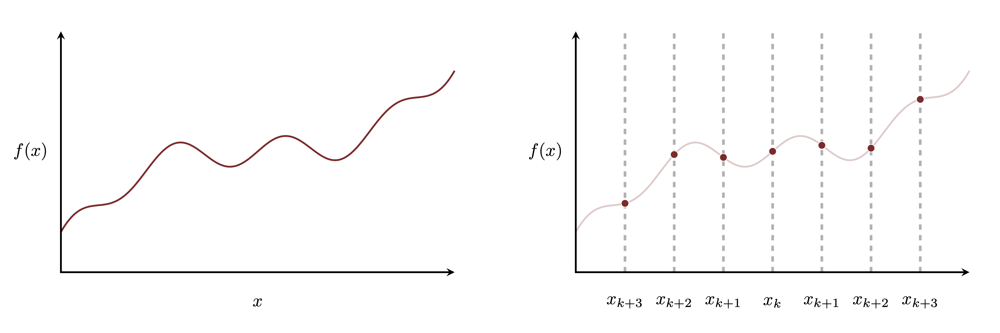
```
<br><br>
</center>

Any knowledge about the _smoothness_ of the continuous functional behavior is
incompatible with exchangeability.  The smoother the function the more
neighboring function values will correlate relative to remote function values,
and the more the functional behavior will change when we permute the inputs.

<center>
<br>
```{r, out.width = "33%", echo=FALSE}
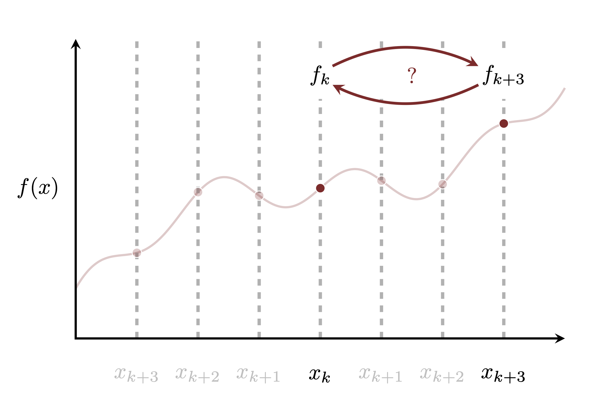
```
<br><br>
</center>

Exchangeability might be a much more reasonable assumption, however, for the
_residual_ functional behavior around some fixed baseline.  If the baseline
functional model $g(x)$ captures the large scale behavior of $f(x)$ then the
residuals
$$
f_{k} - g_{k} = f(x_{k}) - g(x_{k})
$$
will be much less spatially correlated and much more consistent with
exchangeability.

<center>
<br>
```{r, out.width = "100%", echo=FALSE}
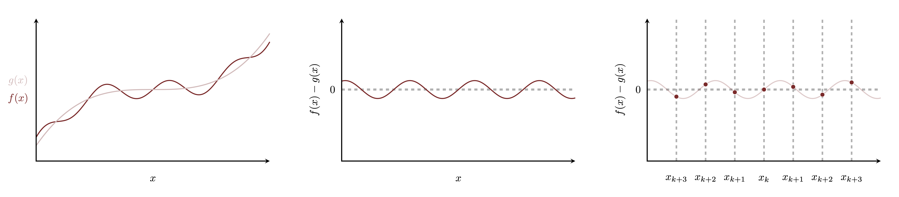
```
<br><br>
</center>

In any principled modeling application we have to remain diligent in recognizing
that exchangeability is an _assumption_, and one that cannot be made without
careful consideration.  Knowledge about the source of heterogeneity can
drastically improve inferences, and we should consider exploiting that
information whenever possible.  Only when we don't have that knowledge, or don't
have the resources to properly exploit it, will exchangeability be a reasonable
assumption.

## de Finetti's Theorem and Hierarchical Models

Conveniently _hierarchical models_ are naturally compatible with
exchangeability and provide a powerful tool for modeling exactly these
circumstances.

Exchangeability is an inherently _recursive_ property of a population.  If a
population is exchangeable then any subset of that population will also be
exchangeable, and so too will be any subset of that subset.  At the same time we
can always consider any exchangeable population as a subset of some larger,
hypothetical exchangeable population including contexts that we have not yet
considered.  In particular any exchangeable population can hypothetically be
included within some _infinitely_ large exchangeable population.

de Finetti showed that the _any_ probability density function compatible with an
infinitely large, exchangeable population must be of the form of a
_conditionally-independent, continuous mixture_
$$
\pi(\theta_{1}, \ldots, \theta_{K})
=
\int \mathrm{d} \phi \,
\pi(\phi) \cdot \prod_{k = 1}^{K} \pi(\theta_{k} \mid \phi).
$$
Here conditionally independent refers to the fact that given a fixed value of
$\phi$ the individual parameters are independent, while continuous mixture
refers to the marginalization over $\phi$.  For a more in depth discussion of de
Finetti's theorem see Chapter 9 of @deFinetti:1972 and Chapter 7 of
@DiaconisEtAl:2017.

Conceptually the conditional probability density function
$\pi(\theta_{k} \mid \phi)$ explicitly models an infinitely large, exchangeable
_latent population_ from which the individual parameters are drawn, with the
_population parameters_ $\phi$ characterizing the exact configuration of that
population.  In other words de Finetti's theorem tells us that we can always
model an exchangeable population by jointly modeling the individuals and the
infinite population _at the same time_.  This is especially relevant in practice
where we implicitly implement the marginalization over the population parameters
by fitting the joint model
$$
\pi(\theta_{1}, \ldots, \theta_{K}, \phi)
=
\pi(\phi) \cdot \prod_{k = 1}^{K} \pi(\theta_{k} \mid \phi).
$$
By modeling both jointly we have the flexibility to focus our inferences on just
the individual contexts we've observed or the entire latent population,
depending on which might be more appropriate in any given application.

Critically the latent population implied by de Finetti's theorem is simply a
latent population _consistent_ with the particular contexts observed, and it
need not correspond to any real population.  For example if the observed
contexts are influenced by selection effects then the latent population will
model only those contexts influenced by those specific selection effects; that
latent population will not generalize to contexts chosen under different
selection effects.

The latent parameters $\phi$ are commonly referred to as _hyperparameters_ and
$\pi(\phi)$ as the _hyperprior_.  While "hyper" is admittedly fun to say in my
opinion this terminology confuses the underlying assumptions and so I prefer to
use the more precise terms population parameters and population prior model,
respectively.

Technically any _finite_ exchangeable population will be compatible with a
larger family of probability density functions, but as the population size
increases that family will quickly converge to a de Finetti mixture
[@DiaconisEtAl:1980].  Moreover de Finetti's theorem gives both the
individual parameters and latent parameters an explicit interpretation which
facilitates principled prior modeling.  This is especially useful when we might
need to consider unforeseen contexts, and hence a larger exchangeable
population, in the future; because these models are compatible with infinite
exchangeability we can add new contexts without changing the model for the
existing contexts.

Joint models of individuals and the population from which they are examples of
_hierarchical models_, a name that makes particular sense given the shape of
their directed graphical model representation.

<center>
<br>
```{r, out.width = "75%", echo=FALSE}
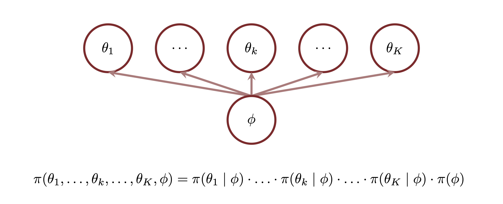
```
<br><br>
</center>

The full generality of hierarchical models has a long and somewhat convoluted
history -- see for example @Good:1980 which is also available as Chapter 9 of
@Good:1983.  Here we will avoid too much philosophical baggage by focusing on
the application of hierarchical models to capture infinitely exchangeable
heterogeneity, leaving the exact interpretation of that heterogeneity to the
practitioner.

Mathematically the exchangeability of the de Finetti mixture arises from
the commutativity of multiplication -- the product of conditional probability
density functions is the same regardless of the order of the individual factors.
$$
\begin{align*}
\pi(\theta_{1}, \ldots, \theta_{k}, \ldots, \theta_{K})
&=
\pi(\theta_{1} \mid \phi) \cdot \ldots
\cdot \pi(\theta_{k} \mid \phi) \cdot \ldots
\cdot \pi(\theta_{K} \mid \phi) \cdot \pi(\phi)
\\
&=
\pi(\theta_{1} \mid \phi) \cdot \ldots
\cdot \pi(\theta_{K} \mid \phi) \cdot \ldots
\cdot \pi(\theta_{k} \mid \phi) \cdot \pi(\phi)
\\
&=
\pi(\theta_{1}, \ldots, \theta_{K}, \ldots, \theta_{k}).
\end{align*}
$$

Graphically the exchangeability arises due to the symmetry of the directed
graphical model -- permuting or relabeling the nodes of the individual
parameters doesn't change the conditional structure and hence the shape of the
directed graph.

<center>
<br>
```{r, out.width = "100%", echo=FALSE}
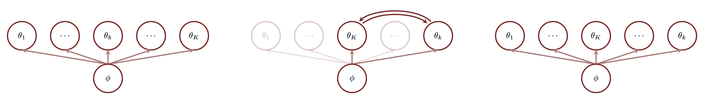
```
<br><br>
</center>

The conditional independence of the de Finetti mixture also ensures
compatibility with larger exchangeable populations.  To introduce a new
individual we can just multiply another factor of the population density
function without disturbing the initial model,
$$
\begin{align*}
\pi(\theta_{1}, \ldots, \theta_{K + 1})
&=
\prod_{n = 1}^{K + 1} \pi(\theta_{k} \mid \phi) \cdot \pi(\phi)
\\
&=
\pi(\theta_{K + 1} \mid \phi) \cdot \prod_{k = 1}^{K} \pi(\theta_{k} \mid \phi) \cdot \pi(\phi)
\\
&=
\pi(\theta_{K + 1} \mid \phi) \cdot \pi(\theta_{1}, \ldots, \theta_{K}).
\end{align*}
$$

<center>
<br>
```{r, out.width = "75%", echo=FALSE}
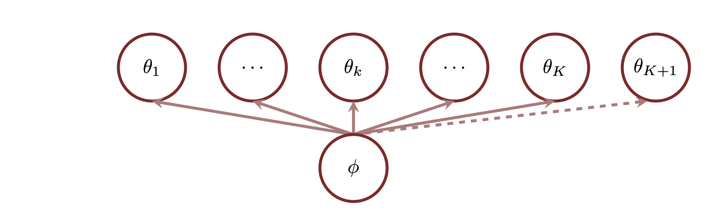
```
<br><br>
</center>

Typically observations are generated within only one context at a time.  In this
case the likelihood function decomposes into individual likelihood functions
that depend on only one set of individual parameters, and the full Bayesian
model will also be exchangeable,
$$
\begin{align*}
\pi(y_{1}, \ldots, y_{K}, \theta_{1}, \ldots, \theta_{K}, \phi)
&=
\pi(y_{1}, \ldots, y_{K} \mid \theta_{1}, \ldots, \theta_{K}, \phi) \cdot
\pi(\theta_{1}, \ldots, \theta_{K}, \phi)
\\
&=
\prod_{k = 1}^{K} \pi(y_{k} \mid \theta_{k}) \cdot
\prod_{k = 1}^{K} \pi(\theta_{k} \mid \phi) \cdot
\pi(\phi)
\\
&=
\left[ \prod_{k = 1}^{K} \pi(y_{k} \mid \theta_{k}) \cdot \pi(\theta_{k} \mid \phi) \right]
\pi(\phi).
\end{align*}
$$

<center>
<br>
```{r, out.width = "75%", echo=FALSE}
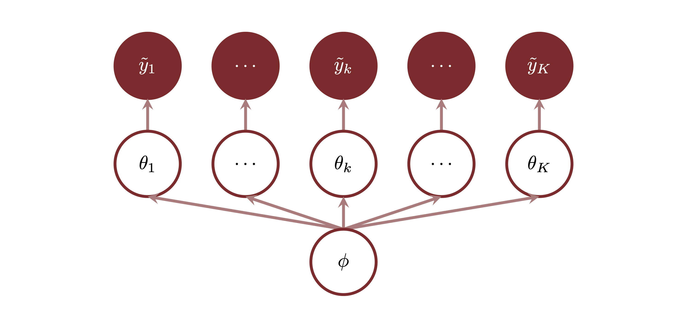
```
<br><br>
</center>

Even though observations directly inform only a single set of parameters, the
latent population model couples the individual parameters and provides a
backdoor for observations to inform all of the contexts.  For example the
observations from the $k$th context, $y_{k}$, directly inform the parameters
that quantify the behavior of that context, $\theta_{k}$.  Those parameters,
however, directly inform the population parameters $\phi$ which then inform all
of the other contexts through the population model.  Similarly observations that
directly inform the other contexts indirectly inform the population parameters
which then feeds back into the $k$th context.

<center>
<br>
```{r, out.width = "100%", echo=FALSE}
knitr::include_graphics("figures/dgm_hierarchical_info/dgm_hierarchical_info.png")
```
<br><br>
</center>

The strength of this pooling is determined by the shape of the population model,
$\pi(\theta_{k} \mid \phi)$.  Configurations where the population model is
narrow force strong pooling across contexts; in the limit of an infinitely
narrow population model the hierarchical model reduces to the homogeneous model
with complete pooling.  On the other hand model configurations where the
population model is diffuse weakens the pooling, and in the limit of an
infinitely wide population model the hierarchical model reduces to the
independent heterogeneity model with no pooling.

In other words hierarchical models _interpolate_ between the extreme homogenous
and independent heterogeneous assumptions.  By inferring the population
parameters jointly with the individual parameters we can _dynamically_ learn the
shape of the population model and hence the amount of pooling consistent with
the observed data.

## Normal Hierarchical Models

In order to completely specify a hierarchical model we need to specify the
population model, $\pi(\theta_{k} \mid \phi)$, that characterizes the infinite,
exchangeable population from which the individual parameters are drawn.  A
useful population model will, as always, depend on the details of any particular
application.  For example individual behaviors might cluster or otherwise
decompose into a sum of multiple contributions, suggesting a discrete mixture
model.  The more we know about the structure of the heterogeneity the more
sophisticated of a population model we can motivate.

When we don't know much about that structure, however, we often appeal to the
[common families of probability density functions](https://betanalpha.github.io/assets/case_studies/probability_densities.html)
that feature particularly interpretable and computationally convenient
properties.  For example if we assume that individual behaviors can be
quantified by a single, unconstrained, one-dimensional parameter
$\theta_{k} \in \mathbb{R}$ then we might consider a population model specified
by a normal probability density function,
$$
\theta_{k} \sim \text{normal}(\mu, \tau).
$$

If the individual parameters are one-dimensional but constrained to an interval
of the real line then we can appeal to families of probability density functions
compatible with that constraint, or we can model the _unconstrained parameter_
with a normal hierarchical model.  For example when modeling a population of
nominally positive parameters
$$
\{ \lambda_{1}, \ldots, \lambda_{K} \} \in \mathbb{R}^{+}
$$
we might model the log parameters $\kappa_{k} = \log(\lambda_{k})$ being drawn
from the normal population model,
$$
\begin{align*}
\kappa_{k} &\sim \text{normal}(\mu, \tau)
\\
\lambda_{k} &= \exp(\kappa_{k}).
\end{align*}
$$

When the behavior within the individual contexts is characterized by multiple
parameters then the modeling of the latent population becomes more complicated.
In [Section 5](#sec:multi_hier) we'll consider multivariate normal hierarchical
models appropriate for multiple unconstrained parameters.

Within a normal hierarchical model the population location parameter, $\mu$,
quantifies the centrality of the individual behaviors while the population scale
parameter, $\tau$, quantifies the dispersion, and hence the overall strength of
the heterogeneity.  As $\tau$ shrinks to zero the heterogeneity weakens and the
behavior across contexts becomes more homogenous, but as $\tau$ increases the
heterogeneity grows.  In the infinite limit $\tau \rightarrow \infty$ the
individual parameters decouple from the latent population, and each other.

These limits are especially important when considering the population prior
model, $\pi(\mu, \tau)$, which we typically assume to decompose into independent
prior density functions for each parameter, $\pi(\mu) \cdot \pi(\tau)$.  For
example a uniform prior density function on $\tau$ concentrates towards the
independent heterogeneity limit which gives the model excess flexibility that
possibly facilitates overfitting.  If we're _expanding_ around a simpler
homogeneous model, and want to allow only some limited heterogeneity without
precluding that the heterogeneity might be negligible, then a more appropriate
choice is a prior model that concentrates towards $\tau = 0$, such as that
specified by half-normal prior density function.

### Inferring Individuals Verses The Latent Population

Often statistical analyses are expected to report a single summary that
characterizes the behavior of a system.  When that behavior is heterogeneous,
however, no single summary fully captures the behavior.  To ensure meaningful
communication of our inferences we have to be careful to understand how are
colleagues might interpret any summary we produce.

If the particular contexts encountered in the analysis fully exhaust the
contexts that one might encounter in the future then it's natural to focus our
inferences on the posterior summaries of the individual parameters.  For example
we might report the posterior pushforward distribution of the parameter average,
$$
\frac{1}{K} \sum_{k = 1}^{K} \theta_{k},
$$
or any other estimator of centrality.

One the other hand if the observed contexts are only a small sample of the
potential contexts that might encounter in the future then it's more natural to
focus on posterior summaries of the population parameters.  For example we might
report the population location as a general baseline behavior.

The subtle difference between these two perspectives clarifies a bit when we
consider hypothetical predictions.  If we've fully exhausted the finite set of
possible contexts then predictions would be generated from the existing
individual parameters,
$$
y \sim \pi(y \mid \theta_{k});
$$
in this case inferences of the individual parameters are sufficient to
generalize.  Conversely if we've only seen a selection of possible contexts then
predictions might need to generate new individual parameters,
$$
\begin{align*}
\theta &\sim \text{normal}(\mu, \tau)
\\
y &\sim \pi(y \mid \theta),
\end{align*}
$$
in which case the population parameters quantify the generalized behavior.

Which perspective is most appropriate depends not only on the particular
application but also on the local community and how that community will consume
reported inferences.  As always there is no universal answer and instead we have
to consider what might be best in every new analysis.

### Equivalent Parameterizations

Conveniently there are multiple ways to specify a normal hierarchical model.
We can always reparameterize the individual parameters,
$$
\eta_{k} = f(\theta_{k})
$$
before deterministically reconstructing them as needed in the rest of the model,
$$
\begin{align*}
\eta_{k}
&\sim \pi \big( f^{-1} ( \eta_{k} ) \big)
\cdot \big|J \! \big( f^{-1}( \eta_{k} ) \big) \big|
\\
\theta_{k} &= f ( \eta_{k} ) \sim \pi(\theta_{k}).
\end{align*}
$$
where $\big| J \! \big( f^{-1} ( \eta_{k} ) \big) \big|$ is the
absolute value of the determinant of the Jacobian matrix of the transformation.

Because the normal family of probability density functions is closed under
translations and scalings these are particularly convenient transformations to
consider.  In particular the _non-centered parameterization_
[@PapaspiliopoulosEtAl:2003; @PapaspiliopoulosEtAl:2007] generates the nominal
individual parameters from latent parameters specified by independent, standard
normal density functions,
$$
\begin{align*}
\eta_{k}
&\sim \text{normal}(0, 1)
\\
\theta_{k} &= \mu + \tau \cdot \eta_{k} \sim \text{normal}(\mu, \tau).
\end{align*}
$$

Conceptually the non-centered parameters capture the _deviations_ of the
individual behaviors _relative_ to the latent population,
$$
\eta_{k} = \frac{ \theta_{k} - \mu }{ \tau }
$$
while the centered parameters capture the _absolute_ behaviors _independent_
of the latent population.

Depending on the circumstances we can model any or all of the individual
contexts with the centered normal parameters and the rest with the non-centered
parameters.  Indeed the complementary relationships between the individual
parameters and the latent population in these two parameterizations will prove
to be a critical tool in moderating the degeneracies inherent to normal
hierarchical models.

Although we will only rarely need to consider beyond the centered and
non-centered parameterizations in practice, for completeness note that the
centered and non-centered parameterizations can be considered the extremes of an
entire family of _partially-centered parameterizations_ [@GorinovaEtAl:2019]
$$
\begin{align*}
\eta_{k} &\sim \text{normal}(\lambda_{k} \cdot \mu, \tau^{\lambda_{k}})
\\
\theta_{k} &= \mu + \tau^{1 - \lambda_{k}} ( \eta_{k}  - \lambda_{k} \cdot \mu)
\sim \text{normal}(\mu, \tau).
\end{align*}
$$
When $\lambda_{k} = 0$ the $k$th individual is modeled with a non-centered
parameterization, when $\lambda_{k} = 1$ reduces to a centered parameterization,
and intermediate values interpolate between the two.

# The Fundamental Degeneracies of Normal Hierarchical Models

The theoretical utility of normal hierarchical models translates to practical
utility only if we can accurately fit them.  Unfortunately normal hierarchical
models are rich with degenerate behavior that manifests in both in the
individual parameters and the population parameters, and these degeneracies
requires deliberate care to overcome.

In this section we'll investigate these degeneracies and the strategies we have
to restrain them.

## Learning the Population Parameters

Let's first consider the population parameters.  The posterior distribution for
the population parameters alone is given by marginalizing out the individual
parameters,
$$
\begin{align*}
\pi(\mu, \tau \mid \tilde{y}_{1}, \ldots, \tilde{y}_{K})
&=
\int \prod_{k = 1}^{K} \mathrm{d} \theta_{k} \,
\pi(\theta_{1}, \ldots, \theta_{K}, \mu, \tau \mid \tilde{y}_{1}, \ldots, \tilde{y}_{K})
\\
&\propto
\int \prod_{k = 1}^{K} \mathrm{d} \theta_{k} \,
\left[ \prod_{k = 1}^{K} \pi(\tilde{y}_{k} \mid \theta_{k})
\cdot \text{normal}(\theta_{k} \mid \mu, \tau) \right]
\pi(\mu, \tau)
\\
&\propto
\left[ \prod_{k = 1}^{K}
\int \mathrm{d} \theta_{k} \, \pi(\tilde{y}_{k} \mid \theta_{k})
\cdot \text{normal}(\theta_{k} \mid \mu, \tau) \right]
\pi(\mu, \tau).
\end{align*}
$$

In general this integration cannot be performed analytically, but to build some
conceptual intuition let's consider the limit where the data are infinitely
informative and we can approximate the likelihood functions with Dirac delta
functions that are non-zero only at a single point
$\hat{\theta}_{k}(\tilde{y}_{k})$,
$$
\pi(\tilde{y}_{k} \mid \theta_{k})
\approx
\delta \left( \theta_{k} - \hat{\theta}_{k}(\tilde{y}_{k}) \right).
$$
Within this limit the integration becomes trivial -- we just evaluate the
integrand at this point,
$$
\begin{align*}
\pi(\mu, \tau \mid \tilde{y}_{1}, \ldots, \tilde{y}_{K})
&\propto
\left[ \prod_{k = 1}^{K}
\int \mathrm{d} \theta_{k} \, \pi(\tilde{y}_{k} \mid \theta_{k})
\cdot \text{normal}(\theta_{k} \mid \mu, \tau) \right]
\pi(\mu, \tau)
\\
&\propto
\left[ \prod_{k = 1}^{K}
\int \mathrm{d} \theta_{k} \,
\delta \left( \theta_{k} - \hat{\theta}_{k}(\tilde{y}_{k}) \right)
\cdot \text{normal}(\theta_{k} \mid \mu, \tau) \right]
\pi(\mu, \tau)
\\
&\propto
\left[ \prod_{k = 1}^{K} \text{normal} \left( \hat{\theta}_{k}(\tilde{y}_{k}) \mid \mu, \tau \right) \right]
\pi(\mu, \tau).
\end{align*}
$$
The inferences of the normal population parameters reduces to a straightforward
normal inference problem!

To better understand the influence of the observed data we can refactor the
marginal likelihood function into sufficient statistics,
$$
\begin{align*}
\pi(\tilde{y} \mid \mu, \tau)
&=
\prod_{k = 1}^{K} \text{normal} \left( \hat{\theta}_{k}(\tilde{y}_{k}) \mid \mu, \tau \right)
\\
&\propto \quad
\text{normal} \left( \mu \mid \hat{\mu}(\tilde{y}), \frac{\tau}{\sqrt{K}} \right)
\\
&\quad
\times \text{inverse-chi} \left( \tau \mid K- 1, \frac{ \hat{\tau}(\tilde{y}) }{ \sqrt{K - 1} } \right),
\end{align*}
$$
where $\hat{\mu}(\tilde{y})$ is the empirical mean,
$$
\hat{\mu}(\tilde{y}) = \frac{1}{K} \sum_{k = 1}^{K} \hat{\theta}_{k}(\tilde{y}_{k}),
$$
and $\hat{\tau}(\tilde{y})$ is the empirical standard deviation
$$
\hat{\tau}(\tilde{y}) =
\sqrt{ \frac{1}{K - 1} \sum_{K = 1}^{K}  \left( \hat{\theta}_{k}(\tilde{y}_{k}) - \hat{\mu}(\tilde{y}) \right)^{2}  }.
$$

Critically for small $K$ the inverse $\chi$ density function with $K - 1$
degrees of freedom is quite diffuse, and the population scale $\tau$ is not
particularly well informed.  In hindsight this isn't too surprising -- to learn
the variance of a population one needs a reasonably large set of individuals.
Unfortunately it also has unfortunate consequences for the inferences of the
population location parameter.

The population location term in the marginal likelihood function,
$$
\text{normal} \left( \mu \mid \hat{\mu}(\tilde{y}), \frac{\tau}{\sqrt{K}} \right),
$$
concentrates on values within
$$
\begin{align*}
\left( \frac{ \mu - \hat{\mu}(\tilde{y}) }{ \frac{\tau}{\sqrt{K}} } \right)^{2} &\lessapprox 1
\\
\frac{ | \mu - \hat{\mu}(\tilde{y}) | }{ \frac{\tau}{\sqrt{K}} } &\lessapprox 1
\\
| \mu - \hat{\mu}(\tilde{y}) | &\lessapprox \frac{\tau}{\sqrt{K}}
\\
| \mu - \hat{\mu}(\tilde{y}) | &\lessapprox \frac{\exp(\log \tau)}{\sqrt{K}}.
\end{align*}
$$

For small values of $\tau$ the population location $\mu$ is tightly bound to the
empirical mean, but for larger values $\mu$ is far less constrained.  When
$\tau$ is poorly informed the marginal likelihood function will encompass both
of these behaviors and exhibit a _funnel_ degeneracy.

<center>
<br>
```{r, out.width = "50%", echo=FALSE}
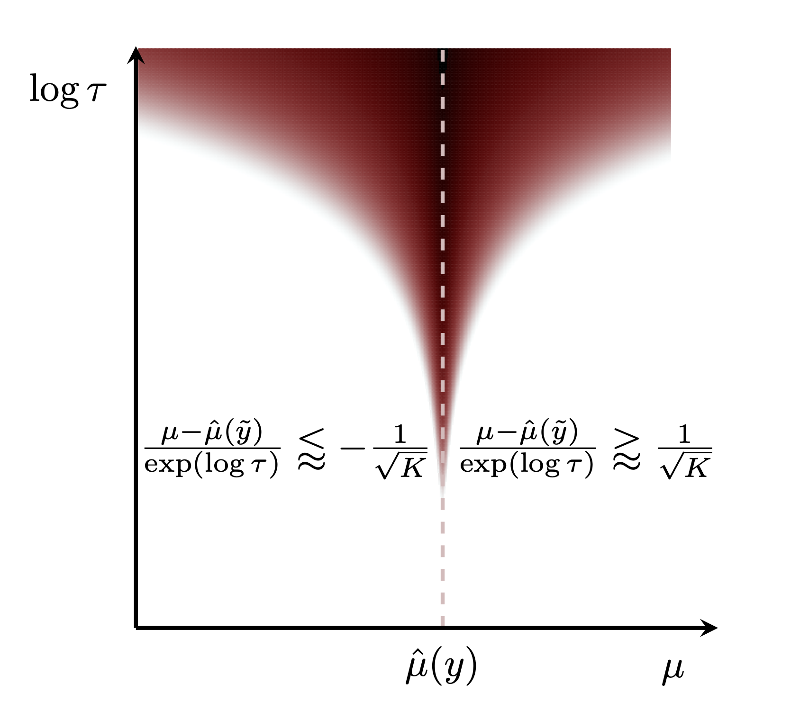
```
<br><br>
</center>

Funnel degeneracies easily frustrate most Bayesian computational methods, and
hence the accurate quantification of corresponding probability distribution.
We'll discuss the pathologies of funnel densities in more detail
in [Section 3.3](#sec:funnel).

In other words if we observe only a small number of contexts then the population
parameters will exhibit a funnel degeneracy no matter how much data we have
_within_ each context.  For finite data the problem is even worse: the funnel
degeneracy can manifest even for large $K$ if there isn't enough data within
each context to sufficiently inform the individual likelihood functions.

If we don't have enough sufficiently informed contexts then we have to lean on
our domain expertise through the population prior model
$$
\pi(\mu, \tau) = \pi(\mu) \cdot \pi(\tau)
$$
to isolate just one regime of the funnel and enable effective computation.  For
example upper bounds on how much heterogeneity is reasonable can inform
infinity-suppressing priors that cut off the top of the funnel.

<center>
<br>
```{r, out.width = "100%", echo=FALSE}
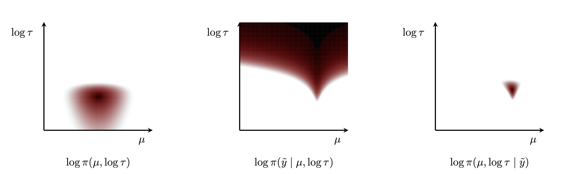
```
<br><br>
</center>

At the same time any lower bound on the amount of heterogeneity between contexts
can inform zero-suppressing priors that cut off the bottom of the funnel.

<center>
<br>
```{r, out.width = "100%", echo=FALSE}
knitr::include_graphics("figures/pop_param_funnel/zero_suppress_prog/zero_suppress_prog.png")
```
<br><br>
</center>

Of course these strategies will be useful only if the population prior models
are actually compatible with our domain expertise and not simply chosen for
computational convenience.  Any knowledge of the magnitude of heterogeneity is
extremely powerful when implementing any hierarchical model, let alone a normal
hierarchical model!

## Learning the Individual Parameters

Now we can consider the degeneracies inherent to the individual parameters, in
particular under what circumstances degeneracies arise in both the centered and
non-centered parameterizations.

### Centered Parameterization

Recall that in a centered parameterization we model the individual parameters
drawn directly from the latent population.
<center>
<br>
```{r, out.width = "75%", echo=FALSE}
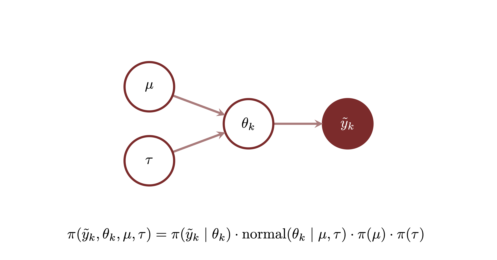
```
<br><br>
</center>

Here we'll assume a half normal prior on the population scale typical of
applications where we're expanding around a homogenous model,
$$
\pi(\mu) \cdot \pi(\tau)
=
\text{normal}(\mu | 0, \omega_{\mu})
\cdot \text{half-normal}(\tau | 0, \omega_{\tau}).
$$

This latent population model strongly couples the individual parameters to the
population parameters.  When the population scale $\tau$ is small the individual
parameters are forced to strongly concentrate around the population location,
$\mu$, but when the population scale is large the individual parameters expand
over a much wider range of values.  This results in _another_ funnel degeneracy
in each individual parameter, although the assumed infinity-suppressing prior
on $\tau$ cuts off the top of that funnel.

<center>
<br>
```{r, out.width = "50%", echo=FALSE}
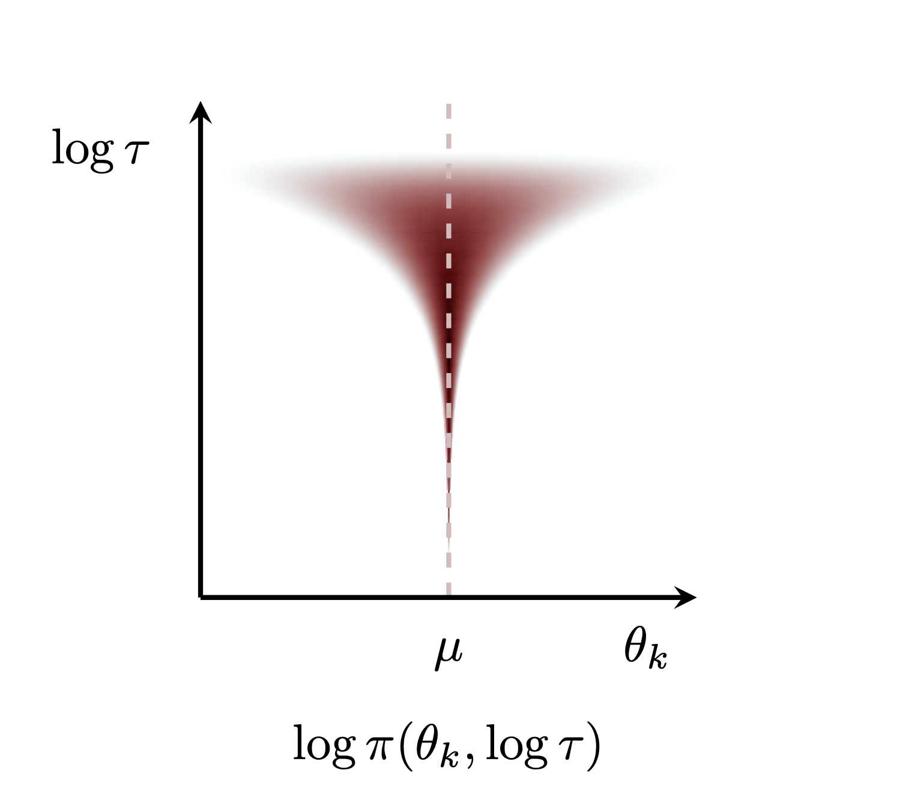
```
<br><br>
</center>

On the other hand observations within the $k$th context, $\tilde{y}_{k}$, inform
the $k$th individual parameter independently of the the population parameters.

<center>
<br>
```{r, out.width = "50%", echo=FALSE}
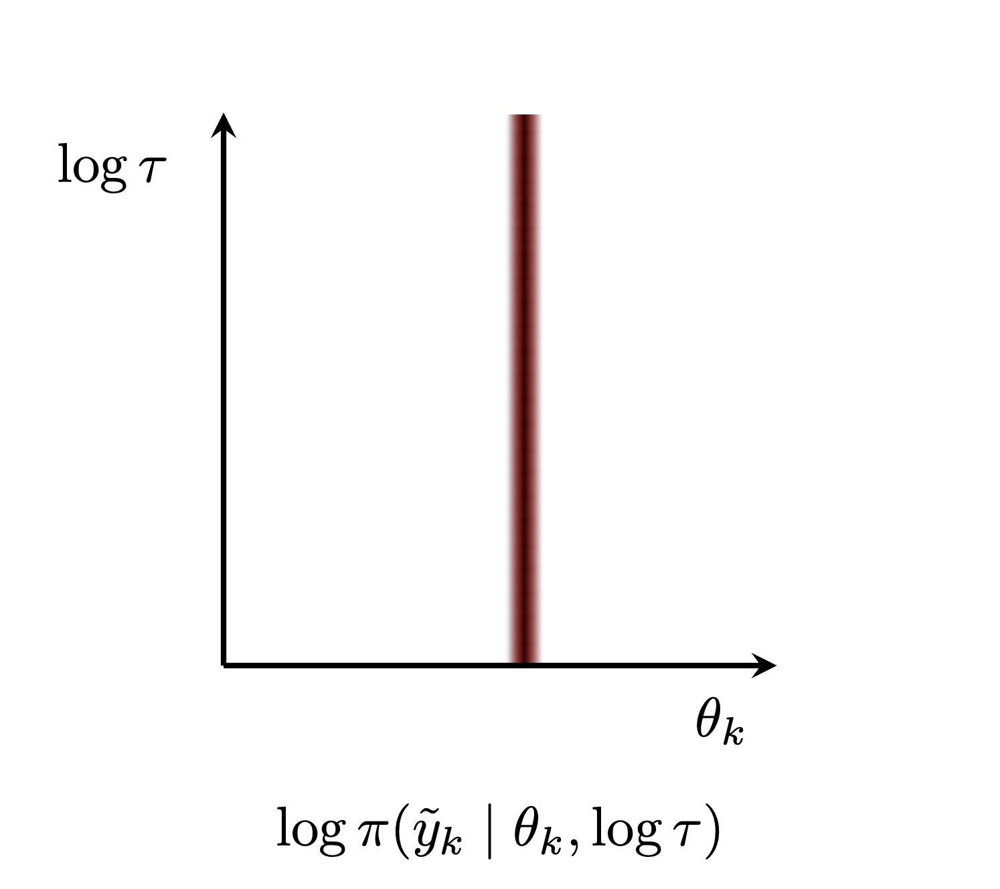
```
<br><br>
</center>

Observations within the other contexts, however, inform the populations scale
and complement what we learn from $\tilde{y}_{k}$ alone.

<center>
<br>
```{r, out.width = "50%", echo=FALSE}
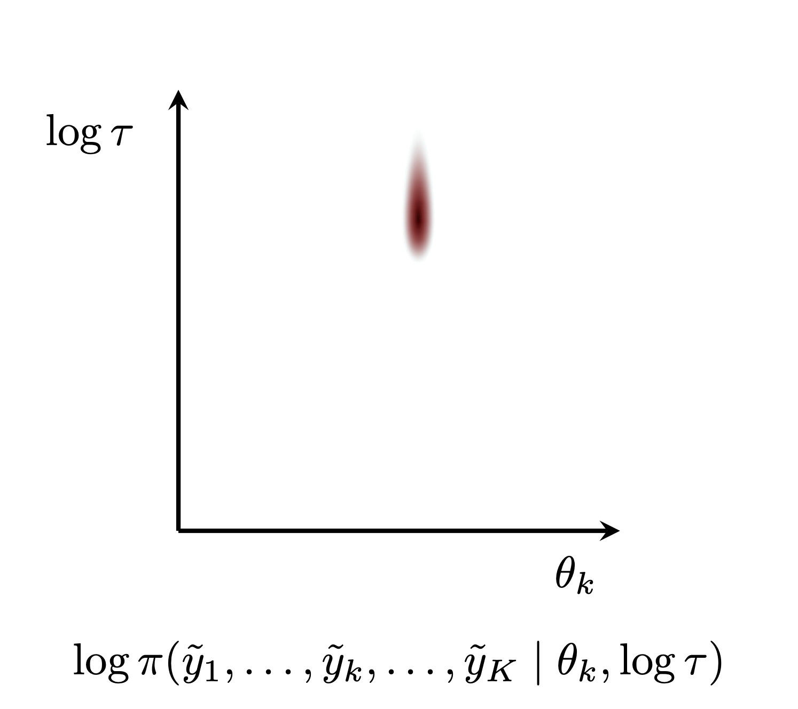
```
<br><br>
</center>

How much this funnel degeneracy manifests in the posterior density function
depends on the shape of the total likelihood function. If the data are not
informative then the prior density function dominates and the funnel degeneracy
will propagate to the posterior density function.  We have to be careful,
however, by exactly what we mean by informative.

If the data local to the $k$th context are not particularly informative then the
$k$th contribution to the likelihood function,
$\pi(\tilde{y}_{k} \mid \theta_{k})$, will be wide and the contribution from the
prior density function will dominate the posterior density function.

<center>
<br>
```{r, out.width = "75%", echo=FALSE}
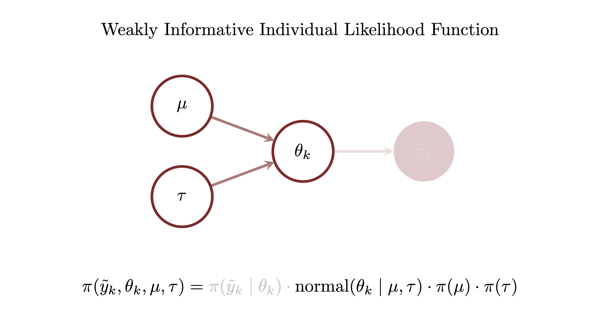
```
<br><br>
</center>

<center>
<br>
```{r, out.width = "100%", echo=FALSE}
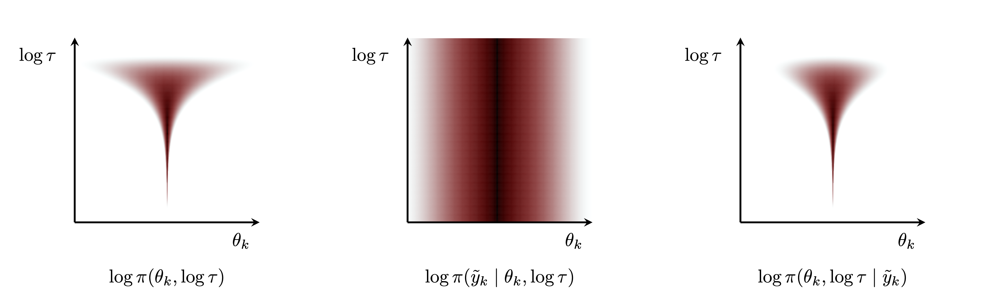
```
<br><br>
</center>

If the data local to the $k$th context are informative enough then the
corresponding contribution to the likelihood function will be narrow and
dominate the posterior density function.

<center>
<br>
```{r, out.width = "75%", echo=FALSE}
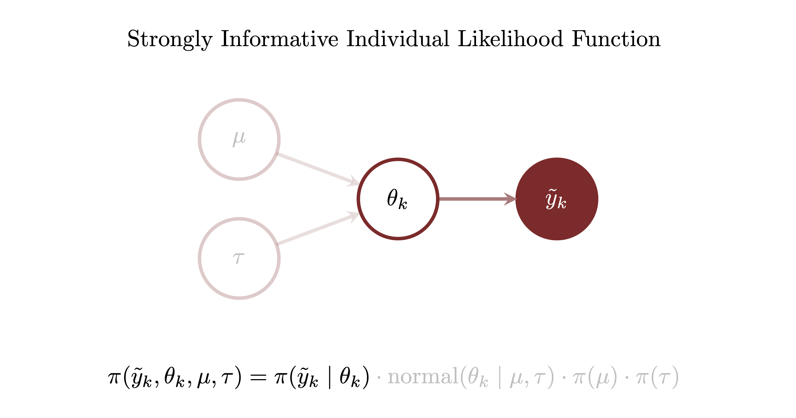
```
<br><br>
</center>

<center>
<br>
```{r, out.width = "100%", echo=FALSE}
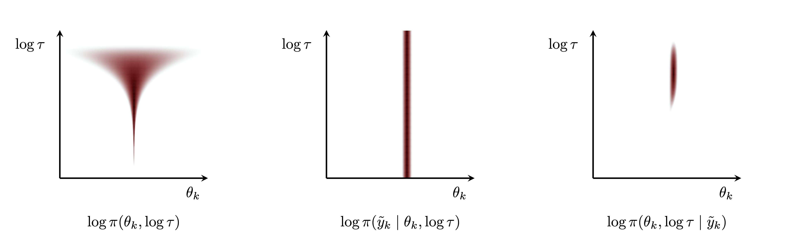
```
<br><br>
</center>

The individual likelihood functions, however, are not the only data that
constrain the individual parameters.  As long as $\tau < \infty$ information
in the other likelihood functions will inform $\mu$ and $\tau$ as well.  Even
if an individual likelihood function is diffuse this partial pooling can
suppress the worst of the funnel degeneracy.

<center>
<br>
```{r, out.width = "100%", echo=FALSE}
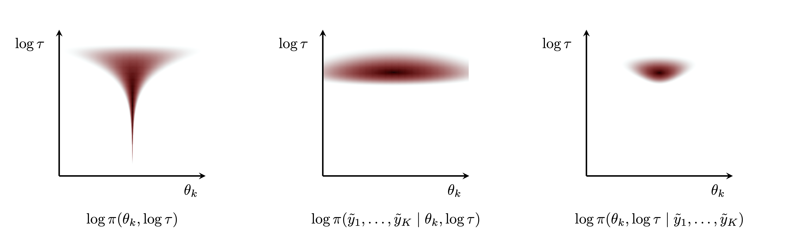
```
<br><br>
</center>

If the $k$th individual is already strongly informed then the partial pooling
only improves the precision of our inferences.

<center>
<br>
```{r, out.width = "100%", echo=FALSE}
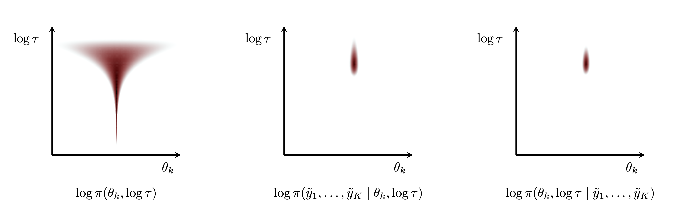
```
<br><br>
</center>

How much the partial pooling contributes relative to the individual likelihood
function depends on both how many individual contexts are being modeled and how
strongly those contexts are informed by the observed data.  Degeneracies arise
from an intricate ballet between the structure of the model and the details of
any specific observation.

### Non-Centered Parameterization

In a non-centered parameterization we don't model the individual parameters
directly but rather the relative deviations of those parameters from the latent
population,
$$
\begin{align*}
\eta_{k} &\sim \text{normal}(0, 1)
\\
\theta_{k} &= \mu + \tau \cdot \eta_{k}.
\end{align*}
$$

<center>
<br>
```{r, out.width = "75%", echo=FALSE}
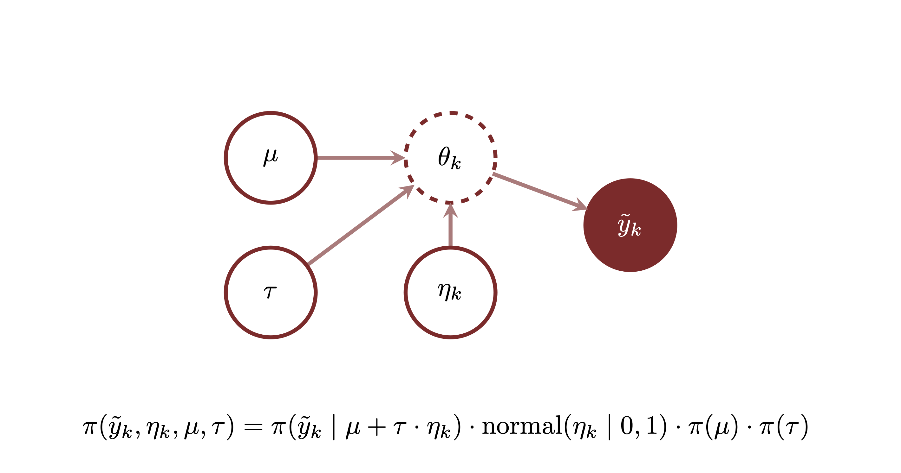
```
<br><br>
</center>

Once again we'll assume a half normal prior on the population scale typical of
applications where we're expanding around a homogenous model,
$$
\pi(\mu) \cdot \pi(\tau)
=
\text{normal}(\mu | 0, \omega_{\mu})
\cdot \text{half-normal}(\tau | 0, \omega_{\tau}).
$$

Without any data the relative deviations completely decouple from the population
parameters, resulting in an independent prior density function.

<center>
<br>
```{r, out.width = "50%", echo=FALSE}
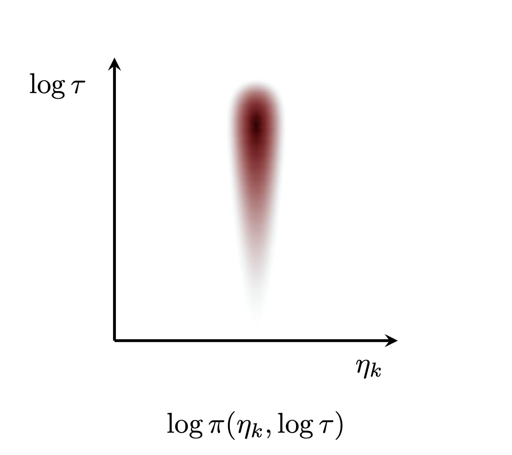
```
<br><br>
</center>

The coupling of the individual parameters and the population parameters is
instead isolated to the deterministic transformation from the relative
parameters back to the absolute parameters,
$$
\theta_{k} = \mu + \tau \cdot \eta_{k}.
$$
Information that constrains the individual parameters manifests in an awkward
geometry for the relative parameters.  If the $\theta_{k}$ are fixed then an
increase in $\tau$ must be accompanied by either an increase in $\mu$ or a
decrease in $\eta_{k}$, resulting in an _inverted funnel degeneracy_
in the individual likelihood functions that becomes more pathological the more
strongly informed the likelihood functions!

<center>
<br>
```{r, out.width = "50%", echo=FALSE}
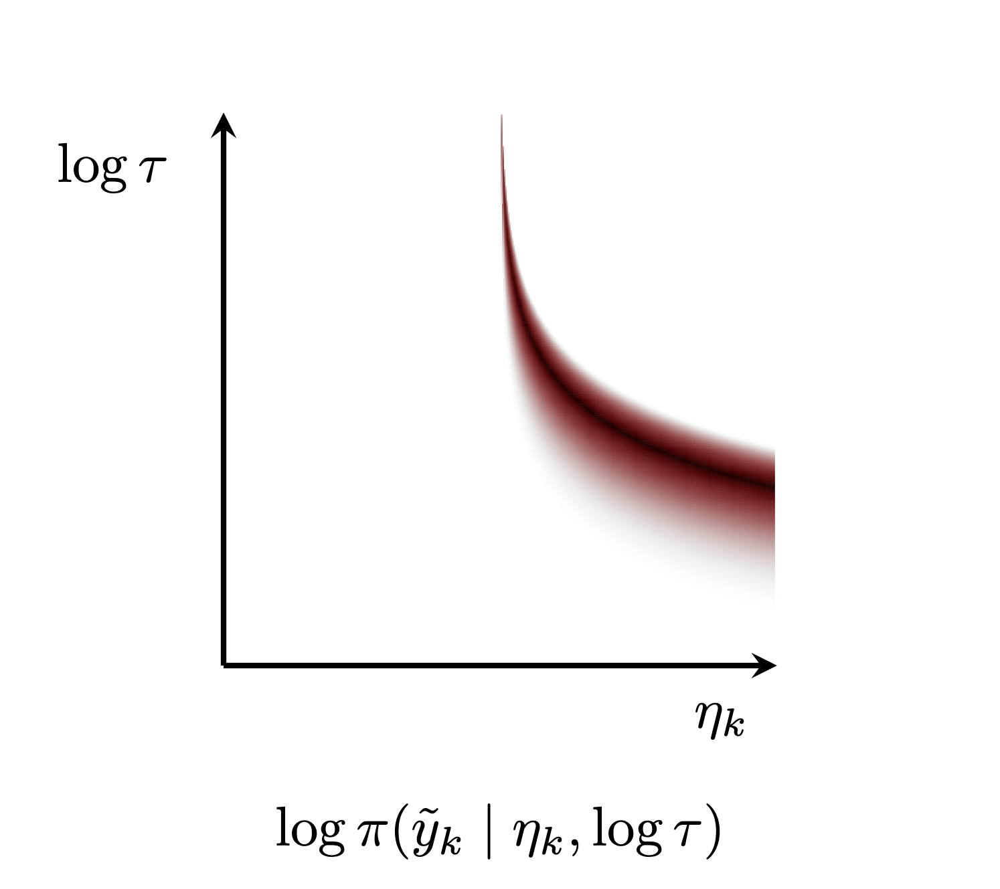
```
<br><br>
</center>

Any backdoor information gained from the partial pooling, however, helps to
cut off the worst of the inverted funnel and suppress this pathological
behavior.

<center>
<br>
```{r, out.width = "50%", echo=FALSE}
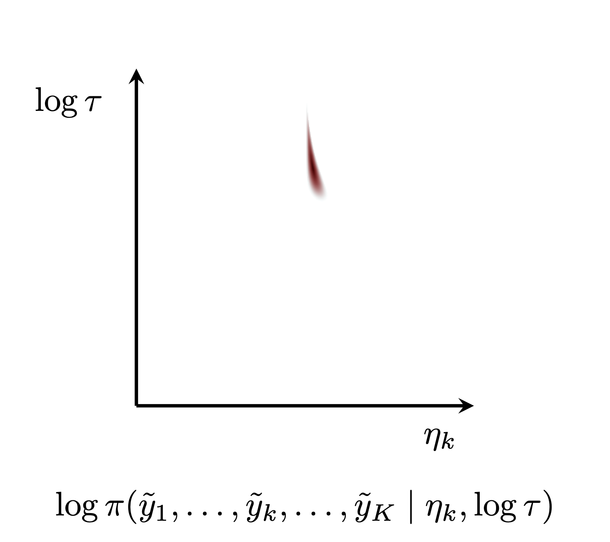
```
<br><br>
</center>

Consequently if the data local to the $k$th context are not particularly
informative then the $k$th contribution to the likelihood function,
$\pi(\tilde{y}_{k} \mid \theta_{k})$, will be diffuse and the contribution from
the prior density function will dominate, resulting in a nice posterior density
function.

<center>
<br>
```{r, out.width = "75%", echo=FALSE}
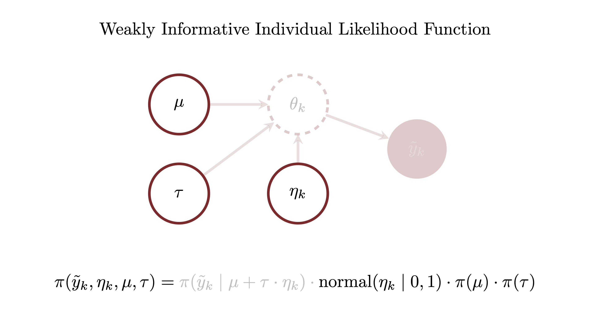
```
<br><br>
</center>

<center>
<br>
```{r, out.width = "100%", echo=FALSE}
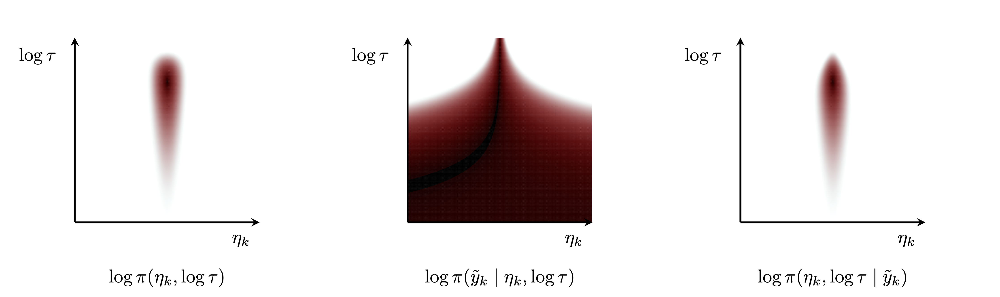
```
<br><br>
</center>

On the other hand when the the data local to the $k$th context becomes more
informative then the corresponding contribution to the likelihood function will
be narrow and dominate the posterior density function.  In this case the
inverted funnel degeneracy propagates to the posterior density function.

<center>
<br>
```{r, out.width = "75%", echo=FALSE}
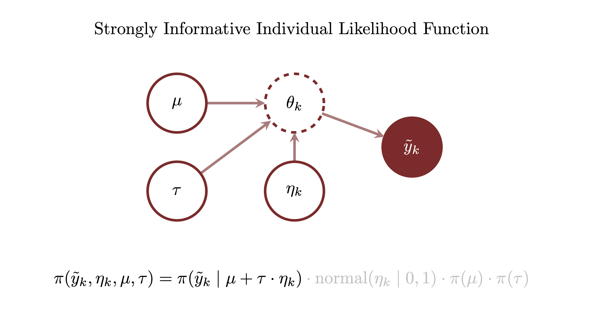
```
<br><br>
</center>

<center>
<br>
```{r, out.width = "100%", echo=FALSE}
knitr::include_graphics("figures/noncentered_progressions/noncentered_strong_info/noncentered_strong_info_indiv.png")
```
<br><br>
</center>

Note, however, how the infinity-suppressing prior model for $\tau$ actually cuts
off the worst of the inverted funnel degeneracy.  A weaker prior model would
allow the degeneracy to be even more pathological.

Of course once we consider the other contexts these behaviors are moderated by
the partial pooling.  In the weakly informative regime the information provided
by the partial pooling only complements the prior model.

<center>
<br>
```{r, out.width = "100%", echo=FALSE}
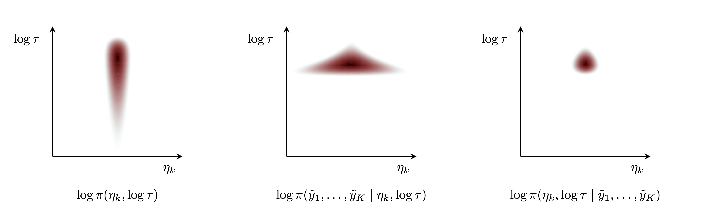
```
<br><br>
</center>

More importantly in the strongly informative regime the partial pooling can
cut off the worst of the inverted funnel degeneracy in the individual likelihood
function and suppress what propagates to the posterior density function.

<center>
<br>
```{r, out.width = "100%", echo=FALSE}
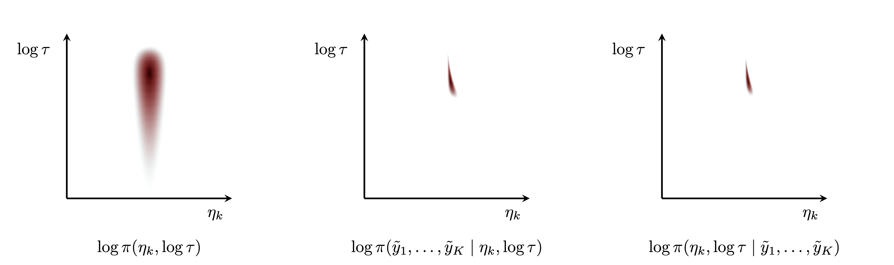
```
<br><br>
</center>

### Backhanded Complements

If we consider only the contribution from an individual likelihood function,
and ignore the information induced by partial pooling, then the centered and
non-centered parameterization of each individual context admit complementary
pathologies.

<center>
<br>
```{r, out.width = "75%", echo=FALSE}
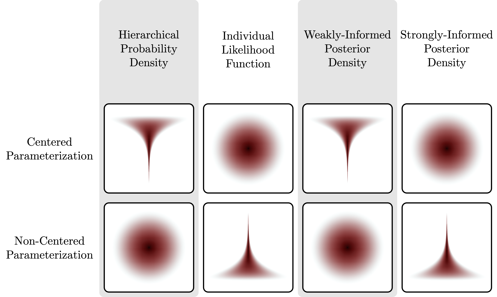
```
<br><br>
</center>

When an individual likelihood function is strongly informed then that
contribution to the posterior density function will dominate.  In a
non-centered parameterization this allows the inverse funnel degeneracy of the
non-centered likelihood function to propagate to the posterior density function,
but in a centered parameterization this suppresses the funnel degeneracy of the
centered prior density function.  Consequently the centered parameterization is
better behaved.

<center>
<br>
```{r, out.width = "75%", echo=FALSE}
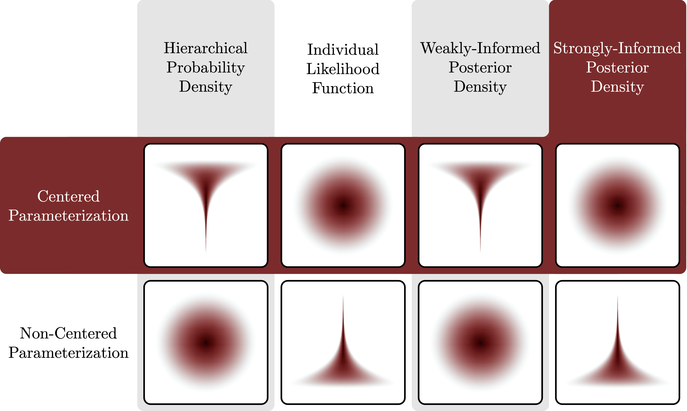
```
<br><br>
</center>

If an individual likelihood function is only weakly informed then everything is
inverted.  The funnel degeneracy of the centered parameterization propagates to
the posterior density function while the inverted funnel degeneracy of the
non-centered likelihood function is overwhelmed by the nicer prior density
function.  In this case the non-centered parameterization is better behaved.

<center>
<br>
```{r, out.width = "75%", echo=FALSE}
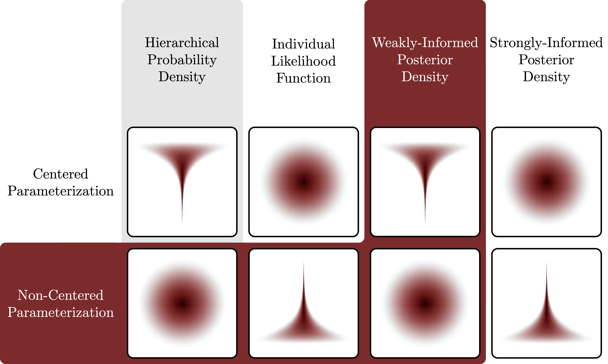
```
<br><br>
</center>

What about partially-centered parameterizations?  For any given likelihood
function a partially-centered parameterization may perform better than either
the centered or non-centered parameterizations, but in practice the differences
are usually negligible.  Consequently we can consider only the centered and
non-centered parameterizations without any significant loss of performance.

Critically each individual context can be parameterized differently, and the
optimal parameterization for each will depend on the particular behavior of the
local likelihood function.  If the behavior of the individual likelihood
functions varies across contexts then monolithically centering or non-centering
all of the contexts will result in a suboptimal posterior density function.

All of that said the consequences of choosing a suboptimal parameterization for
any individual parameter may be limited by partial pooling.  If _enough_
contexts are strongly informed then they can constrain the population parameters
sufficiently to cut off the worst of the funnel degeneracies in the other
contexts.  For example if the individual contexts are _uniformly_ strongly
informed then the partial pooling naturally compensates for the inverted funnel
degeneracy of the individual likelihood functions in the non-centered
parameterization.  The pathological behavior is the worst exactly when the
partial pooling is strongest!  Consequently the non-centered parameterization is
often a more robust choice in practice, especially when we're considering more
than a few contexts.

Finally we have to consider the important role of the population prior model.
The inverted funnel degeneracy of the non-centered parameterization becomes more
pathological as $\tau$ increases, but this is exactly the regime that is
suppressed by an infinity-suppressing prior model such as the one assumed above.
Similarly the worst of the funnel degeneracy in the centered parameterization
can be moderated by zero-suppressing priors.

In other words the non-centered parameterization, and an interpretation of the
individual contexts relative to the latent population, is particularly
well-behaved when expanding around a homogeneous model while the centered
parameterization, and an interpretation independent of the latent population,
is particularly well-behaved when expanding around an independently
heterogeneous model.  The performance and interpretability of each
parameterization are intimately related.

## Funnel Degeneracies and Bayesian Computation {#sec:funnel}

Funnel degeneracies show up all over the place in hierarchical models, and
unfortunately those degeneracies are especially problematic to accurate
probabilisitic computation.  To understand why let's take a closer look at a
probability density function that manifests a funnel degeneracy and the
probability distribution is represents.

As we saw above a probability density function with a funnel degeneracy is
characterized by a single parameter that controls the concentration of
probability density -- for large values the density is diffuse while for large
values it condenses into an ever narrowing neck.  For hierarchical models the
population scale $\tau$ controls this variation in the population location or
the individual parameters.  I'll denote the latter collectively as $\phi$.

<center>
<br>
```{r, out.width = "50%", echo=FALSE}
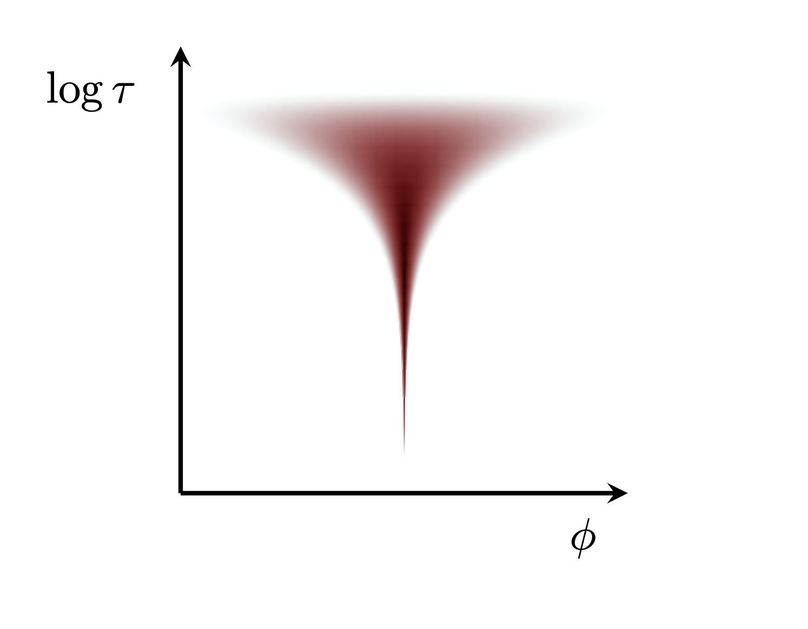
```
<br><br>
</center>

In order to effectively approximate the probability distribution specified by
this probability density function we need to quantify the typical set where the
differential probability mass concentrates.  At the top of the funnel the
probability density decays but also spreads out over large expanses of volume;
in the neck of the funnel the probability density grows large but is confined to
a narrow volume.  The product of the probability density and differential
volume, however, is relatively constant across the two extremes and the typical
set takes the shape of an inverted tear drop.

<center>
<br>
```{r, out.width = "50%", echo=FALSE}
knitr::include_graphics("figures/funnel/typical_set/typical_set.png")
```
<br><br>
</center>

In order to accurately quantify a target distribution a probabilistic
computational algorithm must be able to quantify both extremes of the funnel,
from the flat expanses at the top to the narrow valley at the bottom, _at the
same time_.  For Markov chain Monte Carlo algorithms this requires many
transitions from the top of the funnel to the bottom and back again.

For most Markov transitions this exploration up and down the funnel is limited
by the shape of the concentrating typical set.  At any point there is more
volume, and hence room to transition, immediately upwards than downwards, and
the disparity grows exponentially fast with the dimension of $\phi$.
Transitions into that upwards volume, however, are limited by the decaying
probability density.  As the dimensionality of $\phi$ increases these dueling
behaviors result in Markov transitions that concentrating around only narrow
values of $\tau$, rapidly exploring conditional values of $\phi$ but only
slowing exploring the full extent of $\tau$.

As the Markov chain explores deeper into the neck of the funnel the ever
increasing concentration of the probability density into narrow and narrower
regions becomes especially pathological.

<center>
<br>
```{r, out.width = "50%", echo=FALSE}
knitr::include_graphics("figures/funnel/typical_set/typical_set_focus.png")
```
<br><br>
</center>

Most Markov transitions will venture into these depths only rarely, and when
they do they tend to get stuck and unable to return for long periods of time.

Together with the slow exploration of $\tau$ this results in a characteristic
behavior where Markov chains slowly move up and down the funnel, occasionally
venturing too far and getting stuck.

<center>
<br>
```{r, out.width = "100%", echo=FALSE}
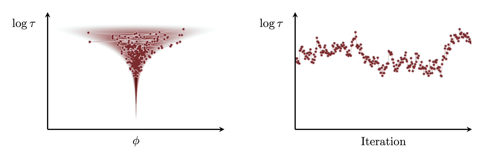
```
<br><br>
</center>

If Markov chains are run long enough then this behavior may become clear in
trace plots, allowing practitioners to diagnose funnel degeneracies hidden in
their model.  Unfortunately for many Markov chain Monte Carlo algorithms this
might require so much computation that it becomes impractical.

Fortunately the sensitive diagnostics of Hamiltonian Monte Carlo
[@Betancourt:2018b] are much more responsive and can identify the presence of
funnel degeneracies within relatively short Markov chains.

For example the extreme curvature deep in the neck of the funnel causes
instabilities in the numerical Hamiltonian trajectories that generate each
transition, resulting in _divergent transitions_ that can then be used to
diagnose the unfortunate geometry.

<center>
<br>
```{r, out.width = "50%", echo=FALSE}
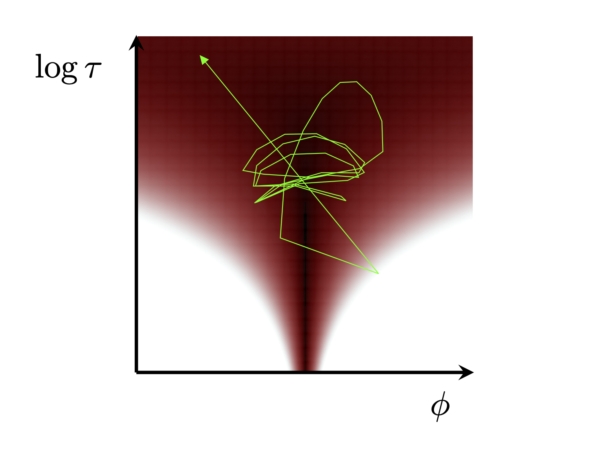
```
<br><br>
</center>

Because states generated from divergent transitions will concentrate towards
the pathological neck more than non-divergent transitions, we can overlay
scatter plots of the two ensembles to identify any lurking funnel degeneracies.

Even without these instabilities, however, the typical implementations of
Hamiltonian Monte Carlo that utilize constant metrics will suffer from slow
exploration up and down the funnel.  At any point the Hamiltonian trajectories
generated by these implementations are confined to only narrow regions in
$\tau$, and no matter how long or accurately we integrate the transitions will
extend only so far.

<center>
<br>
```{r, out.width = "100%", echo=FALSE}
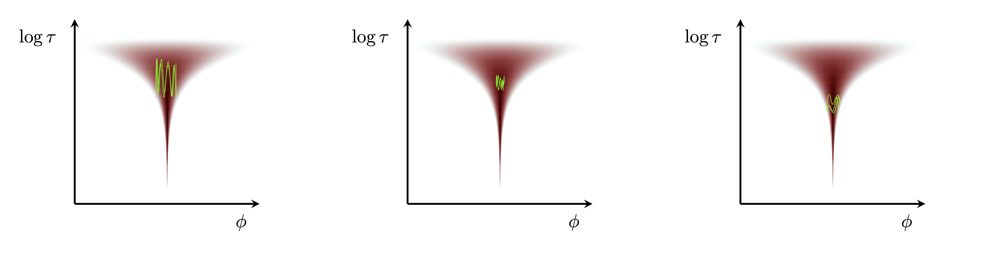
```
<br><br>
</center>

The underlying problem is that the _energy_ within each Hamiltonian transition
can vary only so much which limits how far into the ambient space the trajectory
can expand.  Unfortunately for funnel degeneracies the energy also correlates
strongly with $\tau$.

<center>
<br>
```{r, out.width = "50%", echo=FALSE}
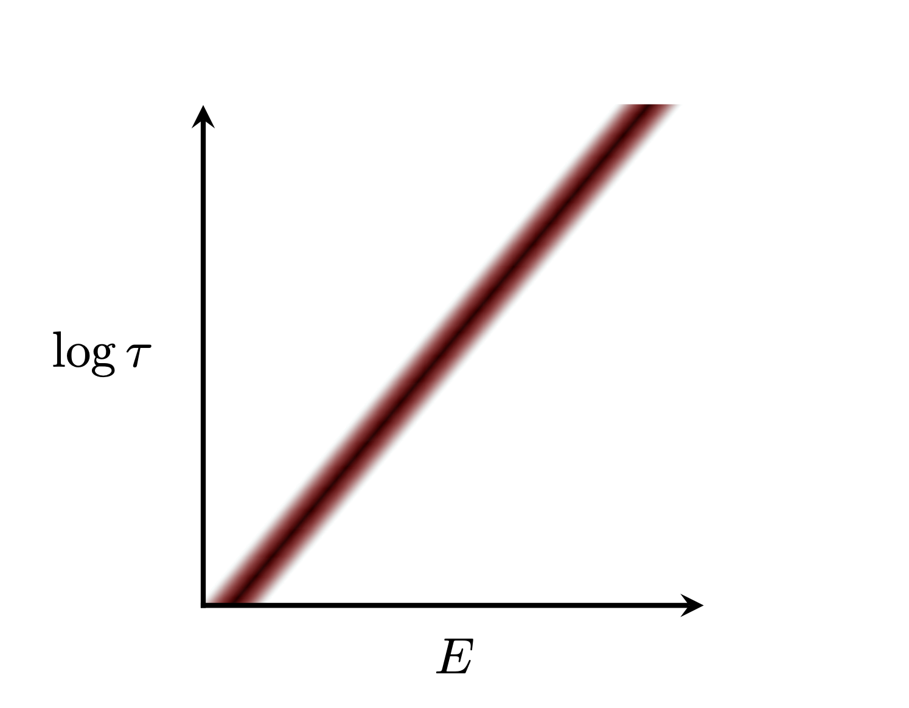
```
<br><br>
</center>

Marginalizing out $\tau$ we are left with a wide range of energy values that
we need to explore.

<center>
<br>
```{r, out.width = "100%", echo=FALSE}
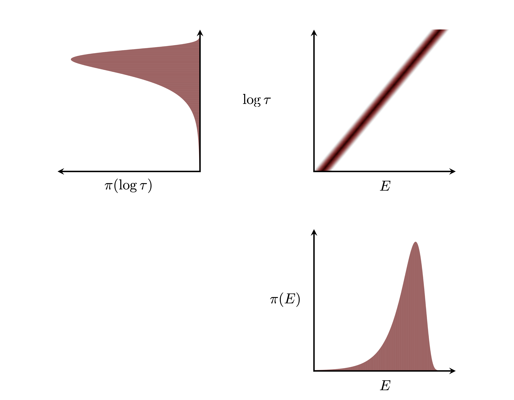
```
<br><br>
</center>

At the same time conditioning on any given value of $\log \tau$ shows how little
variation in energy each transition can accommodate.

<center>
<br>
```{r, out.width = "50%", echo=FALSE}
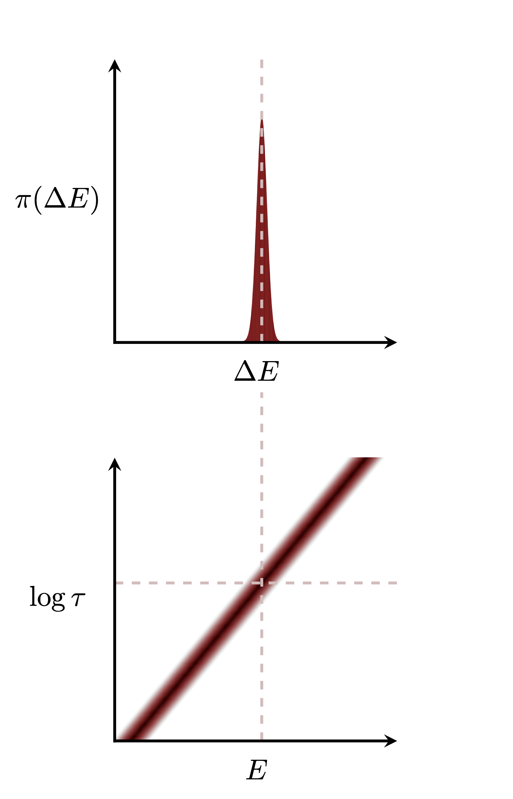
```
<br><br>
</center>

In other words we have only small steps with which to explore the large expanse
of energies, resulting in slow exploration up and down the funnel.

<center>
<br>
```{r, out.width = "50%", echo=FALSE}
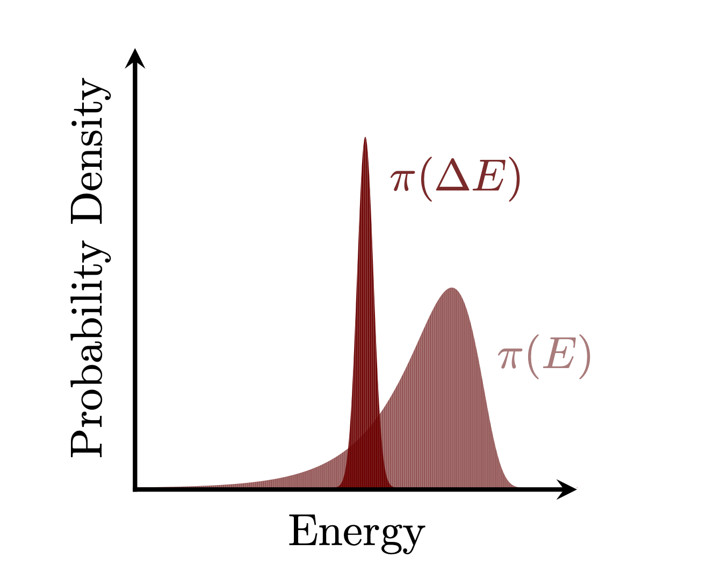
```
<br><br>
</center>

Conveniently the energy fraction of missing information, or E-FMI, is sensitive
to exactly this stunted exploration.  Even without divergences the E-FMI
diagnostic can readily identify the consequences of a latent funnel degeneracy.

Hamiltonian Monte Carlo is especially well-suited for working with the funnel
degeneracies inherent to hierarchical models.  The sensitive diagnostics inform
not only when the funnels have become too strong but also _where_ in parameter
space the degeneracy is most problematic.  That in turn guides the most
effective resolution, whether it be refined prior models or reparameterization
of the individual parameters.

More sophisticated variants of Hamiltonian Monte Carlo can potentially overcome
these problems using more information about the posterior probability density
function, although they are difficult to implement robustly.  For more on this
and further details on Hamiltonian Monte Carlo and hierarchical models see
[@BetancourtEtAl:2015].

# Empirical Investigations

To explore how the degenerate behavior inherent to hierarchical models manifests
in practice let's get our hands dirty with some coding experiments.  In this
section we'll investigate various aspects of these degeneracies with targeted
examples before considering a more realistic modeling problem.

First, however, we have to set up our local environment.

```{r, warning=FALSE}
library(rstan)
rstan_options(auto_write = TRUE)
options(mc.cores = parallel::detectCores())
parallel:::setDefaultClusterOptions(setup_strategy = "sequential")

util <- new.env()
source('stan_utility.R', local=util)

c_light <- c("#DCBCBC")
c_light_highlight <- c("#C79999")
c_mid <- c("#B97C7C")
c_mid_highlight <- c("#A25050")
c_dark <- c("#8F2727")
c_dark_highlight <- c("#7C0000")

c_light_trans <- c("#DCBCBC80")
c_dark_trans <- c("#8F272780")
c_green_trans <- c("#00FF0080")

par(family="CMU Serif", las=1, bty="l", cex.axis=1, cex.lab=1, cex.main=1,
    xaxs="i", yaxs="i", mar = c(5, 5, 3, 5))
```

## Funnels Aches

Let's start by investigating the funnel degeneracy directly with a simple Stan
program that couples a set of $K$ parameters $\phi$ to a scale parameter $\tau$.

```{r}
writeLines(readLines("stan_programs/funnel.stan"))
```

This program specifies a probability density function that is similar but not
quite identical to Radford Neal's funnel density function [@Neal:2003].
Critically Neal's funnel model employs a _log normal_ density function for
$\tau$ that suppresses both zero and infinity, and hence some of the degenerate
geometry.  The half normal prior density function that we use here allows the
full neck of the funnel to manifest.

We beginning by considering $K = 1$ to emulate the funnel degeneracy that can
appear between the population location and population scale.

```{r}
data <- list("K" = 1)
```

```{r, warning=FALSE, message=FALSE}
fit <- stan(file='stan_programs/funnel.stan', data=data,
            seed=4938483, refresh=1000)
```

Divergent iterations indicate incomplete exploration.

```{r}
util$check_all_diagnostics(fit)
```

Before following up on the divergences let's take a look at the trace plots for
the population scale, $\tau$.  As expected each Markov chain only slowly
explores up and the funnel, occasionally lingering once it reaches small enough
values.

```{r}
unpermuted_samples <- extract(fit, permute=FALSE)

par(mfrow=c(2, 2))

plot(1:1000, log(unpermuted_samples[,1,1]), type="l", lwd=1, col=c_dark,
     main="Chain 1",
     xlab="Iteration",  xlim=c(1, 1000),
     ylab="log(tau)", ylim=c(-3, 3))
plot(1:1000, log(unpermuted_samples[,2,1]), type="l", lwd=1, col=c_dark,
     main="Chain 2",
     xlab="Iteration",  xlim=c(1, 1000),
     ylab="log(tau)", ylim=c(-3, 3))
plot(1:1000, log(unpermuted_samples[,3,1]), type="l", lwd=1, col=c_dark,
     main="Chain 3",
     xlab="Iteration",  xlim=c(1, 1000),
     ylab="log(tau)", ylim=c(-3, 3))
plot(1:1000, log(unpermuted_samples[,4,1]), type="l", lwd=1, col=c_dark,
     main="Chain 4",
     xlab="Iteration",  xlim=c(1, 1000),
     ylab="log(tau)", ylim=c(-3, 3))
```

To further investigate the degeneracy we can overlay the scatter plot between
$\tau$ and $\phi$ for both the non-divergent and divergent iterations of the
four Markov chains.

```{r}
partition <- util$partition_div(fit)
div_samples <- partition[[1]]
nondiv_samples <- partition[[2]]

par(mfrow=c(1, 1))

name_x <- paste("phi[", 1, "]", sep='')

plot(nondiv_samples[name_x][,1], log(nondiv_samples$tau),
     col=c_dark_trans, pch=16, main="",
     xlab=name_x, xlim=c(-40, 40), ylab="log(tau)", ylim=c(-3, 3))
points(div_samples[name_x][,1], log(div_samples$tau),
       col=c_green_trans, pch=16)
```

The overlaid scatter plots reveal a truncated funnel geometry in the
non-divergent iterations consistent with obstructed exploration.  We also see
a concentration of the divergent iterations near that truncation, further
highlighting the problem.

We can confirm this obstructed exploration hypothesis by running Stan with a
higher `adapt_delta`.  This forces a less aggressive step size adaptation,
resulting in smaller step sizes, and more computationally expensive Markov
transitions, but more precise exploration that should extend deeper into the
funnel if our hypothesis is correct.

```{r, warning=FALSE, message=FALSE}
fit <- stan(file='stan_programs/funnel.stan', data=data,
            seed=4938483, refresh=1000,
            control=list(adapt_delta=0.999))
```

The less aggressive adaptation doesn't eliminate the divergent transitions
entirely, but it does reduce them.

```{r}
util$check_all_diagnostics(fit)
```

Returning to the scatter plot we see that the more precise exploration does
indeed push deeper into the funnel, confirming that our initial fit was not
completely exploring the target distribution.

```{r}
partition <- util$partition_div(fit)
div_samples <- partition[[1]]
nondiv_samples <- partition[[2]]

plot(nondiv_samples[name_x][,1], log(nondiv_samples$tau),
     col=c_dark_trans, pch=16, main="",
     xlab=name_x, xlim=c(-40, 40), ylab="log(tau)", ylim=c(-3, 3))
points(div_samples[name_x][,1], log(div_samples$tau),
       col=c_green_trans, pch=16)
```

Now we can consider a higher-dimensional funnel that emulates a centered
hierarchical population model.

```{r}
K <- 9
data <- list("K" = K)
```

```{r, warning=FALSE, message=FALSE}
fit <- stan(file='stan_programs/funnel.stan', data=data,
            seed=4938483, refresh=1000)
```

We see a few lingering divergences and some energy fraction of missing
information warnings.

```{r}
util$check_all_diagnostics(fit)
```

Funnels degeneracies manifest in each direction of $\phi$ and the lingering
divergences seem to be drawn towards the neck indicative of incomplete
exploration.

```{r}
partition <- util$partition_div(fit)
div_samples <- partition[[1]]
nondiv_samples <- partition[[2]]

par(mfrow=c(3, 3))
for (k in 1:K) {
  name_x <- paste("phi[", k, "]", sep='')

  plot(nondiv_samples[name_x][,1], log(nondiv_samples$tau),
       col=c_dark_trans, pch=16, main="",
       xlab=name_x, xlim=c(-40, 40), ylab="log(tau)", ylim=c(-3, 3))
  points(div_samples[name_x][,1], log(div_samples$tau),
         col=c_green_trans, pch=16)
}
```

Once again we can confirm our hypothesis with a less aggressive adaptation.

```{r, warning=FALSE, message=FALSE}
fit <- stan(file='stan_programs/funnel.stan', data=data,
            seed=4938483, refresh=1000,
            control=list(adapt_delta=0.999))
```

While the divergences have vanished the energy fraction of missing information
warnings remain.

```{r}
util$check_all_diagnostics(fit)
```

Looking at the trace plots we see the Markov chains 3 and 4 explore the deepest
part of the funnel only slowly while Markov chains 1 and 2 don't venture into 
the depths at all.  This incomplete exploration is why those two chains don't
trigger E-FMI warnings!

```{r}
unpermuted_samples <- extract(fit, permute=FALSE)

par(mfrow=c(2, 2))

plot(1:1000, log(unpermuted_samples[,1,1]), type="l", lwd=1, col=c_dark,
     main="Chain 1",
     xlab="Iteration",  xlim=c(1, 1000),
     ylab="log(tau)", ylim=c(-3, 3))
plot(1:1000, log(unpermuted_samples[,2,1]), type="l", lwd=1, col=c_dark,
     main="Chain 2",
     xlab="Iteration",  xlim=c(1, 1000),
     ylab="log(tau)", ylim=c(-3, 3))
plot(1:1000, log(unpermuted_samples[,3,1]), type="l", lwd=1, col=c_dark,
     main="Chain 3",
     xlab="Iteration",  xlim=c(1, 1000),
     ylab="log(tau)", ylim=c(-3, 3))
plot(1:1000, log(unpermuted_samples[,4,1]), type="l", lwd=1, col=c_dark,
     main="Chain 4",
     xlab="Iteration",  xlim=c(1, 1000),
     ylab="log(tau)", ylim=c(-3, 3))
```

Looking at the scatter plots we see some strong funnel degeneracies that limit
Hamiltonian Monte Carlo's exploration up and down values of $\log \tau$.

```{r}
partition <- util$partition_div(fit)
div_samples <- partition[[1]]
nondiv_samples <- partition[[2]]

par(mfrow=c(3, 3))

for (k in 1:K) {
  name_x <- paste("phi[", k, "]", sep='')

  plot(nondiv_samples[name_x][,1], log(nondiv_samples$tau),
       col=c_dark_trans, pch=16, main="",
       xlab=name_x, xlim=c(-40, 40), ylab="log(tau)", ylim=c(-3, 3))
  points(div_samples[name_x][,1], log(div_samples$tau),
         col=c_green_trans, pch=16)
}
```

We can confirm the source of the energy fraction of missing information warning
by overlaying the sampled energies and the energy jumps between each transition.
The higher-dimensional funnel spans a wider range of energies and the
implementation of Hamiltonian Monte Carlo in Stan can't keep up.  While each
Markov transition is able to explore the $\phi$ parameters efficiently it can
move along $\tau$ only slowly, requiring many transitions, and hence long Markov
chains, to get a full picture of the target distribution.

```{r}
par(mfrow=c(1, 1))

sampler_params <- get_sampler_params(fit, inc_warmup=FALSE)

energies <- sapply(1:4, function(n) sampler_params[n][[1]][,'energy__'])
diff_energies <- sapply(1:4, function(n) diff(energies[,n]))

hist(energies - mean(energies), breaks=seq(-35, 35, 0.5),
     col=c_light, border=c_light_highlight, main="",
     xlim=c(-30, 25), xaxt='n', xlab="Energies",
     yaxt='n', ylim=c(0, 300), ylab="")
hist(diff_energies, breaks=seq(-35, 35, 0.5),
     col=c_dark, border=c_dark_highlight, add=T)
```

## Hierarchical Funnels {#sec:hierarchical_funnels}

With a better understanding for how funnel degeneracies can be identified and
investigated with Hamiltonian Monte Carlo's sensitive diagnostics let's now
see how these degeneracies manifest in normal hierarchical models.  We'll begin
with uniformly weakly informative likelihood functions before considering
uniformly strongly informative likelihood functions and then the circumstance
where the behavior of the likelihood functions varies from context to context.
Finally we'll investigate a hierarchical model with only a few individual
contexts and the funnel degeneracy that can manifest between the population
parameters.

### Uniformly Weakly Informative Likelihood Functions

To simplify our initial exploration let's consider a circumstance where _all_
of the individual likelihood functions are uniformly weakly informative.  In
other words the likelihood functions are all wide enough that the prior model
dominates the shape of the posterior density function.

We could engineer this circumstance by playing with the amount of data but here
we'll control the shape of the likelihood functions directly by setting the
measurement variability $\sigma$ to a large constant.

```{r}
writeLines(readLines("stan_programs/generate_data.stan"))
```

```{r, warning=FALSE}
N <- 9
K <- 9
indiv_idx <- 1:9
sigma <- 10

fit <- stan(file='stan_programs/generate_data.stan',
            data=c("N", "K", "indiv_idx", "sigma"), iter=1, chains=1,
            seed=194838, algorithm="Fixed_param")

y <- extract(fit)$y[1,]

data <- list("N" = N, "y" = y, "K" = K, "indiv_idx" = indiv_idx, "sigma" = sigma)
```

Here `indiv_idx` serves as a _lookup table_ that maps each datum to the context
in which it was observed.

Because the behavior of the likelihood functions is uniform across the
individual contexts we need only consider _monolithic_ parameterizations where
all of the individual parameters are either centered or non-centered at the
same time.

#### Monolithically Centered Parameterization

Let's start with a centered parameterization which, according to our theoretical
understanding, should manifest a funnel geometry due to the weakly informative
likelihood functions.

<center>
<br>
```{r, out.width = "75%", echo=FALSE}
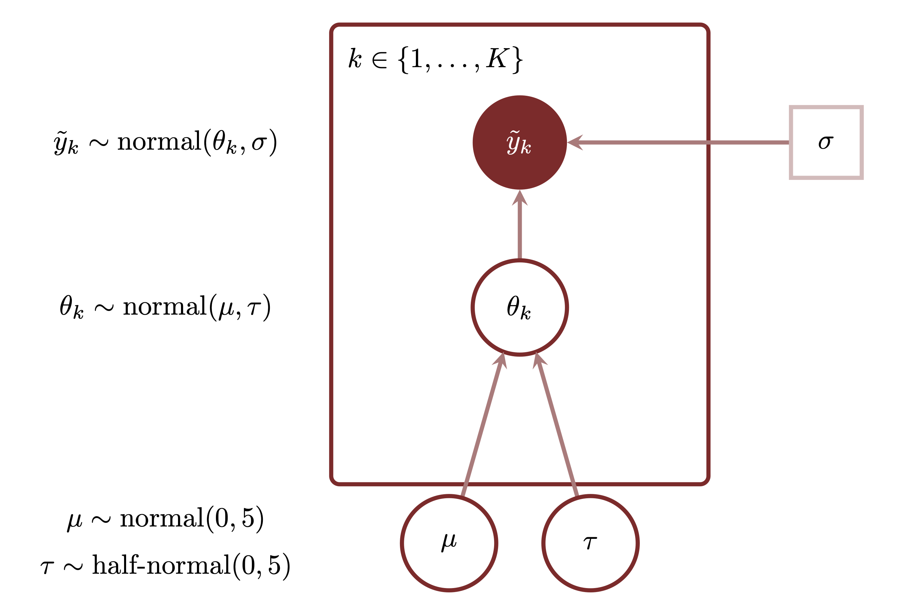
```
<br><br>
</center>

Instead of implementing this model in Stan with nested loops we can take
advantage of `indiv_idx` to implement the model with a single loop over the
data.  Because `indiv_idx` maps each datum to the appropriate context we can
write the observational model as
$$
\tilde{y}_{n} \sim \text{normal}(\theta_{k(n)}, \sigma).
$$
This lookup form becomes more useful when there are multiple observations in
each context, especially when the number of observations varies from context to
context.

```{r}
writeLines(readLines("stan_programs/hierarchical_cp.stan"))
```

To clarify the finer details of the realized Markov transition behavior let's
run particularly long Markov chains.

```{r, cache=TRUE, warning=FALSE, message=FALSE}
cp_fit <- stan(file='stan_programs/hierarchical_cp.stan', data=data, seed=4938483,
               iter=11000, warmup=1000, refresh=11000)
```

Once the Markov chains have run we dutifully check our diagnostics and see the
divergence warnings that we were expecting.

```{r}
util$check_all_diagnostics(cp_fit)
```

Markov chains 1, 3, and 4 exhibit the characteristic funnel behavior in the
trace plots for the population scale.  Markov chain 2 doesn't even bother to
dip its toes into the funnel.  Note also that only Markov chain 4, which spends
the most time deep in the funnel, triggers the E-FMI warning.

```{r}
unpermuted_samples <- extract(cp_fit, permute=FALSE)

par(mfrow=c(2, 2))

plot(1:10000, log(unpermuted_samples[,1,2]), type="l", lwd=1, col=c_dark,
     main="Chain 1",
     xlab="Iteration", xlim=c(1, 1000),
     ylab="log(tau)", ylim=c(-8, 3))
plot(1:10000, log(unpermuted_samples[,2,2]), type="l", lwd=1, col=c_dark,
     main="Chain 2",
     xlab="Iteration", xlim=c(1, 1000),
     ylab="log(tau)", ylim=c(-8, 3))
plot(1:10000, log(unpermuted_samples[,3,2]), type="l", lwd=1, col=c_dark,
     main="Chain 3",
     xlab="Iteration", xlim=c(1, 1000),
     ylab="log(tau)", ylim=c(-8, 3))
plot(1:10000, log(unpermuted_samples[,4,2]), type="l", lwd=1, col=c_dark,
     main="Chain 4",
     xlab="Iteration", xlim=c(1, 1000),
     ylab="log(tau)", ylim=c(-8, 3))
```

To really confirm, however, we have to investigate the scatter plots.  Indeed
we see funnels in each of the centered parameters.

```{r}
partition <- util$partition_div(cp_fit)
div_samples <- partition[[1]]
nondiv_samples <- partition[[2]]

par(mfrow=c(3, 3))

for (k in 1:K) {
  name_x <- paste("theta[", k, "]", sep='')

  plot(nondiv_samples[name_x][,1], log(nondiv_samples$tau),
       col=c_dark_trans, pch=16, main="",
       xlab=name_x, xlim=c(-40, 40), ylab="log(tau)", ylim=c(-8, 3))
  points(div_samples[name_x][,1], log(div_samples$tau),
         col=c_green_trans, pch=16)
}
```

We can try increasing `adapt_delta` to force a more refined exploration in
exchange for more computational cost.


```{r, cache=TRUE, warning=FALSE, message=FALSE}
cp_fit <- stan(file='stan_programs/hierarchical_cp.stan', data=data, seed=4938483,
               iter=11000, warmup=1000, refresh=11000,
               control=list(adapt_delta=0.99))
```

Divergences have been reduced, but not completely.

```{r}
util$check_all_diagnostics(cp_fit)
```

The Markov chains do go deeper into the funnels but the lingering divergent
transitions suggest that the still don't go far enough.

```{r}
partition <- util$partition_div(cp_fit)
div_samples <- partition[[1]]
nondiv_samples <- partition[[2]]

par(mfrow=c(3, 3))

for (k in 1:K) {
 name_x <- paste("theta[", k, "]", sep='')

 plot(nondiv_samples[name_x][,1], log(nondiv_samples$tau),
      col=c_dark_trans, pch=16, main="",
      xlab=name_x, xlim=c(-40, 40), ylab="log(tau)", ylim=c(-8, 3))
 points(div_samples[name_x][,1], log(div_samples$tau),
        col=c_green_trans, pch=16)
}
```

#### Monolithically Non-Centered Parameterization

The observed funnel degeneracies between the centered individual parameters and
the population scale suggests that the non-centered parameterization might be
better suited to this particular posterior density function.

<center>
<br>
```{r, out.width = "75%", echo=FALSE}
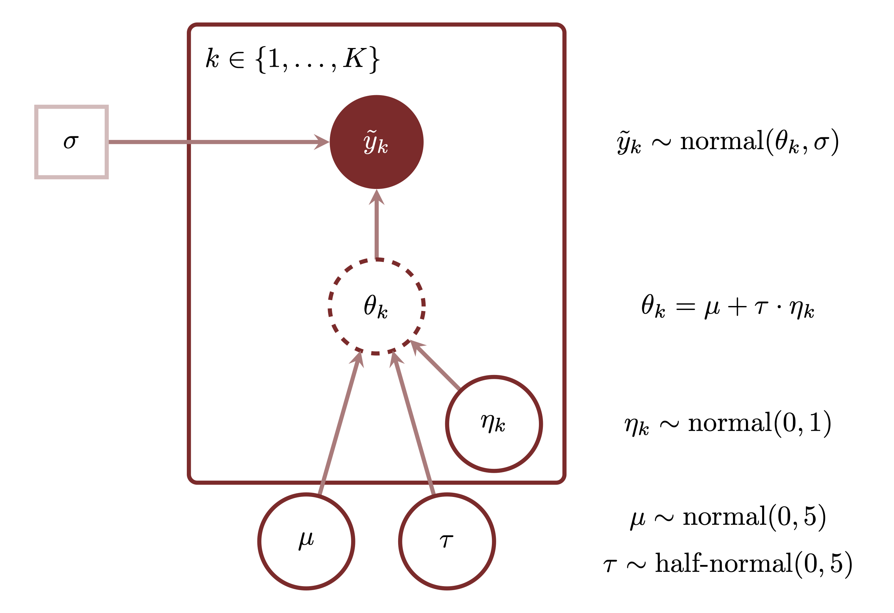
```
<br><br>
</center>

```{r}
writeLines(readLines("stan_programs/hierarchical_ncp.stan"))
```

```{r, cache=TRUE, warning=FALSE, message=FALSE}
ncp_fit <- stan(file='stan_programs/hierarchical_ncp.stan',
                data=data, seed=4938483,
                iter=11000, warmup=1000, refresh=11000)
```

Indeed the diagnostics are refreshingly clean.

```{r}
util$check_all_diagnostics(ncp_fit)
```

There isn't a funnel to be found in any of the non-centered parameters!

```{r}
partition <- util$partition_div(ncp_fit)
div_samples <- partition[[1]]
nondiv_samples <- partition[[2]]

par(mfrow=c(3, 3))

for (k in 1:K) {
 name_x <- paste("eta[", k, "]", sep='')

 plot(nondiv_samples[name_x][,1], log(nondiv_samples$tau),
      col=c_dark_trans, pch=16, main="",
      xlab=name_x, xlim=c(-10, 10), ylab="log(tau)", ylim=c(-8, 3))
 points(div_samples[name_x][,1], log(div_samples$tau),
        col=c_green_trans, pch=16)
}
```

Comparing the non-centered fit to the precise, and expensive, non-centered fit
we can see that even with a high `adapt_delta` the centered fit wasn't
accurately quantifying the posterior distribution.

```{r}
cp_samples <- extract(cp_fit)
ncp_samples <- extract(ncp_fit)

par(mfrow=c(3, 3))

for (k in 1:K) {
  plot(ncp_samples$theta[,k], log(ncp_samples$tau),
       col=c_dark_trans, pch=16,
       xlab=paste("theta[", k, "]", sep=''), ylab="log(tau)")
  points(cp_samples$theta[,k], log(cp_samples$tau),
         col=c_light_trans, pch=16)
}
```

We can now investigate our relatively weak posterior inferences.  Without much
information constraining each individual context we don't learn much about the
individual parameters or the population location.

```{r}
par(mfrow=c(1, 1))

M <- data$K + 1
idx <- rep(1:M, each=2)
x <- sapply(1:length(idx), function(m) if(m %% 2 == 0) idx[m] + 0.5 else idx[m] - 0.5)

probs <- c(0.1, 0.2, 0.3, 0.4, 0.5, 0.6, 0.7, 0.8, 0.9)
cred <- sapply(1:data$K, function(k) quantile(ncp_samples$theta[, k], probs=probs))
cred <- cbind(cred, quantile(ncp_samples$mu, probs=probs))
pad_cred <- do.call(cbind, lapply(idx, function(m) cred[1:9, m]))

plot(1, type="n", main="",
     xlim=c(0.5, M + 0.5), xlab="", xaxt="n",
     ylim=c(min(pad_cred[1,]), max(pad_cred[9,])), ylab="Marginal Posteriors")
abline(v=M-0.5, col="gray80", lwd=2, lty=3)

polygon(c(x, rev(x)), c(pad_cred[1,], rev(pad_cred[9,])),
        col = c_light, border = NA)
polygon(c(x, rev(x)), c(pad_cred[2,], rev(pad_cred[8,])),
        col = c_light_highlight, border = NA)
polygon(c(x, rev(x)), c(pad_cred[3,], rev(pad_cred[7,])),
        col = c_mid, border = NA)
polygon(c(x, rev(x)), c(pad_cred[4,], rev(pad_cred[6,])),
        col = c_mid_highlight, border = NA)
lines(x, pad_cred[5,], col=c_dark, lwd=2)

axis(1, at=1:M, labels=c("th1", "th2", "th3", "th4", "th5",
                         "th6", "th7", "th8", "th9", "mu"))
```

Visualizing the marginal posteriors for all of the individual parameters
together like this is particular helpful for critiquing the assumption of a
normal latent population model.  In particular any outliers and clustering in
the marginal posteriors would suggest that a more sophisticated latent model
might be appropriate.

We also don't learn much about the population scale, which is why partial
pooling didn't alleviate the funnel degeneracy in the centered parameterization.

```{r}
ncp_samples <- extract(ncp_fit)

set.seed(7488393)

hist(abs(rnorm(40000, 0, 5)), breaks=seq(0, 25, 0.25),
     col=c_light, border=c_light_highlight, main="",
     xlim=c(0, 20), xlab="tau", yaxt='n', ylim=c(0, 1800), ylab="")
hist(ncp_samples$tau, breaks=seq(0, 25, 0.25),
     col=c_dark, border=c_dark_highlight, add=T)
```

Because posterior retrodictive checks follow the structure of the observational
model they naturally decompose into checks within each individual context.

```{r}
M <- data$K
idx <- rep(1:M, each=2)
x <- sapply(1:length(idx), function(m) if(m %% 2 == 0) idx[m] + 0.5 else idx[m] - 0.5)

probs <- c(0.1, 0.2, 0.3, 0.4, 0.5, 0.6, 0.7, 0.8, 0.9)
cred <- sapply(1:data$K, function(k) quantile(ncp_samples$y_post_pred[, k], probs=probs))
pad_cred <- do.call(cbind, lapply(idx, function(m) cred[1:9, m]))

plot(1, type="n", main="",
     xlim=c(0.5, M + 0.5), xlab="", xaxt="n",
     ylim=c(min(pad_cred[1,]) - 5, max(pad_cred[9,]) + 5),
     ylab="Marginal Posterior Predictives")

polygon(c(x, rev(x)), c(pad_cred[1,], rev(pad_cred[9,])),
        col = c_light, border = NA)
polygon(c(x, rev(x)), c(pad_cred[2,], rev(pad_cred[8,])),
        col = c_light_highlight, border = NA)
polygon(c(x, rev(x)), c(pad_cred[3,], rev(pad_cred[7,])),
        col = c_mid, border = NA)
polygon(c(x, rev(x)), c(pad_cred[4,], rev(pad_cred[6,])),
        col = c_mid_highlight, border = NA)
lines(x, pad_cred[5,], col=c_dark, lwd=2)

pad_obs <- do.call(cbind, lapply(idx, function(k) data$y[k]))

lines(x, pad_obs, lwd=1.5, col="white")
lines(x, pad_obs, lwd=1.25, col="black")

axis(1, at=1:M, labels=c("y1", "y2", "y3", "y4", "y5",
                         "y6", "y7", "y8", "y9"))
```

### Uniformly Strongly Informative Likelihood Functions

To contrast let's look at the case where all of the individual likelihood
functions are narrow enough to dominate the structure of the posterior density
function.  All we have to do is generate data again but with a much smaller
measurement variability.

```{r, warning=FALSE}
sigma <- 0.1

fit <- stan(file='stan_programs/generate_data.stan',
            data=c("N", "K", "indiv_idx", "sigma"),
            iter=1, chains=1, seed=194838, algorithm="Fixed_param")
y <- extract(fit)$y[1,]

data <- list("N" = N, "y" = y, "K" = K, "indiv_idx" = indiv_idx, "sigma" = sigma)
```

#### Monolithically Centered Parameterization

Once again we start with a monolithic centered parameterization, although in
this case our theoretical understanding suggests it should perform well.

```{r, cache=TRUE, warning=FALSE, message=FALSE}
cp_fit <- stan(file='stan_programs/hierarchical_cp.stan', data=data, seed=4938483,
               iter=11000, warmup=1000, refresh=11000)
```

Indeed there are no indications of incomplete exploration.

```{r}
util$check_all_diagnostics(cp_fit)
```

The narrow likelihood functions strongly inform each individual parameter which
in turn informs the population location parameter, $\mu$.

```{r}
cp_samples <- extract(cp_fit)

M <- data$K + 1
idx <- rep(1:M, each=2)
x <- sapply(1:length(idx), function(m) if(m %% 2 == 0) idx[m] + 0.5 else idx[m] - 0.5)

probs <- c(0.1, 0.2, 0.3, 0.4, 0.5, 0.6, 0.7, 0.8, 0.9)
cred <- sapply(1:data$K, function(k) quantile(cp_samples$theta[, k], probs=probs))
cred <- cbind(cred, quantile(cp_samples$mu, probs=probs))
pad_cred <- do.call(cbind, lapply(idx, function(m) cred[1:9, m]))

plot(1, type="n", main="",
     xlim=c(0.5, M + 0.5), xlab="", xaxt="n",
     ylim=c(min(pad_cred[1,]), max(pad_cred[9,])), ylab="Marginal Posteriors")
abline(v=M-0.5, col="gray80", lwd=2, lty=3)

polygon(c(x, rev(x)), c(pad_cred[1,], rev(pad_cred[9,])),
        col = c_light, border = NA)
polygon(c(x, rev(x)), c(pad_cred[2,], rev(pad_cred[8,])),
        col = c_light_highlight, border = NA)
polygon(c(x, rev(x)), c(pad_cred[3,], rev(pad_cred[7,])),
        col = c_mid, border = NA)
polygon(c(x, rev(x)), c(pad_cred[4,], rev(pad_cred[6,])),
        col = c_mid_highlight, border = NA)
lines(x, pad_cred[5,], col=c_dark, lwd=2)

axis(1, at=1:M, labels=c("th1", "th2", "th3", "th4", "th5",
                         "th6", "th7", "th8", "th9", "mu"))
```

Because we have a reasonable number of contexts we also learn the population
scale reasonably well.

```{r}
hist(abs(rnorm(40000, 0, 5)), breaks=seq(0, 25, 0.25),
     col=c_light, border=c_light_highlight, main="",
     xlim=c(0, 20), xlab="tau", yaxt='n', ylim=c(0, 5000), ylab="")
hist(cp_samples$tau, breaks=seq(0, 25, 0.25),
     col=c_dark, border=c_dark_highlight, add=T)
```

As before posterior retrodictive checks naturally decompose into separate checks
within each individual context.

```{r}
M <- data$K
idx <- rep(1:M, each=2)
x <- sapply(1:length(idx), function(m) if(m %% 2 == 0) idx[m] + 0.5 else idx[m] - 0.5)

probs <- c(0.1, 0.2, 0.3, 0.4, 0.5, 0.6, 0.7, 0.8, 0.9)
cred <- sapply(1:data$K, function(k) quantile(cp_samples$y_post_pred[, k], probs=probs))
pad_cred <- do.call(cbind, lapply(idx, function(m) cred[1:9, m]))

plot(1, type="n", main="",
     xlim=c(0.5, M + 0.5), xlab="", xaxt="n",
     ylim=c(min(pad_cred[1,]), max(pad_cred[9,])), ylab="Marginal Posterior Predictives")

polygon(c(x, rev(x)), c(pad_cred[1,], rev(pad_cred[9,])),
        col = c_light, border = NA)
polygon(c(x, rev(x)), c(pad_cred[2,], rev(pad_cred[8,])),
        col = c_light_highlight, border = NA)
polygon(c(x, rev(x)), c(pad_cred[3,], rev(pad_cred[7,])),
        col = c_mid, border = NA)
polygon(c(x, rev(x)), c(pad_cred[4,], rev(pad_cred[6,])),
        col = c_mid_highlight, border = NA)
lines(x, pad_cred[5,], col=c_dark, lwd=2)

pad_obs <- do.call(cbind, lapply(idx, function(k) data$y[k]))

lines(x, pad_obs, lwd=1.5, col="white")
lines(x, pad_obs, lwd=1.25, col="black")

axis(1, at=1:M, labels=c("y1", "y2", "y3", "y4", "y5",
                         "y6", "y7", "y8", "y9"))
```

#### Monolithically Non-centered Parameterization

For completeness let's also try the non-centered parameterization where the
posterior density function should exhibit an inverted funnel degeneracy.

```{r, cache=TRUE, warning=FALSE, message=FALSE}
ncp_fit <- stan(file='stan_programs/hierarchical_ncp.stan',
                data=data, seed=4938483,
                iter=11000, warmup=1000, refresh=11000)
```

Oddly there are no indications of the fitting pathologies associated with
funnel degeneracies.

```{r}
util$check_all_diagnostics(ncp_fit)
```

Moreover we see only mild inverted funnel shapes, if any at all!

```{r}
ncp_samples <- extract(ncp_fit)

par(mfrow=c(3, 3))

for (k in 1:K) {
  plot(ncp_samples$eta[,k], log(ncp_samples$tau),
       col=c_dark_trans, pch=16,
       xlab=paste("eta[", k, "]", sep=''), xlim=c(-5, 5),
       ylab="log(tau)", ylim=c(0, 3))
}
```

Where did the funnels go?  They were suppressed by the partial pooling!
The information acquired from the individual contexts pushes the posterior
distribution away from both small and large $\tau, slicing off enough of the
inverted funnel to allow Hamiltonian Monte Carlo to explore without any
obstructions.

```{r}
par(mfrow=c(1, 1))

plot(ncp_samples$"mu", log(ncp_samples$tau),
     col=c_dark_trans, pch=16, cex=0.8,
     xlab="mu", ylab="log(tau)", ylim=c(0, 3))
```

That said, although the partial pooling moderates the worst of the inverted
funnel degeneracy the resulting geometry is still worse than the geometry of
the centered parameterization.

Looking deeper into the performance of Hamiltonian Monte Carlo we can see that
the non-centered fit required much smaller step sizes to fully resolve the
posterior density function.

```{r}
cp_stepsizes <- sapply(1:4, function(c) get_sampler_params(cp_fit, inc_warmup=FALSE)[[c]][,'stepsize__'][1])
ncp_stepsizes <- sapply(1:4, function(c) get_sampler_params(ncp_fit, inc_warmup=FALSE)[[c]][,'stepsize__'][1])

rbind(cp_stepsizes, ncp_stepsizes)
```

The funnel geometry also requires longer trajectories to fully explore.

```{r}
cp_steps <- do.call(rbind, get_sampler_params(cp_fit, inc_warmup=FALSE))[,'n_leapfrog__']
ncp_steps <- do.call(rbind, get_sampler_params(ncp_fit, inc_warmup=FALSE))[,'n_leapfrog__']

cp_int_times <- unlist(lapply(1:4, function(c) cp_stepsizes[c] * cp_steps[(1000 * (c - 1) + 1): (1000 * c)]))
ncp_int_times <- unlist(lapply(1:4, function(c) ncp_stepsizes[c] * ncp_steps[(1000 * (c - 1) + 1): (1000 * c)]))

par(mfrow=c(1, 2))

int_time_breaks <- seq(-0.1, 11.1, 0.1)

hist(cp_int_times, breaks=int_time_breaks, main="Centered",
     col=c_dark, border=c_dark_highlight,
     xlab="Integration Time", yaxt='n', ylab="")

hist(ncp_int_times, breaks=int_time_breaks, main="Non-Centered",
     col=c_dark, border=c_dark_highlight,
     xlab="Integration Time", yaxt='n', ylab="")
```

These smaller step sizes and longer integration times then require more steps
in each numerical Hamiltonian trajectory, each of which requires an expensive
evaluation of the posterior density gradient and drives up the total cost of the
algorithm.

```{r}
cp_counts <- as.data.frame(table(cp_steps))
colnames(cp_counts) <- c("Leapfrog Steps", "CP Counts")

ncp_counts <- as.data.frame(table(ncp_steps))
colnames(ncp_counts) <- c("Leapfrog Steps", "NCP Counts")

comp <- merge(cp_counts, ncp_counts, by="Leapfrog Steps", all=TRUE, sort=TRUE)
comp[is.na(comp)] <- 0
print(comp, row.names=FALSE)
```

Even when a funnel degeneracy isn't pathological enough to fully obstruct
exploration it can still slow exploration.  Consequently in performance limited
applications it can be wise to keep an eye on these Hamiltonian Monte Carlo
performance metrics to motivate alternative parameterizations.

### Unbalanced Likelihood Functions

In many practical circumstances the data is unbalanced, with some individual
contexts enjoying more data than others, resulting in individual likelihoods
functions whose shape can vary strongly from context to context.  To emulate
that more realistic situation let's simulate an unbalanced observation across
our nine contexts.

```{r, warning=FALSE}
K <- 9
N_per_indiv <- c(10, 5, 1000, 10, 1, 5, 100, 10, 5)
indiv_idx <- do.call(c, lapply(1:K, function(k) rep(k, N_per_indiv[k])))
N <- length(indiv_idx)
sigma <- 10

fit <- stan(file='stan_programs/generate_data.stan',
            data=c("N", "K", "indiv_idx", "sigma"),
            iter=1, chains=1, seed=194838, algorithm="Fixed_param")

y <- extract(fit)$y[1,]

data <- list("N" = N, "y" = y, "K" = K, "indiv_idx" = indiv_idx, "sigma" = sigma)
```

As before we'll first try a monolithic centered parameterization, where all of
the individuals are modeled with centered parameterizations.

```{r, cache=TRUE, warning=FALSE, message=FALSE}
cp_fit <- stan(file='stan_programs/hierarchical_cp.stan',
               data=data, seed=4938483,
               iter=11000, warmup=1000, refresh=11000)
```

The presence of a few divergent transitions indicates that something isn't
right.

```{r}
util$check_all_diagnostics(cp_fit)
```

As we might expect from our earlier theoretical analysis the individual
parameters that model contexts with only sparse data -- everyone but contexts 3
and 7 -- exhibit funnel behavior, and we see divergence iterations concentrating
near the neck of those funnels.

```{r}
partition <- util$partition_div(cp_fit)
div_samples <- partition[[1]]
nondiv_samples <- partition[[2]]

par(mfrow=c(3, 3))

for (k in 1:K) {
  name <- paste("theta[", k, "]", sep="")
  plot(nondiv_samples[name][[1]], log(nondiv_samples$tau),
       col=c_dark_trans, pch=16, cex=0.8,
       xlab=name, xlim=c(-30, 30), ylab="log(tau)", ylim=c(-2, 3))
  points(div_samples[name][[1]], log(div_samples$tau),
         col=c_green_trans, pch=16, cex=0.8)
}
```

Perhaps a monolithic non-centered parameterization will fare better?

```{r, cache=TRUE, warning=FALSE, message=FALSE}
ncp_fit <- stan(file='stan_programs/hierarchical_ncp.stan',
                data=data, seed=4938483,
                iter=11000, warmup=1000, refresh=11000)
```

Unfortunately a few divergences persist.

```{r}
util$check_all_diagnostics(ncp_fit)
```

Now the individual parameters modeling contexts with many data -- especially
contexts 3 and 7 -- exhibit particularly strong inverted funnel degeneracies!

```{r}
partition <- util$partition_div(ncp_fit)
div_samples <- partition[[1]]
nondiv_samples <- partition[[2]]

par(mfrow=c(3, 3))

for (k in 1:K) {
  name <- paste("eta[", k, "]", sep="")
  plot(nondiv_samples[name][[1]], log(nondiv_samples$tau),
       col=c_dark_trans, pch=16, cex=0.8,
        xlab=name, xlim=c(-4, 4), ylab="log(tau)", ylim=c(-2, 3))
  points(div_samples[name][[1]], log(div_samples$tau),
         col=c_green_trans, pch=16, cex=0.8)
}
```

Critically the full power of these inverted funnel degeneracies is limited by
the partial pooling, along with a little help from the infinity-suppressing
prior model for $\tau$.

```{r}
par(mfrow=c(1, 1))

ncp_samples <- extract(ncp_fit)

hist(abs(rnorm(40000, 0, 5)), breaks=seq(0, 25, 0.25),
     col=c_light, border=c_light_highlight, main="",
     xlim=c(0, 20), xlab="tau", yaxt='n', ylim=c(0, 3000), ylab="")
hist(ncp_samples$tau, breaks=seq(0, 25, 0.25),
     col=c_dark, border=c_dark_highlight, add=T)
```

The fact that neither monolithic parameterization is satisfactory isn't
surprising; they are appropriate only when the behavior of the individual
likelihoods is relatively uniform.  To accurately fit this posterior density
function we'll need to find the right parameterization for each individual
context one by one.

Remember that the _shape_ of the individual likelihood functions is what
determines how much they contribute to the posterior density function, and hence
which parameterization is more appropriate.  For relatively simple, independent
observations the number of data in each context serves as a reasonable proxy for
the width of the individual likelihood functions.  Although the exact number of
data that separates where centered and non-centered parameterizations are
optimal will in general depend on the particular details of the observational
model, in practice we can often identify it heuristically.

Looking more carefully at the number of data in each context we see something of
a heavy tail with only two contexts containing most of the observations.

```{r}
as.data.frame(N_per_indiv)
```

Let's set a threshold that separates out these two contexts from the others.

```{r}
thresh <- 25
```

We can then model the two well-informed contexts with centered parameterizations
and the two sparsely-informed contexts with non-centered parameterizations.

```{r}
ncp_idx <- which(table(data$indiv_idx) <= thresh)
cp_idx <- which(table(data$indiv_idx) > thresh)

data$K_ncp <- length(ncp_idx)
data$ncp_idx <- array(ncp_idx)

data$K_cp <- length(cp_idx)
data$cp_idx <- array(cp_idx)
```

Once we have the classifying indices set up implementing a mixed
parameterization in Stan is straightforward.  Here we denote the set of indices
that identify centered contexts as $\mathfrak{K}_{\mathrm{CP}}$ and the set of
indices that identify non-centered contexts as $\mathfrak{K}_{\mathrm{NCP}}$.

<center>
<br>
```{r, out.width = "100%", echo=FALSE}
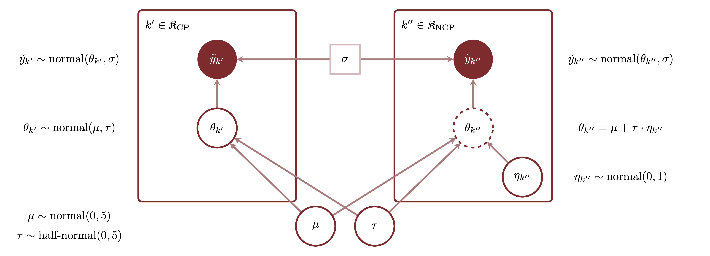
```
<br><br>
</center>

```{r}
writeLines(readLines("stan_programs/hierarchical_mix.stan"))
```

```{r, cache=TRUE, warning=FALSE, message=FALSE}
mix_fit <- stan(file='stan_programs/hierarchical_mix.stan',
                data=data, seed=4938483,
                iter=11000, warmup=1000, refresh=11000)
```

The diagnostic warnings have vanished.

```{r}
util$check_all_diagnostics(mix_fit)
```

Moreover the scatter plots reveal only mild funnel degeneracies in the
posterior density function.

```{r}
partition <- util$partition_div(mix_fit)
div_samples <- partition[[1]]
nondiv_samples <- partition[[2]]

par(mfrow=c(3, 3))

for (k in 1:data$K_cp) {
        name <- paste("theta_cp[", k, "]", sep="")
        plot(nondiv_samples[name][[1]], log(nondiv_samples$tau),
             col=c_dark_trans, pch=16, cex=0.8,
             xlab=name, xlim=c(-5, 5), ylab="log(tau)", ylim=c(-2, 3))
        points(div_samples[name][[1]], log(div_samples$tau),
               col=c_green_trans, pch=16, cex=0.8)
}

for (k in 1:data$K_ncp) {
  name <- paste("theta_ncp[", k, "]", sep="")
  plot(nondiv_samples[name][[1]], log(nondiv_samples$tau),
       col=c_dark_trans, pch=16, cex=0.8,
       xlab=name, xlim=c(-5, 5), ylab="log(tau)", ylim=c(-2, 3))
  points(div_samples[name][[1]], log(div_samples$tau),
         col=c_green_trans, pch=16, cex=0.8)
}
```

To see the importance of a well-chosen parameterization let's look at the three
fits in a little bit more detail.  In particular the incomplete exploration of
the monolithically centered parameterization is evident in the scatter plot of
the population parameters.

```{r}
par(mfrow=c(1, 3))

partition <- util$partition_div(cp_fit)
div_samples <- partition[[1]]
nondiv_samples <- partition[[2]]

name <- "mu"
plot(nondiv_samples[name][[1]], log(nondiv_samples$tau),
     col=c_dark_trans, pch=16, cex=0.8, main="Monolithically Centered",
     xlab=name,  xlim=c(-5, 15), ylab="log(tau)", ylim=c(-1, 3))
points(div_samples[name][[1]], log(div_samples$tau),
       col=c_green_trans, pch=16, cex=0.8)

partition <- util$partition_div(ncp_fit)
div_samples <- partition[[1]]
nondiv_samples <- partition[[2]]

name <- "mu"
plot(nondiv_samples[name][[1]], log(nondiv_samples$tau),
     col=c_dark_trans, pch=16, cex=0.8, main="Monolithically Non-Centered",
     xlab=name,  xlim=c(-5, 15), ylab="log(tau)", ylim=c(-1, 3))
points(div_samples[name][[1]], log(div_samples$tau),
       col=c_green_trans, pch=16, cex=0.8)

partition <- util$partition_div(mix_fit)
div_samples <- partition[[1]]
nondiv_samples <- partition[[2]]

name <- "mu"
plot(nondiv_samples[name][[1]], log(nondiv_samples$tau),
     col=c_dark_trans, pch=16, cex=0.8, main="Mixed",
     xlab=name,  xlim=c(-5, 15), ylab="log(tau)", ylim=c(-1, 3))
points(div_samples[name][[1]], log(div_samples$tau),
       col=c_green_trans, pch=16, cex=0.8)
```

The monolithically non-centered parameterization exhibits less problems,
although the Hamiltonian Monte Carlo sampler has to work hard to achieve that
exploration.

```{r}
cp_stepsizes <- sapply(1:4, function(c) get_sampler_params(cp_fit, inc_warmup=FALSE)[[c]][,'stepsize__'][1])
ncp_stepsizes <- sapply(1:4, function(c) get_sampler_params(ncp_fit, inc_warmup=FALSE)[[c]][,'stepsize__'][1])
mix_stepsizes <- sapply(1:4, function(c) get_sampler_params(mix_fit, inc_warmup=FALSE)[[c]][,'stepsize__'][1])

rbind(cp_stepsizes, ncp_stepsizes, mix_stepsizes)
```

In other words Stan's Hamiltonian Monte Carlo adaptation is robust enough to
compensate for much of the inverted funnel degeneracy that manifests when we
incorrectly apply a non-centered parameterization.  That compensation, however,
is expensive.

```{r}
cp_steps <- do.call(rbind, get_sampler_params(cp_fit, inc_warmup=FALSE))[,'n_leapfrog__']
cp_counts <- as.data.frame(table(cp_steps))
colnames(cp_counts) <- c("Leapfrog Steps", "CP Counts")

ncp_steps <- do.call(rbind, get_sampler_params(ncp_fit, inc_warmup=FALSE))[,'n_leapfrog__']
ncp_counts <- as.data.frame(table(ncp_steps))
colnames(ncp_counts) <- c("Leapfrog Steps", "NCP Counts")

mix_steps <- do.call(rbind, get_sampler_params(mix_fit, inc_warmup=FALSE))[,'n_leapfrog__']
mix_counts <- as.data.frame(table(mix_steps))
colnames(mix_counts) <- c("Leapfrog Steps", "Mix Counts")

comp <- merge(cp_counts, ncp_counts, by="Leapfrog Steps", all=TRUE, sort=TRUE)
comp <- merge(comp, mix_counts, by="Leapfrog Steps", all=TRUE)
comp[is.na(comp)] <- 0
print(comp, row.names=FALSE)
```

When we're using infinity-suppressing prior models for the population scale a
monolithic non-centered parameterization is more robust than a monolithic
centered parameterization, but both pale in comparison to a proper mixed
parameterization.

### Small Ensembles

Finally let's consider what happens when we have only a few contexts and hence
limited inferences for the population parameters no matter how much data we
collect within the individual contexts.

In particular let's reduce the number of contexts from 9 to 2 and assume that
the individual likelihood functions are narrow and strongly informative.

```{r, warning=FALSE}
N <- 2
K <- 2
indiv_idx <- 1:2
sigma <- 0.1

fit <- stan(file='stan_programs/generate_data.stan',
            data=c("N", "K", "indiv_idx", "sigma"),
            iter=1, chains=1, seed=194838,
            algorithm="Fixed_param")

y <- extract(fit)$y[1,]

data <- list("N" = N, "y" = y, "K" = K, "indiv_idx" = indiv_idx, "sigma" = sigma)
```

We start with a monolithically entered parameterization which should be optimal.

```{r, cache=TRUE, warning=FALSE, message=FALSE}
cp_fit <- stan(file='stan_programs/hierarchical_cp.stan',
               data=data, seed=4938483,
               iter=11000, warmup=1000, refresh=11000)
```

Unfortunately the diagnostics indicate that something is obstructing the
exploration of the posterior distribution.

```{r}
util$check_all_diagnostics(cp_fit)
```

The problem is that with only two individual contexts we cannot learn much about
the population scale beyond our prior model.

```{r}
cp_samples <- extract(cp_fit)

par(mfrow=c(1, 1))

hist(abs(rnorm(40000, 0, 5)), breaks=seq(0, 25, 0.25),
     col=c_light, border=c_light_highlight, main="",
     xlim=c(0, 20), xlab="tau", yaxt='n', ylim=c(0, 2500), ylab="")
hist(cp_samples$tau, breaks=seq(0, 25, 0.25),
     col=c_dark, border=c_dark_highlight, add=T)
```

What we do learn manifests in a funnel degeneracy between the population
location, $\mu$, and scale, $\sigma$.

```{r}
partition <- util$partition_div(cp_fit)
div_samples <- partition[[1]]
nondiv_samples <- partition[[2]]

plot(nondiv_samples$mu, log(nondiv_samples$tau),
     col=c_dark_trans, pch=16, cex=0.8,
     xlab="mu", ylab="log(tau)")
points(div_samples$mu, log(div_samples$tau),
       col=c_green_trans, pch=16, cex=0.8)
```

A monolithically non-centered parameterization shouldn't fare much better but
let's try anyways.

```{r, cache=TRUE, warning=FALSE, message=FALSE}
ncp_fit <- stan(file='stan_programs/hierarchical_ncp.stan',
                data=data, seed=4938483,
                iter=11000, warmup=1000, refresh=11000)
```

The diagnostics indicate that the pathology has indeed worsened.

```{r}
util$check_all_diagnostics(ncp_fit)
```

Now we have multiple funnel degeneracies!  The $\theta$-$\tau$ inverted funnel
results in divergent transitions for large values of $\tau$ while the
$\mu$-$\tau$ funnel results in divergent transitions for small values of $\tau$.

```{r}
partition <- util$partition_div(ncp_fit)
div_samples <- partition[[1]]
nondiv_samples <- partition[[2]]

par(mfrow=c(1, 3))

plot(nondiv_samples$"theta[1]", log(nondiv_samples$tau),
     col=c_dark_trans, pch=16, cex=0.8,
     xlab="theta[1]", ylab="log(tau)")
points(div_samples$"theta[1]", log(div_samples$tau),
       col=c_green_trans, pch=16, cex=0.8)

plot(nondiv_samples$"eta[1]", log(nondiv_samples$tau),
     col=c_dark_trans, pch=16, cex=0.8,
     xlab="eta[1]", ylab="log(tau)")
points(div_samples$"eta[1]", log(div_samples$tau),
       col=c_green_trans, pch=16, cex=0.8)

plot(nondiv_samples$mu, log(nondiv_samples$tau),
     col=c_dark_trans, pch=16, cex=0.8,
     xlab="mu", ylab="log(tau)")
points(div_samples$mu, log(div_samples$tau),
       col=c_green_trans, pch=16, cex=0.8)
```

It's pathology on pathology and divergences everywhere!  Fortunately with our
deep understanding of these pathologies we can isolate the source of each and
identify principled management strategies without getting _too_ overwhelmed.

Critically we can't parameterize ourselves out of the $\mu$-$\tau$ funnel.  The
only way that we can moderate the geometry is to add more information, either
by incorporating measurements in more contexts or by employing a more
informative prior model on the population location and scale parameters.

## Now I Know my ADCs

With a strong foundation on the computational aspects of hierarchical models in
place let's now consider an example that demonstrates the ways in which we can
integrate hierarchical models into principled model building.

Consider a device that converts some continuous, or _analog_, input into a
discrete, or _digital_, output.  For example the input might be an electric
current or concentration of a chemical, and the output a digital signal amenable
for computer readouts. In order to use these _analog-to-digital converters_, or
_ADCs_, in practice we need to know how the strength of the analog input
translates to the strength of the digital output.

The analog-to-digital process is often well modeled by a Poisson process where
the rate of output events is determined by the input integrated over some time.
Statistically this suggests modeling the output counts $y$ with a Poisson
density function whose intensity parameter is moderated by the input $I$,
$$
\begin{align*}
y &\sim \text{Poisson}(\lambda)
\\
\lambda &\propto I.
\end{align*}
$$

In practice the input is often measured relative to some reference input,
$I_{0}$.  In that case we can model
$$
\begin{align*}
\lambda &= \psi \cdot \frac{I}{I_{0}}
\\
\lambda &\equiv \psi \cdot \rho_{I},
\end{align*}
$$
where $\rho_{I}$ is a unitless, proportional signal.  The statistical challenge
is then to infer the _calibration coefficient_ $\psi$.

To that end let's say that a series of experiments measuring the behavior of the
device is conducted.  In each experiment the device is repeatedly exposed to a
an input source that has been calibrated to a precise value before a measurement
is taken of the resulting digital output.  The outcome of these experiments is
then collected into the following file.

```{r}
data <- read_rdump("data/exp.data.R")

names(data)
```

With the data in hand and a conceptual understanding of the measurements
carefully considered we can role up our sleeves and start modeling.

### Attempt One

Initially let's assume that the calibration coefficient is constant across all
of the experiments.  At the same time we'll presume domain expertise that places
this universal coefficient between $0.1$ and $10$, which we can model with a log
normal prior density function,
$$
\pi( \log \psi ) = \text{normal}(0, \log 10).
$$
Finally we'll denote the number of observations in the $k$th experiment by
$N_{k}$ and the proportional input in the $k$th experiment by $\rho_{I, k}$.

<center>
<br>
```{r, out.width = "75%", echo=FALSE}
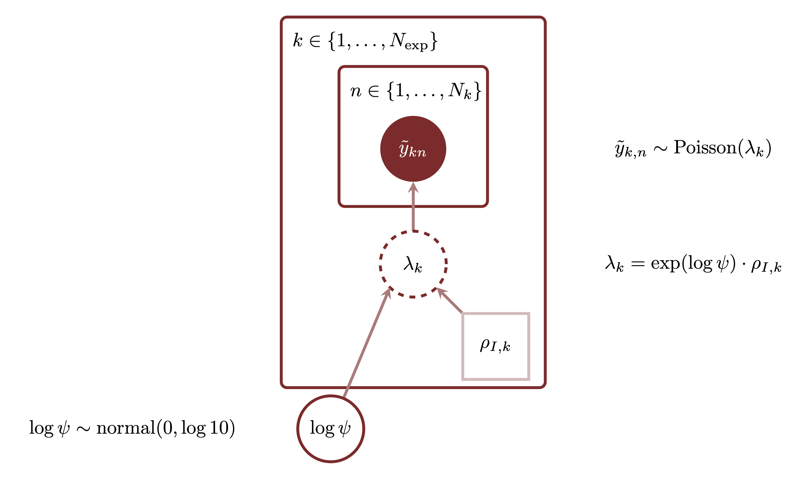
```
<br><br>
</center>

Before implementing and then fitting this model in Stan we need to also consider
our suspicions.  The data were collected across $N_{\text{exp}} = 21$ different
experiments, each of which could have been subject to any number of varying
conditions such as who collected the data and how the source was prepared.  To
investigate any significant heterogeneity across the experiments let's design
some summary statistics that are sensitive to any variation in the
analog-to-digital conversion process.

Assuming that our initial homogenous model is true the average measurement in
each experiment would be
$$
\begin{align*}
\left< y \right>_{k}
&= \lambda_{k}
\\
&= \psi \cdot \rho_{I, k}.
\end{align*}
$$
In particular the normalized average would be constant,
$$
\frac{ \left< y \right>_{k} }{ \rho_{I, k} } = \psi,
$$
and the normalized empirical average,
$$
\frac{1}{ \rho_{I, k} } \frac{1}{N_{k}} \sum_{n = 1}^{N_{k}} \tilde{y}_{n, k},
$$
approximately so.  Consequently any variation in these normalized empirical
means would suggest limitations of the homogeneity assumption.

To that end let's consider the normalized empirical averages of the data within
each experiment as well as the analysis of variance ratio of these averages as
summary statistics.  Before fitting our model we need to evaluate these summary
statistics on the observed data.

```{r}
writeLines(readLines("stan_programs/obs_F.stan"))
```

```{r, cache=TRUE, warning=FALSE, message=FALSE}
fit <- stan(file='stan_programs/obs_F.stan', data=data,
            iter=1, chains=1, seed=194838, algorithm="Fixed_param")
obs_F <- extract(fit)$F_exp
obs_norm_ave <- extract(fit)$norm_ave[1,]
```

Now we can implement our model, including the summary statistics, in Stan.

```{r}
writeLines(readLines("stan_programs/fit_adc1.stan"))
```

Stan program in hand we can let loose the algorithms of war.

```{r, cache=TRUE, warning=FALSE, message=FALSE}
fit <- stan(file='stan_programs/fit_adc1.stan', data=data, seed=4938483, refresh=1000)
```

Welcomingly there are no indications of computational problems.

```{r}
util$check_all_diagnostics(fit)
```

Confident in our fit we can move on to investigating its compatibility with the
observed data.  Let's start with a marginal posterior retrodictive check that
uses a histogram of the recorded counts.

```{r}
par(mfrow=c(1, 1))

samples <- extract(fit)

B <- 125

idx <- rep(0:B, each=2)
x <- sapply(1:length(idx), function(b) if(b %% 2 == 0) idx[b] + 0.5 else idx[b] - 0.5)

obs_counts <- hist(data$y, breaks=(0:(B + 1))-0.5, plot=FALSE)$counts
pad_obs <- do.call(cbind, lapply(idx, function(n) obs_counts[n + 1]))

counts <- sapply(1:4000, function(n) hist(samples$y_post_pred[n,], breaks=(0:(B + 1))-0.5, plot=FALSE)$counts)
probs = c(0.1, 0.2, 0.3, 0.4, 0.5, 0.6, 0.7, 0.8, 0.9)
cred <- sapply(1:(B + 1), function(b) quantile(counts[b,], probs=probs))
pad_cred <- do.call(cbind, lapply(idx, function(n) cred[1:9,n + 1]))

plot(1, type="n", main="Marginal Posterior Retrodictive Check",
     xlim=c(-0.5, B + 0.5), xlab="y",
     ylim=c(0, max(c(obs_counts, cred[9,]))), ylab="")

polygon(c(x, rev(x)), c(pad_cred[1,], rev(pad_cred[9,])),
        col = c_light, border = NA)
polygon(c(x, rev(x)), c(pad_cred[2,], rev(pad_cred[8,])),
        col = c_light_highlight, border = NA)
polygon(c(x, rev(x)), c(pad_cred[3,], rev(pad_cred[7,])),
        col = c_mid, border = NA)
polygon(c(x, rev(x)), c(pad_cred[4,], rev(pad_cred[6,])),
        col = c_mid_highlight, border = NA)
lines(x, pad_cred[5,], col=c_dark, lwd=2)

lines(x, pad_obs, col="white", lty=1, lw=2.5)
lines(x, pad_obs, col="black", lty=1, lw=2)
```

Unfortunately the observed data clearly exhibits behaviors that the model
doesn't seem capable of reproducing.  This is even more clear if we subtract
the posterior predictive median to isolate the residuals.

```{r}
plot(1, type="n", main="Marginal Posterior Retrodictive Residuals",
     xlim=c(-0.5, B + 0.5), xlab="y",
     ylim=c(-20, 20), ylab="")

polygon(c(x, rev(x)), c(pad_cred[1,] - pad_cred[5,], rev(pad_cred[9,] - pad_cred[5,])),
        col = c_light, border = NA)
polygon(c(x, rev(x)), c(pad_cred[2,] - pad_cred[5,], rev(pad_cred[8,] - pad_cred[5,])),
        col = c_light_highlight, border = NA)
polygon(c(x, rev(x)), c(pad_cred[3,] - pad_cred[5,], rev(pad_cred[7,] - pad_cred[5,])),
        col = c_mid, border = NA)
polygon(c(x, rev(x)), c(pad_cred[4,] - pad_cred[5,], rev(pad_cred[6,] - pad_cred[5,])),
        col = c_mid_highlight, border = NA)
lines(x, pad_cred[5,] - pad_cred[5,], col=c_dark, lwd=2)

lines(x, pad_obs - pad_cred[5,], col="white", lty=1, lw=2.5)
lines(x, pad_obs - pad_cred[5,], col="black", lty=1, lw=2)
```

What about the summary statistics that we crafted to isolate any potential
heterogeneity?  It looks like the observed normalized averages vary much more
strongly across experiments than the posterior retrodictive values.

```{r}
par(mar=c(4, 1, 1, 1))

par(mfrow=c(7, 3))
for (n in 1:21) {
  hist(samples$norm_ave[,n], breaks=seq(0, 10, 0.25),
       col=c_dark, border=c_dark_highlight, main="",
       xlab="Normalized Average", xlim=c(0, 10), yaxt='n', ylab="")
  abline(v=obs_norm_ave[n], col="black", lty=1, lw=2)
}

par(mar=c(5, 5, 3, 5))
```

This is further supported by the analysis of variance ratio that is far higher
for the observed data than the posterior retrodictive distribution, indicating
that the observed data is exhibiting substantial heterogeneity that our simple
model cannot accommodate.

```{r}
par(mfrow=c(1, 1))
hist(samples$F_exp, breaks=100, col=c_dark, border=c_dark_highlight, main="",
     xlab="F statistic", xlim=c(0, 12000), yaxt='n', ylab="")
abline(v=obs_F, col="black", lty=1, lw=2)
```

### Attempt Two

Seeing clear signs of heterogeneity in the observed data, at least relative to
our initial homogenous model, we are lead to consider explicitly modeling
heterogeneity between the experiments.  Without any additional information about
the conditions of each experiment we don't have many options beyond assuming
exchangeable heterogeneity and hence a hierarchical model for the varying
calibration coefficients.

Note that because the calibration coefficient is positive we apply a normal
hierarchical model not to the coefficients themselves but rather the logarithm
of the coefficients.

<center>
<br>
```{r, out.width = "85%", echo=FALSE}
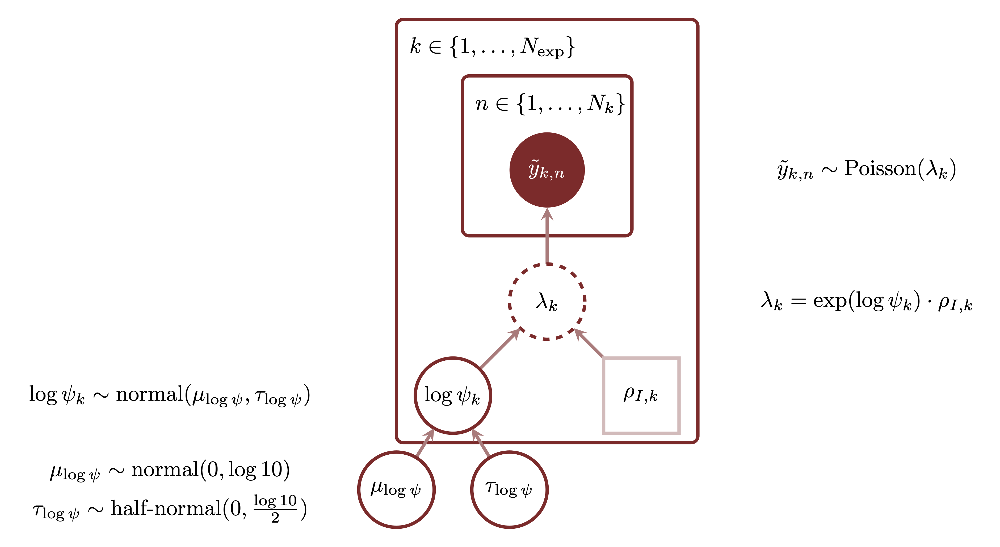
```
<br><br>
</center>

This model specification assumes, however, a monolithic centered
parameterization which we know can be inappropriate if each experiment doesn't
have enough measurements.  Although we could start with a fully centered or
non-centered parameterization and then use diagnostics and scatter plots to
trace down the funnels that indicate which parameterizations we should change,
we could also take a look at the counts in each experiment and start with a
more informed guess.

Histogramming the number of measurements in each experiment we see a clear
demarcation between the data multiplicities.


```{r}
par(mfrow=c(1, 1))
hist(table(data$exp_idx), breaks=3*(0:40) - 0.5,
     col=c_dark, border=c_dark_highlight, main="",
     xlab="Measuremnts Per Experiment", xlim=c(0, 110), yaxt='n', ylab="")
```

While this gap in the data multiplicities might have nothing to do with how
much data is needed for the centered parameterization to be optimal, it does
provide a reasonable starting point.  The experiments in the higher cluster are
more likely to be amenable to a centered parameterization while the experiments
in the lower cluster are more likely to be amenable to a non-centered
parameterization.  If this guess is wrong then we'll see the consequences in the
Hamiltonian Monte Carlo diagnostics.

```{r}
thresh <- 40

ncp_idx <- which(table(data$exp_idx) <= thresh)
cp_idx <- which(table(data$exp_idx) > thresh)

data$K_ncp <- length(ncp_idx)
data$ncp_idx <- array(ncp_idx)

data$K_cp <- length(cp_idx)
data$cp_idx <- array(cp_idx)
```

The mixed parameterization is straightforward to implement in Stan using our
indexing gymnastics.

```{r}
writeLines(readLines("stan_programs/fit_adc2.stan"))
```

At which point we leap into the fray.

```{r, cache=TRUE, warning=FALSE, message=FALSE}
fit <- stan(file='stan_programs/fit_adc2.stan', data=data, seed=4938483, refresh=1000)
```

Delightfully our initial parameterization seems to have been reasonable because
there are no indications of fitting problems.

```{r}
util$check_all_diagnostics(fit)
```

Confident in the accuracy of our fit we can now consider whether or not the
heterogeneity resolved the tension in our posterior retrodictive checks.

The histogram summary statistic no longer exhibits any significant tension.

```{r}
samples <- extract(fit)

par(mfrow=c(1, 1))
B <- 150

idx <- rep(0:B, each=2)
x <- sapply(1:length(idx), function(b) if(b %% 2 == 0) idx[b] + 0.5 else idx[b] - 0.5)

obs_counts <- hist(data$y, breaks=(0:(B + 1))-0.5, plot=FALSE)$counts
pad_obs <- do.call(cbind, lapply(idx, function(n) obs_counts[n + 1]))

counts <- sapply(1:4000, function(n) hist(samples$y_post_pred[n,], breaks=(0:(B + 1))-0.5, plot=FALSE)$counts)
probs = c(0.1, 0.2, 0.3, 0.4, 0.5, 0.6, 0.7, 0.8, 0.9)
cred <- sapply(1:(B + 1), function(b) quantile(counts[b,], probs=probs))
pad_cred <- do.call(cbind, lapply(idx, function(n) cred[1:9,n + 1]))

plot(1, type="n", main="Marginal Posterior Retrodictive Check",
     xlim=c(-0.5, B + 0.5), xlab="y",
     ylim=c(0, max(c(obs_counts, cred[9,]))), ylab="")

polygon(c(x, rev(x)), c(pad_cred[1,], rev(pad_cred[9,])),
        col = c_light, border = NA)
polygon(c(x, rev(x)), c(pad_cred[2,], rev(pad_cred[8,])),
        col = c_light_highlight, border = NA)
polygon(c(x, rev(x)), c(pad_cred[3,], rev(pad_cred[7,])),
        col = c_mid, border = NA)
polygon(c(x, rev(x)), c(pad_cred[4,], rev(pad_cred[6,])),
        col = c_mid_highlight, border = NA)
lines(x, pad_cred[5,], col=c_dark, lwd=2)

lines(x, pad_obs, col="white", lty=1, lw=2.5)
lines(x, pad_obs, col="black", lty=1, lw=2)
```

```{r}
par(mfrow=c(1, 1))
plot(1, type="n", main="Marginal Posterior Retrodictive Residuals",
     xlim=c(-0.5, B + 0.5), xlab="y",
     ylim=c(-15, 15), ylab="")

polygon(c(x, rev(x)), c(pad_cred[1,] - pad_cred[5,], rev(pad_cred[9,] - pad_cred[5,])),
        col = c_light, border = NA)
polygon(c(x, rev(x)), c(pad_cred[2,] - pad_cred[5,], rev(pad_cred[8,] - pad_cred[5,])),
        col = c_light_highlight, border = NA)
polygon(c(x, rev(x)), c(pad_cred[3,] - pad_cred[5,], rev(pad_cred[7,] - pad_cred[5,])),
        col = c_mid, border = NA)
polygon(c(x, rev(x)), c(pad_cred[4,] - pad_cred[5,], rev(pad_cred[6,] - pad_cred[5,])),
        col = c_mid_highlight, border = NA)
lines(x, pad_cred[5,] - pad_cred[5,], col=c_dark, lwd=2)

lines(x, pad_obs - pad_cred[5,], col="white", lty=1, lw=2.5)
lines(x, pad_obs - pad_cred[5,], col="black", lty=1, lw=2)
```

Similarly the model is now able to capture the empirical normalized averages
observed in each experiment.

```{r}
par(mar=c(4, 1, 1, 1))

par(mfrow=c(7, 3))
for (n in 1:21) {
  hist(samples$norm_ave[,n], breaks=seq(0, 25, 0.25),
       col=c_dark, border=c_dark_highlight, main="",
       xlab="Normalized Average", xlim=c(0, 20), yaxt='n', ylab="")
  abline(v=obs_norm_ave[n], col="black", lty=1, lw=2)
}

par(mar=c(5, 5, 3, 5))
```

We can even capture the behavior of the very large analysis of variance
statistic seen in the observed data.

```{r}
par(mfrow=c(1, 1))
hist(samples$F_exp, breaks=50, col=c_dark, border=c_dark_highlight, main="",
     xlab="F statistic", xlim=c(5000, 15000), yaxt='n', ylab="")
abline(v=obs_F, col="black", lty=1, lw=2)
```

With the suspected misfit resolved we can consider our model inferences.  The
observed data are consistent with a reasonable amount of heterogeneity in the
calibration coefficient across experiments.  We see this in both the model for
the latent population of calibration coefficients

```{r}
par(mfrow=c(1, 1))
plot(samples$mu_log_psi, samples$tau_log_psi,
     col=c_dark_trans, pch=16,
     xlab="mu_log_psi", xlim=c(-2, 2),
     ylab="tau_log_psi", ylim=c(0, 3))
```

and the individual calibration coefficients for the observed experiments.

```{r}
par(mfrow=c(1, 1))

M <- data$N_exp
idx <- rep(1:M, each=2)
x <- sapply(1:length(idx), function(m) if(m %% 2 == 0) idx[m] + 0.5 else idx[m] - 0.5)

probs <- c(0.1, 0.2, 0.3, 0.4, 0.5, 0.6, 0.7, 0.8, 0.9)
cred <- sapply(1:data$N_exp, function(n) quantile(samples$log_psi[,n], probs=probs))
pad_cred <- do.call(cbind, lapply(idx, function(m) cred[1:9,m]))

plot(1, type="n", main="",
     xlim=c(0.5, M + 0.5), xlab="", xaxt="n",
     ylim=c(min(pad_cred[1,]), max(pad_cred[9,])),
     ylab="Marginal log psi0 Posteriors")

polygon(c(x, rev(x)), c(pad_cred[1,], rev(pad_cred[9,])),
        col = c_light, border = NA)
polygon(c(x, rev(x)), c(pad_cred[2,], rev(pad_cred[8,])),
        col = c_light_highlight, border = NA)
polygon(c(x, rev(x)), c(pad_cred[3,], rev(pad_cred[7,])),
        col = c_mid, border = NA)
polygon(c(x, rev(x)), c(pad_cred[4,], rev(pad_cred[6,])),
        col = c_mid_highlight, border = NA)
lines(x, pad_cred[5,], col=c_dark, lwd=2)

axis(1, at=1:M, labels=1:M)
```

We can also take the opportunity to look for any signs that the individual
parameters are poorly modeled by a latent normal population model.  Fortunately
there are no strong outliers or clusters that would suggest a serious problem.

At this point there's not much we can do to further probe the heterogeneity
across experiments without additional information about the conditions of each
experiment that might support a more sophisticated, non-exchangeable model.
Conveniently as we're sharing the results of our initial analysis a lab
technician notes that the internal mechanism of our analog-to-digital device is
known to depend strongly on temperature.  They also inform us that the
temperature of the labs in which the experiments were collected are continuously
measured and recorded!

The temperatures are recorded relative to a reference temperature and are easy
enough to acquire.

```{r}
temp_data <- read_rdump("data/temp.data.R")
names(temp_data)
```

To see how much of our heterogeneity might be explained by a temperature
dependence let's reorder the experiments by the recorded temperature.

```{r}
temp_idx <- order(temp_data$log_rho_T)
```

```{r}
reordered_cred <- cred[,temp_idx]
pad_cred <- do.call(cbind, lapply(idx, function(m) reordered_cred[1:9,m]))

plot(1, type="n", main="",
     xlim=c(0.5, M + 0.5), xlab="", xaxt="n",
     ylim=c(min(pad_cred[1,]), max(pad_cred[9,])),
     ylab="Marginal log psi 0 Posteriors")

polygon(c(x, rev(x)), c(pad_cred[1,], rev(pad_cred[9,])),
        col = c_light, border = NA)
polygon(c(x, rev(x)), c(pad_cred[2,], rev(pad_cred[8,])),
        col = c_light_highlight, border = NA)
polygon(c(x, rev(x)), c(pad_cred[3,], rev(pad_cred[7,])),
        col = c_mid, border = NA)
polygon(c(x, rev(x)), c(pad_cred[4,], rev(pad_cred[6,])),
        col = c_mid_highlight, border = NA)
lines(x, pad_cred[5,], col=c_dark, lwd=2)

axis(1, at=1:M, labels=temp_idx)
```

The inferred calibration coefficients appear to be reasonably well correlated
with temperature, breaking the exchangeability inherent to our hierarchical
model.  With the temperature data at hand, however, we can do better.

### Attempt Three

Doing some research we learn that the process driving our analog-to-digital
converter is known to have a relatively precise exponential temperature
dependence which we can model by decomposing the calibration coefficients as
$$
\psi = \psi_{0} \cdot \left( \rho_{T} \right)^{\gamma}.
$$
Our hypothetical research also motivate an informative prior model for the
temperature exponent,
$$
\gamma \sim \text{normal}(1.25, 0.25).
$$

To account for any heterogeneity beyond that induced by this temperature
dependence let's model $\psi_{0}$ hierarchically, only with a narrower prior
model.  Note that we're only modeling heterogeneity in the constant and not
the temperature exponent.

<center>
<br>
```{r, out.width = "95%", echo=FALSE}
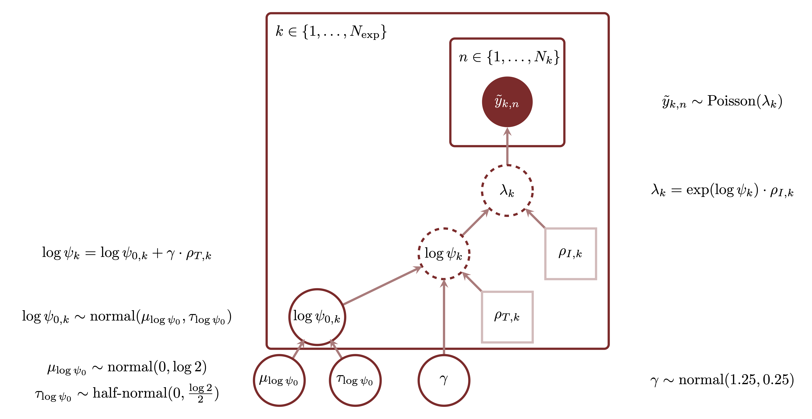
```
<br><br>
</center>

To ensure that the prior model for this expanded model is still compatible with
our domain expertise we can simulate from the induced prior distribution for the
entire calibration coefficient and perform a prior pushforward check.

```{r}
writeLines(readLines("stan_programs/adc_prior.stan"))
```

```{r, cache=TRUE, warning=FALSE, message=FALSE}
fit <- stan(file='stan_programs/adc_prior.stan', seed=194838, algorithm="Fixed_param",
            iter=4000, chains=1, refresh=4000)
```

```{r}
hist(extract(fit)$psi, breaks=seq(0, 25, 0.25),
     col=c_dark, border=c_dark_highlight, main="",
     xlim=c(0, 25), xlab="psi", yaxt='n', ylab="")
```

The prior pushforward distribution for $\psi$ is perhaps a bit too suppressed
above values of $5$ but overall it looks reasonable.

Confident that our prior model does not strongly conflict with our domain
expertise we can code up the full model in Stan.

```{r}
writeLines(readLines("stan_programs/fit_adc3.stan"))
```

Combining the original data and the newly acquired temperature data we're now
ready to fit.

```{r, cache=TRUE, warning=FALSE, message=FALSE}
data$log_rho_T = temp_data$log_rho_T

fit <- stan(file='stan_programs/fit_adc3.stan', data=data, seed=4938483, refresh=1000)
```

Once again no diagnostics indicate any problems with our computation.

```{r}
util$check_all_diagnostics(fit)
```

Reassuringly the temperature model doesn't compromise any of the posterior
retrodictive checks.

```{r}
samples <- extract(fit)

par(mfrow=c(1, 1))
B <- 150

idx <- rep(0:B, each=2)
x <- sapply(1:length(idx), function(b) if(b %% 2 == 0) idx[b] + 0.5 else idx[b] - 0.5)

obs_counts <- hist(data$y, breaks=(0:(B + 1))-0.5, plot=FALSE)$counts
pad_obs <- do.call(cbind, lapply(idx, function(n) obs_counts[n + 1]))

counts <- sapply(1:4000, function(n) hist(samples$y_post_pred[n,], breaks=(0:(B + 1))-0.5, plot=FALSE)$counts)
probs = c(0.1, 0.2, 0.3, 0.4, 0.5, 0.6, 0.7, 0.8, 0.9)
cred <- sapply(1:(B + 1), function(b) quantile(counts[b,], probs=probs))
pad_cred <- do.call(cbind, lapply(idx, function(n) cred[1:9,n + 1]))

plot(1, type="n", main="Marginal Posterior Retrodictive Check",
     xlim=c(-0.5, B + 0.5), xlab="y",
     ylim=c(0, max(c(obs_counts, cred[9,]))), ylab="")

polygon(c(x, rev(x)), c(pad_cred[1,], rev(pad_cred[9,])),
        col = c_light, border = NA)
polygon(c(x, rev(x)), c(pad_cred[2,], rev(pad_cred[8,])),
        col = c_light_highlight, border = NA)
polygon(c(x, rev(x)), c(pad_cred[3,], rev(pad_cred[7,])),
        col = c_mid, border = NA)
polygon(c(x, rev(x)), c(pad_cred[4,], rev(pad_cred[6,])),
        col = c_mid_highlight, border = NA)
lines(x, pad_cred[5,], col=c_dark, lwd=2)

lines(x, pad_obs, col="white", lty=1, lw=2.5)
lines(x, pad_obs, col="black", lty=1, lw=2)
```

```{r}
par(mfrow=c(1, 1))
plot(1, type="n", main="Marginal Posterior Retrodictive Residuals",
     xlim=c(-0.5, B + 0.5), xlab="y",
     ylim=c(-15, 15), ylab="")

polygon(c(x, rev(x)), c(pad_cred[1,] - pad_cred[5,], rev(pad_cred[9,] - pad_cred[5,])),
        col = c_light, border = NA)
polygon(c(x, rev(x)), c(pad_cred[2,] - pad_cred[5,], rev(pad_cred[8,] - pad_cred[5,])),
        col = c_light_highlight, border = NA)
polygon(c(x, rev(x)), c(pad_cred[3,] - pad_cred[5,], rev(pad_cred[7,] - pad_cred[5,])),
        col = c_mid, border = NA)
polygon(c(x, rev(x)), c(pad_cred[4,] - pad_cred[5,], rev(pad_cred[6,] - pad_cred[5,])),
        col = c_mid_highlight, border = NA)
lines(x, pad_cred[5,] - pad_cred[5,], col=c_dark, lwd=2)

lines(x, pad_obs - pad_cred[5,], col="white", lty=1, lw=2.5)
lines(x, pad_obs - pad_cred[5,], col="black", lty=1, lw=2)
```

```{r}
par(mar=c(4, 1, 1, 1))

par(mfrow=c(7, 3))
for (n in 1:21) {
  hist(samples$norm_ave[,n], breaks=seq(0, 25, 0.25),
       col=c_dark, border=c_dark_highlight, main="",
       xlab="Normalized Averge", xlim=c(0, 20), yaxt='n', ylab="")
  abline(v=obs_norm_ave[n], col="black", lty=1, lw=2)
}

par(mar=c(5, 5, 3, 5))
```

```{r}
par(mfrow=c(1, 1))
hist(samples$F_exp, breaks=50, col=c_dark, border=c_dark_highlight, main="",
     xlab="F statistic", xlim=c(5000, 15000), yaxt='n', ylab="")
abline(v=obs_F, col="black", lty=1, lw=2)
```

We can now take a look a closer look at our inferences.  We learn a bit more
about the temperature scaling than just what was provided by the informative
prior model.

```{r}
hist(abs(rnorm(4000, 1.25, 0.25)), breaks=seq(0, 5, 0.025),
     col=c_light, border=c_light_highlight, main="",
     xlim=c(0, 2), xlab="gamma", yaxt='n', ylim=c(0, 300), ylab="")
hist(samples$gamma, breaks=seq(0, 2, 0.025),
     col=c_dark, border=c_dark_highlight, add=T)
```

Interestingly the posterior for the latent population scale is pulled away from
zero indicating significant heterogeneity beyond that captured by the assumed
temperature dependence.

```{r}
plot(samples$mu_log_psi0, samples$tau_log_psi0,
     col=c_dark_trans, pch=16,
     xlab="mu_log_psi0", xlim=c(-1, 1),
     ylab="tau_log_psi0", ylim=c(0, 1.5))
```

```{r}
M <- data$N_exp
idx <- rep(1:M, each=2)
x <- sapply(1:length(idx), function(m) if(m %% 2 == 0) idx[m] + 0.5 else idx[m] - 0.5)

probs <- c(0.1, 0.2, 0.3, 0.4, 0.5, 0.6, 0.7, 0.8, 0.9)
cred <- sapply(1:data$N_exp, function(n) quantile(samples$log_psi0[,n], probs=probs))
pad_cred <- do.call(cbind, lapply(idx, function(m) cred[1:9,m]))

plot(1, type="n", main="",
     xlim=c(0.5, M + 0.5), xlab="", xaxt="n",
     ylim=c(min(pad_cred[1,]), max(pad_cred[9,])),
     ylab="Marginal log psi0 Posteriors")

polygon(c(x, rev(x)), c(pad_cred[1,], rev(pad_cred[9,])),
        col = c_light, border = NA)
polygon(c(x, rev(x)), c(pad_cred[2,], rev(pad_cred[8,])),
        col = c_light_highlight, border = NA)
polygon(c(x, rev(x)), c(pad_cred[3,], rev(pad_cred[7,])),
        col = c_mid, border = NA)
polygon(c(x, rev(x)), c(pad_cred[4,], rev(pad_cred[6,])),
        col = c_mid_highlight, border = NA)
lines(x, pad_cred[5,], col=c_dark, lwd=2)

axis(1, at=1:M, labels=1:M)
```

One possible source of this excess heterogeneity might be an insufficient
temperature model.  If the temperature dependence were more complicated,
however, then we would expect to see the heterogeneity continue to correlate
with the recorded temperatures.  To check we can reorder the experiments again.

```{r}
reordered_cred <- cred[,temp_idx]
pad_cred <- do.call(cbind, lapply(idx, function(m) reordered_cred[1:9,m]))

plot(1, type="n", main="",
     xlim=c(0.5, M + 0.5), xlab="", xaxt="n",
     ylim=c(min(pad_cred[1,]), max(pad_cred[9,])),
     ylab="Marginal log psi0 Posteriors")

polygon(c(x, rev(x)), c(pad_cred[1,], rev(pad_cred[9,])),
        col = c_light, border = NA)
polygon(c(x, rev(x)), c(pad_cred[2,], rev(pad_cred[8,])),
        col = c_light_highlight, border = NA)
polygon(c(x, rev(x)), c(pad_cred[3,], rev(pad_cred[7,])),
        col = c_mid, border = NA)
polygon(c(x, rev(x)), c(pad_cred[4,], rev(pad_cred[6,])),
        col = c_mid_highlight, border = NA)
lines(x, pad_cred[5,], col=c_dark, lwd=2)

axis(1, at=1:M, labels=temp_idx)
```

Reordering the experiments no longer reveals systematic structure, however,
suggesting that the heterogeneity is a consequence of some other process.

Confident in our modeling assumptions we can now plot the posteriors for the
more directly interpretable constrained calibration coefficient, $\psi_{0}$.

```{r}
M <- data$N_exp
idx <- rep(1:M, each=2)
x <- sapply(1:length(idx), function(m) if(m %% 2 == 0) idx[m] + 0.5 else idx[m] - 0.5)

probs <- c(0.1, 0.2, 0.3, 0.4, 0.5, 0.6, 0.7, 0.8, 0.9)
cred <- sapply(1:data$N_exp, function(n) quantile(exp(samples$log_psi0[,n]), probs=probs))
pad_cred <- do.call(cbind, lapply(idx, function(m) cred[1:9,m]))

plot(1, type="n", main="",
     xlim=c(0.5, M + 0.5), xlab="", xaxt="n",
     ylim=c(min(pad_cred[1,]), max(pad_cred[9,])),
     ylab="Marginal psi0 Posteriors")

polygon(c(x, rev(x)), c(pad_cred[1,], rev(pad_cred[9,])),
        col = c_light, border = NA)
polygon(c(x, rev(x)), c(pad_cred[2,], rev(pad_cred[8,])),
        col = c_light_highlight, border = NA)
polygon(c(x, rev(x)), c(pad_cred[3,], rev(pad_cred[7,])),
        col = c_mid, border = NA)
polygon(c(x, rev(x)), c(pad_cred[4,], rev(pad_cred[6,])),
        col = c_mid_highlight, border = NA)
lines(x, pad_cred[5,], col=c_dark, lwd=2)

axis(1, at=1:M, labels=1:M)
```

Finally we can consider how to communicate our inferences to anyone who might be
using a similar analog-to-digital converter.  If others will be using the _exact
same devices_ in the _exact same experimental_ conditions then it's natural to
report the individual calibration coefficients, $\log \psi_{0}$, directly.  On
the other hand if the experiments only sampled the devices and conditions then
the latent population parameters $\mu_{\log \psi_{0}}$ and
$\tau_{\log \psi_{0}}$ will better capture the range of behaviors that others
will encounter.

# Multivariate Normal Hierarchical Models {#sec:multi_hier}

To this point we've discussed _scalar_ normal hierarchical models that model
heterogeneity that manifests in a single, one-dimensional parameter.
Heterogeneity that manifests in multiple parameters can be modeled by many
independent scalar normal hierarchical models, but sometimes we also want to
capture correlated behavior amongst the parameters.

In general the behavior within each individual context might be modeled with
many parameters that we pack into a vector $\boldsymbol{\theta}_{k}$.  If the
heterogeneity in those behaviors is exchangeable then de Finetti's theorem leads
us to a multivariate hierarchical model of the form
$$
\pi(\boldsymbol{\theta}_{1}, \ldots, \boldsymbol{\theta}_{K}, \phi)
=
\left[ \prod_{k = 1}^{K} \pi( \boldsymbol{\theta}_{k} \mid \phi ) \right]
\cdot \pi(\phi).
$$

Mirroring the motivations for the scalar normal population model we might then
choose a multivariate normal population model
$$
\pi( \boldsymbol{\theta}_{k} \mid \phi )
=
\text{multi-normal}(\boldsymbol{\mu}, \boldsymbol{\Gamma}),
$$
where the location parameters $\boldsymbol{\mu}$ capture the centrality of the
population along each component and the covariance parameters
$\boldsymbol{\Gamma}$ capture the correlations and scales.

To facilitate population prior modeling we can decompose the covariance matrix
of parameters into a correlation matrix of parameters, $\boldsymbol{\Psi}$, and
component scales, $\boldsymbol{\tau}$,
$$
\boldsymbol{\Gamma}
= \text{diag}(\boldsymbol{\tau}) \cdot
\boldsymbol{\Psi} \cdot
\text{diag}(\boldsymbol{\tau}),
$$
where $\text{diag}$ maps a vector to a diagonal matrix.  This decomposition then
allows us to reason about the parameter scales independently of the correlations
between those parameters.

As with one-dimensional normal hierarchical model the scales quantify the
magnitude of heterogeneity in each component parameter; consequently we can
reason about them in the same way.  In particular half normal prior density
functions are a natural choice when expanding around an initial homogenous
model.

Prior modeling of the correlation matrix is more subtle.  A common choice is the
Lewandowski-Kurowicka-Joe, or LKJ, probability density function over the space
of correlation matrices inspired by [@LewandowskiEtAl:2009],
$$
\pi(\boldsymbol{\Psi}) = \text{LKJ}(\zeta) = \left| \boldsymbol{\Psi} \right|^{\eta}.
$$
The positive parameter $\zeta \in \mathbb{R}^{+}$ controls the concentration of
the probability density function -- if $\zeta > 1$ then the probability density
function concentrates around the identity matrix, if $\zeta = 1$ then the
probability density function is uniform over the space of correlation matrices,
and if $\zeta < 1$ then the probability density function concentrates on the
boundaries of the space.  Incidentally, because the LKJ density function depends
only on the absolute value of a matrix determinant it is invariant to
permutations of the rows and columns of $\boldsymbol{\Psi}$; consequently it
defines a finitely-exchangeable model!

Because an identity correlation matrix corresponds to vanishing correlations
between the parameters, $\zeta > 1$ is a natural choice when expanding around
a simpler, uncorrelated model.  Finding a specific $\zeta$ compatible with one's
domain expertise, however, is challenging.  In particular the strength of the
concentration around the identity matrix implied by any given $\zeta$ depends
on the dimensionality of $\boldsymbol{\Psi}$.

The implementation of a multivariate normal hierarchical model strongly
parallels that of the scalar normal hierarchical model with only a few
additional subtleties due to the correlations.

## Multivariate Centered and Non-Centered Parameterizations

Like scalar normal hierarchical models multivariate normal hierarchical models
admit both centered and non-centered parameterizations.

The centered parameterization directly models the individual parameters,
$$
\boldsymbol{\theta}_{k}
\sim
\text{multi-normal}(\boldsymbol{\mu}, \boldsymbol{\Gamma}),
$$
or equivalently
$$
\boldsymbol{\theta}_{k}
\sim
\text{multi-normal}(\boldsymbol{\mu},
\text{diag}(\boldsymbol{\tau}) \cdot
\boldsymbol{\Psi} \cdot
\text{diag}(\boldsymbol{\tau})).
$$
In practice it is typically easier to work not with the correlation matrix but
rather its Cholesky decomposition that satisfies
$$
\boldsymbol{\Psi} = \boldsymbol{L} \cdot \boldsymbol{L}^{T}.
$$
Conveniently the Stan Modeling Language provides implementations of both the
multivariate normal and LKJ probability density functions directly in terms of
the Cholesky factor.

The Cholesky factor of the correlation matrix also defines the multivariate
generalization of the non-centered parameterization.  In this case we model the
relative deviations from the multivariate population,
$$
\begin{align*}
\boldsymbol{\eta}_{k} &\sim \text{multi-normal}( \boldsymbol{0}, \boldsymbol{I} )
\\
\boldsymbol{\theta}_{k}
=
\boldsymbol{\mu}
+ \text{diag}(\boldsymbol{\tau}) \cdot \boldsymbol{L} \cdot \boldsymbol{\eta}_{k}
&\sim \text{multi-normal}(\boldsymbol{\mu}, \boldsymbol{\Gamma}).
\end{align*}
$$

Funnel degeneracies manifest similarly in the multivariate normal hierarchical
model as in the scalar normal hierarchical model.  In particular the
non-centered parameterization is appropriate for individuals only weakly
informed by observations while the centered parameterization is appropriate for
individuals that are strongly informed by observations.

## Multivariate for the Proletariate

To demonstrate how to implement multivariate normal hierarchical models in Stan
let's generalize some of the scalar normal hierarchical model exercises from
[Section 4.2](#sec:hierarchical_funnels).  Here we'll consider only the
uniformly weakly informed and uniformly strongly informed circumstances, and
hence only monolithic centered and non-centered parameterizations.  The
implementation of mixed parameterizations for the multivariate normal
hierarchical model is a relatively straightforward generalization.

### Uniformly Weakly Informative Likelihood Functions

Let's first consider the circumstance where each individual likelihood function
is diffuse so that the prior model dominates the behavior of the posterior
density function.

```{r}
writeLines(readLines("stan_programs/generate_multivariate_data.stan"))
```

```{r, warning=FALSE}
N <- 9
K <- 9
indiv_idx <- 1:9
I <- 3
sigma <- 10

fit <- stan(file='stan_programs/generate_multivariate_data.stan',
            data=c("N", "K", "indiv_idx", "I", "sigma"),
            iter=1, chains=1, seed=194838, algorithm="Fixed_param")

y <- extract(fit)$y[1,,]

data <- list("N" = N, "y" = y, "K" = K, "indiv_idx" = indiv_idx, "I" = I, "sigma" = sigma)
```

In this case the monolithically centered and non-centered parameterizations
should perform the worst and best, respectively.

#### Monolithically Centered Parameterization

We start with the monolithically centered parameterization which should be
problematic.

```{r}
writeLines(readLines("stan_programs/multivariate_hierarchical_cp.stan"))
```

```{r, cache=TRUE, warning=FALSE, message=FALSE}
cp_fit <- stan(file='stan_programs/multivariate_hierarchical_cp.stan',
               data=data, seed=4938483)
```

As expected the diagnostics are very unhappy with our choice of
parameterization.

```{r}
util$check_all_diagnostics(cp_fit)
```

That said we do need to keep in mind that the upper triangular elements of the
Cholesky factor of the correlation matrix are constants and consequently induce
false positive effective sample size and $\hat{R}$ warnings.  Instead we should
focus on the divergences and E-FMI warnings which are clear indicators of
funnel degeneracies.

Indeed if we look at the first component of the $\boldsymbol{\theta}_{k}$ in
each context we see the distinctive funnel geometry.

```{r}
partition <- util$partition_div(cp_fit)
div_samples <- partition[[1]]
nondiv_samples <- partition[[2]]

par(mfrow=c(3, 3))

for (k in 1:data$K) {
  name <- paste("theta[", k, ",1]", sep="")
  plot(nondiv_samples[name][[1]], log(nondiv_samples$"tau[1]"),
       col=c_dark_trans, pch=16, cex=0.8,
       xlab=name, xlim=c(-30, 30), ylab="log(tau)", ylim=c(-2, 3))
  points(div_samples[name][[1]], log(div_samples$"tau[1]"),
         col=c_green_trans, pch=16, cex=0.8)
}
```

In fact the funnel degeneracy manifests in _all_ of the components.

```{r}
par(mfrow=c(3, 3))

for (k in 1:data$K) {
  name <- paste("theta[", k, ",2]", sep="")
  plot(nondiv_samples[name][[1]], log(nondiv_samples$"tau[2]"),
       col=c_dark_trans, pch=16, cex=0.8,
       xlab=name, xlim=c(-30, 30), ylab="log(tau)", ylim=c(-2, 3))
  points(div_samples[name][[1]], log(div_samples$"tau[2]"),
         col=c_green_trans, pch=16, cex=0.8)
}
```

```{r}
par(mfrow=c(3, 3))

for (k in 1:data$K) {
  name <- paste("theta[", k, ",3]", sep="")
  plot(nondiv_samples[name][[1]], log(nondiv_samples$"tau[3]"),
       col=c_dark_trans, pch=16, cex=0.8,
       xlab=name, xlim=c(-30, 30), ylab="log(tau)", ylim=c(-2, 3))
  points(div_samples[name][[1]], log(div_samples$"tau[3]"),
         col=c_green_trans, pch=16, cex=0.8)
}
```

#### Monolithically Non-Centered Parameterization

On the other hand the monolithically non-centered parameterization should
perform much better.

```{r}
writeLines(readLines("stan_programs/multivariate_hierarchical_ncp.stan"))
```

```{r, cache=TRUE, warning=FALSE, message=FALSE}
ncp_fit <- stan(file='stan_programs/multivariate_hierarchical_ncp.stan',
                data=data, seed=4938483)
```

Now there are no diagnostics beyond the expected false positives.

```{r}
util$check_all_diagnostics(ncp_fit)
```

Confident in the faithfulness of our fit we can examine the posterior
inferences.  For example we can look at the marginal posteriors for each
component parameter across the individual contexts.  Without much information
in any of the individual likelihood functions we don't learn much.

```{r}
ncp_samples <- extract(ncp_fit)

par(mfrow=c(1, 1))

M <- data$K + 1
idx <- rep(1:M, each=2)
x <- sapply(1:length(idx), function(m) if(m %% 2 == 0) idx[m] + 0.5 else idx[m] - 0.5)

probs <- c(0.1, 0.2, 0.3, 0.4, 0.5, 0.6, 0.7, 0.8, 0.9)
cred <- sapply(1:data$K, function(k) quantile(ncp_samples$theta[,k,1], probs=probs))
cred <- cbind(cred, quantile(ncp_samples$mu[,1], probs=probs))
pad_cred <- do.call(cbind, lapply(idx, function(m) cred[1:9,m]))

plot(1, type="n", main="",
     xlim=c(0.5, M + 0.5), xlab="", xaxt="n",
     ylim=c(min(pad_cred[1,]), max(pad_cred[9,])),
     ylab="Marginal Posteriors for First Component")
abline(v=M-0.5, col="gray80", lwd=2, lty=3)

polygon(c(x, rev(x)), c(pad_cred[1,], rev(pad_cred[9,])),
        col = c_light, border = NA)
polygon(c(x, rev(x)), c(pad_cred[2,], rev(pad_cred[8,])),
        col = c_light_highlight, border = NA)
polygon(c(x, rev(x)), c(pad_cred[3,], rev(pad_cred[7,])),
        col = c_mid, border = NA)
polygon(c(x, rev(x)), c(pad_cred[4,], rev(pad_cred[6,])),
        col = c_mid_highlight, border = NA)
lines(x, pad_cred[5,], col=c_dark, lwd=2)

axis(1, at=1:M, labels=c("th1", "th2", "th3", "th4", "th5",
                         "th6", "th7", "th8", "th9", "mu"))
```

In particular diffuse posterior distributions for the component scales limits
the partial pooling.

```{r}
par(mfrow=c(1, 3))

set.seed(7488393)

hist(abs(rnorm(4000, 0, 5)), breaks=seq(0, 25, 0.5),
     col=c_light, border=c_light_highlight, main="",
     xlim=c(0, 20), xlab="tau[1]", yaxt='n', ylim=c(0, 400), ylab="")
hist(ncp_samples$tau[,1], breaks=seq(0, 25, 0.5),
     col=c_dark, border=c_dark_highlight, add=T)

hist(abs(rnorm(4000, 0, 5)), breaks=seq(0, 25, 0.5),
     col=c_light, border=c_light_highlight, main="",
     xlim=c(0, 20), xlab="tau[2]", yaxt='n', ylim=c(0, 400), ylab="")
hist(ncp_samples$tau[,2], breaks=seq(0, 25, 0.5),
     col=c_dark, border=c_dark_highlight, add=T)

hist(abs(rnorm(4000, 0, 5)), breaks=seq(0, 25, 0.5),
     col=c_light, border=c_light_highlight, main="",
     xlim=c(0, 20), xlab="tau[3]", yaxt='n', ylim=c(0, 400), ylab="")
hist(ncp_samples$tau[,3], breaks=seq(0, 25, 0.5),
     col=c_dark, border=c_dark_highlight, add=T)
```

Marginal posterior retrodictive checks follow similarly.

```{r}
par(mfrow=c(1, 1))

M <- data$K
idx <- rep(1:M, each=2)
x <- sapply(1:length(idx), function(m) if(m %% 2 == 0) idx[m] + 0.5 else idx[m] - 0.5)

probs <- c(0.1, 0.2, 0.3, 0.4, 0.5, 0.6, 0.7, 0.8, 0.9)
cred <- sapply(1:data$K, function(k) quantile(ncp_samples$y_post_pred[,k,1], probs=probs))
pad_cred <- do.call(cbind, lapply(idx, function(m) cred[1:9,m]))

plot(1, type="n", main="",
     xlim=c(0.5, M + 0.5), xlab="", xaxt="n",
     ylim=c(min(pad_cred[1,]), max(pad_cred[9,])),
     ylab="Marginal Posterior Predictive for First Component")

polygon(c(x, rev(x)), c(pad_cred[1,], rev(pad_cred[9,])),
        col = c_light, border = NA)
polygon(c(x, rev(x)), c(pad_cred[2,], rev(pad_cred[8,])),
        col = c_light_highlight, border = NA)
polygon(c(x, rev(x)), c(pad_cred[3,], rev(pad_cred[7,])),
        col = c_mid, border = NA)
polygon(c(x, rev(x)), c(pad_cred[4,], rev(pad_cred[6,])),
        col = c_mid_highlight, border = NA)
lines(x, pad_cred[5,], col=c_dark, lwd=2)

pad_obs <- do.call(cbind, lapply(idx, function(m) data$y[m,1]))

lines(x, pad_obs, lwd=1.5, col="white")
lines(x, pad_obs, lwd=1.25, col="black")

axis(1, at=1:M, labels=c("y1", "y2", "y3", "y4", "y5",
                         "y6", "y7", "y8", "y9"))
```

### Uniformly Strongly Informative Likelihood Functions

To explore the opposite side of the spectrum let's decrease the measurement
variability so that all of the individual likelihood functions are now much
more informative.

```{r, warning=FALSE}
sigma <- 0.1

fit <- stan(file='stan_programs/generate_multivariate_data.stan',
            data=c("N", "K", "indiv_idx", "I", "sigma"),
            iter=1, chains=1, seed=194838, algorithm="Fixed_param")

y <- extract(fit)$y[1,,]

data <- list("N" = N, "y" = y, "K" = K, "indiv_idx" = indiv_idx, "I" = I, "sigma" = sigma)
```

We now expect the monolithically centered parameterization to perform the best
and the monolithically non-centered parameterization to perform the worst.

#### Monolithically Centered Parameterization

Following the pattern we start with the monolithically centered
parameterization.

```{r, cache=TRUE, warning=FALSE, message=FALSE}
cp_fit <- stan(file='stan_programs/multivariate_hierarchical_cp.stan',
               data=data, seed=4938483)
```

Aside from the false positives the diagnostics look clean.

```{r}
util$check_all_diagnostics(cp_fit)
```

With increased information in the individual likelihood functions we can now
learn the components parameters of all of the individual contexts quite well.

```{r}
cp_samples <- extract(cp_fit)

par(mfrow=c(1, 1))

M <- data$K + 1
idx <- rep(1:M, each=2)
x <- sapply(1:length(idx), function(m) if(m %% 2 == 0) idx[m] + 0.5 else idx[m] - 0.5)

probs <- c(0.1, 0.2, 0.3, 0.4, 0.5, 0.6, 0.7, 0.8, 0.9)
cred <- sapply(1:data$K, function(k) quantile(cp_samples$theta[,k,1], probs=probs))
cred <- cbind(cred, quantile(cp_samples$mu[,1], probs=probs))
pad_cred <- do.call(cbind, lapply(idx, function(m) cred[1:9,m]))

plot(1, type="n", main="",
     xlim=c(0.5, M + 0.5), xlab="", xaxt="n",
     ylim=c(min(pad_cred[1,]), max(pad_cred[9,])),
     ylab="Marginal Posteriors for First Component")
abline(v=M-0.5, col="gray80", lwd=2, lty=3)

polygon(c(x, rev(x)), c(pad_cred[1,], rev(pad_cred[9,])),
       col = c_light, border = NA)
polygon(c(x, rev(x)), c(pad_cred[2,], rev(pad_cred[8,])),
       col = c_light_highlight, border = NA)
polygon(c(x, rev(x)), c(pad_cred[3,], rev(pad_cred[7,])),
       col = c_mid, border = NA)
polygon(c(x, rev(x)), c(pad_cred[4,], rev(pad_cred[6,])),
       col = c_mid_highlight, border = NA)
lines(x, pad_cred[5,], col=c_dark, lwd=2)

axis(1, at=1:M, labels=c("th1", "th2", "th3", "th4", "th5",
                         "th6", "th7", "th8", "th9", "mu"))
```

Moreover the information strongly constrains the population parameters, in
particular the population scales which then informs the partial pooling across
the multivariate normal hierarchy.

```{r}
par(mfrow=c(1, 3))

hist(abs(rnorm(4000, 0, 5)), breaks=seq(0, 25, 0.5),
     col=c_light, border=c_light_highlight, main="",
     xlim=c(0, 20), xlab="tau[1]", yaxt='n', ylim=c(0, 700), ylab="")
hist(cp_samples$tau[,1], breaks=seq(0, 25, 0.5),
     col=c_dark, border=c_dark_highlight, add=T)

hist(abs(rnorm(4000, 0, 5)), breaks=seq(0, 25, 0.5),
     col=c_light, border=c_light_highlight, main="",
     xlim=c(0, 20), xlab="tau[2]", yaxt='n', ylim=c(0, 700), ylab="")
hist(cp_samples$tau[,2], breaks=seq(0, 25, 0.5),
     col=c_dark, border=c_dark_highlight, add=T)

hist(abs(rnorm(4000, 0, 5)), breaks=seq(0, 25, 0.5),
     col=c_light, border=c_light_highlight, main="",
     xlim=c(0, 20), xlab="tau[3]", yaxt='n', ylim=c(0, 700), ylab="")
hist(cp_samples$tau[,3], breaks=seq(0, 25, 0.5),
     col=c_dark, border=c_dark_highlight, add=T)
```

The additional information also allows us to resolve more structure and make
more precise posterior retrodictive comparisons.

```{r}
par(mfrow=c(1, 1))

M <- data$K
idx <- rep(1:M, each=2)
x <- sapply(1:length(idx), function(m) if(m %% 2 == 0) idx[m] + 0.5 else idx[m] - 0.5)

probs <- c(0.1, 0.2, 0.3, 0.4, 0.5, 0.6, 0.7, 0.8, 0.9)
cred <- sapply(1:data$K, function(k) quantile(cp_samples$y_post_pred[,k,1], probs=probs))
pad_cred <- do.call(cbind, lapply(idx, function(m) cred[1:9,m]))

plot(1, type="n", main="",
     xlim=c(0.5, M + 0.5), xlab="", xaxt="n",
     ylim=c(min(pad_cred[1,]), max(pad_cred[9,])),
     ylab="Marginal Posterior Predictive for First Component")

polygon(c(x, rev(x)), c(pad_cred[1,], rev(pad_cred[9,])),
        col = c_light, border = NA)
polygon(c(x, rev(x)), c(pad_cred[2,], rev(pad_cred[8,])),
        col = c_light_highlight, border = NA)
polygon(c(x, rev(x)), c(pad_cred[3,], rev(pad_cred[7,])),
        col = c_mid, border = NA)
polygon(c(x, rev(x)), c(pad_cred[4,], rev(pad_cred[6,])),
        col = c_mid_highlight, border = NA)
lines(x, pad_cred[5,], col=c_dark, lwd=2)

pad_obs <- do.call(cbind, lapply(idx, function(m) data$y[m,1]))

lines(x, pad_obs, lwd=1.5, col="white")
lines(x, pad_obs, lwd=1.25, col="black")

axis(1, at=1:M, labels=c("y1", "y2", "y3", "y4", "y5",
                         "y6", "y7", "y8", "y9"))
```

#### Monolithically Non-centered Parameterization

Now how poorly does the monolithically non-centered parameterization fare?

```{r, cache=TRUE, warning=FALSE, message=FALSE}
ncp_fit <- stan(file='stan_programs/multivariate_hierarchical_ncp.stan',
                data=data, seed=4938483)
```

Despite our expectations there are no indications of fitting problems.

```{r}
util$check_all_diagnostics(ncp_fit)
```

Where did the expected inverted funnels degeneracies go?  While there are hints
of mild funnel behavior there is nothing sufficiently pathological to obstruct
the computation.

```{r}
partition <- util$partition_div(ncp_fit)
div_samples <- partition[[1]]
nondiv_samples <- partition[[2]]

par(mfrow=c(3, 3))

for (k in 1:data$K) {
  name <- paste("eta[", k, ",1]", sep="")
  plot(nondiv_samples[name][[1]], log(nondiv_samples$"tau[1]"),
       col=c_dark_trans, pch=16, cex=0.8,
       xlab=name, xlim=c(-5, 5), ylab="log(tau)", ylim=c(-1, 2))
  points(div_samples[name][[1]], log(div_samples$"tau[1]"),
         col=c_green_trans, pch=16, cex=0.8)
}
```

As in the scalar case the inverted funnel degeneracies are being suppressed by
the partial pooling which is enhanced by the strong inferences about the
population scales.

```{r}
ncp_samples <- extract(cp_fit)

par(mfrow=c(1, 3))

hist(abs(rnorm(4000, 0, 5)), breaks=seq(0, 25, 0.5),
     col=c_light, border=c_light_highlight, main="",
     xlim=c(0, 20), xlab="tau[1]", yaxt='n', ylim=c(0, 700), ylab="")
hist(ncp_samples$tau[,1], breaks=seq(0, 25, 0.5),
     col=c_dark, border=c_dark_highlight, add=T)

hist(abs(rnorm(4000, 0, 5)), breaks=seq(0, 25, 0.5),
     col=c_light, border=c_light_highlight, main="",
     xlim=c(0, 20), xlab="tau[2]", yaxt='n', ylim=c(0, 700), ylab="")
hist(ncp_samples$tau[,2], breaks=seq(0, 25, 0.5),
     col=c_dark, border=c_dark_highlight, add=T)

hist(abs(rnorm(4000, 0, 5)), breaks=seq(0, 25, 0.5),
     col=c_light, border=c_light_highlight, main="",
     xlim=c(0, 20), xlab="tau[3]", yaxt='n', ylim=c(0, 700), ylab="")
hist(ncp_samples$tau[,3], breaks=seq(0, 25, 0.5),
     col=c_dark, border=c_dark_highlight, add=T)
```

That said, while the monolithically non-centered parameterization doesn't bias
our posterior computation it does reduce performance.

Stan's dynamic Hamiltonian Monte Carlo algorithm requires much smaller step
sizes to fit the monolithically non-centered parameterization.

```{r}
cp_stepsizes <- sapply(1:4, function(c) get_sampler_params(cp_fit, inc_warmup=FALSE)[[c]][,'stepsize__'][1])
ncp_stepsizes <- sapply(1:4, function(c) get_sampler_params(ncp_fit, inc_warmup=FALSE)[[c]][,'stepsize__'][1])

rbind(cp_stepsizes, ncp_stepsizes)
```

The mild funnel geometry also requires longer trajectories to fully explore.

```{r}
cp_steps <- do.call(rbind, get_sampler_params(cp_fit, inc_warmup=FALSE))[,'n_leapfrog__']
ncp_steps <- do.call(rbind, get_sampler_params(ncp_fit, inc_warmup=FALSE))[,'n_leapfrog__']

cp_int_times <- unlist(lapply(1:4, function(c) cp_stepsizes[c] * cp_steps[(1000 * (c - 1) + 1): (1000 * c)]))
ncp_int_times <- unlist(lapply(1:4, function(c) ncp_stepsizes[c] * ncp_steps[(1000 * (c - 1) + 1): (1000 * c)]))

par(mfrow=c(1, 2))

int_time_breaks <- seq(-0.1, 51.1, 0.1)

hist(cp_int_times, breaks=int_time_breaks, main="Centered",
     col=c_dark, border=c_dark_highlight,
     xlab="Integration Time", xlim=c(0, 20), yaxt='n', ylab="")

hist(ncp_int_times, breaks=int_time_breaks, main="Non-Centered",
     col=c_dark, border=c_dark_highlight,
     xlab="Integration Time", xlim=c(0, 20), yaxt='n', ylab="")
```

The smaller step sizes and longer integration times then require more steps
in each numerical Hamiltonian trajectory, each of which requires an expensive
evaluation of the posterior density gradient and drives up the total cost of the
algorithm.

```{r}
cp_counts <- as.data.frame(table(cp_steps))
colnames(cp_counts) <- c("Leapfrog Steps", "CP Counts")

ncp_counts <- as.data.frame(table(ncp_steps))
colnames(ncp_counts) <- c("Leapfrog Steps", "NCP Counts")

comp <- merge(cp_counts, ncp_counts, by="Leapfrog Steps", all=TRUE, sort=TRUE)
comp[is.na(comp)] <- 0
print(comp, row.names=FALSE)
```

# Conclusion

By coupling context-dependent parameters to a latent population hierarchical
models provide a flexible and powerful modeling technique for exchangeable
heterogeneity.  As powerful as this approach is from a modeling perspective,
however, it introduces a myriad of degeneracies that each manifest under common
circumstances.  Normal hierarchical models in particular manifest a suite of
common degeneracies.  Only with a strong conceptual understanding of these
degeneracies, and sensitive algorithmic diagnostics to identify them
empirically, will we have the tools to manage them and employ hierarchical
models robustly in practice.

For small populations we cannot learn much about a normal population from
observations confined to each individual context.  In these cases we have to be
vigilant about our prior modeling to avoid the degeneracies that arise from
learning from only a few contexts at a time.  A little knowledge is a dangerous
thing, computationally speaking.

Otherwise we have to be careful to properly parameterize each individual
context.  When an individual likelihood function is sufficiently informative the
centered parameters are well informed and manifest the cleanest posterior
density function geometry.  Without that information the non-centered
parameters, which are decoupled from the latent population, are the least
degenerate and hence best facilitate efficient computation.  Exactly what
defines sufficiently informative depends on the particular shapes of the
individual likelihood functions, and hence the details of each particular
application.

Fortunately the sensitive failure diagnostics of Hamiltonian Monte Carlo are
particularly well-suited for this challenge, allowing us to identify and
investigate any degeneracies and guide principled responses.

Aside from computational considerations we also have to recognize the
limitations of the exchangeability assumption implied by hierarchical models.
_Any_ information that might characterize the varying behavior between the
individual contexts can provide the basis of much more informative model.  From
that perspective hierarchical models can be a useful intermediary that bridges
completely homogenous models to systematic models of the sources of
heterogeneity.

# Acknowledgements {-}

I warmly thank Susannah Tysor and Rob Trangucci for helpful comments.

A very special thanks to everyone supporting me on Patreon: Aapeli Nevala,
abcnap, Abhinav Katoch, Abhishek Vasu, Adam Bartonicek, Alan O'Donnell,
Alex ANDORRA, Alexander Bartik, Alexander Noll, Alfredo Garbuno Iñigo,
Allison M. Campbell, Anders Valind, Andrea Serafino, Andrew Rouillard,
Annie Chen, Anthony Wuersch, Antoine Soubret, Arya, asif zubair, Austin Carter,
Austin Rochford, Austin Rochford, Avraham Adler, Bao Tin Hoang, Ben Matthews,
Ben Swallow, Benjamin Phillabaum, Benoit Essiambre, Bo Schwartz Madsen,
Brian Hartley, Bryan Yu, Brynjolfur Gauti Jónsson, Cameron Smith, Canaan Breiss,
Cat Shark, Chad Scherrer, Charles Naylor, Chase Dwelle, Chris Jones,
Chris Zawora, Christopher Mehrvarzi, Chuck Carlson, Cole Monnahan,
Colin Carroll, Colin McAuliffe, D, Damien Mannion, dan mackinlay, Dan W Joyce,
Daniel Hocking, Daniel Rowe, Darshan Pandit, David Burdelski, David Christle,
David Humeau, David Pascall, Derek G Miller, Diogo Melo, Doug Rivers, Ed Berry,
Ed Cashin, Elizaveta Semenova, Eric Novik, Erik Banek, Ero Carrera, Ethan Goan,
Evan Cater, Fabio Zottele, Federico Carrone, Felipe González, Fergus Chadwick,
Filipe Dias, Finn Lindgren, Florian Wellmann, Francesco Corona, Geoff Rollins,
George Ho, Georgia S, Gerardo Salazar, Granville Matheson, Guido Biele,
Guilherme Marthe, Hamed Bastan-Hagh, Hany Abdulsamad, Haonan Zhu, Hugo Botha,
Hyunji Moon, Ian, Ilaria Prosdocimi, Isaac S, J Michael Burgess,
Jair Andrade Ortiz, James McInerney, James Wade, JamesU, Janek Berger,
Jeff Dotson, Jeff Helzner, Jeffrey Arnold, Jeffrey Burnett, Jessica Graves,
Joel Kronander, John Flournoy, John Zito, Jon, Jonathan Sedar, Jonathan St-onge,
Jonathon Vallejo, Jose Pereira, Josh Weinstock, Joshua Duncan, Joshua Griffith,
Joshua Mayer, Josué Mendoza, Justin Bois, Karim Naguib, Karim Osman,
Kazuki Yoshida, Kejia Shi, Kádár András, Leo Grinsztajn, lizzie, Luiz Carvalho,
Lukas Neugebauer, Marc Dotson, Marc Trunjer Kusk Nielsen, Mark Donoghoe,
Markus P., Martin Modrák, Matt Wescott, Matthew Kay, Matthew Quick,
Matthew T Stern, Maurits van der Meer, Maxim Kesin, Michael Colaresi,
Michael DeWitt, Michael Dillon, Michael Griffiths, Michael Redman,
Michael Tracy, Mick Cooney, Mike Lawrence, Mikhail Popov, MisterMentat,
Mohammed Charrout, Márton Vaitkus, Nathan Rutenbeck, Nerf-Shepherd, Nicholas
Cowie, Nicholas Erskine, Nicholas Knoblauch, Nicholas Ursa, Nick S,
Nicolas Frisby, Noah Guzman, Ole Rogeberg, Oliver Crook, Olivier Ma,
Omri Har Shemesh, Pablo León Villagrá, Patrick Boehnke, Pau Pereira Batlle,
Paul Oreto, Peter Smits, Pieter van den Berg, Pintaius Pedilici, Ravin Kumar,
Reed Harder, Riccardo Fusaroli, Richard Jiang, Richard Price, Robert Frost,
Robert Goldman, Robert J Neal, Robert kohn, Robert Mitchell V, Robin Taylor,
Rong Lu, Roofwalker, Rémi, Scott Block, Sean Talts, Seth Axen, Shira, sid phani,
Simon Dirmeier, Simon Duane, Simon Lilburn, Srivatsa Srinath,
Stephanie Fitzgerald, Stephen Lienhard, Stephen Oates, Steve Bertolani, Stijn,
Stone Chen, Sue Marquez, Sus, Susan Holmes, Suyog Chandramouli, Sören Berg,
Teddy Groves, Teresa Ortiz, Thomas Littrell, Thomas Vladeck, Théo Galy-Fajou,
Tiago Cabaço, Tim Howes, Tim Radtke, Tom Knowles, Tom McEwen, Tommy Naugle,
Tuan Nguyen Anh, Tyrel Stokes, Vanda Inacio de Carvalho, Vince, Virginia Webber,
vittorio trotta, Will Dearden, Will Farr, William Grosso, yolhaj, yureq, Z,
and ZAKH.

# References {-}

<div id="refs"></div>

# License {-}

A repository containing the material used in this case study is available on
[GitHub](https://github.com/betanalpha/knitr_case_studies/tree/master/hierarchical_models).

The code in this case study is copyrighted by Michael Betancourt and licensed
under the new BSD (3-clause) license:

https://opensource.org/licenses/BSD-3-Clause

The text and figures in this case study are copyrighted by Michael Betancourt
and licensed under the CC BY-NC 4.0 license:

https://creativecommons.org/licenses/by-nc/4.0/

# Original Computing Environment {-}

```{r}
writeLines(readLines(file.path(Sys.getenv("HOME"), ".R/Makevars")))
```

```{r}
sessionInfo()
```
