```{r setup, include=FALSE}
knitr::opts_chunk$set(comment=NA)
```

Under ideal conditions only a small neighborhood of model configurations will be
consistent with both the observed data and our domain expertise, resulting in a
strongly concentrating posterior distribution that yield precise inferences and
accurate estimation of those inferences.  Under more realistic conditions,
however, our measurements and domain expertise can be much less informative,
allowing our posterior distribution to stretch across more expansive
neighborhoods of the model configuration space.  These intricate uncertainties
complicate not only the utility of our inferences but also our ability to
quantify those inferences computationally.

In this case study we will explore the concept of identifiability, beginning
with the formal definitions in the theoretical statistics literature before
considering a more geometric definition that generalizes to applied statistical
practice.  We will also discuss the principled ways in which we can compensate
for poorly-identified inferences and then demonstrate these ideas in a series of
pedagogical examples.

# Asymptotic Identifiability

In the statistics literature identifiability is an _asymptotic_ concept that
considers whether or not infinitely large observations are able to recover the
true data generating process.

To define an asymptotic limit we consider first an initial observational model,
$\pi_{\mathcal{S}}(y ; \theta)$, with the component observation $y \in Y$ and
the model configurations $\theta \in \Theta$.  We then consider the product
model that results from repeated, independent measurements,
$\{ y_{1}, \ldots, y_{N} \} \in Y^{N}$,
$$
\pi_{\mathcal{S}_{N}}(y_{1}, \ldots, y_{N}; \theta)
=
\prod_{n = 1}^{N}
\pi_{\mathcal{S}}(y_{n} ; \theta).
$$
At this point we can then ask how the inferences informed by these repeated
observations behave as $N$ approaches infinity.

## Frequentist Identifiability

Evaluating the observational probability density function on a realized
observation, $\{ \tilde{y}_{1}, \ldots, \tilde{y}_{N} \}$, defines a _likelihood
function_ from the model configuration space into the real numbers,
$$
\mathcal{L}_{\tilde{y}_{1}, \ldots, \tilde{y}_{N}}(\theta)
=
\pi_{\mathcal{S}_{N}}(\tilde{y}_{1}, \ldots, \tilde{y}_{N}; \theta).
$$
The higher the output likelihood relative to the outputs from other model
configurations the more consistent that model configuration is with the realized
observation compared to the others.

In the frequentist setting an observational model is _identified_ only when the
likelihood function concentrates on the true model configuration for almost all
infinitely large observations,
$$
\lim_{N \rightarrow \infty}
\mathcal{L}_{\tilde{y}_{1}, \ldots, \tilde{y}_{N}}(\theta)
= \delta(\theta - \theta^{*}),
$$
where
$$
\tilde{y}_{n} \sim \pi_{\mathcal{S}}(y_{n} ; \theta^{*}).
$$
In other words if our observational model is identified then we would almost
always be able to exactly recover the truth given enough data, at least within
the context of that model.

Critically this formal definition of identifiability is defined only in the
$\mathcal{M}$-closed context.  Even when an observational model is identified we
have no constraints on how the likelihood functions realized from _external
observations_, that is observations generated from data generating processes
outside of the observational model, might behave in the asymptotic limit.

Although confirmation of frequentist identifiability has limited utility in
practice, where we have neither infinitely large observations or an
$\mathcal{M}$-closed context, the _failure_ of frequentist identifiability can
be a useful diagnostic tool.  Observational models that don't work well in the
idealized $\mathcal{M}$-closed, infinite limit are unlikely to provide
well-behaved inferences in $\mathcal{M}$-open, finite data circumstances either.
Consequently while frequentist identifiability is not a sufficient condition for
useful models it is typically a necessary one, and checking it can help us to
find pathological model behavior.

If our observational model depends on auxiliary data, for example geographical
locations where measurements are being performed, then the asymptotic limit,
not to mention concepts like identifiability that are defined in that limit,
becomes a bit more complicated.  More formally let's define the data, $y$, that
results from the measurement as a _variate_ and data, $x$, that defines the
context of a measurement as a _covariate_.  In this case our observational model
takes the conditional form
$$
\pi_{\mathcal{S}}(y | x ; \theta).
$$
In order to formally define an asymptotic limit we have to explicitly define how
the covariates change from measurement to measurement with a probabilistic
model, $\pi_{S}(x)$

For example we could take a Dirac distribution around some nominal covariates
which allows us to ask if our model is identified _conditioned on those nominal
covariate values_.  We get a much more informative picture, however, when we
consider a covariate model that spans an entire range of possible covariate
values, giving us sensitivity to possible pathologies in between the nominal
values.  In the statistics literature this limit is known as
_infill asymptotics_.

## Bayesian Identifiability

Frequentist identifiability also has a natural Bayesian equivalent.  If the
likelihood functions all concentrate on the true model configuration then the
posterior density functions all will as well, at least provided that the prior
density functions don't obstruct the convergence.  This intuition is formalized
in the _Bernstein-von Mises theorem_ which defines the conditions under which
the the realized posterior density functions converge to the true model
configuration within a particular parameterization of the model configuration
space.

As with frequentist identifiability, the practical utility of formal Bayesian
identifiability is diagnosing the particularly nasty pathologies in the
observational model or the prior model that persist to the asymptotic limit and
are likely to corrupt preasymptotic inferences as well.

# Preasymptotic Identifiability

Of course we will never have perfect models or infinitely many repeated
observations.  What really matters in practice is the _preasymptotic_ behavior
of our inferences.  Without the benefits of the asymptotic limit, however,
defining a consistent notion of identifiability is significantly messier.

Although identifiability is defined in only the asymptotic limit, its
_geometric_ implications suggest a more general definition of identifiability
that makes sense not only preasymptotically but also in the $\mathcal{M}$-open
context.  Asymptotic identifiability often implies that likelihood functions and
posterior density functions realized from infinitely many repeated observations
will collapse onto a single point in the model configuration space.  Although
realizations from finitely many observations won't, in general, achieve
complete collapse they might _uniformly concentrate_ around a single point in
the model configuration space.

In other words we can define _preasymptotic identifiability_ as a description of
how strongly and how uniformly a realized likelihood function or posterior
density function concentrates around a single point in the model configuration
space.  Our inferences are strongly preasymptotically identified if they appear
to concentrate around a single point rather than some extended, degenerate
surface.

<center>
<br>
```{r, out.width = "75%", echo=FALSE}
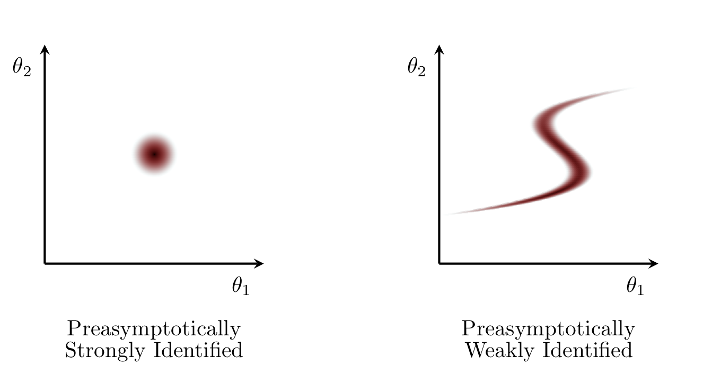
```
<br><br>
</center>

The stronger and more uniformly a realized likelihood function or posterior
density function concentrates around a single point the more informed our
inferences will be.  In particular preasymptotic identifiability is not binary
characterization like asymptotic identifiability but rather a continuous one.
Exactly _how_ preasymptotically identified our inferences need to be before they
become problematic depends on the details of a given analysis.

## Consequences of Poor Preasymptotic Identifiability

A realized likelihood function or posterior density function becomes problematic
when the resulting inferences don't have enough information to achieve the
inferential goals or, perhaps more critically, when their geometry frustrates
accurate computation of those inferences in the first place.

Whether or not we can expect to accumulate enough information to achieve our
inferential goals from typical measurement outcomes is a question of
_experimental design_.  poorly-identified inferences suggests a mismatch between
the experimental design and those goals -- either our design doesn't probe the
desired phenomena well enough or our goals are simply too ambitious for the
available experimental technology.

Regardless of our particular inferential goals, weak preasymptotic
identifiability can have critical computational consequences.  The more
degenerate a realized likelihood function or posterior density function the more
expensive it will be to algorithmically quantify the full extent of the model
configurations consistent with the observed data, if it is possible at all.  For
example deterministic approximations based on point estimates, such as maximum
likelihood confidence intervals and Laplace approximations, become less accurate
the less uniformly the likelihood function concentrates.  At the same time
stochastic approximations like Markov chain Monte Carlo will typically be more
expensive, rendering them less accurate for a fixed computational cost.

If weak preasymptotic identifiability prevents us from being able to fully
quantify a realized likelihood function or posterior density function, and
hence their resulting inferences, then we can't accurately judge the utility
of those inferences at all.  In practice we need our inferences to be
sufficiently well-identified so that our computational tools have a reasonable
opportunity to succeed and we have a reasonable opportunity to understand how
our model responds to a given observations.

## Subtleties of Preasymptotic Identifiability

Although this geometric perspective of preasymptotic identifiability was
motivated by the typical point geometry of asymptotic identifiability, there are
some subtle but critically important differences between the asymptotic and
preasymptotic perspectives.

### A Million Ways To Be Cruel

While the realized likelihood functions and posterior density functions from
well-identified models all look similar, the realizations from less
well-behaving models can each be poorly-identified in their own unique way.  In
particular the exact consequences of poor preasymptotic identifiability will
depend on the shape and orientation of the specific surface on which the
realizations appear to concentrate.  I will refer to the particular geometry of
a poorly-identified likelihood function or posterior density function as a
_degeneracy_.

Perhaps the most important classification of poor preasymptotic identifiability
is between _continuous degeneracies_ and _discontinuous degeneracies_.  A
continuous degeneracy is characterized by model configurations consistent with
the observed data organized into a single connected, fuzzy surface.

<center>
<br>
```{r, out.width = "100%", echo=FALSE}
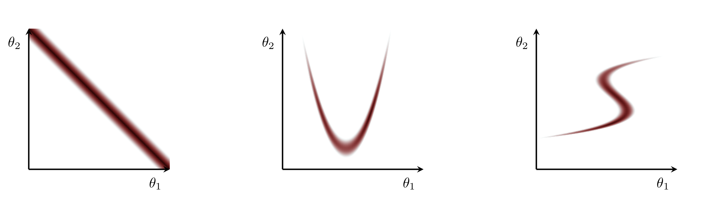
```
<br><br>
</center>

On the other hand discontinuous degeneracies are characterized by the model
configurations consistent with the observed data clustering into _modes_
surrounded by regions of inconsistent model configurations in all directions.

<center>
<br>
```{r, out.width = "50%", echo=FALSE}
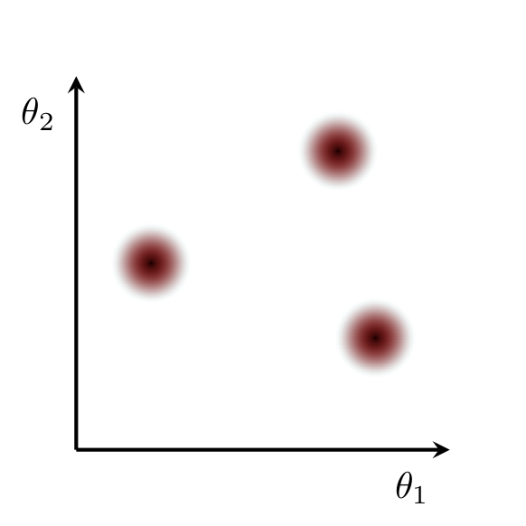
```
<br><br>
</center>

A realized likelihood function or posterior density function can suffer from one
or both of these degeneracies at the same time.  While they might decompose into
a number of discontinuous degeneracies where each individual mode is itself
locally well-identified as above, a particularly pathological realization might
be comprised of a collection of continuously degenerate modes.

<center>
<br>
```{r, out.width = "50%", echo=FALSE}
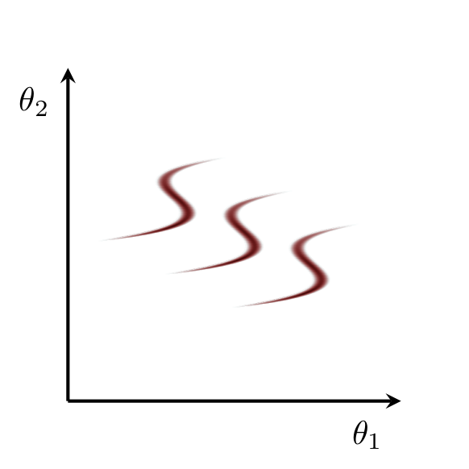
```
<br><br>
</center>

### The Most Capricious of Insects

Asymptotic identifiability requires the collapse of the likelihood functions
realized from almost every infinitely large observation.  In other words it does
not depend the details of any particular observation and hence characterizes the
entire observational model.

The shape of the likelihood functions and posterior density functions realized
from finite observations, however, will in general depend on those particular
details.

<center>
<br>
```{r, out.width = "75%", echo=FALSE}
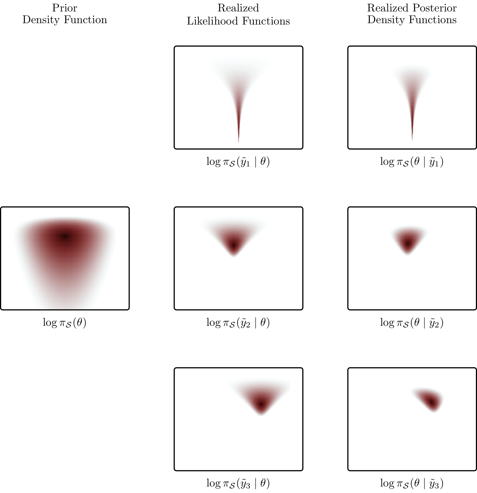
```
<br><br>
</center>

Consequently preasymptotic identifiability will also depend on the particular
observation considered.  The realized likelihood functions and posterior density
functions might be reasonably well-identified for some particularly informative
observations, but manifest strong degeneracies for others.  Indeed the more
complex the measurement process and higher dimensional the observational space,
the more opportunities there will be for fluctuations to conspire to obscure the
latent phenomena of interest.

In other words we can't talk about an entire model being preasymptotically
identified unless we can verify that every realization of a likelihood function
or posterior density function is strongly and uniformly concentrated.  At the
same time we can't talk about the robustness of a model, and how prone it might
be to contorting itself to accommodate misfit, unless we can quantify the
behavior of realizations from data generated outside of the model.  Such
_inferential calibrations_ require either careful theoretical work or expansive
simulation studies.

### Parameterization Dependence

Because the particular geometry of a realized likelihood function or posterior
density function depends on a chosen parameterization of the model configuration
space so too will this definition of preasymptotic identifiability.  A
realization that appears degenerate in one parameterization might appear much
less degenerate in another!

<center>
<br>
```{r, out.width = "100%", echo=FALSE}
knitr::include_graphics("figures/reparam/reparam.png")
```
<br><br>
</center>

This parameterization dependence, however, also provides an opportunity for
moderating preasymptotic identifiability problems.  Strong preasymptotic
identification implies that _every_ parameter is strongly informed independently
of the others.  If some parameters are strongly coupled then we might be able to
find a reparameterization that transforms them into parameters that are less
coupled, and hence better identified.  At the same time if some parameters are
particularly weakly-informed then we might be able to remove them from the model
entirely.

# Managing Poor Preasymptotic Identifiability {#sec:management}

Preasymptotic identifiability is ultimately a question of information, in
particular how much information we have about the chosen parameters that
coordinate the model configuration space.  If a realized likelihood function or
posterior density function is poorly preasymptotically identified then we need
to incorporate more information into our inferences, change the parameters that
we're trying to identify, or weaken our inferential goals so that what little
information we have is sufficient.

## More Information

The most direct way to improve the preasymptotic identifiability of our
inferences is to add more information.  In turn the most direct way to add more
information is to repeat the measurement process multiple times and aggregate
the resulting observations together into one larger, more informative
observation.  In practice, however, repeating the measurement process exactly is
often prohibitively expensive if not outright impossible.  Moreover there is no
guarantee that degeneracies won't persist through repeated measurements.

A powerful alternative to repeating the initial measurement process is to
_complement_ it with additional processes that are sensitive to only some
phenomenological, environmental, or experimental parameters.  This complementary
data can then break degeneracies in the likelihood function, allowing the
original data to inform the rest of the parameters.

Consider, for example, a measurement of some phenomenon, quantified by the
parameter $\lambda_{S}$, that is corrupted by some irreducible background,
quantified with the parameter $\lambda_{B}$.  No matter how much data we collect
we will not be able to differentiate between the desired phenomenon and the
background, leading to degenerate likelihood functions.

<center>
<br>
```{r, out.width = "50%", echo=FALSE}
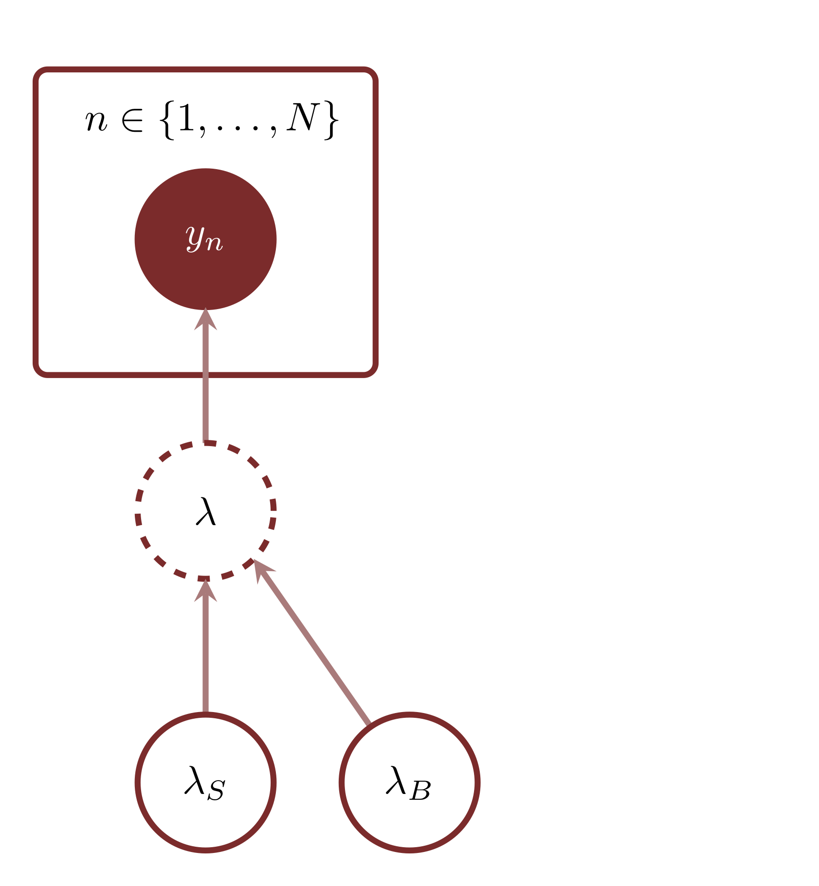
```
<br><br>
</center>

Adding additional data where the phenomenon has been removed, however, informs
only the background contribution and allows the _excess_ observed in the
original data to inform the latent phenomenon.

<center>
<br>
```{r, out.width = "50%", echo=FALSE}
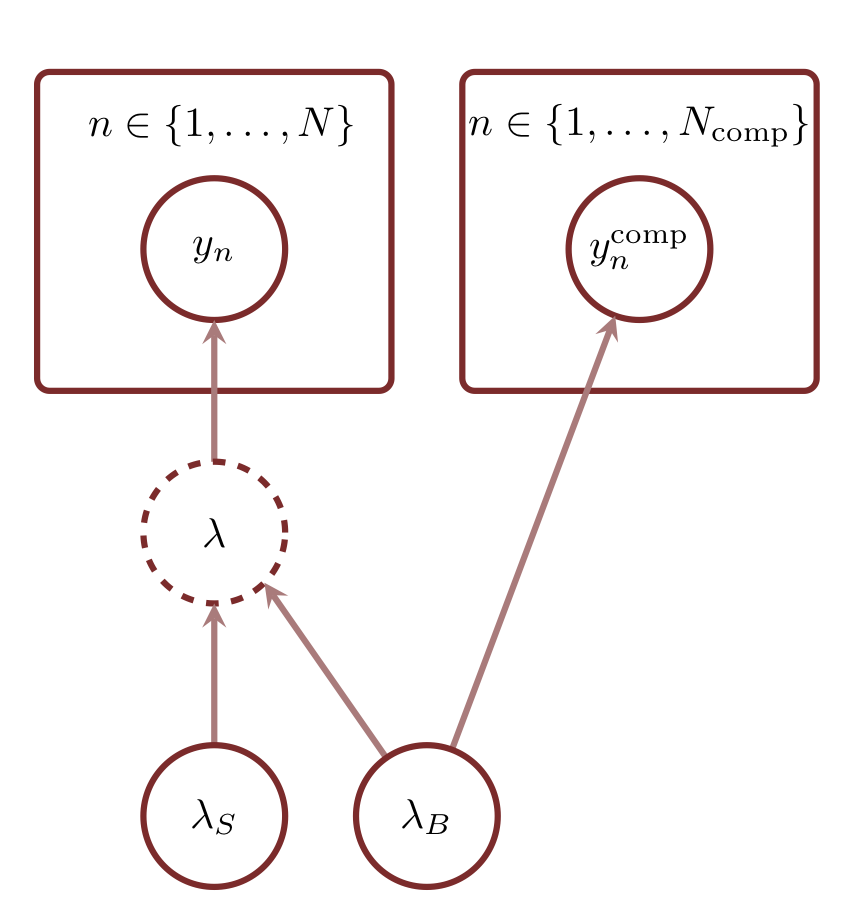
```
<br><br>
</center>

Bayesian analyses also benefit from the opportunity to add information through
the prior model.  For example principled domain expertise can suppress extreme
model configurations and _contain_ the posterior density function into a
reasonably small neighborhood even when the realized likelihood function is
poorly preasymptotically identified.

<center>
<br>
```{r, out.width = "100%", echo=FALSE}
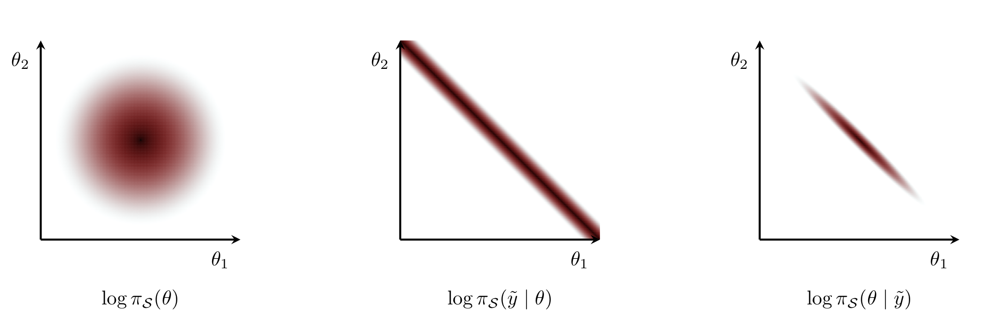
```
<br><br>
</center>

At the same time targeted domain expertise can complement the nominal
measurement process in the same way as auxiliary measurements, pinning down
a few parameters and preventing degeneracies in the realized likelihood function
from propagating to the posterior density function.

<center>
<br>
```{r, out.width = "100%", echo=FALSE}
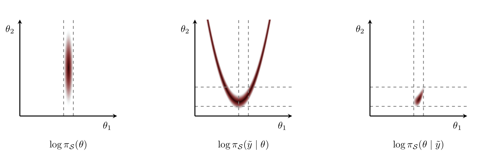
```
<br><br>
</center>

Of course we have to be responsible and add only information that is actually
compatible with our domain expertise.  Forcing less principled information into
the analysis simply because it resolves an inconvenient degeneracy is a highway
to the poor generalizability zone.

## Reparameterizations

The parameters in the initial parameterization being poorly preasymptotically
identified doesn't mean that parameters in _other_ parameterizations suffer the
same fate.  In some instances we can reparameterize the model configuration
space and replace poorly-identified parameters with new parameters are that
better suited to the measurement process.  Some times we can find alternative
parameterizations where all of the parameters are well-identified, and even if
we can't we might be able to find parameterizations that isolate degeneracies
into just a few parameters which are then easier to manage.

For example consider the observational model that depends on the parameters only
through a function $f : \Theta \rightarrow \mathbb{R}$,
$$
\pi_{S}(y; f(\theta_{1}, \ldots, \theta_{N})).
$$
If the function $f$ is many-to-one then the no amount of data will be able to
identify the parameters $\{\theta_{1}, \ldots, \theta_{N} \}$ individually.  On
the other hand if we can find a new parameterization with a parameter
$$
\phi_{1} = f(\theta_{1}, \ldots, \theta_{N})
$$
then the data will be able to inform $\phi_{1}$ and we can resort to the prior
model to inform the remaining $\{ \phi_{2}, \ldots, \phi_{N} \}$.

Reparameterizations are especially important when weak preasymptotic
identifiability is limits how well a computational algorithm is able to survey
the entirety of a realized likelihood function or posterior density function.
Careful reparameterizations can reorganize the model configurations consistent
with the data into geometries that better match the capabilities of the
algorithm and actually facilitate accurate computation.

Many modeling techniques have natural parameterizations that are optimal in
different circumstances.  In order to use these techniques as responsibly as
possible we need to familiarize ourselves with not only the basic structure of
the technique but also these parameterizations and their consequences for
preasymptotic identifiability.

## Lowered Expectations

Sometimes degeneracies are inescapable, with the poor preasymptotic
identifiability of a realized likelihood function or posterior density function
communicating that we have neither the data nor the domain expertise to learn
enough about the latent phenomena of interest.

If our computational tools are able to accurately quantify the degenerate
likelihood function or posterior density function then we might have to just
report the weak inferences that result as the honest outcome of the analysis.
Careful review of these degeneracies can then determine the failings of the
initial experimental design and suggest refined measurements moving forwards.

On the other hand when the degeneracies are so bad that they obstruct the
complete quantification of the realized likelihood function or posterior density
function we won't be able to report faithful inferences at all.  In that case we
might have to set aside the analysis until we can equip better algorithms that
allow us to better understand our inferences and their limitations.

# Diagnosing Poor Preasymptotic Identifiability

If we know that a realized likelihood function or posterior density function is
only weakly preasymptotically identified then we can manage that poor
identifiability with the strategies discussed in [Section 3](#sec:management).
But how exactly can we work out how well preasymptotically identified a
realization is in practice, especially when our model is sophisticated and the
model configuration space is high-dimensional?

## All That We See or Seem

One approach is to utilize computational methods that explore the entirety of
the realized likelihood function or posterior density function and examine
projections of that exploration onto lower-dimensional surfaces that we can
visualize.  In particular we can't study preasymptotic identifiability with
methods that return only point estimates and assume certain behaviors of the
realized likelihood function or posterior density function in the surrounding
neighborhood.

In a Bayesian analysis Markov chain Monte Carlo has especially notable
diagnostic power.  Effective Markov chains will expand into the most relevant
neighborhoods of the model configuration space, probing any potential degenerate
behavior in the process.  Moreover the individual states of the resulting Markov
chains can be immediately projected onto any subspace allowing for immediate
visualization.

A common diagnostic strategy is to consider _pairs plots_, or scatter plots of
the realized Markov chain states projected onto each pair of functions of
interest, usually including the parameter functions.

<center>
<br>
```{r, out.width = "75%", echo=FALSE}
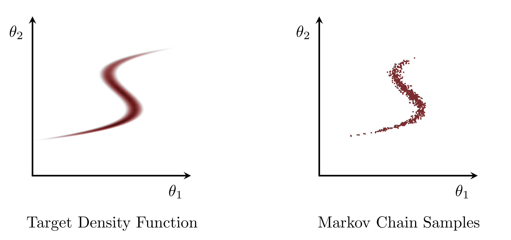
```
<br><br>
</center>

Because we're looking for geometries in the posterior density function that
frustrate algorithmic exploration we want to focus on the posterior density
function encountered by our chosen algorithm.  In tools like Stan that means
looking at the parameter functions on the _unconstrained_ model configuration
space and not the nominal constrained model configuration space that appears in
a Stan program itself.  Exploring the unconstrained space is made easier by using
the `diagnostic_file` option in the Stan interfaces which writes the
unconstrained state at each iteration of the Markov chain to a text file.

These plots can be useful in identifying degeneracies that manifest in only two
parameters, but they are not necessarily revealing of degeneracies that manifest
on higher-dimensional surfaces.  In this case the scatter plots collapse too
many samples onto the projected surface, obstructing the underlying degeneracy.

<center>
<br>
```{r, out.width = "100%", echo=FALSE}
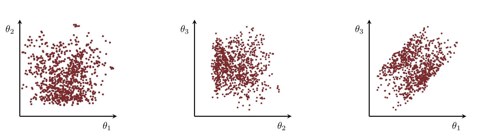
```
<br><br>
</center>

Only by looking at higher-dimensional scatter plots can we see the true nature
of the degeneracy.

<center>
<br>
```{r, out.width = "75%", echo=FALSE}
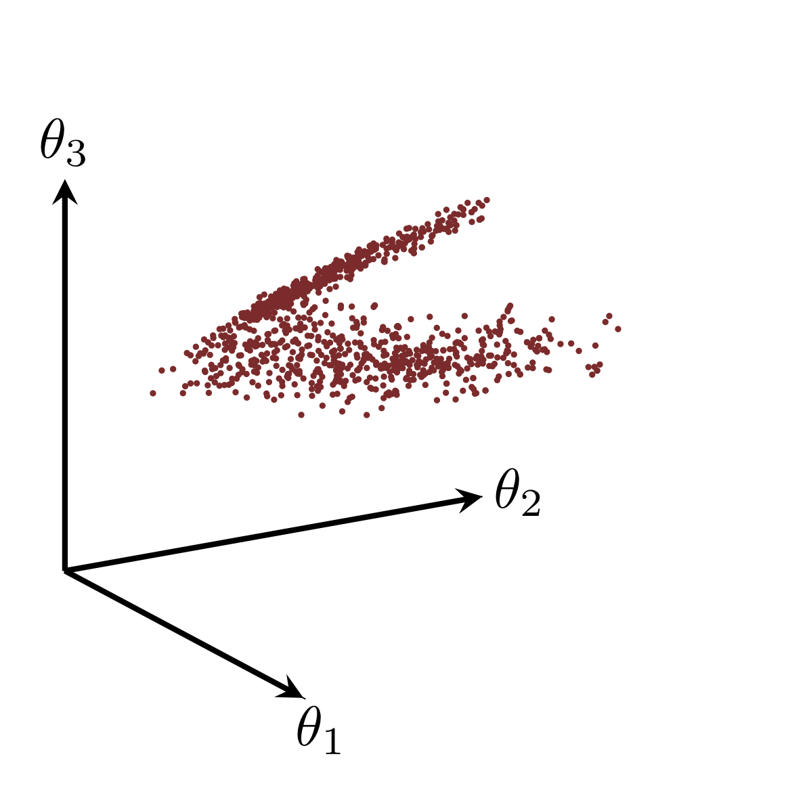
```
<br><br>
</center>

To avoid this projection collapse we would have to _slice_ the samples into
bands of some of the remaining parameters.  Beyond a few dimensions, however,
this would generate an infeasibly large number of sparsely populated scatter
plots.

Even without slicing the number of possible pairs plots is the biggest
limitation to this approach.  Without domain expertise to motivate potential
degenerate surfaces we would have to force ourselves through at least
$D \cdot (D + 1) / 2$ scatter plots.  Even for moderate dimensions this quickly
expands to hundreds if not thousands of plots that might not even reveal
problematic degeneracies at all.

Exploring high-dimensional spaces through visualizations is hard and it's all
the more challenging when we don't know for what we're looking.

## My Engine Makes This Strange Sound

Visualizations of Markov chains are only as good as the ability of those Markov
chains to capture the full extent of the posterior distribution.  In particular
slow or ineffectual Markov chains provide only a partial view of the full
posterior distribution and hence lead to misleading pairs plots diagnostics.

Consider, for example, a Markov chain that slowly wanders around its
initialization, exploring only a very small part of the posterior distribution
that concentrates on a curved surface.  In this case the pairs plots would show
no signs of degeneracy.

<center>
<br>
```{r, out.width = "75%", echo=FALSE}
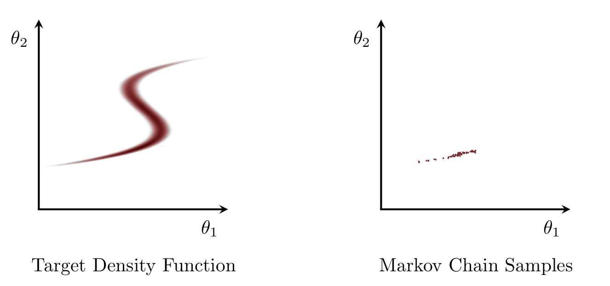
```
<br><br>
</center>

Even if we ran multiple Markov chains then we would visualize only multiple
incomplete explorations.  This could then easily mislead us into thinking that
we're dealing with the wrong kind of degeneracy, for example a discrete one
instead of a continuous one.

<center>
<br>
```{r, out.width = "75%", echo=FALSE}
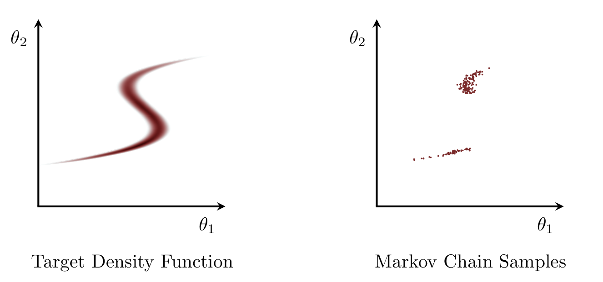
```
<br><br>
</center>

This behavior is particularly troubling when degenerate posterior density
functions are a key obstacle that prevents Markov chains from effectively
exploring the full posterior distribution in the first place.

Fortunately not all Markov chain Monte Carlo algorithms fail silently.  Some
algorithms, namely Hamiltonian Monte Carlo, actually complain quite loudly when
they struggle to work with degenerate posterior density functions.  At least,
that is, if you listen to them.  Although these complaints are certainly an
annoyance they are often our _only_ hint at the underlying pathologies.

Consequently our most powerful diagnostic strategy is a _postmortem_ one where
we first try to run a Markov chain Monte Carlo algorithm and then carefully
scrutinizing where and how an algorithm struggles or outright fails in order to
track down the underlying pathologies.  The louder our algorithm, the more
information we will have to guide us to degenerate behavior.

Exactly how poorly preasymptotically identified a posterior density function
has to be before a Markov chain Monte Carlo algorithm starts to struggle or
first breaks depends on the detailed interactions between the algorithm, the
configuration of that algorithm, and the posterior density function.  Some
algorithms are fragile, breaking with only small degeneracies while some are
more robust, only slowly bending until the degeneracies become strong enough.
In order to maximize our diagnostic power we need to be familiar how a given
algorithm responds to different degeneracies.

For example by comparing multiple Markov chains initialized at different places
in the model configuration space, perhaps with summary statistics like the
potential scale reduction factor $\hat{R}$, we can detect discrete degeneracies.
The more Markov chains we run the better we will be able resolve the full extent
of the degeneracy, even if each individual Markov chain explores only a local
mode.

## Sonic Boom

Hamiltonian Monte Carlo has a reputation for being fast but that is only part of
its success.  Yes, for well preasymptotically identified posterior density
functions Hamiltonian Monte Carlo rapidly explores the posterior distribution
even in high-dimensional model configuration spaces.  Yes, Hamiltonian Monte
Carlo can manage relatively poorly preasymptotically identified posterior
density functions by consuming more computational resources.  What makes
Hamiltonian Monte Carlo so really in practice, however, is that when it
struggles or outright fails to fully quantify a poorly-identified posterior
density function it does so _loudly_.

Hamiltonian Monte Carlo [@Betancourt:2018b] exploits _Hamiltonian dynamics_
which generates trajectories that rapidly and coherently explore the posterior
distribution.  In practice we can't generate these trajectories exactly so
instead we approximate them with discrete, numerical trajectories.  The smaller
the discretization time, or _step size_, the more accurate but also more
computationally expensive these numerical trajectories will be.

<center>
<br>
```{r, out.width = "50%", echo=FALSE}
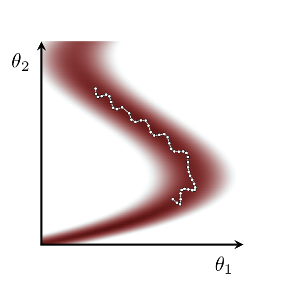
```
<br><br>
</center>

Any residual error introduced by these numerical trajectories is corrected by
introducing a sampling procedure that preferentially returns points along the
trajectory with smaller error.  Under ideal conditions the performance of this
sampling procedure can also be used to automatically tune the step size to
achieve near optimal performance in tools like Stan [@BetancourtEtAl:2014b].
When Stan encounters complex geometries the step size will automatically be
decreased so that the numerical trajectories can resolve all of the fine details
of the realized posterior density function as much as possible.

Unfortunately there is a limit to this adaptive feedback.  When the posterior
density function changes too quickly the numerical integration can become
unstable, resulting in numerical trajectories that rocket towards infinity
instead of exploring the delicate features.  In other words these _divergent
trajectories_ indicate when Hamiltonian Monte Carlo is unable to fully resolve
the details of the target posterior distribution.

<center>
<br>
```{r, out.width = "50%", echo=FALSE}
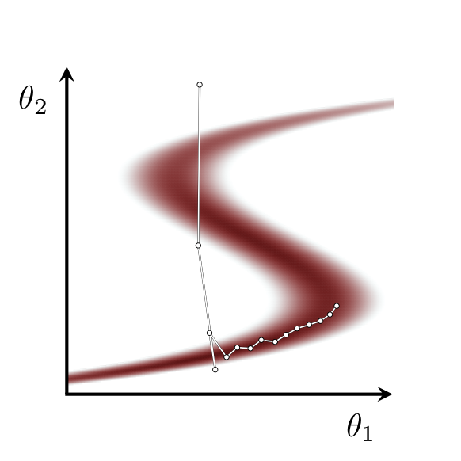
```
<br><br>
</center>

Markov chain iterations sampled from divergent trajectories are marked as
_divergent iterations_ in Stan.  Because the states in divergent trajectories
are spatially correlated with the neighborhoods of strong curvature that induce
the instabilities we can use these divergent iterations to approximately locate
these neighborhoods that appear pathological to Hamiltonian Monte Carlo.  We can
verify any suspicious behavior by rerunning with a less aggressive, more
refined, step size adaptation that should result in a smaller step size, and
more accurate trajectories that can better penetrate the problematic
neighborhood.

<center>
<br>
```{r, out.width = "100%", echo=FALSE}
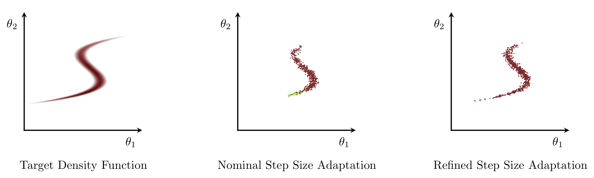
```
<br><br>
</center>

The details of the numerical Hamiltonian dynamics that drive Hamiltonian Monte
Carlo serve as a powerful probe of degenerate behavior characteristic of poor
preasymptotic identifiability.  For example the less uniformly the posterior
density function concentrates the smaller the step size will have to be to
resolve the directions of stronger concentration while the longer the overall
trajectories will have to be to fully explore the directions of smaller
concentration.

<center>
<br>
```{r, out.width = "75%", echo=FALSE}
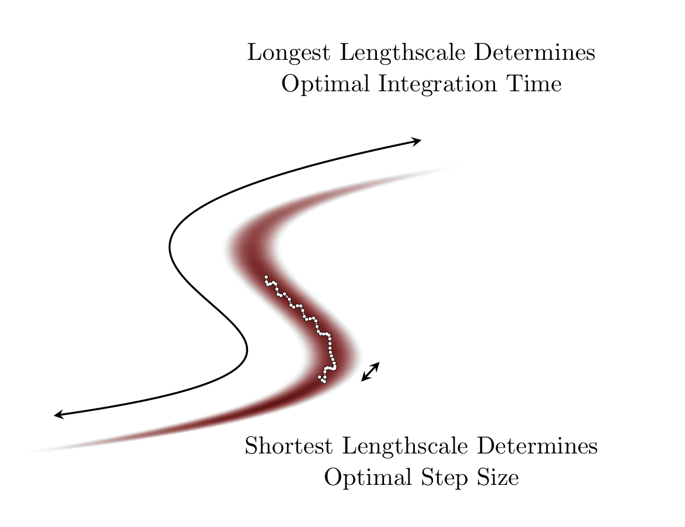
```
<br><br>
</center>

In other words the more continuously degenerate the posterior density function
the more integrator iterations, or _leapfrog steps_, we will need to simulate
the latent Hamiltonian dynamics.  The number of leapfrog steps needed for each
iteration then helps identify problematic geometries.

Particularly extreme degeneracies often "pinch" at the boundary of the
degenerate surface, manifesting in neighborhoods where the curvature rapidly
increases and renders numerical trajectories unstable.  Consequently the
appearance and structure of divergent iterations provide a sensitive diagnostic
of these problematic boundaries.  Because divergent iterations are sampled from
divergent trajectories they will concentrate towards the problematic
neighborhoods, literally pointing the way to the pathology.  Overlaying
divergent iterations and non-divergent iterations in a pairs plot is
particularly informative, especially when the functions being compared are
well-chosen.

Sometimes the geometry of the posterior density function is so adversarial that
even exact Hamiltonian trajectories don't go very far and Hamiltonian Monte
Carlo devolves into very incoherent, _diffusive_ exploration.  Although this is
a relatively rare pathology it can detected with another diagnostic bespoke to
Hamiltonian Monte Carlo -- the energy fraction of missing information, or
_E-FMI_ [@Betancourt:2016b].  Because these pathologies are somewhat rare, and
often buried under other more pressing pathologies, we don't yet have a full
understanding of the offending degeneracies and hence how to resolve them.

# Don't Do Me Like That

Because the diversity of degenerate behavior is so expansive, finding and
learning about the signs of poor preasymptotically identifiability, not to
mention reacting effectively, is an overwhelming challenge.  To reduce the
difficulty we need to build experience, and experience building is facilitated
by compartmentalizing the possibilities.  Limiting ourselves to a single
degeneracy at a time presents a much more manageable task, especially when those
degeneracies are typical of a new modeling technique that we're learning.

In case studies where I introduce new modeling techniques I take the opportunity
to also discuss the degeneracies to which the technique might be vulnerable and
the bespoke ways of diagnosing and resolving the underlying pathologies.  Here
we will consider some much less ambitious examples that demonstrate relatively
simple degeneracies and their consequences.

Although these examples are artificial let's assume that in the initial
parameterizations our domain expertise would constrain the parameters to values
around or smaller than one.  Consequently ones defines the scale that separates
"weakly informative" from "strongly informative".

As always, however, we have to start by setting up our local `R` environment.

```{r, warning=FALSE}
library(rstan)
rstan_options(auto_write = TRUE)            # Cache compiled Stan programs
options(mc.cores = parallel::detectCores()) # Parallelize chains

util <- new.env()
source('stan_utility.R', local=util)

set.seed("5389533")

c_light <- c("#DCBCBC")
c_light_highlight <- c("#C79999")
c_mid <- c("#B97C7C")
c_mid_highlight <- c("#A25050")
c_dark <- c("#8F2727")
c_dark_highlight <- c("#7C0000")

c_light_trans <- c("#DCBCBC80")
c_dark_trans <- c("#8F272780")
c_green_trans <- c("#00FF0080")
```

## Extraneous Parameters

The simplest degeneracy is having an extraneous parameter.  Here there are no
problematic interactions between the parameters, just one parameter that's not
informed by the likelihood function at all.

To see the problem let's simulate an observation from an arbitrary model
configuration.

```{r}
writeLines(readLines("stan_programs/simu_extra.stan"))
```

```{r, warning=FALSE}
N <- 100
simu_data <- list("N" = N)

simu <- stan(file='stan_programs/simu_extra.stan', data=simu_data,
             iter=1, chains=1, seed=4838282, algorithm="Fixed_param")

y <- array(extract(simu)$y[1,])
sigma <- extract(simu)$sigma[1]
input_data <- list("N" = N, "y" = y, "sigma" = sigma)
```

Let's first consider a Bayesian model with a uniform prior density function that
allows the fully pathology of the degenerate likelihood function propagate to
the posterior density function.

```{r}
writeLines(readLines("stan_programs/fit_extra_flat.stan"))
```

```{r, warning=FALSE}
fit <- stan(file='stan_programs/fit_extra_flat.stan', data=input_data,
            seed=4938483, refresh=0)
```

Unfortunately diagnostic checks indicate that Stan's Hamiltonian Monte Carlo
sampler is complaining.  Not only is $\hat{R}$ for $b$ indicating mixing
problems the numerical trajectories are hitting the default upper bound of 1024
leapfrog steps indicating that the sampler is working extraordinarily hard to
generate each transition.

```{r}
util$check_all_diagnostics(fit)
```

The pairs plot of the two parameters shows the Markov chains struggling to
explore the full breadth of the degenerate posterior density function that
stretches all the way to infinity along the extraneous dimension.  Note the
scale of the vertical axis!

```{r}
samples <- extract(fit)

par(mfrow=c(1, 1))

plot(samples$a, samples$b,
     col=c_dark_trans, pch=16, cex=0.8,
     xlab="a", ylab="b")
```

The struggle is even clearer when we visualize each Markov chain separately,
revealing how each struggles to capture the infinite breadth in a different
way.

```{r}
unpermuted_samples <- extract(fit, permute=FALSE)

par(mfrow=c(2, 2))

plot(samples$a, samples$b,
     main="Chain 1", col=c_light_trans, pch=16, cex=0.8,
     xlab="a", ylab="b")
points(unpermuted_samples[,1,1], unpermuted_samples[,1,2],
       col=c_dark_trans, pch=16, cex=0.8)

plot(samples$a, samples$b,
     main="Chain 2", col=c_light_trans, pch=16, cex=0.8,
     xlab="a", ylab="b")
points(unpermuted_samples[,2,1], unpermuted_samples[,2,2],
       col=c_dark_trans, pch=16, cex=0.8)

plot(samples$a, samples$b,
     main="Chain 3", col=c_light_trans, pch=16, cex=0.8,
     xlab="a", ylab="b")
points(unpermuted_samples[,3,1], unpermuted_samples[,3,2],
       col=c_dark_trans, pch=16, cex=0.8)

plot(samples$a, samples$b,
     main="Chain 4", col=c_light_trans, pch=16, cex=0.8,
     xlab="a", ylab="b")
points(unpermuted_samples[,4,1], unpermuted_samples[,4,2],
       col=c_dark_trans, pch=16, cex=0.8)
```

To suppress the infinite degeneracy we can incorporate domain expertise in our
prior model that disfavors infinite values.  Let's start with weak prior with
old mild suppression relative to the natural scales of the system.

```{r}
writeLines(readLines("stan_programs/fit_extra_weak.stan"))
```

```{r, warning=FALSE}
fit <- stan(file='stan_programs/fit_extra_weak.stan', data=input_data,
            seed=4938483, refresh=0)
```

The diagnostics now have much less to say, suggesting no obstructions to an
accurate fit.

```{r}
util$check_all_diagnostics(fit)
```

Although our computation is now accurate, the posterior density function is
still only weakly identified along the extraneous direction.

```{r}
samples <- extract(fit)

par(mfrow=c(1, 1))

plot(samples$a, samples$b,
     col=c_dark_trans, pch=16, cex=0.8,
     xlab="a", xlim=c(-300, 300), ylab="b", ylim=c(-300, 300))
lines(300 * cos(seq(0, 2 * pi, 2 * pi / 250)),
      300 * sin(seq(0, 2 * pi, 2 * pi / 250)),
      col=c_mid)
```

We can improve the identifiability by incorporating stronger prior information.

```{r}
writeLines(readLines("stan_programs/fit_extra_strong.stan"))
```

```{r, warning=FALSE}
fit <- stan(file='stan_programs/fit_extra_strong.stan', data=input_data,
            seed=4938483, refresh=0)
```

```{r}
util$check_all_diagnostics(fit)
```

```{r}
samples <- extract(fit)

par(mfrow=c(1, 1))

plot(samples$a, samples$b,
     col=c_dark_trans, pch=16, cex=0.8,
     xlab="a", xlim=c(-3, 3), ylab="b", ylim=c(-3, 3))
lines(3* cos(seq(0, 2 * pi, 2 * pi / 250)),
      3 * sin(seq(0, 2 * pi, 2 * pi / 250)),
      col=c_mid)
```

Alternatively, if the extraneous parameter is not needed then we can prune it
altogether.

```{r}
writeLines(readLines("stan_programs/fit_extra_prune.stan"))
```

```{r, warning=FALSE}
fit <- stan(file='stan_programs/fit_extra_prune.stan', data=input_data,
            seed=4938483, refresh=0)
```

```{r}
util$check_all_diagnostics(fit)
```

```{r}
samples <- extract(fit)

hist(samples$a, breaks=seq(0.5, 1.3, 0.05), main="",
     col=c_dark, border=c_dark_highlight,
     xlab="a", yaxt='n', ylab="")
```

## Additive Degeneracy

A slightly more sophisticated, and more interesting, example is an additive
degeneracy where measurements are informed by only the sum of two parameters.

```{r}
writeLines(readLines("stan_programs/simu_add.stan"))
```

```{r}
N <- 100
simu_data <- list("N" = N)

simu <- stan(file='stan_programs/simu_add.stan', data=simu_data,
             iter=1, chains=1, seed=4838282, algorithm="Fixed_param")

y <- array(extract(simu)$y[1,])
sigma <- extract(simu)$sigma[1]
input_data <- list("N" = N, "y" = y, "sigma" = sigma)
```

An improper prior model specified by a uniform prior density function will carry
the full extent of this degeneracy from the likelihood function to the posterior
density function.

```{r}
writeLines(readLines("stan_programs/fit_add_flat.stan"))
```

```{r, warning=FALSE}
fit <- stan(file='stan_programs/fit_add_flat.stan', data=input_data,
            seed=4938483, refresh=0)
```

The sampler absolutely _grouses_.

```{r}
util$check_all_diagnostics(fit)
```

As in the extraneous case we see the Markov chains trying to explore all the
way out towards infinity, only this time along the line $b = y - a$.

```{r}
samples <- extract(fit)

par(mfrow=c(1, 1))

plot(samples$a, samples$b,
     col=c_dark_trans, pch=16, cex=0.8,
     xlab="a", ylab="b")
```

If we visualize each Markov chain separately then we can also see that each
explores a different part of the degenerate line, which isn't unexpected given
that they would be able to fully quantify the degeneracy only after an infinite
number of iterations.  Infinity is far away!

```{r}
unpermuted_samples <- extract(fit, permute=FALSE)

par(mfrow=c(2, 2))

plot(samples$a, samples$b,
     main="Chain 1", col=c_light_trans, pch=16, cex=0.8,
     xlab="a", ylab="b")
points(unpermuted_samples[,1,1], unpermuted_samples[,1,2],
       col=c_dark_trans, pch=16, cex=0.8)

plot(samples$a, samples$b,
     main="Chain 2", col=c_light_trans, pch=16, cex=0.8,
     xlab="a", ylab="b")
points(unpermuted_samples[,2,1], unpermuted_samples[,2,2],
       col=c_dark_trans, pch=16, cex=0.8)

plot(samples$a, samples$b,
     main="Chain 3", col=c_light_trans, pch=16, cex=0.8,
     xlab="a", ylab="b")
points(unpermuted_samples[,3,1], unpermuted_samples[,3,2],
       col=c_dark_trans, pch=16, cex=0.8)

plot(samples$a, samples$b,
     main="Chain 4", col=c_light_trans, pch=16, cex=0.8,
     xlab="a", ylab="b")
points(unpermuted_samples[,4,1], unpermuted_samples[,4,2],
       col=c_dark_trans, pch=16, cex=0.8)
```

Fortunately there are many ways that we can incorporate additional information
into our Bayesian inferences and suppress this degenerate behavior.

### Suppression Strategies

Let's first consider introducing relatively weak domain expertise about just the
parameter $a$ to break the additive degeneracy.

```{r}
writeLines(readLines("stan_programs/fit_add_weak_a.stan"))
```

```{r, warning=FALSE}
fit <- stan(file='stan_programs/fit_add_weak_a.stan', data=input_data,
            seed=4938483, refresh=0)
```

This resolves the most serious diagnostic issues, but the tree depth warning
indicates that the sample is still working extraordinarily hard.

```{r}
util$check_all_diagnostics(fit)
```

Indeed he weak prior model is able to contain the likelihood function to a
finite neighborhood that gives the sampler a decent chance of fully quantifying
the posterior distribution.

```{r}
samples <- extract(fit)

par(mfrow=c(1, 1))

plot(samples$a, samples$b,
     col=c_dark_trans, pch=16, cex=0.8,
     xlab="a", xlim=c(-300, 300), ylab="b", ylim=c(-300, 300))
lines(c(-300, -300), c(-325, 325), col=c_mid)
lines(c(300, 300), c(-325, 325), col=c_mid)
```

Weak domain expertise isolated on the second parameter, $b$, performs similarly,
although the Markov chains explore a bit more slowly and so have yet to fully
equilibrate.

```{r}
writeLines(readLines("stan_programs/fit_add_weak_b.stan"))
```

```{r, warning=FALSE}
fit <- stan(file='stan_programs/fit_add_weak_b.stan', data=input_data,
            seed=4938483, refresh=0)
```

```{r}
util$check_all_diagnostics(fit)
```

```{r}
samples <- extract(fit)

par(mfrow=c(1, 1))

plot(samples$a, samples$b,
     col=c_dark_trans, pch=16, cex=0.8,
     xlab="a", xlim=c(-300, 300), ylab="b", ylim=c(-300, 300))
lines(c(-325, 325), c(-300, -300), col=c_mid)
lines(c(-325, 325), c(300, 300), col=c_mid)
```

Introducing a relatively weakly informative prior model on both parameters
constrains the posterior density function in all directions, suppressing the
additive degeneracy a bit more strongly.

```{r}
writeLines(readLines("stan_programs/fit_add_weak_ab.stan"))
```

```{r, warning=FALSE}
fit <- stan(file='stan_programs/fit_add_weak_ab.stan', data=input_data,
            seed=4938483, refresh=0)
```

```{r}
util$check_all_diagnostics(fit)
```

```{r}
samples <- extract(fit)

par(mfrow=c(1, 1))

plot(samples$a, samples$b,
     col=c_dark_trans, pch=16, cex=0.8,
     xlab="a", xlim=c(-300, 300), ylab="b", ylim=c(-300, 300))
lines(300 * cos(seq(0, 2 * pi, 2 * pi / 250)),
      300 * sin(seq(0, 2 * pi, 2 * pi / 250)),
      col=c_mid)
```

Even with the prior model taming the full extent of the degeneracy our posterior
distribution remains relatively poorly-identified.  In particular, we don't
learn much about about each parameter marginally.

```{r}
a_prior_samples <- rnorm(4000, 0, 100)
b_prior_samples <- rnorm(4000, 0, 100)

par(mfrow=c(1, 2))

hist(a_prior_samples, breaks=seq(-400, 400, 10), prob=T,
     col=c_light, border=c_light_highlight, main="",
     xlim=c(-300, 300), xlab="a", yaxt='n', ylim=c(0, 0.0075), ylab="")
hist(samples$a, breaks=seq(-250, 250, 10), prob=T,
     col=c_dark, border=c_dark_highlight, add=T)

hist(b_prior_samples, breaks=seq(-400, 400, 10), prob=T,
     col=c_light, border=c_light_highlight, main="",
     xlim=c(-300, 300), xlab="b", yaxt='n', ylim=c(0, 0.0075), ylab="")
hist(samples$b, breaks=seq(-250, 250, 10), prob=T,
     col=c_dark, border=c_dark_highlight, add=T)
```

What do the measurements inform?  If we rotate the model configuration space
we can see that the observation informs only the transformed parameter `a + b`
while providing no information about the orthogonal direction `a - b`.

```{r}
par(mfrow=c(1, 2))

hist(a_prior_samples - b_prior_samples, breaks=seq(-600, 600, 10), prob=T,
     col=c_light, border=c_light_highlight, main="",
     xlim=c(-500, 500), xlab="a - b", yaxt='n', ylim=c(0, 0.0075), ylab="")
hist(samples$a - samples$b, breaks=seq(-500, 500, 10), prob=T,
     col=c_dark, border=c_dark_highlight, add=T)

hist(a_prior_samples + b_prior_samples, breaks=seq(-600, 600, 10), prob=T,
     col=c_light, border=c_light_highlight, main="",
     xlim=c(-400, 400), xlab="a + b", yaxt='n', ylim=c(0, 0.0075), ylab="")
hist(samples$a + samples$b, breaks=seq(-250, 250, 10), prob=T,
     col=c_dark, border=c_dark_highlight, add=T)
```

While the prior model provides a powerful tool for suppressing the degenerate
behavior of poorly preasymptotically identified likelihood functions it's
not our only tool if we are able to incorporate additional data.

For example measurements that inform either of the parameters independently of
the other allow the initial data to inform the other.  Here let's consider an
auxiliary measurement that directly informs `a` to complement what we learn from
the initial data.

```{r}
writeLines(readLines("stan_programs/fit_add_weak_aux.stan"))
```

For convenience we can simulate the auxiliary measurement directly in `R`.

```{r}
aux_data <- list("N_aux" = 25, "y_aux" = rnorm(25, 1, 0.5), "sigma_aux" = 0.5)
total_data <- c(input_data, aux_data)
```

```{r, warning=FALSE}
fit <- stan(file='stan_programs/fit_add_weak_aux.stan',
            data=total_data, seed=4938483, refresh=0)
```

With the added information the posterior density function presents no
diagnosed problems for our sampler.

```{r}
util$check_all_diagnostics(fit)
```

The efficient computation is no surprise given how informed the posterior
density function is with the combined power of both measurements.

```{r}
aux_samples <- extract(fit)

par(mfrow=c(1, 1))

plot(samples$a, samples$b,
     col=c_light_trans, pch=16, cex=0.8,
     xlab="a", xlim=c(-300, 300), ylab="b", ylim=c(-300, 300))
points(aux_samples$a, aux_samples$b,
       col=c_dark_trans, pch=16, cex=0.8)
lines(300 * cos(seq(0, 2 * pi, 2 * pi / 250)),
      300 * sin(seq(0, 2 * pi, 2 * pi / 250)),
      col=c_mid)
```

Finally we can consider reparameterizing the model configuration space
to isolate the degenerate behavior to one parameter and then removing that
uninformed parameter entirely.  Note that we have to modify the prior density
function accordingly to ensure that we're not incorporating different domain
expertise.

```{r}
writeLines(readLines("stan_programs/fit_add_reparam.stan"))
```

```{r, warning=FALSE}
fit <- stan(file='stan_programs/fit_add_reparam.stan', data=input_data,
            seed=4938483, refresh=0)
```

```{r}
util$check_all_diagnostics(fit)
```

```{r}
samples <- extract(fit)

hist(samples$a_plus_b, breaks=seq(0, 0.8, 0.05), main="",
     col=c_dark, border=c_dark_highlight,
     xlab="a + b", yaxt='n', ylab="")
```

### Comparing The Performance of Scaling Strategies

While all of these strategies are effective at moderating the additive
degeneracy, not all of them do so as computationally efficiently as the
others.  In particular let's compare the weakly informative prior model to the
reparameterization and removal.

```{r, warning=FALSE}
fit_weak <- stan(file='stan_programs/fit_add_weak_ab.stan', data=input_data,
                 seed=4938483, refresh=0)
fit_reparam <- stan(file='stan_programs/fit_add_reparam.stan', data=input_data,
                    seed=4938483, refresh=0)
```

The reparameterized and excised model is able to utilize a much larger step size
which should result in cheaper numerical trajectories.

```{r}
stepsizes <- list(
  "Extra"  = get_sampler_params(fit_weak, inc_warmup=FALSE)[[1]][,'stepsize__'][1],
  "Reparmeterized" = get_sampler_params(fit_reparam, inc_warmup=FALSE)[[1]][,'stepsize__'][1])

par(mfrow=c(1, 1))

plot(1:2, stepsizes, col=c_dark, type="l", log="y",
     xlab="N", xaxt='n', ylab="Adapted Step Size")
axis(1, at=1:2, labels=c("Weak", "Reparameterized"))
```

The difference in number of leapfrog steps is quite striking with a large
number of trajectories in the weakly identified model having to expand out to
the default upper limit.

```{r}
steps1 <- do.call(rbind, get_sampler_params(fit_weak, inc_warmup=FALSE))[,'n_leapfrog__']
steps2 <- do.call(rbind, get_sampler_params(fit_reparam, inc_warmup=FALSE))[,'n_leapfrog__']

par(mfrow=c(1, 2))

hist(steps1, breaks=1:1024-0.5, main="Weak",
     col=c_dark, border=c_dark_highlight,
     xlab="Number of Leapfrog Steps", yaxt='n', ylab="")

hist(steps2, breaks=1:1024-0.5, main="Reparameterized",
     col=c_dark, border=c_dark_highlight,
     xlab="Number of Leapfrog Steps", yaxt='n', ylab="")
```

Ultimately the reparameterized and excised model is able to take advantage
of much longer trajectories that explore the posterior distribution more
efficiently.

```{r}
int_times1 <- stepsizes[[1]] * steps1
int_times2 <- stepsizes[[2]] * steps2

par(mfrow=c(1, 2))

int_time_breaks <- seq(-0.5, 50.5, 1)

hist(int_times1, breaks=int_time_breaks, main="Weak",
     col=c_dark, border=c_dark_highlight,
     xlab="Integration Time", yaxt='n', ylab="")

hist(int_times2, breaks=int_time_breaks, main="Reparameterized",
     col=c_dark, border=c_dark_highlight,
     xlab="Integration Time", yaxt='n', ylab="")
```

This manifests in an effective sample size that's an order of magnitude larger
for the reparameterized and excised model.

```{r}
summary1 <- summary(fit_weak, probs = c(0.5))$summary
summary2 <- summary(fit_reparam, probs = c(0.5))$summary

a_ess <- c(summary1[,'n_eff'][1], summary2[,'n_eff'][1])

par(mfrow=c(1, 1))

plot(1:2, a_ess / a_ess[1], col=c_dark, type="l", log="y",
     xlab="", xaxt='n',
     ylab="Relative Effective Sample Size (a)", ylim=c(0.5, 20))
axis(1, at=1:2, labels=c("Weak", "Reparameterized"))
```

The increased effective sample size and decreased cost of each Hamiltonian
transition results in a _four orders of magnitude_ increase in the statisical
efficiency of the reparameterized and excised model.

```{r}
a_ess_per <- c(summary1[,'n_eff'][1] / sum(steps1),
               summary2[,'n_eff'][1] / sum(steps2))

par(mfrow=c(1, 1))

plot(1:2, a_ess_per / a_ess_per[1], col=c_dark, type="l", log="y",
     xlab="", xaxt='n',
     ylab="Relative Effective Sample Size / Grad Eval (a)", ylim=c(0.5, 5000))
axis(1, at=1:2, labels=c("Weak", "Reparmeterized"))
```

It's expensive to work with poorly preasymptotically identified models, although
when working with complex data generating processes it's often unavoidable.

### Scaling with Observation Size

While repeating the same measurement will introduce additional information into
our model, it won't always tame degenerate behaviors.  Let's consider, for
example, how the Bayesian model with a strongly informative prior performs with
an increasing number of repeated observations.

```{r}
writeLines(readLines("stan_programs/fit_add_strong.stan"))
```

Let's start with a single observation.

```{r}
N <- 1
simu_data <- list("N" = N)

simu <- stan(file='stan_programs/simu_add.stan', data=simu_data,
             iter=1, chains=1, seed=4838282, algorithm="Fixed_param")

y <- array(extract(simu)$y[1,])
sigma <- extract(simu)$sigma[1]
input_data.1 <- list("N" = N, "y" = y, "sigma" = sigma)
```

```{r, warning=FALSE}
fit1 <- stan(file='stan_programs/fit_add_strong.stan', data=input_data.1,
             seed=4938483, refresh=0)

util$check_all_diagnostics(fit1)

samples1 <- extract(fit1)
```

Then one hundred.

```{r}
N <- 100
simu_data <- list("N" = N)

simu <- stan(file='stan_programs/simu_add.stan', data=simu_data,
             iter=1, chains=1, seed=4838282, algorithm="Fixed_param")

y <- array(extract(simu)$y[1,])
sigma <- extract(simu)$sigma[1]
input_data.100 <- list("N" = N, "y" = y, "sigma" = sigma)
```

```{r, warning=FALSE}
fit2 <- stan(file='stan_programs/fit_add_strong.stan', data=input_data.100,
             seed=4938483, refresh=0)

util$check_all_diagnostics(fit2)

samples2 <- extract(fit2)
```

And finally ten thousand.

```{r}
N <- 10000
simu_data <- list("N" = N)

simu <- stan(file='stan_programs/simu_add.stan', data=simu_data,
             iter=1, chains=1, seed=4838282, algorithm="Fixed_param")

y <- array(extract(simu)$y[1,])
sigma <- extract(simu)$sigma[1]
input_data.10000 <- list("N" = N, "y" = y, "sigma" = sigma)
```

```{r, warning=FALSE}
fit3 <- stan(file='stan_programs/fit_add_strong.stan', data=input_data.10000,
             seed=4938483, refresh=0)

util$check_all_diagnostics(fit3)

samples3 <- extract(fit3)
```

Comparing the posterior samples we can see that adding more data results in a
posterior distribution that concentrates _more strongly_ around the degenerate
surface.

```{r}
par(mfrow=c(1, 3))

plot(samples1$a, samples1$b,
     col=c_dark_trans, pch=16, cex=0.8, main="N = 1",
     xlab="a", xlim=c(-3, 3), ylab="b", ylim=c(-4, 4))
lines(3 * cos(seq(0, 2 * pi, 2 * pi / 250)),
      3 * sin(seq(0, 2 * pi, 2 * pi / 250)),
      col=c_mid)

plot(samples2$a, samples2$b,
     col=c_dark_trans, pch=16, cex=0.8, main="N = 100",
     xlab="a", xlim=c(-3, 3), ylab="b", ylim=c(-4, 4))
lines(3 * cos(seq(0, 2 * pi, 2 * pi / 250)),
      3 * sin(seq(0, 2 * pi, 2 * pi / 250)),
      col=c_mid)

plot(samples3$a, samples3$b,
     col=c_dark_trans, pch=16, cex=0.8, main="N = 10000",
     xlab="a", xlim=c(-3, 3), ylab="b", ylim=c(-4, 4))
lines(3 * cos(seq(0, 2 * pi, 2 * pi / 250)),
      3 * sin(seq(0, 2 * pi, 2 * pi / 250)),
      col=c_mid)
```

Because the measurement will only ever identify `a + b` the additional
data only concentrates the likelihood function around the degenerate line even
more.  In other words the concentration of the posterior density function
becomes _less uniform_, and more poorly preasymptotically identified, with more
data.

We can see the consequences of this weakening identifiability by looking at the
behavior of the Hamiltonian Monte Carlo sampler.

The sampler needs to decrease the step size to resolve the increasingly stronger
degeneracy.

```{r}
stepsizes <- list(
  "N = 1"   =   get_sampler_params(fit1, inc_warmup=FALSE)[[1]][,'stepsize__'][1],
  "N = 100" =   get_sampler_params(fit2, inc_warmup=FALSE)[[1]][,'stepsize__'][1],
  "N = 10000" = get_sampler_params(fit3, inc_warmup=FALSE)[[1]][,'stepsize__'][1])

par(mfrow=c(1, 1))

plot(1:3, stepsizes, col=c_dark, type="l", log="y",
     xlab="N", xaxt='n', ylab="Adapted Step Size")
axis(1, at=1:3, labels=c("1", "100", "10000"))
```

To compensate the number of leapfrog steps, and the cost of each transition,
increases.

```{r}
steps1 <- do.call(rbind, get_sampler_params(fit1, inc_warmup=FALSE))[,'n_leapfrog__']
steps2 <- do.call(rbind, get_sampler_params(fit2, inc_warmup=FALSE))[,'n_leapfrog__']
steps3 <- do.call(rbind, get_sampler_params(fit3, inc_warmup=FALSE))[,'n_leapfrog__']

par(mfrow=c(1, 3))

hist(steps1, breaks=0:700-0.5, main="N = 1",
     col=c_dark, border=c_dark_highlight,
     xlab="Number of Leapfrog Steps", yaxt='n', ylab="")

hist(steps2, breaks=0:700-0.5, main="N = 100",
     col=c_dark, border=c_dark_highlight,
     xlab="Number of Leapfrog Steps", yaxt='n', ylab="")

hist(steps3, breaks=0:700-0.5, main="N = 10000",
     col=c_dark, border=c_dark_highlight,
     xlab="Number of Leapfrog Steps", yaxt='n', ylab="")
```

The optimal integration time should be set by the longest length scale, which
in this case is the width of the posterior density function along the poorly
identified `a - b` direction.  Because that's set by the prior model, the
longest length scale, and hence the optimal integration times, shouldn't change
with the number of observations.  The empirical results suggest that the
dynamic integration time in Stan is doing a reasonable job of maintaining
optimal integration times even as the degeneracy increases.

```{r}
int_times1 <- stepsizes[[1]] * steps1
int_times2 <- stepsizes[[2]] * steps2
int_times3 <- stepsizes[[3]] * steps3

par(mfrow=c(1, 3))

int_time_breaks <- seq(-0.1, 12.1, 0.1)

hist(int_times1, breaks=int_time_breaks, main="N = 1",
     col=c_dark, border=c_dark_highlight,
     xlab="Integration Time", yaxt='n', ylab="")

hist(int_times2, breaks=int_time_breaks, main="N = 100",
     col=c_dark, border=c_dark_highlight,
     xlab="Integration Time", yaxt='n', ylab="")

hist(int_times3, breaks=int_time_breaks, main="N = 10000",
     col=c_dark, border=c_dark_highlight,
     xlab="Integration Time", yaxt='n', ylab="")
```

The ultimate measure of computational efficacy for Markov chain Monte Carlo is
the effective sample size of the desired Markov chain Monte Carlo estimators.
Here we see that the effective sample size of the estimators of the parameter
function expectation values decreases swiftly with the number of dimensions.

```{r}
summary1 <- summary(fit1, probs = c(0.5))$summary
summary2 <- summary(fit2, probs = c(0.5))$summary
summary3 <- summary(fit3, probs = c(0.5))$summary

a_ess <- c(summary1[,'n_eff'][1], summary2[,'n_eff'][1], summary3[,'n_eff'][1])
b_ess <- c(summary1[,'n_eff'][2], summary2[,'n_eff'][2], summary3[,'n_eff'][2])

par(mfrow=c(1, 2))

plot(1:3, a_ess / a_ess[1], col=c_dark, type="l", log="y",
     xlab="N", xaxt='n',
     ylab="Relative Effective Sample Size (a)", ylim=c(0.2, 1))
axis(1, at=1:3, labels=c("1", "100", "10000"))

plot(1:3, b_ess / b_ess[1], col=c_dark, type="l", log="y",
     xlab="N", xaxt='n',
     ylab="Relative Effective Sample Size (b)", ylim=c(0.2, 1))
axis(1, at=1:3, labels=c("1", "100", "10000"))
```

Similarly the effective sample size per leapfrog step, which quantifies a
measure of computational efficiency, decreases with the number of observations.
Accounting for the increasing cost of each leapfrog step the effective sample
size per computational cost would plummet even faster.

```{r}
a_ess_per <- c(summary1[,'n_eff'][1] / sum(steps1),
               summary2[,'n_eff'][1] / sum(steps2),
               summary3[,'n_eff'][1] / sum(steps3))
b_ess_per <- c(summary1[,'n_eff'][2] / sum(steps1),
               summary2[,'n_eff'][2] / sum(steps2),
               summary3[,'n_eff'][2] / sum(steps3))

par(mfrow=c(1, 2))

plot(1:3, a_ess_per / a_ess_per[1], col=c_dark, type="l", log="y",
     xlab="N", xaxt='n',
     ylab="Relative Effective Sample Size / Grad Eval (a)", ylim=c(0.01, 1))
axis(1, at=1:3, labels=c("1", "100", "10000"))

plot(1:3, b_ess_per / b_ess_per[1], col=c_dark, type="l", log="y",
     xlab="N", xaxt='n',
     ylab="Relative Effective Sample Size / Grad Eval (b)", ylim=c(0.01, 1))
axis(1, at=1:3, labels=c("1", "100", "10000"))
```

### Incorporating Unknown Measurement Variability

The additive degeneracy inherent to the previous model was evident even with
the measurement variability $\sigma$ fixed.  What happens to the degeneracy
when we have to infer $\sigma$ as well as the two initial parameters?

First let's cache the fit results from the model where the measurement
variability is known so that we have a baseline.

```{r}
fit <- fit1
samples <- samples1
```

For this model we'll use a relatively strongly informative prior model not
only for $a$ and $b$ but also for $\sigma$.

```{r}
writeLines(readLines("stan_programs/fit_add_meas_var.stan"))
```

Although the model with a fixed measurement variability encountered no problems
fitting this data this model where we have to infer the measurement variability
enjoys a good number of divergent iterations.

```{r, warning=FALSE}
fit_mv <- stan(file='stan_programs/fit_add_meas_var.stan', data=input_data.1,
               seed=4938483, refresh=0)

util$check_all_diagnostics(fit_mv)

samples_mv <- extract(fit_mv)
```

If we ignore the diagnostic warnings and compare the recovered posterior samples
we see that fitting the measurement variability seems to wash out the degenerate
line from the previous fit a little bit.

```{r}
par(mfrow=c(1, 2))

plot(samples$a, samples$b, main="Fixed Measurement Variability",
     col=c_dark_trans, pch=16, cex=0.8,
     xlab="a", xlim=c(-3, 3), ylab="b", ylim=c(-4, 4))
lines(3 * cos(seq(0, 2 * pi, 2 * pi / 250)),
      3 * sin(seq(0, 2 * pi, 2 * pi / 250)),
      col=c_mid)

plot(samples_mv$a, samples_mv$b, main="Fitted Measurement Variability",
     col=c_dark_trans, pch=16, cex=0.8,
     xlab="a", xlim=c(-3, 3), ylab="b", ylim=c(-4, 4))
lines(3 * cos(seq(0, 2 * pi, 2 * pi / 250)),
      3 * sin(seq(0, 2 * pi, 2 * pi / 250)),
      col=c_mid)
```

Interestingly the step size for the measurement variability fit also becomes
much smaller.

```{r}
stepsizes <- list(
  "Fixed"  =  get_sampler_params(fit, inc_warmup=FALSE)[[1]][,'stepsize__'][1],
  "Fitted" =  get_sampler_params(fit_mv, inc_warmup=FALSE)[[1]][,'stepsize__'][1]
)

par(mfrow=c(1, 1))

plot(1:2, stepsizes, col=c_dark, type="l", xlab="", xaxt='n', ylab="Adapted Step Size")
axis(1, at=1:2, labels=c("Fixed", "Fitted"))
```

Likewise the number of leapfrog steps increases indicating that the sampler is
working much harder to cover as much of the posterior distribution as it can.

```{r}
steps <- do.call(rbind, get_sampler_params(fit, inc_warmup=FALSE))[,'n_leapfrog__']
steps_mv <- do.call(rbind, get_sampler_params(fit_mv, inc_warmup=FALSE))[,'n_leapfrog__']

par(mfrow=c(1, 2))

hist(steps, breaks=0:150-0.5, main="Fixed",
     col=c_dark, border=c_dark_highlight,
     xlab="Number of Leapfrog Steps", yaxt='n', ylab="")

hist(steps_mv, breaks=0:150-0.5, main="Fitted",
     col=c_dark, border=c_dark_highlight,
     xlab="Number of Leapfrog Steps", yaxt='n', ylab="")
```

Even the integration times are a little bit longer.

```{r}
int_times <- stepsizes[[1]] * steps
int_times_mv <- stepsizes[[2]] * steps_mv

par(mfrow=c(1, 2))

int_time_breaks <- seq(-0.1, 80, 0.1)

hist(int_times, breaks=int_time_breaks, main="Fixed",
     col=c_dark, border=c_dark_highlight,
     xlab="Integration Time", yaxt='n', ylab="")

hist(int_times_mv, breaks=int_time_breaks, main="Fitted",
     col=c_dark, border=c_dark_highlight,
     xlab="Integration Time", yaxt='n', ylab="")
```

Let's follow good practice, however, and not get too far ahead of ourselves
before we investigate the degenerate behavior.  In particular let's go hunting
for divergences.

Note that because $\sigma$ is constrained to be positive in our Stan program we
 want to look at the unconstrained parameter function $\log(\sigma)$ in the
 postmortem analysis.

```{r}
partition <- util$partition_div(fit_mv)
div_samples <- partition[[1]]
nondiv_samples <- partition[[2]]

par(mfrow=c(1, 3))

plot(nondiv_samples$a, nondiv_samples$b,
     col=c_dark_trans, pch=16, cex=0.8,
     xlab="a", ylab="b")
points(div_samples$a, div_samples$b,
       col="green", pch=16, cex=0.8)

plot(nondiv_samples$a, log(nondiv_samples$sigma),
     col=c_dark_trans, pch=16, cex=0.8,
     xlab="a", ylab="log(sigma)")
points(div_samples$a, log(div_samples$sigma),
       col="green", pch=16, cex=0.8)

plot(nondiv_samples$b, log(nondiv_samples$sigma),
     col=c_dark_trans, pch=16, cex=0.8,
     xlab="b", ylab="log(sigma)")
points(div_samples$b, log(div_samples$sigma),
       col="green", pch=16, cex=0.8)
```

The divergent iterations slightly concentrate towards smaller values of
$\sigma$ as well as a line $b = \text{const} - a$ but there's no smoking gun in
the naive pairs plots.  Perhaps the degenerate surface is no longer aligned with
the parameters?

Hunting for complex degeneracies is greatly facilitated by considering the
structure of the model.  In this case we know that for given any value of
$\sigma$ the conditional posterior density function will concentrate around the
line $b = -a + y$.  That then suggests that we look at the pairs plot between
the measurement variability and the distance from this surface, $\delta$.

```{r}
par(mfrow=c(1, 1))

nondiv_delta = nondiv_samples$a + nondiv_samples$b - input_data.1$y
div_delta = div_samples$a + div_samples$b - input_data.1$y

plot(nondiv_delta, log(nondiv_samples$sigma),
     col=c_dark_trans, pch=16, cex=0.8,
     xlab="delta", ylab="log(sigma)")
points(div_delta, log(div_samples$sigma),
       col="green", pch=16, cex=0.8)
```

There it is!  The divergent iterations concentrate at small values of $\sigma$
where the parameters $a$ and $b$ start to collapse onto the degenerate surface
$b = -a + y$.  This suggest that the sampler is not able to fully resolve the
posterior density function at small values of $\sigma$.

To confirm let's run again but with less aggressive step size adaptation.  In
Stan the step size adaptation is controlled by a configuration parameter called
`delta` or `adapt_delta` depending on the interface.  When there are no
divergences the optimal value is $\delta = 0.8$ but increasing $\delta$ towards
1 results in smaller step sizes that can better resolve any problematic
behavior.

```{r, warning=FALSE}
fit_mv99 <- stan(file='stan_programs/fit_add_meas_var.stan',
                 data=input_data.1, seed=4938483,
                 control=list(adapt_delta=0.99), refresh=0)
```

Increasing `adapt_delta`, and decreasing the step size, does seem to reduce the
number of divergent iterations, although it doesn't remove them entirely.

```{r}
util$check_all_diagnostics(fit_mv99)
```

More importantly increasing `adapt_delta` allows the Hamiltonian Monte Carlo fit
to push further towards small values of $\sigma$ that were always part of the
degenerate posterior density function even though they weren't captured by our
first, more heavily biased fit.

```{r}
samples_mv99 <- extract(fit_mv99)
delta08 = samples_mv$a + samples_mv$b - rep(input_data.1$y, 4000)
delta99 = samples_mv99$a + samples_mv99$b - rep(input_data.1$y, 4000)

plot(delta99, log(samples_mv99$sigma),
     col=c_dark_trans, pch=16, cex=0.8,
     xlab="delta", ylab="log(sigma)")
points(delta08, log(samples_mv$sigma),
       col=c_light_trans, pch=16, cex=0.8)
```

Unfortunately this behavior is not uncommon.  Degeneracies between
phenomenological and/or environmental parameters are often amplified and warped
by interactions with the environmental parameters, making them more problematic
and harder to diagnose.  If it's challenging to characterize the system being
studied when the experimental conditions are known perfectly then it's going to
be even harder when one has to characterize the experiment using the same data.

The strategies for tempering this worsened degeneracy are the same as before.
In particular we desperately need more information.

For example let's consider the circumstance where our domain expertise is
inconsistent with smaller values of $\sigma$, and conveniently the neighborhoods
where the degeneracy becomes really pathological.  In this case we can refine
our domain expertise into a zero-avoiding prior density function that suppresses
the problematic model configurations.  Here we'll use Stan's algebraic solver to
find prior configuration consistent with two tail conditions informed by our
assumed domain expertise.

```{r}
writeLines(readLines("stan_programs/prior_tune.stan"))
```

```{r, warning=FALSE}
stan(file='stan_programs/prior_tune.stan', iter=1, warmup=0, chains=1,
     seed=4838282, algorithm="Fixed_param")
```

This then motivates a refined prior model that encounters no diagnostic
warning signs.

```{r}
writeLines(readLines("stan_programs/fit_add_meas_var_za.stan"))
```

```{r, warning=FALSE}
fit <- stan(file='stan_programs/fit_add_meas_var_za.stan',
            data=input_data.1, seed=4938483, refresh=0)

util$check_all_diagnostics(fit)
```

As expected the refined prior model suppresses the more problematic geometries
which allows Hamiltonian Monte Carlo to explore unabated.

```{r}
samples <- extract(fit)
delta <- samples$a + samples$b - rep(input_data.1$y, 4000)

par(mfrow=c(1, 1))

plot(delta, log(samples$sigma),
     col=c_dark_trans, pch=16, cex=0.8,
     xlab="delta", ylab="log(sigma)")
```

While the refined prior model proved successful here it was valid only because
it was consistent with our domain expertise.  Introducing a prior model that
suppresses degenerate behavior solely to suppress degenerate behavior leads to
dangerous feedback effects that mislead our inferences away from anything
principled.

If we're not confident in our domain expertise then we can always consider new
measurements to compliment our initial data.  Here's let's consider some
_calibration data_ that constrains $\sigma$ and hopefully prevents the worst of
the new degeneracy from propagating to the posterior density function.

```{r}
calib_data <- list("N_calib" = 10, "y_calib" = rnorm(10, 0, 0.75))
total_data <- c(input_data.1, calib_data)
```

```{r}
writeLines(readLines("stan_programs/fit_add_meas_var_calib.stan"))
```

The lack of fitting issues is a good sign.

```{r, warning=FALSE}
fit <- stan(file='stan_programs/fit_add_meas_var_calib.stan',
            data=total_data, seed=4938483, refresh=0)

util$check_all_diagnostics(fit)
```

What really gives us confidence, however, is that $\sigma$ is much better
identified than before.

```{r}
samples <- extract(fit)
delta <- samples$a + samples$b - rep(input_data.1$y, 4000)

par(mfrow=c(1, 1))

plot(delta, log(samples$sigma),
     col=c_dark_trans, pch=16, cex=0.8,
     xlab="delta", ylab="log(sigma)")
```

Finally we can consider adding repeated measurements from the initial data
generating process.  We know that repeated measurements won't improve the
degeneracy between $a$ and $b$, but they might inform $\sigma$ independently
of those two parameters.

```{r}
aux_data <- list("N_aux" = 10, "y_aux" = rnorm(10, 1, 0.5))
total_data <- c(input_data.100, aux_data)
```

```{r}
writeLines(readLines("stan_programs/fit_add_meas_var_aux.stan"))
```

```{r, warning=FALSE}
fit <- stan(file='stan_programs/fit_add_meas_var_aux.stan',
            data=total_data, seed=4938483, refresh=0)
```

Again the lack of diagnostic warnings bodes well.

```{r}
util$check_all_diagnostics(fit)
```

As does the much better informed measurement variability.

```{r}
samples <- extract(fit)

par(mfrow=c(1, 1))

plot(samples$a, samples$b,
     col=c_dark_trans, pch=16, cex=0.8, main="N = 100",
     xlab="a", xlim=c(-3, 3), ylab="b", ylim=c(-4, 4))
lines(3 * cos(seq(0, 2 * pi, 2 * pi / 250)),
      3 * sin(seq(0, 2 * pi, 2 * pi / 250)),
      col=c_mid)
```

This model demonstrates some of the critical differences between asymptotic and
preasymptotic identifiability.  The parameters $a$ and $b$ are asymptotically
nonidentified and will remain degenerate even as we collect an infinite number
of repeated observations.  In fact the likelihood function will concentrate
around the degenerate line and make it even harder to resolve algorithmically.
$\sigma$, however, is conflated with $a$ and $b$ only when the number of
observation size is small and so is inherently a preasymptotic consideration.

## Multiplicative Degeneracy

Let's now consider a similar problem -- a model where the data informs only the
_product_ of two parameters.

First we need to simulate some data from an arbitrary model configuration with
parameter values around 1.

```{r}
writeLines(readLines("stan_programs/simu_multi.stan"))
```

```{r}
N <- 100
simu_data <- list("N" = N)

simu <- stan(file='stan_programs/simu_multi.stan', data=simu_data,
             iter=1, chains=1, seed=4838282, algorithm="Fixed_param")

y <- array(extract(simu)$y[1,])
sigma <- extract(simu)$sigma[1]
input_data <- list("N" = N, "y" = y, "sigma" = sigma)
```

We'll then begin the fitting with an improper prior model specified by a
uniform prior density that really wants infinity to be part of the posterior
density function.

```{r}
writeLines(readLines("stan_programs/fit_multi_flat.stan"))
```

```{r, warning=FALSE}
fit <- stan(file='stan_programs/fit_multi_flat.stan', data=input_data,
            seed=4938483, refresh=0)
```

The diagnostics are...unpleasant.

```{r}
util$check_all_diagnostics(fit)
```

Plotting the pairs plot with highlighted divergences quickly reveals the
problem.  We are dealing not only with a continuous _multiplicative_ degeneracy
but also a discrete degeneracy corresponding to the absolute signs of the two
parameters.

```{r}
par(mfrow=c(1, 1))

partition <- util$partition_div(fit)
div_samples <- partition[[1]]
nondiv_samples <- partition[[2]]

plot(nondiv_samples$a, nondiv_samples$b,
     col=c_dark_trans, pch=16, cex=0.8,
     xlab="a", ylab="b")
points(div_samples$a, div_samples$b,
       col=c_green_trans, pch=16, cex=0.8)
```

First things first, let's manage the discrete degeneracy by fixing the sign of
one of $a$ to be positive.  By doing this we admit that the absolute signs of
$a$ and $b$ don't have any real meaning -- it's only the relative signs that
matter for the data generating process.  In other words we're choosing a single,
arbitrary convention instead of forcing our sampler to explore all of the
possible conventions.

```{r}
writeLines(readLines("stan_programs/fit_multi_flat_pos.stan"))
```

```{r}, warning=FALSE}
fit <- stan(file='stan_programs/fit_multi_flat_pos.stan',
                 data=input_data, seed=4938483, refresh=0)
```

The diagnostics aren't _as_ bad, but they're still not great.

```{r}
util$check_all_diagnostics(fit)
```

The divergence-highlighted pairs plots shows that while we have successfully
removed the discrete degeneracy the continuous degeneracy remains an obstacle
to accurate sampling.  In particular the divergences indicate that the narrowing
ends of the posterior density function as it tries to stretch towards infinity
are problematic.

```{r}
par(mfrow=c(1, 1))

partition <- util$partition_div(fit)
div_samples <- partition[[1]]
nondiv_samples <- partition[[2]]

plot(log(nondiv_samples$a), nondiv_samples$b,
     col=c_dark_trans, pch=16, cex=0.8,
     xlab="log(a)", ylab="b")
points(log(div_samples$a), div_samples$b,
       col=c_green_trans, pch=16, cex=0.8)
```

To tame the continuous degeneracy let's introduce a weakly informative prior
model to at least contain the posterior density function within a finite
neighborhood.

```{r}
writeLines(readLines("stan_programs/fit_multi_weak.stan"))
```

```{r, warning=FALSE}
fit <- stan(file='stan_programs/fit_multi_weak.stan',
            data=input_data, seed=4938483, refresh=0)
```

Hamiltonian Monte Carlo just won't shut up.

```{r}
util$check_all_diagnostics(fit)
```

Then again it shouldn't.  The posterior density function seems to be narrowing
too much for the sampler to accurately resolve.  The Markov chains don't even
reach the containment that it supposed to be enforced by the more informative
prior model!


```{r}
par(mfrow=c(1, 1))

partition <- util$partition_div(fit)
div_samples <- partition[[1]]
nondiv_samples <- partition[[2]]

plot(log(nondiv_samples$a), nondiv_samples$b,
     col=c_dark_trans, pch=16, cex=0.8,
     xlab="log(a)", xlim=c(-7, 7), ylab="b", ylim=c(-300, 300))
points(log(div_samples$a), div_samples$b,
       col=c_green_trans, pch=16, cex=0.8)
xs <- seq(-0.394807 + 0.01, 5.86915, 0.01)
ys <- 100 * sqrt(0.78966 + 2 * xs - exp(2 * xs) / 100**2)
xs <- c(-0.394807, xs, 5.86915)
ys <- c(0, ys, 0)
lines(c(xs, rev(xs)), c(ys, -rev(ys)), col=c_mid)
```

To confirm we run again with `adapt_delta` larger than the default 0.8 but
smaller than the maximum value of 1.  If our hypothesis about the narrowing
ends is true then we should see this more refined fit expand further out
further.

```{r, warning=FALSE}
fit <- stan(file='stan_programs/fit_multi_weak.stan',
            data=input_data, seed=4938483,
            control=list(adapt_delta=0.99), refresh=0)

util$check_all_diagnostics(fit)
```

Conveniently this is exactly was we see.

```{r}
par(mfrow=c(1, 1))

partition <- util$partition_div(fit)
div_samples <- partition[[1]]
nondiv_samples <- partition[[2]]

plot(log(nondiv_samples$a), nondiv_samples$b,
     col=c_dark_trans, pch=16, cex=0.8,
     xlab="log(a)", xlim=c(-7, 7), ylab="b", ylim=c(-300, 300))
points(log(div_samples$a), div_samples$b,
       col=c_green_trans, pch=16, cex=0.8)
xs <- seq(-0.394807 + 0.01, 5.86915, 0.01)
ys <- 100 * sqrt(0.78966 + 2 * xs - exp(2 * xs) / 100**2)
xs <- c(-0.394807, xs, 5.86915)
ys <- c(0, ys, 0)
lines(c(xs, rev(xs)), c(ys, -rev(ys)), col=c_mid)
```

To give our sampler a reasonable opportunity at success we need to temper the
continuous multiplicative degeneracy even more.

If our domain expertise isn't consistent with the more extreme model
configurations at the ends of the degeneracy then we can consider a refined
prior model.  Here let's see if a refined prior model for the parameter $b$ is
sufficient.

```{r}
writeLines(readLines("stan_programs/fit_multi_strong_b.stan"))
```

```{r, warning=FALSE}
fit <- stan(file='stan_programs/fit_multi_strong_b.stan',
            data=input_data, seed=4938483, refresh=0)

util$check_all_diagnostics(fit)
```

Unfortunately the additional information tempers only one end of the degeneracy,
leaving the other to frustrate the sampler.

```{r}
par(mfrow=c(1, 1))

partition <- util$partition_div(fit)
div_samples <- partition[[1]]
nondiv_samples <- partition[[2]]

plot(log(nondiv_samples$a), nondiv_samples$b,
     col=c_dark_trans, pch=16, cex=0.8,
     xlab="log(a)", xlim=c(-7, 7), ylab="b", ylim=c(-3, 3))
points(log(div_samples$a), div_samples$b,
       col=c_green_trans, pch=16, cex=0.8)
xs <- seq(-0.394807 + 0.01, 5.86915, 0.01)
ys <- 1 * sqrt(0.78966 + 2 * xs - exp(2 * xs) / 100**2)
xs <- c(-0.394807, xs, 5.86915)
ys <- c(0, ys, 0)
lines(c(xs, rev(xs)), c(ys, -rev(ys)), col=c_mid)
```

We confirm by running again with less aggressive step size adaptation.

```{r, warning=FALSE}
fit <- stan(file='stan_programs/fit_multi_strong_b.stan',
            data=input_data, seed=4938483,
            control=list(adapt_delta=0.99), refresh=0)

util$check_all_diagnostics(fit)
```

With more careful exploration our Hamiltonian Monte Carlo sampler does indeed
push deeper into the end of the degeneracy that's still consistent with our
prior model.

```{r}
par(mfrow=c(1, 1))

partition <- util$partition_div(fit)
div_samples <- partition[[1]]
nondiv_samples <- partition[[2]]

plot(log(nondiv_samples$a), nondiv_samples$b,
     col=c_dark_trans, pch=16, cex=0.8,
     xlab="log(a)", xlim=c(-7, 7), ylab="b", ylim=c(-3, 3))
points(log(div_samples$a), div_samples$b,
       col=c_green_trans, pch=16, cex=0.8)
xs <- seq(-0.394807 + 0.01, 5.86915, 0.01)
ys <- 1 * sqrt(0.78966 + 2 * xs - exp(2 * xs) / 100**2)
xs <- c(-0.394807, xs, 5.86915)
ys <- c(0, ys, 0)
lines(c(xs, rev(xs)), c(ys, -rev(ys)), col=c_mid)
```

To ensure reasonable preasymptotic identifiability we need a stronger domain
expertise influencing both parameters.  Assuming that it is consistent with a
more careful reflection of our domain expertise  we might consider the
relatively strongly informative prior model encoded in the following Stan
program.

```{r}
writeLines(readLines("stan_programs/fit_multi_strong_ab.stan"))
```

```{r, warning=FALSE}
fit <- stan(file='stan_programs/fit_multi_strong_ab.stan',
            data=input_data, seed=4938483, refresh=0)
```

Stan isn't complain quite as furiously but divergent iterations remain.

```{r}
util$check_all_diagnostics(fit)
```

The location of the divergent iterations suggests that the right edge of the
posterior density function is still narrowing too quickly.

```{r}
par(mfrow=c(1, 1))

partition <- util$partition_div(fit)
div_samples <- partition[[1]]
nondiv_samples <- partition[[2]]

plot(log(nondiv_samples$a), nondiv_samples$b,
     col=c_dark_trans, pch=16, cex=0.8,
     xlab="log(a)", xlim=c(-7, 7), ylab="b", ylim=c(-3, 3))
points(log(div_samples$a), div_samples$b,
       col=c_green_trans, pch=16, cex=0.8)
xs <- seq(-4.99998 + 0.01, 1.26398, 0.01)
ys <- 1 * sqrt(10 + 2 * xs - exp(2 * xs) / 1**2)
xs <- c(-4.99998, xs, 1.26398)
ys <- c(0, ys, 0)
lines(c(xs, rev(xs)), c(ys, -rev(ys)), col=c_mid)
```

If we weren't sure about the narrowing hypothesis then we could run longer
Markov chains and accumulate additional divergent iterations to better locate
the degenerate behavior.  Here we'll instead try to confirm our hypothesis by
running with a less aggressive step size adaptation.

```{r, warning=FALSE}
fit <- stan(file='stan_programs/fit_multi_strong_ab.stan',
            data=input_data, seed=4938483,
            control=list(adapt_delta=0.99), refresh=0)

util$check_all_diagnostics(fit)
```

Finally our Hamiltonian Monte Carlo sampler has stopped complaining and we
can have some confidence that we are accurately quantifying the full extent of
the now somewhat less degenerate posterior density function.

```{r}
par(mfrow=c(1, 1))

partition <- util$partition_div(fit)
div_samples <- partition[[1]]
nondiv_samples <- partition[[2]]

plot(log(nondiv_samples$a), nondiv_samples$b,
     col=c_dark_trans, pch=16, cex=0.8,
     xlab="log(a)", xlim=c(-7, 7), ylab="b", ylim=c(-3, 3))
points(log(div_samples$a), div_samples$b,
       col=c_green_trans, pch=16, cex=0.8)
xs <- seq(-4.99998 + 0.01, 1.26398, 0.01)
ys <- 1 * sqrt(10 + 2 * xs - exp(2 * xs) / 1**2)
xs <- c(-4.99998, xs, 1.26398)
ys <- c(0, ys, 0)
lines(c(xs, rev(xs)), c(ys, -rev(ys)), col=c_mid)
```

## Discrete Degeneracy

Finally let's consider a notoriously poorly preasymptotically identified model
-- the exchangeable mixture model.  A mixture model considers multiple
component observational models that are sampled with different weights; an
exchangeable mixture model considers component observational models that all
fall in the same parametric family of probability density functions.  Because
the exchangeable components all have exactly the same functionality any
permutation of the components won't affect the possible data generating
processes.

First let's simulate a relatively large observation that would ensure strong
preasymptotic identifiability for many low-dimensional models.

```{r}
writeLines(readLines("stan_programs/simu_mix.stan"))
```

```{r}
N <- 100
simu_data <- list("N" = N)

simu <- stan(file='stan_programs/simu_mix.stan', data=simu_data,
             iter=1, chains=1, seed=4838282, algorithm="Fixed_param")

y <- array(extract(simu)$y[1,])
input_data <- list("N" = N, "y" = y)
```

Attempting to fit the exchangeable mixture model suggests that the preasymptotic
identifiability leaves much to be desired.

```{r}
writeLines(readLines("stan_programs/fit_mix.stan"))
```

```{r, warning=FALSE}
fit <- stan(file='stan_programs/fit_mix.stan', data=input_data,
            seed=4938483, refresh=0)
```

```{r}
util$check_all_diagnostics(fit)
```

This is backed up by the pairs plot which exhibits both continuous and discrete
degeneracies!

```{r}
samples <- extract(fit)

par(mfrow=c(1, 1))

plot(samples$mu[,1], samples$mu[,2],
     col=c_dark_trans, pch=16, cex=0.8,
     xlab="mu[1]", ylab="mu[2]")
```

Each Markov chain is confined to one of the discrete modes in the posterior
density function.  Even though we can't construct accurate Markov chain Monte
Carlo estimators from the ensemble it does provide us with the diagnostic power
to identify the discrete degeneracy.  This reinforces why running multiple
Markov chains is so critical to finding and then analyzing potential degenerate
behavior.

```{r}
unpermuted_samples <- extract(fit, permute=FALSE)

par(mfrow=c(2, 2))

plot(samples$mu[,1], samples$mu[,2],
     main="Chain 1", col=c_light_trans, pch=16, cex=0.8,
     xlab="mu[1]", ylab="mu[2]")
points(unpermuted_samples[,1,1], unpermuted_samples[,1,2],
       col=c_dark_trans, pch=16, cex=0.8)

plot(samples$mu[,1], samples$mu[,2],
     main="Chain 2", col=c_light_trans, pch=16, cex=0.8,
     xlab="mu[1]", ylab="mu[2]")
points(unpermuted_samples[,2,1], unpermuted_samples[,2,2],
       col=c_dark_trans, pch=16, cex=0.8)

plot(samples$mu[,1], samples$mu[,2],
     main="Chain 3", col=c_light_trans, pch=16, cex=0.8,
     xlab="mu[1]", ylab="mu[2]")
points(unpermuted_samples[,3,1], unpermuted_samples[,3,2],
       col=c_dark_trans, pch=16, cex=0.8)

plot(samples$mu[,1], samples$mu[,2],
     main="Chain 4", col=c_light_trans, pch=16, cex=0.8,
     xlab="mu[1]", ylab="mu[2]")
points(unpermuted_samples[,4,1], unpermuted_samples[,4,2],
       col=c_dark_trans, pch=16, cex=0.8)
```

One immediate source of the discrete degenerate behavior is the exchangeability
of the components.  If we permute the components then they'll just be
reconfigured in the posterior distribution to achieve the same fit, resulting in
a _label switching_ degeneracy.

To break this degeneracy we need a prior model that distinguishes between the
mixture components, making each component responsible for behaviors that overlap
as little as possible.  Here let's consider an asymmetric prior density function
that should separate the two components relatively well.

```{r}
writeLines(readLines("stan_programs/fit_mix_asym.stan"))
```

```{r, warning=FALSE}
fit <- stan(file='stan_programs/fit_mix_asym.stan', data=input_data,
            seed=4938483, refresh=0)
```

Stan was not satisified with our attempt.

```{r}
util$check_all_diagnostics(fit)
```

The pairs plot clearly indicates why -- despite the prior model strongly
disfavoring label switching the posterior density function includes it anyway.

```{r}
samples <- extract(fit)

par(mfrow=c(1, 1))

plot(samples$mu[,1], samples$mu[,2],
     col=c_dark_trans, pch=16, cex=0.8,
     xlab="mu[1]", ylab="mu[2]")
```

To break exchangeability we'll have to be even more aggressive.  Introducing an
_ordering_ to the component parameters ensures that there is exactly zero
overlap in behaviors that they can explain.

```{r}
writeLines(readLines("stan_programs/fit_mix_ordered.stan"))
```

```{r, warning=FALSE}
fit <- stan(file='stan_programs/fit_mix_ordered.stan', data=input_data,
            seed=4938483, refresh=0)

util$check_all_diagnostics(fit)
```

Without any overlap the posterior density function is reasonably
well-identified!

```{r}
samples <- extract(fit)

par(mfrow=c(1, 1))

plot(samples$mu[,1], samples$mu[,2],
     col=c_dark_trans, pch=16, cex=0.8,
     xlab="mu[1]", ylab="mu[2]")
```

To make things really interesting let's consider what happens when we try to
infer not only the ordered component parameters but also the measurement
variabilities, $\sigma_{1}$ and $\sigma_{2}$.

```{r}
writeLines(readLines("stan_programs/fit_mix_ordered_meas_var.stan"))
```

```{r, warning=FALSE}
fit <- stan(file='stan_programs/fit_mix_ordered_meas_var.stan', data=input_data,
            seed=4938483, refresh=0)
```

The Stan diagnostics are not mad at us, they're just disappointed.

```{r}
util$check_all_diagnostics(fit)
```

Looking at the partially recovered demonstrates why.  When the measurement
variabilities are not known exactly the mixture components are able to
continuously rearrange themselves without affecting the overall fit to even
large observations.  This results in strong degeneracies that persist even as
we aggregate relatively large data sets.

```{r}
samples <- extract(fit)

par(mfrow=c(2, 2))

plot(samples$mu[,1], samples$mu[,2],
     col=c_dark_trans, pch=16, cex=0.8,
     xlab="mu[1]", ylab="mu[2]")

plot(samples$mu[,1], log(samples$sigma[,1]),
     col=c_dark_trans, pch=16, cex=0.8,
     xlab="mu[1]", ylab="log(sigma[1])")

plot(samples$mu[,2], log(samples$sigma[,2]),
     col=c_dark_trans, pch=16, cex=0.8,
     xlab="mu[2]", ylab="log(sigma[2])")

plot(log(samples$sigma[,1]), log(samples$sigma[,1]),
     col=c_dark_trans, pch=16, cex=0.8,
     xlab="log(sigma[1])", ylab="log(sigma[2])")
```

This example just barely opens the Pandora's box that is exchangeable mixture
models.  The potential preasymptotic degeneracies become even nastier when we
don't know the number of components exactly and consider mixtures over
higher-dimensional spaces.  When dealing with exchangeable mixture models
addressing one degeneracy just seems to reveals another degeneracy laying in
wait.

# Conclusion

With only finite observations the precision with which we can make Bayesian
inferences, and our ability to accurate quantify those inferences
algorithmically, is limited by the geometry of the posterior density function.
The less uniformly the posterior density function concentrates the more our
algorithms will have to work and the lower the chances that they will be able
to provide faithful characterizations of the posterior density function at all.

As unfortunate as these consequences are, they don't leave us entirely helpless.
If we pay attention to the details of the algorithmic failures, especially
those from particularly informative methods like Hamiltonian Monte Carlo, then
we can investigate the nature of the underlying degeneracies and motivate
principled resolutions that not only facilitate more accurate computation but
also provide constructive criticism of our experimental design.

These investigations are more straightforward when degeneracies are limited to
just a few parameters that can be directly visualized with two-dimensional or
even three-dimensional pairs plots.  In order to investigate more complex
interactions that span more parameters we need to use the structure of the model
to motivate functions that isolate the degeneracy as much as possible.

As with every other step in probabilistic modeling there are no defaults
procedures that are effective in general.  Everything depends on the unique
context of each particular application.

# Acknowledgements {-}

I thank Vianey Leos Barajas for helpful conversations.

A very special thanks to everyone supporting me on Patreon: Abhishek Vasu,
Adam Slez, Aki Vehtari, Alan O'Donnell, Alexander Bartik, Alexander Noll,
Allison, Anders Valind, Andrea Serafino, Andrew Rouillard, Anthony Wuersch,
Antoine Soubret, Arya, asif zubair, Austin Rochford, Austin Rochford,
Aviv Keshet, Avraham Adler, Ben Matthews, Benoit Essiambre, Bo Schwartz Madsen,
Brian Callander, Brian Hartley, Bryan Yu, Canaan Breiss, Cat Shark,
Chad Scherrer, Charles Naylor, Chase Dwelle, Chris Mehrvarzi, Chris Zawora,
Cole Monnahan, Colin Carroll, Colin McAuliffe, D, Damien Mannion, dan mackinlay,
Dan W Joyce, Daniel Elnatan, Daniel Hocking, Daniel Rowe, Darshan Pandit,
David Burdelski, David Humeau, David Pascall, David Wych, Derek G Miller,
Diogo Melo, Doug Rivers, Ed Berry, Ed Cashin, Elizaveta Semenova, Ero Carrera,
Ethan Goan, Evan Russek, Federico Carrone, Finn Lindgren, Florian Wellmann,
Francesco Corona, Ganesh Jagadeesan, Garrett Mooney, Gene K, George Ho,
Georgia S, Granville Matheson, Guido Biele, Guilherme Marthe, Hamed Bastan-Hagh,
Hany Abdulsamad, Haonan Zhu, Hernan Bruno, Ian, Ilan Reinstein,
Ilaria Prosdocimi, Isaac S, J Michael Burgess, Jair Andrade Ortiz, James Wade,
JamesU, Janek Berger, Jeff Dotson, Jeff Helzner, Jeffrey Arnold, Jessica Graves,
Joel Kronander, John Flournoy, John Helveston, John Zito, Jonathan Sedar,
Jonathan St-onge, Jonathon Vallejo, Jose Pereira, Joseph Abrahamson,
Josh Weinstock, Joshua Duncan, Joshua Mayer, Josué Mendoza, JS, Justin Bois,
Juuso Parkkinen, Kapil Sachdeva, Karim Naguib, Karim Osman, Kazuki Yoshida,
Kees ter Brugge, Kejia Shi, Kevin Thompson, Kádár András, Lars Barquist,
Leo Burgy, lizzie, Luiz Carvalho, Lukas Neugebauer, Mads Koefoed, Marc,
Marc Dotson, Marc Trunjer Kusk Nielsen, Mark Donoghoe, Markus P., Martin Modrák,
Martin Rosecky, Matt Wescott, Matthew Kay, Matthew Quick, Matthew T Stern,
Maurits van der Meer, Maxim Kesin, Michael Colaresi, Michael DeWitt,
Michael Dillon, Michael Griffiths, Michael Redman, Michael Thomas,
Mike Lawrence, Mikhail Popov, mikko heikkilä, MisterMentat, Márton Vaitkus,
Nathan Rutenbeck, Nicholas Cowie, Nicholas Erskine, Nicholas Knoblauch,
Nicholas Ursa, Nicolas Frisby, Noah Guzman, Ole Rogeberg, Oliver Clark,
Oliver Crook, Olivier Ma, Onuralp Soylemez, Patrick Boehnke, Pau Pereira Batlle,
Paul Oreto, Pieter van den Berg, Pintaius Pedilici, Ravin Kumar, Reed Harder,
Riccardo Fusaroli, Richard Jiang, Richard Price, Robert Frost, Robert Goldman,
Robert J Neal, Robert kohn, Robin Taylor, Scott Block, Sean Talts, Seth Axen,
Shira, sid phani, Simon Duane, Simon Lilburn, Sonia Mendizábal,
Srivatsa Srinath, Stephen Lienhard, Stephen Malina, Stephen Oates,
Steve Bertolani, Steven Langsford, Stijn, Susan Holmes, Suyog Chandramouli,
Sören Berg, Taco Cohen, Teddy Groves, Teresa Ortiz, Thomas Littrell,
Thomas Siegert, Thomas Vladeck, Tiago Cabaço, Tim Howes, Tim Radtke, Tom McEwen,
Tommy Naugle, Trey Spiller, Tyrel Stokes, Vanda Inacio de Carvalho, Vince,
Virginia Webber, vittorio trotta, Will Farr, William Grosso, yolhaj, yureq, Z,
and ZAKH.

# References {-}

<div id="refs"></div>

# License {-}

A repository containing the material used in this case study is available on
[GitHub](https://github.com/betanalpha/knitr_case_studies/tree/master/identifiability).

The code in this case study is copyrighted by Michael Betancourt and licensed
under the new BSD (3-clause) license:

https://opensource.org/licenses/BSD-3-Clause

The text and figures in this case study are copyrighted by Michael Betancourt
and licensed under the CC BY-NC 4.0 license:

https://creativecommons.org/licenses/by-nc/4.0/

# Original Computing Environment {-}

```{r, comment=NA}
writeLines(readLines(file.path(Sys.getenv("HOME"), ".R/Makevars")))
```

```{r, comment=NA}
sessionInfo()
```
