```{r setup, include=FALSE}
knitr::opts_chunk$set(comment=NA)
```

In order to apply probability theory in practice we need to be able to work with
a given _target_ probability distribution.  More formally we need to be able to
compute _expectation values_ of relevant functions with respect to that target
distribution or, more realistically, _accurately estimate_ them.  Unfortunately
this is no easy task, especially when our ambient space exceeds a few dimensions
and the target probability distribution concentrates into a typical set.

As we saw in my
[probabilistic computation case study](https://betanalpha.github.io/assets/case_studies/probabilistic_computation.html),
stochastic methods offer the _possibility_ of quantifying high-dimensional
target distributions with increasing accuracy given a corresponding increase in
computation.  In particular, stochastic methods efficiently compress the target
distribution into a finite ensemble of samples that naturally concentrate within
its typical set.  _Monte Carlo_ methods utilize exact samples to construct
incredibly well-behaved estimators, but generating those exact samples is not
feasible for most practical problems.  _Markov chain Monte Carlo_ generates
_correlated_ samples that share some of the same benefits as the Monte Carlo
method under ideal circumstances but devolve to significantly worse behavior
under less ideal circumstances.

Markov chain Monte Carlo is one of our best tools in the desperate struggle
against high-dimensional probabilistic computation, but its fragility makes it
dangerous to wield without adequate training.  In order to use the method
responsibly, and ensure accurate quantification of the target distribution,
practitioners need to know not just how it works under ideal circumstances but
also how it breaks under less ideal, but potentially more common, circumstances.
Most importantly a practitioner needs to be able to identify when the method
breaks and they shouldn't trust the results that it gives.  In other words a
responsible user of Markov chain Monte Carlo needs to know how to
_manage its risks_.

Unfortunately the Markov chain Monte Carlo literature provides limited guidance
for practical risk management.  Most introductory references, especially those
coming from applied fields, oversimplify the method and give readers a
treacherous overconfidence in the method which can facilitate a poor
quantification, and hence understanding, of the target distributions they study.
More formal treatments are more thorough but they're also overwhelmed with
intense technical detail that is largely irrelevant to practitioners.  In this
case study I attempt a compromise between these two extremes, introducing all of
the important concepts needed to understand how Monte chain Monte Carlo performs
in practice with clear motivations and without any extraneous technical detail.
This compromise, however, will still be significantly more comprehensive than
most introductory treatments so the reader should adjust their expectations
accordingly.  Provided you can estimate those expectations accurately, of
course...

Before introducing Markov chain Monte Carlo we will begin with a short review
of the Monte Carlo method.  We will then continue to discuss Markov transitions
that generate Markov chains, Markov chain Monte Carlo estimators derived from
those Markov chains, and the delicate Markov chain Monte Carlo central limit
theorem that is critical for the practical utility of this approach.  Finally we
will discuss how these theoretical concepts manifest in practice and carefully
study the behavior of an explicit implementation of Markov chain Monte Carlo.
[Section 2.4](#sec:n_step) and [Section 3.3](#sec:estimator-convergence)
expand on some more technical considerations but are not strictly necessary for
practical use of Markov chain Monte Carlo any may be skipped.  They do, however,
connect the conceptual ideas introduced here to the more formal concepts in the
statistical literature and are recommended for anyone looking for more context.

There is a large literature of Markov chain Monte Carlo that both compliments
and contrasts with the presentation given here, and hence may prove useful to
the reader.  [@Neal:1993] is a nice high-level introduction while
[@RobertEtAl:1999] and [@BrooksEtAl:2011] collect a diversity of articles
on some of the theoretical and practical aspects of Markov chain Monte Carlo,
with lots of references to further literature.  For a more theoretical treatment
I recommend starting with the excellent review article [@RobertsEtAl:2004]
and the text [@Rosenthal:2019] before considering the dense _enchiridions_,
[@MeynEtAl:2009] and [@DoucEtAl:2018].  For a history of Markov chain
Monte Carlo see [@Betancourt:2018a].

# Hello Monte Carlo Our Old Friend

Recall that an exact sampling mechanism is a procedure for generating
arbitrarily long sequences of _independent_ points in the ambient space,
$$
\{ q_{1}, \ldots, q_{N} \} \in Q,
$$
such that the ensemble average of any real-valued, integrable function $f$,
$$
\hat{f}_{N}^{\text{MC}} = \frac{1}{N} \sum_{n = 1}^{N} f(q_{n}),
$$
is _asymptotically consistent_.  More formally the pushforward distribution of
the ensemble average converges to a Dirac distribution concentrated at the
target expectation value,
$$
\lim_{N \rightarrow \infty} \pi_{f^{\text{MC}}_{N}} = \delta_{\mathbb{E}_{\pi}[f]}.
$$
In other words the ensemble average in this limit evaluates to the target
expectation value,
$$
\lim_{N \rightarrow \infty} \hat{f}_{N}^{\text{MC}} = \mathbb{E}_{\pi}[f],
$$
for all but a potentially finite number of realized samples.  These ensemble
averages are denoted _Monte Carlo estimators_.

By construction these exact samples concentrate in the typical set of the target
distribution, or the _target typical set_.  As the sample size grows they define
increasingly refined quantifications of that geometry.

<center>
<br>
```{r, out.width = "75%", echo=FALSE}
knitr::include_graphics("figures/typical_set_samples/typical_set_samples.png")
```
<br><br>
</center>

Importantly samples provide an accurate quantification even as the target
typical set becomes relatively narrow in higher dimensions.  This robustness to
the specific geometry of the typical set helps explain why Monte Carlo
estimators have no apparent dimensionality dependence -- all of the hard work
needed to scale with dimension has already been absorbed in the generation of
the exact samples.

Asymptotic consistency, however, isn't particularly useful in practice because
we'll never be able to generate infinity large ensembles with our finite
computational resources.  For Monte Carlo estimators to be practical we need to
know _how_ they converge to the limiting Dirac distribution.  Fortunately the
finite ensemble behavior of Monte Carlo estimators can also be quantified to
high accuracy.

The Monte Carlo estimator for any _square-integrable_ real-valued function,
meaning that both $\mathbb{E}_{\pi}[f]$ and $\mathbb{E}_{\pi}[f^{2}]$ exist and
are finite, satisfies a _central limit theorem_.  The central limit theorem
states that as the number of samples increases the pushforward distribution of
_standardized_ Monte Carlo estimators converges towards a probability
distribution specified by a unit normal probability density function,
$$
\lim_{N \rightarrow \infty}
\frac{ \hat{f}_{N}^{\text{MC}} - \mathbb{E}_{\pi}[f] }
{ \text{MC-SE}_{N}[f] }
\sim \text{normal}(0, 1),
$$
where the _Monte Carlo standard error_, $\text{MC-SE}_{N}[f]$, is defined by
$$
\text{MC-SE}_{N}[f]
= \sqrt{ \frac{ \text{Var}_{\pi}[f]}{N} }.
$$

Critically the relative difference between the exact probability distribution
of the standardized estimators and the distribution specified by the unit normal
probability density function is inversely proportional to the ensemble size and
hence rapidly decays with increasing $N$.  Once we've generated a reasonably
large ensemble, at least ten samples or so, the difference becomes negligible
and for each _fixed_ ensemble size we have
$$
\frac{ \hat{f}_{N}^{\text{MC}} - \mathbb{E}_{\pi}[f] }
{ \text{MC-SE}_{N}[f] }
\sim \text{normal}(0, 1),
$$
or upon rearrangement,
$$
\hat{f}_{N}^{\text{MC}}
\sim \text{normal}(\mathbb{E}_{\pi}[f], \text{MC-SE}_{N}[f]).
$$
In other words once the central limit theorem becomes an accurate approximation
we can use the Monte Carlo standard error to quantify the total error of each
Monte Carlo estimator for a given $N$.  While asymptotic consistency tells us
the limiting  distribution of the Monte Carlo estimators, the central limit
theorem tells us how the estimator distribution converges to that limit for
reasonably large but finite ensembles.

Technically the error quantification provided by the central limit theorem
requires the exact variance, $\text{Var}_{\pi}[f]$, in order to evaluate the
Monte Carlo standard error.  In practice we won't know the variance exactly but
if $f^{2}$ is square-integrable, meaning that $\mathbb{E}_{\pi}[f]$,
$\mathbb{E}_{\pi}[f^{2}]$, and $\mathbb{E}_{\pi}[f^{4}]$ exist and are finite,
then we can approximate the variance with _another_ Monte Carlo estimator
$$
\text{Var}_{\pi}[f] \approx \widehat{\text{Var}}_{\pi}[f],
$$
to give the _empirical_ Monte Carlo standard error,
$$
\widehat{\text{MC-SE}}_{N}[f]
= \sqrt{ \frac{ \widehat{\text{Var}}_{\pi}[f]}{N} }.
$$
Conveniently the error introduced by this approximation scales inversely with
the ensemble size and so is negligible exactly when the errors in assuming
exact normality are negligible.

One nice feature of the exact and empirical Monte Carlo standard errors is their
fixed scaling with the ensemble size, $N$.  In particular this allows us to
immediately determine how many exact samples we need to achieve a given error,
or how many more samples we need to generate in order to improve the error of
an existing estimator by a certain amount.

Besides the difficulty of generating exact samples in practice, the main
limitation of the Monte Carlo method is that the error quantification is
probabilistic.  While most samples will yield Monte Carlo estimators with error
within a few $\text{MC-SE}_{N}[f]$ of the exact value, some samples will
inevitably suffer from much larger errors and we can never quite be sure when
we'll get unlucky.

# Markov Chain of Command

Markov chain Monte Carlo applies the Monte Carlo method to the _correlated_
ensembles generated by Markov chains.  Markov chains define discrete paths
through the ambient space that with careful engineering will explore the typical
set of a specified target distribution.

## Markov Transitions

Let's say that we want to evaluate expectation values with respect to a target
distribution $\pi$ defined on the ambient space $Q$ equipped with the
$\sigma$-algebra $\mathcal{Q}$.

In order to explore a target probability distribution we first have to be able
to move through the ambient space.  One natural way to define jumps across $Q$
is to consider the product space, $Q \times Q$, where the first component
defines the points at which we can start and the second component defines the
points to which we can jump.  We can then introduce a distribution of possible
jumps by specifying a probability distribution over the second $Q$ for _each_
possible initial point in the first $Q$.

This collection of probability distributions, however, is exactly a conditional
probability distribution over the product space,
$$
\begin{alignat*}{6}
T :\; &Q \times \mathcal{Q}& &\rightarrow& \; &[0, 1]&
\\
&(q, B)& &\mapsto& &T [B \mid q]&,
\end{alignat*}
$$
which we denote a _Markov transition distribution_.  _Markov_ refers to the fact
that each transition distribution depends only on a single point in the ambient
space, as opposed to depending on multiple points.  In practice we typically
specify a Markov transition with a conditional probability density function
within a given parameterization of the ambient space,
$$
\begin{alignat*}{6}
T :\; &Q \times Q& &\rightarrow& \; &\mathbb{R}^{+}&
\\
&(q, q')& &\mapsto& &T(q' \mid q)&.
\end{alignat*}
$$

Conditioning the Markov transition on a particular point $q_{0} \in Q$ defines a
probability distribution over $Q$, $T [\cdot \mid q_{0}]$, which itself defines
the propensity for jumps to fall into each neighborhood.  For example we are
more likely to jump into a neighborhood $B_{1}$ with higher transition
probability than a neighborhood $B_{2}$ with lower transition probability,
$$
T [B_{1} \mid q_{0}] > T [B_{2} \mid q_{0}].
$$
The corresponding probability density function provides a convenient
visualization of which neighborhoods are endowed with higher transition
probabilities given a particular $q_{0}$.

<center>
<br>
```{r, out.width = "25%", echo=FALSE}

```
<br><br>
</center>

An exact sample from the probability distribution $T [\cdot \mid q_{0}]$
realizes an explicit jump, or _transition_, to a new point in the ambient space,
$$
\tilde{q}_{1} \sim T(q_{1} \mid q_{0}).
$$
Because the probability distribution from which we sampled depends on the
initial point $q_{0}$, this new point will in general be _correlated_ with that
initial point.

<center>
<br>
```{r, out.width = "25%", echo=FALSE}
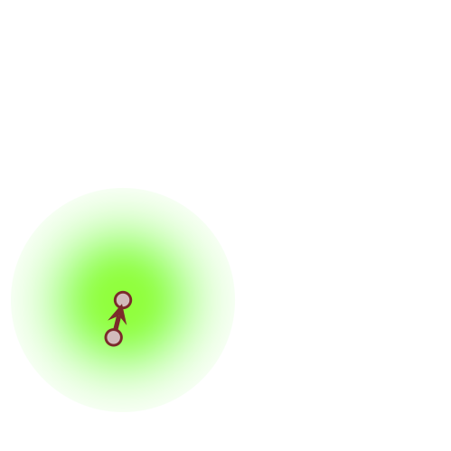
```
<br><br>
</center>

Provided that we can readily generate exact samples from the transition
distribution the implementation of these Markov transitions is straightforward
in a programming environment like `R`.  Let's consider a two-dimensional ambient
space $Q = \mathbb{R}^{2}$ with the coordinate functions
$$
\begin{alignat*}{6}
\varpi_{1} :\; &Q& &\rightarrow& \; &\mathbb{R}&
\\
&q& &\mapsto& &q^{1}&,
\end{alignat*}
$$
and
$$
\begin{alignat*}{6}
\varpi_{2} :\; &Q& &\rightarrow& \; &\mathbb{R}&
\\
&q& &\mapsto& &q^{2}&,
\end{alignat*}
$$
that project each point onto the two component axes; note that I am using
superscripts to define the components to avoid any confusion with the subscripts
that index points in an ensemble of samples.  On this space we will define a
Markov transition through a product of conditional probability density
functions,
$$
\begin{align*}
T(q_{1} \mid q_{0} )
&=
T(q^{1}_{1}, q^{2}_{1} \mid q^{1}_{0}, q^{2}_{0} )
\\
&=
T(q^{1}_{1} \mid q^{1}_{0}) \cdot
T(q^{2}_{1} \mid q^{2}_{0}).
\\
&=
\text{Normal}(q^{1}_{1} \mid q^{1}_{0}, \sigma) \cdot
\text{Normal}(q^{2}_{1} \mid q^{2}_{0}, \sigma).
\end{align*}
$$

```{r}
# When working with Markov chains we always want to set an explicit seed
# to ensure that we can reproduce any weird behavior that might arise
set.seed(295148748)

# Initial point
D <- 2

q0 <- c(0, 0)

# Some possible transitions from the initial point
n_possible <- 50

possible_transitions <- matrix(data = 0, nrow = n_possible, ncol = D)

for (c in 1:n_possible) {
  possible_transitions[c, 1] <- rnorm(1, q0[1], 1)
  possible_transitions[c, 2] <- rnorm(1, q0[2], 1)
}

c_light <- c("#DCBCBC")
c_light_highlight <- c("#C79999")
c_mid <- c("#B97C7C")
c_mid_highlight <- c("#A25050")
c_dark <- c("#8F2727")
c_dark_highlight <- c("#7C0000")

c_light_trans <- c("#DCBCBC30")
c_dark_trans <- c("#8F272730")

plot(possible_transitions[,1], possible_transitions[,2],
     main="Possible Transitions From Initial Point",
     col="green", pch=16, cex=1.2,
     xlab="q^1", xlim=c(-3, 3), ylab="q^2", ylim=c(-3, 3))

points(q0[1], q0[2], col=c_dark, pch=16, cex=1.2)
points(q0[1], q0[2], col=c_light, pch=16, cex=0.8)
```

Each sample defines possible transitions from the initial point, but we will
consider only one realized transition, $\tilde{q}_{1}$.

```{r}
q1 <- c(0, 0)
q1[1] <- rnorm(1, q0[1], 1)
q1[2] <- rnorm(1, q0[2], 1)

plot(possible_transitions[,1], possible_transitions[,2],
     main="Realized Transition From Initial Point",
     col="green", pch=16, cex=1.2,
     xlab="q^1", xlim=c(-3, 3), ylab="q^2", ylim=c(-3, 3))

points(q0[1], q0[2], col=c_dark, pch=16, cex=1.2)
points(q0[1], q0[2], col=c_light, pch=16, cex=0.8)

lines(c(q0[1], q1[1]), c(q0[2], q1[2]), col=c_dark, lwd=2)

points(c(q0[1], q1[1]), c(q0[2], q1[2]), col=c_dark, pch=16, cex=1.2)
points(c(q0[1], q1[1]), c(q0[2], q1[2]), col=c_light, pch=16, cex=0.8)
```

Once we have jumped to a new point we can define a second transition by
conditioning the Markov transition distribution on $\tilde{q}_{1}$ instead of
$q_{0}$.  Sampling from the resulting probability distribution defines another
point,
$$
\tilde{q}_{2} \sim T(q_{2} \mid \tilde{q}_{1}).
$$

```{r}
possible_transitions <- matrix(data = 0, nrow = n_possible, ncol = D)

for (c in 1:n_possible) {
  possible_transitions[c, 1] <- rnorm(1, q1[1], 1)
  possible_transitions[c, 2] <- rnorm(1, q1[2], 1)
}

plot(possible_transitions[,1], possible_transitions[,2],
     main="Possible Transitions From First Transition",
     col="green", pch=16, cex=1.2,
     xlab="q^1", xlim=c(-3, 3), ylab="q^2", ylim=c(-3, 3))

lines(c(q0[1], q1[1]), c(q0[2], q1[2]), col=c_dark, lwd=2)
points(c(q0[1], q1[1]), c(q0[2], q1[2]), col=c_dark, pch=16, cex=1.2)
points(c(q0[1], q1[1]), c(q0[2], q1[2]), col=c_light, pch=16, cex=0.8)
```

```{r}
q2 <- c(0, 0)
q2[1] <- rnorm(1, q1[1], 1)
q2[2] <- rnorm(1, q1[2], 1)

plot(possible_transitions[,1], possible_transitions[,2],
     main="Realized Transition From First Transition",
     col="green", pch=16, cex=1.2,
     xlab="q^1", xlim=c(-3, 3), ylab="q^2", ylim=c(-3, 3))

lines(c(q0[1], q1[1], q2[1]), c(q0[2], q1[2], q2[2]), col=c_dark, lwd=2)
points(c(q0[1], q1[1], q2[1]), c(q0[2], q1[2], q2[2]), col=c_dark, pch=16, cex=1.2)
points(c(q0[1], q1[1], q2[1]), c(q0[2], q1[2], q2[2]), col=c_light, pch=16, cex=0.8)
```

## Chain, Chain, Chain; Markov Chain of Fools

_Iterating_ Markov transitions,
$$
\begin{align*}
\tilde{q}_{1} &\sim T(q_{2} \mid q_{0})
\\
\tilde{q}_{2} &\sim T(q_{2} \mid \tilde{q}_{1})
\\
\tilde{q}_{3} &\sim T(q_{3} \mid \tilde{q}_{2})
\\
\ldots
\\
\tilde{q}_{N} &\sim T(q_{N} \mid \tilde{q}_{N - 1}),
\end{align*}
$$
generates a sequence of points in the ambient space that we call a
_Markov chain_.

<center>
<br>
```{r, out.width = "25%", echo=FALSE}
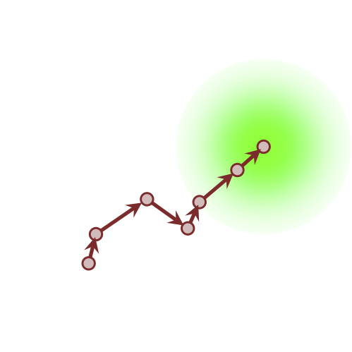
```
<br><br>
</center>

Because of this sequential sampling, each point $q_{n}$ in the sequence is
conditionally dependent on only the previous point, $q_{n - 1}$: if we fix
$q_{n - 1}$ then $q_{n}$ will be independent of all previous points.  If
$q_{n - 1}$ itself is sampled from $q_{n - 2}$, however, then $q_{n}$ will in 
general assume a correlation with $q_{n - 2}$ as well.  Because we are sampling 
all of the points after the initial one, the Markov chain will define a 
correlated ensemble of samples.

The correlations spanning a Markov chain are evident if we compare multiple
Markov chains generated from the same initial point.  The local correlations
between neighborhood points give each realized Markov chain a stiffness that
constrains the relationship between even distant points.

```{r}
# Initial point
q0.1 <- 0
q0.2 <- 0

# Let's generate ten chains, each comprised of ten transitions from the initial point
n_transitions <- 10
n_chains <- 10

plot(1, type="n", main="Markov Chain Realizations",
     xlab="q^1", xlim=c(-7, 7),
     ylab="q^2", ylim=c(-7, 7))

for (c in 1:(n_chains - 1)) {
  mcmc_samples <- matrix(data = 0, nrow = n_transitions + 1, ncol = D)
  mcmc_samples[1, 1] <- q0.1
  mcmc_samples[1, 2] <- q0.2

  for (n in 1:n_transitions) {
    mcmc_samples[n + 1, 1] <- rnorm(1, mcmc_samples[n , 1], 1)
    mcmc_samples[n + 1, 2] <- rnorm(1, mcmc_samples[n , 2], 1)
  }

  lines(mcmc_samples[,1], mcmc_samples[,2], col=c_dark_trans, lwd=2)
  points(mcmc_samples[,1], mcmc_samples[,2], col=c_dark_trans, pch=16, cex=1.2)
  points(mcmc_samples[,1], mcmc_samples[,2], col=c_light_trans, pch=16, cex=0.8)
}

# Realized chain
mcmc_samples <- matrix(data = 0, nrow = n_transitions + 1, ncol = D)
mcmc_samples[1, 1] <- q0.1
mcmc_samples[1, 2] <- q0.2

for (n in 1:n_transitions) {
  mcmc_samples[n + 1, 1] <- rnorm(1, mcmc_samples[n , 1], 1)
  mcmc_samples[n + 1, 2] <- rnorm(1, mcmc_samples[n , 2], 1)
}

lines(mcmc_samples[,1], mcmc_samples[,2], col=c_dark, lwd=2)
points(mcmc_samples[,1], mcmc_samples[,2], col=c_dark, pch=16, cex=1.2)
points(mcmc_samples[,1], mcmc_samples[,2], col=c_light, pch=16, cex=0.8)
```

## Stay on Target

Although the Markov chains realized from an arbitrary Markov transition
distribution may seem to aimlessly wander through the ambient space, they are in
fact looking for something particular.  A probability distribution that is
preserved under Markov transitions,
$$
\pi(q) = \int \mathrm{d} q' \, \pi(q') \, T(q \mid q'),
$$
is known as the _stationary_ or _invariant_ distribution of the Markov
transition distribution.  Well-behaved Markov transition distributions admit a
unique stationary distribution, and it is within the _stationary typical set_
that the Markov chains are most likely to wonder.

No matter where we are in the ambient space the typical set of each Markov
transition distribution will concentrate towards the stationary typical set.

<center>
<br>
```{r, out.width = "50%", echo=FALSE}
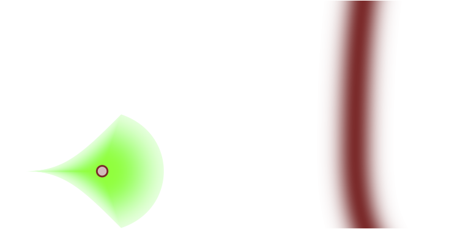
```
<br><br>
</center>

Consequently realized transitions will jump towards the typical set with
exceedingly high probability.  After jumping the circumstance repeats, with the
following transition distribution once again concentrating towards the typical
set.

<center>
<br>
```{r, out.width = "50%", echo=FALSE}

```
<br><br>
</center>

<center>
<br>
```{r, out.width = "50%", echo=FALSE}
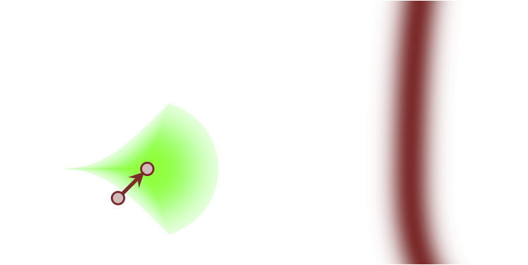
```
<br><br>
</center>

As we realize more and more Markov transitions the resulting Markov chain will
drift towards the typical set of the stationary distribution and, once it has
reached the typical set, the transitions will guide the Markov chain through it.
In other words the Markov transitions serve as a probabilistic blood hound,
sniffing around each point for subtle hints of probability and following a trail
that guides us towards the stationary typical set.  All we have to do is follow.

<center>
<br>
```{r, out.width = "75%", echo=FALSE}

```
<br><br>
</center>

As our chains grow longer they fill up the stationary typical set.  Eventually
the newest points in the Markov chain start looking suspiciously similar to an
ensemble of samples from the stationary distribution.

<center>
<br>
```{r, out.width = "75%", echo=FALSE}
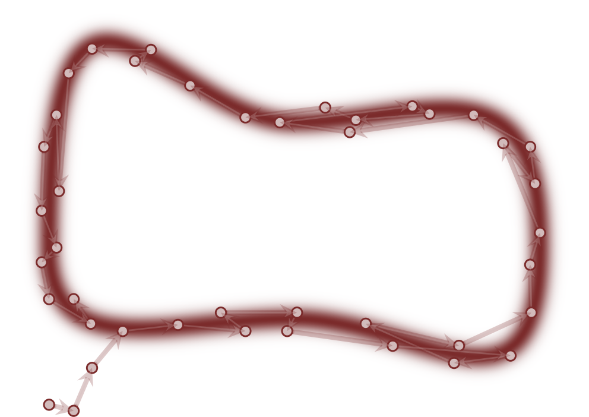
```
<br><br>
</center>

If we can engineer a Markov transition whose stationary distribution is our
target distribution then we might even be able to use those points to construct
expectation value estimators just as we did with Monte Carlo.

## Extra Credit: Distributions of Markov Chains {#sec:n_step}

In order to formalize the intuition that Markov chains explore the stationary
distribution we have to construct intermediate probability distributions that
quantify the possible transitions we could realize at each iteration of the
Markov chain.

### The N-Step Distributions

First let's consider initializing our Markov chain with a sample from some
initial probability distribution,
$$
\tilde{q}_{0} \sim \rho.
$$
We can always set this initial distribution to a Dirac distribution concentrated
at a specific point,
$$
\rho = \delta_{q_{0}},
$$
to recover the fixed initialization that we used above.

To quantify where we might be after one transition we have to convolve this
initial distribution with the Markov transition,
$$
(T \rho)[B] = \mathbb{E}_{\rho} [ T[B \mid q_{0}] ],
$$
or in terms of probability density functions,
$$
(T \rho)(q_{1}) = \int \mathrm{d} q_{0} \, T(q_{1} \mid q_{0}) \, \rho( q_{0} ).
$$
We can then quantify where we might be after two transitions by convolving this
convolution with the Markov transition _again_,
$$
(T^{2} \rho)[B] =
\mathbb{E}_{\rho} [ \mathbb{E}_{T \rho} [ T[B \mid q_{0}] \mid q_{1} ] ],
$$
or in terms of probability density functions,
$$
\begin{align*}
(T^{2} \rho)(q_{2})
&= ( T \cdot T \rho )(q_{2})
\\
&=
\int \mathrm{d} q_{1} \, T(q_{2} \mid q_{1})
\int \mathrm{d} q_{0} \, T(q_{1} \mid q_{0}) \, \rho(q_{0})
\\
&=
\int \mathrm{d} q_{1} \, \mathrm{d} q_{0} \,
T(q_{2} \mid q_{1}) \, T(q_{1} \mid q_{0}) \, \rho(q_{0}).
\end{align*}
$$

Iterating this convolution along with each transition we construct the
_$N$-step distributions_,
$$
(T^{N} \rho)(q_{N})
=
( T \cdot T^{N - 1} \rho ) (q_{N})
=
( \underbrace{T \cdot \ldots \cdot T}_{N\mathrm{ times}} \rho ) (q_{N})
$$
which quantify the possible points our Markov chain could reach after $N$
transitions.

Equivalently the initial distribution and the Markov transition distribution
can be used to construct a probability distribution over the product space,
$Q^{N}$, whose $n$th component captures the state of the Markov chain after
$n$ transitions.  From this perspective the $n$-step distributions are just
the pushforward of the product distribution along the $n$th component projection
function.

We can formalize the concept of Markov chain convergence as the convergence of
the $N$-step distributions themselves.  In particular we can ask to what
probability distribution, $\omega$, the $N$-step distributions converge,
$$
\lim_{N \rightarrow \infty} T^{N} \rho = \omega.
$$
Equivalently, we can consider the convergence of probability density function
representations of the $N$-step distributions.

<center>
<br>
```{r, out.width = "75%", echo=FALSE}
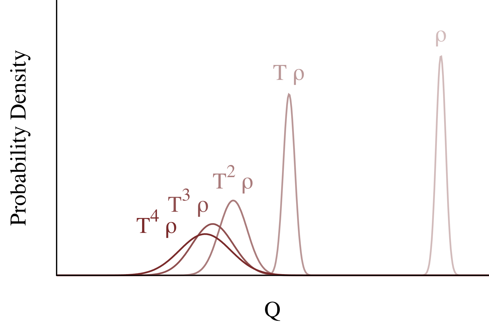
```
<br><br>
</center>

The $N$-step distribution won't always have a well-defined limit, but if a limit
exists then it has to be the stationary distribution,
$$
\lim_{N \rightarrow \infty} T^{N} \rho = \pi,
$$
defined by
$$
T \pi = \pi.
$$

The technical conditions under which a limit exists, and the $N$-step
distribution converges to the stationary distribution are subtle.  A critical
aspect of developing new Markov chain Monte Carlo implementations is being able
derive those conditions and how they might be obstructed in practice.

### Convergence of N-Step Distributions {#sec:n_step_convergence}

A well-defined limiting distribution is necessary for well-behaved Markov
chains, but the practical utility of a given Markov transition really depends on
how quickly the $N$-step distributions converge to that limiting distribution.

In order to quantify how the $N$-step distributions converge we need some notion
of distance between probability distributions in order to compare them to the
limiting stationary distribution as a function of the number of iterations, $N$.
Given a distance function $\vert\vert \cdot \vert\vert$ we say that the $N$-step
distributions converge towards a limiting probability distribution if we can
always find a sufficiently large $N$ such that the distance between the all of
the subsequent $N$-step distributions is smaller than any given value.  More
formally, for any arbitrarily small distance $\epsilon \in \mathbb{R}^{+}$ there
has to be some finite integer that can possibly depend on the initial
distribution, $N(\rho)$, such that
$$
\vert\vert T^{n} \rho - \pi \vert \vert \le \epsilon
$$
for all $n > N(\rho)$.

In practice we aim for a more constructive result by bounding these distances
with a monotonically decreasing function of $N$,
$$
\vert\vert T^{N} \rho - \pi \vert \vert \le f(\rho, N),
$$
which implies the formal definition of convergence but allows us to quantify
the _rate_ of convergence using the form of the bound, $f(\rho, N)$.

One of the most common definitions of distance between probability distributions
is the _total variation distance_.  There are multiple equivalent definitions
of the total variation distance, each with their own intuitions, but my favorite
is as the largest difference of probabilities allocated across the ambient
$\sigma$-algebra,
$$
\vert\vert \rho - \pi \vert\vert_{\mathrm{TV}}
=
\mathrm{sup}_{B \in \mathcal{Q}} \left| \rho[B] - \pi[B] \right|.
$$
Here $\mathrm{sup}$ refers to the _supremum_, which is just a very pedantic
upper bound.

If the decay of the total variation distance is bounded above by a polynomial
in $N$,
$$
\vert\vert T^{N} \rho - \pi \vert \vert_{\mathrm{TV}}
\le C(\rho) (N + 1)^{-\beta},
$$
then we say that the Markov transition has _polynomial ergodicity_.  Polynomial
ergodicity is a relatively weak condition due to the slow decay of the bound,
but it some circumstances it is enough to ensure well-behaved Markov chains.

When the decay of the total variation distance is bounded above by a geometric
series in $N$,
$$
\vert\vert T^{N} \rho - \pi \vert \vert_{\mathrm{TV}}
\le C(\rho) r^{N},
$$
for some $r < 1$, we say that the Markov transition has
_geometric ergodicity_.  These geometric series decay exponentially fast with
the number of iterations which places a much stronger constraint on the
convergence of the $N$-step distributions.

Stronger still is _uniform ergodicity_ where the constant in the geometric bound
does not depend on the initial distribution,
$$
\vert\vert T^{N} \rho - \pi \vert \vert_{\mathrm{TV}}
\le C r^{N}.
$$
Uniform ergodicity guarantees rapid convergence no matter where we initialize
our Markov chains, but results this strong are typically limited to ambient
spaces with finite boundaries.

Sufficiently strong ergodicity bounds ensure that as $N$ increases the $N$-step
distributions become more and more similar to each other and the stationary
distribution.  This increasing uniformity prevents transient behaviors that
might hinder the effective exploration of Markov chains after only a finite
number of iterations.

### Spectral Theory

Another way to analyze the convergence of the $N$-step distributions is through
the Markov transtition itself.  To motivate this approach let's consider a
discrete space with only $I$ elements where we can analyze the Markov transition
using linear algebra.  In this case a conditional probability distribution like
a Markov transition distribution can be represented with a square matrix whose
columns sum to one.  Similarly probability distributions can be represented with
vectors whose elements sum to one.

The Markov transition matrix admits the $I$ eigenvalues,
$\left\{\lambda_{1}, \ldots, \lambda_{I} \right\}$, and the $I$ eigenvectors,
$\left\{\pi_{1}, \ldots, \pi_{I} \right\}$ that satisfy
$$
T \, v_{i} = \lambda_{i} \, v_{i}.
$$
The collection of eigenvalues is also known as the _eigenspectrum_ of the
Markov transition.

Because of the summation constraint across the columns the magnitude of the
eigenvalues are bounded by one,
$$
-1 \le \lambda_{i} \le 1,
$$
with at least one of the eigenvalues saturating the upper bound.  Without loss
of generality let's define our labels such that the smallest indices correspond
to the eigenvalues with the largest magnitudes,
$$
| \lambda_{1} | \ge
| \lambda_{2} | \ge \ldots \ge
| \lambda_{I - 1} | \ge
| \lambda_{I} |.
$$

Let's now make the assumption that our Markov transition matrix is not
degenerate so that all of the eigenvalues are distinct and the eigenvectors
form a complete basis for our ambient space.  In this case one and only one
eigenvalue saturates the upper bound,
$$
\lambda_{1} = 1, \, \lambda_{i \ne 1} < 1,
$$
and the corresponding eigenvector $\pi_{1}$ specifies the unique stationary
distribution of the transition,
$$
T \, \pi_{1} = \lambda_{1} \, \pi_{1} = \pi_{1}.
$$

If we expand an initial distribution in the eigenvectors of the Markov
transition matrix,
$$
\rho = \sum_{i = 1}^{I} \alpha_{i} \, v_{i}
$$
then the $1$-step distribution is given by a single matrix multiplication,
$$
\begin{align*}
T \rho
&= T \cdot \sum_{i = 1}^{I} \alpha_{i} \, v_{i}
\\
&= \sum_{i = 1}^{I} \alpha_{i} \, T v_{i}
\\
&= \sum_{i = 1}^{I} \alpha_{i} \, \lambda_{i} \, v_{i},
\end{align*}
$$
and the $N$-step distribution is given by $N$ matrix multiplications,
$$
T^{N} \rho
= \sum_{i = 1}^{I} \alpha_{i} \, \lambda_{i}^{N} \, v_{i}.
$$

At this point let's separate out the stationary distribution from the other
eigenvectors,
$$
\begin{align*}
T^{N} \rho
&= \sum_{i = 1}^{I} \alpha_{i} \, \lambda_{i}^{N} \, v_{i}
\\
&= \alpha_{1} \, \lambda_{1} \, v_{1}
+ \sum_{i = 2}^{I} \alpha_{i} \, \lambda_{i}^{N} \, v_{i}
\\
&= \alpha_{1} \, v_{1}
+ \sum_{i = 2}^{I} \alpha_{i} \, \lambda_{i}^{N} \, v_{i}.
\end{align*}
$$
Because the magnitude of all of the eigenvalues in the second term are smaller
than one, the powers $\lambda_{i}^{N}$ quickly vanish and suppress the parts of
the initial distribution that aren't aligned with the stationary distribution.
So long as the initial distribution has some overlap with the stationary
distribution,
$$
\alpha_{1} > 0,
$$
the $N$-step distributions will converge to the stationary distribution
exponentially fast with a rate proportional to the _absolute spectral gap_,
$$
\delta = \lambda_{1} - | \lambda_{2} | = 1 - | \lambda_{2} |.
$$

With a significant amount of careful mathematical machinery these ideas can be
generalized from finite spaces to the infinite spaces with which we typically
with in practice.  The resulting _spectral theory_ treats a Markov transition as
an operator that consumes the $(N - 1)$-step distribution and returns the
$N$-step distribution, working out the infinte-dimensional eigenspectra and
absolute spectral gaps of these operators.  These then provide the foundation
for formal methods of studying how the $N$-step distributions converge.

# Markov Chain Monte Carlo Estimators

As we apply our tailored Markov transition to an initial point we generate a
Markov chain that finds and then explores the typical set of the stationary
distribution.  If the Markov chain is long enough then these points might
provide a sufficiently thorough quantification of the stationary typical set to
serve as the basis for an accurate stochastic estimator, just as exact samples
provide the basis for Monte Carlo estimators.

The reality is, unfortunately, complicated.  While we can construct Markov
chain Monte Carlo estimators in this way, they will converge to the exact
expectation values only under certain conditions.  Even then that convergence
often leaves much to be desired.

## Infinite-Iteration Convergence

Given a Markov chain with points $\{\tilde{q}_{0}, \ldots, \tilde{q}_{N} \}$
we can construct a _Markov chain Monte Carlo estimator_ in the same way that we
construct a Monte Carlo estimator,
$$
\hat{f}^{\text{MCMC}}_{N}
=
\frac{1}{N + 1} \sum_{n = 0}^{N} f(\tilde{q}_{n}).
$$
The question is then how the pushforward distribution of these estimators
behaves as the chains grow to be infinitely long.  In particular, are they
at least asymptotically consistent,
$$
\lim_{N \rightarrow \infty} \pi_{f^{\text{MCMC}}_{N}}
= \delta_{\mathbb{E}_{\pi}[f]}?
$$

Unlike Monte Carlo estimators, the consistency of Markov chain Monte Carlo
estimators is not universal.  There are a few circumstances that can block a
Markov chain from exploring the entirety of the stationary distribution and
recovering asymptotically consistent estimators.  To ensure good limiting
behavior we need to avoid two particular behaviors.

A Markov transition is _reducible_ if Markov chains initialized within some
neighborhood are not able to escape that neighborhood and hence do not have the
opportunity to explore the entirety of the ambient space.  In this case the
ambient space might decompose into a number of partitions, with Markov chains
restricted to the partition in which they're initialized; the resulting chains
are able to explore the extent of their initial partition, but they're not able
to explore any of the other partitions.  For example consider a Markov
transition over the real numbers that jumps only to points of the same sign -- a
Markov chain initialized at a positive number will only ever be able to jump to
other positive numbers, completely ignoring all of the negative numbers.

To ensure that Markov chains can explore anywhere in the ambient space as needed
we have to engineer a Markov transition that is _irreducible_ and will be able
to jump into any sufficiently nice neighborhood with non-zero probability after
only a finite number of transitions.  One common way to ensure irreducibility is
to specify a Markov transition with transition density functions that are
nonzero across the entire ambient space.

Irreducibility ensures that Markov chains have the opportunity to explore any
nice neighborhood in the ambient space at least once, but it offers no assurance
that Markov chains will be able to explore those neighborhoods _repeatedly_.
A _periodic_ Markov transition is susceptible to _cycles_, neighborhoods that
trap Markov chains and prevent them from exploring any other points afterwards.
Even if a Markov chain is irreducible and has a chance to reach anywhere in 
ambient space from the initialization, it can be absorbed in one of these cycles 
and suffer from insufficient exploration ever after.

A Markov transition is _aperiodic_ if it is not vulnerable to any cycles.  The
typical way to avoid cycles in practice is to ensure that a Markov transition
always assigns a nonzero probability to staying at the initial point.

Together irreducibility and aperiodicity of a Markov transition ensure that
realized Markov chains are _recurrent_.  Recurrent Markov chains from most
initializaitons will explore any neighborhood of the ambient space not just a
finite number of times but a _countably infinite number of times_ as the chains
are run infinitely long.  Consequently these Markov chains will be able to find
the typical set and then quantify it with increasingly refined resolution.  This
guarantees that the Markov chain Monte Carlo estimator for any integrable
function will be asymptotically consistent,
$$
\lim_{N \rightarrow \infty} \pi_{f^{\text{MCMC}}_{N}} = \delta_{\mathbb{E}_{\pi}[f]}
$$
for all but a finite number of initializations.  In order to generalize this 
result to include _all_ initial points we have to improve the recurrence implied 
by irreducibility and aperiodicity to a technical condition called 
_Harris recurrence_.

While these technical conditions might seem esoteric and irrelevant to the
_practice_ of Markov chain Monte Carlo estimation, they are in fact absolutely
critical to its robust use.  We can always evaluate Markov chain Monte Carlo
estimators from a given Markov chain, but those estimates will not have _any_
relation to the exact expectation values unless these conditions are met.  Only
by carefully validating these conditions can we have any confidence that the
estimators might provide useful information about the expectation values of
interest.

As a consumer of Markov chain Monte Carlo this means that one should use Markov
transitions designed by a trusted source with the expertise to verify these
conditions. At the same time those interested in designing their own Markov
transitions should invest the time to understand these conditions enough to be
able to verify them.

## Finite-Iteration Convergence

The asymptotic consistency of Markov chain Monte Carlo estimators is not
guaranteed, but it in practice it will hold for most well-behaved Markov
transitions.  Exactly how useful, however, is that asymptotic consistency?

Asymptotic consistency is relevant only in the limit of infinitely long Markov
chains.  Unfortunately infinity is _really_ big.  No, bigger than that.  Keep
going.  On and on, forever.  With finite computation we will always be bound to
finite Markov chains and never reach that asymptotic limit where the estimators
converge to the exact expectation values.  Asymptotic convergence is a
probabilistic happily ever after, and unfortunately just as much of a fairy
tale.

Consequently what is more relevant for the practical utility of Markov chain
Monte Carlo is not the behavior of Markov chain Monte Carlo estimators after an
infinite number of iterations but rather their behavior after only a
_finite number_ of iterations.  In other words the limiting behavior isn't as
important as _how_ the estimators converge.  While asymptotic consistency is
typically required for good finite-iteration behavior, it is nowhere near
_sufficient_.  Estimators that converge asymptotically can exhibit atrocious
behavior for any finite number of iterations.

The finite-iteration behavior of a Markov chain Monte Carlo estimators depends
on the intimate details of the Markov transition.  Ensuring good
finite-iteration behavior is made all the more challenging by how subtly
pathologies often manifest, and hence how difficult it can be to identify them
empirically.  To demonstrate the intricacies of finite-iteration behavior let's
consider how Markov chain Monte Carlo estimators behave under ideal, and not so
ideal, circumstances.  Those interested in a more formal perspective can
continue all the way through [Section 3.2.3](#sec:estimator_convergence) where
we will more formally define the convergence of Markov chain Monte Carlo
estimators.

### Ideal Circumstances

Under ideal circumstances Markov chains will quickly find and then explore the
typical set of the target distribution with progressively finer resolution.
This evolution proceeds in three distinct phases that we can demonstrate using
our cartoon of a high-dimensional typical set.

On the left we have the cartoon of the stationary typical set and on the right
we will see how the absolute error of a Markov chain Monte Carlo estimator
evolves with the growing Markov chain.

<center>
<br>
```{r, out.width = "75%", echo=FALSE}
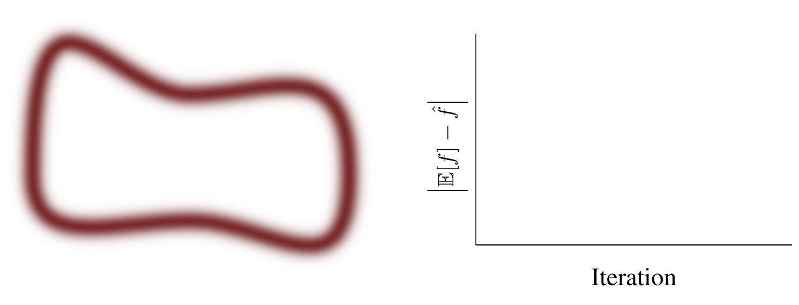
```
<br><br>
</center>

Our initial point, whether fixed or drawn from some auxiliary probability
distribution, will fall outside of the typical set unless that auxiliary
probability distribution happens to be the stationary distribution itself.
Consequently the first responsibly of the Markov chain is to locate the typical
set.  The Markov transition distributions outside of the typical set will be
heavily skewed towards the typical set and any realized Markov chains will
evolve almost as if they were attracted to all of that probability mass.

Because it takes time to reach the typical set, the beginning of the Markov
chain will poorly inform Markov chain Monte Carlo estimators.  Estimators
constructed entirely from these early iterations will exhibit significant bias.

<center>
<br>
```{r, out.width = "75%", echo=FALSE}
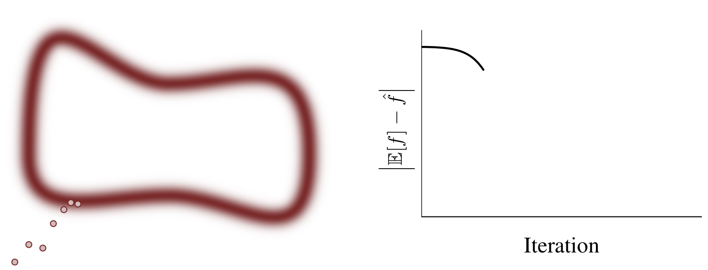
```
<br><br>
</center>

Once it finds the typical set and has tasted the sweet nectar of concentrating
probability, the Markov chain will begin to explore the neighborhoods of high
probability mass with an initial _sojourn_ or _tour_.  The points accumulated in
this second phase very quickly resolve the gross structure of the stationary
distribution, overwhelming the initial bias and rapidly improving the overall
accuracy of Markov chain Monte Carlo estimators.  This threshold behavior of
estimators is a classic indicator that we've settled into the stationary typical
set.

<center>
<br>
```{r, out.width = "75%", echo=FALSE}

```
<br><br>
</center>

After that initial settling the Markov chain continues to refine its
quantification of the stationary typical set.  As it continues to explore it
captures finer and finer details, and the corresponding Markov chain Monte Carlo
estimators fall into a gradual but consistent convergence.

<center>
<br>
```{r, out.width = "75%", echo=FALSE}
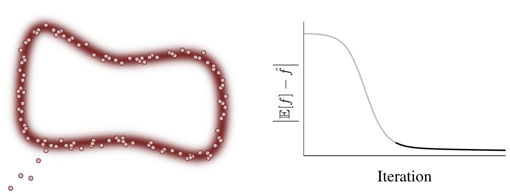
```
<br><br>
</center>

As we will see in [Section 4](#sec:mcmc_clt), under these so far ill-defined
"ideal" circumstances the convergence of the estimators in this final phase
will reproduce the square root convergence of Monte Carlo estimators, allowing
us to quantity the estimator error and its scaling with iteration.

Ultimately this ideal behavior is characterized by an initial _transient_ phase
where the Markov chain realizations find and then settle into the stationary
typical set followed by an _equilibrium_ phase where the Markov chains steadily
survey that typical set to inform increasingly precise Markov chain Monte Carlo
estimators.  The consistency of the exploration in the equilibrium phase is what
distinguishes it from the transient phase -- once a Markov chain has
equilibrated it loses any residue of where it started.  At the same time any
finite subsequence will behave identically to any other.  This inability to tell
where we are in the Markov chain is also known as _stationarity_.

### Adverse Circumstances

Now that we've laid out the qualitative convergence behavior of Markov chain
Monte Carlo estimators under ideal circumstances let's consider what happens
under less ideal, dare I say _typical_, circumstances.  These adverse
circumstances should manifest in transient behavior that persists throughout the
entire Markov chain, indicating that an equilibrium doesn't exist or we are yet
to reach it.

There are countless deviations from ideal circumstances, but here we will 
consider only two: _suspensions_ and _metastabilities_.  In order to know when
not to trust Markov chain Monte Carlo estimators, and use Markov chain Monte
Carlo responsibly, we need to be able to identify the signs of these deviations
empirically so that we know when to not trust the accuracy of the resulting 
Markov chain Monte Carlo estimators.

#### Suspended Animation

Let's consider a stationary distribution which exhibits a _pinch_ at the bottom
of its typical set.

<center>
<br>
```{r, out.width = "50%", echo=FALSE}

```
<br><br>
</center>

Away from this pinch the shape of the stationary typical set is relatively
uniform, but in the neighborhood of the pinch the geometry starts to change
rapidly.  This strong curvature frustrates the exploration of Markov chains and
corrupts the corresponding Markov chain Monte Carlo estimators.

We can demonstrate this corruption using a similar setup as before.  On the
left we'll observe the evolution of a Markov chain through the stationary
typical set and on the right we'll observe the the evolution of a Markov chain
Monte Carlo estimator of the expectation value of the vertical coordinate
function, $\varpi_{v}$.  Note that, in contrast to the previous demonstration,
here we will look at the signed error instead of the absolute error.  In between
these two we will add a new figure -- the _trace plot_ of the vertical
coordinate that shows how that coordinate evolves along with the Markov chain.

<center>
<br>
```{r, out.width = "100%", echo=FALSE}
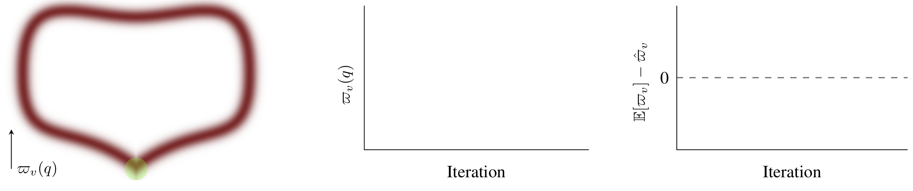
```
<br><br>
</center>

Let's presume that our Markov chain has already found the typical set so that it
just needs to explore.  When exploring away from the pinch the Markov chain will
have no problem evolving through the smooth geometry.  The trace plot exhibits
the incremental exploration and the estimator error appears to converge towards
an equilibrium value, albeit one biased above the exact value.

<center>
<br>
```{r, out.width = "100%", echo=FALSE}
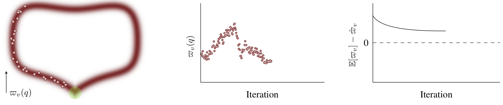
```
<br><br>
</center>

The Markov chain, however, can't enjoy that smooth geometry forever.  Eventually
it will have to confront the pinch, and that's where our troubles begin.

Most Markov transitions feature a length scale that characterizes how far the
realized transitions jump on average.  When that length scale is too large the
Markov transition won't be able to resolve the structure of the pinch.  Most of
the time the realized Markov chains will wander right past the pinch, ignoring
it entirely and generating only incomplete exploration of the typical set.
Incomplete exploration makes biased Markov chain Monte Carlo estimators and, if
not resolved, that bias will obstruct asymptotic consistency.  The Markov
chains, however, prove to be rather stubborn in their quest for consistency.

When a Markov chain gets close to the pinch there is a very small probability
that the blunt transitions will jump deeper into the pinch rather than passing
by it.  After passing by it enough times it will eventually take a detour into
the pinch and once there the Markov chain will become entangled by the strong
curvature and freeze, no longer able to continue on its way.  The _suspended_
Markov chain drags the Markov chain Monte Carlo estimator with it, inducing a
crude correction to the initial positive bias!  This correction, however,
quickly overcompensates and forces a negative bias in the estimator.

<center>
<br>
```{r, out.width = "100%", echo=FALSE}
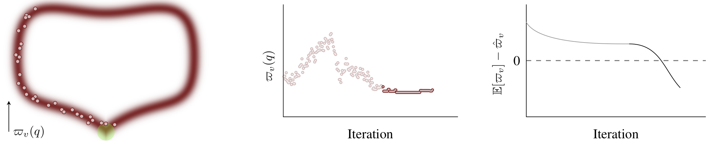
```
<br><br>
</center>

Eventually transitions will jump back out of the pinch, allowing the Markov
chain to escape and explore the less frustrating regions of the typical set
once again.  As it explores away from the pinch the estimators are pulled back
up resulting in another positive, although slightly smaller, bias.

<center>
<br>
```{r, out.width = "100%", echo=FALSE}
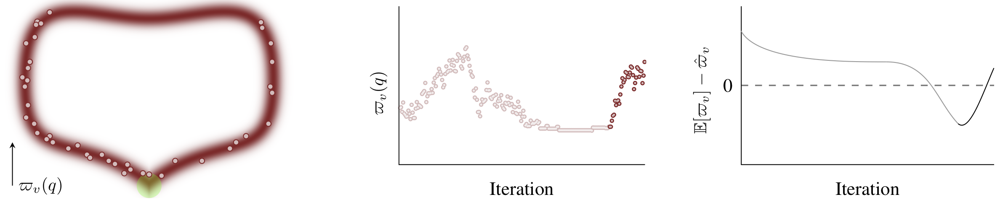
```
<br><br>
</center>

In other words this Markov chain Monte Carlo estimator converges to the exact
expectation value only awkwardly.  Most of the time the estimator exhibits a
positive bias, and occasionally it exhibits a larger negative bias.  Only when
the Markov chain is run infinitely long will these biases cancel to give the
exact value.

These transient suspensions indicate that we lack the equilibrium needed for
Markov chain Monte Carlo estimators that are well-behaved after only a finite
number of iterations.  If we can empirically differentiate the behavior of
Markov chains near and far from the pinch then we might be able to identify the
lack of equilibrium, and poor behavior of the resulting estimators, using the
history of the Markov chain itself.

#### Metastable

Even if an equilibrium does exist, however, there is no guarantee that we'll be
able to run long enough to reach it. Typically Markov chains equilibrate
relatively quickly, but stationary distributions that exhibit _metastabilities_
prove to be far less accommodating.

Metastabilities occur when a stationary distribution exhibits multiple
neighborhoods of high probability surrounded in all directions by neighborhoods
of low probability.  Because Markov chains are attracted to probability mass
they avoid these moats of low probability that separate the metastabilities and
instead focus their attention on the closest metastability.  Eventually realized
Markov chains will brave these low probability valleys and jump from one
metastability to another in order to explore the entire stationary distribution,
but in practice we might exhaust our computational resources long before that
happens.

Probability distributions that exhibit metastabilities are also known as
_multimodal_ distributions, with each metastability corresponding to a
particular mode of the representative probability density function.  Here I will
use the metastability nomenclature to focus on the structure of the probability
distribution and not any particular probability density function representation.

To demonstrate the typical behavior of Markov chains in the presence of
metastabilities let's consider a similar setup as before.  On the left we have
the stationary typical set, in this case exhibiting disconnected surfaces
corresponding to each of the two metastabilities.  In the middle we'll look at
the trace plot of the vertical coordinate function, and on the right the
expectation value of that vertical coordinate function.

<center>
<br>
```{r, out.width = "100%", echo=FALSE}
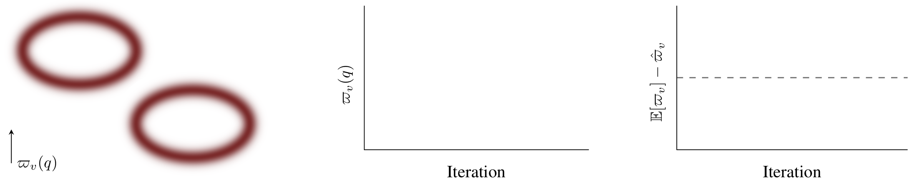
```
<br><br>
</center>

Initially a realized Markov chain will be attracted to one of the
metastabilities, exploring it as if it were the entirety of the typical set.
The exploration and the corresponding Markov chain Monte Carlo estimators all
behave as if the Markov chain has reached a comfortable equilibrium.

<center>
<br>
```{r, out.width = "100%", echo=FALSE}
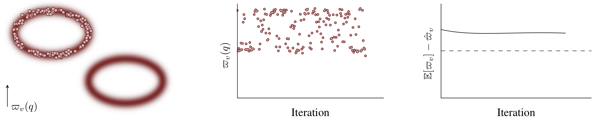
```
<br><br>
</center>

Unfortunately this is only a _local_ equilibrium as it ignores the other
metastability.  If we wait long enough the Markov chain will overcome the allure
of that local equilibrium and venture over to the other metastability.  It is
only at this time that we have any indication that our initial exploration was
incomplete.

<center>
<br>
```{r, out.width = "100%", echo=FALSE}
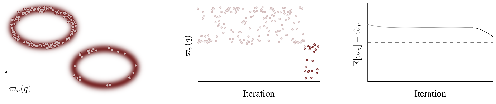
```
<br><br>
</center>

When exploring a stationary distribution with metastabilities the proper
equilibrium is defined not by the exploration _within_ a single metastability
but rather the exploration _between_ metastabilities.  The initial exploration
of just one metastability is just transient behavior masquerading as equilibrium
behavior.  Local equilibria mimicking the full equilibrium makes metastability
particularly hard to identify in practice.

While the full equilibrium might be reached after a finite number of iterations,
that number might be far too large for Markov chain Monte Carlo to be feasible
in practice.

## Extra Credit: Theoretical Convergence {#sec:estimator-convergence}

In [Section 2.4.2](#sec:n_step_convergence) we used the total variation distance
to quantify the convergence of the $N$-step distributions towards the stationary
distribution.  We can also use the total variation distance, and distances like
it, to quantify the convergence of expectation values with respect to the
$N$-step distributions and, eventually, the convergence of Markov chain Monte
Carlo estimators.

The total variation distance can be defined in terms of differences in
probability allocations but it can also be defined in terms of the differences
of certain expectation values.  In particular let $\mathcal{F}$ be the space of
continuous functions with outputs in bounded interval $[-1, 1]$,
$$
-1 \le f(q) \le 1, \, \forall q \in Q.
$$
We can write the total variation distance in terms of the supremum of 
differences of expectation values over this space,
$$
\vert\vert \pi_{1} - \pi_{2} \vert \vert_{\mathrm{TV}}
= \frac{1}{2} \mathrm{sup}_{f \in \mathcal{F}}
\left| \mathbb{E}_{\pi_{1}}[f] - \mathbb{E}_{\pi_{2}}[f] \right|.
$$

Consequently geometric ergodicity of the $N$-step distributions
$$
\vert\vert T^{N} \rho - \pi \vert \vert_{\mathrm{TV}}
\le C(\rho) r^{N},
$$
implies that the $N$-step expectation value of functions in $\mathcal{F}$ also 
converge geometrically to the stationary expectation values,
$$
\left| \mathbb{E}_{\pi_{1}}[f] - \mathbb{E}_{\pi_{2}}[f] \right|
\le 2 \, C(\rho) \, r^{N},
\, \forall f \in \mathcal{F}.
$$

This then allows us to quantify the finite-iteration error of Markov chain Monte
Carlo estimators corresponding to functions in $\mathcal{F}$.  For example the 
bias of one of these estimators is given by
$$
\begin{align*}
\left|
\mathbb{E} \left[ \hat{f}_{N}^{\text{MCMC}} \right]
- \mathbb{E}_{\pi}[f]
\right|
&=
\left|
\Big( \frac{1}{N + 1} \sum_{n = 0}^{N} \mathbb{E}_{T^{n} \rho}[f] \Big)
- \mathbb{E}_{\pi}[f]
\right|
\\
&=
\left|
\frac{1}{N + 1} \sum_{n = 0}^{N} \mathbb{E}_{T^{n} \rho}[f]
- \frac{1}{N + 1} \sum_{n = 0}^{N} \mathbb{E}_{\pi}[f]
\right|
\\
&=
\frac{1}{N + 1} \left|
\sum_{n = 0}^{N} \Big(
\mathbb{E}_{T^{n} \rho}[f] - \mathbb{E}_{\pi}[f] \Big)
\right|
\\
&\le
\frac{1}{N + 1} \sum_{n = 0}^{N} \Big|
\mathbb{E}_{T^{n} \rho}[f] - \mathbb{E}_{\pi}[f]
\Big|
\\
&\le
\frac{1}{N + 1} \sum_{n = 0}^{N} C(\rho) \, r^{N}
\\
&\le
\frac{ C(\rho) }{N + 1} \sum_{n = 0}^{N} \, r^{N}
\\
&\le
\frac{ C(\rho) }{N + 1} \frac{ 1 - r^{N + 1} }{1 - r}.
\end{align*}
$$
Because $r < 1$, the bias will monotonically decay at a geometric rate if our
Markov transition is geometrically ergodic.

Results like this, however, are limited to only the functions in $\mathcal{F}$.
Unfortunately this space of bounded functions isn't expressive enough to capture
the functions whose expectation values are of interest in typical applications.
Consequently Markov chain Monte Carlo estimator convergence based on total 
variation bounds can have limited practical utility.

To do better we have to consider more general _integral probability metrics_
that bound the difference in expectation values over larger classes of
functions [@Muller:1997].  A general integral probability metric is defined by a
_generating class_ of real-valued functions, $\mathcal{F}$, and the 
corresponding distance
$$
\vert\vert \pi_{1} - \pi_{2} \vert \vert_{\mathrm{IPM}(\mathcal{F})}
= C \, \mathrm{sup}_{f \in \mathcal{F}}
\left| \mathbb{E}_{\pi_{1}}[f] - \mathbb{E}_{\pi_{2}}[f] \right|,
$$
for some constant $C$.  

For example if we can establish a _drift function_, $V$, that quantifies how
strongly a Markov transition contracts then we can extend the total variation
integral probability metric to a _$V$-norm_ integral probability metric whose
generating class spans all of the functions bounded by $V$ [@RobertsEtAl:1997b],
$$
-V(q) \le f(q) \le V(q), \, \forall q \in Q.
$$
The stronger the contraction of a Markov transition the larger the drift 
function we can establish and the larger the generating class will be, and the
more useful $V$-norm integral probability metric bounds will be.

In the statistical literature the _Wasserstein-$2$ distance_, defined by a
generating class of all square integrable functions with respect to a given
measure, and the _Wasserstein-$1$ distance_, defined by a generating class of
all integrable functions with respect to a given measure, are becoming
increasingly common.

Because they completely quantify the behavior of Markov chain Monte Carlo
estimators after only a finite number of iterations, explicit bounds on the
convergence of the $N$-step distributions to the stationary distribution with
respect to a sufficiently rich integral probability metric are prized by
theoretical statisticians.  Unfortunately the practical utility of these bounds
is often less satisfying.

Bounds that have been worked out in the literature, for example, are often
limited to small generating classes that don't capture the expectation values
of practical interest.  Moreover the bounds often apply to only simple Markov
transition distributions that have little to do with the sophisticated Markov
transition distributions of applied interest.  For instance Wasserstein-$2$ and
Wasserstein-$1$ bounds are typically limited to Markov transition distributions
whose stationary distributions are specified with strongly log concave
probability density functions that are rare outside of the exponential family.
Finally the bounds themselves are often too loose to ofter any practical
constraint on convergence [@QinEtAl:2020].

Some integral probability bounds, however, have other, more practical uses than
directly constraining convergence.  In particular while geometric ergodicity in
the total variation distance is often weak as a direct constraint, it implies
that Markov chain Monte Carlo estimators of the expectation values of
well-behaved functions satisfy a central limit theorem.  In other words the
practical utility of establishing geometric ergodicity is not so much an
explicit bound but rather a verification that we can probabilistically quantify
the convergence of Markov chain Monte Carlo estimators just as we did for Monte
Carlo estimators.

# The Markov Chain Monte Carlo Central Limit Theorem {#sec:mcmc_clt}

Monte Carlo methods are so exceptionally useful because Monte Carlo estimators
satisfy a central limit theorem that allows us to quantify their errors.  We
have already qualitatively seen that Markov chain Monte Carlo estimators can be
much more fragile than Monte Carlo estimators, but every now and then they can 
useful, too.  In particular under sufficiently ideal circumstances Markov chain
Monte Carlo estimators satisfy their own central limit theorem.  The conditions
for that _Markov chain Monte Carlo central limit theorem_, however, are 
significantly more complex.

Let's consider a square integrable function, $f : Q \rightarrow \mathbb{R}$, and
assume that our Markov transition distribution enjoys a central limit theorem.
In this case the probability distribution of realized Markov chain Monte Carlo
estimators from sufficiently long Markov chains is approximately specified by
a Gaussian probability density function,
$$
\hat{f}^{\text{MCMC}}_{N} \sim \text{normal}( \mathbb{E} [f], \text{MCMC-SE}[f] ),
$$
where the _Markov chain Monte Carlo standard error_ is defined as
$$
\begin{align*}
\text{MCMC-SE}[f]
&= \sqrt{ \frac{ \text{Var} [f] }{ \text{ESS}[f] } }
\\
&= \sqrt{ \frac{ \text{Var} [f] }{ \lambda[f] \cdot N} }.
\end{align*}
$$
The mysterious term $\text{ESS}[f] = \lambda[f] \cdot N$ is called the
_effective sample size_.

Just as with Monte Carlo the existence of a central limit theorem allows us to
quantify the error of Markov chain Monte Carlo estimators, and even control the
errors by adjusting the length of a given Markov chain.  This principled
understanding of the estimator error elevates the method into the realm of
robust probabilistic computation.

In this section we will carefully inspect each element of the Markov chain
Monte Carlo central limit theorem in theory, and how it can be implemented in
practice.  We will begin by discussing the need for sufficiently long chains
before examining the intimate details of the effective sample size.  Finally
we will take a more practical perspective and consider how we can approximate
each of the terms in the central limit theorem and then attempt to verify its
existence in the first place.

## Forgetting From Where You Come

One of the more subtle aspects of Markov chains is that they never quite forget
from where they came.  Unless they're seeded with an exact sample from the
stationary distribution every Markov chain will contain some residual influence
from points outside of the stationary typical set.  With each iteration the 
newest point in a Markov chain looks more like an exact sample from the 
stationary distribution, but after only a finite number of iterations the points 
will always have some memory of from where they came.

When we construct Markov chain Monte Carlo estimators we average over the
_entire_ Markov chain, including not only the newest points but also the older
points that are more strongly influenced by the initialization.  Even under
ideal circumstances this results in a small bias in Markov chain Monte Carlo
estimators that decays linearly with the number of iterations.  For an
derivation of this bias see [Section 3.3](#sec:estimator-convergence).

For sufficiently long chains this bias is negligible, but for small chains it
cannot be ignored.  One of the most important consequences of this bias is when
trying to construct Markov chain Monte Carlo estimators from many _parallel_
Markov chains.  Averaging over many chains with the same initialization might
reduce the variance of the estimators but it can't reduce the bias.  If all of
the chains are short then this bias will persist and dominate the error of the
pooled estimator.

In order for a Markov chain Monte Carlo central limit theorem to be a reasonable
approximation we need to run our Markov chains long enough for the memories of
the initialization, and the residual bias in Markov chain Monte Carlo estimators,
to become negligible.  This forgetfulness starts to formalize the concept of
equilibrium that we introduced in the previous section; the transient phase is
characterized by a significant influence from the initialization where as
equilibrium is characterized by a vanishing influence.  While the influence
never exactly disappears, under ideal circumstances there is threshold where the
influence suddenly plummets that we can use to separate the regimes.

This heuristic perspective will be useful when we attempt to verify a central
limit theorem in practice.  While we don't have many ways to quantify how much
memory of its initialization a Markov chain retains, we can look for any
transient behavior it manifests.

## The Effective Sample Size

With the approximate nature of the central limit theorem in mind we can now
move our attention to the effective sample size that defines the Markov chain
Monte Carlo standard error.  The effective sample size, commonly denoted
$\text{ESS}$ or $N_{\text{eff}}$, is a critical component of the Markov chain
Monte Carlo central limit theorem and may even come to stalk not only your
dreams but also your waking hours.  On trip to Germany a few years ago I
encountered not only the essBar cafe,

<center>
<br>
```{r, out.width = "50%", echo=FALSE}

```
<br><br>
</center>

but also the Neff bakery.

<center>
<br>
```{r, out.width = "25%", echo=FALSE}
knitr::include_graphics("figures/photos/neff.png")
```
<br><br>
</center>

Once you start thinking about Markov chain Monte Carlo central limit theorems
you start seeing effective sample sizes _everywhere_.

Comparing the Markov chain Monte Carlo central limit theorem to the Monte Carlo
central limit theorem we immediately see that the effective sample size
determines how many exact samples we would need to construct a Monte Carlo
estimator for the given expectation value with the same standard error.  If we
think about exact samples as containing a certain about of information about the
stationary distribution, at least through the lens of a given function, then we
can think of the effective sample size as a measure of how much information is
contained in our Markov chain relative to an exact ensemble of the same size.

When discussing the performance of a Markov transition it's often easier to
reason about the number of effective samples relative to the total number of
iterations.  The _incremental effective sample size_
$$
\lambda[f] = \frac{ \mathrm{ESS}[f] }{ N },
$$
quantifies how many effective samples are generated for each iteration of the
Markov chain.  Similarly the _relaxation time_
$$
\tau_{R}[f] = \frac{1}{\lambda[f]} = \frac{ N }{ \mathrm{ESS}[f] },
$$
quantifies how long we need to run our Markov chain in order to generate a
single effective sample for a given function.

When a central limit theorem holds, the relaxation time is related to two other
quantifications of how well a Markov chain is exploring.  The _regeneration
time_ determines how long we have to run before the Markov chain has a chance to
transition to any neighborhood with nontrivial target probability.  Likewise the
_mixing time_ quantifies how long it takes for the distance between the
$N$-step distribution and the stationary distribution to decrease by a certain
factor, typically $2$ or $e$.

These two times are properties of the entire Markov transition distribution and
not just its projection through a given function, but under ideal circumstances
they will be all be approximately equal to the relaxation time for well-behaved
functions.  In other words the relaxation times can be used to approximate the
time scales for each phase of convergence.  Markov chains will find the
stationary typical set after a few relaxation times and then sojourn around that
typical set once every subsequent relaxation time.  Indeed we can roughly think
of the effective sample size as the total number of sojourns a Markov chain has
made through the typical set.

More formally, the relaxation times determines how quickly the initialization
bias and standard error decay for Markov chain Monte Carlo estimators.  After a
few relaxation times the bias will start to become negligible and we can start
to treat the Markov chain Monte Carlo estimators as unbiased with errors
dominated by the Markov chain Monte Carlo standard error.  The decay rates of
those standard error are then set by the square root of the relaxation times.

These interpretations help give the effective sample size conceptual meaning,
but they don't provide any formal justification for its inclusion in the Markov
chain Monte Carlo standard error or how it derives from a Markov transition
distribution.  To build a more formal picture of the effective sample size, and
how we can estimate it in practice, we have to consider _autocorrelations_ and
the _asymptotic variance_ of our Markov chain Monte Carlo estimators.

### Autocorrelations

Because the distribution of each new point in a Markov chain is conditionally
dependent on the previous point, neighboring points will be dependent.  These
neighboring dependencies then propagate through the entire Markov chain,
inducing weaker dependencies between remote points as well.  The more
concentrated each Markov transition distribution is around the initial point,
the stronger these dependencies will be and the more sluggishly the Markov chain
will meander through the ambient space.

Importantly these dependencies can, and will, manifest differently for different
functions whose expectation values are being estimated.  Some functions
$f : Q \rightarrow \mathbb{R}$ might not be strongly influenced by the
features of each point that exhibit the strongest dependencies, limiting how
much the dependencies in the Markov chain points, $q_{n}$, propagate to
correlations between the function values, $f(q_{n})$.  On the other hand some
functions might isolate exactly those features and enhance the correlations
between the function values.  When discussing correlation we have to be careful
to specify not only the Markov transition distribution but also which functions
we are interested in evaluating.

When the output function values are only weakly correlated, either because the
Markov chain itself is weakly dependent or the function output largely ignores
the correlations, they will make large jumps from one iteration to another.

<center>
<br>
```{r, out.width = "50%", echo=FALSE}
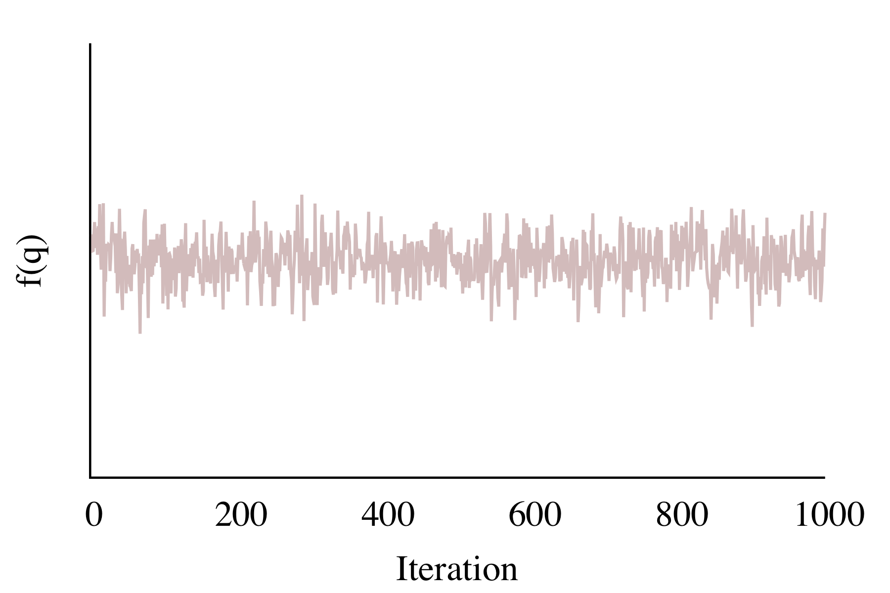
```
<br><br>
</center>

Stronger correlations, however, result in very small jumps in the function
values between iterations and more rigid paths through the output space.

<center>
<br>
```{r, out.width = "50%", echo=FALSE}
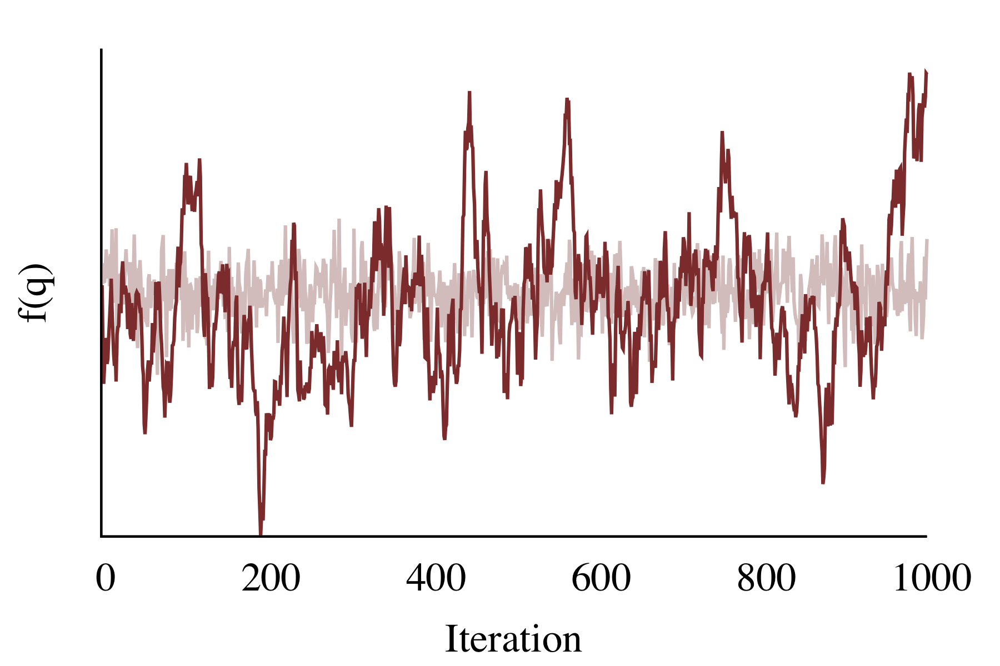
```
<br><br>
</center>

In order to quantify the dependencies in these function values we need to
compare the function values at one point in the Markov chain with the function
values after a fixed number of iterations.  Let's start a more formal treatment
by defining the mean function value as the exact expectation value with respect
to the stationary distribution,
$$
\mu_{f} = \mathbb{E}_{\pi}[f].
$$
The difference $f(q_{n_{1}}) - \mu_{f}$ then quantifies how the function value
at the $n_{1}$th iteration of the Markov chain deviates from that expected
value, while $f(q_{n_{2}}) - \mu_{f}$ quantifies the deviation at the
$n_{2}$th iteration.

The expectation value of the product of these deviations across all possible
realizations of the Markov chain defines the _autocovariance_ between the
function values,
$$
\kappa_{n_{1}, n_{2}}[f]
= \mathbb{E}[ ( f (q_{n_{2}}) - \mu_{f} ) ( f(q_{n_{1}}) - \mu_{f}) ].
$$
"auto" here refers to the fact that we are comparing the output at different
iterations of the _same_ Markov chain, as opposed to trying to compare states
between _different_ Markov chains.

Once we've settled into an equilibrium the autocovariance will depend not on
which particular points we're comparing but rather on just the relative number
of iterations between them.  In this case our Markov chains become _stationary_
and the autocorrelations depend only on the _lag_, $l$,
$$
\begin{align*}
\kappa_{n_{1}, n_{2}} [f]
&=
\kappa_{n_{1}, n_{1} + (n_{2} - n_{1})} [f]
\\
&=
\kappa_{n_{1}, n_{1} + l} [f]
\end{align*}
$$
for any iteration number $n_{1}$ past equilibration.  In this case we can refer
to a single _lag-$l$ autocovariance_ $\kappa_{l}[f]$ instead of any specific
autocovariance, $\kappa_{n, n + l}[f]$.

Finally we normalize the autocovariance by the variance of the function being
considered,
$$
\mathrm{Var}_{\pi}[f] = \mathbb{E}_{\pi}[ (f - \mu_{f})^{2} ],
$$
to define the _lag-$l$ autocorrelation_
$$
\rho_{l}[f] =
\frac{ \mathbb{E}[ ( f (q_{n + l}) - \mu_{f} ) ( f(q_{n}) - \mu_{f}) ] }
{ \mathrm{Var}_{\pi}[f] },
$$
for any $n$.  This normalization ensures that the autocorrelations are always
bounded between 1, corresponding to the most correlated behavior where the
function outputs are always the same, and -1, corresponding to the most
_anticorrelated_ behavior where the function outputs flip to the other side of
the function mean after each iteration.  Autocorrelations of zero imply no
correlation between function values, consistent with evaluating the function at
two completely independent samples.

The lag-$0$ autocorrelation is always unity because each point is always
perfectly correlated with itself.  Autocorrelations will be largest for the
small lags which correspond to closely neighboring points in the Markov chain
and monotonically decay as the lag increases and the points being considered
become more distant.  Once the autocorrelations decay close enough to zero the
function outputs will be approximately independent.  Consequently the lag at
which the autocorrelations approximately vanish can be interpreted as the number
of transitions needed to forget the past and generate an approximately
independent sample from the stationary distribution, at least _in the context of
a particular function $f$_.

Moreover, because correlations depend on only the absolute number of iterations
between two points the autocorrelations corresponding to positive and negative
lags will always be equal, $\rho_{l}[f]  = \rho_{-l}[f]$.  Once our Markov
chains have equilibrated the present correlates with the future in the same way
as it correlates with the past.

Autocorrelations can be visualized with a _correlogram_ which plots the lag-$l$
autocorrelation as a function of lag.  This visualization also demonstrates
many of the properties of autocorrelations we have already introduced.

If our Markov transition distribution induces only weak correlations in a
function output then the correlogram will manifest rapidly decaying
autocorrelations after the autocorrelation of 1 at lag $0$.  Here the
autocorrelations are approximately zero after a lag of around five, indicating
that after five or so Markov transitions we will generate a sample of the
function output that is effectively independent of the initialization of the
Markov chains.

<center>
<br>
```{r, out.width = "50%", echo=FALSE}
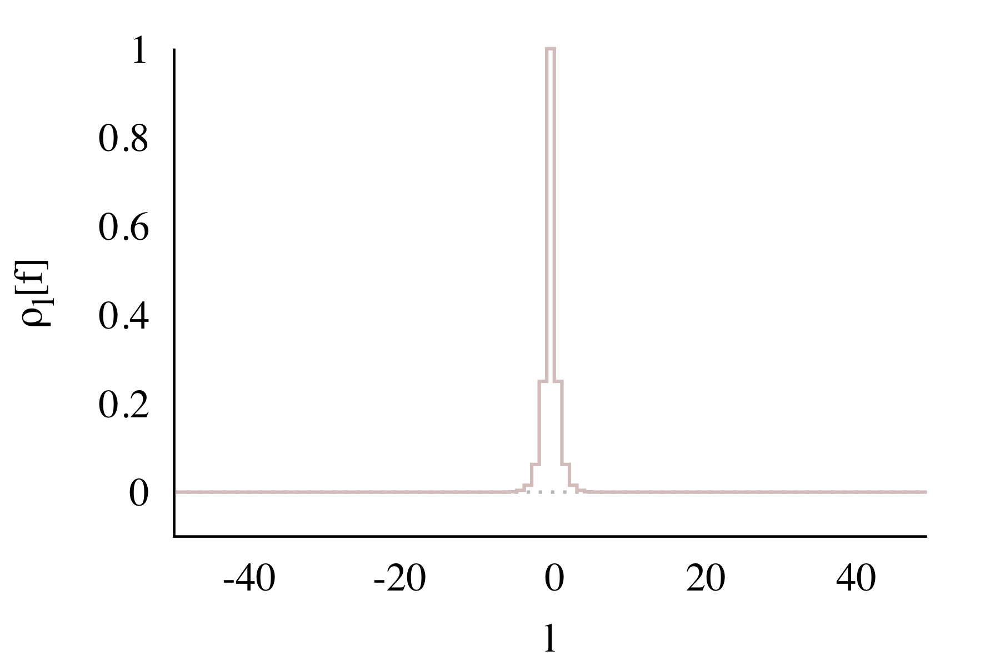
```
<br><br>
</center>

As expected the autocorrelations at positive and negative lags are perfectly
symmetric and, consequently, redundant.  Because of this correlograms are often
shown with only the positive lags.

<center>
<br>
```{r, out.width = "50%", echo=FALSE}
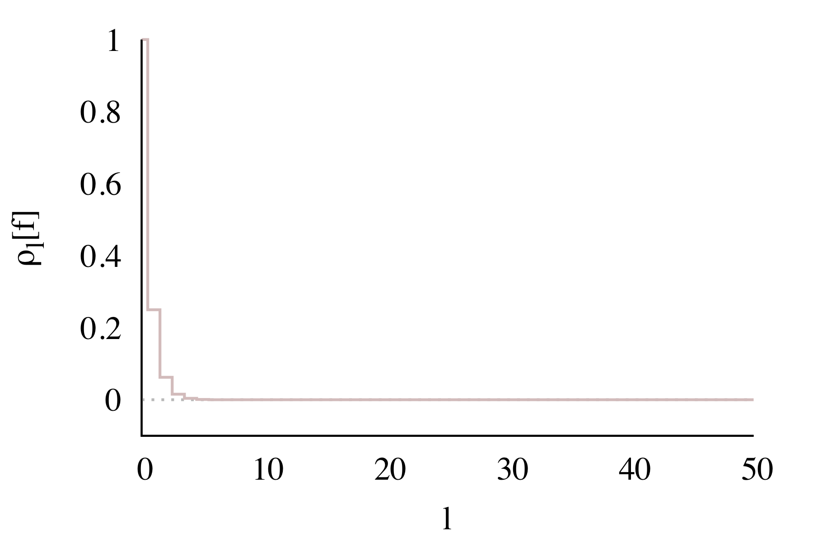
```
<br><br>
</center>

Stronger dependencies in the function outputs manifest in stronger
autocorrelations that persist to much higher lags.  Here we need to generate
more than fifty transitions before the initial and final function values start
to appear independent.

<center>
<br>
```{r, out.width = "50%", echo=FALSE}
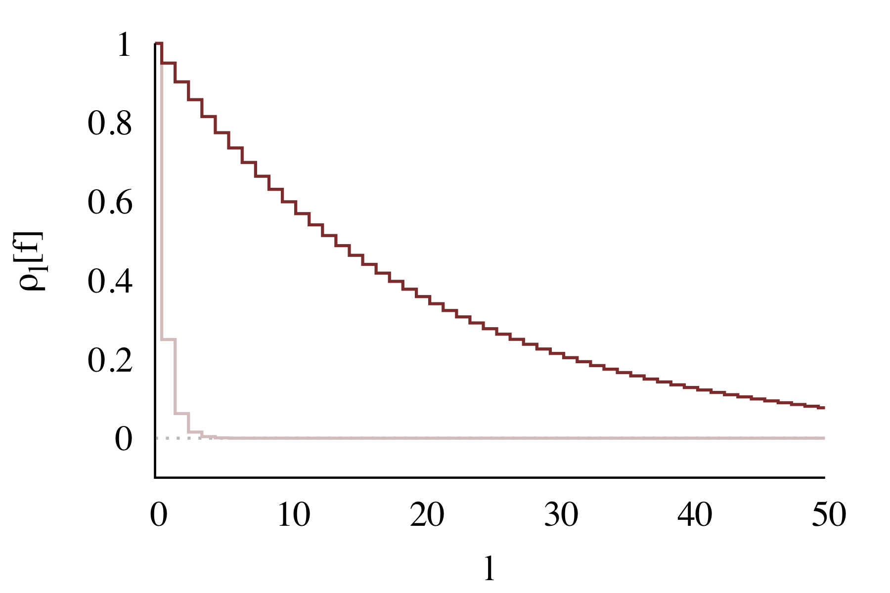
```
<br><br>
</center>

By comparing these rates of decay we can quantify the relative dependences
induced by different Markov chains in the context of the specific function $f$.

### Asymptotic Variance and the Effective Sample Size

Once our Markov chains have equilibrated, the variance of a Markov chain Monte
Carlo estimator is straightforward to compute in terms of the autocorrelations,
at least when the chain is sufficiently long.  The _asymptotic variance_ for an
infinitely long chain is defined by
$$
\lim_{N \rightarrow \infty}
N \cdot \text{Var}[\hat{f}^{\text{MCMC}}_{N}]
= \text{Var}_{\pi}[ f ] \cdot \tau_{I}[f],
$$
where the _integrated autocorrelation time_ $\tau_{I}[f]$ sums over the
autocorrelations across all lags,
$$
\tau_{I}[f] = \sum_{l = -\infty}^{\infty} \rho_{l}[f].
$$

This immediately implies that the standard error of a Markov chain Monte Carlo
estimator converges to
$$
\begin{align*}
\text{MCMC-SE}[f]
&=
\sqrt{
\frac{\text{Var}_{\pi}[ f ] \sum_{l = -\infty}^{\infty} \rho_{l}[f] }{N}
}
\\
&=
\sqrt{
\frac{ \text{Var}_{\pi}[ f ] }{ N / \sum_{l = -\infty}^{\infty} \rho_{l}[f] }
}
\\
&\equiv
\sqrt{
\frac{ \text{Var}_{\pi}[ f ] }{ \text{ESS}[f] }
},
\end{align*}
$$
where we have defined the _effective sample size_ as
$$
\text{ESS}[f] = \frac{N}{\sum_{l = -\infty}^{\infty} \rho_{l}[f]}.
$$
The incremental effective sample size then becomes
$$
\lambda[f] = \frac{\text{ESS}[f] }{N}
= \frac{1}{\sum_{l = -\infty}^{\infty} \rho_{l}[f]},
$$
with the relaxation time equaling the integrated autocorrelation time exactly,
$$
\tau_{R}[f]
= \frac{1}{\lambda[f]}
= \tau_{I}[f]
= \sum_{l = -\infty}^{\infty} \rho_{l}[f].
$$

We can simplify the form of the effective sample size further by employing
the properties of the autocorrelations,
$$
\begin{align*}
\tau_{I}[f]
&=
\sum_{l = -\infty}^{\infty} \rho_{l}[f]
\\
&=
\rho_{0}[f] + \sum_{l = -\infty}^{-1} \rho_{l}[f] + \sum_{l = 1}^{\infty} \rho_{l}[f]
\\
&=
1 + \sum_{l = -\infty}^{-1} \rho_{l}[f] + \sum_{l = 1}^{\infty} \rho_{l}[f]
\\
&=
1 + \sum_{l = 1}^{\infty} \rho_{-l}[f] + \sum_{l = 1}^{\infty} \rho_{l}[f]
\\
&=
1 + \sum_{l = 1}^{\infty} \rho_{l}[f] + \sum_{l = 1}^{\infty} \rho_{l}[f]
\\
&=
1 + 2 \, \sum_{l = 1}^{\infty} \rho_{l}[f].
\end{align*}
$$

In other words
$$
\text{ESS}[f] = \frac{N}{1 + 2 \, \sum_{l = 1}^{\infty} \rho_{l}[f]}.
$$
This form clearly demonstrates how the autocorrelations of a given function
value affect the corresponding effective sample size, and hence the Markov chain
Monte Carlo standard error.  If the values are independent, corresponding to no
dependencies between the points in the Markov chain, then all autocorrelations
will vanish and
$$
\sum_{l = 1}^{\infty} \rho_{l}[f] = 0.
$$
In this case $\text{ESS}[f] = N$ and the Markov chain Monte Carlo standard error
reduces to the Monte Carlo standard error.

Positive autocorrelations,
$$
\sum_{l = 1}^{\infty} \rho_{l}[f] > 0,
$$
suppress the effective sample size which in turn increases the Markov chain
Monte Carlo standard error.

Negative autocorrelations,
$$
\sum_{l = 1}^{\infty} \rho_{l}[f] < 0,
$$
actually _enhance_ the effective sample size relative to the total number of
iterations which then _decreases_ the Markov chain Monte Carlo standard error
below the Monte Carlo standard error!  In this sense anticorrelated Markov
chains are super efficient and contain _more_ information about the stationary
distribution than an ensemble of exact samples.  This increased information,
however, holds only in the context of the particular function $f$.  In general
not all functions will be anticorrelated at the same time, and extreme negative
correlations for some functions typically imply extreme positive correlations
for other functions.  Consequently the benefit of negative correlations is
somewhat fragile and the robust use of estimators employing anticorrelated
Markov chains requires care.

Finally we have to keep in mind that the asymptotic variance and the
corresponding definition of the effective sample size are defined in only the
limit of infinitely long Markov chains.  Provided that our Markov chains are
long enough for the autocorrelations to approximately vanish before the Markov
chains end,
$$
\rho_{l}[f] \approx 0 \text{ for } l > N,
$$
however, sums of autocorrelations over finite Markov will reasonably approximate
the sums over infinite Markov chains,
$$
\sum_{l = 1}^{N} \rho_{l}[f] \approx
\sum_{l = 1}^{\infty} \rho_{l}[f].
$$
In practice this means that we need to run our chains long enough to accumulate
at least a few effective samples, which we already need to do to ensure the
equilibrium in which a central limit theorem, and stationarity of the Markov
chains, are decent approximations.

### Effective Sample Size Estimators

Even if a central limit theorem holds for a Markov transition distribution,
and realized Markov chains settle into a well-behaved equilibrium, we won't be
able to derive the effective sample size, and hence the Markov chain Monte Carlo
standard error, analytically.  Instead we have to _estimate_ it from the
realized Markov chain itself.

Because our Markov chains are assumed to be stationary we can estimate the
autocorrelations by averaging over each pair of points separated by a given lag,
$$
\hat{\rho}_{l}[f]
=
\frac{ \frac{1}{N} \sum_{n = 0}^{N - l}
( f (q_{n + l}) - \hat{\mu}_{f} ) ( f(q_{n}) -\hat{\mu}_{f}) }
{ \widehat{\mathrm{Var}}[f] },
$$
once we have estimated the expectation value $\hat{\mu}_{f}$ and the variance
$\widehat{\mathrm{Var}}[f]$ of the specified function, $f$.  Note that
estimators for higher lags includes fewer terms and are consequently subject to
larger variation.  We use biased estimators here, normalizing by $N$ instead of
$N - l$, to regularize some of this variation.

We can collect these estimated autocorrelations into an _empirical correlogram_
that visualizes our best understanding of the autocorrelation structure of the
Markov transition distribution.  While the empirical correlogram exhibits an
initial systematic decay, the behavior at higher lags is obscured by the
increasing variation in the autocorrelation estimators.

<center>
<br>
```{r, out.width = "50%", echo=FALSE}
knitr::include_graphics("figures/estimated_autocorrelation/estimated_autocorr.png")
```
<br><br>
</center>

By summing the estimated autocorrelations we can immediately estimate the
integrated autocorrelation time, and hence the effective sample size,
$$
\widehat{\mathrm{ESS}}[f] = \frac{N}{1 + 2 \sum_{l = 1}^{L} \hat{\rho}_{l}[f] }.
$$
The challenge with this estimator is choosing a cutoff, $L$, that ensures a
sufficiently small error.

For a finite Markov chain we can estimate lags only up to the total length of
the chain, which puts a bound on how large the cutoff can be, $L \le N$.  At the
same time the large lag autocorrelation estimators near that bound will be
dominated by noise.  Setting $L$ too large will incorporate enough of these
noisy estimators that the effective sample size estimator will be too variable
to be useful in practice.

<center>
<br>
```{r, out.width = "50%", echo=FALSE}
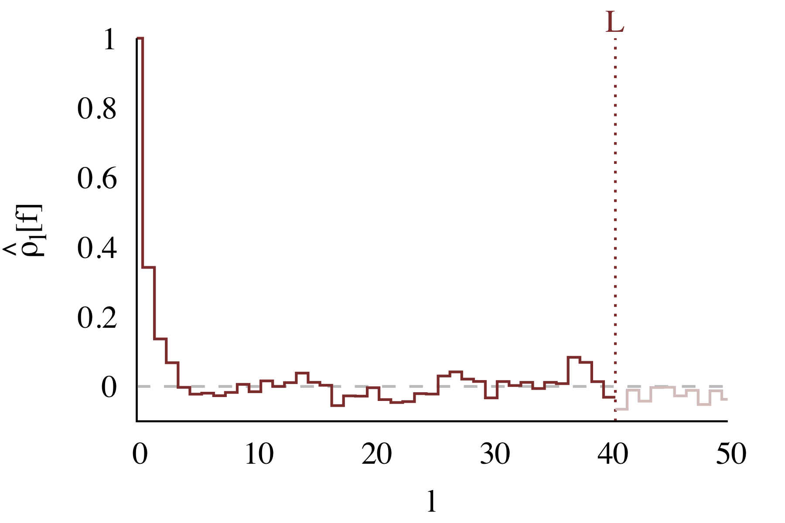
```
<br><br>
</center>

We also have to be careful, however, to not set the cutoff to too small of a
lag.  If we include only very small lag autocorrelation estimators then we
significantly underestimate the integrated autocorrelation time and hence
overestimate the effective sample size.

<center>
<br>
```{r, out.width = "50%", echo=FALSE}
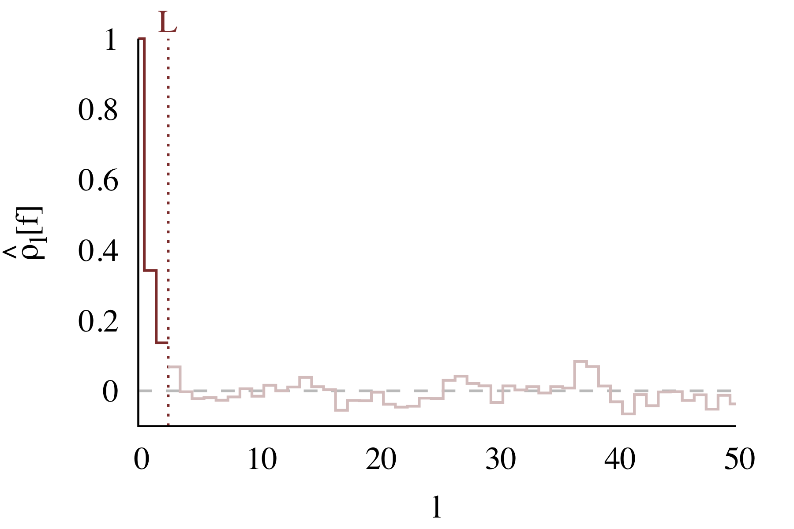
```
<br><br>
</center>

In other words too small of a cutoff introduces significant bias and too large
of a cutoff introduces significant variance.  To construct an effective sample
size estimator with reasonable overall error we need to cut off the summation
after the autocorrelations have mostly decayed but before too much noise builds
up.

<center>
<br>
```{r, out.width = "50%", echo=FALSE}
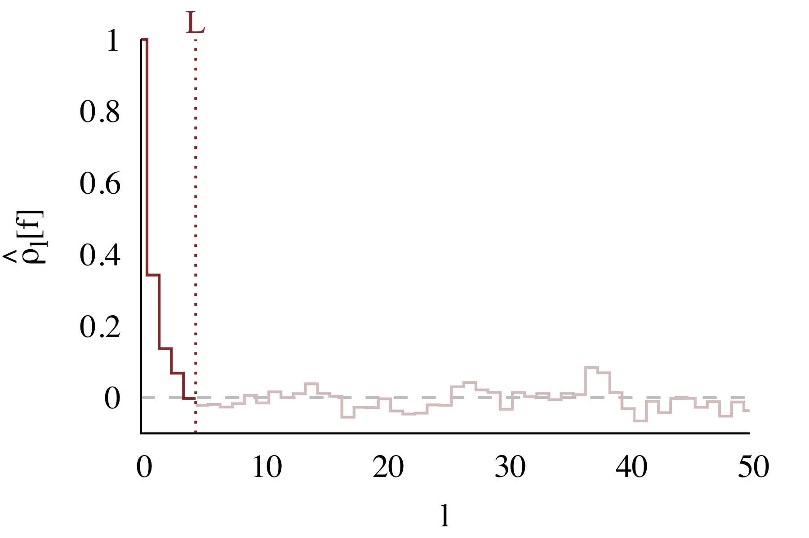
```
<br><br>
</center>

Automating this choice of cutoff is a particularly hard problem.  A common
heuristic due to [@Geyer:1992] takes advantage of the fact that the sum of
neighboring autocorrelations are always positive,
$$
\Gamma_{k} = \rho_{2 k} + \rho_{2 k + 1} > 0,
$$
and monotonically decreasing,
$$
\Gamma_{k + 1} < \Gamma_{k}.
$$
Summing the corresponding autocorrelation estimators defines estimators of these
pair sums which we can correct to ensure the monotonic decrease expected of the
exact values.  We can then define the cutoff as the smallest lag where the noise
in the regularized pair sum estimator pushes the estimated value below zero.
Depending on the sophistication of the regularization scheme this approach can
yield productive cutoffs for well-behaved Markov chains.

That said, there are some vulnerabilities to this scheme.  For example when the
Markov transition distribution exhibits negative correlations the estimators of
the negative autocorrelations are susceptible to fluctuations towards even more
negative values that can lead to drastically underestimated cutoffs, and hence
drastically overestimated effective samples sizes.  This is particularly
dangerous when the realized Markov chains are short and the estimated
autocorrelation time is very sensitive to large negative autocorrelations at
small lags.  To ensure robustness we have to regularize the estimated
autocorrelation time when we might encounter negative estimated
autocorrelations; at the expense of a small bias we can construct estimators
that are much less sensitive to the fluctuations around negative
autocorrelations.

Another worry are Markov transition distributions that exhibit large positive
autocorrelations at high lags.  Accurate estimation of these high lag
autocorrelations already requires _very_ long Markov chains, but when the
incremental effective sample size is too low we can run into an even more
insidious problem.  Because they all use the same points in our Markov chain,
the autocorrelation estimators are not independent.  When the function values
are strongly correlated the autocorrelation estimators of that function will
also be strongly correlated.  The empirical correlograms, for example, can
exhibit "ringing" across lags that violates the assumptions of the cutoff
heuristic.

<center>
<br>
```{r, out.width = "50%", echo=FALSE}
knitr::include_graphics("figures/estimated_autocorrelation/estimated_autocorr_ringing.png")
```
<br><br>
</center>

When these rings are strong the effective sample size estimators will typically
cut off at too small a lag and exclude the large autocorrelations at larger
lags, resulting in overestimated effective sample sizes.  The Markov chains just
don't accumulate information fast enough to stabilize the estimation.  It is
challenging to work out analytic results for when we can trust these estimators,
but based on my own experience I don't trust estimated effective sample size
estimators when
$$
\hat{\lambda}[f] = \frac{\widehat{\mathrm{ESS}}[f] }{N} < \frac{1}{10000}.
$$

Effective sample size estimation is also particularly vulnerable to
metastabilities.  If we haven't run long enough to transition between
metastabilities then our autocorrelation estimators and cutoffs will be based
on only the _local_ exploration around the initial metastability, ignoring the
rest of the stationary distribution entirely.  The effective sample size should
be based on the number of sojourns across the the entire ambient space, which
scales with the number of transitions _between_ the metastabilities, but these
effective sample size estimators will based on the number of sojourns through
just the one initial metastability.

Robust effective sample size estimators are in continuous development based on
both improving theory and feedback from their empirical performance in
applications.  For a state of the art estimator implementation see, for example,
[the implementation in Stan](https://github.com/stan-dev/stan/blob/develop/src/stan/analyze/mcmc/compute_effective_sample_size.hpp).

## The Estimated Central Limit Theorem

Even when we assume that a Markov chain Monte Carlo central limit theorem holds
we have to estimate the standard error using our estimated effective sample
sizes,
$$
\hat{f} \sim \text{normal}( \mathbb{E} [f], \widehat{\text{MCMC-SE}}[f] ),
$$
where
$$
\widehat{\text{MCMC-SE}}[f] =
\sqrt{ \frac{ \widehat{ \text{Var}} [f] }{ \widehat{\text{ESS}} [ f ] } }
$$
In practice this means using the points in our Markov chain to construct not
only the Markov chain Monte Carlo estimator of a given function but also the 
variance of that function, its autocorrelations, and finally its effective 
sample size.  If we are interested in the expectation values of multiple 
functions then we have to repeat this estimates for each of those functions.

The error quantification provided by a Markov chain Monte Carlo central limit
theorem is then only as good as the estimates of all of these auxiliary
quantities.  As in Monte Carlo, however, the error in these estimates all
contribute corrections on the order of $\mathcal{O}(N^{-1})$ which is the same
scale as the error from assuming the central limit theorem holds after only a
finite number of iterations and the residual bias from starting out of
equilibrium.  All of these errors are much smaller than the square root scaling
of the standard error itself, $\mathcal{O}(N^{-\frac{1}{2}})$.

If we can run our Markov chain long enough to reach a reasonable equilibrium,
and adequately explore the stationary typical set, then all of these corrections
will be negligible compared to the Markov chain Monte Carlo standard error and
we can safely ignore them.  Importantly, however, long enough cannot be defined
by any absolute number of iterations but rather depends on the specific
structure of a given Markov transition distribution.  If the incremental
effective sample size is high then this might require only tens of iterations,
but if it is low then we might more iterations than we can generate using our
finite computational resources.

When we are limited by finite computation and ineffective Markov transition
distributions Markov chain Monte Carlo might not be feasible.  We can always run
a Markov chain, but we can't always trust the estimators it produces.

## Diagnosing Equilibrium

Our ability to manage the risk inherent to Markov chain Monte Carlo depends on
how well we can confirm the existence of a central limit theorem and then verify
that we have equilibrated sufficiently well.  Unfortunately this is by no means
a straightforward task.

The existence of a central limit theorem, and the resulting equilibration time,
is very sensitive to the details of a given Markov transition distribution.
Moreover this existence is fragile -- seemingly inconsequential changes to the
Markov transition distribution can ruin the conditions necessary for a central
limit theorem to hold.  This means that we can't talk about the validity of a
central limit theorem in any generality but instead have to analyze it in the
specific context of each bespoke application.

Theoretical analysis of Markov chain Monte Carlo central limit theorems is both
subtle and mathematically demanding.  Even if we could all find, and then
detain, a well-trained mathematician to attempt the analysis for our particular
application we would enjoy only limited results.  State-of-the-art theoretical
tools can explicitly verify a central limit theory in only a few simple cases.

These theoretical limitations result in our not having _sufficient_ conditions
for the existence of a central limit theorem, let alone equilibration of a
Markov chain, that we can check empirically.  Our most powerful tools are
instead a handful of _necessary conditions_, some more rigorous and some more
intuitive, that must hold if a central limit theorem is to exist.

In practice we have to arm ourselves with an arsenal of diagnostics sensitive to
the violation of as many necessary conditions as possible.  If the diagnostics
are sufficiently comprehensive and exhibit no signs of trouble in a given
application then we _might_ jump to the optimistic conclusion that a central
limit theorem holds and our Markov chain has settled into a comforting
equilibrium.

How much optimism is needed depends on how robust our diagnostics are.  Sadly
we have precious few general diagnostics for Markov chain Monte Carlo, and the
ones we have feature some notable limitations.

### Visualizing Transient Behavior

Once a Markov chain has reached equilibrium its behavior should be stationary.
We can visualize the progression from transient behavior to equilibrium behavior
by examining _trace plots_ of each function of interest.

A trace plot graphs a function value at each point in the Markov chain verses
the iteration number.  Early transient behavior of the Markov chain finding and
then settling into the typical set should make way for equilibrium behavior
where the Markov chain fills out the stationary typical set, and hence the
typical function values.  In other words equilibrium should visually manifest as
a fuzzy, flat line.

<center>
<br>
```{r, out.width = "50%", echo=FALSE}
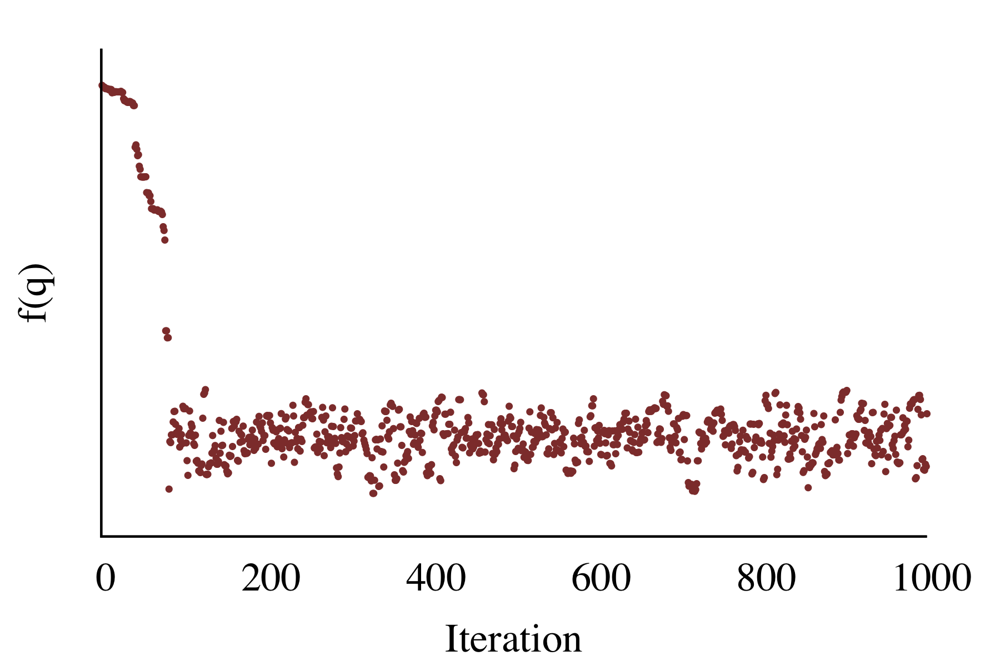
```
<br><br>
</center>

What we don't want to see are intervals where the behavior of a Markov chain
suddenly changes.  For example we don't want to see a Markov chain freeze for an
extended interval before escaping and reverting back to more fluid exploration.

<center>
<br>
```{r, out.width = "50%", echo=FALSE}
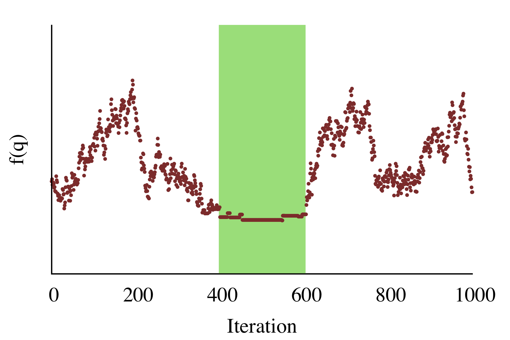
```
<br><br>
</center>

Trace plots are popular in introductions to Markov chain Monte Carlo because of
their ease of implementation and intuition in introductory examples, but in
real applications they leave quite a bit to be desired.  First and foremost,
this visual diagnostic is limited by the exploration of the Markov chain itself.
If the chain hasn't explored long enough to encounter pathological behavior then
that behavior won't manifest in the trace plots.

For example a Markov chain might not explore long enough to encounter a
neighborhood of high curvature in the typical set.  This partial
characterization of the stationary typical set exhibits no indications of
problems and gives us misleading confidence that we have reached an equilibrium.

<center>
<br>
```{r, out.width = "50%", echo=FALSE}
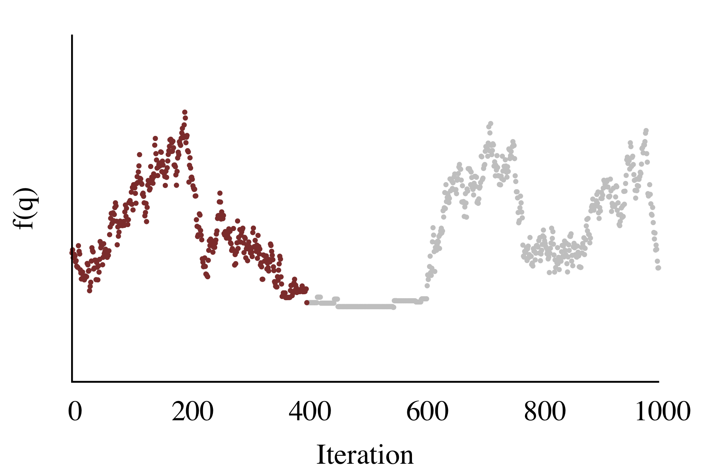
```
<br><br>
</center>

Similarly trace plots have trouble identifying metastabilities, such as those
that arise in multimodal stationary distributions.  Each realized Markov chain
will reach a local equilibrate around one of the metastabilities while
completely ignoring the others.  Without any indication of the other
metastabilities a trace plot can't distinguish between the local equilibrium
and a complete equilibrium.

<center>
<br>
```{r, out.width = "50%", echo=FALSE}
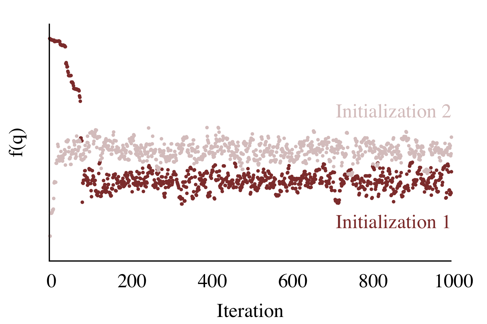
```
<br><br>
</center>

Only after _many_ iterations will the Markov chains eventually transition
between the metastabilities and allow the trace plots to indicate the problem.

In other words trace plots, like Markov chain Monte Carlo estimators themselves,
are limited by the how well the Markov chains explore the typical set of the
stationary distribution.  If the Markov transition distribution is effective,
and the Markov chains are exploring efficiently, then trace plots will usually
contain enough information to be sensitive to pathologies.  When the Markov
chains face pathologies that obstruct equilibrium--exactly when we need the
diagnostics most--they will often contain too little information to be all that
sensitive.  Because we are limited to what information our Markov chains collect
this will unfortunately always be a limitation of empirical Markov chain Monte
Carlo diagnostics.

One way to improve the performance of trace plot diagnostics is to run
_multiple_ Markov chains and plot their traces against each other. The more
Markov chains we run the more information about the typical set of the
stationary distribution we accumulate and the more sensitive trace plots
diagnostics might be.

For example multiple Markov chains provide more opportunity to encounter
pathological neighborhoods within the typical set that obstruct efficient
exploration, such as those with extreme curvature.  Even if we don't see
freezing in one Markov chain we might see it in others.

<center>
<br>
```{r, out.width = "50%", echo=FALSE}
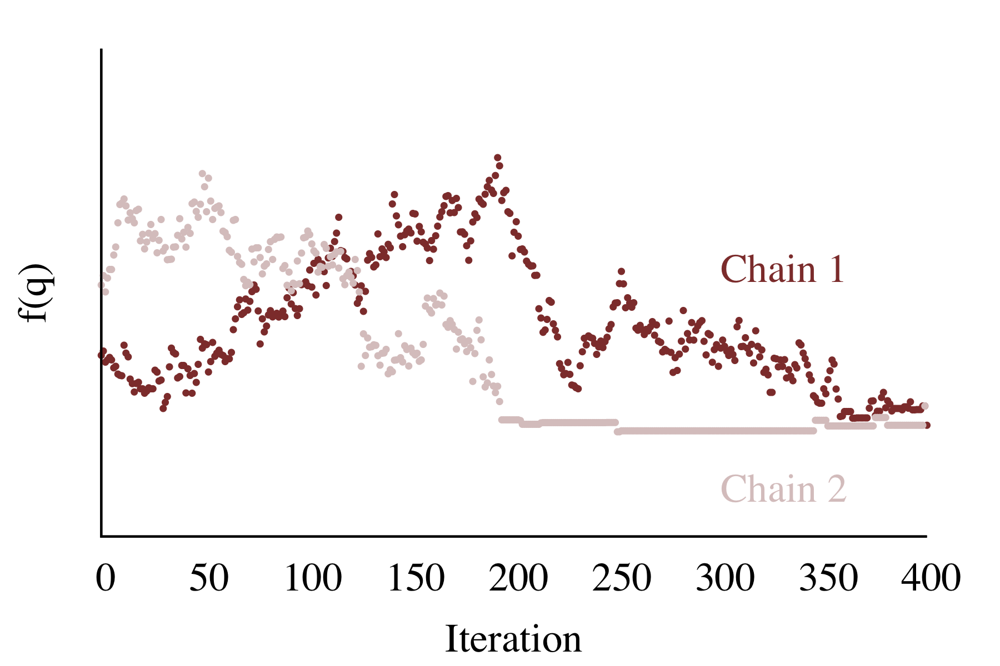
```
<br><br>
</center>

At the same time multiple Markov chains provide sensitivity to metastabilities.
Each Markov chain has the opportunity to fall into separate metastabilities
depending on their initialization and the random realizations of each Markov
transition.  The more Markov chains we run the more opportunity we have to see
different metastabilities and the better we can diagnose the inability to
transition between them.

<center>
<br>
```{r, out.width = "50%", echo=FALSE}
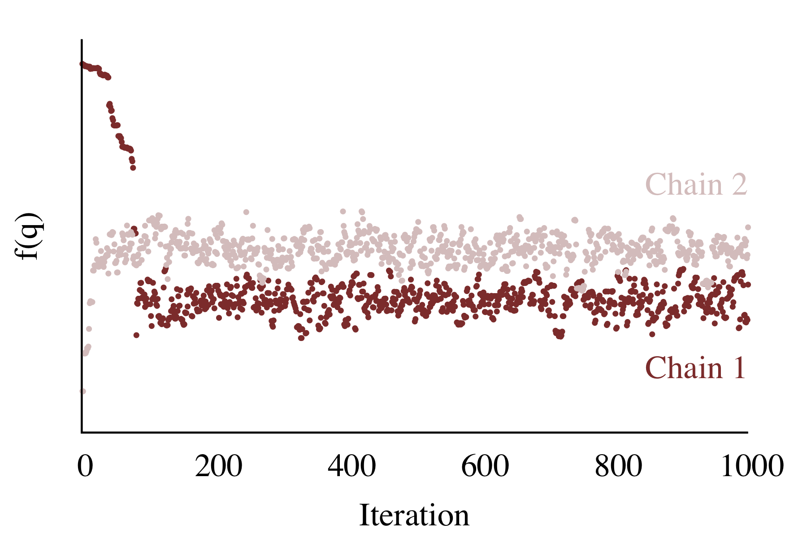
```
<br><br>
</center>

That said, there is no guarantee that any finite number of parallel Markov
chains will capture enough information for their trace plots to clearly
indicate a problem.

Even if we presume that we run sufficiently long, and our Markov chains are
sufficiently informative, trace plots will always be limited by how little
information they convey.  Each trace plot projects the Markov chain onto only a
single function.  In order to assemble a more complete picture of a Markov
chain's behavior and ensure a more robust diagnostic we often need to consider
many functions of interest.  When the ambient space is high-dimensional this
might require looking through hundreds if not thousands of figures, which
quickly becomes infeasible and facilitates the oversight of important details.

### Quantifying Transient Behavior

One way to help scale diagnostics to high-dimensional problems is to build
_quantitative_ summaries of the Markov chain behaviors instead of the
_qualitative_ visual comparisons supplied by trace plots.  These quantitative
summaries will necessarily encapsulate less information than the
information-dense visualizations, but that limited information will be easier
to parse over many functions of interest.  In order to maintain useful
sensitivity we have to be make sure that these quantitative diagnostics carry
the right information.

Trace plots allowed us to study the evolution of the Markov chain, or even
multiple Markov chains, and identify transient behaviors uncharacteristic of
equilibrium.  A Markov chain appears stationary when its behaviors are
consistent across iterations, and an ensemble of Markov chains appears
stationary when all of the individual Markov chains are consistent with each
other.  In order to quantify this behavior we need to develop numerical
summaries of _consistency_.  Conveniently, classical statistics is rich with
tests of consistency between two ensembles that can form the basis of
diagnostics.

[@Geweke:1992] considered comparing the Markov chain Monte Carlo estimators
derived at the beginning and end of a single Markov chain; if the Markov chain
is stationary then these estimators should be statistically indistinguishable.
In particular he quantified the compatibility by constructing a _$t$-statistic_
between the two estimators.  If $\hat{f}^{\text{MCMC}}_{B, N_{B}}$ denotes the
Markov chain Monte Carlo estimator of the function $f$ from the first $N_{B}$
points at the beginning of a Markov chain and $\hat{f}^{\text{MCMC}}_{E, N_{E}}$
denotes the estimator from the last $N_{E}$ points at the end of the Markov
chain then the Geweke statistic is defined as
$$
G = \frac{
\hat{f}^{\text{MCMC}}_{B, N_{B}}
- \hat{f}^{\text{MCMC}}_{E, N_{E}} }
{ \sqrt{
(\text{MCMC-SE}_{B}[f])^{2} + (\text{MCMC-SE}_{E}[f])^{2}
} }.
$$
If the Markov chain has equilibrated then the distribution of this statistic
will be specified by a member of Student's $t$ family of probability density
functions, namely those with zero location, unit scale, and degrees of freedom
determined by sizes of the beginning and end segments.  Values in the tails of
the appropriate probability density function suggest deviations from
equilibrium, and the further the value reaches into the tails the more extreme
the suggestion.  In practice the tails are defined with a heuristic threshold,
and a heurisic diagnosic is defined by checking for values exceeding this
threshold.

At the same time [@GelmanEtAl:1992] suggested comparing the estimators derived
from independent Markov chains for consistency.  Formally they constructed a
transformed _analysis of variance_ statistic that compares the Markov chain
Monte Carlo estimators across the ensemble of $C$ Markov chains of size $N$
relative to their standard errors.  Let's define the _within chain variance_,
$W[f]$ as the empirical average of the square of the Markov chain Monte Carlo
standard errors,
$$
\hat{W}[f] = \frac{1}{C} \sum_{c = 1}^{C} (\text{MCMC-SE}_{c}[f])^{2}
$$
and the _between chain variance_, $B[f]$, as the empirical variance of the
Markov chain Monte Carlo estimators themselves,
$$
\hat{B}[f] = \frac{N}{C - 1} \sum_{c = 1}^{C}
\left( \hat{f}^{\text{MCMC}}_{c, N} - \hat{\hat{f}} \right)^{2},
$$
where
$$
\hat{\hat{f}} = \frac{1}{C} \sum_{c = 1}^{C} \hat{f}^{\text{MCMC}}_{c, N}.
$$
The _potential scale reduction factor_ $\hat{R}$ is then defined as
$$
\hat{R}[f] = \sqrt{ \frac{N - 1}{N}
+ \frac{1}{N} \frac{ \hat{B} [ f ] }{ \hat{W} [ f] } }.
$$

As the ensemble of Markov chains reach the same equilibrium $\hat{R}$ should
approach one.  Moreover, if the Markov chains have been initialized from points
outside the stationary typical set then the value of $\hat{R}$ should converge
to one from above.  We can convert this into a heuristic diagnostic by verifying
that $\hat{R}$ does not deviate above a specified threshold.  While there is no
universal threshold $1.1$ and $1.3$ are common heuristics.

The _split potential scale reduction factor_, or split $\hat{R}[f]$, combines
the qualitative features of both diagnostics by generating an ensemble of Markov
chains and then splitting them in half before computing the $\hat{R}$ statistic.
In this way split $\hat{R}$ can capture inconsistencies both between the Markov
chains in the ensemble as well as within each Markov chain.

Diagnostics like Geweke, $\hat{R}[f]$, and split $\hat{R}[f]$ are attractive
because of their generality, but that generality does not guarantee strong
diagnostic power in practice.  Because they depend on a particular Markov chain
Monte Carlo estimator they depend on the validity of that estimator.  In
particular, if the square of the function whose expectation is being estimated 
is not square integrable then these diagnostics will not offer useful 
information even when the Markov chains have equilibrated.

Furthermore we have to keep in mind that these diagnostics are based on
necessary conditions for equilibrium and not sufficient ones.  We know how they
should behave under equilibrium but we don't have any guarantees how they will
behave when the Markov chains have not yet equilibrated or if no equilibrium
exists for the given Markov transition; we just assume that any non-equilibrium
behavior will manifest in _different_ diagnostic outcomes than equilibrium
behavior.

While this has been empirically verified for many transient behaviors we cannot
_guarantee_ it for all.  For example when only a few Markov chains in an
ensemble encounter a neighborhood of high curvature then a diagnostic like the
$\hat{R}[f]$ should register the inconsistency between those Markov chains and
the Markov chains that have yet to see any problems.  If the chains are
sufficiently long, however, then all of the Markov chains will have had the
opportunity to spar with pathological neighborhood.  The Markov chains will all
become consistently pathological and the $\hat{R}[f]$ will not indicate the
presence of the pathology.

Even if there should be observable differences in the diagnostic values, we
might not see them if the Markov chains aren't long enough for the Markov chain
Monte Carlo estimators to be sufficiently precise.  In practice we typically
want to run as many Markov chains as possible to maximize the possibility of at
least one Markov chain realizing behavior inconsistent with the others, and
hence increasing the possible sensitivity of these generic diagnostics. At the
same time we want each Markov chain in that ensemble to be as long as possible
to better resolve any inconsistencies and realize that sensitivity empirically.

Given finite computational resources we have to compromise between more Markov
chains and longer Markov chains.  The debate on the optimal compromise has long
raged in the statistics literature but honestly the specific nature of one's
computational resources if often more important than one's statistical dogmas.
For example parallel computational resources, such as independent cores within
a processor or independent processors in a cluster, may be better suited to
running more Markov chains than longer Markov chains.  Ultimately we have to
make a choice that helps us to best manage the diagnostic risk based on the
particular resources available in any given application.

Ideally the Markov transition being used also admits bespoke diagnostics that
exploit the particular structure of a Markov transition distribution.  Because
they are based on particular details these bespoke diagnostics tend to be much
more sensitive than generic diagnostics which have only limited information at
their disposal.

# Robust Application Of Markov Chain Monte Carlo In Practice

Markov chain Monte Carlo offers the _potential_ of practical probabilistic
computation with quantifiable error, but only when employed and evaluated
responsibly.  The method cannot be treated as a black box that eats a given
Markov transition distribution and spits out estimates of expectation values
with respect to the stationary distribution.  Responsible use requires that a
user carefully investigate evidence that the Markov chain, or Markov chains,
have failed to reach a useful equilibrium and rendered the estimators
ineffective.  Such responsible use is facilitated by a deliberate, systematic
methodology for applying Markov chain Monte Carlo in practice.

## Chain Rule {#sec:engineering}

Our first task in applying Markov chain Monte Carlo in practice is _engineering_
a Markov transition distribution that features our target distribution as its
stationary distribution,
$$
\pi(q) = \int \mathrm{d} q' \, \pi(q') \, T(q \mid q').
$$

We have to keep in mind that this is fundamentally an ill-posed problem -- in
general a given target distribution will be invariant with respect to infinitely
many Markov transition distributions.  Even if finding one is possible, finding
one that performs well in practice may not be.  Moreover the utility of this
search tends to be quite fragile. A procedure that yields an efficient Markov
transition distribution for one target distribution may yield a poorly
performing Markov transition for another target distribution, even one that is
only slightly perturbed from the first.

Just as it is impractical to detain a mathematician to analyze each bespoke
Markov transition distribution, it is impractical to to detain one to engineer
an appropriate Markov transition distribution in each application.  While
bespoke Markov transition distributions are not unprecedented, most applications
of Markov chain Monte Carlo rely on generic procedures that use features of the
target distribution itself to construct appropriate Markov transition
distributions.

The most famous of these procedures is the _Metropolis-Hastings_ algorithm
which builds transitions from _proposals_ that are _accepted_ only with some
probability.  In other words Metropolis-Hastings transitions guess and check,
probing around the ambient space until an acceptable jump is made.

More formally we define a _proposal distribution_ as a conditional probability
distribution of the same form as a Markov transition distribution,
$$
\begin{alignat*}{6}
K :\; &Q \times \mathcal{Q} & &\rightarrow& \; &[0, 1]&
\\
&(q, B)& &\mapsto& &K [B \mid q]&,
\end{alignat*}
$$
only without any requirement on the existence or form of an stationary
distribution.  As usual we typically specify a proposal distribution in practice
with a conditional probability density function within a given parameterization
of the ambient space,
$$
\begin{alignat*}{6}
K :\; &Q \times Q& &\rightarrow& \; &\mathbb{R}^{+}&
\\
&(q, q')& &\mapsto& &K(q' \mid q)&.
\end{alignat*}
$$

The _Metropolis-Hastings acceptance probability_ between an initial point, $q$,
and a proposal, $q'$, is then defined as
$$
a(q', q) = \min \left(1,
\frac{ K(q \mid q') \, \pi(q') }{ K(q' \mid q) \, \pi(q) } \right).
$$
Often
$$
\frac{ \pi(q') }{ \pi(q) }
$$
is denoted the _Metropolis ratio_ and
$$
\frac{ K(q \mid q') }{ K(q' \mid q) }
$$
the _Hastings ratio_ or the _Hastings correction_.

We can then define a Metropolis transition as a mixture of jumping to the
proposal with probability $a(q', q)$ and staying at the initial point with
probability $1 - a(q', q)$.  The resulting Markov transition distribution can be
specified with the conditional probability density function,
$$
T(q' \mid q) = a(q', q) \cdot Q (q' \mid q )
+ \left(1 -  \int \mathrm{d} q' \, Q(q' \mid q) \, a(q, q') \right) \cdot \delta(q - q').
$$

This procedure defines a Markov transition distribution with the target
distribution $\pi$ as its stationary distribution for _any_ choice of proposal
distribution.  The convergence of the resulting Markov chain Monte Carlo
estimators, however, is determined by the precise interaction between the
proposal distribution and the target distribution.  The closer the stationary
distribution of the proposal distribution is to the target distribution, the
faster the resulting Markov chains will explore.

When specifying proposal distributions with probability density functions we
have to be careful to coordinate with the probability density function of the
target distribution.  If we reparameterize the ambient space we have to change
both the target probability density function _and_ the proposal probability
density function.  Using a default proposal density function while changing the
target probability density function implicitly specifies a _different_ proposal
distribution that will interactive _differently_ with the target distribution.
Because proposal probability density function are often hidden behind software
this is a common confusion in practice.  For a theoretical discussion of this
issue see [@Betancourt:2019].

_Random Walk Metropolis_ considers proposal distributions that perturb the
initial point.  The originating Random Walk Metropolis algorithm, indeed the
first Markov chain Monte Carlo algorithm ever, considered uniform perturbations
in each direction of the ambient space.  Today Random Walk Metropolis is usually
defined by a multivariate Normal proposal density function,
$$
Q(q' \mid q, \Sigma) = \text{normal}(q' \mid q, \Sigma).
$$
The expanse of the proposal to the entire ambient space ensures that the
resulting Metropolis-Hastings transition distribution is irreducible, while the
non-zero probability of rejecting a proposal ensures that it is aperiodic.

This Random Walk Metropolis construction defines a _family_ of transition
distributions indexed by the choice of covariance, $\Sigma$.  This choice is
critical to the performance of the algorithm and must be carefully tuned in each
application.

Another common algorithm is the _Gibbs sampler_ which generates transitions on
product ambient spaces by sampling from the conditional distributions defined by
the target distribution,
$$
\pi(q^{i} \mid q^{1}, \ldots, q^{i - 1}, q^{i + 1}, \ldots, q^{I})
\equiv
\pi(q^{i} \mid q^{\setminus i}).
$$
If we can generate exact samples from these conditional distributions then we
only need to define the order in which we sample each component in order to
fully specify a Markov transition distribution.  The ultimate performance of
Gibbs samplers depends on the structure of the target distribution -- the more
correlated it is the slower the component-wise steps will be to explore the full
breadth of its typical set.

_Hamiltonian Monte Carlo_ uses gradients of the target probability density
function in addition to its values in order to construct efficient Markov
transitions capable of scaling performance to sophisticated and high-dimensional
problems [@Betancourt:2018b].

## Chain Smoking

Once we have build an explicit Markov transition distribution we can realize
Markov chains.  The first phase of running Markov chain Monte Carlo is _warmup_
where we _hopefully_ give our Markov chains enough time to work out their
transient behavior and achieve equilibrium.

Traditionally warmup is often referred to as _burn-in_ in analogy to industrial
testing procedures, but that nomenclature carries with it some dangerously
false intuition.  Many industrial machines have heavy-tailed lifetimes --
machines that will fail tend to fail early while those machines don't fail early
will tend to survive for very long times.  Industrial burn-in is the process of
running new machines for some set amount of time to identify and reject those
early failing machines, leaving an "equilibrium" of functional machines.

A user taking this analogy too far might consider running an ensemble of Markov
chains and then throwing out those that manifest any odd behavior, keeping only
those that appear to have equilibrated.  A well-defined equilibrium, however,
requires that _all_ Markov chains explore the stationary typical set, and hence
manifest the _same_ behavior.  An inconsistency in one Markov chain implies
inconsistency of the _entire ensemble_.  Throwing out "bad" Markov chains just
conceals the inconsistencies and spoils any diagnostic power, giving the user
false confidence in the validity of the remaining Markov chains.

The term "warmup" is meant to invoke the process of equilibration, but in
practice there are three similar but different ways the term is applied in
practice.

### Theoretical Warmup

If we assume a Markov chain Monte Carlo central limit theorem then
_theoretical warmup_ is the process of running long enough for the
initialization bias to become negligible and the central limit theorem to become
a reasonable approximation.  More geometrically we can think of theoretical
warmup as the time it takes for our Markov chains to find the stationary typical
set and make its first sojourn through it.

Contrary to common folklore, this process is relatively quick if the Markov
transition is well-behaved.  If the Markov chains eventually equilibrate and
concepts like the effective sample size and relaxation time are well-defined,
then this initial phase will require only a few relaxation times.

### Adaptive Warmup

We can also take advantage of the initial exploration time to _tune_ a family
of Markov transition distributions using feedback from the Markov chains
themselves.  For example Random Walk Metropolis transition distributions are
defined by the covariance of the proposal density function, and various
heuristics have been developed for setting the optimal covariance based on
expectation values with respect to the target distribution.

Although we won't know these expectation values in practice we can estimate them
using the early history of the Markov chains provided that they have
equilibrated sufficiently well.  If we initialize our Markov transition
distributions with a default configuration and then we can dynamically adapt the
exact configuration based on sequential Markov chain Monte Carlo estimators.  In
order to ensure robust adaptation we will need sufficiently precise expectation
value estimators, which means running the Markov chains long enough to inform
how a given configuration is behaving.

_Adaptive warmup_ extends theoretical warmup to include the adaption of the
Markov transition.  While theoretical warmup is relatively fast, requiring only
a few relaxation times when everything is well-behaved, adaptive warmup is much
more demanding.  In order to collect enough information to inform an effective
transition we need to accumulate many tours through the stationary typical set,
typically requiring the same order of iterations as we would use to construct
the Markov chain Monte Carlo estimators of ultimate interest.

If we adapt the Markov transition distribution in an adaptive warmup then we
have to treat the warmup segments of our Markov chains with care.  Under some
circumstances they can be used to inform well-behaved Markov chain Monte Carlo
estimators, but they can also induce large biases in less ideal circumstances.
This especially true for the segments of the Markov chains generated during the
initial exploration phase that are most strongly biased by the initialization
outside of the stationary typical set.  The safest way to handle an adaptive
warmup is to disregard these initial segments of the Markov chains entirely,
waiting for for a theoretical warmup before starting to tune the Markov
transition.  This not only helps to suppresses any bias from the initialization
but also gives us the most flexibility when designing adaption strategies.

### Heuristic Warmup

Most importantly _heuristic warmup_ is for how many fixed iterations we run our
Markov chains before we enter the main sampling phase and start using points to
inform our final Markov chain Monte Carlo estimators.  The _hope_ is that our
empirical warmup is long enough that our Markov chains have achieved theoretical
warmup, as well as adaptive warmup if we're tuning our Markov transition
configuration.

In practice, however, we have no guarantee that any heuristic warmup we define
before running our Markov chains will be long enough to ensure equilibrated
Markov chains and a reasonably effective Markov transition configuration going
forwards.  Specifically we can very rarely estimate the necessary warmup times
from theoretical considerations or the behavior from other Markov chains
targeting other probability distributions.  The most common question in Markov
chain Monte Carlo is exactly how long one should set the empirical warmup, but
ultimately _there is no generic answer_.

The best way we can manage the risk of heuristic warmup is to carefully inspect
the subsequent evolution of our Markov chains for any sign of transient behavior
or poor adaptation.  If we start with a default heuristic warmup and find
evidence of problems in our Markov chains after that empirical warmup has
concluded then we can go back and run longer before assuming equilibrium.  At
the same time if longer empirical warmups do not help, or if we find indications
that the Markov transition might not admit a sufficiently nice equilibrium at
all, then we may have to stop and consider other Markov transitions entirely.

## Supply Chain

After empirical warmup we sit back and watch our Markov chains explore what is
_hopefully_ the extent of the stationary typical set.  In this collection phase
we save each point generated in our Markov chains for diagnostic and analysis to
follow.

## Chain of Custody

When our Markov chains have reached the fixed number of iterations we scrutinize
everything produced after warmup for any signs of worry.  It is here that we
evaluate and check all of our diagnostics for any signs of transient behavior.

For general Markov transitions we can look through trace plots and check the
split $\hat{R}[f]$ statistics for all functions of interest and, if there are no
hints of problems, then hope and prey that we didn't miss anything.  When we have
diagnostics specific to a particular Markov transition distribution then we
check those as well, following up on any information they provide that might
identify the existence of obstructions to equilibrium or, even better, the
nature of those obstructions.

One common question is what happens when some functions exhibit problems but
others do not -- should one dysfunctional Markov chain Monte Carlo estimator
spoil the others?  While there are some circumstances where a Markov chain can
yield good estimates of expectation values for some functions and poor estimates
for others, these tend to be somewhat artificial.  In particular, if the
functions have any _cross correlation_ then problems in one should imply
problems in another.  For realistic applications where most if not all functions
of interest are correlated with each other with respect to the target
distribution the most robust approach is to consider any failure a global
failure.

## Chain of Fools

If we don't see any indications that we have not yet reached equilibrium then
we can assume that we have and move onto the the evaluation of Markov chain
Monte Carlo estimators of interest.  In addition to any bespoke functions of
interest in a given application, we typically also look at each component
projection function if the ambient space is a product space.

For each function of interest we first want to check for any signs that the
square of the function might not be square integrable with respect to the target 
probability distribution.  One way to verify this integrability condition is to
look at the $\hat{k}[f]$ statistic which fits a power law to the tail of the
function values encountered in our Markov chains as can be done importance
sampling [@VehtariEtAl:2015a].

Confident that a Markov chain Monte Carlo estimator is well-defined we can then
proceed to evaluate the estimator and everything needed to evaluate its
standard error.  Using Welford accumulators we first compute the empirical mean,
variance, and autocorrelations of each function in one sweep through each Markov
chain.  Because autocorrelations are only well-defined within a single Markov
chain we have to compute empirical autocorrelations for each Markov chain in an
ensemble.  The resulting effective sample size estimators can then be used to
pool the individual mean and variance estimators.

At this point we can evaluate an effective sample size estimator using the
estimated autocorrelations and check to see if the incremental effective sample
size is sufficiently large for the estimate to be trustworthy.  We should also
make sure that we have at least ten effective samples for each function of
interest to ensure that the central limit theorem is a sufficiently good
approximation.

Finally we can put all of these estimates together to form the final Markov chain
Monte Carlo standard errors, our mathematical Voltrons, for each Markov chain
Monte Carlo estimator.

If we do the work to validate a wide array of necessary conditions then these
estimates have the potential to provide meaningful approximations of the desired
expectation values with accurately quantified errors, allowing us to understand
what our target distribution is trying to say and how clearly that message is
coming across.  If we don't do the work, however, then we have no sense of how
faithful the Markov chain Monte Carlo estimators might be.

We can always evaluate a Markov chain Monte Carlo estimator, effective sample
size, and standard error for a given function, but if that function isn't
sufficiently integrable, if a Markov chain Monte Carlo central limit theorem 
doesn't exist, or if the estimator is too biased by the initialization then 
those estimated values won't corresponding to anything meaningful.  Just because
we can run Markov chain Monte Carlo without our computer crashing doesn't mean
that the algorithm is producing useful results.  Only with careful validation
does it become productive.

## Example Workflows

As with most complex tasks organizing each of the necessary steps into coherent
workflows can facilitate the robust application of Markov chain Monte Carlo in
practice.  The exact form of a useful workflow, however, depends on just how
much theory is at our disposal.

In general the application of Markov chain Monte Carlo can be grouped into four
sequential phases.  In the _preparatory phase_ we engineer a Markov transition
that preserves our target distribution and configure the resulting Markov
chains.  This is followed by the _warmup phase_ where we hopefully give our
Markov chains time to settle in before the _collection phase_ where we start
farming iterations for Markov chain Monte Carlo estimators.  Finally in the
_analysis phase_ we evaluate and diagnose the desired estimators.

### Markov Chain Monte Carlo In Theory

In a more perfect world we would be able to fully analyze an engineered Markov
transition before generating any chains.  We would verify a central limit
theorem and work out relaxation times before having to configure our Markov
chains.

This knowledge would then allow us configure the warmup phase to run for a fixed
number of relaxation times to give the Markov chains adequate time to
equilibrate before running through more relaxation times to adapt any degrees
of freedom in the Markov transition as needed.

Because we would have already verified ideal conditions we wouldn't have any
doubts once we reached the analysis phase.  We would compute Markov chain
Monte Carlo estimators and celebrate knowing that the estimators will be
well-behaved.

The only detour from this workflow would occur if our estimators weren't
sufficiently precise, in which case we could return to the collection phase and
extend the existing Markov chains.

<center>
<br>
```{r, out.width = "50%", echo=FALSE}
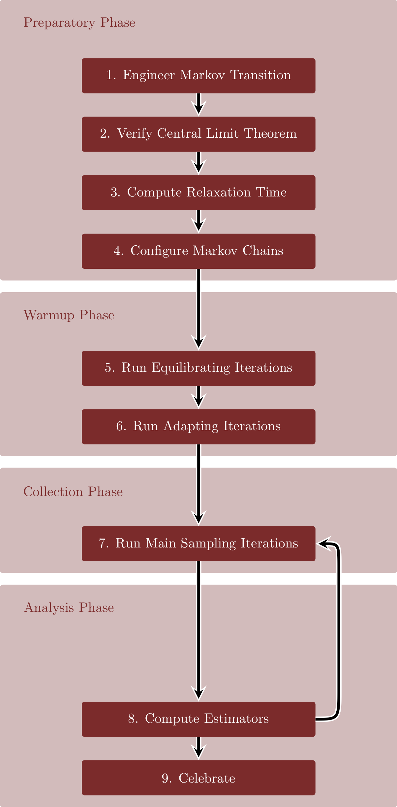
```
<br><br>
</center>

### Markov Chain Monte Carlo In Practice

Sadly we live in the real world, not the more perfect world of where
probabilistic computation is actually pleasant.  In practice we cannot verify
a central limit theorem and work our relaxation times initially.  Consequently
we have to configure our Markov chains in the preparatory phase _heuristically_
and empirically check for any problems.

Because we don't know the relaxation time a priori we have to run the warmup
phase and collection phases for a fixed number of iterations and hope that each
phase is long enough.

The analysis phase now becomes much more demanding, requiring us to diagnose
failures of a Markov chain Monte Carlo central limit theorem or inadequate
warmup before constructing Markov chain Monte Carlo estimators.  If we identify
any problems then we have to reconfigure our Markov chains and run again.  In
the worst case we might have to consider more robust Markov transitions
entirely.

Only once we've empirically verified no signs of transient behavior can be we
celebrate a computation well done.

<center>
<br>
```{r, out.width = "50%", echo=FALSE}
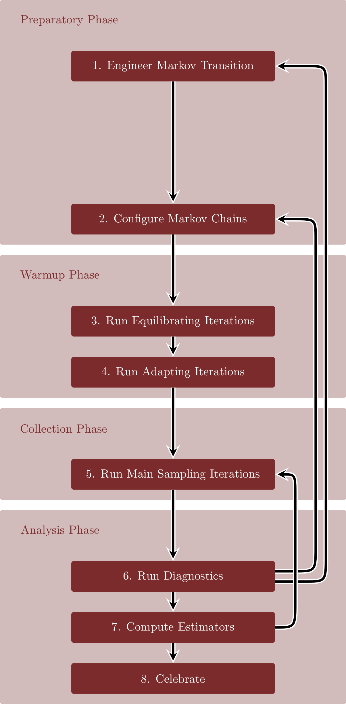
```
<br><br>
</center>

# Putting It All Into Practice

Having developed a comprehensive foundation of Markov chain Monte Carlo -- what
is being estimated, how the error in that estimation can potentially be
quantified, and the best way to manage the risk that we will not get useful
error quantification -- we can now demonstrate these concepts with explicit
examples.  Here we will consider three low-dimensional circumstances, one in
which a Random Walk Metropolis transition does well and two where it does not,
before studying how the ideal behavior of this particular Markov transition
scales with the dimension of the target distribution.

## Functional Estimators

To get a feel for how Markov chain Monte Carlo behaves under ideal circumstances
let's consider a very simple, two-dimensional target distribution specified by
two independent Gaussian probability density functions,
$$
\pi(q) =
\text{normal}(\varpi_{1}(q) ; 1, 1)
\cdot
\text{normal}(\varpi_{2}(q) ; -1, 1).
$$
One advantage of this example is that the component means and variances are
given immediately by the locations and scales, which allows us to compare Markov
chain Monte Carlo estimates to exact values.

In `R` we implement this target distribution by specifying the _log_ target
probability density function to maximize numerical stability.

```{r}
target_lpdf <- function(q) {
  - 0.5 * ( (q[1] - 1)**2 + (q[2] + 1)**2 ) - 0.5 * 2 * log(6.283185307179586)
}
```

Plotting the contours of our target probability density function demonstrates
the uniform curvature which should facilitate efficient sampling.

```{r}
N <- 100
q.1 <- seq(-2, 4, 6 / N)
q.2 <- seq(-4, 2, 6 / N)
densities <- matrix(data = 0, nrow = N + 1, ncol = N + 1)

for (n in 1:N) {
  for (m in 1:N) {
    q <- c(q.1[n], q.2[m])
    densities[n, m] <- exp(target_lpdf(q))
  }
}

contour(q.1, q.2, densities, nlevels=25, main="Gaussian Target Density",
        xlab="q.1", xlim=c(-2, 4),
        ylab="q.2", ylim=c(-4, 2), drawlabels = FALSE, col = c_dark, lwd = 2)
```

After being sure to set an explicit seed to guarantee reproducible results,
let's run a single Markov chain with 5000 total iterations.

```{r}
set.seed(5849586)

n_transitions <- 5000
```

Our Markov chain will be generated by a Random Walk Metropolis proposal
distribution using a diagonal covariance with the same scale for each component.

```{r}
sigma <- 1.4
```

After randomly sampling an initial condition we then realize a Markov chain by
applying the Random Walk transition `n_transition` times.  Note how our use of
the log probability densities ensures more numerically stable computation of the
Metropolis ratio.  We will save the resulting acceptance probabilities along
with the points in the Markov chain to evaluate the performance of the random
walk proposals.

```{r, cache=TRUE}
D <- 2
mcmc_samples <- matrix(data = 0, nrow = n_transitions + 1, ncol = D + 1)

# Seed the Markov chain from a diffuse sample
mcmc_samples[1, 1:D] <- rnorm(D, 0, 3)
mcmc_samples[1, D + 1] <- 1

for (n in 1:n_transitions) {
  q0 <- mcmc_samples[n, 1:D] # Initial point
  qp <- rnorm(D, q0, sigma)  # Proposal

  # Compute acceptance probability
  accept_prob <- min(1, exp(target_lpdf(qp) - target_lpdf(q0)))
  mcmc_samples[n, D + 1] <- accept_prob

  # Apply Metropolis correction
  u = runif(1, 0, 1)
  if (accept_prob > u)
    mcmc_samples[n + 1, 1:D] <- qp
  else
    mcmc_samples[n + 1, 1:D] <- q0
}
```

Once we have generated our Markov chain we can move on to diagnostics and
analysis.  Here I am going to use the estimation functionality defined in
`RStan`, but the default code computes more than we need.  Consequently I'm
first going to do a little bit of work to isolate only the relevant outputs from
the recesses of the code.

```{r}
library(rstan)

fast_monitor <- function(sims, warmup, names=NULL) {
  dim_sims <- dim(sims)
  if (is.null(dim_sims)) {
    dim(sims) <- c(length(sims), 1, 1)
  } else if (length(dim_sims) == 2) {
    dim(sims) <- c(dim_sims, 1)
  } else if (length(dim_sims) > 3) {
    stop("'sims' has more than 3 dimensions")
  }

  parnames <- names
  if (is.null(parnames)) {
    parnames <- paste0("V", seq_len(dim(sims)[3]))
  }
  iter <- dim(sims)[1]
  chains <- dim(sims)[2]
  if (warmup > dim(sims)[1]) {
    stop("warmup is larger than the total number of iterations")
  }
  if (warmup >= 1) {
    sims <- sims[-seq_len(warmup), , , drop = FALSE]
  }

  out <- vector("list", length(parnames))
  out <- setNames(out, parnames)

  for (i in seq_along(out)) {
    sims_i <- sims[, , i]
    mean <- mean(sims_i)
    var <- var(as.vector(sims_i))
    mcse_mean <- rstan:::mcse_mean(sims_i)
    ess <- round(rstan:::ess_rfun(sims_i))
    rhat <- rstan:::rhat_rfun(rstan:::split_chains(sims_i))
    out[[i]] <- c(mean, var, mcse_mean, ess, rhat)
  }

  out <- as.data.frame(do.call(rbind, out))
  colnames(out) <- c("mean", "var", "se_mean", "n_eff", "Rhat")
  rownames(out) <- parnames

  out <- structure(out, chains = chains, iter = iter, warmup = warmup,
                   class = c("simsummary", "data.frame"))
  return(invisible(out))
}
```

We can now compute our diagnostics and Markov chain Monte Carlo estimators after
leaving out the first 100 samples as the heuristic warmup.

```{r}
parameter_names <- c("varpi_1", "varpi_2", "accept_prob")
mcmc_stats <- fast_monitor(array(mcmc_samples, dim = c(n_transitions + 1, 1, 3)),
                           warmup=100, parameter_names)
mcmc_stats
```

Delightfully there are no signs of problems. Both split $\hat{R}$ values are
close to 1 and the relaxation time is large enough that we've been able to
accumulate reasonably large effective sample sizes and small Markov chain Monte
Carlo standard errors for the component means.  Moreover, because we know the
exact expectation values we can verify that the Markov chain Monte Carlo
estimators for $\varpi_{1}$ and $\varpi_{2}$ are returning accurate answers.

The average acceptance probability indicates that about half of our proposals
were accepted and half rejected, which is a reasonable performance.  Poorly
tuned proposal distributions would either accept everything, indicating that
the proposal isn't sufficiently aggressive, or reject everything, indicating
that it is too aggressive.

We can also look at the convergence of these estimators by running the analysis
over increasingly long segments of our Markov chain.

```{r, cache=TRUE}
stride <- 200
M <- n_transitions / stride

iters <- stride * (1:M)

q.1_mean <- rep(0, M)
q.1_se <- rep(0, M)

q.2_mean <- rep(0, M)
q.2_se <- rep(0, M)

for (m in 1:M) {
  running_samples <- array(mcmc_samples[0:iters[m],], dim = c(iters[m], 1, 3))
  mcmc_stats <- fast_monitor(running_samples, warmup=100, parameter_names)

  q.1_mean[m] <- mcmc_stats[1, "mean"]
  q.1_se[m] <- mcmc_stats[1, "se_mean"]

  q.2_mean[m] <- mcmc_stats[2, "mean"]
  q.2_se[m] <- mcmc_stats[2, "se_mean"]
}

par(mfrow=c(1, 2))

plot(1, type="n", main="Mean of q.1",
     xlab="Iteration", xlim=c(0, n_transitions),
     ylab="Monte Carlo Estimator", ylim=c(0.5, 1.5))

polygon(c(iters, rev(iters)), c(q.1_mean - 2 * q.1_se, rev(q.1_mean + 2 * q.1_se)),
        col = c_light_highlight, border = NA)
lines(iters, q.1_mean, col=c_dark, lwd=2)
abline(h=1, col="grey", lty="dashed", lw=2)

plot(1, type="n", main="Mean of q.2",
     xlab="Iteration", xlim=c(0, n_transitions),
     ylab="Monte Carlo Estimator", ylim=c(-2, -0.5))

polygon(c(iters, rev(iters)), c(q.2_mean - 2 * q.2_se, rev(q.2_mean + 2 * q.2_se)),
        col = c_light_highlight, border = NA)
lines(iters, q.2_mean, col=c_dark, lwd=2)
abline(h=-1, col="grey", lty="dashed", lw=2)
```

Not only are our Markov chain Monte Carlo estimators accurate, their increasing
precision is consistent with the existence of a central limit theorem.  Indeed
this example is simple enough that a Markov chain Monte Carlo central limit
theorem can actually be explicitly proven.

## Dysfunctional Estimators

Unfortunately Markov chain Monte Carlo doesn't always behave so well in
practice.  In this section we'll consider two examples that demonstrate just how
wildly Markov chain Monte Carlo can fail, and why we have to adopt to a robust
workflow to maximize our diagnostic sensitivity and manage the risk of these
failures.  The more Markov chains we run, the longer they each run, and the more
functions we analyze the more likely we will be to identify any pathologies that
corrupt the Markov chain Monte Carlo estimators.

Master Yoda put it best after Luke boasted that he wasn't afraid of Markov
chain Monte Carlo.  "You will be", he replied.  "You will be."

### No Equilibrium For Old Men

Let's start facing reality by considering a _funnel_ probability density
function.

```{r}
target_lpdf <- function(q) {
  D <- length(q)

  lpdf <- - 0.5 * q[1]**2 - 0.5 * log(6.283185307179586)
  lpdf <- lpdf - 0.5 * (q[2] / 5)**2 - 0.5 * log(6.283185307179586 * 25)

  for (d in 3:D) {
    lpdf <- lpdf - 0.5 * ((q[d] - q[1]) / exp(q[2]))**2
    lpdf <- lpdf - 0.5 * log(6.283185307179586) - q[2]
  }

  (lpdf)
}
```

The probability density of the last $D - 2$ _local_ parameters is controlled by
the first two _global_ parameters, the first controlling the location and the
second controlling the scale.  We will use the log scale here to ensure that
Markov chains never try to explore negative scales.

This interaction between the first two parameters and the rest induces an
unwelcome geometry in the target probability density function.  As the scale
decreases the target probability density rapidly concentrates around the
location and creates a region of high curvature.  We can visualize this strong
interaction by slicing through the target probability density function with the
location and all but the first local parameter set to zero.

```{r}
N <- 1000
q.3 <- seq(-11, 11, 22 / N)
q.2 <- seq(-10, 2, 12 / N)
densities <- matrix(data = 0, nrow = N + 1, ncol = N + 1)

for (n in 1:N) {
  for (m in 1:N) {
    q <- c(0, q.2[m], q.3[n], 0, 0, 0, 0, 0, 0, 0, 0, 0)
    densities[n, m] <- exp(target_lpdf(q))
  }
}

contour(q.3, q.2, densities, levels=exp(seq(-30, 90, 2)),
        main="Funnel Target Density",
        xlab="q.3", xlim=c(-11, 11),
        ylab="q.2", ylim=c(-10, 2), drawlabels = FALSE, col = c_dark, lwd = 2)
```

With our target set we can ready our Markov chain.  To begin we'll set an
explicit seed and use the same number of transitions as before.

```{r}
set.seed(2852381)

n_transitions <- 5000
```

Being aware of the stronger curvature that we're up against, however,  I am
going to decrease the scale of the random walk transition to allow it to better
resolve the shape of target probability density function.

```{r}
sigma <- 0.5
```

The generation of a Markov chain proceeds exactly as before.

```{r, cache=TRUE}
D <- 12
mcmc_samples <- matrix(data = 0, nrow = n_transitions + 1, ncol = D + 1)

# Seed the Markov chain from a diffuse sample
mcmc_samples[1, 1:D] <- rnorm(D, 0, 5)
mcmc_samples[1, D + 1] <- 1

for (n in 1:n_transitions) {
  # Generate a proposal
  q0 <- mcmc_samples[n, 1:D]
  qp <- rnorm(D, q0, sigma)

  # Compute acceptance probability
  accept_prob <- min(1, exp(target_lpdf(qp) - target_lpdf(q0)))
  mcmc_samples[n + 1, D + 1] <- accept_prob

  # Apply Metropolis correction
  u = runif(1, 0, 1)
  if (accept_prob > u)
    mcmc_samples[n + 1, 1:D] <- qp
  else
    mcmc_samples[n + 1, 1:D] <- q0
}
```

For diagnostics and analysis we will once again jettison the first 100
iterations as warmup.  Additionally let's focus our attention on the global
parameters.

```{r}
parameter_names <- c("mu", "log tau", "accept_prob")
mcmc_stats <- fast_monitor(array(mcmc_samples[,c(1, 2, 13)],
                                 dim = c(n_transitions + 1, 1, 3)),
                           warmup=100, parameter_names)
mcmc_stats
```

The estimated effective sample sizes are extremely small, especially for the
scale, but otherwise nothing seems to indicate a pathology.  That is, however,
until we compare the Markov chain Monte Carlo estimators to their exact values.
One benefit of this funnel example is that the expected location and log scale
are both zero.  Here the expected location is consistent with zero, but the
expected log scale is being drastically overestimated given the small estimated
Markov chain Monte Carlo standard error.

Indeed if we plot the convergence of these estimators we see that only the
estimator for the expected location converges to the exact value.  The estimator
for the expected log scale looks like it is converging to something, but that
something is nowhere near the exact value.

```{r, cache=TRUE}
stride <- 200
M <- n_transitions / stride

iters <- stride * (1:M)

mu_mean <- rep(0, M)
mu_se <- rep(0, M)

log_tau_mean <- rep(0, M)
log_tau_se <- rep(0, M)

for (m in 1:M) {
  running_samples <- array(mcmc_samples[0:iters[m],], dim = c(iters[m], 1, D + 1))
  mcmc_stats <- fast_monitor(running_samples, warmup=100, parameter_names)

  mu_mean[m] <- mcmc_stats[1, "mean"]
  mu_se[m] <- mcmc_stats[1, "se_mean"]

  log_tau_mean[m] <- mcmc_stats[2, "mean"]
  log_tau_se[m] <- mcmc_stats[2, "se_mean"]
}

par(mfrow=c(1, 2))

plot(1, type="n", main="Mean of mu",
     xlab="Iteration", xlim=c(0, n_transitions),
     ylab="Monte Carlo Estimator", ylim=c(-2, 2))

polygon(c(iters, rev(iters)), c(mu_mean - 2 * mu_se, rev(mu_mean + 2 * mu_se)),
        col = c_light_highlight, border = NA)
lines(iters, mu_mean, col=c_dark, lwd=2)
abline(h=0, col="grey", lty="dashed", lw=2)

plot(1, type="n", main="Mean of log tau",
     xlab="Iteration", xlim=c(0, n_transitions),
     ylab="Monte Carlo Estimator", ylim=c(-1, 5))

polygon(c(iters, rev(iters)), c(log_tau_mean - 2 * log_tau_se, rev(log_tau_mean + 2 * log_tau_se)),
        col = c_light_highlight, border = NA)
lines(iters, log_tau_mean, col=c_dark, lwd=2)
abline(h=0, col="grey", lty="dashed", lw=2)
```

Markov chain Monte Carlo is giving us estimators with poorly quantified error,
which we know is a distinct possibility.  The question now is whether or not
there are indications of this failure that would have suggested the failure even
if we didn't already know the exact expected values.

We can firstly look at the estimated component means, which certainly exhibit
some unpleasant behavior.  We see even lower effective sample sizes but, more
importantly, we see large split $\hat{R}$ which suggests transient behavior
manifesting in the output of those functions.

```{r}
parameter_names <- c("mu", "log tau",
                     sapply(1:10, function(d) paste("theta.", d, sep='')),
                     "accept_prob")
mcmc_stats <- fast_monitor(array(mcmc_samples, dim = c(n_transitions+1, 1, D+1)),
                           warmup=100, parameter_names)
mcmc_stats
```

_Some_ functions manifesting transient behavior doesn't necessarily mean that
the Markov chain Monte Carlo estimators for the other functions will be poorly
behaved, but in practice it often does.  At the very least it should be a cause
for concern that motivates further investigation.

To dig deeper let's look at the trace plot of the log scale that seems to be
so problematic.

```{r}
plot(0:n_transitions, mcmc_samples[,2], main="Markov Chain Trace",
     type="l", lwd=0.5, col=c_dark,
     xlab="Iteration", xlim=c(0, n_transitions),
     ylab="log tau")
```

After finding the stationary typical set the Markov chain seems to have settled
into to a reasonable equilibrium.

We can obtain much higher diagnostic power, however, by running a significantly
longer Markov chain that will have more opportunity to encounter any latent
pathologies.

```{r, cache=TRUE}
n_transitions <- 100000
set.seed(8432748)

mcmc_samples <- matrix(data = 0, nrow = n_transitions + 1, ncol = D + 1)

mcmc_samples[1, 1:D] <- rnorm(D, 0, 5)
mcmc_samples[1, D + 1] <- 1

for (n in 1:n_transitions) {
  q0 <- mcmc_samples[n, 1:D]
  qp <- rnorm(D, q0, sigma)

  accept_prob <- min(1, exp(target_lpdf(qp) - target_lpdf(q0)))
  mcmc_samples[n + 1, D + 1] <- accept_prob

  u = runif(1, 0, 1)
  if (accept_prob > u)
    mcmc_samples[n + 1, 1:D] <- qp
  else
    mcmc_samples[n + 1, 1:D] <- q0
}

mcmc_stats <- fast_monitor(array(mcmc_samples, dim = c(n_transitions + 1, 1, D + 1)),
                           warmup=100, parameter_names)
mcmc_stats
```

Not only do many of the split $\hat{R}$ diagnostics remain high, but the
estimated effective sample sizes also don't seem to have changed despite the
twenty fold increase in iterations!  The fact that the estimated effective
samples sizes are not scaling with the number of iterations means that either
we weren't estimating the autocorrelations accurately before or a Markov chain
Monte Carlo central limit theorem doesn't hold and the effective sample size
estimators are not particularly meaningful.

Bringing up the longer trace plot for the log scale demonstrates the horrors a
little more clearly.  After some initial, seemingly pleasant behavior the Markov
chain begins to suffer from periods where it freezes near small values of the
log scale, exactly where the curvature is the largest.  Eventually the Markov
chain even departs on an unexpected excursion to larger values of the log scale.

```{r}
plot(0:n_transitions, mcmc_samples[,2], main="Markov Chain Trace",
     type="l", lwd=0.5, col=c_dark,
     xlab="Iteration", xlim=c(0, n_transitions),
     ylab="log tau")
```

These frozen intervals are consistent with the Markov chain being unable to
sufficiently explore the neighborhood of high curvature at negative log scales,
which would explain why our initial Markov chain Monte Carlo estimator was
biased to such high values.

What we really should have done all along, however, was run multiple chains in
parallel, each initialized at a different point, to maximize the sensitivity of
the split $\hat{R}$ diagnostic.

```{r, cache=TRUE}
n_chains <- 4
n_transitions <- 5000
set.seed(1485389)

mcmc_samples = array(0, dim=c(n_transitions + 1, 4, D + 1))

for (c in 1:n_chains) {
  mcmc_samples[1, c, 1:D] <- rnorm(D, 0, 5)
  mcmc_samples[1, c, D + 1] <- 1

  for (n in 1:n_transitions) {
    q0 <- mcmc_samples[n, c, 1:D]
    qp <- rnorm(D, q0, sigma)

    accept_prob <- min(1, exp(target_lpdf(qp) - target_lpdf(q0)))
    mcmc_samples[n + 1, c, D + 1] <- accept_prob

    u = runif(1, 0, 1)
    if (accept_prob > u)
      mcmc_samples[n + 1, c, 1:D] <- qp
    else
      mcmc_samples[n + 1, c, 1:D] <- q0
  }
}

mcmc_stats <- fast_monitor(mcmc_samples, warmup=100, parameter_names)
mcmc_stats
```

Even with fewer iterations this ensemble of Markov chains demonstrates clearly
inconsistent behavior which manifests in large enough values of split $\hat{R}$
to nullify our optimism in equilibrated Markov chains.  This is also evident
in the visual trace plots which show completely different behavior for each
Markov chain.

```{r}
par(mfrow=c(1, 4))
for (c in 1:4) {
  plot(0:n_transitions, mcmc_samples[, c, 2], main=paste("Chain", c, sep=" "),
       type="l", lwd=1, col=c_dark,
       xlab="Iteration", xlim=c(0, n_transitions),
       ylab="log tau")
}
```

### Are We There Yet?

Shaken we can now consider metastabilities with a target distribution specified
as a _mixture_ of Gaussian probability density functions,
$$
\pi(q) =
\theta \,
\text{normal} (\varpi_{1}(q) \mid 4, 1) \,
\text{normal} (\varpi_{2}(q) \mid 8, 2)
+
(1 - \theta) \,
\text{normal} (\varpi_{1}(q) \mid -8, 2) \,
\text{normal} (\varpi_{2}(q) \mid -4, 1)
$$
with the mixture probability
$$
\theta = 1 - \theta = 0.5.
$$

```{r}
D <- 2

target_lpdf1 <- function(q) {
  mu.1 <- 4
  sigma.1 <- 1

  mu.2 <- 8
  sigma.2 <- 2

  lpdf <- -0.5 * ( ((q[1] - mu.1) / sigma.1)**2 + ((q[2] - mu.2) / sigma.2)**2 )
  lpdf <- lpdf - 0.5 * log(6.283185307179586) - log(sigma.1) - log(sigma.2)
  lpdf
}

target_lpdf2 <- function(q) {
  mu.1 <- -8
  sigma.1 <- 2

  mu.2 <- -4
  sigma.2 <- 1

  lpdf <- -0.5 * ( ((q[1] - mu.1) / sigma.1)**2 + ((q[2] - mu.2) / sigma.2)**2 )
  lpdf <- lpdf - 0.5 * log(6.283185307179586) - log(sigma.1) - log(sigma.2)
  lpdf
}

target_lpdf <- function(x) {
  lpdf1 <- log(0.5) + target_lpdf1(x)
  lpdf2 <- log(0.5) + target_lpdf2(x)
  if (lpdf1 > lpdf2) {
    lpdf <- lpdf1 + log(1 + exp(lpdf2 - lpdf1))
  } else {
    lpdf <- lpdf2 + log(1 + exp(lpdf1 - lpdf2))
  }
  (lpdf)
}
```

The mixture of the two Gaussian probability density functions manifests in two
well-separated neighborhoods of high probability separated by a valley of low
probability.  In other words we need to be able to quantify two metastabilities
in order to ensure accurate estimation of expectation values.

```{r}
N <- 200
q.1 <- seq(-13, 7, 20 / N)
q.2 <- seq(-7, 13, 20 / N)
densities <- matrix(data = 0, nrow = N + 1, ncol = N + 1)

for (n in 1:N) {
  for (m in 1:N) {
    q <- c(q.1[n], q.2[m])
    densities[n, m] <- exp(target_lpdf(q))
  }
}

contour(q.1, q.2, densities, nlevels=30, main="Metastable Target Density",
        xlab="q.1", xlim=c(-13, 7),
        ylab="q.2", ylim=c(-7, 13), drawlabels = FALSE, col = c_dark, lwd = 2)
```

Refusing to learn our lessons from the last example let's go back to running a
single chain that's relatively short for Random Walk Metropolis.

```{r, cache=TRUE}
n_transitions <- 5000
set.seed(5849586)

sigma <- 2

mcmc_samples <- matrix(data = 0, nrow = n_transitions + 1, ncol = D + 1)

# Seed the Markov chain from a diffuse sample
mcmc_samples[1, 1:D] <- rnorm(D, 0, 5)
mcmc_samples[1, D + 1] <- 1

for (n in 1:n_transitions) {
  q0 <- mcmc_samples[n, 1:D] # Initial point
  qp <- rnorm(D, q0, sigma)  # Proposal

  # Compute acceptance probability
  accept_prob <- min(1, exp(target_lpdf(qp) - target_lpdf(q0)))
  mcmc_samples[n, D + 1] <- accept_prob

  # Apply Metropolis correction
  u = runif(1, 0, 1)
  if (accept_prob > u)
    mcmc_samples[n + 1, 1:D] <- qp
  else
    mcmc_samples[n + 1, 1:D] <- q0
}
```

We discard the first 100 iterations as heuristic warmup and compute our
diagnostics and estimators.  Both split $\hat{R}$ and the effective sample sizes
looks good.  Even the average Metropolis acceptance probability is reasonable,
indicating a solid tuning of the proposal distribution.

```{r}
parameter_names <- c("varpi_1", "varpi_2", "accept_prob")
mcmc_stats <- fast_monitor(array(mcmc_samples, dim = c(n_transitions + 1, 1, 3)),
                           warmup=100, parameter_names)
mcmc_stats
```

The trace plots also look consistent with a Markov chain that is enjoying a
lush equilibrium.

```{r}
par(mfrow=c(1, 2))

plot(0:n_transitions, mcmc_samples[,1], main="",
     type="l", lwd=0.5, col=c_dark,
     xlab="Iteration", xlim=c(0, n_transitions),
     ylab="varpi_1")

plot(0:n_transitions, mcmc_samples[,2], main="",
     type="l", lwd=0.5, col=c_light,
     xlab="Iteration", xlim=c(0, n_transitions),
     ylab="varpi_2")
```

That said, in this case we know better.  The Markov chain should be exploring
both metastabilities, but the trace plots and Markov chain Monte Carlo
estimators indicate that we are exploring only one.  In this two-dimensional
case we can explicitly verify the insufficient exploration by plotting the
evolution of the Markov chain over the target probability density function.  We
see the relaxation into one of the metastabilities and the complete ignorance of
the other.

```{r}
par(mfrow=c(1, 1))
contour(q.1, q.2, densities, nlevels=30, main="Metastable Target Density",
        xlab="q.1", xlim=c(-13, 7),
        ylab="q.2", ylim=c(-7, 13), drawlabels = FALSE, col = c_dark, lwd = 2)
lines(mcmc_samples[,1], mcmc_samples[,2], lwd=0.5, col=c_light)
```

In hindsight this behavior shouldn't be all that surprising for Random Walk
Metropolis.  The proposal distribution makes only small perturbations around
the initial point and the acceptance procedure uses only the information
encoded in the target probability density function at the initial and proposed
points.  Because the resulting Markov transition distribution exploits only
_local_ information the resulting Markov chains have no reason to consider the
existence of another neighborhood of high probability.

If we run long enough, however, then the Markov chain should probe the tails of
the first metastability deeply enough to find the second.  Let's try running
forty times as long.

```{r}
n_transitions <- 200000
set.seed(5849586)

mcmc_samples <- matrix(data = 0, nrow = n_transitions + 1, ncol = D + 1)

mcmc_samples[1, 1:D] <- rnorm(D, 0, 5)
mcmc_samples[1, D + 1] <- 1

for (n in 1:n_transitions) {
  q0 <- mcmc_samples[n, 1:D]
  qp <- rnorm(D, q0, sigma)

  accept_prob <- min(1, exp(target_lpdf(qp) - target_lpdf(q0)))
  mcmc_samples[n + 1, D + 1] <- accept_prob

  u = runif(1, 0, 1)
  if (accept_prob > u)
    mcmc_samples[n + 1, 1:D] <- qp
  else
    mcmc_samples[n + 1, 1:D] <- q0
}
```

Analyzing the longer Markov chain we see a clear difference in behavior.  The
split $\hat{R}$ values have significantly increased and the effective sample
sizes have plummeted.

```{r}
mcmc_stats <- fast_monitor(array(mcmc_samples, dim = c(n_transitions + 1, 1, D + 1)),
                           warmup=100, parameter_names)
mcmc_stats
```

Looking at the trace plots we can see that both coordinate functions make a
single sharp transitions consistent with a jump from one metastability to
another.

```{r}
par(mfrow=c(1, 2))

plot(0:n_transitions, mcmc_samples[,1], main="",
     type="l", lwd=0.5, col=c_dark,
     xlab="Iteration", xlim=c(0, n_transitions),
     ylab="varpi_1")

plot(0:n_transitions, mcmc_samples[,2], main="",
     type="l", lwd=0.5, col=c_light,
     xlab="Iteration", xlim=c(0, n_transitions),
     ylab="varpi_2")
```

This is even more clear if we plot the evolution of both coordinate functions
together,

```{r}
par(mfrow=c(1, 1))
contour(q.1, q.2, densities, nlevels=30, main="Metastable Target Density",
        xlab="q.1", xlim=c(-13, 7),
        ylab="q.2", ylim=c(-7, 13), drawlabels = FALSE, col = c_dark, lwd = 2)
lines(mcmc_samples[,1], mcmc_samples[,2], lwd=0.5, col=c_light)
```

Even after running 200000 iterations we've accumulated only one transition
between the metastabilities and only about a single effective sample.  In order
to equilibrate to where a Markov chain Monte Carlo central limit theorem is
approximately valid, let alone to achieve reasonably precise Markov chain Monte
Carlo estimators, we would have to run at least ten times more iterations, which
quickly becomes impractical.

While a longer Markov chain still isn't enough for precise estimation, it at
least provides some diagnostic power to the metastable nature of the initial
exploration.  We achieve much higher sensitivity with less computation, however,
by running multiple Markov chains.

```{r, cache=TRUE}
n_chains <- 4
n_transitions <- 5000
set.seed(5849586)

mcmc_samples = array(0, dim=c(n_transitions + 1, 4, D + 1))

for (c in 1:n_chains) {
  mcmc_samples[1, c, 1:D] <- rnorm(D, 0, 5)
  mcmc_samples[1, c, D + 1] <- 1

  for (n in 1:n_transitions) {
    q0 <- mcmc_samples[n, c, 1:D]
    qp <- rnorm(D, q0, sigma)

    accept_prob <- min(1, exp(target_lpdf(qp) - target_lpdf(q0)))
    mcmc_samples[n + 1, c, D + 1] <- accept_prob

    u = runif(1, 0, 1)
    if (accept_prob > u)
      mcmc_samples[n + 1, c, 1:D] <- qp
    else
      mcmc_samples[n + 1, c, 1:D] <- q0
  }
}
```

With just four short Markov chains we already see indications of serious
problems in the exploration.

```{r}
mcmc_stats <- fast_monitor(mcmc_samples, warmup=100, parameter_names)
mcmc_stats
```

Taking a quick look at the trace plots we can see that this diagnostic
sensitivity comes from the fact that the each Markov chain initially explores a
different metastability making it easy to see their inconsistencies.

```{r}
par(mfrow=c(2, 4))
for (c in 1:4) {
  plot(0:n_transitions, mcmc_samples[,c,1], main=paste("Chain", c, sep=" "),
       type="l", lwd=0.5, col=c_dark,
       xlab="Iteration", xlim=c(0, n_transitions),
       ylab="varpi_1", ylim=c(-13, 7))
}

for (c in 1:4) {
  plot(0:n_transitions, mcmc_samples[,c,2], main=paste("Chain", c, sep=" "),
       type="l", lwd=0.5, col=c_light,
       xlab="Iteration", xlim=c(0, n_transitions),
       ylab="varpi_2", c(-7, 13))
}
```

As upsetting as this example might be, it's actually pretty tame compared to
the metastabilities that can arise in practice.  As we consider higher
dimensional target distributions the distance between metastabilities grows, and
Markov transition distributions informed by local information become less and
less effective at jumping between them.  Without running multiple Markov chains
we can never quite be sure if we are missing a neighborhood of high probability
hiding in the outskirts of our initial exploration.

## Trial and Error in High Dimensions

We've seen some of the good and bad behaviors of Markov chain Monte Carlo, but
even those good behaviors can be insufficient in practice. Let's consider, for
example, what happens to Random Walk Metropolis as the dimensionality of the
target distribution increases.

Beyond a few dimensions the most efficient compression of our target
distribution is its typical set.  If we want to prepare to journey into higher
dimensional problems then our exploration needs to be compatible with this
geometry.

In high dimensions the proposal distribution is strongly influenced by the
increasing volume towards infinity.  The Gaussian proposal density functions of
Random Walk Metropolis are skewed away from the mode and, if the scale is too
large, out of the typical set entirely.  Consequently we shouldn't think of this
proposal distribution as a fuzzy sphere but rather an fuzzy _teardrop_ that
asymmetrically jumps away from the interior of the typical set rather than
towards it.

<center>
<br>
```{r, out.width = "50%", echo=FALSE}

```
<br><br>
</center>

Those who really want to maintain the abstraction that a product of independent
Gaussian probability density functions should be isotropic have to warp their
concept of the typical set a little bit.  Locally we can maintain a sense of
isotropy if we think about the typical set being wrapped around the current
point, just like string wrapped around a finger.

<center>
<br>
```{r, out.width = "50%", echo=FALSE}

```
<br><br>
</center>

This perspective ensures that more proposals fall outside of the typical set
than inside, but only at the expense of making sense only in the neighborhood of
a particular point.  If we move to another point then we have to warp the
typical set around that point to properly move this perspective.  As always,
high-dimensional spaces are weird and visualizing them for our low-dimensionally
trained brains is hard.

It doesn't matter how we strain our minds to intuit this high-dimensional
behavior so long as we recognize that the random walk proposal distributions
strongly prefer new points that lie outside of the typical set.  Proposals
outside of the typical set are then rejected by the acceptance procedure
because of how quickly the target probability density decays as we move away
from the mode at the center of the typical set.

In other words the proposal distribution suggests points in neighborhoods of
high differential volume while the acceptance procedure filters out any points
of low probability density.  Consequently the only jumps that are actually
accepted are to points with both sufficient differential volume and target
probability density, which are exactly those points in the stationary typical
set.

Ultimately Metropolis-Hastings algorithms explore through trial and error.  Each
proposal guesses where the typical set continues beyond the current point with
the acceptance procedure checking those guesses and rejecting any that have
chosen poorly.  The problem is that as we consider higher and higher dimensions,
and the typical set becomes narrower and narrower, good guesses become rarer and
rarer.

Unfortunately the inefficiency of the random walk trial and error persists no
matter how we tune our proposal distributions.  Large jumps push further outside
of the typical set and hence are rejected more often.  Small jumps are still
repelled by the mode, but they don't jump far enough to leave the typical set
and hence tend to be accepted more.  The jumps are so small, however, that the
resulting Markov chain makes little progress in moving away from the initial
point to other neighborhoods in the typical set.

<center>
<br>
```{r, out.width = "50%", echo=FALSE}

```
<br><br>
</center>

This high-dimensional behavior can also be derived theoretically, at least for
target distributions specified by a sufficiently large product of independent
and identical probability density functions.  [@RobertsEtAl:1997] showed that
in this case the performance of Markov chain Monte Carlo estimators decreases
inversely with dimension _no matter how the random walk proposal distribution is
tuned_.  They also worked out that the scales that achieve optimal performance
asymptotically decrease with the square root of dimension, and that those
optimal scales achieve the same average acceptance probability of about $0.234$.

We can verify these results with simulation, defining our target probability
density function as a product of unit normal probability density functions,
allowing us to quickly scale to an arbitrary number of dimensions,
$$
\pi(q) = \prod_{i = 1}^{I} \text{normal}( \varpi_{i}(q) \mid 0, 1).
$$

```{r}
target_lpdf <- function(q) {
  -0.5 * sum(q**2) - 0.5 * length(q) * log(6.283185307179586)
}
```

Let's first consider how the performance of Random Walk Metropolis changes when
we employ a fixed Markov transition.

```{r}
sigma <- 1.4
```

In particular let's track the average acceptance probability and average
effective sample size for all of the components as we increase from one
dimension to ten.

```{r, cache=TRUE}
n_transitions <- 10000
set.seed(5843828)

Ds <- 1:10

accept_prob_means <- 0 * Ds
accept_prob_ses <- 0 * Ds
ave_eff_sample_sizes <- 0 * Ds

for (D in Ds) {
  mcmc_samples <- matrix(data = 0, nrow = n_transitions + 1, ncol = D + 1)

  # Seeding the initial state with an exact sample from the target
  # distribution ensures that we start in the typical set and avoid
  # having to worry about warmup
  mcmc_samples[1, 1:D] <- rnorm(D, 0, 1)
  mcmc_samples[1, D + 1] <- 1

  for (n in 1:n_transitions) {
    # Generate a proposal
    q0 <- mcmc_samples[n, 1:D]
    qp <- rnorm(D, q0, sigma)

    # Compute acceptance probability
    accept_prob <- min(1, exp(target_lpdf(qp) - target_lpdf(q0)))
    mcmc_samples[n + 1, D + 1] <- accept_prob

    # Apply Metropolis correction
    u = runif(1, 0, 1)
    if (accept_prob > u)
      mcmc_samples[n + 1, 1:D] <- qp
    else
      mcmc_samples[n + 1, 1:D] <- q0
  }

  # Compute MCMC estimator statistics
  mcmc_stats <- fast_monitor(array(mcmc_samples,
                                   dim = c(n_transitions + 1, 1, D + 1)),
                             warmup=0)

  accept_prob_means[D] <- mcmc_stats[D + 1, "mean"]
  accept_prob_ses[D] <- mcmc_stats[D + 1, "se_mean"]

  # Estimate effective sample size
  ave_eff_sample_sizes[D] <- mean(mcmc_stats[1:D, "n_eff"])
}
```

As expected the fixed proposal distribution suffers as we push to higher
dimensions.  With each increasing dimension the proposals are pulled further
outside of the typical set, resulting in more rejections and slower exploration.
This slower exploration then results in rapidly decaying effective sample sizes.

```{r}
par(mfrow=c(1, 2))

# Plot average acceptance probability verses dimension
idx <- rep(Ds, each=2)
plot_Ds <- sapply(1:length(idx), function(b) if(b %% 2 == 0) idx[b] + 0.5 else idx[b] - 0.5)

pad_means <- do.call(cbind, lapply(idx, function(n) accept_prob_means[n]))
pad_ses <- do.call(cbind, lapply(idx, function(n) accept_prob_ses[n]))

plot(1, type="n", main="",
xlim=c(head(Ds, 1) - 0.5, tail(Ds, 1) + 0.5), xlab="Dimension",
ylim=c(0, 1), ylab="Average Acceptance Probability")

abline(h=0.234, col="grey", lty="dashed", lw=2)

polygon(c(plot_Ds, rev(plot_Ds)), c(pad_means + 2 * pad_ses, rev(pad_means - 2 * pad_ses)),
col = c_light, border = NA)
lines(plot_Ds, pad_means, col=c_dark, lwd=2)

# Plot effective sample size per iteration verses dimension
pad_eff <- do.call(cbind, lapply(idx, function(n) ave_eff_sample_sizes[n]))

plot(1, type="n", main="", xlim=c(0, 10), xlab="Dimension",
ylim=c(0, 0.3), ylab="Average Effective Sample Size Per Iteration")

lines(plot_Ds, pad_eff / n_transitions, col=c_dark, lwd=2)
```

That said, there's no reason why a proposal distribution that works well in one
dimension should work well in ten dimensions.  How much can we fight against
the increasing dimension by tuning the proposal distribution?  To determine this
I empirically worked out the optimal proposal scales for each dimension by
running large ensembles of Markov chains while scanning across possible scales
to see where the effective sample sizes peaked.  Interestingly this purely
empirical tuning closely matches the square root of dimension decrease expected
from theory.

```{r}
opt_sigmas <- c(2.5, 1.75, 1.5, 1.2, 1.15, 1.0, 0.95, 0.85, 0.8, 0.75)

plot(Ds, opt_sigmas, main="", col=c_dark, pch=16, cex=1,
     xlim=c(head(Ds, 1) - 0.5, tail(Ds, 1) + 0.5), xlab="Dimension",
     ylim=c(0, 3), ylab="Optimal Scale")
lines(seq(1, 10.5, 0.1), 2.4 / sqrt(seq(1, 10.5, 0.1)), col=c_light, lwd=2)
```

We can now try again using these optimal scales and see if we do any better.

```{r, cache=TRUE}
for (D in Ds) {
  mcmc_samples <- matrix(data = 0, nrow = n_transitions + 1, ncol = D + 1)

  # Seeding the initial state with an exact sample
  # from the target distribution ensures that we
  # start in the typical set and avoid having to
  # worry about warmup.
  mcmc_samples[1, 1:D] <- rnorm(D, 0, 1)
  mcmc_samples[1, D + 1] <- 1

  for (n in 1:n_transitions) {
    # Generate a proposal
    q0 <- mcmc_samples[n, 1:D]
    qp <- rnorm(D, q0, opt_sigmas[D])

    # Compute acceptance probability
    accept_prob <- min(1, exp(target_lpdf(qp) - target_lpdf(q0)))
    mcmc_samples[n, D + 1] <- accept_prob

    # Apply Metropolis correction
    u = runif(1, 0, 1)
    if (accept_prob > u)
      mcmc_samples[n + 1, 1:D] <- qp
    else
      mcmc_samples[n + 1, 1:D] <- q0
  }

  # Compute MCMC estimator statistics
  mcmc_stats <- fast_monitor(array(mcmc_samples, dim = c(n_transitions + 1, 1, D + 1)), warmup=0)

  accept_prob_means[D] <- mcmc_stats[D + 1, "mean"]
  accept_prob_ses[D] <- mcmc_stats[D + 1, "se_mean"]

  # Estimate effective sample size
  ave_eff_sample_sizes[D] <- mean(mcmc_stats[1:D, "n_eff"])
}
```

Using the optimal scales definitely improved performance.  Decreasing the jump
distance with dimension stabilizes the average acceptance probability near the
theoretical optimum.  At the same time the average incremental effective sample
sizes increase a little bit relative to the fixed tuning.  Unfortunately, we're
fighting a losing battle.  While the effective samples sizes are larger they
still decay rapidly with increasing dimension.

```{r}
par(mfrow=c(1, 2))

# Plot average acceptance probability verses dimension
pad_means <- do.call(cbind, lapply(idx, function(n) accept_prob_means[n]))
pad_ses <- do.call(cbind, lapply(idx, function(n) accept_prob_ses[n]))

plot(1, type="n", main="",
     xlim=c(head(Ds, 1) - 0.5, tail(Ds, 1) + 0.5), xlab="Dimension",
     ylim=c(0, 1), ylab="Average Acceptance Probability")

abline(h=0.234, col="grey", lty="dashed", lw=2)

polygon(c(plot_Ds, rev(plot_Ds)), c(pad_means + 2 * pad_ses, rev(pad_means - 2 * pad_ses)),
        col = c_light, border = NA)
lines(plot_Ds, pad_means, col=c_dark, lwd=2)

# Plot effective sample size per iteration verses dimension
pad_eff <- do.call(cbind, lapply(idx, function(n) ave_eff_sample_sizes[n]))

plot(1, type="n", main="", xlim=c(0, 10), xlab="Dimension",
     ylim=c(0, 0.3), ylab="Average Effective Sample Size Per Iteration")

lines(plot_Ds, pad_eff / n_transitions, col=c_dark, lwd=2)
```

Even under ideal circumstances where we enjoy a Markov chain Monte Carlo
central limit theorem, the performance of Random Walk Metropolis will suffer
dramatically as we push towards higher dimensional target distributions.  The
situation becomes even worse when we consider more sophisticated target
distributions, like those specified by funnel probability density functions,
whose intricate interactions can reduce performance even further if not impede
a Markov chain Monte Carlo central limit theorem outright.

Ultimately the efficiency of guessing and checking will always suffer with
increasing dimension.  In order to maintain performance as well as possible we
need to employ more sophisticated proposal distributions, or entirely new
Markov transitions, that exploit more information about the target distribution.
Hamiltonian Monte Carlo is a particularly useful approach in this regard, but
that will have to wait for its own case study.

# Conclusions

Principled probabilistic computation with quantifiable errors is both necessary
for robust application and frustratingly challenging to verify in practice.
Markov chain Monte Carlo offers a relatively general approach to this problem
that, while not always successful, offers enough diagnostic information to give
us a decent chance of identifying its failures when we take the time to look
closely enough.  By implementing Markov chain Monte Carlo through a proper
workflow we can force ourselves to take that time and increase our ability to
manage the risk.

In other words if we treat Markov chain Monte Carlo as a delicate tool that
must be handled with care then we may be able to secure quantifiable error with
only a finite amount of computation in sufficiently well-behaved problems.  At
the same time we may be able to empirically identify the poorly-behaved problems
where the method isn't expected to work well.  That might not sound like much,
but in the brutal conflict that is probabilistic computation on the frontiers of
applied statistics that's about as much hope as we can expect.

To truly realize the power of Markov chain Monte Carlo we need to combine a
robust workflow with Markov transitions that use as much information about the
target distribution to ensure as possible to maximize both performance and
diagnostic power.  That is where modern algorithms like Hamiltonian Monte Carlo
really shine.

# Appendix: Convergent Vocabulary

One of the most confusing aspects of Markov chain Monte Carlo is the common
misuse of the word "converge".  "Converge" and "convergence" are often used to
denote similar but subtly different concepts, making it difficult to follow
along with any precision.  In this section I hope to clarify the well-defined
uses of these terms to help reduce the confusion as much as possible.

Firstly we have to recognize that convergence is formally an _asymptotic_
phenomenon.  Convergence implies that a growing sequence of objects,
$$
\left\{\theta_{1}, \theta_{2}, \ldots, \theta_{N - 1}, \theta_{N} \right\},
$$
is getting closer and closer to some limiting value, $\theta^{*}$. Only the
final element of that infinitely long sequence, however, is guaranteed to reach
the limiting value exactly,
$$
\lim_{N \rightarrow \infty} \theta_{N} = \theta^{*}.
$$
Technically _nothing_ ever converges after only a finite amount of iterations.
That said, after enough iteations, $N_{\epsilon}$, the objects in the sequence
will get arbitrarily close to limiting value
$$
| \theta_{n} - \theta_{\infty} | \lt \epsilon, \, \forall n > N_{\epsilon}
$$
and the difference doesn't matter in practice.  Without an explicit threshold
defining when the differences no longer matter, this kind of approximate
convergence isn't well-defined but it is often used when building intuition
about _how_ sequences converge.  If we want to be careful then we have to
separate out formal convergence and more casual concepts like effective
convergence.

The second important contribution to the notational confusion is exactly what
objects are converging.  For example, we could consider the last point in a
growing Markov chain.  Under the sufficiently nice conditions the two ends of an
infintely long Markov chain become uncorrelated and the last point will
asymptotically converge to an exact sample from the target distribution.  When
the correlation between the two ends of the Markov chain is vanishingly small we
might say that the end point has effectively converged to an exact sample.

Instead of considering a single realization of a Markov chain we can also
consider the $N$-step distributions that quantify the scope of possible
realizations of the Markov chain marginally at each iteration.  Under some
technical conditions the $N$-step distribution will asymptotically converge to
the stationary distribution of the Markov transition,
$$
\lim_{N \rightarrow \infty} T^{N} \rho = \pi.
$$
Similarly, the expectation of an integrable function $f$ with respect to the
$N$-step distribution will converge to the corresponding expectation value with
respect to the stationary probability distribution,
$$
\lim_{N \rightarrow \infty} \mathbb{E}_{T^{N} \rho}[f] = \mathbb{E}_{\pi}.
$$

While the end of a Markov chain converges, the entire Markov chain itself
doesn't really converge to anything.  Even in the asymptotic limit, for example,
the Markov chain can't converge to an ensemble of exact samples because the
earlier states will always contain residue of the initialization.
_Expectations over the history of a Markov chain_, however, do have well-defined
asymptotic behaviors.

The immediate example is the Markov chain Monte Carlo estimator of any
integrable function which converges to the corresponding expectation value with
respect to the stationary probability distribution for almost every Markov chain
realization.  Because this holds for almost every realized Markov chain, it also
implies that the average of the $N$-step expectation values converge to the
stationary expectation value,
$$
\lim_{N \rightarrow \infty} \frac{1}{N + 1} \sum_{n = 0}^{N}
\mathbb{E}_{T^{N} \rho}[f] = \mathbb{E}_{\pi},
$$
or in sufficiently nice cases equivalently
$$
\lim_{N \rightarrow \infty} \frac{1}{N + 1} \sum_{n = 0}^{N} T^{N} \rho = \pi.
$$

Practitioners often focus on the convergence of the last point in a Markov
chain, or equivalently the $N$-step distribution.  What is more relevant in
practice, however, is the convergence of Markov chain Monte Carlo estimators
that average over the entire Markov chain.  It is the behavior of this
convergence that ultimately defines our error quantification, or lack thereof,
and hence what should be our conceptual priority.

# Acknowledgements {-}

I thank Sam Livingstone, Charles Margossian, and Siddhant Wahal for helpful
comments.  I am also indebted for the feedback from those who have attended my
courses and talks.

A very special thanks to everyone supporting me on Patreon: Abhinav Katoch,
Abhishek Vasu,Adam Slez,Aki Vehtari,Alan O'Donnell,Alex Gao,Alexander Bartik,
Alexander Noll,Anders Valind,Andrea Serafino,Andrew Rouillard,
Andrés Castro Araújo,Antoine Soubret,Arya Alexander Pourzanjani,asif zubair,
Austin Rochford,Aviv Keshet,Avraham Adler,Ben Matthews,Bradley Wilson,Brett,
Brian Callander,Brian Clough,Brian Hartley,Bryan Galvin,Bryan Yu,Canaan Breiss,
Cat Shark,Chad Scherrer,Charles Naylor,Chase Dwelle,Chris Cote,Chris Zawora,
Cole Monnahan,Colin Carroll,Colin McAuliffe,D,Damien Mannion,dan mackinlay,
Dan W Joyce,Daniel Elnatan,Daniel Hocking,Daniel Rowe,Daniel Simpson,
Danielle Navarro,Darshan Pandit,David Pascall,David Roher,Derek G Miller,
Diogo Melo,Ed Berry,Ed Cashin,Eddie Landesberg,Elizaveta Semenova,Erik Banek,
Ero Carrera,Evan Russek,Felipe González,Finn Lindgren,Francesco Corona,
Garrett Mooney,George Ho,Granville Matheson,Guido Biele,Guilherme Marthe,
Hamed Bastan-Hagh,Haonan Zhu,Hernan Bruno,Ilan Reinstein,Ilaria Prosdocimi,
Isaac S,J Michael Burgess,JamesU,Jeff Dotson,Jeffrey Arnold,Jessica Graves,
Joel Kronander,John Helveston,Jonathan Judge,Jonathan Sedar,jonathan St-onge,
Josh Weinstock,Joshua Cortez,Joshua Duncan,Joshua Mayer,Josué Mendoza,JS,
jsdenain,Justin Bois,Juuso Parkkinen,Karim Naguib,Karim Osman,Kazuki Yoshida,
Kejia Shi,Kyle Ferber,Kádár András,Lars Barquist,Leo Burgy,lizzie,Luiz Carvalho,
Lukas Neugebauer,Marc Dotson,Marc Trunjer Kusk Nielsen,Mark Donoghoe,Markus P.,
Martin Modrák,Matthew Kay,Matthew Quick,Matthew T Stern,Maurits van der Meer,Max,
Maxim Ananyev,Maxim Kesin,Michael Colaresi,Michael DeWitt,Michael Dillon,
Michael Griffiths,Michael Redman,Michael Thomas,Mike Lawrence,Mikhail Popov,
mikko heikkilä,mogs tau teta tau,Monkel,Nathan Rutenbeck,Nicholas Cowie,
Nicholas Knoblauch,Nicholas Ursa,Nicolas Frisby,Noah Guzman,Ole Rogeberg,
Oliver Clark,Olivier Ma,Onuralp Soylemez,Patrick Boehnke,Pau Pereira Batlle,
Paul Oreto,Peter Heinrich,Peter Schulam,Pieter van den Berg ,Reed Harder,
Riccardo Fusaroli,Richard Jiang,Richard Torkar,Robert Frost,Robert Goldman,
Robert J Neal,Robert kohn,Robin Taylor,Sam Zimmerman,Sam Zorowitz,Sean Talts,
Seo-young Kim,Sergiy Protsiv,Seth Axen,Shira,Simon Duane,Simon Lilburn,
Stephen Lienhard,Stephen Oates,Steve Bertolani,Steven Langsford,Stijn,
Sue Marquez,Taco Cohen,Teddy Groves,Teresa Ortiz,Think_Med,Thomas Littrell,
Thomas Vladeck,Tiago Cabaço,Tim Howes,Trey Spiller,Tristan Mahr,Tyrel Stokes,
Vanda Inacio de Carvalho,Vasa Trubetskoy,Ville Inkilä,vittorio trotta,Will Farr,
yolhaj, and Z.

# References {-}

<div id="refs"></div>

# License {-}

The code in this case study is copyrighted by Michael Betancourt and licensed
under the new BSD (3-clause) license:

https://opensource.org/licenses/BSD-3-Clause

The text and figures in this case study are copyrighted by Michael Betancourt
and licensed under the CC BY-NC 4.0 license:

https://creativecommons.org/licenses/by-nc/4.0/

# Original Computing Environment {-}

```{r, comment=NA}
sessionInfo()
```
