```{r setup, include=FALSE}
knitr::opts_chunk$set(comment=NA)
```

Decision making is a critical task that spans not just science and industry but
arguably the entire human experience.  At the same time, decision making in
complex applications is notoriously subtle and counterintuitive.  

How do we make a principled selection between a set of actions, $A$?  This 
decision becomes straightforward if each possible action is assigned a
_utility_,
$$ 
\begin{alignat*}{6}
U :\; &A& &\rightarrow& \; &\mathbb{R}^{+}&
\\
&a& &\mapsto& &U(x)&,
\end{alignat*}
$$
that quantifies the overall benefit of that action minus any costs.  Given such
a utility assignment we could then simply select the action with the highest 
utility, 
$$
a^{*} = \underset{a \in A}{\text{argmax}} U(a).
$$
In practice, however, even the most rigorous utility assignments will depend on 
circumstances we do not know with perfect certainty.  Here we must rely on 
_inferences_ to inform those circumstances and motivate effective decision 
making.

In this case study we'll review the foundations of statistical models and
statistical inference that advise principled decision making.  We'll place a
particular emphasis on Bayesian inference, which utilizes probability theory and
statistical modeling to encapsulate information from observed data and our own 
domain expertise.

I take an observational perspective here that presumes the existence of a true
data generating process that generates the observations from which we learn.
This perspective is not universal and clashes with some philosophical 
perspectives on statistics that are not uncommon in popular introductory texts.  
Fortunately, in most cases the differences between these perspectives don't have 
any consequences for how the resulting methodology is implemented in practice.  
That said, it helps to keep in mind the differing perspectives when comparing 
this material to other literature.  Prevalent frequentist texts include 
@CasellaEtAl:2002, @Lehmann:2006 and @Keener:2011.  There are a wide array of 
introductory Bayesian texts from objective Bayesian perspectives 
[@BernardoEtAl:2009], subjective Bayesian perspectives [@Lindley:2014], and more 
applied perspectives [@MacKay:2003, @Sivia:2006, @McElreath:2016].

This material will presume a familiarity of probability theory at the level
introduced in my 
[probability theory
](https://betanalpha.github.io/assets/case_studies/probability_theory.html) 
and 
[conditional probability theory
](https://betanalpha.github.io/assets/case_studies/conditional_probability_theory.html)
case studies.

# Probabilistic Modeling

Models are approximations of the complex dynamics that drive the observable 
phenomena in the world around us.  They provide the setting in which we can
formalize learning and decision making and hence are a foundational aspect to
any rigorous analysis.  In this section we review latent observational 
processes, the data generating processes they induce, and the statistical models 
that offer a spectrum of possible data generating behaviors.

## The Observational Process

A typical abstraction in applied analysis is to assume that we are making
decisions about how to interact with some latent _phenomenon_.  Our inferential 
target is then the phenomenon itself.  

No material phenomenon, however, exists in isolation.  Any phenomenon relevant 
to statistical inquiry instead manifests within some latent system that includes,
at the very least, the mechanisms with which we can interact with it.  In other 
words we can observe the phenomenon of interest only through its surrounding 
_environment_.

<center>
<br>
```{r, out.width = "50%", echo=FALSE}
knitr::include_graphics("figures/inferential_config/observational_process/environment/environment.png")
```
<br><br>
</center>

In order to make the desired inferences we need an observational _probe_ that 
explores the environment and, hopefully, the phenomenon of interest.  

<center>
<br>
```{r, out.width = "50%", echo=FALSE}
knitr::include_graphics("figures/inferential_config/observational_process/probe/probe.png")
```
<br><br>
</center>

The interaction of the probe with the environment and the phenomenon defines an 
_observational process_ which examines the latent system and induces explicit 
observations that are sensitive to the phenomenon of interest. 

<center>
<br>
```{r, out.width = "50%", echo=FALSE}
knitr::include_graphics("figures/inferential_config/observational_process/observational_process/observational_process.png")
```
<br><br>
</center>

An observational process encompasses any methodology that measures, collects, 
curates, or manipulates observations sensitive to the latent phenomenon.  This 
includes, for example, not only dedicated experiments explicitly designed to 
interrogate the phenomenon of interest but also retrospective analyses of 
incidental experiments or previously conducted experiments designed for other 
purposes.

In encapsulating the phenomenon of interest our probe intersects only part of 
the surrounding environment.  Consequently the observational process will
be sensitive to only those elements of the environment relevant to the probe.
Well-designed experiments offer the promise of better isolating the target 
phenomenon, yielding a much cleaner observational process and more informative 
observations.

In general there is no unique procedure for interrogating an environment and the
phenomena within it.  In other words, there is never a singular experimental 
probe.  Instead each of the many possible procedures results in its own probe.

<center>
<br>
```{r, out.width = "100%", echo=FALSE}
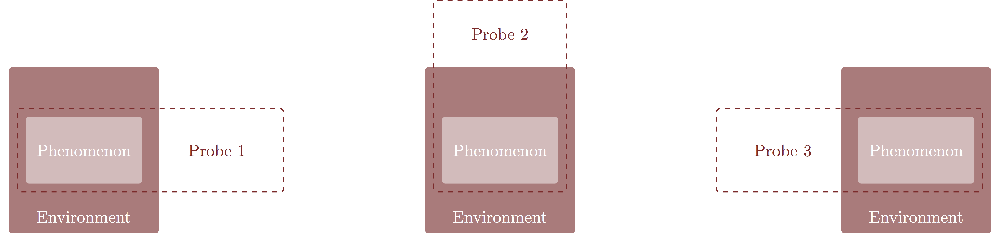
```
<br><br>
</center>

Each probes then defines its own observational process.

<center>
<br>
```{r, out.width = "100%", echo=FALSE}
knitr::include_graphics("figures/inferential_config/observational_process/multiple_observational_processes/multiple_observational_processes.png")
```
<br><br>
</center>

These distinct observational processes can become the basis of independent 
analyses, or even components in a single joint analyses that aggregates data
from multiple sources.  

Consequently observational processes are bespoke to not only a given phenomenon 
but also the specific details of the probe used to investigate it, especially 
the environment with which the probe intersects.  A critical aspect of 
statistical modeling is capturing enough of these details to isolate inferences
about the latent phenomenon that can then be fairly compared across different
experiments.  This is especially true when the specific behavior of the
environment or the probe is transient or otherwise not exactly repeatable.
Without a rich understanding of the observational process phenomenological
inferences can poorly generalize outside of the exact context of the given 
experiment, promoting more confusion than comprehension.

## The True Data Generating Process

By definition an observational processes is only a conceptual abstraction.  In
order for it to take form as an explicit mathematical object we need to define 
exactly how observations are _realized_ from an observational process.  This
process, however, is subtle and results not in constant outcomes but rather a
_variation_ of possible outcomes within an _observation space_, $Y$.

For example the realized observations might exhibit variation due to physical,
or _ontological_, stochasticity inherent to the latent phenomenon, its 
environment, or the probe used to interrogate them.  This variation is also 
known as _aleatoric randomness_ of the observational process.  Ontological
variation, for example, is commonly posited when modeling atomic decays that 
produce radiation at varying intervals and in varying directions, or when
sampling individuals from a population.

At the same time the realized observations might also exhibit _epistemological_ 
variation due to limitations in how accurately we can observe the latent system.
Lengths measured with a ruler, for example, are limited by the precision of the 
markings and the resolution of the human eye; they will not in general be 
consistent from person to person or even a single person from time to time.
Similarly, increasingly common digital data collection is limited by the
discretization of analog inputs and the numerical precision of intermediate 
computations.  

Epistemological variation is particularly common in the study of dynamical 
systems. Chaos theory, for example, arises when infinitesimal uncertainty in 
initial conditions is evolved through nonlinear, but deterministic, dynamics. 
This evolution results in probabilistic behavior of the system despite its
fundamental determinism.  Likewise thermodynamics is a theory of probabilistic 
behavior in many-particle systems that emerges from deterministic microscopic 
dynamics when only certain macroscopic quantities can be observed.

Ultimately, however, the distinction between these two sources of variation is
ill-defined.  For example, one can argue that seemingly ontological variation is
a result of the imprecise observation of complex but deterministic dynamics, as 
as in chaos theory.  Likewise one can argue that epistemological variation 
defines an ensemble of possible but unobserved, or _counterfactual_, outcomes 
which manifests as ontological variation if the experiment were hypothetically 
repeated.

Fortunately the exact philosophical nature of this variation isn't relevant in 
practice because these different perspectives all manifest in the _same_ 
mathematical assumptions for the realization of the observational process.  
Regardless of its interpretation we presume that this variation is sufficiently
regular that, while an observational process cannot be quantified by any single
observation, it can be quantified with a _distribution_ of observations.  More 
formally we model the observational process with a probability distribution 
over the observation space, with realizations of the observation process 
modeled as exact samples from that distribution.  

Probability distributions over the observation space are in general denoted
_data generating processes_, and the probability distribution that exactly 
captures the observational process in a given application is denoted the _true 
data generating process_, $\pi^{\dagger}$.  

<center>

<br>
```{r, out.width = "100%", echo=FALSE}
knitr::include_graphics("figures/inferential_config/dgp/dgp3/dgp3.png")
```
<br><br>

</center>

To distinguish possible outcomes of an observational process from explicitly 
realized observations I will decorate the latter with a tilde.  In other words 
$y$ denotes an arbitrary point in the observation space while $\tilde{y}$
denotes a particular point.

<center>

<br>
```{r, out.width = "100%", echo=FALSE}
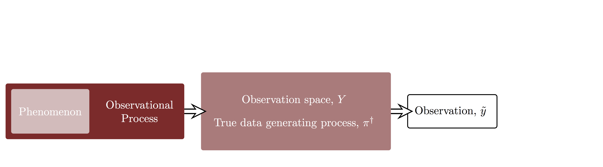
```
<br><br>

</center>

If we have any uncertainty about the system that we're analyzing then the true 
data generating process will be unknown.  Inference is tasked with quantifying 
information about the true data generating process using observed data as its 
only expression.  In particular, successful inferences advice decisions about 
how to interact with the latent phenomenon encompassed within the true data 
generating process.

<center>

<br>
```{r, out.width = "100%", echo=FALSE}
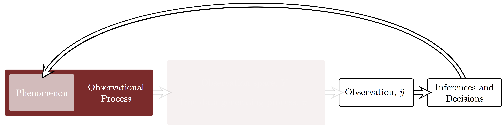
```
<br><br>

</center>

Ignorance of the true data generating process also complicates the _calibration_
of any decision making process informed by our inferences.  Consider formalizing 
a decision making process as map from the observation space to the action space,
$$ 
\begin{alignat*}{6}
a :\; &Y& &\rightarrow& \; &A&
\\
&y& &\mapsto& &a(y)&.
\end{alignat*}
$$
In other words, a decision making process consumes an observation and produces
an explicit decision.  Given knowledge of the latent system we could 
hypothetically construct a utility function for each possible action, 
$U : A \rightarrow \mathbb{R}^{+}$, which would then quantify the benefit of the 
decision making process in light of a particular observation as
$$ 
\begin{alignat*}{6}
U \circ a :\; &Y& &\rightarrow& \; &\mathbb{R}^{+}&
\\
&y& &\mapsto& &U(a(y))&.
\end{alignat*}
$$

If we knew the true data generating process then we could calibrate the 
decision making process by evaluating the outcome utilities corresponding to 
possible observations.  More formally, we could push the true data generating 
process through this composite utility function to give a probability 
distribution over outcome utilities, $\pi(U)$, and then use shape of this 
utility distribution to determine the effectiveness of the decision making 
process.

<center>
<br>
```{r, out.width = "75%", echo=FALSE}
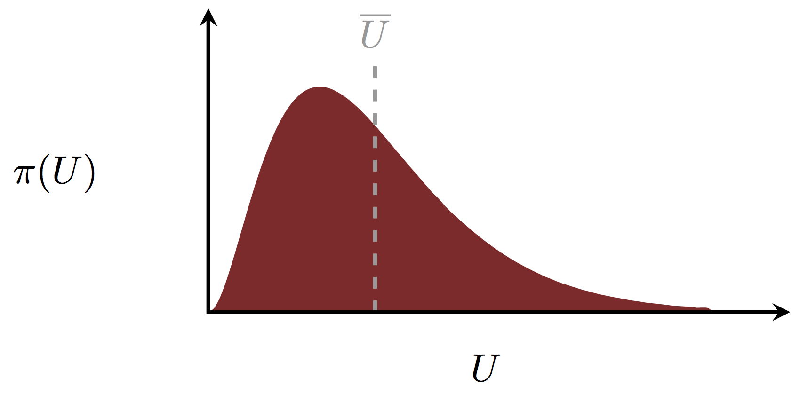
```
<br><br>
</center>

For example, we could calibrate the decision making process based on its 
expected utility,
$$
\overline{U} = \int \mathrm{d} y \, \pi^{\dagger} (y) \, U(a(y)),
$$

Unfortunately this calibration is purely hypothetical because of our ignorance 
of the true data generating process.  In any realistic application we will be
able to calibrate a given decision making process only in the context of a
statistical model.

## The Observational Model

At this point we have presumed the existence of a true data generating process,
but we are ignorant of its precise form in any given application.  In order to
find the appropriate data generating process we would ideally search through the
space of _all_ data generating processes, that is the collection, $\mathcal{P}$, 
of all probability distributions over the observation space.

Unfortunately this _big world_ of data generating processes is just too large
and complex to be able to quantify in any practical application.  Indeed the 
depths of this space are where mathematicians lurk, and that alone should be 
reason enough to stay away...

In any case, we have to limit our search to something more tractable in 
practical applications.  That is we have to consider only a _small world_, 
$\mathcal{S} \subset \mathcal{P}$, of data generating processes that is more
manageable.  This small world defines an _observational model_ consisting of 
individual data generating process that each define a possible mathematical 
narrative of how the data could be generated.

<center>
<br>
```{r, out.width = "75%", echo=FALSE}
knitr::include_graphics("figures/small_world/small_world/small_world.png")
```
<br><br>
</center>

As the term "small world" often brings with it connotations of theme park rides, 
I'm going to give this collection of data generating processes the alternative, 
slightly more sophisticated name of _model configuration space_.  Each individual 
data generating process within the small world is similarly denoted a _model
configuration_.  In other words "small world", "observational model", and
"model configuration space" can all be used interchangeably to denote the subset
of data generating processes considered in a given analysis.  I will use 
"observational model" when I want to emphasize that a given subset has been
assumed for a given application.

In practice it helps to assign distinct, numerical labels to each data 
generating processes within an observational model.  A _parameterization_ of an
observational model is the one-to-one mapping between the model configuration 
space and a numerical space $\Theta$, such as the real numbers.  In other words, 
a parameterization is the the assignment of a unique value, or _parameter_ 
$\theta \in \Theta$, to each model configuration, $s \in \mathcal{S}$.  Keep in 
mind that the parameterizations themselves are not unique; in general there will 
be many equivalent ways of labeling the model configurations.

Given a parameterization we can then specify the observational model with family 
of probability density functions over the observational space, 
$\pi_{\mathcal{S}} (y ; s)$.  In practice we index these densities a particular
parameterization, $\pi_{\mathcal{S}} (y ; \theta)$.

For example, let's say that our observational space is the one-dimensional real
numbers, $Y = \mathbb{R}$, and our observational model consists of all 
distributions that admit Gaussian probability density functions over the 
observational space.  We can parameterize this model configuration space with 
the two-dimensional real numbers, $\Theta = \mathbb{R}^{2}$ consisting of
_location parameter_, $\mu$, that can take all values and a _scale parameter_, 
$\sigma$, that can take only positive values.  In this case our model 
configuration space is specified by
$$
\pi_{\mathcal{S}} (y ; \mu, \sigma)
=
\frac{1}{ \sqrt{2 \pi \sigma^{2}} }
\exp \left( - \frac{1}{2} \left( \frac{y - \mu}{\sigma} \right)^{2} \right).
$$
We can equivalently, however, parameterize the model configuration space with
a location parameter, $\mu$, and an unconstrained scale parameter, 
$\lambda = \log (\sigma)$.  In this case our model configuration space is
specified by
$$
\pi_{\mathcal{S}} (y ; \mu, \lambda)
=
\frac{1}{ \sqrt{2 \pi} } e^{-\lambda}
\exp \left( - \frac{1}{2} \left( y - \mu \right)^{2} e^{-2 \, \lambda} \right).
$$
Under $N$ repeated observations our observational space would become 
$Y = \mathbb{R}^{N}$ with the corresponding probability density functions,
$$
\pi_{\mathcal{S}} (y_{1}, \ldots, y_{N} ; \mu, \sigma)
=
\prod_{n = 1}^{N} \pi_{\mathcal{S}} (y_{n} ; \mu, \sigma).
$$

Once we limit out consideration to a given observational model, our inferential 
goal becomes the quantification of those model configurations that are somehow
similar to the true data generating process, and hence useful for informing our 
ultimate decisions.  If the observational model contains the true data 
generating process then basing our inferences on the observational model incurs 
no loss; an exhaustive search through the observational model will always be 
able to find the true data generating process.  We are not always, however, so 
fortunate.  What happens when the true data generating process lies outside the 
scope of the observational model?

<center>

<br>
```{r, out.width = "75%", echo=FALSE}
knitr::include_graphics("figures/small_world/small_world_one/small_world_one.png")
```
<br><br>

</center>

Indeed in practice this circumstance is the rule rather than the exception.
In applications observational models are limited by the constraints of 
mathematical and computational feasibility, and will not completely capture
the, frankly ridiculous, complexity of the natural world.

The inferences generated from an observational model that doesn't contain the
true data generating process may still be meaningful so long as the data 
generating processes it does contain capture the structure of the true data 
generating process _relevant_ to our ultimate inferential goals.  For example, 
an ecological model that neglects quantum mechanics and general relativity is 
too technically meager to capture the _full reality_ of any observation of 
animal migration.  Most ecological research, however, is sufficiently useful 
without having to consider what might happen if birds started migrating at the 
speed of light or quantum tunneling through geographical impediments.  At the 
same time, research considering bird navigation guided by following 
physiological sensitivity to magnetic fields might need some consideration of 
quantum mechanics.

Ultimately inference within an observational model will at best _approximate_ 
the true data generating process, a realization that resonates with the famous 
quote of George Box that "all models are wrong but some are useful" 
[@BoxEtAl:1987].  Although some use that quote to motivate carelessness model 
building, Box was arguing the opposite.  Only with respect for the given 
application and careful work can we develop an observational model that contains 
model configurations that sufficiently well approximate the true data generating 
process, providing the foundation for useful inferences.

Principled model development strives for an the observational process that 
captures the relevant structure of the phenomenon, environment, and probe that 
give rise to the true data generating process.  We always have to be careful,
to recognize the limitations of the even the most carefully designed 
observational model in any given analysis.

### The Generative Structure of an Observational Model

A particularly effective way to build useful observational models is to design 
each model configuration to emulate the _generative_ structure of the 
observational process, from the latent phenomenon through the surrounding 
environment to the final observational probe.  The parameters of a model 
following the generative structure of the observational process typically 
decompose into parameters for each layer,
$$
\theta = \{ \theta_{\text{phenom}}, 
\theta_{\text{envir}}, \theta_{\text{probe}} \}.
$$

Keep in mind that the separation between environmental and probe parameters, 
need not always be so clean, especially for cruder approximations to the true 
data generating process.  For example is the influence of the person collecting 
the data better classified as a part of the environment or a part of the probe?  
Taken together the non-phenomenological parameters are sometimes denoted 
_systematic parameters_. 

In the Gaussian example introduced above we might consider the location 
parameter, $\mu$, as a phenomenological parameter that quantifies some baseline
effect.  From this perspective the scale parameter, $\sigma$, would capture more 
systematic structure relating to either the surrounding environment or the
particulars of the experimental probe.  Another example where this decomposition
is natural is naive curve fitting, where the curve can be interpreted as
implicitly modeling the behavior of the latent phenomenon while the residuals
around that curve model the rest of the observational process.

In addition to facilitating the design of the observational model for a single 
probe, this generative decomposition also motivates principled observational
models for multiple probes.  For example two probes might interrogate the 
same phenomenon without experiencing exactly the same environment and probe 
circumstances.  Consequently we might specify the observational model as
$$
\begin{align*}
\pi_{\mathcal{S}} (y ; \theta)
=& \;\;\;
\pi_{\mathcal{S}} (y_{1} ; \theta_{\text{phenom}}, 
\theta_{\text{envir}}, \theta_{\text{envir}, 1}, 
\theta_{\text{probe}}, \theta_{\text{probe}, 1})
\\
& \cdot
\pi_{\mathcal{S}} (y_{2} ; \theta_{\text{phenom}}, 
\theta_{\text{envir}}, \theta_{\text{envir}, 2}, 
\theta_{\text{probe}}, \theta_{\text{probe}, 2}),
\end{align*}
$$
where the subscripted parameters, such as $\theta_{\text{envir}, 1}$ are unique 
to a specific context and the non-subscripted parameters, such as 
$\theta_{\text{envir}}$, are shared across contexts.  The better we can model 
the systematic structure of the observational process the better we can build 
analyses that study the same phenomenon across different experiments, or develop 
hypotheses about the outcomes of new experiments targeting the same phenomenon.

Consider, for example, a latent phenomenon that influences a binary response in 
the environment.  We might model the phenomenological behavior with a 
probability, $p$, of the binary response taking the value $y = 1$ instead of 
$y = 0$.  The rest of the observational model depends on the particular 
structure of the observational probe.

If we probe the system once and record the binary outcome then we might utilize 
an observational model consisting of Bernoulli distributions parameterized 
by the phenomenological probability,
$$
\pi_{\mathcal{S}} (y ; p) = \text{Ber} (y \mid p).
$$
Presuming that the system is memoryless, repeated probes might be modeled as a 
product of independent Bernoulli distributions that are all parameterized by the 
same phenomenological probability,
$$
\pi_{\mathcal{S}} (y_{1}, \ldots, y_{N} ; p) = 
\prod_{n = 1}^{N} \text{Ber} (y_{n} \mid p).
$$
Alternatively we might  probe the system $N$ times but only record the total 
number of $y = 1$ responses, $k$.  In this case we could model the observational
process with binomial distributions parameterized with the phenomenological 
probability,
$$
\pi_{\mathcal{S}} (k; p) = \text{Bin} (k \mid p).
$$
Finally, probing until $k$ unity responses are observed could be modeled with 
negative Binomial distributions parameterized by the phenomenological
probability,
$$
\pi_{\mathcal{S}} (k; p) = \text{NegBin} (k \mid p).
$$

A simple binary response quantified by a phenomenological probability, 
however, is a relatively crude approximation to any realistic observational 
process.  The more deeply we resolve the observational process the richer 
our observational model will have to become.  

That binary response, for example, might correspond to the capture of a 
particular species in an ecological experiment.  In that case the probability of 
capture might not be a single, monolithic parameter but rather the outcome of 
the population dynamics between the species of interest, the species on which it 
preys, and the species which predate it.

It could also correspond to the alarm of a detector that has recorded enough 
incident radiation to pass a certain threshold.  Here the latent probability 
would be a consequence of the possible sources of radiation, including radiation 
from particular sources of interest as well as the irrelevant background sources 
that permeate the environment.  Depending on the precision required of the
desired inferences we might also have to model the detector response itself with
additional parameters, including those quantifying the calibration of the 
incident radiation flux and the behavior of the electronics which are ultimately 
integrated to trigger the detection.

Each deeper look into the observational process discerns more detail and a 
richer generative structure.  At the same time, in a given application we might 
need only a crude approximation that blends together various aspects of the 
generative structure.  Perhaps the biggest challenge in model building is 
determining exactly how sophisticated an observational model needs to be in 
order to achieve the desired inferential goals.

### Limitations of Observational Models

Regardless of how sophisticated our observational model might be, it will 
always be an approximation to the complexity of the true data generating 
process.  We have to be ever mindful of the limitations of the observational 
model in the context of any particular analysis.  

For example, the observational model might approximate the true data generating 
process only within a certain regime of behaviors.  At the same time the 
approximations might accurately capture only some behaviors but not others.
A given observational model can express the large scale structure of the latent
system but make no attempt to incorporate the structure at smaller scales.
It might capture statistical relationships between phenomenological parameters 
but fail to accurately convey the physical dynamics or explicit causal structure 
of the phenomenon and its interaction with the environment.  

Consequently we have to be extremely careful to employ model-based inferences 
only within the regimes where the approximations are reasonable and sufficient
for the decisions that we want to inform.  In other words, we have to develop a 
model that is sophisticated enough for the given application.

Another subtlety with the approximate nature of the observational model is that
a given observational model might be a reasonable approximation for _many_
true data generating processes.  This is particularly common for observational
models that focus on capturing the _emergent_ behaviors of a complex 
observational process.  At sufficiently coarse scales much of the latent 
structure washes out and only the most coherent of the latent behaviors
survive.  All true data generating process with similar emergent behavior can
then be equally well approximated by the same observational model.

Linear regression, for example, can be interpreted as a model where 
phenomenological behavior manifests as a deterministic linear
relationship between observed variates and covariates which is then convolved
through Gaussian fluctuations.  This linear relationship, however, can be 
considered as a first-order approximation to _any_ latent phenomenological 
behavior.  At the same time Gaussian variation well approximates a wide range of 
environmental and probe behaviors, especially within the context of the 
first-order behavior.  Consequently any true data generating process with the 
same first-order phenomenological behavior, and emergent environmental and probe 
behaviors, will be reasonably approximated by the _same_ linear regression 
model. 

Emergent models cannot discriminate between the true data generating processes 
they approximate and they cannot express behaviors outside of the scope of the
approximation.  The meaningful interpretation of a model-based statistical 
analysis requires not just an explicit observational model but also the scope of 
the approximations it presumes.  In other words, we need to at least 
conceptually understand the context of the model relative to the true data 
generating process.

### Model-Based Calibration {#sec:model_based_calibration}

While we cannot perfectly calibrate a decision-making process without knowing 
the true data generating process, we can define a proxy calibration within the
context of a given observational model.  

Firstly we assume that we can define utilities for all available actions _within
the context of each  model configuration_,
$$ 
\begin{alignat*}{6}
U:\; &A \times \Theta& &\rightarrow& \; &\mathbb{R}^{+}&
\\
&(a, \theta)& &\mapsto& &U(a, \theta)&.
\end{alignat*}
$$
Given a particular model configuration we can then compute the utility of an 
observation-informed decision-making process with the composition
$$ 
\begin{alignat*}{6}
U \circ a :\; &Y \times \Theta& &\rightarrow& \; &\mathbb{R}^{+}&
\\
&(y, \theta)& &\mapsto& &U(a(y), \theta)&.
\end{alignat*}
$$

We can push each of the data generating processes in our observational model 
through the composite utility function to give a full distribution of possible 
utilities for each model configuration, $\pi_{\mathcal{S}}(U; \theta)$.

<center>
<br>
```{r, out.width = "75%", echo=FALSE}
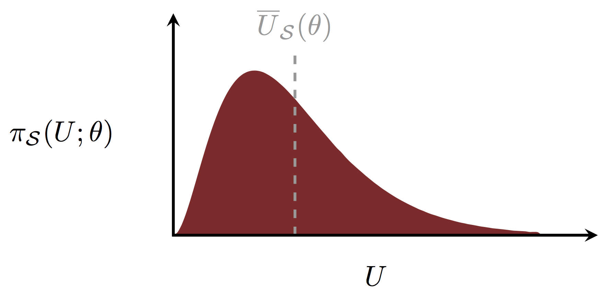
```
<br><br>
</center>

The properties of this distribution then provide the foundation to define 
various calibrations.  For example, for each model configuration we can quantify
the _expected utilities_, 
$$
\overline{U}_{\mathcal{S}}(\theta) = 
\int \mathrm{d} y \, \pi_{\mathcal{S}}(y ; \theta) \, U(a(y), \theta) ].
$$

How we might exploit these calibrations in an analysis will then depend on how 
we handle their dependence on the unknown model configuration.  No matter how 
we end up employing these model-based utilities we have to be vigilant in 
recognizing they are only as good as the observational model itself.

## Model-Based Inferences

Once an observational model has been established, and its limitations 
acknowledged, we can consider _model-based inferences_ that identify which model 
configurations are most consistent with the true data generating process. 
Unfortunately without knowing the true data generating process these inferences
can be informed only by the information inherent in observed data and our own
domain expertise.  Within the context of an observational model, inference 
becomes the identification of how _consistent_ model configurations are with the 
observed data and any domain expertise we introduce.

Consequently the observational model both plays two critical roles. Firstly
it defines a context for constructing inferences from observations.

<center>

<br>
```{r, out.width = "100%", echo=FALSE}
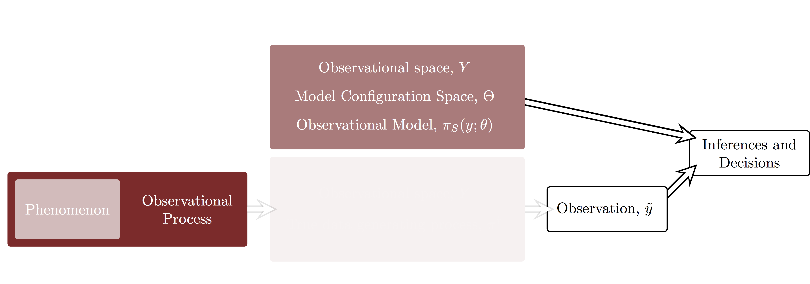
```
<br><br>

</center>

In particular, model-based inferences take the form of a quantification of which 
model configurations are consistent with the observed data. 

<center>

<br>
```{r, out.width = "100%", echo=FALSE}
knitr::include_graphics("figures/inferential_config/model_config/model_config4/model_config4.png")
```
<br><br>

</center>

Secondly those model-based inferences then inform decisions about how to 
interact with the latent phenomenon, bridging the gap between the observed
data and the latent system.

<center>

<br>
```{r, out.width = "100%", echo=FALSE}
knitr::include_graphics("figures/inferential_config/model_config/model_config5/model_config5.png")
```
<br><br>

</center>

The utility of those decisions will of course depend on how well the 
observational model approximates the relevant properties of the true data 
generating process.

In order to formally define inference we to define how consistency is 
mathematically encoded, and then how to calculate consistency assignments in 
light of a given observation. Unfortunately there is no unique way to encode 
consistency, and hence no unique way of constructing inferences.

# Frequentist Inference

The methodology most common to introductory statistics courses is the 
_frequentist_ approach which introduces additional philosophical assumptions to
constrain the possible quantifications of consistency.

Frequentist methods ultimately derive from attempts to make probability
_objective_ by defining it as something which could be measured.  More formally,
this approach assumes that probabilities are _defined_ as the long run 
frequencies of events that can be repeated infinitely often.  For example the
probability of rolling a given face on a die is defined as the ratio of rolls
that yield that face over the total number of rolls, as the die rolling is
repeated an infinite number of times.  Because all observers would 
hypothetically encounter the same limiting frequencies, these probabilities 
would be physical and hence independent of the observer. 

Unfortunately this definition quickly runs into technical difficulties 
[@DiaconisEtAl:2017].  Firstly, we can never actually realize the infinite, 
perfect replications needed to define the limiting frequencies in practice.  An 
infinite number of rolls would not only take infinitely long to perform, they 
would also take their toll on the integrity of the die and the arm of the poor 
soul entrusted with the Sisyphean task.  Moreover, even if we ignore the 
infeasibility of the replications we cannot ignore the mathematical difficulties 
with defining limiting frequencies.  It turns out that even in simple cases 
these limits are not always so well-behaved.

Consequently formal frequentist inference pulls something of a bait and switch 
-- the frequency definition of probabilities is replaced with Kolmogorov's 
axioms, but with the restriction that the resulting probability theory can be
applied to _only_ events that can be repeated infinitely often, at least 
hypothetically.  The hypothetical nature of this restriction has some 
interesting loopholes that one sometimes has to exploit to model populations
and other systems of interest, but it does provide a mathematical foundation on 
which we can build inferences.  In particular, if we presume that the
circumstances of an observation can be exactly replicated then we can use 
probability theory to describe the distribution of possible observations and 
admit the observational models that we introduced above. 

The only way that we can define consistency under these assumptions, however, is 
through _binary quantifications_.  Individual model configurations are either 
consistent with the observation or they're not. Any continuous, and 
mathematically self-consistent, quantification of consistency would be equivalent
to the probability theory which is forbidden from consorting with the model
configuration space.

An immediate weakness of binary configurations is that once a model 
configuration is deemed inconsistent it can no longer inform decisions.  An 
overaggressive quantification can be lead astray by irrelevant features of an 
observation and end up discarding model configurations that well approximate 
the true data generating process, if not the true data generating process 
itself.  To compensate for this frailty the frequentist approach treats 
inference as a _decision-making process_ and carefully calibrates those 
decisions to ensure that the binary quantifications are well-behaved 
_on average_.  

Formally, consistency is assigned by _estimators_ that deterministically map 
observations into some binary quantifications of the model configuration space.
If we treat the possible quantifications as actions, $a$, then an estimator 
defines a decision-making processes, $a(\tilde{y})$, that we can calibrate with 
a model-based utility function, $U(a, \theta)$.

If we presume that some $\theta$ is the true model configuration then we can use 
the corresponding data generating process to define the expected utility of a 
given estimator,
$$
\overline{U}(\theta) = \int \mathrm{d} y \, \pi_{\mathcal{S}}(y ; \theta) \,
U(a(y), \theta).
$$
The remaining challenge is accounting for the dependence on the presumed model
configuration, $\theta$.  

Because of the foundational assumptions of the frequentist perspective, however,
we are limited here.  For example we cannot average over the possible model 
configurations because as that would require applying probability theory to the 
model configuration space.  Just about the only thing that we can do is report 
the _worst case expected utility_,
$$
U^{*} = \underset{\theta \in \Theta}{\text{argmin}} \overline{U}(\theta).
$$
In this way we can calibrate the worst case behavior of the estimator and 
determine whether or not it meets our needs, at least under the assumptions 
that the true data generating process is contained within the observational 
model.

In the end frequentist inference does not define a unique inferential 
procedure.  Instead if formalizes inferential procedures as estimators and 
defines a unique procedure for calibrating those estimators.  In order to 
develop a frequentist analysis we need to specify not just our observational 
model but also an estimator and its associated utility function, and then carry 
out the worst case expected utility analysis.

To demonstrate frequentist methods let's consider two classes of estimators,
_point estimators_ and _set estimators_, and their explicit calibration in a 
simple example before remarking on what they teach us about implementing 
frequentist methods in practice.  Those uninterested in the machinery of 
frequentist inference can freely skip these sections and continue on to the 
following introduction of Bayesian inference.

## Point Estimators

A _point estimator_ maps a given observation into single model configuration,
$$ 
\begin{alignat*}{6}
\hat{\theta}:\; &Y& &\rightarrow& \; &\Theta&
\\
&y& &\mapsto& &\hat{\theta}(y)&.
\end{alignat*}
$$
A natural utility function that complements a point estimator is the squared 
error,
$$ 
\begin{alignat*}{6}
U:\; &Y \times \Theta& &\rightarrow& \; &-\mathbb{R}^{+}&
\\
&(y, \theta)& &\mapsto& &- ( \hat{\theta}(y) - \theta )^{2}&.
\end{alignat*}
$$
The more accurate and precise our point estimator is, the smaller the squared
error will be and the more utility the estimator will be assigned.  

For each model configuration we'd then compute the expected utility 
$$
\overline{U}(\theta) = - \int \mathrm{d} y \, \pi_{\mathcal{S}}(y ; \theta) \,
( \hat{\theta}(y) - \theta )^{2}.
$$
and summarize the expected performance of the point estimator with the worst 
case expected utility.

For example, consider a demonstrative observational model that consists of
$N$ independent Gaussian probability density functions,
$$
\pi(y ; \theta) 
= 
\prod_{n = 1}^{N} \mathcal{N}(y_{n} ; \mu, \sigma)
=
\prod_{n = 1}^{N} \frac{1}{ \sqrt{2 \pi \sigma^{2}} }
\exp \left( - \frac{1}{2} \left( \frac{y_{n} - \mu}{\sigma} \right)^{2} \right)
$$

Using the empirical mean,
$$
\hat{\mu}(y) = \frac{1}{N} \sum_{n = 1}^{N} y_{n}.
$$
as a point estimator for the location parameter, $\mu$, is particularly useful
because it features a conveniently analytic pushforward probability density 
function,
%
\begin{equation*}
\pi( \hat{\mu} ; \mu, \sigma)
=
\mathcal{N} \left( \hat{\mu} ; \mu, \frac{\sigma}{\sqrt{N}} \right).
\end{equation*}

In terms of the estimator the squared error utility function becomes
$$
U (\hat{\mu}, \mu, \sigma) = -( \hat{\mu} - \mu )^{2}.
$$
The worst possible utility stretches all the way towards negative infinitely, 
corresponding to the estimator being infinitely far away from the true value of 
the location parameter.  On the other hand the best possible utility is zero, 
corresponding to the estimator exactly recovering the true value.  The expected 
utility with respect to our observational model becomes
$$
\overline{U}(\mu, \sigma) 
= 
- \int_{-\infty}^{\infty} \mathrm{d} \hat{\mu} \,
\mathcal{N} \left( \hat{\mu} ; \mu, \frac{\sigma}{\sqrt{N}} \right)
( \hat{\mu} - \mu )^{2}
$$
which gives another analytic result,
$$
\overline{U}(\mu, \sigma) = -\frac{ \sigma^{2} }{N}.
$$

If $\sigma$ is known then the expected utility of the estimator is 
\emph{independent of $\mu$},
$$
\overline{U}(\mu) = -\frac{ \sigma^{2} }{ N }
$$
and the worst case loss becomes
$$
\overline{U}^{*} = - \frac{\sigma^{2} }{ N }.
$$
This independence of the expected utility with respect to the model 
configurations is quite exceptional and depends on the serendipitous 
interactions between this particular point estimator, utility function, and 
Gaussian observational model.  When $\sigma$ is not known then the worst case 
utility has to consider the edge of the model configuration space where $\sigma$ 
approaches infinity and, for a fixed observation size $N$, the utility becomes 
arbitrarily poor.  The only way to ensure a constrained worst case expected 
utility is to confine $\sigma$ below some upper limit.

These calculations are prone to mathematical errors for even the most 
experienced statistician.  We can also consider Monte Carlo estimation of
the expected utilities, however, to verify the analytic results, if not outright
replace them.  First let's set up our `R` environment with some functions that 
compute Monte Carlo estimators and their standard errors.

```{r}
c_light <- c("#DCBCBC")
c_dark <- c("#8F2727")

set.seed(58583389)

welford_summary <- function(x) {
  summary = c(0, 0)
  for (n in 1:length(x)) {
    delta <- x[n] - summary[1]
    summary[1] <- summary[1] + delta / (n + 1)
    summary[2] <- summary[2] + delta * (x[n] - summary[1])
  }
  summary[2] <- summary[2] / (length(x) - 1)
  return(summary)
}

compute_mc_stats <- function(x) {
  summary <- welford_summary(x)
  return(c(summary[1], sqrt(summary[2] / length(x))))
}
```

We'll assume 10 observations and use 1000 simulations across a grid of possible
data generating processes.

```{r}
N_obs <- 10

N_simu <- 1000

N_mu <- 3
mus <- seq(-3, 3, 3)

N_sigma <- 20
sigmas <- seq(0.5, 10, 0.5)
```

We then define our utility function and location estimator,

```{r}
se_util <- function(x_hat, x) {
  -(x_hat - x)**2
}

mu_hat <- function(y) {
  mean(y)
}
```

and turn the crank,

```{r}
par(mfrow=c(1, 3))

for(m in 1:N_mu) {
  exp_utils <- rep(0, N_sigma)
  deltas <- rep(0, N_sigma)
  
  for (s in 1:N_sigma) {
    sample_util <- rep(0, N_simu)
    
    for (n in 1:N_simu) {
      simu_data <- rnorm(N_obs, mus[m], sigmas[s])
      location_estimator <- mu_hat(simu_data)
      sample_util[n] <- se_util(location_estimator, mus[m]);
    }
    mc_stats <- compute_mc_stats(sample_util)
    exp_utils[s] <- mc_stats[1] 
    deltas[s] <- 2 * mc_stats[2]
  }
  
  plot(sigmas, exp_utils, pch=19, col=c_dark, main=paste("Location = ", mus[m]),
       xlim=c(0, 10.5), xlab="Scale",
       ylim=c(-12, 0), ylab="Expected Utility")
  
  arrows(sigmas, exp_utils - deltas, sigmas, exp_utils + deltas, 
         length=0.05, angle=90, code=3, col=c_dark)
  
  xs <- seq(0, 10.5, 0.01)
  lines(xs, -xs * xs / N_obs, col=c_light)
}
```

What about the scale parameter, $\sigma$?  With the guidance of our elders we
might consider the empirical standard deviation,
$$
\hat{\sigma}(y) = \sqrt{ \frac{1}{N - 1} ( \hat{\mu}(y) - y_{n} )^{2} },
$$
as a point estimator for $\sigma$.  This point estimator once again enjoys a
analytic pushforward probability density function,
$$
\pi( \hat{\sigma} ) =
\chi \Bigg( \hat{\sigma}; N - 1, \frac{\sigma}{\sqrt{N - 1}} \Bigg).
$$
Here $\chi$ refers to the scaled-$\chi$ probability density function with
degrees of freedom, $\nu$, and scale, $s$,
$$
\chi( y; \nu, s) 
=
{s}^{-\nu} \frac{2^{1 - \frac{\nu}{2}} }{ \Gamma(\frac{\nu}{2}) }
\, y^{\nu - 1} \, e^{ - \frac{1}{2} \frac{y^{2}}{s^{2}} }
$$

The expected squared error utility is then given by
$$
\overline{U}(\mu, \sigma) 
= 
- \int_{-\infty}^{\infty} \mathrm{d} \hat{\sigma} \,
\chi \left( \hat{\sigma} ; N - 1, \frac{\sigma}{N - 1} \right)
( \hat{\sigma} - \sigma )^{2}
$$
which, after some tedious algebraic torture, surrenders the result
$$
\overline{U}(\mu, \sigma) 
=
- 2 \left( 1 - 
\sqrt{ \frac{2}{N - 1} } 
\frac{ \Gamma(\frac{N}{2} ) }
{ \Gamma(\frac{N - 1}{2} ) } \right) 
\sigma^{2} 
$$
Like the location estimator when $\sigma$ isn't known, the worst case expected 
squared error utility is arbitrarily bad for fixed $N$ unless $\sigma$ can be 
exactly confined below some upper limit.  From a strict frequentist perspective 
we can't trust these estimators unless we can upper bound the true value of the 
scale parameter and avoid that extreme of the model configuration space.  

As before we can readily compare these results to Monte Carlo calculations.

```{r}
sigma_hat <- function(y) {
  sd(y)
}

par(mfrow=c(1, 3))

for(m in 1:N_mu) {
  exp_utils <- rep(0, N_sigma)
  deltas <- rep(0, N_sigma)
  
  for (s in 1:N_sigma) {
    sample_util <- rep(0, N_simu)
    
    for (n in 1:N_simu) {
      simu_data <- rnorm(N_obs, mus[m], sigmas[s])
      scale_estimator <- sigma_hat(simu_data)
      sample_util[n] <- se_util(scale_estimator, sigmas[s]);
    }
    mc_stats <- compute_mc_stats(sample_util)
    exp_utils[s] <- mc_stats[1] 
    deltas[s] <- 2 * mc_stats[2]
  }
  plot(sigmas, exp_utils, pch=19, col=c_dark, main=paste("Location = ", mus[m]),
       xlim=c(0, 10.5), xlab="Scale",
       ylim=c(-7, 0), ylab="Expected Utility")
  
  arrows(sigmas, exp_utils - deltas, sigmas, exp_utils + deltas, 
         length=0.05, angle=90, code=3, col=c_dark)
  
  C_N <- 2 * (1 - sqrt(2 / (N_obs - 1)) * gamma(0.5 * N_obs) / gamma(0.5 * (N_obs - 1)))
  xs <- seq(0, 10.5, 0.01)
  lines(xs, -C_N * xs * xs, col=c_light)
}
```

## Set Estimators

Alternatively we might consider _set estimators_, also known as confidence sets
or confidence intervals, that map observations into entire sets of model 
configurations, 
$$ 
\begin{alignat*}{6}
\widehat{\Delta \theta}:\; &Y& &\rightarrow& \; &\mathcal{T}&
\\
&y& &\mapsto& &\widehat{\Delta \theta}(y)&,
\end{alignat*}
$$
where $\mathcal{T}$ is an appropriate $\sigma$-algebra over the model 
configuration space.  In this case a natural utility function is the 
_inclusion utility function_ that considers whether or not the estimated set 
includes the presumed true model configuration,
$$ 
\begin{alignat*}{6}
U:\; &Y \times \Theta& &\rightarrow& \; &\{0, 1\}&
\\
&(y, \theta)& &\mapsto& 
&\mathbb{I}\big[ \theta \in \widehat{\Delta \theta}(y) \big]&.
\end{alignat*}
$$
The expected utility for a given model configuration is then the probability
of inclusion, or _coverage_,
$$
\begin{align*}
\overline{U}(\theta) 
&= 
\int \mathrm{d} y \, \pi_{\mathcal{S}}(y ; \theta) \,
\mathbb{I} \big[ \theta \in \widehat{\Delta \theta}(y) \big]
\\
&= \mathbb{P} \big[ \theta \in \widehat{\Delta \theta}(y) \big].
\end{align*}
$$
In other words, our set estimator is playing [ring toss around the presumed
truth](https://twitter.com/epiellie/status/1073385427317465089) and we want to 
know how often we score a ringer.  The final calibration of a confidence set is 
then the smallest coverage across all possible model configurations,
$$
U^{*} = \underset{\theta \in \Theta}{\text{argmin}} 
\mathbb{P} \big[ \theta \in \widehat{\Delta \theta}(y) \big].
$$

If $\sigma$ is known then we can readily construct a set estimator for the
location parameter as an interval centered around the location point estimator 
we considered above,
$$
\widehat{\Delta \mu}(y)
=
\big[ \hat{\mu}_{1}(y), \hat{\mu}_{2}(y) \big]
=
\big[ \hat{\mu}(y) - \delta \cdot \sigma, \hat{\mu}(y) + \delta \cdot \sigma \big].
$$

To facilitate the computation of the expected inclusion utility we begin by 
writing the inclusion utility function in terms of the point estimator for the 
location.  First we split the indicator function for the entire set estimator 
into separate indicator functions for each end of the interval estimator,
$$
\begin{align*}
U(\widehat{\Delta \mu}(y) ; \mu, \sigma)
&=
\mathbb{I} \big[ \hat{\mu}_{1}(y) \le \mu \le \hat{\mu}_{1}(y) \big]
\\
&=
\mathbb{I} \big[ \hat{\mu}_{1}(y) \le \mu \big]
\cdot
\mathbb{I} \big[ \mu \le \hat{\mu}_{2}(y) \big].
\end{align*}
$$
Next we substitute the definitions for each boundary and solve for the 
equivalent utility as a function of the location estimator, $\hat{\mu}(y)$,
$$
\begin{align*}
U(\hat{\mu}(y) ; \mu, \sigma)
&=
\mathbb{I} \big[ \hat{\mu}_{1}(y) \le \mu \big]
\cdot
\mathbb{I} \big[ \mu \le \hat{\mu}_{2}(y) \big]
\\
&=
\mathbb{I} \big[ \hat{\mu}(y) - \delta \cdot \sigma \le \mu \big]
\cdot
\mathbb{I} \big[ \mu \le \hat{\mu}(y) + \delta \cdot \sigma \big]
\\
&=
\mathbb{I} \big[ \hat{\mu}(y) \le \mu + \delta \cdot \sigma \big]
\cdot
\mathbb{I} \big[ \hat{\mu}(y) > \mu - \delta \cdot \sigma \big].
\end{align*}
$$

We can now use the known pushforward distribution for the location point 
estimator to compute the expected inclusion utility,
$$
\begin{align*}
\overline{U}(\mu) 
&= 
\int_{-\infty}^{\infty} \mathrm{d} \hat{\mu} \,
\mathcal{N} \left( \hat{\mu} ; \mu,  \frac{\sigma}{\sqrt{N}} \right)
\mathbb{I} \big[ \hat{\mu}(y) \le \mu + \delta \cdot \sigma \big]
\cdot
\mathbb{I} \big[ \hat{\mu}(y) \ge \mu - \delta \cdot \sigma \big]
\\
&=
\int_{\mu - \delta \cdot \sigma}^{\mu + \delta \cdot \sigma}
\mathrm{d} \hat{\mu} \,
\mathcal{N} \left( \hat{\mu} ; \mu,  \frac{\sigma}{\sqrt{N}} \right)
\\
&=
\Phi \bigg( \mu + \delta \cdot \sigma ; \mu, \frac{\sigma}{\sqrt{N}} \bigg)
- \Phi \bigg( \mu - \delta \cdot \sigma ; \mu, \frac{\sigma}{\sqrt{N}} \bigg),
\end{align*}
$$
where $\Phi$ is the Gaussian cumulative distribution function.  Taking advantage 
of the fact that
$$
\Phi(x; \mu, \sigma) = \Phi\left( \frac{x - \mu}{\sigma}; 0, 1 \right)
$$
we can reduce the expected utility even further to
$$
\begin{align*}
\overline{U}(\mu) 
&= 
\Phi \bigg( ( \mu + \delta \cdot \sigma - \mu ) \frac{\sqrt{N}}{\sigma}; 0, 1 \bigg)
-
\Phi \bigg( ( \mu - \delta \cdot \sigma - \mu ) \frac{\sqrt{N}}{\sigma}; 0, 1 \bigg)
\\
&= 
\Phi \bigg( (\delta \cdot \sigma) \frac{\sqrt{N}}{\sigma}; 0, 1 \bigg)
-
\Phi \bigg( -(\delta \cdot \sigma) \frac{\sqrt{N}}{\sigma}; 0, 1 \bigg)
\\
&= 
\Phi \bigg( \delta \cdot \sqrt{N}; 0, 1 \bigg)
-
\Phi \bigg( -\delta \cdot \sqrt{N}; 0, 1 \bigg).
\end{align*}
$$
Finally, noting that
$$
\Phi(-x; \mu, \sigma) = 1 - \Phi(x; \mu, \sigma)
$$
we have
$$
\overline{U}(\mu) 
= 
2 \, \Phi ( \delta \cdot \sqrt{N}; 0, 1 ) - 1.
$$

The expected utility is once again independent of the true value of $\mu$, so the 
worst case expected utility  is simply
$$
\overline{U}^{*} = 2 \, \Phi ( - \delta \cdot \sqrt{N}; 0, 1 ) - 1.
$$
Note that this worst case expected utility decreases towards zero as $N$ increases; the 
interval estimator becomes more and more accurate as the size of the observation
increases.  

In many introductory statistics textbooks one commonly finds the choice 
$\delta = z_{1 - \alpha / 2} / \sqrt{N}$ for a given $\alpha$, where $z_{q}$ is 
the standard normal quantile function.  This choice ensures that the coverage 
of the interval estimator is exactly $1 - \alpha$.

Tired yet?  Well too bad because we still have to consider a set estimator for 
$\mu$ when $\sigma$ is not known.  An immediate approach is to take the interval 
estimator we used above and simply replace $\sigma$ with its point estimator,
$$
\widehat{\Delta \mu}(y)
=
\big[ \hat{\mu}_{1}(y), \hat{\mu}_{2}(y) \big]
=
\big[ \hat{\mu}(y) - \delta \cdot \hat{\sigma}(y), \hat{\mu}(y) + \delta \cdot \hat{\sigma}(y) \big].
$$
The immediate challenge with this interval estimator is that the pushforward 
distributions for $\widehat{\Delta \mu}(y)$ cannot be computed from the 
marginal pushforward distributions for $\hat{\mu}(y)$ and $\hat{\sigma}(y)$ 
because the distributions are not independent.

We don't, however, have to compute the full pushforward distribution 
$\widehat{\Delta \mu}(y)$.  If we manipulate the inclusion utility function to 
isolate the point estimators,
$$
\begin{align*}
U(\hat{I}(y); \mu, \sigma)
&= 
\mathbb{I} \big[ \hat{\mu}(y) - \delta \cdot \hat{\sigma}(y) \le \mu \big]
\cdot 
\mathbb{I} \big[ \mu \le \hat{\mu}(y) + \delta \cdot \hat{\sigma}(y) \big]
\\
&= 
\mathbb{I} \bigg[ \frac{\hat{\mu}(y) - \mu}{\hat{\sigma}(y)} \le \delta \bigg]
\cdot
\mathbb{I} \bigg[ \frac{\hat{\mu}(y) - \mu}{\hat{\sigma}(y)} > -\delta \bigg]
\end{align*}
$$
then we see that the inclusion utility function for this interval estimator 
depends on the observed data only through the ratio
$$
\hat{\rho} (y) = \frac{ \hat{\mu}(y) - \mu }{ \hat{\sigma}(y) }.
$$
In other words,
$$
U(\widehat{\Delta \mu}(y); \mu, \sigma)
= 
\mathbb{I} \big[ \hat{\rho}(y) \le \delta \big]
\cdot
\mathbb{I} \big[ \hat{\rho}(y) > -\delta \big].
$$

This is a significant improvement because the pushforward distribution for 
$\hat{\rho}(y)$ can be worked out analytically to be specified by a Student-t 
probability density function with $N - 1$ degrees of freedom,
$$
\pi( \hat{\rho}(y) )
= t \bigg( \hat{\rho}(y); N - 1, 0, \frac{1}{\sqrt{N}} \bigg).
$$

We can now compute the expected inclusion utility as 
$$
\begin{align*}
\overline{U}(\mu, \sigma)
&=
\int_{-\infty}^{\infty} \mathrm{d} \hat{\rho} \,
t \bigg( \hat{\rho}(y); N - 1, 0, \frac{1}{\sqrt{N}} \bigg)
\mathbb{I} \big[ \hat{\rho}(y) \le \delta \big]
\cdot
\mathbb{I} \big[ \hat{\rho}(y) > -\delta \big]
\\
&=
\int_{-\delta}^{\delta} \mathrm{d} \hat{\rho} \,
t \bigg( \hat{\rho}(y); N - 1, 0, \frac{1}{\sqrt{N}} \bigg)
\\
&=
T \bigg( \delta ; N - 1, 0, \frac{1}{\sqrt{N}} \bigg)
+
- T\bigg( \delta; N - 1, 0, \frac{1}{\sqrt{N}} \bigg)
\\
&=
2 \, T \bigg( \delta ; N - 1, 0, \frac{1}{\sqrt{N}} \bigg) - 1,
\\
&=
2 \, T \bigg( \delta * \sqrt{N}; N - 1, 0, 1 \bigg) - 1,
\end{align*}
$$
where $T$ is the Student-t cumulative distribution function.  As in the case of 
known scale, $\sigma$, the expected utility does not depend on either the 
location or scale and so the worst case expected utility immediately becomes
$$
\overline{U}^{*} = 2 \, T \bigg( \delta  * \sqrt{N}; N - 1, 0, 1 \bigg) - 1.
$$

As with the point estimators, the very delicate cooperation between the chosen 
set estimator, the inclusion utility function, and the Gaussian observational 
model yields analytic results all the way through, at least if we know exactly
which path to take through the calculations.  At least we can verify these 
results by comparing them to Monte Carlo calculations.

```{r}
inc_util <- function(x_hat_left, x_hat_right, x) {
  x_hat_left <= x & x <= x_hat_right
}

mu_hat_left <- function(y, delta) {
  mu_hat(y) - delta * sigma_hat(y)
}

mu_hat_right <- function(y, delta) {
  mu_hat(y) + delta * sigma_hat(y)
}

delta_interval <- 0.5

par(mfrow=c(1, 3))

for(m in 1:N_mu) {
  exp_utils <- rep(0, N_sigma)
  deltas <- rep(0, N_sigma)
  
  for (s in 1:N_sigma) {
    sample_util <- rep(0, N_simu)
    
    for (n in 1:N_simu) {
      simu_data <- rnorm(N_obs, mus[m], sigmas[s])
      left_est <- mu_hat_left(simu_data, delta_interval)
      right_est <- mu_hat_right(simu_data, delta_interval)
      sample_util[n] <- inc_util(left_est, right_est, mus[m]);
    }
    mc_stats <- compute_mc_stats(sample_util)
    exp_utils[s] <- mc_stats[1] 
    deltas[s] <- 2 * mc_stats[2]
  }
  plot(sigmas, exp_utils, pch=19, col=c_dark, main=paste("Location = ", mus[m]),
       xlim=c(0, 10.5), xlab="Scale",
       ylim=c(0.7, 0.9), ylab="Expected Utility")
  
  arrows(sigmas, exp_utils - deltas, sigmas, exp_utils + deltas, 
         length=0.05, angle=90, code=3, col=c_dark)
  
  xs <- seq(0, 10.5, 0.01)
  ys <- rep(2 * pt(delta_interval * sqrt(N_obs), N_obs - 1) - 1, length(xs))
  lines(xs, ys, col=c_light)
}
```

## Frequentist Inference in Practice

As we saw above, the worst case calibration used by frequentist methods can be  
very conservative.  An estimator might be well-behaved for most reasonable model 
configurations but have its worst case behavior can be dominated by the 
boundaries of the model configuration space populated by extreme, but not 
impossible, model configurations.  That said, if we are fortunate enough to 
engineer an estimator with an acceptable worst case expected utility then we can 
have confidence that its behavior will be extremely robust, at least within the 
context of the observational model.  The practical challenge is whether or not
such an estimator even exists and we can find it.

Even if such an estimator does exist, however, performing the proper frequentist 
calibration needed to determine the worst case expected utility isn't always 
feasible.  Despite the simplicity of the observational model in the examples 
shown above, for example, the calculations were not for the faint of heart.  
Even with the advantageous properties of the complementary models, estimators, 
and utility functions we had to know exactly what manipulations would lead to 
fruitful analytic results.  Upon perturbing any of those inputs the convenience 
dissolves away and we typically have to consider numerical approximations.

Simulation, and Monte Carlo estimation of the expected utilities, offers a 
general strategy for approximating the calibration, but it can be extremely 
expensive in practice.  A simulation for a single model configuration can be 
expensive on its own, and a frequentist calibration needs to simulate along a 
sufficiently fine grid of model configurations to quantify the full behavior of
the expected utilities.  This is complicated by the fact that we typically have
to expand the grid all the way to the boundaries of the model configuration 
space where the worst case expected utility often hides.  Still, simulation 
methods can be useful for low-dimensional observational models where relatively 
diffuse crude can be sufficient.  As we increase the dimensionality of the model, 
however, we require exponentially finer grids, and exponentially increasing 
costs, that quickly overwhelm the available computational resources.

An unfortunate consequence of these challenges is that these systems with 
analytic results are often forced into applications where they have limited
usefulness.  The requisite observational model, for example, may be a poor 
approximation to the system being analyzed, or the requisite estimator may be 
irrelevant to the overall inferential goals of the analysis.  In order to
facilitate ignoring these complications, frequentist methods are often 
presented as black boxes for consuming data and automatically producing insights 
without any consideration of the implicit assumptions.  The growing popularity 
of statistical software which can hide these assumptions in code often 
exacerbates the problem.

All of this said, there is one circumstance where relatively robust calibrations
are available in closed form for a wide class of observational models.  Under 
certain conditions, aggregating sufficiently-many independent observations 
results in model configurations that are reasonably well-approximated with 
Gaussian probability density functions.  In this _asymptotic_ regime we can then
apply calculations similar to those introduced above to calibrate specific point
estimators and set estimators.  I discuss asymptotic results, and their 
limitations, more in [Section Four](#sec:asymptotics).

# Bayesian Inference

Bayesian inference takes a more inclusive perspective on probability theory,
allowing it to be used to model not only frequencies but also epistemological
variation and weights over the model configuration space.  Consequently we are
free to use probability theory to quantify inferences within an observational
model.  Neighborhoods of model configurations that are more consistent 
with the available information would be allocated more probability, and those
less consistent would be allocated less.

One immediate benefit of this approach is that is provides a much richer means
of quantifying information about our model relative to the binary 
quantification of frequentist inference.  A probability distribution encodes
much more information than a step function!

Moreover, we don't have to choose a probability distribution over the model 
configuration space arbitrarily -- there is a natural procedure for updating a 
_prior distribution_ that encodes our domain expertise about the model into a
_posterior distribution_ that identifies those model configurations consistent 
with both our domain expertise _and_ the observed data.  Inferences, decisions, 
and predictions all follow from natural probabilistic operations.

## Probabilistic Scholarship

A probabilistic quantification of what we know about our model would take the
form of a probability distribution over the model configuration space that
depends on any observed data.

<center>
<br>
```{r, out.width = "75%", echo=FALSE}
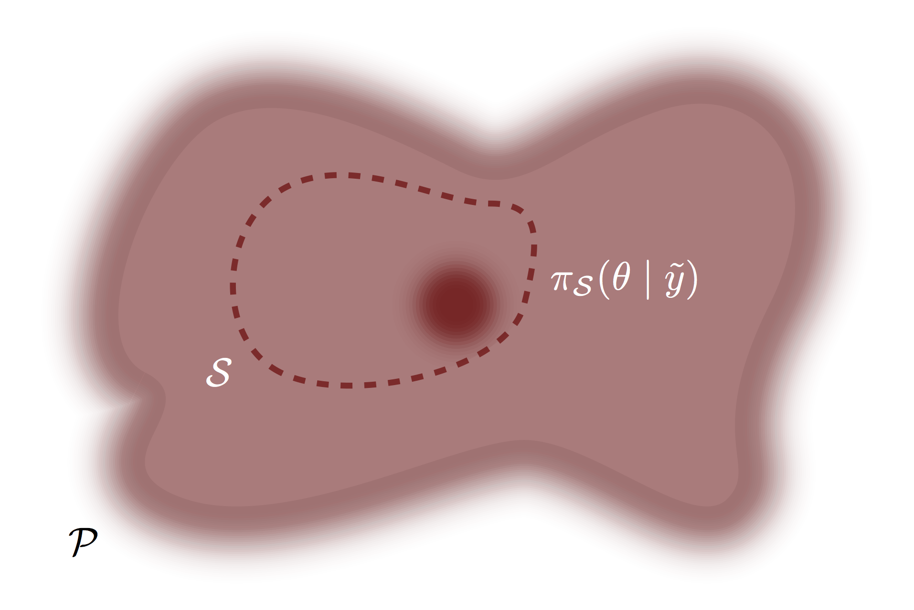
```
<br><br>
</center>

Fortunately we don't have to construct such a distribution ourselves -- it
follows naturally from the rules of probability theory.

More specifically, once we allow probability distributions over the model 
configuration space then the observational model becomes more than just a 
collection of data generating processes -- it becomes a _conditional probability
distribution_ over the product of the observational space and model configuration 
space, $Y \times \mathcal{S}$, that we can specify with conditional 
probability density functions,
$$
\pi_{\mathcal{S}}(y ; \theta) \rightarrow \pi_{\mathcal{S}}(y \mid \theta).
$$

Once we introduce a prior distribution we can apply _Bayes’ Theorem_ to invert
this conditional relationship and give a posterior distribution that encodes 
our information about the system we're analyzing.

### The Prior Distribution {#sec:prior}

A _prior model_ is defined as a probability distribution over the model 
configuration space, typically with a probability density function 
$\pi_{\mathcal{S}}(\theta)$.  The prior distribution encodes domain expertise 
about the model configurations in the observational model, and possibly even the 
context of the observational model relative to the true data generating process 
and latent observational process. 

For example a prior distribution might assign less probability to model 
configurations that are extreme but not entirely impossible, suppressing their 
contribution to our resulting inferences.  At the same time a prior distribution 
might suppress model configurations that, while not entirely impossible, we know 
stress the accuracy of our modeling approximations.

Importantly, prior distributions do not need to encode _all_ of our domain
expertise but rather just enough to ensure useful inferences.  This can 
drastically simplify prior specification, for example by allowing priors to be
relative ignorant about model configurations on which domain experts disagree.
On the other hand, this means that in practice prior specification is best done
in the context of the observational model.  Consequently best practices for 
prior specification are most appropriately defined not in general but rather
for specific modeling techniques where the complementary behavior of certain
components of the observation model can be contrasted to certain component of 
the prior model.

### The Likelihood Function

If we specify the observational model with a family of probability density
functions over the observational space, $\pi_{\mathcal{S}}(y \mid \theta)$,
then the evaluation of those probability density functions at a specific
observation, $\tilde{y}$, defines a _likelihood function_,
$$ 
\begin{alignat*}{6}
l_{\tilde{y}} :\; &\Theta& &\rightarrow& \; &\mathbb{R}^{+}&
\\
&\theta& &\mapsto& &\pi_{\mathcal{S}}(\tilde{y} \mid \theta)&.
\end{alignat*}
$$
The likelihood function maps each model configuration to a numerical 
quantification that increases for model configurations that are more consistent 
with the specific observation and decreases for those model configurations
that are less consistent.  In other words, the likelihood function quantifies
the relative consistency of each model configuration with the observed data.

Formally these likelihood evaluations provides only _relative_ information -- 
the absolute likelihood value depends on how we parameterize the observation
space and hence doesn't have any well-posed meaning.  Indeed from the Bayesian
perspective it's not the likelihood function that quantifies consistency with 
an observation but rather the _likelihood ratio_.  Those not interested in the 
technical details should skip the rest of this section.

Given a prior distribution and an observational model we can define a marginal
probability distribution over the observation space,
$$
\pi_{\mathcal{S}}(y)
=
\int \mathrm{d} \theta \, 
\pi_{\mathcal{S}}(\tilde{y} \mid \theta) \, \pi_{\mathcal{S}}(\theta).
$$
The likelihood ratio is then defined as the Radon-Nikodym derivative of the 
distributions in the observational model with respect to this marginal 
probability distribution,
$$
\mathcal{L}(\tilde{y}; \theta) 
=
\frac{ \mathrm{d} \pi_{\mathcal{S} \mid \tilde{y}} }
{ \mathrm{d} \pi_{\mathcal{S}} } (\theta)
=
\frac{ \pi_{\mathcal{S}}(\tilde{y} \mid \theta) }{ \pi_{\mathcal{S}}.
}
$$
The likelihood ratio defines a numerical quantification of data consistency 
that, unlike the likelihood function, is independent of how we parameterize the
observational space.  

That said, the only difference between a likelihood function corresponding to 
a given parameterization of the observational space and the likelihood ratio is
a constant that depends only on the observed data and not the model 
configurations.  An arbitrary likelihood function and the likelihood ratio give
the same relative quantifications of consistency.  Because in typical practice 
we need only relative consistency to form well posed inferences, the difference 
between a likelihood function and the likelihood ratio is usually irrelevant.

### The Posterior Distribution {#sec:posterior}

One we have a prior distribution and a likelihood function we can immediately 
construct a posterior distribution using Bayes' Theorem.  Within a 
parameterization of the model configuration spac, Bayes' Theorem defines the
posterior density function as 
$$
\begin{align*}
\pi_{\mathcal{S}}(\theta \mid \tilde{y}) 
&=
\frac{ \pi_{\mathcal{S}}(\tilde{y} \mid \theta) }
{ \int \mathrm{d} \theta \, 
\pi_{\mathcal{S}}(\tilde{y} \mid \theta) \, \pi_{\mathcal{S}}(\theta) } 
\cdot \pi_{\mathcal{S}}(\theta)
\\
&\propto
\pi_{\mathcal{S}}(\tilde{y} \mid \theta) \cdot \pi_{\mathcal{S}}(\theta).
\end{align*}
$$ 
The name Bayesian inference derives from this application of Bayes' Theorem,
which can lead to confusion in practice because Bayes' Theorem a general result
from probability theory and not unique to this application.  In other words
using Bayes' Theorem does not define Bayesian inference.  Using probability 
distributions to quantify information about the model configuration space 
defines Bayesian inference.

Bayes' Theorem can be thought of as switching from one conditional probability
density function, that specifying the observational model, to another, that
specifying the posterior distribution.  Bayes' Theorem can also be thought of 
a procedure for _updating_ the prior distribution into a posterior distribution.

<center>
<br>
```{r, out.width = "100%", echo=FALSE}
knitr::include_graphics("figures/bayes/bayes.png")
```
<br><br>
</center>

This latter perspective makes it more clear that this particular application of
Bayes' Theorem implements a _learning_ process.  What we know after the
observation, as encoded in the posterior distribution, is just the combination 
of what we knew before the observation, as encoded in the prior distribution, 
and what we learned from the observation, as encoded in the likelihood function. 
Bayes' Theorem ensures that all of this information is conserved and makes its
way to the posterior distribution.

The posterior density function, and hence the posterior distribution itself, 
concentrates on those model configurations that are consistent with _both_ our 
domain expertise, as encoded in the prior density function, and the observation, 
as encoded in the likelihood function.  This manifests in three basic updating
behaviors.  _Contraction_ occurs when the likelihood function is more 
informative than, but also consistent with, the prior distribution.

<center>
<br>
```{r, out.width = "75%", echo=FALSE}
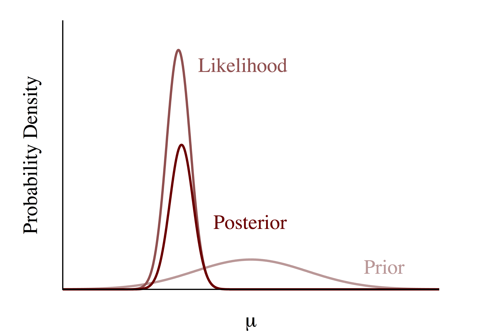
```
<br><br>
</center>

_Containment_ occurs when the prior distribution is more informative than, but 
also consistent with, the likelihood function.

<center>
<br>
```{r, out.width = "75%", echo=FALSE}
knitr::include_graphics("figures/prior_post_interactions/containment/containment.png")
```
<br><br>
</center>

_Compromise_ occurs when there is tension between the information encoded in 
the likelihood function and the prior.

<center>
<br>
```{r, out.width = "75%", echo=FALSE}
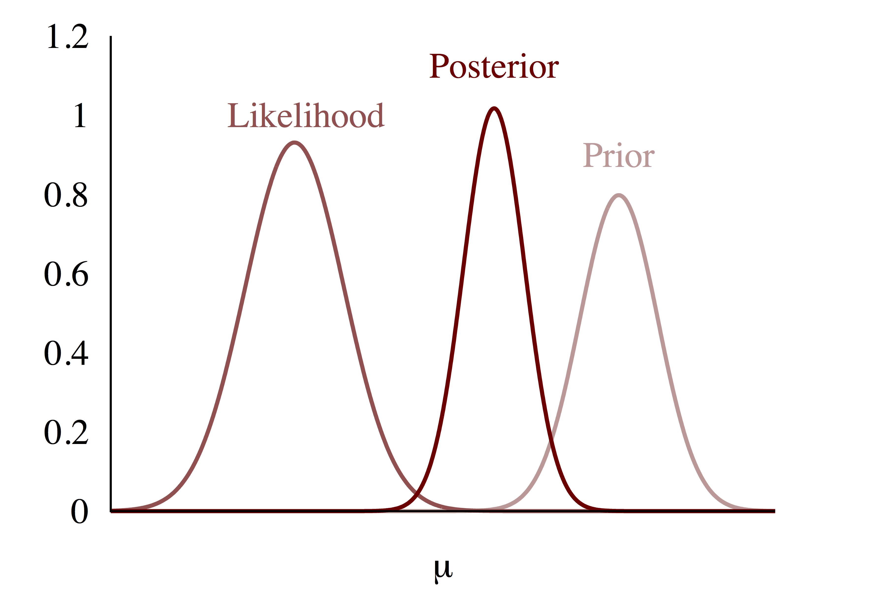
```
<br><br>
</center>

For example, consider the same observational model that we used to demonstrate
frequentist inference,
$$
\pi(y \mid \mu, \sigma) = 
\prod_{n = 1}^{N} \mathcal{N}(y_{n} ; \mu, \sigma).
$$
Working through the algebra the joint probability density function simplifies to
$$
\pi(y \mid \mu, \sigma ) = 
(2\pi)^{- \frac{N}{2}} \sigma^{-N}
\exp \left( - \frac{1}{2} \frac{N}{\sigma^{2}} (\left<y\right> - \mu)^{2} \right)
\exp \left( - \frac{1}{2} \frac{N}{\sigma^{2}} 
(\left<y^{2}\right> - \left<y\right>^{2} ) \right)
$$
where
$$
\left< y \right> = \frac{1}{N} \sum_{n = 1}^{N} y_{n}
$$
and
$$
\left< y^{2} \right> = \frac{1}{N} \sum_{n = 1}^{N} (y_{n})^{2}
$$
Moreover, let's presume that the scale parameter, $\sigma$, is known and 
utilize a prior distribution for the location parameter specified by a Gaussian 
probability density function,
$$
\pi( \mu ) = \mathcal{N}(\mu; m, s).
$$
In this case the posterior distribution for the location parameter is specified 
with another Gaussian probability density function,
$$
\pi( \mu \mid y ) =
\mathcal{N} \left( \mu; 
\frac{ \left< y \right> s^{2} + m \frac{\sigma^{2}}{N} }
{ \frac{\sigma^{2}}{N} + s^{2} },
\sqrt{ \frac{ s^{2} \cdot \frac{\sigma^{2}}{N} }
{ \frac{\sigma^{2}}{N} + s^{2} } } \right).
$$
Depending on the observed data and the choice of $m$ and $s$, the updating
process can exhibit any of the three behaviors discussed above.

### The Complete Bayesian Model

Given a particular prior distribution and observational model, Bayesian 
updating is a straightforward procedure.  Unfortunately the separation between
the prior distribution and observational model is not always so clear in 
practice.  

Consider, for example, a positivity constraint on one of the model configuration 
parameters corresponding to, say, the positivity of physical mass.  Does this 
constraint belong in the observational model or should it be specified as a 
prior distribution that assigns zero probability to negative values?  The
resulting posterior distribution is the same either way.

Similarly, consider a model with unobserved latent structure between the model
configuration parameters $\theta$ and $\phi$, 
$\pi_{\mathcal{S}}(\theta \mid \phi)$, such as that arising in hierarchical 
models and hidden Markov models. We could assume that the parameters $\theta$ 
corresponding to hypothetically observable but missing data and define the 
observation model with the conditional probability density functions
$$
\pi_{\mathcal{S}}(y, \theta \mid \phi)
=
\pi_{\mathcal{S}}(y \mid \theta) \, \pi_{\mathcal{S}}(\theta \mid \phi),
$$ 
and a prior distribution with the probability density function 
$$
\pi_{\mathcal{S}}(\phi).
$$
At the same time we could also define an observation model that consists of
only the measured data,
$$
\pi_{\mathcal{S}}(y \mid \theta),
$$ 
and then specify a prior distribution with the joint probability density 
function
$$
\pi_{\mathcal{S}}(\theta, \phi)
=
\pi_{\mathcal{S}}(\theta \mid \phi) \, \pi_{\mathcal{S}}(\phi).
$$
Each specification is slightly different -- the former presumes that the 
components of the model specified by the $\theta$ parameters would vary from one
observation to another, while the latter presumes that those components are 
static across all observations.  The corresponding posterior distributions for a 
_single_ observation, however, are exactly the same.

Consequently in a Bayesian analysis it can be helpful to avoid discriminating 
between the observational model and the prior model entirely, instead focusing
on the _complete Bayesian model_.  More formally, before we observe any 
particular data the prior distribution and observational model define a joint
distribution over the observation space and the model configuration space,
$Y \times \mathcal{S}$, specified by the probability density function,
$$
\pi_{\mathcal{S}}(y, \theta) 
= 
\pi_{\mathcal{S}}(y \mid \theta) \, \pi_{\mathcal{S}}(\theta).
$$
This joint distribution encompasses all of our modeling assumptions and 
specifies the complete Bayesian model.  

The joint distribution also completely specifies the posterior distribution.
Evaluating the joint probability density function at an explicit observation 
reduces it to the corresponding posterior density function, albeit unnormalized,
$$
\begin{align*}
\pi_{\mathcal{S}}(\tilde{y}, \theta)
&=
\pi_{\mathcal{S}}(\tilde{y} \mid \theta) \, \pi_{\mathcal{S}}(\theta)
\\
&\propto 
\frac{ \pi_{\mathcal{S}}(\tilde{y} \mid \theta) }
{ \pi_{\mathcal{S}}(\tilde{y}) } 
\, \pi_{\mathcal{S}}(\theta)
\\
&\propto
\pi_{\mathcal{S}}(\theta \mid \tilde{y}).
\end{align*}
$$
Note that the constant of proportionality can also be written explicitly as an
integral of the joint probability density,
$$
\pi_{\mathcal{S}}(\tilde{y})
=
\int \mathrm{d} \theta \, 
\pi_{\mathcal{S}}(\tilde{y} \mid \theta) \, \pi_{\mathcal{S}}(\theta)
=
\int \mathrm{d} \theta \, 
\pi_{\mathcal{S}}(\tilde{y}, \theta),
$$
although in practice the unnormalized posterior almost always suffices.

One benefit of this joint perspective is that it facilitates model development.
Once we separate the model configuration space into phenomenological, 
environmental, and probe parameters, for example, the full model can be 
decomposed into a sequence of conditional distributions that follows the 
generative structure of the true data generating process,
$$
\begin{align*}
\pi_{\mathcal{S}}(y, \theta) 
=& \;\;\;
\pi_{\mathcal{S}}(y, \theta_{\text{phenom}}, \theta_{\text{envir}}, \theta_{\text{probe}}) 
\\
=& \;\;\;
\pi_{\mathcal{S}}(y \mid \theta_{\text{phenom}}, \theta_{\text{envir}}, \theta_{\text{probe}}) 
\\
& \cdot \pi_{\mathcal{S}}(\theta_{\text{probe}} \mid \theta_{\text{phenom}}, \theta_{\text{envir}}) 
\\
& \cdot \pi_{\mathcal{S}}(\theta_{\text{envir}} \mid \theta_{\text{phenom}}) 
\\
& \cdot \pi_{\mathcal{S}}(\theta_{\text{phenom}}).
\end{align*}
$$
Using this generative decomposition as scaffolding to construct the complete
Bayesian model not only facilitates the development of coherent yet 
sophisticated models but also allows different parts of the model to be isolated 
and modeled separately.  This can be hugely beneficial when the development is 
being done by a large team or collaboration and not any one individual.

Another benefit of the complete Bayesian model is that is it illuminates the 
_interaction_ of the prior distribution and the likelihood functions for 
possible observed data.  As discussed in [Section 3.1.1](sec:prior), this 
interaction is crucial for determining the amount of domain expertise that we
need to encode in the prior distribution, and hence critical for principled 
model building.  

For example, if the likelihood functions derived from reasonable observations 
typically concentrate in a small neighborhood of the model configuration space 
then they will dominate the shape of the posterior density function and we get 
contractive behavior,

<center>
<br>
```{r, out.width = "80%", echo=FALSE}
knitr::include_graphics("figures/joint_triptych/joint_triptych_one/joint_triptych_one.png")
```
<br><br>
</center>

In this case the information encoded in the posterior distribution is governed 
almost entirely by what we learn from the observation.  Even vague priors are 
sufficient for useful inferences and we don't have to spend much time 
interrogating our own domain expertise.

The possible likelihood functions, however, aren't always so well-behaved.  In 
particular, our probe might not be sufficiently sensitive to the phenomena of 
interest at the scales approximated by the observational model.  In that case 
the observational model is said to be _weakly-identified_ and the likelihood 
functions tend to disperse over expansive regions of the model configuration 
space for most, if not all, observations.  In circumstances like these the form 
of the posterior distribution is strongly influenced by the form of the prior 
distribution; a careless prior distribution will allow the weak identification 
of the observational model to propagate to the posterior distribution.

<center>

<br>
```{r, out.width = "80%", echo=FALSE}
knitr::include_graphics("figures/joint_triptych/joint_triptych_two/joint_triptych_two.png")
```
<br><br>

</center>

In order to compensate for the possibility of diffuse likelihood functions we 
need the prior distribution to incorporate at least a soupçon of domain 
expertise.  At the very least we want the prior distribution to suppress 
extreme, although not entirely impossible, model configurations to ensure 
containment behavior in the Bayesian updating.

<center>

<br>
```{r, out.width = "80%", echo=FALSE}
knitr::include_graphics("figures/joint_triptych/joint_triptych_three/joint_triptych_three.png")
```
<br><br>

</center>

Specifying prior distributions that are robust to possible pathologies in the
likelihood functions derived from the observational model is key to robust
analyses.  This specification is itself greatly facilitated by not modeling the 
prior distribution and observational model independently but rather together
through the development of a complete Bayesian model.

## Employing Our Education

Bayes' Theorem ensures that any information learned by our model is encoded in 
the posterior distribution.  Consequently any inferential query we might pose 
must be answered with only valid manipulations of the posterior distribution.
In probability theory, however, all valid manipulations take the form of the 
evaluation of expectation values or the construction of pushforward 
distributions.  This seemingly limited set of inferential outputs provides a
rich diversity of applications.

### Making Inferences

Most inferences take the form of posterior _expectation values_ of certain 
functions.  In other words, the question we ask is encoded in a real-valued 
function over the model configuration space, 
$g : \Theta \rightarrow \mathbb{R}$, and the corresponding answer is given by
the corresponding posterior expectation value,
$$
\mathbb{E} [ g(\theta) ]
=
\int \mathrm{d} \theta \, \pi_{\mathcal{S}}(\theta \mid \tilde{y}) \,
g(\theta).
$$

For example we might ask _where_ in the model configuration space our posterior 
concentrates.  We can answer this with posterior means or even posterior
medians, which are derived from the difference of expectation values. Similarly 
the _breadth_ of this concentration can be quantified by posterior standard 
deviations or perhaps posterior tail quantiles.  More sophisticated questions 
are answered with expectation values of more sophisticated functions.  

The key step in _implementing_ a Bayesian analysis is _evaluating_ the posterior
expectation values for whatever functions are deemed relevant to the analysis.  

If the posterior density can be worked out analytically then certain expectation 
values are given exactly.  The model introduced in 
[Section 3.1.3](#sec:posterior), for example, yields the Gaussian posterior 
density function,
$$
\pi( \mu \mid y ) =
\mathcal{N} \left( \mu; 
\frac{ \left< y \right> s^{2} + m \frac{\sigma^{2}}{N} }
{ \frac{\sigma^{2}}{N} + s^{2} },
\sqrt{ \frac{ s^{2} \cdot \frac{\sigma^{2}}{N} }
{ \frac{\sigma^{2}}{N} + s^{2} } } \right).
$$
The posterior mean can be then be immediately identified as 
$$
\mathbb{m}
=
\frac{ \left< y \right> s^{2} + m \frac{\sigma^{2}}{N} }
{ \frac{\sigma^{2}}{N} + s^{2} } 
$$
while the posterior standard deviation is given by
$$
\mathbb{s}
=
\sqrt{ \frac{ s^{2} \cdot \frac{\sigma^{2}}{N} }
{ \frac{\sigma^{2}}{N} + s^{2} } }
$$
Similarly, quantiles can be readily computed using the inverse Gaussian 
cumulative distribution function, which is available is most computational
statistical libraries. 

Even with a closed-form posterior density function, however, the expectation 
value of more sophisticated functions will not always be available analytically. 
Moreover, closed-form posterior density function rely on very simple models and
hence are unrealistic in all but the simplest applications.  In practice we
instead rely on probabilistic computational methods to _approximate_ various
posterior expectation values.  Markov chain Monte Carlo, for example, is a 
paramount technique which can consume the joint density function that specifies 
the complete Bayesian model and return estimates of posterior expectations along 
with quantifications of the estimator errors.

The term "fit" is often used to colloquially denote statistical computation,
derived from a time when statistical computation reduced to finding a single
model configuration that best fit the observed data.  These days statistical
computation is much more complex and careless use of the term promotes 
confusion.  Obtaining a normalized posterior density function, for example, 
_cannot_ be the entirety of a Bayesian fit because it is useful for evaluating 
at best only some expectation values.  A proper Bayesian fit is instead the 
computation, or more realistically estimation, of _all_ expectation values 
relevant to a given application.  Equivalently one might define a Bayesian fit 
as the generation of intermediate objects, such as posterior samples, that can 
be used after the fact to estimate any expectation value.

### Making Decisions

The posterior distribution also provides a formal means for the robust decision
making that originally motivated our foray into statistical inference. 

As we saw in [Section 1.3.3](#sec:model_based_calibration) a model-based 
utility function 
$$ 
\begin{alignat*}{6}
U:\; &A \times \Theta& &\rightarrow& \; &\mathbb{R}^{+}&
\\
&(a, \theta)& &\mapsto& &U(a, \theta)&.
\end{alignat*}
$$
isn't immediately applicable for informing decisions because of the dependence
on the unknown model configuration.  In a Bayesian analysis, however, the 
posterior distribution quantifies the relevance of each possible model 
configuration.  Consequently we can compute _expected utilities_ as posterior 
expectation values,
$$
\overline{U}(a, \tilde{y}) = 
\mathbb{E}_{ \pi_{\mathcal{S}}(\theta \mid \tilde{y}) } [ U(a, \theta) ]
=
\int \mathrm{d} \theta \, \pi_{\mathcal{S}}(\theta \mid \tilde{y}) \,
U(a, \theta).
$$
Note the implicit dependence on the observation due to its influence on the
posterior distribution.

The optimal decision _in the context of the available information_ is then 
given by taking the action that maximizes these expected utilities.  This 
defines the _Bayesian decision making process_
$$
a^{*}(\tilde{y}) = \underset{a \in A}{\text{argmax}} U(a, \tilde{y}).
$$
Mathematically Bayesian decision theory is straightforward and a natural 
consequence of using probability theory to quantify information.  At the same
time it can be a conceptual paradigm shift for many because of its explicit 
consideration of the _uncertainty_ inherent in our inferences.  Indeed many
common fallacies arise from ignoring inferential uncertainty, or presuming 
models that poorly approximate the true data generating process.  Going through 
the steps of developing a Bayesian model and computing expected utilities is a 
powerful way of avoiding common mistakes and facilitating more robust decisions.

For example, let's say that our goal is to report a point summary of the 
posterior distribution, $\hat{\theta}$, and we want that summary to minimize the 
squared difference to the best model configuration.  In that case the utility 
function would take the form 
$$
U(\hat{\theta}, \theta)
=
- (\hat{\theta} - \theta)^{2}.
$$
and the expected utility would become
$$
\begin{align*}
\overline{U}(\hat{\theta}, \tilde{y}) 
&= 
\int \mathrm{d} \theta \, \pi_{\mathcal{S}}(\theta \mid \tilde{y}) \,
U(\hat{\theta}, \theta)
\\
&= -
\int \mathrm{d} \theta \, \pi_{\mathcal{S}}(\theta \mid \tilde{y}) \,
(\bar{\theta} - \theta)^{2}
\\
&=
- (\hat{\theta} - \mathbb{m}(\tilde{y}))^{2}
- \mathbb{V}{\tilde{y}},
\end{align*}
$$
where $\mathbb{m}(\tilde{y})$ is the posterior mean and $\mathbb{V}(\tilde{y})$
is the posterior standard deviation.  This expected utility is maximized when
we report the posterior mean, which defines the optimal point summary,
$$
\hat{\theta}^{*} = \mathbb{m}(\tilde{y}).
$$

A more elaborate circumstance might consider how to optimally dose a new
medication.  Strong doses might be more effective, but they also suffer from 
increased, possibly even lethal, side effects.  Weaker doses are safer but may
not be sufficiently effective at treating a disease.  The overall utility of a
given dosing will then depend on how the medication interacts with the 
physiology of a patient, or typically the expected population of patients that 
might receive this treatment.  With a sufficiently sophisticated model we can 
infer these interactions, compute the expected utility of each action, and then 
make our decision about how best to dose the treatment.

Bayesian decision theory is a powerful framework but it strives only to make an 
optimal decision in the context of the available information.  There is no 
guarantee that the resulting decision-making process will perform well across 
the range of observations distributed according to the true data generating 
process.  For that we need to go one step further and _calibrate_ our 
decision-making process over some incidence of reasonable observations.

### Making Predictions

If the latent observational process is stationary then predictions for future 
observations are no different from post hoc predictions of the observed data.
In particular, predictions are straightforward to make given a particular model
configuration; the predictive distribution is simply the corresponding data 
generating process.  

In Bayesian inference we could isolate a single model configuration with a
carefully designed expectation value, such as the posterior mean for each 
parameter.  That isolation, however, would prevent us from utilizing all of the 
information available to our model.  Instead we can construct predictions 
sensitive to _all_ of the possible model configurations by convolving a 
probability distribution over the model configuration space with each of the 
possible data generating processes.  Those configurations allocated more 
probability will then more strongly influence the resulting predictive 
distribution relative to those allocated less probability.

Because we have two natural probability distributions over the model 
configuration space available in Bayesian inference, the prior distribution and
posterior distribution, we have two natural predictive distributions.

#### The Prior Predictive Distribution

One possibility is to average the data generating processes in the observational
model with respect to the prior distribution.  This convolution yields the 
_prior predictive distribution_ which is specified by the probability density 
function
$$
\pi_{S}(y) = \int \mathrm{d} \theta \, 
\pi_{\mathcal{S}}(\theta) \,
\pi_{\mathcal{S}}(y \mid \theta).
$$
Note that the integrand is the probability density function that specifies the 
complete Bayesian model.  This implies that we can equivalently derive this 
predictive distribution as a marginal of the complete Bayesian joint 
distribution,
$$
\pi_{S}(y) = \int \mathrm{d} \theta \, 
\pi_{\mathcal{S}}(y, \theta).
$$

The prior predictive distribution is most strongly influenced by those model 
configurations most consistent with the domain expertise encoded in the prior
distribution.  In other words the prior predictive distribution quantifies our
best understanding of the scope of reasonable observations using only the domain 
expertise that we've introduced.  This allows us to make predictions _before_
we've made any observations, which is useful when we want to study how our 
inferences and subsequent decision making processes might play out before we
probe the latent system.

In practice we typically cannot construct the prior predictive density function
in closed form, but we have a few ways of generating samples from the predictive
distribution.  One approach is to employ ancestral sampling: first we exactly 
sample a model configuration from the prior distribution, 
$$
\tilde{\theta} \sim \pi_{\mathcal{S}}(\theta),
$$
and then we simulate an observation from the corresponding data generating 
process,
$$
\tilde{y} \sim \pi_{\mathcal{S}}(y \mid \tilde{\theta} ).
$$

If we cannot exactly sample from both the prior distribution and the data 
generating processes in the observational model, or if we specified only the 
complete Bayesian model and don't have distinct prior and observational models,
then we cannot implement ancestral sampling.  In that case we can run Markov 
chain Monte Carlo on the joint distribution to generate correlated samples from
the joint distribution and then project out the sampled model configurations,
$$
\left\{ \tilde{\theta}, \tilde{y} \right\}
\rightarrow 
\left\{ \tilde{y} \right\}.
$$

Once we have prior predictive samples we can estimate prior predictive 
expectation values, pushforward distributions, or even further convolutions.

#### The Posterior Predictive Distribution

The other possibility is to average the data generating processes in the 
observational model with respect to the posterior distribution.  This 
convolution yields the _posterior predictive distribution_ which is specified by 
the probability density function
$$
\pi_{S}(y \mid \tilde{y}) = \int \mathrm{d} \theta \, 
\pi_{\mathcal{S}}(\theta \mid \tilde{y}) \,
\pi_{\mathcal{S}}(y \mid \theta).
$$
Because the posterior predictive distribution uses the observational model 
twice, once to inform the posterior and again for the predictions, it requires
an explicit decomposition of the complete Bayesian model into a prior model and
an observational model.

The posterior predictive distribution is influenced by the model configurations
consistent with not just the relevant domain expertise but also the particular
data we've observed.  This makes it ideal for informing predictions about 
future interactions with the latent system.  

Comparisons between the posterior predictive distribution and the observed data 
also provide a measure of how well our model approximates the latent system.
Although we can't explicitly form these comparisons in practice, _estimates_ of 
these comparisons form the basis of all predictive model validation procedures, 
including information criteria and cross validation.  For more see 
@Betancourt:2015b.

As with the prior predictive density function, the posterior predictive density
function is rarely available in closed form.  If we have already generated
posterior samples, say through a Markov chain Monte Carlo fit, then we can
generate posterior predictive samples, $\tilde{y}'$, through ancestral sampling,
$$
\begin{align*}
\tilde{\theta} &\sim \pi_{\mathcal{S}}(\theta \mid \tilde{y})
\\
\tilde{y}' &\sim \pi_{\mathcal{S}}(y \mid \tilde{\theta} ).
\end{align*}
$$

## Bayesian Calibration

Ideally the true data generating process, or at least the best approximation 
to it within our observational model, would fall into a neighborhood of high
posterior probability.  That accuracy would ensure that whatever conclusions we
draw from our model, in particular the decisions informed by those inferences,
would be faithful to the real latent system being analyzed.

In general, however, there are no such guarantee in Bayesian inference.  The 
posterior distribution naively follows the information encoded in the model and 
the observation.  Without a carefully designed model the posterior distribution 
is vulnerable to being led astray by irrelevant quirks in a given observation,
ending up far away from the desired model configurations.  Bayesian inference 
provides a procedure for constructing inferences but it offers no general 
guarantees on the overall behavior of those inferences.  If we want to ensure 
robust inferences then we at least need to attempt some _calibration_ in order 
to determine how we expect our model to perform.

Following [Section 1.3.3](#sec:model_based_calibration) we might consider 
inferential outcomes of our model that take the form of a 
decision-making process, $a(y)$.  For example, we could consider $a(y)$ as a 
particular property of the posterior distribution, or the outcome of Bayesian 
decision making process. In that case a utility function $U(a(y), \theta)$ 
provides a calibration for a specific observation and model configuration.  We 
can then use the data generating process corresponding to a given model 
configuration to extend that calibration across possible observations, but so 
far we've had limited ways of extending the calibration across the unspecified 
model configuration.  For example, in the frequentist setting we were limited to
calibrations based on worst case expected utility.

In a Bayesian analysis we can use the joint distribution corresponding to the 
complete Bayesian model to account for both the unknown observation _and_ the
unknown model configuration.  We can push the joint distribution through the 
utility function to construct an entire probability distribution of potential 
outcomes, $\pi_{\mathcal{S}}(U)$, 

<center>
<br>
```{r, out.width = "75%", echo=FALSE}
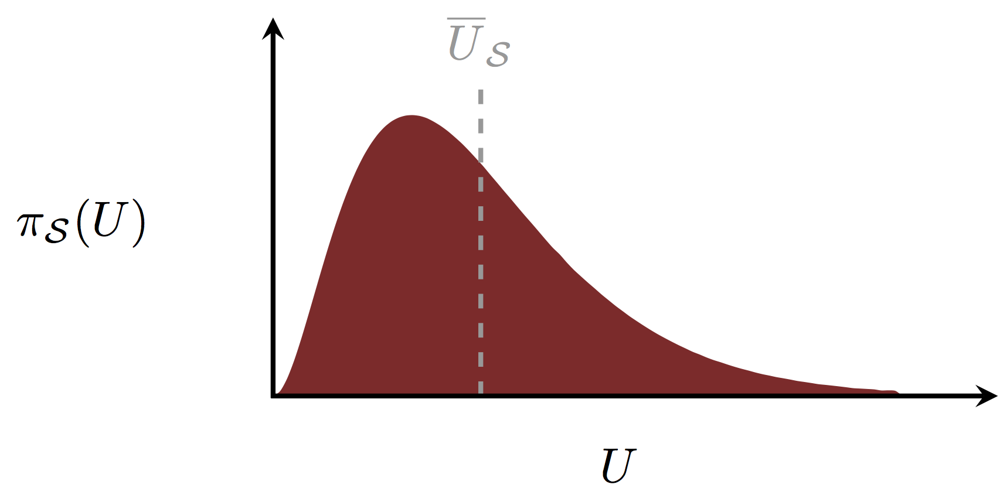
```
<br><br>
</center>

and then define calibrations such as expected utilities, 
$$
\overline{U}_{\mathcal{S}} = \int \mathrm{d} y \, \mathrm{d} \theta \,
\pi_{\mathcal{S}} (y, \theta) \,
U(a(y), \theta).
$$

In practice we can implement this calibration by sampling from the joint 
distribution and then evaluating the utility function,
$$
\begin{align*}
\tilde{\theta} &\sim \pi_{\mathcal{S}}(\theta)
\\
\tilde{y} &\sim \pi_{\mathcal{S}}(y \mid \tilde{\theta} )
\\
\tilde{U} &= U(a(\tilde{y}), \tilde{\theta}).
\end{align*}
$$
Put in words, we can calibrate a Bayesian analysis by repeatedly simulating
model configurations from the prior distribution, observations from the 
corresponding data generating process, running our analysis to completion, and
then scrutinizing the resulting likelihood functions, posterior distributions, 
and decision outcomes in the context of the simulated ground truth.

The conclusions we draw from these calibrations will always be limited by the 
quality of the complete Bayesian model.  If we are not confident that our 
observational model reasonably approximates the true data generating process,
or that our prior model encodes sufficient domain expertise to regularize any 
misbehaving likelihood functions, then of what use are these calibrations?  In 
practice these calibrations serve as a way of _bootstrapping_ model development.
Starting with an initial crude model we can use these calibrations to identify 
the limitations of that model and inform improvements such as more sophisticated 
observational models, more precise domain expertise, or even more robust methods 
for computing expectations.  This information is critical to 
[a _principled Bayesian workflow_ for model development
](https://betanalpha.github.io/assets/case_studies/principled_bayesian_workflow.html).

At the same time, the complete Bayesian model used for constructing the 
calibration simulations doesn't have to be the same model used to construct our
inferences.  We can, for example, use a more sophisticated, and possibly more 
expensive, model to calibrate a more approximate model that we aim to employ in
a given application.  Indeed this use of multiple models is not uncommon in
scientific practice.

Bayesian calibration is surprisingly general, and it spans a wide range of
useful analyses.  Here I introduce just a few of the techniques that fall 
under this general approach.

### Calibrating Predictions

One immediate application is the study of the simulated data itself, which we
can equivalently think of as samples from the prior predictive distribution.
Tension between the behavior of this simulated data and our expectations
indicates that our prior model needs to integrate more domain expertise. 

This _prior predictive check_ has a long history in Bayesian inference, going 
all the way back to Good's "device of imaginary results" [@Good:1950].  A 
natural extension is to study not just the simulated data but also the behavior 
of the resulting likelihood functions, inspecting for poor identification that 
might require more domain expertise.

### Calibration Posterior Behaviors

Studying the properties of potential posterior distributions resulting from 
these calibration simulations allows us to identify common pathologies, such as 
overfitting and poor identifiability, that limit the utility of any resulting
inferences.  In addition to evaluating specific decision making processes we
can also study the more general properties that can identify suspicious 
behavior.  

For example, if $\tilde{\theta}$ is the true model configuration then we can 
quantify how closely the posterior distribution is to the true model configuration 
with the _z-score_ for each parameter,
$$
z = \frac{ \mathbb{m}_{\mathrm{post}} - \tilde{\theta} }
{ \sqrt{ \mathbb{V}_{\mathrm{post}} } },
$$
were $\mathbb{m}_{\mathrm{post}}$ is the marginal posterior mean and
$\mathbb{V}_{\mathrm{post}}$ is the marginal posterior variance.  Smaller 
z-scores indicate that the posterior distribution concentrates around the true
model configuration while and larger values indicating concentration away from 
the true model configuration.

At the same time the _contraction_ of a given parameter,
$$
c = 1 - \frac{ \mathbb{V}_{\mathrm{post}} }
{ \mathbb{V}_{\mathrm{post}} }
$$
provides one possible quantification for how much the posterior is influenced by 
the information encoded in the observed likelihood function.  Contraction near 
zero indicates that the simulated data provided little information beyond the 
domain expertise encoded in the prior distribution, while contraction near one 
indicates a likelihood function that strongly informs that parameter.

Conveniently, these two posterior expectations are sensitive to an array of 
pathological behavior that can compromises our inferences.  The ideal behavior
concentrates towards strong contraction and small z-scores, indicating a 
posterior distribution that strongly concentrates around the true model
configuration.  A posterior distribution with strong contraction and a large 
z-score, however, indicates a model that overfits to irrelevant structure of 
the simulated data and is unable to accurately recover the true model 
configuration. Similarly a posterior distribution with weak contraction and 
a small z-score indicates a model that is poorly informed by the simulated data.
Finally a posterior distribution with weak contraction and a large z-score 
indicates a fit where the likelihood function and prior distribution
disagree with each other.

<center>
<br>
```{r, out.width = "75%", echo=FALSE}
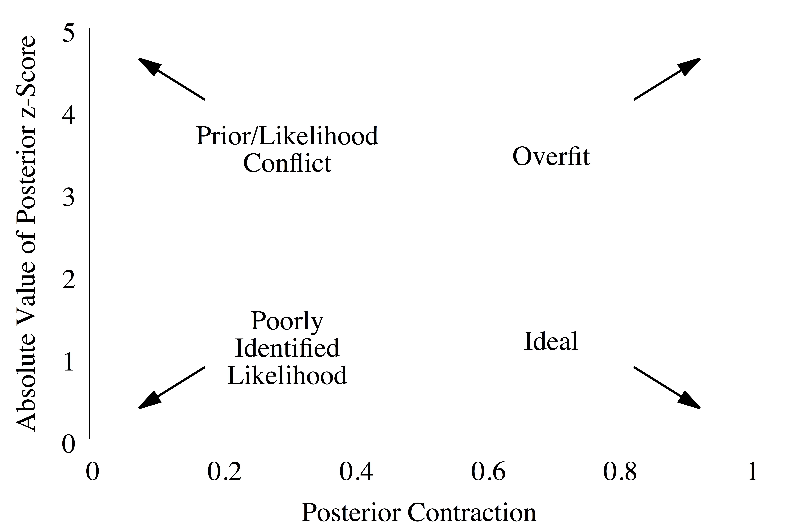
```
<br><br>
</center>

Consider, for example, this output from simulations using a simple regression 
model.  Each point records the z-score and contraction of the posterior 
distribution derived from one of the simulations from the complete Bayesian
model.  

<center>
<br>
```{r, out.width = "75%", echo=FALSE}
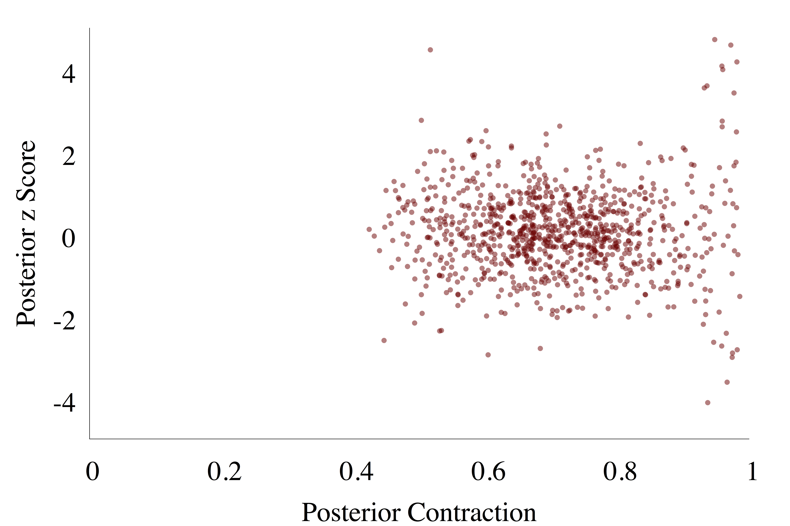
```
<br><br>
</center>

We see that most of the resulting posterior distributions are reasonably
well-behaved with small z-scores and moderate contraction.  Occasionally, 
however, the posterior distribution chases some irrelevant structure in the 
data resulting in strong contraction and much larger z-scores.  This indicates
that are model isn't quite as robust as we might hope, and it has nasty habit of
being its most confident exactly when it's the most wrong.

### Calibrating Posterior Computation

We can even use Bayesian calibration to quantify how faithfully our 
computational tools represent the models that they're fitting.  

As we fit each posterior distribution for each simulated observation we can 
evaluate the computational performance.  At a very high level we can see if it 
even successfully ran to completion, if it never finished within a reasonable 
time frame, or if it encountered a software failure due to bugs, exhausted 
memory resources, and the like.  Going further we can evaluate any 
self-diagnostics in completed fits, such as the potential scare reduction factor 
for general Markov chain Monte Carlo algorithms or divergences and energy 
fractions of missing information in Hamiltonian Monte Carlo.  If our tool proves 
robust to all of the potential posterior distribution behaviors across the 
simulated observations then we have some assurance that it should perform well 
enough for any real observations, at least if our model is sufficiently 
accurate.

What can we do, however, if our computational tool isn't self-diagnostic?
Fortunately Bayesian inference provides a subtle consistency property that 
allows us to check _any_ method capable of generating posterior samples.  
Regardless of our particular model, averaging the posterior distributions fit 
from observations simulated from the prior predictive distribution will _always_ 
recover the prior distribution,
$$
\pi_{\mathcal{S}}(\theta') 
= 
\int \mathrm{d} y \, \mathrm{d} \theta \,
\pi_{\mathcal{S}} (\theta' \mid y) \, \pi_{\mathcal{S}} (y, \theta).
$$
In particular this implies that the ensemble of posterior samples, 
$\tilde{\theta}'$,
$$
\begin{align*}
\tilde{\theta} &\sim \pi_{\mathcal{S}}(\theta)
\\
\tilde{y} &\sim \pi_{\mathcal{S}}(y \mid \tilde{\theta})
\\
\tilde{\theta}' &\sim \pi(\theta \mid \tilde{y}),
\end{align*}
$$
will follow the same distribution as as the incident samples from the prior 
distribution, $\tilde{\theta}$.  Any deviation between the two samples indicates 
that either our simulations are incorrect, our fit is using an inconsistent 
model from the simulations, or that our computational tool is generating biased
samples.

_Simulated-based calibration_ [@TaltsEtAl:2018] compares the ensemble posterior
sample and the prior sample using _ranks_.  For each simulated observation we
generate $R$ samples from the corresponding posterior distribution,
$$
\begin{align*}
\tilde{\theta} &\sim \pi_{\mathcal{S}}(\theta)
\\
\tilde{y} &\sim \pi_{\mathcal{S}}(y \mid \tilde{\theta})
\\
(\tilde{\theta}'_{1}, \ldots, \tilde{\theta}'_{R}) 
&\sim \pi(\theta \mid \tilde{y}),
\end{align*}
$$
and compute the rank of the prior sample within the posterior samples, i.e.
the number of posterior samples larger than the prior sample,
$$
\rho = \sharp \left\{ \tilde{\theta} < \tilde{\theta}'_{r} \right\}.
$$
If the ensemble posterior sample and the prior sample are equivalent then these
ranks will be uniformly distributed.  The uniformity of the ranks itself is
straightforward to analyze visually by histogramming the ranks for each 
parameter in the model configuration space.

<center>
<br>
```{r, out.width = "75%", echo=FALSE}
knitr::include_graphics("figures/sbc/sbc.png")
```
<br><br>
</center>

Here the grey band demonstrates the expected variation of ranks distributed 
according to an exact uniform distribution.  Deviation outside of these bands,
especially systematic deviation of many bins at once, indicates computational 
problems.  See @TaltsEtAl:2018 for further discussion of common systematic 
deviations and their interpretations.

# Comparing Asymptotic Apples to Preasymptotic Oranges {#sec:asymptotics}

So far our discussion of frequentist and Bayesian inference has neglected a 
ubiquitous, and often abused, concept that completely changes the discussion of
how we implement inference in practice: _asymptotics_.  In this final section
let's use what we've learned so far as a foundation on which we can properly
introduce asymptotics and discuss its practical limitations.

Consider an observation comprised of many identical and independently generated
components, $y = \{ y_{1}, \ldots, y_{N} \}$ with the total observation space 
defined as the product of each component observation space, 
$\times_{n = 1}^{N} Y$.

As the number of these components, $N$, grows our observation should assimilate
more information.  Eventually only those model configurations that closely 
approximate the true data generating process should have any chance of being 
inferred as consistent with the observation.  In other words, the likelihood
function should concentrate around the true data generating process, at least
if it's contained within the observational model.

At the same time, when we consider an observation with an increasing number of 
components the idiosyncratic properties of any particular component observation
should average out.  How the likelihood function concentrates around the true
data generating process should largely be irrelevant of the particular details
of any given observation.

These intuitions are formalized in the theory of _asymptotics_.  Here we assume
that the likelihood function for any observation is smooth and then consider the 
_maximum likelihood estimator_,
$$
\theta_{\text{ML}}(y) =  
\underset{\theta \in \Theta}{\text{argmax}}
\pi_{\mathcal{S}}(y ; \theta).
$$
If the observational model contains the true data generating process, 
$\pi^{\dagger}(y) = \pi(y ; \theta^{\dagger})$ for some true parameters
$\theta^{\dagger}$, then under some technical conditions the distribution of 
maximum likelihood estimates converges towards $\theta^{\dagger}$ as the number 
of component observations increases.  In particular, for sufficiently large $N$ 
the maximum likelihood estimator approximately follows a distribution specified 
by a Gaussian probability density function,
$$
J(\theta_{\text{ML}}(y)) \cdot (\theta_{\text{ML}}(y) - \theta^{*}) \sim 
\mathcal{N}(0, 1),
$$
where $J$ is the _Fisher information matrix_ which evaluates the expectation 
value of the Hessian of the log likelihood function,
$$
J_{ij}(\theta) = \int \mathrm{d} y \, 
\pi_{\mathcal{S}}(y ; \theta)
\frac{ \partial^{2} }{ \partial \theta_{i} \partial \theta_{j} } 
\log \pi_{\mathcal{S}}(y ; \theta).
$$
A common temptation is to write this result as 
$$
\theta_{\text{ML}}(y) 
\sim 
\mathcal{N}(\theta^{*}, J(\theta_{\text{ML}}(y))),
$$
but this is technically incorrect as the pushforward distribution for the
estimator cannot depend on the estimator itself!  The slightly awkward form 
used above gathers the maximum likelihood estimator dependencies together to 
avoid this problem.

Once this asymptotic behavior takes hold, any expected utility that depends only
on the maximum likelihood estimator or the Fisher information becomes a Gaussian
integral which will be straightforward to approximate, if not outright derive in
closed-form, for many utility functions.  Moreover, because the distribution for 
the maximum likelihood estimator depends on only the true model configuration, 
we don't have to worry about figuring out a worst case expected utility.  All of
the expected utilities will be the same!

Consequently in this asymptotic limit we can construct point estimators and 
confidence sets with known calibrations regardless of the specifics of the 
observational model.  To implement them in practice all we have to do is compute
a straightforward maximization of the likelihood function.  If we're being good
we'd also verify that the observation has enough independent components for the
asymptotic limit to be a reasonable approximation for _all_ possible true model
configurations.

Under mild conditions this behavior also carries over to Bayesian inference.
Provided that the prior is smooth and doesn't assign zero probability to any 
neighborhood of the model configuration space then the 
_Bernstein-von Mises Theorem_ shows that the posterior distribution manifests 
the same concentration around the true data generating process that the maximum 
likelihood estimator does.  In this case most posterior expectation values
become much easier to approximate, if not evaluate exactly.

This asymptotic limit is a paradise relative to the fragile world that I've
carefully introduced above.  The problem is that verifying for what $N$ a given 
observational model is well approximated by asymptotic behavior is no trivial 
task.  Simpler models will converge to the asymptotic limit faster and hence be 
well approximated with smaller $N$, while more complex models will typically 
require larger $N$.  Working out the exact details of this convergence for each
model configuration in the observational model, however, requires serious 
mathematical and computational tools.

Perhaps more importantly, the assumption that the observational model contains
the true data generating process can obstruct the applicability of the 
asymptotic limit altogether.  Recall that observational models are themselves 
often crude approximations to the true data generating process.  For small $N$
the observation will be only weakly informative and we won't be able to resolve 
the system well enough to notice the approximation.  As $N$ increases, however, 
our observations become informative enough that we can resolve the limitations 
of the observational model.  In other words, as we try to escape to the 
asymptotic limit the assumption that the observational model contains the true 
data generating process become harder and harder to justify.

Consider, for example, an observational model where we ignore any heterogeneity 
in the processes that generate each component observation.  In this case our
model might need only a few parameters homogenous to all the components.  For 
sufficiently many components in the observation the asymptotic limit will 
well approximate this homogenous observational model.  In that limit, however, 
our inferences for the homogenous parameters become precise enough that we start 
to resolve the heterogeneity that we ignored.  Even though the homogenous 
observational model converges to the asymptotic limit, it _diverges_ from the 
true data generating process and the limit becomes largely irrelevant.

When the observational model is an approximation, the ultimate utility of the 
asymptotic limit depends on the existence of an intermediate $N$ for which the 
observational model converges close enough to the asymptotic limit without 
diverging too far from the true data generating process.  Demonstrating that
such an $N$ exists in a particular application, and then identifying it if it 
does, is an extremely challenging task.

Still, frequentist asymptotics have become the norm in many applied fields
because of the ease of their implementation, along with the ease with which the 
underlying assumptions can be ignored.  Indeed frequentist inference has become 
so tightly bound to the asymptotic limit in much of the academic literature it 
becomes the basis for unfounded comparisons to Bayesian methods.

A common refrain is that frequentist methods are much less computationally 
demanding than Bayesian methods.  This comparison, however, is not between the 
general application of the two methodologies but rather between the application
of frequentist methods in the asymptotic limit and the general application of 
Bayesian methods _without_ the luxury of that limit.  A single optimization 
through the model configuration space is undoubtable less computationally 
demanding than the survey of the model configuration space needed to accurately 
approximate posterior expectation values, but this isn't a proper comparison.

The asymptotic limit drastically simplifies the structure of the observational 
model, reducing the burden of _both_ frequentist and Bayesian computation.  In
the asymptotic limit we no longer need to rely on general Bayesian tools for 
computing posterior expectations and can instead utilize approximate algorithms 
that exploit the asymptotic structure. If the limit well approximates the 
observational model in a given application then any fair comparison has to allow 
both methodologies to take advantage in which case the computational burden 
becomes practically equivalent.

On the other hand, if the asymptotic limit poorly approximates the observational
model then we have to rely the general frequentist and Bayesian methodologies.
Here we can no longer rely on the asymptotic calibration of maximum likelihood 
estimators and instead have to engineer a bespoke estimator and go through the 
costly calibration process in its entirety.  In comparison, building and 
calibrating a Bayesian model is often much less computationally demanding.

# Conclusion

Bayesian inference is a versatile methodology for fusing information from 
observations and domain expertise into coherent inferences and decision-making
processes.  The probabilistic foundations of the methodology ensure that the 
mechanisms for evaluating, analyzing, and criticizing inferences are all 
implemented by natural operations in probability theory.  

Conceptually this makes Bayesian computation particularly well-suited to 
automation once a complete Bayesian model has been specified.  In practice 
automated computation can't quite be realized, but with the careful utilization 
of modern tools we can get impressively close.  At the same time, carefully
designed probabilistic programming languages provide the means for practitioners
to specify the broad extent of models that arise in applications.  

Together probabilistic programming and state-of-the-art Bayesian computational
methods provide a platform for implementing Bayesian inference in practice.  In 
particular, their combination is the basis for Stan [@Stan:2018].

# Acknowledgements {-}

I thank Dan Simpson, Lauren Kennedy, Aki Vehtari, and Charles Margossian for
helpful comments and discussions.  I am also indebted for the feedback from 
those who have attended my courses and talks.

A very special thanks to everyone supporting me on Patreon: 

# References {-}

<div id="refs"></div>

# License {-}

The code in this case study is copyrighted by Michael Betancourt and licensed 
under the new BSD (3-clause) license:

https://opensource.org/licenses/BSD-3-Clause

The text and figures in this case study are copyrighted by Michael Betancourt 
and licensed under the CC BY-NC 4.0 license: 

https://creativecommons.org/licenses/by-nc/4.0/

# Original Computing Environment {-}

```{r, comment=NA}
sessionInfo()
```
