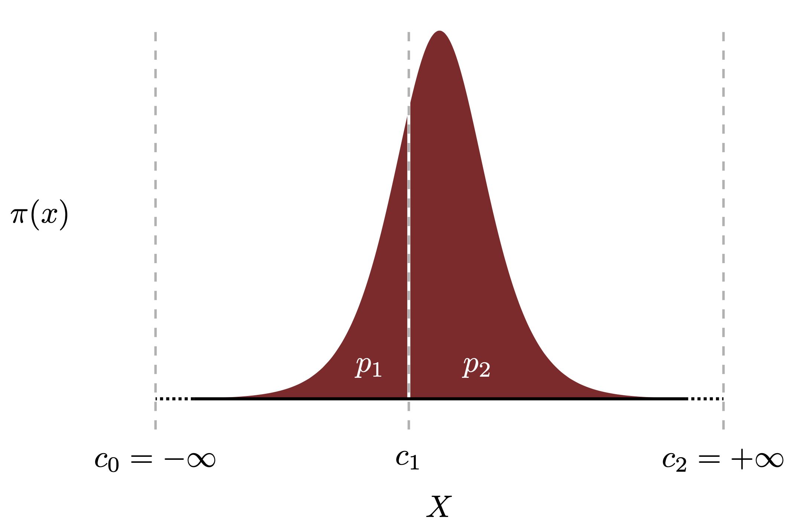
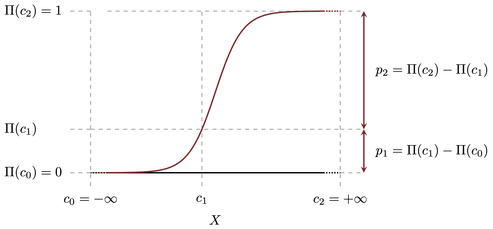
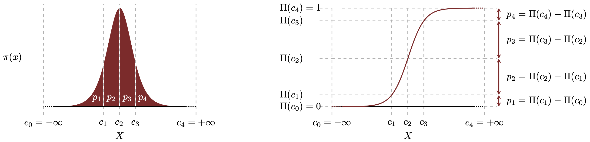

```{r setup, include=FALSE}
knitr::opts_chunk$set(comment=NA)
knitr::opts_knit$set(global.par = TRUE)
```

Regression models quantify statistical correlations by allowing latent effects 
to moderate the distribution of an observed outcome.  Linear regression, for 
example, models the influence of latent effects on a continuous outcome, and 
logistic regression models the influence of latent effects on a binary outcome.
_Ordinal regression_ models the influence of a latent effect on an _ordinal_ 
outcome consisting of discrete but ordered categories.

Ordinal outcomes often arise when a continuous outcome is censored in the 
observational process.  One of the most common examples is when individual
judgements or preferences are solicited but their responses are limited to 
discrete categories such as "Disagree", "Undecided", and "Agree".  In this 
case the ordinal outcomes are typically known as _Likert_, pronounced
"Lick-urt", scales.  To remain as general as possible, and distance the
discussion from the heritage of twentieth century racial psychology to which 
Likert scales were first applied, I will maintain the ordinal terminology here.

Here I review the mathematical structure of ordinal regression models and their
practical implementation in Stan.  In the process I also derive a principled 
prior model that ensures robustness even when ordinal data are only weakly
informative.

# Clear Cut

Many classic approaches to modeling categorical data presume that the categories 
are unordered and hence that the corresponding probabilities are exchangeable.
The ordering of ordinal categories, however, induces specific correlations 
required of a consistent statistical model.  In particular the probabilities 
between neighboring categories need to be more highly correlated than the
correlations between distant categories.  

One way to achieve this necessary structure is to presume a generative model
consisting of a latent continuous variable which is then censored to yield the
ordinal probabilities.  This latent model is just a means to construct the
probabilities with the desired correlations and need not have any interpretation 
as a model of the actual data generating process.

Once we have a procedure for constructing probabilities we can also introduce 
latent effects that consistently moderate those probabilities.

## Making the Cut

To simplify the construction of ordinal probabilities let's first consider the
case with only two ordinals, and hence two probabilities to model.

We begin by introducing a latent continuous space, $X = \mathbb{R}$, with a 
probability distribution specified by the probability density function, 
$\pi(x)$.

Next we partition $X$ into two intervals using three _cut points_, 
$\{c_{0}, c_{1}, c_{2}\}$.  The first cut point extends to minus infinity,
$c_{0} = -\infty$, and the last extends to positive infinity, $c_{2} = +\infty$.
The intermediate cut point, $c_{1}$, lies in the middle and controls the 
partition of $X$.

Given this partition we can define the the ordinal probabilities as the 
complementary probability allocated to each interval or, more equivalently,
the integral of the complementary density across each interval.

<center>
<br>
```{r, out.width = "75%", echo=FALSE}

```
<br><br>
</center>

In practice we can compute these probabilities as differences between the
cumulative distribution function evaluated at the cut points,
$$
\begin{align*}
p_{1} &= \Pi(c_{1}) - \Pi(c_{0}) = \Pi(c_{1}) - 0
\\
p_{2} &= \Pi(c_{2}) - \Pi(c_{1}) = 1 - \Pi(c_{1}).
\end{align*}
$$

<center>
<br>
```{r, out.width = "90%", echo=FALSE}

```
<br><br>
</center>

This construction immediately generalizes to more ordinals by partitioning $X$
into more intervals. Using $K + 1$ ordered cut points we can partition $X$ into 
$K$ intervals, from which we can compute $K$ ordinal probabilities.  As before 
the probabilities are most easily computed as differences between the cumulative 
distribution function evaluated at the cut points,
$$
p_{k} = \Pi(c_{k}) - \Pi(c_{k - 1}).
$$

<center>
<br>
```{r, out.width = "95%", echo=FALSE}

```
<br><br>
</center>

The partitioning of $X$ ensures that the category probabilities sum to one,
and the ordering of cut points induces the desired correlations between ordinal
probabilities.  For example lowering the cut point $c_{k}$ lowers the
probability allocated to the $k$-th ordinal while increasing the probability
allocated to the neighboring $(k + 1)$-st ordinal.

To model observed ordinals we complete the construction of ordinal probabilities
with a categorical observational model,
$$
\pi(k \mid p_{1}, \ldots, p_{K})
=
p_{k}.
$$
The complete ordinal model is then given by
$$
\pi(k \mid c_{0}, \ldots, c_{K})
= \Pi(c_{k}) - \Pi(c_{k - 1}).
$$
If the observed ordinals are aggregated into total counts for each category then 
a multinomial observational model can also be used.

Because of their fixed values the bounding cut points, $c_{0} = -\infty$ and 
$c_{K} = +\infty$, are sometimes ignored in practice such that the cut points 
are defined as only the $K - 1$ interior boundaries.  Here I will refer to all 
$K + 1$ cut points in the mathematical exposition but consider only the $K - 1$ 
free interior cut points in the Stan implementation.

This construction holds for _any_ probability distribution over $X$.
Differences in the shape of the distribution can be compensated by reconfiguring
the interior cut points to achieve the desired ordinal probabilities.
Consequently we have the luxury of selecting a probability distribution based on
computational convenience, in particular the expense of the cumulative 
distribution function and the ultimate cost of computing the interval 
probabilities.  

Using a probability distribution specified by a logistic probability density 
function,
$$
\pi(x) = \frac{ e^{-x} }{ (1 + e^{-x})^{2} },
$$
whose cumulative distribution function is given by the logistic function,
$$
\Pi(x) = \frac{1}{1 + e^{-x}} \equiv \sigma(x),
$$
defines an _ordinal logistic_ or _ordered logistic_ model.  Employing a 
probability distribution specified by a Gaussian probability density function
defines an _ordinal probit_ or _ordered probit_ model.

The logistic function $\sigma(x)$ satisfies the identify
$$
1 - \sigma(x) = \sigma(-x),
$$
which allows us to write the corresponding ordinal probabilities in the 
equivalent form 
$$
\begin{align*}
p_{k} 
&= \sigma(c_{k}) - \sigma(c_{k - 1})
\\
&= 1 - \sigma(-c_{k}) - (1 - \sigma(c_{k - 1}))
\\
&= \sigma(-c_{k - 1}) - \sigma(-c_{k}),
\end{align*}
$$
which is more conventional in some fields.

## Cut to the Feeling

How do we model the influence of some latent phenomena on the ordinal 
probabilities?  In particular if the latent phenomena is an _affinity_, 
$\gamma$, that correlates with higher ordinal outcomes then how can we design 
our model such that a positive affinity, $\gamma > 0$ drags probability to 
higher ordinals while a negative affinity, $\gamma < 0$, drags probability to 
lower ordinals?

We can readily accomplish this moderation in our construction by translating 
$X$ downwards by the size of the affinity, $x \mapsto x - \gamma$, while keeping 
the cut points fixed.  When $\gamma$ is positive this translation shifts the 
latent probability density function to larger values of $x$, concentrating the 
integrated probabilities to higher ordinals as desired.  Similarly when $\gamma$
is negative this translation shifts the latent probability density function to
smaller values of $x$, concentrating the integrated probabilities to lower 
ordinals.

<center>
<br>
```{r, out.width = "90%", echo=FALSE}

```
<br><br>
</center>

In terms of the ordinal probabilities translating from $x$ to $x - \gamma$ while 
keeping the cut points fixed is equivalent to translating the cut points from 
$c_{k}$ to $c_{k} - \gamma$ while keeping $x$ fixed.  Consequently in the
presence of a moderating affinity the ordinal probabilities can become
$$
p_{k}
= \Pi(c_{k} - \gamma) - \Pi(c_{k - 1} - \gamma).
$$
For the ordinal logistic model we take advantage of the properties of the
logistic function to write this in the equivalent form
$$
\begin{align*}
p_{k}
&= \sigma(c_{k} - \gamma) - \sigma(c_{k - 1} - \gamma)
\\
&= 1 - \sigma(\gamma - c_{k}) - (1 - \sigma(\gamma - c_{k - 1}))
\\
&= \sigma(\gamma - c_{k - 1}) - \sigma(\gamma - c_{k}),
\end{align*}
$$
which is for example how the `ordered_logistic_lpmf` function is defined in the 
Stan functions reference guide.

Because of this equivalence between translation the latent space and the cut 
points the ordinal probabilities inform only the _relative_ location of the
affinity and the cut points in this construction.  When the latent affinity and 
cut points are modeled jointly this induces a non-identifiability in the 
observational model and strong degeneracies in the resulting likelihood 
functions.  In order to prevent these degeneracies from propagating from the 
realized likelihood functions into the corresponding posterior distributions
we have to carefully anchor the affinity, the cut points, or perhaps even both 
to some base line values in the prior model.

An even better approach is to avoid modeling any baseline affinity at all
and instead use this construction to model _heterogeneity_ in the affinity
across varying circumstances.  For example consider an affinity itself
influenced by an external covariate, $\gamma = \alpha + \beta \cdot x$.  The
intercept $\alpha$ is not identified from the cut points and consequently isn't
really well-defined.  Ideally we would instead drop the intercept
altogether and model the covariate dependence alone, $\gamma = \beta \cdot x$.

# Cut Off at the Pass

Implementing an ordinal regression in Stan is straightforward thanks to the
`ordered_logistic_lpmf` and `ordered_probit_lpmf` functions which implement 
both the transformation from cut points to probabilities and the corresponding 
categorical observational model.

For demonstration we will consider $K = 5$ categories with $N = 50$ separate
observations.  We will first fit an ordinal regression with uniform priors on 
the cut points before deriving and implementing a more principled prior that 
ensures robust inference of the cut points.

## Rough Cut

Without an obvious prior model for the internal cut points we resort to a prior 
model specified with an ill-posed uniform density function and hope that the 
data are enough to inform each of the cut points.  An immediate consequence of 
this choice is that we cannot simulate model configurations nor corresponding 
prior predictive observations.  Instead we will consider externally defined
observations.

```{r}
library(rstan)
rstan_options(auto_write = TRUE)
options(mc.cores = parallel::detectCores())

par(family="CMU Serif", las=1, bty="l", cex.axis=1, cex.lab=1, cex.main=1,
    xaxs="i", yaxs="i", mar = c(5, 5, 3, 1))

input_data <- read_rdump("data/ordinal1.data.R")

table(input_data$y)
```
The observed ordinals are distributed across each of the five categories but
concentrate around the fourth category.

The Stan program implementing our ordinal regression model with uniform priors 
for both the internal cut points and the latent affinity $\gamma$ is given by
```{r}
writeLines(readLines("stan_programs/ordered_logistic_uniform.stan"))
```

Unfortunately fitting this model to the data yields less that satisfactory 
results.

```{r, warning=FALSE, message=FALSE}
util <- new.env()
source('stan_utility.R', local=util)

fit <- stan(file='stan_programs/ordered_logistic_uniform.stan', 
            data=input_data, seed=4938483)

util$check_all_diagnostics(fit)
```

The saturated tree depth is consistent with a non-identified posterior 
distribution, and indeed the lack of identification between the internal cut 
points and the latent affinity is clear from scatter plots of the posterior 
samples,
```{r}
c_light <- c("#DCBCBC")
c_light_highlight <- c("#C79999")
c_mid <- c("#B97C7C")
c_mid_highlight <- c("#A25050")
c_dark <- c("#8F2727")
c_dark_highlight <- c("#7C0000")

params <- extract(fit)

par(mfrow=c(2, 2))

plot(params$c[,1], params$gamma, xlab="c[1]", ylab="gamma",
     col=c_dark, pch=16, cex=0.8)

plot(params$c[,2], params$gamma, xlab="c[2]", ylab="gamma",
     col=c_dark, pch=16, cex=0.8)

plot(params$c[,3], params$gamma, xlab="c[3]", ylab="gamma",
     col=c_dark, pch=16, cex=0.8)

plot(params$c[,4], params$gamma, xlab="c[4]", ylab="gamma",
     col=c_dark, pch=16, cex=0.8)
```

In order to suppress the non-identifiability inherent to our construction of
ordinal probabilities we need a stronger prior model.  Let's consider a 
Gaussian prior density function for the affinity,
```{r}
writeLines(readLines("stan_programs/ordered_logistic_weak.stan"))
```

This yields a much better fit,
```{r, warning=FALSE, message=FALSE}
fit <- stan(file='stan_programs/ordered_logistic_weak.stan', 
            data=input_data, seed=4938483)

util$check_all_diagnostics(fit)
```

The marginal posterior densities for each of the parameters is reasonably well
concentrated
```{r}
params <- extract(fit)

par(mfrow=c(1, 1))

hist(params$gamma, main="", xlab="gamma", yaxt='n', ylab="",
     col=c_dark, border=c_dark_highlight)

hist(params$c[, 1], breaks=seq(-9, 6, 0.25), main="", 
     xlab="Internal Cut Points", xlim=c(-9, 6), 
     yaxt='n', ylab="", ylim=c(0, 400),
     col=c_dark, border=c_dark_highlight)

hist(params$c[, 2], breaks=seq(-9, 6, 0.25), 
     col=c_mid_highlight, border=c_dark_highlight, add=T)

hist(params$c[, 3], breaks=seq(-9, 6, 0.25),
     col=c_mid, border=c_dark_highlight, add=T)

hist(params$c[, 4], breaks=seq(-9, 6, 0.25),
     col=c_light_highlight, border=c_dark_highlight, add=T)
```

and a posterior retroedictive check shows no signs of misfit,
```{r}
B <- 5
idx <- rep(1:B, each=2)
x <- sapply(1:length(idx), function(b) if(b %% 2 == 0) idx[b] + 0.5 else idx[b] - 0.5)

obs_counts <- hist(input_data$y, breaks=(1:(B + 1)) - 0.5, plot=FALSE)$counts
pad_obs_counts <- sapply(idx, function(n) obs_counts[n])

pred_counts <- sapply(1:4000, function(n) 
                      hist(params$y_ppc[n,], breaks=(1:(B + 1)) - 0.5, plot=FALSE)$counts)
probs = c(0.1, 0.2, 0.3, 0.4, 0.5, 0.6, 0.7, 0.8, 0.9)
cred <- sapply(1:B, function(b) quantile(pred_counts[b,], probs=probs))
pad_cred <- do.call(cbind, lapply(idx, function(n) cred[1:9,n]))

plot(1, type="n", main="Posterior Predictive Distribution",
     xlim=c(0.5, B + 0.5), xlab="y",
     ylim=c(0, max(c(obs_counts, cred[9,]))), ylab="")

polygon(c(x, rev(x)), c(pad_cred[1,], rev(pad_cred[9,])),
        col = c_light, border = NA)
polygon(c(x, rev(x)), c(pad_cred[2,], rev(pad_cred[8,])),
        col = c_light_highlight, border = NA)
polygon(c(x, rev(x)), c(pad_cred[3,], rev(pad_cred[7,])),
        col = c_mid, border = NA)
polygon(c(x, rev(x)), c(pad_cred[4,], rev(pad_cred[6,])),
        col = c_mid_highlight, border = NA)
lines(x, pad_cred[5,], col=c_dark, lwd=2)

lines(x, pad_obs_counts, col="white", lty=1, lw=2.5)
lines(x, pad_obs_counts, col="black", lty=1, lw=2)
```

Before we become too confident with our newfound ordinal powers, however, let's
consider a second data set.
```{r}
input_data <- read_rdump("data/ordinal2.data.R")

table(input_data$y)
```
In this new data set the few observations that originally fell into the first 
category have been redistributed to the second and third categories, a very
reasonable statistical fluctuation that leaves us with no data in the first 
category.

Our model is much less successful in fitting this data,
```{r, warning=FALSE, message=FALSE}
fit <- stan(file='stan_programs/ordered_logistic_weak.stan', 
            data=input_data, seed=4938483)

util$check_all_diagnostics(fit)
```

The underlying problem becomes apparent when we examine the marginal posteriors,
```{r}
params <- extract(fit)

par(mfrow=c(1, 2))

hist(params$c[, 1], breaks=100, main="", 
     xlab="Internal Cut Points (1)", xlim=c(min(params$c), max(params$c)), 
     yaxt='n', ylab="", ylim=c(0, 400),
     col=c_dark, border=c_dark_highlight)

hist(params$c[, 2], breaks=seq(-9, 6, 0.25), main="", 
     xlab="Internal Cut Points (2, 3, 4)", xlim=c(-9, 6), 
     yaxt='n', ylab="", ylim=c(0, 500),
     col=c_mid_highlight, border=c_dark_highlight)

hist(params$c[, 3], breaks=seq(-9, 6, 0.25),
     col=c_mid, border=c_dark_highlight, add=T)

hist(params$c[, 4], breaks=seq(-9, 6, 0.25),
     col=c_light_highlight, border=c_dark_highlight, add=T)
```

The second, third, and forth internal cut points are well-informed by the data,
but the first internal cut point is not.  Upon reflection this isn't surprising:
without any data in the first category the data cannot inform the cut point
between the first and second categories, and the parameter is left to wander the
breadth of uniform prior density with stretches all the way out to minus 
infinity.

In order to ensure inferences that are robust to fluctuations in rarer 
categories we need a principled prior model for the cut points.

## Surgical Cut

To avoid the non-identifiability of the interior cut points from propagating to 
the posterior distribution we need a principled prior model that can exploit
domain expertise to consistently regularize all of the internal cut points at 
the same time.  Regularization of the cut points, however, is subtle given 
their ordering constraint.  Moreover domain expertise is awkward to apply on the 
abstract latent space where the internal cut points are defined.  In order to 
develop a principled prior model we need to move away from the latent space and
consider instead the induced ordinal probabilities.

Without any of the latent structure in our ordinal model we might be tempted to
apply a Dirichlet prior model directly to the ordinal probabilities.  Provided
that the Dirichlet hyperparameters, $\boldsymbol{\alpha}$, are somewhat smooth 
across the ordered categories the resulting prior model will contain the 
probability simplices to reasonable neighborhoods consistent with the ordinal 
ordering.  For example in the case of $K = 5$ categories the Dirichlet 
hyperparameters $\boldsymbol{\alpha} = \{1, 1, 1, 1, 1\}$,
$\boldsymbol{\alpha}= \{5, 3, 2, 0.5, 0.5\}$, and 
$\boldsymbol{\alpha} = \{2, 4.5, 20, 5, 1\}$ would all be reasonable choices 
while $\boldsymbol{\alpha} = \{1, 30, 2, 5, 20\}$ would not.

Applying the Dirichlet prior model to the full ordinal model doesn't regularize 
the internal cut points directly, but it does regularize them _indirectly_ 
through its regularization of the ordinal probabilities.  More formally the
_pushforward_ of the Dirichlet prior model along the inverse map from ordinal
probabilities to internal cut points _induces_ a prior model on the latent cut
points.  In order to construct the induced prior density function we just need 
to be careful about the necessary Jacobian determinant adjustment.  For an
introduction to pushforward probability density functions see 
[my probability theory case study](https://betanalpha.github.io/assets/case_studies/probability_theory.html#42_probability_density_functions).

Because of the simplex constraint on the ordinal probabilities we have to be a
particularly careful in the construction of the pushforward probability density
function here.  One might, for example, be tempted to transform the $K$ 
probabilities into the $K - 1$ internal cut points and an affinity $\gamma$ 
only to find that this transformation is singular and yields an ill-posed 
probability density function.  This is because the internal cut points and 
affinity are non-identified and the map to probabilities is many-to-one.

In order to avoid this singularity we have to fix the cut points around some 
_anchor point_, $\phi$.  This allows us to transform the $K$ probabilities 
$(p_{1}, \ldots, p_{K})$ to a new variable that encodes the normalization, 
$S = \sum_{k = 1}^{K} p_{k} = 1$ and the $K - 1$ cut points, 
$(S, c_{1}, \ldots, c_{K - 1})$.  

More formally if we are using a latent logistic probability density function 
with
$$
\sigma(x) = \frac{1}{1 + e^{-x}},
$$
$$
\lambda(x) = \sigma^{-1} (x) = \log \left( \frac{x}{1 - x} \right),
$$
and
$$
\rho(x) 
= \frac{ \mathrm{d} \sigma}{ \mathrm{d} x}(x)
= \sigma(x) \cdot (1 - \sigma(x)),
$$
then we can write the map from cut points to probabilities as
$$
\begin{align*}
p_{k} &= \sigma \, (\phi - c_{k - 1}) - \sigma(\phi - c_{k})
\\
\sum_{k = 1}^{K} p_{k} &= S
\end{align*} 
$$
with the inverse map given by
$$
\begin{align*}
S &= 1
\\
c_{1} &= \phi - \lambda(S - p_{1})
\\
&\ldots
\\
c_{k} &= \phi - \lambda( \sigma(\phi - c_{k - 1}) - p_{k}).
\end{align*}
$$

The Jacobian matrix for this transformation is given by a left column of ones,
$$
J_{k, 1} 
= \frac{ \partial p_{k} }{ \partial S }
= 1,
$$
a diagonal band for $k > 1$,
$$
J_{k, k} 
= \frac{ \partial p_{k} }{ \partial c_{k + 1} }
= -\rho(\phi - c_{k}),
$$
an off-diagonal band,
$$
J_{k, k + 1} 
= \frac{ \partial p_{k} }{ \partial c_{k + 1} }
= \rho(\phi - c_{k}),
$$
and zeroes everywhere else.  For example a five category model would give the 
Jacobian matrix
$$
J(\mathbf{c}, \phi) =
\left( \begin{array}{cccc} 
1 & \rho(\phi - c_{1}) & 0 & 0 & 0\\
1 & -\rho(\phi - c_{1}) & \rho(\phi - c_{2}) & 0 & 0 \\
1 & 0 & -\rho(\phi - c_{2}) & \rho(\phi - c_{3}) & 0 \\
1 & 0 & 0 & -\rho(\phi - c_{3}) & \rho(\phi - c_{4}) \\
1 & 0 & 0 & 0 & -\rho(\phi - c_{4}).
\end{array} \right)
$$

The pushforward probability density function for the induced prior model is 
then given by
$$
\pi(\mathbf{c}, S \mid \boldsymbol{\alpha}, \phi)
=
\mathcal{D}( \mathbf{p}(\mathbf{c}, \phi) \mid \boldsymbol{\alpha})
\cdot \delta(S - 1) \cdot \left| J(\mathbf{c}, \phi) \right|,
$$
where $\mathcal{D}(x \mid \boldsymbol{\alpha})$ is the Dirichlet probability
density function and $\delta(S - 1)$ is a Dirac delta function encoding the
summation constraint.  We can immediately marginalize out the auxiliary
variable $S$ to give a probability density function that defines our desired
cut point prior model,
$$
\pi(\mathbf{c}, \mid \boldsymbol{\alpha}, \phi)
=
\mathcal{D}( \mathbf{p}(\mathbf{c}, \phi) \mid \boldsymbol{\alpha})
\cdot \left| J(\mathbf{c}, \phi) \right|.
$$
Unfortunately the Jacobian matrix does does not have any convenient structure 
that might allow an analytic determinant.  Consequently we'll have to 
numerically compute the determinant when implementing this model in Stan.  For
a small number of categories this isn't too burdensome, but it can become
problematic when estimating many tens of categories.

This prior model is straightforward to implement in Stan,
```{r}
writeLines(readLines("stan_programs/ordered_logistic_induced.stan"))
```
and immediately yields a better fit to the second data set,
```{r, warning=FALSE, message=FALSE}
fit <- stan(file='stan_programs/ordered_logistic_induced.stan', 
            data=input_data, seed=4938483)

util$check_all_diagnostics(fit)
```

All of the parameters are well-informed
```{r}
params <- extract(fit)

par(mfrow=c(1, 1))

hist(params$gamma, main="", xlab="gamma", yaxt='n', ylab="",
     col=c_dark, border=c_dark_highlight)

hist(params$c[, 1], breaks=seq(-11, 6, 0.25), main="", 
     xlab="Internal Cut Points", xlim=c(-11, 6), 
     yaxt='n', ylab="", ylim=c(0, 550),
     col=c_dark, border=c_dark_highlight)

hist(params$c[, 2], breaks=seq(-11, 6, 0.25), 
     col=c_mid_highlight, border=c_dark_highlight, add=T)

hist(params$c[, 3], breaks=seq(-11, 6, 0.25),
     col=c_mid, border=c_dark_highlight, add=T)

hist(params$c[, 4], breaks=seq(-11, 6, 0.25),
     col=c_light_highlight, border=c_dark_highlight, add=T)
```

and the posterior retrodictive check shows no signs of misfit,
```{r}
obs_counts <- hist(input_data$y, breaks=(1:(B + 1)) - 0.5, plot=FALSE)$counts
pad_obs_counts <- sapply(idx, function(n) obs_counts[n])

pred_counts <- sapply(1:4000, function(n) 
  hist(params$y_ppc[n,], breaks=(1:(B + 1)) - 0.5, plot=FALSE)$counts)
probs = c(0.1, 0.2, 0.3, 0.4, 0.5, 0.6, 0.7, 0.8, 0.9)
cred <- sapply(1:B, function(b) quantile(pred_counts[b,], probs=probs))
pad_cred <- do.call(cbind, lapply(idx, function(n) cred[1:9,n]))

plot(1, type="n", main="Posterior Predictive Distribution",
     xlim=c(0.5, B + 0.5), xlab="y",
     ylim=c(0, max(c(obs_counts, cred[9,]))), ylab="")

polygon(c(x, rev(x)), c(pad_cred[1,], rev(pad_cred[9,])),
        col = c_light, border = NA)
polygon(c(x, rev(x)), c(pad_cred[2,], rev(pad_cred[8,])),
        col = c_light_highlight, border = NA)
polygon(c(x, rev(x)), c(pad_cred[3,], rev(pad_cred[7,])),
        col = c_mid, border = NA)
polygon(c(x, rev(x)), c(pad_cred[4,], rev(pad_cred[6,])),
        col = c_mid_highlight, border = NA)
lines(x, pad_cred[5,], col=c_dark, lwd=2)

lines(x, pad_obs_counts, col="white", lty=1, lw=2.5)
lines(x, pad_obs_counts, col="black", lty=1, lw=2)
```

Moreover, this well-defined prior model allows us to sample complete model
configurations and then simulate observations from the prior predictive 
distribution.  Even better, the sampling is straightforward to implement in 
Stan,
```{r}
writeLines(readLines("stan_programs/simulate_ordinal.stan"))
```

Given a prior predictive simulation,
```{r, warning=FALSE, message=FALSE}
simu <- stan(file='stan_programs/simulate_ordinal.stan', iter=1, chains=1, 
             seed=4838282, algorithm="Fixed_param")

simu_params <- extract(simu)

input_data <- list("N" = 50, "K" = 5, "y" = array(simu_params$y[1,]))

table(input_data$y)
```
we can fit,
```{r, warning=FALSE, message=FALSE}
fit <- stan(file='stan_programs/ordered_logistic_induced.stan', 
                  data=input_data, seed=4938483)
                   
util$check_all_diagnostics(fit)
```
and recover the simulated model configuration,
```{r}
params <- extract(fit)
                   
par(mfrow=c(1, 1))
                   
hist(params$gamma, main="", xlab="gamma", yaxt='n', ylab="",
     col=c_dark, border=c_dark_highlight)
abline(v=simu_params$gamma, col="white", lty=1, lw=3)
abline(v=simu_params$gamma, col="black", lty=1, lw=2)
                   
hist(params$c[, 1], breaks=seq(-13, 8, 0.25), main="", 
     xlab="Internal Cut Points", xlim=c(-11, 6), 
     yaxt='n', ylab="", ylim=c(0, 600),
     col=c_dark, border=c_dark_highlight)
abline(v=simu_params$c[1], col="white", lty=1, lw=3)
abline(v=simu_params$c[1], col="black", lty=1, lw=2)
           
hist(params$c[, 2], breaks=seq(-13, 8, 0.25), 
     col=c_mid_highlight, border=c_dark_highlight, add=T)
abline(v=simu_params$c[2], col="white", lty=1, lw=3)
abline(v=simu_params$c[2], col="black", lty=1, lw=2)

hist(params$c[, 3], breaks=seq(-13, 8, 0.25),
     col=c_mid, border=c_dark_highlight, add=T)
abline(v=simu_params$c[3], col="white", lty=1, lw=3)
abline(v=simu_params$c[3], col="black", lty=1, lw=2)

hist(params$c[, 4], breaks=seq(-13, 8, 0.25),
     col=c_light_highlight, border=c_dark_highlight, add=T)
abline(v=simu_params$c[4], col="white", lty=1, lw=3)
abline(v=simu_params$c[4], col="black", lty=1, lw=2)
```

# Cut to the Chase

Ordinal regression is a formidable methodology capable of modeling the censored 
responses that arise in a large number of applications where people are queried 
for their responses.  The ultimate utility of this approach, however, can be
compromised when any of the ordinal responses are sparsely populated.  Unless,
that is, the model can be complemented with principled prior information.

Using the structure of the model, the interpretability of the constructed 
ordinal probabilities, and our understanding of probability theory we can 
readily construct such a prior that ensures the robust inferences demanded by 
practice.  This derivation also demonstrates how careful examination
of the observational model and proficiency with basic probability theory are
critical tools in the construction of principled priors in practice.

# Acknowledgements {-}

I thank Max Kesin, Mark Donoghoe, shleeneu, Jan Siml, and Florian Pargent for
helpful comments.  Additionally I am indebted for the feedback from those who
have attended my courses and talks.

A very special thanks to everyone supporting me on Patreon: 
Abhinav Katoch, AdamMaruf, Aki Vehtari, Alan O'Donnell, Alexander Bartik, 
Alexander Noll, Anders Valind, Andre Zapico, Andrea Serafino, Andrew Rouillard,
Anthony Anderson, Anthony Santistevan, Arya Alexander Pourzanjani, 
Ashton P Griffin, Austin Rochford, Aviv Keshet, Avraham Adler, Benjamin Nelson, 
Bo Schwartz Madsen, Brian Clough, Brian Hartley, Bryan Galvin, Bryan Yu, 
Cat Shark, Chad Scherrer, Charles Naylor, Chase Dwelle, Chris Cote, 
Chris Zawora, Chrysta Hall, Cole Monnahan, Colin Carroll, Colin McAuliffe, 
Dan W Joyce, Daniel Elnatan, Daniel Simpson, David Pascall, David Roher, 
David Stanard, Ed Berry, Ed Cashin, Eddie Landesberg, Elizaveta Semenova, 
Eric Jonas, Eric Novik, Erik Banek, Ethan Goan, Finn Lindgren, 
Granville Matheson, Hamed Bastan-Hagh, Haonan Zhu, Hernan Bruno, 
J Michael Burgess, Jessica Graves, Joel Kronander, Johannes Björk, 
Jonas Beltoft Gehrlein, Josh Weinstock, Joshua Duncan, Joshua Mayer, 
JS, Justin Bois, Karim Naguib, Karim Osman, Kejia Shi, Konsta Happonen, 
Kyle Barlow, Kádár András, Lars Barquist, Lee Beck, Luiz Carvalho, 
Lukas Neugebauer, Marc, Marc Dotson, Marek Kwiatkowski, Markus P., 
Martin Modrák, Matthew Kay, Matthew Quick, Matthew T Stern, 
Maurits van der Meer, Maxim Ananyev, Maxim Kesin, Michael Colaresi, 
Michael DeWitt, Michael Dillon, Michael Redman, mikko heikkilä, 
Murali Sarguru, Nicolas Frisby, Ole Rogeberg, Onuralp Soylemez, 
Patrick Boehnke, Paul Chang, Paul Oreto, Peter Heinrich, Ravin Kumar, 
Reed Harder, Riccardo Fusaroli, Richard Jiang, Richard Torkar, Robert Frost, 
Robin Taylor, Sam Petulla, Sam Zimmerman, Sam Zorowitz, Scott Alder, 
Sean Talts, Seo-young Kim, Sergiy Protsiv, Seth Axen, Sharan Banagiri, 
Shoshana Vasserman, Simon DIrmeier, Simon Duane, Stephen Lienhard, 
Stephen Oates, Stijn, Suyog Chandramouli, Taco Cohen, Teddy Groves, 
Thomas Littrell, Thomas Pinder, Tim Radtke, Tristan Mahr, vasa, Ville Inkilä, 
Will Farr, yolhaj, and Z.

# License {-}

A repository containing the material used in this case study is available on
[GitHub](https://github.com/betanalpha/knitr_case_studies/tree/master/ordinal_regression).

The code in this case study is copyrighted by Michael Betancourt and licensed 
under the new BSD (3-clause) license:

https://opensource.org/licenses/BSD-3-Clause

The text and figures in this case study are copyrighted by Michael Betancourt 
and licensed under the CC BY-NC 4.0 license: 

https://creativecommons.org/licenses/by-nc/4.0/

# Original Computing Environment {-}

```{r, comment=NA}
writeLines(readLines(file.path(Sys.getenv("HOME"), ".R/Makevars")))
```

```{r, comment=NA}
sessionInfo()
```
