```{r setup, include=FALSE}
knitr::opts_chunk$set(comment=NA)
```

Given a probabilistic model and a realized observation, Bayesian inference is
straightforward to implement. At least _conceptually_.  Inferences, and any
decisions based upon them, follow immediately in the form of expectations with
respect to the induced posterior distribution.  _Building_ a probabilistic model
that is useful in a given application, however, is a far more open-ended
challenge.  Unfortunately the process of model building is often ignored in
introductory texts, leaving practitioners to piece together their own model
building workflows from potentially incomplete or even inconsistent heuristics.

In this case study I introduce a _principled_ workflow for building
and evaluating probabilistic models in Bayesian inference.  I personally use
"principled" to refer to choices informed by sincere and careful deliberation,
in contrast to choices informed by unquestioned defaults that have ossified into
convention.  A principled workflow considers whether or not modeling assumptions
are appropriate and sufficient for answering relevant questions in _your_
particular applied context.  Because everyone asks different questions in
different contexts, such a workflow cannot be reduced to a deterministic
algorithm.  All we can do is assemble a coherent set of techniques to help us
evaluate our own assumptions and guide our unique path through model space.

Most of the key concepts in my recommended workflow can be found in the
visionary work of statisticians like George Box and I.J. Good.  My goal here is
just to weave these concepts together into a consistent methodology that takes
advantage of contemporary algorithms and computational resources.  That said the
specific workflow that I advocate here is only my perspective, and one that is
focused on the needs of modeling and inference in applications where the data
are rich and structured.  It does not necessarily reflect the perspectives taken
by other researchers working in model evaluation and development, and it may
indeed prove to be limiting in other circumstances.

Moreover, as this workflow is an active topic of research by myself and others
it is subject to evolution and refinement. Use it at your own risk.  At the same
time, however, _don't_ use at your own risk.  Better yet build a calibrated
model, infer the relative risks, and then make a principled decision...

We will begin with a discussion of what behaviors we want in a probabilistic
model, and how we can condense information to guide our evaluation of those
behaviors, before introducing a workflow that implements these evaluations to
guide the development of a useful model.  Once the workflow has been laid out I
will demonstrate its application on a seemingly simple analysis that hides a
few surprises.

In this case study I will assume a strong understanding of modern concepts in
Bayesian inference, especially the structure of a complete Bayesian model, the
basics of Bayesian computation and prediction, and the process of Bayesian
calibration.  I will also assume familiarity with my specific notation and
vocabulary.  For a thorough introduction to these concepts and notations please
read through my
[modeling and inference](https://betanalpha.github.io/assets/case_studies/modeling_and_inference.html)
case study first.

# Questioning Authority {#sec:questions}

Together an observational model, $\pi_{\mathcal{S}}(y \mid \theta)$, and a prior
model, $\pi_{\mathcal{S}}(\theta)$, define the complete Bayesian model specified
through the joint probability density function
$$
\pi_{\mathcal{S}}(y, \theta) =
\pi_{\mathcal{S}}(y \mid \theta) \, \pi_{\mathcal{S}}(\theta).
$$
Theoretically we implement Bayesian inference by conditioning the complete
Bayesian model on an observation $\tilde{y}$ and computing expectation values
with respect to the induced posterior distribution.  The utility of these
inferences, however, is completely dependent on the assumed Bayesian model.  A
model inconsistent with the actual data generating process will be of little use
in practice, and may even be dangerous in critical applications.

What, however, exactly characterizes a probabilistic model that is consistent
enough with a given application?  Ideally the model would be compatible with our
domain expertise, capturing our knowledge of the experimental design and latent
phenomena, or at least enough to domain expertise to enable answers to the
inferential questions of interest.  It would also help if the model didn't choke
our available computational tools so that we could accurately estimate posterior
expectation values and faithfully implement the desired inferences in practice.
Finally it would be great if our model were rich enough to capture the structure
of the true data generating process relevant to our inferential questions.

In other words we can evaluate a model by answering four questions.

#### Question One: Domain Expertise Consistency {- #sec:question_one}

_Is our model consistent with our domain expertise?_

#### Question Two: Computational Faithfulness {- #sec:question_two}

_Will our computational tools be sufficient to accurately fit our posteriors?_

#### Question Three: Inferential Adequacy {- #sec:question_three}

_Will our inferences provide enough information to answer our questions?_

#### Question Four: Model Adequacy {- #sec:question_four}

_Is our model rich enough to capture the relevant structure of the true data
generating process?_

Even in simple applications, however, these questions can be challenging to
answer. We need to carefully examine a candidate model in the context of these
four questions and concentrate enough pertinent information to identify any
limitations of the model and suggest specific improvements.  In this section we
will assemble the examination tools that will form the basis of a principled
Bayesian workflow.

## Domain Expertise Consistency

Models built upon assumptions that conflict with our domain expertise will give
rise to inferences and predictions that also conflict with our domain expertise.
While we don't need our model to capture _every_ last detail of our knowledge,
at the very least our models should not be in outright conflict with that
knowledge.  In order to judge the compatibility of our modeling assumptions and
our domain expertise, however, we need to actually acknowledge our implicit
domain expertise about the latent phenomena, encapsulating environments, and
experimental probes in a given application.

Unfortunately _eliciting_ our domain expertise, translating our implicit
knowledge into something more explicit, is far from straightforward.  For
example our implicit knowledge often takes the form not of absolute statements
but rather relative comparisons that are harder to quantify.  Moreover this
elicitation takes time and effort which means that our quantifications will
_evolve_ with the work we put into the process.  The process is even more
expensive when domain expertise is spread across a group of individuals.

Ultimately we will never be able to precisely and completely elicit our
collective domain expertise in practice.  What we can do, however, is elicit a
_self-consistent approximation_ to that domain expertise that is sufficient for
a given analysis.

From this perspective eliciting domain expertise, and contrasting our model
assumptions with that knowledge, is an _iterative_ process.  We begin with an
initial model and investigate the _consequences_ of that model within relevant
contexts.  In each context we elicit domain expertise that we have not
yet considered and check whether our model consequences are consistent with that
knowledge or instead _surprise_ us and suggest improvements towards a more
self-consistent model.  By focusing on the consequences relevant to a given
application we can then refine our complete Bayesian model until we have
achieved sufficient consistency.

Formalizing this process we arrive at visual _prior pushforward checks_ and
_prior predictive checks_ which are readily implemented with modern sampling
methods, providing powerful instruments for our model building workflow.

### Quantifying Consequences

In order to formalize the process for evaluating the consistency between our
modeling assumptions and our domain expertise we need to define exactly how we
isolate particular consequences of those assumptions, elicit domain expertise in
that context, and then compare the elicitation to the consequences.

#### Abridge Too Far

In any nontrivial analysis where the model configuration space and observational
space are relatively high dimensional, the complete Bayesian model and its
consequences will be far too big to reason about as a whole.  Instead we need to
isolate lower-dimensional subspaces that isolate particular consequences and
facilitate the consistency analysis.

Mathematically this means defining a _summary function_ that projects the entire
product space into some interpretable, lower-dimensional space, $U$, that is
relevant to the analysis,
$$
\begin{alignat*}{6}
t :\; &Y \times \Theta& &\rightarrow& \; &U \subset Y \times \Theta&
\\
&(y, \theta)& &\mapsto& &t(y, \theta)&,
\end{alignat*}
$$
and then analyzing the corresponding pushforward distribution,
$\pi_{t(Y \times \Theta)}(t)$.  For example when the parameterization of
$Y \times \Theta$ is interpretable the coordinate functions are often useful
summary functions.

When the summary space is the one-dimensional real line, $U = \mathbb{R}$, we
can visualize the pushforward distribution with the pushforward probability
density function.

<center>
<br>
```{r, out.width = "50%", echo=FALSE}
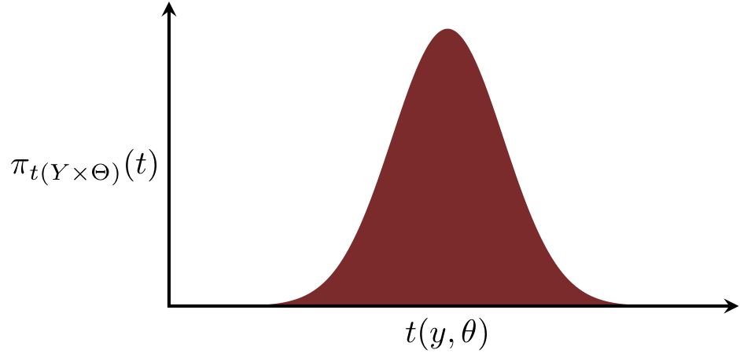
```
<br><br>
</center>

Often it's useful to consider a collection of one-dimensional summary functions
that might, for example, capture the consequence of our modeling assumptions
within ordered categories.

<center>
<br>
```{r, out.width = "50%", echo=FALSE}
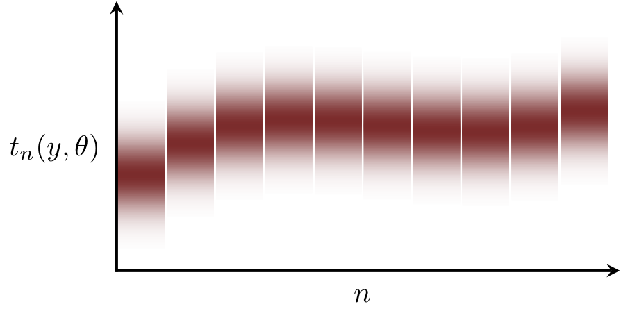
```
<br><br>
</center>


When these discrete categories are approximating a continuous set of summary
functions the visualization often benefits from interpolating between
neighboring pushforward distributions to fill in the gaps.

<center>
<br>
```{r, out.width = "50%", echo=FALSE}
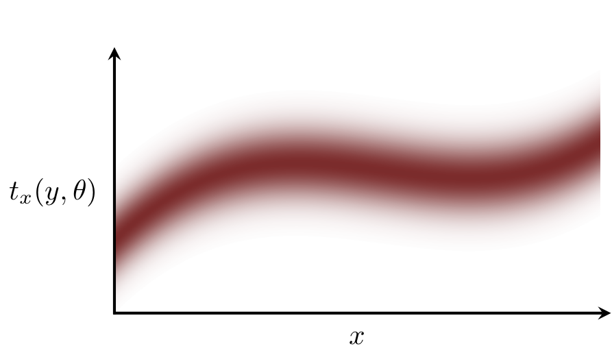
```
<br><br>
</center>

#### Pain Threshold

In order to judge the behavior of a pushforward probability distribution we
need to elicit domain expertise within the narrow context of each summary
function we consider.  Even if the summary space is one-dimensional this can be
challenging as our domain expertise is rarely so well-defined that it can be
immediately encoded in anything as precise as a probability distribution.

Domain expertise is often much easier to elicit in terms of relative
_comparisons_ of the summary function values, for example which of two values is
more reasonable than the other.  This may not be enough to define a probability
distribution but it is enough to define approximate _thresholds_ that separate
"reasonable" values of the summary function and "extreme" values.  Importantly
extreme values above the thresholds are unreasonable but not impossible; in
other words these thresholds quantify when we transition from being ambivalent
with the output values to being uneasy with them.

If we've parameterized our model such that zero specifies a reasonable value
then we can also talk about the thresholds partitioning the summary space into
the reasonable values of the summary function we more associate with zero and
the extreme values that we more associate with infinity.  From this perspective
the thresholds define where we start to "round up" to infinity.

Typically we won't be able to reduce our domain expertise into thresholds with
precise values, and in practice it's easier to consider them as identifying only
the order of magnitude where values start to become unsavory.  Another way to
reason about the order of magnitude is to reason about the _units_ deemed
appropriate to the problem.  A summary function typically presented in units of
grams is unlikely to exceed values that surpass kilograms, otherwise kilograms
would have been the more conventional unit in the first place!

To demonstrate the elicitation of approximate thresholds let's consider a model
of how quickly a drug propagates through a patient's blood stream.  Even if we
are not well-versed in physiology we are not completely ignorant; for example
we can be fairly confident that the unknown propagation speed will be less than
the speed of sound in water, as a drug dose traveling that fast would
have...unfortunate physical consequences on the integrity of blood vessels.  The
speed of sound in water is around 1 kilometer per second, and that order of
magnitude provides a threshold capturing our very basic domain expertise.  Of
course the more domain expertise we have about physiology the closer to zero we
can push this threshold.

Similarly if we're modeling carbon concentration in the air then we can be sure
that our thresholds should at least be bounded by concentrations more
characteristic of solid concrete than gaseous, breathable air.  If we're
modeling the migration of birds then we should probably define thresholds on
flying speed well below the speed of light.

This focus on thresholds has a few key advantages when trying to elicit domain
expertise in practice.

Because we only need to identify where extreme values begin, we, or the experts
with whom we are working, can focus on only rejecting bad values instead of
having to take the responsibility of accepting good values.  In other words we
can take advantage of our natural appetite to criticize by moving the threshold
down to less extreme values until we start to become hesitant in our pessimism.

Secondly thresholds are easier to manage when trying to reconcile conflicting
domain expertise from multiple sources.  While those sources might disagree
about the fine details within the thresholds, they are much more likely to agree
about the extremes.  Moreover we can always take a conservative approach and set
the thresholds as the largest of those elicited, defining extreme values
consistent with all of the domain expertise considered.

#### Tall Tails

Thresholds informed by our approximate domain expertise separate the output of a
summary function into reasonable and extreme values.  In order to compare this
manifestation of our domain expertise to the consequences of our model we need
our pushforward probability distributions to make a similar partition.

Unimodal probability density functions are often separated into a _bulk_ or
_head_, a central neighborhood in which most of the probability is concentrated,
surrounded by one or more _tails_, containing the meager probability that
remains.

<center>
<br>
```{r, out.width = "100%", echo=FALSE}
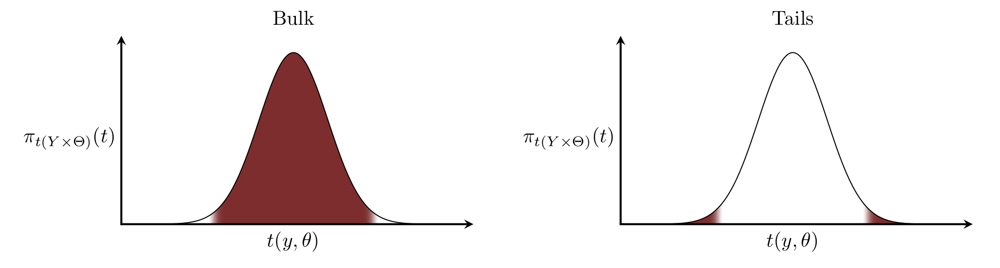
```
<br><br>
</center>

If the summary space is unbounded then the tails will typically stretch out
towards infinity in both directions.  When the summary space is bounded,
however, a probability density function might feature a bulk adjacent to the
boundary with a tail on the other side, or a bulk surrounded by tails
stretching to the boundaries on either side.

<center>
<br>
```{r, out.width = "50%", echo=FALSE}
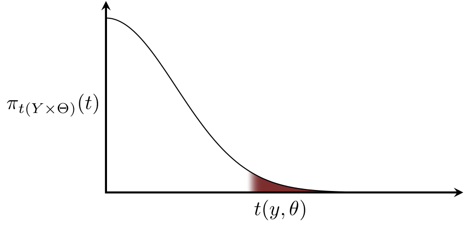
```
<br><br>
</center>

<center>
<br>
```{r, out.width = "50%", echo=FALSE}
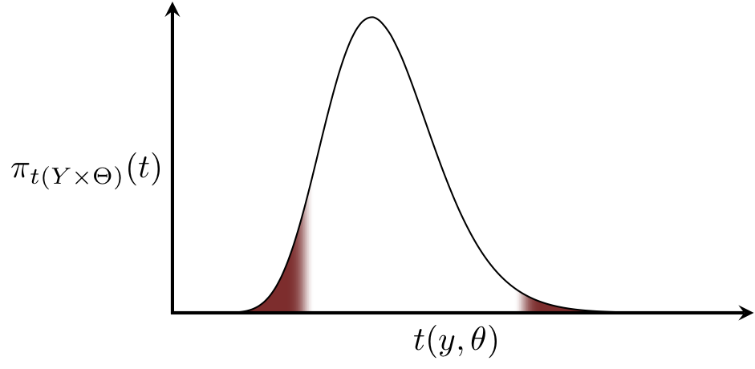
```
<br><br>
</center>

Qualitatively the bulk and the tails of a probability density function define
their own separation of the summary space into "reasonable" and "extreme" values.
If we've parameterized the summary space well then the bulk will contain zero,
and we can also talk about the boundary between the bulk and the tails as
partitioning the summary space into the reasonable values of the summary
function closer to zero and the extreme values closer to infinity.

The bulk and the tails of a probability density function are qualitative
features with no precise definition.  In order to make the definition more
explicit we can define tails as the bounding neighborhoods that contain a
specific amount of probability, but we have to remember that any choice is
approximate.  For convenience I usually define a tails as a bounding regions
containing 1% of the total probability, but when making any quantitative
comparisons I also consider the 0.1% and 5% regions to avoid any sensitivity to
this particular choice.

<center>
<br>
```{r, out.width = "50%", echo=FALSE}
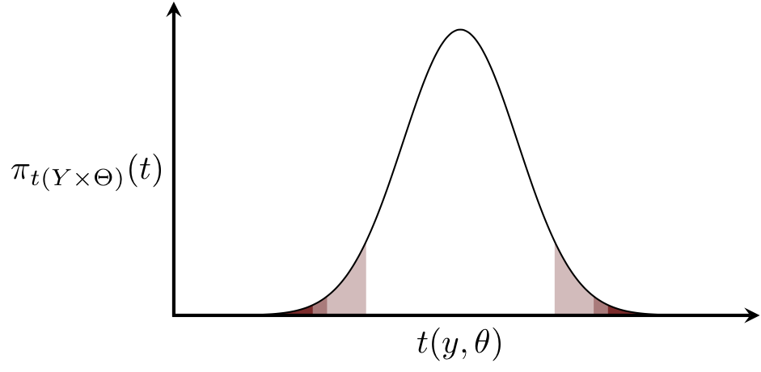
```
<br><br>
</center>

#### Wag the Dog

Now that we have distilled both our domain expertise to thresholds and our model
consequences to tails in each summary space we can go about comparing them.
Because both are approximate, and best considered as orders of magnitude, we
should require that those orders of magnitude are consistent with each other.

I personally prefer to summarize these comparisons visually by plotting the
domain expertise informed thresholds over the pushforward probability density
functions for each summary function.

<center>
<br>
```{r, out.width = "50%", echo=FALSE}
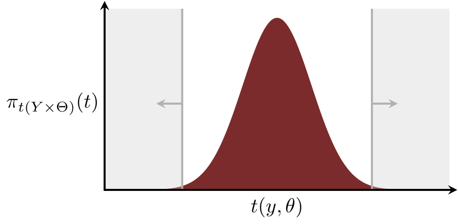
```
<br><br>
</center>

<center>
<br>
```{r, out.width = "50%", echo=FALSE}
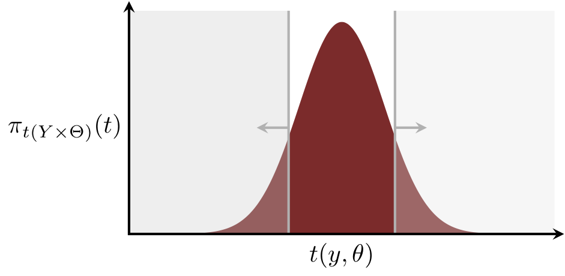
```
<br><br>
</center>

<center>
<br>
```{r, out.width = "100%", echo=FALSE}
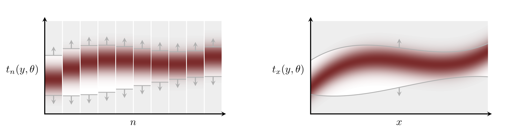
```
<br><br>
</center>

The advantage of this visualization is that we can see what qualitative features
of the pushforward probability density function have to change to ensure
compatibility within the context of each summary function, and hence motivate
changes to the complete Bayesian model.

We can provide a more quantitative measure by computing the pushforward
probability outside of the domain-expertise informed thresholds to see if they
are consistent with what we would expect from tails.  Because these thresholds,
and the definition of a tail, are only vaguely defined we have to be careful not
to expect too much from these tail probabilities.  I typically consider anything
between 0.1% to 5% to be valid.

<center>
<br>
```{r, out.width = "50%", echo=FALSE}
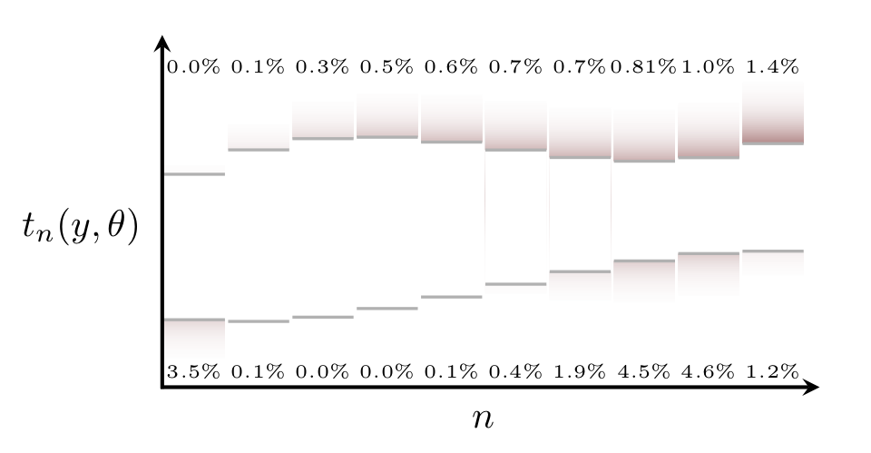
```
<br><br>
</center>

#### Implementing Prior Checks

Unfortunately the implementation of these model checks in practice is frustrated
by our inability to analytically construct explicit pushforward density functions
outside of very simple circumstances.  In most cases we can construct visual
checks, however, by pushing forward exact samples from the complete Bayesian
model.

Conveniently we can often construct a sample from the complete Bayesian model,
$(\tilde{y}, \tilde{\theta})$, sequentially, first generating a sample from the
prior distribution,
$$
\tilde{\theta} \sim \pi_{\mathcal{S}}(\theta)
$$
before simulating an observation from the corresponding data generating process,
$$
\tilde{y} \sim \pi_{\mathcal{S}}(y \mid \tilde{\theta}).
$$
We can then construct a sample from any summary pushforward distribution by
evaluating the summary function at this sample,
$$
\tilde{t} = t(\tilde{y}, \tilde{\theta}).
$$

Using these pushforward samples we can then construct visualizations such as
histograms, empirical cumulative distribution functions, and the like that
allows us to immediately implement the consistency checks.

<center>
<br>
```{r, out.width = "50%", echo=FALSE}
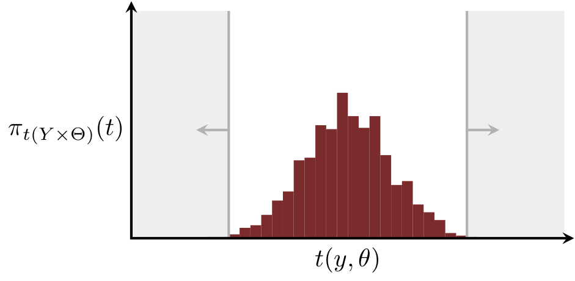
```
<br><br>
</center>

When using a sequence of summary functions I prefer to use _quantile ribbons_
to compactly visualize each pushforward distribution next to each other.  For
example here I use nested 10%-90%, 20%-80%, 30%-70%, and 40%-60% intervals,
along with the median, which are readily estimated from ensembles of hundreds of
samples.

<center>
<br>
```{r, out.width = "100%", echo=FALSE}
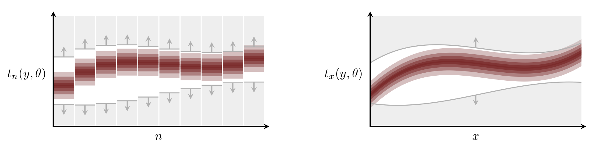
```
<br><br>
</center>

### Prior Pushforward Checks

In many applications, especially in science, the observational model is
understood much better than the prior model.  Consequently we often need to
prioritize checking the consequences of the prior model, especially in the
context of the observational model.

A _prior pushforward check_ considers summary functions that depend only on the
model configuration space,
$$
\begin{alignat*}{6}
t :\; &\Theta& &\rightarrow& \; &U \subset \Theta&
\\
&\theta& &\mapsto& &t(\theta)&,
\end{alignat*}
$$
and the corresponding pushforward of the prior model, $\pi_{t(\Theta)}(t)$.

If the model configuration space is a product space then the coordinate
functions are natural candidates for summary functions.  Indeed if our prior
model is defined by an independent probability density function,
$$
\pi_{\mathcal{S}}(\theta)
=
\pi_{\mathcal{S}}(\theta_{1}, \ldots, \theta_{N})
=
\prod_{n = 1}^{N} \pi_{\mathcal{S}}(\theta_{n}),
$$
then we can use thresholds informed by our domain expertise to motivate the
component prior density functions in the first place.  We will use this
strategy extensively in [Section 4](#sec:demonstration).

Principled component prior density functions are critical to a good prior model,
but they are not sufficient.  In general the observational model will be
mediated by intermediate functions of the model configuration space, and good
component priors do not guarantee that the pushfoward of the entire prior model
onto these intermediate functions are well-defined.  If our complete Bayesian
model is built from a conditional decomposition with a directed graphical
representation then the internal pushforward nodes all identify functions that
we will want to investigate for the given application.

For example consider a data generating process that manifests in binary
observations, $Y = \{0, 1\}^{N}$, and an observational model specified by the
Bernoulli family of probability mass functions where the probability parameters
are defined by some function of the model parameters,
$$
\pi_{S}(y \mid \theta)
= \pi_{S}(y_{1}, \ldots, y_{N} | \theta)
= \prod_{n = 1}^{N} \text{Bernoulli}(y_{n} \mid p(\theta)).
$$
In this case the complete Bayesian model admits a directed graphical model
representation.

<center>
<br>
```{r, out.width = "50%", echo=FALSE}
knitr::include_graphics("figures/prior_checks/dgm/dgm.png")
```
<br><br>
</center>

In order to understand the full consequences of our prior model _in the context
of this observational model_ we would need to take the probability function
$p(\theta)$ as a summary function and investigate the corresponding pushforward
of the prior model.  A prior distribution that is too diffuse, for example,
might induce a pushforward distributions that concentrate too strongly at
extremely small or large probabilities.

<center>
<br>
```{r, out.width = "50%", echo=FALSE}
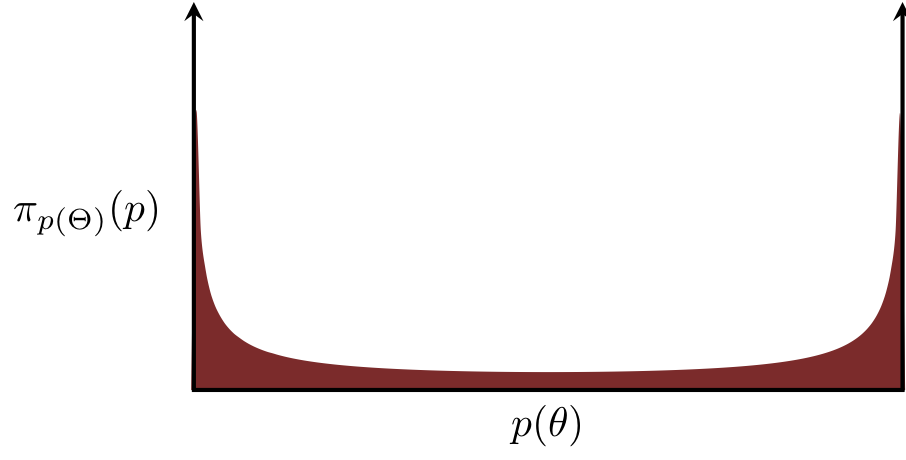
```
<br><br>
</center>


These horns are extremely metal but also indicate that this concentration is
likely to overwhelm the contribution of likelihood functions and pull any
posterior distribution to the boundaries as well, at least unless we have a
wealth of data.  If this behavior is at odds with our domain expertise, say
knowledge that favors a more uniform distribution over probabilities, then we
would have to refine our prior model until the prior pushforward check is better
behaved.

<center>
<br>
```{r, out.width = "50%", echo=FALSE}
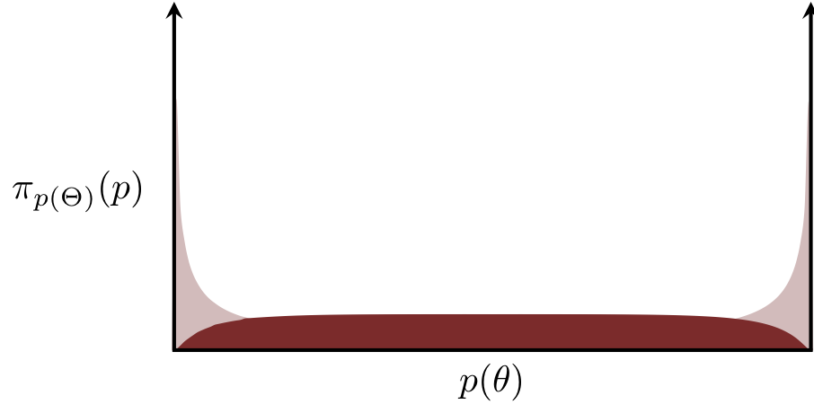
```
<br><br>
</center>

### Prior Predictive Checks

To fully probe the consequences of our prior model, however, we need to
investigate its effects on the observational space itself.  A _prior predictive
check_ considers summary functions that depend only on the observational space,
$$
\begin{alignat*}{6}
\hat{t} :\; &Y& &\rightarrow& \; &U \subset Y&
\\
&y& &\mapsto& &\hat{t}(y)&,
\end{alignat*}
$$
and the corresponding pushforward of the prior model, $\pi_{\hat{t}(Y)}(t)$.
In classical statistics functions of the observational space are also know as
_statistics_, so to avoid any confusion with prior pushforward checks I will
refer to these summary functions as _summary statistics_.

Pushing the complete Bayesian model, $\pi_{\mathcal{S}}(y, \theta)$, forward
along a summary statistic is equivalent to pushing the prior predictive
distribution,
$$
\begin{align*}
\pi_{\mathcal{S}}(y)
&= \int \mathrm{d} \theta \, \pi_{\mathcal{S}}(y, \theta)
\\
&= \int \mathrm{d} \theta \,
\pi_{\mathcal{S}}(y \mid \theta) \, \pi_{\mathcal{S}}(\theta),
\end{align*}
$$
along that statistic.  Consequently we can also interpret prior predictive
checks as investigating the structure of the prior predictive distribution and
looking for an excess of extreme predictions.

Constructing an interpretable yet informative summary statistic is very much an
art where we can fully employ our creativity to define useful real-valued
summaries or even structured multidimensional summaries like a histograms or
empirical cumulative distribution functions.  The orthodox frequentist
literature also provides a surprising wealth of inspiration as classic
estimators define summary statistics with very clear interpretations.  For
example empirical means and medians are sensitive to the centrality of the prior
predictive distribution along specific components of the observational space,
with the empirical standard deviation and quartiles sensitive to the breadth of
the distributions.  We can be more creative, however, when the observational
space is more structured.  Empirical correlograms, for example, can summarize
the structure of time series data while analysis of variance statistics can
summarize heterogeneity between groups.

Because summary statistics are defined with respect to only the observational
space the thresholds we need to complete the prior predictive checks need to be
informed only by knowledge of the observational space itself.  Consequently it
can be easier to elicit these thresholds than the thresholds for prior
pushforward checks, which require understanding the structure of the complete
Bayesian model.  This is especially true when working with domain experts more
familiar with the experiment than with models of the latent phenomena.

Importantly prior predictive checks are a technique for comparing our model
assumptions to our domain expertise, and to _only_ our domain expertise.
Allowing comparisons between the prior predictive distribution and any
_observed_ data to influence the development of the prior model is a form of
_empirical Bayes_ that uses the data twice, once to directly inform the prior
model and again to construct the posterior distribution.  This over-influence of
the observed data is prone to _overfitting_ where we develop a model that is
exceptionally good at retrodicting the particular data we observed at the cost
of poor predicitons of the rest of the true data generating process.

One of the nice features of implementing prior pushforward checks and prior
predictive checks with samples is that these implementations use progressive
information about the complete Bayesian model, allowing us to share computation
between the checks.  For example, once we've generated a sample from the
complete Bayesian model,
$$
\tilde{\theta} \sim \pi_{\mathcal{S}}(\theta),
\\
\tilde{y} \sim \pi_{\mathcal{S}}(y \mid \tilde{\theta}),
$$
we can use the sampled model configuration for prior pushforward checks and
the simulated observation for prior predictive checks without any additional
cost.  This is even more apparent when the full Bayesian model admits a nice
conditional decomposition that allows us to use ancestral sampling, with each
conditional sample corresponding to an intermediate pushforward distribution
that we can analyze for consistency.

The idea of analyzing the prior predictive distribution goes back to Good's
_device of imaginary results_ [@Good:1983], which conveniently also gives its
user +2 to Wisdom saving throws.

## Computational Faithfulness

A model is only as useful as our ability to wield it.  A Bayesian model is only
as good as our ability to compute expectation values with respect to the
posterior distributions it generates or, more practically, estimate expectation
values with quantifiable error.

Given a particular observation, and hence posterior distribution, we can use
methods with self-diagnostics, such as Hamiltonian Monte Carlo, to identify
inaccurate computation and provide some confidence that we can actually realize
faithful inferences.

Before we've made an observation, however, we don't know what shape the
likelihood function will take and hence the structure of the posterior density
function that our algorithms must manage.  Some potential observations, for
example, might lead to likelihood functions that strongly concentrate within
compact neighborhoods and yield well-behaved posterior density functions, but
some might lead to more degenerate likelihood functions that induce more
problematic posterior density functions.

<center>
<br>
```{r, out.width = "50%", echo=FALSE}
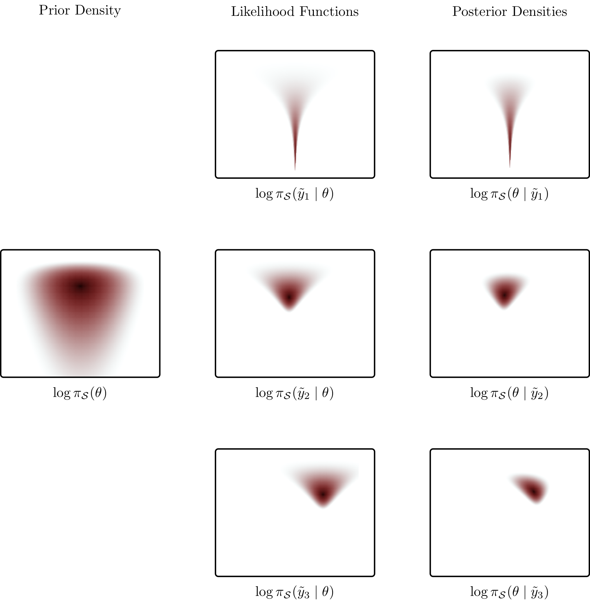
```
<br><br>
</center>

All we can do to assess the faithfulness of our computational methods before
we've made an observation is to apply them to posterior density functions
arising from a variety of possible data, ideally spanning the worst behaviors
we might actually see in practice.  What, however, defines the scope of
observations that might be realized in an experiment?  Within the context of our
model it's exactly the prior predictive distribution.

If we've already addressed the first question and believe that our model is
consistent with our domain expertise then we can simulate observations from the
prior predictive distribution,
$$
\tilde{\theta} \sim \pi_{\mathcal{S}}(\theta),
\\
\tilde{y} \sim \pi_{\mathcal{S}}(y \mid \tilde{\theta}),
$$
fit the resulting posterior distributions with our chosen computational method,
$$
\pi_{\mathcal{S}}(\theta \mid \tilde{y}),
$$
and then examine the ensemble behavior of those fits using whatever diagnostics
are available.  If we've already performed prior checks then the prior
predictive samples will already have been generated -- all we have to do is fit
the corresponding posteriors.

These assessments, however, are only as good as the self-diagnostic methods
available.  Fortunately Bayesian inference implies a subtle consistency property
that allows us to carefully assess the accuracy of _any_ algorithm capable of
generating posterior samples.

An arbitrary Bayesian model guarantees nothing about the behavior of any single
posterior distribution, even if the data are simulated from the prior predictive
distribution.  The _average_ posterior distribution over prior predictive draws,
however, will always recover the prior distribution,
$$
\begin{align*}
\pi_{\mathcal{S}}(\theta')
&=
\int \mathrm{d} y \, \mathrm{d} \theta \,
\pi_{\mathcal{S}} (\theta' \mid y) \, \pi_{\mathcal{S}} (y, \theta)
\\
&=
\int \mathrm{d} y \, \pi_{\mathcal{S}} (\theta' \mid y)
\int \mathrm{d} \theta \, \pi_{\mathcal{S}} (y, \theta)
\\
&=
\int \mathrm{d} y \, \pi_{\mathcal{S}} (\theta' \mid y) \, \pi_{\mathcal{S}} (y).
\end{align*}
$$
This implies, for example, that the ensemble of samples from many posterior
distributions,
$$
\begin{align*}
\tilde{\theta} &\sim \pi_{\mathcal{S}}(\theta)
\\
\tilde{y} &\sim \pi_{\mathcal{S}}(y \mid \tilde{\theta})
\\
\tilde{\theta}' &\sim \pi(\theta \mid \tilde{y}),
\end{align*}
$$
will be indistinguishable from samples from the prior distribution.
Consequently any deviation between the two ensembles indicates that either the
prior predictive sampling has been implemented incorrectly or our computational
method is generating biased samples.

_Simulated-based calibration_ [@TaltsEtAl:2018] compares the ensemble posterior
sample and the prior sample using _ranks_.  For each simulated observation we
generate $R$ samples from the corresponding posterior distribution,
$$
\begin{align*}
\tilde{\theta} &\sim \pi_{\mathcal{S}}(\theta)
\\
\tilde{y} &\sim \pi_{\mathcal{S}}(y \mid \tilde{\theta})
\\\
(\tilde{\theta}'_{1}, \ldots, \tilde{\theta}'_{R}) &\sim \pi(\theta \mid \tilde{y}),
\end{align*}
$$
and compute the rank of the prior sample within the posterior samples, i.e.
the number of posterior samples larger than the prior sample,
$$
\rho = \sharp \left\{ \tilde{\theta} < \tilde{\theta}'_{r} \right\}.
$$
If the ensemble posterior samples and the prior samples are equivalent then
these ranks will be uniformly distributed, allowing us to visually examine the
equivalence which histograms, empirical cumulative distribution functions, and
the like.

For example if the samples are equivalent then each parameter histogram should
within the expected statistical variation.  Here I use an independent binomial
approximation in each bin to estimate the expected variation and visualize it
with a gray rectangle.

<center>
<br>
```{r, out.width = "50%", echo=FALSE}
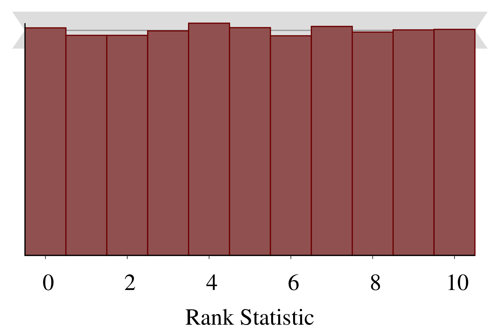
```
<br><br>
</center>

One of the massive advantages of this approach is that common computational
problems manifest in _systematic_ deviations that are easy to spot.  For example
if our computational method generates samples that are underdispersed then the
prior rank will be biased low and high, resulting in a SBC histogram
concentrated at both boundaries.

<center>
<br>
```{r, out.width = "50%", echo=FALSE}
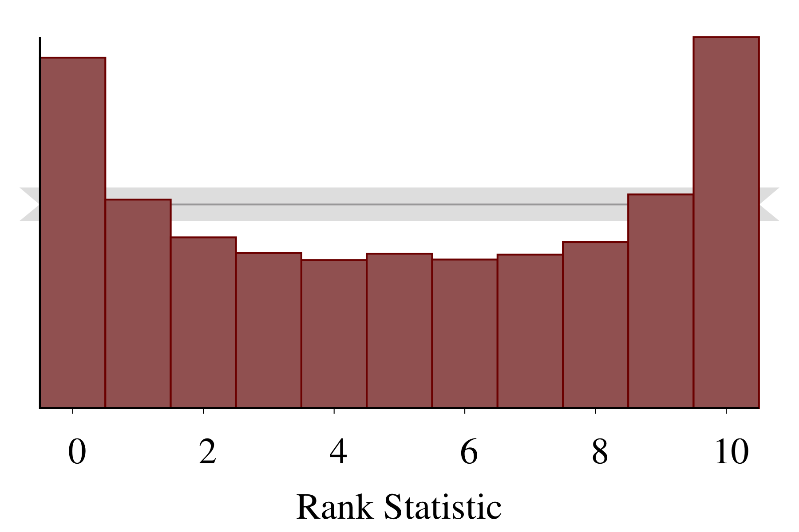
```
<br><br>
</center>

Similarly if the estimated posterior is biased low then the prior ranks will be
biased high and the SBC histogram will concentrate at the right boundary.

<center>
<br>
```{r, out.width = "50%", echo=FALSE}
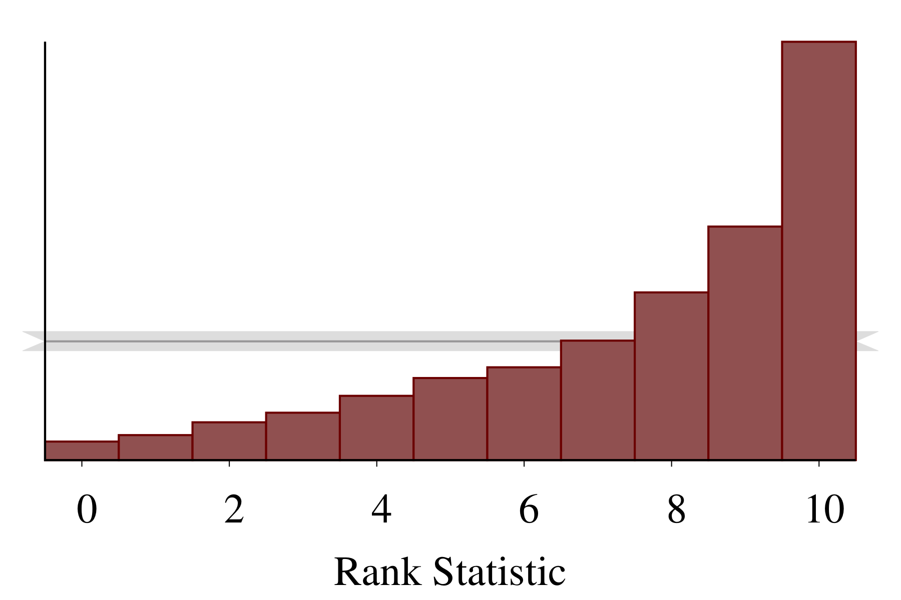
```
<br><br>
</center>

Keep in mind that specific behavior depends on our definition of rank -- if the
prior ranks are defined as
$$
\rho = \sharp \left\{ \tilde{\theta} > \tilde{\theta}'_{r} \right\}
$$
then a low bias in the posterior fit will manifest in a SBC histogram that
concentrates at the _left_ boundary.  The rank convention is arbitrary so we
just have to make sure that we use one of them consistently.

For further discussion of common systematic deviations and their
interpretations see the simulated-based calibration paper.

Technically simulation-based calibration requires exact posterior samples, which
are not available if we are using, for example, Markov chain Monte Carlo.  To
use simulation-based calibration with Markov chain Monte Carlo we have to first
thin our Markov chains to remove any effective autocorrelation.  See
@TaltsEtAl:2018 for more details.

The primary limitation of simulation-based calibration is that it assesses the
accuracy of a computational method only within the context of the posterior
distributions arising from prior predictive observations.  If the true data
generating process is not well-approximated by one of our model configurations
then our assessment of computational faithfulness will have little to no
relevance to fits of real data.  These checks are strongly recommended but
definitely not sufficient until we believe that more model is close enough to
the true data generating process.

## Inferential Calibration

Once we trust our computation, at least within the context of our model, we can
consider whether or not the possible posterior distributions we might encounter
yield inferences and decisions that are sufficient for the inferential goals of
our analysis.  Because some observations might be more informative than others
we will have to consider ensembles of possible observations, and hence ensembles
of posterior distributions and their resulting inferences, just as we did above.

_Calibration_ of inferential outcomes is foundational to frequentist statistics,
including concepts like coverage of confidence intervals and sample size
calculations, false discovery rates, and power calculations of significance
tests.  Here we take a Bayesian approach to calibration, using the the scope of
observations and model configurations quantified by the complete Bayesian model
to analyze the range of inferential outcomes, and in particular calibrate them
with respect to the simulated truths [@Betancourt2018a].  Note that I use
calibrate here in the sense of _determining_ what outcomes a model might return,
rather than any process of _modifying_ a model to achieve a particular desired
outcome.

### Explicit Calibration

Calibration formally requires a utility function that quantifies how good an
inference or decision is in the context of a simulated truth.

Consider, for example, a _decision making process_ that takes in an observation
as input and returns an action from the space of possible actions, $A$,
$$
\begin{alignat*}{6}
a :\; &Y& &\rightarrow& \; &A&
\\
&y& &\mapsto& &a(y)&.
\end{alignat*}
$$
This process could be a Bayesian decision theoretical process informed by
posterior expectations, but it need not be.  It could just as easily be a
process to reject or accept a null hypothesis using an orthodox significance
test or any heuristic decision rule.

We then define the net benefit of taking action $a \in A$ when the true data
generating process is given by the model configuration $\theta$ as
$$
\begin{alignat*}{6}
U :\; &A \times \mathcal{S}& &\rightarrow& \; &\mathbb{R}&
\\
&(a, \theta)& &\mapsto& &U(a, \theta)&.
\end{alignat*}
$$
For example this might be a false discovery rate when choosing between two
hypotheses or the outcome of an intervention minus any of its implementation
costs.  In this context the utility of a decision making process for a given
observation becomes
$$
\begin{alignat*}{6}
U :\; &Y \times \Theta& &\rightarrow& \; &\mathbb{R}&
\\
&(y, \theta)& &\mapsto& &U(a(y), \theta)&.
\end{alignat*}
$$

In practice we don't know what the true data generating process is and before
the measurement process resolves we don't know what the observed data will be,
either.  If we assume that our model is rich enough to capture the true data
generating process, however, then the complete Bayesian model quantifies
reasonable possibilities.  Consequently we can construct a distribution of
possible utilities by pushing the complete Bayesian model forward along the
utility function to give $\pi_{U(A, \mathcal{S})}$.

<center>
<br>
```{r, out.width = "50%", echo=FALSE}
knitr::include_graphics("figures/sensitivity/sensitivity_theory/sensitivity_theory.png")
```
<br><br>
</center>

As with the prior checks we can approximate the probability density function of
this pushforward distribution in practice using samples,
$$
\tilde{\theta} \sim \pi_{\mathcal{S}}(\theta)
\\
\tilde{y} \sim \pi_{\mathcal{S}}(y \mid \tilde{\theta})
\\\
U(a(\tilde{y}), \tilde{\theta}).
$$

<center>
<br>
```{r, out.width = "50%", echo=FALSE}
knitr::include_graphics("figures/sensitivity/sensitivity_practice/sensitivity_practice.png")
```
<br><br>
</center>

This distribution of utilities is particularly useful for understanding how
sensitive the measurement process is to the relevant features of the latent
system that we're studying.  By carefully quantifying what we want to learn in
the experiment into an explicit utility function we can formalize how capable
our model is at answering those questions.

Note the importance of accurate computation.  If our computational methods
didn't provide a faithful picture of each possible posterior distribution then
we would derive only biased utility distributions that would give us a
misleading characterization of our inferences and their consequences.

For example our decision may be whether or not the true data generating process
falls into an irrelevant region near a baseline model configuration,
$\Theta_{\text{irrelevant}}$ or a relevant region further away,
$\Theta_{\text{relevant}}$.  The utility function would then be some combination
of the false discovery rate, how often we choose the relevant region when the
true data generating process lies in the irrelevant region, and the true
discovery rate, how often we choose the relevant region when the true data
generating process lies in the relevant region.

By simulating from the prior predictive distribution and running our decision
making process we can generate binary values of the indicator functions
$$
\mathbb{I}[ \text{decide relevant} \mid \pi^{\dagger} \in \Theta_{\text{irrelevant}} ]
$$
and
$$
\mathbb{I}[ \text{decide relevant} \mid \pi^{\dagger} \in \Theta_{\text{relevant}} ].
$$
The average of these outcomes then estimate Bayesian false discovery rates and
Bayesian true discovey rates of the decision making process.

### A Bayesian Eye Chart

Regardless of the specific goals of an analysis we are often interested in the
general behavior of the posterior distribution induced by possible observations,
especially any pathological behavior that might manifest from our model
assumptions.  Conveniently there are two characteristics of the posterior
distribution that can identify a variety of possible problems.

First let's consider the _posterior $z$-score_ of a given parameter in the model
configuration space,
$$
z[f \mid \tilde{y}, \theta^{\dagger}] =
\frac{ \mathbb{E}_{\mathrm{post}}[f \mid \tilde{y}] - f(\theta^{\dagger}) }
{ \mathbb{E}_{\mathrm{post}}[f \mid \tilde{y} ] },
$$
where $\theta^{\dagger}$ is the parameter corresponding to the true data
generating process.  The posterior $z$-score quantifies how accurately the
posterior recovers the true model configuration along this coordinate.  Smaller
values indicate a posterior that more strongly concentrates around the true
value while larger values indicate a posterior that concentrates elsewhere.
Note that the posterior $z$-score captures neither the bias nor the precision of
the posterior distribution but rather a combination of the two.

Likewise the _posterior contraction_ of a given parameter,
$$
c[f \mid \tilde{y}] = 1 -
\frac{ \mathbb{V}_{\mathrm{post}}[f \mid \tilde{y} ] }
{ \mathbb{V}_{\mathrm{prior}}[f \mid \tilde{y} ] },
$$
where $\mathbb{V}$ denotes the variance, quantifies how much the likelihood
function from a given observation informs the given function.  Posterior
contraction near zero indicates that the data provide little information beyond
the domain expertise encoded in the prior model, while posterior contraction
near one indicates observations that are much more informative relative to the
prior model.

These two posterior characterizations can identify an array of pathological
behaviors that are prone to compromising our inferences.  For example a
posterior distribution with a high posterior $z$-score and a high posterior
contraction is being forced away from the true value by the observed data and
overfitting, at least if the prior model contains the true value.  Likewise a
posterior distribution with a small posterior $z$-score and a small posterior
contraction is only poorly informed by the observations.  On the other hand a
posterior distribution with both a small posterior $z$-score and a small
posterior contraction indicates ideal learning behavior.  A posterior
distribution with a large posterior $z$-score and a small posterior contraction
indicates that the prior model conflicts with the true value.

<center>
<br>
```{r, out.width = "75%", echo=FALSE}
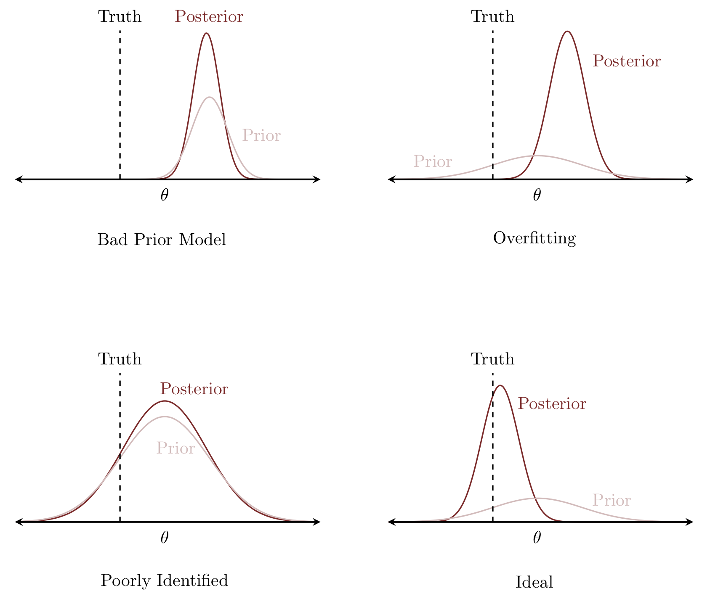
```
<br><br>
</center>

Indeed we can identify all of these pathological behaviors by plotting the two
characteristics of a given posterior distribution against each other.

<center>
<br>
```{r, out.width = "50%", echo=FALSE}
knitr::include_graphics("figures/eye_chart/eye_chart_regimes.png")
```
<br><br>
</center>

If we fit the posterior distribution corresponding to an ensemble of simulations
from the prior predictive distribution
$$
\tilde{\theta} \sim \pi_{\mathcal{S}}(\theta)
\\
\tilde{y} \sim \pi_{\mathcal{S}}(y \mid \tilde{\theta}),
$$
then we can visualize the entire distribution of possible posterior behaviors,
$$
z[f \mid \tilde{y}, \tilde{\theta}_{n}]
\\
c[f \mid \tilde{y} ],
$$
with a scatter plot and quickly identify potential problems with our
experimental design.  Note that by sampling true model configurations from the
prior model we cannot get posterior behaviors that consistently fall into the
"Bad Prior Model" neighborhood.

For example the following scatter plot indicates that the posteriors arising
from most prior predictive observations concentrate around the true value
reasonably well.  It also shows, however, that occasionally the posteriors will
strongly more concentrate, and when they do they are prone to concentrating away
from the true value and overfitting.

<center>
<br>
```{r, out.width = "50%", echo=FALSE}
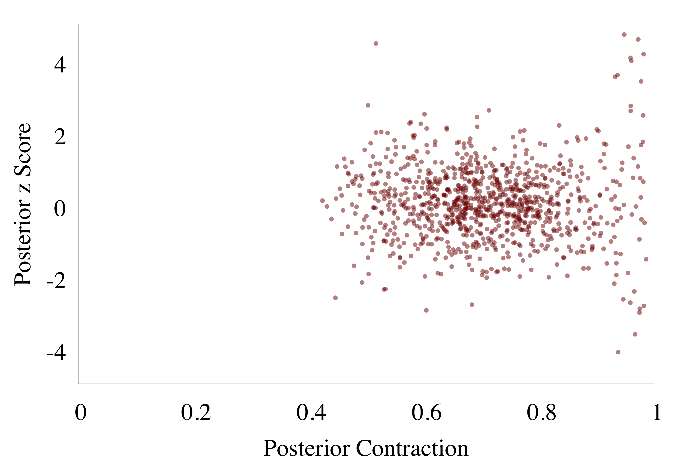
```
<br><br>
</center>

Where good values transition into bad values depends entirely on the needs of a
given application, but I typically start to worry when I see small excesses
above a $z$-score of 4 or large excesses above a $z$-score of 3.

We can follow up on any problematic fits by investigating the corresponding
observations, and the likelihood functions they induce, to see exactly what is
leading the posterior distribution astray.

<center>
<br>
```{r, out.width = "50%", echo=FALSE}

```
<br><br>
</center>

### The Limitations of Calibration

Whether frequentist or Bayesian, model-based calibration is well-defined _only
within the context of the assumed model_.  In general these calibrations have no
application to data generating processes outside of the observational model,
at least not unless we expand the model and recompute the calibration to see
what the change might be.

Consequently any modification to the phenomena, environment, or experimental
probe spanned by the model will in general invalidate a Bayesian calibration.
For example even if the latent phenomena are the same, varying environments and
experimental probes can lead to very different utilities.  What is good enough
to answer questions in one particular comtext may not be sufficient to answer
questions in different contexts!

Because at least some aspect of the phenomena, environment, and probe are unique
to each experiment this means that we cannot rely on black box calibrations
derived from default, and typically unquestioned, models.  The most robust
calibrations are derived from bespoke models capturing the particular
circumstances of each application.

The validity of even a bespoke calibration, however, presumes that with enough
effort we can actually build a model that captures the true data generating
process.  A valid calibration requires that we model sufficiently well not only
the experimental _design_  but also the often surprising ways that design is
actually _implemented_ in practice.  Calibrations derived before the data are
collected are necessarily optimistic; we can fully understand the utility of our
inferences only after we can investigate the revelations hiding in the observed
data itself.

## Model Adequacy

Questions 1-3 ultimately concern the self-consistency of a Bayesian model. Their
answers depend on how our domain expertise, computational tools, and the goals
of given application interact within only the scope of the given model.
Consequently these answers will have no relevance to actual experiments unless
the model provides a reasonable facsimile of the system that we're studying.  In
other words for our model and inferences to be useful we need to verify whether
_the model captures the pertinent structure of the true data generating process_.

In order to determine whether or not our model is adequate we need to develop
techniques to critique our model in the context of our inferential goals.  We
need techniques that allow us to identify and _understand_ the limitations of
our model so that we can motivate principled improvements that bring our model
closer to the true data generating process.

In this section we'll first consider exactly how we can relate our model to the
true data generating process before surveying a popular numerical approach to
formalizing this comparison that ultimately proves to be unsatisfactory and then
finally formulating a visual approach that serves our critical needs.

### So Close, Yet So Far Away

In order to critique the adequacy of a given model we have to be able to
compare it to the true data generating process.

#### All Models Are Wrong

If our model were sufficiently rich then our observational model
$\pi_{\mathcal{S}}(y; \theta)$ would contain the true data generating process,
$\pi^{\dagger}$; in other words the true data generating process would be one
of the data generating processes in our model,
$$
\pi^{\dagger} = \pi_{\mathcal{S}}(y; \theta^{\dagger}), \, \theta^{\dagger} \in \Theta.
$$

<center>
<br>
```{r, out.width = "50%", echo=FALSE}
knitr::include_graphics("figures/small_world/small_world/small_world.png")
```
<br><br>
</center>

Calibrations with respect to this model would then accurately reflect the
inferential consequences over actual observations.

Reality, however, is far richer than any model we could feasibly implement.
Consequently any practical observational model will never exactly contain the
true data generating process.

<center>
<br>
```{r, out.width = "50%", echo=FALSE}
knitr::include_graphics("figures/small_world/small_world_one/small_world_one.png")
```
<br><br>
</center>

In this more realistic scenario posterior distributions can't concentrate around
the true data generating process no matter the realized observation. _At best_
the posterior distributions will be able to concentrate around the model
configurations that best approximate the true data generating process.

<center>
<br>
```{r, out.width = "50%", echo=FALSE}
knitr::include_graphics("figures/small_world/small_world_two/small_world_two.png")
```
<br><br>
</center>

When the model doesn't contain the true data generating process we can't say
much about how meaningful the answers to Questions 1-3 will be to real
experiments.  In this circumstance model-based calibrations can be arbitrarily
distant from how our inferences would actually resolve when applied to real
observations.

#### But Some Are Useful

The calibrations might be reasonable however, if the model captures the
structure of the true data generating process that influences our desired
inferences.

For example most physical systems that we might analyze are well-defined by
Newtownian mechanics to extremely small precision.  Even though we know that
Newtownian mechanics breaks down at extremely small temporal and spatial scales,
it is more than sufficient for most analyses _unless we need to resolve a system
at those scales_.  In other words the error inherent to phenomenological models
based on Newtownian mechanics will be nearly impossible to resolve with most
experimental probes.

The same consideration holds for how we model the latent environment and
experimental probe itself.  Many experimental probes, for example, are
well-approximated by modeling the variation in experimental outcomes with
normal probability density functions that emerge from more complex latent
interactions.  Unless the experimental probe is precise enough, however, we
won't be able to resolve the error inherent to this approximation in practice.

A model that doesn't capture every precise detail of the true data generating
process can still be useful if it captures the details _relevant_ to our
particular analysis goals. To paraphrase George Box, our model is probably
wrong but it might still be useful.

Consequently in practice we shouldn't be asking whether or not our model
contains the true data generating process but rather whether or not our model
is _close enough_ to the true data generating process _in the directions that
matter_.  Consider, for example, conceptually separating the space of all data
generating processes $\mathcal{P}$ into the features relevant to our analysis
goals and the features irrelevant to our analysis goals.  In this context we can
decompose the distance from a model to the true data generating process, or the
total _misfit_, into a _relevant misfit_ and an _irrelevant misfit_.

A model with both a large relevant misfit and a large irrelevant misfit will
yield misleading model-based calibrations as well as ineffective inferences
from actual observations.

<center>
<br>
```{r, out.width = "100%", echo=FALSE}
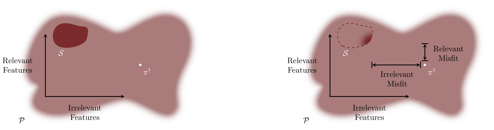
```
<br><br>
</center>

A model with a small relevant misfit, however, will give useful calibrations and
inferences _for our particular analysis goals_ no matter how large the
irrelevant misfit might be.

<center>
<br>
```{r, out.width = "100%", echo=FALSE}
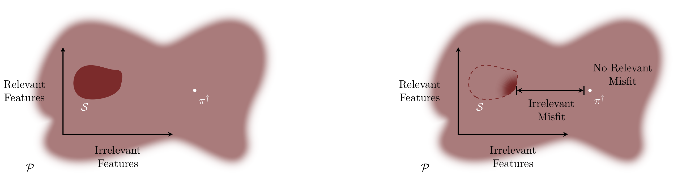
```
<br><br>
</center>

In the Bayesian statistical literature the relationship between an
observational model and the true data generating process is often classified
with the $\mathcal{M}$ categories [@BernardoEtAl:2009].  The ideal, and largely
unattainable, circumstance where our model contains the true data generating
process is known as the _$\mathcal{M}$-closed_ setting, while the more practical
circumstance where our model doesn't contain the true data generating process is
known as the _$\mathcal{M}$-open_ setting.

In this case study we'll consider a compromise between these two extremes, a
_$\mathcal{M}$-good enough_ setting where our model is sufficient for our
particular analysis.

#### Apples and Oranges

To determine whether or not our model is "good enough" we need to be able to
make a more formal comparison between our model and the true data generating
process.  This is complicated, however, by the fact that a probabilistic model
and a single true data generating process are _different_ objects.

A probabilistic model is based on an observational model which itself is a
_subset_ of the space of all data generating processes.  A true data generating
process, however, is just a point in this space.  The only formal way to compare
a set and a point is inclusion -- is the point within the set or not -- but we
saw in the previous section that this was too crude of a comparison for our
needs.

In order to make more sophisticated comparisons we need to manipulate one, or
even both, of these objects into the same form that we can then compare in a
well-posed way.  The most straightforward way to achieve this is to reduce our
model into a single _predictive_ data generating process, $\pi^{\text{pred}}$.

For example any single configuration of our model $\theta \in \Theta$ defines a
possible predictive distribution,
$$
\pi^{\text{pred}}(y) = \pi(y ; \theta).
$$
Typically we use inferences informed by an observation, $\tilde{y}$, to select
a predictive distribution compatible with our inferences.  We could, for
instance, select a predictive distribution with a frequentist estimator,
$$
\pi^{\text{pred}}(y \mid \tilde{y}) = \pi(y ; \hat{\theta}(\tilde{y})),
$$
or a posterior expectation value,
$$
\pi^{\text{pred}}(y \mid \tilde{y}) = \pi(y ; \mathbb{m}_{\text{post}}[\theta]),
$$
where
$$
\mathbb{m}_{\text{post}}[\theta] = \mathbb{E}_{\pi(\theta \mid \tilde{y})} [\theta].
$$

In the Bayesian context we have two other natural ways to reduce the entire
model into a single predictive distribution: the prior predictive distribution
and the posterior predictive distribution.  The former is informed by only the
model assumptions while the latter also incorporates what we learn from any
observed data.  Consequently it is the posterior predictive distribution that
best resolves the full inferential consequences of our model.

Regardless of which prediction strategy we choose we still need to find a way
of comparing the predictive data generating process to the true data generating
process, ideally focusing on the aspects relevant to our analysis goals.

### If Everyone Else Jumped Off A Bridge

In science and industry there is a strong aspiration is to reduce comparisons of
any sort to a single number, if not a binary classification between "same" and
"different".  Reducing a comparison to something quantitative, however, often
requires jettisoning crucial information and consequently compromising the
original purpose of the comparison.

In this section we'll strive for a numerical quantification of proximity between
a predictive distribution and a true data generating process, ultimately
deriving many of the popular model comparison approaches in the statistics
literature while also investigating why they don't provide the critical
information we need.  For a more detailed discussion of this derivation along
with extensive references see @Betancourt:2015b.

Because we will not be using any of the techniques introduced here in the
ultimately workflow this section can be skipped.  It does, however, help to
contextualize how these popular methods relate to that workflow and hence will
be useful when communicating the workflow to others.

#### Assessing Predictive Distributions

The mathematical structure of probability distributions limits the ways in
which we can construct self-consistent numerical comparisons.  Information
theory works out the precise consequences of these limitations; here I will
present a summary of the results.

Without endowing an ambient space with any particular structure -- like a
metric or coordinate functions -- the only self-consistent way to compare two
measures $\mu$ and $\nu$ over that space is with an _$f$-divergence_
[@CsiszarEtAl:2004],
$$
D_{f} \! \left( \mu \mid\mid \nu \right)
= \mathbb{E}_{\nu} \left[
f \! \left( \frac{ \mathrm{d} \mu }{ \mathrm{d} \nu } \right) \right],
$$
where $f : \mathbb{R} \rightarrow \mathbb{R}$ is any convex function satisfying
$f \! \left( 1 \right) = 0$.  An $f$-divergence vanishes only when the two
measures are equal and monotonically increases as the two measures deviate from
each other, approaching infinity when $\mu$ is not absolutely-continuous with
respect to $\nu$.

Most choices of $f$, however, yield divergences that are not compatible with any
product structure on the ambient space.  More specifically consider a product
space $X = X_{1} \times X_{2}$ with the two _independent measures_,
$\mu = \mu_{1} \times \mu_{2}$ and $\nu = \nu_{1} \times \nu_{2}$.  Even though
the measures are independent over the two components, a general $f$-divergence
between these two product measures will _not_ decompose into a sum of
$f$-divergences between the component measures $\mu_{1}$ and $\nu_{1}$ and
$f$-divergences between the component measures between $\mu_{2}$ and $\nu_{2}$.
In other words comparisons of the first components are not independent of the
second components.  For example if $X_{1}$ were the configuration space of some
system on Earth and $X_{2}$ were the configuration space of some system on Mars
then we wouldn't be able to compare two measures on Earth without first being
able to quantify what's happening on Mars, even though the measures are all
unrelated!

In order for these comparisons to be consistent with the marginalization of
irrelevant components we need $f$ to convert _products_ of Radon-Nikodym
derivatives into _sums_ of Radon-Nikodym derivatives.  Up to scaling the only
function with this property is the natural logarithm.  The
 _Kullback-Leibler divergence_ is given by the choice $f(x) = x \, \log(x)$,
$$
\begin{align*}
\mathrm{KL} \! \left( \mu \mid\mid \nu \right)
&\equiv
\mathbb{E}_{\nu} \left[
\frac{ \mathrm{d} \nu }{ \mathrm{d} \mu } \cdot
\log \frac{ \mathrm{d} \mu }{ \mathrm{d} \nu } \right]
\\
&=
\mathbb{E}_{\mu} \left[
\log \frac{ \mathrm{d} \mu }{ \mathrm{d} \nu } \right]
\\
&=
- \mathbb{E}_{\mu} \left[
\log \frac{ \mathrm{d} \nu }{ \mathrm{d} \mu } \right],
\end{align*}
$$
or, equivalently, by the choice $f(x) = - \log(x)$,
$$
\begin{align*}
\mathrm{KL} \! \left( \nu \mid\mid \mu \right)
&\equiv
\mathbb{E}_{\nu} \left[
- \log \frac{ \mathrm{d} \mu }{ \mathrm{d} \nu } \right]
\\
&=
- \mathbb{E}_{\nu} \left[ \log \frac{ \mathrm{d} \mu }{ \mathrm{d} \nu } \right]
\\
&=
\mathrm{KL} \! \left( \mu \mid\mid \nu \right).
\end{align*}
$$

Because the Kullback-Leibler divergence is not symmetric in its two arguments we
have two possible ways that we can compare a predictive distribution,
$\pi^{\text{pred}}$, and the true data generating process, $\pi^{\dagger}$.
Using the predictive distribution as the base measure,
$$
\mathrm{KL} \! \left( \pi^{\text{pred}} \mid\mid \pi^{\dagger} \right),
$$
focuses the comparison only where the predictive distribution concentrates, and
consequently does not penalize predictive distributions that completely ignore
neighborhoods allocated reasonable probability by $\pi^{\dagger}$.  In the
extreme limit this divergence does not even penalize predictive distributions
that are not absolutely continuous with respect to the true data generating
process!

In order to truly assess a predictive distribution we need to instead base the
divergence on the true data generating process itself,
$$
\mathrm{KL} \! \left( \pi^{\dagger} \mid\mid \pi^{\text{pred}} \right)
=
- \mathbb{E}_{\pi^{\dagger}}
\left[ \log \frac{ \mathrm{d} \pi^{\text{pred}} }{ \mathrm{d} \pi^{\dagger} } \right],
$$
or in terms of probability density functions,
$$
\mathrm{KL} \! \left( \pi^{\dagger} \mid\mid \pi^{\text{pred}} \right)
=
- \int_{Y} \mathrm{d} y \, \pi^{\dagger}(y)
\log \frac{ \pi^{\text{pred}}(y) }{ \pi^{\dagger}(y) }.
$$

Because this particular Kullback-Leibler divergence is motivated by just a few,
natural properties it ends up being the foundation for many predictive
validation methods, even those that were originally motivated from other
perspectives.  That said, the Kullback-Leibler divergence, and hence all of the
methods derived from it, is not without its limitations.

The most foundational problem with the Kullback-Leibler divergence is that it
depends on the _entirety_ of the two distributions being compared, often in
mysterious ways.  For example the divergence has a complex relationship, if any
at all, to the differences in expectation values with respect to the two
distributions.  In fact two distributions specified by normal probability
density functions can have arbitrarily small Kullback-Leibler divergence even
when the location parameters are moved infinitely far apart!  The comprehensive
nature of the Kullback-Leibler divergence means that we cannot in general
discriminate between relevant and irrelevant features.  Indeed in practice the
divergence is often dominated by details inconsequential to a given analysis.

Moreover the output values of the Kullback-Leibler divergence themselves have
no _absolute_ meaning.  While zero implies perfect agreement between the two
distributions being compared there is no natural threshold below which we can
declare our model "good enough".  The awkward relationship between the
Kullback-Leibler divergence and more interpretable distribution properties
defined by expectation values usually makes it impossible to construct a useful
threshold either theoretically or empirically.

Ultimately the only meaning of Kullback-Leibler divergences are _relative_ to
other Kullback-Leibler divergences.  This does allow us, however, to _order_
multiple models by their divergence from the true data generating process to the
respective predictive distributions.

#### Relative Predictive Performance Scores

Once we recognize that a Kullback-Leibler divergence is limited to relative
comparisons between multiple models and the true data generating process we can
simplify the divergence in this context into something a bit more manageable.

Given a parameterization of the observational space we can write the divergence
in terms of probability density functions
$$
\begin{align*}
\mathrm{KL} \! \left( \pi^{\dagger} \mid\mid \pi^{\text{pred}} \right)
&=
- \int_{Y} \mathrm{d} y \, \pi^{\dagger}(y)
\log \frac{ \pi^{\text{pred}} (y) }{ \pi^{\dagger}(y) }
\\
&=
- \int_{Y} \mathrm{d} y \, \pi^{\dagger}(y)
\left( \log \pi^{\text{pred}} (y) - \log \pi^{\dagger}(y) \right)
\\
&=
- \int_{Y} \mathrm{d} y \, \pi^{\dagger}(y) \log \pi^{\text{pred}} (y)
+ \int_{Y} \mathrm{d} y \, \pi^{\dagger}(y) \log \pi^{\dagger}(y).
\end{align*}
$$
Because the second term depends only on the true data generating process it
cancels when we look at the difference of divergences from multiple models,
$$
\begin{align*}
\Delta(\pi_{1}, \pi_{2})
&\equiv
\mathrm{KL} \! \left( \pi^{\dagger} \mid\mid \pi_{1} \right)
- \mathrm{KL} \! \left( \pi^{\dagger} \mid\mid \pi_{2} \right)
\\
&=
- \int_{Y} \mathrm{d} y \, \pi^{\dagger}(y) \log \pi_{1} (y)
+ \int_{Y} \mathrm{d} y \, \pi^{\dagger}(y) \log \pi^{\dagger}(y)
+ \int_{Y} \mathrm{d} y \, \pi^{\dagger}(y) \log \pi_{2} (y)
- \int_{Y} \mathrm{d} y \, \pi^{\dagger}(y) \log \pi^{\dagger}(y)
\\
&=
- \int_{Y} \mathrm{d} y \, \pi^{\dagger}(y) \log \pi_{1} (y)
+ \int_{Y} \mathrm{d} y \, \pi^{\dagger}(y) \log \pi_{2} (y).
\end{align*}
$$

Consequently in the context of these relative comparisons we need to compute
only a \textit{relative predictive performance score}
$$
\begin{align*}
\delta_{\pi^{\text{pred}}} \! \left( \pi^{\dagger} \mid\mid \pi^{\text{pred}} \right)
&\equiv
- \int_{Y} \mathrm{d} y \, \pi^{\dagger}(y) \log \pi^{\text{pred}} (y)
\\
&=
\mathbb{E}_{\pi^{\dagger}}[ - \log \pi^{\text{pred}}(y) ].
\end{align*}
$$
These relative predictive performance scores also have the welcome
interpretation as the expectation value of logarithmic score functions
[@GneitingEtAl:2007, @BernardoEtAl:2009].

While relative predictive performance scores allow us to _rank_ models by their
relative predictive performance they don't have any meaning when considering
a single model in isolation.  Consequently they don't actually help in our goal
of identifying _why_ a model might be deficient and hence what improvements it
needs.

Another limitation of this quantification is that it defines only a relative
ordering between models.  The actual difference between relative predictive
performance scores is not particularly interpretable -- regardless of whether
the gap is large or small all we can really say is that one model appears to
have better predictive performance, and then only in the very narrow context
of the Kullback-Leilber divergence.

Finally there is one critical limitation that we have so far ignored, but
becomes impossible to disregard once we try to actually compute a relative
predictive performance score.  In order to compute a relative predictive
performance score, or the Kullback-Leibler divergence that proceeded it, we
need to know the probability density function of both the predictive
distribution _and the true data generating process_.  In other words all this
time we've been presuming that we know already know the truth in order to
quantify the performance of a given model.  This is an unrealistic assumption,
to say the least.

In practice the only manifestation of the true data generating process to which
we have access are actual observations.  If we want to utilize relative
predictive performance scores in practice then we have to _estimate_
expectations with respect to the true data generating process using only these
observations.

#### The Glass Menagerie of Relative Predictive Performance Score Estimators

Because relative predictive performance scores take the form of an expectation
with respect to the true data generating process we can estimate them with
Monte Carlo methods using only samples from the true data generating process.
For example if we had many observations
$$
\{ \tilde{y}_{1}, \ldots, \tilde{y}_{N} \},
$$
then we could construct the Monte Carlo estimator
$$
\hat{\delta} \! \left( \pi \mid\mid \pi^{\text{pred}} \right)
\equiv
\sum_{n = 1}^{N} - \log \pi^{\text{pred}} (\tilde{y}_{n}).
$$
Because Monte Carlo estimators have quantifiable error this could be quite
useful if $N$ were large enough to ensure small errors.

Unfortunately in practice we don't have all that many observations.  Typically
we are so starved for information that we need to aggregate most, if not all of
our data into a single monolithic observation to inform sufficiently precise
inferences.  Consequently the most common estimators, also known as
_delta estimators_, use just $N = 1$ which results large estimation error.

The situation is even more dire when we need to derive a predictive distribution
from our inference.  In this case we are left with no auxiliary observations for
estimating relative predictive performance scores at all!  Most estimation
strategies compensate for the dearth of data by _reusing_ the same observation
in some way to both fit and evaluate a model.

_Reuse delta estimators_, for example, simply use the same data set for _both_
inference and evaluation.  While convenient this results in biased estimators
that are particularly insensitive to overfitting.

_Holdout estimators_ partition a single observation into two groups, one for
fitting the model and one for constructing delta estimators of relative
predictive performance scores.  Although this avoids the bias due to reusing
the same observation twice, it introduces its own bias.  The problem is that
inferences based on subset of the data will not, in general, be characteristic
of inferences based on the entirety of the data, especially in complex models.
Moreover, the log predictive density evaluated at a subset of the data will
not, in general, have any relationship to the log predictive density evaluated
over the full data.  In other words holdout estimators implicitly estimate
the predictive performance in the context of a _a smaller observation_, and we
don't know how to correct that to the predictive performance of the full
observation except in very simple circumstances.

_Jackknife estimators_ average holdout estimators over many different
partitions in order to reduce the variance of the delta estimators.  While this
averaging can be effective it does not eliminate the bias inherent to holdout
estimators.  Moreover the averaging requires fitting a model multiple times
which can quickly exhaust any available computational resources.  Jackknife
estimators of any predictive performance scores, not just the particular
relative predictive performance score we have been considering, are collectively
known as _cross validation_ in the machine learning and statistics literature.

All of these estimation strategies also presume that we can evaluate the log
predictive density function exactly, which is unfortunately unrealistic in the
the Bayesian setting.  While it is straightforward to simulate from the prior
predictive and posterior predictive distributions we cannot derive prior
predictive or posterior predictive density functions in closed form in all but
the simplest models.  Consequently in order to estimate relative predictive
performance scores based on these predictive distributions we have to go through
the additional challenge of estimating the log densities themselves.

Interestingly different choices of predictive distribution and estimation
strategy reproduce many of the model comparison methods popular in statistics
and machine learning.  Although they can be derived in multiple ways, this
unifying relative predictive performance score perspective helps clarify the
assumptions implicit in each choice and hence facilitates comparisons between
them.

<!--html_preserve-->
<center>
<table style="width:75%; text-align: center;">
  <tr style="background-color:#F9F9F9;">
    <th>Method</th>
    <th>Predictive Distribution</th>
    <th>Estimation Strategy</th>
  <tr>
  <tr>
    <td>Akaike Information Criterion</td>
    <td>Observational Model at Maximum Likelihood</td>
    <td>Delta Method</td>
  <tr>
  <tr style="background-color:#F9F9F9;">
    <td>Test Set Log Predictive Density</td>
    <td>Observational Model at Estimator Informed by Training Data Only</td>
    <td>Holdout Estimator</td>
  <tr>
  <tr>
    <td>Bayesian Information Criterion</td>
    <td>Observational Model at Maximum A Posteriori Estimator</td>
    <td>Delta Method</td>
  <tr>
  <tr style="background-color:#F9F9F9;">
    <td>Bayes Factor</td>
    <td>Prior Predictive</td>
    <td>Delta Method</td>
  <tr>
  <tr>
    <td>Deviance Information Criterion</td>
    <td>Observational Model at Posterior Mean</td>
    <td>Delta Method</td>
  <tr>
  <tr style="background-color:#F9F9F9;">
    <td>Widely Applicable Information Criterion</td>
    <td>Posterior Predictive</td>
    <td>Approximate Jackknife Estimator</td>
  <tr>
  <tr>
    <td>LOO ELPD</td>
    <td>Posterior Predictive</td>
    <td>Jackknife Estimator</td>
  <tr>
  <tr style="background-color:#F9F9F9;">
    <td>K-Fold ELPD</td>
    <td>Posterior Predictive</td>
    <td>Jackknife Estimator</td>
  <tr>
</table>
</center>
<!--/html_preserve-->

The robust use of relative predictive performance score estimators in practice
is both subtle and arduous.  If we can even construct an estimator then we still
have to carefully quantify its error, including both bias and variance, in order
to determine what differences, and hence what ordering of models, is
significant.  Although some estimation methods do offer heuristics for
quantifying some contributions to the overall error, the ultimate success of
these heuristics depends on how much those contributions dominate the overall
error, which we can rarely if ever quantify.

Most importantly relative predictive performance scores inform only
_model comparison_, not the _model criticism_ that we need to address our
question.  In order to offer constructive criticism we need another way of
comparing a predictive distribution to the true data generating process or,
more realistically, to the observed data.

### Posterior Retrodiction Checks {#sec:retro_check}

Although relative predictive performance scores don't ultimately provide a
useful tool for model criticism, their derivation does highlight some of the
properties we need in a such a tool.

Firstly, we cannot compare a predictive distribution to the true data generating
process without, well, already knowing the true data generating process.  If we
did know the true data generating process then modeling would be completely
gratuitous!  In a practical analysis where we don't already know the truth we
have to rely on the only manifestation of the true data generating process
available: the observed data itself.  Consequently any practical model criticism
will be limited to comparing a predictive distribution to an observation.

Secondly, it's difficult to construct a useful quantitative comparison without
knowing exactly what deviant behavior we want the comparison to probe.  In
practice it's often more useful to exploit visual, qualitative comparisons that
can exhibit many deviant behaviors at the same time.  By focusing on _exploring_
potential limitations instead of explicitly _testing_ for them we can build more
flexible methods better equipped for the elaborate model failures that we'll
often encounter in practice.

In other words we really want methods to visually compare a predictive
distribution to the observed data that can effective display many possible
deviant behaviors all at the same time.  Fortunately such methods are already
ubiquitous in _residual analysis_.

Classical residual analysis arises in _curve fitting models_ where observed data
fluctuates around one of a family of possible curves $f(x; \theta)$
parameterized by the parameters $\theta$,
$$
\pi(y \mid x, \theta) = \text{normal}(y \mid f(x; \theta), \sigma).
$$
Given a "best fit" configuration, $\hat{\theta}(\tilde{y})$, we can overlay the
curve $f(x; \hat{\theta}(\tilde{y}))$ and the observed data $\tilde{y}$ to
investigate possible disagreements.  While we can't expect that every datum will
be close to the best fit curve, especially when we observe many data each with
their own opportunity to fluctuate, the model presumes that these fluctuations
will be _uncorrelated_.  In other words any deficiency of the curve fitting
model will manifest as _systematic_ deviations that persist across many values
of $x$ is the residual plot.

For example consider the following residual plot.  The scatter of the observed
data around the best fit curve seems reasonably uncorrelated.  This doesn't mean
that the best fit curve is correct, just that we can't resolve any deviant
behavior.

<center>
<br>
```{r, out.width = "50%", echo=FALSE}
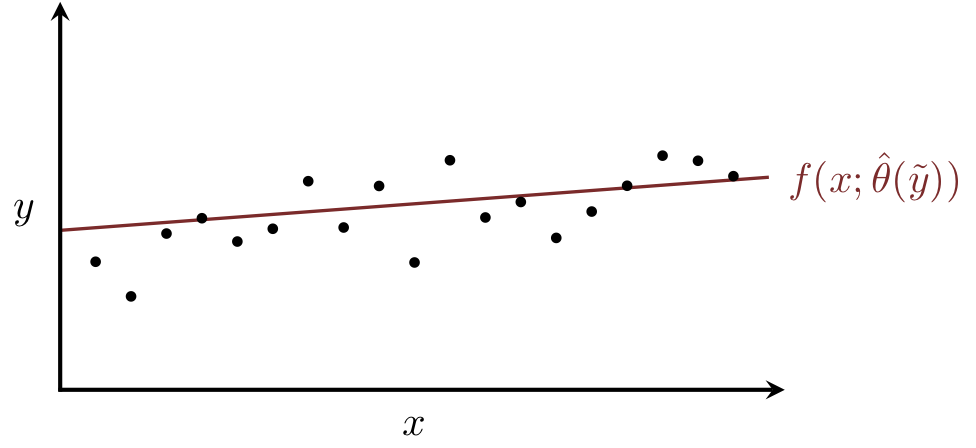
```
<br><br>
</center>

On the other hand this other residual plot exhibits strong systematic
deviations.  The data at central values of $x$ are all lower than the best fit
line while the data at the peripheral values of $x$ are all higher.

<center>
<br>
```{r, out.width = "50%", echo=FALSE}
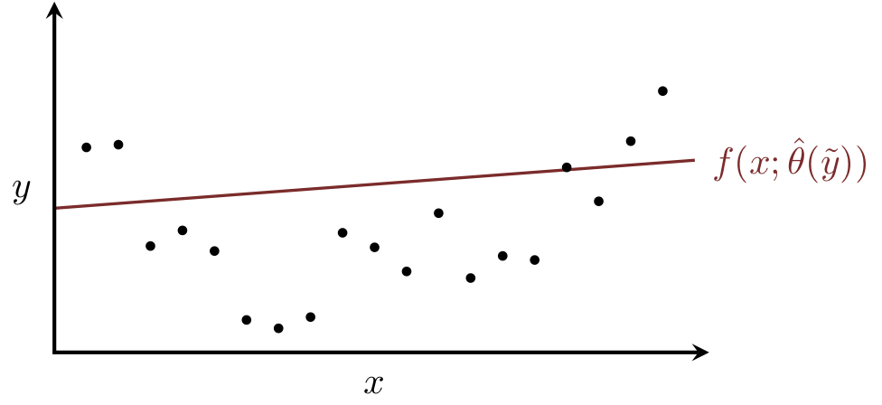
```
<br><br>
</center>

One substantial limitation of this classic residual check is that there isn't
a scale that separates significant and insignificant deviations.  In the context
of the curve fitting model that scale is set by the assumed normal fluctuations
of the observational model; deviations much smaller than $\sigma$ are
unresolvable from the noise while deviations much larger than $\sigma$ are
inconsistent with the assumed noise.  In other words these larger deviations
indicate either an improbably extreme deviation or some deficiency in either
the normal observational model or the shape of the best fit line.

We can incorporate these scales into residual checks by deriving an entire
predictive distribution from our best fit model,
$$
\pi_{\text{pred}}(y \mid \tilde{y})
=
\text{normal}(y \mid f(\hat{\theta}(\tilde{y}), x), \hat{\sigma}(\tilde{y})),
$$
and overlaying that against the observed data.  Because the predictive
distribution in this context isn't being used for making predictions of new
observations but rather _retrodictions_ of an existing observation, I will
refer to this comparison as a _retrodictive check_.

By using the entire predictive distribution we can now be fairly confident that
there are no deviations in the first example above, at least none beyond what
is already expected from the assumed observational model

<center>
<br>
```{r, out.width = "50%", echo=FALSE}
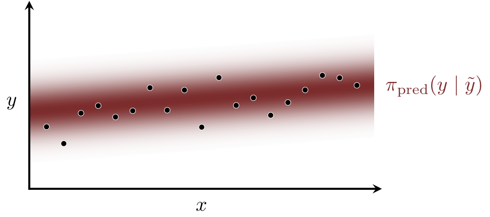
```
<br><br>
</center>

Likewise the predictive distribution establishes the extremity of the deviation
seen in the second example.  We can now use the shape of the deviation to
suggest improvements to the best fit predictive distribution, for example a
better choice of curve or perhaps a more flexible family of curves entirely.

<center>
<br>
```{r, out.width = "50%", echo=FALSE}
knitr::include_graphics("figures/residual/bad_retrodictive/bad_retrodictive.png")
```
<br><br>
</center>

Predictive distributions quantify how well we can resolve features in the data,
and hence the manifestations of any deficiencies of the assumed model.

Once we embrace this retrodictive aspect residual analysis naturally generalizes
to Bayesian inference.  The _posterior predictive distribution_
$$
\pi_{\mathcal{S}}(y \mid \tilde{y})
=
\int \mathrm{d} \theta \,
\pi_{\mathcal{S}}(\theta \mid \tilde{y}) \, \pi_{\mathcal{S}}(y \mid \theta),
$$
reduces the entire Bayesian model to a single predictive distribution by
averaging all of the data generating process in the observational model over
the inferred posterior distribution, quantifying all of the predictions
consistent with both our domain expertise and the observation, $\tilde{y}$.
By using the posterior predictive distribution to make retrodictions we
incorporate all of our inferential uncertainty, not just a best fit point
estimate, and define meaningful scales for disagreements with the observed data
regardless of the structure of the model.

The only obstruction to generalizing retrodictive residual analysis to Bayesian
inference is working out how to visually compare the posterior predictive
distribution to observed data, especially when the observational space is
high-dimensional.

While we can't easily visualize the entire predictive distribution at once, we
can construct a collection of powerful visualizations by projecting to subspaces
of the observational space that isolating particular consequences of our
retrodictions that highlight potential limitations.  Fortunately we've already
considered how to isolate the features of the observation space relevant to our
scientific questions when we were motivating summary statistics we for prior
predictive checks!  In other words we can reuse those summary statistics to
construct _posterior retrodictive checks_ that visually compare the pushforwards
of the posterior predictive distribution, $\pi_{t(Y) \mid Y}(t \mid \tilde{y})$,
to the observed summary statistic, $t(\tilde{y})$.

If the observed summary statistic, here shown in black, falls within the bulk
of the pushforward distribution, here shown in dark red, then there are no
indications that our model is doing an inadequate job of modeling the particular
behaviors captured by the summary statistic.

<center>
<br>
```{r, out.width = "50%", echo=FALSE}
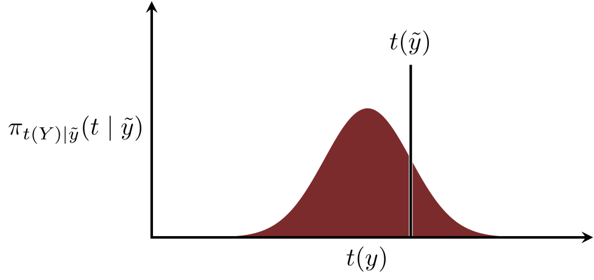
```
<br><br>
</center>

When the observed summary statistic falls in the tails of the pushforward
distribution, however, the situation is not so clear.

<center>
<br>
```{r, out.width = "50%", echo=FALSE}
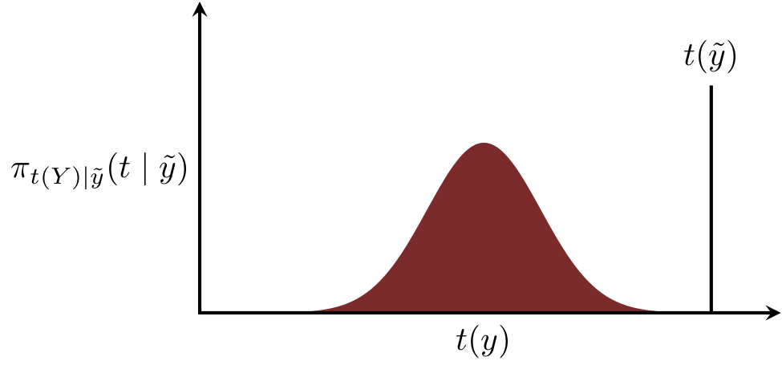
```
<br><br>
</center>

As in the curve fitting context we can't discriminate between our observation
being a rare but not impossible fluctuation and our model being insufficiently
sophisticated to capture the structure of the true data generating process that
manifests in the given summary statistic.  All we can do is fall back to our
domain expertise and hypothesize about the nature of any systematic deviations
and the possible model improvements--improvements spanning all of the
phenomenological, environmental, and experimental effects that could manifest in
the true data generating process--that could account for those deviations.  Most
of the time the tension between the posterior predictive distribution and the
observed data seen in a retrodictive check is due to not modeling a loose cable
in our detector.  Sometimes it's because of the breakdown of Newtonian mechanics
into special relativity.

In practice we typically can't construct explicit posterior predictive density
functions, let alone various pushforward density functions.  We can, however,
readily approximate pushforwards of the posterior predictive distribution
with samples.  Specifically we can generate posterior predictive samples
$$
\tilde{y}' \sim \pi_{\mathcal{S}}(y \mid \tilde{y})
$$
by sequentially sampling from the posterior and then the corresponding data
generating process,
$$
\begin{align*}
\tilde{\theta} \sim \pi_{\mathcal{S}}(\theta \mid \tilde{y})
\\
\tilde{y}' \sim \pi_{\mathcal{S}}(y \mid \tilde{\theta})
\end{align*}
$$
and then generate pushforward samples by applying the corresponding summary
statistic,
$$
t(\tilde{y}') \sim \pi_{t(Y) \mid Y}(t \mid \tilde{y}).
$$
This allows us to, for example, construct visual posterior retrodictive checks
pushforward with histograms.

<center>
<br>
```{r, out.width = "50%", echo=FALSE}
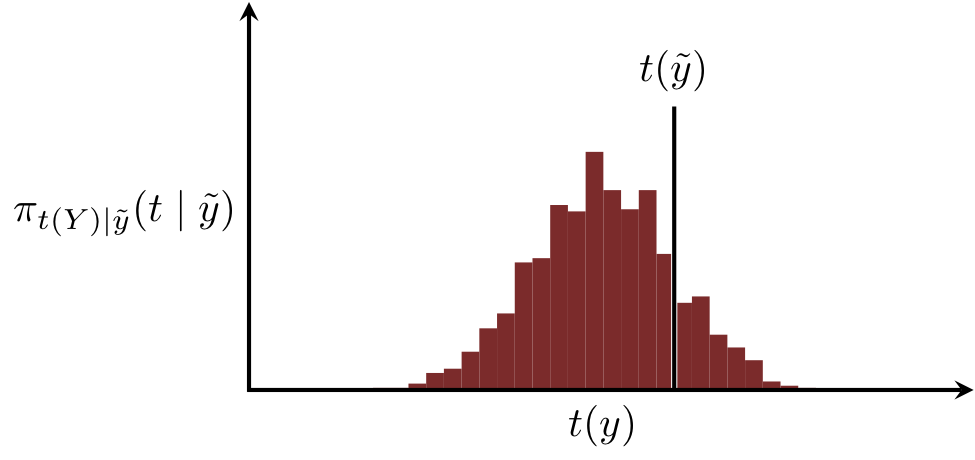
```
<br><br>
</center>

Often systematic deviations are easier to see with multidimensional summary
statistics.  For example we might want to analyze how retrodictive agreement
varies with some auxiliary variable, $x$, as in the curve fitting example.
In this case we might construct quantile ribbons for sequential bins of $x$ and
plot them all at the same time.

<center>
<br>
```{r, out.width = "50%", echo=FALSE}
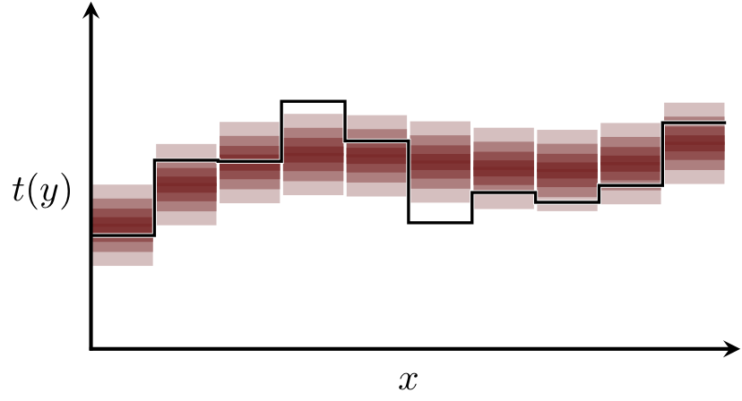
```
<br><br>
</center>

Residual analysis is ubiquitous in the applied sciences.  For a review of more
formal residual analysis techniques in the frequentist setting see
[@BoxEtAl:2005].  Posterior retrodictive analysis was considered by
[@Good:1983] but posterior retrodictive checks, also known as posterior predictive
checks, became practical only when simulation tools became widely available in
applied statistics [@Rubin:1984].

### Limitations of Posterior Retrodiction Checks

Posterior retrodictive checking is an extremely powerful technique for
investigating the adequacy of a model in the context of a given observation,
but that context introduces some important limitations.

By using the same observation to both inform and evaluate the posterior
predictive distribution, posterior retrodictive checks assess only the
self-consistency of the model at that particular observation.  In particular
they do not assess how well the assumed Bayesian model might perform with other
observations, and hence they provide only a very narrow view on the
compatibility of the model and the entire true data generating process.

If we are worried that the qualitative predictive performance in the context of
a given observation is not characteristic of other possible observations then
we can always generalize posterior retrodictive checks to proper _posterior
predictive checks_ against other observations.  In other words we can use one
observation $\tilde{y}_{1}$ to inform the posterior distribution, and hence the
posterior predictive distribution, and a second, independent observation
$\tilde{y}_{2}$ to evaluate.  A posterior predictive distribution consistent
with both observations exhibits no problems, while one consistent with the first
but not the second indicates that the predictive performance may be sensitive to
the structure of the first observation.

<center>
<br>
```{r, out.width = "100%", echo=FALSE}
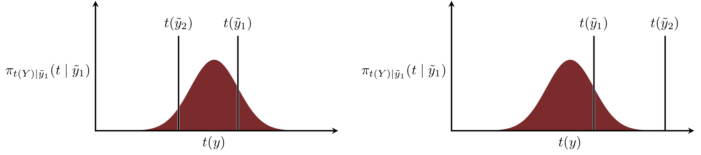
```
<br><br>
</center>

This might, for example, but due to an overly flexible model overfitting to
$\tilde{y}_{1}$.  At the same time it could also be a consequence of
$\tilde{y}_{1}$ manifesting misfit less clearly than $\tilde{y}_{2}$, or even
$\tilde{y}_{2}$ being an unlikely tail event.  Identifying which requires
followup investigations.

Even if the posterior predictive distribution is compatible with all possible
observations, however, that only implies that we have adequately modeled the
true data generating process _for a given experiment_.  That does not
necessarily imply that any of the components of our model will generalize to
other experiments.

A particular data generating process encompasses only the phenomena and
surrounding environment that interact with a given experimental probe, and
predictive evaluations identify deficiencies in only that context and only up to
the resolution of that probe.  A phenomenological model that is adequate for one
experiment, for example, may be inadequate for another experiment that is
sensitive to different latent phenomena or different behaviors in the
surrounding environment.  At the same time a model that is adequate for one
measurement may be insufficient for repeated measurements that that allow us to
better resolve the entire data generating process.  Or repeated measurements
might just provide more opportunity for the expected expected experimental
design to be violated, introducing more structure that has to be modeled.

All we can do in practice is investigate deficiencies of our model in the very
narrow context of a given experiment.  How that model, and inferences within
the scope of that model, generalize beyond that narrow context is a scientific
question and not a statistical one.  [@BoxEtAl:2005] analogized an experiment as
a narrow window through which we can view of the latent phenomenology and its
surrounding environment.  In reality this view is further limited by the
resolution of our model -- in other words we're looking through a dirty window
that admits only a fuzzy view.  That obscured view fundamentally limits not only
how well we can learn about the latent system but also well we can assess the
adequacy of a model of that system.

# Building a Mystery

If there are no indications that a given model answers any of these four
questions poorly then we can proceed to apply it in practice with some
confidence that it will provide reasonably robust inferences for the considered
inferential goals.  On the other hand if there are signs of trouble when
investigating these questions then we have to consider improving the model, or
occasionally even reducing the ambition of our inferential goals entirely.

The goal of a principled Bayesian workflow is to guide a practitioner through
a regimented model critique that first identifies and then resolves serious
deficiencies.  Importantly criticisms need to be _interpretable_ in order to
inform the practitioner how they can be resolved.  This feedback provides the
basis for _iterative_ model development that hopefully converges to a model
that's just good enough for a given application.

## Setting the Stage

Before we can iterate we need to _initialize_ by defining an appropriate context
and an initial model.

In order to define an appropriate context we begin with a conceptual analysis of
the model that we would fit without being limited by computational resources,
time, and mathematical tools.  This _aspirational model_, $\mathcal{S}_{A}$,
incorporates all of the systematic effects that might influence the measurement
process; it might include heterogeneity across individuals or variation across
space and time. We might consider background contributions or any other
corruption of the latent phenomena as it interacts with the environment and
experimental probe.  At the same time we might contemplate increasingly more
elaborate models of the latent phenomena itself.

Importantly the aspirational model is purely hypothetical and not something that
we would ever actually write down.  Reasoning about the the aspirational model
forces us to reflect on the subtleties of the latent system being studied and
the measurement process being used to probe that system.  It is an opportunity
to brainstorm so that later in model development we might be prepared with
plausible hypotheses for any deviant behavior we observe.

Within this abstract aspirational model we can then build an _explicit_ initial
model, $\mathcal{S}_{1} \subset \mathcal{S}_{A}$.
<center>
<br>
```{r, out.width = "50%", echo=FALSE}
knitr::include_graphics("figures/asp_simple/asp_simple.png")
```
<br><br>
</center>

The initial model should be just sophisticated enough to incorporate the
phenomena of scientific interest, but little else.  It will typically include
few, if any, systematic effects and only as much domain expertise as needed to
motivate a self-consistent initial prior model.  Initial models often take the
form of some deterministic phenomenological model with the environment and
experimental probe being reduced to normal variation, similar to the curve
fitting model we considered in [Section 1.4.3](#sec:retro_check),
$$
\mathcal{S}_{1}(y \mid \psi, \sigma) = \text{normal}(y \mid f(x; \psi), \sigma).
$$
Models of this form are ubiquitous in applied fields, and while they provide
useful initial models, rarely are they ultimately satisfactory.

The _difference_ between the explicit initial model and the conceptual
aspirational model, $\mathcal{S}_{A} \setminus \mathcal{S}_{1}$, encapsulates
all of the potentially relevant structure ignored by the initial model.

<center>
<br>
```{r, out.width = "50%", echo=FALSE}
knitr::include_graphics("figures/asp_simple_diff/asp_simple_diff.png")
```
<br><br>
</center>

In particular this abstract difference can be used to motivate summary
statistics that isolate these ignored structures, providing the foundations of
constructive prior predictive and posterior retrodictive checks.  A check
isolating possible heterogeneity across groups, for example, is naturally
equipped with a possible resolution: the introduction of heterogeneity into the
model.

## Computer, Enhance

If our initial model proves adequate then we have no need of going further.
In the more realistic situation where our initial model proves to be
inadequate, then we have to address the revealed inadequacies one way or
another.  This can mean improving our model, but it could also mean changing
the experiment or our inferential goals entirely.

### Issues with Question One: Domain Expertise Consistency {-}

If we learn that our model is not consistent with our domain expertise then we
have to modify the aspects of our model in conflict.  This often requires more
careful consideration of the prior model, but occasionally it can require
modifying the observational model as well.  For example an observational model
violating known constraints often enough might have to changed to explicitly
enforce those constraints.

The identification of exactly where to change our model is facilitated by
well-chosen summary functions in prior pushforward and prior predictive checks.
Investment in the design of these summary functions rarely goes unrewarded, if
not in the current analysis then in future analyses.

### Issues with Question Two: Computational Faithfulness {-}

Insufficient computational tools can be more challenging to address.

If we are proficient in the current algorithms being used then we can consider
more sophisticated configurations and implementations of that algorithm.
Alternatively we can reparameterize our model configuration space to implicitly
reconfigure the algorithm [@Betancourt:2019]. At some point we might have to
consider new algorithms entirely.

By investigating the posterior fits to many simulated observations we might be
able to identify the structure of the data, and hence the structure of the
simulated true model configuration, that frustrates the current algorithm.  If,
and only if, these model configurations are in conflict with our domain
expertise then we can then consider suppressing the pathological behavior with
a stronger prior model.  We have to take care here, however, as we don't want to
rationalize erroneous domain expertise just to ameliorate computational issues.
The computational issues might trigger more precise domain expertise, but they
shouldn't rationalize fantasies.

Sometimes computational issues cannot be resolved and instead demonstrate that
we are not equipped with the resources needed to tackle the presumed analysis.
In that case we might have to consider less ambitious inferential goals, and the
simpler, more-computationally-friendly models they require.

### Issues with Question Three: Inferential Adequacy {-}

When model calibration indicates that we are unlikely to meet our inferential
goals we need to consider ways to improve our inferences, or weaken the
inferential goals entirely.

Inferences underperform when they cannot exploit enough information about the
system being analyzed.  The only way we can improve our inferences, then, is to
incorporate more information into our model.

One critical source of information is the domain expertise encoded in the prior
model.  By reevaluating our domain expertise we might be able to build a more
precise prior model that captures more information.  This is especially critical
if we can use our calibrations to identify for what information our inferences
are most starved to guide our prior refinement.

The other source of information is the observations as encoded in the realized
likelihood functions.  In particular we can always improve our inferences by
considering more elaborate or more precise experimental probes, collecting more
data or possibly different kinds of data to better inform the relevant aspects
of the true data generating process.  New data that complements an existing
measurement can be particularly effective.  For example measurements with the
latent phenomena removed or suppressed can help to inform the behavior of the
experimental probe or the latent environment, breaking degeneracies that limit
how well we can resolve the latent phenomena in the full measurement.

Finally we have to acknowledge that a better model is not always sufficient to
obtain the desired inferences.  Sometimes our initial inferential goals are just
too ambitious, and our experiments are too insensitive to the phenomena of
interest.  In these cases we might have to use the calibration studies to
suggest more realistic goals for the current experiment design.

### Issues with Question Four: Model Adequacy {-}

Finally, if we learn that our model isn't capturing the relevant features of the
true data generating process then we need to _expand_ its boundaries in those
relevant directions.

Model expansion gives us a sequence of _nested models_, or nested subsets in the
space of all possible data generating processes,
$$
\mathcal{S}_{1} \subset \mathcal{S}_{2} \subset \mathcal{S}_{3} \subset \mathcal{P},
$$
that hopefully move closer and closer to the true data generating process, at
least in the relevant directions.

<center>
<br>
```{r, out.width = "90%", echo=FALSE}
knitr::include_graphics("figures/model_expansion/model_expansion.png")
```
<br><br>
</center>

This iterative model development can be compared to the basic scientific method
where we operationalize the vague “compare hypothesis predictions to experiment"
and "form new hypotheses" with posterior retrodictive checks identifying
inconsistencies and our aspirational model motivating new hypotheses.  That said
the proper implementation of the scientific method is a contentious subject
spanning philosophy, science, and statistics...so maybe it's best to avoid such
comparisons.

We don't want to add complexity arbitrarily, however, lest we end up with an
unwieldy model that isn't even adequate for our inferential goals.  Instead we
want to expand our model carefully, prioritizing the features that could
alleviate the most extreme observed deviations.

Fortunately the context of the aspirational model, and the summary statistics
it motivates, helps to guide this prioritization and make it less overwhelming.
In particular posterior retrodictive checks based on interpretable summary
statistics not only identify potential problems but also suggest the structure
needed to resolve those problems.  We can then focus on the summary statistics
that reveal the strongest deviations, laying a deliberately path through the
aspiration model that takes us from our initial model towards the true data
generating process.

If deviations aren't strong enough to motivate an expansion we can also take a
closer look by collecting more data or complementary data that induces more
precise inferences.  This allows us to not only better resolve the latent
phenomenology but also any deficiencies of the current model, and hence
motivate more principled improvements.

## Stay Where a Kiss Won't Mislead You

Using the data to both fit and evaluate our model is dangerous, but that danger
is unavoidable in practice because we can rarely trust that an experiment will
be implemented exactly according to its design.  In order to figure out how the
experimental design was actually implemented in reality, and reason able the
intricate systematic effects that arise as a consequence of that implementation,
we need to investigate the observed data.  In other words we can't trust any of
our model calibrations until we can explore what surprises lurk in the data.

An immediate corollary is that while ideas like preregistration can be helpful
for documenting the initial inferential goals of an experiment they are nowhere
near _sufficient_ for a successful analysis in practice.  Preserving a
preregistered model only perpetuates its optimistic assumptions about the
realization of an experiment.  In practice we almost always have to adapt our
model to the peculiarities of the observed data.

Fortunately an principled Bayesian workflow can ameliorate the potential danger
of using the data to both inform our posterior distribution and our posterior
retrodictive checks.  In particular by developing a model through iterative
_expansion_ where each model iteration is subsumed _within_ a new model model
our inferences can always retreat to the previous model configurations if the
added structure doesn't better capture the relevant parts of the true data
generating process.

Consider for example the previous model configuration space $\Theta_{i}$ and
the new model configuration space $\Theta_{i + 1}$.  If we restrict ourselves
to model expansion then the former will always nest within the latter,
$\Theta_{i} \subset \Theta_{i + 1}$, and all of the previous model behaviors
will be available in the new model as well.

<center>
<br>
```{r, out.width = "50%", echo=FALSE}
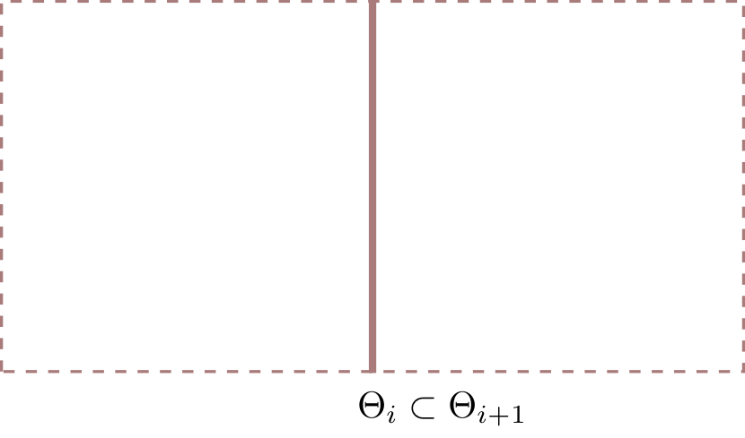
```
<br><br>
</center>

Expansion is made more robust when we use prior models that concentrate around
the previous, simpler model, similar to the behavior of _penalized complexity
priors_ [@SimpsonEtAl:2017]  The fact that we prioritized the previous model by
trying it first suggests that these prior models are naturally compatible with
our domain expertise.  Moreover these prior models are straightforward to
implement in practice once we parameterize the new model such that the previous
model is recovered when one or more new parameters are set to zero, effectively
"turning off" the new structure.

<center>
<br>
```{r, out.width = "50%", echo=FALSE}
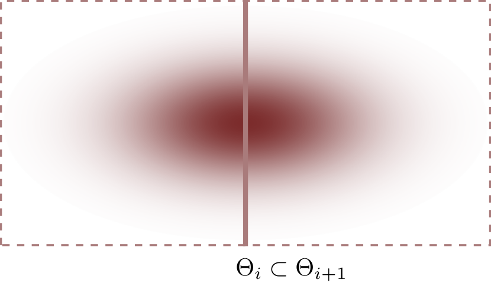
```
<br><br>
</center>

If the additional flexibility introduced into the new model doesn't improve the
fit to the observed data then the posterior distributions will collapse back to
simpler model configurations that overlap with the previous model.

<center>
<br>
```{r, out.width = "50%", echo=FALSE}
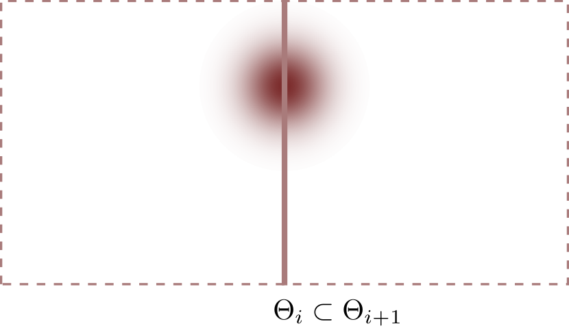
```
<br><br>
</center>

When the additional flexibility provides a better, fit, however, the
posteriors distributions will venture deeper into the new model.

<center>
<br>
```{r, out.width = "50%", echo=FALSE}
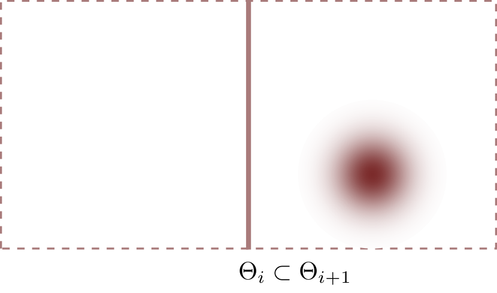
```
<br><br>
</center>

If the observational data is consistent with model configurations in the
previous and the new model then the posterior distribution will stretch across
_both_.

<center>
<br>
```{r, out.width = "50%", echo=FALSE}
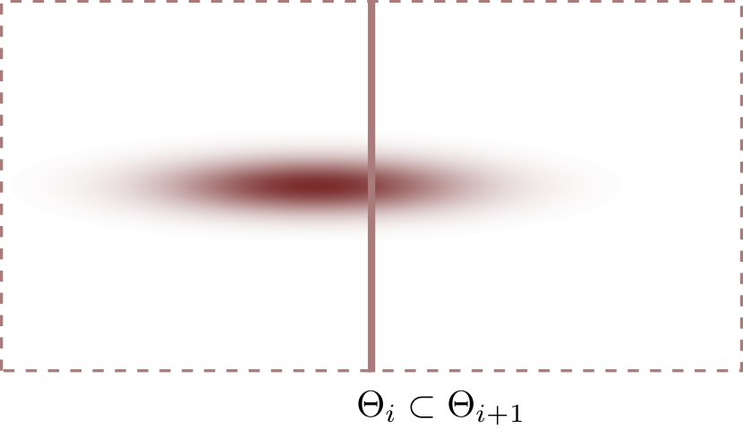
```
<br><br>
</center>

Because the posterior distribution quantifies _all_ of the model configurations
consistent with an observation, the previous model configurations will continue
to influence our inferences _until they are no longer compatible with the data_.
Consequently the worst outcome of adding unneeded structure is only larger
uncertainties.  This makes Bayesian inference particularly robust against
overfitting relative to point estimators that quantify only a single model
configuration and are easily seduced by the complexity of the new model.

In other words the combination of model expansion, parsimonious prior models,
and full Bayesian inference makes it harder to reach towards unneeded complexity
and limits how iterative model development based on posterior retrodictive
checks can overfit.  That said, just because overfitting is more difficult
doesn't mean that it is impossible. Extreme realizations of a measurement can
mimic systematic behavior so well that even a posterior distribution can be
fooled away from a simpler truth.

Careful calibrations with simulated data can identify when a model is vulnerable
to overfitting, as can posterior predictive checks with held out observations if
they are available.  The best protection, however, is thorough documentation of
the model development process that allows a community to leverage their
collective domain and statistical expertise to identify any signs of
overfitting.

# Work it, Make it, Do it, Makes Us Harder, Better, Faster, Stronger

Iterative evaluation and refinement guides the development of Bayesian models
appropriate for the bespoke details of a particular application.  Implementing
that development, however, can be overwhelming given just how many ways a model
can be deficient.

In this section I introduce a _principled Bayesian workflow_ that integrates
each of the evaluation techniques we have introduced into a coherent sequence of
investigations.  This workflow can be thought of as a sort of conceptual
checklist to help organize all of the ways a model might disappoint you, and
hence manage all of the red flags for which you have to be vigilant.

<center>
<br>
```{r, out.width = "100%", echo=FALSE}
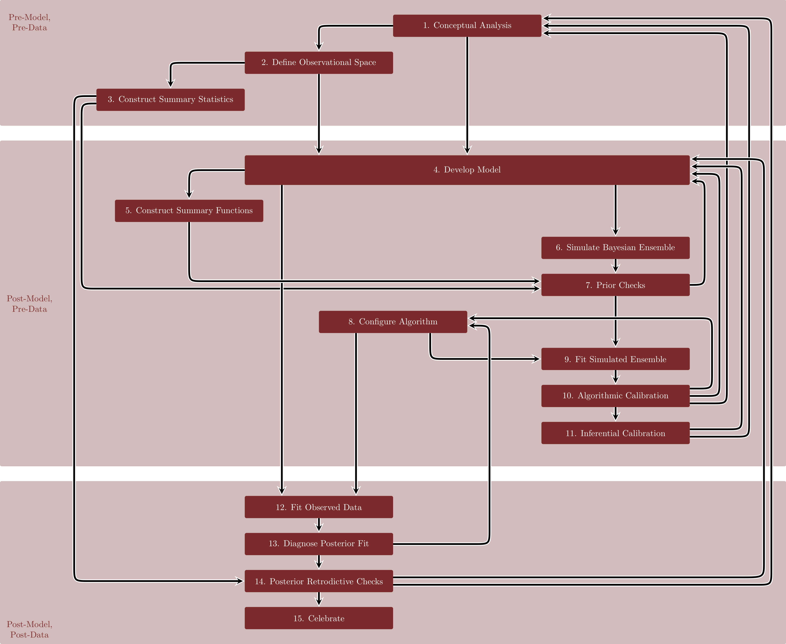
```
<br><br>
</center>

Each iteration of the workflow proceeds in three phases: the first without
considering an explicit model or observed data, the second using a model but
no observation, and the third utilizing both.  After reviewing each step in
these phases we'll review some demonstrative examples of how an iteration might
be realized in various circumstances.

In order to implement the steps in this workflow we need access to both
_domain expertise_ and _statistical expertise_.  Here domain expertise refers to
the experience of those responsible for collecting, curating, or otherwise
manipulating the data, as well as stakeholders who will make decisions using the
final inferences or any intermediaries who will help stakeholders in that
decision-making process.  Statistical expertise refers to proficiency in
probabilistic modeling and computation.  A robust analysis requires input from
both sets of expertise, whether contributed from a single person or multiple
individuals in collaboration.

## Pre-Model, Pre-Data {-}

The first phase of this workflow sets the foundations on which we will build
our model.

### Step One: Conceptual Analysis {- #sec:conceptual}

We begin by reasoning about the aspirational model.

In the first iteration we consider exactly what our inferential goals are before
contemplating the measurement process, from the latent phenomena of interest
through its interactions with the environment and experimental probe and how
those interactions manifest as observations.

When we return to this step in future iterations our objective is to expand
the aspirational model to encompass any behavior that we had not previously
anticipated.

Importantly the outcomes of this step should be only informal, conceptual
narratives of the measurement process.  All we're trying to do is sit down with
the domain experts, whether ourselves or our colleagues, and ask
_"How is are data being generated?"_.

**Requirements:** Domain Expertise

### Step Two: Define Observational Space {- #sec:observation-space}

Given a conceptual understanding of the measurement process we can take our
first steps towards a formal mathematical model by defining the observational
space, $Y$ in which observations take values.  This includes, for example, the
number of components and their type, as well as any available metadata informing
the context of each component observation.

In later iterations we return to this step only when we expand the observation
to include, for example, repeated or complementary measurements.

**Requirements:** Domain Expertise and Statistical Expertise

### Step Three: Construct Summary Statistics {- #sec:summary-stats}

With the observational space formally defined we can construct summary statistics
that isolate the consequences of the measurement process that we think will
influence our inferential goals, as well as those that we expect to be difficult
to model well.  These summary statistics then provide the basis for prior
predictive checks and posterior retrodictive checks that help to answer
[Question One:Domain Expertise Consistency](#sec:question_one) and
[Question Four: Model Adequacy](#sec:question_four), respectively.

In preparation for prior predictive checks we also want to complement these
summary statistics with conceptual thresholds that capture our domain expertise.

**Requirements:** Domain Expertise and Statistical Expertise

## Post-Model, Pre-Data {-}

With the conceptual foundation laid the second phase considers an explicit
Bayesian model and its internal consequences.

### Step Four: Model Development {- #sec:model-development}

The construction a complete Bayesian model $\pi_{\mathcal{S}}(y, \theta)$ is
often facilitated by modeling in stages, first building an observation model,
$\pi_{\mathcal{S}}(y \mid \theta)$, and then building a complementary prior
model, $\pi_{\mathcal{S}}(\theta)$.

From this perspective the observational model translates the conceptual
narrative considered in [Step One](#sec:conceptual) into formal mathematical
narratives of how observations are generated.

In the initial iteration this model should be just sophisticated enough to be
able to provide an answer to the inferential questions of interest, although not
necessarily a good one.  If we return to this step in later iterations then we
will need to provide a more detailed translation of those conceptual narratives.

The prior model then complements the observational model with just enough domain
expertise to ensure that the complete Bayesian model is well-behaved and
compatible with our domain expertise [@GelmanEtAl:2017a].  If our initial prior
model isn't adequate then when we return to this step in later iterations we
will need to incorporate additional information with a more careful prior model
that refines our domain expertise.

That said, as our models grow in sophistication the story of the data generating
process becomes harder and harder to encapsulate entirely within the
observational model.  Consider, for example, a model that generates each
component of the observational space, $y_{n}$, from a corresponding _local_
parameter, $\theta_{n}$,
$$
\pi_{\mathcal{S}}(y_{n} | \theta_{n}),
$$
while the local parameters are moderated by a _global_ parameter $\phi$,
parameters,
$$
\pi_{\mathcal{S}}(\theta_{n} \mid \phi).
$$

In this case our observational model is formally given by only
$$
\pi_{\mathcal{S}}(y \mid \theta, \phi) =
\prod_{n = 1}^{N} \pi_{\mathcal{S}}(y_{n} | \theta_{n})
$$
while the prior model is given by
$$
\pi_{\mathcal{S}}(\theta, \phi) =
\left[ \prod_{n = 1}^{N} \pi_{\mathcal{S}}(\theta_{n} \mid \phi) \right]
\cdot \pi_{\mathcal{S}}(\phi).
$$
The data generating narratives, however, might more naturally encapsulate both
how the data are generated from the local parameter configurations and how the
local parameter configurations are generated from the global parameter
configuration,
$$
\pi_{\mathcal{S}}(y, \theta \mid \phi)
=
\prod_{n = 1}^{N}
\pi_{\mathcal{S}}(y_{n} | \theta_{n}) \, \pi_{\mathcal{S}}(\theta_{n} \mid \phi).
$$

We can avoid this ambiguity entirely by developing the complete Bayesian model
as a whole, with a conditional decomposition that spans the all of the model
configuration and observational spaces,
$$
\pi_{\mathcal{S}}(y, \theta, \phi) =
\left[ \prod_{n = 1}^{N}
\pi_{\mathcal{S}}(y_{n} | \theta_{n}) \, \pi_{\mathcal{S}}(\theta_{n} \mid \phi)
\right] \cdot \pi_{\mathcal{S}}(\phi).
$$
Such _generative_ modeling allows us to tell our data generating story
sequentially without having to worry about which chapters fall into the prior
model and which fall into the observational model.

**Requirements:** Domain Expertise and Statistical Expertise

### Step Five: Construct Summary Functions {- #sec:summary-functions}

Given an explicit model, and hence model configuration space, we can construct
principled summary functions over the model configuration space to set the stage
for prior pushforward checks.

We might also use the structure of the model to introduce new summary statistics
for prior predictive and posterior retrodictive checks.  For example we might
add summary statistics that are sensitive to the heterogeneity of certain
components in our model.

In future iterations we can also take this opportunity to exploit any
information about the deficiencies encountered in previous iterations to
motivate new summary functions.

### Step Six: Simulate Bayesian Ensemble {- #sec:simulate}

We are now ready to evaluate the consequences of our model assumptions by
investigating the behavior of an ensemble of reasonable model configurations and
observations sampled from the Bayesian joint distribution,
$\pi_{\mathcal{S}}(y, \theta)$.

Given a conditional decomposition of the complete Bayesian model we can readily
generate this ensemble with ancestral sampling.  In particular if we've
specified a prior model and an observational model then we can first simulate
model configurations from the prior distribution,
$$
\tilde{\theta} \sim \pi_{\mathcal{S}}(\theta),
$$
and then observations from the corresponding data generating process,
$$
\tilde{y} \sim \pi_{\mathcal{S}}(y \mid \tilde{\theta} ).
$$
Together each simualated pair $(\tilde{y}, \tilde{\theta})$ adds an independent
sample to our ensemble.

Without a useful conditional decomposition we have to consider other means of
generating samples from the complete Bayesian model, such as Markov chain Monte
Carlo.

**Requirements:** Statistical Expertise

### Step Seven: Prior Checks {- #sec:prior-predictive}

We can answer [Question One: Domain Expertise Consistency](#sec:question_one)
with the information provided by prior pushforward checks of the summary
functions constructed in [Step Five](#sec:summary-functions) or with prior
predictive checks of the summary statistics constructed in
[Step Three](#sec:summary-stats) and [Step Five](#sec:summary-functions).

If the prior predictive checks indicate conflict between the model and our
domain expertise then we have to return to [Step Four](#sec:model-development)
and refine our model.

**Requirements:** Domain Expertise

### Step Eight: Configure Algorithm {- #sec:config-algo}

Once satisfied with the consistency of the domain expertise in our model we
move onto the possible posterior distributions that result from our complete
Bayesian model, which itself requires setting up a probabilistic computational
algorithm.

Here we specify our algorithm and any configurable settings, for example we
might decide to use `Stan` along with its default settings.  In future
iterations we might have to tweak those settings in response to computational
failures.

**Requirements:** Statistical Expertise

### Step Nine: Fit Simulated Ensemble {- #sec:fit-simu}

With an algorithm locked and loaded we can proceed to _fit_, or estimate
expectation values with respect to, the posterior distributions induced from
each of our simulated observations,
$$
\pi_{\mathcal{S}}(\theta \mid \tilde{y}).
$$

**Requirements:** Statistical Expertise

### Step Ten: Algorithmic Calibration {- #sec:diagnosics}

By fitting the entire ensemble of posterior distributions we can probe the
utility of our chosen algorithm and help answer
[Question Two: Computational Faithfulness](#sec:question_two), at least within
the context of the model assumptions.

For example if the designated computational method features self-diagnostics,
such as $\hat{R}$ for Markov chain Monte Carlo in general and divergences for
Hamiltonian Monte Carlo in particular, then we can look for failed diagnostics
across the distribution of posterior fits.  Even if our chosen method doesn't
have its own diagnostics we can evaluate its performance by performing
simulation-based calibration.

Failures indicate that we may need return to [Step Eight](#sec:config-algo) and
improve the tuning or implementation the chosen computational method, or
select another method altogether.

We can also correlate failed fits with the corresponding simulated observations
and model configurations.  This can potentially identify poorly-identified
likelihood functions that result in posterior distributions pathological to the
computational method being used.  The propensity for such poor behavior can
then be ameliorated by returning to [Step Four](#sec:model-development) and
incorporating additional domain expertise or even returning to
[Step One](#sec:conceptual) and considering new experimental designs that might
result in more manageable likelihood functions.

**Requirements:** Statistical Expertise

### Step Eleven: Inferential Calibration

Once we trust the faithfulness of our reconstructed posterior distributions we
can consider the breadth of inferences they provide to help answer
[Question Three: Inferential Adequacy](#sec:question_three).

In general we can always consider the distribution of posterior $z$-scores
against posterior contractions to identify common pathologies in our inferences.
If there are indications of undesired behavior, such as overfitting or
non-identifiability, then our model may not be sufficient.

When an explicit decision-making process has been established we can also
calibrate the performance of this process by constructing the distribution of
utilities over our simulated Bayesian ensemble.  For example if a discovery
claim is to be made then we might compute the corresponding false discovery
rates and true discovery rates within the context of our model.  If these
utilities are not satisfactory then we have to consider a more informed model
or maybe even a different decision-making process.

In either case we might have to return to [Step One](#sec:conceptual) to
consider an improved experimental design or tempered scientific goals.
Sometimes we may only need to return to [Step Four](#sec:model-development) to
incorporate additional domain expertise to improve our inferences.

**Requirements:** Domain Expertise and Statistical Expertise

## Post-Model, Post-Data {-}

If [Question One: Domain Expertise Consistency](#sec:question_one),
[Question Two: Computational Faithfulness](#sec:question_two),
and [Question Three: Inferential Adequacy](#sec:question_three) have been
satisfactorily answered within the scope of the model then we can finally
proceed to fitting the observed data and confront
[Question Four: Model Adequacy](#sec:question_four).  Once we consider the
observed data we introduce a vulnerability to overfitting and so we must be
extremely vigilant in how we further develop our model in subsequent iterations
of the workflow.

### Step Twelve: Fit the Observation {-}

First things first we open up the box containing our observed data and fit the
corresponding posterior distribution using the algorithmic configuration from
[Step Eight](#sec:config-algo).

**Requirements:** Statistical Expertise

### Step Thirteen: Diagnose Posterior Fit {-}

We have to be careful, however, as the algorithmic calibration won't be relevant
to the observed data if our model isn't close enough to the true data generating
process.  Consequently we need to be careful to check any diagnostics of our
computational method on the fit of the observed data as well.

If any diagnostics indicate poor performance then not only is our computational
method suspect but also our model might not be rich enough to capture the
relevant details of the observed data.  At the very least we should return to
[Step Eight](#sec:config-algo) and enhance our computational method.

**Requirements:** Statistical Expertise

### Step Fourteen: Posterior Retrodictive Checks {-}

To really get a handle on [Question Four: Model Adequacy](#sec:question_four)
we have to perform careful posterior retrodictive checks for each of our summary
statistics.

If there are indications of problems that we already suspected in our
aspirational model then we can return to [Step Four](#sec:model-development) and
augment the model to account for the observed deviant behavior.  When the
behavior is more surprising, however, then we really should go all the way back
to [Step One](#sec:conceptual) and reconsider our conceptual analysis of the
experiment to motivate principled model improvements.  If the indications are
weak then we can also return to [Step One](#sec:conceptual) to consider
expanding our observation to improve our inferences and better resolve the
potential deviation.

In order to avoid biasing our model development by overfitting to the observed
data we have to be careful with what information we take with us when we start
a new iteration of the workflow.  Specifically we want the _qualitative failure_
of a posterior retrodictive check to motivate model expansion, not the
_quantiative features of the observed data itself_.  In other words a posterior
retrodictive check should serve only to trigger our domain expertise, and our
domain expertise should then be solely responsible for the continued model
development.  The more disciplined we can be here the more less vulnerable our
model development will be to overfitting.

**Requirements:** Domain Expertise and Statistical Expertise

### Step Fifteen: Celebrate {-}

Finally if we can make it through the workflow with a model that indicates no
deficiencies relevant to our inferential goals then the iterations terminate and
we can celebrate a hard-earned success.

**Requirements:** A Tasty Beverage

## Example Workflow Executions

Each iteration of this principled Bayesian workflow will play out a little bit
differently depending on what deficiencies we encounter.  Perhaps most
importantly the realized workflow will depend on which steps we actually
consider.  While implementing the entire workflow is the most robust we often
have to make compromises due to limited time or computational resources.  Or
maybe we just want to live dangerously.

### Total Body Workout

The most robust workflow is a complete workflow.  Each iteration resolves
differently depending on which step encounters problems.

#### Dealing With Incompatible Model Assumptions {-}

For example consider a model where the consequences of the inherent assumptions
are inconsistent with our domain expertise.  In that case the prior checks
would fail and lead us back to the model development step for the next round
of iteration.

<center>
<br>
```{r, out.width = "100%", echo=FALSE}
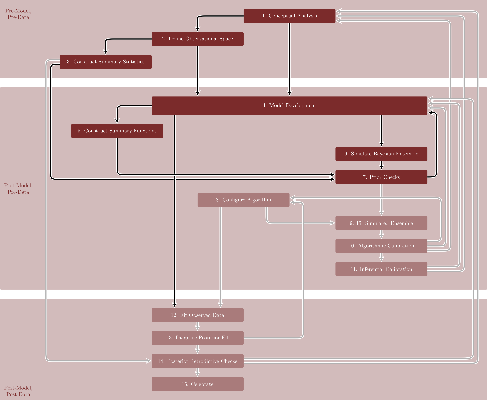
```
<br><br>
</center>

#### Dealing With Inadequate Inferences {-}

Similarly if our model isn't expected to be precise enough or answer the
questions we need then the inferential calibration would fail.  Here we
respond by going all the way back to the conceptual analysis to consider
experiments with larger observations and, hopefully, enough information to
answer our questions.

<center>
<br>
```{r, out.width = "100%", echo=FALSE}
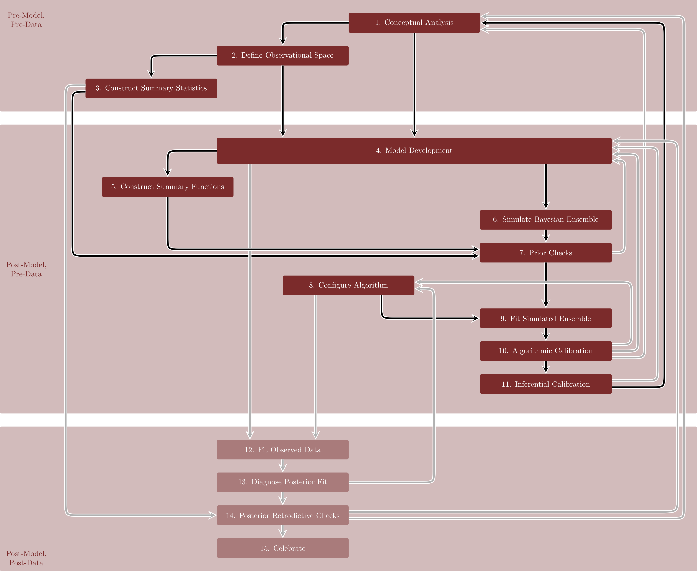
```
<br><br>
</center>

#### Dealing With An Inadequate Model {-}

A model that doesn't approximately capture the true data generating process
well enough should result in a failed posterior retrodictive check.

If the failure was a behavior that we had previously considered then we can
restart at the model development step.

<center>
<br>
```{r, out.width = "100%", echo=FALSE}
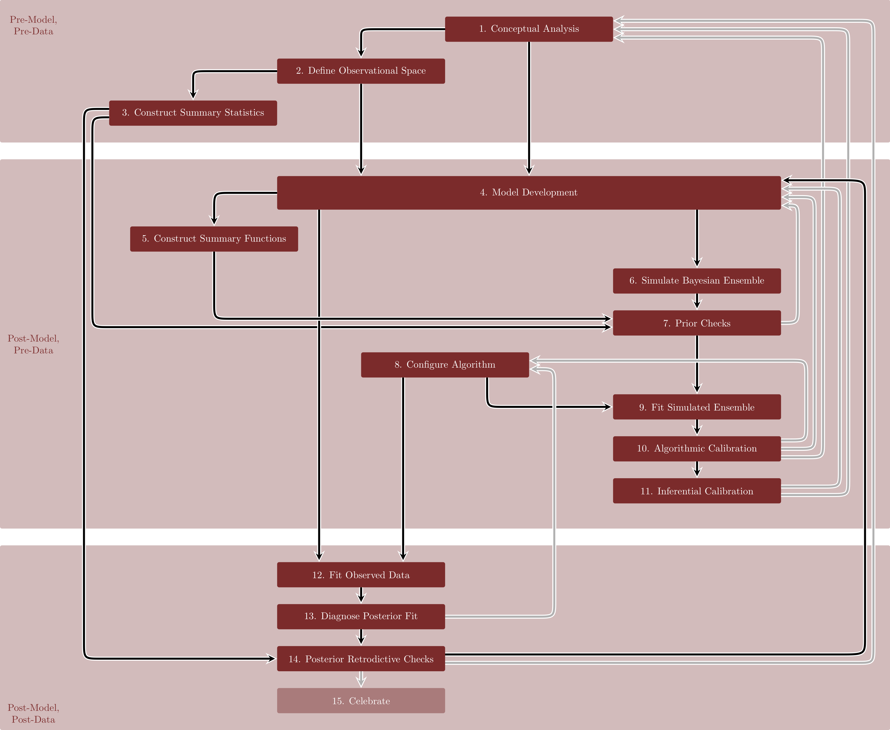
```
<br><br>
</center>

When the behavior is more surprising, however, we have to go all the way back up
to step one to consider the conceptual context of the observed behavior.

<center>
<br>
```{r, out.width = "100%", echo=FALSE}

```
<br><br>
</center>

#### Exhaustive Success {-}

The most desirable outcome of the workflow is an iteration that reaches step
fifteen after implementing each intermediate step.  This doesn't mean that our
model is an exact representation of reality, just one that is good enough for
the context of our particular application.

<center>
<br>
```{r, out.width = "100%", echo=FALSE}
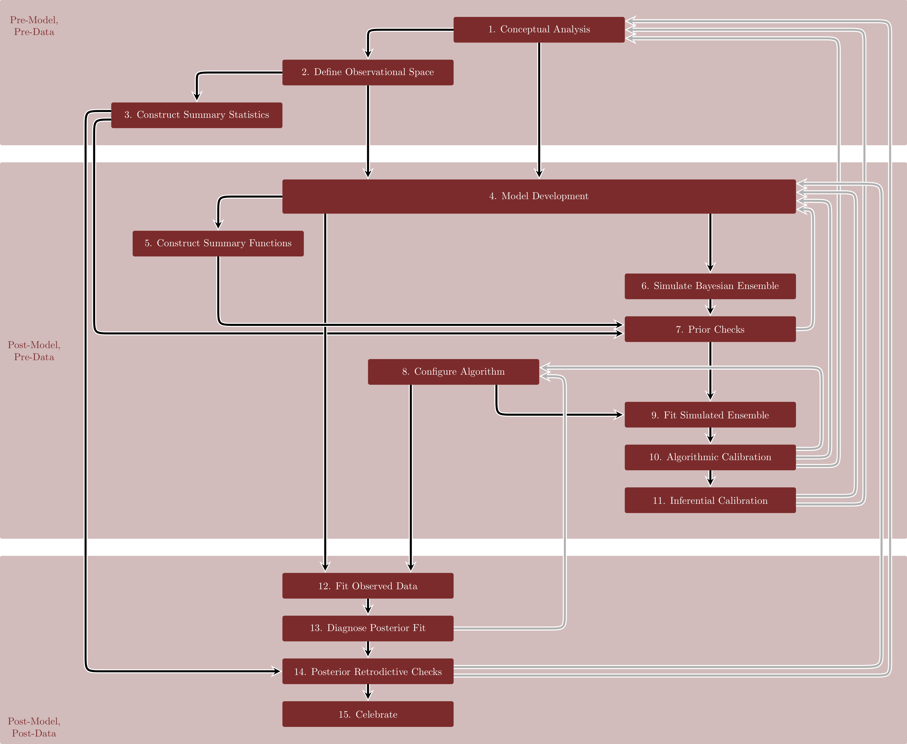
```
<br><br>
</center>

### Compromised Integrity

In practice we might have to pick and choose amongst the steps in the complete
workflow.  Some compromises, however, are more useful than others.


### Only Fits

Most Bayesian analyses one will encounter in practice just want to build and fit
a model without asking too many questions.  The utility of these analyses
depends on how lucky one gets with that initial model and the robustness of
the computational algorithm.

<center>
<br>
```{r, out.width = "100%", echo=FALSE}
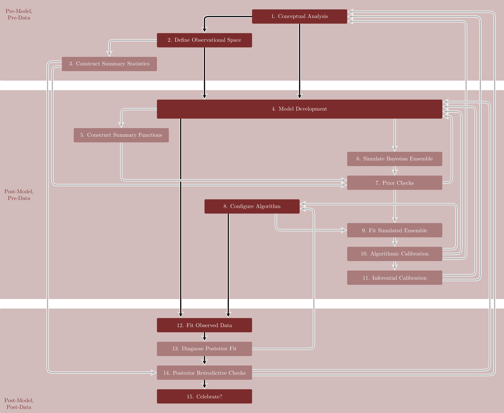
```
<br><br>
</center>

### Fits With Algorithm Tuning

More sophisticated users might also follow up on diagnostic problems encountered
during the fit of the posterior distribution from the observed data, for example
by modifying the `adapt_delta` configuration in the dynamic Hamiltonian Monte
Carlo implementation in `Stan`, until there are no indications of computational
problems.

<center>
<br>
```{r, out.width = "100%", echo=FALSE}
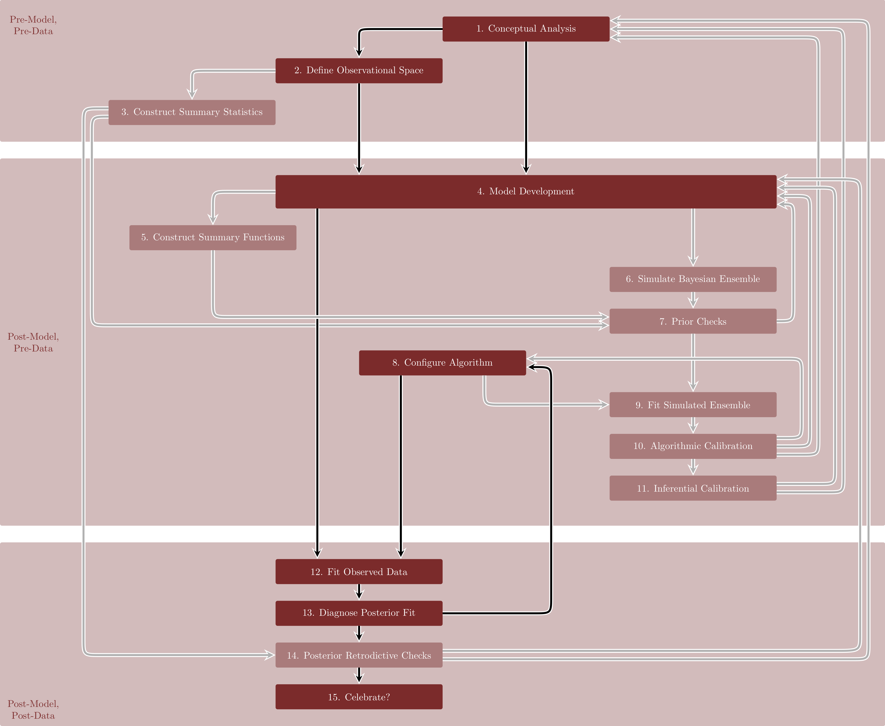
```
<br><br>
</center>

### No Calibration

By far the most expensive step of the complete workflow is
[Step Nine](#sec:fit-simu) which requires fitting not just one posterior but
an entire ensemble of them.  Consequently this step, and the calibration steps
that proceed it, can be impractical in practice.

Implementing every other step, however, provides much more robustness than a
single naive fit alone.  This reduced workflow is particularly robust if we are
using modeling techniques that have already been studied for their algorithmic
and inferential pathologies so that we already know how to implement them
effectively.

<center>
<br>
```{r, out.width = "100%", echo=FALSE}
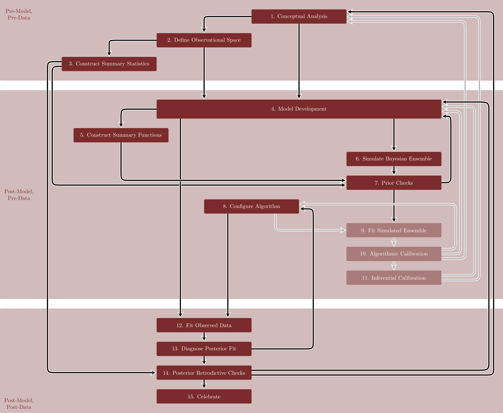
```
<br><br>
</center>

### Simulation Study

Complementing a calibration free workflow is a pure simulation study that
studies the potential problems of a model, and the experimental design it
encodes, solely within the assumptions of that model.  This is a powerful way
both to evaluate experiments before the experiment is build -- let alone any
data are collected -- and to study the behavior of particular modeling
techniques in isolation.

<center>
<br>
```{r, out.width = "100%", echo=FALSE}
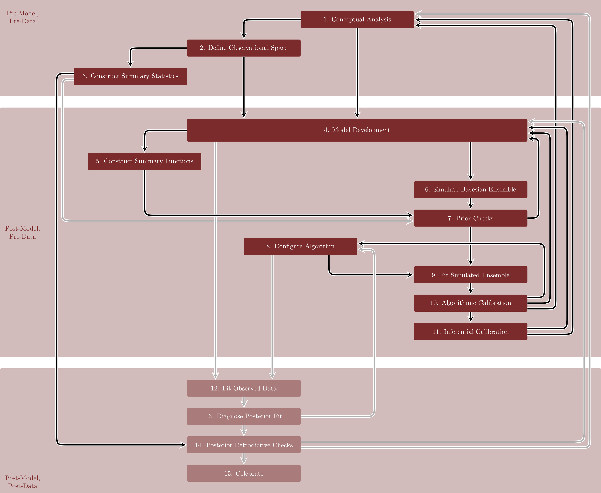
```
<br><br>
</center>

Simulation studies are incredibly useful to help build our understanding and
prepare us for more principled modeling.   Consequently we should be sure to
celebrate these analyses, too.

<center>
<br>
```{r, out.width = "100%", echo=FALSE}
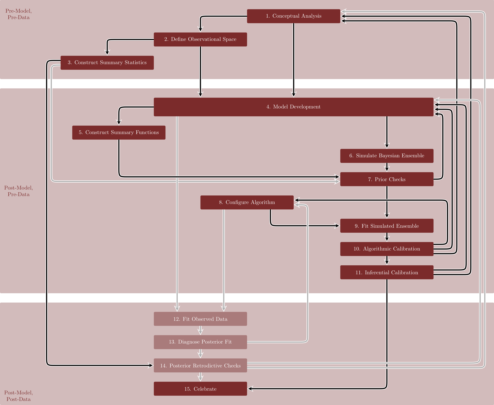
```
<br><br>
</center>

# Close Enough For An Effective Demonstration {#sec:demonstration}

In order to demonstrate this workflow properly let's a consider a relatively
simple example of an analysis that might arise in a science lab.  We have been
tasked with analyzing data collected by a precocious young student who was
instructed to aim a collection of detectors onto a radioactive specimen that
emits a constant flow of particles.  They dutifully collected data and collated
it into a file which has just arrived in our inbox.

Before even reading the email we dutifully set up our local `R` environment.


```{r, include = FALSE}
set.seed(4838282)
```

```{r, message=FALSE, warning=FALSE}
library(rstan)
rstan_options(auto_write = TRUE)

library(foreach)
library(doParallel)

util <- new.env()
source('stan_utility.R', local=util)

c_light <- c("#DCBCBC")
c_light_highlight <- c("#C79999")
c_mid <- c("#B97C7C")
c_mid_highlight <- c("#A25050")
c_dark <- c("#8F2727")
c_dark_highlight <- c("#7C0000")

c_dark_trans <- c("#8F272780")
c_green_trans <- c("#00FF0080")
```

## First Iteration: A Journey of a Thousand Models Begins with a Single Step

In our initial iteration through the workflow we model the experiment that we've
been told occurred.  Nothing ominous here, right?

### Step One: Conceptual Analysis {-}

Our conceptual model follows the instructions given to the student.  1000
individual detectors were directed towards the source and set to record the
number of incident particles over a given interval of time.  The intensity of
the source is presumed to be constant over that interval and each detector
should be identical in operation.

### Step Two: Define Observational Space {-}

Mathematically our observation takes the form of integer counts, $y$, for each
of the $N = 1000$ detectors.  In the Stan modeling language this is specified as

```{r}
writeLines(readLines("stan_programs/fit_data.stan", n=4))
```

### Step Three: Construct Summary Statistics {-}

There are $N = 1000$ components in each observation, one for each detector.  We
could analyze each component independently but, because we have assumed that the
detectors are all identical, we can analyze their ensemble response with a
_histogram_ of their counts.  In other words we consider the histogram of
detector counts _as a collection of summary statistics_!

It's always difficult to create examples that incorporates realistic domain
expertise as the domain expertise that might resonate with a given practitioner
will vary from field to field.  For this example we'll fake it by imposing the
available expertise: we assume that our conceptual domain expertise would inform
us that 25 counts in a detector would be consistent with a lethal dose of
radiation.  Given that we are happily sending students into the same room as
this source this would certainly be an extreme, although not impossible,
observation for this kind of detector.

### Step Four: Model Development {-}

The constant intensity of the source and detector response suggest a Poisson
observation model for each of the detectors with a single source strength,
$\lambda$.

A Poisson probability density function has mean $\lambda$ and standard deviation
$\lambda$, so we can approximate the upper tail as $\lambda + 3 \sqrt{\lambda}$.
If we want this to be consistent with the 25 count threshold then we'll need to
suppress $\lambda$ below values satisfying
$$
\lambda + 3 \sqrt{\lambda} \approx 25,
$$
or approximately $\lambda \le 15$.

A half-normal prior density function will give the right shape, and to figure
out the scale that gives the right tail behavior we can use `Stan`'s algebraic
solver.

```{r}
writeLines(readLines("stan_programs/prior_tune1.stan"))
```

```{r}
stan(file='stan_programs/prior_tune1.stan', iter=1, warmup=0, chains=1,
     seed=4838282, algorithm="Fixed_param")
```

Because our domain expertise and tail definitions are not precise we don't have
to be precious with the exact value returned by the algebraic solver.  Here
we'll take the scale $6$.

```{r}
lambda <- seq(0, 20, 0.001)

plot(lambda, dnorm(lambda, 0, 6), type="l", col=c_dark_highlight, lwd=2,
     xlab="lambda", ylab="Prior Density", yaxt='n')

lambda99 <- seq(0, 15, 0.001)
dens <- dnorm(lambda99, 0, 6)
lambda99 <- c(lambda99, 15, 0)
dens <- c(dens, 0, 0)

polygon(lambda99, dens, col=c_dark, border=NA)
```

Our complete Bayesian model is then given by the conditional decomposition
$$
\pi( y_{1}, \ldots, y_{N}, \lambda )
=
\left[ \prod_{n = 1}^{N} \text{Poisson} (y_{n} \mid \lambda) \right]
\cdot \text{normal} (\lambda \mid 0, 6).
$$

<center>
<br>
```{r, out.width = "50%", echo=FALSE}
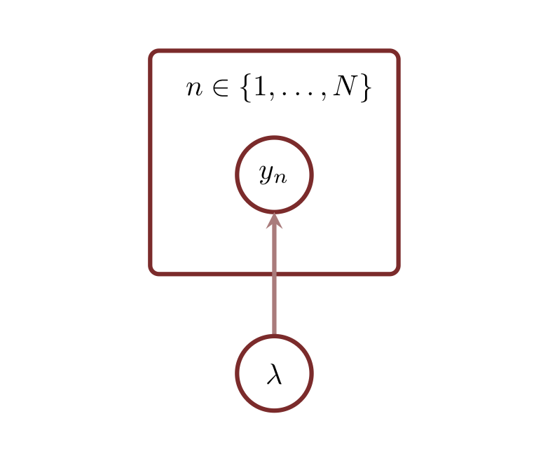
```
<br><br>
</center>

Ancestral sampling from the joint probability distribution is implemented in the
following Stan program.

```{r}
writeLines(readLines("stan_programs/simu_bayesian_ensemble.stan"))
```

The joint probability density function is implemented in the following
Stan program.

```{r}
writeLines(readLines("stan_programs/fit_data.stan"))
```

### Step Five: Construct Summary Functions {-}

With only a single parameter whose prior model we've already carefully evaluated
there isn't any opportunity for additional summary functions here.

### Step Six: Simulate Bayesian Ensemble {-}

Here we will consider $R = 1000$ draws from the Bayesian ensemble, each of
which simulates a ground truth and observed values for the $N = 1000$ detectors.
Note the use of the `Fixed_param` algorithm in `Stan` which only evaluates the
`generated quantities` block at each iteration and allows us to implement
ancestral sampling to generate each sample in the ensemble.

```{r}
R <- 1000
N <- 1000

simu_data <- list("N" = N)

fit <- stan(file='stan_programs/simu_bayesian_ensemble.stan', data=simu_data,
            iter=R, warmup=0, chains=1, refresh=R,
            seed=4838282, algorithm="Fixed_param")

simu_lambdas <- extract(fit)$lambda
simu_ys <- extract(fit)$y
```

More draws from the Bayesian ensemble will yield a more precise understanding
of the model and I recommend that you run as many replications as your
computational resources allow.  In circumstances with limited computational
resources even a few replications can provide an insightful view into
the consequences of your model.

### Step Seven: Prior Checks {-}

Without any relevant summary functions we don't have any prior pushforward
checks to perform, but we do have our histogram summary statistic and hence a
prior predictive check to perform.

Each simulated observation in the Bayesian ensemble gives a summary histogram.
For example, one sample gives the histogram
```{r}
B <- 50

idx <- rep(0:B, each=2)
x <- sapply(1:length(idx), function(b) if(b %% 2 == 0) idx[b] + 0.5 else idx[b] - 0.5)

counts <- sapply(1:R, function(r) hist(simu_ys[r,], breaks=(0:(B + 1))-0.5, plot=FALSE)$counts)
pad_counts <- sapply(1:R, function(r) do.call(cbind, lapply(idx, function(n) counts[n + 1, r])))

c_superfine <- c("#8F272755")
plot(1, type="n", main="Prior Predictive Histogram Samples",
     xlim=c(-0.5, B + 0.5), xlab="y", ylim=c(0, 500), ylab="")
lines(x, pad_counts[,1], col=c_superfine, lw=2)
```

Three samples give the three histograms
```{r}
plot(1, type="n", main="Prior Predictive Histogram Samples",
     xlim=c(-0.5, B + 0.5), xlab="y", ylim=c(0, 500), ylab="")
lines(x, pad_counts[,1], col=c_superfine, lw=2)
lines(x, pad_counts[,2], col=c_superfine, lw=2)
lines(x, pad_counts[,3], col=c_superfine, lw=2)
```

and ten samples give the ten histograms
```{r}
plot(1, type="n", main="Prior Predictive Histogram Samples",
     xlim=c(-0.5, B + 0.5), xlab="y", ylim=c(0, 500), ylab="")
for (r in 1:10)
  lines(x, pad_counts[,r], col=c_superfine, lw=2)
```

We can visualize the entire prior predictive distribution of these histogram
with quantiles of the counts in each bin.  Here the darkest red corresponds to
the bin medians with the increasingly lighter bands corresponding to
$(0.4, 0.6)$, $(0.3, 0.7)$, $(0.2, 0.8)$, and $(0.1, 0.9)$ intervals,
respectively.  This visualization technique can obscure multimodality within a 
bin and correlations between the bins, but it still communicates a tremendous 
amount of information about the prior predictive distribution.

```{r}
probs = c(0.1, 0.2, 0.3, 0.4, 0.5, 0.6, 0.7, 0.8, 0.9)
cred <- sapply(1:(B + 1), function(b) quantile(counts[b,], probs=probs))
pad_cred <- do.call(cbind, lapply(idx, function(n) cred[1:9,n + 1]))

plot(1, type="n", main="Prior Predictive Distribution",
     xlim=c(-0.5, 30), xlab="y", ylim=c(0, max(cred[9,])), ylab="")

polygon(c(x, rev(x)), c(pad_cred[1,], rev(pad_cred[9,])),
        col = c_light, border = NA)
polygon(c(x, rev(x)), c(pad_cred[2,], rev(pad_cred[8,])),
        col = c_light_highlight, border = NA)
polygon(c(x, rev(x)), c(pad_cred[3,], rev(pad_cred[7,])),
        col = c_mid, border = NA)
polygon(c(x, rev(x)), c(pad_cred[4,], rev(pad_cred[6,])),
        col = c_mid_highlight, border = NA)
lines(x, pad_cred[5,], col=c_dark, lwd=2)

rect(25, 0, 30, max(cred[9,]), col=c("#BBBBBB88"), border=FALSE)
abline(v=25, col=c("#BBBBBB"), lty=1, lw=2)
```

We see a very small prior predictive probability for observations above
the extreme scale informed by our domain expertise, which is corroborated by
the estimated tail probability,
```{r}
length(simu_ys[simu_ys > 25]) / length(simu_ys)
```

In other words our modeling assumptions are consistent with our vague domain
expertise.

### Step Eight: Configure Algorithm {-}

Here we're just going to use the default configuration of `Stan`.

### Step Nine: Fit Simulated Ensemble {-}

Now we are ready to fit posteriors and draw inferences from each of our
simulations.  Because each simulation can be analyzed independently this
analysis is embarrassingly parallel, which allows us to exploit the
increasingly common parallel computing resources available in commodity
hardware like laptop and desktop computers.

Because this particular model can be fit so quickly I am parallelizing over
simulations but not parallelizing the four Markov chains run within each
posterior fit.  The optimal parallelization configuration in any given analysis
will depend on the particular computational circumstances.

To prepare for Steps Ten and Eleven we capture the fit diagnostics, the
simulation-based calibration rank, and the posterior $z$-score and posterior
contraction for each posterior distribution.  This saves us from having to save
each fit object in memory.

```{r, cache=TRUE}
tryCatch({
  registerDoParallel(makeCluster(detectCores()))

  simu_list <- t(data.matrix(data.frame(simu_lambdas, simu_ys)))

  # Compile the posterior fit model
  fit_model = stan_model(file='stan_programs/fit_data.stan')

  ensemble_output <- foreach(simu=simu_list,
                             .combine='cbind') %dopar% {
    simu_lambda <- simu[1]
    simu_y <- simu[2:(N + 1)];

    # Fit the simulated observation
    input_data <- list("N" = N, "y" = simu_y)

    capture.output(library(rstan))
    capture.output(fit <- sampling(fit_model, data=input_data, seed=4938483))

    # Compute diagnostics
    util <- new.env()
    source('stan_utility.R', local=util)

    warning_code <- util$check_all_diagnostics(fit, quiet=TRUE)

    # Compute rank of prior draw with respect to thinned posterior draws
    sbc_rank <- sum(simu_lambda < extract(fit)$lambda[seq(1, 4000 - 8, 8)])

    # Compute posterior sensitivities
    s <- summary(fit, probs = c(), pars='lambda')$summary
    post_mean_lambda <- s[,1]
    post_sd_lambda <- s[,3]

    prior_sd_lambda <- 3.617414

    z_score <- (post_mean_lambda - simu_lambda) / post_sd_lambda
    contraction <- 1 - (post_sd_lambda / prior_sd_lambda)**2

    c(warning_code, sbc_rank, z_score, contraction)
  }
}, finally={ stopImplicitCluster() })
```

### Step Ten: Algorithmic Calibration {-}

We begin by checking the fit diagnostics to make sure that each fit is
accurately quantifying the corresponding posterior distribution.

```{r}
warning_code <- ensemble_output[1,]
if (sum(warning_code) != 0) {
  cat("Some simulated posterior fits in the Bayesian ensemble encountered problems!\n")
  for (r in 1:R) {
    if (warning_code[r] != 0) {
      cat(sprintf('Replication %s of %s\n', r, R))
      util$parse_warning_code(warning_code[r])
      cat(sprintf('Simulated lambda = %s\n', simu_lambdas[r]))
      cat(" \n")
    }
  }
} else {
  cat("No posterior fits in the Bayesian ensemble encountered problems!\n")
}
```

Fortunately there are no signs of any problems.

We can provide an even stronger guarantee that our fits are accurate by applying
simulation-based calibration.

```{r}
sbc_rank <- ensemble_output[2,]
sbc_hist <- hist(sbc_rank, seq(0, 500, 25) - 0.5, plot=FALSE)
plot(sbc_hist, main="", xlab="Prior Rank", yaxt='n', ylab="")

low <- qbinom(0.005, R, 1 / 20)
mid <- qbinom(0.5, R, 1 / 20)
high <- qbinom(0.995, R, 1 / 20)
bar_x <- c(-10, 510, 500, 510, -10, 0, -10)
bar_y <- c(high, high, mid, low, low, mid, high)

polygon(bar_x, bar_y, col=c("#DDDDDD"), border=NA)
segments(x0=0, x1=500, y0=mid, y1=mid, col=c("#999999"), lwd=2)

plot(sbc_hist, col=c_dark, border=c_dark_highlight, add=T)
```

The variations in the rank histogram are within the expectations of uniformity
shown in the grey bar, which suggests that the fits are indeed faithfully
representing the exact posterior distributions.

### Step Eleven: Inferential Calibration {-}

Confident in our computation we can now analyze the inferential consequences of
the posterior distributions themselves.  Because we don't have an particular
inferential goal we consider only the posterior $z$-scores and contractions.

```{r}
z_score <- ensemble_output[3,]
contraction <- ensemble_output[4,]

plot(contraction, z_score, col=c("#8F272720"), lwd=2, pch=16, cex=0.8, main="Lambda",
     xlim=c(0, 1), xlab="Posterior Contraction",
     ylim=c(-5, 5), ylab="Posterior z-Score")
```

All of the posterior distributions feature large contractions, indicating
strongly informative likelihood functions.  Moreover, the concentration towards
small posterior $z$-scores indicates that they also accurately capture the true
model configurations.

### Step Twelve: Fit the Observation {-}

Confident that our model captures our domain expertise and is well-behaved
within the scope of its own assumptions we can fire up our email client and
grab the student's data.

```{r}
input_data <- read_rdump('workflow.data.R')
```

Let's fit the observed data with a Stan program that also simulates posterior
predictive samples which we can then use for posterior retrodictive checks.

```{r}
writeLines(readLines("stan_programs/fit_data_post_pred.stan"))
```

```{r}
fit <- stan(file='stan_programs/fit_data_post_pred.stan', data=input_data,
            seed=4938483, refresh=2000)
```

### Step Thirteen: Diagnose Posterior Fit {-}

The fit shows no diagnostic problems,

```{r}
util$check_all_diagnostics(fit)
```

and the recovered posterior for the source intensity looks reasonable.

```{r}
params = extract(fit)

hist(params$lambda, main="", xlab="lambda", yaxt='n', ylab="",
     col=c_dark, border=c_dark_highlight)
```

### Step Fourteen: Posterior Retrodictive Checks {-}

How well, however, does our model capture the structure of the data?  To perform
a posterior retrodictive check we compare the observed histogram of counts to
the posterior predictive distribution of counts, here visualized with marginal
bin quantiles as we did for the prior predictive distribution.

```{r}
B <- 30

obs_counts <- hist(input_data$y, breaks=(0:(B + 1))-0.5, plot=FALSE)$counts

idx <- rep(0:B, each=2)
x <- sapply(1:length(idx), function(b) if(b %% 2 == 0) idx[b] + 0.5 else idx[b] - 0.5)
pad_obs <- do.call(cbind, lapply(idx, function(n) obs_counts[n + 1]))

counts <- sapply(1:4000, function(n) hist(params$y_post_pred[n,], breaks=(0:(B + 1))-0.5, plot=FALSE)$counts)
probs = c(0.1, 0.2, 0.3, 0.4, 0.5, 0.6, 0.7, 0.8, 0.9)
cred <- sapply(1:(B + 1), function(b) quantile(counts[b,], probs=probs))
pad_cred <- do.call(cbind, lapply(idx, function(n) cred[1:9,n + 1]))

plot(1, type="n", main="Posterior Retrodictive Distribution",
     xlim=c(-0.5, B + 0.5), xlab="y",
     ylim=c(0, max(c(obs_counts, cred[9,]))), ylab="")

polygon(c(x, rev(x)), c(pad_cred[1,], rev(pad_cred[9,])),
        col = c_light, border = NA)
polygon(c(x, rev(x)), c(pad_cred[2,], rev(pad_cred[8,])),
        col = c_light_highlight, border = NA)
polygon(c(x, rev(x)), c(pad_cred[3,], rev(pad_cred[7,])),
        col = c_mid, border = NA)
polygon(c(x, rev(x)), c(pad_cred[4,], rev(pad_cred[6,])),
        col = c_mid_highlight, border = NA)
lines(x, pad_cred[5,], col=c_dark, lwd=2)

lines(x, pad_obs, col="white", lty=1, lw=2.5)
lines(x, pad_obs, col="black", lty=1, lw=2)

```

Unfortunately the posterior predictive check indicates a serious excess of
zeros above what we'd expect from a Poissonian observational model alone.  Our
model is not flexible enough to capture both the peak at zero and the bulk away
from zero, instead trying to compromise between these two behaviors and
failing to capturing either particularly well.  This experiment isn't quite as
simple as it first appeared, but we can use the structure of this failure to
motivate an improved model and try again.

<center>
<br>
```{r, out.width = "100%", echo=FALSE}
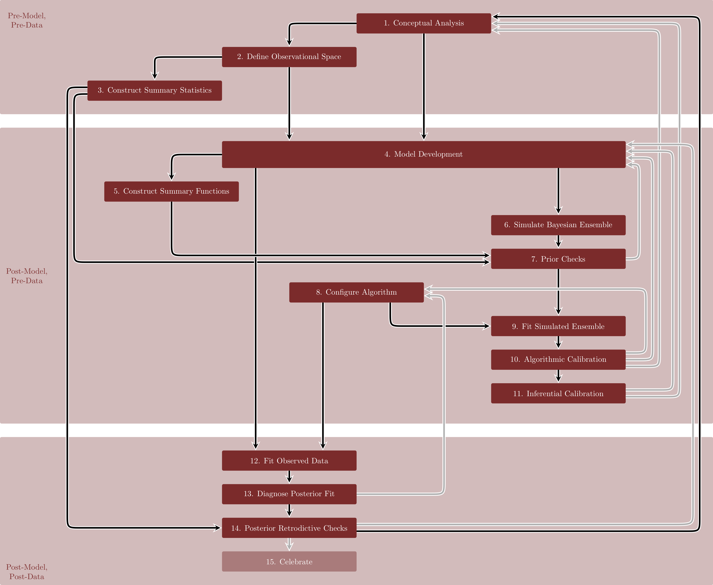
```
<br><br>
</center>

## Second Iteration: If At First You Don't Succeed, Try Try Again

The conflict between the observation and the model retrodiction we saw in the
posterior retrodictive check immediately suggests an expanded model where we
introduce a second source of zeroes, and a second iteration of our workflow.

### Step One: Conceptual Analysis {-}

Because we hadn't previously considered a source of excess zeroes we should
return all the way back to the conceptual analysis in order to understand the
possible mechanisms for these zeroes in our measurement process.  The excess
suggests that not all of the detectors are in perfect working order, returning
zero counts regardless of the flux of incident radiation.  Upon further
consideration this isn't unreasonable for detectors that a student excavated
from a dusty closet.

### Step Two: Step Two: Define Observational Space {-}

The observational space does not change in our expanded model, just the
probabilistic structure of our possible data generating processes.

### Step Three: Construct Summary Statistics {-}

The same histogram summary will be useful in summarizing the observations.

### Step Four: Model Development {-}

We can readily capture this possibility of failing detectors with a
_zero-inflated Poisson_ model that mixes a Poisson distribution with a point
distribution that concentrates entirely at zero,
$$
\pi(y_{n} \mid \lambda, \theta)
=
(1 - \theta) \cdot \text{Poisson} (y_{n} \mid \lambda)
+ \theta \cdot \delta_{0}(y_{n}) .
$$
We use the same prior for the source intensity, $\lambda$, and assign a uniform
prior over the mixture weight, $\theta$.

```{r}
stan(file='stan_programs/prior_tune2b.stan', iter=1, warmup=0, chains=1,
     seed=4838282, algorithm="Fixed_param")

theta <- seq(0, 1, 0.001)
dens <- dbeta(theta, 1, 1)
plot(theta, dens, type="l", col=c_dark_highlight, lwd=2,
     xlab="theta", ylab="Prior Density", yaxt='n')
```

This gives the complete Bayesian model
$$
\begin{align*}
\pi( y_{1}, \ldots, y_{N}, \lambda )
&= \;\;
\prod_{n = 1}^{N} \Big[
(1 - \theta) \cdot \mathrm{Poisson} (y_{n} \mid \lambda) + \theta \cdot \delta_{0}(y_{n})
\Big]
\\
& \quad \cdot \text{normal} (\lambda \mid 0, 6)
\\
& \quad \cdot
\text{beta} (\theta \mid 1, 1)
\end{align*}
$$

<center>
<br>
```{r, out.width = "50%", echo=FALSE}

```
<br><br>
</center>

This expanded model is implemented in the Stan programs

Ancestral sampling from the joint probability distribution is implemented in the
following Stan program.

```{r}
writeLines(readLines("stan_programs/simu_bayesian_ensemble2.stan"))
```

The joint probability density function is implemented in the following
Stan program.

```{r}
writeLines(readLines("stan_programs/fit_data2.stan"))
```

### Step Five: Construct Summary Functions {-}

Because zero-inflation will be seen in the histogram summary statistic we don't
need a new summary statistic to isolate this behavior.  If we wanted to be
exhaustive, however, we could consider new summary statistics such as the
number of observed zeros or the ratio of observed zeroes to total observations.

### Step Six: Simulate Bayesian Ensemble {-}

We can now simulate a new ensemble of model configurations and observations.

```{r, include = FALSE}
set.seed(4838282)
```

```{r}
R <- 1000
N <- 1000

simu_data <- list("N" = N)

fit <- stan(file='stan_programs/simu_bayesian_ensemble2.stan', data=simu_data,
            iter=R, warmup=0, chains=1, refresh=R,
            seed=4838282, algorithm="Fixed_param")

simu_lambdas <- extract(fit)$lambda
simu_thetas <- extract(fit)$theta
simu_ys <- extract(fit)$y
```

### Step Seven: Prior Checks {-}

The prior predictive distribution of histograms now manifests the zero-inflation
we have added to our model.

```{r}
B <- 50
counts <- sapply(1:R, function(r) hist(simu_ys[r,], breaks=(0:(B + 1))-0.5, plot=FALSE)$counts)
probs = c(0.1, 0.2, 0.3, 0.4, 0.5, 0.6, 0.7, 0.8, 0.9)
cred <- sapply(1:(B + 1), function(b) quantile(counts[b,], probs=probs))

idx <- rep(0:B, each=2)
x <- sapply(1:length(idx), function(b) if(b %% 2 == 0) idx[b] + 0.5 else idx[b] - 0.5)
pad_cred <- do.call(cbind, lapply(idx, function(n) cred[1:9,n + 1]))

plot(1, type="n", main="Prior Predictive Distribution",
     xlim=c(-0.5, 30), xlab="y", ylim=c(0, max(cred[9,])), ylab="")

polygon(c(x, rev(x)), c(pad_cred[1,], rev(pad_cred[9,])),
        col = c_light, border = NA)
polygon(c(x, rev(x)), c(pad_cred[2,], rev(pad_cred[8,])),
        col = c_light_highlight, border = NA)
polygon(c(x, rev(x)), c(pad_cred[3,], rev(pad_cred[7,])),
        col = c_mid, border = NA)
polygon(c(x, rev(x)), c(pad_cred[4,], rev(pad_cred[6,])),
        col = c_mid_highlight, border = NA)
lines(x, pad_cred[5,], col=c_dark, lwd=2)

rect(25, 0, 30, max(cred[9,]), col=c("#BBBBBB88"), border=FALSE)
abline(v=25, col=c("#BBBBBB"), lty=1, lw=2)
```

This addition, however, doesn't change the tail of observations and hence we
still have an appropriately small prior predictive probability for extreme
counts.

```{r}
length(simu_ys[simu_ys > 25]) / length(simu_ys)
```

There are fewer extreme counts than before because the zero inflation
suppresses the relative number of non-zero observations.

### Step Eight: Configure Algorithm {-}

We'll continue to use the default configuration of `Stan`.

### Step Nine: Fit Simulated Ensemble {-}

We proceed to fitting each replication, being sure to capture simulation
based calibration ranks and posterior summaries for the new parameter.

```{r, cache=TRUE}
tryCatch({
  registerDoParallel(makeCluster(detectCores()))

  simu_list <- t(data.matrix(data.frame(simu_lambdas, simu_thetas, simu_ys)))

  # Compile the posterior fit model
  fit_model = stan_model(file='stan_programs/fit_data2.stan')

  ensemble_output <- foreach(simu=simu_list,
                             .combine='cbind') %dopar% {
    simu_lambda <- simu[1]
    simu_theta <- simu[2]
    simu_y <- simu[3:(N + 2)];

    # Fit the simulated observation
    input_data <- list("N" = N, "y" = simu_y)

    capture.output(library(rstan))
    capture.output(fit <- sampling(fit_model, data=input_data, seed=4938483))

    # Compute diagnostics
    util <- new.env()
    source('stan_utility.R', local=util)

    warning_code <- util$check_all_diagnostics(fit, quiet=TRUE)

    # Compute rank of prior draw with respect to thinned posterior draws
    sbc_rank_lambda <- sum(simu_lambda < extract(fit)$lambda[seq(1, 4000 - 8, 8)])
    sbc_rank_theta <- sum(simu_theta < extract(fit)$theta[seq(1, 4000 - 8, 8)])

    # Compute posterior sensitivities
    s <- summary(fit, probs = c(), pars='lambda')$summary
    post_mean_lambda <- s[,1]
    post_sd_lambda <- s[,3]

    prior_sd_lambda <- 3.617414

    z_score_lambda <- (post_mean_lambda - simu_lambda) / post_sd_lambda
    contraction_lambda <- 1 - (post_sd_lambda / prior_sd_lambda)**2

    s <- summary(fit, probs = c(), pars='theta')$summary
    post_mean_theta <- s[,1]
    post_sd_theta <- s[,3]

    prior_sd_theta <- sqrt(1.0 / 12)

    z_score_theta <- (post_mean_theta - simu_theta) / post_sd_theta
    contraction_theta <- 1 - (post_sd_theta / prior_sd_theta)**2

    c(warning_code,
      sbc_rank_lambda, z_score_lambda, contraction_lambda,
      sbc_rank_theta, z_score_theta, contraction_theta)
  }
}, finally={ stopImplicitCluster() })
```

### Step Ten: Algorithmic Calibration {-}

First things first we check the fit diagnostics for each replication.

```{r}
warning_code <- ensemble_output[1,]
if (sum(warning_code) != 0) {
  cat("Some simulated posterior fits in the Bayesian ensemble encountered problems!\n")
  for (r in 1:R) {
    if (warning_code[r] != 0) {
      cat(sprintf('Replication %s of %s\n', r, R))
      util$parse_warning_code(warning_code[r])
      cat(sprintf('Simulated lambda = %s\n', simu_lambdas[r]))
      cat(sprintf('Simulated theta = %s\n', simu_thetas[r]))
      cat(" \n")
    }
  }
} else {
  cat("No posterior fits in the Bayesian ensemble encountered problems!\n")
}
```

Unfortunately the diagnostics indicate that our computed fits are not as 
reliable for this expanded model.  In particular we seem to have trouble fitting 
data simulated from model configurations with small $\lambda$ or extreme 
$\theta$.  To investigate further let's look at the simulated observations that
frustrated our computation.

```{r}
par(mfrow=c(3, 3))

hist(simu_ys[50,], breaks=(0:10 - 0.5),
     main="", xlab="y[50]", yaxt='n', ylab="",
     col=c_dark, border=c_dark_highlight)

hist(simu_ys[113,], breaks=(0:10 - 0.5),
     main="", xlab="y[113]", yaxt='n', ylab="",
     col=c_dark, border=c_dark_highlight)

hist(simu_ys[130,], breaks=(0:10 - 0.5),
     main="", xlab="y[130]", yaxt='n', ylab="",
     col=c_dark, border=c_dark_highlight)

hist(simu_ys[161,], breaks=(0:10 - 0.5),
     main="", xlab="y[161]", yaxt='n', ylab="",
     col=c_dark, border=c_dark_highlight)

hist(simu_ys[380,], breaks=(0:10 - 0.5),
     main="", xlab="y[380]", yaxt='n', ylab="",
     col=c_dark, border=c_dark_highlight)

hist(simu_ys[627,], breaks=(0:10 - 0.5),
     main="", xlab="y[627]", yaxt='n', ylab="",
     col=c_dark, border=c_dark_highlight)

hist(simu_ys[837,], breaks=(0:10 - 0.5),
     main="", xlab="y[837]", yaxt='n', ylab="",
     col=c_dark, border=c_dark_highlight)

hist(simu_ys[50,], breaks=(0:10 - 0.5),
     main="", xlab="y[50]", yaxt='n', ylab="",
     col=c_dark, border=c_dark_highlight)
```

The immediate common feature amongst these problematic observations are very 
small counts, in many cases observations consisting of only zero counts.  To 
see why these zero count observations impede accurate computation let's look at
the fit in more detail.

```{r}
input_data <- list("N" = N, "y" = simu_ys[50,])
fit <- stan(file='stan_programs/fit_data2.stan', data=input_data, 
            seed=4938483, refresh=2000)
util$check_all_diagnostics(fit)
```

With only one divergence the failure of our computation here is relatively 
mild, although not ignorable.

Because we have only two parameters we can examine the entire fitted posterior 
distribution with a scatter plot of the sampled values.  Here I'll transform 
each parameter to the _unconstrained_ values that the dynamic Hamiltonian
Monte Carlo sampler in Stan actually explores.

```{r}
partition <- util$partition_div(fit)
div_params <- partition[[1]]
nondiv_params <- partition[[2]]

plot(log(nondiv_params$lambda), 
     log(nondiv_params$theta) - log(1 - nondiv_params$theta),
     col=c_dark_trans, pch=16, cex=0.8,
     xlab="log(lambda)", ylab="logit(theta)")
points(log(div_params$lambda), 
       log(div_params$theta) - log(1 - div_params$theta),
       col=c_green_trans, pch=16, cex=0.8)
```

When we have only zero counts our model is extremely _poorly identified_, with 
the observation unable to distinguish between a very low Poisson source strength 
and the failure of all of the detectors at once.

To be thorough let's also investigate one of the simulated observations with 
small but not entirely zero counts in each detector.

```{r}
input_data <- list("N" = N, "y" = simu_ys[113,])
fit <- stan(file='stan_programs/fit_data2.stan', data=input_data, 
            seed=4938483, refresh=2000)

util$check_all_diagnostics(fit)

partition <- util$partition_div(fit)
div_params <- partition[[1]]
nondiv_params <- partition[[2]]

plot(log(nondiv_params$lambda), 
     log(nondiv_params$theta) - log(1 - nondiv_params$theta),
     col=c_dark_trans, pch=16, cex=0.8,
     xlab="log(lambda)", ylab="logit(theta)")
points(log(div_params$lambda), 
       log(div_params$theta) - log(1 - div_params$theta),
       col=c_green_trans, pch=16, cex=0.8)
```

In this case the small number of divergent transitions leads us to a more subtle
identifiability issue.  When the failure probability $\theta$ is small the model
places the responsibility for the observations almost entirely on the Poisson 
component.  Consequently the observations strongly inform the Poisson source 
strength.  When the failure probability increases, however, the Poisson 
component is given less responsibility and is correspondingly less informed by 
the observation.  This shifting constraint on the Poisson source strength 
results in a mild funnel geometry that obsructs exploration of very small 
failure probabilities.

Given the mild failures we could try to reconfigure our computational method to 
better handle the poorly identified likelihood functions.  The nature of these 
failures, however, also provides us with an opportunity to reconsider our domain 
expertise and tweak our model.  Is it reasonable for the source intensity to be 
small enough that we would expect mostly zeroes from the Poisson component of 
our model?

Because computational problems often correlate with poorly identified likelihood
functions they have a knack for identifying the deficiency of the domain
expertise we've incorporated into our model.  We should heed their warnings
carefully!

<center>
<br>
```{r, out.width = "100%", echo=FALSE}
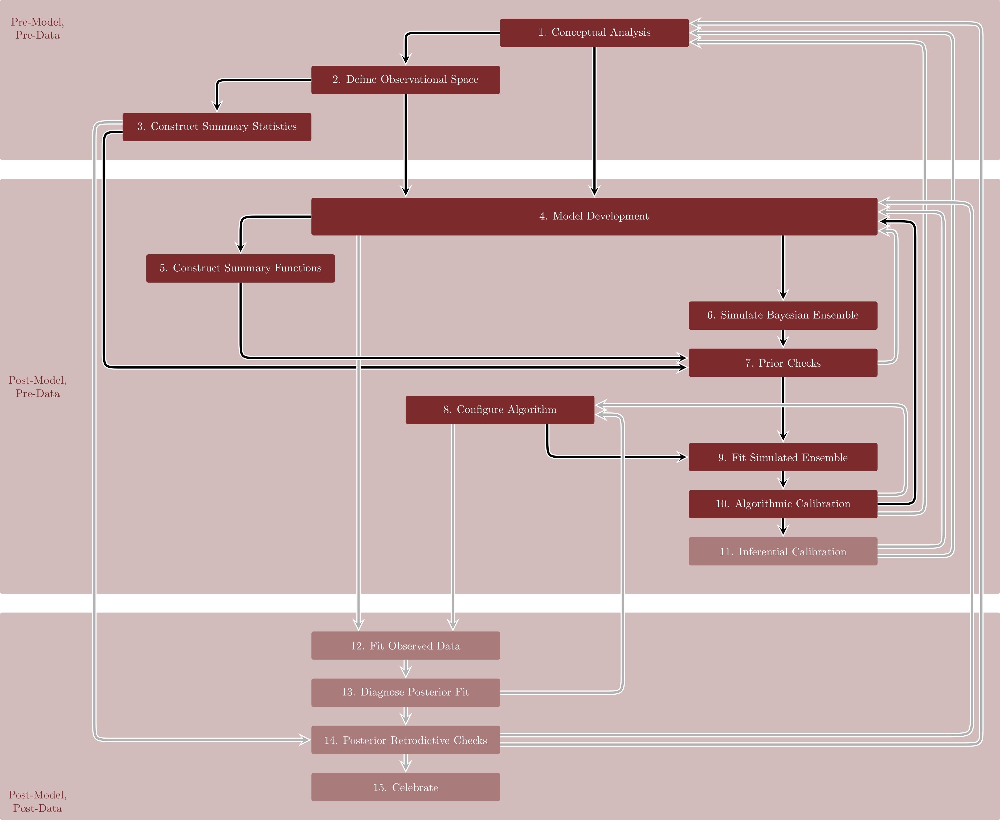
```
<br><br>
</center>

## Third Iteration: It's About the Journey, Not The Destination, Right?

Taking a deep breath we push on with our third iteration of the model
development workflow.

### Step One: Conceptual Analysis {-}

Just how reasonable is it for a working detector aimed at a well-known source
to admit a small Poisson intensity, or for all of the detectors to be working
or not working?  The previous computational problems identified some important
questions that we hadn't initially addressed with our domain expertise.

Upon reflection let's say that our domain expertise specifies that the source
we're studying has been previously calibrated to test detectors like these --
in other words the source should be more than strong enough to generate counts
in working detectors.  Moreover, while some of the detectors may be flakey, a
bunch were recently used and so not all of them should be failing.  While our
observational model will not change, these deeper reflections imply more
informative priors for the zero-inflated model.  Working detectors and
malfunctioning detectors should be distinguishable!

Importantly these insights were not learned from the observed data.  They come
from domain expertise that has always existed, if not within us then within our
colleagues, but had not been incorporated into our model.  Only when
computational problems identified pathological behaviors did we need to
reconsider and refine the domain expertise we used.

### Step Two: Define Observational Space {-}

The observation space remains the same.

### Step Three: Construct Summary Statistics {-}

One reason we didn't notice the simulated observations with all zero counts 
earlier is that the histogram summary statistic doesn't fully capture the 
correlations between the bin counts.  To provide stronger prior checking let's
consider the observed proportion of zeros in each observation and ensure that
it's not more than around 0.9.

Indeed had we considered this summary statistic in the previous iteration of 
the workflow we would have seen a significant conflict between the consequences
of our modeling assumptions and our domain expertise.

```{r}
zero_pro <- sapply(1:R, function(r) sum(simu_ys[r,] == 0) / length(simu_ys[r,]))

hist(zero_pro, breaks=seq(-0.5*20/R, 1 + 0.5*20/R, 20/R),
     main="", xlab="Observed Proportion of Zero Counts", 
     yaxt='n', ylab="Prior Predictive Distribution",
     col=c_dark, border=c_dark_highlight)
rect(0.9, 0, 1.01, 50, col=c("#BBBBBB88"), border=FALSE)
abline(v=0.9, col=c("#BBBBBB"), lty=1, lw=2)
```

### Step Four: Model Development {-}

To incorporate our newly considered domain expertise we need a prior model
that suppresses small source strengths and extreme failure probabilities.

We can suppress small source strengths with an inverse gamma probability density
function that places only 1% probability below $\lambda = 1$, where the Poisson
probability density functions starts to look like the Dirac distribution
concentrated at zero we're using to model the malfunctioning detectors.  At the
same time we still want to maintain 1% of the prior probability above
$\lambda = 15$.  We can use `Stan`'s algebraic solver to find the member of the
inverse gamma family satisfying these two constraints.

```{r}
writeLines(readLines("stan_programs/prior_tune2a.stan"))
```

Again we don't need to be precious about the exact results -- here we'll take
$\alpha = 3.5$ and $\beta = 9$.

```{r}
stan(file='stan_programs/prior_tune2a.stan', iter=1, warmup=0, chains=1,
     seed=4838282, algorithm="Fixed_param")

lambda <- seq(0, 20, 0.001)
dens <- lapply(lambda, function(l) dgamma(1 / l, 3.5, rate=9) * (1 / l**2))
plot(lambda, dens, type="l", col=c_dark_highlight, lwd=2,
     xlab="lambda", ylab="Prior Density", yaxt='n')

lambda98 <- seq(1, 15, 0.001)
dens <- lapply(lambda98, function(l) dgamma(1 / l, 3.5, rate=9) * (1 / l**2))
lambda98 <- c(lambda98, 15, 1)
dens <- c(dens, 0, 0)

polygon(lambda98, dens, col=c_dark, border=NA)
```

To avoid extreme failure probabilities we'll need a prior density function that
that puts only 1% probability mass below 0.1 and above 0.9.  Once again we
appeal to the algebraic solver.

```{r}
writeLines(readLines("stan_programs/prior_tune2b.stan"))
```

We'll take $\alpha = \beta = 3$.

```{r}
stan(file='stan_programs/prior_tune2b.stan', iter=1, warmup=0, chains=1,
     seed=4838282, algorithm="Fixed_param")

theta <- seq(0, 1, 0.001)
dens <- dbeta(theta, 3, 3)
plot(theta, dens, type="l", col=c_dark_highlight, lwd=2,
     xlab="theta", ylab="Prior Density", yaxt='n')

theta98 <- seq(0.1, 0.9, 0.001)
dens <- dbeta(theta98, 3, 3)
theta98 <- c(theta98, 0.9, 0.1)
dens <- c(dens, 0, 0)

polygon(theta98, dens, col=c_dark, border=NA)
```

The complete Bayesian model is then
$$
\begin{align*}
\pi( y_{1}, \ldots, y_{N}, \lambda )
&= \;\;
\prod_{n = 1}^{N} \Big[
(1 - \theta) \cdot \mathrm{Poisson} (y_{n} \mid \lambda) + \theta \cdot \delta_{0}(y_{n})
\Big]
\\
& \quad \cdot \text{inv-gamma} (\lambda \mid 3.5, 9)
\\
& \quad \cdot
\text{beta} (\theta \mid 3, 3)
\end{align*}
$$

<center>
<br>
```{r, out.width = "50%", echo=FALSE}
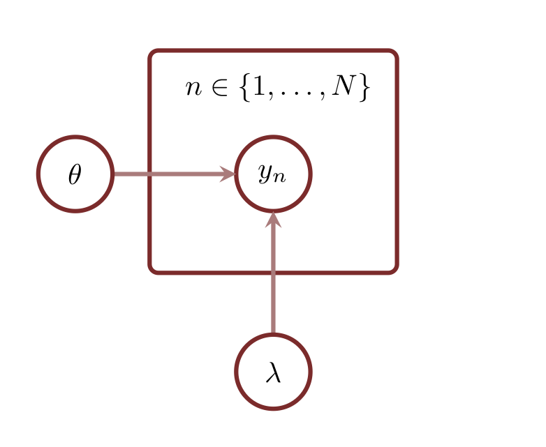
```
<br><br>
</center>

Ancestral sampling from this joint probability distribution is implemented in the
following Stan program.

```{r}
writeLines(readLines("stan_programs/simu_bayesian_ensemble3.stan"))
```

The joint probability density function is implemented in the following
Stan program.

```{r}
writeLines(readLines("stan_programs/fit_data3.stan"))
```

### Step Five: Construct Summary Functions {-}

The histogram summary statistic is still capable of capturing the relevant
structure of the observations.

### Step Six: Simulate Bayesian Ensemble {-}

The Bayesian ensemble is simulated as before.

```{r}
R <- 1000
N <- 1000

simu_data <- list("N" = N)

fit <- stan(file='stan_programs/simu_bayesian_ensemble3.stan', data=simu_data,
            iter=R, warmup=0, chains=1, refresh=R,
            seed=4838282, algorithm="Fixed_param")

simu_lambdas <- extract(fit)$lambda
simu_thetas <- extract(fit)$theta
simu_ys <- extract(fit)$y
```

### Step Seven: Prior Checks {-}

With the modified prior model we see a slightly different prior predictive
average histogram, but one still compatible with our domain expertise.

```{r}
B <- 60
counts <- sapply(1:R, function(r) hist(simu_ys[r,], breaks=(0:(B + 1))-0.5, plot=FALSE)$counts)
probs = c(0.1, 0.2, 0.3, 0.4, 0.5, 0.6, 0.7, 0.8, 0.9)
cred <- sapply(1:(B + 1), function(b) quantile(counts[b,], probs=probs))

idx <- rep(0:B, each=2)
x <- sapply(1:length(idx), function(b) if(b %% 2 == 0) idx[b] + 0.5 else idx[b] - 0.5)
pad_cred <- do.call(cbind, lapply(idx, function(n) cred[1:9,n + 1]))

plot(1, type="n", main="Prior Predictive Distribution",
     xlim=c(-0.5, 30), xlab="y", ylim=c(0, max(cred[9,])), ylab="")

polygon(c(x, rev(x)), c(pad_cred[1,], rev(pad_cred[9,])),
        col = c_light, border = NA)
polygon(c(x, rev(x)), c(pad_cred[2,], rev(pad_cred[8,])),
        col = c_light_highlight, border = NA)
polygon(c(x, rev(x)), c(pad_cred[3,], rev(pad_cred[7,])),
        col = c_mid, border = NA)
polygon(c(x, rev(x)), c(pad_cred[4,], rev(pad_cred[6,])),
        col = c_mid_highlight, border = NA)
lines(x, pad_cred[5,], col=c_dark, lwd=2)

rect(25, 0, 30, max(cred[9,]), col=c("#BBBBBB88"), border=FALSE)
abline(v=25, col=c("#BBBBBB"), lty=1, lw=2)
```

In particular we still have the desired low probability for extreme
observations.

```{r}
length(simu_ys[simu_ys > 25]) / length(simu_ys)
```

We also want to check our prior model against our new summary statistic, which 
exhibits none of the conflict seen in our previous model.

```{r}
zero_pro <- sapply(1:R, function(r) sum(simu_ys[r,] == 0) / length(simu_ys[r,]))

hist(zero_pro, breaks=seq(-0.5*20/R, 1 + 0.5*20/R, 20/R),
     main="", xlab="Observed Proportion of Zero Counts", 
     yaxt='n', ylab="Prior Predictive Distribution",
     col=c_dark, border=c_dark_highlight)
rect(0.9, 0, 1.01, 50, col=c("#BBBBBB88"), border=FALSE)
abline(v=0.9, col=c("#BBBBBB"), lty=1, lw=2)
```

### Step Eight: Configure Algorithm {-}

Our use of `Stan` defaults doesn't change.

### Step Nine: Fit Simulated Ensemble {-}

We can now proceed to fitting each simulation, updating the posterior
contraction calculations to take into account the updated prior distributions.

```{r, cache=TRUE}
tryCatch({
  registerDoParallel(makeCluster(detectCores()))

  simu_list <- t(data.matrix(data.frame(simu_lambdas, simu_thetas, simu_ys)))

  # Compile the posterior fit model
  fit_model = stan_model(file='stan_programs/fit_data3.stan')

  ensemble_output <- foreach(simu=simu_list,
                             .combine='cbind') %dopar% {
    simu_lambda <- simu[1]
    simu_theta <- simu[2]
    simu_y <- simu[3:(N + 2)];

    # Fit the simulated observation
    input_data <- list("N" = N, "y" = simu_y)

    capture.output(library(rstan))
    capture.output(fit <- sampling(fit_model, data=input_data, seed=4938483))

    # Compute diagnostics
    util <- new.env()
    source('stan_utility.R', local=util)

    warning_code <- util$check_all_diagnostics(fit, quiet=TRUE)

    # Compute rank of prior draw with respect to thinned posterior draws
    sbc_rank_lambda <- sum(simu_lambda < extract(fit)$lambda[seq(1, 4000 - 8, 8)])
    sbc_rank_theta <- sum(simu_theta < extract(fit)$theta[seq(1, 4000 - 8, 8)])

    # Compute posterior sensitivities
    s <- summary(fit, probs = c(), pars='lambda')$summary
    post_mean_lambda <- s[,1]
    post_sd_lambda <- s[,3]

    prior_sd_lambda <- sqrt( (9)**2 / ((3.5 - 1)**2 * (3.5 - 1)) )

    z_score_lambda <- (post_mean_lambda - simu_lambda) / post_sd_lambda
    contraction_lambda <- 1 - (post_sd_lambda / prior_sd_lambda)**2

    s <- summary(fit, probs = c(), pars='theta')$summary
    post_mean_theta <- s[,1]
    post_sd_theta <- s[,3]

    prior_sd_theta <- sqrt( (3)**2 / (4 * (3)**2 * (2 * 3 + 1)) )

    z_score_theta <- (post_mean_theta - simu_theta) / post_sd_theta
    contraction_theta <- 1 - (post_sd_theta / prior_sd_theta)**2

    c(warning_code,
      sbc_rank_lambda, z_score_lambda, contraction_lambda,
      sbc_rank_theta, z_score_theta, contraction_theta)
  }
}, finally={ stopImplicitCluster() })
```

### Step Ten: Algorithmic Calibration {-}

With the poorly-identified likelihood functions tempered by the refined prior
model there are no diagnostic indications of fitting problems.

```{r}
warning_code <- ensemble_output[1,]
if (sum(warning_code) != 0) {
  cat("Some simulated posterior fits in the Bayesian ensemble encountered problems!\n")
  for (r in 1:R) {
    if (warning_code[r] != 0) {
      cat(sprintf('Replication %s of %s\n', r, R))
      util$parse_warning_code(warning_code[r])
      cat(sprintf('Simulated lambda = %s\n', simu_lambdas[r]))
      cat(sprintf('Simulated theta = %s\n', simu_thetas[r]))
      cat(" \n")
    }
  }
} else {
  cat("No posterior fits in the Bayesian ensemble encountered problems!\n")
}
```

The lone treedepth warning here is a matter of computational efficiency, not 
computational accuracy.  We could consider increasing `max_treedepth` to avoid 
any potential inefficiencies, but given the rarity of the warning let's 
continue ahead with the Stan defaults.

Similarly, the simulation-based histograms for both $\lambda$ and $\theta$ show
no signs of errors in our fits.

```{r}
sbc_rank <- ensemble_output[2,]
sbc_hist <- hist(sbc_rank, seq(0, 500, 25) - 0.5, plot=FALSE)
plot(sbc_hist, main="Lambda", xlab="Prior Rank", yaxt='n', ylab="")

low <- qbinom(0.005, R, 1 / 20)
mid <- qbinom(0.5, R, 1 / 20)
high <- qbinom(0.995, R, 1 / 20)
bar_x <- c(-10, 510, 500, 510, -10, 0, -10)
bar_y <- c(high, high, mid, low, low, mid, high)

polygon(bar_x, bar_y, col=c("#DDDDDD"), border=NA)
segments(x0=0, x1=500, y0=mid, y1=mid, col=c("#999999"), lwd=2)

plot(sbc_hist, col=c_dark, border=c_dark_highlight, add=T)

# Check SBC histogram for Theta
sbc_rank <- ensemble_output[5,]
sbc_hist <- hist(sbc_rank, seq(0, 500, 25) - 0.5, plot=FALSE)
plot(sbc_hist, main="Theta", xlab="Prior Rank", yaxt='n', ylab="")

low <- qbinom(0.005, R, 1 / 20)
mid <- qbinom(0.5, R, 1 / 20)
high <- qbinom(0.995, R, 1 / 20)
bar_x <- c(-10, 510, 500, 510, -10, 0, -10)
bar_y <- c(high, high, mid, low, low, mid, high)

polygon(bar_x, bar_y, col=c("#DDDDDD"), border=NA)
segments(x0=0, x1=500, y0=mid, y1=mid, col=c("#999999"), lwd=2)

plot(sbc_hist, col=c_dark, border=c_dark_highlight, add=T)
```

### Step Eleven: Inferential Calibration {-}

This leaves us to check the ensemble behavior of our recovered posterior
distributions which looks reasonable for both parameters.

```{r}
z_score <- ensemble_output[3,]
contraction <- ensemble_output[4,]

plot(contraction, z_score, col=c("#8F272720"), lwd=2, pch=16, cex=0.8, main="Lambda",
     xlim=c(0, 1), xlab="Posterior Contraction", ylim=c(-5, 5), ylab="Posterior z-Score")

z_score <- ensemble_output[6,]
contraction <- ensemble_output[7,]

plot(contraction, z_score, col=c("#8F272720"), lwd=2, pch=16, cex=0.8, main="Theta",
     xlim=c(0, 1), xlab="Posterior Contraction", ylim=c(-5, 5), ylab="Posterior z-Score")
```

### Step Twelve: Fit the Observation {-}

Confident in the performance of the expanded model within the scope of its
own assumptions we go back to fit the observed data once again, this time
taking the zero-inflation into account in our posterior predictive simulations.

```{r}
writeLines(readLines("stan_programs/fit_data3_post_pred.stan"))
```

```{r}
input_data <- read_rdump('workflow.data.R')
fit <- stan(file='stan_programs/fit_data3_post_pred.stan', data=input_data,
            seed=4938483, refresh=2000)
```

### Step Thirteen: Diagnose Posterior Fit {-}

The diagnostics look good,

```{r}
util$check_all_diagnostics(fit)
```

and the marginal posterior distributions look reasonable.

```{r}
params = extract(fit)

par(mfrow=c(2, 1))

hist(params$lambda, main="", xlab="lambda", yaxt='n', ylab="",
     col=c_dark, border=c_dark_highlight)

hist(params$theta, main="", xlab="theta", yaxt='n', ylab="",
     col=c_dark, border=c_dark_highlight)
```

### Step Fourteen: Posterior Retrodictive Checks {-}

Excited that we might finally have an adequate model we proceed to the
posterior retrodictive check.

```{r}
B <- 30

obs_counts <- hist(input_data$y, breaks=(0:(B + 1))-0.5, plot=FALSE)$counts

idx <- rep(0:B, each=2)
x <- sapply(1:length(idx), function(b) if(b %% 2 == 0) idx[b] + 0.5 else idx[b] - 0.5)
pad_obs <- do.call(cbind, lapply(idx, function(n) obs_counts[n + 1]))

counts <- sapply(1:4000, function(n) hist(params$y_post_pred[n,], breaks=(0:(B + 1))-0.5, plot=FALSE)$counts)
probs = c(0.1, 0.2, 0.3, 0.4, 0.5, 0.6, 0.7, 0.8, 0.9)
cred <- sapply(1:(B + 1), function(b) quantile(counts[b,], probs=probs))
pad_cred <- do.call(cbind, lapply(idx, function(n) cred[1:9,n + 1]))

plot(1, type="n", main="Posterior Retrodictive Distribution",
     xlim=c(-0.5, B + 0.5), xlab="y",
     ylim=c(0, max(c(obs_counts, cred[9,]))), ylab="")

polygon(c(x, rev(x)), c(pad_cred[1,], rev(pad_cred[9,])),
        col = c_light, border = NA)
polygon(c(x, rev(x)), c(pad_cred[2,], rev(pad_cred[8,])),
        col = c_light_highlight, border = NA)
polygon(c(x, rev(x)), c(pad_cred[3,], rev(pad_cred[7,])),
        col = c_mid, border = NA)
polygon(c(x, rev(x)), c(pad_cred[4,], rev(pad_cred[6,])),
        col = c_mid_highlight, border = NA)
lines(x, pad_cred[5,], col=c_dark, lwd=2)

lines(x, pad_obs, col="white", lty=1, lw=2.5)
lines(x, pad_obs, col="black", lty=1, lw=2)

```

Frustratingly we see that the tail of the posterior predictive histogram extends
beyond that in the observed data.  This suggests that the detector responses may
be truncated and unable to record values above $y = 14$.  At this point we are
suspicious of the exact measurement process but don't have enough domain
expertise to suggest an expanded model.  Before considering any expansions we
need to consult with the one person who was there.

<center>
<br>
```{r, out.width = "100%", echo=FALSE}

```
<br><br>
</center>

## Fourth Iteration: Coffee Is For Closers

A principled  workflow is a powerful investigatory tool for identifying subtle
structure in the observed data and motivating appropriate model features.  There
is a fine line, however, between improving the model and overfitting to the
given observation.  To avoid crossing this line we have to lean on our domain
expertise, and the domain expertise of others.

### Step One: Conceptual Analysis {-}

Suspicious of the experimental setup under which the data were collected we ask
to meet with the student who ran the experiment.  When we bring up the odd
behavior we saw the student seems nonchalant.  "Oh, you mean like when the
detectors didn't read out anything at all?" they say. "I just repeated the
measurement for each detector until they reported an actual value." they say.

And there it is.  The readout system for detectors seems to be vulnerable to
overloading when the counts surpass a given value, returning no value at all.
When the student repeated the measurement for detectors in this state they
unintentionally induced a _truncated observation_ where the Poisson distribution
is cutoff at a certain value.

Reviewing the detector instruction manual we see that indeed this series of 
detectors has a default safety cutoff at $14$ counts.  In order to model the
observations taking under this default configuration we need to explicitly model 
the truncation at this value.

Importantly we will consider a truncation at $14$ counts because of our
expanded domain expertise after consulting the manual, _not_ because of what we 
observed in the data.  Selecting a fixed truncation based on the observed data 
would be a potentially dangerous overfitting transgression.  If we didn't have 
domain expertise to select a precise truncation point then we would have to 
model the possible values and _infer_ a truncation point jointly with our other
parameters.

### Step Two: Define Observational Space {-}

The observation space does not change.

### Step Three: Construct Summary Statistics {-}

The same histogram summary remains appropriate.

### Step Four: Model Development {-}

We now have to augment out observational model to account for the truncation of
the counts.  

The complete Bayesian model is then
$$
\begin{align*}
\pi( y_{1}, \ldots, y_{N}, \lambda )
&= \;\;
\prod_{n = 1}^{N} \Big[
(1 - \theta) \cdot
\frac{\mathrm{Poisson} (y_{n} \mid \lambda) \, \mathbb{I} [ y_{n} \le U ] }
{\sum_{z = 0}^{U} \mathrm{Poisson} (z \mid \lambda)}
 + \theta \cdot \delta_{0}(y_{n})
\Big]
\\
& \quad \cdot \text{inv-gamma} (\lambda \mid 3.5, 9)
\\
& \quad \cdot
\text{beta} (\theta \mid 3, 3)
\end{align*}
$$

<center>
<br>
```{r, out.width = "50%", echo=FALSE}
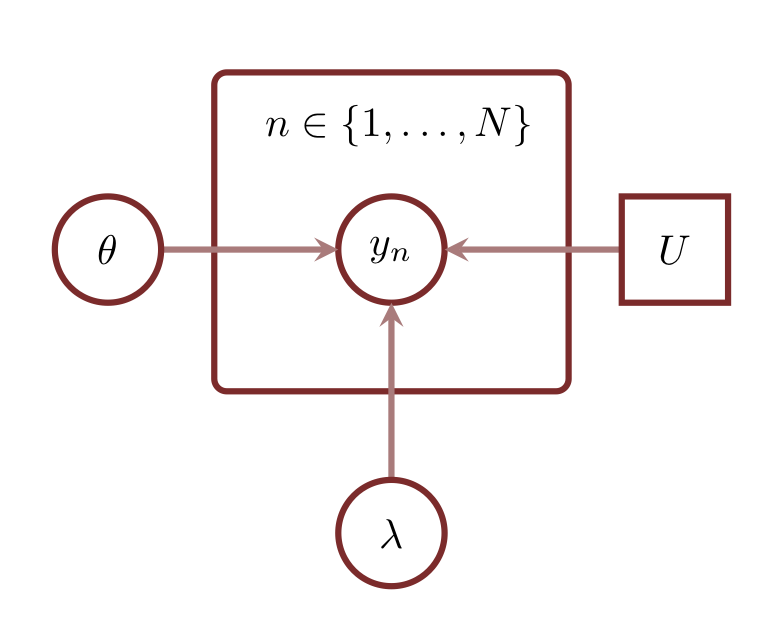
```
<br><br>
</center>

Ancestral sampling is implemented in the following Stan program that uses
_progressive sampling_ to efficiently sample from the truncated Poisson model.

```{r}
writeLines(readLines("stan_programs/simu_bayesian_ensemble4.stan"))
```

The joint probability density function requires introducing the corrected
normalization in the Stan program.

```{r}
writeLines(readLines("stan_programs/fit_data4.stan"))
```

### Step Five: Construct Summary Functions {-}

Truncation already manifests in the histogram summary statistic so it remains
sufficient to capture the relevant structure of the data.

### Step Six: Simulate Bayesian Ensemble {-}

We dutifully simulated the Bayesian ensemble of our expanded model.

```{r}
R <- 1000
N <- 1000

simu_data <- list("N" = N)

fit <- stan(file='stan_programs/simu_bayesian_ensemble4.stan', data=simu_data,
            iter=R, warmup=0, chains=1, refresh=R,
            seed=4838282, algorithm="Fixed_param")

simu_lambdas <- extract(fit)$lambda
simu_thetas <- extract(fit)$theta
simu_ys <- extract(fit)$y
```

### Step Seven: Prior Checks {-}

The prior predictive distribution of histograms now exhibits both zero-inflation
and truncation.

```{r}
B <- 26
counts <- sapply(1:R, function(r) hist(simu_ys[r,], breaks=(0:(B + 1))-0.5, plot=FALSE)$counts)
probs = c(0.1, 0.2, 0.3, 0.4, 0.5, 0.6, 0.7, 0.8, 0.9)
cred <- sapply(1:(B + 1), function(b) quantile(counts[b,], probs=probs))

idx <- rep(0:B, each=2)
x <- sapply(1:length(idx), function(b) if(b %% 2 == 0) idx[b] + 0.5 else idx[b] - 0.5)
pad_cred <- do.call(cbind, lapply(idx, function(n) cred[1:9,n + 1]))

plot(1, type="n", main="Prior Predictive Distribution",
     xlim=c(-0.5, 30), xlab="y", ylim=c(0, max(cred[9,])), ylab="")

polygon(c(x, rev(x)), c(pad_cred[1,], rev(pad_cred[9,])),
        col = c_light, border = NA)
polygon(c(x, rev(x)), c(pad_cred[2,], rev(pad_cred[8,])),
        col = c_light_highlight, border = NA)
polygon(c(x, rev(x)), c(pad_cred[3,], rev(pad_cred[7,])),
        col = c_mid, border = NA)
polygon(c(x, rev(x)), c(pad_cred[4,], rev(pad_cred[6,])),
        col = c_mid_highlight, border = NA)
lines(x, pad_cred[5,], col=c_dark, lwd=2)

rect(25, 0, 30, max(cred[9,]), col=c("#BBBBBB88"), border=FALSE)
abline(v=25, col=c("#BBBBBB"), lty=1, lw=2)
```

With the truncation we now have exactly zero prior predictive probability above
the extreme observation scale derived from our domain expertise.

```{r}
length(simu_ys[simu_ys > 25]) / length(simu_ys)
```

Similarly the zero proportion summary statistic shows no signs of serious 
conflict.

```{r}
zero_pro <- sapply(1:R, function(r) sum(simu_ys[r,] == 0) / length(simu_ys[r,]))

hist(zero_pro, breaks=seq(-0.5*20/R, 1 + 0.5*20/R, 20/R),
     main="", xlab="Observed Proportion of Zero Counts", 
     yaxt='n', ylab="Prior Predictive Distribution",
     col=c_dark, border=c_dark_highlight)
rect(0.9, 0, 1.01, 50, col=c("#BBBBBB88"), border=FALSE)
abline(v=0.9, col=c("#BBBBBB"), lty=1, lw=2)
```

### Step Eight: Configure Algorithm {-}

Our use of `Stan` defaults doesn't change.

### Step Nine: Fit Simulated Ensemble {-}

We continue to fitting each replication in our simulated ensemble.

```{r, cache=TRUE}
tryCatch({
  registerDoParallel(makeCluster(detectCores()))

  simu_list <- t(data.matrix(data.frame(simu_lambdas, simu_thetas, simu_ys)))

  # Compile the posterior fit model
  fit_model = stan_model(file='stan_programs/fit_data4.stan')

  ensemble_output <- foreach(simu=simu_list,
                             .combine='cbind') %dopar% {
    simu_lambda <- simu[1]
    simu_theta <- simu[2]
    simu_y <- simu[3:(N + 2)];

    # Fit the simulated observation
    input_data <- list("N" = N, "y" = simu_y)

    capture.output(library(rstan))
    capture.output(fit <- sampling(fit_model, data=input_data, seed=4938483))

    # Compute diagnostics
    util <- new.env()
    source('stan_utility.R', local=util)

    warning_code <- util$check_all_diagnostics(fit, quiet=TRUE)

    # Compute rank of prior draw with respect to thinned posterior draws
    sbc_rank_lambda <- sum(simu_lambda < extract(fit)$lambda[seq(1, 4000 - 8, 8)])
    sbc_rank_theta <- sum(simu_theta < extract(fit)$theta[seq(1, 4000 - 8, 8)])

    # Compute posterior sensitivities
    s <- summary(fit, probs = c(), pars='lambda')$summary
    post_mean_lambda <- s[,1]
    post_sd_lambda <- s[,3]

    prior_sd_lambda <- sqrt( (9)**2 / ((3.5 - 1)**2 * (3.5 - 1)) )

    z_score_lambda <- (post_mean_lambda - simu_lambda) / post_sd_lambda
    contraction_lambda <- 1 - (post_sd_lambda / prior_sd_lambda)**2

    s <- summary(fit, probs = c(), pars='theta')$summary
    post_mean_theta <- s[,1]
    post_sd_theta <- s[,3]

    prior_sd_theta <- sqrt( (3)**2 / (4 * (3)**2 * (2 * 3 + 1)) )

    z_score_theta <- (post_mean_theta - simu_theta) / post_sd_theta
    contraction_theta <- 1 - (post_sd_theta / prior_sd_theta)**2

    c(warning_code,
      sbc_rank_lambda, z_score_lambda, contraction_lambda,
      sbc_rank_theta, z_score_theta, contraction_theta)
  }
}, finally={ stopImplicitCluster() })
```

### Step Ten: Algorithmic Calibration {-}

Happily, the diagnostics all look clean.

```{r}
warning_code <- ensemble_output[1,]
if (sum(warning_code) != 0) {
  cat("Some simulated posterior fits in the Bayesian ensemble encountered problems!\n")
  for (r in 1:R) {
    if (warning_code[r] != 0) {
      cat(sprintf('Replication %s of %s\n', r, R))
      util$parse_warning_code(warning_code[r])
      cat(sprintf('Simulated lambda = %s\n', simu_lambdas[r]))
      cat(sprintf('Simulated theta = %s\n', simu_thetas[r]))
      cat(" ")
    }
  }
} else {
  cat("No posterior fits in the Bayesian ensemble encountered problems!\n")
}
```

Again the lone treedepth warning is an issue of efficiency and not validity,
and given that it occurs only once we won't worry about modifying the default
`Stan` configuration to accommodate it here.

Similarly the simulation-based calibration histograms exhibit no problematic
behavior.

```{r}
sbc_rank <- ensemble_output[2,]
sbc_hist <- hist(sbc_rank, seq(0, 500, 25) - 0.5, plot=FALSE)
plot(sbc_hist, main="Lambda", xlab="Prior Rank", yaxt='n', ylab="")

low <- qbinom(0.005, R, 1 / 20)
mid <- qbinom(0.5, R, 1 / 20)
high <- qbinom(0.995, R, 1 / 20)
bar_x <- c(-10, 510, 500, 510, -10, 0, -10)
bar_y <- c(high, high, mid, low, low, mid, high)

polygon(bar_x, bar_y, col=c("#DDDDDD"), border=NA)
segments(x0=0, x1=500, y0=mid, y1=mid, col=c("#999999"), lwd=2)

plot(sbc_hist, col=c_dark, border=c_dark_highlight, add=T)

# Check SBC histogram for Theta
sbc_rank <- ensemble_output[5,]
sbc_hist <- hist(sbc_rank, seq(0, 500, 25) - 0.5, plot=FALSE)
plot(sbc_hist, main="Theta", xlab="Prior Rank", yaxt='n', ylab="")

low <- qbinom(0.005, R, 1 / 20)
mid <- qbinom(0.5, R, 1 / 20)
high <- qbinom(0.995, R, 1 / 20)
bar_x <- c(-10, 510, 500, 510, -10, 0, -10)
bar_y <- c(high, high, mid, low, low, mid, high)

polygon(bar_x, bar_y, col=c("#DDDDDD"), border=NA)
segments(x0=0, x1=500, y0=mid, y1=mid, col=c("#999999"), lwd=2)

plot(sbc_hist, col=c_dark, border=c_dark_highlight, add=T)
```

We have to be careful not to imagine structure in the simulation-based 
calibration histograms that isn't there.  Here the one small bin for the 
$\lambda$ histogram and the one large bin for the $\theta$ histogram are not 
inconsistent with the expected variation and, most importantly, they are not 
accompanied by other deviant bins to form a systematic deviation.  

If we wanted to be especially careful we could go back and rerun the posterior 
fits with more iterations, and populate the simulation-based calibration 
histograms with more samples to better resolve and potential deviant behavior.

### Step Eleven: Inferential Calibration {-}

Moreover, the recovered posteriors for each fit perform reasonable well.

```{r}
z_score <- ensemble_output[3,]
contraction <- ensemble_output[4,]

plot(contraction, z_score, col=c("#8F272720"), lwd=2, pch=16, cex=0.8, main="Lambda",
     xlim=c(0, 1), xlab="Posterior Contraction", ylim=c(-5, 5), ylab="Posterior z-Score")

z_score <- ensemble_output[6,]
contraction <- ensemble_output[7,]

plot(contraction, z_score, col=c("#8F272720"), lwd=2, pch=16, cex=0.8, main="Theta",
    xlim=c(0, 1), xlab="Posterior Contraction", ylim=c(-5, 5), ylab="Posterior z-Score")
```

### Step Twelve: Fit the Observation {-}

Exhausted, we march on to fit the observed data while also simulating from the
posterior predictive distribution.

```{r}
writeLines(readLines("stan_programs/fit_data4_post_pred.stan"))
```

```{r}
input_data <- read_rdump('workflow.data.R')
fit <- stan(file='stan_programs/fit_data4_post_pred.stan', data=input_data,
            seed=4938483, refresh=2000)
```

### Step Thirteen: Diagnose Posterior Fit {-}

The diagnostics are clean,

```{r}
util$check_all_diagnostics(fit)
```

and the marginal posteriors are reasonable.

```{r}
params = extract(fit)

par(mfrow=c(2, 1))

hist(params$lambda, main="", xlab="lambda", yaxt='n', ylab="",
col=c_dark, border=c_dark_highlight)

hist(params$theta, main="", xlab="theta", yaxt='n', ylab="",
col=c_dark, border=c_dark_highlight)
```

### Step Fourteen: Posterior Retrodictive Checks {-}

Anxiously we move on to the posterior predictive check.

```{r}
B <- 20

obs_counts <- hist(input_data$y, breaks=(0:(B + 1))-0.5, plot=FALSE)$counts

idx <- rep(0:B, each=2)
x <- sapply(1:length(idx), function(b) if(b %% 2 == 0) idx[b] + 0.5 else idx[b] - 0.5)
pad_obs <- do.call(cbind, lapply(idx, function(n) obs_counts[n + 1]))

counts <- sapply(1:4000, function(n) hist(params$y_post_pred[n,], breaks=(0:(B + 1))-0.5, plot=FALSE)$counts)
probs = c(0.1, 0.2, 0.3, 0.4, 0.5, 0.6, 0.7, 0.8, 0.9)
cred <- sapply(1:(B + 1), function(b) quantile(counts[b,], probs=probs))
pad_cred <- do.call(cbind, lapply(idx, function(n) cred[1:9,n + 1]))

plot(1, type="n", main="Posterior Retrodictive Distribution",
     xlim=c(-0.5, B + 0.5), xlab="y",
     ylim=c(0, max(c(obs_counts, cred[9,]))), ylab="")

polygon(c(x, rev(x)), c(pad_cred[1,], rev(pad_cred[9,])),
        col = c_light, border = NA)
polygon(c(x, rev(x)), c(pad_cred[2,], rev(pad_cred[8,])),
        col = c_light_highlight, border = NA)
polygon(c(x, rev(x)), c(pad_cred[3,], rev(pad_cred[7,])),
        col = c_mid, border = NA)
polygon(c(x, rev(x)), c(pad_cred[4,], rev(pad_cred[6,])),
        col = c_mid_highlight, border = NA)
lines(x, pad_cred[5,], col=c_dark, lwd=2)

lines(x, pad_obs, col="white", lty=1, lw=2.5)
lines(x, pad_obs, col="black", lty=1, lw=2)
```

And finally we see no tension between the observed data and the posterior
predictive distribution.  After a few attempts we have a model that captures the
intricacies of our observed data!

### Step Fifteen: Celebrate {-}

Satisfied in our detector detective work we send out the results to our
colleagues and start drafting a note instructing students how detectors are
expected to work and how to document abberant behavior sooner rather than later.

<center>
<br>
```{r, out.width = "100%", echo=FALSE}

```
<br><br>
</center>

# Discussion

By very carefully following a principled Bayesian workflow we were able to
answer the questions proposed in [Section Two](#sec:questions) and develop a
model that incorporated enough domain expertise to achieve a reasonable fit to
our example observation.  Indeed the progression of the workflow itself helped
to inform which domain expertise we needed to incorporate, and in particular
when we needed to follow up with colleagues to better understand the
circumstances of the experiment.  By minding this domain expertise, and not
simply fitting to the potentially irrelevant details of the observed data, we
ensured a final model that is robust to overfitting and should generalize well
to new contexts.

That said, this workflow makes no claim that the final model is correct in any
absolute sense.  Our ability to critique the model is limited by the specific
questions we ask and the information encoded in the observed data.  Indeed more
thorough questions or additional data might demonstrate limitations of our
concluding model and the need for further iterations.  Our detectors, for
example, may not have identical responses, and those individual responses may
not be so static in time.  Similarly the source being measured may not emit
particles uniformly in time or space.  A principled Bayesian workflow doesn't
yield a correct model but rather a model that meets the needs of a given
inferential task.

While this workflow is meant to be as structured as possible, it is not
automatic.  It requires careful and customized consideration of the available
domain expertise and inferential goals.  Moreover this workflow isn't cheap,
requiring significant computational resources to fully exploit it even on this
relatively simple example.  That investment of time and resources, however,
provides a powerful model robust to many of the pathologies that can lead to
biased inferences and faulty scientific insights.  In other words this workflow
attempts to guide us in how to use our available computation as efficiently as
possible.

# Acknowledgements

I thank Sean Talts, Marc Dotson, Tomi Peltola, David Tait, Ludger Sandig,
Desislava Petkova, arabidopsis, Shira Mitchell, Aki Vehtari, Adam
Fleischhacker, and yureq for helpful comments as well as the feedback from those 
who have attended my courses and talks.

A very special thanks to everyone supporting me on Patreon:
Abhishek Vasu, Adam Slez, Aki Vehtari, Alan O'Donnell, Alexander Bartik, 
Alexander Noll, Allison, Anders Valind, Andrea Serafino, Andrew Rouillard, 
Andrés Castro Araújo, Anthony Wuersch, Antoine Soubret, 
Arya Alexander Pourzanjani, asif zubair, Austin Rochford, Aviv Keshet, 
Avraham Adler, Ben Matthews, Benoit Essiambre, Bo Schwartz Madsen, Brett, 
Brian Callander, Brian Clough, Brian Hartley, Bryan Yu, Canaan Breiss, 
Cat Shark, Chad Scherrer, Charles Naylor, Chase Dwelle, Chris Mehrvarzi, 
Chris Zawora, Cole Monnahan, Colin Carroll, Colin McAuliffe, D , 
Damien Mannion, dan mackinlay, Dan W Joyce, Daniel, Daniel Elnatan, D
aniel Hocking, Daniel Rowe, Daniel Simpson, Darshan Pandit, David Burdelski, 
David Humeau, David Pascall, David Roher, Derek G Miller, Diogo Melo, 
Doug Rivers, Ed Berry, Ed Cashin, Elad Berkman, Elizaveta Semenova, 
Ero Carrera, Ethan Goan, Evan Russek, Federico Carrone, Finn Lindgren, 
Francesco Corona, Ganesh Jagadeesan, Garrett Mooney, Gehrlein, Gene K, 
George Ho, Georgia S, Granville, Granville Matheson, Guido Biele, 
Guilherme Marthe, Hamed Bastan-Hagh, Hany Abdulsamad, Haonan Zhu, Hernan Bruno,
Ian , Ilan Reinstein, Ilaria Prosdocimi, Isaac S, J Michael Burgess, 
Jair Andrade Ortiz, JamesU, Janek Berger, Jeff Dotson, Jeff Helzner, 
Jeffrey Arnold, Jessica Graves, Joel Kronander, John Helveston, Jonas Beltoft, 
Jonas Beltoft Gehrlein, Jonathan Sedar, Jonathan St-onge, Jonathon Vallejo, 
Joseph Abrahamson, Josh Weinstock, Joshua Cortez, Joshua Duncan, Joshua Mayer, 
Josué Mendoza, JS , jsdenain , Justin Bois, Juuso Parkkinen, Kapil Sachdeva, 
Karim Naguib, Karim Osman, Kazuki Yoshida, Kees ter Brugge, Kejia Shi, 
Kevin Thompson, Kádár András, Lars Barquist, Leo Burgy, lizzie, Luiz Carvalho, 
Lukas Neugebauer, Marc , Marc Dotson, Marc Trunjer Kusk Nielsen, 
Marek Kwiatkowski, Mark Donoghoe, Markus P., Martin Modrák, Martin Rosecky, 
Matheson, Matt Wescott, Matthew Kay, Matthew Quick, Matthew T Stern, 
Maurits van der Meer, Maxim Kesin, Michael Colaresi, Michael DeWitt, 
Michael Dillon, Michael Griffiths, Michael Redman, Michael Thomas, 
Mike Lawrence, Mikhail Popov, mikko heikkilä, MisterMentat , Nathan Rutenbeck, 
Nicholas Cowie, Nicholas Knoblauch, Nicholas Ursa, Nicolas Frisby, Noah Guzman, 
Ole Rogeberg, Oliver Clark, Oliver Crook, Olivier Ma, Onuralp Soylemez, 
Oscar Olvera, Patrick Boehnke, Pau Pereira Batlle, Paul Oreto, 
Pieter van den Berg , Pintaius Pedilici, Ravi Patel, Ravin Kumar, Reed Harder, 
Riccardo Fusaroli, Richard Jiang, Richard Price, Richard Torkar, Robert Frost, 
Robert Goldman, Robert J Neal, Robert kohn, Robin Taylor, Sam Petulla, 
Sam Zorowitz, Scott Block, Sean Talts, Seo-young Kim, Seth Axen, Shira, 
sid phani, Simon Duane, Simon Lilburn, Simpson, Sonia Mendizábal, 
Srivatsa Srinath, Stephen Lienhard, Stephen Oates, Steve Bertolani, 
Steven Langsford, Stijn, Stijn , Susan Holmes, Suyog Chandramouli, Sören Berg, 
Taco Cohen, Teddy Groves, Teresa Ortiz, Thomas Littrell, Thomas Siegert, 
Thomas Vladeck, Tiago Cabaço, Tim Howes, Tom McEwen, Trey Spiller, Tyrel Stokes, 
Vanda Inacio de Carvalho, Virginia Webber, vittorio trotta, 
Vladislavs Dovgalecs, Will Farr, William Grosso, yolhaj, yureq, Z, and ZAKH.

# References {-}

<div id="refs"></div>

# License {-}

A repository containing the material used in this case study is available on
[GitHub](https://github.com/betanalpha/knitr_case_studies/tree/master/principled_bayesian_workflow).

The code in this case study is copyrighted by Michael Betancourt and licensed
under the new BSD (3-clause) license:

https://opensource.org/licenses/BSD-3-Clause

The text and figures in this case study are copyrighted by Michael Betancourt
and licensed under the CC BY-NC 4.0 license:

https://creativecommons.org/licenses/by-nc/4.0/

# Original Computing Environment {-}

```{r, comment=NA}
writeLines(readLines(file.path(Sys.getenv("HOME"), ".R/Makevars")))
```

```{r, comment=NA}
sessionInfo()
```
