```{r setup, include=FALSE}
knitr::opts_chunk$set(comment=NA)
knitr::opts_knit$set(global.par = TRUE)
```

In Bayesian inference the prior model provides a valuable opportunity to
incorporate domain expertise into our inferences.  Unfortunately this
opportunity often becomes a contentious issue in many fields, and this potential
value is lost in the debate.  In this case study I will discuss the challenges
of building prior models that capture meaningful domain expertise and some
practical strategies for ameliorating those challenges as much as possible.

To begin we will review exactly what a prior model is and the subtleties of
translating implicit domain expertise into explicit prior models.  We will then
discuss strategies for constructing prior models in one and then many dimensions
before ending with a short discussion of meta analysis and its relationship to
some common prior modeling heuristics.

# The Prior Mire {#sec:mire}

The precise definition of a prior model is often taken for granted, but it can
be surprisingly subtle once we start to model more elaborate systems.

Typically the prior model is formally defined in the context of an assumed
observational model, which itself is formally based on which variables can be
directly observed and which cannot be.  The observational model,
$\pi(y \mid \theta)$, is first defined as a collection of probability
distributions over the observable variables in the observational space
$y \in Y$, each indexed by the unobservable variables in the model configuration
space, $\theta \in \Theta$.  A prior model, $\pi(\theta)$, can then be defined
as a probability distribution over those unobservable model configurations.

Evaluating the observational model on realized values of the observable
variables, $\tilde{y}$, gives a likelihood function,
$$
l(\theta; \tilde{y}) \propto \pi(\tilde{y}\mid \theta).
$$
This realized likelihood function can then be used to update the prior model
into a posterior distribution over the model configuration space,
$$
\pi(\theta \mid \tilde{y}) \propto l(\theta; \tilde{y}) \cdot \pi(\theta),
$$
that quantifies how compatible different values of the unobservable variables
are with the observations and whatever domain expertise is encoded in the
assumed observational and prior models.

At the same time the observational model and prior model together define a full
Bayesian model over all of the variables in both the observational and model
configuration spaces,
$$
\pi(y, \theta) = \pi(y \mid \theta) \, \pi(\theta).
$$
Conditioning the full Bayesian model on realized values of the observable
variables, $\tilde{y}$, gives the same posterior distribution,
$$
\begin{align*}
\pi(\theta | \tilde{y})
&\propto \pi(\tilde{y}, \theta)
\\
&\propto \pi(\tilde{y} \mid \theta) \, \pi(\theta).
\end{align*}
$$

Because we've defined this prior model by which variables are observable and
which are not we can always recover this formal prior model from the full
Bayesian model by marginalizing over the observable variables,
$$
\pi(\theta) = \int \mathrm{d} y \, \pi(y, \theta).
$$
That said once we've constructed a full Bayesian model the decomposition into an
observational and prior model doesn't actually affect the posterior inferences.
This suggests the question of whether there are other decompositions of a full
Bayesian model into different observational and prior models that might also be
useful.

Indeed while this formal decomposition is natural in the context of the
mathematical operations from which we can derive a posterior distribution, it is
not always so appropriate when interpreting a Bayesian model.  That
interpretational context is itself critical to developing useful Bayesian models
in the first place.

For example a
[narratively generative perspective](https://betanalpha.github.io/assets/case_studies/generative_modeling.html#12_Generative_As_Story_Telling)
interprets the observational model as a collection of data generating processes,
each of which defines one possible probabilistic story for how values of the
observable variables $y \in Y$ could be generated.  The model configurations
$\theta \in \Theta$ then quantify the particular behaviors in each of those
stories, and the prior model quantifies how consistent each of those data
generating behaviors is with our domain expertise.  These interpretations then
provide the scaffolding on which we can incorporate modeling assumptions to
develop the full Bayesian model.

The observational and prior models motivated by this narrative perspective
don't always align with the formal definitions we introduced above.  Consider
for example the full Bayesian model
$$
\pi(y, \theta, \phi) = \pi(y \mid \phi) \, \pi(\phi \mid \theta) \, \pi(\theta),
$$
where $\phi$ models some intermediate phenomenon that couples the phenomenon
modeled by $\theta$ and the observations $y$.  Depending on how exactly we
interpret this intermediate phenomenon different definitions of the
observational and prior models will be useful.

If the intermediate phenomenon are interpreted as part of the data generating
processes then the natural observational model subsumes the first two terms,
$$
\pi(y, \phi \mid \theta) = \pi(y \mid \phi) \, \pi(\phi \mid \theta),
$$
or if we want to isolate the observable variables,
$$
\pi(y \mid \theta)
= \int \mathrm{d} \phi \, \pi(y \mid \theta, \phi) \, \pi(\phi \mid \theta).
$$
In this case the remaining term $\pi(\theta)$ becomes the complementary prior
model.  When developing this model our domain expertise about the internal
structure of the data generating processes would inform $\pi(y \mid \phi)$ and
$\pi(\phi \mid \theta)$ while our domain expertise about the reasonable
configurations of those data generating processes would inform $\pi(\theta)$.

Alternatively we can interpret the data generating processes only conditional
on the behavior of all of the latent phenomena.  In this case the natural
observational model is given by just the first term, $\pi(y \mid \phi)$, leaving
the last two terms to form the complementary prior model,
$$
\pi(\phi, \theta) = \pi(\phi \mid \theta) \, \pi(\theta).
$$
From this perspective our domain expertise about the internal structure of the
data generating processes would inform only $\pi(y \mid \phi)$ while our domain
expertise about the reasonable configurations of those data generating processes
would inform $\pi(\phi \mid \theta)$ and $\pi(\theta)$.

If we can't uniquely define observational and prior models then how can we
uniquely define _prior modeling_ in contrast to the design of the observational
model?  In a very real sense we can't.  The full Bayesian model not only fully
defines our inferences but also unifies _all_ of our modeling assumptions into a
common mathematical framework.  Any distinction between assumptions of the
structure of the data generating processes verses assumptions of the
configurations of that structure, and hence how we might inform those
assumptions from our domain expertise, depends on how we choose to interpret
the system being modeled.

To provide some structure here I will define prior modeling as the _completion_
of a partial narratively generative model to a full Bayesian model.  Once we
have developed a narratively generative observational model a prior model
introduces a probability distribution over any residual degrees of freedom that
quantify consistency with our domain expertise.

<center>
<br>
```{r, out.width = "75%", echo=FALSE}
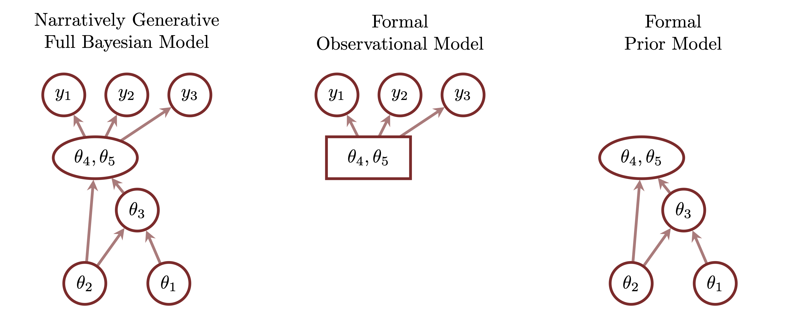
```
<br><br>
</center>


<center>
<br>
```{r, out.width = "75%", echo=FALSE}
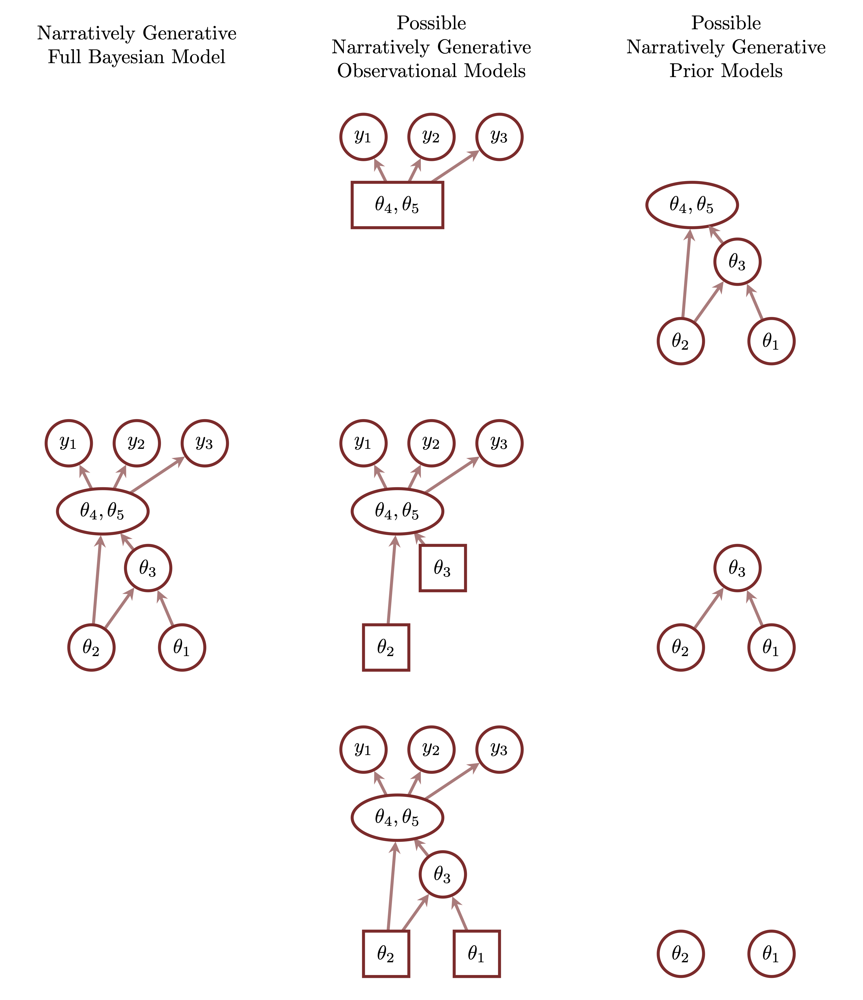
```
<br><br>
</center>

In other words the goal of prior modeling is to introduce additional domain
expertise that complements the domain expertise that has already gone into the
development of the observational model.

# Illicit Elicitation

The actualization of implicit, often qualitative, domain expertise into an
explicit, quantitative prior model is referred to as _elicitation_.  Regardless
of whether that implicit knowledge is drawn from our ourselves, our colleagues,
or even our communities more generally the challenges of this translation task
are similar.

Anytime we take the responsibility of making a principled assumption, instead of
defaulting to some conventional or otherwise unconsidered assumption, we have to
consult our domain expertise.  We elicit our domain expertise when choosing an
observational model and a prior model relevant to a given application or, more
holistically, when choosing a full Bayesian model that integrates all of our
modeling assumptions into a common probabilistic framework.

While most recognize the need for eliciting domain expertise when designing
an observational model, many find the very concept of prior elicitation
distasteful.  So much so that they often entirely reject any method that
requires the elicitation of anything resembling a prior model.  Arguments for
this distaste vary, but many reduce to the presumption that any assumptions
encoded in a prior model are more "subjective" than those encoded in an
observational model despite there being no mathematical difference.

A more fair reason why prior elicitation can appear so unpleasant is that it's
often presented as the elicitation of _all_ available domain expertise about a
given observational model, which would indeed be a massive and overwhelming
undertaking.  Formally a probability distribution over a space with an infinite
number of elements, such as the integers or the real numbers, contains an
infinite amount of information and specifying a particular prior model requires
eliciting all of that information from our domain expertise.  Moreover that
elicitation is not free; the translation of even small bits of implicit domain
expertise into explicit mathematical assumptions requires time and effort that
eat away at the finite resources available in any given analysis.  Eliciting all
of the infinitesimal details of our domain expertise is indeed completely
impractical [@Good:1983].

The same argument, however, can be made for the elicitation of the observational
model.  Designing an observational model that encapsulates every microscopic
detail of some true data generating process also requires an infinite amount of
information, most of which isn't even available within our domain expertise.  In
practice we instead aim for an observational model that captures the more
substantial, macroscopic behaviors of the assumed data generating process which
can be informed by a limited elicitation of our domain expertise.

Similarly a useful prior model does not have to incorporate all of our domain
expertise but rather just enough domain expertise to ensure well-behaved
inferences.  Because posterior inferences incorporate information from both the
realized likelihood function and the prior model, any information encoded in
both the likelihood function and the prior model is redundant.  An effective
prior model needs to elicit only information that's not already available in the
realized likelihood function.

If observed data are available then we might analyze a realized likelihood
function for the presence of any uncertainties that motivate exactly what type
of domain expertise we should elicit into a complementary prior model.  That
said we have to be very careful to use this analysis to inform only _what_
domain expertise we elicit and not the fabrication of domain expertise itself.
A prior model that exactly rectifies any pathological behavior in a realized
likelihood function but is incompatible with our actual domain expertise is not
a valid prior model.  Counterfeiting domain expertise in this way incorporates
the observed data twice, resulting in inferences that overfit to the particular
details of the observed data and poorly generalizing to other circumstances.

Often, however, we often don't have access to the observed data when developing
a prior model.  Without the observed data we can't construct the realized
likelihood function, and without that likelihood function we can't motivate
exactly what kind of information our prior model needs to capture, and hence
what kind of domain expertise to elicit.  Once we've developed an observational
model, however, we can often constrain the range of potentially problematic
behaviors that might arise in realized likelihood functions and build prior
models that can compensate for most if not all of them.  I will refer to this
approach as _defensive_ prior modeling.

By considering the consequences of the observational model we can prioritize
what kind of domain expertise that we want to incorporate into our prior model.
This drastically reduces the elicitation burden, often to the point where the
specification of the necessary assumptions becomes much more palatable.  The
remaining challenge is identifying what kinds of domain expertise are useful for
defensive prior modeling, both in one and many dimensional model configuration
spaces, and how we can integrate those partial elicitations into self-consistent
prior models.

# One-Dimensional Expertise

Eliciting enough domain expertise to inform a prior model over one, and
sometimes two, dimensional model configuration spaces is greatly facilitated by
our ability to directly visualize probability density functions.  That said even
when we can picture a prior density function we still have an infinite amount of
information to elicit.  Around which model configurations does our domain
expertise concentrate?  How strong is that concentration?  Is the concentration
symmetric around the centrality or skewed towards model configurations on one
side or another?  How quickly does the concentration decay as we move away from
the centrality?

To make this elicitation more manageable we can prioritize information that will
compensate for any poorly informative likelihood functions, in particular
diffuse likelihood functions that extend out to _extreme_ model configurations
that clash with our domain expertise.  These extreme model configurations are
not impossible but rather noticeably more inconsistent with our domain expertise
than other, more well-behaved model configurations.

In other words the goal of this defensive prior model is not to emphasize
consistent model configurations but rather to suppress extreme model
configurations in case a realized likelihood functions is too diffuse.  This
more adversarial focus often facilitates the elicitation of domain expertise,
especially the external elicitation from colleagues.  While we might be
hesitant to take responsibility for accepting certain model configurations as
reasonable, we tend to be much more decisive in rejecting model configurations
as unreasonable.  Moreover even if multiple domain experts disagree on the
which model configurations should be promoted we can often find agreement in
which model configurations should be suppressed.

Before we can suppress extreme model configurations we need to separate them out
from less extreme model configurations.  This requires the elicitation of just
enough domain expertise to identify approximate _thresholds_ between the two.
Consider, for example, a one-dimensional model configuration space that is
parameterized such that model configurations are least extreme around some
finite value but become monotonically more extreme as we move closer to positive
or negative infinity.  Here we need two thresholds, one to denote when we've
ventured too far towards positive infinity and one when we've ventured too far
towards negative infinity.

<center>
<br>
```{r, out.width = "100%", echo=FALSE}
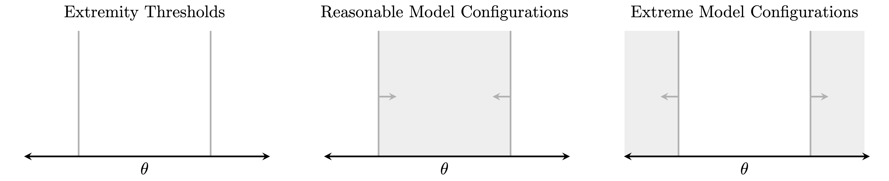
```
<br><br>
</center>

In other words these extremity thresholds determine the transition when model
configurations become so extreme that they are better approximated as infinite
by our domain expertise rather than vanishing. Model configurations below a
extremity threshold more closely resemble zero than infinity while those above
the threshold more closely resemble infinity than zero.

Another benefit of focusing no thresholds is that in practice they rarely need
to be elicited all that precisely.  The _order of magnitude_, or factor of ten,
where the model configurations transition into more extreme behavior is often
sufficient.  Conveniently the relevant orders of magnitude are often already
implicitly elicited in the units that have become conventional in a given
circumstance.  A model configuration typically quoted in grams is unlikely to
take on values as small as milligrams or as large as kilograms or else those
units that would have been taken as convention!

A _containment prior model_ concentrates prior probability within the elicited
extremity thresholds to ensure that the posterior distribution cannot extend
far past the thresholds even when a realized likelihood function does.  In order
to implement a containment prior model, however, we have to define exactly how
this containment is achieved.

## Hard Verses Soft Containment

A robust containment prior model has to work well under all three basic
interactions between the prior model and a realized likelihood function
introduced in my
[modeling and inference case study](https://betanalpha.github.io/assets/case_studies/modeling_and_inference.html#313_the_posterior_distribution).  In particular the
prior model should have a negligible influence under the contraction scenario
but offer substantial regularization under the containment and compromise
scenarios.

There are two main strategies that achieve this behavior.  _Hard containment_
immediately suppresses all model configurations outside of the extremity
thresholds, ensuring that those model configurations are excluded from the
posterior distribution no matter the behavior of the realized likelihood
function.  _Soft containment_, on the other hand, only gradually suppresses the
model configurations past the thresholds allowing, some extreme model
configurations to propagate to the posterior distribution.  To determine which
of these approaches might be more useful let's compare their influences in the
three basic inferential scenarios.

<center>
<br>
```{r, out.width = "66%", echo=FALSE}
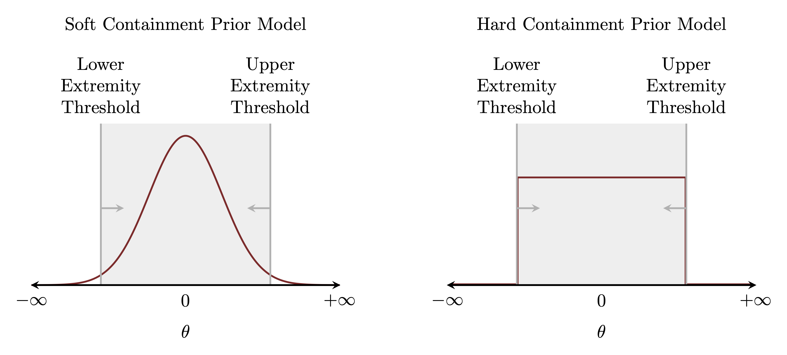
```
<br><br>
</center>

First let's assume that the realized likelihood function strongly concentrates
within the extremity thresholds so that the posterior distribution will contract
from any containment prior model.  Here both hard and soft containment prior
models offer negligible contributions to the posterior distribution.

<center>
<br>
```{r, out.width = "66%", echo=FALSE}
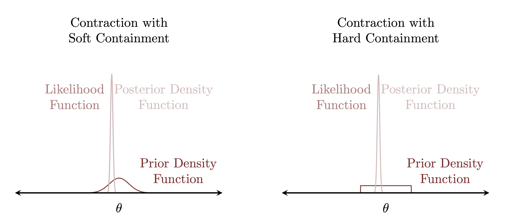
```
<br><br>
</center>

Indeed if we zoom into the neighborhood where the realized likelihood function
peaks we see that both prior modes are locally well-approximated by a uniform
prior model.

<center>
<br>
```{r, out.width = "66%", echo=FALSE}
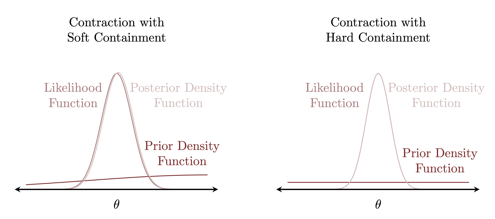
```
<br><br>
</center>

What happens when the realized likelihood function is only weakly informative
and spreads past the extremity thresholds?  In this case both prior models
contain the posterior distribution away from the extreme model configurations.
The hard containment model prevents any model configurations past the thresholds
from propagating to the posterior distribution while the soft containment model
allows for some leakage.

<center>
<br>
```{r, out.width = "66%", echo=FALSE}
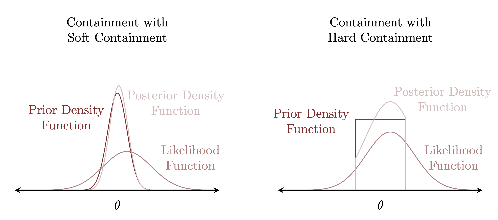
```
<br><br>
</center>

Finally let's consider when the realized likelihood function concentrates
strongly _outside_ of the extremity thresholds, as might happen if we poorly
elicited the thresholds from our domain expertise.  The conflict between the
assumed prior model and the likelihood function here requires that the posterior
distribution compromises between the two, but the nature of the compromise
depends on the type of containment.

<center>
<br>
```{r, out.width = "66%", echo=FALSE}
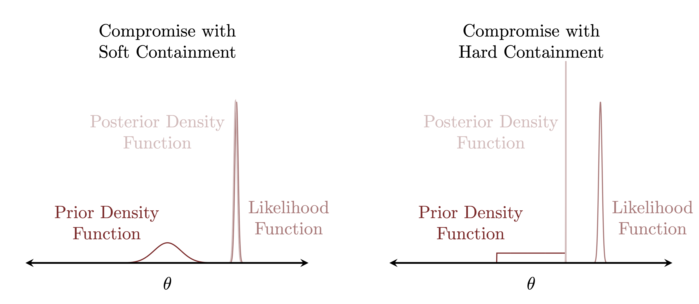
```
<br><br>
</center>

A hard containment model doesn't allow for any compromise outside of the assumed
extremity thresholds, and the posterior distribution ends up concentrating up
against the hard boundaries.  The resulting awkward posterior density function
is often problematic to accurately quantify computationally.  Soft containment,
however, allows for a more reasonable compromise where the posterior
distribution can escape past the extreme thresholds towards the model
configurations more consistent with the observed data.

Which of these behaviors is more useful depends on how much we trust our
elicitation of the extremity thresholds.  If we are completely confident in our
elicitation then the compromise situation will either never arise or arise only
due to irrelevant fluctuations in the observed data, in which case the hard
containment ensures the best possible inferences.  When we are less confident,
however, the tension between the assumed prior model and the realized likelihood
function is critical feedback that the thresholds may have been poorly elicited.
In this case the greater compromise allowed by the soft containment approach
allows not only for better inferences but also empirical diagnostics of the
tension.

Because diagnostics of problematic modeling assumptions are so powerful I find
that soft containment prior models are much more robust in practice than hard
containment models and I strongly recommend their use.  Our remaining challenge
is specifying exactly how soft the containment should be.

## Soft, Softer, or Softest?

Qualitatively the probability density function that defines a one-dimensional
soft containment prior model should be approximately uniform between the
extremity thresholds before rapidly decaying past those thresholds.  In order to
specify a quantitative prior model, however, we have to define exactly how much
prior probability leaks past the thresholds and then exactly how quickly that
excess probability decays.

The more prior probability contained within the extremity thresholds the more
strongly the reasonable model configurations within those thresholds will
influence any resulting posterior distribution; the more prior probability that
leaks beyond the thresholds the easier it will be for a resulting posterior
distribution to escape beyond the extremity thresholds if needed.  In that sense
this balance of probability captures our faith in the elicitation of the
extremity thresholds themselves.

In practice I have found that isolating $1\%$ of the prior probability beyond
each threshold works well.  For example if we are trying to enforce containment
between a lower and upper threshold then we would tune our prior model so that
$1\%$ of the prior probability is below the lower threshold, $1\%$ is above the
upper threshold, and $98\%$ is contained between the two.

<center>
<br>
```{r, out.width = "50%", echo=FALSE}
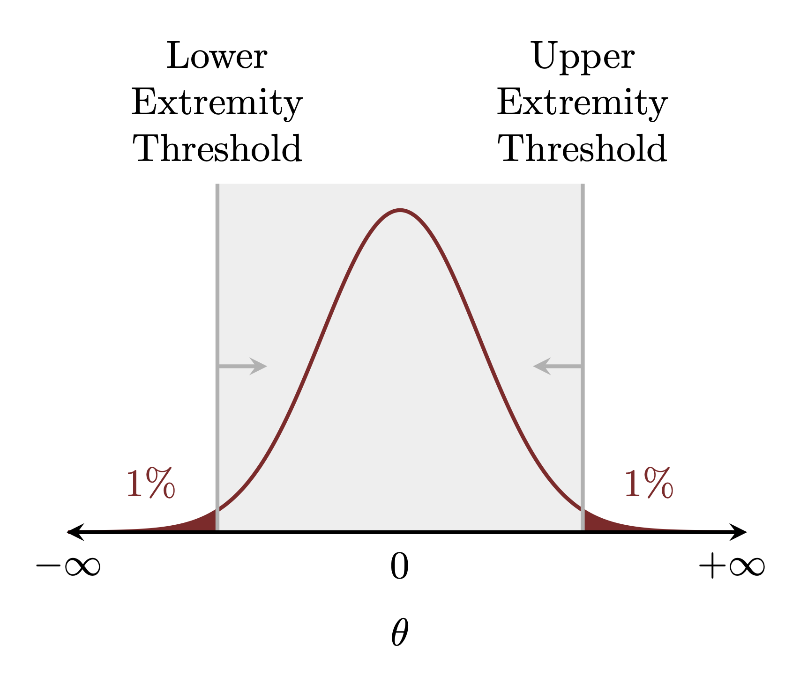
```
<br><br>
</center>

Acknowledging how approximately we might elicit those thresholds, however, we
shouldn't be too precious about that exact probability.  Anything between
$0.2\%$ and $5\%$, and in many cases even between $0.1\%$ and $10\%$ will likely
achieve qualitatively similar containment.

To completely specify our soft containment prior model we need to define how
the prior probability that leaks past the extremity thresholds is distributed.
In other words we need to define the behavior of the _tails_ of the prior
density function.  Lighter tailed probability density functions decay more
quickly, concentrating the leaked probability closer to the extremity
thresholds, while heavier tailed probability density functions decay more
slowly, allowing the leaked probability to spread out to more extreme model
configurations and weakening the effective containment of the prior model.

Consider for example a prior model specified by a normal density function with
moderate tails and one specified by a Cauchy density function with extremely
heavy tails, each tuned so that $1\%$ of the prior probability is allocated
below the lower threshold and above the upper threshold.  The Cauchy density
function spikes too strongly in the middle to see the tails but if we zoom in
on the upper tails we can see how much more slowly the Cauchy tails decay,
extending to orders of magnitude larger model configurations.

<center>
<br>
```{r, out.width = "75%", echo=FALSE}
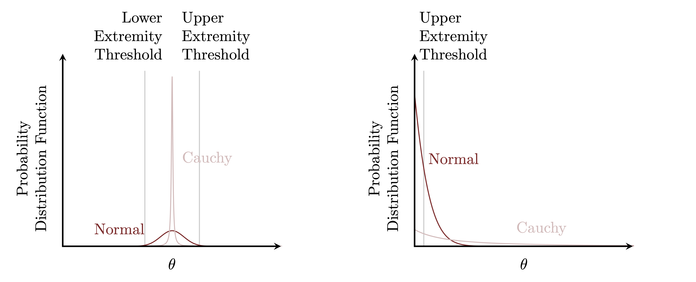
```
<br><br>
</center>

We can also see this in the corresponding cumulative distribution functions.
Because the tail probabilities match, the normal and Cauchy cumulative
distribution functions meet at the extremity thresholds.  Beyond those
thresholds, however, the Cauchy cumulative distribution function moves towards
$0$ and $1$ much more slowly than the normal cumulative distribution function.

<center>
<br>
```{r, out.width = "50%", echo=FALSE}
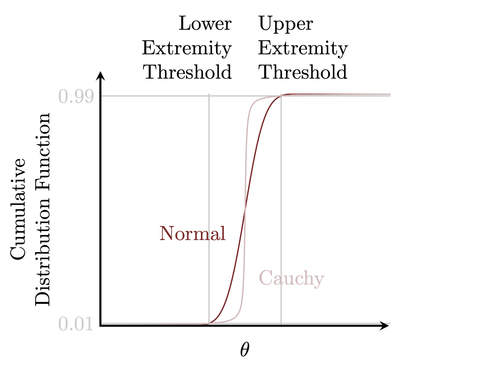
```
<br><br>
</center>

To build intuition about the different containment behavior these two prior
models induce let's consider the three basic prior-likelihood interactions
that we considered above with both normal and Cauchy prior density functions
that have been tuned to achieve the same tail probabilities.

If the realized likelihood function strongly concentrates anywhere within the
extremity thresholds then any differences in the different tails shapes are
irrelevant.  Regardless of the precise shape of the tails the prior model is
locally uniform around the peak of the likelihood function and the contraction
to the posterior distribution is the almost exactly the same.

<center>
<br>
```{r, out.width = "66%", echo=FALSE}
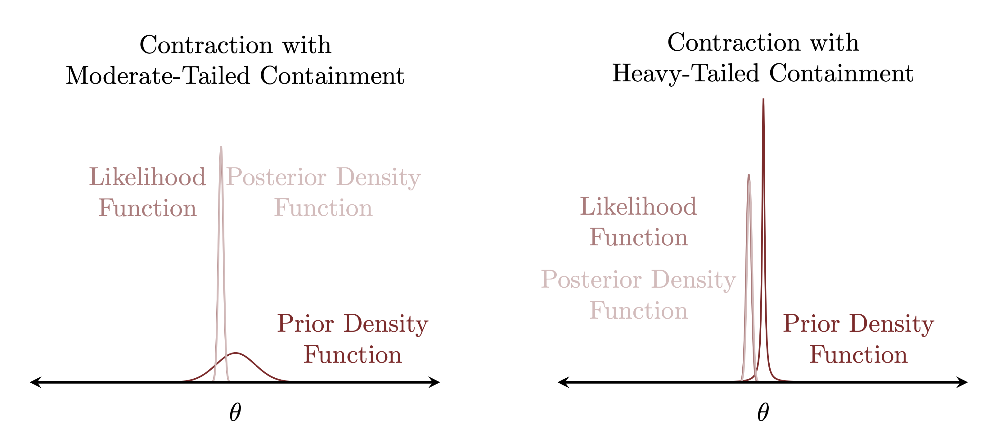
```
<br><br>
</center>

We start to see substantial differences when the realized likelihood function
is much less informative and widens past the extremity thresholds.  While both
prior models suppress extreme model configurations past the thresholds the
heavier-tailed Cauchy model allows much more extreme values to propagate to the
posterior distribution.  If evaluating the likelihood function at these extreme
model configurations is expensive or even inaccurate then this leakage can
frustrate the exploration of that posterior distribution.

<center>
<br>
```{r, out.width = "66%", echo=FALSE}
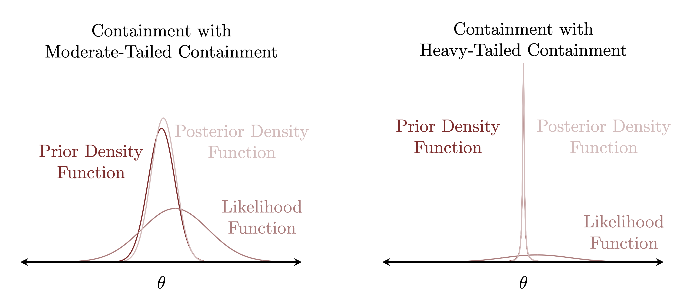
```
<br><br>
</center>

Again the full breadth of this posterior leakage can be hard to see when
plotting the peak.  If we zoom into the upper tail we can see just how much more
slowly the posterior distribution derived from the Cauchy prior model decays
relative to the posterior distribution derived from the normal prior model.

<center>
<br>
```{r, out.width = "33%", echo=FALSE}
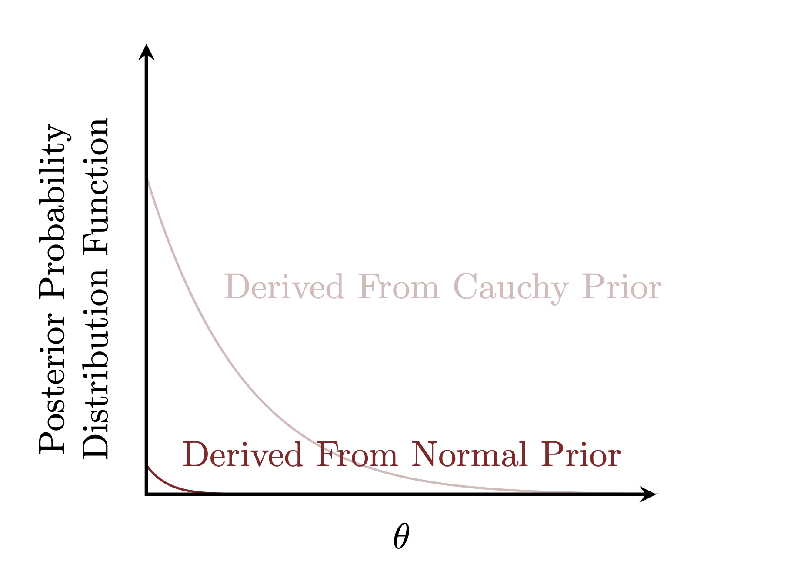
```
<br><br>
</center>

The biggest difference in containment behavior, however, happens when the
realized likelihood function strongly concentrates outside of the extremity
thresholds.  Heavier tails allow the realized likelihood function to more
strongly dominate the compromise with the Cauchy prior model, and the
corresponding posterior distribution is able to escape deep into the tails.  The
more moderate tails of the normal prior model, however, maintains a more
balanced compromise that keeps the posterior distributions closer to the
threshold.

<center>
<br>
```{r, out.width = "66%", echo=FALSE}
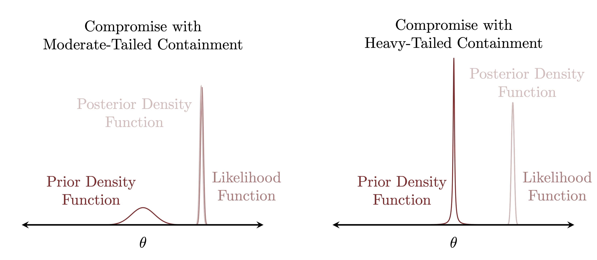
```
<br><br>
</center>

Ultimately the more heavily-tailed containment behavior is more beneficial when
the thresholds have been elicited poorly and the moderately-tailed containment
behavior is more beneficial when the thresholds have been elicited well.  Which
soft containment prior model is then more useful in practical analyses?

While the accuracy of the extremity thresholds should not be taken for granted,
I find that the posterior distributions derived from heavier-tailed containment
prior models too often extend out to extreme model configurations where
evaluations of the likelihood function are prone to excessive computational cost
if not numerical instabilities that limit the accurately the evaluation.  By
suppressing these computationally problematic model configurations, more
moderately-tailed containment prior models result in posterior distributions
that are easier to explore computationally.

At the same time if we encounter conflict between the realized likelihood
function and the soft containment prior model, then we can't immediately presume
that problems necessarily lie in the extremity thresholds and not the realized
likelihood function.  Instead of defaulting to the realized likelihood function
with heavier-tailed containment prior models I would rather pause to investigate
how the observed data are interacting with all of the modeling assumptions,
including those in not just the prior model but also the observational model.
Moderately-tailed containment prior models allow enough compromise that the
resulting posterior distribution will still pull away from the prior model and
allow us to empirically identify any conflicting behavior by comparing the two.
In other words a normal prior model allows for more graceful failures.

For these reasons a more moderately-tailed containment prior model, such as one
specified by a normal density function, is my default containment prior
model in one-dimension.

## Recipe For (Avoiding) Disaster

Once we've embraced soft containment with moderately-heavy tails we can put
together a basic workflow for building one-dimensional containment prior models.

### Step One: Parameterize Model Configuration Space Appropriately {-}

In order to prepare our model for containment we need to parameterize the model
configuration space such that reasonable model configurations are centered at
zero, or some other meaningful, finite value, with behavior becoming more and
more extreme as we move closer to infinity.  This step is crucial, but easy to
take for granted.  It's also shared with other prior modeling approaches like
penalized complexity priors [@SimpsonEtAl:2017].

Often such a parameterization is natural, for example when modeling a phenomenon
whose influences vanishes when a parameter approaches zero.  Sometimes, however,
the needed parameterization is less obvious.  Consider, for example, a negative
binomial observational model with fixed location but unknown concentration
parameter,
$$
\pi(y \mid \phi) = \text{neg-binomial}(y ; 1, \phi).
$$
As the concentration parameter $\phi$ approaches positive infinity the
observational model begins to resemble a simpler Poisson observational model,
while smaller value yield stronger variations.

In order for a prior model to suppress these stronger variations it has to
concentrate around positive infinity in this parameterization!  Implementing a
containment prior model is much more natural if we consider instead a dispersion
parameterization
$$
\psi = \frac{1}{\phi}
$$
that reduces to the simpler Poisson model when $\psi$ approaches zero.

### Step Two: Define Containment Region {-}

Next we have to specify the region in which we want to contain our inferences.

For a one-dimensional model configuration space that spans the entire real line
the minimal containment for a well-defined prior model must suppress both
negative and positive infinity, which requires two extremity thresholds.

<center>
<br>
```{r, out.width = "33%", echo=FALSE}
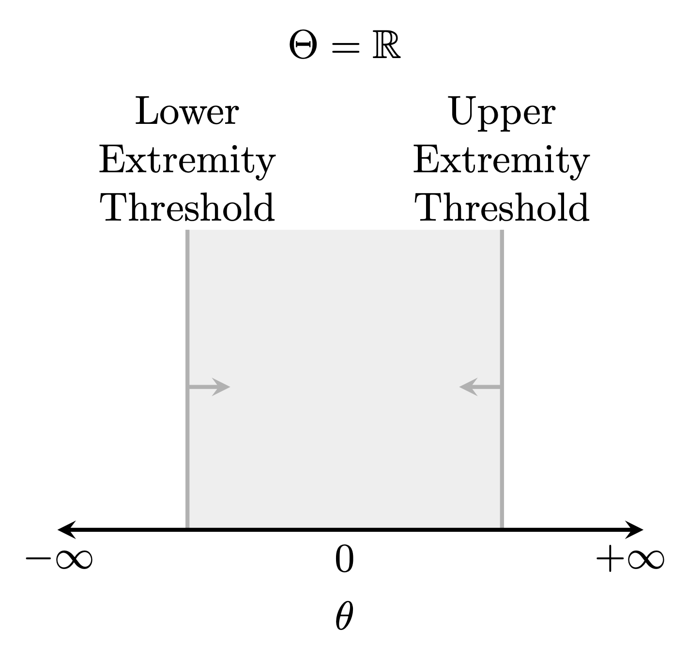
```
<br><br>
</center>

When working with a one-dimensional model configuration space constrained to
only positive values we have two options.  Firstly we can contain our inferences
around the boundary at zero, in which case we only need one threshold to
suppress positive infinity.  Alternatively we may want to contain our inferences
away from both infinity and zero, which then requires two thresholds.

<center>
<br>
```{r, out.width = "66%", echo=FALSE}
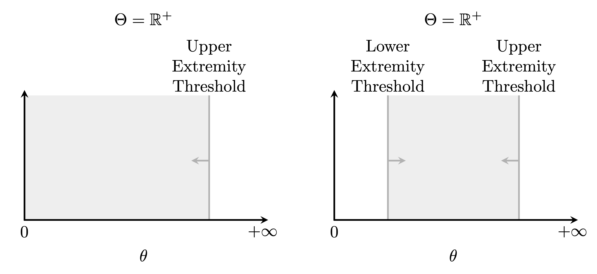
```
<br><br>
</center>

Finally if the one-dimensional model configuration space is confined to a finite
interval then we have four possible containment configurations.  If we want to
contain our inferences around the lower or upper boundary then we need only one
threshold, but if we want to contain our inferences away from both boundaries
then we need two thresholds.  In this case we can also consider a prior model
that doesn't favor either the boundaries or the middle in which case we wouldn't
need any thresholds.

<center>
<br>
```{r, out.width = "66%", echo=FALSE}
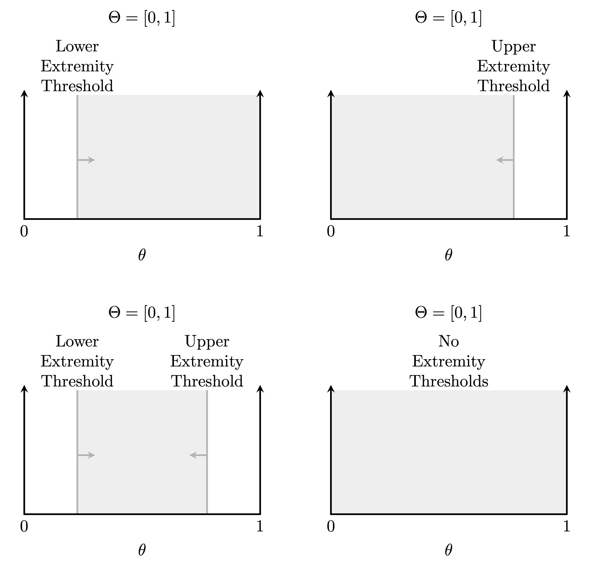
```
<br><br>
</center>

### Step Three: Elicit Thresholds {-}

Once we know how many extremity thresholds we need we can move on to eliciting
values for those thresholds from our available domain expertise.

As we discussed above, any units that have become conventional often conceal
domain expertise that is naturally applicable to setting extremity thresholds.
In particular we might set the thresholds a few orders of magnitude below or
above the conventional scales as needed.  For example if a parameter modeling
a distance is typically referred to in micrometers then we might set a
relatively conservative upper extremity threshold to millimeters.

Another useful approach is to appeal to our, or our colleagues', inherent
propensity to disparage.  Starting at a reasonable model configuration we can
scan up to more and more extreme values until we start to become uncomfortable.
Once we've transitioned from "I mean it's possible" to "oh, no, that's
ridiculous" we know we've passed a meaningful threshold.

If we're willing and able to elicit more precise domain expertise then we can
inform less conservative thresholds, and construct more informative containment
prior models.

### Step Four: Specify Prior Density Function

To complete the soft containment prior model we need to select a family of
probability density functions with the right tail behaviors and then identify
a member of that family consistent with the given thresholds.

For unconstrained model configuration spaces that span the entire real line I
prefer working with the moderately-heavy tails of the normal family of
probability density functions, $\text{normal}(\theta; \mu, \tau)$.  If the lower
and upper thresholds are symmetric around zero, $\xi_{l} = - \xi_{u} = \xi$,
then the compatible normal density functions will feature a location parameter
of zero, $\text{normal}(\theta; 0, \tau)$.  To achieve exactly $1\%$ prior
probability past the thresholds we can then set the scale parameter to
$$
\tau \approx \frac{\xi}{2.32}.
$$
In practice, however, any value between 2 and 3 will achieve qualitatively
similar containment.

<center>
<br>
```{r, out.width = "33%", echo=FALSE}
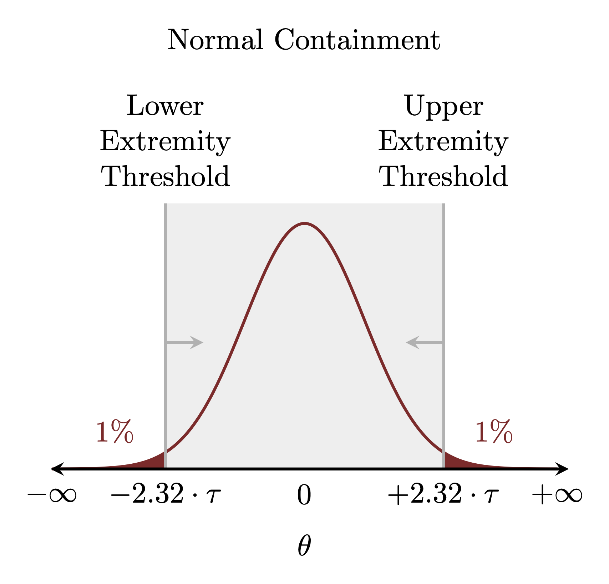
```
<br><br>
</center>

Without this symmetry, tuning the location and scale parameters is more
complicated.  We can often identify them numerically, however, using root
finders and other algebraic solvers.

For positively-constrained model configuration spaces my recommended family
depends on the desired containment.  When we want to suppress only positive
infinity I prefer the half-normal family of probability density functions that
peak at zero and monotonically decay towards infinity.

<center>
<br>
```{r, out.width = "33%", echo=FALSE}
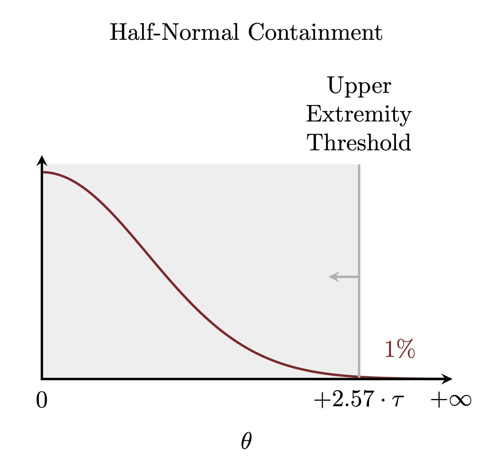
```
<br><br>
</center>

In this case we achieve exactly $1\%$ prior probability above the upper
threshold $\xi$ by setting the scale of the half-normal family to
$$
\tau \approx \frac{\xi}{2.57},
$$
although once again in practice any value between 2 and 3 will give similar
results.

Suppressing both zero and positive infinity is more challenging, and my
recommendation depends on which boundary we want to suppress more strongly.
The gamma family of probability density functions provides the flexibility to
suppress both zero and positive infinity, but the suppression is asymmetric and
is more severe for larger values.  In other words the containment is weaker
towards zero than towards positive infinity.  Conversely the inverse gamma
family of probability density functions suppresses zero more strongly than
positive infinity, inducing stronger containment towards zero than positive
infinity.  In either case to identify an element of these families that
matches given thresholds we usually have to appeal to numerical methods.

<center>
<br>
```{r, out.width = "66%", echo=FALSE}
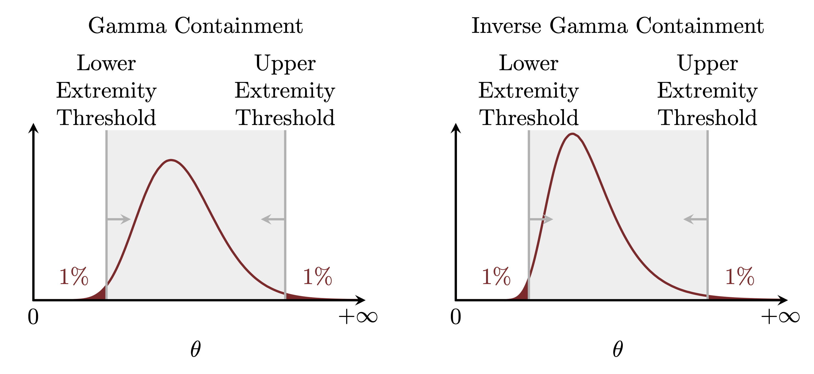
```
<br><br>
</center>

There are more sophisticated families of probability density functions that can
achieve more symmetric containment -- in particular the generalized inverse
gaussian family -- but these can be more difficult to work with in practice and
are less commonly implemented in statistical software packages.

Finally the scaled beta family of probability density functions provides enough
flexibility to implement all of the possible containment behaviors for
interval-constrained model configuration spaces.  This family provides elements
that concentrate at the lower boundary, the upper boundary, and in between, as
well as more uniform distributions.  Once again we can readily identify these
elements using numerical methods.

<center>
<br>
```{r, out.width = "66%", echo=FALSE}
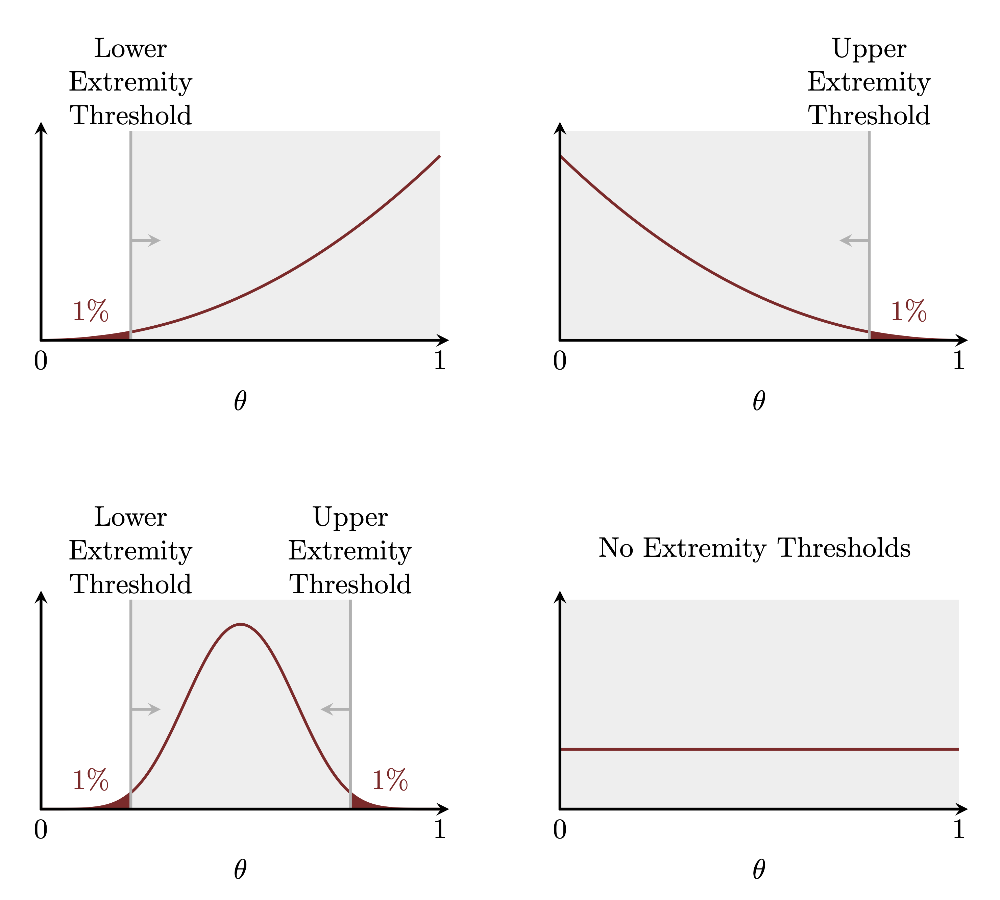
```
<br><br>
</center>

### Step Five: Verify Containment {-}

The final step in implementing a soft containment prior model is to see how it
interacts with a realized likelihood function.  If the posterior distribution
contracts within the extremity thresholds or is contained within them then we
can proceed knowing that the prior model has behaved as desired.  On the other
hand if we see the posterior distribution concentrate outside of the thresholds
then we know that the realized likelihood function conflicted with the
containment prior model.  In this case we should stop to investigate, and
hopefully resolve, the source of this disagreement.

# Multi-Dimensional Expertise

While soft containment provides a relatively general strategy for prior modeling
in one-dimension model configuration spaces, developing useful prior models for
higher-dimensional model configurations spaces is much more challenging.
Perhaps most frustrating is that we can no longer can we directly visualize the
full prior model, and all of its consequences, through its probability density
function.  At the same time the counterintuitive behavior of higher dimensional
spaces can frustrate the elicitation of useful domain expertise in those spaces.

In order to make this challenge more manageable we need to find ways to reduce
the elicitation to lower-dimensional spaces that we might actually be able to
comprehend.  Fortunately we have at least two approaches that can be useful in
practice.

## A Probabilistic Jigsaw Puzzle

Objects in high-dimensional spaces can encompass an overwhelming quantity of
complex and interacting properties that we have no ability to comprehend
directly.  Sometimes, however, we can isolate a smaller, more manageable set of
these properties in a _projection_ from the full, high-dimensional space to a
low-dimensional space such as the real line.  Although understanding this
condensed behavior doesn't allow us to understand the entirety of the original
high-dimensional object, it does provides useful information that we might be
able to use to construct a useful facsimile of that object.

Consider for example this three-dimensional object with no obviously
interpretable structure.

<center>
<br>
```{r, out.width = "50%", echo=FALSE}
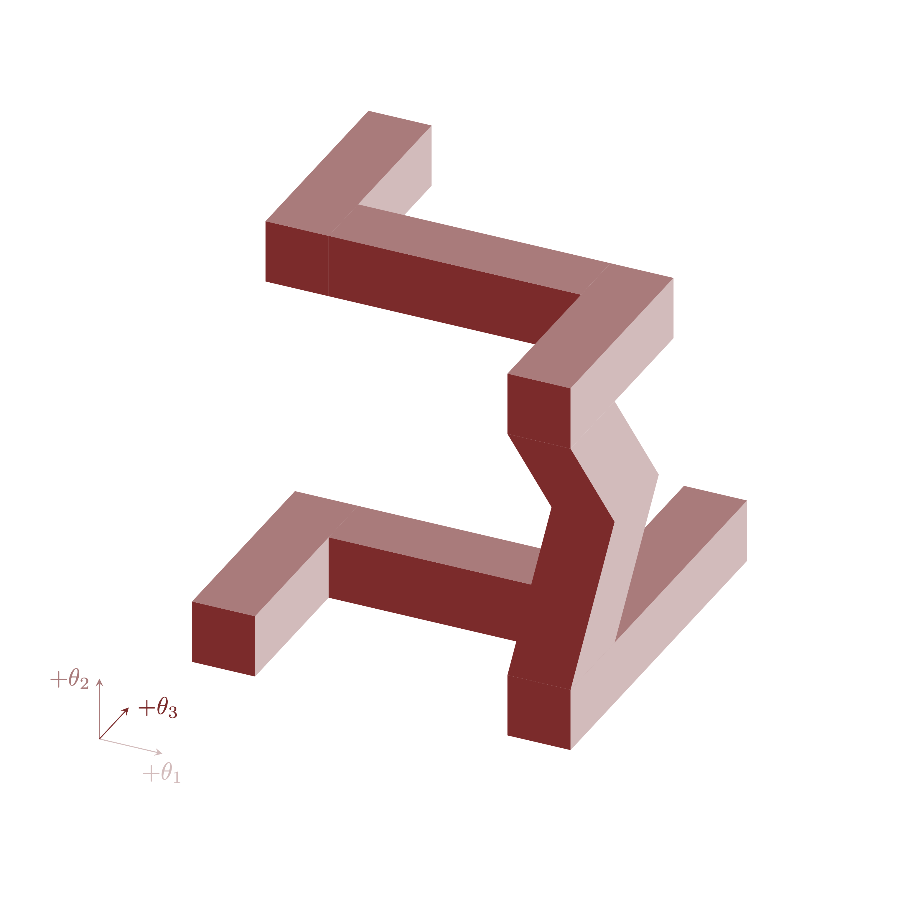
```
<br><br>
</center>

When projecting it along the three perpendicular axes, however, some
lower-dimensional and much more interpretable behavior emerges.

<center>
<br>
```{r, out.width = "100%", echo=FALSE}
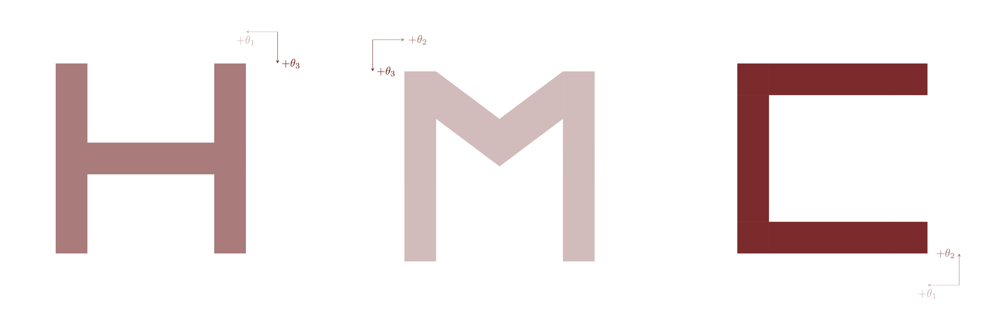
```
<br><br>
</center>

This process of analyzing a high-dimensional object through various projections
is not unlike a carpenter checking how straight a piece of wood is.  Instead of
trying to infer straightness from a view of the entire object they hold the
piece in different orientations to focus on each dimension one at a time.

By pushing forward a prior model through various summary functions that project
to low dimensional spaces we isolate low dimensional probability distributions
that might capture interpretable behaviors that we can contrast to our domain
expertise.  Well-chosen summary functions can help inform both the development
of an initial prior model and the analysis of the consequences of that prior
model for any surprising behavior.  That said weaving together a consistent
prior model from summaries is not trivial.

### Projection Booth

Before we can start eliciting domain expertise we need to define summaries
functions that project from the high-dimensional model configuration space to
lower-dimensional subspaces and isolate interpretable behavior so that we can
study the consequences of the prior model that manifest in that context.
Summary functions are often motivated by mathematical convenience; for example
when the model configuration space is a product space then the component
functions, also sometimes referred to as coordinate or parameter functions, are
natural choices.  Summaries can also be motivated by the structure of the full
Bayesian model, for example projections to intermediate variables in a
narratively generative model.

<center>
<br>
```{r, out.width = "50%", echo=FALSE}
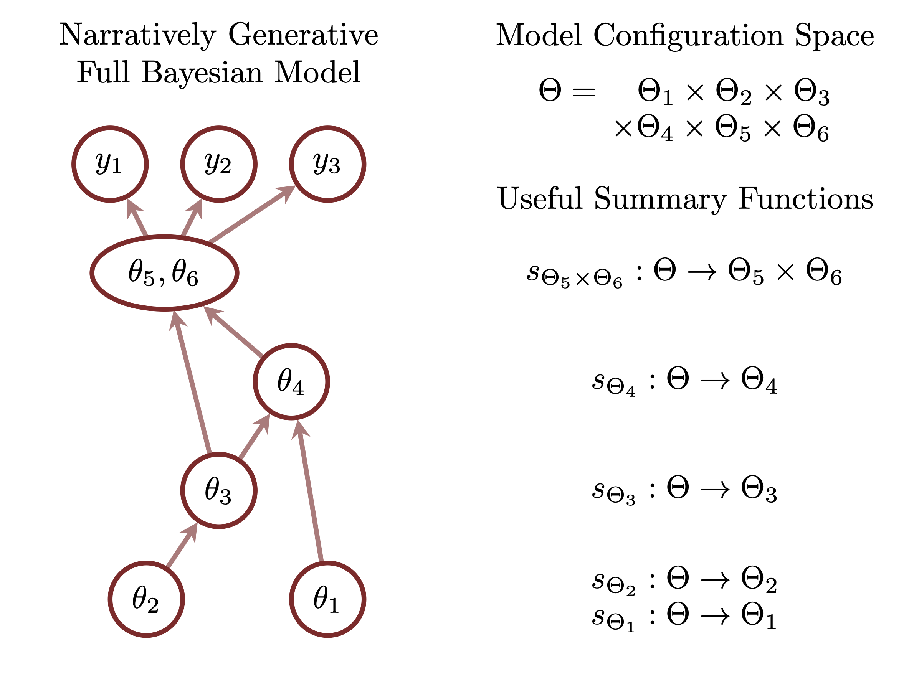
```
<br><br>
</center>

Given a summary function
$$
\begin{alignat*}{6}
s :\; &\Theta& &\rightarrow& \; &\Gamma&
\\
&\theta& &\mapsto& &\gamma = s(\theta)&
\end{alignat*}
$$
we can push forward the prior model $\pi$ to the output space, $\Gamma$.  The
resulting pushforward distribution $s_{*} \pi$ then quantifies the consequences
of the prior model that manifest in that particular context.  Formally the
pushforward prior density function is given by
$$
s_{*} \pi(\gamma)
= \int \mathrm{d} \theta \, \pi(\theta) \, \mathbb{I} [ s(\theta) = \gamma]
= \int_{s^{-1}(\gamma)} \mathrm{d} \theta \, \pi(\theta),
$$
although rarely will we be able to evaluate those integrals in closed form.

When $\Gamma$ is interpretable we can elicit which of the values in the output
space identify behaviors compatible, or incompatible, with our domain expertise.
For example we might use the containment prior modeling approach that we devised
above to determine the pushforward behavior that appropriately suppresses
extreme output values.

This elicitation then constrains the possible prior models to those
with compatible pushforward etiquette.  The more summary functions we consider,
and the more domain expertise we can elicit about the desired summary behavior,
the more we constrain the full prior model.

### Convolution Restitution

Sometimes our domain expertise most directly informs consequences in not the
model configuration space but rather the observational space.  In particular
behavior of hypothetical observations is often more relevant to experts who are
familiar with certain types of experiments but not the mathematical models of
those experiments.

Unfortunately summary functions from the model configuration space cannot
isolate these consequences.  In order to propagate our prior modeling
assumptions to the observational space we need to examine the prior model
through the lens of the observational model; more formally we need to convolve
our prior model against the observational model to form the prior predictive
distribution,
$$
\pi(y)
= \int \mathrm{d} \theta \, \pi(y \mid \theta) \, \pi(\theta)
= \int \mathrm{d} \theta \, \pi(y, \theta).
$$
_Summary statistics_ on the observational space,
$$
\begin{alignat*}{6}
\hat{s} :\; &Y& &\rightarrow& \; &G&
\\
&y& &\mapsto& &g = \hat{s}(y)&,
\end{alignat*}
$$
can then be used to analyze the various consequences of the prior model in that
observable context.

Analysis of the pushforward consequences of both the prior model and the
corresponding prior predictive distribution can also be unified into a single
framework by considering pushforwards of the full Bayesian model,
$$
\pi(y, \theta) = \pi(y | \theta) \, \pi(\theta).
$$

For example a summary function on the model configuration space
$s : \Theta \rightarrow \Gamma$ lifts to a summary function on the total space,
$$
s : Y \times \Theta \rightarrow \Gamma \subset \Theta,
$$
that is independent of the observational space,
$$
s(y, \theta) = s(\theta).
$$
The pushforward of the full Bayesian model along this lifted function reduces to
the pushforward of the prior model,
$$
\begin{align*}
s_{*} \pi(\gamma)
&= \int \mathrm{d} y \, \mathrm{d} \theta \,
\pi(y, \theta) \, \mathbb{I} [ s(y, \theta) = \gamma]
\\
&= \int \mathrm{d} y \, \mathrm{d} \theta \,
\pi(y, \theta) \, \mathbb{I} [ s(\theta) = \gamma]
\\
&= \int \mathrm{d} \theta
\left( \int \mathrm{d} y \, \pi(y, \theta) \right)
\mathbb{I} [ s(\theta) = \gamma]
\\
&= \int \mathrm{d} \theta \,
\pi(\theta) \, \mathbb{I} [ s(\theta) = \gamma].
\end{align*}
$$
Consequently any domain expertise we elicit on the output behavior of these
summary functions provides the same modeling constraints whether we consider the
prior model or the full Bayesian model.

Similarly a summary statistic on the observational space
$\hat{s} : Y \rightarrow G$ lifts to a summary statistic on the total space,
$$
\hat{s} : Y \times \Theta \rightarrow G
$$
that doesn't depend on the model configuration space at all,
$$
\hat{s}(y, \theta) = \hat{s}(y).
$$
Pushing forward the full Bayesian model along this lifted statistic yields the
same pushforward distribution as the corresponding pushforward of the prior
predictive distribution,
$$
\begin{align*}
\hat{s}_{*} \pi(g)
&= \int \mathrm{d} y \, \mathrm{d} \theta \,
\pi(y, \theta) \, \mathbb{I} [ \hat{s}(y, \theta) = g]
\\
&= \int \mathrm{d} y \, \mathrm{d} \theta \,
\pi(y, \theta) \, \mathbb{I} [ \hat{s}(y) = g]
\\
&= \int \mathrm{d} y
\left( \int \mathrm{d} \theta \, \pi(y, \theta) \right)
\mathbb{I} [ \hat{s}(y) = g]
\\
&= \int \mathrm{d} y \, \pi(y) \, \mathbb{I} [ \hat{s}(y) = g].
\end{align*}
$$
Once again any domain expertise we elicit on the output behavior of the these
summary statistics provides the same constraints whether we start with the prior
predictive distribution or the full Bayesian model.

The full Bayesian model perspective also allows us to consider more general
summary functions that depend on both the model configuration space and the
observational space at the same time, but the resulting output spaces are rarely
if ever interpretable and we will not consider them further here.

Perhaps the most useful benefit of investigating the consequences of the full
Bayesian model, and not the prior model or the corresponding prior predictive
distribution, is that it side steps the subtle interpretational issues of what
a prior model actually is that we encountered in [Section 1](#sec:mire).  By
working with the full Bayesian model we don't need to separate out our
assumptions into an explicit observational model and prior model but rather
consider the consequences of _all_ of our modeling assumptions at the same time.

### Marginal Utility

While domain expertise elicited about the pushforward behavior along various
summary functions and summary statistics constrains a compatible prior model, it
will not always define an explicit prior model.  In general an infinite number
of prior models over the full model configuration space will satisfy the desired
pushforward behaviors.  At the same time we may not be able to actually find any
of them in practice.

There is one circumstance where pushforward constraints will identify a unique
prior model.  Let the model configuration space be a product space,
$$
\Theta = \Theta_{1} \times \ldots \times \Theta_{N},
$$
with the component functions
$$
\varpi_{n} : \Theta \rightarrow \Theta_{n}.
$$
If can elicit marginal prior models for each component space,
$\pi_{n}(\theta_{n})$, then we can construct an _independent prior model_ from
the corresponding independent product distribution
$$
\pi(\theta_{1}, \ldots, \theta_{N})
=
\prod_{n = 1}^{N} \pi_{n}(\theta_{n}),
$$
that will, by construction, always be compatible with the the marginal
distributions,
$$
(\varpi_{n})_{*} \pi(\theta_{n}) = \pi(\theta_{n}).
$$

For example in two-dimensional dimensions eliciting marginal containment prior
models for each component space allows us to construct an independent prior
model that contains posterior inferences over the entire model configuration
space.

<center>
<br>
```{r, out.width = "100%", echo=FALSE}
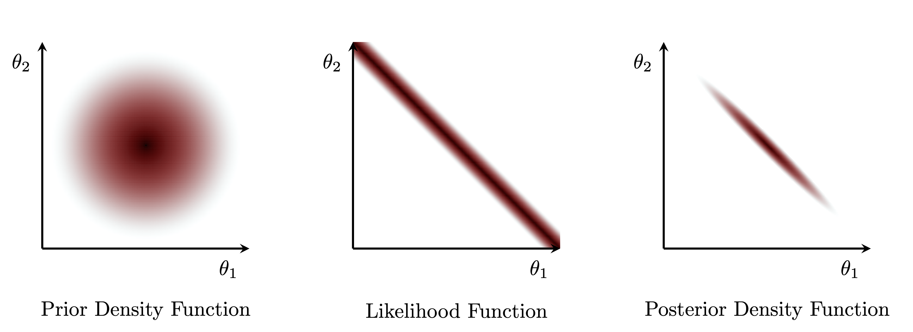
```
<br><br>
</center>

If the model configurations space is $N$ dimensional and we have $N$ relevant,
one-dimensional summary functions that are not component functions then we can't
construct an independent prior model in the same way.  Sometimes, however, we
can reparameterize the model configuration space such that the summary functions
become component functions.  Formally we need to find a one-to-one
transformation from the initial parameters in the model configuration space to
the parameters of combined summary spaces.

Consider for example the two dimensional model configuration space
$\Theta = \Theta_{1} \times \Theta_{2}$ with parameters
$(\theta_{1}, \theta_{2})$.  If we can elicit information on $\theta_{1}$ and
$\theta_{2}$ directly then we can construct an independent prior model, but if
our domain expertise more clearly manifests in output space of the functions
$$
\begin{align*}
s_{1}(\theta_{1}, \theta_{2}) &= \theta_{1} + \theta_{2}
\\
s_{2}(\theta_{1}, \theta_{2}) &= \theta_{1} - \theta_{2}
\end{align*}
$$
then constructing a compatible prior model is not quite so straightforward.
Rotating the model configuration space,
$$
\begin{align*}
\eta_{1} &= \theta_{1} + \theta_{2}
\\
\eta_{2} &= \theta_{1} - \theta_{2}
\end{align*}
$$
however, aligns these function outputs with the new component functions,
allowing us to build an independent prior model within this new
parameterization.  If convenient we can then transform this independent prior
model back to a correlated prior model in the original parameterization.

The independent prior model isn't the only prior model compatible with the
marginal constraints, but it is the only compatible prior model that does not
introduce any additional assumptions beyond the marginal constraints.  In other
words the independent prior model is the least informative, and hence most
conservative, prior model compatible with the desired marginal behaviors.

At the same time utilizing an independent prior model in practice doesn't
necessarily mean that we don't have additional domain expertise that manifests
in the scope of other summary functions or statistics.  Rather it means that we
have not spent the time to elicit or incorporate those potential pushforward
constraints into our prior model.  When those pushforward constraints don't
strongly influence our final inferences then this can be a reasonable
assumption.  If critical information manifests in only those unincorporated
summaries, however, then our inferences will suffer from the use of the
independent prior model.

Unfortunately incorporating additional pushforward constraints beyond the
marginal distributions is much easier said than done.

### Inconsistent Incorporation {#sec:naive_product}

One of the challenges with eliciting pushforward behavior is that there's no
unique way to map those assumptions back to the model configuration space.
Because the summary functions lose information there's no way to pull back a
pushforward distribution to a probability distribution over the full model
configuration space or, equivalently, pull back a pushforward density function
to a probability density function over the full model configuration space.

In particular if $\pi(\gamma)$ is an elicited model for the outputs of the
summary function $s : \Theta \rightarrow \Gamma$ then the function
$$
\rho(\theta) = \pi(s(\theta))
$$
does _not_ define a compatible probabilistic model on the input space.  Why?
Well if we push forward that model along the summary function then we don't, in
general, recover the desired pushforward behavior,
$$
s_{*} \rho(\gamma) \ne \pi(\gamma)!
$$

Another challenge is that in general there's no straightforward way to fuse
together information elicited from multiple summary functions.  Consider for
example multiple summary functions $s_{n} : \Theta \rightarrow \Gamma_{n}$ and
pushforward models $\pi_{n}(\gamma_{n})$ that have been elicited for the
summary values.  The only model that we can build on the joint summary space
$\Gamma = \Gamma_{1} \times \ldots \times \Gamma_{N}$ without introducing any
other assumptions is an independent product model,
$$
\pi(\gamma_{1}, \ldots, \gamma_{N}) = \prod_{n = 1}^{N} \pi_{n} (\gamma_{n}).
$$
Unless the summary functions are carefully constructed to rely on unrelated
properties of the prior model, however, the assumption of independence is
suspect.  Moreover, unless we can construct a one-to-one map from $\Gamma$ into
$\Theta$ this model on the joint summary space won't uniquely define a prior
model on the model configuration space.

Occasionally both of these mistakes are made with the naive product prior model
$$
\rho(\theta) = \prod_{n = 1}^{N} \pi_{n} (s_{n}(\theta)).
$$
Multiplying the naive density functions $\pi_{n} (s_{n}(\theta))$ together
rapidly suppresses huge parts of the model configuration space; the only model
configurations that survive are those at the narrow _intersection_ that
compromises between the peaks of all of the component functions.  In particular
each of the pushforwards distributions of this naive prior model end up much
narrower that what we had originally elicited.

Consider for example a two-dimensional model configuration space
$\Theta = \Theta_{1} \times \Theta_{2}$ with three summary functions: the two
component functions
$$
\begin{align*}
\varpi_{1} &: \Theta \rightarrow \Theta_{1}
\\
\varpi_{2} &: \Theta \rightarrow \Theta_{2},
\end{align*}
$$
and a summation function
$$
\begin{alignat*}{6}
s :\; &\Theta& &\rightarrow& \; &\Gamma&
\\
&(\theta_{1}, \theta_{2})& &\mapsto& &\gamma = \theta_{1} + \theta_{2}&.
\end{alignat*}
$$

If we can elicit marginal prior models for the two component functions then we
can construct a well-defined independent prior model,
$$
\pi(\theta_{1}, \theta_{2}) = \pi_{1}(\theta_{1}) \, \pi_{2}(\theta_{2}).
$$
Eliciting information on the sum can lead to a well-defined pushforward model,
$\pi_{s}(\gamma)$, but the naive substitution
$$
\rho(\theta_{1}, \theta_{2}) = \pi_{s}(\theta_{1} + \theta_{2})
$$
does not define a self-consistent probability density function on $\Theta$.
If we ignore this little mathematical inconvenience then we can try to construct
the naive product prior model,
$$
\begin{align*}
\varrho(\theta_{1}, \theta_{2} )
&=
\pi(\theta_{1}, \theta_{2}) \cdot \rho(\theta_{1}, \theta_{2})
\\
&=
\pi_{1}(\theta_{1}) \, \pi_{2}(\theta_{2}) \, \pi_{s}(\theta_{1} + \theta_{2}),
\end{align*}
$$
which peaks at the overlap of the independent prior model and the ill-defined
density function from the summation.

<center>
<br>
```{r, out.width = "100%", echo=FALSE}
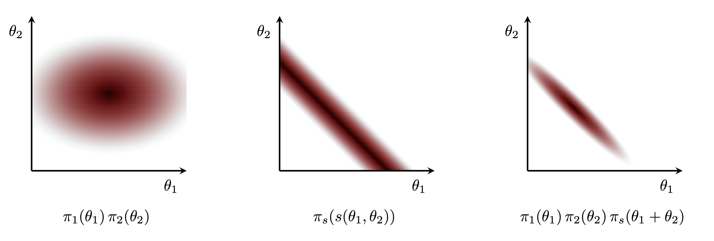
```
<br><br>
</center>

Pushing forward this naive product prior model along $\varpi_{1}$ yields a much
narrower probability density function than we had originally elicited.

<center>
<br>
```{r, out.width = "50%", echo=FALSE}
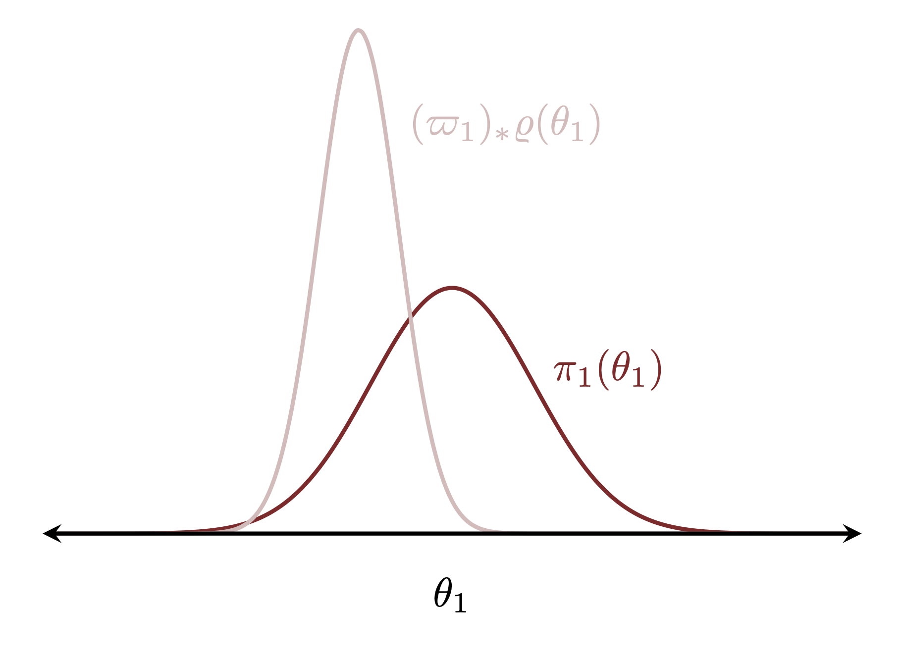
```
<br><br>
</center>

Using this prior model in an actual analysis would then artificially exclude
reasonable model configurations from the resulting posterior distribution.

### Good Do(o)g

Without a systematic way to build prior models that respect multiple elicited
pushforward behaviors what hope do we have to build prior models in
high-dimensional model configuration spaces?  An iterative hope.

Instead of trying to explicitly incorporate all of our elicited information at
once we can use some information to motivate an initial prior model, for example
an independent prior model that can be immediately constructed from marginal
constraints.  We can then push this initial prior model forward along any
remaining summary functions or summary statistics and visually compare against
any elicited pushforward behaviors, such as extremity thresholds.    When the
difference matters I will refer to prior checks of summary functions as
_prior pushforward checks_ and checks of summary statistics as
_prior predictive checks_.

<center>
<br>
```{r, out.width = "75%", echo=FALSE}
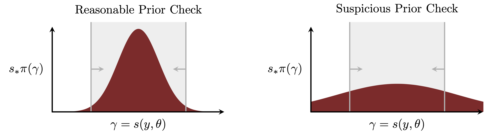
```
<br><br>
</center>

Even if our domain expertise on the outputs of a summary function has not yet
been formally elicited, these visual checks still provide an opportunity to
contrast the consequences of our modeling assumptions against any latent
domain expertise.  In particular any pushforward behaviors that appear
surprising, or otherwise instinctively suspicious, immediately suggest conflict
with subconscious domain expertise that has not yet been elicited.

An immediate obstruction to implementing these prior checks in practice is that
we typically won't be able to construct explicit pushforward probability
density functions.  If we can draw samples from the prior model, however, then
we can implement qualitative checks of pushforward behavior with Monte Carlo
estimators.  For example we can compare our domain expertise with histogram
estimators on the output space.

<center>
<br>
```{r, out.width = "75%", echo=FALSE}
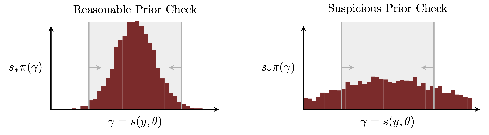
```
<br><br>
</center>

We can also use the samples to estimate tail probabilities that quantify how
much pushforward probabilty leaks past an extremity threshold.  Given the often
vague elicitation of these thresholds, however, we have to be careful to not
take the precise tail probability too seriously.  For example any value
approximately between 0.2 and 5 indicates reasonable compatibility.

<center>
<br>
```{r, out.width = "75%", echo=FALSE}
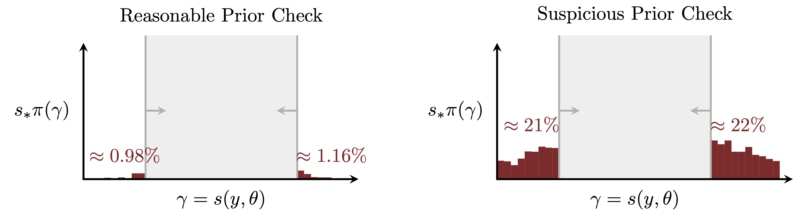
```
<br><br>
</center>

Sometimes the outputs of multiple summary functions are best visualized
together.

<center>
<br>
```{r, out.width = "75%", echo=FALSE}
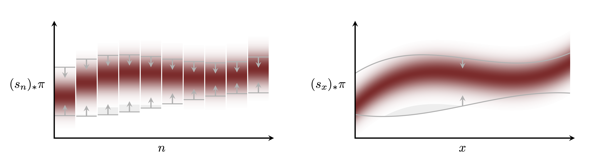
```
<br><br>
</center>

In this case we can implement these checks using empirical quantiles derived
from the prior samples.

<center>
<br>
```{r, out.width = "75%", echo=FALSE}
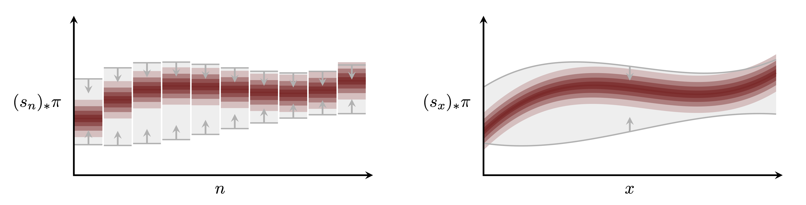
```
<br><br>
</center>

Similarly we can estimate the sequence of tail quantiles.

<center>
<br>
```{r, out.width = "50%", echo=FALSE}
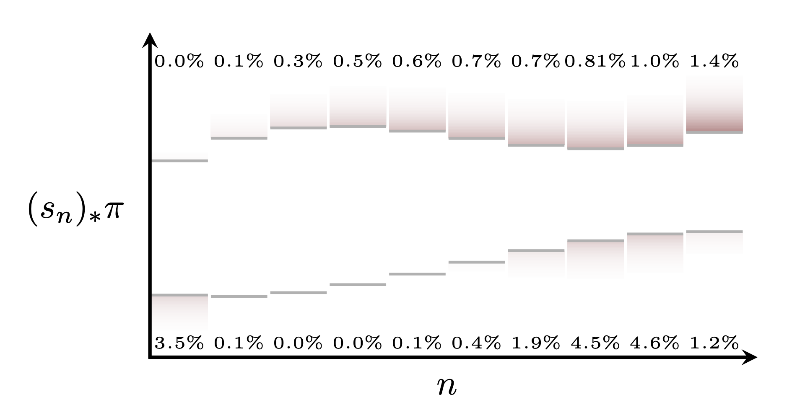
```
<br><br>
</center>

Any inconsistencies can then be used to motivate an updated prior model, for
example one informed by more precise elicitation of extremity thresholds or one
that introduces correlations between the component spaces.  At this point we
iterate, repeating the prior checks and updating the prior model until we've
converged to a reasonably agreeable prior model.

One benefit of this framework is that it is straightforward to start up again if
new information becomes available.  For example if a colleague critiques our
prior model for not incorporating certain assumptions then we can design a
summary function that isolates those assumptions, elicit pushforward behavior,
compare against the consequences of the current prior model, and then update if
needed.  Similarly if once data becomes available we learn that a realized
likelihood function doesn't inform certain critical behaviors then we can design
a summary function that isolates that behavior, elicit domain expertise, and
then update the prior model accordingly.

In honor of I.J. Good's favorite scholar [@Good:1983] I will somewhat playfully
refer to this iterative prior model development as the _Doog loop_.  While
there are no guarantees that the Doog loop will always converge to a useful
prior model its provides a relatively systematic framework that can make the
development of principled prior models much less overwhelming.  In the worst
case it gives useful way to help organize initial prior elicitation.

### Background Check

To demonstrate this iterative framework let's first consider a two-dimensional
model configuration space $\Theta = \Theta_{1} \times \Theta_{2}$ with three
summary functions: the two component functions
$$
\begin{align*}
\varpi_{1} &: \Theta \rightarrow \Theta_{1}
\\
\varpi_{2} &: \Theta \rightarrow \Theta_{2},
\end{align*}
$$
and a function that returns probabilities that are used in the observational
model,
$$
\begin{alignat*}{6}
p :\; &\Theta& &\rightarrow& \; &[0, 1]&
\\
&(\theta_{1}, \theta_{2})& &\mapsto&
&1 - \exp \left( -\sqrt{\theta_{1}^{2} + \theta_{2}^{2} } \right)&.
\end{alignat*}
$$

Eliciting the marginal prior models
$$
\begin{align*}
\pi_{1}(\theta_{1}) &= \text{normal}(\theta_{1}; 0, 10)
\\
\pi_{2}(\theta_{2}) &= \text{normal}(\theta_{2}; 0, 10)
\end{align*}
$$
informs an initial independent prior model
$$
\pi(\theta_{1}, \theta_{2})
= \text{normal}(\theta_{1}; 0, 10) \, \text{normal}(\theta_{2}; 0, 10).
$$

By construction this prior model is exactly compatible with both of the marginal
prior models, which we can verify with Monte Carlo histograms.

```{r}
c_mid <- c("#B97C7C")
c_dark <- c("#8F2727")
c_dark_highlight <- c("#7C0000")

par(family="CMU Serif", las=1, bty="l", cex.axis=1, cex.lab=1, cex.main=1,
    xaxs="i", yaxs="i", mar = c(5, 5, 3, 5))
```

```{r}
set.seed(2384833)

N <- 1000

theta1s <- rnorm(N, 0, 10)
theta2s <- rnorm(N, 0, 10)

xs <- seq(-50, 50, 0.5)
```

```{r}

par(mfrow=c(1, 2))

# theta_1
hist(theta1s, breaks=seq(-50, 50, 3), main="", prob=T,
     col=c_dark, border=c_dark_highlight,
     xlim=c(-40, 40), xlab="theta_1", yaxt='n', ylab="")
 
lines(xs, dnorm(xs, 0, 10), type="l", col=c_mid)

# theta_2
hist(theta2s, breaks=seq(-50, 50, 3), main="", prob=T,
     col=c_dark, border=c_dark_highlight,
     xlim=c(-40, 40), xlab="theta_2", yaxt='n', ylab="")
 
lines(xs, dnorm(xs, 0, 10), type="l", col=c_mid)
```

The pushforward behavior for the probabilities, however, is a bit more
surprising.  Our initial prior model induces exceptionally strongly
concentration at the upper boundary.

```{r}
p <- function(x1, x2) {
  1 - exp(-sqrt(x1**2 + x2**2))
}

ps <- sapply(1:N, function(n) p(theta1s[n], theta2s[n]))

par(mfrow=c(1, 1))

hist(ps, breaks=seq(0, 1, 0.01), main="",
     col=c_dark, border=c_dark_highlight,
     xlim=c(0, 1), xlab="p", yaxt='n', ylab="")
```

Even if we haven't done a careful elicitation this extreme qualitative behavior
might conflict with our implicit domain expertise.  For example if upon
reflection we realize that we want our prior model to induce a more uniform
distribution of probabilities then we need to update the initial prior model.

If the initial elicitation of those marginal prior scales wasn't too precise
then we might go back and perform a more careful elicitation.  Let's say that
we are able to reduce the marginal prior scales by a full order of magnitude.

```{r}
theta1s <- rnorm(N, 0, 1)
theta2s <- rnorm(N, 0, 1)

xs <- seq(-5, 5, 0.05)

par(mfrow=c(1, 2))

# theta_1
hist(theta1s, breaks=seq(-5, 5, 0.3), main="", prob=T,
     col=c_dark, border=c_dark_highlight,
     xlim=c(-4, 4), xlab="theta_1", yaxt='n', ylab="")
 
lines(xs, dnorm(xs, 0, 1), type="l", col=c_mid)

hist(theta2s, breaks=seq(-5, 5, 0.3), main="", prob=T,
     col=c_dark, border=c_dark_highlight,
     xlim=c(-4, 4), xlab="theta_2", yaxt='n', ylab="")
 
lines(xs, dnorm(xs, 0, 1), type="l", col=c_mid)
```

This narrower prior model then yields much less extreme consequences for the
derived probabilities.

```{r}
ps <- sapply(1:N, function(n) p(theta1s[n], theta2s[n]))

par(mfrow=c(1, 1))

hist(ps, breaks=seq(0, 1, 0.025), main="",
     col=c_dark, border=c_dark_highlight,
     xlim=c(0, 1), xlab="p", yaxt='n', ylab="")
```

In this case more precise elicitation of the marginal behavior was sufficient,
but that may not always be possible.  Often we have to consider more
complicated, correlated prior models.

For a second demonstration let's consider the setup we handled poorly in
[Section 4.1.4](#sec:naive_product).  Once again we have a two-dimensional model
configuration space $\Theta = \Theta_{1} \times \Theta_{2}$ with the component
functions,
$$
\begin{align*}
\varpi_{1} &: \Theta \rightarrow \Theta_{1}
\\
\varpi_{2} &: \Theta \rightarrow \Theta_{2},
\end{align*}
$$
but here we consider a summary function that sums inputs from the two component
spaces together,
$$
\begin{alignat*}{6}
s :\; &\Theta& &\rightarrow& \; &\Gamma&
\\
&(\theta_{1}, \theta_{2})& &\mapsto& &\gamma = \theta_{1} + \theta_{2}&.
\end{alignat*}
$$

Eliciting extremity thresholds for the components spaces gives the marginal
prior models,
$$
\begin{align*}
\pi_{1}(\theta_{1}) &= \text{normal}(\theta_{1}; 0, 2)
\\
\pi_{2}(\theta_{2}) &= \text{normal}(\theta_{2}; 0, 1),
\end{align*}
$$
which then inform an initial independent prior model,
$$
\pi(\theta_{1}, \theta_{2})
= \text{normal}(\theta_{1}; 0, 2) \, \text{normal}(\theta_{2}; 0, 1).
$$
In this case, however, we've also elicited desired pushforward behavior for
the summation function,
$$
s_{*} \pi(\gamma) = \text{normal}(\gamma; -3, 0.5).
$$

```{r}
mu_1 <- 0
tau_1 <- 2

mu_2 <- 0
tau_2 <- 1

mu_sum <- -3
tau_sum <- 0.5

xs <- seq(-10, 10, 0.1)

par(mfrow=c(3, 1))

# theta_1
plot(1, type="n", main="",
     xlim=c(-10, 10), xlab="theta_1",
     ylim=c(0, 1), ylab="", yaxt='n')

xi_l <- mu_1 - 2.32 * tau_1
xi_u <- mu_1 + 2.32 * tau_1
rect(xi_l, 0, xi_u, 1, col=c("#EEEEEE"), border=FALSE)
abline(v=xi_l, col=c("#CCCCCC"), lty=1, lw=2)
abline(v=xi_u, col=c("#CCCCCC"), lty=1, lw=2)

lines(xs, dnorm(xs, mu_1, tau_1), type="l", col=c_mid)

# theta_2
plot(1, type="n", main="",
     xlim=c(-10, 10), xlab="theta_2",
     ylim=c(0, 1), ylab="", yaxt='n')

xi_l <- mu_2 - 2.32 * tau_2
xi_u <- mu_2 + 2.32 * tau_2
rect(xi_l, 0, xi_u, 1, col=c("#EEEEEE"), border=FALSE)
abline(v=xi_l, col=c("#CCCCCC"), lty=1, lw=2)
abline(v=xi_u, col=c("#CCCCCC"), lty=1, lw=2)

lines(xs, dnorm(xs, mu_2, tau_2), type="l", col=c_mid)

# theta_1 + theta_2
plot(1, type="n", main="",
     xlim=c(-10, 10), xlab="theta_1 + theta_2",
     ylim=c(0, 1), ylab="", yaxt='n')

xi_l <- mu_sum - 2.32 * tau_sum
xi_u <- mu_sum + 2.32 * tau_sum
rect(xi_l, 0, xi_u, 1, col=c("#EEEEEE"), border=FALSE)
abline(v=xi_l, col=c("#CCCCCC"), lty=1, lw=2)
abline(v=xi_u, col=c("#CCCCCC"), lty=1, lw=2)

lines(xs, dnorm(xs, mu_sum, tau_sum), type="l", col=c_mid)
```

Prior checks reveal the expected compatibility of our initial prior model with
the marginal constraints, but also a frustrating tension with the summation
constraint.

```{r}
theta1s <- rnorm(N, mu_1, tau_1)
theta2s <- rnorm(N, mu_2, tau_2)
```

```{r}
par(mfrow=c(3, 1))

# theta_1
plot(1, type="n", main="",
     xlim=c(-10, 10), xlab="theta_1",
     ylim=c(0, 1), ylab="", yaxt='n')

xi_l <- mu_1 - 2.32 * tau_1
xi_u <- mu_1 + 2.32 * tau_1
rect(xi_l, 0, xi_u, 1, col=c("#EEEEEE"), border=FALSE)

hist(theta1s, breaks=seq(-10, 10, 0.25), prob=T, main="",
     col=c_dark, border=c_dark_highlight, add=T)

abline(v=xi_l, col=c("#CCCCCC"), lty=1, lw=2)
abline(v=xi_u, col=c("#CCCCCC"), lty=1, lw=2)

lines(xs, dnorm(xs, mu_1, tau_1), type="l", col=c_mid)

# theta_2
plot(1, type="n", main="",
     xlim=c(-10, 10), xlab="theta_2",
     ylim=c(0, 1), ylab="", yaxt='n')

xi_l <- mu_2 - 2.32 * tau_2
xi_u <- mu_2 + 2.32 * tau_2
rect(xi_l, 0, xi_u, 1, col=c("#EEEEEE"), border=FALSE)

hist(theta2s, breaks=seq(-10, 10, 0.25), prob=T, main="",
     col=c_dark, border=c_dark_highlight, add=T)

abline(v=xi_l, col=c("#CCCCCC"), lty=1, lw=2)
abline(v=xi_u, col=c("#CCCCCC"), lty=1, lw=2)

lines(xs, dnorm(xs, mu_2, tau_2), type="l", col=c_mid)

# theta_1 + theta_2
plot(1, type="n", main="",
     xlim=c(-10, 10), xlab="theta_1 + theta_2",
     ylim=c(0, 1), ylab="", yaxt='n')

xi_l <- mu_sum - 2.32 * tau_sum
xi_u <- mu_sum + 2.32 * tau_sum
rect(xi_l, 0, xi_u, 1, col=c("#EEEEEE"), border=FALSE)

hist(theta1s + theta2s, breaks=seq(-10, 10, 0.25), prob=T, main="",
     col=c_dark, border=c_dark_highlight, add=T)

abline(v=xi_l, col=c("#CCCCCC"), lty=1, lw=2)
abline(v=xi_u, col=c("#CCCCCC"), lty=1, lw=2)

lines(xs, dnorm(xs, mu_sum, tau_sum), type="l", col=c_mid)
```

Instead of doing something gauche like multiply ill-defined density functions
together we can use the failure of the prior check to inform a better prior
model.  In this case let's consider a multivariate normal prior model with a
negative correlation to achieve the desired concentration around negative sums.

```{r}
nu_1 <- 0
nu_2 <- 0
omega_1 <- 2
omega_2 <- 1
rho <- -0.99

Sigma <- matrix(c(omega_1**2, rho * omega_1 * omega_2,
                  rho * omega_1 * omega_2, omega_2**2), 2, 2)
L_Sigma <- chol(Sigma)

eta1s <- rnorm(N, 0, 1)
eta2s <- rnorm(N, 0, 1)
thetas <- t(L_Sigma) %*% matrix(c(eta1s, eta2s), 2, N) + c(nu_1, nu_2)
```

```{r}
par(mfrow=c(3, 1))

# theta_1
plot(1, type="n", main="",
     xlim=c(-10, 10), xlab="theta_1",
     ylim=c(0, 1), ylab="", yaxt='n')

xi_l <- mu_1 - 2.32 * tau_1
xi_u <- mu_1 + 2.32 * tau_1
rect(xi_l, 0, xi_u, 1, col=c("#EEEEEE"), border=FALSE)

hist(thetas[1,], breaks=seq(-20, 20, 0.25), prob=T, main="",
     col=c_dark, border=c_dark_highlight, add=T)

abline(v=xi_l, col=c("#CCCCCC"), lty=1, lw=2)
abline(v=xi_u, col=c("#CCCCCC"), lty=1, lw=2)

lines(xs, dnorm(xs, mu_1, tau_1), type="l", col=c_mid)

# theta_2
plot(1, type="n", main="",
     xlim=c(-10, 10), xlab="theta_2",
     ylim=c(0, 1), ylab="", yaxt='n')

xi_l <- mu_2 - 2.32 * tau_2
xi_u <- mu_2 + 2.32 * tau_2
rect(xi_l, 0, xi_u, 1, col=c("#EEEEEE"), border=FALSE)

hist(thetas[2,], breaks=seq(-20, 20, 0.25), prob=T, main="",
     col=c_dark, border=c_dark_highlight, add=T)

abline(v=xi_l, col=c("#CCCCCC"), lty=1, lw=2)
abline(v=xi_u, col=c("#CCCCCC"), lty=1, lw=2)

lines(xs, dnorm(xs, mu_2, tau_2), type="l", col=c_mid)

# theta_1 + theta_2
plot(1, type="n", main="",
     xlim=c(-10, 10), xlab="theta_1 + theta_2",
     ylim=c(0, 1), ylab="", yaxt='n')

xi_l <- mu_sum - 2.32 * tau_sum
xi_u <- mu_sum + 2.32 * tau_sum
rect(xi_l, 0, xi_u, 1, col=c("#EEEEEE"), border=FALSE)

hist(thetas[1,] + thetas[2,], breaks=seq(-20, 20, 0.25), prob=T, main="",
     col=c_dark, border=c_dark_highlight, add=T)

abline(v=xi_l, col=c("#CCCCCC"), lty=1, lw=2)
abline(v=xi_u, col=c("#CCCCCC"), lty=1, lw=2)

lines(xs, dnorm(xs, mu_sum, tau_sum), type="l", col=c_mid)
```

Although better this is still not really satisfactory.  In order to better match
the desired summation behavior we need to shift the marginal prior models down.
While this will worsen the agreement with the marginal elicitation we can
compensate by also inflating the marginal prior models a bit.

```{r}
nu_1 <- -1.75
nu_2 <- -1.25
omega_1 <- 2.75
omega_2 <- 1.75
rho <- -0.99

Sigma <- matrix(c(omega_1**2, rho * omega_1 * omega_2,
                  rho * omega_1 * omega_2, omega_2**2), 2, 2)
L_Sigma <- chol(Sigma)

eta1s <- rnorm(N, 0, 1)
eta2s <- rnorm(N, 0, 1)
thetas <- t(L_Sigma) %*% matrix(c(eta1s, eta2s), 2, N) + c(nu_1, nu_2)
```

```{r}
par(mfrow=c(3, 1))

# theta_1
plot(1, type="n", main="",
     xlim=c(-10, 10), xlab="theta_1",
     ylim=c(0, 1), ylab="", yaxt='n')

xi_l <- mu_1 - 2.32 * tau_1
xi_u <- mu_1 + 2.32 * tau_1
rect(xi_l, 0, xi_u, 1, col=c("#EEEEEE"), border=FALSE)

hist(thetas[1,], breaks=seq(-20, 20, 0.25), prob=T, main="",
     col=c_dark, border=c_dark_highlight, add=T)

abline(v=xi_l, col=c("#CCCCCC"), lty=1, lw=2)
abline(v=xi_u, col=c("#CCCCCC"), lty=1, lw=2)

lines(xs, dnorm(xs, mu_1, tau_1), type="l", col=c_mid)

# theta_2
plot(1, type="n", main="",
     xlim=c(-10, 10), xlab="theta_2",
     ylim=c(0, 1), ylab="", yaxt='n')

xi_l <- mu_2 - 2.32 * tau_2
xi_u <- mu_2 + 2.32 * tau_2
rect(xi_l, 0, xi_u, 1, col=c("#EEEEEE"), border=FALSE)

hist(thetas[2,], breaks=seq(-20, 20, 0.25), prob=T, main="",
     col=c_dark, border=c_dark_highlight, add=T)

abline(v=xi_l, col=c("#CCCCCC"), lty=1, lw=2)
abline(v=xi_u, col=c("#CCCCCC"), lty=1, lw=2)

lines(xs, dnorm(xs, mu_2, tau_2), type="l", col=c_mid)

# theta_1 + theta_2
plot(1, type="n", main="",
     xlim=c(-10, 10), xlab="theta_1 + theta_2",
     ylim=c(0, 1), ylab="", yaxt='n')

xi_l <- mu_sum - 2.32 * tau_sum
xi_u <- mu_sum + 2.32 * tau_sum
rect(xi_l, 0, xi_u, 1, col=c("#EEEEEE"), border=FALSE)

hist(thetas[1,] + thetas[2,], breaks=seq(-20, 20, 0.25), prob=T, main="",
     col=c_dark, border=c_dark_highlight, add=T)

abline(v=xi_l, col=c("#CCCCCC"), lty=1, lw=2)
abline(v=xi_u, col=c("#CCCCCC"), lty=1, lw=2)

lines(xs, dnorm(xs, mu_sum, tau_sum), type="l", col=c_mid)
```

The consequences of this updated prior model are by no means perfect, but
they're a reasonable compromise to the elicited domain expertise.  In most
analyses we don't have to be too precious with our prior modeling, and this
level of agreement is almost always sufficient.

## Deliverance to Ignorance

Weaving together a prior model from low-dimensional elicitations is useful in
many applications, but sometimes the most effective approach to reducing the
dimensionality of the prior elictiation challenge is to consider not what we
know but rather what we _don't know_.  Eliciting our domain ignorance can
drastically reduce the scope of viable prior models and leave us with only a
lower-dimensional residual elicitation task to completely specific a useful
prior model.

Mathematically ignorance is encoded in _symmetries_ of our prior model.  If
our domain expertise cannot distinguish between certain model configurations
then any compatible prior model will be invariant to any rearrangement of those
equivalent model configurations.  For example if our domain expertise cannot
distinguish between any two model configurations at the same radius then any
compatible prior model has to be invariant to rotations of the model
configuration space.  No matter how we rotate our perspective the prior model
should look the same.

Unfortunately constructing explicit prior models that respect a given symmetry,
and hence faithfully capture certain domain ignorances, is rarely
straightforward.  Indeed designing symmetric prior models usually requires a
substantial amount of mathematical sophistication.  In this section we will
briefly review some of the mathematical strategies for building symmetric prior
models so that we might better understand, and be more comfortable employing,
symmetric prior models that have already derived.

### The Quotient Docent

Symmetries decompose the model configuration space into a set of
_equivalance classes_ of indistinguishable model configurations.  Mathematically
this decomposition can be encoded in a _quotient function_
$q : \Theta \rightarrow R$ that maps each point in the model configuration space
to a label that identifies the equivalence class to which that point belongs.
In this case the equivalence classes become the _level sets_ of the quotient
function, or all of the points that map to the same output label,
$$
q^{-1}(r) =
\{ \theta \in \Theta \mid q(\theta) = r \}.
$$

Any prior compatible with the symmetry encoded by a quotient function must be
uniformly distributed along all of these level sets.  The remaining prior model
is then determined by the pushforward behavior of $q_{*} \pi$.  That said
engineering an explicit prior model that is uniform over the level sets
$q^{-1}(r)$ while at the same time matches the desired pushforward behavior is
by no means straightforward.

For a relatively simple example consider a real model configuration space,
$\Theta = \mathbb{R}^{N}$, and domain ignorance to rotations of this space
around the origin.  In this case the equivalence classes are the spherical
shells of constant radius, and the rotational symmetry can be encoded in the
radial function that maps each point to its radial distance from zero.
$$
\begin{alignat*}{6}
\rho :\; &\Theta& &\rightarrow& \; &\mathbb{R}&
\\
&(\theta_{1}, \ldots, \theta_{N})& &\mapsto&
&r = \sqrt{ \textstyle \sum_{n = 1}^{N} \theta_{n}^{2} } &.
\end{alignat*}
$$
Any prior model compatible with this symmetry must be uniform over the level
sets of this function,
$$
\rho^{-1}(r) =
\left\{ \theta_{1}, \ldots, \theta_{N} \mid
\sqrt{ \textstyle \sum_{n = 1}^{N} \theta_{n}} = r \right\}.
$$

<center>
<br>
```{r, out.width = "50%", echo=FALSE}
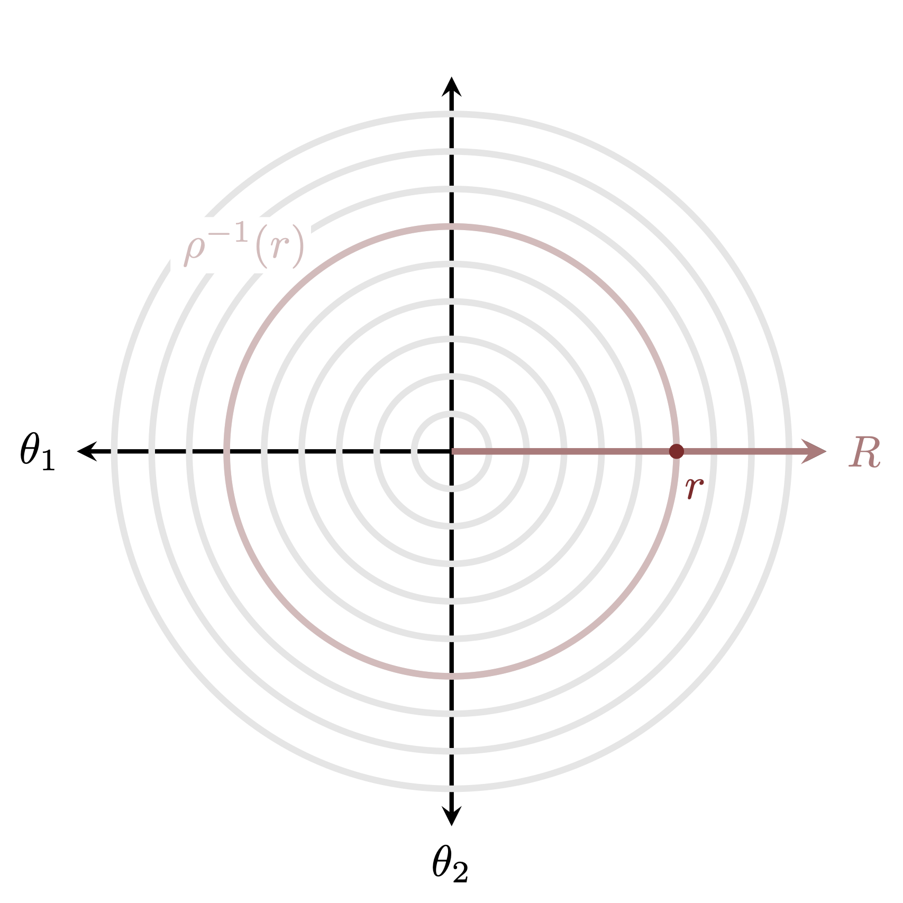
```
<br><br>
</center>

Working out all prior models uniform over these spherical shells is no easy
task, but we can construct a relatively large family of compatible prior models.
In turns out that any independent prior model built from identical,
zero-centered normal probability density functions,
$$
\pi(\theta_{1}, \ldots, \theta_{N})
=
\prod_{n = 1}^{N} \text{normal}(\theta_{n}; 0, \tau),
$$
is invariant to any rotations and uniform along each spherical shell.  Each
choice of the common scale $\tau$ specifies a different spherically symmetric
prior model.

In this case we can derive the pushforward density function along the radial
function in closed form;  it turns out to be a scaled $\chi$ density function,
$$
\pi \! \left( r \right) =
\left( 2 \tau^{2} \right)^{-\frac{N}{2} }
\frac{ 2 }{ \Gamma \! \left( \frac{N}{2} \right) }
r^{N - 1} \exp \! \left( - \frac{r^{2}}{2 \tau^{2}} \right).
$$
By varying $\tau$ we vary the precise pushforward behavior, giving us some
flexibility in tuning a prior model to match our elicited domain expertise about
the radial outputs.

While we may not be able to construct an explicit prior model compatible with an
arbitrary symmetry, we can still use this quotient perspective to evaluate how
compatible a prior model is with that symmetry.  If we can construct a
projection function that maps to some subset of the level sets $q^{-1}(r)$
_while preserving distances_ then we can check to see how uniform the
pushforward of our prior model is along this function.

For example in two-dimensions the angular function
$$
\phi(\theta_{1}, \theta_{2})
=
\mathrm{arctan} \! \left( \frac{\theta_{2}}{\theta_{1}} \right)
$$
maps each point to an angle along the circular level set with radius
$$
r = \sqrt{ \theta_{1}^{2} + \theta_{2}^{2} }.
$$
Any prior model compatible with the rotational ignorance should push forward
to a uniform distribution along this function.  In practice we can analyze this
pushforward behavior with, amongst other visualizations, Monte Carlo histograms.

For example above we saw that independent and identical normal models,
$$
\pi(\theta_{1}, \theta_{2})
=
\text{normal}(\theta_{1}; 0, \tau) \, \text{normal}(\theta_{2}; 0, \tau),
$$
are invariant to rotations and we can confirm this by looking the pushforward
behavior along the angular function.

```{r}
par(mfrow=c(1, 1))

tau <- 3

theta1s <- rnorm(N, 0, tau)
theta2s <- rnorm(N, 0, tau)

hist(atan(theta2s / theta1s), breaks=seq(-0.5 * pi, 0.5 * pi, pi / 25),
     main="", col=c_dark, border=c_dark_highlight,
     xlab="phi", ylab="", yaxt='n')
```

What about an independent prior model built from identical Cauchy models,
$$
\pi(\theta_{1}, \theta_{2})
=
\text{cauchy}(\theta_{1}; 0, \tau) \, \text{cauchy}(\theta_{2}; 0, \tau)?
$$
The pushforward behavior suggests not.

```{r}
theta1s <- rcauchy(N, 0, tau)
theta2s <- rcauchy(N, 0, tau)

hist(atan(theta2s / theta1s), breaks=seq(-0.5 * pi, 0.5 * pi, pi / 25),
     main="", col=c_dark, border=c_dark_highlight,
     xlab="phi", ylab="", yaxt='n')
```

Indeed we can confirm these results by visually inspecting the prior density
functions directly.  While the independent and identical normal model is
spherically symmetric the independent and identical Cauchy model exhibits
spikes along the axes that obstruct the symmetry.

<center>
<br>
```{r, out.width = "75%", echo=FALSE}
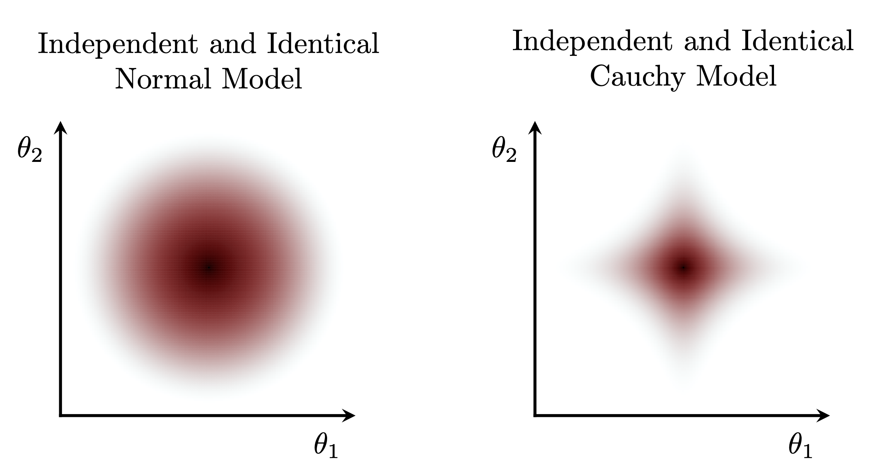
```
<br><br>
</center>

### Do You Even Lift, Bro?

Sometimes engineering an explicit prior model with a desired symmetry is much
easier with the flexibility afforded by _lifting_ to a higher-dimensional space.
On a well-chosen higher-dimensional space we might have more freedom to engineer
a probability distribution that projects to a prior model with the desired
symmetries on the original model configuration space.

For example consider extending the model configuration space by appending some
new variables $\phi \in \Phi$ to give the higher-dimensional product space
$\Theta \times \Phi$.  Any joint probability distribution on this lifted space,
$$
\pi(\theta, \phi) = \pi(\theta \mid \phi) \, \pi(\phi),
$$
with the right properties will then project to a useful prior model on the
original space,
$$
\pi(\theta) = \int \mathrm{d} \phi \, \pi(\theta, \phi).
$$

The integration needed to construct the explicit prior density function
$\pi(\theta)$, however, will rarely be feasible in practice.  Instead we can
implement this model by working directly on the lifted model configuration
space,
$$
\begin{align*}
\pi(y, \theta, \phi)
&= \pi(y \mid \theta, \phi) \, \pi(\theta, \phi)
\\
&= \pi(y \mid \theta) \, \pi(\theta \mid \phi) \, \pi(\phi).
\end{align*}
$$
In this case the auxiliary variables $\phi$ have no inferential value but
fitting them at the same time as the model configurations $\theta$ ensures the
desired behavior in the prior model.

Similarly if we need to engineer certain properties into $\pi(\phi)$ then we can
utilize the lift and project strategy again to give
$$
\pi(\phi) = \int \mathrm{d} \psi \, \pi(\phi \mid \psi) \, \pi(\psi),
$$
which we might implement with the joint model
$$
\pi(y, \theta, \phi, \psi)
=
\pi(y \mid \theta) \, \pi(\theta \mid \phi) \, \pi(\phi \mid \psi) \, \pi(\psi).
$$
The strategy can then be repeated as often as needed until we are able to build
a marginal prior model over the model configuration space with the desired
symmetries.

The auxiliary variables introduced only to give us the flexibility to engineer
symmetric prior models for $\theta$ are often referred to as _hyper-parameters_.
Sometimes, however, the desired symmetries themselves are actualy the
consequence of some latent but meaningful phenomenon, in which case these
auxiliary parameters can be interpreted as quantifying the behavior of that
phenomenon.  Often it's not entirely clear if a symmetry is a manifestation of
our domain ignorance or a consequence of the data generating process.  I will
limit the use of the term hyper-parameters to refer to those variables that are
introduced solely for mathematical convenience, without any inferential value,
and without any interpretation as modeling meaningful phenomena.

My [hierarchical modeling case study](https://betanalpha.github.io/assets/case_studies/hierarchical_modeling.html)
demonstrates how this lifting approach can be used to motivate the family of
_hierarchical_ prior models consistent with permutation symmetries.  There I
also discuss the subtle issue of under what circumstances the auxiliary
parameters that are introduced might be meaningful or not.

### Too Ignorant

As with so many things in life ignorance can be useful in moderation but tends
to be problematic in excess.  In particular if we try to enforce too much
symmetry then there might not be any compatible probability distributions, and
hence compatible prior models, at all.

Consider for example _translation_ symmetry over the real line
$\Theta = \mathbb{R}$, which is often presented as the ultimate ignorance.  Any
probability distribution invariant to translation symmetries must be uniform
across the entire model configuration space, but that uniformity conflicts with
the very definition of probability distributions!

To see why let's partition the real line into disjoint, unit length intervals
$$
I_{n} = [n, n + 1) \subset \mathbb{R}
\\
\cup_{n = -\infty}^{\infty} I_{n} = \mathbb{R}.
$$
We can then apply the third Kolmogorov axiom to write the total probability
allocated to the real line as the probabilities allocated to these intervals,
$$
\begin{align*}
\mathbb{P}_{\pi}[ \mathbb{R} ]
&= \mathbb{P}_{\pi}[ \cup_{n = -\infty}^{\infty} I_{n} ]
\\
&= \sum_{n = -\infty}^{\infty} \mathbb{P}_{\pi}[ I_{n} ].
\end{align*}
$$
Now if $\pi$ is translation invariant then all of the $\mathbb{P}_{\pi}[ I_{n} ]$
must be equal to the same constant,
$$
\mathbb{P}_{\pi}[ I_{n} ] = p,
$$
which implies
$$
\begin{align*}
\mathbb{P}_{\pi}[ \mathbb{R} ]
&= \sum_{n = -\infty}^{\infty} \mathbb{P}_{\pi}[ I_{n} ]
\\
&= \sum_{n = -\infty}^{\infty} p
\\
&= p \sum_{n = -\infty}^{\infty} 1.
\end{align*}
$$
If $p$ is anything but zero then $\mathbb{P}_{\pi}[ \mathbb{R} ]$ diverges to
infinity, conflicting with the second Kolmogorov axiom which asserts that the
total probability is $1$.  On the other hand if $p$ is zero then
$\mathbb{P}_{\pi}[ \mathbb{R} ]$ vanishes, which also in conflict with that
axiom.  _There is no mathematically-consistent way to uniformly distribute a
finite quantity over the entire real line!_

If we relax the finite normalization then probability distributions become
measures, and there are an infinite number of uniform measures invariant to
translations alone the real line.  If the realized likelihood function
concentrates strongly enough around a single point then using a uniform measure
for a prior model can still yield a well-behaved posterior probability
distribution.  In this case the uniform prior measure is best interpreted as a
_local approximation_ of a diffuse but well-behaved prior model in the
neighborhood where the likelihood function concentrates [@BoxEtAl:1973].  That
said in order to use this approach in practice we have to actually verify that
the likelihood function always concentrates sufficiently strongly!

<center>
<br>
```{r, out.width = "50%", echo=FALSE}
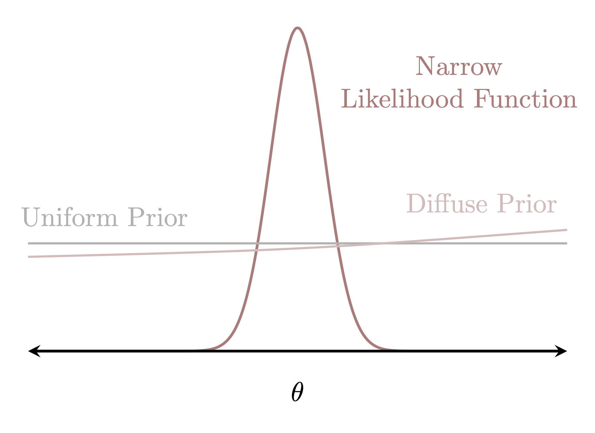
```
<br><br>
</center>

When the likelihood function doesn't concentrate strongly enough, however,  the
resulting posterior will not correspond to any well-defined probability
distribution.  In other words the posterior distribution will be as ill-posed as
the prior distribution. If we can't guarantee that the realized likelihood
function will always be sufficiently informative to ensure a well-defined
posterior distribution then a translation-invariant prior model is a dangerous
gamble.

Translation-invariant prior models, also commonly referred to as "uniform" or
"non-informative" prior models, are limited by not just mathematical
complications.  They also almost always conflict with even the weakest
elicitation of our domain expertise.

Consider for example the finite interval on the real line stretching between
$-1 < \theta < 1$.  A translation-invariant prior model allocates a finite
measure to the model configurations in this interval, but an infinite measure to
all of the model configurations in the bounding intervals $\theta \le -1$ and
$\theta \ge 1$.  In other words this ill-posed prior model favors the model
configurations $| \theta | \ge 1$ infinitely more strongly than those in
$| \theta | < 1$.

Perhaps this preference for extreme values is reasonable if $1$ is a relatively
small value compared to the relevant scales of the problem.  So let's consider
the argument again but for the much larger interval
$$
-1,000,000 < \theta < 1,000,000.
$$
In this case the translation-invariant prior model allocates a much larger but
still finite measure to the model configurations in this interval; the measure
allocated above and below the interval, however, remains infinite.  Consequently
the ill-posed prior model still strongly favors model configurations outside the
interval over those inside the interval.

This argument holds for _any_ finite interval no matter how large.  The
translation-invariant prior model is always chasing more and more extreme model
configurations.  From this perspective we can interpret the
translation-invariant prior model as _concentrating around_ infinity rather than
around any accessible, finite value.

For those bothered that this perspective might be too casual, we can formalize
it more precisely.  If we bend the real line over itself then so that negative
and positive infinity meet at a common point then the real line appears as a
circle minus that single _point at infinity_.  From this perspective any uniform
measure over the real line appears to concentrate around this missing point.

<center>
<br>
```{r, out.width = "100%", echo=FALSE}
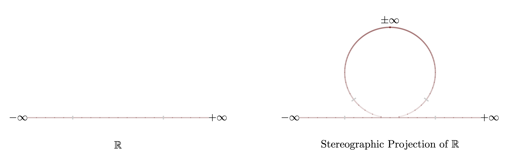
```
<br><br>
</center>

This picture generalizes to higher-dimensional real spaces if combine all of the
infinities in each direction into a single point at infinity.  In this case the
real plane rolls up into a sphere with a puncture at the resulting point at
infinity, and any uniform measures ends up concentrating around this puncture.
This _stereographic projection_ provides a striking picture of just how much
uniformity typically violates even the weakest domain expertise.

<center>
<br>
```{r, out.width = "100%", echo=FALSE}
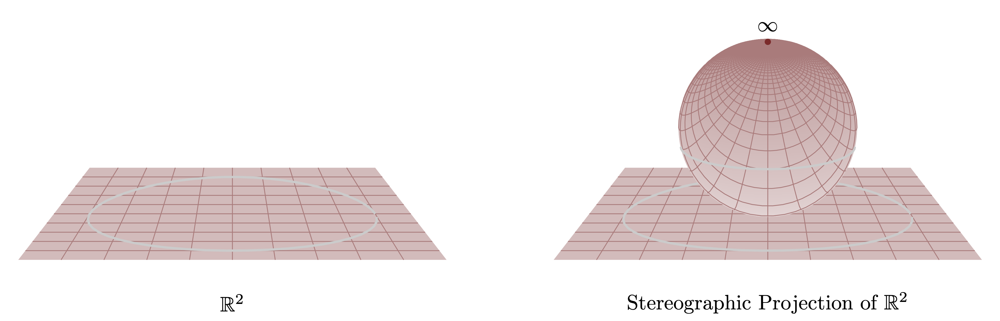
```
<br><br>
</center>

Despite their mathematical complications, translation-invariant prior models are
often presented as useful _default_ prior models absent of any assumptions.  As
this discussion has hopefully motivated, however, translation invariance is an
assumption no different from any other assumption; _there are no defaults in
principled probabilistic modeling_.  As with all assumptions we have to
explicitly validate how compatible the consequences of this choice are with our
domain expertise.

If we have any domain expertise that informs when model configurations have
stretched too far towards infinity then we have enough information to at least
advise extremity thresholds and conservative containment priors that can
suppress infinity instead of embracing it.

# Metadata and Metalikelihoods

One of the powerful features of Bayesian inferences is that we can extract
information both from measurements, through a realized likelihood function, and
domain expertise, through a prior model.  In particular information derived from
previous measurements can be incorporated into an analysis _either way_.

If the full likelihood functions realized from previous measurements are
available -- and we can elicit a prior model that captures any other relevant
domain expertise -- then we can we construct the posterior distribution informed
by these previous measurements,
$$
\pi(\theta, \phi \mid \tilde{y}_{\text{prev}})
\propto
\pi(\tilde{y}_{\text{prev}} \mid \theta, \phi) \, \pi(\theta, \phi),
$$
where $\theta$ denotes all variables relevant to the current measurements and
$\phi$ denotes those relevant only to the previous measurements.  Marginalizing
out those irrelevant variables then yields
$$
\pi(\theta \mid \tilde{y}_{\text{prev}})
=
\int \mathrm{d} \phi \, \pi(\theta, \phi \mid \tilde{y}_{\text{prev}})
$$
which we can use a prior model when analyzing the current measurement,
$$
\pi(\theta, \psi \mid \tilde{y}, \tilde{y}_{\text{prev}})
\propto
\pi(\tilde{y} \mid \theta, \psi) \,
\pi(\psi \mid \theta) \,
\pi(\theta \mid \tilde{y}_{\text{prev}}).
$$
In practice this marginalization is rarely feasible in closed form but we can
consistently incorporate all of the information by building a
[joint, narratively generative model](https://betanalpha.github.io/assets/case_studies/generative_modeling.html#26_A_Tangled_Web).

Often, however, not enough information is archived for the full likelihood
functions to be recovered from previous experiments.  Instead we have to work
only with limited summaries, for example those reported in a published paper.
_Meta-analysis_ considers these summaries not as inferences but rather as
observations, and engineers a heuristic observational model through which they
can be incorporated into other analyses.

Consider, for example, a series of measurements where inferences about a
parameter $\theta$ were reported only in the form of some central value and
uncertainty quantification,
$$
\theta \approx \hat{\mu}_{n} \pm \hat{\delta}_{n}.
$$
If we don't know the full details of how these two numbers were derived for
each measurement then we might treat the $\hat{\mu}_{n}$ as data from the
heuristic observational model
$$
\pi(\hat{\mu}_{1}, \ldots, \hat{\mu}_{N} \mid \theta;
\hat{\delta}_{1}, \ldots, \hat{\delta}_{N})
= \prod_{n = 1}^{N} \text{normal}(\hat{\mu}_{n} \mid \theta, C_{n} \cdot \hat{\delta}_{n}),
$$
where the constants $C_{n}$ calibrate the quoted uncertainty quantification to
the width of the normal density function.

A more sophisticated meta-analysis might also model the $\hat{\delta}_{n}$ as
observations, for example with
$$
\begin{align*}
\pi(\hat{\mu}_{1}, \hat{\delta}_{1}, \ldots, \hat{\mu}_{N}, \hat{\delta}_{N}
\mid \theta, \sigma_{1}, \ldots, \sigma_{N})
&= \prod_{n = 1}^{N} \;\; \text{normal}(\hat{\mu}_{n} \mid \theta, \sigma_{n})
\\
&\quad\quad\;\; \cdot
\text{log-normal}(\hat{\delta}_{n} \mid \log \sigma_{n} - \log C, \sigma_{n}).
\end{align*}
$$
By giving each measurement it's own measurement variability $\sigma_{n}$ we can
account for varying precision between the experiments beyond that captured in
the reported summaries.  By expanding the meta-analytic model we might similarly
model unreported bias and other artifacts that we suspect were introduced in the
previous analyses of those measurements.

At the very extreme end of meta-analysis one might not even have quantitative
summaries of the inferences derived from a previous measurement but rather
qualitative remembrances of those inferences.  Without explicit summaries we
can't utilize a meta-analytic observational model, but we might be tempted to
directly model a heuristic likelihood function capturing that vague information.

Mechanistically this would correspond to multiplying an initial prior model by
some function that constrains the parameters according to those nebulous
inferences.  Interestingly this is _exactly_ the naive product model we
encountered in [Section 4.1.4](#sec:naive_product)!  In other words while we
can't interpret multiplying an initial prior model by some function as an
elicited prior model we can interpret it as the posterior distribution resulting
from some hypothetical observational model and measurement.

While the convenience of this approach might be appealing, it is typically more
trouble than its worth in practice.  Because we're directly modeling a heuristic
likelihood function we don't have an observational model whose assumptions we
can validate.  Without being able to validate those implicit assumptions we
can't verify if the information captured by the heuristic likelihood function is
consistent with the information derived elsewhere, in particular the information
elicited from our domain expertise.  Any problems in that heuristic likelihood
function will compromise any inferences that incorporate it.

If we don't have quantitative summaries from a previous measurement then any
qualitative information from that measurement should be incorporated into the
prior model the same as any other elicited domain expertise.

# Conclusion

Like so many outcasts prior modeling is maligned because it is misunderstood.
Once we recognize that useful prior models need to incorporate only enough
information to compensate for whatever a measurement might not inform, eliciting
a principled prior model becomes much more manageable.  Using the structure of
the data generating process we can prioritize exactly what kind of domain
expertise we need to quantitatively elicit, motivate an initial prior model, and
identify prior checks that verify that the consequences of that initial prior
model are reasonable.  At this point the prior model, as with any modeling
assumption, becomes not as a burden but rather the precious opportunity that it
is.

# Acknowledgements

A very special thanks to everyone supporting me on Patreon: Aapeli Nevala,
Abhinav Katoch, Adam Bartonicek, Adam Fleischhacker, Adam Golinski, Adan,
Alan O'Donnell, Alessandro Varacca, alex , Alex ANDORRA, Alexander Bartik,
Alexander Noll, Alexander Rosteck, Anders Valind, Andrea Serafino,
Andrew Mascioli, Andrew Rouillard, Angus Williams, Antoine Soubret, Ara Winter,
Arya, asif zubair, Austin Carter, Austin Rochford, Austin Rochford,
Avraham Adler, bbbbb, Ben Matthews, Ben Swallow, Benoit Essiambre,
Bertrand Wilden, Bo Schwartz Madsen, Brian Hartley, Bryan Yu,
Brynjolfur Gauti Jónsson, Cameron Smith, Canaan Breiss, Cat Shark,
Charles Naylor, Chase Dwelle, Chris Jones, Christopher Mehrvarzi, Chuck Carlson,
Cole Monnahan, Colin Carroll, Colin McAuliffe, D, Damien Mannion, Damon Bayer,
Dan Killian, dan mackinlay, Dan Muck, Dan W Joyce, Dan Weitzenfeld,
Daniel Edward Marthaler, Daniel Hocking, Daniel Rowe, Darshan Pandit,
David Burdelski, David Humeau, David Pascall, Derek G Miller,
dilsher singh dhillon, Doug Rivers, Dylan Murphy, Ed Cashin, Eduardo,
Elizaveta Semenova, Eric Novik, Erik Banek, Ero Carrera, Ethan Goan, Eugene,
Evan Cater, Fabio Zottele, Federico Carrone, Felipe González, Fergus Chadwick,
Finn Lindgren, Florian Wellmann, Francesco Corona, Geoff Rollins, George Ho,
Granville Matheson, Greg Sutcliffe, Guido Biele, Hamed Bastan-Hagh, Haonan Zhu,
Harrison Katz, Henri Wallen, Hugo Botha, Huib Meulenbelt, Hyunji Moon, Ian ,
Ignacio Vera, Ilaria Prosdocimi, Isaac S, J, J Michael Burgess, Jair Andrade,
James Doss-Gollin, James McInerney, James Wade, JamesU, Janek Berger,
Jason Martin, Jeff Dotson, Jeff Helzner, Jeffrey Arnold, Jeffrey Burnett,
Jeffrey Erlich, Jessica Graves, Joel Kronander, Joel Ong, John Flournoy, Jon ,
Jonathan St-onge, Jonathon Vallejo, Joran Jongerling, Jordi Warmenhoven,
Jose Pereira, Josh Weinstock, Joshua Duncan, Joshua Griffith, Joshua Mayer,
Josué Mendoza, Justin Bois, Karim Naguib, Karim Osman, Kejia Shi, Kádár András,
Lane Harrison, lizzie , Luiz Carvalho, Luiz Pessoa, Marc , Marc Dotson,
Marc Trunjer Kusk Nielsen, Marcel Lüthi, Marco Gorelli, Marek Kwiatkowski,
Mario Becerra, Mark Donoghoe, Mark Worrall, Markus P., Martin Modrák, Matthew,
Matthew Hawthorne, Matthew Kay, Matthew Quick, Matthew T Stern, Matthieu ,
Maurits van der Meer, Maxim Kesin, Melissa Wong, Merlin Noel Heidemanns,
Michael Cao, Michael Colaresi, Michael DeWitt, Michael Dillon, Michael Lerner,
Michael Redman, Michael Tracy, Mick Cooney, Miguel de la Varga, Mike Lawrence,
MisterMentat , Márton Vaitkus, N , Name, Nathaniel Burbank, Nerf-Shepherd ,
Nicholas Cowie, Nicholas Erskine, Nicholas Ursa, Nick S, Nicolas Frisby,
Noah Guzman, Octavio Medina, Ole Rogeberg, Oliver Crook, Olivier Ma,
Omri Har Shemesh, Pablo León Villagrá, Patrick Boehnke, Pau Pereira Batlle,
Paul Oreto, Peter Smits, Pieter van den Berg , Pintaius Pedilici, ptr,
Ramiro Barrantes Reynolds, Ravin Kumar, Raúl Peralta Lozada, Reece Willoughby,
Reed Harder, Riccardo Fusaroli, Robert Frost, Robert Goldman, Robert kohn,
Robert Mitchell V, Robin Taylor, Rong Lu, Ryan Grossman, Ryan McMinds, Rémi ,
S Hong, Scott Block, Scott Brown, Serena, Seth Axen, Shira, sid phani,
Simon Dirmeier, Simon Duane, Simon Lilburn, Srivatsa Srinath, sssz,
Stephanie Fitzgerald, Stephen Lienhard, Stephen Oates, Steve Bertolani, Stijn ,
Stone Chen, Sus, Susan Holmes, Svilup, Sören Berg, Tao Ye, Teddy Groves,
Teresa Ortiz, Thomas Vladeck, Théo Galy-Fajou, Tiago Cabaço, Tim Howes,
Tim Radtke, Tobychev , Tom Knowles, Tom McEwen, Tommy Naugle, Tony Wuersch,
Tyrel Stokes, Utku Turk, Vincent Arel-Bundock, Virginia Fisher, vittorio trotta,
Vladimir Markov, Wil Yegelwel, Will Dearden, Will Farr, Will Kurt,
Will Tudor-Evans, yolhaj , yureq, Z, Zach A, Zad Rafi, Zhengchen Cai,
Zwelithini Tunyiswa.

# References {-}

<div id="refs"></div>

# License {-}

A repository containing the material used in this case study is available on
[GitHub](https://github.com/betanalpha/knitr_case_studies/tree/master/prior_modeling).

The code in this case study is copyrighted by Michael Betancourt and licensed
under the new BSD (3-clause) license:

https://opensource.org/licenses/BSD-3-Clause

The text and figures in this case study are copyrighted by Michael Betancourt
and licensed under the CC BY-NC 4.0 license:

https://creativecommons.org/licenses/by-nc/4.0/

# Original Computing Environment {-}

```{r, comment=NA}
sessionInfo()
```
