```{r setup, include=FALSE}
knitr::opts_chunk$set(comment=NA)
```

A probability distribution is a frustratingly abstract object.  In order to 
explicitly specify a probability distribution in full we would have to specify 
the probability assigned to each element of the ambient $\sigma$-algebra, which 
is beyond impractical for even simple spaces.  In practice we instead define 
probability distributions _implicitly_ through their computational consequences.
More formally we define them _algorithmically_ through methods that return
expectation values.

More poetically we can think of a probability distribution as an oracle.  While
we cannot perceive the oracle directly, we can ask it questions.  Those 
questions take the form of real-valued, integrable functions, and the answers we 
receive from our probabilistic oracle take the form of expectation values of 
those functions with respect to the probability distribution. 

Some simple distributions are structured such that certain expectation values
are known analytically.  For example the distributions specified by probability
density functions within the Gaussian family are parameterized in terms of their
means and standard deviations.  These distributions also admit closed-form 
cumulative distribution functions which can be used to compute probabilities and 
quantiles.

The more sophisticated probability distributions that arise in applied analyses,
however, do not enjoy these analytic results, even for the expectation values of
simple functions.  Instead we have rely on numerical algorithms which only 
_estimate_ the exact expectation values returned by a given probability 
distribution.  In other words we don't hear our oracle so clearly, receiving 
our answers only over noisy transmission lines that corrupt its delicate 
answers.  The challenge of practical probabilistic computation is the
construction of algorithms with well-behaved and well-quantified errors that 
allow us to understand when we can trust the corrupted answers that we receive.

In this case study I introduce the basics of probabilistic computation, with a
focus on the challenges that arise as we attempt to scale to problems in more 
than a few dimensions.  I discuss a variety of popular probabilistic 
computational algorithms in the context of these challenges and set the stage 
for a more thorough discussion of Markov chain Monte Carlo and Hamiltonian Monte
Carlo that will follow in future case studies.

# Representation with Computational Taxation

The basic algorithmic approaches to probabilistic computation are motivated by
how we represent a target probability distribution, $\pi$, defined over an 
ambient space, $Q$.  I am intentionally using $Q$ to denote the ambient space, 
and $q$ to denote points in that space, instead of something more familiar, to 
emphasize the abstract nature of this discussion.  Computation is the same 
regardless of the interpretation of $\pi$ and $Q$.

Here we will consider two of the most popular representations -- probability 
density function representations and sampling representations.

## I Just Find Densities Terribly Exhausting {#sec:quadrature}

In most applications probability distributions are specified through a
probability density function representation within a given parameterization,
and the computations that follow.

For example probability distributions over discrete spaces can be specified
with a probability mass function, $\pi(q)$, and expectation values can be 
computed with summation over the entire space,
$$
\mathbb{E}_{\pi}[f] = \sum_{q \in Q} \pi(q) \, f(q).
$$
Beyond ambient spaces with only a finite number of points, these sums quickly 
exhaust our finite computational resources.  In practice all we can do is limit 
whatever resources are available to a subset of points in order to _approximate_ 
these expectation values.

When specifying probability distributions over continuous spaces we can appeal 
to probability density functions, $\pi(q)$, that give expectation values through
the standard integral from calculus,
$$
\mathbb{E}_{\pi}[f] = \int_{Q} \mathrm{d} q \, \pi(q) \, f(q).
$$
For most probability density functions we won't be able to work out these 
integrals analytically.  Without infinite computational resources we won't be
able exhaustively survey the entire ambient space to compute a numerical value,
either.

In order to attempt a practical numerical integration we have to _discretize_ 
the ambient space into a countable number of points and then restrict our 
attention to a finite number of them.  _Quadrature_ methods place a finite grid 
over the ambient space which partitions the ambient space into a collection of 
volume elements, $(\Delta q)_{n}$ [@PressEtAl:2007, @Owen:2013].  If we then 
approximate the integrand as constant across each volume element the expectation 
value can be estimated as 
$$
\mathbb{E}_{\pi}[f] \approx 
\sum_{n = 1}^{N} (\Delta q)_{n} \, \pi(q_{n}) \, f(q_{n}).
$$ 

For example in one-dimension a quadrature method might define a grid of $N + 1$
evenly spaced points $\{q_{0}, \ldots, q_{N}\}$, with the volume elements
defined as $(\Delta q)_{n} = q_{n} - q_{n - 1}$, and the integrand values 
assumed to be the value at the right end of each volume element.

<center>
<br>
```{r, out.width = "75%", echo=FALSE}
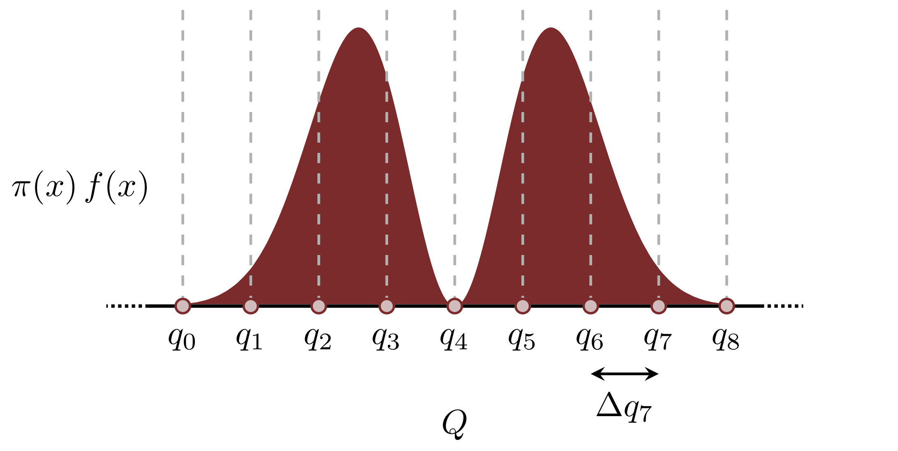
```
<br><br>
</center>

More sophisticated methods might consider the integrand value at both end 
points, interpolating between the two as in the trapezoid rule from calculus.
They might also introduce complex gridding schemes or even modifying the 
integrand to control the overall error.

In two dimensions the volume elements from a uniform grid become squares,

<center>
<br>
```{r, out.width = "50%", echo=FALSE}
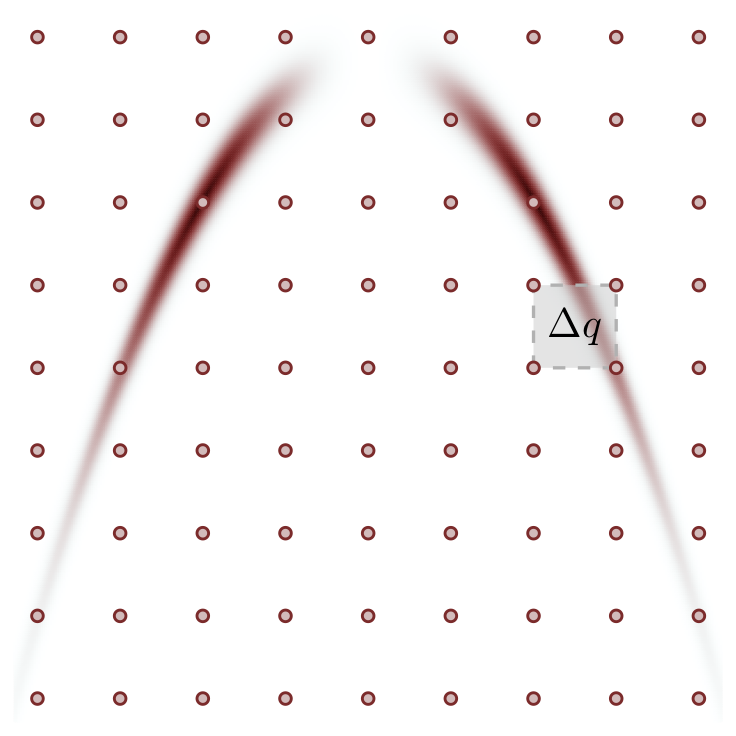
```
<br><br>
</center>

with four bounding grid points and a wealth of ways to interpolate the integrand
values at those points into a single value.

Regardless of the dimension, as more points are added to the quadrature grid the 
discrete volume elements, and the error of the quadrature estimators, shrink.
Exactly how fast the error shrinks depends on the structure and expanse of the 
grid, the smoothness of the integrand, and the dimension of the ambient space.
The construction of sophisticated grids to minimize  errors is a core topic of 
the _Quasi-Monte Carlo_ literature.

In general the more of the ambient space a grid covers, and the denser it is
within that expanse, the more accurate the resulting quadrature estimator will
be, and the more faithful the messages we will receive from our probabilistic
oracle.  At the same time the cost of a quadrature estimator also scales with 
the total number of grid points, and more accurate grids will also be more
expensive.  This is where quadrature methods start facing limitations.

Consider a uniform grid with $N$ points in each dimension of the ambient space,
$Q$.  When $Q$ is one-dimensional the cost of the quadrature estimator is
dominated by the $N$ evaluations of the integrand.  If $Q$ is two-dimensional?
Then the cost increases to $N^{2}$ evaluations.  Three-dimensional?  $N^{3}$
evaluations.  $D$-dimensional?  $N^{D}$.

At this point we have to stop and recognize that the cost of a quadrature 
estimator based on a uniform grid is scaling _exponentially fast_ with 
dimension. To achieve reasonable accuracy we will need reasonably large $N$ for 
a grid with the necessary expanse and density, and after just a few dimensions 
that exponential scaling will completely exhaust whatever computational 
resources we have.

The ultimate lesson here is that any attempt to exhaustively quantify a space,
whether a discrete space or a discretized continuous space, in order to estimate 
expectation values is largely limited to one or two-dimensional problems.  In 
order to scale to the higher-dimensional problems that arise in practice we need 
to be smarter with our precious, finite computational resources.  We need to 
identify exactly _where_ in the ambient space we should be focusing that 
computation to achieve as small an error as possible.

Unfortunately the answer to that question is obfuscated by the counterintuitive 
behaviors of high-dimensional spaces.  In order to build up any conceptual 
understanding we first need to learn how our intuition fails.

## The House Always Wins  {#sec:monte_carlo_intro}

Another way to represent a probability distribution is through exact sampling.
Recall that an exact sampling mechanism is a procedure for generating a sequence 
of _independent_ points in the ambient space, 
$$
\{ q_{1}, \ldots, q_{N} \} \in Q,
$$ 
such that the ensemble average of an real-valued, integrable function,
$$
\hat{f}_{N}^{\text{MC}} = \frac{1}{N} \sum_{n = 1}^{N} f(q_{n}),
$$
defines an _asymtpotically consistent_ estimator of the corresponding 
expectation value,
$$
\lim_{N \rightarrow \infty} \hat{f}_{N}^{\text{MC}} = \mathbb{E}_{\pi}[f].
$$
These estimators are commonly denoted _Monte Carlo estimators_, referencing the 
famous casino because of how exact sampling mechanisms are reminiscent of casino
games [@Betancourt:2018a].

Asymptotic consistency isn't particularly useful in practice because, well, 
infinity is just too big to reasonably approximated by the number of samples we
can generate with finite computational resources.  Fortunately the behavior of 
Monte Carlo estimators with only a finite number of samples can also be
quantified.

The estimator for any _square-integrable_ real-valued function, meaning that 
both $\mathbb{E}_{\pi}[f]$ and $\mathbb{E}_{\pi}[f^{2}]$ exist and are finite,
satisfies a central limit theorem,
$$
\frac{ \hat{f}_{N}^{\text{MC}} - \mathbb{E}_{\pi}[f] }
{\text{MC-SE}_{N}[f] } 
\sim \mathcal{N}(0, 1),
$$ 
where the _Monte Carlo Standard Error_, $\text{MC-SE}_{N}[f]$, is defined by
$$
\text{MC-SE}_{N}[f] 
= \sqrt{ \frac{ \text{Var}_{\pi}[f]}{N} }.
$$
This means that we can quantify the error in the Monte Carlo estimator of a 
square-integrable function _probabilistically_.  Moreover, because we know how 
the standard error varies with the number of samples, $N$, we can determine how 
many exact samples we need to achieve a given precision.  Keep in mind, however, 
that this error bound is probabilistic -- while most samples will yield Monte 
Carlo estimators with error near $\text{MC-SE}_{N}[f]$ some will inevitably 
yield much larger errors.

In practice we won't know the variance of $f$ and hence can't quantify the
Monte Carlo standard error exactly.  We can, however, construct an estimator 
for it at the same time that we construct the Monte Carlo estimator 
$\hat{f}_{N}^{\text{MC}}$.  If $f$ is _cube-integrable_ then this will introduce 
a small error of order $\mathcal{O}(N^{-1})$ which becomes negligible compared 
to the $\mathcal{O}(N^{-\frac{1}{2}})$ standard error for reasonably large $N$.
We often ignore these technicalities in practice, but if the target probability
distribution might be heavy-tailed then we can't be so careless.  While we can
always compute Monte Carlo estimators and their standard errors, they won't have 
any correlation with the true expectation value unless all of these technical
conditions hold.

The basics of implementing a Monte Carlo estimator are then computing empirical
means and variances from a given exact sample.  These require repeatedly summing
over the function evaluations, $f(q_{n})$ and $f^{2}(q_{n})$, which for large 
$N$ is vulnerable to significant errors on computers due to the limitations of
floating point arithmetic [@Knuth:1998].  One way to reduce this vulnerability, 
and avoid repeatedly sweeping over the sample, is to use _Welford accumulators_.
The following accumulator, for example, computes Monte Carlo estimators and 
variance estimators for the input function evaluations.

```{r}
welford_summary <- function(f) {
  summary = c(0, 0)
  for (n in 1:length(f)) {
    delta <- f[n] - summary[1]
    summary[1] <- summary[1] + delta / (n + 1)
    summary[2] <- summary[2] + delta * (f[n] - summary[1])
  }
  summary[2] <- summary[2] / (length(f) - 1)
  return(summary)
}
```

We can then use the Welford accumulator output to compute the Monte Carlo
estimator of the given function as well an estimate of its Monte Carlo Standard
Error,

```{r}
compute_mc_stats <- function(f) {
  summary <- welford_summary(f)
  return(c(summary[1], sqrt(summary[2] / length(f))))
}
```

Technically we cannot perfectly generate exact samples on computers.  Instead 
we use _pseudo random number generators_ which can generate long sequences of
samples from certain distributions that are nearly exact [@Devroye:1986].  Only
when the sequences approach the _cycle_ of the pseudo random number generator
will the error become significant.

Pseudo random number generators do have to be initialized with a _seed_.  The
exact samples generated will depend on the seed, but their statistical behavior
should not.  While the seed shouldn't matter we do want to explicitly set one
instead of relying on some implicit default that we can't replicate; the last 
thing you want is to observe weird behavior that you can't debug because you 
can't reproduce it.  Have fun with your seed, ideally make it an obscure 
reference that few will understand.

```{r}
set.seed(8675309)
```

In this case study I will be using Monte Carlo estimators to demonstrate some
of the counterintuitive behaviors of high-dimensional spaces.  Let's be 
conservative and use _lots_ of samples to ensure small errors for most of the
estimators we'll encounter.
```{r}
N <- 100000
```

One curious behavior of Monte Carlo estimators is that unlike quadrature 
estimators they don't seem to depend on the dimension of the ambient space.
We will return to Monte Carlo and this question in 
[Section 3.2.1](#sec:monte_carlo) once we develop a better understanding of just 
how weird high-dimensional spaces are.

# Concentration of Measure and the Typical Set

We saw in [Section 1.1](#sec:quadrature) that the natural probabilistic 
computation when using probability density functions is limited by the 
overwhelming costs of searching the entire ambient space on which the latent 
probability distribution is defined.  This then motivated the question of 
whether or not we can construct accurate approximations by focusing our finite 
computational resources on only a subset of the ambient space, and if so where 
that focus should be.

In this section I will build up theoretical motivation for the optimal focus 
while contrasting it to the poor intuitions that we often adopt when 
extrapolating our low-dimensional perceptions into higher-dimensional 
circumstances.

While the general lessons apply to both discrete and continuous spaces, for the
rest of this case study I will consider only continuous spaces as ultimately it
is only for those spaces that we have the technology to construct robust yet 
general estimation methods.

## Dense

Probability distributions defined on continuous spaces admit probability
density function representations, from which expectation values can be computed
as integrals,
$$
\mathbb{E}_{\pi}[f] = \int_{Q} \mathrm{d} q \, \pi(q) \, f(q).
$$
Although we can't compute these integrals analytically in anything but the 
simplest problems, we can apply numerical integration methods like quadrature
estimators.

Quadrature estimators based on uniform grids across the ambient space $Q$,
however, became too computationally demanding outside of a few dimensions.
Visual inspection suggests that this demand might not be inherent to quadrature 
in general but rather to the wasteful nature of uniform grids -- most of the 
volume elements defined by a uniform grid seem to offer little contribution to 
the final estimator.

<center>
<br>
```{r, out.width = "50%", echo=FALSE}
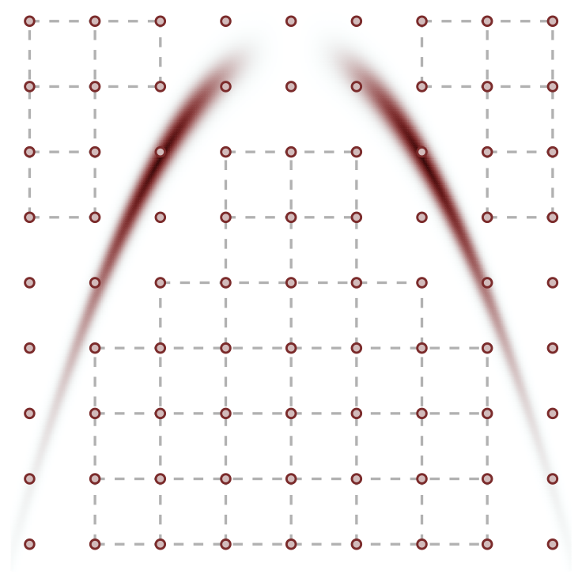
```
<br><br>
</center>

How might we cull the uniform grid to achieve a more efficient quadrature 
estimator?  One immediate idea would be to remove this grid points where the
integrand,
$$
\pi(q) \, f(q),
$$
is not significantly different from zero.  If the integrand is zero in a
neighborhood then so too will be the contribution to the integral in that 
neighborhood,
$$
\int_{A} \mathrm{d} q \, \pi(q) \, f(q)
\approx
\int_{A} \mathrm{d} q \, 0
=
0.
$$
At the same time in neighborhoods where the integrand is larger we expect larger
contributions.  If we are constrained by limited computational resources, then
shouldn't we focus are computation on those neighborhoods where the integrand 
is the largest?  In other words, let's consider grids that concentrate in 
the neighborhoods where the integrand is largest.

<center>
<br>
```{r, out.width = "50%", echo=FALSE}
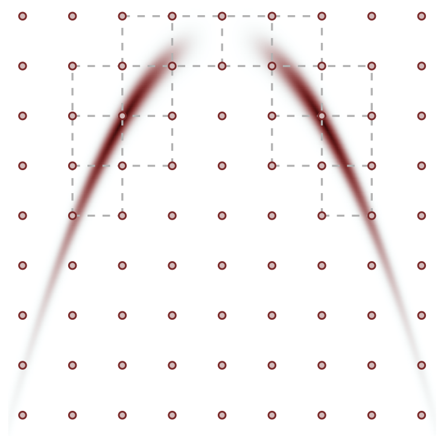
```
<br><br>
</center>

Now I am going to make an important, but restricting, assumption.  For most
applications the functions encoding our questions, $f(q)$, will be reasonably
uniform _relative_ to the strong variations in the target probability density
function, $\pi(q)$.  Consequently the behavior of the integrand, and the 
shape of the most efficient grid, can be well approximated by considering only
the target probability density function.  Methods based on this assumption will
yield expectation value estimators that are reasonably accurate for _most_
functions, but not all.  Care must be taken when attempting to apply any 
of the following lessons when estimating expectation values that that are 
largest far in the tails of the target distribution.

<center>
<br>
```{r, out.width = "50%", echo=FALSE}
knitr::include_graphics("figures/2d_quadrature/grid_density/grid_density.png")
```
<br><br>
</center>

Following this intuition we should be able to develop reasonably efficient
expectation value estimators by finding the mode of the target probability
density function, say with an efficient optimization algorithm, and then
focusing our computation in a small neighborhood around that point of highest
probability density.  To visualize this intuition consider a relatively 
isotropic probability density function in $D$-dimensions.  As we move away 
from the mode in any radial direction the target probability density function,
and presumably the contribution to expectation values, quickly decays.

<center>
<br>
```{r, out.width = "50%", echo=FALSE}
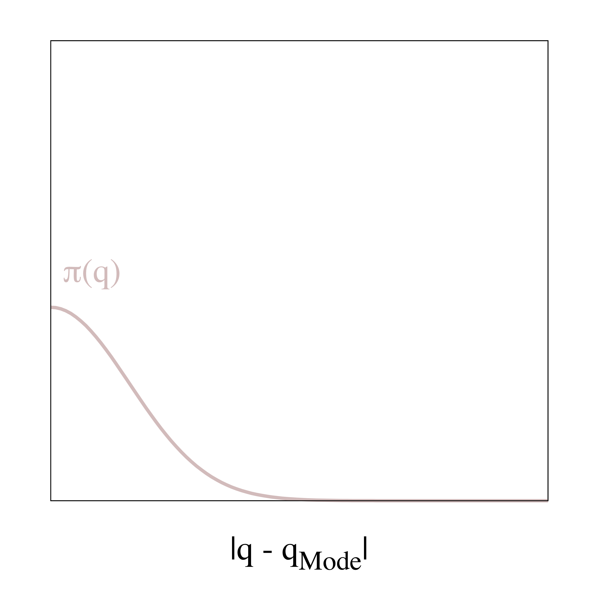
```
<br><br>
</center>

This intuition is pleasing, and consistent with the many optimization-based 
algorithms in the literature.  Unfortunately it ultimately proves to be fatally 
flawed.  Probability density alone is not sufficient for integration.

## Voluminous

In the previous section we focused on how the integrand, and in particular
the target probability density function, influence local contributions to an
integral.  Unfortunately our thought experiment ignored another critical 
influence: _volume_.

The differential volume element $\mathrm{d} q$ that appears in our integral,
$$
\mathbb{E}_{\pi}[f] = \int_{Q} \mathrm{d} q \, \pi(q) \, f(q),
$$
is not just notational convenience to remind us of with respect to which 
variables we are integrating.  It indicates that an integral is determined by
not only the values of the integrand but also the space over which those values
are distributed.  A neighborhood where the integrand is small might still 
provide a significant, if not outright dominant, contribution to an integral if 
its volume is large enough.

Unfortunately volume can behave in surprising ways, especially as we move past
the lower dimensional spaces that characterize our physical perception.  In this
section we'll explore some of the counterintuitive properties of volume over 
the real numbers in order to better understand the fundamental challenges of
probabilistic computation.

### In Every Corner {#sec:rectangular_volume}

Let's begin with a simple example - a square box representing the ambient space.
In each dimension we will partition the box into three smaller boxes, with the
central box corresponding to the neighborhood around the mode and the outer two
side boxes corresponding to the rest of the space.

In one dimension that means that the central, modal box encapsulates a _third_
of the total volume of the enclosing box.  Ignoring the other two boxes isn't
necessarily a terrible approximation.

<center>
<br>
```{r, out.width = "25%", echo=FALSE}
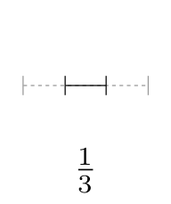
```
<br><br>
</center>

Now consider adding another dimension.  Adding the two side boxes corresponding
to that new dimension yields five total boxes, and an almost linear increase in 
the total volume under consideration.  Those boxes, however, do not completely 
fill the enclosing box.  To do that we have to also add the four _corner_ boxes 
which brings the total enclosed volume up to nine boxes.  The relative 
importance of that central box has all of a sudden dropped to only a _ninth_.

<center>
<br>
```{r, out.width = "75%", echo=FALSE}
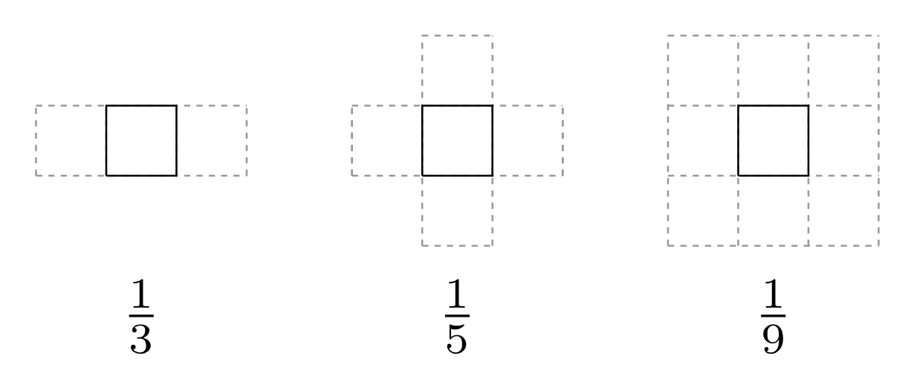
```
<br><br>
</center>

Moving to three dimensions the situation becomes even more dire.  Along each
axis we have seven boxes.  Adding the corners in each two-dimensional plane adds 
twelve more boxes for a total of nineteen.  This, however, still does not fill 
up the enclosing box!

To completely fill the space we need to consider not just the corners but also
the corners of corners.  _It's corner madness!_  The corner-corners add eight
more boxes, bringing the total number of boxes up to twenty seven and the 
relative importance of the central box to just _one twenty-seventh_!

<center>
<br>
```{r, out.width = "100%", echo=FALSE}
knitr::include_graphics("figures/rectangular_volume/3d/box.png")
```
<br><br>
</center>

Extrapolating it looks like the relative contribution of the central box scales
as the relative partition width raised to the dimension of the space, in this
case $(1 / 3)^{D}$.  We can verify this scaling empirically using Monte Carlo.
The relative importance of the central box is its probability with respect to a 
uniform distribution over the enclosing box, which we can estimate by sampling 
from that uniform distribution and computing the Monte Carlo estimator of the 
expectation value of the corresponding _inclusion function_, 
$$
\begin{align*}
\mathbb{P}_{\pi} [ B_{c} ] 
&=
\mathbb{E}_{\pi}[ I_{B_{c}} ]
\\
&= 
\int_{B} \mathrm{d} q \, U(q) \, I_{B_{c}}(q)
\\
&\approx
\frac{1}{N} \sum_{n = 1}^{N} I_{B_{c}}(q_{n})
\\
&=
\frac{ N_{\text{in central box}} }{ N }.
\end{align*}
$$

For example in one-dimension we get

```{r, cache=TRUE}
# We start by assuming that the sampled
# point will be in the central box with
# the indicator function equaling one
D <- 1
is_central_samples <- rep(1, N)

for (n in 1:N) {
  # Sample a new point one dimension at a time
  for (d in 1:D) {
    q_d <- runif(1, -3, 3)
  
    # If the sampled component is not contained 
    # within the central interval then set the 
    # inclusion function to zero
    if (-1 > q_d || q_d > 1)
      is_central_samples[n] <- 0
  }
}

# Estimate the relative volume as a probability
compute_mc_stats(is_central_samples)
```

This is consistent with the value of $1/3$ we reached from geometric
considerations.  The beauty of Monte Carlo, however, is that we can quickly 
ramp up the dimensionality of the space without having to count so many damned 
boxes.

```{r, cache=TRUE}
Ds <- 1:10

prob_means <- 0 * Ds
prob_ses <- 0 * Ds

for (D in Ds) {
  is_central_samples <- rep(1, N)
  for (n in 1:N) {
    for (d in 1:D) {
      q_d <- runif(1, -3, 3)
      if (-1 > q_d || q_d > 1)
        is_central_samples[n] <- 0
    }
  }
  # Estimate the relative volume as a probability
  s <- compute_mc_stats(is_central_samples)
  prob_means[D] <- s[1]
  prob_ses[D] <- s[2]
}

# Plot probabilities versus dimension
c_light <- c("#DCBCBC")
c_light_highlight <- c("#C79999")
c_mid <- c("#B97C7C")
c_mid_highlight <- c("#A25050")
c_dark <- c("#8F2727")
c_dark_highlight <- c("#7C0000")

idx <- rep(Ds, each=2)
plot_Ds <- sapply(1:length(idx), function(b) if(b %% 2 == 0) idx[b] + 0.5 else idx[b] - 0.5)

pad_means <- do.call(cbind, lapply(idx, function(n) prob_means[n]))
pad_ses <- do.call(cbind, lapply(idx, function(n) prob_ses[n]))

plot(1, type="n", main="",
xlim=c(head(Ds, 1) - 0.5, tail(Ds, 1) + 0.5), xlab="Dimension",
ylim=c(0, 0.5), ylab="Probability")

polygon(c(plot_Ds, rev(plot_Ds)), 
        c(pad_means + 2 * pad_ses, rev(pad_means - 2 * pad_ses)),
        col = c_light, border = NA)
lines(plot_Ds, pad_means, col=c_dark, lwd=2)
```

We see not only the one-ninth and one-twenty-seventh in two and three dimensions
but also the general $(1/3)^{D}$ scaling we hypothesized for higher dimensions.
This exponential scaling renders the central box, or any single box for that 
matter, essentially negligible relative to the full space once we reach three or
four dimensions.  In other words trying to represent the full space with any
single box is a rapidly worsening approximation as the dimensionality of our
space increases.

### She'll Be Coming 'Round the Corner {#sec:spherical_volume}

Another way to reason about volume in spaces of increasing dimension is to
consider what happens in the neighborhood of a sphere.  In particular, how much
volume is contained within a shell immediately inside the sphere relative to the
volume contained within a shell immediately outside of the sphere with the 
same radial width? To better intuit that relationship let's break those shells 
down into wedges that subtend a constant solid angle.

In one dimension a sphere is just two points, and the inner and outer wedges
are just the inner and outer shells themselves.  Because the wedges have the 
same size on both sides of either point, the inner and outer shells will 
encapsulate the same volume.

<center>
<br>
```{r, out.width = "50%", echo=FALSE}
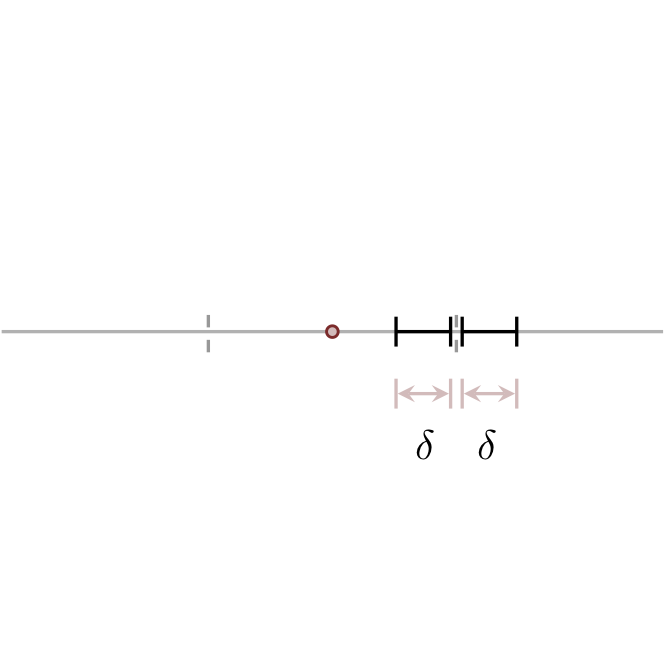
```
<br><br>
</center>

In two dimensions our sphere becomes a circle, and now we can see an asymmetry
on the two sides.  Inside the circle there is only limited room.  As the radial 
width of the inner shell increases the inner wedges have to shrink.  Outside the 
circle there is significantly more room which allows the wedges to instead 
expand.  Summing up all of the wedges we end up with more volume outside the 
sphere than inside the sphere.

<center>
<br>
```{r, out.width = "50%", echo=FALSE}
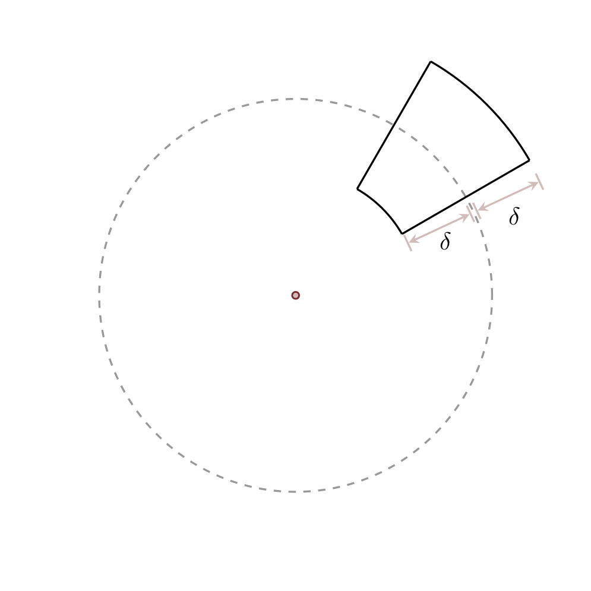
```
<br><br>
</center>

When we consider three dimensions the asymmetry only grows stronger. The outer
wedges can now expand into _both_ angular directions while the inner wedges have
to shrink in both angular directions, leading to even more volume outside the 
sphere than inside.

<center>
<br>
```{r, out.width = "50%", echo=FALSE}
knitr::include_graphics("figures/spherical_volume/3d/wedge.png")
```
<br><br>
</center>

We can verify these qualitative relationships, and provide some quantitative
understanding, by appealing once against to Monte Carlo estimation.  In
particular let's consider a sphere of radius 2 inside our same box and ask how 
much volume is contained with an inner shell spanning radii 1.5 to 2, and an 
outer shell spanning radii 2 to 2.5.

```{r, cache=TRUE}
prob_inner_means <- 0 * Ds
prob_inner_ses <- 0 * Ds

prob_outer_means <- 0 * Ds
prob_outer_ses <- 0 * Ds

R <- 2
delta <- 0.5

for (D in Ds) {
  # Does the sampled point fall in the inside neighborhood?
  is_inner_samples <- rep(0, N)
  # Does the sampled point fall in the outside neighborhood?
  is_outer_samples <- rep(0, N)

  for (n in 1:N) {
    # Sample a new point
    x <- runif(D, -3, 3)
  
    # Compute distance from origin
    r <- sqrt(sum(x**2))
  
    # Check if point falls in the inside neighborhood
    if (R - delta < r && r < R)
    is_inner_samples[n] <- 1;
  
    # Check if point falls in the outside neighborhood
    if (R < r && r < R + delta)
    is_outer_samples[n] <- 1;
  }

  # Estimate the relative volumes as probabilities
  s1 <- compute_mc_stats(is_inner_samples)
  prob_inner_means[D] <- s1[1]
  prob_inner_ses[D] <- s1[2]

  s2 <- compute_mc_stats(is_outer_samples)
  prob_outer_means[D] <- s2[1]
  prob_outer_ses[D] <- s2[2]
}

# Plot probabilities versus dimension
pad_inner_means <- do.call(cbind, lapply(idx, function(n) prob_inner_means[n]))
pad_inner_ses <- do.call(cbind, lapply(idx, function(n) prob_inner_ses[n]))

pad_outer_means <- do.call(cbind, lapply(idx, function(n) prob_outer_means[n]))
pad_outer_ses <- do.call(cbind, lapply(idx, function(n) prob_outer_ses[n]))

plot(1, type="n", main="",
xlim=c(head(Ds, 1) - 0.5, tail(Ds, 1) + 0.5), xlab="Dimension",
ylim=c(0, 0.25), ylab="Probability")

polygon(c(plot_Ds, rev(plot_Ds)),
        c(pad_inner_means + 2 * pad_inner_ses, rev(pad_inner_means - 2 * pad_inner_ses)),
        col = c_light, border = NA)
lines(plot_Ds, pad_inner_means, col=c_light_highlight, lwd=2)

polygon(c(plot_Ds, rev(plot_Ds)),
        c(pad_outer_means + 2 * pad_outer_ses, rev(pad_outer_means - 2 * pad_outer_ses)),
        col = c_dark, border = NA)
lines(plot_Ds, pad_outer_means, col=c_dark_highlight, lwd=2)
```

The volume in both shells is rapidly decreasing with dimension, but the volume 
in the outer shell is always larger than the volume in the inner shell.
Interestingly enough the volume in the outer shell initially increases before
starting to decay.  If we looked at shells of larger radii we would see this 
behavior extend out to higher dimensions.  In some sense the growth of volume 
in the corners manifests as a wave that propagates from small radii to larger
radii as the dimensionality of the space increases!

We can compare the volumes of the inner and outer shells directly by plotting 
the ratio of probabilities versus dimension.

```{r}
plot(1, type="n", main="",
xlim=c(head(Ds, 1) - 0.5, tail(Ds, 1) + 0.5), xlab="Dimension",
ylim=c(0, 10), ylab="Ratio of Outer versus Inner Probability")

lines(plot_Ds, pad_outer_means / pad_inner_means, col=c_dark_highlight, lwd=2)
```

This then verifies that the volume in the outer shell is decreasing more slowly
than the volume in the inner shell so that there is always more volume 
immediately outside the sphere then immediately inside the sphere.  Although the
noise in the Monte Carlo standard errors here makes this somewhat hard to see, 
the ratio of volumes in fact grows exponentially fast,
$$
\frac{(R + \delta)^{D} - (R)^{D}}{(R)^{D} - (R - \delta)^{D}}.
$$
Not only is there more volume immediately outside a sphere, there is 
_exponentially_ more.

### $D \rightarrow \infty$ Is The Loneliest Number

Using what we've learned from the last two exercises we can now start to put 
together a very loose intuition for how volume behaves in high-dimensional real 
number spaces.  Imagine situating ourselves at a point surrounded by a closed 
surface.  No matter where that point is located in the ambient space, volume 
will appear to concentrate away from us, squeezing up against the boundary of 
the enclosing surface.  If we expand the surface to probe more of the 
neighboring space then the volume only pushes further away.  As the box grows to 
be infinitely large, and we get a more global perspective on the entire space, 
it appears as if all of the volume is in fact concentrating in neighborhoods 
infinitely far away.

One way to visualize this behavior is to employ a _stereographic projection_
of the real numbers.  Here we introduce a sphere that makes contact with the 
real numbers at a point and then "roll" the real numbers up around it.
Alternatively we can imagine that the sphere is shiny, with the projection 
defined by the reflection of the real numbers on its surface.

Regardless of the exact interpretation, a stereographic projection maps 
infinity in each direction to a common point at north pole of the sphere.  Most 
of the ambient space maps into a small neighborhood surrounding that 
_point at infinity_.

<center>
<br>
```{r, out.width = "75%", echo=FALSE}
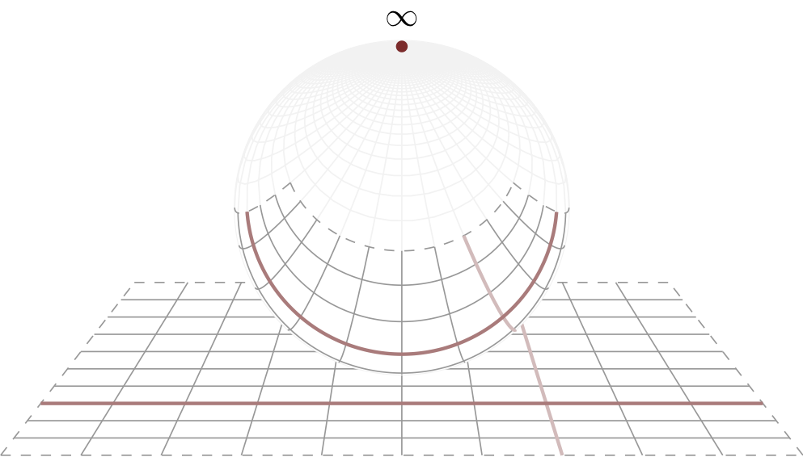
```
<br><br>
</center>

High-dimensional spaces are 
[lonely places](https://twitter.com/bschoelkopf/status/503554842829549568).
The next time you find yourself at a social event and notice that everyone seems 
to be avoiding your local neighborhood perhaps you can take solace in the fact 
that maybe, just maybe, you've actually stumbled into a higher-dimensional space
than the one to which you are accustomed.

We can formalize the forlorn nature of high-dimensional spaces by simulating
the distance between two points randomly sampled from our box.  Because of the
finite extent of our box the distance is bounded above by the largest diagonal,
$$
L \cdot \sqrt{D} = 6 \sqrt{D}.
$$
To better compare between dimensions I will normalize all distances to this
maximum.

```{r, cache=TRUE}
# Quantile probabilities that we'll use to visualize distributions
quant_probs = c(0.1, 0.2, 0.3, 0.4, 0.5, 0.6, 0.7, 0.8, 0.9)

delta_means <- 0 * Ds
delta_ses <- 0 * Ds
delta_quantiles <- matrix(data = 0, nrow = tail(Ds, 1), ncol = 9)

for (D in Ds) {
  # Distances between two sampled points
  delta_samples <- rep(0, N)
  max_delta <- 6 * sqrt(D)

  for (n in 1:N) {
    # Sample two points
    x1 <- runif(D, -3, 3)
    x2 <- runif(D, -3, 3)
  
    # Compute distance between them
    delta_samples[n] <- sqrt(sum( (x1 - x2)**2 )) / max_delta
  }

  # Estimate average distance
  s <- compute_mc_stats(delta_samples)
  delta_means[D] <- s[1]
  delta_ses[D] <- s[2]

  # Estimate distance quantiles
  delta_quantiles[D,] <- quantile(delta_samples, probs=quant_probs)
}
```

After an initial increase the average relative distance between points
stabilizes to about 40% of the maximum distance.  Because that maximum distance
is growing, however, the absolute distance is also growing on average.

```{r}
pad_delta_means <- do.call(cbind, lapply(idx, function(n) delta_means[n]))
pad_delta_ses <- do.call(cbind, lapply(idx, function(n) delta_ses[n]))

plot(1, type="n", main="",
xlim=c(head(Ds, 1) - 0.5, tail(Ds, 1) + 0.5), xlab="Dimension",
ylim=c(0, 1), ylab="Average Relative Distance Between Points")

polygon(c(plot_Ds, rev(plot_Ds)),
c(pad_delta_means + 2 * pad_delta_ses, rev(pad_delta_means - 2 * pad_delta_ses)),
col = c_light, border = NA)
lines(plot_Ds, pad_delta_means, col=c_dark, lwd=2)
```

The average, however, doesn't tell the complete story.  The average is
increasing, but the variance of the distances might also be sufficiently large 
that the probability of being close to someone doesn't vanish.  To study that
we need to examine the entire distance distribution, which we accomplish here
by plotting nested quantiles estimated from our samples.

```{r}
pad_delta_quantiles <- do.call(cbind, lapply(idx, function(n) delta_quantiles[n, 1:9]))

plot(1, type="n", main="",
xlim=c(head(Ds, 1) - 0.5, tail(Ds, 1) + 0.5), xlab="Dimension",
ylim=c(0, 1), ylab="Relative Distance Between Points")

polygon(c(plot_Ds, rev(plot_Ds)), 
        c(pad_delta_quantiles[1,], rev(pad_delta_quantiles[9,])),
        col = c_light, border = NA)
polygon(c(plot_Ds, rev(plot_Ds)), 
        c(pad_delta_quantiles[2,], rev(pad_delta_quantiles[8,])),
        col = c_light_highlight, border = NA)
polygon(c(plot_Ds, rev(plot_Ds)), 
        c(pad_delta_quantiles[3,], rev(pad_delta_quantiles[7,])),
        col = c_mid, border = NA)
polygon(c(plot_Ds, rev(plot_Ds)), 
        c(pad_delta_quantiles[4,], rev(pad_delta_quantiles[6,])),
        col = c_mid_highlight, border = NA)
lines(plot_Ds, pad_delta_quantiles[5,], col=c_dark, lwd=2)
```

As the _average_ relative distance stabilizes with increasing dimension, the 
_distribution_ of relative distances rapidly concentrates around the average.
In other words, not only is the average absolute distance increasing with the 
dimension, the probability that you end up close to someone decreases extremely 
quickly.

This behavior is relevant to more than just existential dread.  The increasing
space between points is extremely important when consideration _interpolation_
methods that try to fill in functional behavior between points where the 
function output is known.  By assuming a certain rigidity one can constrain the 
possible interpolations in neighborhoods around each point.  As the dimension 
increases, however, those neighborhoods drift apart and that constraint becomes 
weaker.  To maintain the same interpolative power one would have to either 
increase the density of the points with known function values or improve the 
rigidity constraint exponentially quickly.

## Massive

As the dimensionality of the ambient space increases volume appears to 
concentrate around the point at infinity, seemingly repelled from any finite 
point including the mode of the target probability density function within a 
given parameterization.  Indeed the strength of that concentration grows 
exponentially fast with increasing dimension.

<center>
<br>
```{r, out.width = "50%", echo=FALSE}
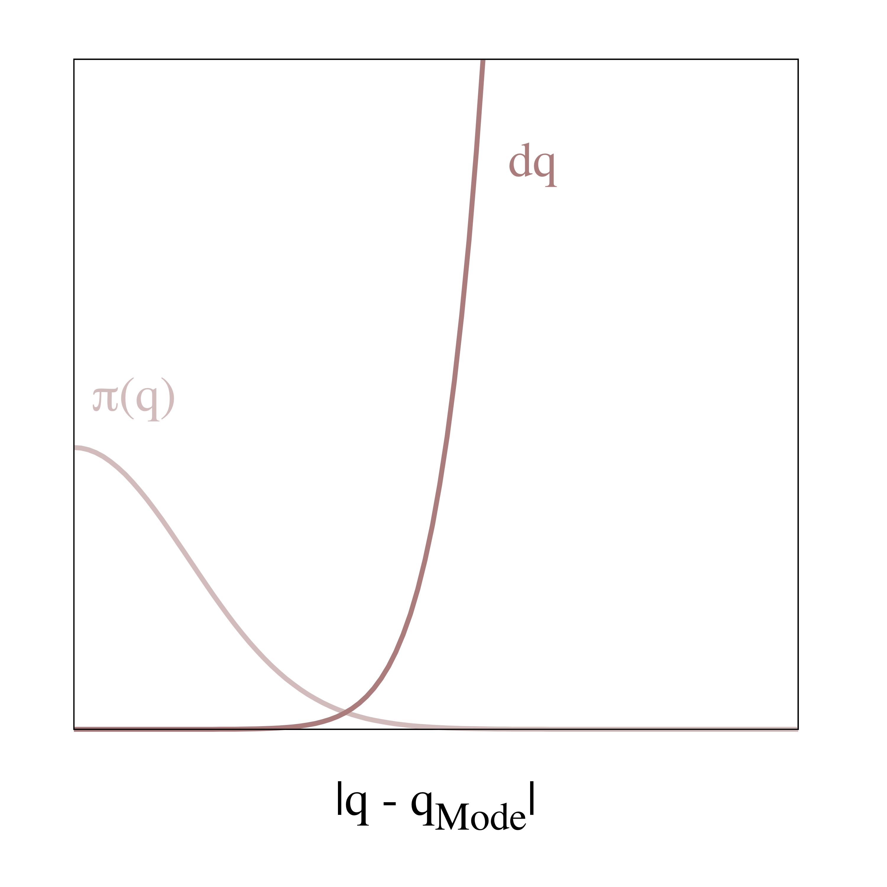
```
<br><br>
</center>

The neighborhoods in the ambient space that contribute most to integrals, and
hence our target expectation values, must contain not only significant 
probability density but also significant volume.  More specifically we should be 
considering the product of these contributions: _differential probability mass_.

<center>
<br>
```{r, out.width = "50%", echo=FALSE}
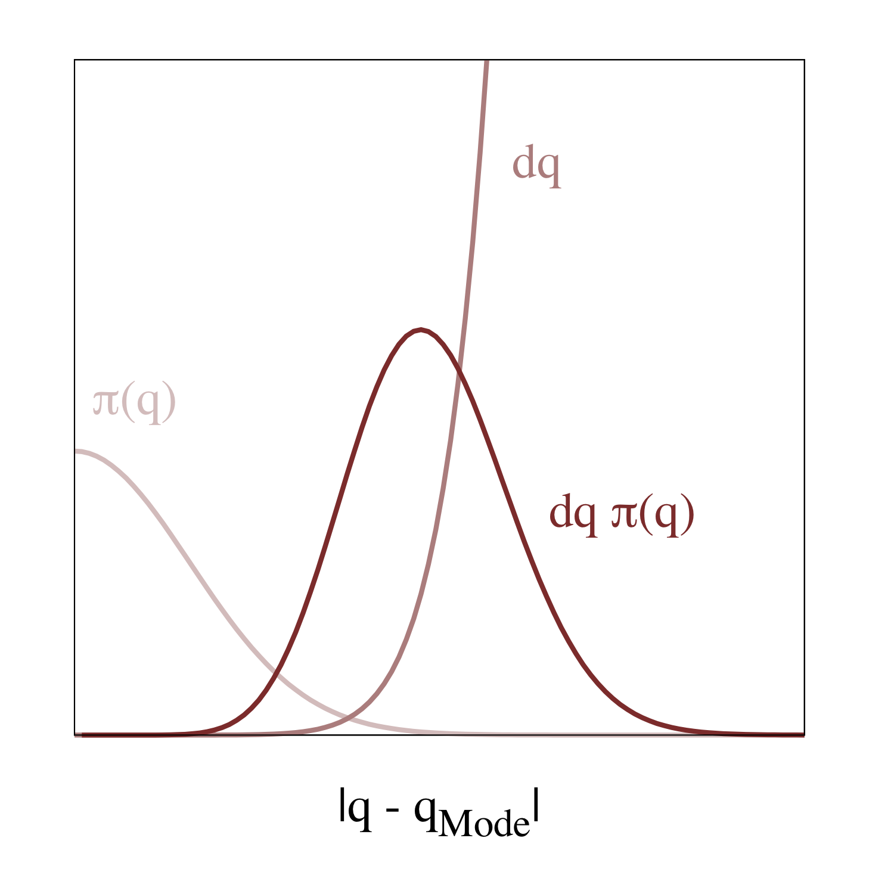
```
<br><br>
</center>

Differential probability mass doesn't concentrate in neighborhoods around the 
mode because there isn't sufficient volume there.  It also doesn't concentrate 
in neighborhoods around infinity because of the vanishing probability density.
Instead it compromises between those two extremes, concentrating around a 
surface _surrounding_ the mode.  This neighborhood is called the _typical set_,
and as the dimension of the ambient space increases it manifests an important 
behavior known as _concentration of measure_.  The geometry of this neighborhood 
is critical to not only probabilistic computational methods that can scale 
beyond a few dimensions but also probabilistic reasoning itself.

### Where Have All the Cowboys Gone?

Conceptually the typical set defines a neighborhood in the ambient space where 
the probability density and the local volume are both large enough that their 
product, differential probability mass, is non-negligible.  A threshold on 
encapsulated probability mass defining exactly what "non-negligible" means 
defines a surface around the mode in which differential probability mass 
concentrates.

<center>
<br>
```{r, out.width = "50%", echo=FALSE}
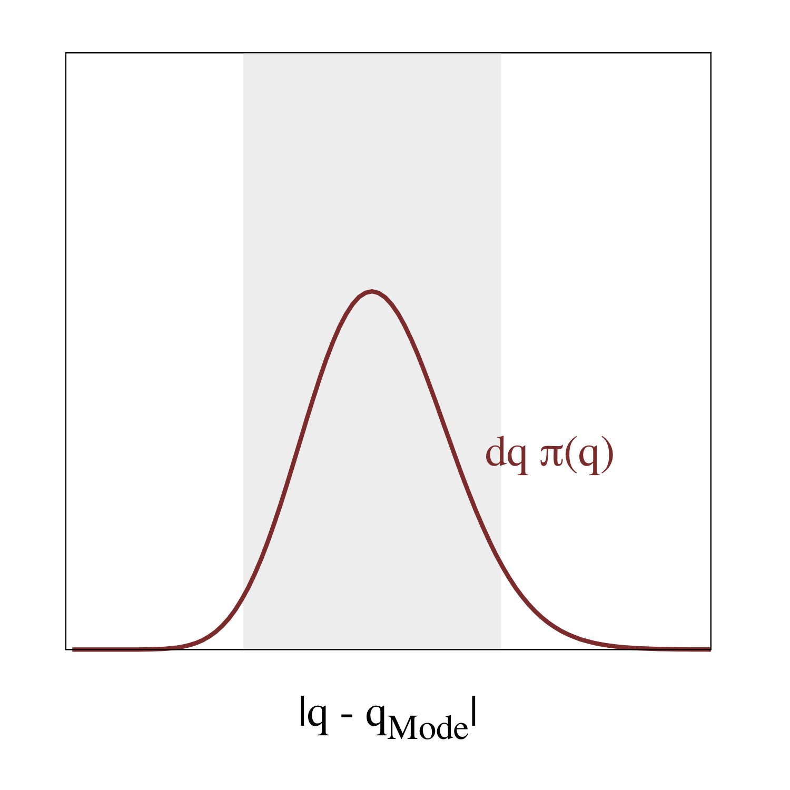
```
<br><br>
</center>

Because we are free to choose a threshold, the typical set doesn't really define 
a specific neighborhood but rather a family of nested neighborhoods, each 
corresponding to a weaker threshold.  Consequently a better intuition is a 
_fuzzy_ surface that surrounds, but concentrates away from, the local mode of 
the representative probability density function.

<center>
<br>
```{r, out.width = "75%", echo=FALSE}

```
<br><br>
</center>

The concept of the typical set is borrowed from the field of information theory 
[@Shannon:1948] [@MacKay:2003] [@CoverEtAl:2006], which motivates yet another 
intuition for the concept.  The typical set defines the most efficient way to 
_compress_ a probability distribution by considering only a subset of the 
ambient space.  This helps clarify, for example, why the neighborhood around the 
mode is so inconsequential for probabilistic computation; the most efficient way 
to characterize a probability distribution with only finite resources is to 
focus on quantifying this fuzzy surface, not its interior or exterior.  
Approximations compatible with this compression tackle a smaller problem and 
hence better exploit whatever computational resources are available.

In information theory compression is defined with respect to _messages_ 
comprised of _words_.  In isolation each component word is likely to be near the 
modal word, but as we construct longer and longer messages we provide more and
more opportunity for _some_ of the words to deviate.  The probability that a 
long message contains no deviant words or all deviant words both become 
negligible, with most messages confined to the set of messages with "typical" 
fluctuations. 

Probabilistically we can interpret a message as a point in our ambient space, 
with each word interpreted as the projection of that point along each dimension
in the space.  Any single component is likely to be found near the projection of
the mode because of the pull of the target probability density function.  The 
volume, however, induces fluctuations in some of the components which push the 
constituent point away from the global mode.  Exact samples are "typical", each
influenced by fluctuations that push it _somewhere_ within the typical set.  
Each samples experience different fluctuations and an ensemble of samples 
disperses across the typical set.

<center>
<br>
```{r, out.width = "75%", echo=FALSE}

```
<br><br>
</center>

This sampling perspective is particularly helpful for understanding some of the 
more subtle properties of the typical set.  For example, the typical set is not 
the _highest probability set for a given volume_, especially for small volumes.
Because we don't know how an exact sample will fluctuate, and _where_ in the 
typical set it will manifest, our best guess of where to find a single exact 
sample will be a neighborhood around the mode that encompasses small 
fluctuations in all directions.  It's only when we consider many samples that
we are better off guessing neighborhoods in the typical set.

One immediate application of this intuition is in the context of gambling on the
games in a tournament, such as the college basketball championship.  Absent all 
other information, the best strategy for a single game is to bet on the 
favorite.  Taking the favorite for all of the games, however, ends up being a 
terrible strategy.  While an upset in any single game is rare, having _no_ 
upsets over the entire tournament is rarer.

At the same time we don't know _which_ games will produce upsets, and so any 
single bet on the outcome of every game is exceedingly unlikely to win.  In 
order to increase the odds of winning one has to make _many_ bets, filling out 
the typical set of tournament outcomes.  This is one way that casinos and 
professional gamblers are able to maintain steady profits while even the 
smartest casual gambler enjoys only small expected gains.

### Concentration of Measure

The typical set defines the right abstraction for how to efficiently approximate
probability distributions in more than a few dimensions.  Instead of visualizing 
the distribution as a density concentrating at the mode we are better served 
visualizing it as a fuzzy surface that surrounds the mode.  Our next step is to
figure out how this fuzzy surface abstraction changes with dimension.

As we motivated above, the volume will concentrate more strongly away from any 
single point and towards infinity as the dimensionality of the ambient space 
increases.  This implies that volume recedes away from the mode.

<center>
<br>
```{r, out.width = "50%", echo=FALSE}
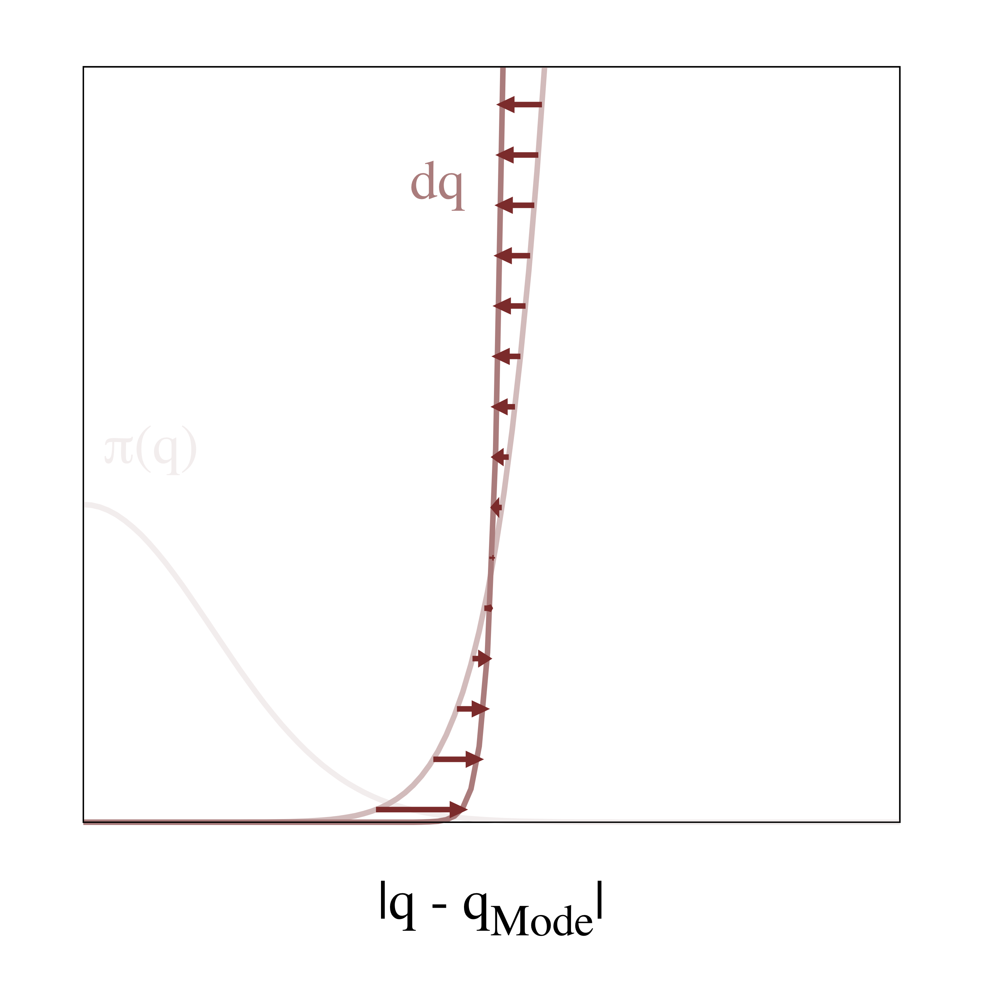
```
<br><br>
</center>

If the target probability density function maintains the same tail behavior then 
the balance between probability density and volume will shift.  The volume 
becomes more dominant, pulling the differential probability mass, and the 
typical set, further towards infinity in a process known as concentration of
measure.

<center>
<br>
```{r, out.width = "50%", echo=FALSE}
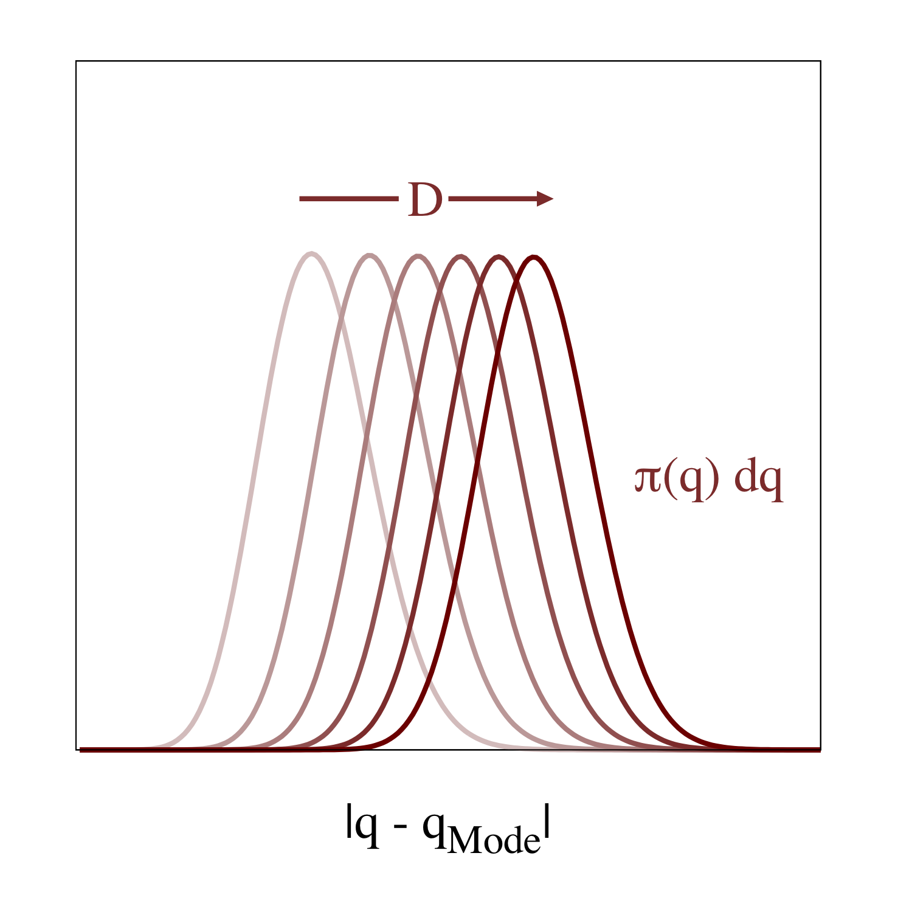
```
<br><br>
</center>

The increasing tension between probability density and volume yields a worse
compromise, and those compromises are found at points further and further from
the mode.  The _absolutle_ width of the typical set usually remains the same, 
but the _relative_ width narrows as the typical set marches towards infinity 
with increasing dimension.  If we zoom out to keep the entirety of the typical 
set in view then the fuzzy neighborhood will _appear_ to be getting more narrow.  
In other words if we scale distances by the translation, usually on the order 
of the square root of dimension, then the rescaled typical set will narrow at 
the same rate.

<center>
<br>
```{r, out.width = "50%", echo=FALSE}
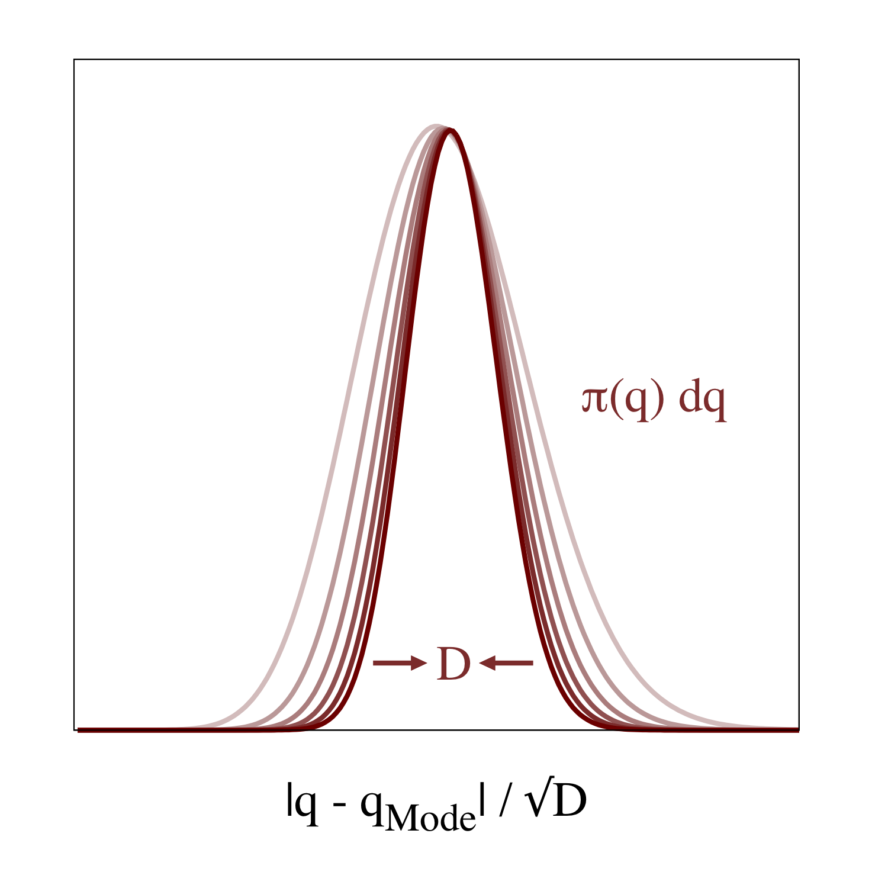
```
<br><br>
</center>

The repulsion of the typical set away from the mode implies that the relative 
breadth of the typical set, how far its fuzziness diffuses, shrinks with 
increasing dimension.  As we consider higher-dimensional spaces the typical set 
becomes ever more thin and gossamer, and all the harder to find and explore.

To make this concept more concrete let's consider a simple example where the
target probability density function is the product of $D$ independent, 
identical Gaussian probability density functions, 
$$
\begin{align*}
\pi \! \left( q \right) 
&= 
\prod_{d = 1}^{D} \pi \! \left( q_{d} \right) 
\\
&=
\prod_{d = 1}^{D} 
\frac{1}{\sqrt{2 \pi \sigma^{2} } }
\exp \! \left( - \frac{q_{d}^{2}}{2 \sigma^{2}} \right).
\end{align*}
$$
Conveniently, we can study this system through both empirical simulations and
analytic results.

#### Simulation Study

We can generate a sample from our target distribution by sampling from each of
the component distributions, each specified by the same Gaussian probability
density function.  This then allows us to compute Monte Carlo estimators of 
illuminating probabilities and expectation values.

For example, we can ask how much probability is contained in a sphere of radius
one around the mode at $q = 0$.

```{r, cache=TRUE}

prob_means <- 0 * Ds
prob_ses <- 0 * Ds

R <- 1

for (D in Ds) {
  # Does the sample fall into the spherical neighborhood?
  is_central_samples <- rep(0, N)

  for (n in 1:N) {
    # Sample a new point
    q <- rnorm(D, 0, 1)
  
    # Compute radial distance from mode
    r <- sqrt(sum(q**2))
  
    # Check if sample is contained within spherical neighborhood
    if (r < R)
    is_central_samples[n] <- 1
  }

  # Estimate probability of falling into spherical neighborhood
  s <- compute_mc_stats(is_central_samples)
  prob_means[D] <- s[1]
  prob_ses[D] <- s[2]
}

# Plot inclusion probability versus dimension
pad_means <- do.call(cbind, lapply(idx, function(n) prob_means[n]))
pad_ses <- do.call(cbind, lapply(idx, function(n) prob_ses[n]))

plot(1, type="n", main="",
xlim=c(head(Ds, 1) - 0.5, tail(Ds, 1) + 0.5), xlab="Dimension",
ylim=c(0, 0.7), ylab="Inclusion Probability")

polygon(c(plot_Ds, rev(plot_Ds)), 
        c(pad_means + 2 * pad_ses, rev(pad_means - 2 * pad_ses)),
        col = c_light, border = NA)
lines(plot_Ds, pad_means, col=c_dark, lwd=2)
```

Even with probability density pulling us towards the mode, the neighborhood
around the mode hemorrhages probability as the dimensionality of the ambient
space increases.  Indeed we see the same exponential recession as we saw with 
the uniform probability density function in 
[Section 2.2.1](#sec:spherical_volume) and 
[Section 2.2.2](#sec:rectangular_volume).

This simulation demonstrates that our probability mass is moving away from the 
mode, but where exactly is it concentrating?  Let's look at the distribution of 
Euclidean distance from the mode,

```{r, cache=TRUE}
r_means <- 0 * Ds
r_ses <- 0* Ds
r_quantiles <- matrix(data = 0, nrow = tail(Ds, 1), ncol = 9)

for (D in Ds) {
  # Distance from Gaussian samples to mode at zero
  r_samples <- rep(0, N)

  for (n in 1:N) {
    # Sample point
    q <- rnorm(D, 0, 1)
  
    # Compute distance from point to mode at zero
    r_samples[n] <- sqrt(sum(q**2))
  }

  # Estimate average distance
  s <- compute_mc_stats(r_samples)
  r_means[D] <- s[1]
  r_ses[D] <- s[2]

  # Estimate distance quantiles
  r_quantiles[D,] <- quantile(r_samples, probs=quant_probs)
}

# Plot average distance from mode versus dimension
pad_r_means <- do.call(cbind, lapply(idx, function(n) r_means[n]))
pad_r_ses <- do.call(cbind, lapply(idx, function(n) r_ses[n]))

plot(1, type="n", main="",
     xlim=c(head(Ds, 1) - 0.5, tail(Ds, 1) + 0.5), xlab="Dimension",
     ylim=c(0, 4), ylab="Expected Distance From Mode")

polygon(c(plot_Ds, rev(plot_Ds)),
        c(pad_r_means + 2 * pad_r_ses, rev(pad_r_means - 2 * pad_r_ses)),
        col = c_light, border = NA)
lines(plot_Ds, pad_r_means, col=c_dark, lwd=2)
```

As we hypothesized the expected distance is pushing away from the mode with 
increasing dimension because of the overwhelming influence of the growing volume 
around infinity.  We can visualize the entire distribution using quantiles.

```{r}
# Plot distance quantiles versus dimension
pad_r_quantiles <- do.call(cbind, lapply(idx, function(n) r_quantiles[n, 1:9]))

plot(1, type="n", main="",
     xlim=c(head(Ds, 1) - 0.5, tail(Ds, 1) + 0.5), xlab="Dimension",
     ylim=c(0, 4), ylab="Distance From Mode")

polygon(c(plot_Ds, rev(plot_Ds)), c(pad_r_quantiles[1,], rev(pad_r_quantiles[9,])),
        col = c_light, border = NA)
polygon(c(plot_Ds, rev(plot_Ds)), c(pad_r_quantiles[2,], rev(pad_r_quantiles[8,])),
        col = c_light_highlight, border = NA)
polygon(c(plot_Ds, rev(plot_Ds)), c(pad_r_quantiles[3,], rev(pad_r_quantiles[7,])),
        col = c_mid, border = NA)
polygon(c(plot_Ds, rev(plot_Ds)), c(pad_r_quantiles[4,], rev(pad_r_quantiles[6,])),
        col = c_mid_highlight, border = NA)
lines(plot_Ds, pad_r_quantiles[5,], col=c_dark, lwd=2)
```

This visualization demonstrates not only the increasing distance but also the
recession of probability away from the mode as the it concentrates into the 
typical set.

It's important to recognize just how quickly these behaviors are turning on.
Once we're past two, maybe three, dimensions we can no longer ignore these 
behaviors we attribute to probability distributions in "high-dimensional" 
ambient spaces.  Physicists are rightfully derided for their often careless 
handling of infinity, but when it comes to the qualitative behavior of 
probability distributions it really is, as George Gamov put it, 
"1, 2, 3, infinity!" [@Gamow:1988].

That said, the concentration of probability around the typical set is easier to 
see when we consider higher dimensions.  Let's repeat the above exercise but
extend to one hundred dimensions and look at distances normalized by the square 
root of the dimension. 

```{r, cache=TRUE}
Ds <- 10 * (0:10) + 1
I <- length(Ds)
r_quantiles <- matrix(data = 0, nrow = I, ncol = 9)

for (i in 1:I) {
  D <- Ds[i]
  # Distance from Gaussian samples to mode at zero
  r_samples <- rep(0, N)
  for (n in 1:N) {
    # Sample point
    q <- rnorm(D, 0, 1)
    # Compute distance from point to mode at zero
    r_samples[n] <- sqrt(sum(q**2) / D)
  }
  # Estimate distance quantiles
  r_quantiles[i,] <- quantile(r_samples, probs=quant_probs)
}

plot(1, type="n", main="",
     xlim=c(head(Ds, 1) - 0.5, tail(Ds, 1) + 0.5), xlab="Dimension",
     ylim=c(0, 2), ylab="Normalized Distance From Mode")

arrows(Ds, r_quantiles[,1], Ds, r_quantiles[,9], 
       length=0, lwd=10, col = c_light)
arrows(Ds, r_quantiles[,2], Ds, r_quantiles[,8], 
       length=0, lwd=10, col = c_light_highlight)
arrows(Ds, r_quantiles[,3], Ds, r_quantiles[,7], 
       length=0, lwd=10, col=c_mid)
arrows(Ds, r_quantiles[,4], Ds, r_quantiles[,6], 
       length=0, lwd=10, col=c_mid_highlight)
points(Ds, r_quantiles[,5], col=c_dark, pch=16)
```

Relative to the square-root-of-dimension-translation towards infinity, the
typical set is narrowing.  This makes it significantly harder to find if we 
don't already know where we should be looking.

#### Analytic Study

A huge advantage of this example is that we can work out most of the results
analytically, allowing us to cross check against our simulation studies.  Be
warned, however, that this is an exceptional result and will not be viable for
the problems encountered in anything but the simplest applications.  Also feel
free to skip this section if you and calculus are not on speaking terms.

Once again our target distribution is specified by the probability density 
function
$$
\pi \! \left( q \right) = 
\prod_{d = 1}^{D} \frac{1}{\sqrt{2 \pi \sigma^{2} } }
\exp \! \left( - \frac{q_{d}^{2}}{2 \sigma^{2}} \right),
$$
with the differential volume defined by the rectangular Lebesgue measure,
$$
\mathrm{d}^{D} q = \prod_{d = 1}^{D} \mathrm{d} q_{d}.
$$
Consequently the differential probability mass is given by 
$$
\mathrm{d} q \, \pi \! \left( q \right) = 
\prod_{d = 1}^{D} \mathrm{d} q_{d} \, 
\frac{1}{\sqrt{2 \pi \sigma^{2} } }
\exp \! \left( - \frac{q_{d}^{2}}{2 \sigma^{2}} \right).
$$

Because both the probability density function and Lebesgue measure are invariant
to rotations, we can simplify the differential probability mass by transforming 
to hyper-spherical coordinates with radius, $r$, and $D - 1$ hyperspherical 
angles, $\{ \phi_{1}, \ldots, \phi_{D - 1} \}$.  The pushforward of the 
differential probability mass becomes
$$
\mathrm{d} q \, \pi \! \left( q \right) =
\mathrm{d} r \, r^{D - 1} \,
\left( \frac{1}{2 \pi \sigma^{2} } \right)^{\frac{D}{2}}
\exp \! \left( - \frac{r^{2}}{2 \sigma^{2}} \right)
\prod_{d = 1}^{D - 1} 
\mathrm{d} \phi_{d} \, 
\sin^{D - d - 1} \left( \phi_{d} \right).
$$
One way to interpret this pushforward is as the product of a probability density 
function
$$
\pi \! \left( r, \phi_{1}, \ldots, \phi_{D - 1} \right) = 
\left( \frac{1}{2 \pi \sigma^{2} } \right)^{\frac{D}{2}}
\exp \! \left( - \frac{r^{2}}{2 \sigma^{2}} \right)
$$
and the differential volume,
$$
\mathrm{d}^{n} q =
\mathrm{d} r \, r^{D - 1} 
\prod_{d = 1}^{D - 1} 
\mathrm{d} \phi_{d} \, 
\sin^{D - d - 1} \left( \phi_{d} \right).
$$
The $r^{D - 1}$ here is a manifestation of not only the growth of volume
towards infinity but also how the growth itself exponentially increases with
the dimension of the ambient space.

To isolate the distance from the mode we can then analytically integrate out the
hyperspherical angles to give the probability density function
$$
\pi \! \left( r \right) = 
\left( 2 \sigma^{2} \right)^{-\frac{D}{2} }
\frac{ 2 }{ \Gamma \! \left( \frac{D}{2} \right) }
r^{D - 1} \exp \! \left( - \frac{r^{2}}{2 \sigma^{2}} \right),
$$
which in this case happens to be the scaled $\chi$ distribution.  For large $D$ 
distances concentrate in a neighborhood around $r \approx \sigma \sqrt{D}$ with 
width approximately equal to $\sigma / \sqrt{2}$, exactly as we saw in our 
simulation study.  Moreover, if we normalize distances by the square root of 
dimension then the concentration increases with the square root of dimension, 
$\sigma / \sqrt{2 D}$, once again corroborating our simulation results.

### The Ubiquity of Typicality

Regardless of how we end up applying probability theory, the typical set and
concentration of measure will have to considered once we go beyond a few 
dimensions.  The relevant consequences of this behavior, however, may depend on 
the exact application.

One of the most striking consequences of the typical set and concentration of 
measure is how we interpret and interact with _populations_.  The more 
characteristics we consider for each individual in the population, and hence
the higher the dimension of the probability distribution we will need to 
quantify that population, the better the population will be described by the 
typical set and only the typical set.  There will always be a most common, modal 
individual in a large enough population but the _typicality_ of that individual 
decreases as we involve more characteristics.

This has critical consequences for objectives in design and policy.  For example 
let's say that we want to design a car seat that is both comfortable and safe 
for the majority of the individuals in a population.  If we design a seat 
catered to the modal individual then most of the individuals in the population 
will find it unsatisfactory; the seat might be too narrow for some and too low 
to the ground for others while having too short of back for still others.  We 
would see the same outcome if averaged characteristics over the population; 
[the hypothetical "average" individual looks nothing like any actual individual in the population](https://www.thestar.com/news/insight/2016/01/16/when-us-air-force-discovered-the-flaw-of-averages.html).

In order to achieve design and policy that is satisfactory for an entire 
population we cannot target any single individual.  We have to account for the 
_breadth_ of the typical set.  The more closely we examine the population the
more important this becomes.  In high-dimensional spaces one-size-fits-all 
fits very few.

# Probabilistic Computational Algorithms

Probabilistic computation concerns algorithms capable of computing, or more
commonly estimating, expectation values with respect to a given target 
probability distribution.  Computationally efficient estimation algorithms that
can scale well with dimension must focus their computational efforts on the 
typical set and the compressed information it encapsulates.

Unfortunately we will not be able to analytically work out the location of the
typical set in most applications, and any estimation algorithm will have to 
implicitly quantify the fuzzy surface in its own way.  This conceptual picture,
however, is extremely helpful in developing qualitative understanding of how
effective a particular approximation strategy might be, especially as the
problem at hand scales to higher and higher dimensional spaces.

For example, because the typical set spans a wide breadth in the ambient space 
the information around any _single_ point will poorly constrain most expectation
values.  To construct estimation methods viable for the expectation values of
many different functions we need to quantify the entire typical set.  At the
same time any computation that takes place outside of the typical set will
contribute negligibly to most expectation values.  Poor focus on the typical
set will yield only wasted computation.

In practice we will be able to quantify the typical set only approximately.
Because the typical set concentrates with increasing dimension the overlap 
between an approximate quantification and the true typical set will decrease
unless the approximation itself improves with dimension.  The failure to 
maintain a steady focus on the evolving typical set manifests in _fragile_
methods that are vulnerable to rapid growth of estimation error.

The geometric interpretation of the typical set as a surface also suggests that 
geometric methods might be particularly adept at scaling with dimension, an 
intuition that is strongly confirmed in the study of Hamiltonian Monte Carlo
[@Betancourt:2018b].

In this section I will review some common estimation algorithms from this 
typical set perspective.  This presentation will be by no means exhaustive;
instead our aim is just to build our intuition and identify which methods might
be robust in higher-dimensional spaces and which might be fragile.  We will 
begin with a selection of _deterministic_ algorithms and conclude with a 
selection of _stochastic_ algorithms.

## Deterministic Estimators

Our target probability density function, $\pi(q)$, might be too complex to admit
analytic integration of expectation values, but there might be probability 
density functions similar to our target that do.  The analytic expectation 
values with respect to an approximate probability density function, $\hat{\pi}$, 
then might provide useful approximations to the target expectation values,
$$
\mathbb{E}_{\pi}[f] \approx \mathbb{E}_{\hat{\pi}}[f].
$$

Deterministic estimation methods introduce criteria to select an approximate 
probability density function from amongst a family of candidate probability 
density functions with convenient mathematical properties.  Each criteria and 
candidate family yields a distinct method, each with different properties.

### Modal Estimators

The most comprehensive deterministic estimation method would exploit a family of 
candidate probability density functions that admit analytic expectation values
with respect to _any_ function integrable with respect to the target 
probability distribution.  In general this will be challenging -- even if some
functions admit clean, analytic expectation values more complex functions may 
not.

There is one family of probability density functions, however, that admit
trivial expectation values for any function: the _Dirac family_.  The Dirac
family consists of probability distributions concentrating all probability on a
single point, $\hat{q}$, with probability density functions defined by the
corresponding Dirac delta functions,
$$
\begin{align*}
\delta_{\hat{q}}(q) 
&= 
\delta(q - \hat{q})
\\
&=
\left\{
\begin{array}{rr}
0, & q \neq \hat{q} \\
\infty, & q = \hat{q}
\end{array}
\right. .
\end{align*}
$$
Expectation values with respect to these densities immediately reduce to the 
function evaluated at the point where the probability is concentrated,
$$
\mathbb{E}_{\delta_{\hat{q}}} \! \left[ f \right] 
=
f ( \hat{q} ).
$$

We can consider the family of all Dirac distributions as candidates for our
estimation method, but what criteria should we use to identify which of these
candidates yields the best estimation for a given target probability 
distribution?  One of the most common criteria is to focus on probability 
density and consider the mode of the target probability density function within 
a given parameterization.  More formally we define _modal estimation_ with the 
choice
$$
\hat{q} = \mathrm{argmax} \, \pi \! \left( q \right).
$$

Modal estimators are seductive because they are relatively inexpensive -- all we
need to do is run an optimizer over the target probability density function to
find the mode and everything else will follow analytically.  Ignoring the fact 
that finding a global optimum in high-dimensions is hardly trivial we might 
still be concerned with exactly how effective this simple estimation be.

In some very simple cases modal estimators constructed from the target 
probability density function in _some_ parameterizations can yield reasonably 
accurate expectation value estimators for _some_ functions.  For example, 
if a parameterization can be found such that the typical set of the target 
probability distribution is reasonably symmetric _and_ the mode of the target
probability density function lies in the center of that typical set, then the 
corresponding modal estimator might yield reasonably accurate estimates 
for measures of centrality like component means and medians.

<center>
<br>
```{r, out.width = "50%", echo=FALSE}
knitr::include_graphics("figures/good_mode/good_mode.png")
```
<br><br>
</center>

In other parameterizations of the ambient space, however, the centrality can be
skewed away from the mode resulting in poor estimation.

<center>
<br>
```{r, out.width = "50%", echo=FALSE}
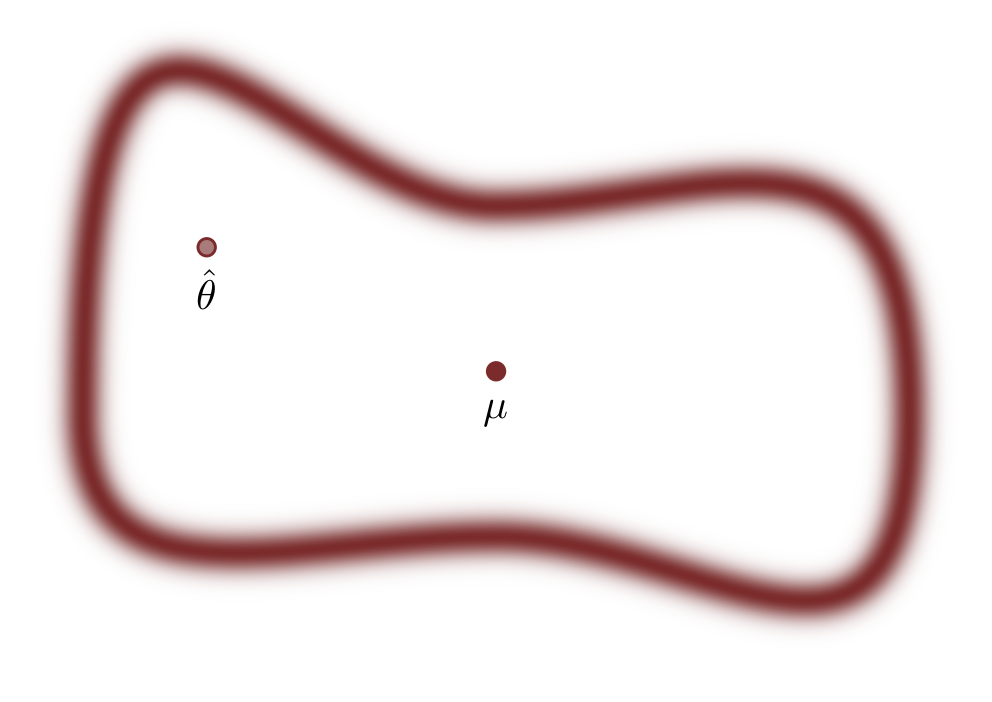
```
<br><br>
</center>

Perhaps more importantly, the reliance on a single point means that modal
estimators cannot generically quantify the entire typical set.  Consequently
they will fail to accurately estimate all expectation values.  For example the 
choice of the mode might allow us to approximate expectation values that capture
centrality, but it will do a terrible job of approximation expectation values 
that capture the breadth and tail behavior of the target distribution.

What makes modal estimation particularly dangerous is that we have no way of
quantifying the error in these expectation value estimators, or even identifying
which functions have expectation values that might be reasonably well-estimated
in a given parameterization.  Ultimately this extreme sensitivity to the detailed 
interplay between functions and parameterizations renders modal estimation 
quite fragile in practice.

### Laplace Estimators

In order to construct a more robust approximation we might consider 
_extrapolating_ beyond the mode, informed by the local differential structure
there.  _Laplace estimators_ build a multivariate Gaussian probability density 
function from this information to approximate the target probability density 
function.

The location of this approximating Gaussian probability density function is
given by the same mode used in modal estimators,
$$
\mu = \hat{q},
$$
while the precision is given by the second-order derivatives of the target 
probability density function evaluated at the mode,
$$
\left( \Sigma^{-1} \right)_{ij} =
\frac{ \partial^{2} \pi}
{ \partial q_{i} \partial q_{j} } (q = \hat{q})
$$
Expectation values can then be estimated with Gaussian integrals,
$$
\mathbb{E}_{\pi} \! \left[ f \right]
\approx 
\int_{Q} \mathrm{d} q \, \mathcal{N} \! \left( q \mid \mu, \Sigma \right) \,
f \! \left( q \right),
$$
which admit analytic solutions, or efficient approximations, for many functions,
$f$.

If the Gaussian approximation well-approximates the target probability density 
function then the approximate typical set will strongly overlap the target 
typical set.

<center>
<br>
```{r, out.width = "50%", echo=FALSE}
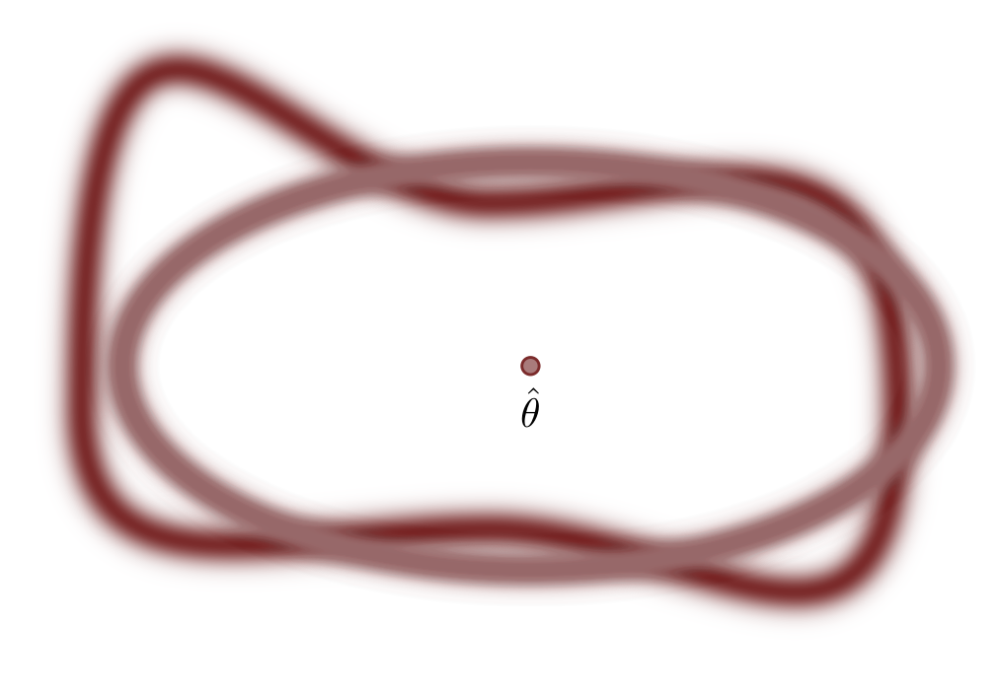
```
<br><br>
</center>

The stronger the overlap the more accurate the expectation value estimators
will be.  As we scale to higher-dimensional problems, and typical sets become
relatively thinner, maintaining a strong overlap becomes more challenging.  In 
some sense the Gaussianity of the target probability density function has to 
improve just to maintain the same estimator accuracy.

Exactly how well a Gaussian approximation captures the geometry of the target
typical set depends on the differential structure of the target probability 
density function at its mode, and hence on the particular parameterization of
the ambient space employed.  As with modal estimators this sensitivity tends to
manifest in fragility of the resultant expectation value estimators.  Combined
with the lack of theoretical results quantifying error for arbitrary target
distributions within a chosen parameterization, Laplace estimators can be
challenging to use in practice.

### Variational Estimators

One way to robustify estimation methods is to construct them directly from 
probability distributions, and not their probability density function
representations that depend on the chosen parameterization.  Variational
methods provide a framework for defining candidate families and optimality 
criteria independent of how the ambient space is parameterized.

A _variational family_, $\mathcal{U}$, is a choice of candidate family from 
which we can draw our approximating probability distribution.

<center>
<br>
```{r, out.width = "75%", echo=FALSE}
knitr::include_graphics("figures/variational/definition/definition.png")
```
<br><br>
</center>

The optimality criteria is defined through a _divergence function_,
$$
\begin{align*}
D &: 
\mathcal{U} \times \mathcal{U}
\rightarrow \mathbb{R}^{+}
\\
& \quad \upsilon_{1}, \upsilon_{2} 
\mapsto D \! \left( \upsilon_{1} \mid\mid \upsilon_{2} \right),
\end{align*}
$$
which vanishes if the two arguments are the same and increases as the
distribution in the second argument deviates from the distribution in the 
second argument.  Divergences are not, in general, symmetric so this order
is important.  Critically a divergence function is a probabilistic invariant, 
yielding the same answer regardless of the parameterization used.

A _variational estimator_ approximates the target distribution with the member 
of the variational family with the smallest divergence from the target 
distribution,
$$
\upsilon^{*}
= 
\underset{\upsilon \, \in \, \mathcal{U}}{\mathrm{argmin}} \,
D \! \left( \pi \mid\mid \upsilon \right).
$$

<center>
<br>
```{r, out.width = "75%", echo=FALSE}
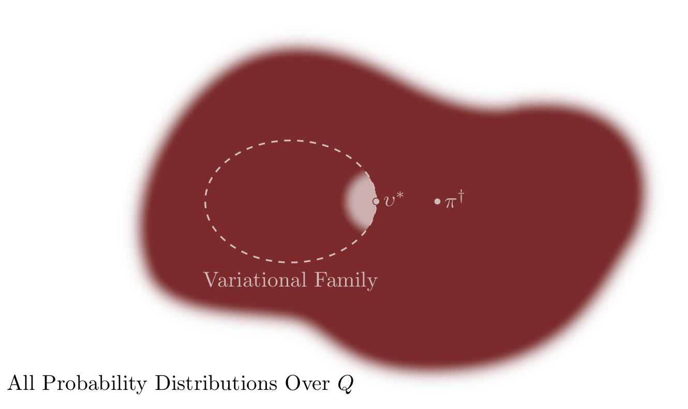
```
<br><br>
</center>

The "variational" nomenclature here comes from the physics literature where it
is used to differentiate optimization over spaces of distributions from 
optimization over spaces of points.  In practice, however, the distinction 
between the two is often irrelevant.  For our purposes the significance of a 
variational estimator is the nominal invariance of the optimization criterion.

Although straightforward to define, this variational optimization can be
challenging to implement in practice.  For example if the variational family 
isn't rich enough to capture the true structure of the target probability 
distribution then there might be _many_ members of the variational family 
offering near-optimal fits.

<center>
<br>
```{r, out.width = "100%", echo=FALSE}

```
<br><br>
</center>

This leads to degenerate variational objective surfaces which can even become
multimodal.

<center>
<br>
```{r, out.width = "50%", echo=FALSE}
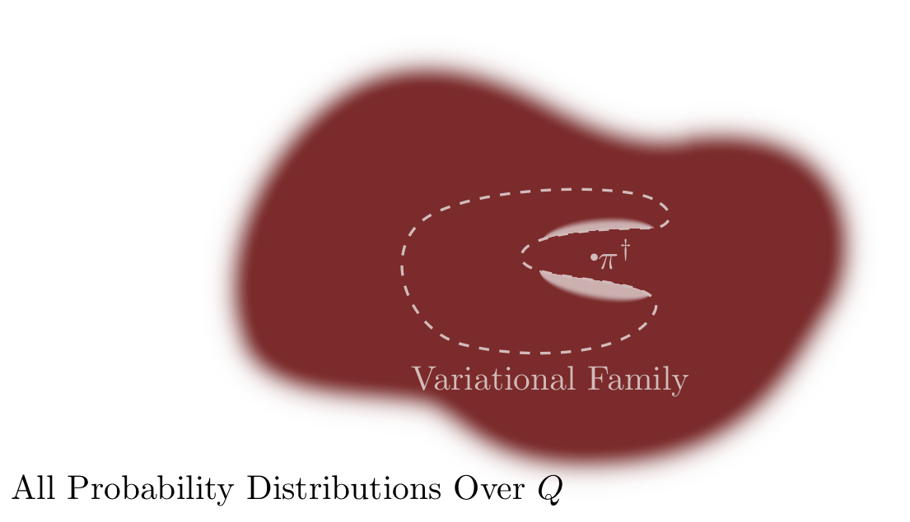
```
<br><br>
</center>

If the variational family includes the target probability distribution the 
objective function might still be degenerate, manifesting long valleys that slow
optimization algorithms to a crawl.

<center>
<br>
```{r, out.width = "75%", echo=FALSE}
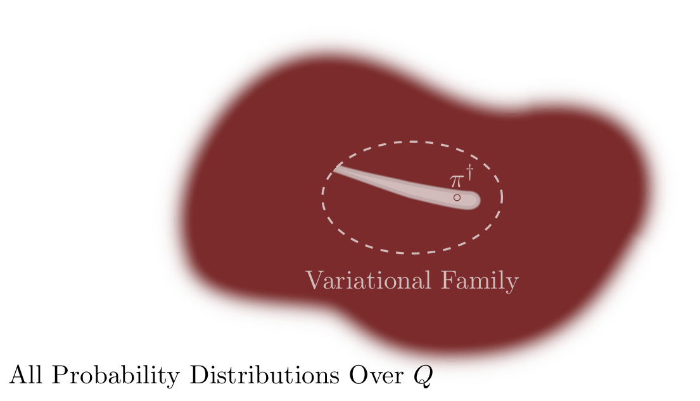
```
<br><br>
</center>

Even if we can find a global variational optimum, however, there is no 
guarantee that it will yield sufficiently accurate estimates for all relevant 
expectation values.  For example some divergence functions are biased towards 
variational solutions that underestimate the breadth of the typical set.

<center>
<br>
```{r, out.width = "50%", echo=FALSE}

```
<br><br>
</center>

Still others tend to overestimate the breadth of the typical set.

<center>
<br>
```{r, out.width = "50%", echo=FALSE}

```
<br><br>
</center>

In these cases expectation values capturing centrality _might_ be approximated 
adequately, but those capturing breadth would definitely not. 

Consequently the efficacy of a variational estimator depends on both the 
richness of the variational family and the structure of the divergence function.
Quantifying estimator errors in a general application is typically infeasible,
and we once again have to be weary of fragility.  Moreover that fragility can
be amplified when the variational family is specified by a family of
probability density functions...in a given parameterization.  While the
variational construction is invariant, its implementation might not be.

Variational methods are relatively new to statistics and both the theory and 
implementations are immature compared to more established methods.  This may 
improve as research develops [@YaoEtAl:2018] [@HugginsEtAl:2019] but at the 
moment their use requires an abundance of caution at the very least.

## Stochastic Estimators

The accuracy of deterministic estimators is fundamentally limited by the
richness of the family of candidate probability distributions and how well
they can capture the geometry of the typical set of the target probability
distribution.  A deterministic estimator can never overcome the limitations of 
the defining candidate function no matter how much computation we can 
dedicate to the problem.

_Stochastic estimators_ avoid this limitation by constructing expectation value
estimators from _samples_, either from the target probability distribution or an 
auxiliary probability distribution.  A general stochastic estimator generates 
samples from some distribution, $\rho$, that may or may not be the target
distribution,
$$
\{ \tilde{q}_{1}, \ldots, \tilde{q}_{N} \} \sim \rho,
$$
and then constructs estimators of target expectation values by weighting 
function evaluations at those samples,
$$
\mathbb{E}_{\pi}[f] \approx
\frac{ \sum_{n = 1}^{N} w(\tilde{q}_{n}) \, f(\tilde{q}_{n}) }
{ Z(\tilde{q}_{1}, \ldots, \tilde{q}_N)},
$$
where $Z$ is an appropriate normalizing constant.

In this context stochastic refers only to the use of samples, and not to any 
non-determinism in the method.  Indeed if we generate samples from pseudorandom 
number generators with a known seed then these algorithms will yield 
reproducible estimators, at least on the same computer.  A better interpretation 
of stochastic is that the exact value of the estimators are _hard to predict_
knowing only the seed alone.

The accuracy of stochastic estimators is in general limited by the number of 
samples that we can generate.  They offer the hope of quantifying the typical 
set of the target distribution with increasing accuracy at the cost of 
increasing computation.  That said, their practical utility will depend on 
exactly how these estimators _converge_ to the exact values with increasing 
sample size.

Here we will first revisit the Monte Carlo estimators that we have been using 
already before introducing importance sampling estimators.  Finally we will 
we will go through a very shallow introduction Markov chain Monte Carlo 
estimators, as they will be the subject of their own future case study.

### Monte Carlo Estimators {#sec:monte_carlo}

As we saw in [Section 1.2](#sec:monte_carlo_intro) Monte Carlo estimators use 
exact, independent samples from the target distribution,
$$
\{ \tilde{q}_{1}, \ldots, \tilde{q}_{N} \} \sim \pi,
$$ 
to construct an estimator with trivial weights,
$$
\hat{f}_{N} = \frac{1}{N} \sum_{n = 1}^{N} f(\tilde{q}_{n}).
$$
These Monte Carlo estimators enjoy a wealth of nice features, especially a 
central limit theorem that quantifies their accuracy and precision with
increasing sample size.

In our discussion of the typical set we also saw why these exact samples yield
estimators that behave so well.  Exact samples concentrate in the typical set
by construction, and as the sample size grows they define increasingly refined
quantifications of that geometry.

<center>
<br>
```{r, out.width = "75%", echo=FALSE}

```
<br><br>
</center>

Samples provide an accurate quantification even as the typical set appears to 
narrow in higher dimensions.  This robustness to the specific geometry of the 
typical set helps explain why Monte Carlo estimators have no apparent 
dimensionality dependence -- all of the hard work needed to scale with dimension 
has already been absorbed in the generation of the exact samples.

We can also think about exact samples as defining an effective, albeit 
stochastic, quadrature grid that focuses our computation exactly where it will 
be most effective.  We can further this intuition by manipulating the Monte 
Carlo estimator into the form of a quadrature estimator 
$$
\begin{align*}
\hat{f}_{N} 
&= 
\sum_{n = 1}^{N} \frac{1}{N} \, f(\tilde{q}_{n})
\\
&=
\sum_{n = 1}^{N} \frac{1}{N \, \pi(\tilde{q}_{n})} \, 
\pi(\tilde{q}_{n}) \, f(\tilde{q}_{n})
\\
&\equiv
\sum_{n = 1}^{N} (\Delta q)_{n} \, 
\pi(\tilde{q}_{n}) \, f(\tilde{q}_{n})
\end{align*}
$$
The effective volume around each sample is then
$$
(\Delta q)_{n} = \frac{1}{N \, \pi(q_{n})};
$$ 
the higher the density and the more samples we generate, the less volume is 
allocated around each sample.

Simply put, Monte Carlo is a miracle.  Given an ensemble of exact samples we can
readily construct estimators for a wide array of integrable functions _at the
same time_.  The errors of these estimators are not only quantifiable but also 
controllable with the size of the ensemble.  

If Monte Carlo is such a miracle, however, then why didn't this case study stop 
after first introducing it and save us the time?  Well, where did we get those 
exact samples on which Monte Carlo estimators rely?  Throughout this entire 
discussion we have taken our ability to generate exact samples for granted.  
It's easy enough for the common distributions that litter introductory 
statistics material, but generating exact samples from the complex probability 
distributions that arise in practice is incredibly challenging.  In fact, it's 
just as hard as quantifying the typical set in the first place!

Monte Carlo doesn't side step the challenge of quantifying the typical set, it
just conceals it underneath an assumed sampling mechanism.  If we can't do one
then we can't do the other.  Similarly the ultimate cost of a Monte Carlo 
estimator scales with the cost of generating exact samples, which is where the
exponential scaling with dimensions has been hiding.

It is perhaps no surprise, then, that the distributions from which we can draw 
exact samples, and those random number generators implemented in all of the 
popular statistical libraries, are those for which we can quantify the typical 
set analytically.  When we can't generate exact samples from our target 
probability distribution then we have to consider alternative methods of 
stochastic estimation.

### Importance Sampling Estimators

When we can't generate exact samples from the target probability distribution we
might be able to generate exact samples from some _auxiliary_ distribution.
_Importance sampling estimators_ weight auxiliary samples to correct for 
deviations from the target typical set and construct consistent estimators of 
target expectation values.

We can derive the form of the weights need to correct auxiliary samples by 
inserting the auxiliary probability density function into the integrals that
define our expectation values,
$$
\begin{align*}
\mathbb{E}_{\pi}[f]
&=
\int_{Q} \mathrm{d}q \, \pi(q) \, f(q)
\\
&=
\int_{Q} \mathrm{d}q \, \pi(q) \, \frac{\rho(q)}{\rho(q)}\, f(q)
\\
&=
\int_{Q} \mathrm{d}q \, \rho(q) \, \frac{\pi(q)}{\rho(q)}\, f(q)
\\
&=
\mathbb{E}_{\rho} \left[ \frac{\pi}{\rho} \cdot f \right].
\end{align*}
$$
Formally we're just applying the Radon-Nikodym theorem to rewrite the target
expectation value as an expectation value with respect to the auxiliary
distribution.  For more see 
[Section 4.3](https://betanalpha.github.io/assets/case_studies/probability_theory.html)
of my probability theory case study.

We can now estimate the target expectation value by generating an ensemble of 
exact samples from the auxiliary probability distribution,
$$
\{ \tilde{q}_{1}, \ldots, \tilde{q}_{N} \} \sim \rho,
$$
and then computing a Monte Carlo estimator of the auxiliary expectation value,
$$
\mathbb{E}_{\pi}[f]
=
\mathbb{E}_{\rho}[\frac{\pi}{\rho} \cdot f]
\approx
\hat{f}^{\mathrm{IS}}_{N} = 
\frac{1}{N} \sum_{n = 1}^{N} 
w ( \tilde{q}_{n} ) f ( \tilde{q}_{n} ),
$$
where the _importance weights_ $w(q)$ are defined as
$$
w \! \left( q \right) =
\frac{ \mathrm{d} \pi }{ \mathrm{d} \rho } (q)
=
\frac{ \pi(q) }{ \rho(q) }.
$$
Note that in order to construct the weights we need to be able to compute both
probability density functions exactly, including all normalization constants.

The Radon-Nikodym theorem does not apply, and importance sampling estimators are
ill-defined, when the auxiliary probability distribution is not absolutely 
continuous with respect to the target probability distribution.  This breakdown
manifests in the probability density function $\rho(q)$ vanishing when $\pi(q)$ 
does not.  Technically this would lead to infinitely large weights, but if the
auxiliary density vanishes at those points then it's unlikely that samples would
be generated there in the first place.  The presence of infinite weights serves
as practical diagnostic of ill-defined estimators, but the lack of infinite 
weights is by no mean a guarantee of well-defined estimators.

Provided that the function $w (q) \, f (q)$ is square-integrable this Monte 
Carlo estimator will enjoy a central limit theorem with the exact standard error
$$
\text{IS-SE} = \sqrt{ \frac{\mathrm{Var}_{\rho}[w \, f]}{N} },
$$
which we can readily estimate from the auxiliary samples,
$$
\widehat{\text{IS-SE}} \approx
\frac{1}{N} \sum_{n = 1}^{N} 
(w ( \tilde{q}_{n} ) f ( \tilde{q}_{n} ) - \hat{f}^{\mathrm{IS}}_{N} )^{2}.
$$
Comparing to the standard error of a Monte Carlo estimator we can see that
the auxiliary samples contain different information than an ensemble of exact 
samples from the target probability distribution.  The effective number of
exact samples that give an estimator with the same precision is
$$
\mathrm{ESS}[f] = 
\frac{\mathrm{Var}_{\rho}[w \, f] } { \mathrm{Var}_{\pi}[f] } \, N.
$$
If the ratio of variances is less than one, which is the typical circumstance,
then the auxiliary samples contain less information for estimating the
expectation value of $f$.  In exceptional circumstances, however, the ratio of
variances can be greater than one, with the auxiliary samples better targeting
the integrand $\pi(q) \, f(q)$ than exact samples.

In many applications we will know the target probability density only up to 
proportionality as the normalizing constants might be too expensive to compute.
For example target probability distributions that are derived as conditional 
probability distributions with respect to some joint probability distribution
can be computed up to proportionality by evaluating the joint probability 
density,
$$
\pi(q \mid \tilde{r}) 
= \frac{\pi(q, \tilde{r})}{\pi(\tilde{r})}
\propto \pi(q, \tilde{r}),
$$
even when the resulting normalization constant
$$
\pi(\tilde{r}) = \int_{Q} \mathrm{d} q \, \pi(q, \tilde{r})
$$
is intractable.

In cases like these we will not be able to compute the weights needed for 
standard importance sampling estimators.  We can remedy this, however, by 
introducing _self-normalizing_ importance sampling estimators,
$$
\hat{f}^{\mathrm{SNIS}}_{N} = 
\frac{ \sum_{n = 1}^{N} \overline{w} ( \tilde{q}_{n} ) \, f ( \tilde{q}_{n} ) }
{ \sum_{n = 1}^{N} \overline{w}  ( \tilde{q}_{n} ) }
$$
where the weights can be defined as the ratio of _unnormalized_ probability 
density functions,
$$
\overline{w} \! \left( q \right)
=
\frac{ \overline{\pi}(q) }{ \overline{\rho}(q) }.
$$
Implicitly the denominator estimates the ratio of the unknown normalization 
constants,
$$
\sum_{n = 1}^{N} \overline{w} ( \tilde{q}_{n} )
\approx
\frac{ \overline{\pi}(q) }{ \overline{\rho}(q) }
\frac{ \rho(q) }{ \pi(q) }.
$$

Because the normalization is being estimated at the same time as the target 
expectation value, self-normalizing importance sampling estimators do not
benefit from a central limit theorem.  Instead the only theoretical guarantee we
have is that self-normalizing importance sampling estimators are asymptotically
consistent.  A standard error can be approximated, however, as
$$
\begin{align*}
\widehat{\text{SNIS-SE}} 
&= 
\mathbb{E}_{\rho} \left[ w^{2} (f - \mathbb{E}_{\pi}[f])^{2} \right]
\\
&\approx
\frac{ \sum{n = 1}^{N} \overline{w}(\tilde{q}_{n})^{2}
(f(\tilde{q}_{n}) - \hat{f}^{\mathrm{SNIS}}_{N} )^{2} }
{ \left( \sum_{n = 1}^{N} \overline{w}(\tilde{q}_{n}) \right)^{2} }.
\end{align*}
$$
If the variance of the weights isn't too large then this becomes a reasonable 
approximation.

The performance of any of these importance sampling estimators is limited by the
behavior of the weights.  If the typical set of the auxiliary probability 
distribution strongly overlaps the typical set of the target probability 
distribution then the weights will concentrate around their mean value and the 
standard errors will not be much larger than the corresponding Monte Carlo 
standard errors.  As the auxiliary probability distribution deviates away from 
the target probability distribution, however, the distribution of the weights 
rapidly disperses.  In the best case this will only inflate the estimation error 
but in the worst case it can render $w(q) \, f(q)$ no longer square integrable 
and invalidating the importance sampling estimator entirely!

In low-dimensional problems typical sets are broad.  Constructing a good 
auxiliary probability distribution whose typical set strongly overlaps the 
typical set of the target distribution isn't trivial but it is often feasible.

<center>
<br>
```{r, out.width = "50%", echo=FALSE}

```
<br><br>
</center>

As we scale to higher-dimensional problems, however, the typical sets of both 
the auxiliary and target probability distributions thin, making it harder to 
engineer the necessary overlap.

<center>
<br>
```{r, out.width = "50%", echo=FALSE}

```
<br><br>
</center>

In practice the only general way to quantify the overlap between the two 
probability distributions is analyze the empirical distribution of the weights.
Those samples in neighborhoods where the typical sets overlap feature large
weights, and those outside of the intersections feature vanishing weights.
If the weights manifest extreme variations, in particular if only a few samples
feature large weights consistent with overlaping typical sets, then we know that 
we should be skeptical of the estimator performance.  There is no unique way to 
empirically quantify the distribution of the weights, but a common diagnostic is 
the _importance sampling effective sample size_,
$$
N_{\mathrm{eff}} = 
\frac{ ( \sum_{n = 1}^{N} w(q_{n}) )^{2} }
{ \sum_{n = 1}^{N} w^{2}(q_{n}) }
$$
for normalized importance sampling estimators and 
$$
N_{\mathrm{eff}} = 
\frac{ ( \sum_{n = 1}^{N} \overline{w}(q_{n}) )^{2} }
{ \sum_{n = 1}^{N} \overline{w}^{2}(q_{n}) },
$$
for self-normalizing importance sampling estimators.  A word of warning: unlike 
the effective sample size we introduced above, this effective sample size is 
unrelated to estimator error and instead just a heuristic diagnostic.  The 
smaller $N_{\mathrm{eff}}$ the more likely the importance sampling estimator is 
to be poorly behaved, although there is no universal threshold separating good 
and bad behaviors.

Another diagnostic approach, and one that can also improve importance sampling 
estimators as a side benefit, is to fit the sampled weights to an explicit 
family of probability densities.  The form of the fitted density not only 
provides an estimate of the variability in the weights but also can be used 
to regularize the sampled weights and reduce the variance of the importance 
sampling estimator.  _Pareto-smoothed importance sampling estimators_ 
[@VehtariEtAl:2015a] isolates the largest weights to fit the _tail_ of the 
weight distribution to a family of Pareto probability density functions, 
$$
\pi(q; k, q_{m}) 
=
\left\{
\begin{array}{rr}
0, & q < q_{m} \\
\frac{k}{q_{m}} \left( \frac{q_{m}}{q} \right)^{k + 1}, & q \ge q_{m}
\end{array}
\right. .
$$
The parameter $k$ controls how heavy this tail is, and its estimated value 
provides an immediate diagnostic for the smoothed importance sampling 
estimators.

The ultimate utility of importance sampling depends on the quality of the 
auxiliary probability distribution; when that distribution poorly approximates 
the target probability distribution the ensemble size needed for reasonably
precise importance sampling estimators will be impractical.  Consequently
importance sampling is really best used to _improve_ an already good 
approximation to the target probability distribution function, such as one 
that arises while constructing a deterministic estimator.  The importance 
sampling diagnostics can then be used to verify that the approximation is good 
enough for the weights to work their magic or, more realistically, let us know
that we need to find a better approximating probability distribution.

### Markov chain Monte Carlo Estimators 

Importance sampling estimators work around the limitations of Monte Carlo by 
utilizing exact samples from an auxiliary probability distribution. Markov chain 
Monte Carlo estimators return focus to the target probability distribution but 
replace the exact, independent samples with _correlated_ samples generated by a
_Markov chain_.

A Markov transition, $T$, is a conditional probability distribution on the 
product space $Q \times Q$.  Conditioning on an initial point in the ambient 
space, $q_{0} \in Q$, this conditional probability distribution identifies 
neighborhoods into which we are likely to jump.  Sampling from this probability 
distribution implements an explicit jump to a new point $q_{1} \in Q$.  
Repeatedly conditioning on the current point and then sampling a new point,
$$
\begin{align*}
\tilde{q}_{2} &\sim T(q_{2} \mid \tilde{q}_{1})
\\
\tilde{q}_{3} &\sim T(q_{3} \mid \tilde{q}_{2})
\\
\ldots
\\
\tilde{q}_{N} &\sim T(q_{N} \mid \tilde{q}_{N - 1})
\end{align*}
$$
generates a sequence of samples that realizes a Markov chain.  Because each 
state in the Markov chain is generated from the previous state, these samples 
are no longer independent but instead define a correlated ensemble.

The realizations of a Markov chain from an arbitrary Markov transition meanders 
through the ambient space with no real goal in mind.  If the Markov transition 
is compatible with the target probability distribution,
$$
\pi(q) = \int \mathrm{d} q' \, \pi(q') \, T(q \mid q'),
$$
however, then the resulting Markov chains will converge towards, and eventually 
explore, the typical set of the target probability distribution.

<center>
<br>
```{r, out.width = "75%", echo=FALSE}
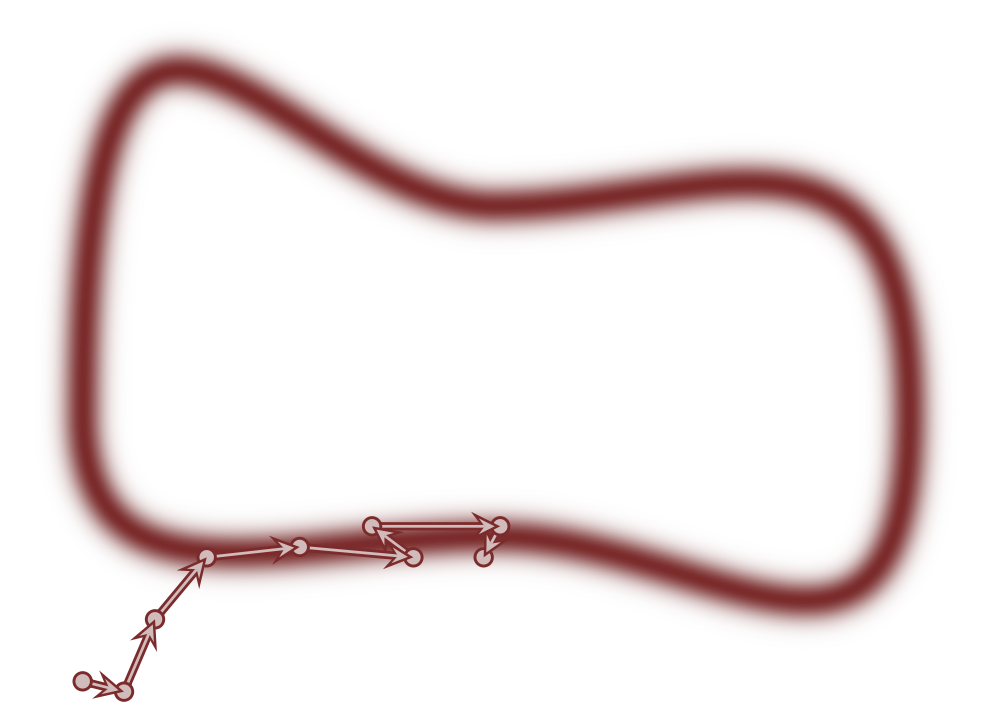
```
<br><br>
</center>

When this invariance condition, along with a few mild technical conditions, 
holds we say that the target probability distribution is the _stationary_ 
distribution of the Markov transition.  The states of a realized Markov chain 
can then be used to construct Monte Carlo estimators of expectation values with 
respect to that stationary distribution,
$$
\hat{f}^{\text{MCMC}}_{N} 
= 
\frac{1}{N} \sum_{n = 1}^{N} f(\tilde{q}_{n}).
$$

Unfortunately the correlation inherent to Markov chains limits the guarantees 
we can make about the these Markov chain Monte Carlo estimators.  In general the
only guarantee that we have is that these estimators are asymptotically 
consistent,
$$
\lim_{N \rightarrow \infty} \hat{f}^{\text{MCMC}}_{N} 
= \mathbb{E}_{\pi}[f].
$$
The behavior of Markov chain Monte Carlo estimators after only a finite number 
of iterations, in other words _how_ the estimators converge to the exact values, 
is much more complex. In general the performance of an estimator will depend on 
the specific interactions between the target probability distribution and the 
Markov transition.  Constructing Markov transitions sufficiently well-suited to 
the target probability distribution that the resulting estimators enjoy small 
errors is incredibly challenging, especially when the ambient space is 
high-dimensional.

Markov chain Monte Carlo is a workhorse of probabilistic computation, but in 
order to use it responsibly we will need to become intimately familiar with the
method.  Developing that familiarity is outside of the scope of this case study,
but it will be the entire focus on an upcoming case study.

### The Glass Menagerie

So far we've discussed only some of the more common stochastic estimation 
methods, focusing on those we are most likely to use in practice rather than 
making any attempt to exhaustively review the expansive computational statistics 
methodology research.  

_Variance reduction_ techniques, for example, introduce weights constructed from
gradients of the target probability density function to Monte Carlo and Markov 
chain Monte Carlo estimators that can reduce the variance of the corresponding 
estimator.  At least when used carefully. 

_Optimal transport_ methods attempt to engineer deterministic transformations 
that pushforward easily-generated exact samples into samples from the target 
probability distribution, or something close to it.  

_Pseudo-marginal_ methods allow for the use of only unbiased estimators of the 
target probability density function when the exact probability density function 
cannot be evaluated.

_Sequential Monte Carlo_ considers not a single target probability distribution 
but rather a sequence of evolving probability distributions.

_Approximate Bayesian Computation_ is a form of importance sampling where the 
weights are constructed empirically.

These new methods may prove useful in particular applications, but care must be
taken to avoid untrustworthy results.  The relative immaturity of new methods 
means that we have limited theory and empirical validation to isolate potential 
pathologies.  To avoid applying methods that silently fail the burden is on 
_you_ to be vigilant for pathologies and verify sufficiently accurate 
estimation.  As with the previous methods that we've introduced, the development
of principled intuition that is robust to dimensionality is facilitated by the 
typical set abstraction.

# Conclusions

Probabilistic computation is difficult, and we have to be careful to not take 
for granted our ability to generalize beyond the toy systems common in 
introductory texts to the more complex systems that arise in real applications.
This challenge is only amplified as we scale beyond a few dimensions where our 
low-dimensional intuition breaks down, well, exponentially fast.

In order to build a more robust understanding that persists to 
higher-dimensional spaces we have to embrace the abstraction of the typical set 
and its qualitative consequences.  By framing probabilistic computational 
methods within this perspective we can identify general strategies that have the 
potential to scale well with the dimension of the ambient space, as well as 
possible pathologies that obstruct that scaling.

Most practitioners, however, will not end up developing their own estimation 
methods but instead implement and use existing methods.  The burden of 
validating whether these methods might offer efficient and accurate estimation 
of relevant expectation values in a given application is entirely on the 
practitioner employing them.  This substantial work is rewarded, however, with 
the confidence that one can trust the messages that their target probability 
distribution conveys, and the insights within.

# Acknowledgements {-}

I thank Bob Carpenter for many discussions about the typical set abstraction
and explicit demonstrations of its consequences.  I am also indebted for the 
feedback from those who have attended my courses and talks.

A very special thanks to everyone supporting me on Patreon: Abhinav Katoch, 
Abhishek Vasu, Adam Slez, Aki Vehtari, Alan O'Donnell, Alex Gao, 
Alexander Bartik, Alexander Noll, Anders Valind, Andrea Serafino, 
Andrew Rouillard, Andrés Castro Araújo, Arya Alexander Pourzanjani, asif zubair,
Austin Rochford, Aviv Keshet, Avraham Adler, Ben Matthews, Bradley Wilson, 
Brett, Brian Callander, Brian Clough, Brian Hartley, Bryan Galvin, Bryan Yu,
Bryce Frank, Canaan Breiss, Cat Shark, Chad Scherrer, Charles Naylor,
Chase Dwelle, Chris Cote, Chris Zawora, Christopher Peters, Cole Monnahan,
Colin Carroll, Colin McAuliffe, D, Damien Mannion, dan mackinlay, Dan W Joyce,
Daniel Elnatan, Daniel Hocking, Daniel Rowe, Daniel Simpson, Danielle Navarro,
Darshan Pandit, David Pascall, David Roher, Derek G Miller, Diogo Melo,
Ed Berry, Ed Cashin, Eddie Landesberg, Elizaveta Semenova, Eric Novik, 
Erik Banek, Ethan Goan, Evan Russek, Felipe González, Finn Lindgren, 
Francesco Corona, Garrett Mooney, Granville Matheson, Guido Biele,
Guilherme Marthe, Hamed Bastan-Hagh, Haonan Zhu, Hernan Bruno, Ilan Reinstein,
Ilaria Prosdocimi, J Michael Burgess, JamesU, Jeff Dotson, Jessica Graves,
Joel Kronander, John Helveston, Jonas Beltoft Gehrlein, Jonathan, 
Jonathan Judge, Jonathan Sedar, Josh Weinstock, Joshua Duncan, Joshua Mayer, JS, 
jsdenain, Justin Bois, Karim Naguib, Karim Osman, Kazuki Yoshida, Kejia Shi, 
Kenny Holms, Konsta Happonen, Kyle Ferber, Kádár András, Lars Barquist,
Luiz Carvalho, Lukas Neugebauer, Marc, Marc Dotson, Marc Trunjer Kusk Nielsen,
Markus P., Martin Modrák, Matthew Kay, Matthew Quick, Matthew T Stern,
Maurits van der Meer, Max, Maxim Ananyev, Maxim Kesin, Michael Colaresi,
Michael DeWitt, Michael Dillon, Michael Griffiths, Michael Redman, 
Michael Thomas, Mike Lawrence, Mikhail Popov, mikko heikkilä, Monkel,
Nathan Rutenbeck, Nicholas Knoblauch, Nicholas Ursa, Nicolas Frisby, 
Noah Guzman, Ole Rogeberg, Oliver Clark, Olivier Ma, Onuralp Soylemez,
Patrick Boehnke, Pau Pereira Batlle, Paul Oreto, Peter Heinrich, Peter Schulam,
Ravin Kumar, Reed Harder, Riccardo Fusaroli, Richard Jiang, Richard Torkar,
Robert Frost, Robert Goldman, Robert J Neal, Robin Taylor, Sam Zimmerman,
Sam Zorowitz, Sean Talts, Seo-young Kim, Sergiy Protsiv, Seth Axen, Shira,
Simon Duane, Simon Lilburn, Stephen Lienhard, Stephen Oates, Steven Langsford,
Stijn, Suyog Chandramouli, Taco Cohen, Teddy Groves, Teresa Ortiz, 
Thomas Littrell, Thomas Vladeck, Tiago Cabaço, Tim Howes, Trey Spiller,
Tristan Mahr, Tyrel Stokes, Vanda Inacio de Carvalho, Vasa Trubetskoy,
Ville Inkilä, vittorio trotta, Wai Keen Vong, Will Farr, yolhaj, Z, and 
Ziwei Ye.

# References {-}

<div id="refs"></div>

# License {-}

The code in this case study is copyrighted by Michael Betancourt and licensed 
under the new BSD (3-clause) license:

https://opensource.org/licenses/BSD-3-Clause

The text and figures in this case study are copyrighted by Michael Betancourt 
and licensed under the CC BY-NC 4.0 license: 

https://creativecommons.org/licenses/by-nc/4.0/

# Original Computing Environment {-}

```{r, comment=NA}
sessionInfo()
```
