```{r setup, include=FALSE}
knitr::opts_chunk$set(comment=NA)
```

Probability theory defines how we can manipulate and utilize probability 
distributions, but it provides no guidance for which probability distributions 
we might want to utilize in a given application.  Indeed the choices of 
probability distributions over a given space are immense, especially when the 
space is high-dimensional.  Consequently probabilistic modeling is often 
overwhelming for practitioners trying to reason about how something is 
distributed across a given space.

Fortunately we can exploit 
[conditional probability theory](https://betanalpha.github.io/assets/case_studies/conditional_probability_theory.html) 
to build up high-dimensional probability distributions from many
one-dimensional probability distributions about which we can more easily reason. 
With only a modest collection of probability distributions at their disposal
a practitioner has to potential to construct a wide array of sophisticated
probability distributions.  A cache of interpretable, well-understood 
probability distributions is a critical piece of any practitioner's statistical
toolkit.

In this case study I review common probability density functions which specify 
some elementary probability distributions in the context of a particular
parameterization of a given space, $X$.   Specifically I review _families_ of
probability density functions, $\pi(x ; \theta)$ indexed by their own set of
parameters, $\theta \in \Theta$.  As with the parameterization of the ambient 
space, $X$, the parameterization of the family, $\Theta$, is not unique and I 
will discuss alternative family parameterizations that provide useful 
interpretative or mathematical properties.

I will begin by introducing some important properties that motivate particularly 
useful building blocks.  Then I will use these properties to populate our 
statistical palette, reviewing the elementary families of probability density
functions that arise from these considerations.  Finally I will discuss 
additional families that derive from pushing these elementary families forward 
along functions.  In each review I will focus on the probabilistic behaviors of 
each family and try to build intuition as to how they can be be best deployed in
practice.

Before that, however, a quick word on vocabulary.  The precision of mathematics
often requires ungainly or counterintuitive nomenclature.  For example it
quickly becomes annoying to repeatedly say, let alone type, "families of
probability density functions" over and over again.  Because of that most 
statisticians, including your humble author, will often get a little sloppy 
with their language.  Instead of saying "family of probability density 
functions" we'll often just say "probability density function" with the family 
implied, or even just "probability density" or "density".  Worse we'll confound
probability distributions with their density representations, saying for example
"normal distribution" instead of "normal family of probability density functions 
in the context of a given parameterization of the ambient space".  The worst 
amongst us will hide behind the dreadful "random variable" abstraction.  While 
this haphazard language is inevitable and relatively harmless once you're
comfortable with probability theory it can be a major impediment towards 
becoming comfortable in the first place.  Consequently I will be _extremely_
pedantic with my language here to facilitate the first steps into probabilistic
proficiency.

Once that experience has been developed one can continue learning about families 
of probability density functions from the many available statistical resources,
such as @CasellaEtAl:2002, @Bishop:2006, and @BernardoEtAl:2009. [Wikipedia](https://en.wikipedia.org/wiki/List_of_probability_distributions) 
is another fantastic reference for families of probability density functions and
their properties.

# Eye of the Tiger 

A useful way to isolate particular families of probability distributions is to
impose certain mathematical constraints that ensure convenient probabilistic 
properties.  When these constraints are defined only in the context of a given
parameterization of the ambient space they define not the probability 
distributions themselves but rather their probability density function
representations.  Care is needed to respect this context because 
reparameterizing the ambient space will modify these criteria, and then the 
families of probability density functions arising from them.

In this section I discuss two properties that motivate especially useful 
families of probability density functions.  To demonstrate these properties,
and provide some explicit context for their consequences, I will utilize the
_normal family_ of probability density functions that I introduced in my
[probability theory case study](https://betanalpha.github.io/assets/case_studies/probability_theory.html),
$$
\pi(x; \mu, \sigma)
=
\frac{1}{ \sqrt{2 \pi \sigma^{2} } }
\exp \left( - \frac{1}{2} \left( \frac{ x - \mu}{\sigma} \right)^{2}
\right)
$$ 
A more thorough discussion of the normal family and its properties will be given
in [Section 2.3](#sec:normal_family).

Sometimes a families might satisfy multiple motivating criteria, making them 
particularly powerful both in theory and in practice.  Such overlapping
motivations will help to explain why some families, like the normal family, end 
up so ubiquitous in statistical practice.

## Emerging Trends

Often our goal is to probabilistically model the outcome of some complex system 
that aggregates many individual, _component_ probability distributions together.
As the component distributions are aggregated some behaviors of the component 
distributions might add incoherently, washing out in the distribution that 
_emerges_ from this aggregation.  Some behaviors in the component distributions, 
however, might add more coherently, reinforcing each other to persist into the 
final emergent distribution.

While modeling the entire system, and all of the individual components, will 
provide the most precise analysis, in many cases it is sufficient to directly 
model only the emergent distribution itself.  How exactly, however, can we 
identify the kind of distribution that would arise from a given complex system?
It turns out that the only distributions that _can_ emerge are those specified
within very special families of probability density functions that are _closed_
under the fundamental operation that aggregates the component distributions.

In this section I build motivation for this result, introducing the exceptional
_stable families_ that exhibit the necessary closure and manifest powerful
_central limit theorems_ that we can exploit to model emergent behavior.

### Closure

In mathematics closure refers to the circumstance where a common space serves as
both the input and output of a given operation.  For example addition will 
always map two real numbers to another real number so we can say that the real
numbers are closed under addition.  Alternatively division will in general map 
two integers not to another integer but rather to a rational number.
Consequently the integers are not closed under division.

The operation that is relevant to understanding the emergent behavior of a 
complex system is one that maps a collection of component probability 
distributions to some outcome probability distribution through an intermediate 
joint probability distribution.

#### Welcome to Earth

Consider, for example, modeling each component with replicates of a single
one-dimensional space, $X$, and modeling the complex system with the product 
space, $X_{N} = \prod_{n = 1}^{N} X$.  We can specify a probability 
distribution over each component using individual, and in general heterogenous,
probability density functions, $\pi_{n}(x_{n})$.

These component probability density functions then define an _independent_ joint
probability distribution over $X_{N}$ through the joint probability density 
function,
$$
\pi_{N}(x_{1}, \ldots, x_{N}) = \prod_{n = 1}^{N} \pi_{n}(x_{n}).
$$
In the special case where each component distribution is the same,
$\pi_{n}(x_{n}) = \pi(x_{n})$, we say that the components are _independent and
identically distributed_, commonly condensed to _IID_.

#### Group Project

Let's now make the additional assumption that any emergent behavior takes place
in another copy of our base space, $X$.  Given an independent joint distribution 
we can model the aggregration process with a projection operator that maps the
product space to the outcome space,
$$
\varpi: X_{N} \rightarrow X.
$$

A common example, and the one that we will utilize most often is an _additive_
projection,
$$
\begin{alignat*}{6}
\varpi_{+} :\; &\hspace{8mm}X_{N}& &\rightarrow& \; &X&
\\
&(x_{1}, \ldots, x_{N})& &\mapsto& &\sum_{n = 1}^{N} x_{n}&.
\end{alignat*}
$$
Keep in mind that these projection are defined only in the context of a 
particular parameterization of $X$, and hence will change under 
reparameterization.  For example if $X = \mathbb{R}$ and we reparameterize the
output space with the exponential map,
$$
\begin{alignat*}{6}
\exp :\; &\mathbb{R}& &\rightarrow& \; &\mathbb{R}^{+}&
\\
&x& &\mapsto& &\exp(x)&,
\end{alignat*}
$$
then the additive projection becomes
$$
\begin{align*}
y &= \exp(x)
\\
y &= \exp(x_{1} + \ldots + x_{N})
\\
y &= \exp(x_{1}) \cdot \ldots \cdot \exp(x_{N})
\\
y &= y_{1} \cdot \ldots \cdot y_{N}.
\end{align*}
$$
which corresponds to a _multiplicative_ projection,
$$
\begin{alignat*}{6}
\varpi_{\times} :\; &\hspace{8mm}X_{N}& &\rightarrow& \; &X&
\\
&(x_{1}, \ldots, x_{N})& &\mapsto& &\prod_{n = 1}^{N} x_{n}&,
\end{alignat*}
$$

Similarly if $X = \mathbb{R}^{+}$ and we apply a logarithmic reparameterization,
$$
\begin{alignat*}{6}
\log :\; &\mathbb{R}^{+}& &\rightarrow& \; &\mathbb{R}&
\\
&x& &\mapsto& &\log(x)&,
\end{alignat*}
$$
then the multiplicative projection becomes an additive projection,
$$
\begin{align*}
y &= \log(x)
\\
y &= \log(x_{1} \cdot \ldots \cdot x_{N})
\\
y &= \log(x_{1}) + \ldots + \log(x_{N})
\\
y &= y_{1} + \ldots + y_{N}.
\end{align*}
$$

Given a projection operator we can then push the joint probability density 
function forward through the projection, defining a _new_ probability density
function on $X$, $\pi_{\varpi}(x)$.

#### Make Way For Ducklings

This construction of an independent joint probability density function and 
a resulting pushforward probability density function holds for any number of
components, $N$.  Repeating the construction for increasing $N$ defines a 
_sequence_ of pushforward probability density functions starting with
$\pi_{\varpi, 1}(x) = \pi_{1}(x)$ and then continuing onto the pushforwards
$\pi_{\varpi, 2}(x), \ldots, \pi_{\varpi, N}(x)$.

Any such sequence of pushforward probability density functions then forms a path 
through the space of all possible probability density functions on $X$,

<center>
<br>
```{r, out.width = "75%", echo=FALSE}
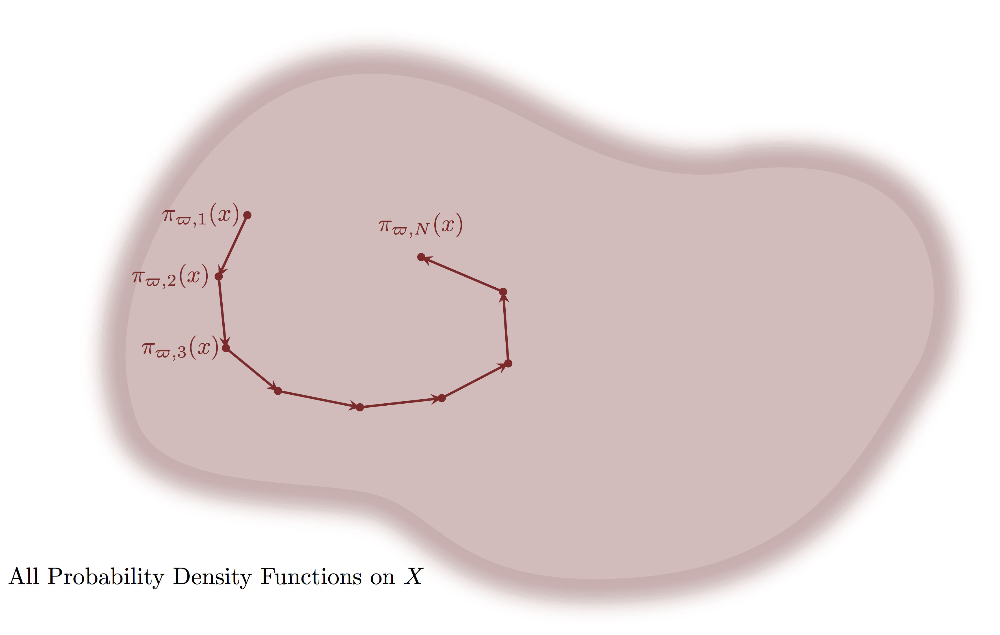
```
<br><br>
</center>

#### Keeping It Within The Family

Closure with respect to a given projection operator can then be defined with 
respect to the initial component probability density functions and the 
corresponding pushforward probability density function.  For example we could 
talk about the closure of a particular probability density function, $\pi(x)$, 
if the independent and identically distributed joint probability density 
function defined by $\pi(x)$ on each component pushes forward to the same 
probability density function, 
$$
\pi_{\varpi}(x) = \pi(x).
$$

More commonly, however, we talk about closure of a family of probability 
density functions.  An entire family is closed under a given projection if the 
independent joint distribution defined by any component probability density 
functions within the family, $\pi_{n}(x_{n}) = \pi(x_{n}; \theta_{n})$, pushes
forward to a distribution on the outcome space specified by _any_ member of the
given family,
$$
\pi_{\varpi}(x) = \pi(x; \theta_{\varpi}),
$$
for some $\theta_{\varpi} \in \Theta$.

In other words any sequence of probability density functions will stay within
the family.

<center>
<br>
```{r, out.width = "75%", echo=FALSE}
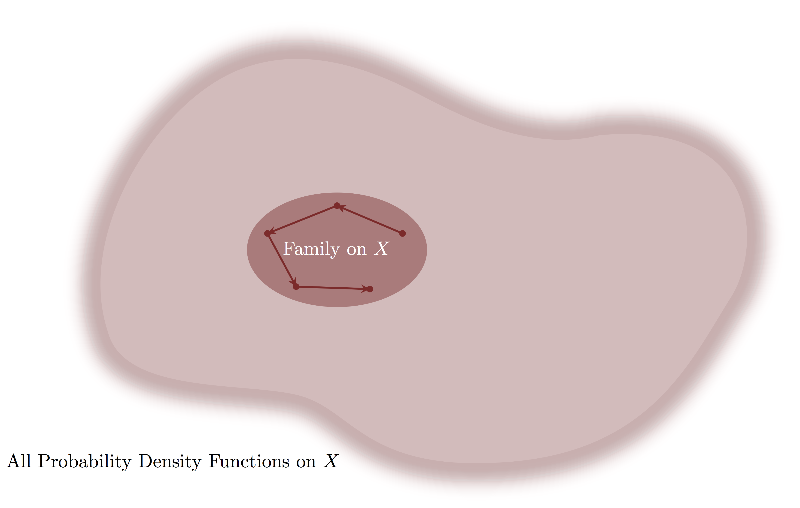
```
<br><br>
</center>

### Stable Households {#sec:stable}

When $X$ is subset of the real numbers then we can also consider a slightly more
general projection operator that introduces weights and an offset, 
$$
\begin{alignat*}{6}
\varpi_{+} :\; &\hspace{15mm}X_{N} \times \mathbb{R}^{N} \times \mathbb{R}&
&\rightarrow& \; &X&
\\
&(x_{1}, \ldots, x_{N}), (w_{1}, \ldots, w_{N}), b
& &\mapsto& &\sum_{n = 1}^{N} w_{n} \cdot x_{n} + b&.
\end{alignat*}
$$
If an independent and identically distributed joint probability density 
function build up from a given family pushes forward to another member of that
family for any choice of weights and offset then that family is denoted a 
_stable family_ of probability density functions [@BoseEtAl:2002].  Stable 
families are exceedingly rare but have a myriad of interesting and useful
mathematical properties, namely the closure introduced above.

Consider, for example, the normal family.  Upon multiplication by a real-valued
weight a normal probability density function with location $\mu$ and scale 
$\sigma$ pushes forward to a new normal probability density function with 
location $w_{n} \cdot \mu$ and scale $w_{n} \cdot \sigma$,
$$
\mathcal{N}(x \mid w_{n} \cdot \mu, w_{n} \cdot \sigma).
$$

The pushforward of an independent and identically distributed joint probability
density function along the weighted projection then gives another member of the
normal family,
$$
\pi_{\varpi_{+}}(x) = 
\mathcal{N}(x \mid (w_{1} + w_{2}) \cdot \mu, 
                   (w_{1} + w_{2}) \cdot \sigma).
$$
We can apply this result recursively to give
$$
\pi_{\varpi_{+}}(x) = 
\mathcal{N}( x \mid (\sum_{n = 1}^{N} w_{n}) \cdot \mu, 
                    (\sum_{n = 1}^{N} w_{n}) \cdot \sigma).
$$
Adding in the offset still doesn't push us outside of our normal family,
yielding the final normal probability density function
$$
\pi_{\varpi_{+}}(x) = 
\mathcal{N}(x \mid \sum_{n = 1}^{N} w_{n} \cdot \mu + b, 
                   \sum_{n = 1}^{N} w_{n} \cdot \sigma).
$$
No matter the value of the weights or the offset, this construction will push
one normal probability density function into another.

Moreover, consider decomposing the offset, $b$, into a sum of $N$ offsets, 
$b = \sum_{n = 1}^{N} b_{n}$.  We can then associate a weight and an offset to 
each of the component probability density functions, 
$$
w_{n}, b_{n}, \mathcal{N}(x_{n} \mid \mu, \sigma).
$$
Pushing each component probability density function through the local 
transformation $x_{n} \mapsto w_{n} \cdot x_{n} + b_{n}$ yields a collection of
_non-identical_ normal probability density functions. The stability condition 
then implies that the additive projection of _any_ heterogeneous collection of
normal probability density functions is also a normal probability density 
function, which is exactly the closure property we introduced above.

<center>
<br>
```{r, out.width = "75%", echo=FALSE}

```
<br><br>
</center>

### Everybody to the Limit (Come on Fhqwhgads)

The closure inherit to stable families is relevant only when each component
is modeled by a probability distribution within a particular stable family.
What use does that closure have, however, when the more realistic complex 
systems of applied interest would not be accurately modeled with only a single
family, instead requiring heterogenous component probability density functions 
not contained within any single family?

If we begin within a stable family of probability density functions then any
sequence of projective pushforward probability density functions will be
contained within that family by construction.  These stable families, however,
also serve as _attractors_, probabilistic sirens that lull arbitrary sequences 
into their grasp.

The convergence of a particular sequence of probability density functions 
towards a stable family is known as a _central limit theorem_.  A central limit
theorem implies that the stable family exactly captures or _exceedingly well
approximates_ the aggregation modeled by the additive projection for large 
enough $N$.  Such large $N$ behavior is known as _asymptotics_.

<center>
<br>
```{r, out.width = "75%", echo=FALSE}
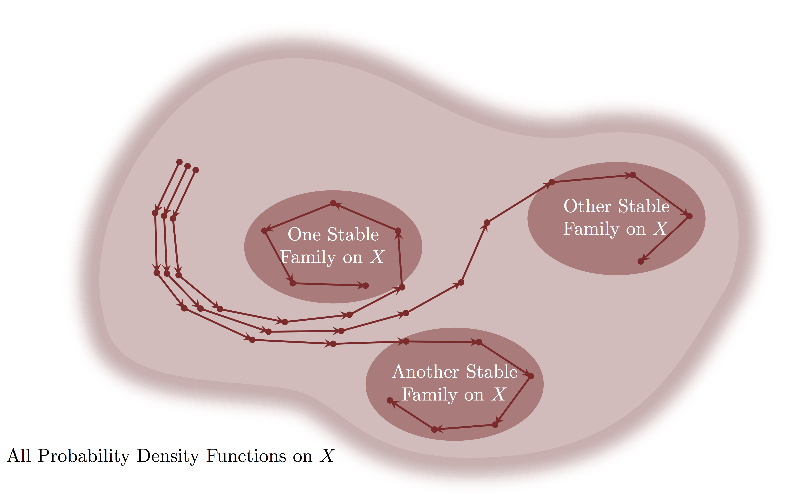
```
<br><br>
</center>

For example if each of the component probability distributions features a 
finite mean and finite variance then any sequence of additive projections will 
eventually converge to a probability density within the normal family.  In other
words provided that each component distribution is reasonably well-behaved then 
the aggregation across a complex system will be accurately modeled by some 
member of the normal family.  This helps explain why the normal family is so
ubiquitous in statistical modeling -- even if a normal is a poor choice for any
single component of a complex system it can be an excellent choice for modeling 
the emergent behavior derived from their coalescence.

<center>
<br>
```{r, out.width = "75%", echo=FALSE}

```
<br><br>
</center>

When the component distributions have ill-defined means and variances then these
sequences will converge to _other_ stable families of probability density 
functions, such as the _Lévy family_ and the _Cauchy family_.  The Cauchy 
family will be discussed in more detail in [Section 3.8](#sec:cauchy_family).

<center>
<br>
```{r, out.width = "75%", echo=FALSE}
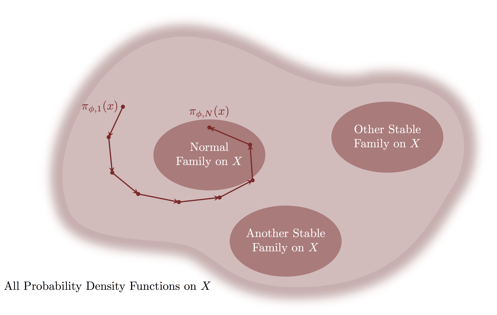
```
<br><br>
</center>

Stable families are exceptional within the set of all probability density 
functions on a given space.  From a modeling perspective this rarity is actually
to our advantage.  It implies that only a few families will be useful for 
modeling asymptotic emergent behavior, drastically limiting the possibilities 
that we have to consider in a given application.

## Entropy, Exponentials, and Existential Crises

Another motivation to consider when selecting probability density functions
is their simplicity, which is often highly correlated with their mathematical
convenience.  How exactly, however, do we formally define the simplicity of a
probability density function?  It turns out we can't define any absolute sense
of simplicity, but we can define a _relative_ sense of simplicity which can 
largely serve the same purpose.

### Variational Minimization

The _Kullback-Leibler divergence_ [@KullbackEtAl:1951] defines a useful 
quantification for how similar one measure is relative to another.  Recall that 
a measure behaves just like a probability distribution without the requirement 
that the total probability is equal to one.  If two measures $\mu$ and $\nu$ 
both have well-defined probability density functions relative to some base 
measure then we can write the Kullback-Leibler divergence _from_ $\nu$ _to_ 
$\mu$ as the expectation value
$$
\mathrm{KL}(\mu \mid\mid \nu)
=
\int_{X} \mathrm{d} x \, \mu(x) \, \log \frac{ \mu(x) }{ \nu(x) }.
$$
The logarithmic term quantifies the local differences between the two 
probability density functions, which is then averaged over the first measure.
Note the asymmetry between the two inputs -- the first argument controls how the
differences are weighted, and hence which differences are taken into account in 
the quantification.  Neighborhoods where $\mu$ allocates little measure have 
little contribution to the divergence, no matter how much measure $\nu$ assigns 
to them.

If we fix one of the input measures then the Kullback-Leibler divergence
defines a _variational objective function_ whose minimum identifies the measure 
that is closest to the other measure.  Variational here refers to the 
optimization being over a space of measures instead of just a space of points. 
Fixing the second argument, $\nu$, and minimizing the first argument, $\mu$,
prioritizes matching the behavior of $\mu$ in neighborhoods where $\mu$ assigns
significant measure.  In other words the variational minimum is the measure that
is _best approximated_ by the fixed measure $\nu$ [@CsiszarEtAl:2004].

Searching over all measures yields a pretty trivial solution to the variational
optimization problem -- we must return $\nu = \mu$.  Things are more 
interesting, however, when we consider minimizing the Kullback-Leibler 
divergence under _expectation value constraints_.  For example we could consider
only probability distributions as candidate solutions, instead of any 
arbitrary measure, by introducing a normalization constraint,
$$
\int_{X} \mathrm{d} \mu(x) \, 1 = 1.
$$
With this constraint the variational minimum becomes much less trivial; it may
not be unique and it may not exist at all!  The more sophisticated the 
constraints, the more complex the variational minimum will be relative to the 
fixed measure.

Consider the general problem of $M + 1$ constraining expectation values
$$
t_{m} 
= \mathbb{E}_{\pi} [ T_{m} ]
= \int_{X} \mathrm{d} x \, \mu(x) \, T_{m}(x),
$$
with $T_{0} = 1$ serving as the normalization constraint.  The solution of this 
constrained variational optimization is given by _variational calculus_
[@JoseEtAl:1998] and if it exists its probability density function takes the 
general form 
$$
\begin{align*}
\pi(x; \lambda_{1}, \ldots, \lambda_{M} ) 
&= 
\frac{ \exp \left( \sum_{m = 1}^{M} \lambda_{m} \, T_{m}(x) \right) }
{ \int_{X} \mathrm{d} x \,
 \exp \left( \sum_{m = 1}^{M} \lambda_{m} \, T_{m}(x) \right) \, \nu(x)  }
\nu(x)
\\
& \equiv
\frac{ \exp \left( \sum_{m = 1}^{M} \lambda_{m} \, T_{m}(x) \right) }
{ Z(\lambda_{1}, \ldots, \lambda_{M}) } \nu(x).
\end{align*}
$$
The $\lambda_{m}$ are defined implicitly through the system of $M$ equations
$$
t_{m} 
= \int_{X} \mathrm{d} x \, \pi(x) \, T_{m}(x)
=
\frac{\partial}{\partial \lambda_{m}} \log Z(\lambda_{1}, \ldots, \lambda_{M}).
$$
When this system has a unique solution, and we can solve for the $\lambda_{m}$
in terms of the given $t_{m}$, the variational minimum will be unique.  If the
system has no solution then the variational minimum does not exist.

Given some measure that quantifies simplicity on a space, we can then use this
variational construction to find the simplest probability density function 
relative to that choice.  What measures, however, quantify a well-defined sense 
of simplicity?  Often simplicity takes the form of _uniformity_.  For example 
on the integers we can assign the same measure to each integer, yielding the
_counting measure_.  On the real numbers we can assign the same measure to 
intervals of the same length which gives the _Lebesgue measure_.  Using these
uniform measures in the variational minimization then identifies the 
probability density function best approximated by a uniform measure subject to 
the expectation value constraints.

This procedure is often known as _maximum entropy_ 
[@Jaynes:2003, @BernardoEtAl:2009] as entropy, an object that arises in certain
physical systems, happens to be equal to the negative of the Kullback-Leibler 
divergence with the second argument fixed to certain uniform measures.
Unfortunately this analogy can be misleading because not all uniform measures
define formal entropies.  In particular formal entropies are invariant to
reparameterizations of the given space and, because the Lebesgue measure of the 
real numbers is not invariant to nonlinear transformations, neither will be the
corresponding Kullback-Leibler divergence.  This is admittedly a subtle point 
and to avoid any confusion I will avoid using the entropy language _entirely_ in
favor of the more precise phrase _maximum uniformity_.

With that tangent into vocabulary aside, let's move to an explicit example.
Consider the real line, $X = \mathbb{R}$, and take $\nu$ as the Lebesgue measure
with density function $\nu(x) = 1$.  Remember that whatever solution we might
get will not be invariant to nonlinear reparameterizations because the Lebesgue
measure defining uniformity is itself not invariant.

Our first question might be whether there exists a unique maximum uniformity 
probability distribution on $X$ subject only to the necessary normalization
constraint.  Unfortunately no maximum uniformity solution exists!  We instead 
have to consider additional constraints.

Imposing a fixed mean, $t_{1}$, in addition to the normalization constraint 
isn't quite enough, but adding a quadratic constraint $t_{2}$ does the trick.
Our variational system is now sufficiently well-defined and yields the unique 
maximum uniformity solution
$$
\pi(x; \lambda_{1}, \lambda_{2} ) = 
\sqrt{ \frac{ - \lambda_{2} }{ \pi } }
\exp \left( \lambda_{1} x + \lambda_{2} x^{2} 
           + \frac{\lambda_{1}^{2}}{4 \lambda_{2}} \right)
$$
where
$$
\begin{align*}
t_{1} 
&= \int \mathrm{d} x \, \pi(x) \, x
= \frac{\partial}{\partial \lambda_{1}} 
\left(- \frac{\lambda_{1}^{2}}{4 \lambda_{2}} 
      + \frac{1}{2} \log \frac{-\lambda_{2}}{\pi} \right)
= -\frac{\lambda_{1}}{2 \lambda_{2}}
\\
t_{2} 
&= \int \mathrm{d} x \, \pi(x) \, x^{2}
= \frac{\partial}{\partial \lambda_{2}} 
\left(- \frac{\lambda_{1}^{2}}{4 \lambda_{2}} 
      + \frac{1}{2} \log \frac{-\lambda_{2}}{\pi} \right)
= \frac{\lambda_{1}^{2} - 2 \lambda_{2}}
{4 \lambda_{2}^{2}}.
\end{align*}
$$
Using the constraint equations to eliminate $\lambda_{1}$ and $\lambda_{2}$ 
from the solution then gives the probability density function
$$
\pi(x; t_{1}, t_{2} ) = \frac{1}{ \sqrt{ 2 \pi (t_{2} - t_{1}^{2})}}
\exp \left( - \frac{1}{2} \frac{ (x - t_{1})^{2} }{ t_{2} - t_{1}^{2} } \right).
$$
Making the slight reparameterization 
$$
\begin{align*}
\mu &= t_{1}
\\
\sigma &= \sqrt{ t_{2} - t_{1}^{2} }
\end{align*}
$$
gives instead
$$
\pi(x; \mu, \sigma) = \frac{1}{ \sqrt{ 2 \pi \, \sigma^{2} }}
\exp \left( - \frac{1}{2} \frac{ (x - \mu)^{2} }{ \sigma^{2} } \right),
$$
which we can recognize as a member of the normal family with location $\mu$
and scale $\sigma$!

### The Exponential Family (of Probability Density Functions)

Given explicit values for the expectation value constraints, a well-behaved 
variational minimization will yield a single probability density function. If
we scan through all possible values for the constraints then we fill out an 
entire family of probability density functions, one member for each unique
configuration of the constraints.

For example varying the values of the linear and quadratic constraints in the
above example recovers the entire normal family of probability density 
functions.  Consequently we can interpret the normal family as the probability
density functions best approximated by given the Lebesgue density function 
subject to finite first and second moments.

Any set of constraint functions, and the well-defined expectation values of 
those constraints, defines a family of probability density functions.  The
collection of all of these families defines a meta-family known as the 
_exponential family_ [@CasellaEtAl:2002, @Bishop:2006, @BernardoEtAl:2009].  I 
would be tempted to call it the _exponential community_ if that alternative
vocabulary wouldn't make this case study even harder to compare to any other
statistical reference ever.

The members of the exponential family not only feature the useful 
interpretation inherited from this construction, they also manifest useful
mathematical properties that make them extremely useful computationally.  All 
of these properties can be traced to the fact that the interaction between the
point in the ambient space, $x$, and the parameters, $\lambda_{m}$, are 
encapsulated in the argument of an exponential function.

For example consider the joint space $X_{N} = \prod_{n = 1}^{N} X$ and the
independent and identically distributed joint probability density function given 
by assigning the same exponential family probability density function to each 
component.  The joint probability density function is then given by
$$
\begin{align*}
\pi(x_{1}, \ldots, x_{N}; \lambda_{1}, \ldots, \lambda_{M} ) 
&=
\prod_{n = 1}^{N} \pi(x_{n}; \lambda_{1}, \ldots, \lambda_{M} ) 
\\
&=
\prod_{n = 1}^{N}
\frac{ \exp \left( \sum_{m = 1}^{M} \lambda_{m} \, T_{m}(x_{n}) \right) }
{ Z(\lambda_{1}, \ldots, \lambda_{M}) } \nu(x)
\\
&=
\prod_{n = 1}^{N}
\frac{ \exp \left( 
\sum_{m = 1}^{M} \lambda_{m} \, ( \sum_{n = 1}^{N} T_{m}(x_{n}) ) \right) }
{ Z^{n}(\lambda_{1}, \ldots, \lambda_{M}) } \prod_{n = 1}^{N} \nu(x_{n}).
\end{align*}
$$
As a consequence of this convenient factorization the interaction between the 
$x_{n}$ and the $\lambda_{m}$ is completely characterized by the $M$ _summary
statistics_,
$$
\tilde{T}_{m}(x_{1}, \ldots, x_{N})
=
\sum_{n = 1}^{N} T_{m}(x_{n}),
$$
_no matter how large $N$ might be_.  This means that in order to characterize 
the interaction we need only keep around the $M$ summary statistics instead of 
all $N$ points, which significantly reduces the computational burden when $N$ is
large.

Another nice feature of the exponential family is that its members enjoy 
convenient log probability density functions,
$$
\log \pi(x; \lambda_{1}, \ldots, \lambda_{M} ) 
=
\sum_{m = 1}^{M} \lambda_{m} \, T_{m}(x_{n}) - 
\log Z(\lambda_{1}, \ldots, \lambda_{M}) + \log \nu(x).
$$
In practice we often work with log probability density functions to maximize
numerical stability and accuracy, and within the exponential family this 
logarithmic perspective has the added benefit of requiring only relatively cheap 
computations, especially if the constraint functions $T_{m}(x)$ are polynomials.

In fact the members of the exponential family are so mathematically convenient
that they drastically facilitate many theoretical results and computational 
approximations.  This leads to an unfortunate tendency to abuse those results 
and force probabilistic models into the exponential family, even when the 
members of the exponential family are a poor fit.  The members of the 
exponential family do make exceptional building blocks, however, that will allow 
us to wield many of their useful properties in the construction of 
sophisticated, high-dimensional models appropriate for applied analyses.

# Elementary Building Blocks

In some cases we can use the structure of a given space to isolate a single
canonical family of probability density functions, but in most cases there are 
too many possible candidates to be able to suggest just one without additional
constraints.  In those cases we can appeal to stability or maximum uniformity
considerations, or even both, to isolate useful elementary families that will 
serve as our basic probabilistic building blocks.

## The Bernoulli Family {#sec:bernoulli_family}

In the case of the binary space $X = \left\{0, 1 \right\}$ we can encapsulate
_all_ valid probability density functions within a single family.

The typical $\sigma$-algebra for this binary space consists of just four sets:
the empty set, $A_{1} = \emptyset$, the atomic sets, $A_{2} = \{ 0 \}$ and 
$A_{3} = \{ 1 \}$, and the entire space, $A_{4} = X$.  The Kolmogorov axioms 
require that $\mathbb{P}_{\pi} [ A_{4} ] = 1$, and the complement rule 
forces $\mathbb{P}_{\pi} [ A_{1} ] = 0$.  We are free to assign any probability 
to one of the atomic sets, and we can take $\mathbb{P}_{\pi}  [ A_{3} ] = p$ in
which case the complement rule requires that 
$\mathbb{P}_{\pi}  [ A_{2} ] = 1 - p$.  Any probability distribution is then
completely specified by the parameter $p$ and the resulting allocation
$$
\begin{align*}
\mathbb{P}_{\pi} [ \;\, \emptyset \;\, ] &= 0
\\
\mathbb{P}_{\pi} [ \{ 0 \} ] &= 1 - p
\\
\mathbb{P}_{\pi} [ \{ 1 \} ] &= p
\\
\mathbb{P}_{\pi} [ \;\, X \; ] &= 1.
\end{align*}
$$

A probability mass function on $X = \left\{0, 1 \right\}$ just needs to encode
the probability assigned to the two atomic sets.  Conveniently we can accomplish
this with a single function:
$$
p^{x} (1 - p)^{1 - x},
$$
which returns $p$ for $x = 1$ and $1 - p$ for $x = 0$.

The family of probability mass functions spanned by $p \in [0, 1]$ is known as
the _Bernoulli family_.

<!--html_preserve-->
<center>
<table style="width:50%; text-align: center;">
  <tr style="background-color:#F0F0F0; height: 30px;">
    <th>Parameter Name</th>
    <th>Symbol</th> 
    <th>Domain</th>
    <th>Units</th>
  </tr>
  <tr>
    <td>Probability</td>
    <td>$$p$$</td> 
    <td>$$[0, 1]$$</td>
    <td>None</td>
  </tr>
</table>
</center>
<!--/html_preserve-->

<br><br>

<!--html_preserve-->
<center>
<table style="width:50%; text-align: center;">
  <tr style="background-color:#F9F9F9;">
    <th>Space</td>
    <td>$$X = \{0, 1\}$$</td>
  <tr>
  <tr>
    <th>Density</th>
    <td>$$\pi(x; p) = p^{x} (1 - p)^{1 - x}$$</td>
  <tr>
  <tr style="background-color:#F9F9F9;">
    <th>Mean</th>
    <td>$$p$$</td>
  <tr>
  <tr>
    <th>Variance</th>
    <td>$$(1 - p) \cdot p$$</td>
  <tr>
</table>
</center>
<!--/html_preserve-->

<!--
<table style="width:100%;">
  <tr style="background-color:#F0F0F0; height: 30px;">
    <th>Space</th>
    <th>Density</th> 
    <th>Mean</th>
    <th>Variance</th>
  </tr>
  <tr>
    <td>$$X = [0, \ldots, N]$$</td>
    <td>$$\pi(x; p) = {N \choose x} p^{x} (1 - p)^{N - x}$$</td> 
    <td>$$N \, p$$</td>
    <td>$$(1 - p) \cdot N \, p$$</td>
  </tr>
</table>
-->

Notice how the variance is a linear scaling of the mean -- the larger the mean 
the larger the variance, and vice versa.  As we will see this relationship 
between the mean and the variance is extremely common amongst the usual families 
of probability density functions.

One immediate reparameterization of the family considers instead of the 
probability allocated to $x = 1$ instead the _logit_ assigned to $x = 1$,
$$
l = \log \frac{p}{1 - p} \in \mathbb{R}.
$$
This parameterization is often useful in practice because $l$ is unconstrained
and there is no need to worry about potential boundary effects in the resulting
computation.

## The Poisson Family

Once we go beyond the binary case we are inundated with possible probability
mass functions, and no single family encapsulates them all.  To identify useful
families on, say, the natural numbers $\mathbb{N}$ we have to consider 
additional motivations.

Maximum uniformity considerations with a fixed mean yields _Poisson family_.
Each member of the Poisson family is specified by an _intensity_ parameter,
$\lambda$, that directly controls both the mean and variance of the 
corresponding probability distribution.

<!--html_preserve-->
<center>
<table style="width:50%; text-align: center;">
  <tr style="background-color:#F0F0F0; height: 30px;">
    <th>Parameter Name</th>
    <th>Symbol</th> 
    <th>Domain</th>
    <th>Units</th>
  </tr>
  <tr>
    <td>Intensity</td>
    <td>$$\lambda$$</td> 
    <td>$$\mathbb{R}^{+}$$</td>
    <td>None</td>
  </tr>
</table>
</center>
<!--/html_preserve-->

<br><br>

<!--html_preserve-->
<center>
<table style="width:40%; text-align: center;">
  <tr style="background-color:#F9F9F9;">
    <th>Space</td>
    <td>$$X = \mathbb{N}$$</td>
  <tr>
  <tr>
    <th>Density</th>
    <td>$$\pi(x; \lambda) = \frac{ \lambda^{x} e^{-\lambda}}{ x! }$$</td>
  <tr>
  <tr style="background-color:#F9F9F9;">
    <th>Mean</th>
    <td>$$\lambda$$</td>
  <tr>
  <tr>
    <th>Variance</th>
    <td>$$\lambda$$</td>
  <tr>
</table>
</center>
<!--/html_preserve-->

Each Poisson probability mass function concentrates around its intensity
parameter; for example the probability mass function for $\lambda = 5$ 
concentrates around $x = 5$.

<center>
<br>
```{r, out.width = "50%", echo=FALSE}
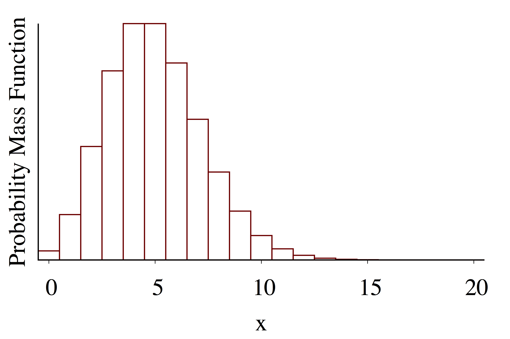
```
<br><br>
</center>

The Poisson family is also a _discrete stable family_, an analogous, if somewhat
more subtle, construction of the stable families that we encountered in 
[Section 1.2.2](#sec:stable) for discrete spaces.  Discrete stability manifests 
as closure under additive reduction of any collection of Poisson probability 
mass functions.  In other words any independent joint distribution formed from 
$N$ Poisson probability mass functions specified by the intensity parameters
$\left\{ \lambda_{1}, \ldots, \lambda_{N} \right\}$ pushes forward along the
additive projection operator to a member of the Poisson family with intensity 
$$
\lambda_{+} = \sum_{n = 1}^{N} \lambda_{n}.
$$

Because this holds for any $N$ we can always decompose a Poisson distribution
into a sum of additive increments modeled by other Poisson distributions.  This
divisibility allows the Poisson family to consistently model _counting events_
which are also known, unsurprisingly, as _Poisson processes_.

In these applications we presume a latent phenomena that manifests as some 
discrete event occurring at a constant rate per unit time, $r$.  If we observe 
for some time $\Delta T$ then we would expect to see 
$\lambda = r \cdot \Delta T$ total events, and we can model the variation in the 
observed number of events with a Poisson probability mass function with 
intensity $\lambda$.

The discrete stability of the members of the Poisson family ensures that no 
matter how we partition the observation time we get a consistent model for the
observed counts.  We get the same model regardless of whether we observe the 
entire interval $\Delta T$ at once or in any partition into $N$ stages, 
$$
\sum_{n = 1}^{N} \Delta T_{n} = \Delta T.
$$
In the former case the distribution of counts is modeled as a member of the 
Poisson family with intensity $\lambda = r \cdot \Delta T$.  In the latter 
case each observation is modeled as a member of the Poisson family with 
intensity $\lambda_{n} = r \cdot \Delta T_{n}$, and the aggregate observation 
is modeled as
$$
\begin{align*}
\lambda_{+}
&= \sum_{n = 1}^{N} \lambda_{n}
\\
&= \sum_{n = 1}^{N} r \cdot \Delta T_{n}
\\
&= r \cdot \sum_{n = 1}^{N} \Delta T_{n}
\\
&= r \cdot \Delta T
\\
&= \lambda,
\end{align*}
$$
consistent with the model for the entire interval.

As in the Bernoulli circumstance we can always reparameterize the Poisson family 
by using _log intensities_,
$$
l = \log (\lambda) \in \mathbb{R},
$$
which completely unconstrain the intensities.

## The Normal Family { #sec:normal_family }

One of the most common modeling spaces is the real numbers, $X = \mathbb{R}$.
Like the natural numbers there is no canonical family of probability density
functions on the real numbers without making additional considerations.

If we presume constrained first and second moments then maximum uniformity 
yields the _normal family_ or _Gaussian family_.  At the same time we can appeal
to stability considerations, which motivate the exact same family.

Indeed the normal family is special in that it has many convenient properties
that make it well-motivated from numerous perspectives.  Because of this the
normal family is ubiquitous in probabilistic modeling and one of the most 
important building blocks in our toolkit.

<!--html_preserve-->
<center>
<table style="width:50%; text-align: center;">
  <tr style="background-color:#F0F0F0; height: 30px;">
    <th>Parameter Name</th>
    <th>Symbol</th> 
    <th>Domain</th>
    <th>Units</th>
  </tr>
  <tr>
    <td>Location</td>
    <td>$$\mu$$</td> 
    <td>$$\mathbb{R}$$</td>
    <td>$$[x]$$</td>
  </tr>
  <tr style="background-color:#F9F9F9;">
    <td>Scale</td>
    <td>$$\sigma$$</td> 
    <td>$$\mathbb{R}^{+}$$</td>
    <td>$$[x]$$</td>
  </tr>
</table>
</center>
<!--/html_preserve-->

<br><br>

<!--html_preserve-->
<center>
<table style="width:60%; text-align: center;">
  <tr style="background-color:#F9F9F9;">
    <th>Space</td>
    <td>$$X = \mathbb{R}$$</td>
  <tr>
  <tr>
    <th>Density</th>
    <td>$$\pi(x; \mu, \sigma) = \frac{1}{ \sqrt{2 \pi \sigma^{2} } }
    \exp \left( - \frac{1}{2} \left( \frac{ x - \mu}{\sigma} \right)^{2}
    \right)$$</td>
  <tr>
  <tr style="background-color:#F9F9F9;">
    <th>Mean</th>
    <td>$$\mu$$</td>
  <tr>
  <tr>
    <th>Variance</th>
    <td>$$\sigma^{2}$$</td>
  <tr>
</table>
</center>
<!--/html_preserve-->

Each member of the normal family manifests the characteristic "bell curve",
with the density concentrating around the location parameter $\mu$ and
rapidly decaying as we move away from the location parameter.

<center>
<br>
```{r, out.width = "50%", echo=FALSE}
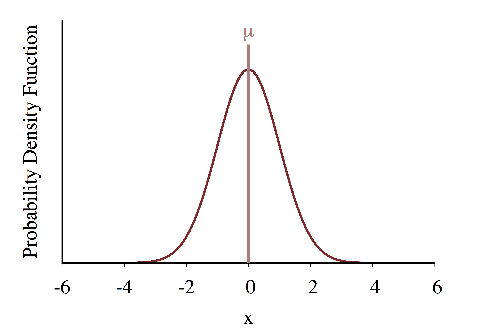
```
<br><br>
</center>

The scale parameter, $\sigma$, controls how strongly a particular member 
concentrates around its location.  Most probability, about 0.9973 or so, is
allocated to the interval $[\mu - 3 \sigma, \mu + 3 \sigma]$.  Those boundaries 
are often used to separate the _bulk_ of the probability density within that 
interval and the _tails_ below and above the interval.

<center>
<br>
```{r, out.width = "50%", echo=FALSE}
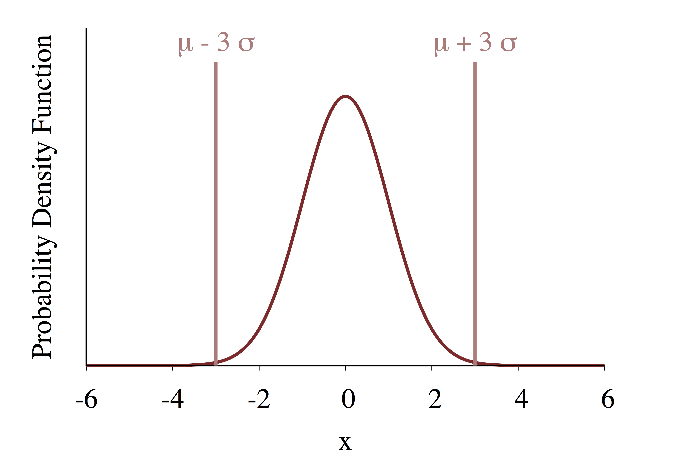
```
<br><br>
</center>

One powerful feature of the normal family is that the mean is controlled 
directly by the location parameter while the variance is controlled directly by 
the scale parameter.  That feature, which is largely due to lack of constraints 
on $X$, allows us to specify _where_ the probability density concentrates 
_independently_ from _how_ strongly it concentrates.  This decoupling greatly
facilitates the interpretation of parameters and consequently the principled
application of the family in practice.

Because of the stability of the normal family this decoupling also allows us 
to _generate_ each member of the normal family as a scaling and translation of 
the _unit normal_ with location $\mu = 0$ and scale $\sigma = 1$.  Pushing the 
unit normal through the scaling transformation $x \mapsto s \cdot x$ yields a
normal with location $\mu = 0$ and scale $\sigma = s$.  Further applying the 
translation scaling $x \mapsto x + m$ then yields a normal with location 
$\mu = m$ and scale $\sigma = s$.  Sweeping through all possible $m$ and $s$ 
generates every member of the normal family.

As intuitive as the location and scale parameters are, they are not the only 
parameterizations of the normal family used in practice.  To avoid boundary 
worries we could, for example, use the log scale instead of the scale.  We 
could also use a _variance_ parameter,
$$
v = \sigma^{2},
$$
or a _precision_ parameter,
$$
\tau = \frac{1}{\sigma^{2}}.
$$
Both of these reparameterizations have mathematical structure that make them 
convenient in certain contexts, but for modeling purposes the location-scale
parameterization is the most useful and that is what I will use throughout.

## The Beta Family {#sec:beta_family}

If we restrict our consideration to the unit interval on the real line,
$X = [0, 1] \in \mathbb{R}$, then we can appeal to maximum uniformity to 
motivate the Beta family of probability density functions.  Unlike the normal 
case, however, the nominal shape parameterization of the Beta family is a bit 
less intuitive.  Here we'll provide some intuition for this nominal 
parameterization and consider a reparameterization that goes as close as 
possible to the interpretation of the location and scale parameters enjoyed by
the normal family.

### The Shape Parameterization

Typically the Beta family is parameterized by two parameters -- the _shape_
parameters $\alpha$ and $\beta$.

<!--html_preserve-->
<center>
<table style="width:50%; text-align: center;">
  <tr style="background-color:#F0F0F0; height: 30px;">
    <th>Parameter Name</th>
    <th>Symbol</th> 
    <th>Domain</th>
    <th>Units</th>
  </tr>
  <tr>
    <td>Shape</td>
    <td>$$\alpha$$</td> 
    <td>$$\mathbb{R}^{+}$$</td>
    <td>None</td>
  </tr>
  <tr style="background-color:#F9F9F9;">
    <td>Shape</td>
    <td>$$\beta$$</td> 
    <td>$$\mathbb{R}^{+}$$</td>
    <td>None</td>
  </tr>
</table>
</center>
<!--/html_preserve-->

<br><br>

<!--html_preserve-->
<center>
<table style="width:60%; text-align: center;">
  <tr style="background-color:#F9F9F9;">
    <th>Space</td>
    <td>$$X = [0, 1]$$</td>
  <tr>
  <tr>
    <th>Density</th>
    <td>$$\pi(x; \alpha, \beta) =
          \frac{x^{\alpha - 1} (1 - x)^{\beta - 1}}
          { \mathrm{B}(\alpha, \beta) } $$</td>
  <tr>
  <tr style="background-color:#F9F9F9;">
    <th>Mean</th>
    <td>$$\frac{\alpha}{\alpha + \beta}$$</td>
  <tr>
  <tr>
    <th>Variance</th>
    <td>$$\frac{\beta}{(\alpha + \beta) (\alpha + \beta + 1) } 
        \cdot \frac{\alpha}{\alpha + \beta}$$</td>
  <tr>
</table>
</center>
<!--/html_preserve-->

Although the shape and scale parameters do not independently moderate the mean
and variance as in the normal case, they do have their own useful 
interpretation.  In particular $\alpha$ controls how strongly each member
concentrates towards the upper boundary $x = 1$ while $\beta$ controls how 
strongly each member concentrates towards the lower boundary $x = 0$.  In other
words $\alpha$ moderates the affinity towards the upper boundary while $\beta$
moderates the affinity towards the lower boundary.  The exact shape of each 
probability density function is determined by how these affinities balance 
against each other.

If $\alpha$ is large and $\beta$ is small then the entire probability density 
function will concentrate against the upper boundary.

<center>
<br>
```{r, out.width = "50%", echo=FALSE}
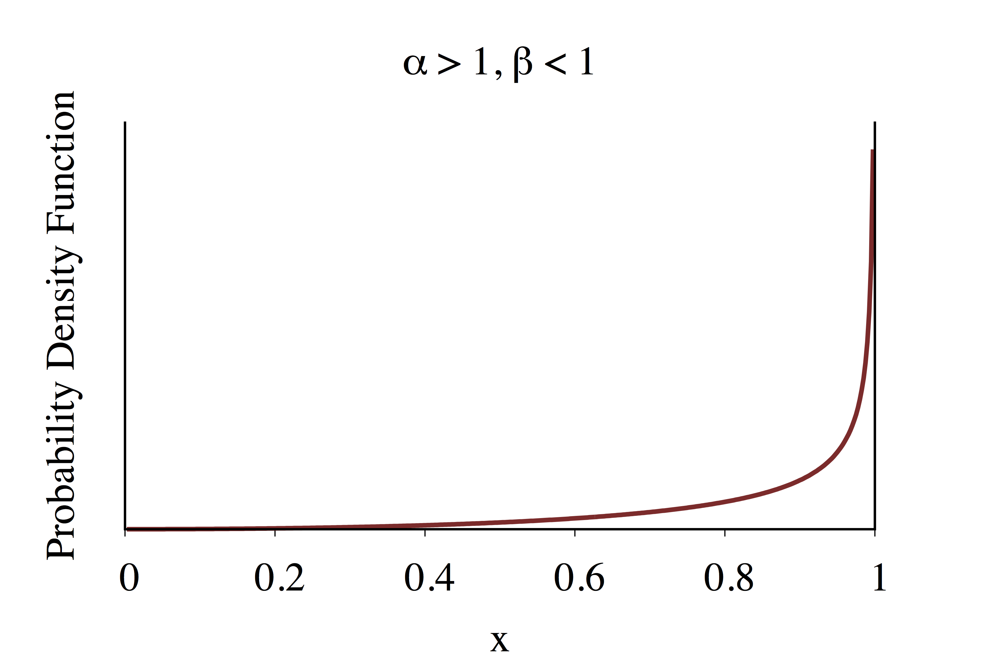
```
<br><br>
</center>

Alternatively if $\alpha$ is small and $\beta$ is large then the entire 
probability density function will concentrate against the lower boundary.

<center>
<br>
```{r, out.width = "50%", echo=FALSE}
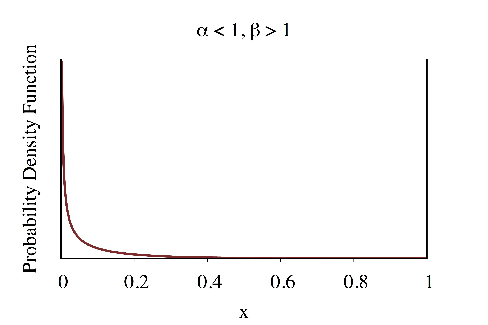
```
<br><br>
</center>

If both $\alpha$ and $\beta$ are small then the probability density function 
will concentrate against both boundaries, avoiding the interior of the interval
as much as possible.

<center>
<br>
```{r, out.width = "50%", echo=FALSE}
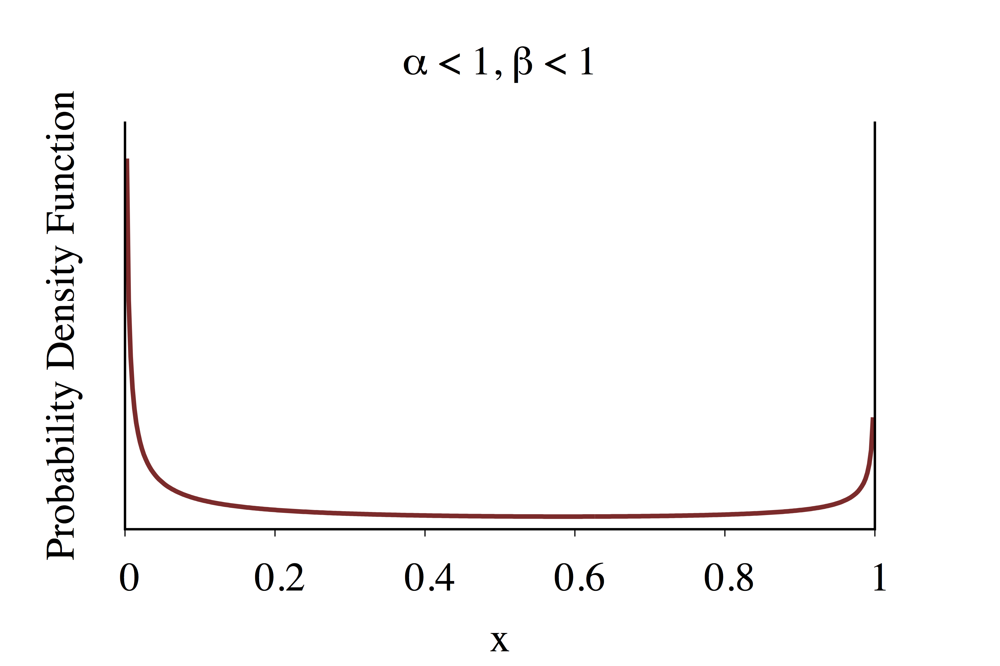
```
<br><br>
</center>

Finally if both $\alpha$ and $\beta$ are large then the probability density
function will concentrate in the interior of the interval.  The mean
depends on the exact balance between the two parameters, and the variance will 
shrink as both of the parameters increase.

<center>
<br>
```{r, out.width = "50%", echo=FALSE}
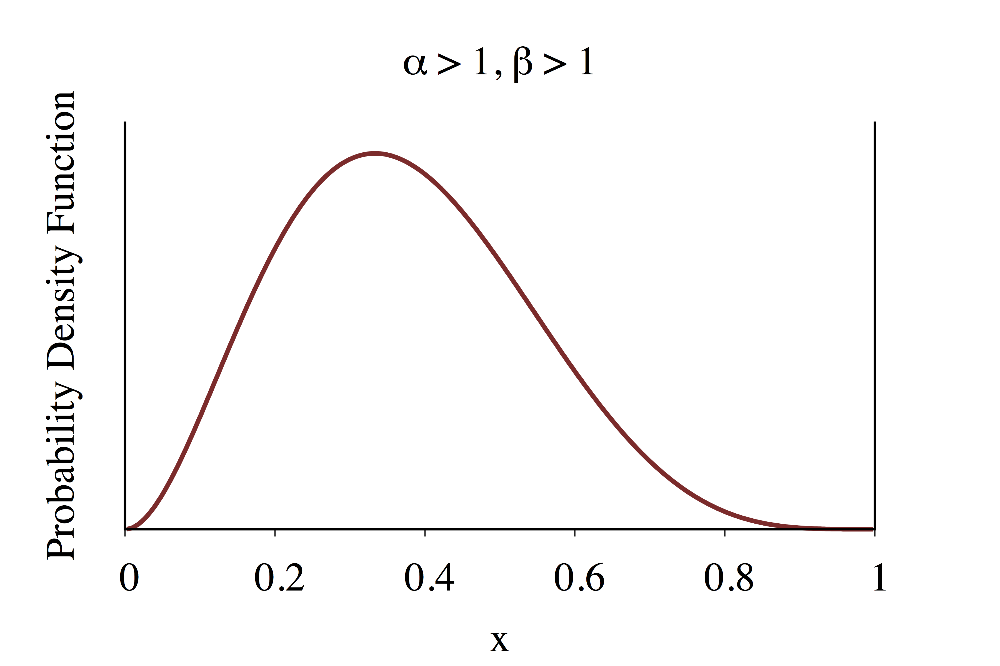
```
<br><br>
</center>

### The Location-Dispersion Parameterization

Although the shape nominal parameterization of the Beta family does feature a
useful intuition, its indirect relationship to the mean and variance of the 
resulting probability distribution can confuse certain applications.  We can 
achieve a more direct relationship with a careful reparameterization.

Ultimately the mean and variance cannot be controlled independently because of 
the constraints imposed on the ambient space $X$.  Indeed working in the nominal
parameterization one can verify that for all members of the Beta family
$$
\mathbb{V} \le \mathbb{m} \cdot (1 - \mathbb{m});
$$
the possible values for the variance depend on the mean.  Any attempt to
parameterize the variance directly would require a mean-dependent domain which 
often induces computational problems when moving through the family.

Instead of trying to parameterize the mean and the variance directly, and suffer
the nontrivial constraints between them, a more useful approach takes advantage 
of the linear scaling between the mean and the variance.
$$
\begin{align*}
\mathbb{V} 
&= 
\frac{\beta}{(\alpha + \beta) (\alpha + \beta + 1) } 
\cdot \frac{\alpha}{\alpha + \beta}
\\
&= 
\frac{1}{\alpha + \beta + 1} 
\cdot \frac{\beta}{\alpha + \beta} 
\cdot \frac{\alpha}{\alpha + \beta}
\\
&= 
\frac{1}{\alpha + \beta + 1} 
\cdot \left(1 - \frac{\alpha}{\alpha + \beta} \right)
\cdot \frac{\alpha}{\alpha + \beta}
\\
&=
\frac{1}{\alpha + \beta + 1} 
\cdot \mathbb{m} \cdot (1 - \mathbb{m}).
\end{align*}
$$
In particular we can parameterize the members of the Beta family by their means 
and the ratio between the variance and maximum variance,
$$
\begin{align*}
\mu &= \frac{\alpha}{\alpha + \beta}
\\
\psi &= \frac{1}{\alpha + \beta + 1}
\end{align*}
$$

<!--html_preserve-->
<center>
<table style="width:50%; text-align: center;">
  <tr style="background-color:#F0F0F0; height: 30px;">
    <th>Parameter Name</th>
    <th>Symbol</th> 
    <th>Domain</th>
    <th>Units</th>
  </tr>
  <tr>
    <td>Location</td>
    <td>$$\mu$$</td> 
    <td>$$[0, 1]$$</td>
    <td>None</td>
  </tr>
  <tr style="background-color:#F9F9F9;">
    <td>Dispersion</td>
    <td>$$\phi$$</td> 
    <td>$$[0, 1]$$</td>
    <td>None</td>
  </tr>
</table>
</center>
<!--/html_preserve-->

<br><br>

<!--html_preserve-->
<center>
<table style="width:60%; text-align: center;">
  <tr style="background-color:#F9F9F9;">
    <th>Space</td>
    <td>$$X = [0, 1]$$</td>
  <tr>
  <tr>
    <th>Density</th>
    <td>$$\pi(x; \mu, \nu) =
          \frac{x^{\frac{1 - \psi}{\psi} \mu - 1} 
          (1 - x)^{\frac{1 - \psi}{\psi} (1 - \mu) - 1}}
          { \mathrm{B} \left( \frac{1 - \psi}{\psi} \mu, 
                              \frac{1 - \psi}{\psi} (1 - \mu) \right) } $$</td>
  <tr>
  <tr style="background-color:#F9F9F9;">
    <th>Mean</th>
    <td>$$\mu$$</td>
  <tr>
  <tr>
    <th>Variance</th>
    <td>$$\mu \cdot (1 - \mu) \, \psi$$</td>
  <tr>
</table>
</center>
<!--/html_preserve-->

The dispersion parameter $\psi$ then determines how strongly the probability 
density function of each member concentrates within its valid domain.

## The Gamma Family

Working on the positive real numbers, $X = \mathbb{R}^{+}$, is closely analogous
to working on the unit interval.  Maximum uniformity with the constraint 
functions $T_{1}(x) = x$ and $T_{2}(x) = \log(x)$ motivates the _Gamma family_
of probability density functions whose nominal parameterization features a 
useful if not immediately obvious intuition.  Likewise by using the natural 
scaling between the mean and the variance we can motivate a reparameterization 
that allows for a more direct connection between the parameters and the 
cumulants of each member.

The Gamma family includes a number of special cases that arise in the 
statistical literature, namely the $\chi^{2}$ family and the non-central 
$\chi^{2}$ family, that we will not cover here.

### The Shape-Rate Parameterization

The typical parameterization of the Gamma family features a _shape_ parameter,
$\alpha$, and an _inverse scale_ or _rate_ parameter, $\beta$.

A quick word on vocabulary.  _Scale_ parameters have the same units as the
space itself, so that dividing a distance in that space by the parameter 
_scales_ the distance into a unitless number.  Inverse scale parameters have the
reciprocal units as the space, so multiplication scales distances to a unitless
number.  This etymological detail is by no means necessary, but it can sometimes 
be a helpful trick to remember how a family parameter relates to the ambient 
space, $X$.

<!--html_preserve-->
<center>
<table style="width:50%; text-align: center;">
  <tr style="background-color:#F0F0F0; height: 30px;">
    <th>Parameter Name</th>
    <th>Symbol</th> 
    <th>Domain</th>
    <th>Units</th>
  </tr>
  <tr>
    <td>Shape</td>
    <td>$$\alpha$$</td> 
    <td>$$\mathbb{R}^{+}$$</td>
    <td>None</td>
  </tr>
  <tr style="background-color:#F9F9F9;">
    <td>Inverse Scale or Rate</td>
    <td>$$\beta$$</td> 
    <td>$$\mathbb{R}^{+}$$</td>
    <td>$$[x^{-1}]$$</td>
  </tr>
</table>
</center>
<!--/html_preserve-->

<br><br>

<!--html_preserve-->
<center>
<table style="width:50%; text-align: center;">
  <tr style="background-color:#F9F9F9;">
    <th>Space</td>
    <td>$$X = \mathbb{R}^{+}$$</td>
  <tr>
  <tr>
    <th>Density</th>
    <td>$$\pi(x; \alpha, \beta) = \frac{ \beta^{\alpha} }{ \Gamma(\alpha) }
          x^{\alpha - 1} e^{- \beta \, x}$$</td>
  <tr>
  <tr style="background-color:#F9F9F9;">
    <th>Mean</th>
    <td>$$\frac{\alpha}{\beta}$$</td>
  <tr>
  <tr>
    <th>Variance</th>
    <td>$$\frac{1}{\beta} \cdot \frac{\alpha}{\beta}$$</td>
  <tr>
</table>
</center>
<!--/html_preserve-->

The shape and inverse scale parameters have a similar interpretation as the 
shape parameters in the Beta family.  $\alpha$ quantifies the affinity of a
probability density function towards the upper boundary, which in this case is
positive infinity, while $\beta$ quantifies the affinity towards the lower
boundary, which in this case is still zero.

<center>
<br>
```{r, out.width = "50%", echo=FALSE}
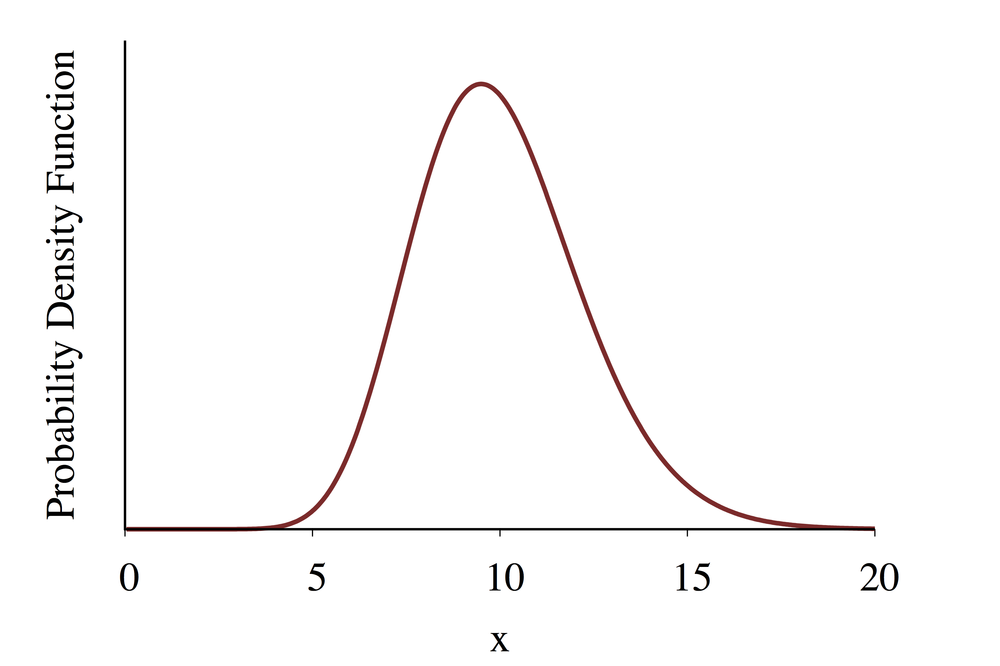
```
<br><br>
</center>

Once again the overall shape of any member of the Gamma family depends on the
balance between these two parameters.  The larger $\alpha$ for a fixed $\beta$,
the more the probability density function will concentrate towards positive
infinity.  The larger $\beta$ for a fixed $\alpha$, the more it will concentrate
towards zero.

### The Location-Dispersion Parameterization

Unlike the Beta family, we can parameterize the Gamma family in terms of a mean 
and variance,
$$
\begin{align*}
\mu &= \frac{\alpha}{\beta}
\\
\sigma^{2} &= \frac{1}{\beta} \frac{\alpha}{\beta },
\end{align*}
$$
but that doesn't necessarily mean that it's a good idea.  These two parameters
would be strongly coupled through their common dependence to the mean 
$\mathbb{m} = \alpha / \beta$.

To get a more orthogonal parameterization we can instead appeal to the same 
approach that we considered in [Section 2.4](#sec:beta_family) and exploit the
linear scaling between the mean and the variance,
$$
\begin{align*}
\mathbb{V} 
&= 
\frac{ 1 }{ \beta } 
\cdot \frac{\alpha}{\beta}
\\
&=
\frac{ 1 }{ \beta } 
\cdot \mathbb{m},
\end{align*}
$$
by parameterizing the Beta family through its mean and the scaling between the
mean and variance,
$$
\begin{align*}
\mu &= \frac{\alpha}{\beta}
\\
\psi &= \frac{1}{\beta}.
\end{align*}
$$

<!--html_preserve-->
<center>
<table style="width:50%; text-align: center;">
  <tr style="background-color:#F0F0F0; height: 30px;">
    <th>Parameter Name</th>
    <th>Symbol</th> 
    <th>Domain</th>
    <th>Units</th>
  </tr>
  <tr>
    <td>Location</td>
    <td>$$\mu$$</td> 
    <td>$$\mathbb{R}^{+}$$</td>
    <td>$$[x]$$</td>
  </tr>
  <tr style="background-color:#F9F9F9;">
    <td>Dispersion</td>
    <td>$$\psi$$</td> 
    <td>$$\mathbb{R}^{+}$$</td>
    <td>$$[x]$$</td>
  </tr>
</table>
</center>
<!--/html_preserve-->

<br><br>

<!--html_preserve-->
<center>
<table style="width:60%; text-align: center;">
  <tr style="background-color:#F9F9F9;">
    <th>Space</td>
    <td>$$X = \mathbb{R}^{+}$$</td>
  <tr>
  <tr>
    <th>Density</th>
    <td>$$\pi(x; \mu, \psi) = 
          \frac{ \beta^{ \frac{\mu}{\psi} } }
               { \Gamma \left( \frac{\mu}{\psi} \right) }
          x^{\frac{\mu}{\psi} - 1} e^{- x / \psi}$$</td>
  <tr>
  <tr style="background-color:#F9F9F9;">
    <th>Mean</th>
    <td>$$\mu$$</td>
  <tr>
  <tr>
    <th>Variance</th>
    <td>$$\psi \cdot \mu$$</td>
  <tr>
</table>
</center>
<!--/html_preserve-->

The dispersion parameter $\psi$ modifies the concentration of a probability
density function in the Gamma family from its nominal value $\mathbb{V} = \mu$.
For values greater than one the resulting probability density function has 
_excess_ dispersion while values less than one yield _deficient_ dispersion.

# Probabilistic Progeny

By appealing to stability and maximum uniformity considerations we were able to 
motivate a basic probabilistic palette consisting of useful families of 
probability density functions over spaces that commonly occur in applications.

One way we can expand this initial palette is to consider more elaborate 
maximum uniformity constraints that give rise to more elaborate families of
probability density functions with interesting properties.  This introduces the
challenge, however, of identifying exactly which constraints will yield useful 
properties.

Another approach is to transform our elementary building blocks, pushing the
members of each family through transformations that induce interesting 
behaviors.  This latter approach is often the most intuitive and will be the 
main motivation for growing our tool box.

## The Binomial Family

In [Section 2.1](#sec:bernoulli_family) we saw that the Bernoulli family 
completely encapsulates all possible probability mass functions on the binary 
space $X = \{0, 1\}$.  We can build a new family on the natural numbers by 
pushing this family through an additive projection.

Once we build an independent and identically distributed joint distribution on 
$X_{N} = \{0, 1\}^{N}$ by placing the member of the Bernoulli family with 
probability parameter $p$ on each component, we can push that joint probability 
mass function through the additive projection to get a _binomial family_ of
probability mass functions on the space $X = \{0, \ldots, N\}$.

<!--html_preserve-->
<center>
<table style="width:50%; text-align: center;">
  <tr style="background-color:#F0F0F0; height: 30px;">
    <th>Parameter Name</th>
    <th>Symbol</th> 
    <th>Domain</th>
    <th>Units</th>
  </tr>
  <tr>
    <td>Probability</td>
    <td>$$p$$</td> 
    <td>$$[0, 1]$$</td>
    <td>None</td>
  </tr>
  <tr style="background-color:#F9F9F9;">
    <td>Number of Trials</td>
    <td>$$N$$</td> 
    <td>$$\mathbb{N}$$</td>
    <td>$$[x]$$</td>
  </tr>
</table>
</center>
<!--/html_preserve-->

<br><br>

<!--html_preserve-->
<center>
<table style="width:60%; text-align: center;">
  <tr style="background-color:#F9F9F9;">
    <th>Space</td>
    <td>$$X = [0, \ldots, N]$$</td>
  <tr>
  <tr>
    <th>Density</th>
    <td>$$\pi(x; p, N) = {N \choose x} p^{x} (1 - p)^{N - x}$$</td>
  <tr>
  <tr style="background-color:#F9F9F9;">
    <th>Mean</th>
    <td>$$N \, p$$</td>
  <tr>
  <tr>
    <th>Variance</th>
    <td>$$(1 - p) \cdot N \, p$$</td>
  <tr>
</table>
</center>
<!--/html_preserve-->

Intuitively we can think of this process as aggregating a distribution for the
total number of $x = 1$ states across the $N$ component binary spaces, with the 
${N \choose x}$ term in the probability mass functions accounts for the
indistinguishability of the component spaces.  The state 
$x \in \{0, \ldots, N\}$ is indifferent to exactly which component spaces
contributed a $1$ state, and there are ${N \choose x}$ possible configurations 
that all yield $x$ total $1$ states.

Each member of the Binomial family behaves like a member of the Bernoulli family
whose parameters are scaled by $N$.  In particular the probability mass 
functions concentrate around the mean $\mathbb{m} = N \, p$, here 
$\mathbb{m} = 20 \cdot 0.6 = 12$. 

<center>
<br>
```{r, out.width = "50%", echo=FALSE}
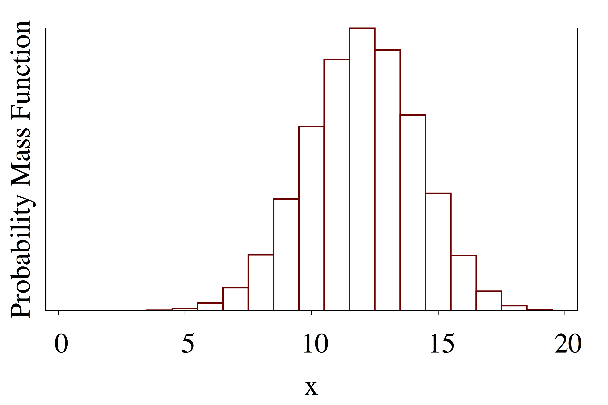
```
<br><br>
</center>

The larger $N$ the stronger this concentration is relative to the mean.

## The Negative Binomial Family

Another way to aggregate independent, identically distributed members of the
Bernoulli family is to consider the distribution of the number of components 
needed to achieve a certain sum, $k$.  Here there is no upper bound on how many 
components we might need as there will always be configurations with an 
arbitrary number of component spaces in the $x = 0$ state.  All we know is that
we will need at least $k$ components.

This complementary construction to the Binomial family yields the
_negative Binomial family_.

<!--html_preserve-->
<center>
<table style="width:50%; text-align: center;">
  <tr style="background-color:#F0F0F0; height: 30px;">
    <th>Parameter Name</th>
    <th>Symbol</th> 
    <th>Domain</th>
    <th>Units</th>
  </tr>
  <tr>
    <td>Probability</td>
    <td>$$p$$</td> 
    <td>$$[0, 1]$$</td>
    <td>None</td>
  </tr>
  <tr style="background-color:#F9F9F9;">
    <td>Number of Success</td>
    <td>$$k$$</td> 
    <td>$$\mathbb{N}$$</td>
    <td>$$[x]$$</td>
  </tr>
</table>
</center>
<!--/html_preserve-->

<br><br>

<!--html_preserve-->
<center>
<table style="width:60%; text-align: center;">
  <tr style="background-color:#F9F9F9;">
    <th>Space</td>
    <td>$$X = \left\{k, \ldots, \infty \right\}$$</td>
  <tr>
  <tr>
    <th>Density</th>
    <td>$$\pi(x; p, k) = {x - 1 \choose k - 1} p^{k} (1 - p)^{x - k}$$</td>
  <tr>
  <tr style="background-color:#F9F9F9;">
    <th>Mean</th>
    <td>$$\frac{k}{p}$$</td>
  <tr>
  <tr>
    <th>Variance</th>
    <td>$$\frac{(1 - p)}{p} \cdot \frac{k}{p}$$</td>
  <tr>
</table>
</center>
<!--/html_preserve-->

As in the Binomial case the combinatorial term ${x - 1 \choose k - 1}$ accounts
for the indistinguishability of the individual components that we are 
aggregating together.

## The Multivariate Normal Family

We have exploited independent and identically distributed joint distributions 
multiple times already, but so far only as input to an additive projection.
We can build up families of multivariate probability density functions by
considering one-to-one transformations on these joint spaces instead of just
projections.

For example consider a joint distribution on $X = \mathbb{R}^{N}$ constructed 
from $N$ independent and identical unit normal probability density functions on 
each of the component spaces.

<center>
<br>
```{r, out.width = "50%", echo=FALSE}
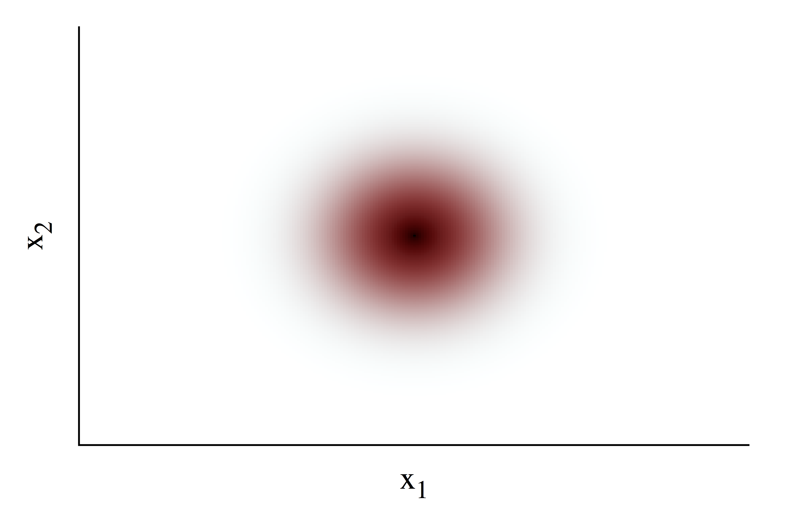
```
<br><br>
</center>

Given a vector $\boldsymbol{\tau}$ we can then scale the probability density 
function along the $n$th component by the corresponding scale, $\tau_{n}$.

<center>
<br>
```{r, out.width = "50%", echo=FALSE}
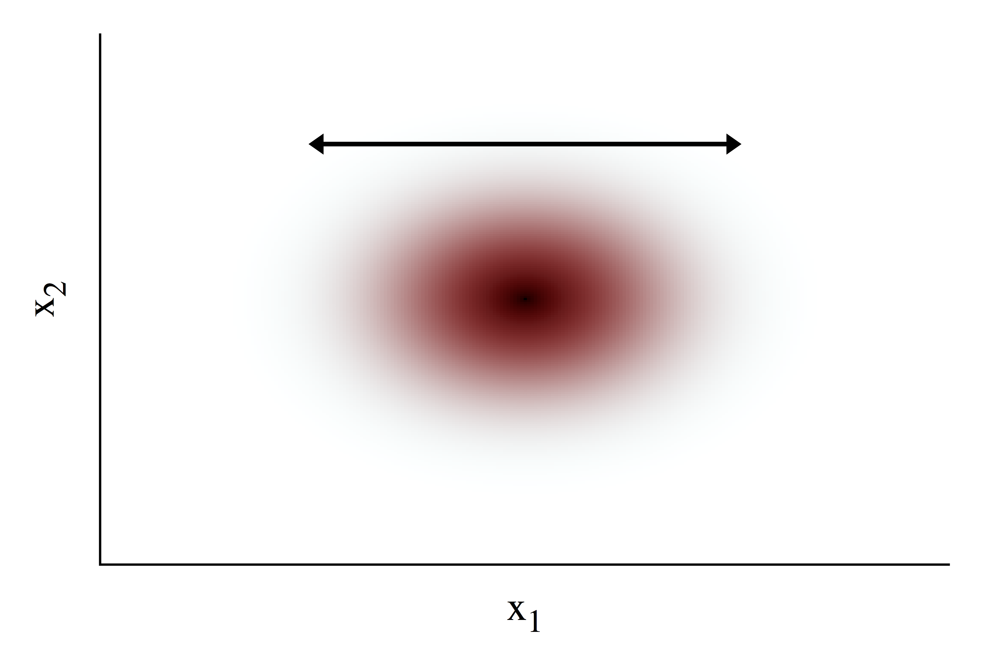
```
<br><br>
</center>

We can then apply a rotation matrix, $\boldsymbol{R}$, mixing these components 
into each other as if we were tilting our heads around the original component
directions.  Formally a rotation matrix is given by any matrix that is 
orthogonal, $\boldsymbol{R}^{T}$ = $\boldsymbol{R}$, with ones along the 
diagonal, $R_{nn} = 1$.

<center>
<br>
```{r, out.width = "50%", echo=FALSE}
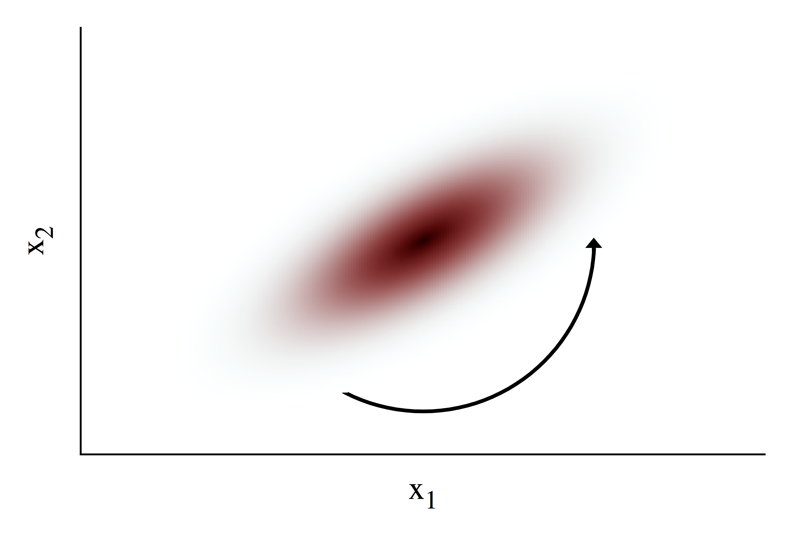
```
<br><br>
</center>

Finally we can translate this rotated probability density function by adding
a vector of locations, $\boldsymbol{\mu}$.

<center>
<br>
```{r, out.width = "50%", echo=FALSE}
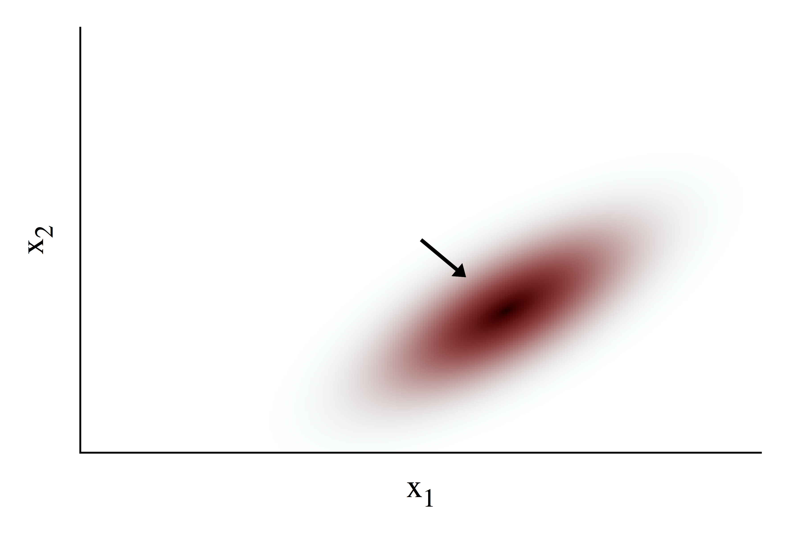
```
<br><br>
</center>

All together we push our independent and identically unit normal joint 
probability density function forward along the transformation
$$
\begin{alignat*}{6}
\phi :\; &\mathbb{R}^{N} & &\rightarrow& \; &\mathbb{R}^{N}&
\\
&\mathbf{x}& &\mapsto& &\boldsymbol{\mu} + \boldsymbol{R} \cdot
\mathrm{diag}( \boldsymbol{\tau} ) \cdot \mathbf{x}&.
\end{alignat*}
$$
Here the function $\mathrm{diag}$ maps a vector to the diagonal of an otherwise
empty matrix; in other words $\mathrm{diag}(\mathbf{y}) \cdot \mathbf{x}$ 
computes the element-wise product, $\sum_{n = 1}^{N} y_{n} \cdot x_{n}$.

Repeating this pushforward for all possible values of the component locations,
$\boldsymbol{\mu}$, component scales, $\boldsymbol{\tau}$, and rotation matrix,
$\boldsymbol{R}$, defines the _multivariate normal family_ of probability
density functions.  In practice, however, we parameterize this family not with
separate rotation and scales but a combination of the two.

### Covariance Parameterization

Recall that in the multivariate real numbers, $X = \mathbb{R}^{N}$, we have
$N$ projection operators that map back to each component space, 
$$
\begin{alignat*}{6}
\varpi_{n} :\; &\hspace{15mm}\mathbb{R}^{N} & &\rightarrow& \; &\mathbb{R}&
\\
&(x_{1}, \ldots, x_{n}, \ldots, x_{N})& &\mapsto& &x_{n}&.
\end{alignat*}
$$

The expectation of these projection operators define the _component means_,
$$
\mathbb{m}_{n} = \mathbb{E}_{\pi} [ \varpi_{n} ],
$$
while the expectation of the squared difference from each projection operator to
its corresponding component mean defines _component variances_,
$$
\mathbb{V}_{nn} = \mathbb{E}_{\pi} [ (\varpi_{n} - \mathbb{m}_{n})^{2}].
$$
By crossing the differences we can also construct _component covariances_,
$$
\mathbb{V}_{nm} = 
\mathbb{E}_{\pi} [ (\varpi_{n} - \mathbb{m}_{n}) \cdot
                   (\varpi_{m} - \mathbb{m}_{m})].
$$

The component scales and rotation matrix that we use to generate a member of 
the multivariate normal family are only indirectly related to these expectation 
values.  We can more directly relate to the expectation values by constructing
the _covariance matrix_,
$$
\boldsymbol{\Sigma} = 
\boldsymbol{R}
\cdot \mathrm{diag}(\boldsymbol{\tau})
\cdot \mathrm{diag}(\boldsymbol{\tau})
\cdot \boldsymbol{R}^{T}.
$$
Intuitively this covariance matrix rotates our space back to the original
independent components, scales each component, then undoes the rotation to put
the space back in its initial, rotated orientation.

By parameterizing the multivariate normal family in terms of components 
locations and the elements of a covariance matrix we can directly control the
component means, variances, and covariances.

<!--html_preserve-->
<center>
<table style="width:50%; text-align: center;">
  <tr style="background-color:#F0F0F0; height: 30px;">
    <th>Parameter Name</th>
    <th>Symbol</th> 
    <th>Domain</th>
    <th>Units</th>
  </tr>
  <tr>
    <td>Component Locations</td>
    <td>$$\mu_{n}$$</td> 
    <td>$$\mathbb{R}$$</td>
    <td>$$[x]$$</td>
  </tr>
  <tr style="background-color:#F9F9F9;">
    <td>Component Scales</td>
    <td>$$\Sigma_{nn}$$</td> 
    <td>$$\mathbb{R}^{+}$$</td>
    <td>$$[x^{2}]$$</td>
  </tr>
  <tr>
    <td>Cross Component Scales</td>
    <td>$$\Sigma_{nm}$$</td>
    <td>$$\mathbb{R}$$</td>
    <td>$$[x^{2}]$$</td>
  </tr>
</table>
</center>
<!--/html_preserve-->

<br><br>

<!--html_preserve-->
<center>
<table style="width:80%; text-align: center;">
  <tr style="background-color:#F9F9F9;">
    <th>Space</td>
    <td>$$X = \mathbb{R}^{N}$$</td>
  <tr>
  <tr>
    <th>Density</th>
    <td>$$\pi(x; \boldsymbol{\mu}, \boldsymbol{\Sigma}) = 
          \frac{1}{ \sqrt{2 \pi | \boldsymbol{\Sigma} | } }
          \exp \left( - \frac{1}{2} \
                        (\mathbf{x} - \boldsymbol{\mu})^{T}
                         \boldsymbol{\Sigma}^{-1} \
                        (\mathbf{x} - \boldsymbol{\mu}) \right)$$</td>
  <tr>
  <tr style="background-color:#F9F9F9;">
    <th>Component Means</th>
    <td>$$\boldsymbol{\mu}$$</td>
  <tr>
  <tr>
    <th>Component Covariances</th>
    <td>$$\boldsymbol{\Sigma}$$</td>
  <tr>
</table>
</center>
<!--/html_preserve-->

In order to build confidence that this is a valid parameterization we can do a 
little accounting.  We generated a member of the multivariate normal family
using $N (N + 3) / 2$ values, $N$ for the component locations,
$N$ for the component scales, and $N (N - 1) / 2$ for the elements of a valid
rotation matrix.  The covariance parameterization also specifies $N (N + 3) / 2$
values, $N$ for the component locations and $N (N + 1) / 2$ for the elements of 
a valid covariance matrix.

### Cholesky Parameterization

As interpretable as the nominal parameterization is, it can be difficult to work
with in practice because of the inversion and determinant needed in the 
calculation of the joint probability density functions.  These calculations can
be facilitated by parameterizing the multivariate normal family in terms of a
_Cholesky factorization_.

First we go back to our initial generative perspective and instead of 
constructing a covariance matrix we construct a _correlation matrix_,
$$
\boldsymbol{\Psi} = 
\boldsymbol{R} \cdot \boldsymbol{R}^{T},
$$
keeping the scales separate.  The elements of the correlation matrix define
the normalized expectation values
$$
\Psi_{nm} 
= 
\frac{ \mathbb{E}_{\pi} [ (\varpi_{n} - \mathbb{m}_{n}) \cdot
                          (\varpi_{m} - \mathbb{m}_{m})] }
{ \sqrt{      \mathbb{E}_{\pi} [ (\varpi_{n} - \mathbb{m}_{n})^{2} ]
        \cdot \mathbb{E}_{\pi} [ (\varpi_{m} - \mathbb{m}_{m})^{2} ] } }
$$
which quantify the linear relationships between the variations in each 
component direction.

Instead of specifying a correlation matrix directly, however, we can specify it
through its Cholesky factor, $\mathbf{L}$, a lower triangular matrix that 
satisfies
$$
\boldsymbol{L} \cdot \boldsymbol{L}^{T} = \boldsymbol{\Psi}.
$$
Although they are superficially similar, the Cholesky factor is not a rotation
matrix!  The individual elements are difficult to interpret, but this 
perspective has many computational advantages that make it valuable in practice.

For example we can numerically solve for $\mathbf{y}$ in 
$\mathbf{L} \cdot \mathbf{y} = \mathbf{x}$ using algorithms that are efficient 
while also being highly accurate.  This allows us to compute the term
$$
\phi = - \frac{1}{2}
(\mathbf{x} - \boldsymbol{\mu})^{T}
\boldsymbol{\Sigma}^{-1} \
(\mathbf{x} - \boldsymbol{\mu})
$$
in just three steps,
$$
\begin{align*}
\mathbf{L} \cdot \mathbf{y} &= \mathbf{x} - \boldsymbol{\mu}
\\
\mathbf{z} &= \mathrm{diag}(\boldsymbol{\tau}) \cdot \mathbf{y}
\\
\phi &= - \frac{1}{2} \mathbf{z}^{T} \cdot \mathbf{z}.
\end{align*}
$$

<!--html_preserve-->
<center>
<table style="width:50%; text-align: center;">
  <tr style="background-color:#F0F0F0; height: 30px;">
    <th>Parameter Name</th>
    <th>Symbol</th> 
    <th>Domain</th>
    <th>Units</th>
  </tr>
  <tr>
    <td>Component Locations</td>
    <td>$$\mu_{n}$$</td> 
    <td>$$\mathbb{R}$$</td>
    <td>$$[x]$$</td>
  </tr>
  <tr style="background-color:#F9F9F9;">
    <td>Component Scales</td>
    <td>$$\tau_{n}$$</td> 
    <td>$$\mathbb{R}^{+}$$</td>
    <td>$$[x]$$</td>
  </tr>
  <tr>
    <td>Cholesky Factor</td>
    <td>$$\mathbf{L}$$</td>
    <td>$$\mathbb{R}^{N(N-1)/2}$$</td>
    <td>None</td>
  </tr>
</table>
</center>
<!--/html_preserve-->

<br><br>

<!--html_preserve-->
<center>
<table style="width:75%; text-align: center;">
  <tr style="background-color:#F9F9F9;">
    <th>Space</td>
    <td>$$X = \mathbb{R}^{N}$$</td>
  <tr>
  <tr>
    <th>Density</th>
    <td>$$\pi(x; \boldsymbol{\mu}, \boldsymbol{\Sigma}) = 
          \left( 2 \pi \prod_{n=1}^{N} \tau_{n}^{2} \right)^{-\frac{1}{2}}
          \exp \left( - \mathbf{z}^{T} \cdot \mathbf{z} \right)$$</td>
  <tr>
  <tr style="background-color:#F9F9F9;">
    <th>Component Means</th>
    <td>$$\boldsymbol{\mu}$$</td>
  <tr>
  <tr>
    <th>Component Covariances</th>
    <td>$$\mathbf{L} \cdot \mathrm{diag}(\boldsymbol{\tau})
          \cdot \mathrm{diag}(\boldsymbol{\tau}) \cdot \mathbf{L}^{T} \cdot$$</td>
  <tr>
</table>
</center>
<!--/html_preserve-->

## The Log Normal Family

Earlier we used maximum uniformity arguments to motivate the Gamma family on the
positive reals, $X = \mathbb{R}^{+}$.  Another way to construct families on the
positive reals is by transforming families already in our toolkit.  For example
we can squeeze the normal family into the positive reals by pushing each member
through the exponential function,
$$
\begin{alignat*}{6}
\exp :\; &\mathbb{R} & &\rightarrow& \; &\mathbb{R}^{+}&
\\
&x& &\mapsto& &\exp(x)&.
\end{alignat*}
$$
These pushforward probability density functions define the _log normal family_.

Note that both the original, unconstrained real line and the final, constrained
real line have to be unitless in order for the pushforward probability density
functions to be well-defined.  The final space $X = \mathbb{R}^{+}$ is often 
interpreted as multiplicative increments, or _proportions_, that independently 
scale some baseline value.

This interpretation is particularly useful in practice because it allows us to 
determine appropriate scales on $X$.  For example $x = 2$ corresponds to 
doubling the baseline, while $x = 0.5$ corresponds to halving it.  For all but
the most extreme circumstances reasonable values will be closely concentrated 
near $x = 1$ which leaves the baseline unmodified.

<!--html_preserve-->
<center>
<table style="width:50%; text-align: center;">
  <tr style="background-color:#F0F0F0; height: 30px;">
    <th>Parameter Name</th>
    <th>Symbol</th> 
    <th>Domain</th>
    <th>Units</th>
  </tr>
  <tr>
    <td>Location</td>
    <td>$$\mu$$</td> 
    <td>$$\mathbb{R}$$</td>
    <td>None</td>
  </tr>
  <tr style="background-color:#F9F9F9;">
    <td>Scale</td>
    <td>$$\sigma$$</td> 
    <td>$$\mathbb{R}^{+}$$</td>
    <td>None</td>
  </tr>
</table>
</center>
<!--/html_preserve-->

<br><br>

<!--html_preserve-->
<center>
<table style="width:70%; text-align: center;">
  <tr style="background-color:#F9F9F9;">
    <th>Space</td>
    <td>$$X = \mathbb{R}^{+}$$</td>
  <tr>
  <tr>
    <th>Density</th>
    <td>$$\pi(x; \mu, \sigma) = \frac{ 1 }{ x \sqrt{ 2 \pi \sigma^{2} } } 
          \exp \left( -\frac{1}{2} \left( \frac{\log x - \mu}{\sigma} \right)^{2}
          \right)$$</td>
  <tr>
  <tr style="background-color:#F9F9F9;">
    <th>Mean</th>
    <td>$$e^{\mu + \frac{1}{2} \sigma^{2}}$$</td>
  <tr>
  <tr>
    <th>Variance</th>
    <td>$$\left( e^{\sigma^{2}} + 1 \right) \cdot
          \left( e^{\mu + \frac{1}{2} \sigma^{2}} \right)^{2}$$</td>
  <tr>
</table>
</center>
<!--/html_preserve-->

One of the characteristic features of the log normal family is the heavy
tail of each member that stretches out to large, positive values.  Because tails
this heavy are relatively exceptional in the Gamma family we can use the desired
tail behavior to select between the two families in practical applications.

<center>
<br>
```{r, out.width = "50%", echo=FALSE}
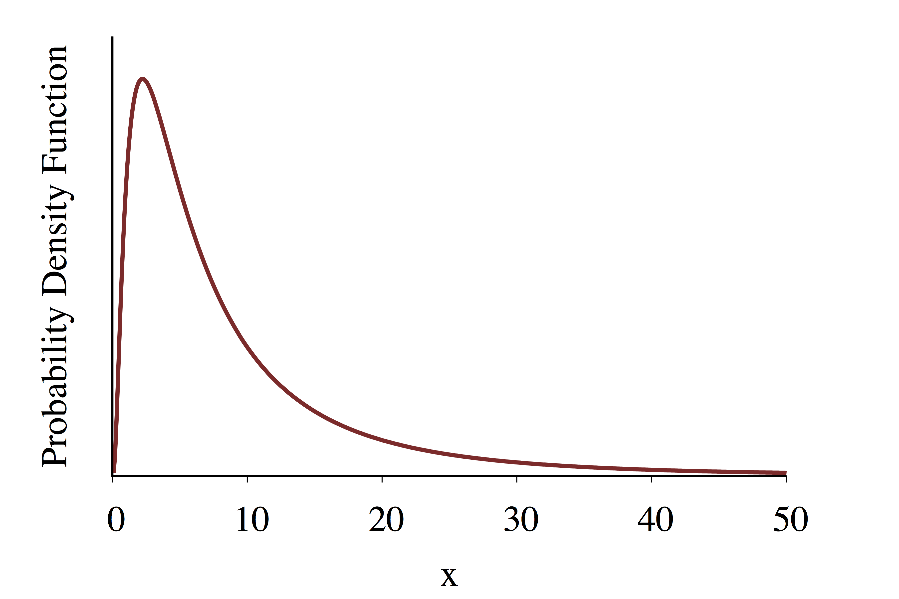
```
<br><br>
</center>

The heavy tails in the log normal family arise from the asymmetry of the
exponential function.  No matter the location of the initiating normal 
probability density function, values above the location parameter, $\mu$, are
magnified much more than values below $\mu$, skewing the resulting log normal
probability density function and filling out the tail.

<center>
<br>
```{r, out.width = "50%", echo=FALSE}
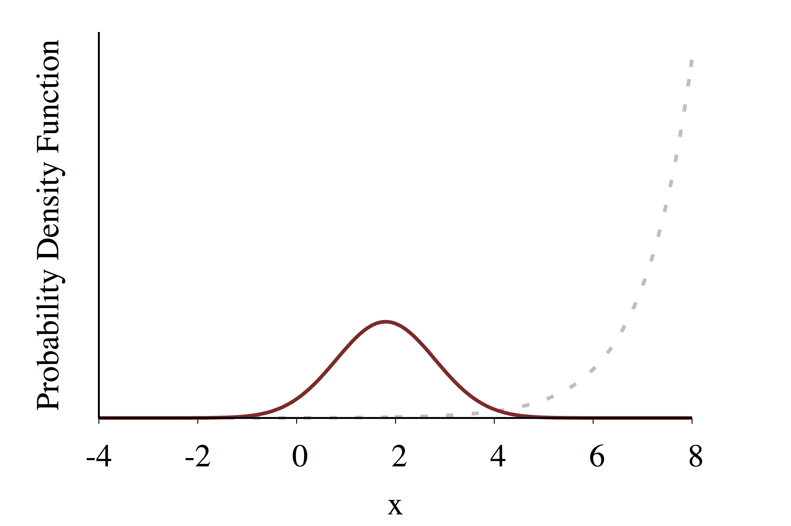
```
<br><br>
</center>

The asymmetry is even more pronounced for larger scale parameters, $\sigma$, 
which stretch out the initiating normal probability density function into 
neighborhoods where the exponential magnification is even stronger.  In other 
words the wider the initiating normal member the more skewed and heavy tailed
the corresponding log normal member will be.  This explains why the mean of the 
log normal grows with $\sigma$ -- the larger $\sigma$ the more the mean will be
pulled up by the heavy upper tail.

One interesting property that the log normal family inherits from the normal 
family is a form of stability.  While the normal family is closed under 
additive reductions, the log normal family is closed under multiplicative 
reductions.  Aggregating a bunch of multiplicative increments that follow 
probability distributions specified by members of the log normal family results
in an overall proportion distributed according to another member of the log
normal family.

## The Inverse Gamma Family

Another way to generate a family on $X = \mathbb{R}^{+}$ is to push another 
family on the positive reals through a one-to-one transformation.  We might,
for example, consider the reciprocal, or multiplicative inverse, function,
$$
\begin{alignat*}{6}
\rho :\; &\mathbb{R}^{+} & &\rightarrow& \; &\mathbb{R}^{+}&
\\
&x& &\mapsto& &\frac{1}{x}&.
\end{alignat*}
$$

Pushing the entire Gamma family through this transformation yields the 
_inverse Gamma family_.

<!--html_preserve-->
<center>
<table style="width:50%; text-align: center;">
  <tr style="background-color:#F0F0F0; height: 30px;">
    <th>Parameter Name</th>
    <th>Symbol</th> 
    <th>Domain</th>
    <th>Units</th>
  </tr>
  <tr>
    <td>Shape</td>
    <td>$$\alpha$$</td> 
    <td>$$\mathbb{R}^{+}$$</td>
    <td>None</td>
  </tr>
  <tr style="background-color:#F9F9F9;">
    <td>Scale</td>
    <td>$$\beta$$</td> 
    <td>$$\mathbb{R}^{+}$$</td>
    <td>$$[x]$$</td>
  </tr>
</table>
</center>
<!--/html_preserve-->

<br><br>

<!--html_preserve-->
<center>
<table style="width:50%; text-align: center;">
  <tr style="background-color:#F9F9F9;">
    <th>Space</td>
    <td>$$X = \mathbb{R}^{+}$$</td>
  <tr>
  <tr>
    <th>Density</th>
    <td>$$\pi(x; \alpha, \beta) = \frac{ \beta^{\alpha} }{ \Gamma(\alpha) }
          x^{-\alpha - 1} e^{- \frac{\beta}{x}}$$</td>
  <tr>
  <tr style="background-color:#F9F9F9;">
    <th>Mean</th>
    <td>$$\begin{array}{rr} 
           \frac{\beta}{\alpha - 1}, & \alpha > 1 \\
           \text{Undefined}, & \alpha \le 1 
           \end{array}$$</td>
  <tr>
  <tr>
    <th>Variance</th>
    <td>$$\begin{array}{rr} 
          \frac{1}{\alpha - 2}\left( \frac{\beta}{\alpha - 1} \right)^{2}, 
          & \alpha > 2 \\
          \text{Undefined}, & \alpha \le 2 
          \end{array}$$</td>
  <tr>
</table>
</center>
<!--/html_preserve-->

Like the members of the log normal family, the members of the inverse Gamma
family feature heavy tails that skew the probability density functions towards
positive infinity.  In fact the members with $\alpha \le 2$ have tails so heavy 
that the variance doesn't exist, and the members with $\alpha \le 1$ have tails
so heavy that the mean doesn't exist either!

<center>
<br>
```{r, out.width = "50%", echo=FALSE}
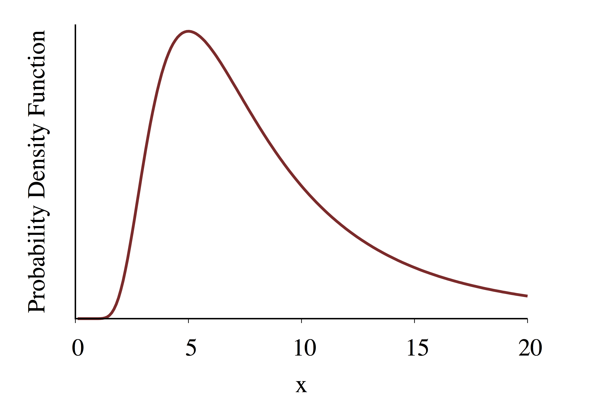
```
<br><br>
</center>

Why introduce the inverse Gamma family at all?  Well the properties of the 
inverse Gamma family complement those of the Gamma family giving us additional
modeling flexibility on the positive real numbers.  For example, consider a
member from each family chosen so that the probability mass allocated to the
bulk, defined heuristically as the interval $[4, 8]$, is approximately the same.
The only differences between the two members should then be isolated to the 
tails.

<center>
<br>
```{r, out.width = "50%", echo=FALSE}
knitr::include_graphics("figures/inv_gamma_pdf/gamma_comp.png")
```
<br><br>
</center>

If we focus below the bulk, in the neighborhood near zero, we can see that the
member of the Gamma family features a relatively heavy tail, spreading out 
probability close to zero.  The corresponding member of the inverse Gamma 
family, however, features a very light tail which more strongly suppresses
probability near the lower boundary.

<center>
<br>
```{r, out.width = "50%", echo=FALSE}
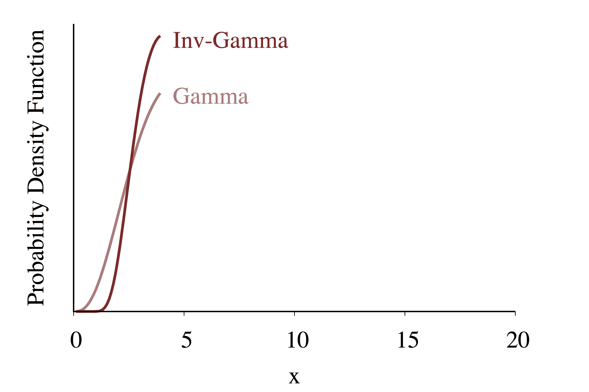
```
<br><br>
</center>

Moving our attention to above the bulk we see the exact opposite behavior.
The member of the Gamma family features a relatively light tail that strongly 
suppresses probability allocated to larger values while the corresponding
member of the inverse Gamma family features a heavy tail that spreads much more
probability out to larger values.

<center>
<br>
```{r, out.width = "50%", echo=FALSE}
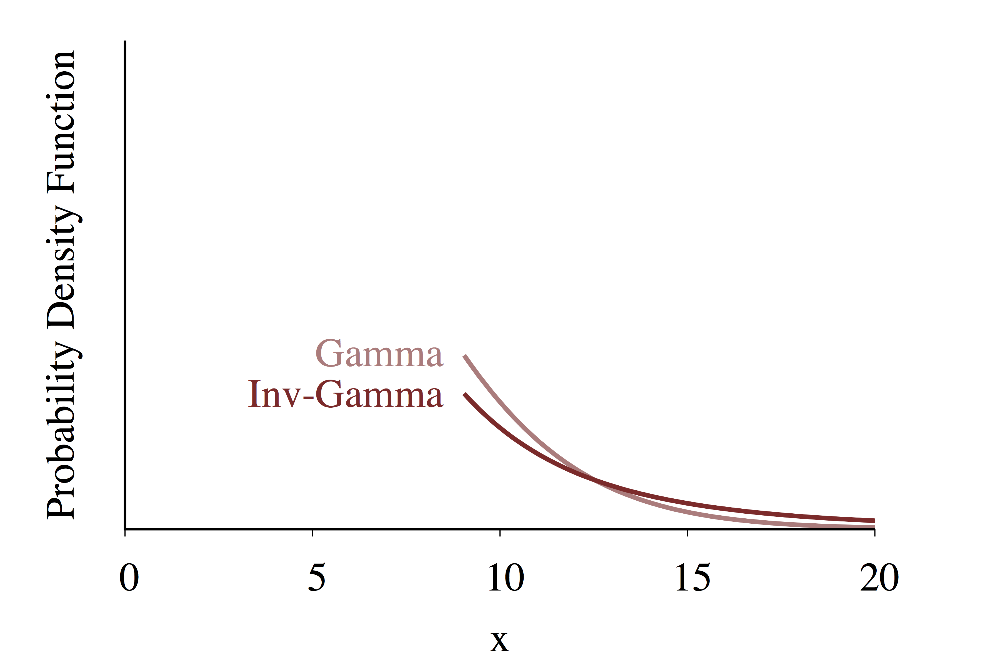
```
<br><br>
</center>

These complementary behaviors become useful in applied modeling problems when
we need to suppress probability at either extreme.  Members of the Gamma family
strongly suppress probability allocated to larger values at the expense of only 
weak suppression at smaller values.  Conversely the members of the inverse Gamma 
family strongly suppress probability allocated to smaller values at the
expense of weak suppression at larger values.  Having both families at our 
disposal we can choose the one that best fits our modeling needs.

Not to say that these two options exhaust all possibilities.  There are, for
example, more sophisticated families such as the inverse generalized normal 
family that can strongly suppress probability allocated at both smaller and 
larger values.  These more sophisticated families, however, are computationally
expensive and feature some subtle, counterintuitive properties.  In other words
they are more advanced tools that are best left for once we have developed
experience with our preliminary toolkit.

## The Negative Binomial Family 2: Electric Boogaloo {#sec:neg_bin2}

We introduced the negative binomial family above as a complement to the
binomial family, but there is an entirely different motivation of the negative
binomial family that yields an altogether different parameterization and
interpretation.  This new story begins with the Poisson family.

When introducing the Poisson family we saw that it could be interpreted as a
model for the number of occurrences of some phenomenon that materializes at a 
constant rate.  What happens, however, when that rate _isn't_ constant but
rather varies over the interval spanned by the observation?  One way to model
the heterogeneity in the rate, and hence in the latent intensity, 
is probabilistically -- we choose a probability distribution quantifying 
reasonable intensities within the Poisson family before averaging over the
entire family with respect to that distribution.

More formally consider the Poisson family, $\mathrm{Po}(x; \lambda)$, but allow
the intensities to be modeled probabilistically.  In that case the Poisson 
family defines a _conditional probability mass function_ which we denote by
replacing the semicolon with a vertical bar, $\mathrm{Po}(x \mid \lambda)$.
Finally let's model the distribution of reasonable intensities with a member of 
the Gamma family specified with the probability density function 
$\mathcal{G} \, \left( \lambda; \phi, \frac{\mu}{\phi} \right)$.

The joint probability density function over the state, $x$, and intensities,
$\lambda$, is then given by
$$
\pi(x, \lambda; \mu, \phi)
=
\mathrm{Po}(x \mid \lambda) \,
\mathcal{G} \, \left( \lambda; \phi, \frac{\mu}{\phi} \right).
$$
Because of our prescient choice of a Gamma probability density function, we can
analytically marginalize out the latent intensities,
$$
\begin{align*}
\pi(x; \mu, \phi)
&=
\int \mathrm{d} \lambda \, \pi(x, \lambda; \mu, \phi)
\\
&=
\int \mathrm{d} \lambda \,
\mathrm{Po}(x \mid \lambda) \,
\mathcal{G} \, \left( \lambda; \phi, \frac{\mu}{\phi} \right)
\\
&=
{x + \phi - 1 \choose x}
      \left( \frac{\mu}{\mu +\phi} \right)^{x} \
      \left( \frac{\phi}{\mu +\phi} \right)^{\phi}.
\end{align*}
$$
The marginal probability mass functions for each choice of $\mu$ and $\phi$ 
defines a new family of probability mass functions over the natural numbers
which one can verify is just a reparameterization of the original negative 
binomial family.

This gives us two parameterizations of the negative binomial family, and we'll
introduce a third below.  These, however, only just begin to explore the full 
scope of the negative binomial family.  There are many other parameterizations 
used in statistical practice, each appropriate to some specific context that its
users will often presume without explicit warning.  While each can be useful we 
will focus on the two discussed below as they provide a powerful complement to 
the Poisson family.

### Concentration Parameterization

The nominal parameterization follows immediately from the above construction,
with each member of the negative binomial family specified by an intensity
parameter, $\mu$, and a concentration parameter, $\phi$.

<!--html_preserve-->
<center>
<table style="width:50%; text-align: center;">
  <tr style="background-color:#F0F0F0; height: 30px;">
    <th>Parameter Name</th>
    <th>Symbol</th> 
    <th>Domain</th>
    <th>Units</th>
  </tr>
  <tr>
    <td>Intensity</td>
    <td>$$\mu$$</td> 
    <td>$$\mathbb{R}^{+}$$</td>
    <td>$$[x]$$</td>
  </tr>
  <tr style="background-color:#F9F9F9;">
    <td>Concentration</td>
    <td>$$\phi$$</td> 
    <td>$$\mathbb{R}^{+}$$</td>
    <td>$$[x]$$</td>
  </tr>
</table>
</center>
<!--/html_preserve-->

<br><br>

<!--html_preserve-->
<center>
<table style="width:75%; text-align: center;">
  <tr style="background-color:#F9F9F9;">
    <th>Space</td>
    <td>$$X = \mathbb{N}$$</td>
  <tr>
  <tr>
    <th>Density</th>
    <td>$$\pi(x; \mu, \phi) = {x + \phi - 1 \choose x}
          \left( \frac{\mu}{\mu +\phi} \right)^{x} \
          \left( \frac{\phi}{\mu +\phi} \right)^{\phi}$$</td>
  <tr>
  <tr style="background-color:#F9F9F9;">
    <th>Mean</th>
    <td>$$\mu$$</td>
  <tr>
  <tr>
    <th>Variance</th>
    <td>$$\mu + \frac{ \mu^{2} }{ \phi }$$</td>
  <tr>
</table>
</center>
<!--/html_preserve-->

The negative binomial family is a strict generalization of the Poisson
family.  Comparing the mean and variance we can see that the concentration
parameter moderates how much additional diffusion a member of the negative 
binomial family features relative to the corresponding member of the Poisson
family.

<!--html_preserve-->
<center>
<table style="width:50%; text-align: center;">
  <tr style="background-color:#F0F0F0; height: 30px;">
    <th>Moment</th>
    <th>Poisson</th> 
    <th>Negative Binomial (Concentration)</th>
  </tr>
  <tr>
    <td>Mean</td>
    <td>$$\lambda$$</td> 
    <td>$$\mu$$</td>
  </tr>
  <tr style="background-color:#F9F9F9;">
    <td>Variance</td>
    <td>$$\lambda$$</td> 
    <td>$$\mu + \frac{ \mu^{2} }{ \phi }$$</td>
  </tr>
</table>
</center>
<!--/html_preserve-->

As the concentration parameter, $\phi$, increases with the intensity parameter,
$\mu$, fixed, the probability mass functions concentrate more and more until 
they eventually converge to the corresponding Poisson member with 
$\lambda = \mu$ all the way at $\phi = \infty$.

<center>
<br>
```{r, out.width = "45%", echo=FALSE}

```
```{r, out.width = "45%", echo=FALSE}
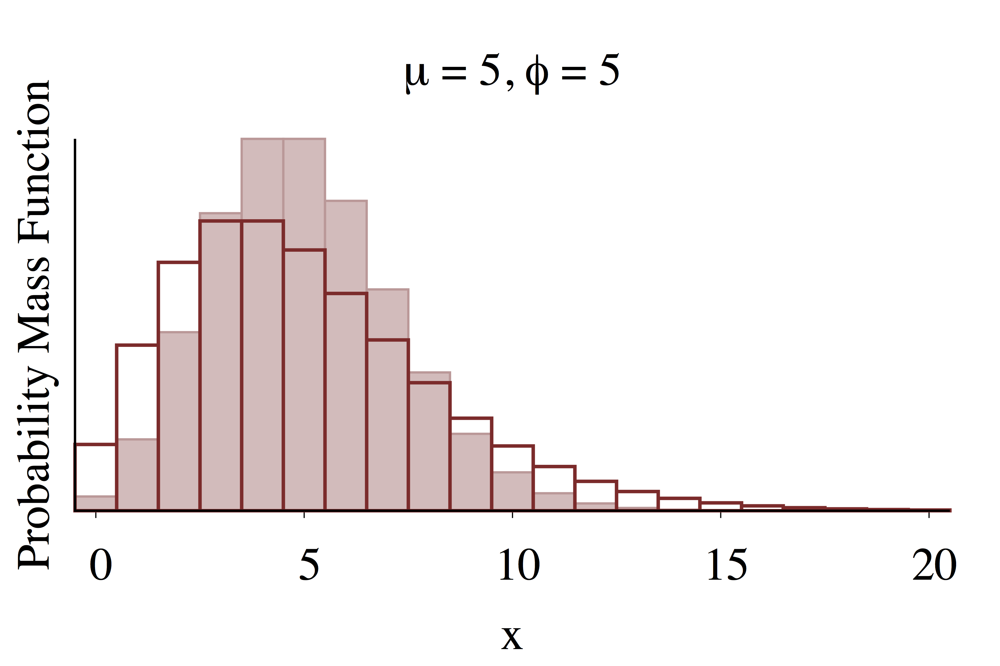
```
<br><br>
</center>

<center>
<br>
```{r, out.width = "45%", echo=FALSE}
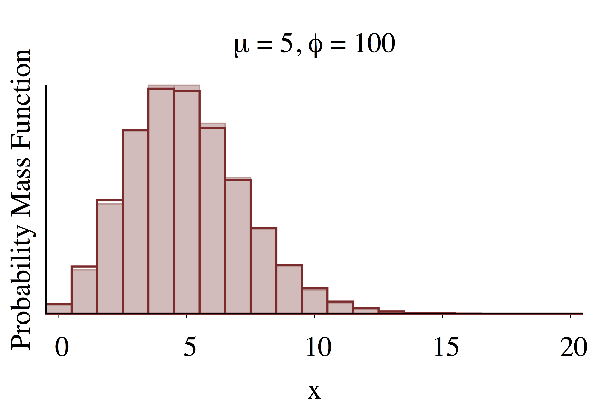
```
```{r, out.width = "45%", echo=FALSE}
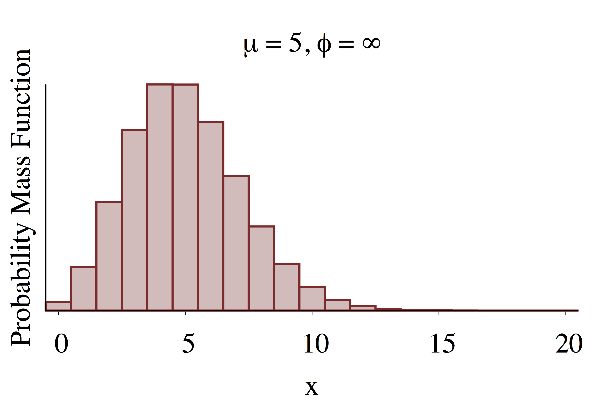
```
<br><br>
</center>

### The Dispersion Parameterization

The negative binomial family can be interpreted as expanding upon the Poisson
family, but that simpler family lies at the extreme edge of the concentration
parameterization at $\phi = \infty$.  When nesting families within other 
families it often helps to reparameterize the larger families so that the
simpler families lie not at infinity but rather at zero, allowing us to _expand_ 
a parameterization of the smaller family into a parameterization of the larger
family.

We can achieve this behavior by parameterizing the negative binomial family 
using a _dispersion parameter_ that is the reciprocal of the concentration 
parameter,
$$
\psi = \frac{1}{\phi}.
$$

<!--html_preserve-->
<center>
<table style="width:50%; text-align: center;">
  <tr style="background-color:#F0F0F0; height: 30px;">
    <th>Parameter Name</th>
    <th>Symbol</th> 
    <th>Domain</th>
    <th>Units</th>
  </tr>
  <tr>
    <td>Intensity</td>
    <td>$$\mu$$</td> 
    <td>$$\mathbb{R}^{+}$$</td>
    <td>$$[x]$$</td>
  </tr>
  <tr style="background-color:#F9F9F9;">
    <td>Dispersion</td>
    <td>$$\psi$$</td> 
    <td>$$\mathbb{R}^{+}$$</td>
    <td>$$[x^{-1}]$$</td>
  </tr>
</table>
</center>
<!--/html_preserve-->

<br><br>

<!--html_preserve-->
<center>
<table style="width:75%; text-align: center;">
  <tr style="background-color:#F9F9F9;">
    <th>Space</td>
    <td>$$X = \mathbb{N}$$</td>
  <tr>
  <tr>
    <th>Density</th>
    <td>$$\pi(x; \mu, \psi) = {x + \psi^{-1} - 1 \choose x}
          \left( \frac{\mu \cdot \psi }{\mu \cdot \psi + 1} \right)^{x} \
          \left( \frac{1}{\mu \cdot \psi + 1} \right)^{\frac{1}{\psi}}$$</td>
  <tr>
  <tr style="background-color:#F9F9F9;">
    <th>Mean</th>
    <td>$$\mu$$</td>
  <tr>
  <tr>
    <th>Variance</th>
    <td>$$\mu + \mu^{2} \cdot \psi$$</td>
  <tr>
</table>
</center>
<!--/html_preserve-->

Now $\psi = 0$ corresponds to the Poisson family, with increasing $\psi$ 
inducing increasing dispersion as expected from the name!

<center>
<br>
```{r, out.width = "45%", echo=FALSE}

```
```{r, out.width = "45%", echo=FALSE}
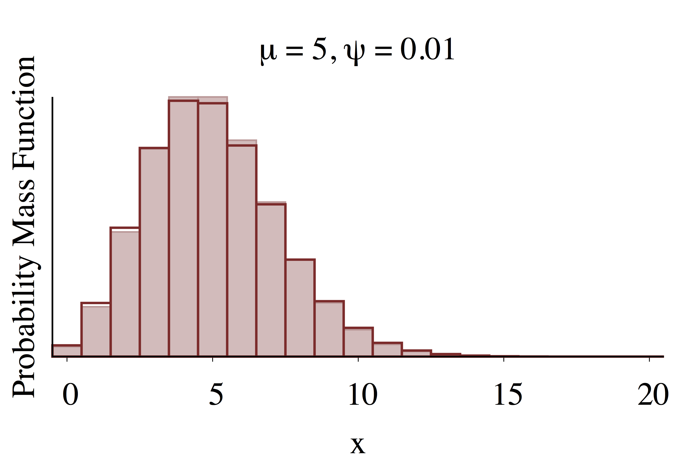
```
<br><br>
</center>

<center>
<br>
```{r, out.width = "45%", echo=FALSE}

```
```{r, out.width = "45%", echo=FALSE}
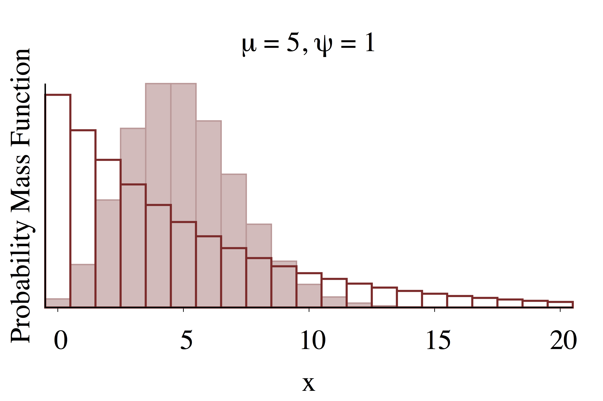
```
<br><br>
</center>

## Student's t Family

We can use the strategy introduced in [Section 3.6](#sec:neg_bin2) to expand 
other families as well.  For example what happens if we have a normal family 
where the scale isn't constant?

As before we can model this variation probabilistically, assigning a probability
distribution to the scale and averaging over the possible values.  If we presume
that the precision, $\tau$, follows a probability distribution specified 
by a member of the Gamma family,
$\mathcal{G} \, \left( \tau; \frac{\nu}{2}, \frac{\nu}{2} \sigma^{2} \right)$, 
then we can work out the marginalization analytically.

Under this assumption the joint probability density function over the state, 
$x$, and precision, $\tau$, is given by
$$
\pi(x, \tau; \nu, \mu, \sigma)
=
\mathcal{N} \left( x \mid \mu, \frac{1}{\sqrt{\tau}} \right) \,
\mathcal{G} \, \left( \tau; \frac{\nu}{2}, \frac{\nu}{2} \sigma^{2} \right).
$$
which marginalizes to
$$
\begin{align*}
\pi(x; \nu, \mu, \sigma)
&=
\int \mathrm{d} \tau \, \pi(x, \lambda; \nu, \mu, \sigma)
\\
&=
\int \mathrm{d} \tau \,
\mathcal{N} \left(x \mid \mu, \frac{1}{\sqrt{\tau}} \right) \,
\mathcal{G} \, \left(\tau; \frac{\nu}{2}, \frac{\nu}{2} \sigma^{2} \right)
\\
&=
\frac{1}{ \sqrt{\pi \, \nu \, \sigma^{2} } }
\frac{\Gamma(\frac{\nu + 1}{2})}
{ \Gamma(\frac{\nu}{2}) }
\left(1 + \frac{1}{\nu} \left( \frac{ x - \mu}{\sigma} \right)^{2}
\right)^{- \frac{\nu + 1}{2}}.
\end{align*}
$$
The marginal probability density functions for each choice of $\nu$, $\mu$, and
$\sigma$, defines a new family of probability density functions over the real
numbers known as _Student's t family_.

The family was originally introduced into the statistical literature by William
Gosset as the "t family" in a paper he submitted under the pseudonym "Student",
hence the somewhat awkward name. 

### Degree of Freedom Parameterization

The degree of freedom parameterization follows immediately from the above
construction, with each member of Student's t family specified by a degree of
freedom parameter, $\nu$, an intensity parameter, $\mu$, and a scale parameter,
$\sigma$.

<!--html_preserve-->
<center>
<table style="width:50%; text-align: center;">
  <tr style="background-color:#F0F0F0; height: 30px;">
    <th>Parameter Name</th>
    <th>Symbol</th> 
    <th>Domain</th>
    <th>Units</th>
  </tr>
  <tr>
    <td>Degrees of Freedom</td>
    <td>$$\nu$$</td> 
    <td>$$\mathbb{R}$$</td>
    <td>None</td>
  </tr>
  <tr>
    <td>Location</td>
    <td>$$\mu$$</td> 
    <td>$$\mathbb{R}$$</td>
    <td>$$[x]$$</td>
  </tr>
  <tr style="background-color:#F9F9F9;">
    <td>Scale</td>
    <td>$$\sigma$$</td> 
    <td>$$\mathbb{R}^{+}$$</td>
    <td>$$[x]$$</td>
  </tr>
</table>
</center>
<!--/html_preserve-->

<br><br>

<!--html_preserve-->
<center>
<table style="width:80%; text-align: center;">
  <tr style="background-color:#F9F9F9;">
    <th>Space</td>
    <td>$$X = \mathbb{R}$$</td>
  <tr>
  <tr>
    <th>Density</th>
    <td>$$\pi(x; \nu, \mu, \sigma) = 
          \frac{1}{ \sqrt{\pi \, \nu \, \sigma^{2} } }
          \frac{\Gamma(\frac{\nu + 1}{2})}
          { \Gamma(\frac{\nu}{2}) }
          \left(1 + \frac{1}{\nu} \left( \frac{ x - \mu}{\sigma} \right)^{2}
          \right)^{- \frac{\nu + 1}{2}}$$</td>
  <tr>
  <tr style="background-color:#F9F9F9;">
    <th>Mean</th>
    <td>$$\begin{array}{rr} 
          \mu, & \nu > 1 \\ 
          \text{Undefined}, & \nu \le 1 
          \end{array}$$</td>
  <tr>
  <tr>
    <th>Variance</th>
    <td>$$\begin{array}{rr} 
          \frac{\nu}{\nu - 2}, & \nu > 2 \\
          \text{Undefined}, & \nu \le 2 
          \end{array}$$</td>
  <tr>
</table>
</center>
<!--/html_preserve-->

By increasing the degrees of freedom parameter, $\nu$, towards infinity while
keeping the location and scale parameters fixed, the probability density 
functions concentrate until they eventually converge to the corresponding 
normal probability density function all the way at $\nu = \infty$.

<center>
<br>
```{r, out.width = "45%", echo=FALSE}
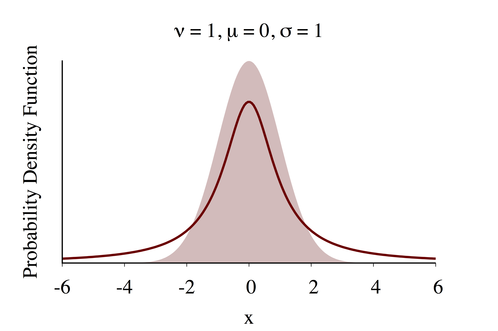
```
```{r, out.width = "45%", echo=FALSE}
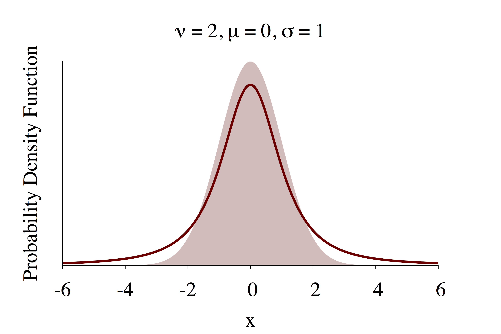
```
<br><br>
</center>

<center>
<br>
```{r, out.width = "45%", echo=FALSE}

```
```{r, out.width = "45%", echo=FALSE}
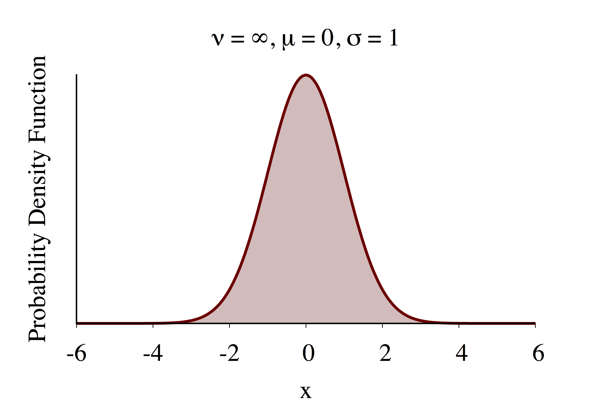
```
<br><br>
</center>

The probability density functions with small degrees of freedom are so diffuse
that they can be a bit ungainly.  Those members with less than two degrees of
freedom lack a well-defined variance and those members with less than one degree
of freedom lack a well-defined mean as well.  Care has to be taken when working
with probability density functions that feature such heavy tails.

### Dispersion Parameterization

If we want to emphasize how Student's t family expands the normal family then
it's often easer to parameterize the family with the reciprocal of the degrees 
of freedom parameter,
$$
\upsilon  = \frac{1}{\nu}.
$$

<!--html_preserve-->
<center>
<table style="width:50%; text-align: center;">
  <tr style="background-color:#F0F0F0; height: 30px;">
    <th>Parameter Name</th>
    <th>Symbol</th> 
    <th>Domain</th>
    <th>Units</th>
  </tr>
  <tr>
    <td>Dispersion</td>
    <td>$$\upsilon$$</td> 
    <td>$$\mathbb{R}$$</td>
    <td>None</td>
  </tr>
  <tr>
    <td>Location</td>
    <td>$$\mu$$</td> 
    <td>$$\mathbb{R}$$</td>
    <td>$$[x]$$</td>
  </tr>
  <tr style="background-color:#F9F9F9;">
    <td>Scale</td>
    <td>$$\sigma$$</td> 
    <td>$$\mathbb{R}^{+}$$</td>
    <td>$$[x]$$</td>
  </tr>
</table>
</center>
<!--/html_preserve-->

<br><br>

<!--html_preserve-->
<center>
<table style="width:50%; text-align: center;">
  <tr style="background-color:#F9F9F9;">
    <th>Space</td>
    <td>$$X = \mathbb{R}$$</td>
  <tr>
  <tr>
    <th>Density</th>
    <td>$$\pi(x; \upsilon, \mu, \sigma) = 
          \sqrt{ \frac{\upsilon}{ \pi \, \sigma^{2} } }
          \frac{\Gamma(\frac{1 + \upsilon}{2 \, \upsilon})}
          { \Gamma(\frac{1}{2 \, \upsilon}) }
          \left(1 + \upsilon \, \left( \frac{ x - \mu}{\sigma} \right)^{2}
          \right)^{- \frac{1 + \upsilon}{2 \, \upsilon}}$$</td>
  <tr>
  <tr style="background-color:#F9F9F9;">
    <th>Mean</th>
    <td>$$\begin{array}{rr} 
          \mu, & \upsilon < 1 \\ 
          \text{Undefined}, & \upsilon \ge 1 
          \end{array}$$</td>
  <tr>
  <tr>
    <th>Variance</th>
    <td>$$\begin{array}{rr} 
          \frac{1}{1- 2 \, \upsilon}, & \upsilon < 2 \\
          \text{Undefined}, & \upsilon \ge 2 
          \end{array}$$</td>
  <tr>
</table>
</center>
<!--/html_preserve-->

Now $\upsilon = 0$ corresponds to the normal family with increasing $\upsilon$ 
inducing increasing dispersion.

<center>
<br>
```{r, out.width = "45%", echo=FALSE}
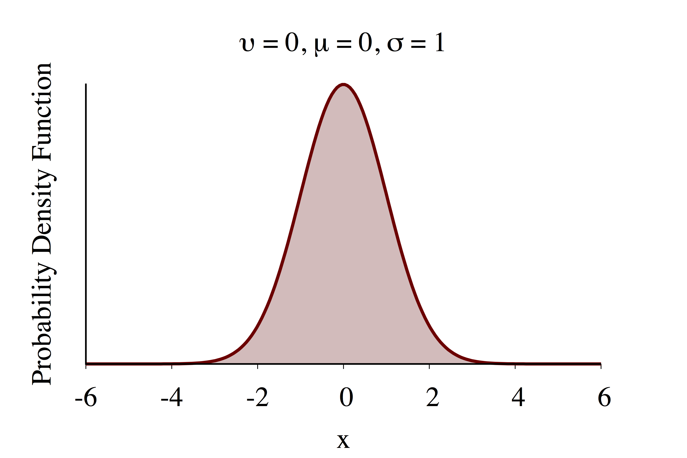
```
```{r, out.width = "45%", echo=FALSE}
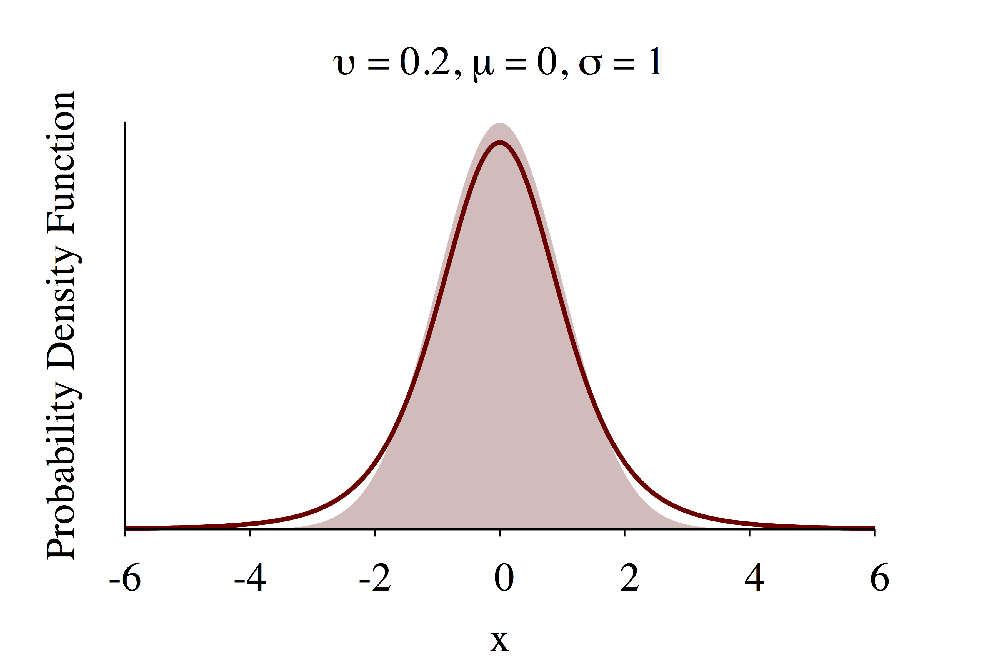
```
<br><br>
</center>

<center>
<br>
```{r, out.width = "45%", echo=FALSE}
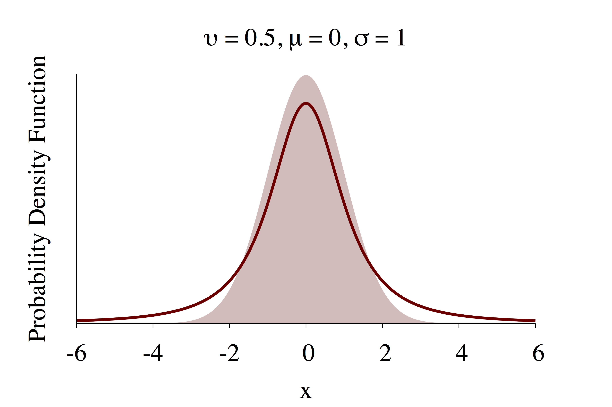
```
```{r, out.width = "45%", echo=FALSE}
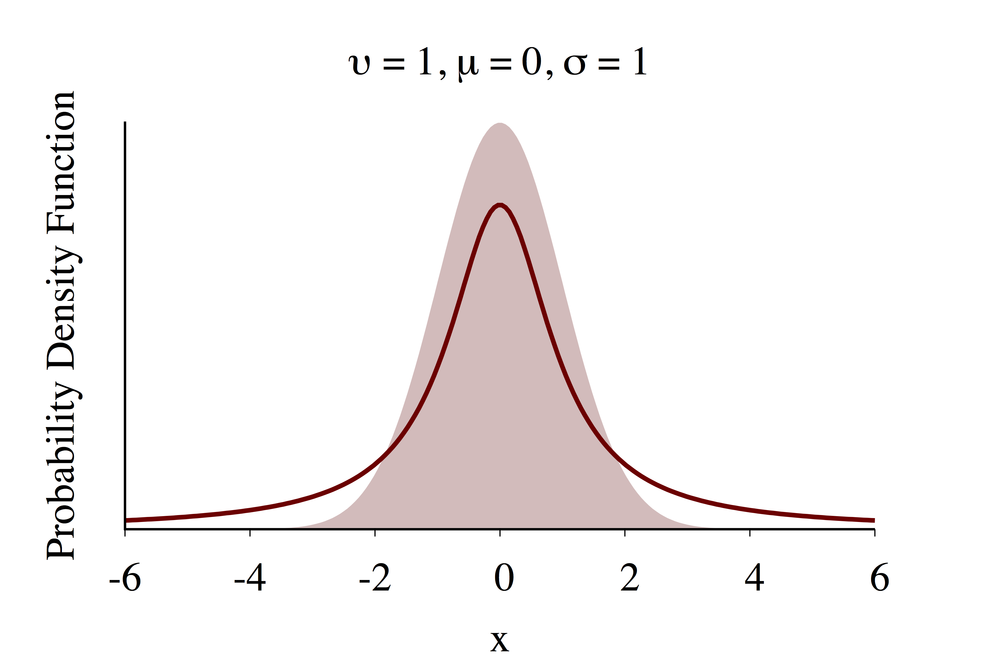
```
<br><br>
</center>

## The Cauchy Family { #sec:cauchy_family }

The subfamily that defines the boundary between well-defined means and 
ill-defined means is sufficiently common that it deservers its own dedicated
discussion.  By taking $\nu = \upsilon = 1$ Student's t family reduces to the
_Cauchy family_.

<!--html_preserve-->
<center>
<table style="width:50%; text-align: center;">
  <tr style="background-color:#F0F0F0; height: 30px;">
    <th>Parameter Name</th>
    <th>Symbol</th> 
    <th>Domain</th>
    <th>Units</th>
  </tr>
  <tr>
    <td>Location</td>
    <td>$$\mu$$</td> 
    <td>$$\mathbb{R}$$</td>
    <td>$$[x]$$</td>
  </tr>
  <tr style="background-color:#F9F9F9;">
    <td>Scale</td>
    <td>$$\sigma$$</td> 
    <td>$$\mathbb{R}^{+}$$</td>
    <td>$$[x]$$</td>
  </tr>
</table>
</center>
<!--/html_preserve-->

<br>

<!--html_preserve-->
<center>
<table style="width:75%; text-align: center;">
  <tr style="background-color:#F9F9F9;">
    <th>Space</td>
    <td>$$X = \mathbb{R}$$</td>
  <tr>
  <tr>
    <th>Density</th>
    <td>$$\pi(x; \mu, \sigma) = \frac{1}{\pi \, \sigma}
          \frac{1}{1 + \left( \frac{ x - \mu}{\sigma} \right)^{2} }$$</td>
  <tr>
  <tr style="background-color:#F9F9F9;">
    <th>Mean</th>
    <td>$$\text{Undefined}$$</td>
  <tr>
  <tr>
    <th>Variance</th>
    <td>$$\text{Undefined}$$</td>
  <tr>
</table>
</center>
<!--/html_preserve-->

The defining feature of the Cauchy family are the heavy tails of its members
that allocate a surprising amount of probability far away from the bulk 
immediately around the location parameter.

<center>
<br>
```{r, out.width = "50%", echo=FALSE}
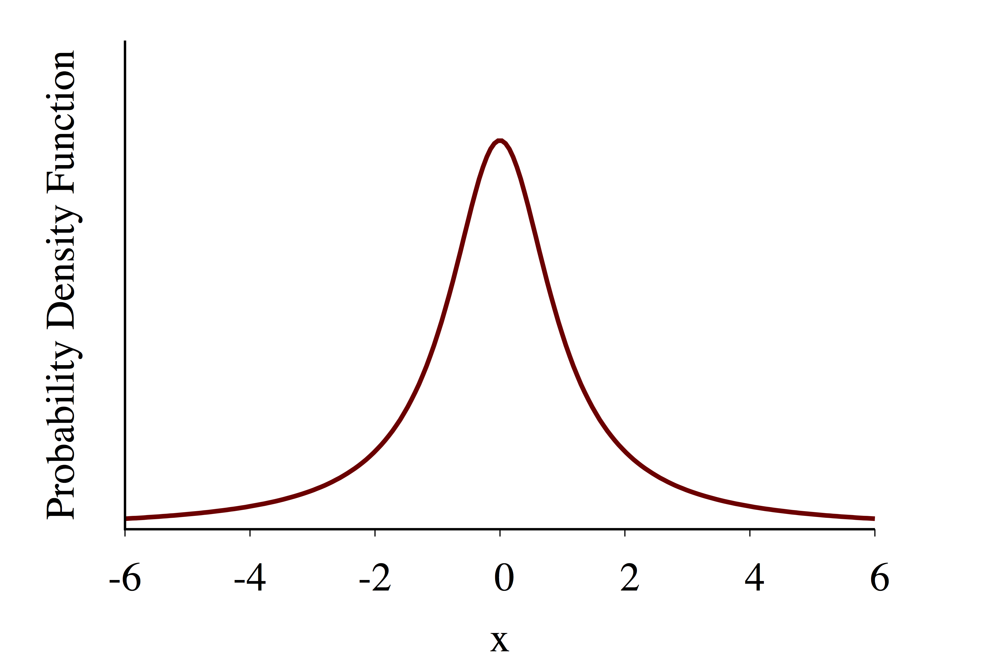
```
<br><br>
</center>

The extremity of these tails is easiest to see by examining the cumulative
distribution function of a unit Cauchy, with $\mu = 0$ and $\sigma = 1$, to that
of the unit normal.  In order to capture 64% of the total probability in the 
unit Cauchy we need to venture out to twice the value of the scale parameter, 
which is only twice as large as what is needed for the unit normal.

<center>
<br>
```{r, out.width = "45%", echo=FALSE}
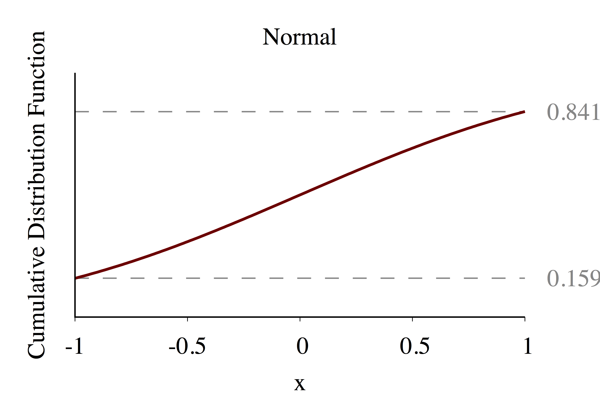
```
```{r, out.width = "45%", echo=FALSE}
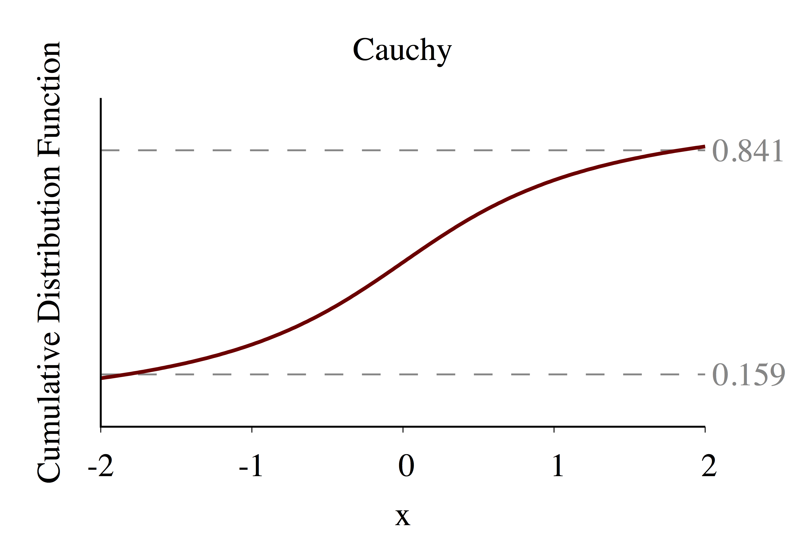
```
<br><br>
</center>

To capture 95% of the total probability of the unit Cauchy, however, we have to 
move out to _fourteen_ times the value of the scale parameter.  This is nearly 
an order of magnitude larger than what is needed for the corresponding unit 
normal.

<center>
<br>
```{r, out.width = "45%", echo=FALSE}
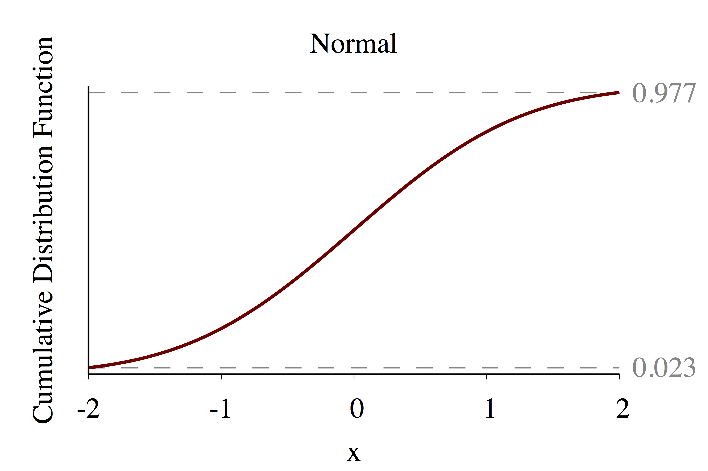
```
```{r, out.width = "45%", echo=FALSE}
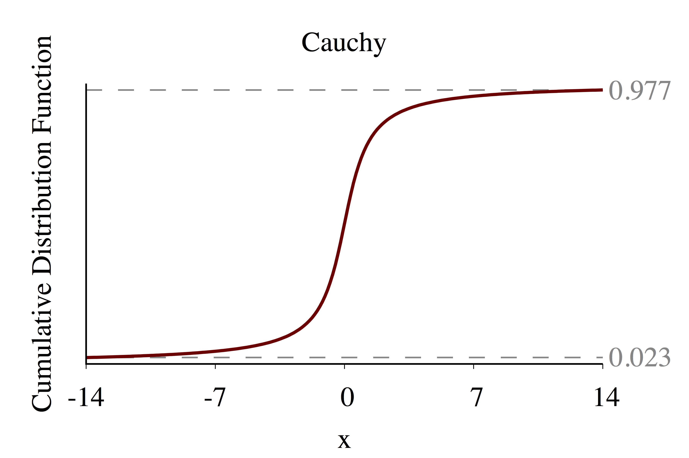
```
<br><br>
</center>

To capture 99.9% probability of the unit normal we need to expand out to only
three times the value of the scale parameter, but the unit Cauchy requires 
expanding out past two hundred, nearly _two orders of magnitude_ further.

<center>
<br>
```{r, out.width = "45%", echo=FALSE}
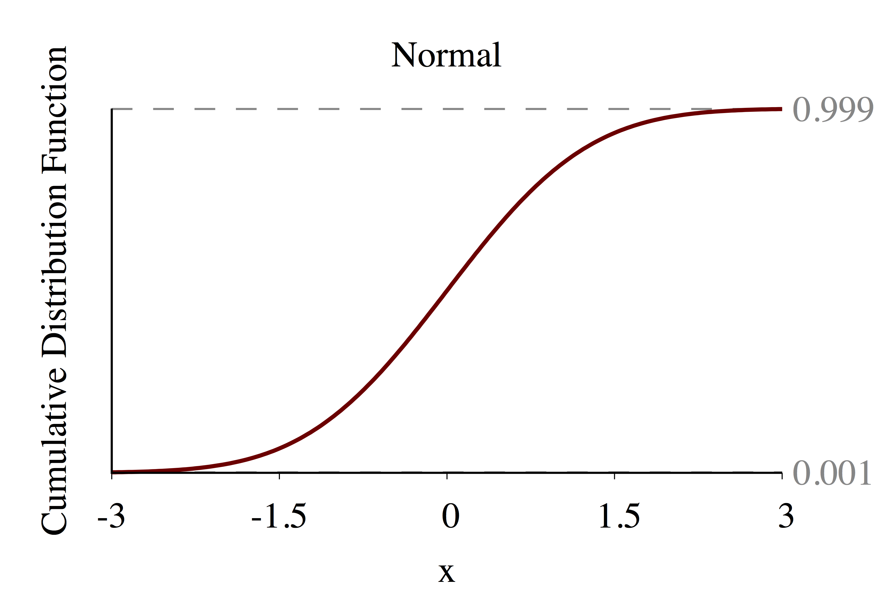
```
```{r, out.width = "45%", echo=FALSE}
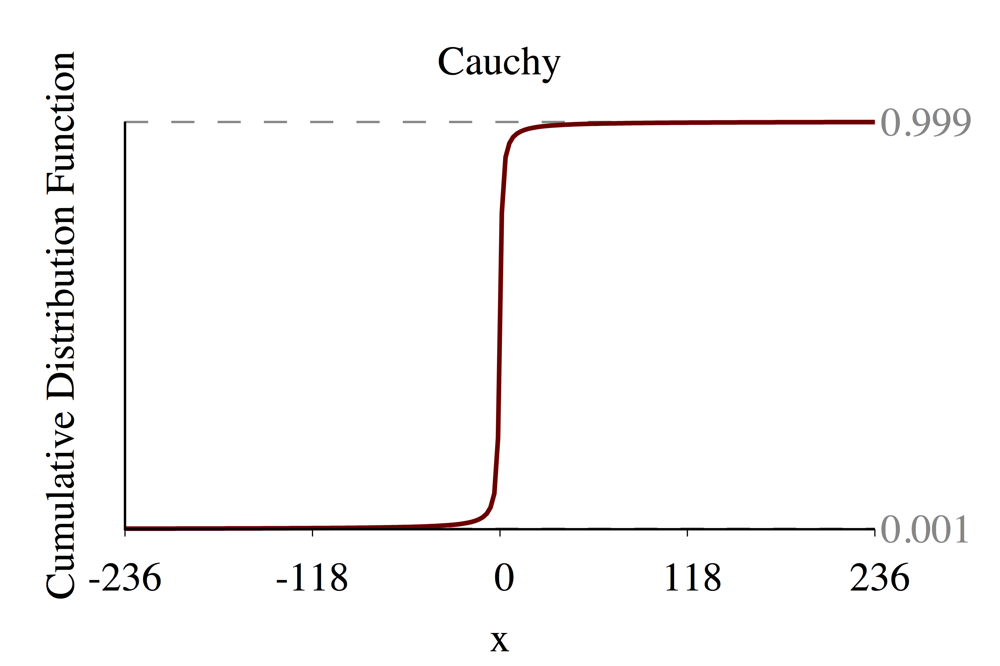
```
<br><br>
</center>

This extreme diffusion can lead to counterintuitive behavior when the Cauchy
family is deployed in a practical application and consequetly serious care must 
be taken whenever the family is unleashed.  Indeed the Cauchy family is often 
used as an adversarial example in theoretical statistics, its pathological 
behavior identifying unstated assumptions and other limitations in mathematical
proofs.  It's use in modeling should not be taken lightly!

That said there is one particularly productive use of the Cauchy family in 
modeling.  Like the normal family the Cauchy family is a stable family, and it 
can emerge through a central limit theorem when the component distributions are 
themselves relatively diffuse.  Consequently the Cauchy family is a natural 
choice when modeling the emergent behavior of complex systems with extremely
variable constituents; behavior that is often associated with _outliers_.

# Conclusion

By appealing to reasonable mathematical criteria we can build an initial toolbox
of useful families of probability density functions.  Pushing those families 
through various transformations then allows us to expand that toolbox, 
complementing the initial families with additional functionality.  Here we 
considered only a few particularly useful families, but this strategy can be used
to construct an infinitude of new and potentially useful families for one's
applied practice.  By understanding the process an experienced practitioner is 
not limited to any static toolkit but can fashion their own tools as demanded by
any given application.

At the same time if we model the families themselves probabilistically then 
they become conditional probability density functions,
$$
\pi(x; \theta) \mapsto \pi(x \mid \theta),
$$
which we can then use to construct increasingly sophisticated probability 
density functions that model complex behaviors over increasingly high 
dimensional spaces.

In other words we can think of the families of probability density functions
at our disposal as probabilistic building blocks, mathematical Legos from which
we can fashion the spaceships and castles of our dreams.  Or at least 
probabilistic models appropriate to the bespoke context of our applications.
The more Legos in our collection the fancier our builds can be, but when paired 
with a strong imagination even a modest collection admits near-limitless
possibilities.

# Acknowledgements {-}

I thank Dan Simpson and Aki Vehtari for helpful comments.  I am also indebted
for the feedback from those who have attended my courses and talks.

A very special thanks to everyone supporting me on Patreon: Abhinav Katoch, 
Abhishek Vasu, Adam Slez, AdamMaruf, Aki Vehtari, Alan O'Donnell, 
Alexander Bartik, Alexander Noll, Anders Valind, Andrea Serafino, 
Andrew Rouillard, Anthony Santistevan, Arya Alexander Pourzanjani, 
Ashton P Griffin, Austin Rochford, Aviv Keshet, Avraham Adler, Benjamin Nelson, 
Bo Schwartz Madsen, Bradley Wilson, Brett, Brian Callander, Brian Clough, 
Brian Hartley, Bryan Galvin, Bryan Yu, Cat Shark, Chad Scherrer, Charles Naylor,
Chase Dwelle, Chris Cote, Chris Zawora, Christopher Peters, Chrysta Hall, 
Cole Monnahan, Colin Carroll, Colin McAuliffe, Dan W Joyce, Daniel Elnatan, 
Daniel Rowe, Daniel Simpson, David Pascall, David Roher, David Stanard, 
David Wurtz, Demetri Pananos, Derek G Miller, Ed Berry, Ed Cashin, 
Eddie Landesberg, Elizaveta Semenova, Eric Jonas, Eric Novik, Erik Banek, 
Ethan Goan, Felipe González, Finn Lindgren, Francesco Corona, 
Granville Matheson, Guido Biele, Guilherme Marthe, Hamed Bastan-Hagh, 
Haonan Zhu, Hernan Bruno, J Michael Burgess, Jessica Graves, Joel Kronander, 
Jonas Beltoft Gehrlein, Josh Weinstock, Joshua Duncan, Joshua Mayer, JS, 
Justin Bois, Karim Naguib, Karim Osman, Kazuki Yoshida, Kejia Shi, 
Konsta Happonen, Kyle Barlow, Kádár András, Lars Barquist, Lee Beck, 
Luiz Carvalho, Lukas Neugebauer, Marc, Marc Dotson, Marek Kwiatkowski, 
Markus P., Martin Modrák, Matthew Kay, Matthew Quick, Matthew T Stern, 
Maurits van der Meer, Maxim Ananyev, Maxim Kesin, Michael Colaresi, 
Michael DeWitt, Michael Dillon, Michael Griffiths, Michael Redman, 
Michael Thomas, Mike Lawrence, mikko heikkilä, Monkel, Murali Sarguru, 
Nathan Rutenbeck, Nicholas Knoblauch, Nicolas Frisby, Noah Guzman, Ole Rogeberg,
Oliver Clark, Olivier Binette, Olivier Ma, Onuralp Soylemez, Patrick Boehnke, 
Paul Chang, Paul Oreto, Peter Heinrich, Peter Schulam, Ravin Kumar, Reed Harder,
Riccardo Fusaroli, Richard Jiang, Richard Torkar, Robert Frost, Robert Goldman,
Robin Taylor, Sam Petulla, Sam Zimmerman, Sam Zorowitz, Sean Talts, 
Seo-young Kim, Sergiy Protsiv, Seth Axen, Shoshana Vasserman, Simon Duane, 
Stephen Lienhard, Stephen Oates, Steven Langsford, Stijn, Suyog Chandramouli, 
Taco Cohen, Tamara Schembri, Teddy Groves, Thomas Littrell, Thomas Pinder, 
Thomas Vladeck, Tiago Cabaço, Tim Radtke, Trey Spiller, Tristan Mahr, 
Tyrel Stokes, vasa, Ville Inkilä, Will Farr, yolhaj, Z, and Ziwei Ye.

# References {-}

<div id="refs"></div>

# License {-}

The code in this case study is copyrighted by Michael Betancourt and licensed 
under the new BSD (3-clause) license:

https://opensource.org/licenses/BSD-3-Clause

The text and figures in this case study are copyrighted by Michael Betancourt 
and licensed under the CC BY-NC 4.0 license: 

https://creativecommons.org/licenses/by-nc/4.0/

# Original Computing Environment {-}

```{r, comment=NA}
sessionInfo()
```
