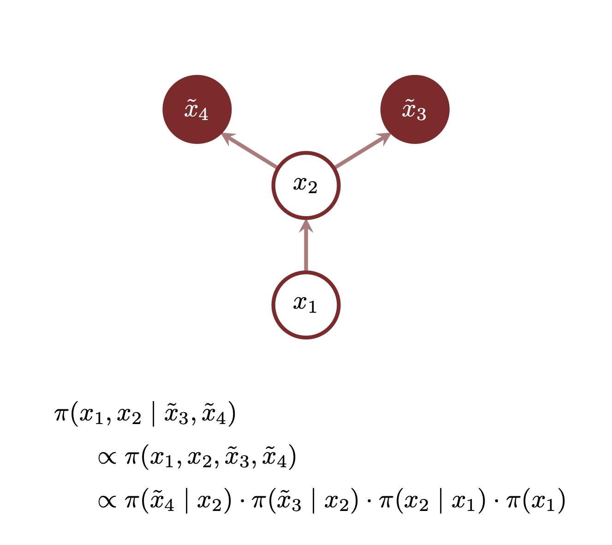

```{r setup, include=FALSE}
knitr::opts_chunk$set(comment=NA)
```

Probability theory defines probability distributions and their well-defined
operations; once we are given a well-defined probability distribution the theory
tells us how we can manipulate it for our applied needs.  What the theory does
not tell us, however, is how to construct a useful probability distribution in
the first place.  The challenge of building probability distributions in
high-dimensional spaces becomes much more manageable when the ambient spaces are
_product spaces_ constructed from lower-dimensional component spaces.  This
product structure serves as scaffolding on which we can build up a probability
distribution piece by piece, not unlike the popular Danish toy, Bilofix.

In this case study I will introduce probability theory on product spaces with
an emphasis on how this structure can be used to facilitate the application of
probability theory in practice.  None of the theory here will be new -- we will
just be repeatedly applying
[conditional probability theory](https://betanalpha.github.io/assets/case_studies/conditional_probability_theory.html)
-- but the application of that theory in this particular context will allow us
to establish convenient notation, vocabulary, and visualizations of which we
will make frequent use.

# Product Spaces

A product space weaves together multiple _component spaces_ into a single,
higher-dimensional space.  This weave gives product spaces unique properties
which make them particularly useful in practice.

## Building Product Spaces From Components {#sec:building_product_spaces}

Given two component spaces, $X_{1}$ and $X_{2}$, we can construct the product
space $X = X_{1} \times X_{2}$ by assigning a _distinct copy_ of one of the
component spaces to _each_ point in the other.  These copies are also known as
_fibers_ which may be helpful if you want to really embrace the weaving analogy.

For example, let's take $X_{1}$ as our initial or _base_ space.  To each point
$x_{1} \in X_{1}$ we assign a distinct copy of $X_{2}$, which I will write as
$x_{1} \times X_{2}$ or $X_{2} \mid x_{1}$.  The former emphasizes that each
fiber is _indexed_ by points in the base space, which I prefer, while the latter
emphasizes that the fibers are _attached to_ or _conditioned on_ points in the
base space, which is more consistent with the probabilistic structure that will
arise in [Section 3](#sec:chain_rule).

Regardless of the notation, the _collection_ of all of these fibers of defines
the product space,
$$
X_{1} \times X_{2} =
\{ x_{1} \times X_{2} \mid \forall x_{1} \in X_{1} \}.
$$

<center>
<br>
```{r, out.width = "75%", echo=FALSE}
knitr::include_graphics("figures/product_space_12/product_space_12.png")
```
<br><br>
</center>

This construction, however, isn't unique.  We could equally well take $X_{2}$ as
our initial space and assign a distinct copy of $X_{1}$ to each point
$x_{2} \in X_{2}$, which I will similarly write as $X_{1} \times x_{2}$ or
$X_{1} \mid x_{2}$.  The collection of all of these fibers defines the _same_
product space,
$$
X_{1} \times X_{2} =
\{ X_{1} \times x_{2} \mid \forall x_{2} \in X_{2} \}.
$$

<center>
<br>
```{r, out.width = "75%", echo=FALSE}
knitr::include_graphics("figures/product_space_21/product_space_21.png")
```
<br><br>
</center>

This construction can then be repeated for any finite number of components.
Given the component spaces $X_{1}$, $X_{2}$, and $X_{3}$, for example, we can
first construct the product space $X_{1} \times X_{2}$ at then assign a distinct
copy of $X_{3}$ to each point $(x_{1}, x_{2}) \in X_{1} \times X_{2}$ to give
the fibers
$$
x_{1} \times x_{2} \times X_{3} = X_{3} \mid x_{1}, x_{2}.
$$
The collection of all of these fibers defines a new product space,
$$
X_{1} \times X_{2} \times X_{3} =
\{ x_{1} \times x_{2} \times X_{3} \mid \forall (x_{1}, x_{2}) \in X_{1} \times X_{2} \}.
$$

<center>
<br>
```{r, out.width = "75%", echo=FALSE}
knitr::include_graphics("figures/product_space_23/product_space_23.png")
```
<br><br>
</center>

Applying this process recursively to $N$ component spaces,
$\{ X_{1}, \ldots, X_{N} \}$, constructs the general product space
$$
X = X_{1} \times \ldots \times X_{N} = \times_{n = 1}^{N} X_{n}.
$$
Each of the $N!$ orderings of the $N$ component spaces gives a different
sequence of intermediate product distributions, but ultimately they all arrive
at the same final product distribution.

The total dimension of a general product space is the _sum_ of the dimensions
of the component spaces,
$$
\mathrm{dim}(X) = \sum_{n = 1}^{N} \mathrm{dim}(X_{n}).
$$

## The Projective Structure of Product Spaces

One of the most important features of a product space is its _projective_
structure.  Every product space is always endowed with projection functions that
take each point in the product space to a unique point in the individual
component spaces,
$$
\begin{alignat*}{6}
\varpi_{X_{n}} :\; &X& &\rightarrow& \; &X_{n}&
\\
&x& &\mapsto& &x_{n} = \varpi_{X_{n}}(x)&.
\end{alignat*}
$$

These projection functions allow us to return to any of the component spaces
and ignore any of the unwanted structure introduced by the other component
spaces.

<center>
<br>
```{r, out.width = "40%", echo=FALSE}
knitr::include_graphics("figures/projections/projections.png")
```
<br><br>
</center>

## Decomposing Product Spaces Into Components  {#sec:decomposing_product_spaces}

The projective structure of a product space also allows us to decompose the
entire product space back into individual components.

Consider, for example, the product space $X_{1} \times X_{2} \times X_{3}$ and
the projection function $\varpi_{X_{1}}$.  The fibers of $\varpi_{X_{1}}$ are
copies of $X_{2} \times X_{3}$ attached to each point in $X_{1}$,
$$
\varpi_{X_{1}}^{-1}(x_{1})
= x_{1} \times X_{2} \times X_{3}
= X_{2} \times X_{3} \mid x_{1}.
$$

<center>
<br>
```{r, out.width = "75%", echo=FALSE}
knitr::include_graphics("figures/conditional_fibers_1/conditional_fibers_1.png")
```
<br><br>
</center>

Because the fibers are themselves product spaces they have their own projection
functions,
$$
\varpi_{X_{2} \mid x_{1}} : x_{1} \times X_{2} \times X_{3} \rightarrow x_{1} \times X_{2},
$$
and
$$
\varpi_{X_{3} \mid x_{1}} : x_{1} \times X_{2} \times X_{3} \rightarrow x_{1} \times X_{3},
$$
which allow us to decompose each fiber even further.

For example $\varpi_{X_{2} \mid x_{1}}$ decomposes each fiber into copies of
$X_{3}$ attached to each point $(x_{1}, x_{2})$,
$$
\varpi_{X_{2} \mid x_{1}}^{-1}(x_{2}, x_{3})
= x_{1} \times x_{2} \times X_{3}
= X_{3} | x_{1}, x_{2}.
$$

<center>
<br>
```{r, out.width = "75%", echo=FALSE}
knitr::include_graphics("figures/conditional_fibers_2/conditional_fibers_2.png")
```
<br><br>
</center>

Just as each ordering of the component spaces defines a different construction
of the same product distribution, each ordering defines a different
decomposition of a product distribution that ultimately arrives at the same
component spaces.

## Variables

A convenient consequence of our ability to decompose product spaces into their
individual components is that any point in the product space, $x \in X$, is
uniquely identified with an ordered set, or _tuple_, of points in each of the
component spaces, $x_{n} \in X_{n}$,
$$
x = (x_{1}, \ldots, x_{N})
$$
such that
$$
\begin{alignat*}{6}
\varpi_{n} :\; &X& &\rightarrow& \; &X_{n}&
\\
&(x_{1}, \ldots, x_{N})& &\mapsto& &x_{n}&.
\end{alignat*}
$$

<center>
<br>
```{r, out.width = "50%", echo=FALSE}
knitr::include_graphics("figures/variables/variables.png")
```
<br><br>
</center>

The component spaces are often called _variables_, with a collection of
variables uniquely defining a point in the product space.  An entire component
space, interpreted as an unspecified point in that space, is denoted an
_unbound_ variable while a _particular_ point in a component space is denoted a
_bound_ variable.  In general I will use lower-case letters without any
decorations to define unbound variables, for example $x_{n} \in X_{N}$, and
lower-case letters decorated with a tilde to define bound variables,
$\tilde{x}_{n} \in X_{N}$.

This vocabulary becomes particularly useful when we start to consider a more
computer science perspective of these spaces.  In particular maps from a product
space define functions that take the component variables as inputs.  In order to
evaluate the function we _bind_ all the input variables to explicit values,
converting them from unbound to bound variables.

## Component Spaces Are Not Unique

If we take each component space to be a copy of the one-dimensional real line,
$X_{n} = \mathbb{R}$, then the corresponding product space is known as the
_multidimensional real numbers_
$$
\mathbb{R}^{N} = \times_{n = 1}^{N} \mathbb{R}
$$
In this case the projection functions are also known as _coordinate functions_,
with each component space defining one of the _coordinates_.

The multivariate real numbers also demonstrates a critical subtlety of product
spaces -- in general there are many _different_ collections of component spaces
that combine into the same product space.  For example while a one-to-one
transformation might preserve the product space it will in general _mix_ the
component spaces together, resulting in new component spaces, and projection
functions, that don't align with the initial component spaces.

Consider the two-dimensional real numbers which we can image as a grid comprised
of each of the component real lines.

<center>
<br>
```{r, out.width = "50%", echo=FALSE}
knitr::include_graphics("figures/components/components.png")
```
<br><br>
</center>

A _rotation_ maps this space into itself
$$
\begin{alignat*}{6}
R_{\theta} :\; &\mathbb{R}^{2}& &\rightarrow& \; &\mathbb{R}^{2}&
\\
&(x, y)& &\mapsto& &(x \, \cos \theta + y \, \sin \theta, - x \, \sin \theta + y \, \cos \theta)&,
\end{alignat*}
$$
while also rotating the original component spaces relative to the final
component space.

<center>
<br>
```{r, out.width = "75%", echo=FALSE}
knitr::include_graphics("figures/components_rotated/components_rotated.png")
```
<br><br>
</center>

More complex transformations distort the initial component spaces relative to
the final component spaces of the image even further.  The component structure
is preserved only by maps that act on each component space _independently_ of
the others.  When the component distributions are one-dimensional these maps are
often called _scaling_ transformations.

Ultimately there are many unique ways to construct a given ambient product space
and hence coordinate each of the points in that space.  These different
constructions, however, may not have the same consequences in practical
implementations.  Indeed choosing a good "coordinate system" is often critical
to revealing the relevant structure of a given product space and simplifying
calculations, a theme that we will encounter over and over again.

# Independent Product Distributions

In order to construct probability distributions over a product space we need to
be able to define an appropriate $\sigma$-algebra, presumably from
$\sigma$-algebras defined on each of the component spaces.  It turns out,
however, that constructing a product $\sigma$-algebra is subtle and requires
some technical care in order to ensure a self-consistent result.  Indeed the
construction of product $\sigma$-algebras is where most measure theory books
really start to drown in technical detail.  Fortunately the component spaces
that we typically encounter in practice, such as the integers, real numbers, or
subsets thereof, are sufficiently well-behaved that we can define a
self-consistent product $\sigma$-algebra and ignore this subtlety in practice.

In general there are many probability distributions defined with respect to a
a product $\sigma$-algebra, but there is a unique probability distribution that
is _compatible_ with any component probability distributions defined over each
of the component spaces, $\pi_{n}$.

A function defined on any component space $f_{n} : X_{n} \rightarrow \mathbb{R}$
naturally lifts to a function on the product space by composition with the
corresponding projection operator,
$$
\begin{alignat*}{6}
f_{X_{n}} \circ \varpi_{X_{n}} :\; &X& &\rightarrow& \; &\mathbb{R}&
\\
&(x_{1}, \ldots, x_{N})& &\mapsto& &f_{X_{n}}(\varpi_{X_{n}}(x)) = f_{X_{n}}(x_{n})&.
\end{alignat*}
$$
An _independent distribution_, $\pi$, gives the same expectation values for
_any_ lifted function as the corresponding component probability distribution,
$$
\mathbb{E}_{\pi}[ f_{X_{n}} \circ \varpi_{X_{n}} ]
=
\mathbb{E}_{\pi_{n}} [ f_{X_{n}} ].
$$
In other words probability is distributed across each of the component spaces
_independently_ of how it is distributed across any of the others.

Equivalently we can define an independent distribution as the unique probability
distribution that pushes forward along each of the projection functions to the
corresponding component probability distribution,
$$
(\varpi_{X_{n}})_{*} \pi = \pi_{n}.
$$

If each component space is a subset of the real numbers then the component
probability distributions will admit probability density function
representations.  In that case the probability density function for the
independent distribution becomes the product of the component probability
density functions,
$$
\pi(x_{1}, \ldots, x_{N})
= \prod_{n = 1}^{N} \pi_{n}(x_{n}).
$$
When the component spaces are subsets of the integers then the same results
holds for probability mass functions as well.  In fact when the components
spaces are a combination of real numbers and integers then the same result holds
for a _mix_ of probability density functions and probability mass functions,
although in this mixed case I will refer to everything as probability density
functions.

When the component spaces are equal, $X_{n} = X_{0}$, we can define an
_independent and identical distribution_ by setting each of the component
probability distributions to be equal, $\pi_{n} = \pi_{0}$, with the resulting
product probability density function
$$
\pi(x_{1}, \ldots, x_{N})
= \prod_{n = 1}^{N} \pi_{0}(x_{n}).
$$
Independent and identical distributions arise naturally when we consider
_ensembles_ that replicate a given space and a corresponding probability
distribution over and over again.  For example each component space might
represent a single realization of some random process modeled with a stationary
probability distribution.

The relatively simple structure of the probability density functions of
independent distributions makes them particular useful for facilitating
computation.  Because a particular component structure of a product space is not
invariant under reparameterizations, however, concepts like independence are
defined only in the context of a given parameterization.  Consequently finding
parameterizations in which probability distributions of interest become
independent, if possible, will drastically simplify implementation challenges.

# The Chain Rule of Product Distributions {#sec:chain_rule}

In order to take advantage of the full richness of product spaces we need to be
able to move beyond independent distributions and build product distributions
that capture _interactions_ between the component spaces.  Fortunately we can
construct arbitrarily complex probability distributions on a product space by
taking advantage of the space's projective structure, either forward along a
construction or backwards along a decomposition.

## Sequential Construction of Probability Distributions

If we don't have a product distribution to begin with then it's often easiest
to _build_ it while we build the product space itself.

Consider, for example, the building of $X_{1} \times X_{2}$ that we encountered
in [Section 1.1](#sec:building_product_spaces).  Specifying a marginal
distribution $\pi_{X_{1}}$ over the base space $X_{1}$ and a conditional
distribution $\pi_{X_{2} \mid x_{1}}$ over the fibers $X_{2} \mid x_{1}$
completely specifies a product distribution $\pi_{X_{1} \times X_{2}}$ over
$X_{1} \times X_{2}$.

<center>
<br>
```{r, out.width = "75%", echo=FALSE}
knitr::include_graphics("figures/product_distribution_12/product_distribution_12.png")
```
<br><br>
</center>

We can then _lift_ that first product distribution into a product distribution
over $X_{1} \times X_{2} \times X_{3}$ by specifying a conditional distribution
over the fibers $X_{3} \mid x_{1}, x_{2}$.

<center>
<br>
```{r, out.width = "75%", echo=FALSE}
knitr::include_graphics("figures/product_distribution_123/product_distribution_123.png")
```
<br><br>
</center>

Repeating this process for each component in order defines the _chain rule of
probability theory_, not to be confused with the chain rule of calculus, which
relates a product distribution with a marginal distribution over the first
component space,
$$
\pi_{X_{1}},
$$
and conditional distributions over the subsequent component spaces,
$$
\pi_{ X_{n} \mid x_{1}, \ldots, x_{n - 1} }.
$$

Importantly the decomposition given by the chain rule of probability theory is
not unique.  Given explicit components spaces we get a different decomposition
for each distinct ordering of the projection functions.  With $N$ components we
have $N!$ possible conditional decompositions, some of which might reveal more
interesting structure than others.

Once we specify interpretable component spaces, and a meaningful ordering of
those spaces, the chain rule of probability theory tells us how we can _build_ a
product distribution up through lower-dimensional conditional distributions.
These conditional distributions inherit the interpretability of the component
spaces, and their ordering.  This can then guide how we incorporate domain
expertise and drastically simplify the construction process.

## Sequential Decomposition of Probability Distributions

The chain rule of probability theory can be interpreted as telling us how to
build a product distribution from a sequence of conditional distributions, but
it can also be interpreted as telling us how to _decompose_ a given product
distribution into a sequence of conditional distributions by peeling away each
component one by one.

Consider, for example, the product space $X_{1} \times X_{2} \times X_{3}$.  As
in [Section 1.3](sec:decomposing_product_spaces) we begin by peeling away the
component space $X_{1}$ by decomposing the product space into the fibers of the
projection function $\varpi_{X_{1}}$.  At the same time we can decompose a
product distribution into a marginal distribution on $X_{1}$ and a conditional
distribution over the fibers $X_{2} \times X_{3} \mid x_{1}$.

<center>
<br>
```{r, out.width = "75%", echo=FALSE}
knitr::include_graphics("figures/conditional_distributions_1/conditional_distributions_1.png")
```
<br><br>
</center>

Each of these fibers, however, can further be decomposed by taking advantage
of the local projection functions $\varpi_{X_{2} \mid x_{1}}$ or
$\varpi_{X_{3} \mid x_{1}}$.  Following the previous example let's take the
former, decomposing the distribution on each fiber
$X_{2} \times X_{3} \mid x_{1}$ into a local base space $X_{2} \mid x_{1}$ and
even thinner fibers $X_{3} \mid x_{1}, x_{2}$.  This decomposition then
allows us to decompose the initial conditional distribution
$\pi_{X_{2} \times X_{3} \mid x_{1}}$ into _two_ conditional
distribution, $\pi_{X_{2} \mid x_{1}}$ and $\pi_{X_{3} \mid x_{1}, x_{2}}$.

<center>
<br>
```{r, out.width = "75%", echo=FALSE}
knitr::include_graphics("figures/conditional_distributions_2/conditional_distributions_2.png")
```
<br><br>
</center>

The chain rule of probability theory follows by applying this decomposition
recursively, peeling off each component space one at a time to decompose a
product distribution into a sequence of conditional probability distributions,
and one marginal probability distribution, over each of the the component
spaces.  Given the same ordering of the component space this yields exactly
the same sequence of conditional distributions that we derived in the previous
section.

If we are using the chain rule to decompose a product distribution, instead of
building one up from conditional distributions on a given set of component
spaces, then we have to be careful with the parameterization of the product
space.  Because the chain rule relies on explicit component spaces a
decomposition will depend on the particular parameterization of the product
space.  While reparameterizations won't change the behavior of the product
distribution they will in general muddle the component spaces, and any
conditional structure they implied.  Identifying a parameterization of a product
space that most cleanly reveals the structure of a given product distribution is
a challenging but highly rewarding endeavor.

## The Chain Rule for Probability Density Functions

The chain rule of probability theory allows us to evaluate expectation values
with respect to a product distribution through a sequence of conditional
expectations that return entire functions on smaller and smaller subsets of
the product space.  We start with the target function
$$
f_{N}(x_{1}, \ldots, x_{N}) = f(x_{1}, \ldots, x_{N})
$$
and then compute the conditional expectation with respect to the last component
in the sequence,
$$
f_{N - 1}(x_{1}, \ldots, x_{N - 1})
=
\mathbb{E}_{\pi_{X_{N} \mid x_{1}, \ldots, x_{N - 1}}} [ f_{N} ].
$$
We then repeat for each conditional distribution, at each step computing
$$
f_{n - 1}(x_1, \ldots, x_{n - 1})
=
\mathbb{E}_{\pi_{X_{n} \mid x_1, \ldots, x_{n - 1}}} [ f_{n} ]
$$
until finally we arrive at
$$
\mathbb{E}_{\pi_{X}} [ f ]
=
\mathbb{E}_{\pi_{X_{1}}} [ f_{1} ].
$$

If each component space is a subset of the real numbers then we can take
advantage of probability density function representations to write these
conditional expectation values as integrals
$$
f_{n - 1}(x_1, \ldots, x_{n - 1})
=
\int \mathrm{d} x_{n} \, \pi(x_{n} \mid x_1, \ldots, x_{n - 1}) \, f_{n} (x_{1}, \ldots, x_{n}).
$$
Expanding the sequence gives
$$
\begin{align*}
\mathbb{E}_{\pi_{X}} [ f ]
&=
\int \prod_{n = 1}^{N} \mathrm{d} x_{n} \cdot
\pi(x_{1}, \ldots, x_{N}) \, f(x_{1}, \ldots, x_{N})
\\
&=
\int \mathrm{d} x_{1} \, \pi(x_{1}) \cdot \ldots \cdot
\int \mathrm{d} x_{n} \, \pi(x_{n} \mid x_1, \ldots, x_{n - 1}) \cdot \ldots \cdot
\int \mathrm{d} x_{N} \, \pi(x_{N} \mid x_{1}, \ldots, x_{N - 1}) \, f_{N} (x_{1}, \ldots, x_{N}),
\end{align*}
$$
which allows us to pull out all of the integral signs into a single,
multidimensional integral on both sides
$$
\int \prod_{n = 1}^{N} \mathrm{d} x_{n} \cdot
\pi(x_{1}, \ldots, x_{N}) \, f(x_{1}, \ldots, x_{N})
=
\int \prod_{n = 1}^{N} \mathrm{d} x_{n} \cdot
\prod_{n = 1}^{N} \pi(x_{n} \mid x_{1}, \ldots, x_{n - 1}) \, f(x_{1}, \ldots, x_{N}).
$$

This equality is common presented as
$$
\pi(x_{1}, \ldots, x_{N}) = \prod_{n = 1}^{N} \pi(x_{n} \mid x_{1}, \ldots, x_{n - 1})
$$
with a target function and integral sign implied.  If any of the component
spaces are subsets of the integers and admit probability mass function
representations then the same equality holds with probability mass functions
replacing the probability density functions as appropriate; again in these
mixed cases I will refer to everything as probability density functions.

This probability density function formulation is how the chain rule of
probability theory is typically introduced, and is often sufficient in practice
provided that we are mindful of the implicit expectation value context.  That
said, it only gives a superficial picture of the deeper probability theory that
gives rise to it.

## From Decomposition to Conditioning

One of the most useful applications of the chain rule of probability theory is
transforming a product probability density function into an unnormalized
conditional probability density function.  This allows us, for example, to
readily implement Bayes' Theorem for probability density functions.

In order to construct a conditional probability density function we first use
the chain rule to decompose the product probability density function into the
desired conditional probability density function and a marginal probability
density function,
$$
\pi(x_{1}, \ldots, x_{m}, x_{m + 1}, \ldots X_{N})
=
\pi(x_{m + 1}, \ldots X_{N} \mid x_{1}, \ldots, x_{m}) \,
\pi(x_{1}, \ldots, x_{m})
$$
where
$$
\pi(x_{m + 1}, \ldots X_{N} \mid x_{1}, \ldots, x_{m})
=
\prod_{n = m + 1}^{N} \pi(x_{n} \mid x_{1}, \ldots, x_{n - 1})
$$
and
$$
\pi(x_{1}, \ldots, x_{m})
=
\prod_{n = 1}^{m} \pi(x_{n} \mid x_{1}, \ldots, x_{n - 1}).
$$

When we partially evaluate the product probability density function at the
points, $\tilde{x}_{1}, \ldots, \tilde{x}_{m}$, this becomes
$$
\pi(\tilde{x}_{1}, \ldots, \tilde{x}_{m}, x_{m + 1}, \ldots X_{N})
=
\pi(x_{m + 1}, \ldots X_{N} \mid \tilde{x}_{1}, \ldots, \tilde{x}_{m}) \,
\pi(\tilde{x}_{1}, \ldots, \tilde{x}_{m}).
$$
The fully-evaluated marginal probability density function is now just a number
which implies that the conditional probability density function is
_proportional_ to the partially evaluated product probability density function,
$$
\pi(\tilde{x}_{1}, \ldots, \tilde{x}_{m}, x_{m + 1}, \ldots X_{N})
\propto
\pi(x_{m + 1}, \ldots X_{N} \mid \tilde{x}_{1}, \ldots, \tilde{x}_{m}).
$$

In other words we can condition a probability density function on certain
variables, at least up to a normalization constant, by _binding_ those variables
to explicit values.  In computer science this partial evaluation of the
variables is known as _Currying_ and so we can also equate conditioning with
Currying in the context of unnormalized probability density functions.

For example consider Bayes' Theorem for probability density functions over a
binary product space, $X_{1} \times X_{2}$.  Conditioning on the first component
defines the conditional probability density function
$$
\pi(x_{2} \mid \tilde{x}_{1})
=
\frac{ \pi(x_{2} \mid \tilde{x}_{1}) }
{ \int \mathrm{d} x_{1} \, \pi(x_{2} \mid \tilde{x}_{1}) \, \pi(x_{2}) }
\cdot \pi(x_{2}).
$$
If, however, we only need an unnormalized conditional density function, which
is common in probabilistic computation, then we can simplify this to
$$
\begin{align*}
\pi(x_{2} \mid \tilde{x}_{1})
&=
\frac{ \pi(x_{2} \mid \tilde{x}_{1}) }
{ \int \mathrm{d} x_{2} \, \pi(x_{2} \mid \tilde{x}_{1}) \, \pi(x_{2}) }
\cdot \pi(x_{2})
\\
&\propto
\pi(x_{2} \mid \tilde{x}_{1}) \cdot \pi(x_{2})
\\
&\propto
\pi(\tilde{x}_{1}, x_{2}),
\end{align*}
$$
which is just the Currying of the product probability density function.

# Directed Graphical Models

A conditional decomposition of a product distribution is often more
interpretable that the product distribution itself.  Consequently conditional
decompostions typically more relevant in applied probability theory.  That said,
the formulas can be hard to read, especially when there are many component
spaces, which can obscure that interpretability.  _Directed graphical models_
@Bishop:2006 provide a _visual_ representation of a conditional decomposition
that clearly communicates the conditional structure with as little mathematical
burden as possible.

## Directed Acyclic Graphs

A directed graph consists of _nodes_ and _directed edges_, or arrows, between
the nodes

<center>
<br>
```{r, out.width = "30%", echo=FALSE}
knitr::include_graphics("figures/dg/dg/dg.png")
```
<br><br>
</center>

A directed _acyclic_ graph adds the constraint that these arrows can't form
connected cycles.  In other words there is no path of arrows that leads from
any node back into itself.

<center>
<br>
```{r, out.width = "75%", echo=FALSE}
knitr::include_graphics("figures/dg/dcg_vs_dag/dcg_vs_dag.png")
```
<br><br>
</center>

The nodes connected by each arrow are often denoted parent and child, with the
former referring to the node sending the arrow and the latter referring to the
node receiving the arrow.

<center>
<br>
```{r, out.width = "35%", echo=FALSE}
knitr::include_graphics("figures/dg/parent_child/parent_child.png")
```
<br><br>
</center>

Because of the directionality of the edges, and lack of cycles, directed acyclic
graphs have an inherent since of directionality.  _Root_ nodes having no
parents, in other words receiving no arrows from any other node in the graph,
start the graph. Conversely _leaf_ nodes having no children, and sending no
arrows to any other node in the graph, end the graph.
<center>
<br>
```{r, out.width = "50%", echo=FALSE}
knitr::include_graphics("figures/dg/root_leaf/root_leaf.png")
```
<br><br>
</center>

The structure of a directed acyclic graph is best communicated when this
directionality is preserved in the visualization. Conventions about whether
root nodes should be on the top, bottom, or even left of the figure, however,
are not particularly consistent so the best we can do it pick one convention
and use it consistently.

## Directed Graphical Models for Product Distributions

Conveniently these directed acyclic graphs have exactly the structure needed to
represent the conditional structure of a product distribution decomposition.
Each node represents one of the component spaces with the directed arrows
representing the conditional dependencies induced by the decomposition.  The
acyclicity follows from the ordering of the decomposition -- the conditional
distributions on components spaces can't depend on any components spaces that
appear later in the ordering.

For example consider the four-component product space
$$
X = X_{1} \times X_{2} \times X_{3} \times X_{4}
$$
with the conditional decomposition of the product probability density function
$$
\pi(x_{1}, x_{2}, x{3}, x_{4})
=
\pi(x_{4} \mid x_{1}, x_{2}, x_{3}) \cdot \pi(x_{3} \mid x_{1}, x_{2}) \cdot
\pi(x_{2} \mid x_{1}) \cdot \pi(x_{1}),
$$

Each component space defines a node in the corresponding directed graphical
model.

<center>
<br>
```{r, out.width = "50%", echo=FALSE}
knitr::include_graphics("figures/dgm_full/dgm_full_0/dgm_full_0.png")
```
<br><br>
</center>

Because $\pi(x_{1})$ does not depend on any of the other components spaces the
$X_{1}$ node _receives_ no arrows.

<center>
<br>
```{r, out.width = "50%", echo=FALSE}
knitr::include_graphics("figures/dgm_full/dgm_full_1/dgm_full_1.png")
```
<br><br>
</center>

The $X_{2}$ node, however, receives an arrow from the $X_{1}$ node

<center>
<br>
```{r, out.width = "50%", echo=FALSE}
knitr::include_graphics("figures/dgm_full/dgm_full_2/dgm_full_2.png")
```
<br><br>
</center>

and the $X_{3}$ node receives an arrow from both $X_{1}$ and $X_{2}$.

<center>
<br>
```{r, out.width = "50%", echo=FALSE}
knitr::include_graphics("figures/dgm_full/dgm_full_3/dgm_full_3.png")
```
<br><br>
</center>

Finally the $X_{4}$ node receives arrows from all of the other nodes.

<center>
<br>
```{r, out.width = "50%", echo=FALSE}
knitr::include_graphics("figures/dgm_full/dgm_full_4/dgm_full_4.png")
```
<br><br>
</center>

We have to be careful to remember that a directed graphical model represents
only a particular decomposition of a product distribution.  With four
component spaces there are 24 possible decompositions of the _same_ product
distribution, each represented by a unique directed graphical model!  For
example each of these graphical models ultimately represents the same
product distribution as above.

<center>
<br>
```{r, out.width = "75%", echo=FALSE}
knitr::include_graphics("figures/dgm_full_alts/dgm_full_alts.png")
```
<br><br>
</center>

The real power of directed graphical models arises when the conditional
decomposition is more structured, and each conditional distribution depends on
only _some_ of the previous component spaces.  Consider the above graphical
model but with the simplifications
$$
\begin{align*}
\pi(x_{4} \mid x_{1}, x_{2}, x_{3}) &= \pi(x_{4} \mid x_{2})
\\
\pi(x_{3} \mid x_{1}, x_{2}) &= \pi(x_{3} \mid x_{2})
\end{align*}
$$
These limited conditional dependences correspond to cutting edges in the
directed graphical model, which allows us to lay out the nodes to better
emphasize the remaining conditional dependencies.

<center>
<br>
```{r, out.width = "100%", echo=FALSE}
knitr::include_graphics("figures/dgm_sparse/dgm_sparse.png")
```
<br><br>
</center>

## Bells and Whistles

Directed graphical models are often augmented with additional designs to
capture many of the patterns common in probabilistic modeling.

### Plate Notation

For example
consider a decomposition where all but one of the components share the exact
same conditional dependency on the first component, resulting in a fan-like
graph.  We can create a more compact graph by packaging all of the exchangeable
components into a single _plate_.

<center>
<br>
```{r, out.width = "85%", echo=FALSE}
knitr::include_graphics("figures/dgm_plate/dgm_plate.png")
```
<br><br>
</center>

If we repeat all of the nodes in the plate for the specified indices we recover
the original directed graphical model.

Plates can also be nested to capture hierarchical groupings of nodes.

<center>
<br>
```{r, out.width = "85%", echo=FALSE}
knitr::include_graphics("figures/dgm_plate_nested/dgm_plate_nested.png")
```
<br><br>
</center>

Plate diagrams are particularly useful when we have an arbitrary or unknown
number of components in each group and wouldn't be able to draw an explicit
otherwise.

<center>
<br>
```{r, out.width = "30%", echo=FALSE}
knitr::include_graphics("figures/dgm_plate_variable/dgm_plate_variable.png")
```
<br><br>
</center>

### Constants

We can also denote constants that index families of probability distributions
into the directed graphical model by introducing a new _square_ node.  Each
square node denotes an auxiliary component space with _no_ probability
distribution implied.

<center>
<br>
```{r, out.width = "50%", echo=FALSE}
knitr::include_graphics("figures/dgm_constant/dgm_constant.png")
```
<br><br>
</center>

### Pushforward Distributions

Often conditional distributions depend on the individual components through only
an intermediate function.  The structure of these models is then more clearly
communicated by explicitly denoting the intermediate function, and the
pushforward distribution it implies.  In our graphical language we denote
pushforward distributions along deterministic functions with dashed circular
nodes.

<center>
<br>
```{r, out.width = "40%", echo=FALSE}
knitr::include_graphics("figures/dgm_pushforward/dgm_pushforward.png")
```
<br><br>
</center>

### Directed Graphical Models for Conditional Distributions

Because conditioning is essentially equivalent to binding variables to explicit
values, we can use the same graphical language that we use to denote product
distribution to denote conditional distributions if we introduce a filled
circular node to represent bound variables.

For example replacing an unfilled node corresponding to the component space
$X_{1}$ with a filled node,

<center>
<br>
```{r, out.width = "50%", echo=FALSE}

```
<br><br>
</center>

results in a graphical model specifying the conditional distribution
$$
\pi_{X_{2} \times X_{3} \times X_{4} \mid \tilde{x}_{1}}
$$
instead of the product distribution
$$
\pi_{X_{1} \times X_{2} \times X_{3} \times X_{4}}
$$

The visualization makes it easy to express conditioning on any of the component
spaces, even those that appear at the end of the conditional decomposition.

<!--What to say about conditioning on root or leaf nodes?-->

<center>
<br>
```{r, out.width = "50%", echo=FALSE}

```
<br><br>
</center>

By carefully following the conditional structure of a product distribution
we can also generate exact samples from the product distribution provided that
we can generate exact samples from each marginal and conditional distribution
that arises.

_Ancestral sampling_ starts with the root nodes.  Because they receive no
arrows, these nodes specify marginal distributions from which we can sample in
isolation.  These initial samples then provide enough information to specify a
probability distribution at the nodes receiving arrows only from the root nodes,
and hence a second round of samples.  This process then iterates, sampling from
each node once all of its dependencies have been sampled, until finally samples
have been generated for all of the leaf nodes.

<center>
<br>
```{r, out.width = "100%", echo=FALSE}
knitr::include_graphics("figures/ancestral_sampling/ancestral_sampling.png")
```
<br><br>
</center>

The name here refers back to the parent/child nomenclature.  If each node
represents an individual then the entire graph represents an entire family.
Ancestral sampling sweeps through the ancestry of that family in chronological
order, starting with parents, then their children, their childrens' children,
and so on.

## Subtleties and Limitations of Directed Graphical Models

Directed graphical models are extremely useful in practice but they do have
their subtleties which can lead to plenty of confusion if they are not given
sufficient care.

First and foremost directed graphical models represent a particular conditional
decomposition of a product distribution, not the product distribution itself.
Reordering the component spaces defines a _different_ decomposition with a
_different_ conditional structure, and hence a _different_ directed graphical
model.  Because reparameterizing the product space in general results in
different component spaces it too will lead to different directed graphical
models.  Much of the utility of directed graphical models depends on a
prescient choice of parameterization and ordering which most cleanly exhibits
the structure of the product distribution with graphs that are restrained with
their arrows.

Secondly a directed graphical model specifies the structure of a conditional
distribution _but not the actual conditional and marginal distributions_.  In
order to completely specify the model one has to define the conditional and
marginal distributions associated with each node.  Because directed graphical
models provide only an _incomplete_ representation of a product distribution
decomposition they are also ambiguous; in general many product distributions
will correspond to the same directed graphical model.

Finally there is the issue of what a node actually represents.  In this case
study I have defined nodes as representing arbitrary component spaces, each of
which can be multidimensional and have product structure of their own.
Expanding any internal product structure implies that each node can represent
multiple one-dimensional variables contained within a multidimensional component
space.

<center>
<br>
```{r, out.width = "50%", echo=FALSE}
knitr::include_graphics("figures/dgm_pseudo/dgm_pseudo.png")
```
<br><br>
</center>

This definition gives directed graphical models an expressiveness that can be
_very_ convenient in practice.  For example variables with an implicit
constraint can be grouped together into a single component space to isolate the
consequences of that constraint.

The expressiveness is similarly useful when working with probability
distributions that cannot be decomposed analytically.  For example consider a
product distribution over the product space $X_{1} \times X_{2}$ where we can
write a joint probability density function $\pi(x_{1}, x_{2})$ in closed form
but neither of the conditional probability density functions,
$\pi(x_{1} \mid x_{2})$ and $\pi(x_{2} \mid x_{1})$.  Without these conditional
probability density functions we can't decompose the product distribution into
individual one-dimensional component spaces, $X_{1}$ and $X_{2}$.  By grouping
these variables into a single component space, however, we can avoid the
conditional probability density functions entirely.

Unfortunately many references take a more restricted perspective on directed
graphical models where each component space must be one dimensional, and hence
each node can represent only a single one-dimensional variable.  These
restricted graphical models do have some advantages when it come to analyzing
the interactions between the one-dimensional components, but in my opinion those
advantages have limited practical utility and are not worth the loss of
expressiveness.  Moreover, the more general perspective will better fit the
structure of modern probabilistic programming languages like Stan.

Consequently I will use the more general perspective on component spaces and
directed graphical models in my case studies, but keep in mind the precise
definition when comparing to other references!

# Conclusion

Conditional probability theory provides many ways to build up probability
distributions on product spaces.  The component spaces serve as a scaffolding on
which we can build up or analyze a product distribution piece by piece, making
even high-dimensional spaces feasible to work with in practice.

This scaffolding becomes even more useful when we have a wide array of
elementary probability density functions such as those introduced in my
[probabilistic building blocks](https://betanalpha.github.io/assets/case_studies/probability_densities.html)
case study, that we can use to fill in the probabilistic structure and fashion
quite sophisticated product distributions.

# Appendix: "Random Variables"

When learning probability theory and statistics from classical references one
will not be able to avoid the concept of a "random variable", especially when
dealing with product spaces.  I find that the concept is used so inconsistently
that it is more trouble than it's worth and have avoided discussing it entirely
in the main text.  Because of its ubiquity, however, questions are bound to come
up and so we might as well address them here.

Formally a random variable is defined as a measurable, real-valued function,
$f : X \rightarrow \mathbb{R}$.  Sometimes the restriction to real-valued is
loosened and you might hear "real-valued random variable", "integer-valued
random variable", and the like.

Because a random variable is, by definition, measurable we can push forward a
probability distribution over the domain $X$ along it to give a pushforward
distribution on the image, typically the real line $\mathbb{R}$.  Unfortunately
many texts are careless with the difference between a function and the
pushforward distributions is defines and use the two interchangeably.

The ultimate interpretation of a random variable depends on the domain of the
function.  If the domain is a product space with one-dimensional, real-valued
component spaces, for example, then random variables arise naturally as
projection functions.  Using "random variable" to denote a projection function
isn't unreasonable, but that's not where the connotations of the terminology
end.

The problem is that at this point it's easy to confuse a projection function for
the corresponding component space, and hence use "random variable" to refer to
the component space itself.  If we're even sloppier then we might even confuse
the component space with a probability distribution on that space and use
"random variable" to refer to a component probability distribution.

For example once can find a phrase like "Consider two random variables $X_{1}$
and $X_{2}$ and their sum, $X_{1} + X_{2}$" in almost any classic statistics
text.  This loaded phrase actually means

- Consider two real-valued component spaces with implicit probability
distributions.

- Construct the product space $X_{1} \times X_{2}$ and the corresponding
independent distribution from the component distributions.

- Compute the pushforward distribution along the summation function

$$
\begin{alignat*}{6}
+ :\; &X_{1} \times X_{2}& &\rightarrow& \; &\mathbb{R}&
\\
&(x_{1}, x_{2})& &\mapsto& &x_{1} + x_{2}&.
\end{alignat*}
$$

The implicit assumption of probability distributions accompanying each
"random variable" makes phrases like these extremely hard to parse.

The situation is even worse when the domain of the random variable isn't
specified at all.  In that case a random variable is often assumed to have an
implicit universal domain equipped with some divine probability distribution
that serves as a source of randomness for that universe.  Pushing this
heavenly probability distribution through the random variable then defines a
pushforward distribution on the real line that captures how the universal
randomness manifests in a particular system.  A random variable as a function is
then once again confused with the pushforward along that function, and "random
variable" is used to refer to the pushforward distribution on the real line
itself.

In other words, a "random variable" in this case simply refers to a probability
distribution on the real line with way too much philosophical baggage.

Because the concept of a random variable has been so violently abused I avoid it
entirely.  When I want to talk about a real-valued function I will explicitly
refer to that function, and when I want to talk about a pushforward distribution
I will explicitly refer to that distribution.

If you are struggling with a paper littered with references to random variables
all you can do it step back and try to fill in the missing context, identifying
what kind of object the notation has to be referring to and working forwards
from there.

# Acknowledgements {-}

I am indebted for the feedback from those who have attended my courses and
talks.

A very special thanks to everyone supporting me on Patreon: Abhishek Vasu, 
Adam Slez, Aki Vehtari, Alan O'Donnell, Alex Gao, Alexander Bartik, 
Alexander Noll, Anders Valind, Andrea Serafino, Andrew Rouillard, 
Andrés Castro Araújo, Anthony Wuersch, Antoine Soubret, 
Arya Alexander Pourzanjani, Ashton P Griffin, asif zubair, Austin Rochford, 
Aviv Keshet, Avraham Adler, Ben Matthews, Bradley Wilson, Brett, 
Brian Callander, Brian Clough, Brian Hartley, Bryan Yu, Canaan Breiss, 
Cat Shark, Chad Scherrer, Charles Naylor, Chase Dwelle, Chris Mehrvarzi, 
Chris Zawora, Cole Monnahan, Colin Carroll, Colin McAuliffe, D, Damien Mannion, 
dan mackinlay, Dan W Joyce, Daniel Elnatan, Daniel Hocking, Daniel Rowe, 
Danielle Navarro, Darshan Pandit, David Burdelski, David Pascall, David Roher, 
Derek G Miller, Diogo Melo, Ed Berry, Ed Cashin, Eddie Landesberg, 
Elizaveta Semenova, Erik Banek, Ero Carrera, Ethan Goan, Evan Russek, 
Federico Carrone, Felipe González, Finn Lindgren, Francesco Corona, 
Ganesh Jagadeesan, Garrett Mooney, George Ho, Granville Matheson, Guido Biele, 
Guilherme Marthe, Hamed Bastan-Hagh, Hany Abdulsamad, Haonan Zhu, Hernan Bruno, 
Ilan Reinstein, Ilaria Prosdocimi, Isaac S, J Michael Burgess, 
Jair Andrade Ortiz, JamesU, Janek Berger, Jeff Dotson, Jeff Helzner, 
Jeffrey Arnold, Jessica Graves, Joel Kronander, John Helveston, Jonathan Judge, 
Jonathan Sedar, Jonathan St-onge, Jonathon Vallejo, Joseph Abrahamson, 
Josh Weinstock, Joshua Cortez, Joshua Duncan, Joshua Mayer, Josué Mendoza, JS, 
jsdenain, Justin Bois, Juuso Parkkinen, Kapil Sachdeva, Karim Naguib, 
Karim Osman, Kazuki Yoshida, Kees ter Brugge, Kejia Shi, Kyle Ferber, 
Kádár András, Lars Barquist, Leo Burgy, lizzie, Luiz Carvalho, Lukas Neugebauer, 
Marc, Marc Dotson, Marc Trunjer Kusk Nielsen, Mark Donoghoe, Markus P., 
Martin Modrák, Matthew Kay, Matthew Quick, Matthew T Stern, 
Maurits van der Meer, Maxim Kesin, Michael Colaresi, Michael DeWitt, 
Michael Dillon, Michael Griffiths, Michael Redman, Michael Thomas, 
Mike Lawrence, Mikhail Popov, mikko heikkilä, Nathan Rutenbeck, Nicholas Cowie, 
Nicholas Knoblauch, Nicholas Ursa, Nicolas Frisby, Noah Guzman, Ole Rogeberg, 
Oliver Clark, Oliver Crook, Olivier Ma, Onuralp Soylemez, Patrick Boehnke, 
Pau Pereira Batlle, Paul Oreto, Peter Heinrich, Peter Schulam, 
Pieter van den Berg , Pintaius Pedilici, Ravi Patel, Reed Harder, 
Riccardo Fusaroli, Richard Jiang, Richard Torkar, Robert Frost, Robert Goldman, 
Robert J Neal, Robert kohn, Robin Taylor, Sam Zimmerman, Scott Block, 
Sean Talts, Sergiy Protsiv, Seth Axen, Shira, Simon Duane, Simon Lilburn, 
Sonia Mendizábal, Srivatsa Srinath, Stephen Lienhard, Stephen Oates, 
Steve Bertolani, Steven Langsford, Stijn, Sören Berg, Taco Cohen, Teddy Groves, 
Teresa Ortiz, Thomas Littrell, Thomas Vladeck, Tiago Cabaço, Tim Howes, 
Trey Spiller, Tyrel Stokes, Vanda Inacio de Carvalho, Vasa Trubetskoy, 
Ville Inkilä, vittorio trotta, Will Farr, William Grosso, yolhaj, Z, 
and Zachary Fisher.

# References {-}

<div id="refs"></div>

# License {-}

A repository containing the material used in this case study is available on
[GitHub](https://github.com/betanalpha/knitr_case_studies/tree/master/probability_on_product_spaces).

The code in this case study is copyrighted by Michael Betancourt and licensed
under the new BSD (3-clause) license:

https://opensource.org/licenses/BSD-3-Clause

The text and figures in this case study are copyrighted by Michael Betancourt
and licensed under the CC BY-NC 4.0 license:

https://creativecommons.org/licenses/by-nc/4.0/
