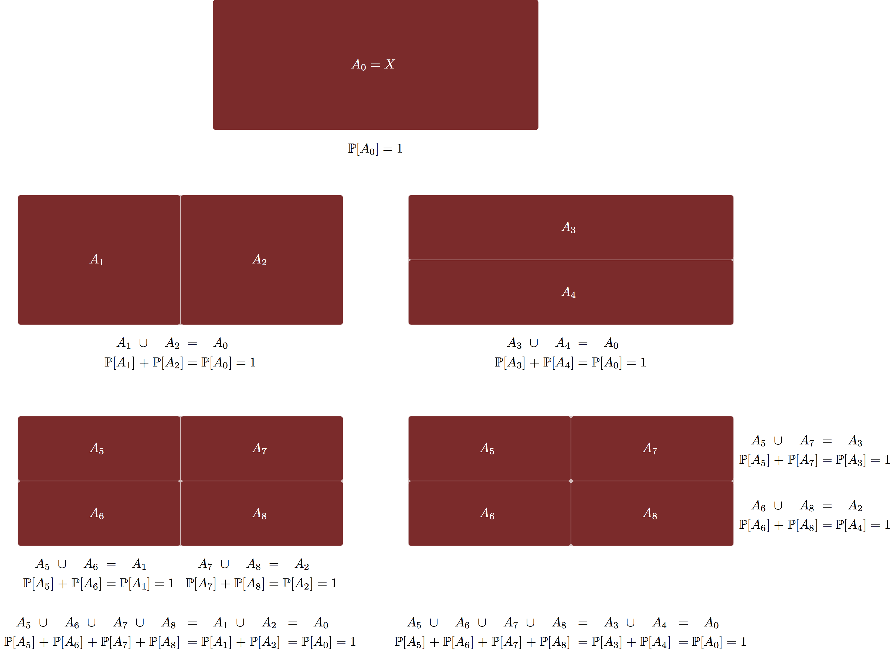
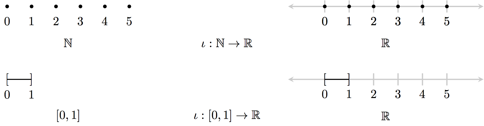
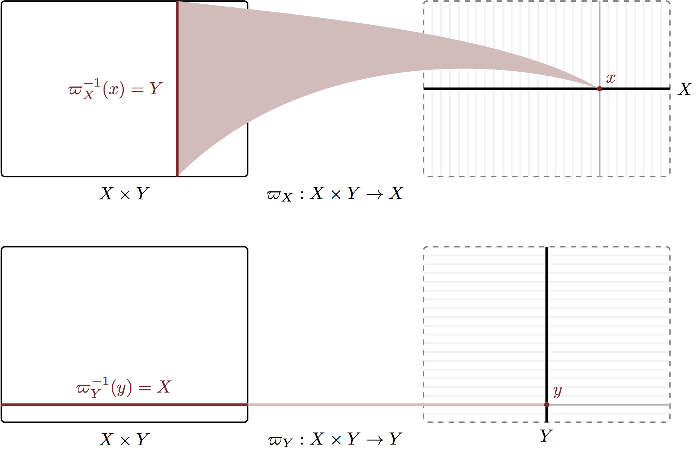
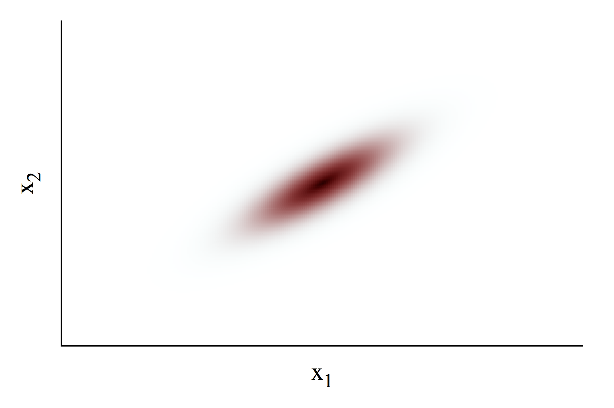
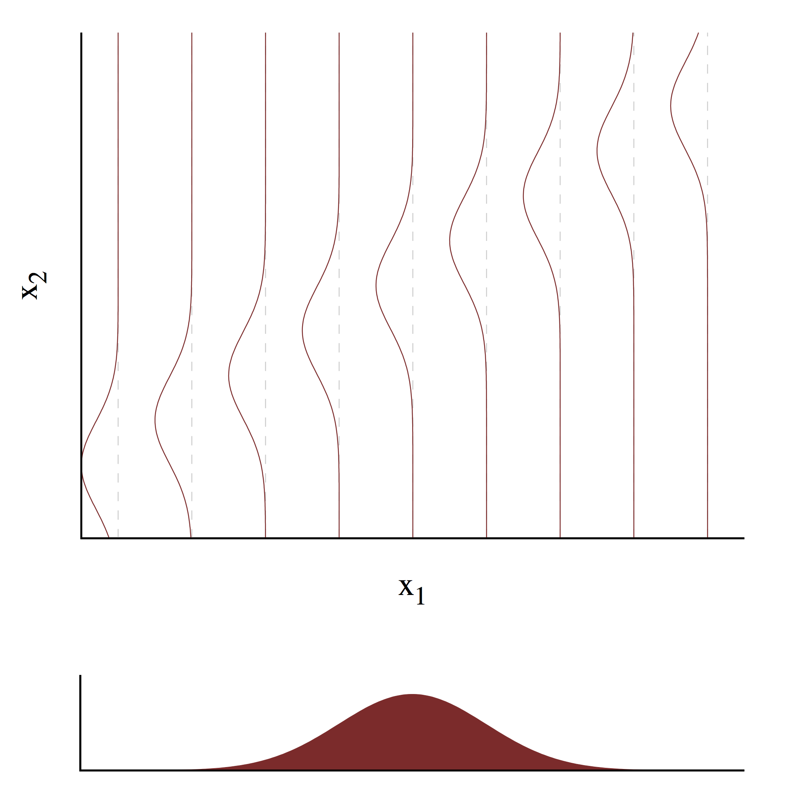

```{r setup, include=FALSE}
knitr::opts_chunk$set(comment=NA)
```

Formal probability theory is a rich and complex field of mathematics with a
reputation for being confusing if not outright impenetrable.  Much of that
intimidation, however, is due not to the abstract mathematics but rather how
they are employed in practice.  In particular, many introductions to probability
theory sloppily confound the abstract mathematics with their practical
implementations, convoluting _what_ we can calculate in the theory with _how_
we perform those calculations.  To make matters even worse, probability theory
is used to model a variety of subtlely different systems, which then burdens the
already confused mathematics with the distinct and often conflicting
philosophical connotations of those applications.

In this case study I attempt to untangle this pedagogical knot to illuminate
the basic concepts and manipulations of probability theory and how they can be
implemented in practice.  Our ultimate goal is to demystify what we can
calculate in probability theory and how we can perform those calculations in
practice.  We begin with an introduction to abstract set theory, continue to
probability theory, and then move onto practical implementations without any
interpretational distraction.  We will spend time more thoroughly reviewing
sampling-based calculation methods before finally considering the classic
applications of probability theory and the interpretations of the theory that
then arise.

In a few places I will dip a bit deeper into the mathematics than is strictly
necessary.  These section are labeled "Extra Credit" and may be skipped without
any consequence.

Let me, however, open with a warning that the section on abstract probability
theory will be devoid of any concrete examples.  This is not becuase of any
conspiracy to confuse the reader, but rather is a consequence of the fact that
we cannot explicitly construct abstract probability distributions in any
meaningful sense.  Instead we must utilize problem-specific _representations_
of abstract probability distributions.  Consequently concrete examples will have
to wait until we introduce these representations in Section 3.

# Setting A Foundation

Ultimately probability theory concerns itself with sets in a given space.
Before we consider the theory at any detail we will first review some of the
important results from set theory that we will need.

A set is a collection of points from a given space, $X$.  For example, $\{1\}$,
$\{5, 10, 12\}$, and $\{30, 2, 7\}$, are all sets drawn from the natural
numbers, $X = \mathbb{N}$.  A _point set_ or _atomic set_ is a set containing a
single point such as $\{1\}$ above.  The entire space itself is always a valid
set, as is the _empty set_ or _null set_, $\emptyset$, which contains no
elements at all.

Sets are often defined implicitly via an inclusion criterion.  These sets are
defined via the notation
$$
A = \left\{ x \in X \mid f(x) = 0 \right\},
$$
which reads "the set of points $x$ in $X$ such that $f(x) = 0$."

## Set Operations

There are three natural operations between sets.

Given a set, $A$, we its _compliment_, $A^{c}$, is defined by all of the points
not in that set,
$$
A^{c} = \left\{ x \in X \mid x \notin A \right\}.
$$

We can construct the _union_ of two sets, $A_{1} \cup A_{2}$, as the set of
points included in either set,
$$
A_{1} \cup A_{2}  = \left\{ x \in X \mid x \in A_{1} \text{ OR } x \in A_{2} \right\}.
$$
Similarly, we can construct the _intersection_ of two sets, $A_{1} \cap A_{2}$,
as the set of points contained in both sets,
$$
A_{1} \cap A_{2} = \left\{ x \in X \mid x \in A_{1} \text{ AND } x \in A_{2} \right\}.
$$

<br><br>

<br><br>

By definition the complement of the empty set is the entire space,
$\emptyset^{c} = X$, and vice versa, $X^{c} = \emptyset$.  The union of any
set and the empty set is just that set, $A \cup \emptyset = A$, and the
intersectin of any set and the empty set is just the empty set,
$A \cap \emptyset = \emptyset$.

## Functions

A _function_ maps points in one space to points in another space.  If a
function, $f$, maps points from the space $X$ to the space $Y$ then we write
$$
\begin{alignat*}{6}
f :\; &X& &\rightarrow& \; &Y&
\\
&x& &\mapsto& &f(x)&.
\end{alignat*}
$$

<br><br>

<br><br>

A function also induces a mapping from sets in the input space, $X$, to sets in
the output space, $Y$, by applying the function to each individual point in the
input set,
$$
f(A) = \left\{ y \in Y \mid f^{-1}(y) \in A \right\}.
$$

<br><br>

<br><br>

At the same time we can also map sets from the output space, $Y$, to sets in
the input space, $X$, by appying the inverse of a given function,
$$
f^{-1}(B) = \left\{ x \in X \mid f(x) \in B \right\}.
$$
Such sets are always well defined even if the function does not have a unique
inverse -- we just add all of the possible inverses to $f^{-1}(B)$.  This set
is denoted the _preimage_ of the set $B$.

<br><br>

<br><br>

## Sigma Algebras

The set of all sets in a space, $X$, is called the _power set_, $P(X)$.  The
power set is massive and, even if the space $X$ is well-behaved, the
corresponding power set can often contain some less mathematically savory
elements.  Consequently when dealing with sets we often want to consider a
restriction of the power set that removes unwanted sets.

We have to be careful, however, to apply this restriction in a self-consistent
manner.  In particular, we want our restriction to be closed under the three
set operations so that we don't have to worry about straying outside of our
carefully manicured collection of sets.  For example, if a set $A$ is in our
restriction then we want its complement $A^{c}$ to also be in our restriction.
If $A_{1}$ and $A_{2}$ are in our restriction then we also want the restriction
to contain the union $A_{1} \cup A_{2}$ and the intersection $A_{1} \cap A_{2}$.

In fact we often will need our restrictions to be closed under a countably
infinite, or _countable_, number of unions or intersections.  Given a countable
set of sets, $\left\{A_{1}, A_{2}, \ldots\right\}$, we want both the countable
union,
$$
\cup_{n = 1}^{\infty} A_{n},
$$
and the countable intersection,
$$
\cap_{n = 1}^{\infty} A_{n},
$$
to be in the restriction.

A restricted collection of sets satisfying these closure properties is called
a _$\sigma$-algebra_ over the space $X$ and a choice of $\sigma$-algebra over
$X$ will be denoted with a calligraphic font, $\mathcal{X}$.

Many spaces are equipped with structures that define natural $\sigma$-algebras.
In particular, all of the spaces that we typically deal with in practical
problems, such as the integers and the real numbers, have natural
$\sigma$-algebras.  Consequently we don't have to spend any time worrying about
constructing a $\sigma$-algebra in practice and the restriction of the power set
to a $\sigma$-algebra has little impact on teh practical use of probability
theory.

For more on these natural $\sigma$-algebas see the following optional section.

## Extra Credit: Topology

A _topology_ on a space, $X$, is a collection of sets that contains the empty
set and the full space and is closed under countable unions and finite
intersections.  The sets in a given topology are called _open_ sets and the
compliment of any open set is called a _closed_ set.  Be warned that open and
closed in the topological sence are not exact opposites -- by definition the
empty set and the full space are both open and closed or, shudder, _clopen_.

The topology of a space provides a formal way to define important properties
like continuity.  For example, the fundamental differences between discrete and
continous spaces arise from their different topologies.  In particular, all of
the common spaces, such as the integers and the real numbers, have unique
topologies from which many of their more-intuitive properties arise.

Although superficially similar, a topology is distinct from a $\sigma$-algebra.
For example, the open sets are not closed under the complement operation.  If
we combine all of the open sets and closed sets defined by a topology,
however, then we get a proper $\sigma$-algebra.  $\sigma$-algebras constructed
from the topology of a space are denoted _Borel $\sigma$-algebras_.  Because
common spaces have natural topologies they consequently also have natural
Borel $\sigma$-algebras that exclude pathological sets that can cause problems.

# Mathematical Logistics

Once the philosophy has been stripped away, probability theory is simply the
study of an object, a probability distribution, and its transformations.  Which,
to be fair, is true of most of pure mathematics!  Fortunately, probability
distributions and their manipulations are not particularly unintuitive from this
more formal perspective.

## Probability Distributions

From a purely Mathematical perspective, probability is a positive, conserved
quantity which we want to distribute across a space, $X$.  We take the total
amount of this conserved quantity to be 1 with arbitrary units, but the
mathematical consequences are the same regardless of this scaling.  From this
perspective probability is simply any abstract conserved quantity -- in
particular it does not refer to anything inherently random or uncertain.

A _probability distribution_ defines a mathematically self-consistent allocation
of this conserved quantity across a space $X$.  Letting $A$ be a sufficiently
well-defined subset of $X$, we write $\mathbb{P}_{\pi}[A]$ as the
probability assigned to $A$ by the probability distribution $\pi$.  Importantly,
we want this allocation to be self-consistent -- the allocation to any
collection of disjoint sets, $A_{n} \cap A_{m} = 0, n \ne m$, should be the same
as the allocation to the union of those sets,
$$
\mathbb{P}_{\pi} [ \cup_{n = 1}^{N} A_{n} ]
=
\sum_{n = 1}^{N} \mathbb{P}_{\pi} [ A_{n} ].
$$
In other words, no matter how we decompose the space $X$, or any well-defined
subsets of $X$, we have to conserve probability.

<br><br>

<br><br>

For a finite collection of sets this self-consistency property is known as
_finite additivity_ and would be sufficient if there were only a finite number
of well-defined subsets in $X$.  If we want to distribute probability across
spaces with an infinite number of subsets, such as the real numbers, however,
then we need to go a bit further and require self-consistency over any countable
collection of disjoint sets,
$$
\mathbb{P}_{\pi} [ \cup_{n = 1}^{\infty} A_{n} ]
=
\sum_{n = 1}^{\infty} \mathbb{P}_{\pi} [ A_{n} ].
$$
In particular, this _countable additivity_ property allows us to calculate
limiting probabilities over the smaller and smaller sets that we might need to
cover the area circumscribed by a smooth curve.

In addition to self-consistency we have to ensure that we assign all of the
total probability in our allocation.  This requires that all of the probability
is allocated to the full space, $\mathbb{P}_{\pi} [X] = 1$.

These three conditions completely specify a valid probability distribution,
although to be formal we have to be careful about what we mean by "well-defined"
subsets of $X$.  Somewhat unnervingly we cannot constuct an object that
self-consistently allocates probability to _every_ subset of $X$ because of
some very weird, pathological subsets.  Instead we have to limit our
consideration to a $\sigma$-algebra, $\mathcal{X}$, that removes these odd
sets.

Formally, then, probability theory is defined by _Kolmogorov's axioms_, which
we can write as:

- A probability distribution $\pi$ on a space $X$ with $\sigma$-algebra
$\mathcal{X}$ is a mapping from $\mathcal{X}$ to the real numbers $[0, 1]$,
$$
\begin{alignat*}{6}
\mathbb{P}_{\pi} :\; &\mathcal{X}& &\rightarrow& \; &[0, 1]&
\\
&A& &\mapsto& &\mathbb{P}_{\pi} [A]&.
\end{alignat*}
$$
- This mapping defines an lossless allocation, $\mathbb{P}_{\pi} [X] = 1$.
- This mapping defines a self-consistent allocation for any collection of
disjoint sets in $\mathcal{X}$,
$$
\mathbb{P}_{\pi} [ \cup_{n = 1}^{\infty} A_{n} ]
=
\sum_{n = 1}^{\infty} \mathbb{P}_{\pi} [ A_{n} ],
$$
$$
A_{n} \cap A_{m} = 0, \, n \ne m.
$$

The more familiar rules of probabilty theory can all be derived from these
axioms.  For example the last self-consistency condition implies that
$$
\mathbb{P}_{\pi}[A] + \mathbb{P}_{\pi}[A^{c}] = \mathbb{P}_{\pi}[X] = 1
$$
or
$$
\mathbb{P}_{\pi}[A] = 1 - \mathbb{P}_{\pi}[A^{c}].
$$

A probability distribution is then completely specified by the
_probability triplet_ $(X, \mathcal{X}, \pi)$ which is often denoted more
compactly as
$$
x \sim \pi
$$
for $x \in X$ denotes the space, $\pi$ denotes the probability distribution,
and a valid $\sigma$-algebra is assumed.

## Expectation Values {#sec:expectation_values}

The allocation of probability across a space immediately defines a way to
summarize how functions of the form $f: X \rightarrow \mathbb{R}$ behave.
_Expectation values_, $\mathbb{E}_{\pi}[g]$, reduce a function to a single real
number by averaging the function output, $f(x)$, weighted by the probability
assigned around that point.  This weighting process emphasizes how the function
behaves in neighborhoods of high probability while diminishing its behavior in
neighborhoods of low probability.

How exactly, however, do we formally construct these expectation values?
The only expectation values that we can immediately calculate in closed form are
the expectations of an _indicator function_ that vanishes outside of a given set,
$$
\mathbb{I}_{A} [x] =
\left\{
\begin{array}{rr}
1, & x \in A \\
0, & x \notin A
\end{array}
\right. .
$$
The expectation of an indicator function is simply the weight assigned to
$A$, which is just the probability allocated to that set,
$$
\mathbb{E}_{\pi} [ \mathbb{I}_{A} ] \equiv \mathbb{P}_{\pi} [ A ].
$$
We can then build up the expecation value of an arbitrary function with a
careful approximation in terms of these indicator functions in a process known
as _Lebesgue integration_.  For more detail see the following optional section.

When our space is a subset of the real line, $X \subseteq \mathbb{R}$, there is
a natural _embedding_ of $X$ into $\mathbb{R}$,
$$
\begin{alignat*}{4}
\iota :\; &X& &\rightarrow& \mathbb{R}
\\
&x& &\mapsto& x.
\end{alignat*}
$$
For example this embedding would associate the natural numbers,
$\left\{1, 2, \ldots \right\}$, with the corresponding values in the real line,
or the interval $[0, 1]$ with the corresponding interval in the full real line.

<br><br>

<br><br>

In this circumstance we define the _mean_ of the probability distribution as
$$
\mathbb{m}_{\pi} = \mathbb{E}_{\pi} [ \iota ],
$$
which quantifies the location around which the probability distribution is
focusing its allocation.  Similarly we define the _variance_ of the probability
distribution as
$$
\mathbb{V}_{\pi} = \mathbb{E}_{\pi} [ (\iota - \mathbb{m}_{\pi})^{2}],
$$
which quantifies the breadth of the allocation around the mean.  We will also
refer to the variance of an arbitrary function as
$$
\mathbb{V}_{\pi} [f] = \mathbb{E}_{\pi} [ (f - \mathbb{E}_{\pi}[f])^{2}].
$$

While we can always define expectation values of a _given_ function
$f: X \rightarrow \mathbb{R}$, a probability distribution will not have a
well-defined mean and variance unless there is some _special_ function whose
expectation has a particular meaning.  For example, if our space is a subset of
the real numbers, $X \subseteq \mathbb{R}^{N}$, then there is no special function
whose expectation value defines a scalar mean.  We can, however, define
_component_ means and variances as expectations of the _coordinate functions_,
$\hat{x}_{n}: \mathbb{R}^{N} \rightarrow \mathbb{R}$, that project a point
$x \in X$ onto each of the component axes.  These component means and variances
then provide some quantification of how the probability is allocated along each
axis.

## Extra Credit: Lebesgue Integration {#sec:lebesgue}

As we saw in [Section 2.2](#sec:expectation_values) only the indicator functions
have immediate expectation values in terms of probabilities.  In order to define
more expectation values of more general functions we have to build increasingly
more complex functions out of these elementary ingredients.

The countable sum of indicator functions weighted by real numbers defines a
_simple function_,
$$
\phi = \sum_{n} a_{n} \mathbb{I}_{A_{n}}.
$$
If we require that expectation is linear over this summation then the
expectation value of any simple function is given by
$$
\begin{align*}
\mathbb{E}_{\pi} [ \phi ]
&=
\mathbb{E}_{\pi} \left[ \sum_{n} a_{n} \mathbb{I}_{A_{n}} \right]
\\
&=
\sum_{n} a_{n} \mathbb{E}_{\pi} [ \mathbb{I}_{A_{n}} ]
\\
&= \sum_{n} a_{n} \mathbb{P}_{\pi} [ A_{n} ].
\end{align*}
$$
Because of the countable additivity of $\pi$ and the boundedness of probability,
the expectation of a simple function will always be finite provided that each of
the coefficients $a_{n}$ are themselves finite.

We can then use simple functions to approximate an everywhere-positive function,
$g : X \rightarrow \mathbb{R}^{+}$.  A simple function with only a few terms
defined over only a few sets will yield a poor approximation to $g$, but as we
consider more terms and more sets we can build an increasingly accurate
approximation.  In particular, over the space of all simple functions bounded
above by $f$ we should be able to find a simple function that approximates $f$
with arbitrary accuracy.

<br><br>

<br><br>

Consequently we define the expecation of an everywhere-positive function as
the expectation of this approximating simple function.  Because we were careful
to consider only simple functions bounded by $f$ we can also define the
expectation of $f$ as the largest expecation of all bounded simple functions,
$$
\mathbb{E}_{\pi} [ g ] = \max_{\phi \le g} \mathbb{E}_{\pi} [ \phi ].
$$

For functions that aren't everywhere-positive we can decompose $X$ into a
collection of neighborhoods where $f$ is entirely positive, $A^{+}_{n}$, and
entirely negative, $A^{-}_{m}$.  In those neighborhoods where $f$ is entirely
positive we apply the above procedure to define
$$
\mathbb{E}_{\pi} [ g \cdot \mathbb{I}_{A^{+}_{n}}],
$$
while in the neighborhoods where $f$ is entirely negative we apply the above
procedure on the negation of $f$ to define
$$
\mathbb{E}_{\pi} [ -g \cdot \mathbb{I}_{A^{+}_{n}}].
$$.
Those regions where $g$ vanishes yield zero expectation values and can be
ignored.  We then define the expectation value of an arbitrary function $g$ as
the sum of these contributions,
$$
\mathbb{E}_{\pi} [ f ] =
\sum_{n = 0}^{\infty} \mathbb{E}_{\pi} [ g \cdot \mathbb{I}_{A^{+}_{n}}]
- \sum_{m = 0}^{\infty} \mathbb{E}_{\pi} [ -g \cdot \mathbb{I}_{A^{-}_{m}}].
$$

Formally this procedure is nothing more than _Lebesgue integration_ originally
derived from the general _measure theory_ of which probability theory is a
special case.

## Measurable Transformations {#sec:measurable_transformations}

Once we have defined a probability distribution on a space, $X$, and a
well-behaved collection of subsets, $\mathcal{X}$, we can then consider how
the probability distribution transforms when $X$ transforms.  In particular,
let $f: X \rightarrow Y$ be a transformation from $X$ to another space $Y$.
Does this transformation also transform our probability distribution on $X$
onto a probability distribution on $Y$, and if so under what conditions?

The answer is straightforward once we have selected a $\sigma$-algebra for
$Y$ as well, which we will denote $\mathcal{Y}$.  In order for $f$ to induce a
probability distribution on $Y$ we need the two $\sigma$-algebras to be
compatible in some sense.  In particular we need every subset
$B \in \mathcal{Y}$ to correspond to a unique subset
$f^{-1}(B) \in \mathcal{X}$.  If this holds for all subsets in $\mathcal{Y}$
then we say that the transformation $f$ is _measureable_ and we can define
a _pushforward_ distribution, $\pi_{*}$ by
$$
\mathbb{P}_{\pi_{*}} [ B ] = \mathbb{P}_{\pi} [ f^{-1} (B) ].
$$
In other words, if $f$ is measurable then a self-consistent allocation of
probability over $X$ induces a self-consistent allocation of probability over
$Y$.

<br><br>

<br><br>

One especially important class of measurable functions are those for which
$f(A) \in \mathcal{Y}$ for any $A \in \mathcal{X}$ in addition to
$f^{-1}(B) \in \mathcal{X}$ for any $B \in \mathcal{Y}$.  In this case $f$
transforms not only a probability distribution on $X$ into a probability
distribution on $Y$ but also a probability distribution on $Y$ into a
probability distribution on $X$.  In this case we actually have one unique
probability distribution that is just being defined over two different
manifestations of the same abstract system.  The two manifestations, for
example, might correspond to different choices of coordinate system, or
different choices of units, or different choics of language capable of the same
descriptions.  These _doubly measurable_ transformations then serve as
translations from one equivalent manifestation to another.

Measurable maps can also be used to project a probability distribution over a
space onto a probability distribution over a lower-dimensional subspace.  Let
$\varpi: X \rightarrow Y$ be a _projection operator_ that maps points in a space
$X$ to points in the subspace $Y \subset X$.  It turns out that in this case a
$\sigma$-algebra on $Z$ naturally defines a $\sigma$-algebra on $X$ and
the projection operator is measurable with respect to this choice.
Consequently any _joint probability distribution_ on $X$ will transform into a
unique _marginal probability distribution_ on $Y$.  More commonly we say that we
_marginalize out_ the complementary subspace, $Y^{C}$.

<br><br>

<br><br>

Marginalization is a bit more striaghtforward when we are dealing with a product
space, $X \times Y$, which is naturally equipped with the component
projection operators $\varpi_{X} : X \times Y \rightarrow X$ and
$\varpi_{Y}: X \times Y \rightarrow Y$.  In this case by pushing a distribution
over $(X \times Y, \mathcal{X} \times \mathcal{Y})$ forwards along $\varpi_{X}$
we marginalize out $Y$ to give a probability distribution over
$(X, \mathcal{X})$.  At the same time by pushing that same distribution forwards
along $\varpi_{Y}$ we can marginalize out $X$ to give a probability distribution
over $(Y, \mathcal{Y})$.

<br><br>

<br><br>

Consider, for example, the three-dimensional space, $\mathbb{R}^{3}$, where
the coordinate functions serve as projection operators onto the three axes,
$X$, $Y$, and $Z$.  Marginalizing out $X$ transforms a probability distribution
over $X \times Y \times Z$ to give a probability distribution over the
two-dimensional space, $Y \times Z = \mathbb{R}^{2}$.  Marginalizing out $Y$
then gives a probability distribution over the one-dimensional space,
$Z = \mathbb{R}$.

## Conditional Probability Distributions

As we saw in [Section 3.4](#sec:measurable_transformations), projection
operators allow us to transform a probability distribution over a space to a
probability distribution on some lower-dimensional subspace.  Is it possible,
however, to go the other way?  Can we take a given marginal probability
distribution on a subspace and construct a compatible distribution on the total
space?  We can if we can define an appropriate probability distribution on the
complement of the given subspace.

Consider a $N$-dimensional _total space_, $X$, with the projection,
$\varpi : X \rightarrow Y$, onto a $K < N$-dimensional _base space_, $Y$.  By
pushing a probability distribution on $X$ along the projection operator we
compress all of the information about how probability is distributed along the
_fibers_ $\varpi^{-1} (y)$ for each $y \in Y$.  In order to reconstruct the
original probability distribution from a marginal probability distribution we
need to specify this lost information.

<br><br>

<br><br>

Every fiber takes the form of a $N - K$-dimensional space, $F$, and, like
subspaces, these fiber spaces inherent a natural $\sigma$-algebra,
$\mathcal{F}$, from the $\sigma$-algebra over the total space, $\mathcal{X}$.
A _conditional probability distribution_ defines a probability distribution over
each fiber that varies with the base point, $y$,
$$
\begin{alignat*}{6}
\mathbb{P}_{F \mid Y} :\; &\mathcal{F} \times Y& &\rightarrow& \; &[0, 1]&
\\
&(A, y)& &\mapsto& &\mathbb{P}_{F \mid Y} [A, y]&.
\end{alignat*}
$$
Evaluated at any $y \in Y$ the conditional probability distribution defines
a probability distribution over the corresponding fiber space,
$(F, \mathcal{F})$.  On the other hand, when evaluated at a given subset
$A \in \mathcal{F}$ the conditonal probability distribution becomes a measurable
function from $Y$ into $[0, 1]$ that quantifies how the probability of that set
varies as we move from one fiber to the next.

Given a marginal distribution, $\pi_{Y}$, we can then define a probability
distribution over the total space by taking an expectation value,
$$
\mathbb{P}_{X} [ A ]
=
\mathbb{E}_{Y} [ \mathbb{P}_{F \mid Y} [A \cap \varpi^{-1} (y), y] ].
$$
This induced distribution is consistent in the sense that if we transform it
back along the projection operator we recover the marginal distribution with
which we started.

This construction becomes significantly easier when we consider a product space,
$X \times Y$ and the projection $\varpi: X \times Y \rightarrow Y$.  In this
case the fiber space is just $X$ and the conditional probability distribution
becomes
$$
\begin{alignat*}{6}
\mathbb{P}_{X \mid Y} :\; &\mathcal{X} \times Y& &\rightarrow& \; &[0, 1]&
\\
&(A, y)& &\mapsto& &\mathbb{P}_{X \mid Y}[A, y]&.
\end{alignat*}
$$
with joint distribution
$$
\mathbb{P}_{X \times Y} [ A ]
=
\mathbb{E}_{Y} [ \mathbb{P}_{X \mid Y} [A \cap X, y] ].
$$

<br><br>

<br><br>

Conditional probability distributions are especially useful when we want to
construct a complex probability distribution over a high-dimensonal space
because we can reduce the specification of the ungainly joint probability
distribution with a sequence of lower-dimensional conditional probability
distributions and marginal probability distributions about which we can more
easily reason.  In the context of modeling an observational process, this method
of construction a complicated distribution from intermediate conditional
probability distributions is known as _generative_ modeling.  In particular,
each intermediate conditional probability distribution models some fragment of
the full observational process.

# Representing Probability Distributions {#sec:representations}

As we saw in the prevous section, formal probability theory is simply the study
of probability distributions that allocate a finite, conserved quantity across a
space, the expectation values that such an allocation induces, and how the
allocation behaves under transformations of the underlying space.  While there
is myriad complexity in the details of that study, the basics concepts are
relatively straightforward.

Still, those concepts have so far been presented in the abstract without any
concrete examples to provide context.  Why weren't there any examples to
accompany the discussion in the previous section?  Because unfortunately
probability distributions cannot be explicit defined in most problems!

Recall that a probability distribution is defined as a map from the well-defined
subsets in a $\sigma$-algebra to real numbers in the interval $[0, 1]$.  For a
$\sigma$-algebra with only a few elements we could completely specify this
mapping with a lookup table, but any nontrivially large $\sigma$-algebra
will simply be too large for this to be practical.  What we really need is a
way to define this mapping algorithmically so that we can perform necessary
calculations as needed instead of exhaustively specifiying the relationships.

Fortunately most probabilistic systems admit _represenations_ that faithfully
recover all probabilities and expectation values on demand and hence completely
specific a given probability distribution.  Many represenations exploit the
particular struture of $X$ to fully characterize a probability distribution
with a single function, while others utilize sequences of points to construct
these probabilistic computations.

One of the most common sources of misunderstanding in probability theory is
the confusion of an abstract probability distribution with these
representations.  In an understandable desire to present concrete examples as
early as possible, many introductory treatments of probability theory begin
immediately with these representations only to end up muddling their
relationship with the abstract mathematics that they are characterizing.  Now
that we have worked through the abstract definitions, however, we can introduce
representations in a more principled way.

## Probability Mass Functions

When $X$ is a discrete space any probability distribution can be represented
by a _probability mass function_ that assigns a probability to each atomic
element of the space, $\pi : X \rightarrow [0, 1]$.  From these atomic
allocations we can reconstruct the probability of any subset $A \subset X$ as
$$
\mathbb{P}_{\pi} [ A ] = \sum_{x \in A} \pi(x),
$$
and any expectation value as
$$
\mathbb{E}_{\pi} [ f ] = \sum_{x \in X} \pi(x) f(x).
$$
probability mass functions also have the elegant property of transforming quite
naturally along a measurable transformation of $X$,
$$
\pi_{*} (y) = \sum_{x \in g^{-1}(y)} \pi(x).
$$

A classic example of a probability mass function is the representation of a
_Bernoulli_ distribution that allocates probabilities across a binary outcome,
$X = \{0, 1\}$,
$$
\pi(x \mid p) = p^{x} (1 - p)^{1 - x}.
$$
The mean of the Bernoulli distribution is given by the expectation of the
natural embedding operator,
$$
\mathbb{m}_{\pi} = \mathbb{E}_{\pi}[\iota] = p
$$
with the associated variance,
$$
\mathbb{V}_{\pi} = p (1 - p).
$$

We also have the related _Binomial_ distribution that allocates probabilities
across the $N + 1$ discrete points, $X = \{0, 1, \ldots, N\}$.  The probability
mass function is given by
$$
\pi(x \mid p, N) = p^{x} (1 - p)^{N - x}.
$$
with the corresponding mean,
$$
\mathbb{m}_{\pi} \mathbb{E}_{\pi}[\iota] = N p
$$
and variance,
$$
\mathbb{V}_{\pi} = N p (1 - p).
$$
Additionally, the probability of any interval, $A = \{K_{1}, \ldots, K_{2}\}$,
has the explicit form,
$$
\begin{align*}
\mathbb{P}_{\pi} [A = \{K_{1}, \ldots, K_{2}\}]
&=
\sum_{k = K_{1}}^{K_{2}} \pi(k)
\\
&=
I_{1 - p} (N - K_{2}, 1 + K_{2})
- I_{1 - p} (N - K_{1} - 1, K_{1}),
\end{align*}
$$
where $I_{s}(\alpha, \beta)$ is the _regularized incomplete Beta function_,
$$
I_{s}(\alpha, \beta) =
\frac{ \int_{0}^{s} \mathrm{d} t \, t^{\alpha - 1} (1 - t)^{\beta - 1}}
{ \int_{0}^{1} \mathrm{d} t \, t^{\alpha - 1} (1 - t)^{\beta - 1}}.
$$

Finally consider the _Poisson_ distribution which allocates probabilities
across the integers, $X = \left\{0, 1, 2, \ldots \right\}, with the probability
mass function
$$
\pi(x \mid \lambda) = \frac{e^{-\lambda} \lambda^{x}}{x!}.
$$
We can readily visualize the Poisson probability mass function using the `R`
implementation,
```{r}
c_light <- c("#DCBCBC")
c_light_highlight <- c("#C79999")
c_mid <- c("#B97C7C")
c_mid_highlight <- c("#A25050")
c_dark <- c("#8F2727")
c_dark_highlight <- c("#7C0000")

p <- hist(0, breaks=0:21-0.5, plot=FALSE)
p$counts <- dpois(0:20, 5)

par(mar = c(8, 6, 0, 0.5))
plot(p, main="", col="white", border=c_dark_highlight,
     xlab="x", yaxt='n', ylim=c(0, 0.2), ylab="Probability Mass",
     cex.lab=1.5, cex.axis=1.5, cex.main=1.5, cex.sub=1.5)
```

The mean and variance of the Poisson distribution are in fact equal,
$$
\mathbb{m}_{\pi} = \mathbb{V}_{\pi} = \lambda,
$$
and the probability of any interval set, $A = \{K_{1}, \ldots, K_{2}\}$, has
the closed form
$$
\begin{align*}
\mathbb{P}_{\pi} [A = \{K_{1}, \ldots, K_{2}\}]
&=
\sum_{k = K_{1}}^{K_{2}} \pi(k)
\\
&=
Q (\lambda, K_{2}) - Q (\lambda, K_{1} - 1),
\end{align*}
$$
where $Q(\alpha, n)$ is the _regularized incomplete Gamma function_,
$$
Q(\alpha, n) =
\frac{ \int_{0}^{n} \mathrm{d} t \, t^{\alpha - 1} e^{-t} }
{ \int_{0}^{\infty} \mathrm{d} t \, t^{\alpha - 1} e^{-t} }.
$$

```{r}
p <- hist(0, breaks=0:21-0.5, plot=FALSE)
p$counts <- dpois(0:20, 5)

par(mar = c(8, 6, 0, 0.5))
plot(p, main="", col="white", border=c_dark_highlight,
     xlab="x", yaxt='n', ylim=c(0, 0.2), ylab="Probability Mass",
     cex.lab=1.5, cex.axis=1.5, cex.main=1.5, cex.sub=1.5)

p_sum <- hist(5, breaks=5:11-0.5, plot=FALSE)
p_sum$counts <- dpois(5:10, 5)

plot(p_sum, col=c_dark, border=c_dark_highlight, add=T)

par(xpd=NA)
arrows(4.5, -0.07, 10.5, -0.07, col = "black", lty = 1, lwd = 2,
       code=3, angle=90, length=0.1)
text(x=7.5, y=-0.08, labels="A", cex=1.5)
text(x=7, y=0.025, labels="P[A]", cex=1.5, col="white")
```

In `R` we can evalulate both the exhaustive sum,
```{r}
K1 <- 5
K2 <- 10

sum(dpois(K1:K2, 5))
```
and the closed form solution,
```{r}
ppois(K2, 5) - ppois(K1 - 1, 5)
```
which are indeed the same.

## Probability Density Functions

When our space is given by the real numbers or a subset thereof,
$X \subseteq \mathbb{R}^{N}$, we can no longer assign finite probability to
each point $x \in X$ with a probability mass function.  The problem is that in
any non-atomic subset of $X$ there will be an uncountably infinite number of
points and the sum of probability mass function over that subset will explode
unless we assign zero probability mass to all but a countable number of points.

Consequently probability mass functions are no longer viable and instead we must
utilize _probability density functions_ over which we can _integrate_ to give
probabilities and expectations.  Given a probability density function,
$\pi: X \rightarrow \mathbb{R}$, we can reconstruct probabilities as
$$
\mathbb{P}_{\pi} [ A ] = \int_{A} \mathrm{d} x \, \pi(x),
$$
and expectation value as
$$
\mathbb{E}_{\pi} [ f ] = \int_{X} \mathrm{d} x \ , \pi(x) f(x).
$$

Unlike probability mass functions, probability densities don't transform quite
as naturally along a measurable transformation on $X$.  Given a transformation
$g : \mathbb{R}^{N} \rightarrow \mathbb{R}^{N}$, the probability density
corresponding to the pushforward distribution picks up a Jacobian determinant,
$$
\pi_{*} (y) = \sum_{n = 1}^{N} \pi(x_{n}(y))
\left| \frac{ \partial g}{\partial x} (x_{n}(y)) \right|^{-1},
$$
where $\left\{x_{1}(y), \ldots, x_{N}(y) \right\}$ are the roots of
$y = g(x)$ for a given $y$.

The most ubiquitous probability density function over the real line is the
_Gaussian density_,
$$
\pi(x \mid \mu, \sigma) = \frac{1}{\sqrt{2 \pi}}
\exp \left( - \frac{1}{2} \left(\frac{x - \mu}{\sigma} \right)^{2} \right).
$$
```{r}
x <- seq(-6, 6, 0.001)

par(mar = c(8, 6, 0, 0.5)) #b-l-t-r
plot(x, dnorm(x, 0, 1), type="l", col=c_dark_highlight, lwd=2,
     xlab="x", ylab="Probability Density",
     cex.lab=1.5, cex.axis=1.5, cex.main=1.5, cex.sub=1.5, yaxt='n')
```
Note that I have not referred to this probabilitiy density function as
representing a "Gaussian probability distribution".  Under a double measurable
transformation that doesn't affect the latent probability distribution the
probability density function will pick up a Jacobian determinent that can skew
this bell-curved, Gaussian shape.  Consequently there are no Gaussian
probability distributions, just probability distributions on $X = \mathbb{R}$
that can be represented as Gaussian densities in certain manifestations of $X$.

The probability distribution represented by a Gaussian density features a mean
$$
\mathbb{m}_{\pi} = \mu,
$$
and a variance,
$$
\mathbb{V}_{\pi} = \sigma^{2}.
$$
The probability assigned to any interval $A = [a, b]$ admits a closed form,
$$
\mathbb{P}_{\pi} [ A = [a, b] ] =
\frac{1}{2} \left(
\mathrm{erf} \left( \frac{1}{\sqrt{2}} \frac{b - \mu}{\sigma} \right)
- \mathrm{erf} \left( \frac{1}{\sqrt{2}} \frac{a - \mu}{\sigma} \right)
\right)
$$
in terms of the _error function_,
$$
\mathrm{erf}(x) = \frac{2}{\sqrt{\pi}} \int_{0}^{x} \mathrm{d} t \, e^{-t^{2}}.
$$
```{r}
x <- seq(-6, 6, 0.001)

par(mar = c(8, 6, 0, 0.5))
plot(x, dnorm(x, 0, 1), type="l", col=c_dark_highlight, lwd=2,
     xlab="x", ylab="Probability Density",
     cex.lab=1.5, cex.axis=1.5, cex.main=1.5, cex.sub=1.5, yaxt='n')

x_int <- seq(-2, 1, 0.001)
x <- c(x_int, 1, -2)
y <- c(dnorm(x_int, 0, 1), 0, 0)

polygon(x, y, col=c_dark, border=NA)

par(xpd=NA)
arrows(-2, -0.14, 1, -0.14, col = "black", lty = 1, lwd = 2,
       code=3, angle=90, length=0.1)
text(x=-0.5, y=-0.16, labels="A", cex=1.5)
text(x=-0.5, y=0.1, labels="P[A]", cex=1.5, col="white")
```

In `R` we can evaluate the closed form solution as
```{r}
pnorm(1, 0, 1) - pnorm(-2, 0, 1)
```

## Samples

One of the immediate difficulties with probability mass function and
probability density function representations is that if a given expectation
doesn't have a closed form, as we conveniently had for the examples given above,
then the computation will likely be infeasible.  Exhaustive surveys of the space
$X$ needed to numerically compute a summatation or integral is simply too
expensive given the finite computational resources avaiable in most problems.
This is especially true when we consider more complicated probability
distributions over high-dimensional spaces.

An intriguing alternative to these two deterministic representations of a
probability distribution uses a sequence of points in $X$ capable of
_estimating_ expectations with more reasonable computational demands.

Consider an arbitrary sequence of points from $X$,
$S_{N} = {x_{1}, \ldots, x_{N}}$ and define the _emperical expectation_ of a
function $f : X \rightarrow \mathbb{R}$ as
$$
\hat{f}(S_{N}) = \frac{1}{N} \sum_{n = 1}^{N} f(x_{n}).
$$
A _sampling procedure_ is any process that generates sequences that satsify
the asymptotic property
$$
\lim_{N \rightarrow \infty} \hat{f}(S_{N}) = \mathbb{E}_{\pi} [ f ],
$$
for _all_ functions $f$ with finite expectation values.  The finite sequences
generated by a sampling process are denoted _samples_.  Note that by this
definition any subset of such a sequence is also a sample.

As the size of a sample increases the empirical expectations converge towards
the true expectation values, as well as probabilities through expectations of
indicator funtions.  In this way the sample procedure which is conceptually
capable of generating arbitrarily long sequences provides a faithful
represenation of the corresponding probability distribution.  In practice we
need to be able to quantify the accuracy of these estimators to understand how
accurately we are representing the target probability distribution.

There is absolutely no restriction on the inner workings of a sampling
procedure.  Provided that it can generate sequences of arbitrary length that
satisfy the asymptotic property it will be a valid sampling procedure.
The procedure can be generated algorithmically and be completely deterministic
given a known input configuration, generated from unknown external inputs with
unpredictable outputs, or anywhere in between.

Measurable transformations are especially easy to implement with samples.
If $S_{N} = {x_{1}, \ldots, x_{N}}$ is a sample from a probability distribution
on $X$ then
$$
S^{*}_{N} = \{ f(x_{1}), \ldots, f(x_{N}) \} = \{ y_{1}, \ldots, y_{N} \}
$$
is a sample from the pushforward probability distribution along the measurable
function $f : X \rightarrow Y$.

Samples also help to provide some intuition for why measurable transformations
are often introduced as "random variables".  A variable is considered the output
of a function with a variable, but known, input,
$$
y = f(x).
$$
If the input is distributed according to a probability distribution, however,
then we don't have an explicit value at which to evaluate the function, and hence
define the variable,
$$
x \sim \pi
$$
$$
y = f(x).
$$
Instead we have a probability distribution over the possible variable values
given by the pushforward probability distribution,
$$
y \sim \pi_{*}.
$$

When we represent a probability distribution with a sample, however, we do have
explicit values at which we can evaluate the function.  Consequently we can
very loosely interpret "evaluating a random variable" as "generating samples
from the corresponding pushforward distribution".

# Generating Samples

A sampling representation of a probability distribution is appealing, but how
exactly do we generate samples whose empirical expectations converge to the true
expectations of a given probability distribution?  For sufficiently simple
distributions we can generate exact samples while in general we typically have
to resort to generating more subtle correlated samples.

## Exact Samples

If each point in a sample is generated independently of the others then we
say that the resulting sample is _exact_.  Consequently each subset of an exact
sample, including each point, is also an exact sample.

In this case the empirical expectations satisfy a _central limit theorem_ which
guarantees that the empirical expecations are distributed around the true
expectations,
$$
\hat{f}(S_{N}) \sim
\mathcal{N} \left( \mathbb{E}_{\pi} [ f ],
                   \sqrt{\frac{ \mathbb{V}[f] }{ N } } \right).
$$
The square root of the variance in this central limit theorem is also known as
the _Monte Carlo standard error_,
$$
\text{MC-SE} = \sqrt{\frac{ \mathbb{V}[f] }{ N } }.
$$
In practice we can estimate the variance, $\mathbb{V}[f]$, and hence the Monte
Carlo standard error, by using the sample itself.  The error in using a variance
estimate in place of the true variance scales as $1 / N$ which is negligible
compared to the dominant $1 / \sqrt{N}$ scaling of the nominal error.

Estimation expectations values using the empirical expectation of an exact
samples was originally introduced as the _Monte Carlo_ method, with the
empirical expectations themselves known as _Monte Carlo estimators_.  For a
detailed history of the Monte Carlo method see @Betancourt:2018.  Each state
in an exact sample is also known as a _simulation_.

Exact samples can be generated for many one-dimensional distributions using
a variety of highly optimized techniques.  A comprehensive discussion of these
techniques can be found in @Devroye:1986.  These _pseudo random number
generators_ are initialized with an input _seed_ and then can be queried
repeatedly to generate the individual elements of a sample.  A variety of pseudo
random number generators are available in `R`, `Python`, and the Stan modeling
language.

For example, let's consider generating samples from a Poisson distribution.
In `R` this is be accomplished with the function `rpois`.  As the size of the
sample increases our Monte Carlo estimator for the mean (dark red) rapidly
converges to the true value (dashed grey) and at each iteration is consistent
given the Monte Carlo standard error (light red).
```{r}
N <- 1000

set.seed(13703599)
S <- rpois(N, 5)

emp_exp <- sapply(1:N, function(n) mean(S[1:n]))
emp_var <- sapply(1:N, function(n) var(S[1:n]))
mc_se <- sapply(1:N, function(n) sqrt(var(S[1:n]) / n))

plot(1:N, emp_exp, type="l", col=c_dark_highlight, lwd=2,
     ylim=c(3, 7), xlab="N", ylab="Empirical Mean",
     cex.lab=1.5, cex.axis=1.5, cex.main=1.5, cex.sub=1.5)

abline(h=5, col="grey", lty="dashed", lwd=2)
polygon(c(1:N, N:1), c(emp_exp + mc_se, rev(emp_exp - mc_se)), col=c_mid, border=NA)
lines(1:N, emp_exp, type="l", col=c_dark_highlight, lwd=2)
```
We can also estimate the probability of the set $[5, 10]$ by first evaluating
the corresponding indicator function at each point in the sample  and then
taking the empirical average.  As desired the empirical expectation converges
to the true probability.
```{r}
S_I <- 5 <= S & S <= 10

emp_exp <- sapply(1:N, function(n) mean(S_I[1:n]))
emp_var <- sapply(1:N, function(n) var(S_I[1:n]))
mc_se <- sapply(1:N, function(n) sqrt(var(S_I[1:n]) / n))

plot(1:N, emp_exp, type="l", col=c_dark_highlight, lwd=2,
     ylim=c(0, 1), xlab="N", ylab="Empirical Mean",
     cex.lab=1.5, cex.axis=1.5, cex.main=1.5, cex.sub=1.5)

abline(h=ppois(K2, 5) - ppois(K1 - 1, 5), col="grey", lty="dashed", lwd=2)
polygon(c(1:N, N:1), c(emp_exp + mc_se, rev(emp_exp - mc_se)), col=c_mid, border=NA)
lines(1:N, emp_exp, type="l", col=c_dark_highlight, lwd=2)
```

The procedure is identical for a probability distribution represented by a
Gaussian density, with the empirical mean now converging to the true value of
zero.
```{r}
N <- 1000

S <- rnorm(N, 0, 1)

emp_exp <- sapply(1:N, function(n) mean(S[1:n]))
emp_var <- sapply(1:N, function(n) var(S[1:n]))
mc_se <- sapply(1:N, function(n) sqrt(var(S[1:n]) / n))

plot(1:N, emp_exp, type="l", col=c_dark_highlight, lwd=2,
     ylim=c(-1, 1), xlab="N", ylab="Empirical Mean",
     cex.lab=1.5, cex.axis=1.5, cex.main=1.5, cex.sub=1.5)

abline(h=0, col="grey", lty="dashed", lwd=2)
polygon(c(1:N, N:1), c(emp_exp + mc_se, rev(emp_exp - mc_se)), col=c_mid, border=NA)
lines(1:N, emp_exp, type="l", col=c_dark_highlight, lwd=2)
```

We can achieve the same samples using Stan as well.  Here we generate exact
samples in the generated quantities block,
```{r}
writeLines(readLines("generate_gaussian.stan"))
```
and configure the execution of Stan with the `fixed_param` sampler so that only
the generated quantities block is run,
```{r}
library(rstan)
rstan_options(auto_write = TRUE)
options(mc.cores = parallel::detectCores())

fit <- stan(file='generate_gaussian.stan', iter=N, warmup=0,
            chains=1, seed=194838, algorithm="Fixed_param")

S <- extract(fit)$x[]

emp_exp <- sapply(1:N, function(n) mean(S[1:n]))
emp_var <- sapply(1:N, function(n) var(S[1:n]))
mc_se <- sapply(1:N, function(n) sqrt(var(S[1:n]) / n))

plot(1:N, emp_exp, type="l", col=c_dark_highlight, lwd=2,
     ylim=c(-1, 1), xlab="N", ylab="Empirical Mean",
     cex.lab=1.5, cex.axis=1.5, cex.main=1.5, cex.sub=1.5)

abline(h=0, col="grey", lty="dashed", lwd=2)
polygon(c(1:N, N:1), c(emp_exp + mc_se, rev(emp_exp - mc_se)), col=c_mid, border=NA)
lines(1:N, emp_exp, type="l", col=c_dark_highlight, lwd=2)
```

## Correlated Samples

For complex probability distributions, especially those on high-dimensional
spaces that can't be decomposed as a product of one-dimensional distributions,
we rarely have the facilities to generate exact samples.  Instead our best
option is often to generate a _correlated_ sample sequentially using a _Markov
chain_.

A Markov chain is a series of points on a space $X$ generated by a
_Markov transition_.  A Markov transition is just a conditional probability
distribution over the product space $X \times X$, where the first component
corresponds to the current point in the Markov chain, $x_{n} \in X$, and the
second component corresponds to the next point, $x_{n + 1} \in X$.  The next
point in the Markov chain is generated as an exact sample from this conditional
probability distribution function.  Given an initial point $x_{1}$ we can then
generate a Markov chain by repeatedly applying the Markov transition.  Under
specific compatibility conditions between a Markov transition and a target
probability distribution a Markov chain will yield the desired sample.

In general this _Markov chain Monte Carlo_ procedure will generate Markov chain
Monte Carlo estimators that converge to the true expectation values only
asymptotically with no guaranatees on how they converge after only a finite
number of transitions.  Unlike in the Monte Carlo method, Markov chain Monte
Carlo estimators don't always satisfy a central limit theorem.

Under technical _ergodicity_ conditons, however, Markov chain Monte Carlo
estimators can achieve a central limit theorm of the form
$$
\hat{f}(S_{N}) \sim
\mathcal{N} \left( \mathbb{E}_{\pi} [ f ],
                   \sqrt{\frac{ \mathbb{V}[f] }{ N_{\mathrm{eff}} } } \right).
$$
Here the _effective sample size_, $N_{\mathrm{eff}}$, is a function of the
correlation between the points in the Markov chain and quantifies the size of an
exact sample that we would need to achieve the same estimator accuracy.  As
with the variance of $f$ we can estimate the correlations needed to compute the
effective sample size using the sample generated by the Markov chain itself.

Stan uses the powerful _dynamic Hamiltonian Monte Carlo_ method to generate
Markov chains that target probability distributions defined on the real
numbers.  These Markov chains acheive central limit theorems for many target
probability distributions and, when a central limit theorem does hold, the
Markov chains typically yield very large effective sample sizes relative to the
total sample size.  For more details on Markov chain Monte Carlo and Hamiltonian
Monte Carlo see @Betancourt:2017.

Probability distributions in Stan are specified with probability density
functions defined in the Stan modeling language.  A Stan program written in this
language that specifies a Gaussian density is given by
```{r}
writeLines(readLines("fit_gaussian.stan"))
```
Here the `~ normal` notation is shorthand for adding a log Gaussian density to
the target log probability density function.  In other words,
```
x ~ normal(0, 1)
```
is equivalent to
```
target += normal_lpdf(x | 0, 1)
```
where `target` is a global variable that stores the log of the target density
function.

Given the Stan program we can readily generate our correlated sample,
```{r}
fit <- stan(file='fit_gaussian.stan', seed=4938483)
```
Because we are not guaranteed ideal convergence properties in Markov chain
Monte Carlo we have to diligently check the diagnostics provided by Stan to
verify no indications of
problematic behavior.
```{r}
source('stan_utility.R')
check_all_diagnostics(fit)
```
With no indications of problems we can compute the Markov chain Monte Carlo
estimators for the mean,
```{r}
summary(fit, probs = c(), pars='x')$summary[,1:2]
```
consistent with the true value of $\mathbb{m}_{\pi} = 0$.

We can add measurable transformations to our model in the generated quantities
block which maps the output of the Markov chain through deterministic functions.
The generated quantities block in this Stan program maps the samples through
the squared deviation functon, whose expectation gives the variances, and an
indicator function,
```{r}
writeLines(readLines("fit_gaussian_plus.stan"))
```

Running our Markov chain,
```{r}
fit <- stan(file='fit_gaussian_plus.stan', seed=4938483)
```
and confirming no diagnostic problems,
```{r}
source('stan_utility.R')
check_all_diagnostics(fit)
```
we can investigate our expectation estimates.  The expectation of the squared
deviation function is consistent with the true variance of one,
```{r}
summary(fit, probs = c(), pars='sq_dev')$summary[,1:2]
```
and the expectation of the indicator function is consistent with the analytic
value of the interval probability,
```{r}
summary(fit, probs = c(), pars='P')$summary[,1:2]
pnorm(1, 0, 1) - pnorm(-2, 0, 1)
```

## Representations of Conditional Distributions

Conditional probability distributions admit straightforward representations
as well.  Using these representations we can even construct representations
of distributions over spaces that combine discrete and continuous components.

### Conditional Probability Mass Functions

When the fiber space, $F$, is discrete we can represent a conditional
probability distribution with a conditional probability mass function,
$$
\begin{alignat*}{6}
\pi_{F \mid X} :\; &F \times X& &\rightarrow& \; &[0, 1]&
\\
&(f, x)& &\mapsto& &\pi_{F \mid X} (f \mid x)&.
\end{alignat*}
$$
If the base space is also discrete with marginal probabilty mass function
$\pi_{X}(x)$ then a probability distribution over the total space can be
represented by a probability mass function that takes the simple form
$$
\pi_{Z}[f, x] = \pi_{F \mid X} ( f \mid x ) \pi_{X} (x).
$$

### Conditional Probability Density Functions

Similarly, when the fiber space, $F$, is the real numbers then we can represent
a conditional probability distribution with a conditional probability density
function,
$$
\begin{alignat*}{6}
\pi_{F \mid X} :\; &F \times X& &\rightarrow& \; &[0, 1]&
\\
&(f, x)& &\mapsto& &\pi_{F \mid X} (f \mid x)&.
\end{alignat*}
$$
If the base space is also continous with marginal probabilty density function
$\pi_{X}(x)$ then a probability distribution over the total space can be
represented by a probability density function that takes the simple form
$$
\pi_{Z} (f, x) = \pi_{F \mid X} ( f \mid x ) \pi_{X} (x).
$$

For example, the bivariate Gaussian density on $\mathbb{R}^{2}$,
$$
\pi(x_{1}, x_{2}) =
\frac{1}{2 \pi \sigma_{1} \sigma_{2} \sqrt{1 - \rho^{2}} }
\exp \left[
- \frac{1}{2} \frac{1}{1 - \rho^{2}}
\left( \left( \frac{ x_1 - \mu_1 }{\sigma_1} \right)^{2}
- 2 \rho \frac{x_1 - \mu_1}{\sigma_{1}} \frac{x_2 - \mu_2}{\sigma_2}
+ \left( \frac{x_2 - \mu_2}{\sigma_{2}} \right)^{2} \right)
\right],
$$

<br><br>

<br><br>

can be decomposed into marginal probability density function on $x_1$,
$$
\pi(x_1) =
\frac{1}{\sqrt{2\pi \sigma_1^{2}}}
\exp \left[ - \frac{1}{2} \left( \frac{x_1 - \mu_1}{\sigma_1} \right)^{2} \right]
$$
and a conditional density density function on $x_2$,
$$
\pi(x_{2} \mid x_{1}) =
\frac{1}{ \sqrt{ 2 \pi \sigma_{2}^{2} (1 - \rho^{2}) } }
\exp \left[
- \frac{1}{2} \frac{1}{\sigma_2^{2} (1 - \rho^{2})}
\left( x_2 - \mu_2 - \frac{\sigma_2}{\sigma_1} \rho (x_1 - \mu_1) \right)^{2}
\right],
$$

<br><br>

<br><br>

### Mixed Representations

When the fiber space is discrete and the base space is continuous, or vice
versa, a probability distribution on the total space admits a
_mixed representation_ compromised as a product of a conditional probability
mass functions and a marginal probability density function, or vice versa.
For example, a discrete fiber with a continuous base space defines a probability
distribution over a space that contains _both_ discrete and continous
properties.  Because discrete and real representations both take the form of
functions, these mixed representations are straightforward to construct and
utilize when computing probabilities and expectations on the total space.

### Sampling From Conditional Distributions

A sample from a probability distribution on the total space defines a sample
for the marginal probability distribution on the base space by evaluating the
projection operator at each point in the total sample.  A total sample, however,
will not in general be enough informaton to generate a sample from a conditional
probability distribution.  The problem is that in most cases each fiber will
be allocated a small or outright zero probability from the total probability
distribution and no samples will fall exactly on a given fiber.  Instead we
have to generate samples from a conditional probability distribution by
first evaluating it at a particular point in the base space and then generating
samples from the corresponding probability distribution.

For the example in Section 4.3.2 this would take the form

```{r}
x1 <- 1
mu1 <- 2
sigma1 <- 0.75

mu2 <- -1
sigma2 <- 1.2

rho <- 0.7

cond_mu <- mu2 + (sigma2 / sigma1) * rho * (x1 - mu1)
cond_sd <- sigma2 * sqrt(1 - rho * rho)

N <- 1000
S <- rnorm(N, cond_mu, cond_sd)

emp_exp <- sapply(1:N, function(n) mean(S[1:n]))
emp_var <- sapply(1:N, function(n) var(S[1:n]))
mc_se <- sapply(1:N, function(n) sqrt(var(S[1:n]) / n))

c_light <- c("#DCBCBC")
c_light_highlight <- c("#C79999")
c_mid <- c("#B97C7C")
c_mid_highlight <- c("#A25050")
c_dark <- c("#8F2727")
c_dark_highlight <- c("#7C0000")

plot(1:N, emp_exp, type="l", col=c_dark_highlight, lwd=2,
     ylim=c(-3.5, -1.5), xlab="N", ylab="Empirical Mean",
     cex.lab=1.5, cex.axis=1.5, cex.main=1.5, cex.sub=1.5)

abline(h=cond_mu, col="grey", lty="dashed", lwd=2)
polygon(c(1:N, N:1), c(emp_exp + mc_se, rev(emp_exp - mc_se)), col=c_mid, border=NA)
lines(1:N, emp_exp, type="l", col=c_dark_highlight, lwd=2)
```

We can achieve the same samples using Stan using the generated quantities block
and the `fixed_param` sampler,
```{r}
writeLines(readLines("generate_cond_gaussian.stan"))
```
```{r}
fit <- stan(file='generate_cond_gaussian.stan', iter=N, warmup=0,
            chains=1, seed=194838, algorithm="Fixed_param")

S <- extract(fit)$x2[]

emp_exp <- sapply(1:N, function(n) mean(S[1:n]))
emp_var <- sapply(1:N, function(n) var(S[1:n]))
mc_se <- sapply(1:N, function(n) sqrt(var(S[1:n]) / n))

plot(1:N, emp_exp, type="l", col=c_dark_highlight, lwd=2,
     ylim=c(-2.5, -1.5), xlab="N", ylab="Empirical Mean",
     cex.lab=1.5, cex.axis=1.5, cex.main=1.5, cex.sub=1.5)

abline(h=cond_mu, col="grey", lty="dashed", lwd=2)
polygon(c(1:N, N:1), c(emp_exp + mc_se, rev(emp_exp - mc_se)), col=c_mid, border=NA)
lines(1:N, emp_exp, type="l", col=c_dark_highlight, lwd=2)
```

We can also generated correlated samples in Stan in one of two ways.  If we
know the conditional probability density function explicitly then we can write
a Stan program that targets it directly,

```{r}
writeLines(readLines("fit_cond_gaussian1.stan"))
```

```{r}
fit <- stan(file='fit_cond_gaussian1.stan', seed=4938483)
source('stan_utility.R')
check_all_diagnostics(fit)
summary(fit, probs = c(), pars='x2')$summary[,1:2]
cond_mu
```

Explicitly constructing conditional probability density functions, however, can
often be intractactable.  Fortunately we can take advantage of the fact that
the conditional probabilty density function is _proportional_ to the joint
probability density function with the conditioning parameters set to their
known values,
$$
\pi(x_2 \mid x_1 = x) \propto \pi(x1 = x, x2).
$$
Consequently we can we can write a Stan program that implements the joint
distribution but includes only $x_2$ as a parameter,

```{r}
writeLines(readLines("fit_cond_gaussian2.stan"))
```

```{r}
fit <- stan(file='fit_cond_gaussian2.stan', seed=4938483)
check_all_diagnostics(fit)
summary(fit, probs = c(), pars='x2')$summary[,1:2]
cond_mu
```

This alternative approach is particularly powerful when building Stan programs
for complex conditoinal probability distributions.

If we can generate samples from the marginal probabilty distribution and the
conditional probability distribution then we can immediately generate samples
from the corresponding probability distribution on the total space.  We simply
generate a sample from the marginal distribution and then generate samples from
the conditional probability distribution evaluated at each point in the marginal
sample.  This _ancestral sampling_ technique is particularly useful when we have
constructed the total probability distribution generatively out of many simple
intermediate probability distributions.

```{r}
mu1 <- 0
sigma1 <- 1

N <- 10000
S1 <- rnorm(N, mu1, sigma1)

mu2 <- 0
sigma2 <- 1

rho <- 0.8

cond_mu <- mu2 + (sigma2 / sigma1) * rho * (S1 - mu1)
cond_sd <- sigma2 * sqrt(1 - rho * rho)

S2 <- rnorm(N, cond_mu, cond_sd)

plot(S1, S2, col=c("#8F272720"), lwd=2, pch=16, cex=0.8,
     xlim=c(-4.5, 4.5), xlab="x_1", ylim=c(-4.5, 4.5), ylab="x_2")
```

# Interpretations of Probability

Now that we have a basic understanding of the abstract defintion of probability
theory and some of the ways in which we can implement probabilistic calcualtions
in practice we are _finally_ in a place where we can consider the applications
of probability theory and the corresponding philosophical interpretations of
this very generic, conserved quantity that we've been distributing.

## Physical Distributions

An immediate application of probability theory is modeling the conserved
quantities that arise in physical models of the world, such as physical mass.
Physical mass can be distributed across a solid object in myriad ways, and the
exact distribution affects the how that object interacts with the world.  At the
same time mass flows dynamically through liquids and gasses as they interact
with the surrounding environment.  Time-dependent probability distributions that
quantify the distribution of mass, charge, and other conserved quantities are a
critical element of the corresponding mathematical physics.

## Frequentist Statistics

Frequentist statistics uses probability theory to model the variability inherent
to the observations that we make in order to learn about a particular system.
The approach presumes that this variability is sufficiently simple that we can
model it with a probability distribution -- the more probability allocated to
a neighborhood of the observation space, $Y$, the more likely we are to observe
points in that neighborhood.  Probability becomes a quantification of the seeming
randomness of observational outcomes, although we cannot distinguish between
_ontological_ randomness that is inherent to the world or _epistimological_
randomness that is due to our limited ability to resolve the world.

In this perspective the outcomes of the observational process is quantified with
a probability distribution over the observaton space called the _true data
generating process_.  Observations are similarly idealized as exact samples from
this probability distribution.

Although we don't know the true data generating process, we can _model_ it with
a collection of mathematically convenient data generating processes,
$\pi(y ; \theta)$ parameterized by the space $\theta \in \Theta$.  Inferences
about this model take the form of _estimators_ that map observations into some
selection of this model configuration space, such as points or intervals, that
is considered to be consistent with the input observation.  The performance of
these estimators can be defined as expectations with respect to carefully chosen
loss functions.

## Bayesian Inference

Bayesian inferences uses probability theory to model any self-consistent
quantification of uncertainty.  This general perspective encompasses the
frequentist perspective but also allows us to use probability to quantify which
model configurations are most consistent with an observation.  The model
configuration space then becomes a conditional probability distribution,
$\pi (y \mid \theta)$, and if we complement it with a _prior distribution_,
$\pi(\theta)$, then we can construct the _posterior distribution_ over the
model configuration space,
$$
\pi(\theta \mid y) \propto \pi(y \mid \theta) \, \pi(\theta),
$$
which quantifies how consistent the model configurations are with prior
information and observed data.  Inferential queries about the observation
process itself are then answered by expectation values of various functions.

Taking advantage of this proportional relationship we can readily specify
a posterior distribution with a Stan program for the full joint distribution
over data and parameters,
$$
\pi(y, \theta) = \pi(y \mid \theta) \, \pi(\theta),
$$
with the data set to their measured values, as discussed in Section 4.3.4.

# Conclusion

Probability theory is a powerful tool for both modeling and making inferences
from the world around us.  Often that power is undercut by confusion in exactly
what objects and computations probability theory defines and how we can
implement those computations in practice.  By very carefully untangling the
abstract theory from the practical implementations and the many applications
we can take a more principled introduction through the theory and ensure that
we exploit it as much as possible.

# Acknowlegements

I warmly thank Maggie Lieu for helpful comments.

# Original Computing Environment

```{r}
writeLines(readLines(file.path(Sys.getenv("HOME"), ".R/Makevars")))
```

# References
