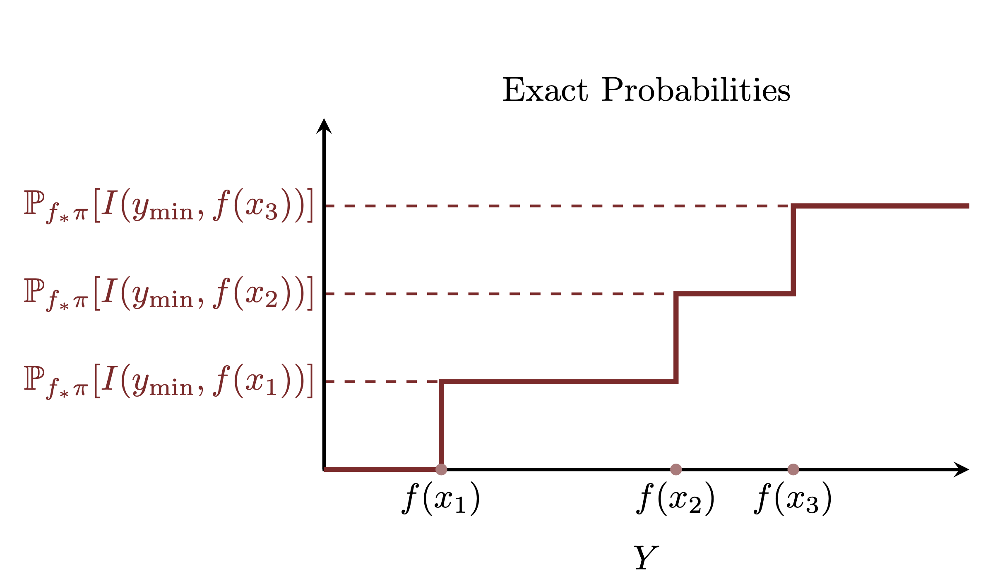

```{r setup, include=FALSE}
knitr::opts_chunk$set(comment=NA)
knitr::opts_knit$set(global.par = TRUE)
```

Probability theory teaches us that the only well-posed way to extract
information from a probability distribution is through expectation values.
Unfortunately computing expectation values from abstract probability
distributions is no easy feat.  In some cases, however, we can readily
approximate expectation values by averaging functions of interest over special
collections of points known as _samples_.  In this case study we carefully
define the concept of a sample from a probability distribution and show how
those samples can be used to approximate expectation values through the Monte
Carlo method.

# Samples

Points in a space and a probability distribution defined over that space are
distinct objects that can't be directly compared.  Certain collections of
points, however, can be constructed to be compatible with a given probability
distribution in a way that allows them to approximate information from that
distribution.  In this section we formally define this notion of consistency
and in doing so formally define the concept of a sample from a probability
distribution.

## Ensembles

A _base_ probability space consisting of the ambient space $X$,
$\sigma$-algebra $\mathcal{X}$, and probability distribution $\pi$ can always be
replicated an arbitrary number of times to construct an _ensemble_ system.

We first replicate the ambient space multiple times, using the integer $n$ to
identify each identical replication, to define the product space
$$
X_{1:N} = X_{1} \times \cdots \times X_{n} \times \cdots \times X_{N},
$$
and the corresponding projection operators that map from the product space to
each component space
$$
\begin{alignat*}{6}
\varpi_{n} :\; &X_{1:N} & &\rightarrow& \; &X_{n}&
\\
&( x_{1}, \ldots, x_{n}, \ldots, x_{N} )& &\mapsto& &x_{n}&.
\end{alignat*}
$$

At the same time we can define a complementary $\sigma$-algebra over this
product space by taking Cartesian products of the measurable sets in each of the
component spaces,
$$
\mathcal{X}_{1:N} = \{
A_{1} \times \cdots \times A_{n} \times \cdots \times A_{N} \mid A_{n} \in \mathcal{X}_{n} \}.
$$
In other words this product $\sigma$-algebra is compatible with the projection
operator -- if $A \in \mathcal{X}_{1:N}$ then
$\varpi_{n}(A) \in \mathcal{X}_{n}$.

Finally we can construct a unique _identical product probability distribution_
with respect to this product $\sigma$-algebra that satisfies
$$
\begin{align*}
\mathbb{P}_{\pi_{1:N}}[A]
&=
\prod_{n = 1}^{N} \mathbb{P}_{\pi_{n}}[ \varpi_{n}(A) ]
\\
&=
\prod_{n = 1}^{N} \mathbb{P}_{\pi}[ \varpi_{n}(A) ].
\end{align*}
$$
A key feature of this product probability distribution is that the expectation
of any function that depends on only one component space,
$f = f \circ \varpi_{n}$, is equal to the expectation with respect to the base
probability distribution,
$$
\begin{align*}
\mathbb{E}_{\pi_{1:N}}[ f ]
&= \mathbb{E}_{\pi_{1:N}}[ f \circ \varpi_{n} ]
\\
&= \mathbb{E}_{\pi}[ f \circ \varpi_{n} ]
\\
&= \mathbb{E}_{\pi}[ f ].
\end{align*}
$$

We will refer to $X_{1:N}$ as an _ensemble space_ and $\pi_{1:N}$ as an
_ensemble probability distribution_, or just _ensemble distribution_ for short.

### Ensemble Averages

A measurable function defined on the base space $f : X \rightarrow \mathbb{R}$
can be lifted to an ensemble space in various ways.  For example we can define
the lifted function $f_{n} = f \circ \varpi_{n}$ that considers only one
component space at a time,
$$
\begin{alignat*}{6}
f_{n} :\; &X_{1:N} & &\rightarrow& \; &\mathbb{R}&
\\
&( x_{1}, \ldots, x_{n}, \ldots, x_{N} )& &\mapsto&
&f \circ \varpi_{n} (x_{1}, \ldots, x_{n}, \ldots, x_{N}) = f(x_{n})&.
\end{alignat*}
$$
By definition the expectation of this lifted function with respect to the
ensemble distribution is equal to the expectation of the initial function with
respect to the base distribution,
$$
\mathbb{E}_{\pi_{1:N}}[ f \circ \varpi_{n} ] = \mathbb{E}_{\pi}[ f ].
$$

We can also lift the base function to _every_ component space and then combine
the results together.  The _ensemble average_ of any function
$f : X \rightarrow \mathbb{R}$ is defined by applying the function to all of the
component spaces and then adding the results together,
$$
\left< f \right>_{1:N} = \frac{1}{N} \sum_{n = 1}^{N} f \circ \varpi_{n},
$$
or more formally,
$$
\begin{alignat*}{6}
\left< f \right>_{1:N} :\; &X_{1:N} & &\rightarrow& \; &\mathbb{R}&
\\
&( x_{1}, \ldots, x_{n}, \ldots, x_{N} )& &\mapsto& &\frac{1}{N} \sum_{n = 1}^{N} f(x_{n})&.
\end{alignat*}
$$

Because expectation is a linear operation the expectation value of the ensemble
average reduces to the expectation of the base function,
$$
\begin{align*}
\mathbb{E}_{\pi_{1:N}}[ \left< f \right>_{1:N} ]
&=
\frac{1}{N} \sum_{n = 1}^{N} \mathbb{E}_{\pi_{1:N}}[ f \circ \varpi_{n} ]
\\
&=
\frac{1}{N} \sum_{n = 1}^{N} \mathbb{E}_{\pi}[ f ]
\\
&=
\frac{1}{N} \cdot N \cdot \mathbb{E}_{\pi}[ f ]
\\
&=
\mathbb{E}_{\pi}[ f ],
\end{align*}
$$
at least when that base expectation $\mathbb{E}_{\pi}[ f ]$ is well-defined.
In other words an expectation of the ensemble average is consistent with the
expectation of the initial function.

To really understand the behavior of the ensemble average, however, we have to
go beyond the expectation value.  If we consider $\left< f \right>_{1:N}$ as a
map from the product space $X_{1:N}$ to the real numbers $\mathbb{R}$ then we
can consider the pushforward of the ensemble distribution over input values
$X_{1:N}$ to the induced distribution over output values in $\mathbb{R}$,
$(\left< f \right>_{1:N})_{*} \pi_{1:N}$.

<center>
<br>
```{r, out.width = "100%", echo=FALSE}

```
<br><br>
</center>

### The Law of Large Numbers

One way to characterize the pushforward distribution along the ensemble average
is through its cumulants.  The mean of the pushforward distribution is the
expectation of the ensemble average, which we just calculated,
$$
\begin{align*}
\mathbb{M}_{\pi_{1:N}} [ \left< f \right>_{1:N} ]
&= \mathbb{E}_{\pi_{1:N}}[ \left< f \right>_{1:N} ]
\\
&= \mathbb{E}_{\pi}[ f ].
\end{align*}
$$

Through some straightforward but messy algebra we can also show that the
variance of the ensemble average is the variance of the base function scaled by
a factor of $N$,
$$
\begin{align*}
\mathbb{V}\pi_{1:N}[ \left< f \right>_{1:N} ]
&=
\mathbb{E}_{\pi_{1:N}}[ (\left< f \right>_{1:N})^{2} ]
- \left( \mathbb{E}_{\pi_{1:N}}[ \left< f \right>_{1:N} ] \right)^{2}
\\
&=
\frac{1}{N} \left( \mathbb{E}_{\pi}[ f^{2} ]
- \left( \mathbb{E}_{\pi}[ f ] \right)^{2} \right)
\\
&=
\frac{\mathbb{V}_{\pi}[f]}{N},
\end{align*}
$$
whenever $\mathbb{V}_{\pi}[f]$ is well-defined.  This pattern continues to
higher-order cumulants as well: if the $k$-th order cumulant of $f_{*} \pi$ is
well-defined then the $k$th-order cumulant of
$(\left< f \right>_{1:N})_{*} \pi_{1:N}$ is scaled by $k$ factors of $N$,
$$
\mathbb{C}_{k}[ \left< f \right>_{1:N} ] = \frac{\mathbb{C}_{k}}{N^{k}}.
$$

Because of this scaling  the higher-order cumulants of the ensemble average
become more negligible as the size of the ensemble $N$ grows, at least provided
that the corresponding cumulants of the base function are well-defined.  In the
limit of an infinite ensemble all of the cumulants except the mean vanish
exactly, and all of the pushforward probability is allocated to ensemble
averages exactly equaling that expectation value.  More formally we say that the
pushforward distribution of ensemble average _converges_ to a Dirac
distribution,
$$
\lim_{N \rightarrow \infty} (\left< f \right>_{1:N})_{*} \pi_{1:N}
= \delta_{\mathbb{E}_{\pi}[f]},
$$
where the Dirac distribution over the real numbers is defined as
$$
\delta_{y}[R] =
\left\{
\begin{array}{rr}
1, & y \in A \\
0, & y \notin A
\end{array}
\right., \forall A \in \mathcal{B}(\mathbb{R}).
$$
This convergence of the pushforward distribution is known as the
_strong law of large numbers_.

### The Central Limit Theorem

The law of large numbers determines to what the pushforward of the ensemble 
distribution along an ensemble average function will converge, but we can also 
characterize _how_ it will converge asymptotically.  If the pushforward mean and 
variance are well-defined then the pushforward probability density function 
will converge to a normal probability density function after an appropriate 
shift and scaling,
$$
\lim_{N \rightarrow \infty}
\frac{ (\left< f \right>_{1:N})_{*} \pi_{1:N}(y) - \mathbb{E}_{\pi}[f] }
{ \sqrt{ \mathbb{V}_{\pi}[f] / N } }
=
\text{normal} ( y \mid 0, 1 ).
$$
This asymptotic behavior is known as a _central limit theorem_.

If the third cumulant of the pushforward distribution is also well-behaved then
the central limit theorem also approximately holds preasymptotically.  For large 
but finite $N$ we have
$$
(\left< f \right>_{1:N})_{*} \pi_{1:N}(y) =
\text{normal} \left( y \mid \mathbb{E}_{\pi}[f], \sqrt{ \frac{\mathbb{V}_{\pi}[f]}{N} } \right)
+ \mathcal{O}(N^{-\frac{3}{2}}).
$$
This preasymptotic characterization of the pushforward distribution is far more 
useful than the asymptotic characterizations in practical circumstances where 
infinity is _just_ out of reach.

In this case we can characterize the convergence of the pushforward distribution
for all ensemble sizes $N$.  Initially the pushforward distribution is 
characterized by all of the pushforward cumulants, but as $N$ grows the mean 
and variance quickly being to dominate and the pushforward probability density 
function becomes approximately normal.  As $N$ continues to grow the variance 
narrows and this normal approximation converges to the limiting Dirac 
distribution.

<center>
<br>
```{r, out.width = "100%", echo=FALSE}

```
<br><br>
</center>

## Asymptotically Consistent Sequences

In the previous section we considered the behavior of the ensemble average in
infinitely large ensemble spaces.  Now let's consider what we can say about the
elements of these spaces.

Any point in the ensemble space $X_{1:N}$ is given by a sequence of points in
each of the component spaces,
$$
x_{1:N} = (x_{1}, \ldots, x_{n}, \ldots, x_{N}) \in X_{1:N}.
$$
Evaluating the ensemble average on this point then yields a particular real
value,
$$
\left< f \right>_{1:N} (x_{1:N})
=
\left< f \right>_{1:N} (x_{1}, \ldots, x_{n}, \ldots, x_{N})
\in \mathbb{R}.
$$

<center>
<br>
```{r, out.width = "75%", echo=FALSE}

```
<br><br>
</center>

The same construction holds in the infinite case.  All elements of the infinite
ensemble space are given by a countably infinite sequence of points,
$$
(x_{1}, \ldots, x_{n}, \ldots) \in \lim_{N \rightarrow \infty} X_{1:N}.
$$
Similarly the ensemble average evaluated over an infinitely long sequence
converges to some real value,
$$
\lim_{N \rightarrow \infty} \left< f \right>_{1:N} (x_{1:N})
=
\lim_{N \rightarrow \infty} \frac{1}{N} \sum_{n = 1}^{N} f(x_{n}) \in \mathbb{R},
$$
whenever the limit is well-defined.

An arbitrary element of the infinite ensemble space will not, in general, have
any relation to an ensemble distribution defined over that space, but some
special elements might.  In particular if the limiting value of the ensemble
average over an element equals the corresponding expectation value,
$$
\lim_{N \rightarrow \infty} \frac{1}{N} \sum_{n = 1}^{N} f(x_{n}) = \mathbb{E}_{\pi}[f],
$$
then that ensemble element recovers the exact same value to which the pushforward
distribution along the corresponding ensemble average converges!  If this
limiting behavior holds for _all_ well-behaved functions
$f : X \rightarrow \mathbb{R}$ then this ensemble element encodes the exact same 
information as $\pi$!  We will refer to these sequences as 
_asymptotically consistent_ with $\pi$.

<center>
<br>
```{r, out.width = "75%", echo=FALSE}

```
<br><br>
</center>

This consistency immediately implies that an asymptotically consistent sequence
has to satisfy certain _frequency_ properties.  For example consider a
measurable set $A \in \mathcal{X}$ which is allocated probability
$p = \mathbb{P}_{\pi}[A]$.  Because probabilities are expectations of indicator
functions we can also write this as
$$
p = \mathbb{P}_{\pi}[A] = \mathbb{E}_{\pi}[ \mathbb{I}_{A} ]
$$
where
$$
\mathbb{I}_{A}[x] =
\left\{
\begin{array}{rr}
1, & x \in A \\
0, & x \notin A
\end{array}
\right.
$$
A sequence asymptotically consistent with this distribution then satisfies
$$
\begin{align*}
p
\\
&= \mathbb{P}_{\pi}[A]
\\
&= \mathbb{E}_{\pi}[ \mathbb{I}_{A} ]
\\
&=
\lim_{N \rightarrow \infty} \frac{1}{N} \sum_{n = 1}^{N} \mathbb{I}_{A}(x_{n})
\\
&=
\lim_{N \rightarrow \infty} \frac{N[A]}{N},
\end{align*}
$$
where
$$
N[A] = \sum_{n = 1}^{N} \mathbb{I}_{A}(x_{n}).
$$
In words exactly $100 \cdot p \%$ of the points in the asymptotically consistent
sequence must fall into $A$.  Points $x \in X$ in neighborhoods of higher
probability must appear more frequently in a compatible asymptotic sequence than
points in neighborhoods of small probability.

<center>
<br>
```{r, out.width = "75%", echo=FALSE}

```
<br><br>
</center>

While not every element of the infinite ensemble
$(x_{1}, \ldots, x_{n}, \ldots)$ will be compatible with a given base
probability distribution, in general there will be infinitely many elements that
are.  Because all of these asymptotically consistent sequences share the same
relative frequency of component points they can _loosely_ be interpreted as
different orderings of some common, infinite population of points in $X$ that
contains the same information as the base distribution $\pi$.  That said we have
to take care with such an interpretation as it involves a lot of finicky
infinities!

## Preasymptotically Consistent Sequences {#sec:pre_consistent}

Because of our unfortunate limitation to finite computation, we can't actually
construct any infinitely long sequences of points, let alone sequences that are
asymptotically consistent with a given probability distribution of interest.
In practice we need _finite_ sequences that are consistent with a given
probability distribution in some way.

Towards that end consider selecting $N$ points from an asymptotically consistent
sequence, $(x_{1}, \ldots, x_{n}, \ldots)$.  From the mathematically-casual
perspective that an asymptotically consistent sequence is an ordering of some
latent population of points, this selection is equivalent to _sampling_
individuals from that population.  Although we have to be careful not to take
this analogy too far, we will use it to motivate some terminology.  We denote
any selection of $N$ points from an asymptotically consistent sequence as a
_sample_ of size $N$.

If the infinite population contains the same information as $\pi$ then we might
hope that a finite sample will contain enough information to _approximate_ 
$\pi$.
Unfortunately this is only the case for certain very special sequences.

For a fixed sample size $N$ there are a countably infinite number of possible
samples from an infinitely long sequence.  Let's label each of these samples
with the integer $s$, and the corresponding points with
$$
(x_{\sigma_{s}(1)}, \ldots, x_{\sigma_{s}(n)}, \ldots, x_{\sigma_{s}(N)}).
$$
For example if $N = 3$ then
$$
\sigma_{1}(1) = 1, \sigma_{1}(2) = 2, \sigma_{1}(3) = 3
$$
would define one possible sample.

<center>
<br>
```{r, out.width = "100%", echo=FALSE}
knitr::include_graphics("figures/samples/samples.png")
```
<br><br>
</center>

A function $g : X_{1:N} \rightarrow \mathbb{R}$ can be applied to any of these
samples, yielding the value
$$
g(x_{\sigma_{s}(1)}, \ldots, x_{\sigma_{s}(n)}, \ldots, x_{\sigma_{s}(N)})
\in \mathbb{R}.
$$
If the average function value over all possible samples of size $N$ equals the
corresponding joint expectation value,
$$
\lim_{S \rightarrow \infty} \frac{1}{S} \sum_{s = 1}^{S}
g(x_{s(1)}, \ldots, x_{s(n)}, \ldots, x_{s(N)}) = \mathbb{E}_{\pi_{1:N}}[g],
$$
for all well-behaved functions $g$ then this collection of finite samples
contains the same information as the independent product distribution
$\pi_{1:N}$.  When this consistency holds not only for all functions $g$ but
also for all finite sample sizes $N$ then we say that the sequence is not only
asymptotically consistent but also _preasymptotically consistent_.  Likewise a
finite sample from a preasymptotically consistent sequence defines a sample from
the corresponding probability distribution $\pi$.

Once again this consistency implies certain frequency properties that a
compatible sequence must satisfy.  For example if the measurable set
$A \in \mathcal{X}_{1:N}$ is allocated probability
$p = \mathbb{P}_{\pi_{1:N}}[A]$ then
$$
\begin{align*}
\lim_{S \rightarrow \infty} \frac{1}{S} \sum_{s = 1}^{S}
\mathbb{I}_{A}(x_{s(1)}, \ldots, x_{s(n)}, \ldots, x_{s(N)})
&= \mathbb{E}_{\pi_{1:N}}[ \mathbb{I}_{A} ]
\\
&= \mathbb{P}_{\pi_{1:N}}[A]
\\
&= p.
\end{align*}
$$
Consequently exactly $100 \cdot p \%$ of the possible samples of size $N$
contained in that sequence must fall into $A$.  Samples
$(x_{1}, \ldots, x_{n}, \ldots, x_{N}) \in X_{1:N}$ in neighborhoods of higher
product probability must appear more frequently in a preasymptotically consistent
sequence than samples in neighborhoods of smaller joint probability.

A joint function $g : X_{1:N} \rightarrow \mathbb{R}$ of particular interest is
the ensemble average of some base function $f: X \rightarrow \mathbb{R}$,
$\left< f \right>_{1:N} (x_{1:N})$.  By definition the average value of
$\left< f \right>_{1:N} (x_{1:N})$ over the collection of finite samples of
size $N$ is just the expectation of $f$,
$$
\begin{align*}
\lim_{S \rightarrow \infty} \frac{1}{S} \sum_{s = 1}^{S}
\left< f \right>_{1:N}(x_{s(1)}, \ldots, x_{s(n)}, \ldots, x_{s(N)})
&= \mathbb{E}_{\pi_{1:N}}[ \left< f \right>_{1:N} ]
\\
&= \frac{1}{N} \sum_{n = 1}^{N} \mathbb{E}_{\pi_{1:N}}[ f \circ \varpi_{n} ]
\\
&= \frac{1}{N} \sum_{n = 1}^{N} \mathbb{E}_{\pi}[ f ]
\\
&= \frac{1}{N} \cdot N \cdot \mathbb{E}_{\pi}[ f ]
\\
&= \mathbb{E}_{\pi}[ f ].
\end{align*}
$$
Even more the frequency of particular ensemble average values over this
collection is determined by the pushforward of the finite ensemble distribution
along the ensemble average function, $(\left< f \right>_{1:N})_{*} \pi_{1:N}$.
For example if the interval of possible average values
$\Delta f \subset \mathbb{R}$ is allocated probability
$p = \mathbb{P}_{(\left< f \right>_{1:N})_{*} \pi_{1:N}}[\Delta f]$ then exactly
$100 p \%$ of samples will yield ensemble average values in $\Delta f$.

This quantification then provides a path towards approximating a probability
distribution.  If we can generate any finite subset of a preasymptotically
consistent sequence,
$$
(x_{1}, \ldots, x_{n}, \ldots, x_{N})
$$
then the pushforward distribution $(\left< f \right>_{N})_{*} \pi_{1:N}$ will
quantify how accurately an ensemble average evaluated over that sequence,
$$
\left< f \right>_{1:N} (x_{1}, \ldots, x_{n}, \ldots, x_{N}),
$$
recovers the corresponding expectation value $\mathbb{E}_{\pi}[ f ]$.  We will
return this approach in [Section 3](#sec:monte_carlo) once we consider how to
generate these samples in the first place.

## Transformation Properties of Consistent Sequences

Before discussing how to construct a preasymptotically consistent sequence let's
consider how they transform.  Recall that if $\phi : X \rightarrow Y$ is a
measurable transformation from the initial ambient space $X$ to some new ambient
space $Y$ then a probability distribution $\pi$ over $X$ defines a corresponding
pushforward probability distribution $\phi_{*} \pi$ over $Y$.

The expectation value of any function on the transformed space,
$g : Y \rightarrow \mathbb{R}$, can be computed with respect to either
probability distribution,
$$
\mathbb{E}_{\pi}[g \circ \phi] = \mathbb{E}_{\phi_{*} \pi}[g].
$$
This immediately implies that if $(x_{1}, \ldots, x_{n}, \ldots)$ is a sequence
that is asymptotically consistent with $\pi$ then
$$
\begin{align*}
\mathbb{E}_{\phi_{*} \pi}[g]
&=
\mathbb{E}_{\pi}[g \circ \phi]
\\
&=
\lim_{N \rightarrow \infty} \left< g \circ \phi \right>_{1:N} (x_{1:N})
\\
&=
\lim_{N \rightarrow \infty} \frac{1}{N} \sum_{n = 1}^{N} g \circ \phi(x_{n})
\\
&=
\lim_{N \rightarrow \infty} \frac{1}{N} \sum_{n = 1}^{N} g(y_{n})
\\
&=
\lim_{N \rightarrow \infty} \left< g \right>_{1:N} (y_{1:N}).
\end{align*}
$$
In other words
$$
(y_{1} = \phi(x_{1}) \ldots, y_{n} = \phi(x_{n}), \ldots)
$$
generates a sequence that is asymptotically consistent with the pushforward
distribution!  Consequently any asymptotically consistent sequence on $X$
defines an asymptotically consistent sequence on $Y$ simply by transforming each
component point one by one.

Because asymptotically consistent sequences transform (vary) in exactly the same
way (co) as points the ambient space, they are said to transform _covariantly_.
By their definition so too do preasymptotically consistent sequences and any
finite sample.  Contrast this to, say, a probability density function
representation which does not transform covariantly but instead requires careful
Jacobian determinant corrections and analytic integrations when transformed to a
new space.  This ability to easily transform samples between different spaces
makes them an especially effective way to approximate a probability distribution
in practice.

When $\phi$ is a projection function this transformation property allows us to
transform samples from a joint distribution to samples from a marginal
distribution.  For example let $X$ be a product space, $X = Y \times Z$ with
points $x = (y, z)$ and projection operator $\varpi_{Y} : X \rightarrow Y$.  If
$$
( x_{1}, \ldots, x_{N})
=
( (y_{1}, z_{1}), \ldots, (y_{N}, z_{N}) )
$$
is a sample from $\pi$ then
$$
( \varpi_{Y}(x_{1}), \ldots, \varpi_{Y}(x_{N}) )
=
( \varpi_{Y}(y_{1}, z_{1}), \ldots, \varpi_{Y}(y_{N}, z_{N}) )
=
\{ y_{1}, \ldots, y_{N} \}
$$
is a sample from $(\varpi_{Y})_{*} \pi$.

<center>
<br>
```{r, out.width = "66%", echo=FALSE}
knitr::include_graphics("figures/marginal_samples/marginal_samples.png")
```
<br><br>
</center>

Unfortunately constructing samples from a _conditional distribution_ is nowhere
near as straightforward.  The only samples from the joint space that yield valid
samples from a given conditional distribution are those that happen to fall
_exactly_ on the corresponding fiber.  The probability that any points from a
finite sample will fall on a fixed fiber is vanishingly small on continuous
spaces.

<center>
<br>
```{r, out.width = "100%", echo=FALSE}

```
<br><br>
</center>

In other words samples from a joint probability distribution can be immediately
marginalized but they cannot be conditioned.  If we want to generate samples
from a conditional distribution in practice then we usually need to construct
the conditional distribution first and then generate samples directly from that
probability distribution.

# Random Number Generators

Asymptotically and preasymptotically consistent sequences have the potential to
be very useful in practice, but so far we have only defined how these sequences
behave and not any explicit ways in which we can generate them.  Indeed the
generation of these sequences is a challenging and mostly heuristic endeavor.

Consider a process which incrementally generates sequences of points in $X$ and,
hypothetically, can be run long enough until those sequences become infinitely
long.  If _all_ of the sequences that such a process can generate are
asymptotically consistent with a given probability distribution then we'll
define it to be a _sampling mechanism_ for that distribution.  In general such a
process is capable of generating many different asymptotically consistent
sequences, in which case we refer to each different sequence as a _realization_.

In practice we can only ever run a sampling mechanism for only a finite time, and
consequently we will only ever be able to work with finite samples from the
asymptotically consistent sequences that it is capable of generating.  For these
samples to be useful we need those sequences to be not only asymptotically
consistent but also preasymptotically consistent.

One interesting property of preasymptotically consistent sequences is that it is
difficult to predict later points in the sequence given only information about
previous states.  If we don't know how the sampling mechanism is generating
points then the only constraints we have on its behavior are its defining
preasymptotic properties.  Those properties, however, imply that frequency
behavior of later points is independent of previous points; knowing the realized
values of the points $(x_{1}, \ldots, x_{n}, \ldots, x_{N})$ doesn't tell us
anything about how $x_{N + 1}$ will behave.  Another way of thinking about this
is that there are an infinite number of preasymptotically consistent sequences
with the same initial values $(x_{1}, \ldots, x_{n}, \ldots, x_{N})$, and if we
don't know which sequence is being generated then the only information we have
on $x_{N + 1}$ and later is quantified by $\pi$.

<center>
<br>
```{r, out.width = "75%", echo=FALSE}

```
<br><br>
</center>

Because of this limited predictability preasymptotically consistent sequences
are also known as _random numbers_, and a sampling mechanism that generates
preasymptotically consistent sequences is known as a _random number generator_.

Perhaps the biggest conceptual and practical difficulty with samples is that a
given probability distribution does not define any particular sampling
mechanisms.  In general there could be many different ways in which we can
theoretically generate random numbers, and typically only a few if any will be
practically implementable.  Moreover we can rarely prove that a particular
sampling mechanism will generate sequences that are consistent with a given
probability distribution.  In practice we typically have to _hypothesize_ that a
sampling mechanism generates random numbers and then _empirically_ verify
consistency for as many finite sequences as we can.

## Physical Random Number Generators

A common speculation is that random numbers can be generated from observations
of some _physical systems_, such as the chaotic variations of an electronic
current or the measurement of a quantum mechanical system.  Because we can never
observe such a static physical system infinitely long, however, we can never
completely verify that the frequency behavior of such measurements are
consistent with _a_ probability distribution, let alone identify with _which_
probability distribution they are consistent.

The probabilistic nature of a physical system is an _assumption_ that we have to
make and then verify empirically by observing the system for as long as we can.
This verification in challenging, and indeed many systems that appear
unpredictable over short sequences manifest distinct patterns over longer
sequences that invalidates preasymptotic consistency with any probability
distribution.  Physical sampling mechanisms can be useful in practice but we
have to remain ever vigilant.

If we assume that a physical system is probabilistic, in other words that
repeated observations generate preasymptotically consistent sequences, then its
behavior is completely quantified by the corresponding probability distribution.
In particular _any_ random number generator consistent with that distribution
will generate sequences _indistinguishable_ from repeated observations of that
system, even if the generator itself is completely independent of that system.
These auxiliary random number generators are then said to _simulate_ the
physical system, with each realized sequence known as a _simulation_.  Indeed
simulation is increasingly used interchangeably with random number generation
even in the context of a probability distribution without any particular
physical interpretation.

Once we consider physical random number generators a natural question is
whether we can use the repeated output of physical systems to _define_
probability distributions entirely, offering an objective derivation of
probability theory.  This _frequentist_ perspective on probability theory
motivated many early thinkers, from Jacob Bernoulli to John Venn and Richard
von Mises, but ultimately they were all thwarted by philosophical and
mathematical problems.  On the philosophical side we can never repeatedly
observe the exact same physical system an infinite number of times -- either the
physical system itself will wear under the repeated observations or we the
observer will -- and limiting frequencies will always be a mathematical
abstraction.  At the same time it turns out that not all sequences with the
right frequency properties will actually yield preasymptotically consistent
sequences.  In order to consistently define a probability distribution from
sequences we have to be able to carefully identify and remove misbehaving
sequences.  For a thorough discussion of this history see @DiaconisEtAl:2017.

Ultimately probability theory is best defined axiomatically, as we did in my
[probability theory case study](https://betanalpha.github.io/assets/case_studies/probability_theory.html).
Once we define a probability distribution in this way we can look for physical
systems that generate empirically consistent sequences without having to worry
about whether those sequences are enough to fully define that distribution.

## Pseudo-Random Number Generators

As compelling as physical random number generators might be, it would be much
easier to work with _deterministic algorithms_ than unpredictable physical
systems.  Algorithms are not only easier to implement in practice but also offer
the possibility of reproducible results that allow us to follow up on any odd
behavior observed in any particular realized sample.

A _pseudo-random number generator_ is a deterministic algorithm that iteratively
generates sequences from some initial _seed_ configuration. Although the
iterative updates are deterministic they can be designed to be as chaotic as
possible to minimize correlations between successive points.  If we ignore the
exact updating mechanism then these sequences might _approximate_
preasymptotically consistent sequences well enough for probabilistic
computation.  For much more on the design and implementation of pseudo-random
number generators see for example @Devroye:1986 and @ONeill:2014.

### Validating Pseudo-Random Number Generators

While formal mathematics can be used to motivate certain techniques for
designing productive pseudo-random number generators, the verification of any
pseudo-random number generator has to be implemented empirically.  Test suites
such as the NIST STS [@NISTSTS:2020], TestU01 [@LEcuyerEtAl:2007], and PractRand
[@DotyHumphrey:2021] evaluate the behavior of long sequences of pseudo-random
numbers for any behavior that deviates from that expected of preasymptotically
consistent sequences.  These tests can never prove that a pseudo-random number
generator is preasymptotically consistent, but they are sufficient for most
probabilistic computation applications where we don't care so much about
randomness but rather expectation value approximation.

One limitation of even the best pseudo-random number generators is that they
approximate preasymptotic consistent sequences up to only some maximum sample
size.  Past some _period_ the sequences start to repeat, and samples become more
and more correlated.  The longer this period the larger the samples that a
pseudo-random number generator can reliably produce, and the more precisely it
can approximate a preasymptotically consistent sampling mechanism.

### Seeding Pseudo-Random Number Generators

Seeding a pseudo-random number generator with a specific configuration fixes the
output, allowing for the _same_ sequence to be generated on the same computing
setup.  This allows us to, for example, exactly replicate a previous analysis
and investigate any potentially pathological behavior that might have arisen.
One of the most unsettling analysis results is ghostly behavior that we are
unable to recreate and explore, leaving only the memory to haunt us.

That said even with a fixed seed configuration a pseudo-random number generator
may not be exactly reproducible across _different_ computing setups.  Any
changes to the hardware, operating system, or program execution can influence
the precise implementation of floating-point arithmetic which can then influence
the implementation of pseudo-random number generators on continuous spaces.
Indeed the more chaotic the updates, and the better the pseudo-random number
generator approximates preasymptotically consistent sequences, the more of an
effect differences in floating point arithmetic can have!  Fortunately these
implementation differences do not typically compromise the consistency
properties of pseudo-random number generators, just the exact reproducibility.

The empirical validation pseudo-random number generators is typically focused on
the behavior of points sampled _within_ particular sequences.  This validation,
however, does not guarantee that points sampled _across_ different sequences
will be as well-behaved.  In particular the sequences generated from two
different seed configurations can be surprisingly correlated if those seed
configurations are not sufficiently distinct.

Programming folklore suggests that pseudo-random number generators are seeded
with a single large integer.  The initial seed configurations of many
pseudo-random generators, however, are much larger than a single integer;
instead they might be fully specified with only the equivalent of _hundreds_ of
large integer values if not more.  In this case two seed configurations
resulting from any two integers can be much more similar than one might naively
expected.

Because of these potential seeding issues the best practice for most
pseudo-random number generators is to generate samples by extending a single,
long sequence from one particular seed configuration.  If samples are needed in
parallel then the samples can be pulled from distant regions of this sequence
[@ONeill:2014, @LEcuyer:2015]

<center>
<br>
```{r, out.width = "100%", echo=FALSE}

```
<br><br>
</center>

### Adapting Pseudo-Random Number Generators to Target Distributions

The most common pseudo-random number generators are designed for simple target
distributions, such as a Bernoulli distribution over $[0, 1]$, a uniform
distribution over a set of integers, $[0, 1, \ldots, K]$, or the unit real
interval $(0, 1) \in \mathbb{R}$.  In some cases pseudo-random number generators
for more sophisticated distributions can be derived by appropriately
transforming these base generators.

Consider a probability distribution $\pi$ defined over a one-dimensional,
ordered space $X$.  In this case any point $x \in X$ defines a corresponding
interval,
$$
I(x_{\text{min}}, x ) \subset X
$$
with the corresponding probability $\mathbb{P}_{\pi}[I(x_{\text{min}}, x )]$.

The cumulative distribution function maps each point to this corresponding
probability,
$$
\begin{alignat*}{6}
\Pi :\; &X& &\rightarrow& \; &[0, 1] \subset \mathbb{R}&
\\
&x& &\mapsto& &\mathbb{P}_{\pi}[I(x_{\text{min}}, x )]&.
\end{alignat*}
$$
Pushing $\pi$ forward through this cumulative distribution function results in
a uniform probability distribution over the unit real interval with
probability density function
$$
\Pi_{*} \pi(y) =
\left\{
\begin{array}{rr}
1, &  0 \le y \le 1 \\
0, & \text{else}
\end{array}
\right. .
$$

Likewise the inverse cumulative distribution function, also known as the
_quantile function_,
$$
q(p) = \Pi^{-1}(p),
$$
pushes forward the uniform distribution over the unit real interval $\upsilon$ 
back to the target distribution $\pi$,
$$
q_{*} \upsilon = \pi.
$$

Consequently if we can generate a sample from the uniform distribution over the
unit real interval
$$
( y_{1}, \ldots, y_{N} )
$$
then
$$
( \Pi^{-1}(y_{1}), \ldots, \Pi^{-1}(y_{N}) )
$$
will be a sample from $\pi$.

<center>
<br>
```{r, out.width = "75%", echo=FALSE}
knitr::include_graphics("figures/inverse_cdf_sampling/inverse_cdf_sampling.png")
```
<br><br>
</center>

Once we have a pseudo-random number generator for the real interval $(0, 1)$ we
can immediately construct pseudo-random number generators for any probability
distribution defined over a one-dimensional, ordered space, such as the real
line or the integers, provided that we can evaluate its quantile function.  In
practice evaluating the quantile function can be excessively costly, and most
high-performance pseudo-random number generators for non-uniform distributions
are based on more efficient transformations of uniform samples.  This quantile
function approach, however, can be a helpful tool when working with bespoke
distributions.

### Pseudo-Random Numbers in R

Let's explore some of the basic properties of pseudo-random number generators in
`R`.  We begin by setting up our local environment.

```{r}
c_light <- c("#DCBCBC")
c_light_highlight <- c("#C79999")
c_mid <- c("#B97C7C")
c_mid_highlight <- c("#A25050")
c_dark <- c("#8F2727")
c_dark_highlight <- c("#7C0000")

par(family="CMU Serif", las=1, bty="l", cex.axis=1, cex.lab=1, cex.main=1,
    xaxs="i", yaxs="i", mar = c(5, 5, 3, 5))
```

The default pseudo-random number generator in `R` a _Mersenne twister_
[@MatsumotoEtAl:1998].  The twistor exploits a very large latent state, over 600
integers long, to generate high quality pseudo-random numbers over very long
periods.

Our first step is to seed the pseudo-random number generator.  Following typical
practice we set our seed with a single integer, but keep in mind how little of
the Mersenne twister latent state a single integer covers!  When using a single
sequence this is usually not problematic, but it can lead to surprising behavior
when multiple sequences are being compared.

```{r}
set.seed(9958284)
```

Once the generator is initialized we can start to generate pseudo-random
numbers.  `R` wraps the base psuedo-random number generator in algorithms
capable of generating pseudo-random numbers from a variety of different
distributions, most of them one-dimensional.  For example we can generate a
preasymptotically compatible sequence from a uniform distribution over the
unit real interval.

```{r}
s1 <- runif(20, 0, 1)

plot(1:20, s1, col=c_dark, pch=16, cex=0.8,
     xlim=c(0, 21), xlab="Iteration", ylim=c(0:1), ylab="X")
```

Calling the same function again continues the sequence from the last state of the
pseudo-random number generator.

```{r}
s2 <- runif(20, 0, 1)

plot(1:20, s1, col=c_light, pch=16, cex=0.8,
     xlim=c(0, 41), xlab="Iteration", ylim=c(0:1), ylab="X")
points(21:40, s2, col=c_dark, pch=16, cex=0.8)
```

Both sequences define samples of size 20, and their concatenation defines a
sample of size 40.  Any subset of that concatenated sequence also defines
samples of smaller size.

```{r}
iter <- 1:40
s <- c(s1, s2)

subset_idx <- list(c(1, 5, 9), c(39, 37, 35), c(20, 30, 10), c(11, 12, 13))

par(mfrow=c(2, 2))

for (n in 1:4) {
  plot(iter, s, col=c_light, pch=16, cex=0.8,
       xlim=c(0, 41), xlab="Iteration", ylim=c(0:1), ylab="X")
  points(iter[subset_idx[[n]]], s[subset_idx[[n]]], col=c_dark, pch=16, cex=0.8)
}
```

Each pseudo-random number generator call, no matter the target distribution,
increments the state of the same base pseudo-random number generator; the base
pseudo-random numbers are just transformed in different ways to conform to the
target distribution.

```{r}
par(mfrow=c(1, 1))

sg <- rnorm(20, 0, 1)

plot(1:20, sg, col=c_dark, pch=16, cex=0.8,
     xlim=c(0, 21), xlab="Iteration", ylim=c(-3, 3), ylab="X")
```

Resetting the seed returns the pseudo-random number generator to its initial
state where it generates the exact same values as before.  This allows us to
exactly reproduce any analysis that uses these values, at least when restricted
to exact same computing environment.

```{r}
set.seed(9958284)

s1_repeat <- runif(20, 0, 1)

plot(s1, s1_repeat, col=c_dark, pch=16, cex=0.8,
     xlim=c(0, 1), xlab="Initial Samples", ylim=c(0:1), ylab="Repeated Samples (Same Seed)")
```

By setting a different seed we can coerce the pseudo-random number generator to
generate different values.

```{r}
set.seed(8675309)

s1_repeat <- runif(20, 0, 1)

plot(s1, s1_repeat, col=c_dark, pch=16, cex=0.8,
     xlim=c(0, 1), xlab="Initial Samples", ylim=c(0:1), ylab="Repeated Samples (Different Seed)")
```

That said we have to keep in mind that, while the sequences resulting from two
different seeds will be different, we have no guarantee that their frequency
properties will be compatible with each other.

# Approximating Probability Distributions with Samples {#sec:monte_carlo}

Because we can recover any well-defined expectation value as an ensemble average
over any asymptotically consistent sequence, these sequences contain exactly the
same information as the corresponding probability distribution.
Preasymptotically consistent sequences allow us to not only approximate 
expectation values with ensemble averages over only finite samples but also 
quantify the error of that approximation with the pushforward distribution along 
the ensemble average function.  The _Monte Carlo method_ appeals to the central 
limit theorem to approximate that pushforward distribution and, consequently, 
this error quantification.

This approach provides a general way to estimate the expectation values of any
probability distribution for which we can generate pseudo-random numbers.  In
this sense samples are the _instrument_ with which we can readily _practice_
much of probability theory, not only implementing probabilistic analyses but
also building intuition and understanding about probability theory itself.  In
this section we'll review the Monte Carlo estimation process and apply it to the
investigation of the pushforward distribution of some function of interest.

## The Monte Carlo Method

As we discussed in [Section 1.3](#sec:pre_consistent) the frequency behavior of
the collection of samples of size $N$ taken from a preasymptotically consistent
sequence is characterized by the independent product distribution $\pi_{1:N}$.
At the same time the frequency behavior of ensemble average function evaluated
over those samples is characterized by the pushforward distribution
$(\left< f \right>_{N})_{*} \pi_{1:N}$.

Although $\pi_{1:N}$ is straightforward to construct in practice the pushforward
distribution $(\left< f \right>_{N})_{*} \pi_{1:N}$ is much more challenging.
Fortunately if $N$ is large enough then we can appeal to the central limit
theorem: for any fixed $N$ the probability density function for the pushforward 
distribution is approimately normal,
$$
(\left< f \right>_{1:N})_{*} \pi_{1:N}(y)
=
\text{normal} \left( y \mid \mathbb{E}_{\pi}[f], \sqrt{ \frac{\mathbb{V}_{\pi}[f]}{N} } \right)
+ \mathcal{O}(N^{-\frac{3}{2}}).
$$
When those higher-order terms are negligible, which typically requires only
$N \approx 10$ or so, we can quantify the variation in the possible ensemble
average evaluations with a normal probability density function.  In other words
we can use $\left< f \right>_{1:N}(x_{1}, \ldots, x_{N})$ to _approximate_
$\mathbb{E}_{\pi}[f]$ with the probabilistic _standard error_
$$
\text{MC-SE}[f] = \sqrt{ \frac{ \mathbb{V}_{\pi}[f] }{N} }.
$$
The larger the sample size $N$ and the smaller the variance of the expectand,
$\mathbb{V}_{\pi}[f]$, the more precise the estimation will be.  The slow
$\sqrt{N}$ decrease in the error isn't ideal, but given how challenging it is to
estimate expectation values at all this is still a slightly miraculous result.

Using the ensemble averages evaluated on a sample from a preasymptotically
consistent sequence to estimate expectation values is known as the _Monte Carlo
method_ [@MetropolisEtAl:1949].  In this context the evaluated ensemble average
is denoted a _Monte Carlo estimator_ and $\text{MC-SE}[f]$ is denoted the
_Monte Carlo standard error_.

The only remaining obstruction is that if we can't evaluate the target
expectation value $\mathbb{E}_{\pi}[f]$ then we also probably can't evaluate
the expectation $\mathbb{V}_{\pi}[f]$ either, and the error quantification
promised by the central limit theorem is out of practical reach.  If
$\mathbb{E}_{\pi}[f^{4}]$ is well-defined, however, then we can estimate the
variance, and hence the Monte Carlo standard error, using _another_ Monte Carlo
estimator.  This estimator approximation introduces an error proportional to
$N^{-2}$, but that is exactly the order of the central limit theorem
approximation itself.  In other words the difference between the Monte Carlo
standard error and the estimated Monte Carlo standard error is negligible
whenever we assume that the central limit theorem itself is sufficiently
accurate!

The Monte Carlo estimator can also be interpreted as the sample mean of the
corresponding function values,
$$
\begin{align*}
\left< f \right>_{1:N}(x_{1}, \ldots, x_{N})
&=
\\
&=
\frac{1}{N} \sum_{n = 1}^{N} f(x_{n})
\\
&= \hat{\mu}[f](x_{1}, \ldots, x_{N}),
\end{align*}
$$
with the estimated Monte Carlo standard error proportional to the sample
standard deviation of those values,
$$
\begin{align*}
\widehat{\text{MC-SE}[f]} (x_{1}, \ldots, x_{N})
&=
\sqrt{ \frac{\hat{V}[f] (x_{1}, \ldots, x_{N}) }{N} }
\\
&=
\sqrt{ \frac{1}{N} \frac{1}{N - 1} \sum_{n = 1}^{N} \left(f(x_{n})
- \left< f \right>_{1:N} \right)^{2} }.
\end{align*}
$$

The standard error gives the absolute error, but when the exact expectation
value is small the _relative_ error,
$$
\frac{ \widehat{\text{MC-SE}[f]}  }{ \hat{\mu}[f]  },
$$
is often more relevant.  A key feature of the Monte Carlo method is that because
we know how the sample size affects the estimation precision we can determine
how large of a sample we need to achieve a given error.  For example if in a 
given application we need the relative error to be at most $\alpha$ then we 
need a sample size of at least
$$
\begin{align*}
\alpha &\ge \frac{ \widehat{\text{MC-SE}[f]} }{ \hat{\mu}[f]  }
\\
\alpha &\ge \sqrt{ \frac{\hat{V}[f]}{N \cdot \hat{\mu}[f]^{2} } }
\\
\alpha^{2} &\ge \frac{\hat{V}[f]}{N \cdot \hat{\mu}[f]^{2} }
\\
N &\ge \frac{\hat{V}[f]}{\alpha^{2} \cdot \hat{\mu}[f]^{2} }.
\end{align*}
$$

The full Monte Carlo algorithm for estimating expectation values from samples
proceeds in four steps.

1. Generate an exact sample of size $N$ from the target distribution, $(x_{1}, \ldots, x_{N})$.
2. Evaluate the sample mean, $\hat{\mu}[f](x_{1}, \ldots, x_{N})$.
3. Evaluate the sample standard deviation, $\hat{\sigma}[f](x_{1}, \ldots, x_{N})$.
4. Return the Monte Carlo estimator $\hat{\mu}[f](x_{1}, \ldots, x_{N})$ and
estimated standard error $\hat{\sigma}[f](x_{1}, \ldots, x_{N}) / \sqrt{N}$.

The evaluations in Steps 2 and 3 can be accomplished in various ways, but the
most efficient method utilizes _Welford accumulators_ [@Welford:1962] to compute
both in one sweep through the sampled function values.  Welford accumulators are
iterative algorithms that update the sample cumulants one point at a time; for
the sample mean and variance they take the form
```
Input: N, x[1], ..., x[N]

mean_f = 0
var_f = 0

for n in (1, ..., N) {
  delta = f(x[n]) - mean_f
  mean_f += delta / n
  var_f += delta * (f(x[n]) - mean_f)
}

var_f /= (N - 1)

Output: mc_est = mean_f
Output: mc_se = sqrt(var_f / N)
```

The cost of the Monte Carlo method is often said to be independent of the
dimension of the ambient space, $X$, and hence avoid the dreaded "curse of
dimensionality".  Indeed given a sample from a preasymptotically consistent
sequence the cost of constructing a Monte Carlo estimator and standard error
depends on only the size of the sample and the cost of evaluating the target
function, $f$.  The latter cost may also depend on dimension, but we can't
expect to estimate expectation values of a function faster than we can evaluate
the function itself!

Unfortunately this intuition ignores the cost of generating the sample itself.
Most multivariate probability distributions don't admit direct pseudo-random
number generators and instead we have to rely on inefficient methods like
rejection sampling to construct samples.  Unfortunately the cost of these
methods typically scales exponentially with the dimensionality of the ambient
space, and in these cases the curse of dimensionality is alive and well.  If we
can't generate samples efficiently then the Monte Carlo method will also be
infeasible.

## Quantifying Pushforward Distributions

A very common use of expectation values is to characterize a one-dimensional
probability distribution, for example the pushforward probability distribution
of the output values of some one-dimensional real-valued function of interest,
$f : X \rightarrow Y = \mathbb{R}$.  The Monte Carlo method allows us to
estimate these expectation values with quantifiable error, ensuring that the
estimated characterization can be made sufficiently accurate.

### Moments and Cumulants

Because $Y$ is one-dimensional we can define moments and cumulants of the
pushforward distribution $f_{*} \pi$ that quantify various features such as
centrality, breadth, and skew.  Because the moments and cumulants are equal to
particular expectation values we can readily estimate them with the Monte Carlo
method.  For example the variance of $f_{*} \pi$ is estimated with the Monte
Carlo estimator
$$
\begin{align*}
\mathbb{V}_{f_{*} \pi}
&=
\mathbb{V}_{\pi}[f]
\\
&\approx
\frac{1}{N - 1} \sum_{n = 1}^{N} \left( f(x_{n}) - \left< f \right>_{N} \right)^{2}.
\end{align*}
$$

We've already seen how Welford accumulators can be applied to efficiently
evaluate the first two sample cumulants.  Conveniently accumulators for
higher-order moments and cumulants are also straightforward to derive and
implement.

### Probabilities

Probabilities of intervals of function values $f(x)$ can be estimated from
the corresponding indicator function,
$$
\begin{align*}
\mathbb{P}_{f_{*} \pi}[\Delta f]
&=
\mathbb{E}_{f_{*} \pi}[ \mathbb{I}_{\Delta f}]
\\
&\approx
\frac{1}{N} \sum_{n = 1}^{N} \mathbb{I}_{\Delta f}(f(x_{n}) )
\\
&\approx
\frac{N[\Delta f]}{N},
\end{align*}
$$
which is just the total number of sampled function values that fall into the
given interval.

Because the square of any indicator function is equal to the indicator function,
$$
\mathbb{I}_{\Delta f}^{2} = \mathbb{I}_{\Delta f}
$$
the variance of an indictor function can be computed directly from the
corresponding probability,
$$
\begin{align*}
\mathbb{V}_{\pi}[\mathbb{I}_{\Delta f}]
&=
\mathbb{E}_{\pi}[\mathbb{I}_{\Delta f}^{2}]
- \mathbb{E}_{\pi}[\mathbb{I}_{\Delta f}]^{2}
\\
&=
\mathbb{E}_{\pi}[\mathbb{I}_{\Delta f}]
- \mathbb{E}_{\pi}[\mathbb{I}_{\Delta f}]^{2}
\\
&=
\mathbb{E}_{\pi}[\mathbb{I}_{\Delta f}] \cdot (1 - \mathbb{E}_{\pi}[\mathbb{I}_{\Delta f}] )
\\
&=
\mathbb{P}_{\pi}[\Delta f] \cdot (1 - \mathbb{P}_{\pi}[\Delta f] )
\\
&\equiv
p \cdot (1 - p).
\end{align*}
$$
The Monte Carlo standard error is then given by
$$
\text{MC-SE}[ \mathbb{I}_{\Delta f} ] = \sqrt{ \frac{p \cdot (1 - p) }{N} }.
$$

Consequently the absolute error is smallest when the exact probability is close
to zero or one.  The relative error, however, is given by
$$
\begin{align*}
\frac{ \hat{\sigma}[\mathbb{I}_{\Delta f}]  }{ \hat{\mu}[\mathbb{I}_{\Delta f}]  }
&=
\frac{ \sqrt{ \frac{p \cdot (1 - p) }{N} } }{ p }
\\
&=
\sqrt{ \frac{1 - p}{N \cdot p} }
\end{align*}
$$
which diverges when the exact probability is close to zero.

<center>
<br>
```{r, out.width = "75%", echo=FALSE}
knitr::include_graphics("figures/relative_prob_error/relative_prob_error.png")
```
<br><br>
</center>

Indeed to estimate a probability $p$ with a relative error of $\alpha$ we need a
sample size of at least
$$
\begin{align*}
\alpha &\gt
\frac{ \hat{\sigma}[\mathbb{I}_{\Delta f}]  }{ \hat{\mu}[\mathbb{I}_{\Delta f}]  }
\\
\alpha &\gt \sqrt{ \frac{1 - p}{N \cdot p} }
\\
\alpha^{2} &\gt \frac{1 - p}{N \cdot p}
\\
N &\gt \frac{1 - p}{\alpha^{2} \cdot p}.
\end{align*}
$$
For example if $p = 0.01$ and we want a relative error of 5% then we need a
sample size of
$$
N \gt \frac{ 0.99 }{ (0.05)^{2} \cdot 0.01 } = 39600!
$$

When we don't know the exact probability we have to estimate the estimator
error itself.  The Monte Carlo standard error is readily estimated as
$$
\begin{align*}
\text{MC-SE}[ \mathbb{I}_{\Delta f} ]
&=
\sqrt{ \frac{p \cdot (1 - p) }{N} }
\\
&\approx
\sqrt{ \frac{1}{N} \cdot \frac{N[\Delta f]}{N} \cdot \left( 1 - \frac{N[\Delta f]}{N} \right) }.
\end{align*}
$$
That said this estimate is valid only in the context of the central limit
theorem, and the central limit theorem itself becomes fragile when the exact
probability is too close to the extreme values of 0 or 1.  For example although
a Monte Carlo estimator cannot resolve probabilities less than $1 / N$, the
estimated standard error for any interval with no points is zero!  At the same
time the estimated normal approximation for intervals with a few points is prone
to leaking below 0.  If we want reliable error quantification in these cases
then we need to appeal to the exact pushforward distribution of the ensemble
average which, conveniently, reduces to a Binomial distribution.

### Histograms

Once we can estimate probabilities we can construct a variety of convenient
visualizations.  For example if we partition the output space $Y$ into $K$
disjoint intervals,
$$
\begin{align*}
B_{1} &= I(\beta_{0}, \beta_{1}),
\\
B_{2} &= I(\beta_{1}, \beta_{2}),
\\
&\ldots
\\
B_{K} &= I(\beta_{K - 1}, \beta_{K}),
\end{align*}
$$
then we can estimate and visualize the probability in each,
$$
P_{k} = \mathbb{P}_{f_{*} \pi} [ B_{k} ],
$$
as a _histogram_.

In practice we estimate the bin probabilities with Monte Carlo estimator,
$$
\begin{align*}
P_{k}
&=
\mathbb{P}_{f_{*} \pi} [ B_{k} ]
\\
&=
\mathbb{E}_{f_{*} \pi} [ \mathbb{I}_{B_{k}} ]
\\
&\approx
\frac{1}{N} \sum_{n = 1}^{N} \mathbb{I}_{B_{k}}(f(x_{n}))
\\
&\approx
\frac{ N[B_{k}]  }{N}.
\end{align*}
$$

<center>
<br>
```{r, out.width = "100%", echo=FALSE}

```
<br><br>
</center>

Provided that the absolute error of each estimated probability is small the
histogram will communicate the full shape of the pushforward distribution
reasonably accurately, including both its centrality and breadth at the same
time.  The main drawback is that the utility of this communication will depend
on the exact binning.  If the bins are too narrow then they will be only
sparsely occupied by the sampled function values and the relative error in the
estimated probabilities will be large.  On the other hand if the bins are too
wide then important features of the pushforward probability distribution might
be obfuscated.

<center>
<br>
```{r, out.width = "100%", echo=FALSE}

```
<br><br>
</center>

In practice we can always investigate multiple binnings to check for any hidden
behavior.  Moreover any available domain expertise is always helpful to guide
initial bin designs.

### Empirical Cumulative Distribution Functions

Alternatively we can let the realized sample determine the right binning.
Recall that because $Y$ is one-dimensional then any point $y \in Y$ defines an
interval $I(y_{\text{min}}, y) \subset Y$ and a corresponding probability
$p(y) = \mathbb{P}_{f_{*}\pi}[I(y_{\text{min}}, y)]$.  If we order the points
in any realized sample by their function values,
$$
f(x_{1}) \le \ldots \le f(x_{n}) \le \ldots \le f(x_{N}),
$$
then those observed function values will define a set of nested intervals
$$
I(y_{\text{min}}, f(x_{n})) \subseteq I(y_{\text{min}}, f(x_{n + 1}))
$$
and monotonically increasing probabilities,
$$
p(f(x_{n})) \le p(f(x_{n + 1})).
$$

<center>
<br>
```{r, out.width = "100%", echo=FALSE}

```
<br><br>
</center>

Stacking these probabilities gives a discretization of the cumulative
distribution function.

<center>
<br>
```{r, out.width = "75%", echo=FALSE}

```
<br><br>
</center>

Using Monte Carlo to estimate these probabilities then allows us to construct
and visualize an _empirical cumulative distribution function_ for the
pushforward distribution that approximates the exact cumulative distribution
function.

<center>
<br>
```{r, out.width = "75%", echo=FALSE}

```
<br><br>
</center>

Because the empirical cumulative distribution function is incremented at each
observed function value it directly communicates fine scale structure that might
be overlooked in a histogram with wide bins.  For example inflation of any
particular value manifests in a vertical line at the inflated value.

<center>
<br>
```{r, out.width = "75%", echo=FALSE}
knitr::include_graphics("figures/ecdf_inflated/ecdf_inflated.png")
```
<br><br>
</center>

The drawback of empirical cumulative distribution functions is that the
estimates of these incremental probabilities are not independent of each other.
Any excess of small function values propagates throughout the entire empirical
cumulative distribution function and obfuscate the behavior at larger values.
Local behavior is captured by the _difference_ between probabilities at
neighboring sampled output values, which is exactly what a histogram visualizes.

With training we can learn to read off both local and global behavior from an
empirical cumulative distribution function.  Moreover we can always facilitate
this process by complementing the empirical cumulative distribution function
with a histogram to highlight both global and local behaviors, respectively.

### Quantiles

An alternative way to characterize the shape of the pushforward distribution
instead of moments or cumulants are _quantiles_.  A $p$-quantile is defined
implicitly as the point $y_{p} \in Y$ satisfying
$$
p = \mathbb{P}_{\pi} [ I(y_{\text{min}}, y_{p}) ].
$$

<center>
<br>
```{r, out.width = "66%", echo=FALSE}

```
<br><br>
</center>

Although we can't write $y_{p}$ as an explicit expectation value amenable to
Monte Carlo estimation, we can estimate the probabilities at each point in the
sample.  Assuming that the points have been ordered,
$$
f(x_{1}) \le \ldots \le f(x_{n}) \le \ldots \le f(x_{N}),
$$
we can estimate the nested interval probabilities exactly as we did for the
empirical cumulative distribution function.

If we happen to have $p(f(x_{n)}) = p$ for any $n$ then we can immediately set
$y_{p} = f(x_{n})$.  Otherwise we can find the bounding points,
$$
p(f(x_{n})) \lt p \lt p(f(x_{n + 1})),
$$
and interpolate between $f(x_{n})$ and $f(x_{n + 1})$ in some way.  If
$p \lt p(f(x_{1}))$ then we have to interpolate between $y_{\text{min}}$ and
$f(x_{1})$; likewise if $p(f(x_{N})) \lt p$ then we have to interpolate between
$f(x_{N})$ and $y_{\text{max}}$.

<center>
<br>
```{r, out.width = "75%", echo=FALSE}

```
<br><br>
</center>

Aside from any error in the interpolation, the error in this quantile estimation
is determined implicitly by the error in the interval probability estimates.
If we want to estimate a $p$ quantile reasonably accurately then we'll need at
least
$$
N \gt \frac{1 - p}{\alpha^{2} \cdot p}
$$
with $\alpha$ relatively small.  Personally I try to keep $\alpha = 0.05$ or
smaller, in which case estimating even $y_{0.05}$ requires a sample size of
almost 10,000!  More extreme quantiles like $y_{0.01}$ and $y_{0.99}$ require
even larger samples and consequently their estimates are often unreliable.

### No-Good-Sensity Estimators

One representation of the pushforward probability distribution that is often
requested is its probability density function with respect to the local Lebesgue
measure that satisfies
$$
\mathbb{P}_{f_{*} \pi}[\Delta f] = \int_{\Delta f} \mathrm{d} y \, \pi(y)
$$
and
$$
\mathbb{E}_{f_{*} \pi}[g] = \int_{Y} \mathrm{d} y \, \pi(y) \, g(y).
$$

Unfortunately _we cannot estimate a probability density function from samples
alone_!  A probability density function is not given by an explicit expectation
value but rather the _derivative_ of an expectation value.  In particular the
probability density at $y \in Y$ is equal to the relative probability in an
infinitesimally narrow interval,
$$
\begin{align*}
\pi(y)
&=
\lim_{\delta y \rightarrow 0}
\frac{ \mathbb{P}_{f_{*} \pi}[(y, y + \delta y)] }{ \delta y }
\\
&=
\lim_{\delta y \rightarrow 0}
\frac{ \mathbb{E}_{f_{*} \pi}[ \mathbb{I}_{(y, y + \delta y)} ] }{ \delta y }.
\end{align*}
$$
In order to estimate the numerator we would need an infinitely large sample size
so that those infinitesimally narrow bins would would be occupied!  Moreover
the limit here depends on how $\delta y$ shrinks to zero which depends on
exactly how we parameterize $Y$.

Instead estimating a probability density function from a finite sample is an
_inference_ problem where we have to specify a family of candidate probability
density functions and find the members of that family that are compatible with
the realized sample, for some definition of "compatible".  In most cases this
reduces to finding a single "best fit" member, for some definition of
"best fit".

_Kernel density estimation_ is a common approach to this inference problem where
a density is estimated by
$$
\pi(y)
=
\frac{ \sum_{n = 1}^{N} k(y, f(x_{n}), \alpha) }
{ \sum_{n = 1}^{N} \int \mathrm{d} y \, k(y, f(x_{n}), \alpha }
$$
for some _kernel_ $k(y, f(x_{n}), \alpha)$ where the kernel parameters $\alpha$
are fit to the samples in some way. For example we might take a Gaussian
kernel,
$$
k(y, f(x_{n}), \sigma) =
\exp \left(- \frac{1}{2} \left( \frac{y - f(x_{n})}{\sigma} \right)^{2} \right),
$$
where the _bandwidth_ $\sigma$ is adapted to the realized sample in some way.

The choice of a kernel family implies additional assumptions about the
pushforward probability distribution beyond that encoded in the samples
themselves, and often the consequences of those assumptions are subtle.
Inference of a single kernel configuration also ignores the fact that in general
_many_ kernel configurations, with different density behaviors, will be
similarly compatible with the realized sample.  Unfortunately the kernel
construction doesn't provide any straightforward way to propagate the Monte
Carlo standard error through the kernel inference.

Gaussian kernel density estimation, for example, is particularly prone to
misleading artifacts.  Careless use of these kernel density estimators can hide
important features of the pushforward distribution or introduce fallacious
features of its own!

<center>
<br>
```{r, out.width = "100%", echo=FALSE}

```
<br><br>
</center>

Personally I have never seen a density estimator that didn't want me to see the
samples more directly.  Because of these issues I avoid density estimation
entirely, including its common use in ridge plots and violin plots.  Histograms
and empirical cumulative distribution functions together provide nearly
equivalent information with much clearer limitations and error quantifications.

# Let's Go To Monte Carlo

Let's put sampling and the Monte Carlo method into practice with some explicit
demonstrations.

To facilitate the computation of Monte Carlo estimators we first need to define
a Welford accumulator that accurately computes empirical means and variances of
one-dimensional values in a single pass.

```{r}
welford_summary <- function(x) {
  summary = c(0, 0)
  for (n in 1:length(x)) {
    delta <- x[n] - summary[1]
    summary[1] <- summary[1] + delta / (n + 1)
    summary[2] <- summary[2] + delta * (x[n] - summary[1])
  }
  summary[2] <- summary[2] / (length(x) - 1)
  return(summary)
}
```

We can then use the Welford accumulator output to compute a Monte Carlo
estimator and an estimate of its Monte Carlo Standard Error.

```{r}
compute_mc_stats <- function(x) {
  summary <- welford_summary(x)
  return(c(summary[1], sqrt(summary[2] / length(x))))
}
```

In this section we'll consider first one dimensional and then multidimensional
target distributions, each of which demonstrates some of the important features
of the Monte Carlo method.

## One-Dimensional Normal Target

We start with a one-dimensional ambient space $X = \mathbb{R}$ and a target
distribution specified by a normal density function.

```{r}
set.seed(8675309)

mu <- 1
sigma <- 1.25


N <- 1000
sample <- rnorm(N, mu, sigma)
```

### Identify Function

Because the ambient space is one-dimensional we can explore the target
distribution using Monte Carlo methods.  All we have to do is consider the
identity function,
$$
\begin{alignat*}{6}
\text{Id} :\; &X = \mathbb{R} & &\rightarrow& \; &X = \mathbb{R}&
\\
&x& &\mapsto& &x&.
\end{alignat*}
$$

```{r}
id <- function(x) {
    return(x)
}
```

The mean of the target distribution is given by the expectation value of this
identify function, which we can readily estimate with the Monte Carlo method.

```{r}
pushforward_sample = sapply(sample, function(x) identity(x))
estimate <- compute_mc_stats(pushforward_sample)
data.frame("MC_Est" = estimate[1], "MCSE" = estimate[2])
```

Note that the exact value, $\mathbb{E}_{\pi}[\text{Id}] = \mu = 1$, is within
two estimated Monte Carlo standard errors of the estimated expectation value.

If we include only part of the total sample then we can see the convergence of
this estimator to the exact expectation value implied by the Monte Carlo central
limit theorem.

```{r}
iter <- 2:N
mc_stats <- sapply(iter, function(n) compute_mc_stats(pushforward_sample[0:n]))

plot(1, type="n", main="",
     xlab="Sample Size", xlim=c(0, max(iter)),
     ylab="Monte Carlo Estimator",
     ylim=c(min(mc_stats[1,] - 3 * mc_stats[2,]), max(mc_stats[1,] + 3 * mc_stats[2,])))

polygon(c(iter, rev(iter)),
        c(mc_stats[1,] - 3 * mc_stats[2,],
          rev(mc_stats[1,] + 3 * mc_stats[2,])),
        col = c_light_highlight, border = NA)
polygon(c(iter, rev(iter)),
        c(mc_stats[1,] - 2 * mc_stats[2,],
          rev(mc_stats[1,] + 2 * mc_stats[2,])),
        col = c_mid, border = NA)
polygon(c(iter, rev(iter)),
        c(mc_stats[1,] - 1 * mc_stats[2,],
          rev(mc_stats[1,] + 1 * mc_stats[2,])),
        col = c_mid_highlight, border = NA)
lines(iter, mc_stats[1,], col=c_dark, lwd=2)
abline(h=mu, col="grey", lty="dashed", lw=2)
```

Estimation of the variance proceeds in the same way.  If we know the mean
exactly then we can construct an exact expectand.

```{r}
pushforward_sample = sapply(sample, function(x) (id(x) - mu)**2)
estimate <- compute_mc_stats(pushforward_sample)
data.frame("MC_Est" = estimate[1], "MCSE" = estimate[2])
```

Again we're within two estimated Monte Carlo standard errors of the exact
variance, $\sigma^{2} = 1.5625$.

In practice we won't know the expected value and instead we have to use our
estimated mean.

```{r}
pushforward_sample = sapply(sample, function(x) identity(x))
mu_hat <- compute_mc_stats(pushforward_sample)[1]

pushforward_sample = sapply(sample, function(x) (id(x) - mu_hat)**2)
estimate <- compute_mc_stats(pushforward_sample)
data.frame("MC_Est" = estimate[1], "MCSE" = estimate[2])
```

Fortunately we're still within two standard errors of the exact value.  This is
not surprising as the difference between using the exact mean and the estimated
mean is negligible compared to the Monte Carlo standard error itself.

What about estimating probabilities?  Let's consider the interval
$I(-1, 0) \subset \mathbb{R}$.  In this case the exact probability is given
by the explicit normal cumulative distribution function.

```{r}
pnorm(0, mu, sigma) - pnorm(-1, mu, sigma)
```

To estimate this probability with Monte Carlo we define a corresponding
indicator function

```{r}
indicator <- function(x) {
  return(ifelse(-1 < x & x < 0, 1, 0))
}

pushforward_sample = sapply(sample, function(x) indicator(x))
estimate <- compute_mc_stats(pushforward_sample)
data.frame("MC_Est" = estimate[1], "MCSE" = estimate[2])
```

Comfortingly the two approaches are in agreement.

In `R` we can also evaluate the Monte Carlo estimator for the probability by
filtering the samples.  The estimated value here is slightly different to the
previous estimate only due to the limited precision of the floating point
arithmetic used in the Welford accumulator.

```{r}
N_I <- sum(-1 < sample & sample < 0)

N_I / N
```

Now that we can estimate probabilities we can construct a histograms.  The
`hist` function in `R` will count the number of samples in each bin for us.

```{r}
bins <- seq(-6, 6, 0.25)

counts <- hist(sample, breaks=bins, plot=FALSE)$counts
```

Dividing the bin counts by the total sample size immediately recovers the Monte
Carlo estimates for the bin probabilities.

```{r}
p <- counts / N
```

The estimated bin probabilities then give the corresponding estimates of the
Monte Carlo standard errors.  Keep in mind that these estimates are valid only
when the exact probability is sufficiently far away from 0 and 1.

```{r}
delta <- sqrt(p * (1 - p) / N)
```

With the estimated bin probabilities and errors we can now visualize our Monte
Carlo histogram.

```{r}
B <- length(p)
idx <- rep(1:B, each=2)
x <- sapply(1:length(idx), function(b) if(b %% 2 == 1) bins[idx[b]] else bins[idx[b] + 1])
lower_inter <- sapply(idx, function (n) max(p[n] - 2 * delta[n], 0))
upper_inter <- sapply(idx, function (n) min(p[n] + 2 * delta[n], 1))

plot(1, type="n", main="",
     xlim=c(-6, 6), xlab="X",
     ylim=c(0, 0.15), ylab="Estimated Bin Probabilities")

polygon(c(x, rev(x)), c(lower_inter, rev(upper_inter)),
        col = c_light, border = NA)
lines(x, p[idx], col=c_dark, lwd=2)
```

We always have to acknowledge that the assumed binning may limit the information
that the histogram conveys.  Coarser binning yields more precise estimates but
less resolution of the target distribution while finer binning yields less
precise estimates and more resolution.  The right tradeoff depends on the sample
size and the relevant features of the distribution being visualized.

```{r}
par(mfrow=c(1, 3))

bins <- seq(-6, 6.5, 0.25 * 5)

counts <- hist(sample, breaks=bins, plot=FALSE)$counts
p <- counts / N
delta <- sqrt(p * (1 - p) / N)

B <- length(p)
idx <- rep(1:B, each=2)
x <- sapply(1:length(idx), function(b) if(b %% 2 == 1) bins[idx[b]] else bins[idx[b] + 1])
lower_inter <- sapply(idx, function (n) max(p[n] - 2 * delta[n], 0))
upper_inter <- sapply(idx, function (n) min(p[n] + 2 * delta[n], 1))

plot(1, type="n", main="Coarser Binning",
     xlim=c(-6, 6), xlab="X",
     ylim=c(0, 0.15 * 5), ylab="Estimated Probabilities")

polygon(c(x, rev(x)), c(lower_inter, rev(upper_inter)),
        col = c_light, border = NA)
lines(x, p[idx], col=c_dark, lwd=2)

bins <- seq(-6, 6, 0.25)

counts <- hist(sample, breaks=bins, plot=FALSE)$counts
p <- counts / N
delta <- sqrt(p * (1 - p) / N)

B <- length(p)
idx <- rep(1:B, each=2)
x <- sapply(1:length(idx), function(b) if(b %% 2 == 1) bins[idx[b]] else bins[idx[b] + 1])
lower_inter <- sapply(idx, function (n) max(p[n] - 2 * delta[n], 0))
upper_inter <- sapply(idx, function (n) min(p[n] + 2 * delta[n], 1))

plot(1, type="n", main="Nominal Binning",
     xlim=c(-6, 6), xlab="X",
     ylim=c(0, 0.15), ylab="Estimated Probabilities")

polygon(c(x, rev(x)), c(lower_inter, rev(upper_inter)),
        col = c_light, border = NA)
lines(x, p[idx], col=c_dark, lwd=2)

bins <- seq(-6, 6, 0.25 / 5)

counts <- hist(sample, breaks=bins, plot=FALSE)$counts
p <- counts / N
delta <- sqrt(p * (1 - p) / N)

B <- length(p)
idx <- rep(1:B, each=2)
x <- sapply(1:length(idx), function(b) if(b %% 2 == 1) bins[idx[b]] else bins[idx[b] + 1])
lower_inter <- sapply(idx, function (n) max(p[n] - 2 * delta[n], 0))
upper_inter <- sapply(idx, function (n) min(p[n] + 2 * delta[n], 1))

plot(1, type="n", main="Finer Binning",
     xlim=c(-6, 6), xlab="X",
     ylim=c(0, 0.15 / 5), ylab="Estimated Probabilities")

polygon(c(x, rev(x)), c(lower_inter, rev(upper_inter)),
        col = c_light, border = NA)
lines(x, p[idx], col=c_dark, lwd=2)
```

The empirical cumulative distribution function proceeds similarly, only using
the sample values to determine the intervals instead of a user-specified
binning.  First we aggregate the counts.

```{r}

ordered_sample <- sort(sample)

x <- c(ordered_sample[1] - 0.5,
       rep(ordered_sample, each=2),
       ordered_sample[N] + 0.5)

ecdf_counts <- rep(0:N, each=2)

par(mfrow=c(1, 1))
plot(x, ecdf_counts, type="l", lwd="2", col=c_dark,
     xlim=c(-6, 6), xlab='X',
     ylim=c(0, N), ylab="ECDF (Counts)")
```

The aggregated counts then define estimated of the aggrgated probabilities.

```{r}
ecdf_probs <- ecdf_counts / N
delta <- sqrt(ecdf_probs * (1 - ecdf_probs) / N)

lower_inter <- sapply(1:(2 * N + 2), function (n) max(ecdf_probs[n] - 2 * delta[n], 0))
upper_inter <- sapply(1:(2 * N + 2), function (n) min(ecdf_probs[n] + 2 * delta[n], 1))

plot(1, type="n", main="",
     xlim=c(-6, 6), xlab="X",
     ylim=c(0, 1), ylab="ECDF (Estimated Probabilities)")

polygon(c(x, rev(x)), c(lower_inter, rev(upper_inter)),
        col = c_light, border = NA)
lines(x, ecdf_probs, col=c_dark, lwd=2)
```

To compute a quantile we have to interpolate between the empirical cumulative
distribution function probabilities.  For example if we're interested in the
50% quantile, or the median, then we need to look at the points in our sample
with estimated probabilities near 0.5.

```{r}
data.frame("Value" = ordered_sample, "Probability" = cumsum(rep(1, N)) / N)[499:501,]
```

Here the 500th point defines a fine estimate, $y_{0.5} = 0.9990870$.

The `R` quantile function takes a slightly different approach.  It first looks
for a point that _splits_ the samples, with the same number below and above.
Because we have an even sample size none the points in the sample can achieve
this splitting exactly -- all we can say is that the empirical quantile is
somewhere between the 500th and 501st point.

```{r}
data.frame("Value" = ordered_sample, "Probability" = cumsum(rep(1, N)) / N)[500:501,]
```

In order to return a single value the `R` quantile function uses a customizable
interpolation method to determine an intermediate value.

```{r}
quantile(sample, probs=c(0.5))
```

In practice the difference between these two definitions of an empirical
quantile is negligible relative to the Monte Carlo error.  Both of these
estimated values are consistent with the exact value of $\mu = 1$.

Before moving on let's take a look at the default kernel density estimator in
`R` just to see some of its less-than-ideal behaviors.  Here we plot the
estimated probability density function in dark red against the exact probability
density function in light red.

```{r}
dens_est <- density(sample)

x <- seq(-5, 7, 0.1)
plot(x, dnorm(x, mu, sigma), type="l", lwd="2", col=c_light,
     xlim=c(-5, 7), xlab='x', ylim=c(0, 0.35), ylab="Probability Density")
lines(dens_est$x, dens_est$y, lwd="2", col=c_dark)

text(2, 0.30, label="Exact", pos=4, col=c_light)
text(2, 0.275, label="Estimated", pos=4, col=c_dark)
```

In the center of the exact probability density function the estimated
probability density function exhibits a deficit that skews the peak.  In the
lower tail we also see a corresponding excess which almost looks like a hint of
a second peak altogether.  Without having the exact probability density function
for reference or some sense of estimator error we have no way to determine
whether the excess corresponds to a real feature or is simply an artifact of the
kernel density estimator.

### Logistic Function

Now let's consider a more sophisticated function that warps the target
distribution.  The logistic function compresses the entire real line into the
unit interval,
$$
\begin{alignat*}{6}
\text{logistic} :\; &X = \mathbb{R} & &\rightarrow& \; &[0, 1] \subset \mathbb{R}&
\\
&x& &\mapsto& &\frac{1}{1 + \exp(-x)}&.
\end{alignat*}
$$

```{r}
f <- function(x) {
  return(1 / (1 + exp(-x)))
}
```

The expected value of this function, which also defines the mean of the
pushforward distribution, is prime for Monte Carlo estimation.

```{r}
pushforward_sample = sapply(sample, function(x) f(x))
estimate <- compute_mc_stats(pushforward_sample)
data.frame("MC_Est" = estimate[1], "MCSE" = estimate[2])
```

Similarly the variance of the pushforward distribution is amenable to its own
Monte Carlo estimator.

```{r}
mu_hat <- estimate[1]

pushforward_sample = sapply(sample, function(x) (f(x) - mu_hat)**2)
estimate <- compute_mc_stats(pushforward_sample)
data.frame("MC_Est" = estimate[1], "MCSE" = estimate[2])
```

To demonstrate how we can estimate pushforward probabilities Consider the
interval $I(0.2, 0.5) \subset [0, 1]$.  As before we estimate the pushforward
probability allocated to this interval by defining a corresponding indicator
function on output values.

```{r}
indicator <- function(x) {
  return(ifelse(0.2 < f(x) & f(x) < 0.5, 1, 0))
}

pushforward_sample = sapply(sample, function(x) indicator(x))
estimate <- compute_mc_stats(pushforward_sample)
data.frame("MC_Est" = estimate[1], "MCSE" = estimate[2])
```

We can also evaluate the Monte Carlo estimator for the probability by filtering
the samples based on their output value.

```{r}
pushforward_sample = sapply(sample, function(x) f(x))
N_I <- sum(0.2 < pushforward_sample & pushforward_sample < 0.5)

N_I / N
```

Where probabilities lead histograms follow.

```{r}
bins <- seq(0, 1, 0.05)
counts <- hist(pushforward_sample, breaks=bins, plot=FALSE)$counts

p <- counts / N
delta <- sqrt(p * (1 - p) / N)

B <- length(p)
idx <- rep(1:B, each=2)
x <- sapply(1:length(idx), function(b) if(b %% 2 == 1) bins[idx[b]] else bins[idx[b] + 1])
lower_inter <- sapply(idx, function (n) max(p[n] - 2 * delta[n], 0))
upper_inter <- sapply(idx, function (n) min(p[n] + 2 * delta[n], 1))

plot(1, type="n", main="",
     xlim=c(0, 1), xlab="Y",
     ylim=c(0, 0.15), ylab="Estimated Bin Probabilities")

polygon(c(x, rev(x)), c(lower_inter, rev(upper_inter)),
        col = c_light, border = NA)
lines(x, p[idx], col=c_dark, lwd=2)
```

Dividing the bin probabilities by the bin size provides a discretized
approximation to the pushforward probability density function.

```{r}
plot(1, type="n", main="",
     xlim=c(0, 1), xlab="Y",
     ylim=c(0, 3), ylab="Probability Density")

polygon(c(x, rev(x)), c(lower_inter / 0.05, rev(upper_inter / 0.05)),
        col = c_light, border = NA)
lines(x, p[idx] / 0.05, col=c_dark, lwd=2)
```

Let's try to work out the exact pushforward probability density function for
comparison.  For that we'll need the inverse of the transformation.

```{r}
f_inv <- function(y) {
  return(log(y / (1 - y)))
}
```

Now we can substitute $x = f^{-1}(x)$ into the initial probability density
function.

```{r}
pushforward_density <- function(y) {
  return(dnorm(f_inv(y), mu, sigma))
}

ys <- seq(0, 1, 0.001)
prob_densities <- sapply(ys, function(y) pushforward_density(y))
```

How do they compare?

```{r}
plot(1, type="n", main="",
     xlim=c(0, 1), xlab="Y",
     ylim=c(0, 3), ylab="Probability Density")

polygon(c(x, rev(x)), c(lower_inter / 0.05, rev(upper_inter / 0.05)),
        col = c_light, border = NA)
lines(x, p[idx] / 0.05, col=c_dark, lwd=2)

lines(ys, prob_densities, col="white", lwd=2.5)
lines(ys, prob_densities, col="black", lwd=2)
```

Yikes -- that doesn't look consistent at all!  Something is wrong with either
our Monte Carlo estimation or our analytic calculation of the pushforward
probability density function.  Can you spot the problem?

Hint: it's almost always the analytic calculation.

In this case we forgot the Jacobian correction!  Remember that probability
density functions don't transform covariantly like functions and samples, but
instead require the absolute value of the Jacobian determinant.  With some
differential elbow grease we can work this out to be.

```{r}
abs_J <- function(y) {
  return(1 / (y * (1 - y)))
}
```

Now we can evaluate the correct pushforward density function.

```{r}
pushforward_density <- function(y) {
  return(dnorm(f_inv(y), mu, sigma) * abs_J(y))
}

prob_densities <- sapply(ys, function(y) pushforward_density(y))
```

Relievingly the correctness is confirmed by comparing to the Monte Carlo
estimated histogram.

```{r}
plot(1, type="n", main="",
     xlim=c(0, 1), xlab="Y",
     ylim=c(0, 3), ylab="Probability Density")

polygon(c(x, rev(x)), c(lower_inter / 0.05, rev(upper_inter / 0.05)),
        col = c_light, border = NA)
lines(x, p[idx] / 0.05, col=c_dark, lwd=2)

lines(ys, prob_densities, col="white", lwd=2.5)
lines(ys, prob_densities, col="black", lwd=2)
```

In the rare instances where we can work out a probability theory calculation by
hand the Monte Carlo method is still an incredibly useful tool for verifying
that we didn't make any subtle mistakes.

Let's not forget the empirical cumulative distribution function.

```{r}
ordered_sample <- sort(pushforward_sample)

x <- c(ordered_sample[1] - 0.5,
       rep(ordered_sample, each=2),
       ordered_sample[N] + 0.5)

ecdf_probs <- rep(0:N, each=2) / N
delta <- sqrt(ecdf_probs * (1 - ecdf_probs) / N)

lower_inter <- sapply(1:(2 * N + 2), function (n) max(ecdf_probs[n] - 2 * delta[n], 0))
upper_inter <- sapply(1:(2 * N + 2), function (n) min(ecdf_probs[n] + 2 * delta[n], 1))

plot(1, type="n", main="",
     xlim=c(0, 1), xlab="Y",
     ylim=c(0, 1), ylab="ECDF (Estimated Probabilities)")

polygon(c(x, rev(x)), c(lower_inter, rev(upper_inter)),
        col = c_light, border = NA)
lines(x, ecdf_probs, col=c_dark, lwd=2)
```

Just for completeness let's also estimate the median of the pushforward
distribution while we're here.

```{r}
quantile(pushforward_sample, probs=c(0.5))
```

## One-Dimensional Student's t Target

In the previous section we somewhat carelessly assumed that the Monte Carlo
central limit theorem was valid for all the functions we considered.  For a
target distribution specified by a normal density function this is not an
unreasonable assumption, but in general this carelessness can get us into
trouble.

To see how the Monte Carlo method can go awry let's consider a target
distribution specified by a Student's t probability density function,
$$
\pi(x ; \nu) =
\frac{1}{ \sqrt{\pi \, \nu } }
\frac{\Gamma(\frac{\nu + 1}{2})}
{ \Gamma(\frac{\nu}{2}) }
\left(1 + \frac{1}{\nu} \left( x \right)^{2}
\right)^{- \frac{\nu + 1}{2}}.
$$
When $\nu > 1$ the expectation value of the identity function, or the mean,
is equal to 0, but for $\nu \le 1$ the expectation value is ill-defined in the
sense that _all_ real values satisfy the definition of the mean.  Similarly when
$\nu > 2$ the expectation value of the square of the identify function is finite
and variance is equal to $\nu / (\nu - 2)$.  For $\nu \le 2$, however, both
quantities are infinite.

Poor behavior in both the mean and the variance of a function of interest
obstructs the corresponding Monte Carlo central limit theorem, although in
different ways.  Let's explore what happens to Monte Carlo estimators for
different values of $\nu$.

### Ill-defined Mean, Infinite Variance

When $\nu = 1$ neither the mean nor the variance is well-defined.

```{r}
set.seed(9958284)

nu <- 1

N <- 1000
sample <- rt(N, nu)
```

That said the Monte Carlo estimator of the identify function returns what seems
to be a reasonable result.

```{r}
id <- function(x) {
  return(x)
}

pushforward_sample = sapply(sample, function(x) identity(x))
estimate <- compute_mc_stats(pushforward_sample)
data.frame("MC_Est" = estimate[1], "MCSE" = estimate[2])
```

What happens, however, if we investigate the convergence of this estimator as
the sample size grows?

```{r}
iter <- 2:N
mc_stats <- sapply(iter, function(n) compute_mc_stats(pushforward_sample[0:n]))

plot(1, type="n", main="",
     xlab="Sample Size", xlim=c(0, max(iter)),
     ylab="Monte Carlo Estimator",
     ylim=c(min(mc_stats[1,] - 3 * mc_stats[2,]), max(mc_stats[1,] + 3 * mc_stats[2,])))

polygon(c(iter, rev(iter)),
        c(mc_stats[1,] - 3 * mc_stats[2,],
          rev(mc_stats[1,] + 3 * mc_stats[2,])),
        col = c_light_highlight, border = NA)
polygon(c(iter, rev(iter)),
        c(mc_stats[1,] - 2 * mc_stats[2,],
          rev(mc_stats[1,] + 2 * mc_stats[2,])),
        col = c_mid, border = NA)
polygon(c(iter, rev(iter)),
        c(mc_stats[1,] - 1 * mc_stats[2,],
          rev(mc_stats[1,] + 1 * mc_stats[2,])),
        col = c_mid_highlight, border = NA)
lines(iter, mc_stats[1,], col=c_dark, lwd=2)
```

That's a bit unpleasant.  Instead of consistently shrinking around some single
value the estimator seems to be occasionally jerked around by extreme values.

Maybe this is just an artifact of $N$ being too small.  Let's try a larger
sample.

```{r}
new_sample <- rt(9000, nu)
extended_sample <- c(sample, new_sample)
pushforward_sample = sapply(extended_sample, function(x) identity(x))

iter <- 2:10000
mc_stats <- sapply(iter, function(n) compute_mc_stats(pushforward_sample[0:n]))

plot(1, type="n", main="",
     xlab="Sample Size", xlim=c(0, max(iter)),
     ylab="Monte Carlo Estimator",
     ylim=c(min(mc_stats[1,] - 3 * mc_stats[2,]), max(mc_stats[1,] + 3 * mc_stats[2,])))

polygon(c(iter, rev(iter)),
        c(mc_stats[1,] - 3 * mc_stats[2,],
          rev(mc_stats[1,] + 3 * mc_stats[2,])),
        col = c_light_highlight, border = NA)
polygon(c(iter, rev(iter)),
        c(mc_stats[1,] - 2 * mc_stats[2,],
          rev(mc_stats[1,] + 2 * mc_stats[2,])),
        col = c_mid, border = NA)
polygon(c(iter, rev(iter)),
        c(mc_stats[1,] - 1 * mc_stats[2,],
          rev(mc_stats[1,] + 1 * mc_stats[2,])),
        col = c_mid_highlight, border = NA)
lines(iter, mc_stats[1,], col=c_dark, lwd=2)
```

The sudden, large jumps persist even to large sample sizes, preventing the Monte
Carlo estimator from settling into a nice convergence.

That said we shouldn't be expecting a nice convergence because there is nothing
nice to converge towards!  Because the mean is ill-defined the pushforward
distribution of the ensemble average doesn't converge to a single point but
rather tries to expand to cover the entire real line.  We can confirm that a
Monte Carlo central limit theorem doesn't hold by looking at the behavior of
many Monte Carlo estimators: if the central limit theorem holds then the
ensemble of standardized estimators,
$$
\frac{ \left< f \right>_{1:N}(x_{\sigma_{s}(1)}, \ldots, x_{\sigma_{s}(N)}) }
{ \sqrt{ \mathbb{V}_{\pi}[f] / N } },
$$
should be consistent with a standard normal density function centered around
the exact expectation value.

```{r}
N <- 1000
R <- 10000
mc_delta <- rep(0, R)

for (r in 1:R) {
  ensemble_sample <- rt(N, nu)
  pushforward_sample = sapply(ensemble_sample, function(x) identity(x))
  estimate <- compute_mc_stats(pushforward_sample)
  mc_delta[r] <- (estimate[1] - 0) / estimate[2]
}


bins <- seq(-6, 6, 0.25)

counts <- hist(mc_delta, breaks=bins, plot=FALSE)$counts
p <- counts / R
delta <- sqrt(p * (1 - p) / R)

B <- length(p)
idx <- rep(1:B, each=2)
x <- sapply(1:length(idx), function(b) if(b %% 2 == 1) bins[idx[b]] else bins[idx[b] + 1])
lower_inter <- sapply(idx, function (n) max(p[n] - 2 * delta[n], 0))
upper_inter <- sapply(idx, function (n) min(p[n] + 2 * delta[n], 1))

p <- p / 0.25
lower_inter <- lower_inter / 0.25
upper_inter <- upper_inter / 0.25

plot(1, type="n", main="Standardized Monte Carlo Estimator",
     xlim=c(-6, 6), xlab="X",
     ylim=c(0, 0.5), ylab="Estimated Bin Probability\nDivided By Bin Width")

polygon(c(x, rev(x)), c(lower_inter, rev(upper_inter)),
        col = c_light, border = NA)
lines(x, p[idx], col=c_dark, lwd=2)
```

We'd have to be really desperate to consider this normal behavior!  Although
we can always _construct_ Monte Carlo estimators they will _reliably inform_
properties of the target distribution only if the Monte Carlo central limit
theorem holds for each function of interest.

Monte Carlo estimation of the expectation of the identify function is
misbehaving, but what about the expectation values of other functions?  No
matter the target distribution probabilities are always well-defined and hence
the estimation of indicator functions will always be well-defined.  More
formally the mean and variance of any indicator function is always finite.

For example consider the same interval that we did in the previous section.

```{r}
indicator <- function(x) {
  return(ifelse(-1 < x & x < 0, 1, 0))
}
```

The exact probability allocated to this interval is given by the Student-t
cumulative distribution function,

```{r}
pt(0,nu) - pt(-1, nu)
```

Welcomingly the Monte Carlo estimator returns a consistent result.

```{r}
pushforward_sample = sapply(sample, function(x) indicator(x))
estimate <- compute_mc_stats(pushforward_sample)
data.frame("MC_Est" = estimate[1], "MCSE" = estimate[2])
```

### Well-Defined Mean But Infinite Variance

Now let's consider $\nu = 1.5$ in which case the mean becomes well-defined
and equal to $0$.  The variance, however, is still infinitely large.

```{r}
nu <- 1.5

N <- 1000
sample <- rt(N, nu)
```

The Monte Carlo estimate of the mean appears to be consistent with the exact
value.

```{r}
id <- function(x) {
  return(x)
}

pushforward_sample = sapply(sample, function(x) identity(x))
estimate <- compute_mc_stats(pushforward_sample)
data.frame("MC_Est" = estimate[1], "MCSE" = estimate[2])
```

Looking at the convergence, however, we see a persistent bias in the estimator
and jumps in the estimated Monte Carlo standard error.

```{r}
iter <- 2:N
mc_stats <- sapply(iter, function(n) compute_mc_stats(pushforward_sample[0:n]))

plot(1, type="n", main="",
     xlab="Sample Size", xlim=c(0, max(iter)),
     ylab="Monte Carlo Estimator",
     ylim=c(min(mc_stats[1,] - 3 * mc_stats[2,]), max(mc_stats[1,] + 3 * mc_stats[2,])))

polygon(c(iter, rev(iter)),
        c(mc_stats[1,] - 3 * mc_stats[2,],
          rev(mc_stats[1,] + 3 * mc_stats[2,])),
        col = c_light_highlight, border = NA)
polygon(c(iter, rev(iter)),
        c(mc_stats[1,] - 2 * mc_stats[2,],
          rev(mc_stats[1,] + 2 * mc_stats[2,])),
        col = c_mid, border = NA)
polygon(c(iter, rev(iter)),
        c(mc_stats[1,] - 1 * mc_stats[2,],
          rev(mc_stats[1,] + 1 * mc_stats[2,])),
        col = c_mid_highlight, border = NA)
lines(iter, mc_stats[1,], col=c_dark, lwd=2)
abline(h=0, col="grey", lty="dashed", lw=2)
```

Misbehavior manifesting mostly in the Monte Carlo error isn't surprising given
that the error implied by the Monte Carlo central limit theorem relies on a
finite variance which does not hold in this case.  We can investigate the
failure of the central limit theorem more carefully by looking at many values
of the standardized Monte Carlo residual,
$$
\frac{ \left< f \right>_{1:N}(x_{\sigma_{s}(1)}, \ldots, x_{\sigma_{s}(N)}) - 0 }
{ \sqrt{ \mathbb{V}_{\pi}[f] / N } },
$$
which would be consistent with a standard normal density function centered
around zero.

```{r}
R <- 10000
mc_delta <- rep(0, R)

for (r in 1:R) {
  sample <- rt(N, nu)
  pushforward_sample = sapply(sample, function(x) identity(x))
  estimate <- compute_mc_stats(pushforward_sample)
  mc_delta[r] <- (estimate[1] - 0) / estimate[2]
}

bins <- seq(-6, 6, 0.25)

counts <- hist(mc_delta, breaks=bins, plot=FALSE)$counts
p <- counts / R
delta <- sqrt(p * (1 - p) / R)

B <- length(p)
idx <- rep(1:B, each=2)
x <- sapply(1:length(idx), function(b) if(b %% 2 == 1) bins[idx[b]] else bins[idx[b] + 1])
lower_inter <- sapply(idx, function (n) max(p[n] - 2 * delta[n], 0))
upper_inter <- sapply(idx, function (n) min(p[n] + 2 * delta[n], 1))

p <- p / 0.25
lower_inter <- lower_inter / 0.25
upper_inter <- upper_inter / 0.25

plot(1, type="n", main="Standardized Monte Carlo Residual",
     xlim=c(-6, 6), xlab="X",
     ylim=c(0, 0.5), ylab="Estimated Bin Probability\nDivided By Bin Width")

polygon(c(x, rev(x)), c(lower_inter, rev(upper_inter)),
        col = c_light, border = NA)
lines(x, p[idx], col=c_dark, lwd=2)

x <- seq(-6, 6, 0.1)
lines(x, dnorm(x, 0, 1), col="white", lwd=2.5)
lines(x, dnorm(x, 0, 1), col="black", lwd=2)
```

Although the empirical behavior of the Monte Carlo estimator concentrates in a
single mode around zero as expected, the shape is much flatter than what we
would expect from the central limit theorem, with an excess of estimators with
larger error than expected in the "shoulders".

In this case the Monte Carlo error itself is reasonably well-behaved but the
error quantification afforded by the Monte Carlo central limit theorem is
unreliable.  For the Monte Carlo method to be useful in practice where we don't
have exact results for comparison, however, we need to be able to depend on both
the estimated expectation value and the estimated error.

### Well-Defined Mean and Variance

Finally let's consider $\nu = 3$ where the mean is well-defined and equal to
$0$ and the variance is well-defined and equal to $3$.

```{r}
set.seed(9958284)

nu <- 3

N <- 1000
sample <- rt(N, nu)
```

The Monte Carlo estimator of the mean is consistent with the exact value.

```{r}
id <- function(x) {
  return(x)
}

pushforward_sample = sapply(sample, function(x) identity(x))
estimate <- compute_mc_stats(pushforward_sample)
data.frame("MC_Est" = estimate[1], "MCSE" = estimate[2])
```

Moreover the estimator converges towards the exact value as expected from the
Monte Carlo central limit theorem.

```{r}
iter <- 2:N
mc_stats <- sapply(iter, function(n) compute_mc_stats(pushforward_sample[0:n]))

plot(1, type="n", main="",
     xlab="Sample Size", xlim=c(0, max(iter)),
     ylab="Monte Carlo Estimator",
     ylim=c(min(mc_stats[1,] - 3 * mc_stats[2,]), max(mc_stats[1,] + 3 * mc_stats[2,])))

polygon(c(iter, rev(iter)),
        c(mc_stats[1,] - 3 * mc_stats[2,],
          rev(mc_stats[1,] + 3 * mc_stats[2,])),
        col = c_light_highlight, border = NA)
polygon(c(iter, rev(iter)),
        c(mc_stats[1,] - 2 * mc_stats[2,],
          rev(mc_stats[1,] + 2 * mc_stats[2,])),
        col = c_mid, border = NA)
polygon(c(iter, rev(iter)),
        c(mc_stats[1,] - 1 * mc_stats[2,],
          rev(mc_stats[1,] + 1 * mc_stats[2,])),
        col = c_mid_highlight, border = NA)
lines(iter, mc_stats[1,], col=c_dark, lwd=2)
```

Because we know the exact expectation value we can empirically confirm the
existence of a central limit theorem for the identify function by looking at
the ensemble behavior of the estimator.

```{r}
N <- 1000
R <- 10000
mc_delta <- rep(0, R)

for (r in 1:R) {
  sample <- rt(N, nu)
  pushforward_sample = sapply(sample, function(x) identity(x))
  estimate <- compute_mc_stats(pushforward_sample)
  mc_delta[r] <- (estimate[1] - 0) / estimate[2]
}

bins <- seq(-6, 6, 0.25)

counts <- hist(mc_delta, breaks=bins, plot=FALSE)$counts
p <- counts / R
delta <- sqrt(p * (1 - p) / R)

B <- length(p)
idx <- rep(1:B, each=2)
x <- sapply(1:length(idx), function(b) if(b %% 2 == 1) bins[idx[b]] else bins[idx[b] + 1])
lower_inter <- sapply(idx, function (n) max(p[n] - 2 * delta[n], 0))
upper_inter <- sapply(idx, function (n) min(p[n] + 2 * delta[n], 1))

p <- p / 0.25
lower_inter <- lower_inter / 0.25
upper_inter <- upper_inter / 0.25

plot(1, type="n", main="Standardized Monte Carlo Residual",
     xlim=c(-6, 6), xlab="X",
     ylim=c(0, 0.5), ylab="Estimated Bin Probability\nDivided By Bin Width")

polygon(c(x, rev(x)), c(lower_inter, rev(upper_inter)),
        col = c_light, border = NA)
lines(x, p[idx], col=c_dark, lwd=2)

x <- seq(-6, 6, 0.1)
lines(x, dnorm(x, 0, 1), col="white", lwd=2.5)
lines(x, dnorm(x, 0, 1), col="black", lwd=2)
```

### Spur of the Moment

In practice we don't know if a Monte Carlo central limit theorem holds.
Moreover if we're estimating an expectation value then we probably don't know
its exact value, which prevents us from diagnosing any break downs of the
central limit theorem empirically using ensemble behavior.  Even if we could
this approach would be quite computationally expensive.

One way to probe for any discourteous behavior of the exact mean and variance
of the pushforward distribution along a function of interest, and hence the
validity fo the Monte Carlo central limit theorem for that function, is to
estimate _tail_ behavior.  The tails of a one-dimensional probability
distribution are the regions above and below the central bulk where the
distribution concentrates; if too much probability is allocated too deep into
either tail then we should be skeptical of the central limit theorem.

That said quantifying the tail behavior of a distribution from only a finite
sample is easier said than done.  One heuristic approach relies on a result
from @Pickands:1975 who showed that tail behavior of one-dimensional
distributions is well-approximated by a generalized Pareto density function.
Fitting a generalized Pareto model to extreme samples should then provide some
information about ill-mannered tail behavior.  In particular the exponent
parameter of the generalized Pareto model, denoted $k$, is sensitive to
moment-destroying behavior; the larger $k$ the more problematic the tail
behavior.

As with density estimation trying to find generalized Pareto density functions
compatible with a finite sample is an inference problem, but for heuristic
diagnostic purposes a fast point estimation method can still be useful.
Following @VehtariEtAl:2015a we fit $k$ from tail samples using the estimation
method from @ZhangEtAl:2009 to give the estimate $\hat{k}$.

```{r}
khat <- function(x) {
  N <- length(x)
  x <- sort(x)

  if (x[1] <= 0) {
    print("x must be positive!")
    return (0)
  }

  q <- x[floor(0.25 * N + 0.5)]

  M <- 20 + floor(sqrt(N))

  b_hat_vec <- rep(0, M)
  log_w_vec <- rep(0, M)

  for (m in 1:M) {
    b_hat_vec[m] <- 1 / x[N] + (1 - sqrt(M / (m - 0.5))) / (3 * q)
    k_hat <- - mean( log (1 - b_hat_vec[m] * x) )
    log_w_vec[m] <- length(x) * ( log(b_hat_vec[m] / k_hat) + k_hat - 1)
  }

  max_log_w <- max(log_w_vec)
  b_hat <- sum(b_hat_vec * exp(log_w_vec - max_log_w)) / sum(exp(log_w_vec - max_log_w))

  mean( log (1 - b_hat * x) )
}
```

To generate the samples in each tail we split the sample by those points with
values below and above the median.  In cases where the median equals either
the minimum or the maximum value, which happens for example when we're looking
at the values of an indicator function while estimating a probability, we can't
really define tails properly and instead return a default value of $0$.

```{r}
tail_khats <- function(x) {
  x_center <- median(x)
  x_left <- abs(x[x <= x_center] - x_center)
  x_right <- x[x > x_center] - x_center

  if (x_center == min(x) | x_center == max(x))
    return (c(0, 0))
  else
    return (c(khat(x_left), khat(x_right)))
}
```

How does this diagnostic perform on our previous examples?  When neither the
mean nor the variance are well-defined we see left and right tail $\hat{k}$ for
the identify function around $0.7$.

```{r}
N <- 1000

nu <- 1
sample <- rt(N, nu)
pushforward_sample = sapply(sample, function(x) identity(x))
tail_khats(pushforward_sample)
```

The tail $\hat{k}$ for the indicator function we employed defaults to zero
because we can't even separate out the bulk from the tails with only two
possible values!

```{r}
pushforward_sample = sapply(sample, function(x) indicator(x))
tail_khats(pushforward_sample)
```

Increasing $\nu$ so that the mean becomes well-defined but the variance remains
problematic we see the tail $\hat{k}$ reduce to around $0.4$.

```{r}
nu <- 1.5
sample <- rt(N, nu)
pushforward_sample = sapply(sample, function(x) identity(x))
tail_khats(pushforward_sample)
```

Once both the mean and the variance become well-defined, and the Monte Carlo
central limit theorem kicks in, the estimated $\hat{k}$ plummets to values
close to $0$.

```{r}
nu <- 3
sample <- rt(N, nu)
pushforward_sample = sapply(sample, function(x) identity(x))
tail_khats(pushforward_sample)
```

Setting a hard threshold for $\hat{k}$ that separates trustful and suspicious
behavior is challenging due to the approximate nature of the estimation.  If
the threshold is too small then we might worry too much even if the Monte Carlo
method is behaving fine and if the threshold is too large then we might ignore
misbehavior estimators.  Moreover when the sample size is too small the
estimated $\hat{k}$ can be highly variable and any fixed threshold is prone to
misclassification.

Erring on the side of caution requiring $\hat{k} \le 0.25$ or even lower is a
sensible threshold for an empirical diagnostic, especially when complemented
with domain expertise about the target distribution and the function whose
expectations are of interest.

## Multidimensional Normal Target

One of the key features of the Monte Carlo method is that it is equally useful
for higher-dimensional target distributions as lower-dimensional target
distributions, at least whenever we can generate a sample.

Here let's consider an independent product distribution defined over the real
numbers, $X = \mathbb{R}^{10}$, where each component distribution is specified
by an identical normal density function.  In this case we can generate samples
for each component independently of the others.

```{r}
set.seed(8675309)

mu <- 0
sigma <- 1

D <- 10
N <- 1000
sample <- matrix(0, D, N)
for (n in 1:N) sample[,n] <- rnorm(D, mu, sigma)
```

We can't analyze the full dimensionality of this distribution at once, but we
can analyze lower-dimensional summary functions that characterize relevant
behavior.

### Component Projection Function

First let's consider a projection function that maps a point in the product
space onto the 5th component.
$$
\begin{alignat*}{6}
\varpi_{5} :\; &X = \mathbb{R}^{10} & &\rightarrow& \; &\mathbb{R}&
\\
&(x_{1}, \ldots, x_{10})& &\mapsto& &x_{5}&.
\end{alignat*}
$$

```{r}
project5 <- function(x) {
  return(x[5])
}
```

The expected value of this projection function is equal to the mean of the
corresponding component distribution.

```{r}
pushforward_sample = sapply(1:N, function(n) project5(sample[,n]))
estimate <- compute_mc_stats(pushforward_sample)
data.frame("MC_Est" = estimate[1], "MCSE" = estimate[2])
```

Comfortingly this is consistent with the exact value of $\mu = 0$.

Similarly the variance of the component distribution can be estimated by an
appropriate function.

```{r}
mu_hat <- estimate[1]

pushforward_sample = sapply(1:N, function(n) (project5(sample[,n]) - mu_hat)**2)
estimate <- compute_mc_stats(pushforward_sample)
data.frame("MC_Est" = estimate[1], "MCSE" = estimate[2])
```

Once again we have consistency with the exact value, in this case 
$\sigma^{2} = 1$.

To demonstrate probability estimation consider the interval
$I(-2, 2) \subset \mathbb{R}$.  To estimate this probability with Monte Carlo
we define a corresponding indicator function.

```{r}
indicator <- function(x) {
  return(ifelse(-2 < project5(x) & project5(x) < 2, 1, 0))
}

pushforward_sample = sapply(1:N, function(n) indicator(sample[,n]))
estimate <- compute_mc_stats(pushforward_sample)
data.frame("MC_Est" = estimate[1], "MCSE" = estimate[2])
```

Alternatively we construct an equivalent Monte Carlo estimator by filtering the
samples.

```{r}
pushforward_sample = sapply(1:N, function(n) project5(sample[,n]))
N_I <- sum(-2< pushforward_sample & pushforward_sample < 2)

N_I / N
```

We can characterize the entire component distribution with a histogram.

```{r}
bins <- seq(-6, 6, 0.25)
counts <- hist(pushforward_sample, breaks=bins, plot=FALSE)$counts

p <- counts / N
delta <- sqrt(p * (1 - p) / N)

B <- length(p)
idx <- rep(1:B, each=2)
x <- sapply(1:length(idx), function(b) if(b %% 2 == 1) bins[idx[b]] else bins[idx[b] + 1])
lower_inter <- sapply(idx, function (n) max(p[n] - 2 * delta[n], 0))
upper_inter <- sapply(idx, function (n) min(p[n] + 2 * delta[n], 1))

plot(1, type="n", main="",
     xlim=c(-6, 6), xlab="Y",
     ylim=c(0, 0.15), ylab="Estimated Probabilities")

polygon(c(x, rev(x)), c(lower_inter, rev(upper_inter)),
        col = c_light, border = NA)
lines(x, p[idx], col=c_dark, lwd=2)
```

We can also use the empirical cumulative distribution function.

```{r}
ordered_sample <- sort(pushforward_sample)

x <- c(ordered_sample[1] - 0.5,
       rep(ordered_sample, each=2),
       ordered_sample[N] + 0.5)

ecdf_probs <- rep(0:N, each=2) / N
delta <- sqrt(ecdf_probs * (1 - ecdf_probs) / N)

lower_inter <- sapply(1:(2 * N + 2), function (n) max(ecdf_probs[n] - 2 * delta[n], 0))
upper_inter <- sapply(1:(2 * N + 2), function (n) min(ecdf_probs[n] + 2 * delta[n], 1))

plot(1, type="n", main="",
     xlim=c(-6, 6), xlab="Y",
     ylim=c(0, 1), ylab="ECDF (Estimated Probabilities)")

polygon(c(x, rev(x)), c(lower_inter, rev(upper_inter)),
        col = c_light, border = NA)
lines(x, ecdf_probs, col=c_dark, lwd=2)
```

When moments or cumulants are not all that well-behaved quantiles are often more
robust characterizations of the component distribution.

```{r}
quantile(pushforward_sample, probs=c(0.5))
```

### Radial Function

Often the most interesting features of a multidimensional probability
distribution manifest in functions that combine multiple component spaces
nonlinearly.  To demonstrate let's consider a radial function that maps the
input space to positive real values,
$$
\begin{alignat*}{6}
r :\; &X = \mathbb{R}^{10} & &\rightarrow& \; &\mathbb{R}^{+} \subset \mathbb{R}&
\\
&(x_{1}, \ldots, x_{10})& &\mapsto& &\sqrt{ \textstyle \sum_{n = 1}^{10} x_{n}^{2} }&.
\end{alignat*}
$$

```{r}
r <- function(x) {
  return(sqrt(sum(x**2)))
}
```

As always the expected value of this function is equal to the mean of the
corresponding pushforward distribution.

```{r}
pushforward_sample = sapply(1:N, function(n) r(sample[,n]))
estimate <- compute_mc_stats(pushforward_sample)
data.frame("MC_Est" = estimate[1], "MCSE" = estimate[2])
```

Likewise the variance of the radial pushforward distribution is equal to a
particular function from the input space.

```{r}
mu_hat <- estimate[1]

pushforward_sample = sapply(1:N, function(n) (r(sample[,n]) - mu_hat)**2)
estimate <- compute_mc_stats(pushforward_sample)
data.frame("MC_Est" = estimate[1], "MCSE" = estimate[2])
```

For probability estimation we'll use the interval
$I(2, 3) \subset \mathbb{R}^{+}$.  The pushforward probability allocated to
this interval is estimated through the expectation of the corresponding
indicator function.

```{r}
indicator <- function(x) {
  return(ifelse(2 < r(x) & r(x) < 3, 1, 0))
}

pushforward_sample = sapply(1:N, function(n) indicator(sample[,n]))
estimate <- compute_mc_stats(pushforward_sample)
data.frame("MC_Est" = estimate[1], "MCSE" = estimate[2])
```

Equivalently we can filter the samples by their radial function value.

```{r}
pushforward_sample = sapply(1:N, function(n) r(sample[,n]))
N_I <- sum(2 < pushforward_sample & pushforward_sample < 3)

N_I / N
```

To characterize the entire pushforward distribution we can build a histogram.

```{r}
bins <- seq(0, 6, 0.15)
counts <- hist(pushforward_sample, breaks=bins, plot=FALSE)$counts

p <- counts / N
delta <- sqrt(p * (1 - p) / N)

B <- length(p)
idx <- rep(1:B, each=2)
x <- sapply(1:length(idx), function(b) if(b %% 2 == 1) bins[idx[b]] else bins[idx[b] + 1])
lower_inter <- sapply(idx, function (n) max(p[n] - 2 * delta[n], 0))
upper_inter <- sapply(idx, function (n) min(p[n] + 2 * delta[n], 1))

plot(1, type="n", main="",
     xlim=c(0, 6), xlab="Y",
     ylim=c(0, 0.15), ylab="Estimated Probabilities")

polygon(c(x, rev(x)), c(lower_inter, rev(upper_inter)),
        col = c_light, border = NA)
lines(x, p[idx], col=c_dark, lwd=2)
```

The empirical cumulative distribution function complements the histogram
characterization nicely.

```{r}
ordered_sample <- sort(pushforward_sample)

x <- c(ordered_sample[1] - 0.5,
       rep(ordered_sample, each=2),
       ordered_sample[N] + 0.5)

ecdf_probs <- rep(0:N, each=2) / N
delta <- sqrt(ecdf_probs * (1 - ecdf_probs) / N)

lower_inter <- sapply(1:(2 * N + 2), function (n) max(ecdf_probs[n] - 2 * delta[n], 0))
upper_inter <- sapply(1:(2 * N + 2), function (n) min(ecdf_probs[n] + 2 * delta[n], 1))

plot(1, type="n", main="",
     xlim=c(0, 6), xlab="Y",
     ylim=c(0, 1), ylab="ECDF (Estimated Probabilities)")

polygon(c(x, rev(x)), c(lower_inter, rev(upper_inter)),
        col = c_light, border = NA)
lines(x, ecdf_probs, col=c_dark, lwd=2)
```

Speaking of the empirical cumulative distribution function, particular empirical
quantiles are often useful for isolating particular behavior.

```{r}
quantile(pushforward_sample, probs=c(0.5))
```

# Alternative Sampling Strategies

The Monte Carlo method is tremendously useful in practice but it is not without
its limitations.  A variety of similar methods have been developed to work
around some of these limitations and in this final section we will briefly
discuss just a few.

## Quasi Monte Carlo

The $\sqrt{N}$ scaling of the Monte Carlo standard error can be limiting in
cases where high precision approximations are needed, for example when trying
to estimate small probabilities.  _Quasi Monte Carlo_ introduces asymptotically
consistent sequences that explore a target expectation faster than the
preasymptotically consistent sequences used by Monte Carlo [@Lemieux:2009].

Quasi-random numbers are sequences designed to fill the ambient space more
uniformly than random numbers such that ensemble averages over contiguous
subsequences will converge to target expectation values faster than Monte Carlo
estimators using samples of the same size.  Proving this accelerated convergence
requires a more sophisticated theoretical analysis than what we used to motivate
the Monte Carlo method here.

The increased convergence speed of Quasi Monte Carlo estimators relies on
careful cancellations between function values along the quasi-random number
sequence, and as a result Quasi Monte Carlo is generally more fragile than Monte
Carlo  Any perturbation to a quasi-random number sequences can compromise the
convergence speed and even the validity of the finite error quantification
itself.  In particular arbitrary samples of quasi-random number sequences are
not guaranteed to be consistent with the target probability distribution.

Ultimately the efficiency of Quasi Monte Carlo is largely restricted to certain
classes of target probability distributions with sufficiently nice mathematical
properties.  Rarely will we be able to design a quasi-random number generator
for the complex probability distributions that typically arise in statistical
practice.

## Markov Chain Monte Carlo

We can't always assume that we can construct pseudo-random number generators for
many complex probability distributions of practical interest, in which case the
Monte Carlo method will be just as impractical as the Quasi Monte Carlo method.

_Markov chain Monte Carlo_ replaces the pseudo-random number generators for
Markov chains that, under mild technical conditions, generate asymptotically
consistent sequences for most probability distributions.  Because these
sequences are not preasymptotically consistent, however, arbitrary finite
samples from these sequences will not exhibit any well-defined behavior.

That said, _contiguous_ subsequences of a Markov chain can enjoy a central
limit theorem of their own under certain technical conditions.  Like the Monte
Carlo central limit theorem, Markov chain Monte Carlo central limit theorems
quantify the variation of ensemble average evaluations over sufficiently long
subsequences, and hence the error in approximating exact expectation values with
these estimators.  The Markov chain Monte Carlo estimator error is moderated
not by the total sequence size $N$ but rather a related quantity known as the
_effective sample size_ that accounts for the dynamics of the Markov chain
itself.

When a Markov chain Monte Carlo central limit theorem holds we can use Markov
chain Monte Carlo estimators almost interchangeably with Monte Carlo estimators;
we just have to substitute the sample size with an appropriate effective sample
size.  While generating Markov chains and constructing Markov chain Monte Carlo
estimators is straightforward, validating that the estimators enjoy a Markov
chain Monte Carlo central limit theorem is much more challenging.  We will
discuss these challenges in great depth in
[MCMC case study](https://betanalpha.github.io/assets/case_studies/markov_chain_monte_carlo.html).

# Conclusion

Whenever we can generate preasymptotically consistent sequences, the Monte Carlo
method provides an exceedingly practical way to extract information from a given
probability distribution by estimating expectation values.  Indeed the Monte
Carlo method allows us to realize the entirety of probability theory in these
circumstances, providing not just an analysis tool but also a pedagogical tool
that can help us build intuition and understanding with many of the subtleties
of the theory.  It also serves as productive way to double check analytic
calculations that seem to be prone to mathematical mistakes no matter how much
experience we gain.

Critically samples have _no use_ beyond this approximation context.  The _only_
well-defined use of samples from preasymptotically consistent sequences is to
estimate expectation values, or quantities derived from well-defined expectation
values like quantiles.  Any other use of samples corresponds to meaningless
probabilistic operations!  At the same time we cannot take the approximate
nature of these estimates for granted, especially when constructing information
dense visualizations such as histograms and empirical cumulative distribution
functions.  Visualizing both the Monte Carlo estimate and the corresponding
estimated standard error at the same time ensures that we don't interpret the
estimates too precisely.

For all of the benefits offered by the Monte Carlo we have to be mindful of its
limitations.  Practical analyses often motivate complex probability
distributions for which we cannot construct preasymptotically consistent
sequences; these problems lie outside the scope of the Monte Carlo method.  In
these cases we have to adopt more powerful but more fragile methods like Markov
chain Monte Carlo.

Still good old Monte Carlo will always be there for us when we need it.

# Acknowledgements {-}

I thank Hyunji Moon and Charles Margossian for helpful comments.

A very special thanks to everyone supporting me on Patreon: Aapeli Nevala,
Abhinav Katoch, Adam Bartonicek, Adam Fleischhacker, Adam Golinski, Adan,
Alan O'Donnell, Alessandro Varacca, Alex ANDORRA, Alexander Bartik,
Alexander Noll, Alfredo Garbuno Iigo, Allison M. Campbell, Anders Valind,
Andrea Serafino, Andrew Rouillard, Angus Williams, Annie Chen, Anthony Wuersch,
Antoine Soubret, Ara Winter, Arya, asif zubair, Austin Carter, Austin Rochford,
Austin Rochford, Avraham Adler, Bao Tin Hoang, Ben Matthews, Ben Swallow,
Benjamin Phillabaum, Benoit Essiambre, Bo Schwartz Madsen, Brian Hartley,
Bryan Yu, Brynjolfur Gauti Jnsson, Cameron Smith, Canaan Breiss, Cat Shark,
Chad Scherrer, Charles Naylor, Chase Dwelle, Chris Jones, Chris Zawora,
Christopher Mehrvarzi, Chuck Carlson, Cole Monnahan, Colin Carroll,
Colin McAuliffe, D, Damien Mannion, dan mackinlay, dan muck, Dan W Joyce,
Daniel Hocking, Daniel Rowe, Darshan Pandit, David Burdelski, David Christle,
David Humeau, David Pascall, Derek G Miller, dilsher singh dhillon, Diogo Melo,
Donna Perry, Doug Rivers, Dylan Murphy, Ed Berry, Ed Cashin, Eduardo,
Elizaveta Semenova, Eric Novik, Erik Banek, Ero Carrera, Ethan Goan, Evan Cater,
Fabio Zottele, Federico Carrone, Felipe Gonzlez, Fergus Chadwick, Filipe Dias,
Finn Lindgren, Florian Wellmann, Francesco Corona, Geoff Rollins, George Ho,
Georgia S, Granville Matheson, Gustaf Rydevik, Hamed Bastan-Hagh,
Hany Abdulsamad, Haonan Zhu, Hugo Botha, Huib Meulenbelt, Hyunji Moon, Ian ,
Ignacio Vera, Ilaria Prosdocimi, Isaac S, J, J Michael Burgess,
Jair Andrade Ortiz, James Doss-Gollin, James McInerney, James Wade, JamesU,
Janek Berger, Jason Martin, Jeff Dotson, Jeff Helzner, Jeffrey Arnold,
Jeffrey Burnett, Jeffrey Erlich, Jessica Graves, Joel Kronander, John Flournoy,
John Zito, Jon , Jonathan Sedar, Jonathan St-onge, Jonathon Vallejo,
Joran Jongerling, Jose Pereira, Josh Weinstock, Joshua Duncan, Joshua Griffith,
Joshua Mayer, Josu Mendoza, Justin Bois, Karim Naguib, Karim Osman, Kejia Shi,
Kevin Thompson, Kdr Andrs, lizzie , Luiz Carvalho, Luiz Pessoa, Marc Dotson,
Marc Trunjer Kusk Nielsen, Marek Kwiatkowski, Mario Becerra, Mark Donoghoe,
Mark Worrall, Markus P., Martin Modrk, Matthew Hawthorne, Matthew Kay,
Matthew Quick, Matthew T Stern, Maurits van der Meer, Maxim Kesin, Melissa Wong,
Merlin Noel Heidemanns, Michael Cao, Michael Colaresi, Michael DeWitt,
Michael Dillon, Michael Lerner, Michael Redman, Michael Tracy, Mick Cooney,
Miguel de la Varga, Mike Lawrence, MisterMentat , Mohammed Charrout,
Mrton Vaitkus, Name, Nathaniel Burbank, Nerf-Shepherd , Nicholas Cowie,
Nicholas Erskine, Nicholas Ursa, Nick S, Nicolas Frisby, Noah Guzman,
Octavio Medina, Ole Rogeberg, Oliver Crook, Olivier Ma, Omri Har Shemesh,
Pablo Len Villagr, Patrick Boehnke, Pau Pereira Batlle, Paul Oreto,
Peter Smits, Pieter van den Berg , Pintaius Pedilici, ptr, Ravin Kumar,
Reece Willoughby, Reed Harder, Riccardo Fusaroli, Robert Frost, Robert Goldman,
Robert kohn, Robert Mitchell V, Robin Taylor, Rong Lu, Roofwalker,
Ryan Grossman, Rmi , Scott Block, Scott Treloar, Sean Talts, Serena, Seth Axen,
Shira , sid phani, Simon Dirmeier, Simon Duane, Simon Lilburn, Srivatsa Srinath,
Stephanie Fitzgerald, Stephen Lienhard, Stephen Oates, Steve Bertolani, Stijn ,
Stone Chen, Sus, Susan Holmes, Suyog Chandramouli, Sren Berg, Tao Ye, tardisinc,
Teddy Groves, Teresa Ortiz, Thomas Littrell, Thomas Vladeck, Tho Galy-Fajou,
Tiago Cabao, Tim Howes, Tim Radtke, Tobychev , Tom Knowles, Tom McEwen,
Tommy Naugle, Tristan Mahr, Tuan Nguyen Anh, Tyrel Stokes, Utku Turk,
vittorio trotta, Vladimir Markov, Will Dearden, Will Farr, Will Tudor-Evans,
yolhaj, yureq, Z, Zach A, ZAKH, and Zwelithini Tunyiswa.

# References {-}

<div id="refs"></div>

# License {-}

The code in this case study is copyrighted by Michael Betancourt and licensed
under the new BSD (3-clause) license:

https://opensource.org/licenses/BSD-3-Clause

The text and figures in this case study are copyrighted by Michael Betancourt
and licensed under the CC BY-NC 4.0 license:

https://creativecommons.org/licenses/by-nc/4.0/

# Original Computing Environment {-}

```{r, comment=NA}
sessionInfo()
```
