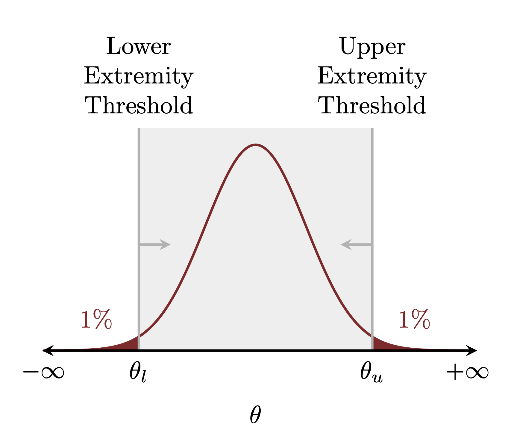
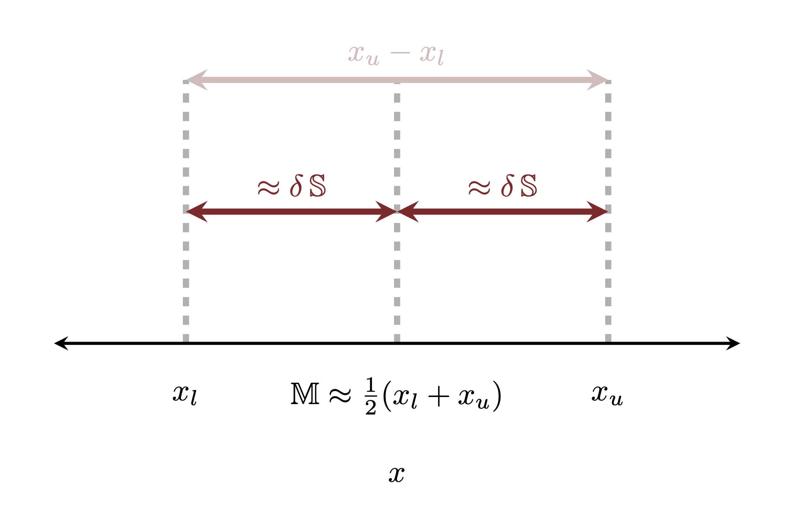
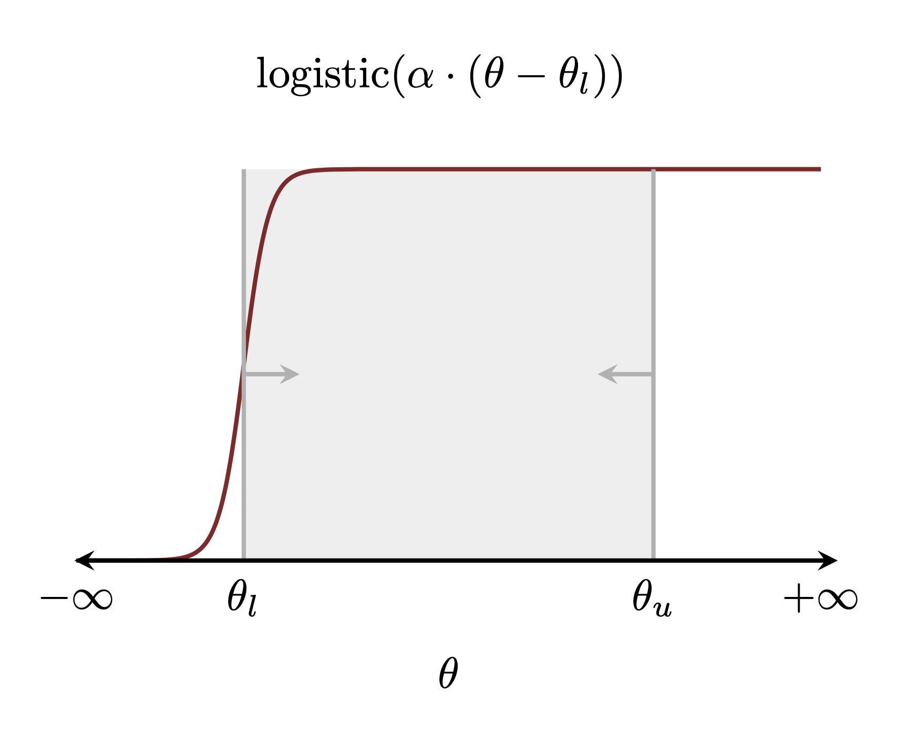
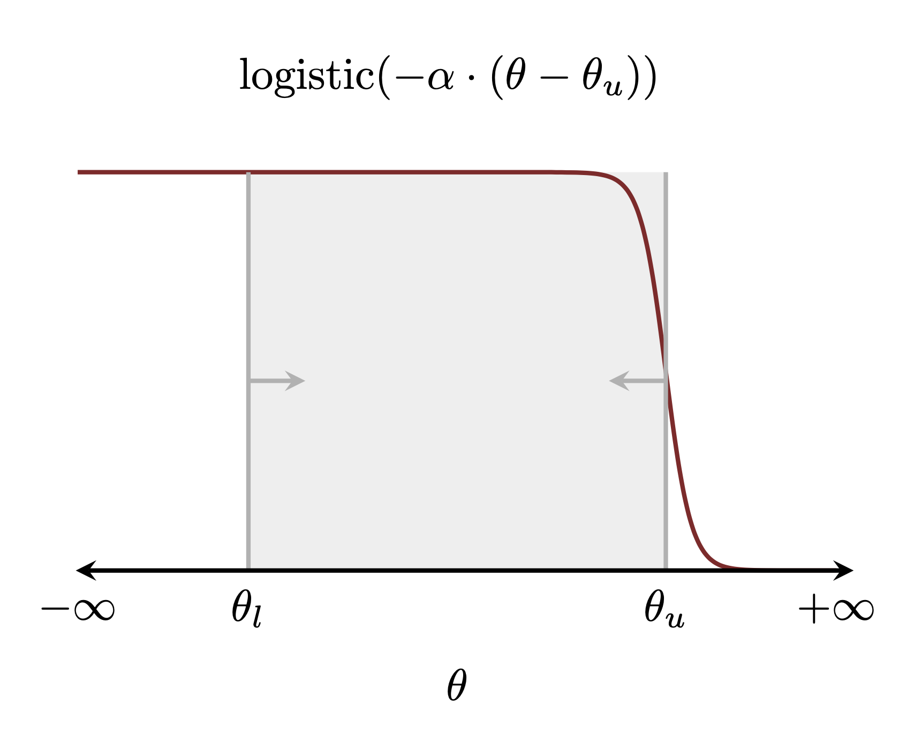
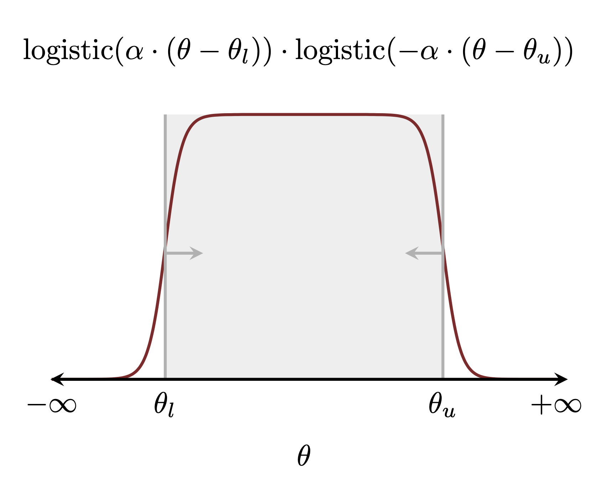

```{r setup, include=FALSE}
knitr::opts_chunk$set(comment=NA)
knitr::opts_knit$set(global.par = TRUE)
```

In my [prior modeling case study](https://betanalpha.github.io/assets/case_studies/prior_modeling.html)
I advocate for the general use of soft containment prior models and suggest some
basic families of probability density functions that are well-suited to this
task.  Here I discuss some more sophisticated containment prior models that may
or may not be of use in some applications, and may or may not be an excuse to
indulge in some integral calculations.  After reviewing the tail probability
conditions that specify a particular containment prior model from a given family
I consider some containment prior models for unconstrained and
positively-constrained, one-dimensional spaces.

# Exact and Approximate Tail Probability Conditions

Throughout this case study we will consider one-dimensional prior models
compatible with two extremity thresholds: a lower extremity threshold
$\theta_{l}$ and an upper extremity threshold $\theta_{u}$.  In other words any
compatible prior model will be responsible for suppressing model configurations
below $\theta_{l}$ and above $\theta_{u}$.

Many probability distributions will be qualitatively compatible with given
extremity thresholds.  To specify a unique containment prior model we need to
impose quantitative restrictions, for example on the tail probabilities above
and below the extremity thresholds.  Here we will consider one and
two-dimensional families of candidate density functions $\pi(\theta; \alpha)$ so
that the symmetric tail probability conditions
$$
\begin{align*}
\rho
&= \Pi(\theta_{l}; \alpha_{*})
= \int_{\theta_{\min}}^{\theta_{l}} \mathrm{d} \theta \, \pi(\theta; \alpha_{*})
\\
1 - \rho
&= \Pi(\theta_{u}; \alpha_{*})
= \int_{\theta_{\min}}^{\theta_{u}} \mathrm{d} \theta \, \pi(\theta; \alpha_{*}),
\end{align*}
$$
specify a unique compatible prior model.  The precise value of $\rho$ defines
the strength of the containment within the extremity thresholds; the exact value
isn't as important as the order of magnitude but for demonstration purposes I
will take $\rho = 0.01$ in all examples.

<center>
<br>
```{r, out.width = "50%", echo=FALSE}

```
<br><br>
</center>

In order to implement these containment prior models in practice we need to be
able to solve for $\alpha_{*}$.  Outside of a few special cases, however, we
will not be able to analytically invert the tail probability conditions to
identify a compatible prior model.  Instead we have to rely on numerical solvers
that search the prior model configuration space for an $\alpha_{*}$ that
satisfies the tail probability conditions up to some numerical precision.

The success of any numerical solver, however, typically depends on a prescient
initialization close enough to a solution.  In this case we can construct useful
initializations from the means and variances of the candidate prior models.

<center>
<br>
```{r, out.width = "50%", echo=FALSE}

```
<br><br>
</center>

When the candidate family doesn't exhibit too much skewness the mean of a
compatible density function shoudl be close to the center of the extremity
thresholds.  This suggests an approximate constraint on the prior model
configuration,
$$
\mathbb{M}(\alpha_{*}) \approx \frac{\theta_{l} + \theta_{u}}{2}
$$

At the same time the distance between the lower and upper extremity threshold
should be approximately some multiple of the standard deviation of the
compatible density function,
$$
\begin{align*}
2 \, \delta \, \mathbb{S}(\alpha_{*}) &\approx \theta_{u} - \theta_{l}
\\
\mathbb{S}(\alpha_{*}) &\approx \frac{ \theta_{u} - \theta_{l} }{ 2 \, \delta }
\end{align*}
$$
hence
$$
\mathbb{V}(\alpha_{*})
= \mathbb{S}^{2}(\alpha_{*})
\approx \left( \frac{ \theta_{u} - \theta_{l} }{ 2 \, \delta } \right)^{2}.
$$

In other words given $\theta_{l}$ and $\theta_{u}$ we can solve the system
of equations
$$
\begin{align*}
\mathbb{M}(\alpha_{\circledast})
&=
\frac{\theta_{l} + \theta_{u}}{2}
\\
\mathbb{V}(\alpha_{\circledast})
&=
\left( \frac{ \theta_{u} - \theta_{l} }{ 2 \, \delta } \right)^{2}
\end{align*}
$$
for $\alpha_{\circledast}$ to provides a reasonable initial guess for a
numerical solver.  Depending on how ill-posed the tail probability constraints
may be in any given problem we may have to heuristically tune $\delta$ to avoid
any convergence problems in the chosen numerical solver.

# Unconstrained Real Spaces

Let's begin our discussion of containment priors with a one-dimensional,
unconstrained real space $\theta \in \mathbb{R}$.  As I mentioned in the
[prior modeling case study](https://betanalpha.github.io/assets/case_studies/prior_modeling.html)
my conventional soft containment prior model for these spaces is specified by a
normal density function.  The symmetric tails offer moderate containment both
below the lower extremity threshold and above the upper extremity threshold
while also being reasonably flat in between.

What if, however, we really wanted to emulate a uniform distribution in between
the extremity thresholds?  In this section we'll construct a family of
probability density functions that does just that.

We start by noticing that a logistic function,
$$
\text{logistic}(x) = \frac{1}{1 + e^{-x}},
$$
centered on the lower extremity threshold suppresses model configurations below
that threshold but quickly asymptotes to a uniform value above it.

<center>
<br>
```{r, out.width = "50%", echo=FALSE}

```
<br><br>
</center>

The decay of the logistic function below the extremity threshold is weaker than
the quadratic exponential decay of a normal density function, more similar to
the decay of a Laplace density function, but that still provides reasonable
containment.  Quadratic exponential decay could be achieved with a modified
logistic function such as
$$
\frac{1}{1 + e^{-x^{2}}},
$$
although the resulting math would be a bit more onerous.

At the same time a complementary logistic function centered around the upper
threshold suppresses values above that threshold while asymptoting to a uniform
value below it.

<center>
<br>
```{r, out.width = "50%", echo=FALSE}

```
<br><br>
</center>

Multiplying these logistic functions together achieves decay beyond both
extremity thresholds while maintaining pretty strong uniformity in between.

<center>
<br>
```{r, out.width = "50%", echo=FALSE}

```
<br><br>
</center>

This suggests the family of probability density functions
$$
\begin{align*}
\pi(\theta; \alpha, \theta_{l}, \theta_{u})
&\propto
\text{logistic}( \alpha \cdot (\theta - \theta_{l})) \cdot
\text{logistic}(-\alpha \cdot (\theta - \theta_{u}))
\\
&\propto
\frac{1}{1 + \exp(- \alpha \cdot (\theta - \theta_{l}) )}
\frac{1}{1 + \exp(+ \alpha \cdot (\theta - \theta_{u}) )},
\end{align*}
$$
where the single parameter $\alpha$ controls the precise rate of decay outside
of the extremity thresholds.

To determine the proper normalization we integrate the probability density
functions into cumulative distribution functions,
$$
\begin{align*}
\Pi(\theta; \alpha, \theta_{l}, \theta_{u})
&=
C
\int_{-\infty}^{x} \mathrm{d}\theta' \,
\frac{1}{1 + \exp(- \alpha \cdot (\theta' - \theta_{l}) )}
\frac{1}{1 + \exp(+ \alpha \cdot (\theta' - \theta_{u}) )}
\\
&=
C
\int_{-\infty}^{x} \mathrm{d}\theta' \,
\frac{1}{1 + \exp(- \alpha \cdot \theta') \, \exp( \alpha \cdot \theta_{l}) )}
\frac{1}{1 + \exp(\alpha \cdot \theta') \, \exp( - \alpha \cdot \theta_{u}) )}
\\
&=
C
\int_{-\infty}^{x} \mathrm{d}\theta' \,
\frac{\exp(\alpha \cdot \theta')}
{\exp(\alpha \cdot \theta') + \exp( \alpha \cdot \theta_{l})}
\frac{\exp(\alpha \cdot \theta_{u})}
{\exp(\alpha \cdot \theta_{u}) + \exp(\alpha \cdot \theta')}.
\end{align*}
$$

At this point we can make the substitution $u = \exp(\alpha \cdot \theta')$ with
$\mathrm{d} u = \mathrm{d} \theta' \, \alpha \, \exp(\alpha \cdot \theta')$ to
give
$$
\begin{align*}
\Pi(\theta; \alpha, \theta_{l}, \theta_{u})
&=
C
\int_{0}^{\exp(\alpha \cdot \theta)} \mathrm{d} u \, \frac{1}{\alpha} \,
\frac{1}{u + \exp( \alpha \cdot \theta_{l}) )}
\frac{\exp(\alpha \cdot \theta_{u})}{\exp(\alpha \cdot \theta_{u}) + u}
\\
&=
C
\frac{\exp(\alpha \cdot \theta_{u})}{\alpha}
\int_{0}^{\exp(\alpha \cdot \theta)} \mathrm{d} u \,
\frac{1}{u + \exp( \alpha \cdot \theta_{l}) )}
\frac{1}{\exp(\alpha \cdot \theta_{u}) + u}.
\end{align*}
$$

Now we can expand the integrand into partial fractions,
$$
\begin{equation*}
\frac{1}{u + \exp( \alpha \cdot \theta_{l}) )}
\frac{1}{\exp(\alpha \cdot \theta_{u}) + u}
=
\frac{1}{\exp(\alpha \cdot \theta_{u}) - \exp(\alpha \cdot \theta_{l})}
\left(
\frac{1}{u + \exp( \alpha \cdot \theta_{l}) )}
-
\frac{1}{u + \exp( \alpha \cdot \theta_{u}) )}
\right),
\end{equation*}
$$
which gives
$$
\begin{align*}
\Pi(\theta; \alpha, \theta_{l}, \theta_{u})
&=
C
\frac{\exp(\alpha \cdot \theta_{u})}{\alpha}
\int_{0}^{\exp(\alpha \cdot \theta)} \mathrm{d} u \,
\frac{1}{u + \exp( \alpha \cdot \theta_{l}) )}
\frac{1}{\exp(\alpha \cdot \theta_{u}) + u}
\\
&=
\frac{C}{\alpha}
\frac{\exp(\alpha \cdot \theta_{u})}
{\exp(\alpha \cdot \theta_{u}) - \exp(\alpha \cdot \theta_{l})}
\left(
\int_{0}^{\exp(\alpha \cdot \theta)} \mathrm{d} u \,
\frac{1}{u + \exp( \alpha \cdot \theta_{l}) )}
-
\int_{0}^{\exp(\alpha \cdot \theta)} \mathrm{d} u \,
\frac{1}{u + \exp( \alpha \cdot \theta_{u}) )}
\right)
\\
&=
\frac{C}{\alpha}
\frac{\exp(\alpha \cdot \theta_{u})}
{\exp(\alpha \cdot \theta_{u}) - \exp(\alpha \cdot \theta_{l})}
\left(
\int_{\exp( \alpha \cdot \theta_{l})}^{\exp(\alpha \cdot \theta) + \exp( \alpha \cdot \theta_{l})}
\mathrm{d} v \,
\frac{1}{v}
-
\int_{\exp( \alpha \cdot \theta_{u})}^{\exp(\alpha \cdot \theta) + \exp( \alpha \cdot \theta_{u})}
\mathrm{d} u \,
\frac{1}{v}
\right)
\\
&=
\frac{C}{\alpha}
\frac{\exp(\alpha \cdot \theta_{u})}
{\exp(\alpha \cdot \theta_{u}) - \exp(\alpha \cdot \theta_{l})}
\left(
\log
\frac{\exp(\alpha \cdot \theta) + \exp( \alpha \cdot \theta_{l})}
{ \exp( \alpha \cdot \theta_{l}) }
-
\log
\frac{\exp(\alpha \cdot \theta) + \exp( \alpha \cdot \theta_{u})}
{ \exp( \alpha \cdot \theta_{u}) }
\right)
\\
&=
\frac{C}{\alpha}
\frac{\exp(\alpha \cdot \theta_{u})}
{\exp(\alpha \cdot \theta_{u}) - \exp(\alpha \cdot \theta_{l})}
\left(
\log \left( 1 + \exp(\alpha \cdot (\theta - \theta_{l})) \right)
-
\log \left( 1 + \exp(\alpha \cdot (\theta - \theta_{u})) \right)
\right)
\\
&=
\frac{C}{\alpha}
\frac{\exp(\alpha \cdot \theta_{u})}
{\exp(\alpha \cdot \theta_{u}) - \exp(\alpha \cdot \theta_{l})}
\log \left(
\frac{ 1 + \exp(\alpha \cdot (\theta - \theta_{l}))}
{ 1 + \exp(\alpha \cdot (\theta - \theta_{u})) }
\right)
\end{align*}
$$

The proper normalization requires
$$
\begin{align*}
1
&=
\lim_{\theta \rightarrow \infty} \Pi(\theta; \alpha, \theta_{l}, \theta_{u})
\\
&=
\lim_{\theta \rightarrow \infty}
\frac{C}{\alpha}
\frac{\exp(\alpha \cdot \theta_{u})}
{\exp(\alpha \cdot \theta_{u}) - \exp(\alpha \cdot \theta_{l})}
\log
\left(
\frac{ 1 + \exp(\alpha \cdot (\theta - \theta_{l}))}
{ 1 + \exp(\alpha \cdot (\theta - \theta_{u})) }
\right)
\\
&=
\frac{C}{\alpha}
\frac{\exp(\alpha \cdot \theta_{u})}
{\exp(\alpha \cdot \theta_{u}) - \exp(\alpha \cdot \theta_{l})}
\lim_{\theta \rightarrow \infty}
\log \left(
\frac{ 1 + \exp(\alpha \cdot (\theta - \theta_{l}))}
{ 1 + \exp(\alpha \cdot (\theta - \theta_{u})) }
\right)
\\
&=
\frac{C}{\alpha}
\frac{\exp(\alpha \cdot \theta_{u})}
{\exp(\alpha \cdot \theta_{u}) - \exp(\alpha \cdot \theta_{l})}
\lim_{\theta \rightarrow \infty}
\log \left(
\frac{\exp(\alpha \cdot (\theta - \theta_{l}))}
{\exp(\alpha \cdot (\theta - \theta_{u})) }
\right)
\\
&=
\frac{C}{\alpha}
\frac{\exp(\alpha \cdot \theta_{u})}
{\exp(\alpha \cdot \theta_{u}) - \exp(\alpha \cdot \theta_{l})}
\lim_{\theta \rightarrow \infty}
\log \left(
\exp(\alpha \cdot (\theta - \theta_{l}) - \alpha \cdot (\theta - \theta_{u}) )
\right)
\\
&=
\frac{C}{\alpha}
\frac{\exp(\alpha \cdot \theta_{u})}
{\exp(\alpha \cdot \theta_{u}) - \exp(\alpha \cdot \theta_{l})}
\lim_{\theta \rightarrow \infty}
\log \left(
\exp( \alpha \cdot \theta - \alpha \cdot \theta_{l} - \alpha \cdot \theta + \alpha \cdot \theta_{u}) \right)
\\
&=
\frac{C}{\alpha}
\frac{\exp(\alpha \cdot \theta_{u})}
{\exp(\alpha \cdot \theta_{u}) - \exp(\alpha \cdot \theta_{l})}
\lim_{\theta \rightarrow \infty}
\log \left( \exp(- \alpha \cdot \theta_{l} + \alpha \cdot \theta_{u}) \right)
\\
&=
\frac{C}{\alpha}
\frac{\exp(\alpha \cdot \theta_{u})}
{\exp(\alpha \cdot \theta_{u}) - \exp(\alpha \cdot \theta_{l})}
\log \left( \exp(\alpha \cdot (\theta_{u} - \theta_{l} ) \right)
\\
&=
\frac{C}{\alpha}
\frac{\exp(\alpha \cdot \theta_{u})}
{\exp(\alpha \cdot \theta_{u}) - \exp(\alpha \cdot \theta_{l})}
\alpha \cdot (\theta_{u} - \theta_{l} )
\\
&=
C
\frac{\exp(\alpha \cdot \theta_{u})}
{\exp(\alpha \cdot \theta_{u}) - \exp(\alpha \cdot \theta_{l})}
\cdot (\theta_{u} - \theta_{l} )
\\
&=
C
\frac{1}{1 - \exp(\alpha \cdot (\theta_{l} - \theta_{u}))}
\cdot (\theta_{u} - \theta_{l} ),
\end{align*}
$$
or
$$
C =
\frac{ 1 - \exp(\alpha \cdot (\theta_{l} - \theta_{u})) }
{ \theta_{u} - \theta_{l} }.
$$

Consequently the properly-normalized family of probability density functions is
given by
$$
\pi(\theta; \alpha, \theta_{l}, \theta_{u})
=
\frac{ 1 - \exp(\alpha \cdot (\theta_{l} - \theta_{u})) }
{ \theta_{u} - \theta_{l} } \cdot
\text{logistic}( \alpha \cdot (\theta - \theta_{l})) \cdot
\text{logistic}(-\alpha \cdot (\theta - \theta_{u}))
$$
with the cumulative distribution function
$$
\Pi(\theta; \alpha, \theta_{l}, \theta_{u})
=
\frac{1}{ \alpha \cdot ( \theta_{u} - \theta_{l} ) }
\log \left(
\frac{ 1 + \exp(\alpha \cdot (\theta - \theta_{l}))}
{ 1 + \exp(\alpha \cdot (\theta - \theta_{u})) }
\right).
$$

When we want only $\rho$ probability to leak below $\theta_{l}$ then we need an
$\alpha_{*}$ that satisfies
$$
\begin{align*}
\rho
&=
\Pi(\theta_{l}; \alpha_{*}, \theta_{l}, \theta_{u})
\\
&=
\frac{1}{ \alpha_{*} \cdot ( \theta_{u} - \theta_{l} ) }
\log \left(
\frac{ 1 + \exp(\alpha_{*} \cdot (\theta_{l} - \theta_{l}))}
{ 1 + \exp(\alpha_{*} \cdot (\theta_{l} - \theta_{u})) }
\right)
\\
&=
\frac{1}{ \alpha_{*} \cdot ( \theta_{u} - \theta_{l} ) }
\log \left( \frac{1 + 1}{ 1 + \exp(\alpha_{*} \cdot (\theta_{l} - \theta_{u})) } \right)
\\
&=
\frac{1}{ \alpha_{*} \cdot ( \theta_{u} - \theta_{l} ) }
\log \left( \frac{2}{ 1 + \exp(\alpha_{*} \cdot (\theta_{l} - \theta_{u})) } \right)
\\
&=
\frac{1}{ \alpha_{*} \cdot ( \theta_{u} - \theta_{l} ) }
\log \left( \frac{2}{ 1 + \exp(- \alpha_{*} \cdot (\theta_{u} - \theta_{l})) } \right)
\end{align*}
$$
Because this equation cannot be analytically solved for $\alpha_{*}$ we instead
have to appeal to a numerical solver for each desired span
$\theta_{u} - \theta_{l}$.

If the span of the containment is large, $\theta_{u} - \theta_{l} \gg 0$, then
this condition approximately reduces to
$$
\begin{align*}
\rho
&=
\frac{1}{ \alpha_{*} \cdot ( \theta_{u} - \theta_{l} ) }
\log \left( \frac{2}{ 1 + \exp(-\alpha_{*} \cdot (\theta_{u} - \theta_{l})) } \right)
\\
&\approx
\frac{1}{ \alpha_{*} \cdot ( \theta_{u} - \theta_{l} ) }
\log \left( \frac{2}{1} \right)
\\
&\approx
\frac{1}{ \alpha_{*} \cdot ( \theta_{u} - \theta_{l} ) }
\log 2,
\end{align*}
$$
Consequently
$$
\begin{align*}
\rho
&=
\frac{\log 2 }{ \alpha_{\circledast} \cdot ( \theta_{u} - \theta_{l} ) }
\\
\alpha_{\circledast}
&=
\frac{\log 2 }{ \rho \cdot ( \theta_{u} - \theta_{l} ) },
\end{align*}
$$
provides a useful approximation, or even better an initialization for a
numerical solver.

Solving for an $\alpha_{*}$ that satisfies this lower tail probability condition
also ensures that
$$
\begin{align*}
\Pi(\theta_{u}; \alpha_{*}, \theta_{l}, \theta_{u})
&=
\frac{1}{ \alpha_{*} \cdot ( \theta_{u} - \theta_{l} ) }
\log \left(
\frac{ 1 + \exp(\alpha_{*} \cdot (\theta_{u} - \theta_{l}))}
{ 1 + \exp(\alpha_{*} \cdot (\theta_{u} - \theta_{u})) }
\right)
\\
&=
\frac{1}{ \alpha_{*} \cdot ( \theta_{u} - \theta_{l} ) }
\log \left( \frac{ 1 + \exp(\alpha_{*} \cdot (\theta_{u} - \theta_{l}))}{2} \right)
\\
&=
\frac{1}{ \alpha_{*} \cdot ( \theta_{u} - \theta_{l} ) }
\log \left(
\frac{ 1 + \exp(\alpha_{*} \cdot (\theta_{l} - \theta_{u}))}
{2 \, \exp(\alpha_{*} \cdot (\theta_{l} - \theta_{u}))} \right)
\\
&=
\frac{1}{ \alpha_{*} \cdot ( \theta_{u} - \theta_{l} ) }
\left(
\log \left( \frac{ 1 + \exp(\alpha_{*} \cdot (\theta_{l} - \theta_{u}))}{2} \right)
- \log \left( \exp(\alpha_{*} \cdot (\theta_{l} - \theta_{u})) \right)
\right)
\\
&=
\frac{1}{ \alpha_{*} \cdot ( \theta_{u} - \theta_{l} ) }
\left(
\log \left( \frac{ 1 + \exp(\alpha_{*} \cdot (\theta_{l} - \theta_{u}))}{2} \right)
- \alpha_{*} \cdot (\theta_{l} - \theta_{u})
\right)
\\
&=
\frac{1}{ \alpha_{*} \cdot ( \theta_{u} - \theta_{l} ) }
\left(
- \log \left( \frac{2}{ 1 + \exp(\alpha_{*} \cdot (\theta_{l} - \theta_{u}))} \right)
+ \alpha_{*} \cdot (\theta_{u} - \theta_{l})
\right)
\\
&=
- \frac{1}{ \alpha_{*} \cdot ( \theta_{u} - \theta_{l} ) }
\log \left( \frac{2}{ 1 + \exp(\alpha_{*} \cdot (\theta_{l} - \theta_{u}))} \right)
+ 1
\\
&=
- \rho
+ 1.
\end{align*}
$$
In other words if there is $\rho$ probability below $\theta_{l}$ then there will
automatically be $\rho$ probability above $\theta_{u}$, ensuring symmetric
containment.

Let's put all of this into practice with some code.

```{r}
c_light <- c("#DCBCBC")
c_light_highlight <- c("#C79999")
c_mid <- c("#B97C7C")
c_mid_highlight <- c("#A25050")
c_dark <- c("#8F2727")
c_dark_highlight <- c("#7C0000")

par(family="CMU Serif", las=1, bty="l", cex.axis=1, cex.lab=1, cex.main=1,
    xaxs="i", yaxs="i", mar = c(5, 5, 3, 1))
```

First we set arbitrary lower and upper extremity thresholds for demonstration.

```{r}
theta_l <- -4
theta_u <- 10
```

We begin with an $\alpha$ that approximately yields the right soft containment.

```{r}
rho <- 0.01

alpha <- log(2) / (rho * (theta_u - theta_l))
```

As expected the probability density function is nearly uniform between the
extremity thresholds and rapidly decays outside of them.  Consequently the
cumulative distribution function is approximately constant outside of the
thresholds while increasing linearly between them.

```{r}
par(mfrow=c(1, 2))

thetas <- seq(-10, 20, 0.001)
pdfs <- 1 / ( (1 + exp(-alpha * (thetas - theta_l))) *
        (1 + exp(alpha * (thetas - theta_u))) * (theta_u - theta_l))

plot(thetas, pdfs, type="l", lwd=2, col=c_dark,
     xlim=c(-10, 20), xlab="theta", ylab="Probability Density")
abline(v=theta_l, col="#DDDDDD", lty=2, lwd=2)
abline(v=theta_u, col="#DDDDDD", lty=2, lwd=2)

cdfs <- (1 / (alpha * (theta_u - theta_l))) *
        log( (1 + exp(alpha * (thetas - theta_l))) /
             (1 + exp(alpha * (thetas - theta_u))) )
           
plot(thetas, cdfs, type="l", lwd=2, col=c_dark,
     xlim=c(-10, 20), xlab="theta", ylab="Cumulative Probabilty")
abline(v=theta_l, col="#DDDDDD", lty=2, lwd=2)
abline(v=theta_u, col="#DDDDDD", lty=2, lwd=2)
```

If we want more precise containment we can appeal to a numerical solver to
find a value for $\alpha$ that satisfies the tail probability conditions.  Here
we'll use Stan's built-in numerical solver aided with the approximate value as
an initial guess.

```{r}
writeLines(readLines("stan_programs/alpha_tune.stan"))
```

```{r, warning=FALSE, message=FALSE}
library(rstan)
rstan_options(auto_write = TRUE)            # Cache compiled Stan programs
options(mc.cores = parallel::detectCores()) # Parallelize chains
parallel:::setDefaultClusterOptions(setup_strategy = "sequential")
```

```{r, warning=FALSE, message=FALSE}
simu_data <- list("theta_l" = theta_l, "theta_u" = theta_u)

simu <- stan(file="stan_programs/alpha_tune.stan", data=simu_data,
             iter=1, chains=1, seed=4838282, algorithm="Fixed_param")

alpha <- extract(simu)$alpha[1]
alpha
```

In this case the span between the extremity thresholds was large enough that
the approximate tuning is essentially equal to the exact tuning.

```{r}
par(mfrow=c(1, 2))

pdfs <- 1 / ( (1 + exp(-alpha * (thetas - theta_l))) *
        (1 + exp(alpha * (thetas - theta_u))) * (theta_u - theta_l))

plot(thetas, pdfs, type="l", lwd=2, col=c_dark,
     xlim=c(-10, 20), xlab="theta", ylab="Probability Density")
abline(v=theta_l, col="#DDDDDD", lty=2, lwd=2)
abline(v=theta_u, col="#DDDDDD", lty=2, lwd=2)

cdfs <- (1 / (alpha * (theta_u - theta_l))) *
        log( (1 + exp(alpha * (thetas - theta_l))) /
             (1 + exp(alpha * (thetas - theta_u))) )
           
plot(thetas, cdfs, type="l", lwd=2, col=c_dark,
     xlim=c(-10, 20), xlab="theta", ylab="Cumulative Probability")
abline(v=theta_l, col="#DDDDDD", lty=2, lwd=2)
abline(v=theta_u, col="#DDDDDD", lty=2, lwd=2)
```

# Positively-Constrained Real Spaces

With that exploration under out belts let's consider soft containment models for
one-dimensional, positively-constrained real spaces $\theta \in \mathbb{R}^{+}$.
In the prior modeling case study I recommended the gamma and inverse gamma
families of probability density functions which have
[complementarily asymmetric tail behaviors](https://betanalpha.github.io/assets/case_studies/probability_densities.html#35_the_inverse_gamma_family).  In this section we'll
consider some additional options that allow for more symmetric containment.

## The Generalized Inverse Normal Family

The generalized inverse normal family of probability density functions
[@Jorgensen:1982] is a three-parameter family that generalizes the gamma and
inverse gamma families while capturing even more possible tail behaviors.  This
family features enough convenient mathematical properties that it is somewhat
inevitable, and indeed it has been independently derived multiple times in
different applied settings, for example by [@Halphen:1941] and [@Good:1953].

Before we talk about priors let me mention a few points about naming.  The
generalized inverse normal family is named so because it generalizes the inverse
normal family.  In both cases "gaussian" is more typical in the statistical
literature; here I use normal instead of gaussian to be consistent with my other
writing.  Moreover the "inverse" in "inverse normal" does not refer to a
pushforward along a reciprocal as it does for the inverse gamma family.  Instead
it refers to the log characteristic function being the functional inverse of the
log characteristic function of a corresponding element of the normal family
[@Tweedie:1945].  As always, statistical terminology seems to be intentionally
overloaded in order to confuse us.

With that aside we can get to the mathematics.  The generalized inverse normal
family of density functions is defined by
$$
\text{gin}(\theta; a, b, p)
=
\left( \frac{a}{b} \right)^{\frac{p}{2}} \frac{1}{2 \, K_{p}(\sqrt{a \, b}) } \,
\theta^{p - 1}
\exp \left( - \frac{1}{2} \left(a \, \theta + \frac{b}{\theta} \right) \right),
$$
where $K_{p}(z)$ is the modified Bessel function of the second kind.  Common
special cases of this family correspond to special cases where $K_{p}(z)$
reduces to something a bit more tractable.

## Limiting Families

Consider for example the limit $z \rightarrow 0$, which arises whenever
$a \rightarrow 0$ or $b \rightarrow 0$.  In this limit $K_{p}(z)$ is singular,
such that
$$
\lim_{z \rightarrow 0} K_{p}(z) \cdot
\frac{2}{\Gamma( | p | )} \left( \frac{2}{z} \right)^{-| p |} = 1
$$
for $p \ne 0$.

When $p > 0$ the generalized inverse normal prefactor is given by
$$
\begin{align*}
\lim_{a\text{ or }b \rightarrow 0}
\left( \frac{a}{b} \right)^{\frac{p}{2}} \frac{1}{2 \, K_{p}(\sqrt{a \, b}) }
&=
\left( \frac{a}{b} \right)^{\frac{p}{2}}
\frac{1}{2 \, \frac{1}{2} \Gamma( p ) \left( \frac{2}{\sqrt{a \, b}} \right)^{p} }
\\
&=
\left( \frac{a}{b} \right)^{\frac{p}{2}}
\frac{1}{\Gamma( p ) } \left( \frac{\sqrt{a \, b}}{2} \right)^{p}
\\
&=
\frac{1}{2^{p}}
\frac{1}{\Gamma( p ) }
\left( \frac{a}{b} \right)^{\frac{p}{2}}
\left( a \, b \right)^{\frac{p}{2}}
\\
&=
\frac{1}{2^{p}}
\frac{1}{\Gamma( p ) }
a^{p}
\\
&=
\frac{1}{\Gamma( p ) }
\left( \frac{a}{2} \right)^{p}.
\end{align*}
$$

Likewise for $p < 0$ the prefactor becomes
$$
\begin{align*}
\lim_{a\text{ or }b \rightarrow 0}
\left( \frac{a}{b} \right)^{\frac{p}{2}} \frac{1}{2 \, K_{p}(\sqrt{a \, b}) }
&=
\left( \frac{a}{b} \right)^{\frac{p}{2}}
\frac{1}{2 \, \frac{1}{2} \Gamma( - p ) \left( \frac{2}{\sqrt{a \, b}} \right)^{-p} }
\\
&=
\left( \frac{a}{b} \right)^{\frac{p}{2}}
\frac{1}{\Gamma( -p ) } \left( \frac{\sqrt{a \, b}}{2} \right)^{-p}
\\
&=
\frac{1}{2^{-p}}
\frac{1}{\Gamma( -p ) }
\left( \frac{a}{b} \right)^{\frac{p}{2}}
\left( a \, b \right)^{\frac{-p}{2}}
\\
&=
\frac{1}{2^{-p}}
\frac{1}{\Gamma( -p ) }
b^{-p}
\\
&=
\frac{1}{\Gamma( -p ) }
\left( \frac{b}{2} \right)^{-p}.
\end{align*}
$$

With some additional tweaking these two circumstances lead to the gamma and
inverse gamma families.

### Gamma Family

If we take $b = 0$ with $p > 0$ then the generalized inverse normal family
reduces to
$$
\begin{align*}
\text{gin}(\theta; a, 0, p)
&=
\frac{1}{\Gamma( p ) }
\left( \frac{a}{2} \right)^{p}
\theta^{p - 1} \exp \left( - \frac{a}{2} \, \theta \right).
\end{align*}
$$
Reparameterizing $a = 2 \, \beta$ and $p = \alpha > 0$ reveals the familiar
gamma family,
$$
\begin{align*}
\text{gin}(\theta; 2 \, \beta, 0, \alpha)
&=
\frac{1}{\Gamma( \alpha ) }
\left( \beta \right)^{\alpha}
\theta^{\alpha - 1} \exp \left( - \beta \, \theta \right)
\\
&=
\text{gamma}(\theta; \alpha, \beta).
\end{align*}
$$

In order to pick a particular element of the gamma family that satisfies a
given tail probability condition we need to appeal to a numerical solver, which
needs a useful initialization.  Using our approximate cumulant method we need
to solve the system of equations
$$
\begin{align*}
\frac{\alpha_{\circledast}}{\beta_{\circledast}}
&= \mathbb{M}(\alpha_{\circledast}, \beta_{\circledast})
= \frac{\theta_{l} + \theta_{u}}{2}
\\
\frac{\alpha_{\circledast}}{\beta_{\circledast}^{2}}
&=
\mathbb{V}(\alpha_{\circledast}, \beta_{\circledast})
=
\left( \frac{ \theta_{u} - \theta_{l} }{ 2 \, \delta } \right)^{2}.
\end{align*}
$$

The first equation simplifies to
$$
\begin{align*}
\frac{\alpha_{\circledast}}{\beta_{\circledast}} &= \frac{\theta_{l} + \theta_{u}}{2}
\\
\alpha_{\circledast} &= \beta_{\circledast} \, \frac{\theta_{l} + \theta_{u}}{2}
\end{align*}
$$
while the second gives
$$
\begin{align*}
\frac{\alpha_{\circledast}}{\beta_{\circledast}^{2}}
&=
\left( \frac{ \theta_{u} - \theta_{l} }{ 2 \, \delta } \right)^{2}
\\
\frac{\beta_{\circledast}^{2}}{\alpha_{\circledast}}
&=
\left( \frac{ 2 \, \delta }{ \theta_{u} - \theta_{l} } \right)^{2}
\\
\beta_{\circledast}^{2}
&=
\alpha_{\circledast} \, \left( \frac{ 2 \, \delta }{ \theta_{u} - \theta_{l} } \right)^{2}
\end{align*}
$$
Substituting the first equation yields an explicit guess for $\beta_{\circledast}$,
$$
\begin{align*}
\beta_{\circledast}^{2}
&=
\beta_{\circledast} \,
\frac{\theta_{l} + \theta_{u}}{2} \, \left( \frac{ 2 \, \delta }
{ \theta_{u} - \theta_{l} } \right)^{2}
\\
\beta_{\circledast}
&=
\frac{\theta_{l} + \theta_{u}}{2} \, \left( \frac{ 2 \, \delta }
{ \theta_{u} - \theta_{l} } \right)^{2}
\\
\beta_{\circledast}
&= 2 \, \delta^{2}
\frac{ \theta_{l} + \theta_{u} }
{ \left( \theta_{u} - \theta_{l} \right)^{2} }.
\end{align*}
$$

Finally we can substitute this result into the first equation gives an explicit
guess for $\alpha_{\circledast}$,
$$
\begin{align*}
\alpha_{\circledast}
&=
\beta_{\circledast} \, \frac{\theta_{l} + \theta_{u}}{2}
\\
&=
2 \, \delta^{2}
\frac{ \theta_{l} + \theta_{u} }
{ \left( \theta_{u} - \theta_{l} \right)^{2} } \,
\frac{\theta_{l} + \theta_{u}}{2}
\\
&=
\delta^{2} \left(
\frac{ \theta_{l} + \theta_{u} }{ \theta_{u} - \theta_{l} }
\right)^{2}.
\end{align*}
$$

New space, new extremity thresholds for demonstration.

```{r}
theta_l <- 4
theta_u <- 8
```

The corresponding tail probability constraints and initialization are readily
coded up in Stan.

```{r}
writeLines(readLines("stan_programs/gamma_tune.stan"))
```

```{r, warning=FALSE, message=FALSE}
tune_data <- list("theta_l" = theta_l, "theta_u" = theta_u, "delta" = 0.75)

tune <- stan(file="stan_programs/gamma_tune.stan", data=tune_data,
             iter=1, chains=1, seed=4838282, algorithm="Fixed_param")
```

```{r}
alpha <- extract(tune)$alpha[1]
beta <- extract(tune)$beta[1]

alpha; beta
```

Although are heuristic guess wasn't all that close to the exactly compatible
configuration it was close enough to allow the numerical solver to complete its
journey.  We can qualitatively confirm the compatibility of the resulting prior
model with the given extremity thresholds with a visualization.

```{r}
par(mfrow=c(1, 1))

thetas <- seq(0, 10, 0.01)
gamma_pdfs <- dgamma(thetas, alpha, beta)
plot(thetas, gamma_pdfs, type="l", lwd=2, col=c_mid,
     xlim=c(0, 10), xlab="theta", ylab="Probability Density")
abline(v=theta_l, col="#DDDDDD", lty=2, lwd=2)
abline(v=theta_u, col="#DDDDDD", lty=2, lwd=2)
```

### Inverse Gamma Family

Alternatively if we take $a = 0$ with $p < 0$ then the generalized inverse
normal family reduces to
$$
\begin{align*}
\text{gin}(\theta; 0, b, p)
&=
\frac{1}{\Gamma( -p ) }
\left( \frac{b}{2} \right)^{-p}
\theta^{p - 1} \exp \left( - \frac{b}{2 \, \theta} \right).
\end{align*}
$$
Reparameterizating $b = 2 \, \beta$ and $p = - \alpha < 0$ reveals the inverse
gamma family,
$$
\begin{align*}
\text{gin}(\theta; 0, 2 \, \beta, -\alpha)
&=
\frac{1}{\Gamma( \alpha ) }
\left( \beta \right)^{\alpha}
\theta^{-\alpha - 1} \exp \left( - \frac{\beta}{\theta} \right)
\\
&=
\text{inv-gamma}(\theta; \alpha, \beta).
\end{align*}
$$

Assuming that the mean and variance are well-defined they given an implicit
system for the approximate tuning,
$$
\begin{align*}
\frac{\beta_{\circledast}}{\alpha_{\circledast} - 1}
&= \mathbb{M}(\alpha_{\circledast}, \beta_{\circledast})
= \frac{\theta_{l} + \theta_{u}}{2}
\\
\frac{1}{\alpha_{\circledast} - 2}
\left( \frac{\beta_{\circledast}}{\alpha_{\circledast} - 1} \right)^{2}
&=
\mathbb{V}(\alpha_{\circledast}, \beta_{\circledast})
=
\left( \frac{ \theta_{u} - \theta_{l} }{ 2 \, \delta } \right)^{2}.
\end{align*}
$$

Substituting the first equation into the second gives an explicit equation for
$\beta_{\circledast}$,
$$
\begin{align*}
\frac{1}{\alpha_{\circledast} - 2} \left( \frac{\beta_{\circledast}}{\alpha_{\circledast} - 1} \right)^{2}
&=
\left( \frac{ \theta_{u} - \theta_{l} }{ 2 \, \delta } \right)^{2}
\\
\frac{1}{\alpha_{\circledast} - 2} \left( \frac{\theta_{l} + \theta_{u}}{2} \right)^{2}
&=
\left( \frac{ \theta_{u} - \theta_{l} }{ 2 \, \delta } \right)^{2}
\\
\left( \frac{\theta_{l} + \theta_{u}}{2} \right)^{2}
\left( \frac{ 2 \, \delta }{ \theta_{u} - \theta_{l} } \right)^{2}
&=
\alpha_{\circledast} - 2
\\
\delta^{2} \,
\left( \frac{\theta_{l} + \theta_{u}}{ \theta_{u} - \theta_{l} } \right)^{2}
&=
\alpha_{\circledast} - 2
\\
\delta^{2} \,
\left( \frac{\theta_{l} + \theta_{u}}{ \theta_{u} - \theta_{l} } \right)^{2} + 2
&=
\alpha_{\circledast}.
\end{align*}
$$
Once we've solved for $\beta_{\circledast}$ we can then solve for $\alpha_{\circledast}$ as
$$
\begin{align*}
\frac{\beta_{\circledast}}{\alpha_{\circledast} - 1} &= \frac{\theta_{l} + \theta_{u}}{2}
\\
\beta_{\circledast} &= (\alpha_{\circledast} - 1) \, \frac{\theta_{l} + \theta_{u}}{2}.
\end{align*}
$$

Diligently we implement this initialization, and a numerical solver to refine
the initialization into an inverse gamma prior model exactly compatible with the
tail probability conditions, as a Stan program.

```{r}
writeLines(readLines("stan_programs/inv_gamma_tune.stan"))
```

```{r, warning=FALSE, message=FALSE}
tune_data <- list("theta_l" = theta_l, "theta_u" = theta_u, "delta" = 0.75)

tune <- stan(file="stan_programs/inv_gamma_tune.stan", data=tune_data,
             iter=1, chains=1, seed=4838282, algorithm="Fixed_param")
```

```{r}
alpha <- extract(tune)$alpha[1]
beta <- extract(tune)$beta[1]

alpha; beta
```

As in the case of the gamma prior the initialization isn't particularly close to
the exact solution, but close enough for the numerical solver.  Were it not
close enough then we may be able to procure a better answer by tweaking `delta`,
although large values of `delta` tend to introduce convergence problems for the
gamma and inverse gamma families.

Once again we can visually confirm the compatibility of the prior model and the
given extremity thresholds.

```{r}
inv_gamma_pdfs <- exp(alpha * log(beta) - lgamma(alpha) -
                      (alpha + 1) * log(thetas) - beta / thetas)
plot(thetas, inv_gamma_pdfs, type="l", lwd=2, col=c_light,
     xlim=c(0, 10), xlab="theta", ylab="Probability Density")
abline(v=theta_l, col="#DDDDDD", lty=2, lwd=2)
abline(v=theta_u, col="#DDDDDD", lty=2, lwd=2)
```

## Half-Order Families

Besides the singular limit the other reasonably tractable behavior of the
modified Bessel function of the second kind occurs when $p = \pm \frac{1}{2}$,
in which case
$$
K_{\pm \frac{1}{2}} (z) = \sqrt{ \frac{\pi}{2 \, z} } \exp(-z),
$$
or equivalently
$$
\frac{1}{2 \, K_{\pm \frac{1}{2}} (z)}
=
\frac{1}{ \sqrt{2 \, \pi}} \, \sqrt{z} \, \exp(z).
$$
Here the generalized inverse normal family reduces to
$$
\begin{align*}
\text{gin} (\theta; a, b, \pm \tfrac{1}{2} )
&=
\left( \frac{a}{b} \right)^{\pm \frac{1}{4}}
\frac{1}{2 \, K_{\pm \frac{1}{2}}(\sqrt{a \, b}) } \,
\theta^{\pm \frac{1}{2} - 1}
\exp \left( - \frac{1}{2} \left(a \, \theta + \frac{b}{\theta} \right) \right)
\\
&=
\left( \frac{a}{b} \right)^{\pm \frac{1}{4}}
\frac{1}{ \sqrt{2 \, \pi}} \, (a \, b)^{\frac{1}{4}} \, \exp(a \, b) \,
\theta^{\pm \frac{1}{2} - 1}
\exp \left( - \frac{1}{2} \left(a \, \theta + \frac{b}{\theta} \right) \right)
\\
&=
\left(
\frac{1}{2 \, \pi} \,
a^{\frac{1 \pm 1}{2}} \, b^{\frac{1 \mp 1}{2}} \,
\theta^{\pm 1 - 2} \right)^{\frac{1}{2}} \,
\exp \left(
- \frac{1}{2} \left(a \, \theta - 2 \sqrt{a \, b} + \frac{b}{\theta} \right)
- \right)
\\
&=
\left(
\frac{1}{2 \, \pi} \,
a^{\frac{1 \pm 1}{2}} \, b^{\frac{1 \mp 1}{2}} \,
\theta^{\pm 1 - 2} \right)^{\frac{1}{2}} \,
\exp \left( - \frac{a}{2 \, \theta}
\left(\theta^{2} - 2 \sqrt{\frac{b}{a}} \, \theta + \frac{b}{a} \right) \right)
\\
&=
\left(
\frac{1}{2 \, \pi} \,
a^{\frac{1 \pm 1}{2}} \, b^{\frac{1 \mp 1}{2}} \,
\theta^{\pm 1 - 2} \right)^{\frac{1}{2}} \,
\exp \left(
- \frac{a}{2 \, \theta} \left(\theta - \sqrt{\frac{b}{a}} \right)^{2}
\right).
\end{align*}
$$

To clean this result up we first take $\sqrt{b / a} = \mu$ or $b = a \, \mu^{2}$,
$$
\begin{align*}
\text{gin} (\theta; a, a \, \mu^{2}, \pm \tfrac{1}{2} )
&=
\left(
\frac{1}{2 \, \pi} \,
a^{\frac{1 \pm 1}{2}} \, (a \, \mu^{2})^{\frac{1 \mp 1}{2}} \,
\theta^{\pm 1 - 2} \right)^{\frac{1}{2}} \,
\exp \left( - \frac{a}{2 \, \theta} \left(\theta - \mu \right)^{2} \right)
\\
&=
\left(
\frac{1}{2 \, \pi} \,
a^{\frac{1 \pm 1}{2}} \, a^{\frac{1 \mp 1}{2}} \, \mu^{1 \mp 1} \,
\theta^{\pm 1 - 2} \right)^{\frac{1}{2}} \,
\exp \left( - \frac{a}{2 \, \theta} \left(\theta - \mu \right)^{2} \right)
\\
&=
\left(
\frac{1}{2 \, \pi} \,
a^{\frac{2 \pm 1 \mp 1}{2}} \, \mu^{1 \mp 1} \,
\theta^{\pm 1 - 2} \right)^{\frac{1}{2}} \,
\exp \left( - \frac{a}{2 \, \theta} \left(\theta - \mu \right)^{2} \right)
\\
&=
\left(
\frac{1}{2 \, \pi} \,
a \, \mu^{1 \mp 1} \,
\theta^{\pm 1 - 2} \right)^{\frac{1}{2}} \,
\exp \left( - \frac{a}{2 \, \theta} \left(\theta - \mu \right)^{2} \right).
\end{align*}
$$

Finally we take $a = 1 / \sigma$ which gives
$$
\text{gin} (\theta; \sigma^{-1}, \sigma^{-1} \, \mu^{2}, \pm \tfrac{1}{2} )
=
\left(
\frac{1}{2 \, \pi \, \sigma} \,
\mu^{1 \mp 1} \,
\theta^{\pm 1 - 2} \right)^{\frac{1}{2}} \,
\exp \left(
- \frac{1}{2 \, \sigma \, \theta} \left(\theta - \mu \right)^{2}
- \right).
$$

The two possible signs lead to two different families of probability density
functions.

### Inverse Normal Family

For $p = - \frac{1}{2}$ the generalized inverse normal family reduces to the
inverse normal family of probability density functions,
$$
\begin{align*}
\text{inv-normal}(\theta; \mu, \sigma)
&=
\text{gin} (\theta; \sigma^{-1}, \sigma^{-1} \, \mu^{2}, - \tfrac{1}{2} )
\\
&=
\left(
\frac{\mu^{2}}{2 \, \pi \, \sigma \, \theta^{3}} \,
\right)^{\frac{1}{2}} \,
\exp \left( - \frac{1}{2 \, \sigma \, \theta} \left(\theta - \mu \right)^{2}
\right).
\end{align*}
$$

For comparison below let's also note the form of the cumulative distribution
functions,
$$
\text{inv-normal-cdf}(\theta; \mu, \sigma)
=
\Phi \left( \frac{\theta - \mu}{\sqrt{\sigma \, \theta} } \right)
+ \exp \left( \frac{2 \, \mu}{\sigma} \right) \,
\Phi \left( - \frac{\theta + \mu}{\sqrt{\sigma \, \theta} } \right).
$$

The cumulant-based guess for the compatible parameters is conveniently
straightforward to derive.  Per routine we start with the system of equations
$$
\begin{align*}
\mu_{\circledast}
&= \mathbb{M}(\mu_{\circledast}, \sigma_{\circledast})
= \frac{\theta_{l} + \theta_{u}}{2}
\\
\sigma_{\circledast}  \, \mu_{\circledast}
&=
\mathbb{V}(\mu_{\circledast}, \sigma_{\circledast})
=
\left( \frac{ \theta_{u} - \theta_{l} }{ 2 \, \delta } \right)^{2}.
\end{align*}
$$

The first equation already gives a explicit guess for $\mu_{\circledast}$.
Substituting that guess into the second equation gives an explicit guess for
$\sigma_{\circledast}$ as well,
$$
\begin{align*}
\sigma_{\circledast} \, \mu_{\circledast}
&=
\left( \frac{ \theta_{u} - \theta_{l} }{ 2 \, \delta } \right)^{2}
\\
\sigma_{\circledast}
&=
\frac{1}{\mu_{\circledast}} \left( \frac{ \theta_{u} - \theta_{l} }{ 2 \, \delta } \right)^{2}
\\
\sigma_{\circledast}
&=
\frac{2}{\theta_{l} + \theta_{u}}
\left( \frac{ \theta_{u} - \theta_{l} }{ 2 \, \delta } \right)^{2}
\\
\sigma_{\circledast}
&=
\frac{1}{2 \, \delta^{2} }
\frac{  \left( \theta_{u} - \theta_{l} \right)^{2} }{ \theta_{l} + \theta_{u} }.
\end{align*}
$$

At this point the implementation of the compatible prior tuning is
straightforward in Stan.

```{r}
writeLines(readLines("stan_programs/inv_normal_tune.stan"))
```

```{r, warning=FALSE, message=FALSE}
tune_data <- list("theta_l" = theta_l, "theta_u" = theta_u, "delta" = 2)

tune<- stan(file="stan_programs/inv_normal_tune.stan", data=tune_data,
             iter=1, chains=1, seed=4838282, algorithm="Fixed_param")
```

```{r}
mu <- extract(tune)$mu[1]
sigma <- extract(tune)$sigma[1]

mu; sigma
```

One of the benefits of the half-order families is that the implicit systems that
defines our heuristic initializations are a bit more well-posed than the
limiting families.  This allows us to use larger values of `delta` to achieve
better initial guesses without compromising the numerical solver.

This immediately results in an inverse normal prior model compatible with the
extremity thresholds.

```{r}
inv_normal_pdfs <- mu  / sqrt(2 * pi * sigma * thetas**3) *
                   exp(- (thetas - mu)**2 / (2 * sigma * thetas))
plot(thetas, inv_normal_pdfs, type="l", lwd=2, col=c_dark,
     xlim=c(0, 10), xlab="theta", ylab="Probability Density")
abline(v=theta_l, col="#DDDDDD", lty=2, lwd=2)
abline(v=theta_u, col="#DDDDDD", lty=2, lwd=2)
```

### Plus One Half Family

Taking $p = + \frac{1}{2}$ yields another family that can be readily
manipulated,
$$
\text{gin} (\theta; \sigma^{-1}, \sigma^{-1} \, \mu^{2}, + \tfrac{1}{2} )
=
\left(
\frac{1}{2 \, \pi \, \sigma \, \theta} \,
\right)^{\frac{1}{2}} \,
\exp \left(
- \frac{1}{2 \, \sigma \, \theta} \left(\theta - \mu \right)^{2}
\right).
$$
As far as I can tell this family doesn't have a common name in the statistical
literature so here I'll just refer to it here as the "plus one half" family,
$$
\text{plus-one-half} (\theta; \mu, \sigma)
=
\left(
\frac{1}{2 \, \pi \, \sigma \, \theta} \,
\right)^{\frac{1}{2}} \,
\exp \left(
- \frac{1}{2 \, \sigma \, \theta} \left(\theta - \mu \right)^{2}
\right).
$$

The mean of each element in this family is given by
$$
\begin{align*}
\mathbb{M}(\mu, \sigma)
&=
\int_{0}^{\infty} \mathrm{d} \theta \,
\left(
\frac{1}{2 \, \pi \, \sigma \, \theta} \,
\right)^{\frac{1}{2}} \,
\exp \left(
- \frac{1}{2 \, \sigma \, \theta} \left(\theta - \mu \right)^{2}
\right) \,
\theta
\\
&=
\frac{1}{\sqrt{2 \, \pi \, \sigma}} \,
\int_{0}^{\infty} \mathrm{d} \theta \,
\sqrt{\theta}
\exp \left( - \frac{1}{2 \, \sigma \, \theta} \left(\theta - \mu \right)^{2} \right)
\\
&=
\frac{1}{\sqrt{2 \, \pi \, \sigma}} \,
\sqrt{2 \, \pi \, \sigma} \, (\mu + \sigma)
\\
&=
\mu + \sigma,
\end{align*}
$$
while the second moments are given by
$$
\begin{align*}
\mathbb{M}_{2}(\mu, \sigma)
&=
\int_{0}^{\infty} \mathrm{d} \theta \,
\left(
\frac{1}{2 \, \pi \, \sigma \, \theta} \,
\right)^{\frac{1}{2}} \,
\exp \left(
- \frac{1}{2 \, \sigma \, \theta} \left(\theta - \mu \right)^{2}
\right) \,
\theta^{2}
\\
&=
\frac{1}{ \sqrt{2 \, \pi \, \sigma \, } } \,
\int_{0}^{\infty} \mathrm{d} \theta \,
\exp \left(
- \frac{1}{2 \, \sigma \, \theta} \left(\theta - \mu \right)^{2}
\right) \,
\theta^{\frac{3}{2}}
\\
&=
\frac{1}{ \sqrt{2 \, \pi \, \sigma \, } } \,
\sqrt{2 \, \pi \, \sigma}
\left( \frac{3 \, \mu^{2} \, \sigma}{\mu}
+ \frac{3 \, \sigma^{2} \, \mu}{\mu}
+ \frac{\mu^{3}}{\mu} \right)
\\
&=
\left( 3 \, \mu \, \sigma
+ 3 \, \sigma^{2}
+ \mu^{2} \right).
\end{align*}
$$

Consequently the variances are given by
$$
\begin{align*}
\mathbb{V}(\mu, \sigma)
&=
\mathbb{M}_{2}(\mu, \sigma) - \mathbb{M}^{2}(\mu, \sigma)
\\
&=
3 \, \mu \, \sigma + 3 \, \sigma^{2} + \mu^{2}
- (\mu + \sigma)^{2}
\\
&=
3 \, \mu \, \sigma + 3 \, \sigma^{2} + \mu^{2}
- \mu^{2} - 2 \, \mu \, \sigma - \sigma^{2}
\\
&=
\mu \, \sigma + 2 \, \sigma^{2}
\\
&=
\sigma \, \left( \mu + 2 \, \sigma \right).
\end{align*}
$$

The cumulative distribution functions for this family take the form
$$
\begin{align*}
\text{plus-one-half-cdf}(\theta; \mu, \sigma)
&=
\int_{0}^{\theta} \mathrm{d} \theta' \,
\left(
\frac{1}{2 \, \pi \, \sigma \, \theta'} \,
\right)^{\frac{1}{2}} \,
\exp \left(
- \frac{1}{2 \, \sigma \, \theta'} \left(\theta' - \mu \right)^{2}
- \right)
\\
&=
\frac{1}{ \sqrt{2 \, \pi \, \sigma} }
\int_{0}^{\theta} \mathrm{d} \theta' \,
\sqrt{ \frac{1}{\theta'} } \,
\exp \left(
- \frac{1}{2 \, \sigma \, \theta'} \left(\theta' - \mu \right)^{2}
\right)
\\
&=
\frac{1}{ \sqrt{2 \, \pi \, \sigma} }
\sqrt{ \frac{\pi \, \sigma}{2} }
\left(
1
+ \text{erf} \! \left( \frac{\theta - \mu}{\sqrt{2 \, \sigma \, \theta} } \right)
- \exp \left( \frac{2 \, \mu}{\sigma} \right)
\left(
1 - \text{erf} \! \left( \frac{\theta + \mu}{\sqrt{2 \, \sigma \, \theta} } \right)
\right)
\right)
\\
&=
\frac{1}{2}
\left(
1
+ \text{erf} \! \left( \frac{\theta - \mu}{\sqrt{2 \, \sigma \, \theta} } \right)
- \exp \left( \frac{2 \, \mu}{\sigma} \right)
\left(
1 - \text{erf} \! \left( \frac{\theta + \mu}{\sqrt{2 \, \sigma \, \theta} } \right)
\right)
\right).
\end{align*}
$$

We can also write this in terms of standardized normal cumulative distribution
functions $\Phi(z)$ instead of the error functions,
$$
\begin{align*}
\text{plus-one-half-cdf}(\theta; \mu, \sigma)
&=
\frac{1}{2}
\left(
1
+
2 \Phi \left( \frac{\theta - \mu}{\sqrt{\sigma \, \theta} } \right) - 1
- \exp \left( \frac{2 \, \mu}{\sigma} \right)
\left(
1 - 2 \, \Phi \left( \frac{\theta + \mu}{\sqrt{\sigma \, \theta} } \right) + 1
\right)
\right)
\\
&=
\frac{1}{2}
\left(
2 \, \Phi \left( \frac{\theta - \mu}{\sqrt{\sigma \, \theta} } \right)
- 2 \, \exp \left( \frac{2 \, \mu}{\sigma} \right)
\left(1 - \Phi \left( \frac{\theta + \mu}{\sqrt{\sigma \, \theta} } \right) \right)
\right)
\\
&=
\Phi \left( \frac{\theta - \mu}{\sqrt{\sigma \, \theta} } \right)
- \exp \left( \frac{2 \, \mu}{\sigma} \right)
\left(1 - \Phi \left( \frac{\theta + \mu}{\sqrt{\sigma \, \theta} } \right) \right)
\\
&=
\Phi \left( \frac{\theta - \mu}{\sqrt{\sigma \, \theta} } \right)
- \exp \left( \frac{2 \, \mu}{\sigma} \right) \,
\Phi \left( - \frac{\theta + \mu}{\sqrt{\sigma \, \theta} } \right).
\end{align*}
$$
Oddly the only difference between these cumulative distribution functions and
those of the inverse normal family are the sign of the second term!

What about an initial guess for the parameters compatible with a given tail
probability condition?  We need to solve the system of equations
$$
\begin{align*}
\mu_{\circledast} + \sigma_{\circledast}
&= \mathbb{M}(\mu_{\circledast}, \sigma_{\circledast} )
= \frac{\theta_{l} + \theta_{u}}{2}
\\
\sigma_{\circledast}  (\mu_{\circledast}  + 2 \sigma_{\circledast} )
&=
\mathbb{V}(\mu_{\circledast}, \sigma_{\circledast})
=
\left( \frac{ \theta_{u} - \theta_{l} }{ 2 \, \delta } \right)^{2}.
\end{align*}
$$

The first equation gives
$$
\begin{align*}
\mu_{\circledast} + \sigma_{\circledast} &= \mathbb{M}
\\
\mu_{\circledast} + \sigma_{\circledast} &= \frac{\theta_{l} + \theta_{u}}{2}
\\
\mu_{\circledast} &= \frac{\theta_{l} + \theta_{u}}{2} - \sigma_{\circledast}.
\end{align*}
$$
Substituting this into the second equation then yields
$$
\begin{align*}
\sigma_{\circledast} (\mu_{\circledast} + 2 \sigma_{\circledast})
&=
\left( \frac{ \theta_{u} - \theta_{l} }{ 2 \, \delta } \right)^{2}
\\
\sigma_{\circledast} (\frac{\theta_{l} + \theta_{u}}{2} - \sigma_{\circledast} + 2 \sigma_{\circledast})
&=
\left( \frac{ \theta_{u} - \theta_{l} }{ 2 \, \delta } \right)^{2}
\\
\sigma_{\circledast} (\frac{\theta_{l} + \theta_{u}}{2} + \sigma_{\circledast})
&=
\left( \frac{ \theta_{u} - \theta_{l} }{ 2 \, \delta } \right)^{2}
\\
\sigma_{\circledast}^{2} + \left( \frac{\theta_{l} + \theta_{u}}{2} \right) \sigma_{\circledast}
- \left( \frac{ \theta_{u} - \theta_{l} }{ 2 \, \delta } \right)^{2}
&=
0
\end{align*}
$$

This is solved by the quadratic equation
$$
\begin{align*}
\sigma_{\circledast}
&=
\frac{1}{2} \left[
 - \left( \frac{\theta_{l} + \theta_{u}}{2} \right)
+ \sqrt{
\left( \frac{\theta_{l} + \theta_{u}}{2} \right)^{2}
+ 4 \left( \frac{ \theta_{u} - \theta_{l} }{ 2 \, \delta } \right)^{2}
} \right]
\\
&=
\frac{1}{2} \left[ - \left( \frac{\theta_{l} + \theta_{u}}{2} \right)
+ \left( \frac{\theta_{l} + \theta_{u}}{2} \right) + \sqrt{ 1 + 4
\left( \frac{2}{\theta_{l} + \theta_{u}} \right)^{2}
\left( \frac{ \theta_{u} - \theta_{l} }{ 2 \, \delta } \right)^{2} } \right]
\\
&=
\frac{\theta_{l} + \theta_{u}}{4}
\left[ \sqrt{ 1 + \frac{4}{\delta^{2}}
\left( \frac{ \theta_{u} - \theta_{l} }{\theta_{l} + \theta_{u}} \right)^{2} } - 1 \right].
\end{align*}
$$

Once we evaluate this guess for $\sigma_{\circledast}$ we can plug it back into
the equation for $\mu_{\circledast}$,
$$
\mu_{\circledast} = \frac{\theta_{l} + \theta_{u}}{2} - \sigma_{\circledast}.
$$

Although this initialization is a bit more complicated it's still nothing that
we can't readily implement in Stan.

```{r}
writeLines(readLines("stan_programs/plus_one_half_tune.stan"))
```

```{r, warning=FALSE, message=FALSE}
tune_data <- list("theta_l" = theta_l, "theta_u" = theta_u, "delta" = 2)

tune <- stan(file="stan_programs/plus_one_half_tune.stan", data=tune_data,
             iter=1, chains=1, seed=4838282, algorithm="Fixed_param")
```

```{r}
mu <- extract(tune)$mu[1]
sigma <- extract(tune)$sigma[1]

mu; sigma
```

Once again our heuristic initialization is pretty close to the exact answer.
The numerical solver finishes the job, yielding the compatible prior model that
we desired.

```{r}
plus_one_half_pdfs <- 1 / sqrt(2 * pi * sigma * thetas) *
                      exp(- (thetas - mu)**2 / (2 * sigma * thetas))
plot(thetas, plus_one_half_pdfs, type="l", lwd=2, col=c_dark,
     xlim=c(0, 10), xlab="theta", ylab="Probability Density")
abline(v=theta_l, col="#DDDDDD", lty=2, lwd=2)
abline(v=theta_u, col="#DDDDDD", lty=2, lwd=2)
```

## Comparing Containment

The generalized inverse normal family motivates at least four special cases that
we can use as prior models over one-dimensional, positively-constrained spaces.
In this section we do little bit of comparing and a little bit of contrasting.

First comparing the two half-order families shows that yield nearly equivalent
soft containment prior models!

```{r}
par(mfrow=c(1, 2))

plot(thetas, inv_normal_pdfs, main="Inverse Normal",
     type="l", lwd=2, col=c_dark, xlab="theta", ylab="Probability Density")
abline(v=theta_l, col="#DDDDDD", lty=2, lwd=2)
abline(v=theta_u, col="#DDDDDD", lty=2, lwd=2)

plot(thetas, plus_one_half_pdfs, main="Plus One Half",
     type="l", lwd=2, col=c_dark, xlab="theta", ylab="Probabilty Density")
abline(v=theta_l, col="#DDDDDD", lty=2, lwd=2)
abline(v=theta_u, col="#DDDDDD", lty=2, lwd=2)

par(mfrow=c(1, 1))

plot(thetas, plus_one_half_pdfs - inv_normal_pdfs,
     type="l", lwd=2, col=c_dark, mgp=c(4, 1, 0),
     xlab="theta", ylab="Difference In Density Functions")
abline(h=0, col="#DDDDDD", lty=2, lwd=2)
```

While the $\mu$ and $\sigma$ parameters do have different meanings in each
family for practical purposes the families are interchangeable once we impose
symmetric tail probability constraints.

At the same time both half-order prior models exhibit more symmetric tail decay
than the gamma and inverse gamma prior models tuned to the same tail probability
conditions.

```{r}
par(mfrow=c(1, 3))

plot(0, type="n", main="", xlab="theta", xlim=c(0, 10),
     ylab="Probability Density", yaxt='n', ylim=c(0, 0.5))
lines(thetas, plus_one_half_pdfs, lwd=2, col=c_dark)
lines(thetas, inv_normal_pdfs, lwd=2, col=c_dark)
lines(thetas, gamma_pdfs, lwd=2, col=c_mid)
lines(thetas, inv_gamma_pdfs, lwd=2, col=c_light)
abline(v=theta_l, col="#DDDDDD", lty=2, lwd=2)
abline(v=theta_u, col="#DDDDDD", lty=2, lwd=2)

plot(0, type="n", main="Left Tail", xlab="theta", xlim=c(2, 4),
     ylab="Log Probability Density", yaxt='n', ylim=c(-35, 0))
lines(thetas, log(plus_one_half_pdfs), lwd=2, col=c_dark)
lines(thetas, log(inv_normal_pdfs), lwd=2, col=c_dark)
lines(thetas, log(gamma_pdfs), lwd=2, col=c_mid)
lines(thetas, log(inv_gamma_pdfs), lwd=2, col=c_light)
abline(v=theta_l, col="#DDDDDD", lty=2, lwd=2)

text(2.0, -10, label="Gamma", pos=4, col=c_mid)
text(2.5, -20, label="Inverse Gamma", pos=4, col=c_light)

plot(0, type="n", main="Right Tail", xlab="theta", xlim=c(8, 10),
     ylab="Log Probability Density", yaxt='n', ylim=c(-35, 0))
lines(thetas, log(plus_one_half_pdfs), lwd=2, col=c_dark)
lines(thetas, log(inv_normal_pdfs), lwd=2, col=c_dark)
lines(thetas, log(gamma_pdfs), lwd=2, col=c_mid)
lines(thetas, log(inv_gamma_pdfs), lwd=2, col=c_light)
abline(v=theta_u, col="#DDDDDD", lty=2, lwd=2)

text(9, -10, label="Gamma", pos=4, col=c_mid)
text(9, -5, label="Inverse Gamma", pos=4, col=c_light)
```

The gamma family features weaker decay below the lower extremity threshold and
stronger decay above the upper extremity threshold, resulting in a stronger
suppression of positive infinity than zero.  Contrastingly the inverse gamma
family features a lighter lower tail and a heavier upper tail which more
strongly suppresses zero than positive infinity.  Both half-order families fall
in between these behaviors, suppressing zero and positive infinity more
symmetrically and more moderately.

As a final comparison we can compare the half-order prior models to the other
common choice for one-dimensional, positively-constrained spaces: the log
normal family.  

```{r}
log_normal_pdfs <- dlnorm(thetas, 1.732868, 0.1493852)

par(mfrow=c(1, 3))

plot(0, type="n", main="", xlab="theta", xlim=c(0, 10),
     ylab="Probability Density", yaxt='n', ylim=c(0, 0.5))
lines(thetas, plus_one_half_pdfs, lwd=2, col=c_dark)
lines(thetas, inv_normal_pdfs, lwd=2, col=c_dark)
lines(thetas, log_normal_pdfs, lwd=2, col=c_light)
abline(v=theta_l, col="#DDDDDD", lty=2, lwd=2)
abline(v=theta_u, col="#DDDDDD", lty=2, lwd=2)

plot(0, type="n", main="Left Tail", xlab="theta", xlim=c(2, 4),
     ylab="Log Probability Density", yaxt='n', ylim=c(-35, 0))
lines(thetas, log(plus_one_half_pdfs), lwd=2, col=c_dark)
lines(thetas, log(inv_normal_pdfs), lwd=2, col=c_dark)
lines(thetas, log(log_normal_pdfs), lwd=2, col=c_light)
abline(v=theta_l, col="#DDDDDD", lty=2, lwd=2)

text(2.5, -20, label="Half-Order", pos=4, col=c_dark)
text(2.0, -10, label="Log Normal", pos=4, col=c_light)

plot(0, type="n", main="Right Tail", xlab="theta", xlim=c(8, 10),
     ylab="Log Probability Density", yaxt='n', ylim=c(-35, 0))
lines(thetas, log(plus_one_half_pdfs), lwd=2, col=c_dark)
lines(thetas, log(inv_normal_pdfs), lwd=2, col=c_dark)
lines(thetas, log(log_normal_pdfs), lwd=2, col=c_light)
abline(v=theta_u, col="#DDDDDD", lty=2, lwd=2)

text(9, -10, label="Half-Order", pos=4, col=c_dark)
text(9, -5, label="Log Normal", pos=4, col=c_light)
```

Once tuned to the same tail probability condition the two families yield very
similar results, although the half-order families offer slightly stronger
containment both below the lower extremity threshold and above the upper
extremity threshold.

All of these behaviors can be useful when building a principled prior model
depending on which, if any, extreme is less consistent with our domain
expertise.  For example in
[gaussian process modeling](https://betanalpha.github.io/assets/case_studies/gaussian_processes.html)
an inverse gamma prior model is particularly useful for suppressing pathological
behavior that arises between zero and the lower extremity threshold.

Finally while these four special cases are particularly amenable to calculation
they are by no means the only useful configurations of the full generalized
inverse normal family.  With a mathematical library that supports arbitrary
evaluation of the modified Bessel function of the second kind one might be able
to implement other containment prior models from configurations with different
tail behavior.  There is still much room to explore.

# Conclusion

Because soft containment prior models are meant only to be compatible with
limited domain expertise we don't have to be too precious with their precise
mathematical form.  Consequently the more basic families of probability density
functions are often sufficient for building principled prior models in practice.

In those rare cases where we have the luxury to elicit more domain expertise
these basic families may no longer be sufficient.  Fortunately there is an
expansive world of more sophisticated families of probability density functions
into which we can always progress.  In this case study we explored just a few
possibilities that may prove useful in some prior modeling applications.

# Acknowledgements

I thank Chris Miles and Andrew Mascioli for help with some of the integrals in
the investigation of the half-order families.

A very special thanks to everyone supporting me on Patreon: Aapeli Nevala,
Adam Bartonicek, Adam Fleischhacker, Adriano Yoshino, Alan O'Donnell,
Alessandro Varacca, Alex ANDORRA, Alexander Bartik, Alexander Noll,
Alexander Rosteck, Anders Valind, Andrea Serafino, Andrew Mascioli,
Andrew Rouillard, Andrew Vigotsky, Angie_Hyunji Moon, Angus Williams,
Antoine Soubret, Ara Winter, Arya, asif zubair, Austin Carter, Austin Rochford,
Austin Rochford, Avraham Adler, Basit Chaudhry, Ben Matthews, Ben Swallow,
Benoit Essiambre, Bertrand Wilden, Bo Schwartz Madsen, Brian Hartley, Bryan Yu,
Brynjolfur Gauti Jónsson, Cameron Smith, Canaan Breiss, Cat Shark,
Charles Naylor, Chase Dwelle, Chris Jones, Chris Zawora, Christopher Mehrvarzi,
Chuck Carlson, Cole Monnahan, Colin Carroll, Colin McAuliffe, D, Damien Mannion,
Damon Bayer, Dan Killian, dan mackinlay, Dan Muck, Dan W Joyce, Dan Waxman,
Dan Weitzenfeld, Daniel Edward Marthaler, Daniel Hocking, Daniel Rowe,
Darshan Pandit, David Galley, David Humeau, David Pascall, David Wurtz,
Derek G Miller, dilsher singh dhillon, Doug Rivers, Dr. Jobo, Dylan Murphy,
Ed Cashin, Ed Henry, Eduardo, Eric LaMotte, Erik Banek, Ero Carrera, Ethan Goan,
Eugene O'Friel, Evan Cater, Fabio Zottele, Federico Carrone, Felipe González,
Fergus Chadwick, Filipe Dias, Finn Lindgren, Florian Wellmann, Francesco Corona,
Geoff Rollins, George Ho, Granville Matheson, Greg Sutcliffe, Guido Biele,
Hamed Bastan-Hagh, Haonan Zhu, Harrison Katz, Henri Wallen, Hugo Botha,
Huib Meulenbelt, Håkan Johansson, Ian , Ignacio Vera, Ilaria Prosdocimi,
Isaac S, J, J Michael Burgess, Jair Andrade, James McInerney, James Wade,
JamesU, Janek Berger, Jason Martin, Jason Pekos, Jeff Dotson, Jeff Helzner,
Jeff Stulberg, Jeffrey Erlich, Jessica Graves, Joe Wagner, John Flournoy, Jon,
Jonathan H. Morgan, Jonathan St-onge, Jonathon Vallejo, Joran Jongerling,
Jose Pereira, Josh Weinstock, Joshua Duncan, Joshua Griffith, Joshua Mayer,
Josué Mendoza, Justin Bois, Karim Naguib, Karim Osman, Kejia Shi, Kevin Foley,
Kádár András, Leevi Lindgren, lizzie , Luiz Carvalho, Luiz Pessoa, Luke Hewitt,
Marc Dotson, Marc Trunjer Kusk Nielsen, Marcel Lüthi, Marco Gorelli,
Marek Kwiatkowski, Mario Becerra, Mark Donoghoe, Mark Worrall, Markus P.,
Martin Modrák, Matteo, Matthew, Matthew Hawthorne, Matthew Kay, Matthew Quick,
Matthew T Stern, Matthieu , Maurits van der Meer, Maxim Kesin, Melissa Wong,
Merlin Noel Heidemanns, Michael Colaresi, Michael DeWitt, Michael Dillon,
Michael Lerner, Michael Tracy, Mick Cooney, Miguel de la Varga, Mike Lawrence,
MisterMentat , Mutual Information, Márton Vaitkus, N , Name, Nathaniel Burbank,
Nic Fishman, Nicholas Erskine, Nicholas Ursa, Nick S, Nicolas Frisby,
Noah Guzman, Octavio Medina, Ole Rogeberg, Oliver Crook, Olivier Ma,
Omri Har Shemesh, Pablo León Villagrá, Patrick  Kelley, Patrick Boehnke,
Pau Pereira Batlle, Paul Oreto, Peter Smits, Pieter van den Berg , ptr,
Putra Manggala, qwerty, Ramiro Barrantes Reynolds, Ravin Kumar,
Raúl Peralta Lozada, Reece Willoughby, Riccardo Fusaroli, Richard Nerland,
Robert Frost, Robert Goldman, Robert kohn, Robert Mitchell V, Robin East,
Robin Taylor, Rong Lu, Ryan Grossman, Ryan Wesslen, Rémi , S Hong, Scott Block,
Scott Brown, Sean Pinkney, Serena, Seth Axen, shira, sid phani, Simon Duane,
Simon Lilburn, Srivatsa Srinath, sssz, Stan_user, Stephanie Fitzgerald,
Stephen Lienhard, Steve Bertolani, Stone Chen, Sus, Susan Holmes, Svilup,
Sören Berg, Tao Ye, Tate Tunstall, Teresa Ortiz, Thomas Kealy, Thomas Vladeck,
Tiago Cabaço, Tim Howes, Tobychev , Tom Knowles, Tom McEwen, Tommy Naugle,
Tomáš Frýda, Tony Wuersch, Virginia Fisher, Vitaly Druker, Vladimir Markov,
Wil Yegelwel, Will Farr, Will Kurt, Will Tudor-Evans, yolhaj , yureq , Zach A,
Zad Rafi, Zhengchen Cai, and Zwelithini Tunyiswa.

# References {-}

<div id="refs"></div>

# License {-}

A repository containing the material used in this case study is available on
[GitHub](https://github.com/betanalpha/knitr_case_studies/tree/master/some_containment_prior_models).

The code in this case study is copyrighted by Michael Betancourt and licensed
under the new BSD (3-clause) license:

https://opensource.org/licenses/BSD-3-Clause

The text and figures in this case study are copyrighted by Michael Betancourt
and licensed under the CC BY-NC 4.0 license:

https://creativecommons.org/licenses/by-nc/4.0/

# Original Computing Environment {-}

```{r, comment=NA}
writeLines(readLines(file.path(Sys.getenv("HOME"), ".R/Makevars")))
```

```{r, comment=NA}
sessionInfo()
```
