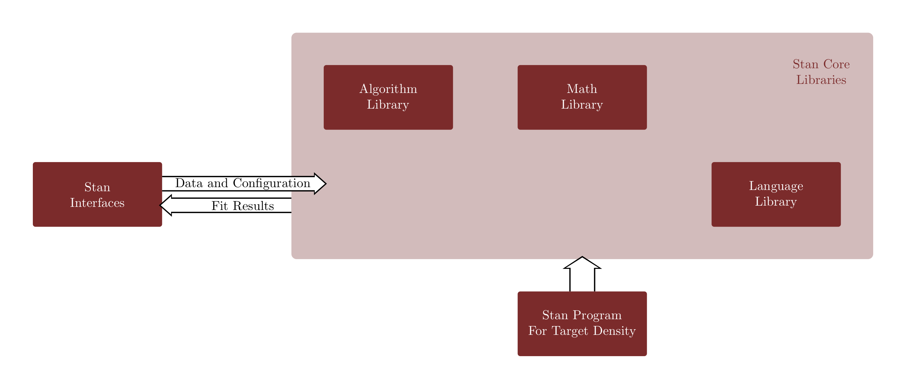
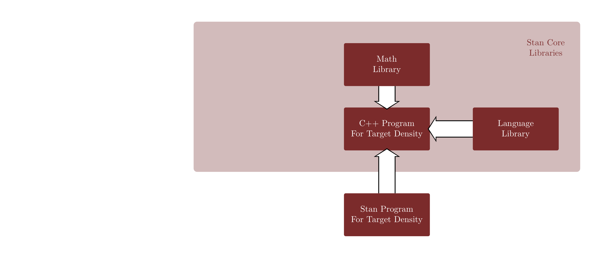
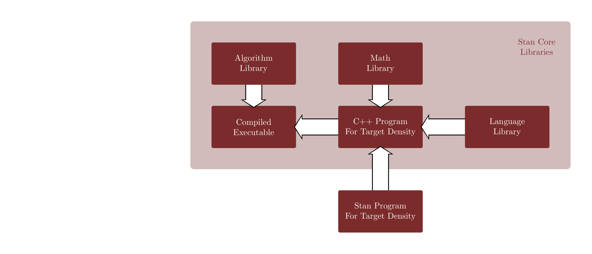
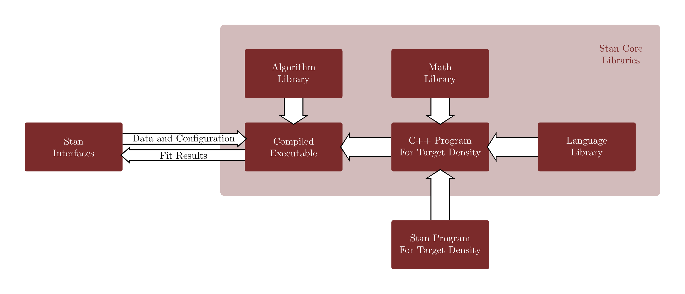
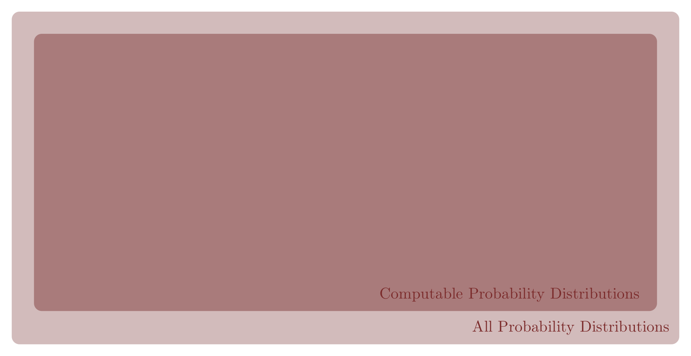
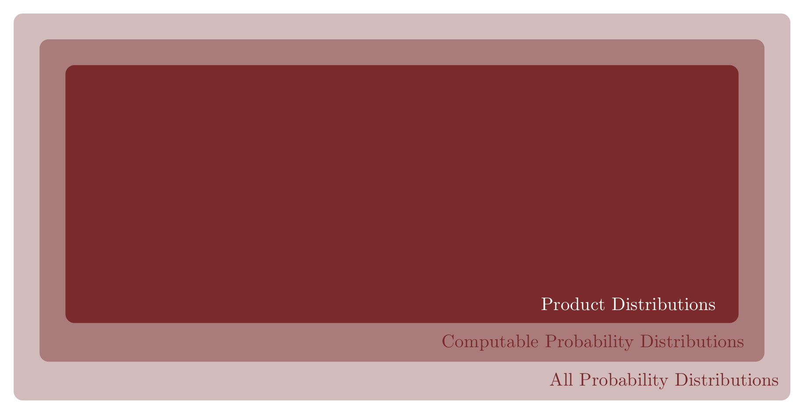
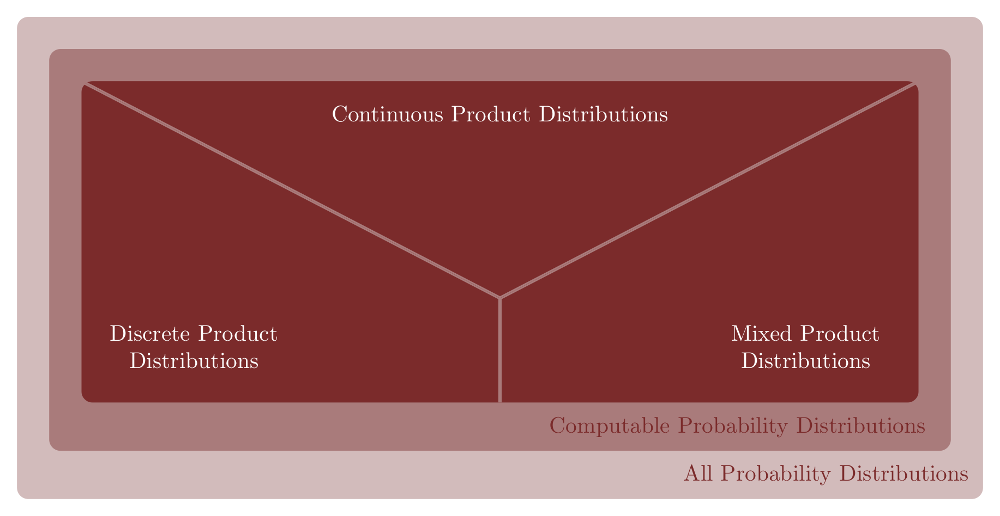
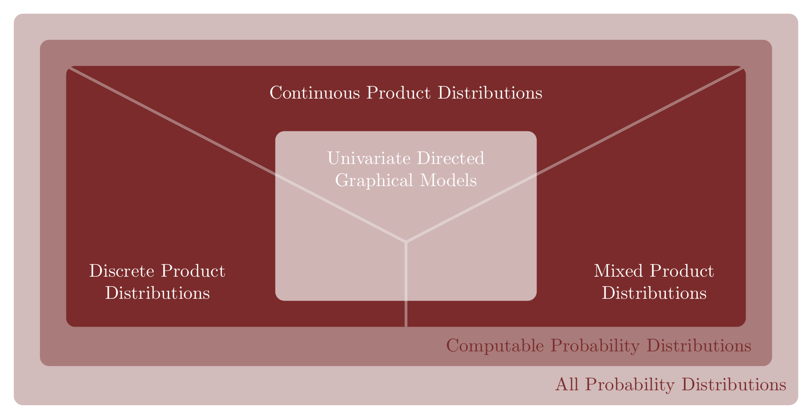
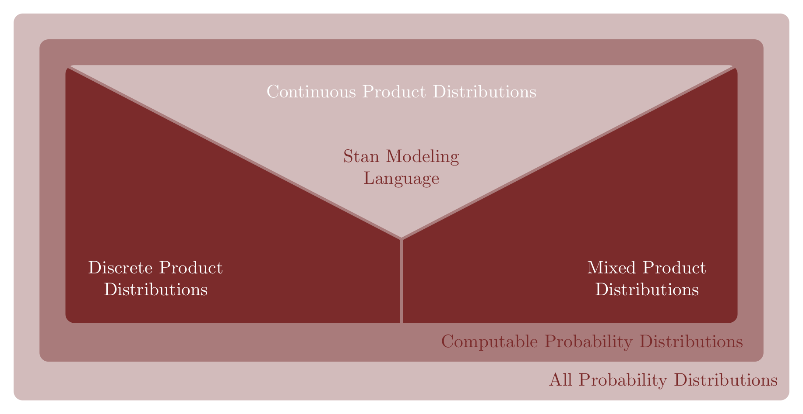
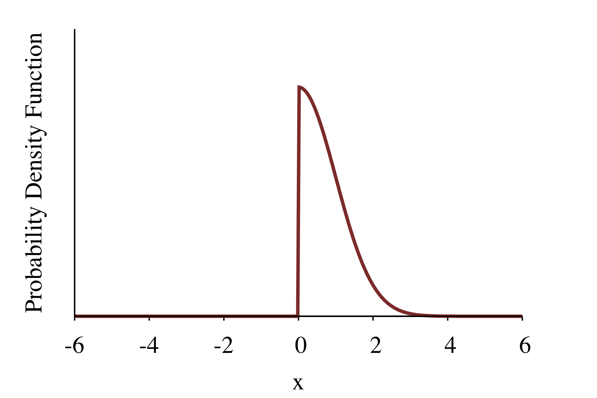

```{r setup, include=FALSE}
knitr::opts_chunk$set(comment=NA)
```

In theory the process of Bayesian inference is straightforward.  After
specifying a complete Bayesian model we condition the joint distribution over 
model configurations and observed data on a particular measurement and then 
quantify inferences with the resulting posterior expectation values.  This
theoretical elegance, however, rarely carries over into practice.  Reasoning
about sophisticated models is certainly challenging, and explicitly specifying
and communicating those models is even more difficult.  Moreover, even if we can
precisely define our model then we have to struggle to accurately estimate the
corresponding posterior expectation values. 

_Stan_ is a comprehensive software ecosystem aimed at facilitating the
application of Bayesian inference.  It features an expressive probabilistic
programming language for specifying sophisticated Bayesian models backed by
extensive math and algorithm libraries to support automated computation.  This
functionality is then exposed to common computing environments, such as `R`,
`Python`, and the command line, in user-friendly interfaces. 

In this case study I present a thorough introduction to the Stan ecosystem with
a particular focus on the modeling language.  After a motivating introduction we
will review the Stan ecosystem and the fundamentals of the Stan modeling
language and the `RStan` interface.  Finally I will demonstrate some more 
advanced features and debugging techniques in a series of exercises. 

The hope is that with a strong foundational understanding you too will be asking
for more Stan.

<center>
<br>
```{r, out.width = "50%", echo=FALSE}
knitr::include_graphics("figures/photos/stanmore.png")
```
<br><br>
</center>

# Prologue

The scope of the Stan project is large enough that it can be overwhelming for
new and even advanced users.  Its
[massive cultural influence](https://twitter.com/betanalpha/status/999106548688400384)
can make it seem even less accessible.

Before going into any depth let's first motivate the basic functionality of Stan
with a simple example.

## Model

Our first interaction with Stan as a user will be to specify a complete Bayesian
model.  This requires defining the observational space, $y \in Y$, the model
configuration space, $\theta \in \Theta$, and then a joint probability density
function over the product of these two spaces,
$$
\pi(y, \theta).
$$
Because probability density functions can be awkward to work with in practice we
will instead specify our model through the _log probability density function_
$$
\log \pi(y, \theta).
$$

Let's consider, for example, an observational space consisting of the product of
$N$ real-valued components,
$$
y = \left\{y_{1}, \ldots, y_{N} \right\},
$$
and the independent observational model
$$
\pi(y \mid \theta) = \prod_{n = 1}^{N} \text{normal} \, (y_{n} \mid \theta, 1).
$$
We then fill out the complete Bayesian model with a prior model on the lone
parameter of our model configuration space,
$$
\pi(\theta) = \text{normal} \, (\theta \mid 0, 1).
$$

The joint probability density function of our complete Bayesian model is then
given by
$$
\begin{align*}
\pi(y, \theta)
&= \pi(y \mid \theta) \, \pi(\theta)
\\
&=
\prod_{n = 1}^{N} \text{normal} \, (y_{n} \mid \theta, 1)
\cdot \text{normal} \, (\theta \mid 0, 1),
\end{align*}
$$
or, more pedantically,
$$
\pi(y, \theta)
=
\prod_{n = 1}^{N} \text{normal_pdf} \, (y_{n} \mid \theta, 1)
\cdot \text{normal_pdf} \, (\theta \mid 0, 1),
$$
where "normal_pdf" refers a normal probability density function.

The log joint probability density function that will specify in the Stan 
Modeling Language is then
$$
\begin{align*}
\log \pi(y, \theta)
&=
\log \Bigg( \prod_{n = 1}^{N} \text{normal_pdf} \, (y_{n} \mid \theta, 1)
\cdot \text{normal_pdf} \, (\theta \mid 0, 1) \Bigg)
\\
&=
\sum_{n = 1}^{N} \log \Big( \text{normal_pdf} \, (y_{n} \mid \theta, 1) \Big)
+ \log \Big( \text{normal_pdf} \, (\theta \mid 0, 1) \Big)
\\
&=
\sum_{n = 1}^{N} \text{normal_lpdf} \, (y_{n} \mid \theta, 1)
+ \text{normal_lpdf} \, (\theta \mid 0, 1) 
\end{align*}
$$
where now `normal_lpdf` refers to the natural logarithm of the normal
probability density function.

## Stan Program

The _Stan modeling language_ specifies each element of a Bayesian model through
_programming blocks_.  First the _data block_ defines the components of the
observational space,

```
data {
  int N;
  real y[N];
}
```

Then the _parameters block_ defines a parameterization of the components of the
model configuration space,

```
parameters {
  real theta;
}
```

Finally the _model block_ defines the target log probability density function
by adding up each contributing log probability density function into a global
`target` accumulator variable,

```
model {
  target += normal_lpdf(theta | 0, 1);
  for (n in 1:N)
    target += normal_lpdf(y[n] | theta, 1);
}
```

Altogether these blocks define a _Stan program_ that represents our complete
Bayesian model,

```
data {
  int N;
  real y[N];
}

parameters {
  real theta;
}

model {
  target += normal_lpdf(theta | 0, 1);
  for (n in 1:N)
    target += normal_lpdf(y[n] | theta, 1);
}
```

## Interface

Once we have specified our model we need to evaluate the components of the
observational space on their observed values and compute the corresponding
posterior expectation values.  The conditioning and probabilistic computation
is handled by the core libraries of Stan that convert a given Stan program into
an _executable program_ capable of evaluating the log posterior density function
_and_ its gradient function in order to run a high-performance implementation of
Hamiltonian Monte Carlo.  All of this machinery, however, is concealed behind an
interface into which users input the observed data and from which they receive
algorithm output and diagnostics.

<center>
<br>
```{r, out.width = "100%", echo=FALSE}

```
<br><br>
</center>

In this case study I will demonstrate a Stan user exprience through the `RStan` 
interface to the core Stan libraries.  Our first step is to load the `RStan` 
library and configure some settings that we'll explore in more depth later.

```{r, warning=FALSE}
library(rstan)
rstan_options(auto_write = TRUE)            # Cache compiled Stan programs
options(mc.cores = parallel::detectCores()) # Parallelize chains
```

Next we read in the values of the observed data from an external file.

```{r}
input_data <- read_rdump("data/intro.data.R")
```

The `read_rdump` function formats the observed data into a list which will then
get consumed by `RStan`.

```{r}
input_data
```

We can now call the main `RStan` command which conditions our joint model on the
observed data and runs Hamiltonian Monte Carlo to estimate expect values.  In
order to ensure reproducible behavior I make sure to set an explicit seed for
Stan's internal pseudo random number generator.

```{r}
fit <- stan(file='stan_programs/intro.stan', data=input_data, seed=4938483)
```

The returned `stanfit` object contains information about our model and, most
importantly, all of the output of Hamiltonian Monte Carlo.

Even with an algorithm as powerful as Hamiltonian Monte Carlo we have to be
careful to check the available diagnostics for any indication of bias.  Here I'm
using a script that automates the checks in my personally recommended diagnostic
workflow from the contents of the `stanfit` object.

```{r}
util <- new.env()
source('stan_utility.R', local=util)

util$check_all_diagnostics(fit)
```

Without any indications of problems we can move on to using the samples output
by Hamiltonian Monte Carlo to construct Markov chain Monte Carlo estimators.
A summary of default estimators and related quantities, including the means and
quantiles of the component marginal distributions, is given by the `print`
function.

```{r}
print(fit)
```

For more bespoke estimators we can access the samples contained in the `stanfit`
object directly using the `extract` function.

```{r}
params <- extract(fit)
```

By default Stan runs four parallel Markov chains each with 1000 iterations in
their main sampling phase.  This corresponds to 4000 total samples with which we
can work.

```{r}
names(params)

dim(params)
```

Using these samples we can, for example, construct histograms to visualize the
marginal posterior distributions for each component of the model configuration
space, in this case just the one `theta`.

```{r}
c_dark <- c("#8F2727")
c_dark_highlight <- c("#7C0000")

hist(params$theta, breaks=seq(-4, 4, 0.25),
     col=c_dark, border=c_dark_highlight, main="",
     xlim=c(-4, 4), xlab="theta", yaxt='n', ylab="")
```

# The Stan Ecosystem

Mindful of the basic functionality of Stan we can now develop a much more
comprehensive understanding of the Stan ecosystem and each of its components.
The Stan ecosystem can roughly be decomposed into a _language library_, a
_math library_, an _algorithm library_, and a set of interfaces. 

The user experience begins with the specification of a Stan program that defines
the target probability distribution.

<center>
<br>
```{r, out.width = "100%", echo=FALSE}

```
<br><br>
</center>

Within Stan the language library parses a given Stan program into a
high-performance `C++` program with the math library defining the `C++`
functionality. 

<center>
<br>
```{r, out.width = "100%", echo=FALSE}

```
<br><br>
</center>

The resulting `C++` model representation is then compiled into an executable
program that implements a suite of computational algorithms defined in the
algorithm library.

<center>
<br>
```{r, out.width = "100%", echo=FALSE}

```
<br><br>
</center>

Finally the interfaces interact with that executable program, providing data
and configurations while receiving and organizing algorithm output.

<center>
<br>
```{r, out.width = "100%", echo=FALSE}

```
<br><br>
</center>

The `C++` backend allows for very fast computation, especially on commodity
hardware like desktop and laptop computers.  Moreover, the automated parsing of
a Stan program into a `C++` program, and then an executable program, gives users
the benefit of that performance without limiting their modeling freedom or
requiring any knowledge of `C++` itself.

Unfortunately this approach is not without its costs.  In order for Stan to be
able to compile models on the fly the user has to not only install a `C++`
toolkit on their computer but also direct the interface to that toolkit.
Furthermore new features and improvements often require that users regularly
update their toolkits.  Installing and maintaining a `C++` toolkit is a
relatively advanced task, and the specific instructions can vary wildly from
operating system to operating system, especially compared to the relatively
straightforward installation of packages in environments like `R` and `Python`. 
The Stan development team puts untold numbers of hours into streamlining this
process, but it is still likely to be the source of most difficulties when first
acclimating to Stan.

With that in mind, let's go into a little more depth about each element of the
Stan ecosystem.

## The Stan Language Library

The Stan Language Library consists of the specification of the
[Stan Modeling Language](https://mc-stan.org/docs/2_22/reference-manual/index.html) 
and its translation into a `C++` function that exposes the target log
probability density function.  We will go into much more depth about the
structure of the Stan Modeling Language in [Section 4](#sec:sml).

The Stan compiler, also known as the Stan parser, translates or _transpiles_ --
most people in the Stan community tend to use parse, compile, translate, and
transpile as synonyms even though there are subtle differences between each -- a
Stan program into a `C++` program.  The compiler recently underwent a complete
rewrite which in the near future will allow for much more sophisticated analysis
and manipulation of Stan programs during this compilation process.

## The Stan Math Library

In order to use a `C++` program output by the compiler all of the expressions in
that program need to have well-defined implementations.  The Stan Math Library 
implements an expansive set of `C++` functions from basic mathematics to linear 
algebra and probability theory to more advanced features like ordinary 
differential equation and algebraic equation solvers.

Critically the Stan Math Library also implements _automatic differentiation_
for all of its functions.  Automatic differentiation is a technique for
efficiently evaluating the exact values of the gradient of a `C++` function at a
given set of inputs.  This means that every Stan program defines both a target
log probability density function _and_ the corresponding gradient function
without any additional effort from the user.  This then allows the use of
extremely effective gradient-based algorithms like Hamiltonian Monte Carlo
without the user having to pour through pages upon pages of analytic derivative
calculations.

The cost of automatic differentiation is only a small overhead relative to the
cost of the evaluating the `C++` function itself, but that overhead can be
important in performance-limited circumstances.  A key feature of advanced Stan
use is identifying programming patterns with excessive overhead and replacing
them with code that leads to more efficient automatic differentiation.

## The Stan Algorithm Library

The Stan Algorithm Library contains three gradient-based `C++` algorithms that
implement some form of probabilistic computation for models specified by Stan
programs.  A high-performance implementation of dynamic Hamiltonian Monte Carlo
serves as the workhouse of the Stan Algorithm Library.  Also included are a
limited-memory Broyden–Fletcher–Goldfarb–Shanno optimizer for point estimation
and a _highly experimental_ version of automatic differentiation variational
inference, or ADVI. 

The flexibility of the Stan Modeling Language is critical for the specifying the
sophisticated models that live on the frontiers of applied statistics, but that
breadth also stresses even the most advanced algorithms.  Ultimately the user is
responsible for verifying that a given algorithm has yielded estimation
sufficiently accurate for their application, using whatever diagnostics are
provided.  Extensive theoretical and empirical work have verified that the
dynamic Hamiltonian Monte Carlo algorithm in Stan is robust to a diversity of
Stan programs with diagnostics that clearly identify failures.  Modal estimation
using the optimizer and variational estimation using ADVI have proven to be
much more fragile, with failures manifesting in subtle ways that are often hard
to diagnose.

We will be working with dynamic Hamiltonian Monte Carlo exclusively in this
case study and beyond.

## The Stan Interfaces

The Stan Interfaces expose all of the functionality of the Stan ecosystem to
users in a given computing environment while abstracting away most of the
implementation details.  A basic Stan interface accepts a Stan program as a
string or text file along with data from the local environment, runs a Stan
algorithm, and then returns the algorithm output to the local environment. 
In other words users can use the functionality of their favorite computing 
environment to prepare the input data and analyze the algorithm outputs while 
the computation is automated behind the abstraction of the interfaces.

`CmdStan` is the most lightweight interface closest to the core `C++`
functionality.  `CmdStan` consists of a series of makefiles that allow a Stan
program to be compiled into a executable program within a command line
environment.  Algorithm output is streamed to text files which can be analyzed
both during and after the running of an executable.  Because `CmdStan` is so
lightweight it adds little overhead to the core algorithms and consequently is
especially useful in performance-limited applications.  The proximity to the
core libraries also means that `CmdStan` typically exposes new language and
algorithm features first.

The most popular interfaces are `RStan` and `PyStan`.  These interfaces are 
integrated directly into the `R` and `Python` environments.  Algorithm output is
stored in memory instead of an external file making it easier to analyze after
the fact but also preventing it from being analyzed while the algorithms are
running.  The tight integration between these interfaces and their target
environments makes for a smooth user experience, but it does introduce some
computational overhead.  Moreover this approach is much more challenging for
software development.  This difficulty, for example, has recently manifested in
long delays for updates to the `RStan` and `PyStan` interfaces relative to the
core library and `CmdStan`.

Finally there is a large collection of interfaces that expose `CmdStan` through
other computing environments, such as `Julia`, `Mathematica`, `Matlab`, and
more.  Recently `CmdStanR` and `CmdStanPy` have been introduced to expose
`CmdStan` in `R` and `Python` directly, complementing the more integrated
functionality of `RStan` and `PyStan`.

One of the advantages to this organization, especially the domain-specific
modeling language, is the ease with which one can move an analysis from one
environment to another.  This is especially helpful when working with large,
diverse teams supporting multiple analysis pipelines.

# Probabilistic Programming

Earlier I defined Stan as a probabilistic programming language without actually
defining what a probabilistic programming language is.  Unfortunately as
probabilistic programming has become more popular over the past decade so too
have the diversity of its interpretations.  These different interpretations can
make it challenging to understand the properties of a particular language while
also complicating comparisons between different languages.

The one unifying aspect of probabilistic programming is the use of computer
programs to represent probability distributions and their transformations under
various operations.  Ambiguities arise, however, when specifying exactly which
probability distributions and probabilistic operations are within the scope of a
given probabilistic programming language.

Ideally a probabilistic programming language would be able to specify _every_
possible probability distribution over _every_ possible ambient space, along
with _every_ possible probabilistic operation from expectations to pushforwards
and conditionings. 

<center>
<br>
```{r, out.width = "75%", echo=FALSE}

```
<br><br>
</center>

Unfortunately the space of all possible probability distributions is littered
with distributions whose probabilities cannot be computed, even in principle. 
At the very least any practical language has to be restricted to the space of
_computable_ probability distributions.

<center>
<br>
```{r, out.width = "75%", echo=FALSE}

```
<br><br>
</center>

Within the space of computable probability distributions most languages focus
on product distributions.

<center>
<br>
```{r, out.width = "75%", echo=FALSE}

```
<br><br>
</center>

The space of product distributions can be further broken down by whether or not
the component spaces are continous, discrete, or a mixture of the two.

<center>
<br>
```{r, out.width = "75%", echo=FALSE}

```
<br><br>
</center>

Even with a restriction to product spaces a critical limitation of probabilistic
programming is which operations we can _faithfully_ implement in practice.  The
design of a probabilistic programming language has to carefully balance the
extent of the language with the reality of the probabilistic computation.

## All In

Many probabilistic programming languages originating in theoretical computer
science are concerned with the challenge of effectively specifying probability
distributions and their operations, but not so much the accurate implementation
of those operations.  While there are many important research questions
confronted by these languages, their theoretical focus has to be taken into
account when they are brought into the proximity of practical applications.

The extent of these languages can be massive, spanning nearly every computable
probability distribution and probabilistic operation.  These languages are of
limited use in practice, however, because most of the programs one can write in
them can't be evaluated accurately, at least not without infinite computation. 
A probabilistic algorithm can always be applied to evaluate these programs, but
if the output of those algorithms doesn't implement the probability theory with
small, quantifiable error then we have no idea how faithful that output will be.

We often take for granted that a computer will be able to accurately implement
the operations encoded in our programs.  That cavalier attitude is _usually_
safe, but when the implementations become less trustworthy programming becomes
much, much harder.  Just ask anyone who has struggled with the difference
between the exact arithmetic of the real numbers and how addition and
multiplication are actually implemented in floating point arithmetic.

A key design feature of more practically minded probabilistic programming
languages is the restriction of distributions and operations to those within the
scope of accurate computation.  Given the state-of-the-art in probabilistic
computational algorithms, this essentially limits the scope of useful
probabilistic programming languages to the computation of conditional
expectation values.  That said, some people are more optimistic and one should
recognize that this isn't a universal opinion.

## Graphic Design

There are many possible designs for specifying conditional probability
distributions, each based on different representations of probability
distributions.

For example probability distributions over product spaces can be represented with
directed graphical models.  Consequently we can use graphical models as the
basis for a probabilistic programming language.  The use of _univariate_
directed graphical models was pioneered by the BUGS project [@LunnEtAll:2009], 
the first probabilistic programming language popular in applied statistics.

One benefit of univariate directed graphical modeling languages is that the
detailed conditional structure in each program encodes a tremendous amount of
information about the target distribution that can then be exploited by not only
users but also other computer programs.  This facilitates automated
_static analysis_ of a given program that can identify ways to implement or even
optimize probabilistic computation of the implied probability distribution.
BUGS utilized this structure to automatically compute the _Markov blanket_
around each parameter and define conditional updates needed to implement Gibbs
samplers.

This structure, however, comes at a cost.  Because only a relatively small
subset of probability distributions can be represented by univariate directed
graphical models, any probabilistic programming language designed around this
structure will have a fundamentally limited expressibility.

<center>
<br>
```{r, out.width = "75%", echo=FALSE}

```
<br><br>
</center>

This limitation may not be significant for the simple models one encounters when
first learning probabilistic modeling, but it becomes increasingly problematic
as one matures into more sophisticated modeling techniques, especially those
employing components spaces with multidimensional constraints.

## Propensities for Densities

Another useful representation that probabilistic programming can exploit are
probability density functions in a given parameterization of the ambient space. 
Languages where probabilistic programs specify a parameterization and
probability density function are extremely expressive, capable of capturing
all probability distributions within the scope of univariate directed graphical
languages and much more.  The only limitation to the expressiveness of these
languages is a restriction to finite-dimensional ambient spaces.

At the same time probability density functions provide only a monolithic
representation of a probability distribution that doesn't necessarily reveal any
of its internal structure.  This limits the potential for static analysis and
some automated operations.  For example if we specify a probability distribution
over a product space with a joint probability density function then we won't
always be able to automatically construct an explicit conditional decomposition,
and hence be unable to apply any algorithms that require such a decomposition.

A probability density function does, however, provide sufficient information for
many probabilistic computational algorithms, in particular Markov chain Monte
Carlo.  Given a probabilistic program that evaluates the target probability
density function these algorithms can generate estimates of expectation values.
In fact most of these algorithms need only _unnormalized_ probability density
functions that differ from the target probability density function by only a 
constant,
$$
\bar{\pi}(x) \propto \pi(x).
$$
Consequently an even more general target for a probabilistic programming
language is an unnormalized probability density function, which I will refer to
from here on is as _density function_.

Requiring only a density function has the added benefit of enabling
probabilistic operations like conditioning.  As shown in my product distribution
case study, we can generate an unnormalized _conditional_ probability density
function by evaluating a joint probability density function at the conditioning
variables.  Consequently when supported by algorithms that require only density
functions a probabilistic programming language can automatically implement
conditioning and the estimation of conditional expectation values. 

This is particularly useful for inferential applications as it allows for the
evaluation of posterior expectation values once a density function for the
complete Bayesian model, and values for the observed data, are provided.

The expressiveness of probability density functions does come at the expense of
some ambiguity.  Because many probability density functions will correspond to
the same probability distribution, many probabilistic programs in such a
language will encode equivalent information.  Each of those programs, however,
might interact with a given computational algorithm _differently_, introducing
the need to find a program that works best with a given algorithm.

## Savile Row

Another important design choice in a probabilistic programming language is
whether or not to _embed_ it within another ambient, non-probabilistic 
programming language, like `R` or `Python`.  Embedded languages can take 
advantage of the existing infrastructure and programmer familiarity of the
ambient programming language, making them less intimidating for users.  On the 
other hand embedded languages have to work around the structure of the ambient 
language which often requires compromising on the probabilistic aspects of the 
design. 

In particular embedded languages may have to exclude popular aspects of the
ambient language that are not consistent with the probabilistic programming
paradigm, potentially confusing new programmers who don't have the intuition for
which features persist into the embedded language and which do not.  Moreover
embedded languages will be entirely inaccessible for programmers not familiar
with the ambient language in the first place.

Bespoke, or _domain specific_, probabilistic programming languages are designed
from the ground up with probability theory in mind.  This singular focus allows
domain specific languages to be _self-contained_, exposing all of the desired
probabilistic objects and operations without any irrelevant language features.
Domain specific languages are also independent of any existing language or
environment, allowing them to be used in a wide variety of existing analyses.
The cost of these features, however, is an increased burden on new users who
have to learn _yet another programming language_ in order to implement their
inferences.

## The Ascent of Stan

A common feature of state-of-the-art algorithms, like Hamiltonian Monte Carlo,
is their utilization of differential information about a target distribution
to maximize the possibility of accurate computation while also increasing the
sensitivity of algorithm-specific diagnostics. The Stan Modeling Language is a
domain specific probabilistic programming language designed to complement these
algorithms by specifying not just any density function but _differentiable_
density functions defined over continuous product spaces.

<center>
<br>
```{r, out.width = "75%", echo=FALSE}

```
<br><br>
</center>

Continuous product spaces are vast span the majority of statistical
applications, but this restriction does limit the scope of the language.  What
can't be captured, however, are largely probability distributions that we cannot
faithfully compute anyways.

A _Stan program_ defines a product space consisting of unbound continuous
components and bound continuous and discrete components, and an unnormalized
probability density function over that product space.  When evaluated at the
bound variables this density function defines an a continuous, unnormalized 
conditional density function over the unbound variables suitable for algorithms 
like Hamiltonian Monte Carlo.

# The Stan Modeling Language {#sec:sml}

With its context in the Stan ecosystem and world of probabilistic programming a
bit more clear, let's take a much deeper look at the structure of the Stan
Modeling Language.  Because programming models is a large part of the Stan user
experience, a thorough comprehension of the language is critical to the most
effective use of Stan.

The Stan Modeling Language is an imperative, strongly and statically typed,
domain specific probabilistic programming language that defines a log
probability density function through programming blocks.  That...well that was a
lot of words.  In this section we'll explore each of them more carefully and
explain why they are important to the design and use of the language. 

## Specifying a Target Density Function

Stan provides a general framework for estimating expectation values with respect
to conditional probability distributions over continuous spaces.  Each Stan
program specifies the bound variables that define the discrete and continuous
component spaces on which we condition,
$$
y_{1}, \ldots, y_{M} \in Y_{1} \times \ldots \times Y_{M} = Y,
$$
free variables that define the continuous components of the conditioned ambient
space,
$$
\theta_{1}, \ldots, \theta_{N} \in \Theta_{1} \times \ldots \times \Theta_{N} = \Theta,
$$
a target density function over both,
$$
\bar{\pi}(y_{1}, \ldots, y_{M}, \theta_{1}, \ldots, \theta_{N}),
$$
and any functions whose expectation values might be of interest,
$$
g: Y \times \Theta \rightarrow \mathbb{R}.
$$

Typically a joint density function is constructed with the chain rule of
probability theory as the product of many conditional probability density
functions.  For example we might have the conditional decomposition
$$
\begin{align*}
\bar{\pi}(y_{1}, \ldots, y_{M}, \theta_{1}, \ldots, \theta_{N})
&= \quad
\prod_{m = 1}^{M}
\bar{\pi}(y_{m} \mid y_{m + 1} \ldots, y_{M}, \theta_{1}, \ldots, \theta_{N})
\\
& \quad
\cdot \prod_{n = 1}^{N}
\bar{\pi}(\theta_{n} \mid \theta_{n + 1} \ldots, \theta_{N}).
\end{align*}
$$
The product of many density functions, however, is prone to underflowing to zero
due to the limited resolution of computer arithmetic which can result in
unstable numerical results.

Stan avoids this numerical instability by specifying not a target density
function but rather the natural logarithm of a target density function,
$$
\text{target} =
\log
\bar{\pi}(\tilde{y}_{1}, \ldots, \tilde{y}_{M}, \theta_{1}, \ldots, \theta_{N}),
$$
which converts multiplications into additions that are easier to handle on
computers.  The example from above, for example, would become
$$
\begin{align*}
\text{target} 
&=
\log \bar{\pi}(y_{1}, \ldots, y_{M}, \theta_{1}, \ldots, \theta_{N})
\\
&= \quad
\sum_{m = 1}^{M}
\log \bar{\pi}(y_{m} \mid y_{m + 1} \ldots, y_{M}, \theta_{1}, \ldots, \theta_{N})
\\
&\quad + \sum_{n = 1}^{N}
\log \bar{\pi}(\theta_{n} \mid \theta_{n + 1} \ldots, \theta_{N}).
\end{align*}
$$

Specifying a log density function has the additional benefit of requiring only
the logarithm of each component density.  This is particularly helpful when
drawing from a toolbox of [exponential family probability density functions](https://betanalpha.github.io/assets/case_studies/probability_densities.html)
whose logarithms are particularly efficient to evaluate,
$$
\begin{align*}
\log \frac{ \exp \left( \sum_{m = 1}^{M} \lambda_{m} \, T_{m}(x_{n}) \right) }
{ Z(\lambda_{1}, \ldots, \lambda_{M}) } \nu(x)
&= \quad \sum_{m = 1}^{M} \lambda_{m} \, T_{m}(x_{n})
\\
&\quad - \log Z(\lambda_{1}, \ldots, \lambda_{M})
\\
&\quad + \log \nu(x).
\end{align*}
$$

Because addition is commutative any reordering of the conditional density
function contributions specifies _exactly the same_ target distribution.  The
exact order of contributions used in a Stan program can be chosen to maximize
clarity or, in some cases, to optimize performance.

Because Stan programs define only unnormalized probability density functions any
two Stan programs that differ only by the addition of a constant also define
exactly the same target distribution.  This allows us to, for example, drop
any expensive normalizing constants from the component density function to
reduce the cost of evaluating a Stan program. 

This invariance to constants also implies that free variables that do not
influence the target density function by the end of a Stan program are
implicitly endowed with _uniform density functions_.  For example
$$
\text{target} =
\log \bar{\pi}(y_{1}, \theta_{1}, \theta_{2})
=
\log \bar{\pi}(y_{1} \mid \theta_{1}, \theta_{2})
+
\log \bar{\pi}(\theta_{2} \mid \theta_{1})
$$
is equivalent to
$$
\text{target} =
\log \bar{\pi}(y_{1}, \theta_{1}, \theta_{2})
=
\log \bar{\pi}(y_{1} \mid \theta_{1}, \theta_{2})
+
\log \bar{\pi}(\theta_{2} \mid \theta_{1})
+
\log \bar{\pi}(\theta_{1})
$$
where $\log \bar{\pi}(\theta_{1})$ equals any constant value.  Consequently a
carelessly written Stan program can introduce unexpected uniform density
functions and, because those density functions are often problematic, the Stan
programs themselves can manifest less than ideal behavior.

## Basic Syntax

In this section we'll review the basic syntax of the Stan Modeling Language,
focusing on the statements, variables, and scopes that we use to build up a
given target density function.

### Statements

As with any computer program a Stan program is comprised of a sequence of
_statements_, each of which is comprised of _expressions_ that define some
action to be carried out by a program such as defining a new variable or
performing a mathematical operation. 

Unlike languages such as `R` and `Python` that use whitespace characters --
spaces, tabs, and newlines -- to separate statements, the Stan Modeling Language
separates statements with a semicolon character `;`.  This means that Stan
programs are not affected by whitespace characters, which can then be freely
introduced to make Stan programs easier to read based on one's personal style.

Any code following two successive forward slash characters, `//`, is ignored in 
a statement and hence not executed when the program is run.  This allows for the 
inclusion of _comments_ to document a Stan program.

The Stan Modeling Language is an _imperative_ programming language, meaning
that each statement is evaluated in the order in which they appear in a program.
This means that statements in well-defined Stan programs can depend only on
previous statements that have already been executed.  This imperative structure
is shared with languages like `R` and `Python`, but it is not as universal in
the probabilistic programming world.  Because of structural differences like
these care is constantly required when comparing Stan programs to programs in
different probabilistic programming languages!

Stan programs can be organized with _control flow_ statements that allow the
programmer to direct the execution of a program.  These statements include _for
loops_ which evaluates a statement multiple times.
```
for (n in N1:N2) {
  // Statements executed for each N1 <= n <= N2
}
```
The statements within the braces are executed once for each value of the
integer-valued _iterator_, `n`, within the _range_ `N1:N2`, spanning `N1`, `N2`,
and all of the integers in between them.  _Conditional statements_ evaluate
one of two _branches_ depending on the value of a condition,
```
if (condition) {
  // Statements evaluated if condition is true
} else {
  // Statements evaluated if condition is false
}
```

### Variables and The Stan Type System {#sec:types}

From a computer science perspective a _variable_ is a reference to some value
defined in the process of evaluating a program.  This can include
_input variables_ defined at the beginning of the evaluation,
_intermediate variables_ defined during the evaluation, and _output variables_
returned by the program at the end of the evaluation.  The input variables to a
Stan program are the components of the ambient product space $Y \times \Theta$
and the main output variable is the target log density function evaluated at
those inputs. 

Stan includes _real_ or _continuous_ variables that take values within subsets
of the real numbers,
$$
v_{\mathrm{Real}} \in U \subseteq \mathbb{R}^{N},
$$
and _discrete_ variables that take values within subsets of the integers,
$$
v_{\mathrm{Discrete}} \in V \subseteq \mathbb{Z}^{N}.
$$
The Stan Modeling Language does not include variables that _intrinsically_ take
values in any other spaces, including for example topologically distinct spaces
like spheres, torii, and Steifel manifolds of orthogonal matrices.

The Stan Modeling Language is _strongly_ and _statically_ typed.  Strong typing
means that every variable has a well defined type while static typing means that 
the type of a variable cannot change once it has been defined.  This rigid
structure requires care from the programmer to ensure that the variable types
across a program are consistent with each other, but that rigidity also provides
the structure needed for the Stan compiler to be able to not only analyze each
Stan program for subtle mismatches and errors but also provide precise, detailed
error messages.

The structure of the output space, in particular how it embeds within the real
numbers or the integers, defines the _type_ of the variable.  The Stan Modeling
Languages features an elaborate collection of variable types that encode a
variety of rich structure to facilitate the construction of sophisticated 
models.  In this section we'll review the Stan type system, starting with the
basic one-dimensional primitives and multidimensional derived types.

#### Variable Declaration Statements

Variables are introduced to a Stan program with _declaration_ statements that
specify a variable type and an _identifier_ which gives the variable a name that 
can be referenced in the program.  For example
```
type1 variable1;
```
defines a variable of type `type1` that can be referenced with the name
`variable1`.  _Declaration and definition_ statements define bound variables
with explicit values all in one line. 
```
type1 variable1 = 5;
```

Because the Stan Modeling Language is an imperative language variables have be
defined _before_ they can used; a Stan program can't look ahead to the end of
the program to figure out what value it needs to have at the beginning of the
program!  For example the following code can't be executed because the bound 
`variable1` has not yet been defined.

```
type1 variable2 = function(variable1);
type1 variable1 = ...;
```

To respect the imperative structure of the language we need to define
`variable1` first.

```
type1 variable1 = ...;
type1 variable2 = function(variable1);
```

Note that input variables are not given values within a Stan program but rather
by the algorithms that evaluate a Stan program.  Consequently they can be used 
within a Stan program without specifying explicit values.

#### Primitive Variables

The two elementary types in the Stan Modeling Language are `real` and `int`
which takes values in the one-dimensional real line and the one-dimensional
integers, respectively.  When a Stan program is converted to a `C++` function
`real` variables assume double precision floating point `C++` types and `int`
variables assume 32-bit signed integer `C++` types.

`real` variables are initialized to `NaN` by default in order to make
uninitialized variables more disastrous, and hence easier to identify based on
runtime behavior.  `int` variables cannot take a `NaN` value so instead they are
default initialized to `-2147483648`, the minimum integer value.

_Derived_ types build upon these primitive types by compounding multiple
primitive variables together, introducing additional structure, or both.

#### Linear Algebraic Variables

Linear algebra concerns vectors, matrices, and the operations between them.
Importantly vectors and matrices are not just collections of real numbers but
rather are complemented with _shape_ information that determines exactly how
they can interact with other vectors and matrices.

The Stan Modeling Language incorporates linear algebra with `vector[N]`,
`row_vector[M]`, and `matrix[M, N]` types.  A `vector[N]` type defines a
collection of $N$ real variables corresponding to a column vector in linear
algebra, while a `row_vector[M]` type defines a collection of $M$ real variables
corresponding to a row vector, or dual vector, in linear algebra.  Similarly a
`matrix[M, N]` type corresponds to the $M \times N$ real variables that comprise
a $M$-by-$N$-dimensional matrix.  Within Stan a `vector[N]` variable and a
`matrix[N, 1]` variable are equivalent, as are a `row_vector[M]` variable and a
`matrix[1, M]` variable.

The shape encoded in each of these types allows Stan to verify when a linear
algebraic statement is well-posed and when it is not.  For example because we
can't multiply two vectors together in linear algebra, the code
```
vector[5] a;
vector[5] b;
a * b;
```
will fail to compile.  We can, however, multiply a row vector by a column
vector which means that
```
row_vector[5] a;
vector[5] b;
a * b;
```
is valid and allowed by the Stan compiler.

Stan can also check compatibility of the dimensions in a linear algebraic
calculation, but only at runtime since the dimensions may not be defined until
then.  For example the following code is well-posed if $M = N$.
```
matrix[M, M] T;
vector[N] a;
T * a;
```
During execution when `M` and `N` are guaranteed to have explicit values Stan
will check that they match and terminate execution if they don't.

A _literal_ row vector is defined by square brackets.  This allows row vector
variables to be declared and defined in a single statement, for example
```
row_vector x[5] = [0, 1, 2, 3, 4];
```
In order to declare and define a column vector we have to transpose the literal
row vector with the transposition operator, `'`,
```
vector x[5] = [0, 1, 2, 3, 4]';
```

#### Constrained Variables

Constrained variables take values in restricted subsets of the real numbers or
integers.  These variables are incredibly important for statistical modeling
but they also introduce a substantial amount of complexity, especially in
exactly how the constraints are implemented.  We'll return to a proper treatment
of constrained variables in [Section 6](#sec:constraints). #sec:types

#### Array Variables

Organization of variables becomes more critical as Stan programs become more
sophisticated.  In particular it quickly becomes ungainly to declare large
collection of variables one at a time instead of all at once.  The _array_ type
in the Stan Modeling Language serves as a _container_ for any other type to
simplify the structure of Stan programs.

A type in the Stan Modeling Language is elevated to an array of that type by
appending a set of dimensions after the variable name.  For example while
```
real x;
```
defines a single real variable
```
real x[N];
```
defines a collection of $N$ real variables.  These variables can then be
accessed individually by subsetting the variable on given index,
```
real a = x[5]; // Extract the fifth element of the real array x
```

Array types can have up to seven dimensions.  For example `real x[N]` is a
one-dimensional real array with $N$ elements while `real y[L, M, N]` is a
three-dimensional real array with $L \times M \times N$ elements.
Higher-dimensional arrays are implemented recursively as arrays of
lower-dimensional arrays.  This means that, for example, `y[l]` returns a
two-dimensional array with $M \times N$ elements for each `1 <= l <= L`,
```
real y[L, M, N];
real z[M, N] = y[1];
```
while `y[l, m]` returns a one-dimensional array for each `1 <= l <= L` and
`1 <= m <= M`,
```
real y[L, M, N];
real z[M, N] = y[1];

real a[N] = y[1, 1];
real b[N] = z[1]; // Equivalent to a
```

One-dimensional real arrays are similar to vectors and row vectors, and
two-dimensional real arrays are similar to matrices, but arrays are just
containers and lack the shape information that defines the linear algebraic
types.  Consequently arrays _cannot be used in linear algebra operations_ and
hence the types _are not equivalent_ despite their structural similarity.  The
only operations native to arrays in the Stan Modeling Language are
_element-wise_ operations that act on each element in an array individually and
_reductions_ that reduce an array to a single value.

For example we can't multiple a two-dimensional real array by a one-dimensional
real array like we can multiple a matrix by a vector,
```
real X[N, N];
real y[N];
X * y; // undefined
```
but we can _add_ two arrays of the same dimension together by adding their
individual elements together,
```
real x[N];
real y[N];
real z[N] = x + y; // z[n] = x[n] + y[n] for all 1 <= n <= N
```

Importantly Stan allows arrays to be derived from _any_ base type.  For example
we can have arrays of vectors
```
vector[K] v[N]; // Collection of N, K-dimensional vectors
v[5]; // Fifth vector in the collection
v[5][1]; // First element of fifth vector in the collection
v[5, 1]; // Equivalent to v[5][1]
```
as well as arrays of integers `int y[N]` and even matrices, `matrix[J, K] m[N]`.

The curly brace character defines a literal array variable that can be used to
declare and define an array in a single statement, for example
```
real x[5] = {0, 1, 2, 3, 4};
```
Similarly higher dimensional arrays can be declared and defined through nested 
literal arrays,
```
real x[2, 2] = { {1, 2}, {3, 4} };
```

### The Stan Math Library

The Stan Math Library provides a wealth of functions and operations that
facilitate the construction of sophisticated models with a surprising efficiency
of code.  Critically each of the functions and operations exposed in the Stan
Math Library supports _automatic differentiation_ that algorithmically evaluates
derivatives of a Stan program at the same time that it evaluates the program
itself, without any input required of from user.

In this section I review the basic features of the Stan Math Library
and refer the reader interested in further detail to the
[Stan Functions Reference](https://mc-stan.org/docs/2_22/functions-reference/index.html).

#### Probability Library

In order to support probabilistic model building the Stan Modeling Language has
an extensive library of probability distributions implemented with probability
density functions, cumulative distribution functions, and pseudorandom number
generators.  To help organize all of these functions the probability library
adopts a suffix-based naming convention that groups functions into families of
corresponding probability distributions.

<!--html_preserve-->
<center>
<table style="width:100%; text-align: left;">
  <tr style="background-color:#F9F9F9;">
    <th>name</th>
    <td>Name of family</td>
  </tr>
  <tr>
    <th>name_lpdf</th>
    <td>Logarithm of probability density function (for continuous spaces)</td>
  </tr>
  <tr style="background-color:#F9F9F9;">
    <th>name_lpmf</th>
    <td>Logarithm of probability density function (for discrete spaces)</td>
  </tr>
  <tr>
    <th>name_cdf</th>
    <td>Cumulative distribution function</td>
  </tr>
  <tr style="background-color:#F9F9F9;">
    <th>name_ccdf</th>
    <td>Complementary cumulative distribution function</td>
  </tr>
  <tr>
    <th>name_lcdf</th>
    <td>Logarithm of cumulative distribution function</td>
  </tr>
  <tr style="background-color:#F9F9F9;">
    <th>name_lccdf</th>
    <td>Logarithm of complementary cumulative distribution function</td>
  </tr>
  <tr>
    <th>name_rng</th>
    <td>Pseudorandom number generator</td>
  </tr>

</table>
</center>
<!--/html_preserve-->

Because products of probability density functions within the same family are so
common in probabilistic modeling, many of the functions in the Stan probability
library have been designed to handle not only scalar inputs but also container
inputs, including vectors, row vectors, and arrays.  When encountering container
inputs these functions check for consistent dimensions and then _broadcast_ the
function evaluation across each of the inputs and, in some cases, reduce the
individual evaluations to a single value.  This broadcasting functionality is
also known as _vectorization_.

For example the vectorization of log probability density functions evaluates
a log probability density function at each input and returns the resulting sum.
In code
```
real target_lpdf = 0;

real y[5];
real mu[5];
real sigma[5];

for (n in 1:5) {
  target _lpdf += normal_lpdf(y[n] | mu[n], sigma[n]);
}
```
is equivalent to
```
real target_lpdf = 0;

real y[5];
real mu[5];
real sigma[5];

target _lpdf += normal_lpdf(y | mu, sigma);
```

Vectorization can handle any combination of containers and scalars provided that
the containers have consistent dimensions.  For example
```
real target_lpdf = 0;

real y[5];
real mu;
real sigma[5];

for (n in 1:5) {
  target _lpdf += normal_lpdf(y[n] | mu, sigma[5]);
}
```
is equivalent to
```
real target_lpdf = 0;

real y[5];
real mu;
real sigma[5];

target _lpdf += normal_lpdf(y | mu, sigma);
```
but
```
real target_lpdf = 0;

real y[5];
real mu;
real sigma[10];

target _lpdf += normal_lpdf(y | mu, sigma);
```
would fail to compile due to the mismatch in dimensions between `y` and `sigma`.

While vectorization of log probability density functions is always accompanied
by a final sum, the vectorization of other functions in the probability library
are not.  For example some pseudorandom number generators have been vectorized,
but these vectorized functions return an entire array of samples.
```
real y[5];
real mu[5];
real sigma[5];

real samples[5] = normal_rng(y | mu, sigma);
```

Vectorization not only reduces code, and hence the potential for typos and bugs,
but also allows the underlying automatic differentiation to use more efficient
calculations that reduce memory and processor costs.  The more proficient one is
with vectorization the better Stan programs one will be able to write.

#### Linear Algebra Library

The Stan Math Library features an extensive linear algebra library comprised of
functions and operations applicable to linear algebra types.  In addition to the
basic algebraic operations of addition and multiplication the library also
includes matrix inversion, division, and most of the popular matrix
decompositions.

#### Advanced Features

Often models are specified not explicitly but rather implicitly, with some
parts defined only indirectly as the unknown solutions to a given equation. 
The Stan Math Library supports these implicit parts with functions that accept
the defining equations as inputs before solving them to acquire the desired
values while also computing the derivatives to support automatic
differentiation.  These implicit functions support non-stiff and stiff ordinary
differential equations, algebraic equations, one-dimensional integrals, and
more.

More recently the math library has expanded to include support for parallel
processing over multiple CPUs and GPUs.  Some functions will automatically
parallelize if GPU resources are available and the Stan interface has been
properly configured.  Multiple CPUs can be exploited with the `map_rect`
function which allows users to organize computation into groups which are then
parallelized with any available CPU resources.  These functionalities can be
particularly important for scaling the large Stan programs.

### Scopes

Statements in the Stan Modeling Language are organized into _scopes_ which
encapsulate where in a Stan program local variables are well-defined.  Within a
scope variables can be defined, accessed, and manipulated, but once that scope
ends those local variables go "out of scope" and can no longer be accessed by
the program.

In the Stan Modeling Language scopes are defined by the brace or "curly bracket"
characters, `{` and `}`.  For example an _anonymous scope_ is defined as
```
{ // Begin anonymous namespace
  real local_variable; // Defined only within the braces
  ...
} // End anonymous namespace
...
// local_variable has gone out of scope and can no longer be accessed
```
Anonymous scopes are useful for encapsulating local calculations that we don't
want to contaminate the rest of the program.

Scopes can also be _nested_, with variables defined in any outer scopes 
accessible in addition to those defined locally to the current scope.
```
real variable;
...
{ // Begin anonymous namespace
  real local_variable1; // Defined only within the first set of braces
  ...
  // both variable and local_variable1 are accessible within the first set of braces
  ...
  { // Begin nested anonymous namespace
    real local_variable2; // Defined only within the second set of braces
    ...
    // variable, local_variable1, and local_variable2 are 
    // all accessible within the second set of braces
    ...
  } // End nested anonymous namespace
  ...
  // local_variables2 has gone out of scope and cannot be accessed
} // End anonymous namespace
...
// local_variable1 has gone out of scope and cannot be accessed
...
// Only variable remains defined
```

Unlike in most other imperative programming languages, in the Stan Modeling
Language local variables have to be defined at the beginning of each scope
_before any other non-declarative statements_.  For example the following code
will not compile because the second statement is not a variable declaration.
```
{
  real variable1 = 5;
  variable1 /= 2;
  real variable2 = exp(variable1);
}
```
To ensure a well-defined Stan program we have to declare all local variables
first before any other statements.
```
{
  real variable1 = 5;
  real variable2;
  variable1 /= 2;
  variable2 = exp(variable1);
}
```

Language features like functions, conditional statements, for loops, and while
loops all define local scopes.  For example a for loop defines a local scope
executed at each iteration of the loop.
```
for (n in 1:N) {
  // Local scope that is executed at each iteration
  real local_variable;
}
// local_variable out of scope not and no longer accessible
```
Similarly a conditional statement defines a local scope for each execution
branch,
```
if (condition) {
  // Local scope that is executed if condition is true
  real true_variable;
} else {
  // Local scope that is executed if condition is false
  real false_variable;
}
// Both true_variable and false_variable are out of scope
```

Control statements can also be written without braces, in which case the scope
defaults to just the statement that immediately follows.
```
if (condition)
  variable = 1; // Implicit scope for true branch
else
  variable = -1; // Implicit scope for false branch
```
Some Stan programmers prefer to always use braces to reduce any ambiguity in
the code, for example replacing the previous code with
```
if (condition) {
  variable = 1; // Explicit scope for true branch
} else {
  variable = -1; // Explicit scope for false branch
}
```
Others use braces only when the local scopes require more than one line of code.
The preference for one or the other is not defined by the Stan Modeling Language
but is instead a matter of _programming style_.

## The Block Structure of a Stan Program

In many programming languages a program is comprised of any sequence of
statements to be executed.  A Stan program, however, is comprised of a
particular sequence of statements that define an ambient product space and
target log density function over that space. 

To enforce a clear organization, enhance readability, and reduce programming
errors Stan programs are organized into distinct _programming blocks_, each with
a particular responsibility in the specification of a probability space.  In
this section we'll review each block, their motivation, and their functionality.

### Functions Block

As programs become larger and more complex they tend to repeat the same coding
patterns over and over again.  The more repetition the more vulnerable the
program will be to coding errors.  One can limit this risk, however, by defining
the repeated behavior just once in a _function_ that can be used over and over
again instead of copying the entirety of the repeated behavior.

The `functions` block in Stan collects user-defined functions that serve as
building blocks for more sophisticated programs.  Each function is defined by
its _signature_, which defines the input and output variables, and its _body_,
which passes the output variables in a _return statement_. 

For example consider a functions block consisting of the single function
`baseline`.
```
functions {
  real baseline(real a1, real a2, real theta) {
    return a1 * theta + a2;
  }
}
```
Here the signature of the function is
```
real baseline(real a1, real a2, real theta)
```
indicating that the function inputs the three real variables `a1`, `a2`, and
`theta` and outputs a real value.  The body is given by
```
return a1 * theta + a2;
```
which indicates that the returned value is equal to `a1 * theta + a2`.

By appending a function with the suffix `_lpdf` or `_lpmf` a user can define
their own probability density functions that the Stan compiler will treat
exactly the same as the probability density functions in the probability
library.  Likewise appending the suffix `_rng` allows users to define their
own pseudo-random number generators.

### Data Block

The `data` block defines a set of bound variables whose values are determined by
the _external environment_ in with a Stan program is run.  How these values are
read from the external environment is determined by the specific interface being
used.

From the perspective of the language the `data` block simply consists of a
sequence of variable declarations.  These variables cannot be given values and
no other statements can be included beyond those declarations.

For example the following code requires that a value for the real-valued
variable `y` is provided by the interface before the program can be run.
```
data {
 real y;
}
```

In the context of Bayesian inference bound variables parameterize the
observational space and their values identify the outcome of a particular
measurement.  The bound variables in the `data` block aren't the only bound
variables in a Stan program, however, so it's best to think of the `data` block
as the "external data" block.

Variables defined in the `data` block can be accessed in _every_ block that
follows in a Stan program.  Consequently the `data` block can be considered a
_leaky_ scope that allows all of its variables to cascade into the blocks below.

### Transformed Data Block

The `transformed data` block defines code that is executed before the target
log density function is defined.  This allows, for example, the definition of
useful constants or preprocessing of the variables read in through the `data`
block.  Code within the `transformed data` block follows the rules of a scope,
with variables having to be defined before any code but, like the `data` block,
those variables leak into all of the blocks that follow.

Because the bound variables defined in the `transformed data` block can be
independent of those defined in the `data` block, they too can contribute to the 
observational space in the context of Bayesian inference.  Consequently the 
`transformed data` block is perhaps better interpreted as the "internal data"
block.

For example, this code defines a real variable `sigma` that can be used in the
rest of the program.
```
transformed data {
  real sigma = 1;
}
```

### Parameters Block

The `parameters` block specifies free variables which in turn define the
components of the conditioned ambient space $\Theta \mid y$.  Like the `data`
block the `parameters` block consists of a list of variable declarations and no
other statements.  Unlike the `data` block, however, these variables are not
given explicit values by the user.  Instead the Stan algorithms provide values
as necessary for estimating expectation values. 

To ensure differentiability of the conditioned target density function only real
variables can be defined in the `parameters` block.

In the Bayesian inference context free variables defined in the `parameters`
block parameterize the model configuration spaces, hence the naming convention.

For demonstration purposes let's consider two real variables in the `parameters`
block.
```
parameters {
  real a1;
  real a2;
}
```

### Transformed Parameters Block

Often there are functions of the parameters that are not only useful for
building up the target log density function but also define expectation values
of interest in a given analysis.  The Stan Modeling Language accommodates these
functions with the `transformed parameters` block.

Bound variables declared and defined in the `transformed parameters` block
define the output of functions over the ambient product space $Y \times \Theta$
defined by the variables in the `data`, `transformed data`, and `parameters`
blocks.  As with those blocks, the scope of these variables cascades into all of
the blocks that follow.

What makes the `transformed parameters` block so important is that the value of
the variables declared here will automatically be saved by the Stan interfaces
so that the expectation values of the functions they represent can be estimated. 

Sometimes local variables are helpful intermediaries for computing variables in
the `transformed parameters` block.  In order to take advantage of these without
saving them to Stan output you can hide them in anonymous scopes.  For example
```
transformed parameters {
  real x;
  {
    real y = 5;
    x = exp(y);
  }
}
```
would save the variable `x` but not the variable `y`.

Continuing from the code we've already introduced, let's define a
`transformed parameter` block using the function defined in the `functions`
block along with the two variables defined in the `parameters` block.
```
transformed parameters {
  real mu = baseline(a1, a2, 0.5);
}
```

### Model Block

With all of the groundwork laid in the previous blocks the Stan program is
finally ready to specify the target log density function in the `model` block.

The `model` block exposes an implicit `target` variable which stores the
contributions to target log density function.  This variable can be modified
through an _infix sum_, `target +=`, which adds the output of the subsequent
expression to the current `target` variable.  The `target` variable cannot be
accessed in any of the other blocks.

The `target` variable itself is implicitly initialized to the zero.  Because
Stan programs define only an unnormalized log density function this
initialization means that an empty `model` block implies a _constant_ density
function over the ambient product space $Y \times \Theta$, which then implies a
constant conditional density function over the conditioned ambient space,
$\Theta \mid y$.

Unlike the previous blocks the `model` block is a proper scope.  All variables
defined in the `model` block are local to the `model` block and cannot be
accessed anywhere else. 

So far we have defined the free variables `a1` and `a2` and the bound variables
`y`.  Let's say that want to specify the joint probability density function
$$
\begin{align*}
\pi(a_{1}, a_{2}, y)
&=
\pi(y | a_{1}, a_{2}) \, \pi(a_{1}) \, \pi(a_{2})
\\
&=
\text{normal} (y \mid \mu(a_{1}, a_{2}), \sigma = 1)
\, \text{normal} (a_{1} \mid 0, 1)
\, \text{normal} (a_{2} \mid 0, 1)
\end{align*}
$$
through the log probability density function
$$
\begin{align*}
\log \pi(a_{1}, a_{2}, y)
&=
\log \pi(y | a_{1}, a_{2}) + \log \pi(a_{1}) + \log \pi(a_{2})
\\
&=
\log \text{normal} (y \mid \mu(a_{1}, a_{2}), \sigma)
+ \log \text{normal} (a_{1} \mid 0, 1)
+ \log \text{normal} (a_{2} \mid 0, 1).
\end{align*}
$$
We can encode this target density function in our Stan program by adding each of
these log probability density functions to the implicit `target` variable.
```
model {
  target += normal_lpdf(a1 | 0, 1);
  target += normal_lpdf(a2 | 0, 1);
  target += normal_lpdf(y | mu, sigma);
}
```
The Stan algorithms will take care of conditioning this joint density function
on the value of `y` defined in the external environment to give the desired
unnormalized conditional density function
$$
\bar{\pi}(a_{1}, a_{2} \mid y) \propto \pi(a_{1}, a_{2}, \tilde{y}).
$$

Because addition is commutative the order in which we add each component log
density function to `target` does not change the target distribution specified
by the Stan program.  In other words the `model` blocks
```
model {
  target += normal_lpdf(a1 | 0, 1);
  target += normal_lpdf(a2 | 0, 1);
  target += normal_lpdf(y | mu, sigma);
}
```
and
```
model {
  target += normal_lpdf(a1 | 0, 1);
  target += normal_lpdf(y | mu, sigma);
  target += normal_lpdf(a2 | 0, 1);
}
```
and
```
model {
  target += normal_lpdf(a2 | 0, 1);
  target += normal_lpdf(y | mu, sigma);
  target += normal_lpdf(a1 | 0, 1);
}
```
and
```
model {
  target += normal_lpdf(a2 | 0, 1);
  target += normal_lpdf(a1 | 0, 1);
  target += normal_lpdf(y | mu, sigma);
}
```
and
```
model {
  target += normal_lpdf(y | mu, sigma);
  target += normal_lpdf(a2 | 0, 1);
  target += normal_lpdf(a1 | 0, 1);
}
```
and
```
model {
  target += normal_lpdf(y | mu, sigma);
  target += normal_lpdf(a1 | 0, 1);
  target += normal_lpdf(a2 | 0, 1);
}
```
all specify _exactly_ the same probability distribution function.

The `target +=` notation is nice because it makes the affect of each statement 
on the target log density function explicit.  On the other hand it tends to
generate character-dense Stan programs that can be hard to read.  Consequently
the Stan Modeling Language offers some _syntactic sugar_ that can make programs
easier to scan.

_Sampling statements_ rearrange and simplify `target +=` statements by replacing
the `target +=` with a `~`, moving the unconditioned variables to the left of
the `~`, and removing the `_lpdf` or `_lpmf` suffixes entirely.  For example
the statement
```
target += normal_lpdf(y | mu, sigma);
```
would be replaced by the sparser statement
```
y ~ normal(y | mu, sigma);
```

When a Stan program defines a target density function through a conditional
decomposition these sampling statements are often equivalent to the sampling
statements used in directed graphical modeling languages to define the
conditional densities at each node.  The Stan Modeling Language, however, does
not enforce this equivalence.  For example the code
```
model {
  target += normal_lpdf(x | 0, 1);
  target += normal_lpdf(x | 0, 1);
}
```
is not compatible with any conditional decomposition but it does define a
perfectly valid target log density function.  In fact with some algebra one can
show that this is equivalent to
```
model {
  target += normal_lpdf(x | 0, 1 / sqrt(2));
}
```

There is one last subtlety when using sampling statements.  The probability
density functions defined in the Stan Modeling Language are properly normalized
by default, but when they are used with a sampling statement constant
normalizing terms are automatically dropped.  This can speed up execution but it
will also shift the final value of the target log density.  This doesn't
influence the target distribution specified by the Stan program, but it can
cause confusion when the Stan program is compared to other specifications of the
same distribution.

### Generated Quantities Block

The `generated quantities` block is used to define statements that are executed
_after_ algorithms are run.  Bound variables declared in this block can be used
to capture functions with relevant expectation values as well as pseudorandom
samples conditioned on the variables defined in the `parameters` block.

Because the `generated quantities` block is the last block in a Stan program it
has nowhere for its scope to leak, so it can be considered a proper,
self-contained scope just like the `model` block.  Unlike the variables defined
in the `model` block, however, the value of every variable declared in the main
scope of the `generated quantities` block is saved in the Stan output.  As with
the `transformed parameters` block any unwanted variables in the
`generated quantities` block can be hidden inside anonymous scopes.

The `generated quantities` and `transformed parameters` block have somewhat
overlapping functionality; they both allow the user to define variables that
depend on the parameters, and anything else in scope, whose values are saved in 
the Stan output.  Variables declared in the `transformed parameters` block, 
however, are in the scope of the `model` block and hence have to be evaluated 
_every time_ the target log density function is evaluated.  On the other hand 
the variables in the `generated quantities` block are not needed in the `model` 
block and can be evaluated only after each iteration of an algorithm, for 
example after each transition of Markov chain Monte Carlo.

Ultimately the practical difference between the two blocks is that variables
defined in the `generated quantities` block are computed less often and hence
are less costly to the execution of the Stan program than variables defined in
the `transformed parameters` block.  If you have a complicated variable that
you want to save in the Stan output _and_ have available for the computation
of the target log density function then define them in the
`transformed parameters` block.  Otherwise defining it in the
`generated quantities` block will be more computationally efficient.

Unlike the `transformed parameter` block the `generated quantities` block can
make use of pseudorandom number generators which allow the generation of exact
samples conditioned on the current values of the free parameters.  In the
context of Bayesian inference, for example, this allows one to compute posterior
predictive samples within the Stan program itself. 

If we wanted to compute posterior predictive samples for the model we've been
defining so far then we could introduce the `generated quantities` block
```
generated quantities {
  int y_predict = normal_rng(mu, sigma);
}
```

### Everything In Its Place

Putting all of these blocks together defines a full Stan program specifying a
target probability distribution and various functions of interest whose
expectation values will be estimated by the algorithms in the Stan Algorithm
Library.
```
functions {
  real baseline(real a1, real a2, real theta) {
    return a1 * theta + a2;
  }
}

data {
 real y;
}

transformed data {
  real sigma = 1;
}

parameters {
  real a1;
  real a2;
}

transformed parameters {
  real mu = baseline(a1, a2, 0.5);
}

model {
  target += normal_lpdf(a1 | 0, 1);
  target += normal_lpdf(a2 | 0, 1);
  target += normal_lpdf(y | mu, sigma);
}

generated quantities {
  int y_predict = normal_rng(mu, sigma);
}
```

Not all of the programming blocks are necessary in any given Stan program, but
whichever blocks are included must follow this order.  Indeed this order mirrors
the order in which the blocks are actually executed.

When we run Stan the `data` block is executed first, declaring variables and
using external values from the external environment to define their values.
Immediately afterwards the `transformed data` block is executed.  Importantly 
these two blocks are executed _only once_.

The `parameters` block is only a definition, but the `transformed parameters`
and `model` blocks are run _every time_ the target log density function needs to
be evaluated by the Stan algorithms, at whichever parameter values they deem
fit.  These evaluations are typically frequent and so the overall cost of
executing a Stan program will typically be dominated by the operations in these
two blocks.  If you're looking to optimize a Stan program then prioritize more
efficient code in these two blocks first!

Once an algorithm has finished an iteration the `generated quantities` block is 
executed and all of the current values of the variables in the `parameters`,
`transformed parameters`, and `generated quantities` blocks are stored in the
Stan output. 

These interacting functionalities are summarized in the following table.
"Cascading" scope here refers to a scope that extends to all following blocks,
but not any previous blocks.

<!--html_preserve-->
<center>
<table style="width:100%; text-align: center;">
  <tr style="background-color:#F9F9F9;">
    <th>Block</th>
    <th>functions</th>
    <th>data</th>
    <th>transformed data</th>
    <th>parameters</th>
    <th>transformed parameters</th>
    <th>model</th>
    <th>generated quantities</th>
  </tr>
  <tr>
    <th>Frequency</th>
    <td>NA</td>
    <td>Once</td>
    <td>Once</td>
    <td>NA</td>
    <td>Per Density Evalution</td>
    <td>Per Density Evalution</td>
    <td>Per Iteration</td>
  </tr>
  <tr style="background-color:#F9F9F9;">
    <th>Variable Scope</th>
    <td>NA</td>
    <td>Cascading</td>
    <td>Cascading</td>
    <td>Cascading</td>
    <td>Cascading</td>
    <td>Local</td>
    <td>Local</td>
  </tr>
  <tr>
    <th>Defines Expectation Values?</th>
    <td>NA</td>
    <td>No</td>
    <td>No</td>
    <td>Yes</td>
    <td>Yes</td>
    <td>No</td>
    <td>Yes</td>
  </tr>
  <tr style="background-color:#F9F9F9;">
    <th>Modify `target`?</th>
    <td>No</td>
    <td>No</td>
    <td>No</td>
    <td>No</td>
    <td>No</td>
    <td>Yes</td>
    <td>No</td>
  </tr>
  <tr>
    <th>Use PRNGs?</th>
    <td>NA</td>
    <td>NA</td>
    <td>Yes</td>
    <td>No</td>
    <td>No</td>
    <td>No</td>
    <td>Yes</td>
  </tr>

</table>
</center>
<!--/html_preserve-->

# Demonstrating Stan for Probabilistic Computation

Before considering advanced features of the Stan Modeling Language or Bayesian
applications, let's first demonstrate how to use Stan for abstract probabilistic
computation.  Using `RStan` we'll specify a target log probability density
function without any particular interpretation and estimate some expectation
values.

Our ambient space will be be comprised of $N + 1$ real-valued component spaces
parameterized by the variables $\{ y_{1}, \ldots, y_{N} \}$ and $\theta$.  The
target probability density over this product space will be given by a
conditional decomposition
$$
\begin{align*}
\pi(y_{1}, \ldots, y_{N}, \theta)
&=
\pi(y_{1}, \ldots, y_{N} \mid \theta) \cdot \pi(\theta)
\\
&=
\prod_{n = 1}^{N} \pi(y_{n} \mid \theta) \cdot \pi(\theta)
\\
&=
\prod_{n = 1}^{N} \text{normal} \, (y_{n} \mid \theta, 1)
\cdot
\text{normal} \, (\theta \mid 0, 1).
\end{align*}
$$

Our Stan program will then need to define the log probability density function
$$
\begin{align*}
\log \pi(y_{1}, \ldots, y_{N}, \theta)
&=
\sum_{n = 1}^{N} \log \pi(y_{n} \mid \theta) + \log \pi(\theta)
\\
&=
\sum_{n = 1}^{N} \log \text{normal} \, (y_{n} \mid \theta, 1)
+ \log \text{normal} \, (\theta \mid 0, 1).
\end{align*}
$$

## Setting up RStan

To fit any Stan program we have to work through one of the interfaces.  Here
we'll use `RStan`, the `R` interface to the Stan libraries.

```{r}
library(rstan)
```

`RStan` has a few recommended configurations that `CRAN` policy does not allow
the package itself to set, so the responsibility falls on us as users.  The
first recommended configuration is to turn on `auto_write`.

```{r}
rstan_options(auto_write = TRUE)            # Cache compiled Stan programs
```

With this setting active `RStan` will _cache_ the compilation of any Stan
program, reusing the existing executable if the same Stan program is fit again
with different data or a different algorithmic configuration.

To determine whether a Stan program has changed `RStan` compares the output of
a _hash function_ that maps the text of the program to an almost unique number.  
If the number is the same as when the Stan program was first compiled then the 
cached executable is reused, otherwise it is recompiled.

Sometimes this hash comparison will fail, however, and `RStan` will recompile
even if a Stan program has not actually changed.  This occasional inconvenience
avoids dangerous side effects that can crash an entire `R` session.  For
technical reasons the hash function used by `RStan` also has trouble if the Stan
program does not end with an empty line; if you want to exploit caching then
you'll want to end all of your Stan programs with an empty line for safety.

The second recommended configuration enables _parallelism_.

```{r}
options(mc.cores = parallel::detectCores()) # Parallelize chains
```

When running Hamiltonian Monte Carlo `RStan` will run each Markov chain on its
own processor core, allowing them to run in parallel instead of serially. 
`parallel::detectCores()` detects the number of available cores on your computer
and will utilize all of them if you run as many Markov chains as available
cores.  Take care, however, as this monopolization of computational resources
can make your computer unusable for anything else until the Markov chains
finish.  If you want to use your computer for other processes while the Markov
chains are running, say...watching Netflix, then you may want to set `mc.cores`
to a number less than `parallel::detectCores()`. 

By default `RStan` will run some diagnostics to verify the accuracy of a fit,
but to implement my own personal recommended diagnostics you'll need to import
my `stan_utility` script.  Here I source the script within a local environment
that avoids name clashes with any other packages that might also have been
imported in the global `R` environment.

```{r}
util <- new.env()
source('stan_utility.R', local=util)
```

This local environment contains a suite of diagnostic functions that we will be
using extensively in this case study and beyond.

```{r}
ls(util)
```

While we're here let's also set up some lovely colors for plotting.

```{r}
c_light <- c("#DCBCBC")
c_light_highlight <- c("#C79999")
c_mid <- c("#B97C7C")
c_mid_highlight <- c("#A25050")
c_dark <- c("#8F2727")
c_dark_highlight <- c("#7C0000")

c_light_trans <- c("#DCBCBC80")
c_light_highlight_trans <- c("#C7999980")
c_mid_trans <- c("#B97C7C80")
c_mid_highlight_trans <- c("#A2505080")
c_dark_trans <- c("#8F272780")
c_dark_highlight_trans <- c("#7C000080")

c_green_trans <- c("#00FF0080")
```

## An Initial Stan Program

The Stan program

```{r}
writeLines(readLines("stan_programs/normal1.stan"))
```

implements the target probability density function that we introduced above.
Note that we're defining a joint density function but not actually conditioning
it on any variables -- a Stan program can specify conditioning but it doesn't
have to!

To fully define this model we need to specify $N$, the number of $y_{n}$, that
is defined in the `data` block.  `RStan` accepts values for variables in the
`data` block through a list.

```{r}
N <- 3
input_data <- list("N" = N)
```

Specifying data in a list local to the current `R` environment, however, will
prevent those using Stan through other interfaces from being able to replicate
the results.  In order to store these values in a platform-independent format
`RStan` provides the `stan_rdump` function to save local values and the
`read_rdump` function to read saved values into the current environment.  We'll
take advantage of these functions later.

Given our initial Stan program and the data values we can now estimate
expectation values with the `stan` function.  This function reads in the Stan
program from the local text file `normal1.stan`, transpiles it into a `C++`
program, compiles that program into an executable that runs the Stan algorithms,
and then runs dynamic Hamiltonian Monte Carlo by default.  Depending on your
machine and version of `RStan` the compilation step can take up to a minute, so 
have patience while Stan works out how to run your Markov chains really, really 
fast.

```{r}
fit <- stan(file='stan_programs/normal1.stan', data=input_data, seed=4938483)
```

Other than specifying the file containing our Stan program and the list
containing the dimension `N` we're also specifying the pseudorandom number
generator seed that will be used to configure our Markov chains.  Setting this
to an explicit number ensures reproducible behavior, at least on the same
machine, operating system, and versions of `R`, `RStan`, and any other
dependencies.  There is little more frustrating than triggering a bug that you
can't reproduce because you don't know which seed was used!

There are many more options available to configure how Stan is run.  To explore
the full range of possibilities run `?stan` in your `R` session.

Once Stan has compiled and run the given Stan program is returns a `stanfit`
object which contains, amongst other things, all of the output of the algorithm
that was run.  In this case that includes all of the samples generated by our
Markov chains, as well as diagnostic information specific to dynamic Hamiltonian
Monte Carlo.

Before using the samples we can diagnose any signs of transient behavior in
the Markov chains by using the functions provided in the `stan_utility`
script.  These functions, for example, allow us to check diagnostics one at a
time.

```{r}
util$check_n_eff(fit)
util$check_rhat(fit)
util$check_div(fit)
util$check_treedepth(fit)
util$check_energy(fit)
```

We can also be a bit more economical with our code and check all of the above
diagnostics with a single call.

```{r}
util$check_all_diagnostics(fit)
```

Once we're confident in the exploration of our Markov chains we can use them to
construct Markov chain Monte Carlo estimators.  Estimators for the projection
functions of the free variables defined in the `parameters` block and any
auxiliary functions defined by bound variables in `transformed parameters` and
`generated quantities` blocks are automatically constructed with the `print`
function.

```{r}
print(fit)
```

The function `stansummary` also provides the same functionality.

We can also access the Markov chain output ourselves using the `extract`
function.

```{r}
params <- extract(fit)
```

The sampled values of each variable are accessed by name; here we see that
`params` has the keys `y` and `theta` as expected, but also `lp__` which is the
log target (unnormalized) density function evaluated at each sample.

```{r}
names(params)
```

Keying `params` the variable `theta` returns the sampled values.  By default 
`RStan` runs four Markov chains each for 1000 main sampling iterations, 
resulting in 4000 sampled values.

```{r}
length(params$theta)
```

One of the most useful features of the `extract` function is that it maintains
the shape of multidimensional variables.  For example instead of having to
access each element of `y` one at a time we can access `y` all at once,
returning a 4000 by 3 array of the component samples.

```{r}
dim(params$y)
```

Be warned, however, that due to some unfortunate historical precedents the
`extract` function by default _randomly permutes_ the samples based on the
global `R` seed.  Consequently the order of the samples returned by `extract`
does _not_ correspond to the iterations of any of the four Markov chains.  We
can avoid the permutation with the `permute=FALSE` option, but this completely
changes the shape of the output from a list to a three-dimensional array! 
Variables are no longer accessible by name and multidimensional variables are 
split up into components.

```{r}
nonpermuted_params <- extract(fit, permute=FALSE)
dim(nonpermuted_params)
```

For most uses of the samples order won't matter, so we will begrudgingly accept
the default permutation here while keeping it in mind for when we encounter less
common circumstances where the order does matter.  

One use case where the order doesn't matter is visualizations like histograms, 
which we can use to visualize the pushforward distribution of the projection 
functions.

```{r}
par(mfrow=c(2, 2))

hist(params$y[,1], breaks=seq(-7, 7, 0.5), prob=T,
     col=c_dark, border=c_dark_highlight, main="",
     xlim=c(-7, 7), xlab="y[1]", yaxt='n', ylab="")
    
hist(params$y[,2], breaks=seq(-7, 7, 0.5), prob=T,
     col=c_dark, border=c_dark_highlight, main="",
     xlim=c(-7, 7), xlab="y[2]", yaxt='n', ylab="")

hist(params$y[,3], breaks=seq(-7, 7, 0.5), prob=T,
     col=c_dark, border=c_dark_highlight, main="",
     xlim=c(-7, 7), xlab="y[3]", yaxt='n', ylab="")

hist(params$theta, breaks=seq(-7, 7, 0.5), prob=T,
     col=c_dark, border=c_dark_highlight, main="",
     xlim=c(-7, 7), xlab="theta", yaxt='n', ylab="")
```

## Using Vectorization

Our initial Stan program leaves a few things to be desired.  Firstly we specify
the log probability density function for each component of `y` one by one in a
loop when instead we could use the _vectorization_ of the normal log posterior
density function.  The vectorized program is shorter, easier to read, and
ultimately faster due to the more efficient automatic differentiation enabled
by the vectorized function.

```{r}
writeLines(readLines("stan_programs/normal2.stan"))
```

To be pedantic let's verify that we get equivalent results.  First we fit this
new Stan program and check diagnostics.

```{r}
fit <- stan(file='stan_programs/normal2.stan', data=input_data, seed=4938483)
util$check_all_diagnostics(fit)
```

Two Markov chains with only small perturbations between them tend to quickly 
decouple and appear uncorrelated.  This implies that even seemingly irrelevant
changes to how a target log density function is computed can change the exact
evolution of our Markov chains.  Consequently we shouldn't expect to get the
same samples with this second program but rather samples that define equivalent
estimators.  

In particular all we can ask is that the difference between Markov chain Monte 
Carlo estimators is within the Markov chain Monte Carlo standard errors.
Fortunately that appears to be the case here.

```{r}
print(fit)
```

Likewise the marginal histograms for each variable look the same.

```{r}
params <- extract(fit)

par(mfrow=c(2, 2))
  
hist(params$y[,1], breaks=seq(-7, 7, 0.5), prob=T,
     col=c_dark, border=c_dark_highlight, main="",
     xlim=c(-7, 7), xlab="y[1]", yaxt='n', ylab="")

hist(params$y[,2], breaks=seq(-7, 7, 0.5), prob=T,
     col=c_dark, border=c_dark_highlight, main="",
     xlim=c(-7, 7), xlab="y[2]", yaxt='n', ylab="")

hist(params$y[,3], breaks=seq(-7, 7, 0.5), prob=T,
     col=c_dark, border=c_dark_highlight, main="",
     xlim=c(-7, 7), xlab="y[3]", yaxt='n', ylab="")

hist(params$theta, breaks=seq(-7, 7, 0.5), prob=T,
     col=c_dark, border=c_dark_highlight, main="",
     xlim=c(-7, 7), xlab="theta", yaxt='n', ylab="")
```

## Using Sampling Statements

Our vectorized program is more efficient, but it still reads a bit awkwardly
due to the `target +=` statements.  We can make our Stan program a little more
elegant by instead employing sampling statements.

```{r}
writeLines(readLines("stan_programs/normal3.stan"))
```

Let's run and verify equivalent computation one last time.  First we fit.

```{r}
fit <- stan(file='stan_programs/normal3.stan', data=input_data, seed=4938483)
util$check_all_diagnostics(fit)
```

Then we peruse our Markov chain Monte Carlo estimators to check consistency 
with the output of the previous two programs.

```{r}
print(fit)
```

Finally we construct some visualizations to ensure that nothing has changed.

```{r}
params <- extract(fit)

par(mfrow=c(2, 2))
 
hist(params$y[,1], breaks=seq(-7, 7, 0.5), prob=T,
     col=c_dark, border=c_dark_highlight, main="",
     xlim=c(-7, 7), xlab="y[1]", yaxt='n', ylab="")

hist(params$y[,2], breaks=seq(-7, 7, 0.5), prob=T,
     col=c_dark, border=c_dark_highlight, main="",
     xlim=c(-7, 7), xlab="y[2]", yaxt='n', ylab="")

hist(params$y[,3], breaks=seq(-7, 7, 0.5), prob=T,
     col=c_dark, border=c_dark_highlight, main="",
     xlim=c(-7, 7), xlab="y[3]", yaxt='n', ylab="")

hist(params$theta, breaks=seq(-7, 7, 0.5), prob=T,
     col=c_dark, border=c_dark_highlight, main="",
     xlim=c(-7, 7), xlab="theta", yaxt='n', ylab="")
```

## Examining Additional Functions

Stan computes Markov chain Monte Carlo estimators for the projection functions
of the variables defined in the `parameters` block, but what if there are other
functions whose expectation values are of interest in an analysis?  We could
compute a Markov chain Monte Carlo estimator ourselves using the output of the
`extract` function, but then we'd be burdened with computing autocorrelations,
effective sample sizes, and standard errors ourselves.  Instead we can let Stan
do the work by adding any additional functions to the `transformed parameters`
or `generated quantities` blocks.

For example, let's say that we were interested in the expectation of the
exponential function
$$
\exp_{\theta} : \theta \mapsto \exp(\theta).
$$
Because output of this function isn't used for specifying the target log density
function there's no reason to include the function in the
`transformed parameters` block.  It is instead more appropriate in the
`generated quantities` block.

```{r}
writeLines(readLines("stan_programs/normal_gq.stan"))
```

Now we can then run and diligently check diagnostics, including the split
$\hat{R}$ and effective sample size of this new function.

```{r}
fit <- stan(file='stan_programs/normal_gq.stan', data=input_data, seed=4938483)
util$check_all_diagnostics(fit)
```

The `print` function now includes information about the Markov chain Monte Carlo
estimator for $\exp_{\theta}$.

```{r}
print(fit)
```

Likewise we can add a visualization of the pushforward distribution of the new
function to our existing visualizations.

```{r}
params <- extract(fit)

par(mfrow=c(2, 3))

hist(params$y[,1], breaks=seq(-7, 7, 0.5), prob=T,
     col=c_dark, border=c_dark_highlight, main="",
     xlim=c(-7, 7), xlab="y[1]", yaxt='n', ylab="")

hist(params$y[,2], breaks=seq(-7, 7, 0.5), prob=T,
     col=c_dark, border=c_dark_highlight, main="",
     xlim=c(-7, 7), xlab="y[2]", yaxt='n', ylab="")

hist(params$y[,3], breaks=seq(-7, 7, 0.5), prob=T,
     col=c_dark, border=c_dark_highlight, main="",
     xlim=c(-7, 7), xlab="y[3]", yaxt='n', ylab="")

hist(params$theta, breaks=seq(-7, 7, 0.5), prob=T,
     col=c_dark, border=c_dark_highlight, main="",
     xlim=c(-7, 7), xlab="theta", yaxt='n', ylab="")

hist(params$exp_theta, breaks=seq(0, 60, 0.5), prob=T,
     col=c_dark, border=c_dark_highlight, main="",
     xlim=c(0, 30), xlab="exp_theta", yaxt='n', ylab="")
```

## Conditioning

So far our target density function has been a joint density function over
`theta` and all of the components of `y`.  In order to prepare ourselves for
Bayesian inference applications, however, we're going to need some experience
with conditioning.

Let's consider conditioning the joint density function on fixed values of the
`y`.  This requires either moving `y` from the `parameters` block to the
`transformed data` block and giving each component a value, or moving the
variables to the `data` block and passing in values from the `R` environment. 
Here we'll introduce the values externally.

```{r}
writeLines(readLines("stan_programs/conditional_normal.stan"))
```
 
We now need to augment the `data` list passed into the `stan` function with
fixed values of each component of `y`.
 
```{r}
y <- c(-1, -0.25, 0.3)
input_data <- list("N" = N, "y" = y)
```

When we fit this new program Stan will handle conditioning the joint density
function on these fixed values, implicitly defining a conditional target
density function which it will then use estimate the corresponding conditional
expectation values.

```{r}
cond_fit <- stan(file='stan_programs/conditional_normal.stan', data=input_data, seed=4938483)
util$check_all_diagnostics(cond_fit)
```

Indeed the expectation values for `theta` and `exp_theta` have changed, defined
with respect to the conditioned target distribution instead of the original
joint distribution.

```{r}
print(cond_fit)
```

The effect of the conditioning is most evident in the histograms of `theta` and
`exp_theta` pushforward distribuitons which narrow relative to the previous Stan
program.

```{r}
cond_params <- extract(cond_fit)

par(mfrow=c(1, 2))

hist(params$theta, breaks=seq(-4, 4, 0.25), prob=T,
     col=c_light, border=c_light_highlight, main="",
     xlim=c(-4, 4), xlab="theta", yaxt='n', ylab="", ylim=c(0, 0.75))
hist(cond_params$theta, breaks=seq(-4, 4, 0.25), prob=T,
     col=c_dark, border=c_dark_highlight, add=T)

hist(params$exp_theta, breaks=seq(0, 60, 0.6), prob=T,
     col=c_light, border=c_light_highlight, main="",
     xlim=c(0, 30), xlab="exp_theta", yaxt='n', ylab="")
hist(cond_params$exp_theta, breaks=seq(0, 60, 0.5), prob=T,
     col=c_dark, border=c_dark_highlight, add=T)
```

By itself the joint density function over `theta` and `y` defines a
probabilistic relationship between the two functions.  When we fix the values of
`y` this relationship isn't strong enough to completely fix `theta` as well, but
it does constrain the resulting conditional probability distribution. 

This conditioning process is how "learning" manifests in Bayesian inference.
The complete Bayesian model defines a relationship between points in the model
configuration space and points the observational space, and conditioning
restricts the posterior distribution to only those model configurations 
consistent that are consistent with the measured observation.

# Constraints {#sec:constraints}

In [Section 4.2.2.](#sec:types) we reviewed the basic variables types in the 
Stan Modeling Language, but we saved the best types for last. 

One of the most common problems in probabilistic computation is the
implementation of _constraints_ that arise naturally in statistical modeling.
For example let's say that we want to fit both the location and scale of a
data generating process specified by the normal family of probability density
functions.  That requires a Stan program with both the location variable, `mu`,
and scale variable, `sigma`, defined in the `parameter` block.

```
data {
  int N;
  real y[N];
}

parameters {
  real mu;
  real sigma;
}

model {
  mu ~ normal(0, 1);
  sigma ~ normal(0, 1);
  y ~ normal(mu, sigma);
}
```

Probabilistic computational algorithms will then try to identify values of `mu`
and `sigma` consistent with the specified data `y`.  Because this Stan program
doesn't enforce the positivity of `sigma`, however, most algorithms will
eventually encounter negative values of `sigma` where the target density
function vanishes and the target log density function returns negative infinity. 
The Stan algorithms will ignore these infinite values so that the accuracy of
expectation value estimators is unaffected, but the evaluations will waste
precious computational resources.

We could try to explicitly enforce the positivity of `sigma`.  For example we
could take the floating point absolute value, or `fabs`, of `sigma` before
evaluating the log density for `y`.

```
data {
  int N;
  real y[N];
}

parameters {
  real mu;
  real sigma;
}

model {
  mu ~ normal(0, 1);
  sigma ~ normal(0, 1);
  y ~ normal(mu, fabs(sigma));
}
```

Because `fabs` is a two-to-one function, however, the resulting target density
function will be multimodal, making accurate computation even harder.

Another approach is to define a variable `log_sigma` and exponentiate it before
evaluating the log density for `y`.

```
data {
  int N;
  real y[N];
}

parameters {
  real mu;
  real log_sigma;
}

model {
  mu ~ normal(0, 1);
  log_sigma ~ ???;
  y ~ normal(mu, log_sigma);
}
```

The challenge here is that we then have to work out what prior density function
for `log_sigma` is equivalent to the original half-normal density function on 
`sigma`.

Keeping track of the bookkeeping needed to handle constraints is onerous and
prone to error.  Fortunately the Stan Modeling Language features variable types
that _automatically_ implement most of the constraints that arise in statistical
modeling.  When transitioning to more sophisticated models, these constrained
types become some of the most powerful features in the language.

In this section we'll review the constrained types in the language before going
into more detail about how exactly constraints are implemented and the critical
but subtle caveats that need to be taken into consideration when using these
types in practice.

## Constrained Types

Constrained types take values in structured subsets of the real numbers or
integers, such as intervals.

A map to an interval of the real line stretching from some lower bound to
positive infinity is defined by a _lower-bounded real variable_,
`real<lower=L>`.  Likewise we can define _upper-bounded real variables_,
`real<upper=U>`, and _interval real variables_ with both lower and upper bounds,
`real<lower=L, upper=U>`.  Similarly we can define lower-bounded discrete
variables, `int<lower=L>`, upper-bounded discrete variables, `int<upper=U>`, and
interval discrete variables, `int<lower=L, upper=U>`.  In all cases the bounds
are _inclusive_, with the intervals containing any finite boundary points.

These univariate constraints can also be added to container types.  While
`vector[N] v` defines a vector with `N` real-valued elements
`vector<lower=0>[N] v` defines a vector of positive real-valued elements. 
Likewise we can construct arrays of any constrained type, such as an array of
`N` positive integers, `int<lower=0> u[N]`.  The only serious limitation when
using constraints with containers is that the constraint has to be exactly
the same for _every element of the container_.

Constraints become even more interesting when we consider multidimensional
variables.  For example, consider a variable taking values in the positive
orthant of the $N$-dimensional real numbers along with the added constraint that
each component sums to one.  These constraints define a _simplex_ that can be
used to model a probability distribution over a finite number of elements.
Enforcing such a constraint is challenging, but Stan users don't have to worry
about it because they can just use the simplex variable type, `simplex[N]`!

Similarly the Stan Modeling Language features an `ordered[N]` type consisting of
`N` real-valued variables that are monotonically increasing, and a
`positive_ordered[N]` type consisting of `N` real-valued variables that are
monotonically increasing above zero.

Another common constraint encountered in statistical modeling is the
positive-definiteness required of a covariance matrix.  This constraint implies
that of the $N^{2}$ elements in a square covariance matrix only
$N \, (N + 1) / 2$ are actually independent.  This constraint can be handled
with some clever mathematics, or by employing the covariance matrix type,
`cov_matrix[N]`.  There are similar types for correlation matrices as well as
Cholesky factors of both covariance and correlation matrices.
                       
## Constraint Implementation in the Parameters Block

When constrained variables are defined in the `parameters` block Stan is
responsible for ensuring that any probabilistic computational algorithm
respects the implied constraints.  For example a Stan program with a positive
variable in the `parameters` block shouldn't let Markov chains drift into
regions of the parameter space where this variable becomes negative.

In order to avoid constraint violations Stan automatically reparameterizes the
conditioned ambient space such that the constraints vanish entirely!  To do this
each constrained type is paired with _unconstraining_ and _constraining_
transformations that map back and forth between the constrained space and an
unconstrained reparameterization,
$$
\begin{align*}
\phi_{u} &: U_{c} \rightarrow U_{u}
\\
\phi_{u}^{-1} &: U_{u} \rightarrow U_{c}.
\end{align*}
$$

For example a lower bound real variable `real<lower=L> x` can be unconstrained
by applying the logarithmic transformation `y = log(x - L)` which maps the
constrained interval to the entire real line.  A point in this unconstrained
space is mapped back into the constrained space with an exponential
transformation `x = exp(y) + L`.

In order to fully reparameterize our conditioned probability space we need to
construct the pushforward density function in the unconstrained space.  This
requires computing the determinant of the corresponding Jacobian matrix,
$$
\pi(x_{u}, \phi_{u}(x_{c}) ) \cdot 
\left| \frac{ \partial \phi_{u} }{ \partial x_{c} } (\phi_{u}(x_{c})) \right|,
$$
or in terms of log density functions
$$
\log \pi(x_{u}, \phi_{u}(x_{c}) )
+ \log \left| \frac{ \partial \phi_{u} }{ \partial x_{c} } (\phi_{u}(x_{c})) \right|,
$$
where $x_{u}$ denotes any unconstrained parameters and $x_{c}$ denotes any 
constrained parameters.  Stan complements the unconstraining transformations 
with the corresponding log Jacobian determinant.  This allows Stan to 
automatically reparameterize the conditioned ambient space before applying any 
algorithms, and then map the results back to the constrained system before the 
output is given to the user.

<!--html_preserve-->
<center>
<table style="width:100%; text-align: center;">
  <tr style="background-color:#F9F9F9;">
    <th></th>
    <th>Parameterization</th>
    <th>Target Density Function</th>
  </tr>
  <tr>
    <th>Initialization</th>
    <td>$$x_{u}, x_{c}$$</td>
    <td>$$\pi(x_{u}, x_{c})$$</td>
  </tr>
  <tr style="background-color:#F9F9F9;">
    <th>Computation</th>
    <td>$$x_{u}, \phi_{u}(x_{c})$$</td>
    <td>$$\pi(x_{u}, \phi_{u}(x_{c}) ) \cdot 
          \left| \frac{ \partial \phi_{u} }{ \partial x_{c} } (\phi_{u}(x_{c})) \right|$$</td>
  </tr>
  <tr>
    <th>Reporting</th>
    <td>$$x_{u}, x_{c}$$</td>
    <td>$$\pi(x_{u}, x_{c})$$</td>
  </tr>
</table>
</center>
<!--/html_preserve-->

### What's The Model Block Got To Do With It?

The _support_ of a probability density function is the set of all points where
the probability density function is nonzero.  For example the support of a
normal probability density function is the entire real line, while the support
of a gamma probability density function is only the positive real line.
When a probability density function is evaluated at a variable defined in the
`parameters` block we have to take care to ensure that the range of that
variable is consistent with the support of that probability density function.

If the range of the variable is larger than the support of the probability
density function then algorithms will in general explore beyond the support,
yielding vanishing probability densities and wasted computation.  Unfortunately
a Stan program cannot _infer_ the constraints needed to avoid support violations
from the `model` block; instead they have to be explicitly specified with
constrained types in the `parameters` block.

For example consider the following Stan program with an inverse gamma
probability density function evaluated at `lambda`.

```
parameters {
  real lambda;
}

model {
  lambda ~ inv_gamma(3, 9);
  N ~ poisson(lambda);
}
```

Remember that the sampling notation is just syntactic sugar for the equivalent
Stan program.

```
parameters {
  real lambda;
}

model {
  target += inv_gamma_lpdf(lambda | 3, 9);
  target += poisson_lpmf(N | lambda);
}
```

In both of these Stan programs the `model` block specifies a target log density
function, but not at which parameter values that target log density function
will yield finite values.  In this particular circumstance we can infer a 
conflict between the unconstrained variable `lambda` and the inverse gamma 
probability density function with only positive support, but this will not 
always be true.  Because of the richness of the Stan Modeling Language, in  
particular the indirection allowed by user-defined functions and the branching 
allowed by conditional statements, the Stan compiler cannot in general infer 
whether or not input variables will always be in the support of each probability 
density function that appears in a given Stan program.

To avoid evaluating the target log density function at improper values the user
is solely responsible for specifying the necessary constraints in the
`parameters` block.

```
parameters {
  real<lower=0> lambda;
}

model {
  target += inv_gamma_lpdf(lambda | 3, 9);
  N ~ poisson(lambda);
}
```

Evaluation of a log density function outside of its support may trigger a 
warning message at runtime, depending on the particular interface used.  
Hamiltonian transitions that venture into constraint violations will also 
manifest as divergent transitions which we can then use to identify the problem.

For example let's try to fit a Stan program that's missing a positivity
constraint on the lone parameter.

```{r}
writeLines(readLines("stan_programs/gamma1.stan"))
```

After running we see a large number of divergent transitions.

```{r}
fit1 <- stan(file='stan_programs/gamma1.stan', seed=4938483, refresh=1000)

util$check_all_diagnostics(fit1)
```

The location of these divergences is consistent with trajectories leaking past
the constraint at `theta = 0`.

```{r}
params <- extract(fit1)

partition <- util$partition_div(fit1)
div_params <- partition[[1]]
nondiv_params <- partition[[2]]

hist(nondiv_params$theta, breaks=seq(0, 8, 0.1), main="",
     xlab="theta", ylab="Probability Density", yaxt='n',
     col=c_mid, border=c_mid_highlight)
hist(div_params$theta, breaks=seq(0, 8, 0.1),
     col="green", border="darkgreen", add=T)

n_eff <- summary(fit1, probs = c(0.5), pars="theta")$summary[5]

sampler_params <- get_sampler_params(fit1, inc_warmup=FALSE)
n_leapfrogs <- do.call(c, lapply(1:4, function(n) sampler_params[[n]][,'n_leapfrog__']))

n_eff_per_gradient1 <- n_eff / sum(n_leapfrogs)
```

To avoid problems we need to impose an explicit positivity constraint on
`theta`.

```{r}
writeLines(readLines("stan_programs/gamma2.stan"))
```

Indeed with this fix Stan samples the target distribution without any indication
of problems.

```{r}
fit2 <- stan(file='stan_programs/gamma2.stan', seed=4938483)

util$check_all_diagnostics(fit2)

params <- extract(fit2)

hist(params$theta[params$theta < 8], breaks=seq(0, 8, 0.1), main="",
     xlab="theta", ylab="Probability Density", yaxt='n',
     col=c_mid_trans, border=c_mid_highlight_trans)

n_eff <- summary(fit2, probs = c(0.5), pars="theta")$summary[5]

sampler_params <- get_sampler_params(fit2, inc_warmup=FALSE)
n_leapfrogs <- do.call(c, lapply(1:4, function(n) sampler_params[[n]][,'n_leapfrog__']))

n_eff_per_gradient2 <- n_eff / sum(n_leapfrogs)
```

Although both programs yield equivalent fits, the Stan program with the proper
constraint is almost 10 times as efficient!

```{r}
n_eff_per_gradient1; n_eff_per_gradient2
```

### Truncation

We saw that evaluating probability density functions with limited support on
unconstrained variables results in computational inefficiency.  Evaluating
probability density functions with full support on constrained variables,
however, can have much worse consequences.

Constraining the input variable implicitly _truncates_ a corresponding
probability density function, reducing its support to the values allowed by the
constraint.  Critically this reduced support changes the _normalization_ of the
probability density function.

With a truncation the integral of a probability density function is no longer
unity,
$$
\int_{-\infty}^{\infty} \mathrm{d}x \, \pi(x) \, \mathbb{I}[x \ge a]
=
\int_{a}^{\infty} \mathrm{d}x \, \pi(x)
\ne
1,
$$
In order to ensure a unit integral over the new support we have to scale the
initial probability density function by a new normalization,
$$
\pi_{T}(x) = \frac{ \pi(x) }{ \int_{a}^{\infty} \mathrm{d} x' \pi(x') }.
$$

If the new normalization depends only on constants then it will contribute only
a constant to the target log density function, which can safely be ignored.
When the normalization depends on functions of the parameters, however, then its
disregard will modify the target distribution.

For example, consider the following Stan programs where the input to a normal
probability density function, `x` is truncated below by the parameter `a`.  In
the first Stan program we don't account for the modified normalization.

```{r}
writeLines(readLines("stan_programs/truncation1.stan"))
```

In the second Stan program we do.

```{r}
writeLines(readLines("stan_programs/truncation2.stan"))
```

Fitting both of these Stan programs and comparing the fits we can see that they
do not give equivalent results! 

```{r}
fit1 <- stan(file='stan_programs/truncation1.stan', seed=4938483)
util$check_all_diagnostics(fit1)

fit2 <- stan(file='stan_programs/truncation2.stan', seed=4938483, control=list(adapt_delta=0.85))
util$check_all_diagnostics(fit2)

hist(extract(fit1)$x, breaks=seq(-5, 5, 0.25),
     main='', xlab="x", ylab="Probability Density", yaxt='n',
     col=c_dark_trans, border=c_dark_highlight_trans, probability=T)
hist(extract(fit2)$x, breaks=seq(-5, 5, 0.25),
     col=c_light_trans, border=c_light_highlight_trans, probability=T, add=T)
```

Without the normalization to account for the "missing" probability density below
`a` the first Stan program ends up with a target distribution biased towards
higher values of `x` than the second Stan program.

When the truncation is set to a constant, however, the Stan programs with and
without the normalization correction become equivalent once again.

```{r}
writeLines(readLines("stan_programs/truncation3.stan"))
```

```{r}
writeLines(readLines("stan_programs/truncation4.stan"))
```

```{r}
fit3 <- stan(file='stan_programs/truncation3.stan', seed=4938483, control=list(adapt_delta=0.85))
util$check_all_diagnostics(fit3)

fit4 <- stan(file='stan_programs/truncation4.stan', seed=4938483, control=list(adapt_delta=0.85))
util$check_all_diagnostics(fit4)

hist(extract(fit3)$x, breaks=seq(0, 5, 0.25),
     main='', xlab="x", ylab="Probability Density", yaxt='n',
     col=c_dark_trans, border=c_dark_highlight_trans, probability=T)
hist(extract(fit4)$x, breaks=seq(0, 5, 0.25),
     col=c_light_trans, border=c_light_highlight_trans, probability=T, add=T)
```

One of the most common circumstances where the normalization correction can be
ignored is when using _folded_ probability density functions that are centered
and truncated at zero.  In particular the _half-normal_ probability density
function which folds the standard normal probability density function around
zero is a widespread choice for the prior modeling of positive variables.

<center>
<br>
```{r, out.width = "75%", echo=FALSE}

```
<br><br>
</center>

If we were being pedantic then we would write a half-normal probability density
as

```
data {
  real<lower=0> sigma; 
}

parameters {
  real<lower=0> x; // Constrained parameter
}

model {
  target +=   normal_lpdf(x | 0, sigma);  // Nominal target density
  target += - normal_lccdf(0 | 0, sigma); // Corrected normalization
}
```

or equivalently

```
data {
  real<lower=0> sigma; 
}

parameters {
  real<lower=0> x; // Constrained parameter
}

model {
  target +=   normal_lpdf(x | 0, sigma);  // Nominal target density
  target += - log(0.5);                   // Corrected normalization
}
```

Because the normalization correction doesn't affect the target log density
function, however, then we can instead use the more sloppy program

```
data {
  real<lower=0> sigma; 
}

parameters {
  real<lower=0> x; // Constrained parameter
}

model {
  target += normal_lpdf(x | 0, sigma);  // Nominal target density
}
```

This shorthand is exceedingly common in Stan programming, even those used in
introductory examples.  Please feel free, however, to use the more pedantic
form until you feel comfortable with exactly why this short cut works.

## Constraint Implementation in the Other Blocks

Outside of the `parameters` block Stan is not responsible for how variables are
defined; instead the variable values follow from the logic of the Stan program
itself.  Consequently Stan cannot guarantee that constraints will be satisfied
for any constrained variable defined in any of the other programming blocks.
What Stan can do, however, is _check_ whether or not the constraints are valid.

In other words outside of the `parameters` block constrained variables serve as
small _unit tests_ that verify that a Stan program is behaving as expected.
This allows a Stan program to not only better communicate its intended behavior
to users but also terminate execution when invalid values are encountered in
real time.

For example constrained variables in the `data` block validate any values
provided by the interface environment.  With the `data` block
```
data {
  int<lower=1> N;
}
```
Stan will execute the full program only if the value of `N` provided by the
interface is greater than or equal to `1`.

Similarly the following `transformed data` block will tell Stan to terminate
execution if `N2` is not positive.

```
transformed data {
  int<lower=1> N2 = square(N);
}
```

# Using Stan for Bayesian Inference

After an enormity of patience we now have the foundations necessary for a 
demonstration of how Stan can implement Bayesian inference.

Consider a measurement resulting in a single, real-valued observation and an
observational model spanning the entire family of normal probability density
functions,
$$
y \sim \text{normal} \, (\mu, \sigma).
$$
To specify a complete Bayesian model we need to complement this observational
model with a prior model.  Here I'll take a unit-normal prior density function
for `mu` and a half-unit-normal prior density function for `sigma`,
$$
\begin{align*}
\mu &\sim \text{normal} \, (0, 1)
\\
\sigma &\sim \text{half-normal}(0, 1).
\end{align*}
$$

Before fitting a posterior distribution, however, we need an observation.  Here
let's simulate one from one of the data generating processes in our
observational model.  We could simulate data directly in `R`, but if we
simulate with a Stan program then we can more easily compare the simulation code
to the Stan program that implements Bayesian inference while also making the 
simulations available to users of other Stan interfaces.

Here I'm going to use the `generated quantities` block to simulate data and save
it to the Stan output.  We could also simulate data in the `transformed data`
block, but then those values wouldn't be saved.

```{r}
writeLines(readLines("stan_programs/simulate_data.stan"))
```

In this case we don't have a target distribution to fit but instead just want to
evaluate the auxiliary programming blocks.  We can accomplish this in `RStan`
by running with the `fixed_param` configuration.  Notice that I use the
additional settings `iter=1, chains=1` because we just need a single simulation
here. 

```{r}
N <- 1
simu_data <- list("N" = N)

simu <- stan(file='stan_programs/simulate_data.stan', data=simu_data,
             iter=1, chains=1, seed=4838282, algorithm="Fixed_param")
```

We could just extract the simulated values into a list, but to allow other Stan
users to use our simulation I'm going to store it in a text file readable by
all of the Stan interfaces using the `stan_rdump` function.

```{r}
y <- array(extract(simu)$y[1,])
stan_rdump(c("N", "y"), file="data/simulation.data.R")
```

The data can then be read back in using the `read_rdump` function.

```{r}
input_data <- read_rdump("data/simulation.data.R")
```

Now we're ready to fit our posterior distribution with estimates of all of the
relevant posterior expectation values.  Our Stan program specifies the complete
Bayesian model with a joint density function over the data and the model
configuration space.

```{r}
writeLines(readLines("stan_programs/fit_data.stan"))
```

Note that we've been a bit careless and not included the constant normalization
correction for the half normal density function!

Stan can now evaluate the joint density function on the observed data to give
the posterior log density function up to normalization, which Hamiltonian Monte
Carlo will then consume to guide efficient exploration of the posterior implied
posterior distribution.

```{r}
input_data <- read_rdump("data/simulation.data.R")
fit <- stan(file='stan_programs/fit_data.stan', data=input_data, seed=4938483)
```

Even though this is an incredibly simple example let's be diligent and make sure
to check our diagnostic output.

```{r}
util$check_all_diagnostics(fit)
```

The dynamic Hamiltonian Monte Carlo algorithm in Stan is supposed to be awesome. 
How is it breaking on such a simple example?! 

To investigate the source of these divergent transitions let's examine a scatter
plot between our two parameters, also known as a _pairs plot_.  To highlight any
pathological behavior I'll plot the non-divergent and divergent transitions in
different colors, red for the former and green for the latter.  Tagging the
divergent transitions in `RStan` can be tricky, but fortunately the
`partition_div` function in `stan_utility` takes care of all of the hard work
for us.

```{r}
partition <- util$partition_div(fit)
div_params <- partition[[1]]
nondiv_params <- partition[[2]]

plot(nondiv_params$mu, log(nondiv_params$sigma),
     col=c_dark_trans, pch=16, cex=0.8,
     xlab="mu", ylab="log(sigma)")
points(div_params$mu, log(div_params$sigma),
       col=c_green_trans, pch=16, cex=0.8)
```

We have come to our first encounter with a _funnel_ geometry that will be back
to haunt our computational nightmares over and over again.  As `sigma` vanishes,
and `log(sigma)` becomes more and more negative, the posterior density rapidly
concentrates into a narrow region of the parameter space.  This rapid
concentration induces strong curvature which causes numerical Hamiltonian
trajectories to become unstable and diverge.

What exactly, however, induces a funnel in this posterior density?  The problem
is a fundamental flaw in our experimental design.  With only a single
observation we aren't sensitive to the breadth of the observations, and hence
all values of `sigma` are consistent with the data.  This manifests as a
likelihood function that doesn't depend on `sigma` at all, and a marginal
posterior distribution that reduces to the prior model. 

The single datum does, however, does inform `mu`.  When `sigma` is large the
datum only weakly informs `mu` and we get a wide posterior density function, but
when `sigma` is small that datum becomes much more informative and the posterior
density function strongly concentrates around the observed value of `y`.

This simple example demonstrates a pattern that we will see over and over again.
Poorly-designed experiments manifest as likelihood functions that are identified
only on certain subspaces of the model configuration space.  Posterior density
functions concentrating on those subspaces typically frustrate even the most
advanced probabilistic computational algorithms.  Consequently algorithmic
problems often indicate problems with the fundamental design of a given
experiment, especially when the algorithm is robust to other potential sources
of problems.

Now that we've tracked the source of the divergent transitions to a poor
experimental design what can we do?  One approach would be to elicit more
precise prior information about `sigma` and potentially inform a prior model
capable of cutting off the worst of the funnel geometry near `sigma = 0`.
Alternatively we can just change the experimental design entirely by collecting
more than one observation.

To test the utility of an expanded measurement let's simulate with five total
observations instead of just the one.

```{r}
N <- 5
simu_data <- list("N" = N)

simu <- stan(file='stan_programs/simulate_data.stan', data=simu_data,
             iter=1, chains=1, seed=4838282, algorithm="Fixed_param")

y <- extract(simu)$y[1,]
stan_rdump(c("N", "y"), file="data/simulation.data.R")
```

We can now (anxiously) fit to the new simulation.

```{r}
input_data <- read_rdump("data/simulation.data.R")
fit <- stan(file='stan_programs/fit_data.stan', data=input_data, seed=4938483)

util$check_all_diagnostics(fit)
```

Joyfully the divergent transitions are gone, and so is the funnel.

```{r}
params = extract(fit)

plot(params$mu, log(params$sigma),
     col=c_dark_trans, pch=16, cex=0.8,
     xlab="mu", ylab="log(sigma)")
```

The information in the multiple observations has indeed proven to be sufficient
to inform the likelihood function and avoid the funnel geometry, resulting in a
posterior density function that is both informative and conducive to
probabilistic computation.

This expanded measurement works well for the one model configuration from which
we simulated our data, but that doesn't imply that it will be sufficient for all 
of the observations that could be realized in a real measurements.  To provide a
more useful validation of the experimental design we have to calibrate against
the entire _prior predictive distribution_ of observations, a process described
in more detail in my [Bayesian workflow case study](https://betanalpha.github.io/assets/case_studies/principled_bayesian_workflow.html).

One of the delightful, albeit infuriating, aspects of Bayesian inference is that
even simple examples like this can be dense with subtle if not outright
counterintuitive behavior.  When you're trying to quantify _all_ of the
information available, and not just a summary, you can't take anything for
granted!

# Debugging Stan Programs {#sec:debug}

Nothing familiarizes oneself with a programming language better than sitting
down, typing programs in that language, and working through iteration after
iteration of compiler and runtime errors caused by typos and other bugs.
Unfortunately I do not have the power to make you, the reader, work through this
process on your own.  Instead we'll have to explore some common bugs together.

In each case I encourage you to see if you can identify the bug, and even run
the code yourself to investigate the problem, before continuing on to see the
solution.

## General Disarray

Let's start with a relatively simple Stan program where the location of a
normal target density function is specified by the dot product of two vectors.

```{r}
writeLines(readLines("stan_programs/debug1a.stan"))
```

Can you find any errors with this program before the Stan compiler does?

Here I just want to validate the Stan program itself and so instead of using
the `stan` command, which parses, compiles, and runs, we'll use the `stan_model`
command which just parses the Stan program and compiles it into a `C++`
executable.

```{r, error=TRUE}
stan_model(file='stan_programs/debug1a.stan')
```

Apologies for the awkward formatting of the error message here -- interactively 
it displays more like

```
SYNTAX ERROR, MESSAGE(S) FROM PARSER:
No matches for: 
  real[ ] * real[ ]
Available argument signatures for operator*:
  real * real
  vector * real
  row_vector * real
  matrix * real
  row_vector * vector
  vector * row_vector
  matrix * vector
  row_vector * matrix
  matrix * matrix
  real * vector
  real * row_vector
  real * matrix
Expression is ill formed.
 error in 'model35477f37573c_debug1a' at line 11, column 18
  -------------------------------------------------
     9: 
    10: model {
    11:   x ~ normal(a * b, 1);
                         ^
    12: }
  -------------------------------------------------
```

The error message identifies a problem with line 11, in particular the 
expression `a * b` highlighted by the `^` character.  Looking at the very 
beginning of the error message we see that the compiler is not happy about 
trying to multiple two real arrays together, which in hindsight makes sense 
because they don't have the necessary shape!  Error messages in Stan can be 
quite long; when running interactively make sure you scroll through your 
terminal to see the _entire_ message!

The compiler also suggests some valid input types to the multiplication operator 
`*`, including `row_vector` and `vector` which are really what we should have 
been using all along.  Let's give that a try, changing `a` to a `row_vector` and 
`b` to a vector.

```{r}
writeLines(readLines("stan_programs/debug1b.stan"))
```

Is that program any better?

```{r, error=TRUE}
stan_model(file='stan_programs/debug1b.stan')
```

Now the compiler is indicating that we're missing a dimension specification 
after the `row_vector` type name in the declaration of `a`.  Indeed linear 
algebra types require their dimensions to be specified _as part of the type_,
before the identifier and not after the identifier as for arrays.

Let's move the dimensions for both the `row_vector` type and the `vector` type 
into the right place and try again.

```{r}
writeLines(readLines("stan_programs/debug1c.stan"))
```

Now what happens?

```{r, error=TRUE}
stan_model(file='stan_programs/debug1c.stan')
```

Oooph.  In the declaration statements for `a` and `b` we are trying to assign
the literal _real array_, `{1.0, 2.0, 3.0}` into the linear algebra types.  
Arrays, however, lack the shape information needed.  Unlike languages like `R` 
the Stan Modeling Language is very pedantic about its types, which allows the 
compiler to clearly communicate when mismatches occur.

So let's try changing the literal arrays `{1.0, 2.0, 3.0}` to linear algebra
literals.

```{r}
writeLines(readLines("stan_programs/debug1d.stan"))
```

Once again we cast our fates to the Stan compiler.

```{r, error=TRUE}
stan_model(file='stan_programs/debug1d.stan')
```

So close!  The literal `[1.0, 2.0, 3.0]` defines a _row vector_ which is fine
for the definition of `a` but it is inappropriate for `b`.  To ensure the right
shapes we have to transpose the literal row vector, transforming it into a
proper `vector` type.

```{r}
writeLines(readLines("stan_programs/debug1e.stan"))
```

Will this be it?

```{r, error=TRUE}
stan_model(file='stan_programs/debug1e.stan')
```

Finally we managed to build a self-consistent Stan program.  Keep in mind,
however, that this is just the first step.  A properly formatted Stan program
does not imply that the algorithms will run efficiently or give meaningful 
expectation value estimates.

## Uninitiated {#sec:debug23}

Let's try again, this time reducing `a` and `b` to scalar real variables and
defining the latter in the `model` block instead of the `transformed data`
block.

```{r}
writeLines(readLines("stan_programs/debug2a.stan"))
```

Anything stick out as problematic?

The Stan compiler will have no problems with this model, but there will be some
pretty disastrous runtime errors that clog the screen.  To make things more
readable I'm going to capture the error output and isolate just the relevant
part.

```{r}
output <- capture.output(stan(file='stan_programs/debug2a.stan', chains=1, seed=4938483))
writeLines(output[399:406])
```

What's happening here is that Stan is trying to initialize its Markov chains by
finding random points in the parameter space where the target log density is 
finite.  Unfortunately at each of the potential initial points it has tried the 
target log density function has returned a `NaN` output, which Stan tracked down 
to the location of the normal log probability density function on line 11.

The location is comprised of the product of `a` and `b` and to investigate
further we can use the `print` function to display their values to the screen.

```{r}
writeLines(readLines("stan_programs/debug2b.stan"))
```

Again I'll isolate just the relevant part of the output.

```{r}
output <- capture.output(stan(file='stan_programs/debug2b.stan', chains=1, seed=4938483))
writeLines(output[597])
```

The product `a * b` is indeed ill-posed, and we can blame the variable `b` which
itself has an ill-defined value.  Looking back at our program we can now realize
that we are only declaring `b` but not giving it a value!  Consequently `b` is
assigned the default initialization for real variables in Stan which is `NaN`.
This default initialization insures that mistakes like forgetting to assign
values to all of one's intermediate variables are sufficiently disastrous that
they will be harder to ignore.

All we have to do here is assign `b` an appropriate value,

```{r}
writeLines(readLines("stan_programs/debug2c.stan"))
```

and try again.

```{r}
stan(file='stan_programs/debug2c.stan', seed=4938483, chains=1, refresh=0)
```

Now Stan has no problem initializing Hamiltonian Monte Carlo, or running it
and constructing estimators for that matter.

Consider a similar Stan program where now we have multiple parameters.

```{r}
writeLines(readLines("stan_programs/debug3a.stan"))
```

What could go wrong?

```{r}
stan(file='stan_programs/debug3a.stan', seed=4938483, refresh=0)
```

The Stan compiler is upset that the array of location values is being given a
negative size.  More carefully examining the error message the size isn't just
negative, it's _hugely_ negative.  As you become more experienced with Stan this
number might become more familiar to you -- it's the smallest integer value
which also happens to be the default initialization of integer variables.

Indeed we have once again carelessly declared but not defined a variable.  Let's
remedy that by giving `N` an explicit value.

```{r}
writeLines(readLines("stan_programs/debug3b.stan"))
```

Did that do the trick?

```{r}
stan(file='stan_programs/debug3b.stan', seed=4938483, refresh=0)
```

Yes, finally!

This kind of iteration through layers of bugs is quite common in Stan practice,
even for advanced users.  We are not alone in the struggle, however, as the
Stan compiler is with us each step of the way.

## Misery Index

Say that we're coming back to an old analysis that used the previous Stan
program, but because we weren't diligent in our version control we can't find
the code anywhere and have to write it up again.  To the best of our memory
we program it again as follows.

```{r}
writeLines(readLines("stan_programs/debug4a.stan"))
```

Do you see any differences between this and the previous Stan program?

Well Stan certainly does.

```{r}
output <- capture.output(stan(file='stan_programs/debug4a.stan', chains=1, seed=4938483))
writeLines(output[399:406])
```

Once again Stan encounters runtime errors when trying to initialize Hamiltonian
Monte Carlo.  Once again the error message suggests that the location parameters
of the normal log probability density functions are to blame, so let's give
those a closer look with the `print` function.

```{r}
writeLines(readLines("stan_programs/debug4b.stan"))
```

Now we run and isolate the relevant output.

```{r}
output <- capture.output(stan(file='stan_programs/debug4b.stan', chains=1, seed=4938483))
writeLines(output[1])
```

`NaN`?  `NaN`?!  How are we getting `NaN` in the first 9 elements of the
`mu` array when we are explicitly assigning them values in the for loop over
lines 4 and 5? 

Only the last element of the array is being modified, which suggests that maybe
we're not indexing the array correctly.  Let's look a little bit closer.
```
for (n in 1:N)
  mu[N] = n;
```
Closer.
```
mu[N] = n;
```
Closer!
```
mu[N]
```

Gah!  We are indexing `mu` on the size variable `N` instead of the loop iterator
`n` as we should have been.  Consequently each iteration of the loop just
assigned a different value to `mu[N]` each time while leaving the other elements
uninitialized.

These kinds of typos are frustratingly hard to see in your own code, so don't
hesitate to change fonts or ask someone else with a fresh set of eyes to review
your program for any problems.  When you see `NaN` output you can also be 
suspicious of the initialization of all of your variables, using `print` 
statements to track down any potential perpetrators.

In this case we want to replace `mu[N]` with the proper indexing `mu[n]`.

```{r}
writeLines(readLines("stan_programs/debug4c.stan"))
```

Did that do the trick?

```{r}
stan(file='stan_programs/debug4c.stan', seed=4938483, chains=1, refresh=0)
```

Relievingly, it did.  We have survived another tragedy of errors.

## If One Density Is Good, Then Two Should Be Better, Right?

When first start to play with Stan, vectorization can be confusing.  In that 
case we might try to specify an independent product density function by adding 
each component density one at a time instead of using the vectorized density 
function.

```{r}
writeLines(readLines("stan_programs/debug5a.stan"))
```

Does that look right to you?

```{r}
stan(file='stan_programs/debug5a.stan', seed=4938483, refresh=0)
```

Now there are no compiler or runtime errors here, but if we're being careful
then we might notice that the Markov chain Monte Carlo estimators are off.  Each
component projection function should have a mean of zero and a standard
deviation of one, but instead they have standard deviations of one third!

Is Stan returning inaccurate Markov chain Monte Carlo estimators here or did we
make a subtle mistake in our Stan program?  In this case, it's the latter.
The problem is that, while we wanted to avoid vectorization by adding component
density functions in a loop, we actually _repeated_ the fully vectorized density
function in each iteration of that loop because we forgot to index the variable
`x`!

Mathematically our Stan program does not define the probability density function
$$
\pi(x_{1}, \ldots, x_{9})
=
\prod_{n = 1}^{9} \text{normal} \, (x_{n} \mid 0, 1)
$$
but rather
$$
\begin{align*}
\pi(x_{1}, \ldots, x_{9})
&=
\prod_{n = 1}^{9} \prod_{m = 1}^{9} \text{normal} \, (x_{n} \mid 0, 1)
\\
&=
\prod_{n = 1}^{9} \text{normal} \, (x_{n} \mid 0, 1 / 3),
\end{align*}
$$
consistent with the Stan estimators.

To specify a correct Stan program we can index `x` at the loop iterator.

```{r}
writeLines(readLines("stan_programs/debug5b.stan"))
```

Now Stan's Markov chain Monte Carlo estimators return the expected results.

```{r}
stan(file='stan_programs/debug5b.stan', seed=4938483, refresh=0)
```

Alternatively we could avoid the loop entirely and use the vectorized normal
log probability density function.  We just have to make sure that we call it
only _once_.

```{r}
writeLines(readLines("stan_programs/debug5c.stan"))
```

This, too, yields the proper results.

```{r}
stan(file='stan_programs/debug5c.stan', seed=4938483, refresh=0)
```

Errors like this are the most devious errors that you will encounter when using
Stan.  Because they don't result in an invalid Stan program or improper target
log density function they don't result in compiler or runtime errors.  They
specify a completely reasonable target distribution, just _not the target
distribution that you wanted_.

## Invalid Input

So far all of our errors have been internal to Stan.  Let's see what can go
wrong when trying to read in data from an external environment through a Stan
interface.

In particular let's modify the second Stan program we encountered in 
[Section 8.2](#sec:debug23) to read in the dimension `N` externally.

```{r}
writeLines(readLines("stan_programs/debug6.stan"))
```

In order to run this program we have to define a value for `N` within our local
`R` environment and pass it into Stan.

```{r, include=FALSE}
rm(N)
```

```{r, error=TRUE}
input_data <- list("M" = -10.5)

stan(file='stan_programs/debug6.stan', data=input_data, seed=4938483, refresh=0)
```

The error message says that the variable `N` doesn't exist, which is frustrating
because we definitely give Stan that value!  Right?  

Computers aren't particularly creative, which also means that they're not prone 
to lie.  If Stan says that the variable has not been provided then it has 
probably not been provided.  To be sure let's check the input data.

```{r, error=TRUE}
input_data$N
```

Wait, where did `N` go?

```{r}
input_data
```

Oh.  Yeah.  We defined the data with the variable `M`, not `N`, by mistake.
Humbled, let's fix our mistake and move on.

```{r, error=TRUE}
input_data <- list("N" = -10.5)

stan(file='stan_programs/debug6.stan', data=input_data, seed=4938483, refresh=0)
```

Aaaaaargh! We got the variable name correct but our Stan program is expecting
an integer value and we gave it a real value!  

Some programming languages will automatically _coerce_ a real into an integer, 
rounding or taking the ceiling or floor of the value, automatically.  While 
convenient this also introduces effects that we haven't explicitly specified 
which might very well cause undesired behavior later on.  Stan wants _you_ to be 
in control.

Flush with responsibility let's specify exactly which integer we want Stan to
use and try again.

```{r, error=TRUE}
input_data <- list("N" = -10)

stan(file='stan_programs/debug6.stan', data=input_data, seed=4938483, refresh=0)
```

The negative integer value that we gave to Stan violated the positivity
constraint encoded in our Stan program.  Without this constraint the negative
value would have eventually triggered an error in line 6 when trying to use it
as a dimension.  Triggering the error at line 2, however, better identifies the
source of the problem, while also communicating to others what inputs your Stan
program requires.
 
We can't stop now.  Let's try a positive integer and cross our fingers.

```{r, error=TRUE}
input_data <- list("N" = 10)

stan(file='stan_programs/debug6.stan', data=input_data, seed=4938483, refresh=0)
```

We finally got it right!

Had we been more careful then we might have identified a valid input from the
beginning, but when dealing with large, complex models even the most precise
care can allow mistakes.  Stan has been carefully designed to catch as many of
these mistakes as it can to help you avoid as many errors as possible.

# Best Practices and Recommendations

One of the challenges of probabilistic programming is that it combines all of
frustrations of software engineering with all of the frustrations of statistics.
That said, heeding the best practices from both fields can go a long way towards
making your experience with Stan more pleasurable.  Or at least less terrible.

From the probabilistic programming perspective model development _is_ software
development, and that development will be much easier when following software
engineering best practices.  Perhaps most critically we should all be using
_version control_ to keep track of our model changes.  Even a simple analysis
can require many iterations of a probabilistic model, especially when we're
prone to typos like those in [Section 8](#sec:debug).  Without version control 
software to organize file history those iterations can quickly become 
unmanageable.

At the same analyses will be easier to manage when kept _modular_, with data and
Stan programs kept in separate files from the analysis script.  This not only
makes it easier to organize the components of an analysis but also facilitates
translation of analyses between interfaces.  In particular, it makes it easier
for others to find, read and comment on your Stan programs.  Only the most
generous soul will have the patience to search through a monolithic script to
find a Stan program defined as a string just to help you debug a problem.  Help 
others help you!

When developing a Stan program start simple and build incrementally and
deliberately.  New users have not only limited experience with the Stan Modeling
Language but also limited experience with the breadth of modeling techniques
available.  Smaller, less ambitious programs, and the models they represent,
are less overwhelming and more conducive to learning.  Expand your models along
with your expertise, focusing on a strong understanding of the strengths and
weaknesses of any particular modeling technique before adding it to your
repertoire.  Indeed this modular approach to modeling techniques is the
organizing principle for my case studies.

Statistically, never take the accuracy of a probabilistic computation for
granted and be diligent with diagnostics at each stage of model development.  If
the computation explodes after expanding your model then you know to prioritize
investigation of the new components and how they interact with the previous
components.  This focus is critical for effective debugging when your Stan
programs really start to become elaborate and take advantage of everything the
Stan Modeling Language has to offer.

In this case study I've only scratched the surface of the Stan ecosystem.  To
utilize the full functionality of Stan you should take the time to read through
introductions with different perspectives and priorities as well as the official
documentation.  At the same time I highly encourage you to participate in the
Stan user community. 

Official Stan documentation is available on
[the Stan website](https://mc-stan.org/users/documentation/).  The Stan
Functions Reference, which documents every function in the Stan Modeling
Language, is an especially useful reference that I keep on hand at all times.
Specific questions are best asked on the [Stan Forums](https://discourse.mc-stan.org),
where you can also find a wealth of information from previous questions and
discussions.

# Acknowledgements {-}

I am indebted for the feedback from those who have attended my courses and 
talks.

A very special thanks to everyone supporting me on Patreon: Abhishek Vasu, 
Adam Slez, Aki Vehtari, Alan O'Donnell, Alex Gao, Alexander Bartik, 
Alexander Noll, Allison, Anders Valind, Andrea Serafino, Andrew Rouillard, 
Andrés Castro Araújo, Anthony Wuersch, Antoine Soubret, 
Arya Alexander Pourzanjani, Ashton P Griffin, asif zubair, Austin Rochford, 
Aviv Keshet, Avraham Adler, Ben Matthews, Bradley Wilson, Brett, 
Brian Callander, Brian Clough, Brian Hartley, Bryan Yu, Canaan Breiss, 
Cat Shark, Chad Scherrer, Charles Naylor, Chase Dwelle, Chris Mehrvarzi, 
Chris Zawora, Cole Monnahan, Colin Carroll, Colin McAuliffe, D, Damien Mannion, 
dan mackinlay, Dan W Joyce, Daniel Elnatan, Daniel Hocking, Daniel Rowe, 
Danielle Navarro, Darshan Pandit, David Burdelski, David Pascall, David Roher, 
Derek G Miller, Diogo Melo, Doug Rivers, Ed Berry, Ed Cashin, Eddie Landesberg,
Elizaveta Semenova, Ero Carrera, Ethan Goan, Evan Russek, Federico Carrone, 
Felipe González, Finn Lindgren, Francesco Corona, Ganesh Jagadeesan, 
Garrett Mooney, Gene K, George Ho, Georgia S, Guido Biele, Guilherme Marthe, 
Hamed Bastan-Hagh, Hany Abdulsamad, Haonan Zhu, Hernan Bruno, Ian, 
Ilan Reinstein, Ilaria Prosdocimi, Isaac S, J Michael Burgess, 
Jair Andrade Ortiz, JamesU, Janek Berger, Jeff Dotson, Jeff Helzner, 
Jeffrey Arnold, Jessica Graves, Joel Kronander, John Helveston, Jonathan Judge, 
Jonathan Sedar, Jonathan St-onge, Jonathon Vallejo, Joseph Abrahamson, 
Josh Weinstock, Joshua Cortez, Joshua Duncan, Joshua Mayer, Josué Mendoza, JS, 
Justin Bois, Juuso Parkkinen, Kapil Sachdeva, Karim Naguib, Karim Osman, 
Kazuki Yoshida, Kees ter Brugge, Kejia Shi, Kevin Thompson, Kyle Ferber, 
Kádár András, Lars Barquist, Leo Burgy, lizzie, Luiz Carvalho, Lukas Neugebauer, 
Marc, Marc Dotson, Marc Trunjer Kusk Nielsen, Mark Donoghoe, Markus P., 
Martin Modrák, Martin Rosecky, Matthew Kay, Matthew Quick, Matthew T Stern, 
Maurits van der Meer, Maxim Kesin, Michael Colaresi, Michael DeWitt, 
Michael Dillon, Michael Griffiths, Michael Redman, Michael Thomas, 
Mike Lawrence, Mikhail Popov, mikko heikkilä, MisterMentat, Nathan Rutenbeck, 
Nicholas Cowie, Nicholas Knoblauch, Nicholas Ursa, Nicolas Frisby, Noah Guzman, 
Ole Rogeberg, Oliver Clark, Oliver Crook, Olivier Ma, Onuralp Soylemez, 
Patrick Boehnke, Paul Oreto, Peter Heinrich, Peter Schulam, Pieter van den Berg, 
Pintaius Pedilici, Ravi Patel, Reed Harder, Riccardo Fusaroli, Richard Jiang, 
Richard Price, Robert Frost, Robert Goldman, Robert J Neal, Robert kohn, 
Robin Taylor, Sam Zimmerman, Scott Block, Sean Talts, Sergiy Protsiv, Seth Axen, 
Shira, Simon Duane, Simon Lilburn, Sonia Mendizábal, Srivatsa Srinath, 
Stephen Lienhard, Stephen Oates, Steve Bertolani, Steven Langsford, Stijn, 
Susan Holmes, Sören Berg, Taco Cohen, Teddy Groves, Teresa Ortiz, 
Thomas Littrell, Thomas Siegert, Thomas Vladeck, Tiago Cabaço, Tim Howes, 
Trey Spiller, Tyrel Stokes, Vanda Inacio de Carvalho, Vasa Trubetskoy, 
Ville Inkilä, vittorio trotta, Will Farr, William Grosso, yolhaj, Z, and ZAKH.

# License {-}

A repository containing the material used in this case study is available on
[GitHub](https://github.com/betanalpha/knitr_case_studies/tree/master/stan_intro).

The code in this case study is copyrighted by Michael Betancourt and licensed
under the new BSD (3-clause) license:

https://opensource.org/licenses/BSD-3-Clause

The text and figures in this case study are copyrighted by Michael Betancourt
and licensed under the CC BY-NC 4.0 license:

https://creativecommons.org/licenses/by-nc/4.0/

# Original Computing Environment {-}

```{r, comment=NA}
writeLines(readLines(file.path(Sys.getenv("HOME"), ".R/Makevars")))
```

```{r, comment=NA}
sessionInfo()
```
