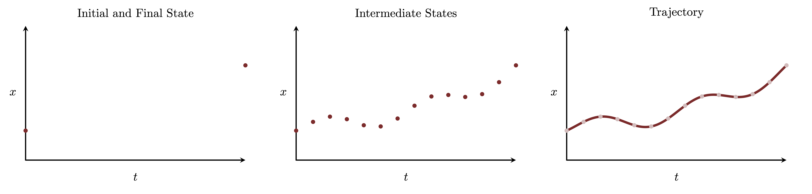

```{r setup, include=FALSE}
knitr::opts_chunk$set(comment=NA)
knitr::opts_knit$set(global.par = TRUE)
```

In this case study I introduce the very basics of modeling and inference with
stochastic differential equations.  To demonstrate the concepts I also provide
examples of both prior and posterior inference in Stan.

# Stochastic Differential Equations

Stochastic differential equations and stochastic processes are rich and
sophisticated mathematics and in this section we will introduce only the main
concepts.  We will begin by framing ordinary differential equations as a way
to generate deterministic evolution and then introduce stochastic differential
equations as a way to generate probabilistic evolution.  Finally we will discuss
how that probabilistic evolution can be approximated in practice.

There are many references for further exploration although I have found that
@Pavliotis:2006 is a particularly comprehensive resource.

## Deterministic Differential Equations

A first-order, ordinary differential equation defines how a real-valued _state_
$x \in X \subseteq \mathbb{R}^{D}$ varies with respect to infinitesimal changes
in some auxiliary, real-valued quantity $t \in \mathbb{R}$,
$$
\frac{ \mathrm{d} x }{ \mathrm{d} t } = f(x, t).
$$
Here I will consider this auxiliary quantity as time so that the differential
equation defines the temporal evolution of some state.

Writing this first-order, ordinary differential equation in terms of
differentials,
$$
\mathrm{d} x = \mathrm{d} t \, f(x, t),
$$
allows us to integrate the differential equation from some initial state
$x_{0}$ at time $t = 0$ to the configuration of the state at a later time $T$,
$$
\begin{align*}
\mathrm{d} x &= \mathrm{d} t \, f(x, t)
\\
\int_{x_{0}}^{x_{T}} \mathrm{d} x' &= \int_{0}^{T} \mathrm{d} t' \, f(x(t'), t')
\\
x_{T} - x_{0} &= \int_{0}^{T} \mathrm{d} t' \, f(x(t'), t')
\\
x_{T} &= x_{0} + \int_{0}^{T} \mathrm{d} t' \, f(x(t'), t')
\end{align*}
$$
In other words the differential equation defines a deterministic map from some
input state at time $t = 0$ to some output state at time $t = T$.

By separating the integration into smaller intervals we can also recover
intermediate states.  Consider for example the sequence of states
$x_{1}, \ldots, x_{N}$ at the times $t_{1}, \ldots, t_{N}$ with
$$
0 = t_{0} \lt t_{1} \lt \ldots \lt t_{N} = T.
$$
Given the initial state $x_{0}$ at $t = t_{0} = 0$ we can derive the first state
$x_{1}$ by integrating to $t_{1}$,
$$
x_{1} = x_{0} + \int_{t_{0}}^{t_{1}} \mathrm{d} t' \, f(x(t'), t').
$$
At that point we can derive the second state by integrating from $t_{1}$ to
$t_{2}$,
$$
x_{2} = x_{1} + \int_{t_{1}}^{t_{2}} \mathrm{d} t' \, f(x(t'), t'),
$$
and so on until we derive the final state from
$$
x_{N} = x_{N - 1} + \int_{t_{N - 1}}^{T} \mathrm{d} t' \, f(x(t'), t').
$$
Consequently the differential equation defines a deterministic map from the
input state to any sequence of later states.

If we consider an infinite number of intermediate times then we can recover all
of the intermediate states at the times time $t \in [0, T]$ while integrating
from $t = 0$ to $t = T$.  From this perspective the differential equation and
initial state define a function from time to state configurations,
$$
\begin{alignat*}{6}
x :\; &[0, T]& &\rightarrow& \; &X&
\\
&t& &\mapsto& &x(t) = x_{0} + \int_{0}^{t} \mathrm{d} t' \, f(x(t'), t')&,
\end{alignat*}
$$
which we refer to as a _trajectory_.

<center>
<br>
```{r, out.width = "100%", echo=FALSE}

```
<br><br>
</center>

## Stochastic Differential Equations

A first-order _stochastic_ differential equation introduces a probabilistic
element to the evolution of a system along some auxiliary quantity.  In analogy
to the deterministic differential equation that we considered above we can
define a stochastic differential equation as
$$
\mathrm{d} x = \mathrm{d} t \, f(x, t) + \mathrm{d} W_{t} \, g(x, t),
$$
where $\mathrm{d} W_{t}$ in the new term denotes a _Wiener process_ that defines
an independent distribution of perturbing values at each time $t$.

Technically there are two common ways to specify stochastic differential
equations, depending on how that second probabilistic term is treated.  The form
used above, and which we will use through this study, is known as the _Itô_ form
of a stochastic differential equation; a common alternative is the
_Stratonovich_ form.  Both forms can be used to implement the same probabilistic
evolutions, but the precise mathematical details of those implementations are
different.

The words "stochastic" and "probabilistic" derive from the same linguistic root,
the former through Greek and the latter through Latin.  They also refer to the
same underlying mathematics.  Although "stochastic differential equation" has
become conventional in the academic literature these mathematical systems can
just as well be referred to as "probabilistic differential equations".  In fact
"probabilistic" more directly describes how these systems transcend ordinary
differential equations.

Although even defining the integration of these systems is complicated, it can
be done with enough mathematical fortitude.  What results are probabilistic
variants of the deterministic evolution we derived from an ordinary differential
equation.

Integrating a stochastic differential equation from the initial state $x'$ at
time $t'$ to the time $t$ yields not a single new state configuration but rather
a _probability distribution_ of state configurations represented by the
conditional probability density function
$$
\pi(x_{t} \mid x_{t'}) \equiv p(x, t; x', t').
$$
Formally this conditional probability density function is implicitly defined by
the _Fokker-Plank_ partial differential equation,
$$
\frac{ \partial}{\partial t} p(x, t; x', t')
=
- \frac{ \partial}{\partial x} \left( p(x, t; x', t') \cdot f(x, t) \right)
+ \frac{ \partial^{2}}{\partial x^{2}} \left( p(x, t; x', t')\cdot g(x, t) \right).
$$
with initial value
$$
p(x, t = t'; x', t') = \delta(x - x').
$$

Similarly integrating across multiple time intervals defines a joint probability
distribution over the corresponding intermediate states,
$$
\pi(x_{1}, \ldots, x_{N} \mid x_{0})
=
\prod_{n = 1}^{N} \pi(x_{n} \mid x_{n - 1}).
$$
In the same way integrating over infinitesimal time intervals defines a
probability distribution over the infinite-dimensional space of trajectories!
These infinite-dimensional probability distributions are referred to as
_stochastic processes_.

Equivalently we can consider the stochastic differential equation as first
defining an infinite-dimensional probability distribution over trajectories
which we can then marginalize to a finite-dimensional probability distribution
over the states at a finite set of times.  The similarity to
[gaussian processes](https://betanalpha.github.io/assets/case_studies/gaussian_processes.html)
here is no coincidence; gaussian processes are special case of stochastic
processes and many gaussian process have not only useful kernel representations
but also useful stochastic differential equation representations.

In either case we never actually work with that infinite-dimensional model
directly.  Instead we only ever consider the marginalization to a finite number
of states,
$$
\pi(x_{1}, \ldots, x_{N} \mid x_{0})
=
\prod_{n = 1}^{N} \pi(x_{n} \mid x_{n - 1}).
$$

## Numerical Integration of Stochastic Differential Equations

While the Fokker-Plank equation formally defines the conditional probability
density functions that specifies the probabilistic evolution of a stochastic
differential equation, in practice we can rarely solve for that probabilistic
evolution in closed form.

In order to incorporate a stochastic differential equation
$$
\mathrm{d} x = \mathrm{d} t \, f(x, t) + \mathrm{d} W_{t} \, g(x, t),
$$
into a model we often have to consider tractable approximations to
$\pi(x_{1}, \ldots, x_{I} \mid x_{0})$.  The most common approximation is the
_Euler-Maruyama approximation_ which models each conditional distribution as
$$
\pi(x_{n} \mid x_{n - 1})
\approx
\text{normal} \left(
x_{n - 1} + f(x_{n - 1}, t_{n - 1}) \cdot (t_{n} - t_{n - 1}),
g(x_{n - 1}, t_{n - 1}) \cdot \sqrt{ t_{n} - t_{n - 1} } \right).
$$
We can interprete this approximation as a first-order Euler approximation to
the deterministic evolution,
$$
\xi_{n} \approx x_{n - 1} + f(x_{n - 1}, t_{n - 1}) \cdot (t_{n} - t_{n - 1}),
$$
convolved with a distribution of perturbations,
$$
\begin{align*}
\delta_{n} &\sim \text{normal} \left(0,
g(x_{n - 1}, t_{n - 1}) \cdot \sqrt{ t_{n} - t_{n - 1} } \right)
\\
x_{n} &\rightarrow \xi_{n - 1} + \delta_{n}.
\end{align*}
$$

While not the most sophisticated method the Euler-Maruyama approximation is
straightforward to implement in practice and can be reasonably accurate if the
time differences $t_{n} - t_{n - 1}$ are small enough.  If the states of
practical interest are too far apart to achieve a reasonable accuracy then the
only way to utilize the Euler-Maruyama approximation is to introduce
intermediate states to fill in the gaps.

In other words we have to model
$$
\begin{align*}
\pi(x_{1}, \ldots, x_{N} \mid x_{0})
&=
\prod_{n = 1}^{I} \pi(x_{n} \mid x_{n - 1})
\\
&\approx
\text{normal} \left(
x_{n - 1} + f(x_{n - 1}, t_{n - 1}) \cdot (t_{n} - t_{n - 1}),
g(x_{n - 1}, t_{n - 1}) \cdot \sqrt{ t_{n} - t_{n - 1} } \right).
\end{align*}
$$
for large enough $N$ such that each $t_{n} - t_{n - 1}$ is small enough for the
Euler-Maruyama approximation to be sufficiently accurate.  Only afterwards can
we select the subset of $x_{n}$ that we'll need to evaluate the rest of the
model.

# Implementing Stochastic Differential Equations

In this section we'll discuss how to incorporate stochastic differential
equations into probabilistic models and _infer_ which state configurations are
consistent with observed data, both theoretically and in practice with Stan.

In preparation let's set up our `R` environment for running Stan,

```{r, warning=FALSE, message=FALSE}
library(rstan)
rstan_options(auto_write = TRUE)
options(mc.cores = parallel::detectCores())
parallel:::setDefaultClusterOptions(setup_strategy = "sequential")

util <- new.env()
source('stan_utility.R', local=util)

set.seed(5584339)
```

and configure our graphical settings,

```{r}
library(colormap)

c_light <- c("#DCBCBC")
c_light_highlight <- c("#C79999")
c_mid <- c("#B97C7C")
c_mid_highlight <- c("#A25050")
c_dark <- c("#8F2727")
c_dark_highlight <- c("#7C0000")

nom_colors <- c("#DCBCBC", "#C79999", "#B97C7C", "#A25050", "#8F2727", "#7C0000")

c_light_teal <- c("#6B8E8E")
c_mid_teal <- c("#487575")
c_dark_teal <- c("#1D4F4F")

par(family="CMU Serif", las=1, bty="l", cex.axis=1, cex.lab=1, cex.main=1,
    xaxs="i", yaxs="i", mar = c(5, 5, 3, 1))
```

## The Ornstein–Uhlenbeck Process

To demonstrate the basic concepts of stochastic differential equations let's
consider a mean-reverting _Ornstein–Uhlenbeck process_ defined over the state
space $X = \mathbb{R}$ with the stochastic differential equation
$$
\mathrm{d} x = \mathrm{d} t \, \gamma \, (\mu - x) + \mathrm{d} W_{t} \, \tau.
$$
Here the deterministic evolution defined by
$$
\mathrm{d} x = \mathrm{d} t \, \gamma \, (\mu - x)
$$
alone eventually converges to $\mu$ with $\gamma$ determining the speed of that
convergence.  The probabilistic contribution introduces perturbations around
that deterministic behavior that propagation along the evolution.  Because of
these perturbations almost all of the trajectories that can be realized from
this process are continuous but not differentiable.

A huge benefit of the mean-reverting Ornstein–Uhlenbeck process is that the
corresponding Fokker-Plank equation can be solved in closed form to give an
exact description of the probabilistic evolution from a fixed initial point,
$$
\pi(x_{t} \mid x_{t'})
=
\text{normal} \left( x_{t} \mid
\mu + (x_{t'} - \mu) e^{- \gamma \, (t - t')},
\frac{\tau}{\sqrt{2}} \sqrt{ \frac{ 1 - e^{- 2 \, \gamma \, (t - t')}}{\gamma} }
\right),
$$
or equivalently
$$
\pi(x_{t + \delta t} \mid x_{t})
=
\text{normal} \left( x_{t + \delta t} \mid
\mu + (x_{t} - \mu) e^{-\gamma \, \delta t},
\frac{\tau}{\sqrt{2}} \sqrt{ \frac{ 1 - e^{- 2 \, \gamma \, \delta t}}{\gamma} }
\right).
$$
From this onditional probability density function between neighboring states we
can then build up the probability density function for all states given the
initial state.

The Euler-Maruyama approximation utilizes the conditional density function
with
$$
\pi(x_{t + \delta t} \mid x_{t})
=
\text{normal} \left( x_{t + \delta t} \mid
x_{t} + \gamma \, (\mu - x_{t}) \, \delta t,
\tau \, \sqrt{\delta t}
\right).
$$
In this case the Euler-Maruyama approximation is given by the same normal
family of probability density functions as the exact solution.  Moreover the
location and scale parameters of the approximation with the normal family are
equivalent to the best linear approximations of the exact location and scale
parameters,
$$
\begin{align*}
\mu + (x_{t} - \mu) e^{-\gamma \, \delta t}
&\approx \mu + (x_{t} - \mu) \, (1 - \gamma \, \delta t)
\\
&\approx \mu + x_{t} - \mu - \gamma \, (x_{t} - \mu) \, \delta t
\\
&\approx x_{t} + \gamma \, (\mu - x_{t}) \, \delta t,
\end{align*}
$$
and
$$
\begin{align*}
\frac{\tau}{\sqrt{2}} \sqrt{ \frac{ 1 - e^{-2 \gamma \, \delta t}}{\gamma} }
&=
\tau \, \sqrt{ \frac{ 1 - e^{-2 \gamma \, \delta t}}{2 \, \gamma} }
\\
&\approx
\tau \, \sqrt{ \frac{ 1 - 1 + 2 \gamma \, \delta t}{2 \, \gamma} }
\\
&\approx
\tau \, \sqrt{ \frac{ 2 \gamma \, \delta t}{2 \, \gamma} }
\\
&\approx
\tau \, \sqrt{ \delta t }.
\end{align*}
$$
This coincidence, however, will not hold in general.

## Simulating Probabilistic Evolution

In order to simulate the probabilistic evolution defined by a stochastic
differential equation we have to sample from the corresponding joint
distribution of states.  Here let's consider states on a relatively fine
partition of times between $t = 0$ and $t = 10$.

```{r}
N <- 100

t <- 10 * (0:N) / N
```

For convenience I've explicitly included the initial state so that there are
$N + 1$ total times.

Fixing the initial condition $x_{0}$ allows us to evolve to the $N$ states that
follow in time.  If we also fix the Ornstein-Uhlenbeck parameters $\mu$,
$\gamma$, and $\tau$ then we can use the conditional density function derived
from the Fokker-Plank equation to construct a joint density function for all of
the following states,
$$
\begin{align*}
\pi(x_{1}, \ldots, x_{N} \mid x_{0}, \mu, \gamma, \tau)
&=
\prod_{n = 1}^{N} \pi(x_{n} \mid x_{n - 1}, \mu, \gamma, \tau)
\\
&=
\prod_{n = 1}^{N}
\text{normal} \left( x_{n} \mid
\mu + (x_{n - 1} - \mu) e^{-\gamma \, (t_{n} - t_{n - 1})},
\frac{\tau}{\sqrt{2}} \sqrt{ \frac{ 1 - e^{- 2 \gamma \, (t_{n} - t_{n - 1})}}{\gamma} }
\right).
\end{align*}
$$

Conveniently this joint density function is straightforward to implement in
Stan.

```{r}
writeLines(readLines("stan_programs/ou_analytic.stan"))
```

Given the Stan program we can use Markov chain Monte Carlo to simulate
realized trajectories evolving from $x_{0}$.

```{r}
x0 <- -2

mu <- 4
gamma <- 0.75
tau <- 1

simu_data <- list(N=N, t=t, x0=x0, mu=mu, gamma=gamma, tau=tau)
```

```{r, warning=FALSE, message=FALSE}
fit <- stan(file='stan_programs/ou_analytic.stan', data=simu_data,
            seed=494838, refresh=1000)
```

The warning here arises because we're using the concatenated array `x` to build
up the joint density function instead of the stated parameters `x_free`.  In
this case the warning is a false positive.

```{r}
util$check_all_diagnostics(fit)
```

Because `x[1]` here is just the fixed initial condition we can ignore the
effective sample size and $\hat{R}$ warnings and move on.

```{r}
ou_anal_mcmc_samples <- extract(fit)
```

Because our times are so close together we might be tempted to interpolate
between each sampled state configuration with a line in order to approximately
visualize the trajectories supported by this Ornstein-Uhlenbeck.  Technically
the Ornstein-Uhlenbeck process allocates zero probability to piecewise
continuous trajectories, including these linear interpolations, but this
visualization device is still common despite it not being formally correct.  We
just have to be careful to recognize that if we zoomed into any line segment
then we would see more variation.

```{r}
plot_realizations <- function(t, x, name, ylim=c(-3, 7)) {
  I <- length(x[,1])

  plot_idx <- seq(1, I, 80)
  J <- length(plot_idx)
  line_colors <- colormap(colormap=nom_colors, nshades=J)

  plot(1, type="n", xlab="t", ylab="x", main=name,
       xlim=c(t[1], t[length(t)]), ylim=ylim)
  for (j in 1:J)
    lines(t, x[plot_idx[j],], col=line_colors[j], lwd=2)
}

plot_marginal_quantiles <- function(t, x, name, ylim=c(-3, 7)) {
  probs = c(0.1, 0.2, 0.3, 0.4, 0.5, 0.6, 0.7, 0.8, 0.9)
  cred <- sapply(1:length(t), function(n) quantile(x[,n], probs=probs))

  plot(1, type="n", main=name,
       xlab="t", ylab="x", xlim=c(t[1], t[length(t)]), ylim=ylim)
  polygon(c(t, rev(t)), c(cred[1,], rev(cred[9,])),
          col = c_light, border = NA)
  polygon(c(t, rev(t)), c(cred[2,], rev(cred[8,])),
          col = c_light_highlight, border = NA)
  polygon(c(t, rev(t)), c(cred[3,], rev(cred[7,])),
          col = c_mid, border = NA)
  polygon(c(t, rev(t)), c(cred[4,], rev(cred[6,])),
          col = c_mid_highlight, border = NA)
  lines(t, cred[5,], col=c_dark, lwd=2)
}


par(mfrow=c(1, 2))

plot_realizations(simu_data$t, ou_anal_mcmc_samples$x, "Trajectory Realizations")
plot_marginal_quantiles(simu_data$t, ou_anal_mcmc_samples$x, "Marginal Quantiles")
```

While Markov chain Monte Carlo worked well here we can also exploit the
conditional structure of the joint density function to generate exact samples
with ancestral sampling, allowing us to use pure Monte Carlo.

```{r}
writeLines(readLines("stan_programs/simu_ou_analytic.stan"))
```

```{r, warning=FALSE, message=FALSE}
fit <- stan(file='stan_programs/simu_ou_analytic.stan', data=simu_data,
            warmup=0, iter=4000, chains=1, seed=494838,
            algorithm="Fixed_param", refresh=4000)

ou_anal_mc_samples <- extract(fit)
```

While the resulting simulations are cheaper to generate they yield the same
qualitative results as the Markov chain Monte Carlo sampling.

```{r}
par(mfrow=c(1, 2))

plot_realizations(simu_data$t, ou_anal_mc_samples$x, "Trajectory Realizations")
plot_marginal_quantiles(simu_data$t, ou_anal_mc_samples$x, "Marginal Quantiles")
```

With the states so close in time we should also be able to approximate this
probabilistic evolution with the Euler-Maruyama approximation.  As with the
analytic model we can implement the Euler-Maruyama joint density function in
Stan and then use Markov chain Monte Carlo to generate samples.

```{r}
writeLines(readLines("stan_programs/ou_em.stan"))
```

```{r, warning=FALSE, message=FALSE}
fit <- stan(file='stan_programs/ou_em.stan', data=simu_data,
            seed=494838, refresh=1000)

util$check_all_diagnostics(fit)
```

These warnings are safe to ignore here for the same reasons as above.

```{r}
ou_em_mcmc_samples <- extract(fit)

par(mfrow=c(1, 2))

plot_realizations(simu_data$t, ou_em_mcmc_samples$x, "Trajectory Realizations")
plot_marginal_quantiles(simu_data$t, ou_em_mcmc_samples$x, "Marginal Quantiles")
```

The iterative nature of the Euler-Maruyama approximation also naturally admits
ancestral sampling.

```{r}
writeLines(readLines("stan_programs/simu_ou_em.stan"))
```

```{r, warning=FALSE, message=FALSE}
fit <- stan(file='stan_programs/simu_ou_em.stan', data=simu_data,
            warmup=0, iter=4000, chains=1, seed=494838,
            algorithm="Fixed_param", refresh=4000)
         
ou_em_mc_samples <- extract(fit)
```

```{r}
par(mfrow=c(1, 2))

plot_realizations(simu_data$t, ou_em_mc_samples$x, "Trajectory Realizations")
plot_marginal_quantiles(simu_data$t, ou_em_mc_samples$x, "Marginal Quantiles")
```

Because we have analytic results we can visually confirm that the Euler-Maruyama
approximation is doing quite well for this time discretization, although in
general validating the accuracy of the approximation is significantly more
challenging.

```{r}
par(mfrow=c(2, 2))

plot_marginal_quantiles(simu_data$t, ou_anal_mcmc_samples$x,
                        "Analytic Markov Chain Monte Carlo")
plot_marginal_quantiles(simu_data$t, ou_anal_mc_samples$x,
                        "Analytic Monte Carlo")
plot_marginal_quantiles(simu_data$t, ou_em_mcmc_samples$x,
                        "Euler-Maruyama Markov Chain Monte Carlo")
plot_marginal_quantiles(simu_data$t, ou_em_mc_samples$x,
                        "Euler-Maruyama Monte Carlo")
```

When we're interested in inferring the initial condition and the
Ornstein-Uhlenbeck parameters we need to give them their own probabilistic
structure.  This results in a full latent model that covers all of the states
and the stochastic process parameters,
$$
\begin{align*}
\pi(x_{0}, x_{1}, \ldots, x_{N}, \mu, \gamma, \tau)
&=
\pi(x_{1}, \ldots, x_{N} \mid x_{0}, \mu, \gamma, \tau) \, \pi(x_{0}) \,
\pi(\mu, \gamma, \tau)
\\
&=
\left[ \prod_{n = 1}^{N} \pi(x_{n} \mid x_{n - 1}, \mu, \gamma, \tau) \right] \,
\pi(x_{0}) \, \pi(\mu, \gamma, \tau).
\end{align*}
$$

With just a few modifications of our initial program we can implement this
expanded model in Stan.

```{r}
writeLines(readLines("stan_programs/simu_ou_analytic_full_latent.stan"))
```

```{r, warning=FALSE, message=FALSE}
fit <- stan(file='stan_programs/simu_ou_analytic_full_latent.stan', data=simu_data,
            warmup=0, iter=4000, chains=1, seed=494838,
            algorithm="Fixed_param", refresh=4000)


prior_samples <- extract(fit)
```

By incorporating an entire space of initial conditions and Ornstein-Uhlenbeck
configurations we drastically increase the diversity of trajectory behaviors
that we can integrate into inferential models.

```{r}
par(mfrow=c(1, 2))

plot_realizations(simu_data$t, prior_samples$x, "Trajectory Realizations", ylim=c(-30, 30))
plot_marginal_quantiles(simu_data$t, prior_samples$x, "Marginal Quantiles", ylim=c(-30, 30))
```

```{r, eval=FALSE, echo=FALSE}
s <- 84
mu <- prior_samples$mu[s]
gamma <- prior_samples$gamma[s]
tau <- prior_samples$tau[s]
x0 <- prior_samples$x0[s]
x <- prior_samples$x[s,]

stan_rdump(c("mu", "gamma", "tau", "x0", "x"), file="truth.data.R")

N <- simu_data$N
t <- simu_data$t

N_obs <- 20
obs_idx <- c(2, 4, 15, 18, 20, 24, 28, 29, 36, 37, 63, 66, 67, 68, 69, 76, 87, 89, 91, 96)

t_obs <- simu_data$t[obs_idx]
sigma <- 0.25

y_obs <- x[obs_idx] + rnorm(N_obs, 0, sigma)

stan_rdump(c("N", "t", "N_obs", "obs_idx", "t_obs", "y_obs", "sigma"), file="obs.data.R")
```

## Inferring Stochastic Processes

Speaking of inferential models let's consider observations made at different
times, and hence generated from some of the latent states evolving according to
our assumed stochastic differential equation,
$$
\pi(y_{1}, \ldots, y_{K} | x_{n(1)}, \ldots x_{n(K)}).
$$
In this context we can ask which configurations of the latent stochastic process
are compatible with realized observations
$\tilde{y}_{1}, \ldots, \tilde{y}_{K}$.

To quantify this consistency with Bayesian inference we first construct the full
Bayesian model,
$$
\begin{align*}
\pi(y_{1}, \ldots, y_{K}, x_{0}, x_{1}, \ldots, x_{N}, \mu, \tau, \gamma)
&= \;\;
\pi(y_{1}, \ldots, y_{K} | x_{n(1)}, \ldots x_{n(K)})
\\
&\quad \cdot
\pi(x_{0}, x_{1}, \ldots, x_{N}, \mu, \tau, \gamma),
\end{align*}
$$
and then let Stan condition on the observed data and generate samples from the
corresponding posterior distribution,
$$
\pi(x_{0}, x_{1}, \ldots, x_{N}, \mu, \gamma, \tau
\mid \tilde{y}_{1}, \ldots, \tilde{y}_{K}).
$$

Even if we are interested in only the Ornstein-Uhlenbeck parameters $\mu$,
$\tau$, and $\gamma$ we first have to construct the full posterior distribution
and then marginalize,
$$
\begin{align*}
\pi(\mu, \gamma, \tau \mid y_{1}, \ldots, y_{K}).
&=
\int \prod_{n = 0}^{N} \mathrm{d} x_{n} \,
\pi(x_{1}, \ldots, x_{N}, x_{0}, \mu, \gamma, \tau
\mid \tilde{y}_{1}, \ldots, \tilde{y}_{K})
\\
&=
\int \prod_{k = 0}^{K} \mathrm{d} x_{n(k)} \,
\pi(x_{n(1)}, \ldots, x_{n(K)}, x_{0}, \mu, \gamma, \tau
\mid \tilde{y}_{1}, \ldots, \tilde{y}_{K})
\end{align*}
$$

Whenever we condition on observed data only the state configurations
$x_{1}, \ldots, x_{N}$ realized from the _posterior_ stochastic process, not the
_prior_ stochastic process, are relevant.  In particular the simulations we
generated from $\pi(x_{0}, x_{1}, \ldots, x_{N}, \mu, \gamma, \tau)$ above will
not be helpful in quantifying our posterior inferences.

To demonstrate proper posterior inference let's bring in some simulated data,
along with the true realization from which the data were simulated for
comparison.

```{r}
data <- read_rdump("data/obs.data.R")
truth <- read_rdump("data/truth.data.R")

par(mfrow=c(1, 1))

plot(data$t, truth$x, type="l", lwd=2, main="", col="black",
     xlab="t", ylab="x", xlim=c(0, 10), ylim=c(-8, 10))

points(data$t_obs, data$y_obs, pch=16, cex=1.00, col="white")
points(data$t_obs, data$y_obs, pch=16, cex=0.75, col=c_mid_teal)
```

Here we will assume that the observations are given by independent normal
density functions,
$$
\pi(y_{1}, \ldots, y_{K} | x_{n(1)}, \ldots x_{n(K)})
=
\prod_{k = 1}^{K} \text{normal}(y_{k} \mid x_{n(k)}, \sigma).
$$
Because the measurement variability $\sigma$ is often difficult to distinguish
from the Ornstein-Uhlenbeck variability $\tau$ I will fix $\sigma$ to its true
value to simplify the demonstration here.  The potential degeneracies of common
stochastic processes are their own long discussion.

With the exact probabilistic evolution model we can construct the full Bayesian
model in Stan using only the states at the observed times.  This is useful if we
are interested in only the Ornstein-Uhlenbeck parameters and not the underlying
trajectories.

```{r}
writeLines(readLines("stan_programs/fit_ou_analytic_obs_t.stan"))
```

```{r, warning=FALSE, message=FALSE}
data$t0 <- data$t[1]

fit <- stan(file='stan_programs/fit_ou_analytic_obs_t.stan',
            data=data, seed=5838299, refresh=1000)

util$check_all_diagnostics(fit)

posterior_samples <- extract(fit)
```

The marginal posterior distribution demonstrate that the posterior captures the
true configuration of the underlying Ornstein-Uhlenbeck process well.

```{r}
plot_marginal <- function(name, prior_samples, posterior_samples, display_xlims) {
  prior_values <- prior_samples[name][[1]]
  posterior_values <- posterior_samples[name][[1]]
  bin_lims <- range(c(prior_values, posterior_values))
  delta <- diff(range(posterior_values)) / 50
  breaks <- seq(bin_lims[1], bin_lims[2]+ delta, delta)

  y_max <- max(hist(prior_values, breaks=breaks, plot=F)$counts,
               hist(posterior_values, breaks=breaks, plot=F)$counts)

  hist(prior_values, breaks=breaks,
       main="", xlab=name, xlim=display_xlims,
       ylab="", ylim=c(0, 1.05 * y_max), yaxt='n',
       col=c_light, border=c_light_highlight)
  hist(posterior_values, breaks=breaks,
       col=c_dark, border=c_dark_highlight, add=T)
  abline(v=truth[name], col="white", lty=1, lwd=3)
  abline(v=truth[name], col="black", lty=1, lwd=2)
}

par(mfrow=c(2, 2))

plot_marginal("mu", prior_samples, posterior_samples, c(-20, 20))
plot_marginal("gamma", prior_samples, posterior_samples, c(0, 3))
plot_marginal("tau", prior_samples, posterior_samples, c(0, 4))
plot_marginal("x0", prior_samples, posterior_samples, c(-10, 10))
```

If we want to investigate the latent trajectories consistent with the
observations, and not just the state behavior at the observed times, then we
need to consider a fine temporal grid and the many state configurations along
that grid.

```{r}
writeLines(readLines("stan_programs/fit_ou_analytic_all_t.stan"))
```

As this case study is meant to be a brief discussion I won't walk us through
every detail of this more sophisticated Stan program.  In summary the analytic
probabilistic evolution model introduces many latent normal density functions
which can be implemented with the centered and non-centered parameterizations we
discussed in my
[hierarchical modeling case study](https://betanalpha.github.io/assets/case_studies/hierarchical_modeling.html).  The best geometry is given by centering only those
states that are strongly informed by the realized likelihood function, which in
this case include the states at the observed times.

```{r, warning=FALSE, message=FALSE}
data$unobs_idx <- setdiff(1:data$N + 1, data$obs_idx)

fit <- stan(file='stan_programs/fit_ou_analytic_all_t.stan',
                  data=data, seed=5838299, refresh=1000)

util$check_all_diagnostics(fit)

anal_post_samples <- extract(fit)
```

With a normal density function connecting each latent state there are many
opportunities for funnel degeneracies, but our careful parameterization seems to
have been sufficient here.  Again a full discussion of the degeneracies inherent
to Ornstein-Uhlenbeck processes, let alone other common stochastic processes, is
beyond the scope of this case study.

Without any indication of computational problems we can move on to examining our
inferences.  The marginal posterior distributions are consistent with the
previous fit.

```{r}
par(mfrow=c(2, 2))

plot_marginal("mu", prior_samples, anal_post_samples, c(-20, 20))
plot_marginal("gamma", prior_samples, anal_post_samples, c(0, 3))
plot_marginal("tau", prior_samples, anal_post_samples, c(0, 4))
plot_marginal("x0", prior_samples, anal_post_samples, c(-10, 10))
```

Now, however, we can visualize the posterior stochastic process using the
technically-incorrect-but-practically-common linear interpolation heuristic.

```{r}
par(mfrow=c(2, 2))

plot_realizations(data$t, prior_samples$x,
                  "Prior Realizations", ylim=c(-12, 12))

plot_realizations(data$t, anal_post_samples$x,
                  "Posterior Realizations", ylim=c(-12, 12))
points(data$t_obs, data$y_obs, pch=16, cex=1.00, col="white")
points(data$t_obs, data$y_obs, pch=16, cex=0.75, col=c_mid_teal)

plot_marginal_quantiles(data$t, prior_samples$x,
                        "Prior Quantiles", yli=c(-12, 12))

plot_marginal_quantiles(data$t, anal_post_samples$x,
                        "Posterior Quantiles", yli=c(-12, 12))
points(data$t_obs, data$y_obs, pch=16, cex=1.00, col="white")
points(data$t_obs, data$y_obs, pch=16, cex=0.75, col=c_mid_teal)
```

Because we have access to the actual realized trajectory we can also see that
our inferred posterior distribution recovers that latent truth.

```{r}
par(mfrow=c(1, 2))

plot_realizations(data$t,anal_post_samples$x,
                  "Posterior Realizations", ylim=c(-6, 11))
lines(data$t, truth$x, type="l", lwd=3, main="", col="white")
lines(data$t, truth$x, type="l", lwd=2, main="", col="black")
points(data$t_obs, data$y_obs, pch=16, cex=1.00, col="white")
points(data$t_obs, data$y_obs, pch=16, cex=0.75, col=c_mid_teal)

plot_marginal_quantiles(data$t, anal_post_samples$x,
                        "Posterior Quantiles", yli=c(-6, 11))
lines(data$t, truth$x, type="l", lwd=3, main="", col="white")
lines(data$t, truth$x, type="l", lwd=2, main="", col="black")
points(data$t_obs, data$y_obs, pch=16, cex=1.00, col="white")
points(data$t_obs, data$y_obs, pch=16, cex=0.75, col=c_mid_teal)
```

Finally let's consider how well we can infer these behaviors using the
Euler-Maruyama approximation to which we're often limited in practice.  In this
case the fine temporal grid between the observation times isn't just a
convenience but rather a requirement for reasonable accuracy.

```{r}
writeLines(readLines("stan_programs/fit_ou_em_all_t.stan"))
```

No matter the structure of the generating stochastic differential equation the
Euler-Maruyama approximation always yields latent normal density functions, and
the parameterization considerations from above will always be relevant.

```{r, warning=FALSE, message=FALSE}
fit <- stan(file='stan_programs/fit_ou_em_all_t.stan', data=data, seed=5838299, refresh=1000)

util$check_all_diagnostics(fit)

em_post_samples <- extract(fit)
```

The diagnostics look clean, allowing us to move on to investigation of the
posterior distribution.  Despite the approximate model the resulting marginal
posterior distributions agree with the those from the exact model.

```{r}
par(mfrow=c(2, 2))

plot_marginal("mu", prior_samples, em_post_samples, c(-20, 20))
plot_marginal("gamma", prior_samples, em_post_samples, c(0, 3))
plot_marginal("tau", prior_samples, em_post_samples, c(0, 4))
plot_marginal("x0", prior_samples, em_post_samples, c(-10, 10))
```

Similarly we are able to recover the true trajectory realization.

```{r}
par(mfrow=c(1, 2))

plot_realizations(data$t, em_post_samples$x, "Posterior Realizations", ylim=c(-6, 11))
lines(data$t, truth$x, type="l", lwd=3, main="", col="white")
lines(data$t, truth$x, type="l", lwd=2, main="", col="black")
points(data$t_obs, data$y_obs, pch=16, cex=1.00, col="white")
points(data$t_obs, data$y_obs, pch=16, cex=0.75, col=c_mid_teal)

plot_marginal_quantiles(data$t, em_post_samples$x, "Posterior Quantiles", yli=c(-6, 11))
lines(data$t, truth$x, type="l", lwd=3, main="", col="white")
lines(data$t, truth$x, type="l", lwd=2, main="", col="black")
points(data$t_obs, data$y_obs, pch=16, cex=1.00, col="white")
points(data$t_obs, data$y_obs, pch=16, cex=0.75, col=c_mid_teal)
```

Visually comparing inferences from the exact and approximate models side by side
we don't see any substantial differences, indicating that the Euler-Maruyama
approximation is doing well.

```{r}
par(mfrow=c(2, 2))

plot_realizations(data$t,anal_post_samples$x,
                  "Analytic Posterior Realizations", ylim=c(-6, 11))
plot_realizations(data$t, em_post_samples$x,
                  "Euler-Maruyama Posterior Realizations", ylim=c(-6, 11))

plot_marginal_quantiles(data$t, anal_post_samples$x,
                        "Analytic Posterior Quantiles", yli=c(-6, 11))
plot_marginal_quantiles(data$t, em_post_samples$x,
                        "Euler-Maruyama Posterior Quantiles", yli=c(-6, 11))
```

When we observe only a few states and aren't interested in inferring latent
trajectories the fine temporal grid needed for the Euler-Maruyama approximation
to be reasonably accurate can be an expensive burden.  If we are interested in
recovering the realized trajectory to high temporal resolution anyways, however,
then the Euler-Maruyama approximation is quite natural.

That said quantifying the accuracy of the Euler-Maruyama approximation, and how
finely we need to discretize the time intervals between observed states, is a
much more subtle and challenging problem when we can't compare to the exact
model.

# Conclusion

Because of their probabilistic nature stochastic differential equations are
straightforward to incorporate into probabilistic models, making them a useful
modeling technique in many applications.  At least in theory approximations like
the Euler-Maruyama discretization also provide a general implementation strategy
even when the stochastic differential equation can't be solved in closed form.

In practice, however, implementing these approximations well requires care.
For these approximations to be reasonably accurate we need to model fine
temporal discretizations.  Identifying a sufficiently fine discretization is a
challenge in of itself, but in any case the models will be high-dimensional.
With prudent parameterizations computational tools like the dynamic Hamiltonian
Monte Carlo sampler implemented in Stan are often able to fit these
high-dimensional models, but the typical computational expensive forces us
to moderate our expectations for how generally practical stochastic differential
equation models might actually be.

# Acknowledgements

A very special thanks to everyone supporting me on Patreon: Aapeli Nevala,
Abhinav Katoch, Adam Bartonicek, Adam Fleischhacker, Adam Golinski,
Adriano Yoshino, Alan O'Donnell, Alessandro Varacca, alex , Alex ANDORRA,
Alexander Bartik, Alexander Noll, Alexander Rosteck, Anders Valind,
Andrea Serafino, Andrew Mascioli, Andrew Rouillard, Angus Williams,
Antoine Soubret, Ara Winter, Arya, asif zubair, Austin Carter, Austin Rochford,
Austin Rochford, Avraham Adler, bbbbb, Ben Matthews, Ben Swallow,
Benoit Essiambre, Bertrand Wilden, Bo Schwartz Madsen, Brian Hartley, Bryan Yu,
Brynjolfur Gauti Jónsson, Canaan Breiss, Cat Shark, Charles Naylor,
Chase Dwelle, Chris Jones, Chris Zawora, Christopher Mehrvarzi, Chuck Carlson,
Cole Monnahan, Colin Carroll, Colin McAuliffe, D, Damien Mannion, Damon Bayer,
Dan Killian, dan mackinlay, Dan Muck, Dan W Joyce, Dan Weitzenfeld,
Daniel Edward Marthaler, Daniel Hocking, Daniel Rowe, Darshan Pandit,
David Burdelski, David Humeau, David Pascall, Derek G Miller,
dilsher singh dhillon, Doug Rivers, Dylan Murphy, Ed Cashin, Ed Henry, Eduardo,
Eric Novik, Erik Banek, Ero Carrera, Ethan Goan, Eugene, Evan Cater,
Fabio Zottele, Federico Carrone, Felipe González, Fergus Chadwick,
Finn Lindgren, Florian Wellmann, Francesco Corona, Geoff Rollins, George Ho,
Granville Matheson, Greg Sutcliffe, Guido Biele, Hamed Bastan-Hagh, Haonan Zhu,
Harrison Katz, Henri Wallen, Hugo Botha, Huib Meulenbelt, Hyunji Moon, Ian ,
Ignacio Vera, Ilaria Prosdocimi, Isaac S, J, J Michael Burgess, Jair Andrade,
James Doss-Gollin, James McInerney, James Wade, JamesU, Janek Berger,
Jason Martin, Jason Pekos, Jeff Dotson, Jeff Helzner, Jeffrey Arnold,
Jeffrey Burnett, Jeffrey Erlich, Jessica Graves, Joel Kronander, Joel Ong,
John Flournoy, Jon , Jonathan St-onge, Jonathon Vallejo, Joran Jongerling,
Jordi Warmenhoven, Jose Pereira, Josh Weinstock, Joshua Duncan, Joshua Griffith,
Joshua Mayer, Josué Mendoza, Justin Bois, Karim Naguib, Karim Osman, Kejia Shi,
Konsta Happonen, Kádár András, Lane Harrison, lizzie , Luiz Carvalho,
Luiz Pessoa, Marc Dotson, Marc Trunjer Kusk Nielsen, Marcel Lüthi,
Marco Gorelli, Marek Kwiatkowski, Mario Becerra, Mark Donoghoe, Mark Worrall,
Markus P., Martin Modrák, Matthew, Matthew Hawthorne, Matthew Kay,
Matthew Quick, Matthew T Stern, Matthieu , Maurits van der Meer, Maxim Kesin,
Melissa Wong, Merlin Noel Heidemanns, Michael Cao, Michael Colaresi,
Michael DeWitt, Michael Dillon, Michael Lerner, Michael Tracy, Mick Cooney,
Miguel de la Varga, Mike Lawrence, MisterMentat , Mutual Information,
Márton Vaitkus, N , Name, Nathaniel Burbank, Nerf-Shepherd , Nicholas Cowie,
Nicholas Erskine, Nicholas Ursa, Nick S, Nicolas Frisby, Noah Guzman,
Octavio Medina, Ole Rogeberg, Oliver Crook, Olivier Ma, Omri Har Shemesh,
Pablo León Villagrá, Patrick Boehnke, Pau Pereira Batlle, Paul Oreto,
Peter Smits, Pieter van den Berg , Pintaius Pedilici, ptr,
Ramiro Barrantes Reynolds, Ravin Kumar, Raúl Peralta Lozada, Reece Willoughby,
Riccardo Fusaroli, Robert Frost, Robert Goldman, Robert kohn, Robert Mitchell V,
Robin Taylor, Rong Lu, Ryan Grossman, Ryan McMinds, Rémi , S Hong, Scott Block,
Scott Brown, Serena, Seth Axen, Shira, sid phani, Simon Dirmeier, Simon Duane,
Simon Lilburn, Srivatsa Srinath, sssz, STAN, Stephanie Fitzgerald,
Stephen Lienhard, Stephen Oates, Steve Bertolani, Stone Chen, Sus, Susan Holmes,
Svilup, Sören Berg, Tao Ye, Teddy Groves, Teresa Ortiz, Thomas Kealy,
Thomas Vladeck, Théo Galy-Fajou, Tiago Cabaço, Tim Howes, Tim Radtke, Tobychev,
Tom Knowles, Tom McEwen, Tommy Naugle, Tony Wuersch, Tyrel Stokes, Utku Turk,
Vincent Arel-Bundock, Virginia Fisher, vittorio trotta, Vladimir Markov,
Wil Yegelwel, Will Dearden, Will Farr, Will Kurt, Will Tudor-Evans, yolhaj,
yureq, Z, Zach A, Zad Rafi, Zhengchen Cai, and Zwelithini Tunyiswa.

# References {-}

<div id="refs"></div>

# License {-}

A repository containing the material used in this case study is available on
[GitHub](https://github.com/betanalpha/knitr_case_studies/tree/master/stochastic_differential_equations).

The code in this case study is copyrighted by Michael Betancourt and licensed
under the new BSD (3-clause) license:

https://opensource.org/licenses/BSD-3-Clause

The text and figures in this case study are copyrighted by Michael Betancourt
and licensed under the CC BY-NC 4.0 license:

https://creativecommons.org/licenses/by-nc/4.0/

# Original Computing Environment {-}

```{r, comment=NA}
writeLines(readLines(file.path(Sys.getenv("HOME"), ".R/Makevars")))
```

```{r, comment=NA}
sessionInfo()
```
