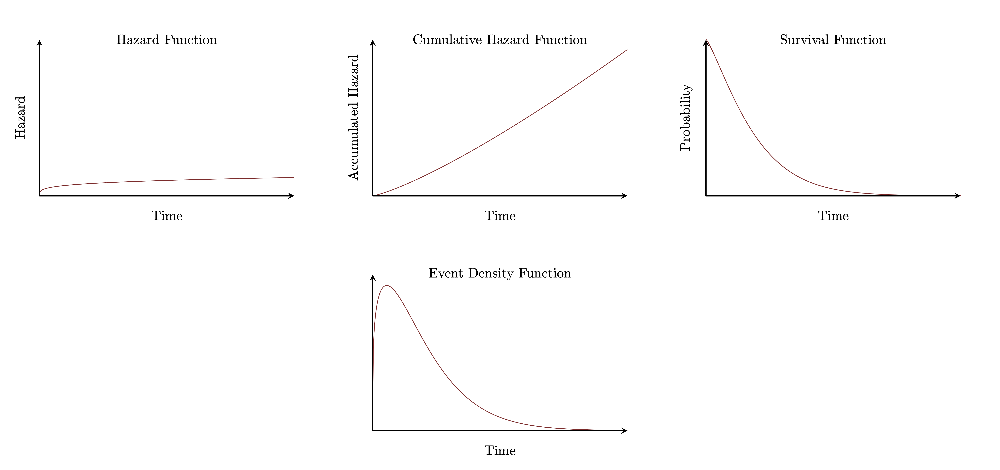
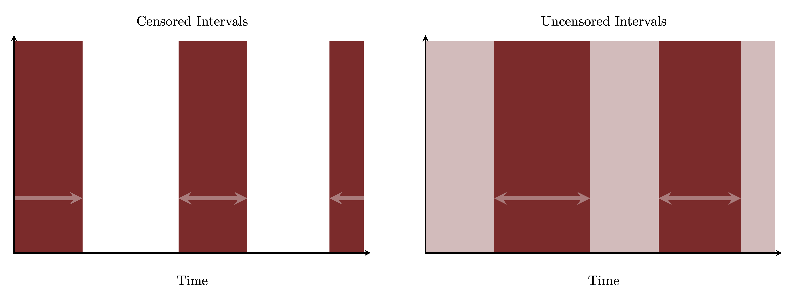
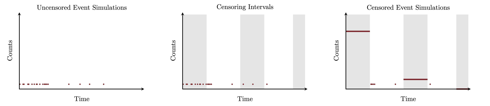

```{r setup, include=FALSE}
knitr::opts_chunk$set(comment=NA)
knitr::opts_knit$set(global.par = TRUE)
```

Survival modeling is a broadly applicable technique for modeling events that are
triggered by the persistent accumulation of some stimulus.  In this case study I
review the basic foundations of survival modeling from this particular
perspective and discuss their implementation in Stan.  Building upon those
foundations I also discuss censored survival models and sequential survival
models.

# Survival Modeling

In most theoretical and applied literature survival models are typically
motivated from a somewhat awkward probabilistic perspective
[@CoxEtAl:1984; @IbrahimEtAl:2001; @HosmerEtAl:2008].  In this section I take a
more applied perspective, returning to the conventional statistical definition
only afterwards.  We begin by defining the precise circumstances in which
survival models are defined, then introduce survival models through a hazard
function, and then endow the hazard function with its more conventional
interpretation.

## The Survival Function

At a fundamental level survival modeling concerns the observation of events that
can occur only once in a given system.  This setup is quite general and these
events can include everything from the death or maturation of a life form to the
obsolescence of a physical machine or the manifestation of a cultural practice.

The terminology is motivated from the perspective that a system "survives" in
its initial state until the events occurs, at which point the subject
transitions into its final state.  When the transition to the final state is
deleterious the term "survival modeling" is particularly understandable, but
it's a bit less appropriate when the transition is more beneficial.  A term like
"time-to-event modeling" would make sense more generally, but here I'll stick
with the more conventional terminology.

Without loss of generality we can take the initial time after which the event
can occur to be $t = 0$.  We will also make the more restrictive assumption that
the event will _always_ occur so that event times are always finite.  In other
words we will assume that event times are distributed across the open time
interval $t \in I(0, \infty)$.  I will denote the probability density function
representing this distribution as $\pi(t)$.

Because the time interval is one-dimensional and ordered we can also define a
cumulative distribution function,
$$
\begin{align*}
\Pi(t)
&= \mathbb{P}_{\pi}[ I(0, t) ]
\\
&= \int_{0}^{t} \mathrm{d} t' \, \pi(t').
\end{align*}
$$
In the survival modeling context $\Pi(t)$ quantifies the probability that the
event will occur anytime before time $t$.

We can similarly define a _complementary_ cumulative distribution function,
$$
\begin{align*}
S(t)
&= \mathbb{P}_{\pi}[ I(t, \infty) ]
\\
&= \int_{t}^{\infty} \mathrm{d} t' \, \pi(t')
\\
&= 1 - \Pi(t).
\end{align*}
$$
In the survival modeling context $S(t)$ quantifies the probability that the
event occurs anytime after time $t$.  This can also be interpreted as the
probability that the event does not occur before time $t$, or in other words the
probability that it _survives_ until time $t$.  Because of this $S(t)$ is
referred to as the _survival function_.

Given a survival function exact simulation of event times can be readily
achieved using a variant of the
[inverse cumulative distribution function method](https://betanalpha.github.io/assets/case_studies/sampling.html#223_Adapting_Pseudo-Random_Number_Generators_to_Target_Distributions),
$$
\begin{align*}
\tilde{p} &\sim \text{uniform}(0, 1)
\\
t &= S^{-1}(\tilde{p}).
\end{align*}
$$
When the survival function cannot be inverted analytically then the second step
requires a numerical inversion.

Inference, prediction, and simulation of these events are all conceptually
straightforward once we have specified a model through the event density
$\pi(t)$ or, equivalently, the survival function.  Unfortunately this model
specification isn't always well-aligned with our available domain expertise.
In those cases we can often facilitate model building by taking a different
perspective.

## The Hazard Function

In many cases the occurrence of an event is promoted by the accumulation of some
stimulating resource.  For example the maturation of a life form might be
induced by the accumulation of stored energy, while the malfunctioning of a
machine might be induced by the accumulation of wear and tear.  Following the
pessimistic terminology of survival modeling we will refer to this resource as
a _hazard_, although a "stimulus" would be more appropriate to the full scope of
these techniques.

A _hazard function_, $\lambda(t)$, quantifies the differential amount of hazard
introduced to the system at time $t$.  The _cumulative hazard function_
$$
\Lambda(t) = \int_{0}^{t} \mathrm{d} t' \, \lambda(t)
$$
then quantifies the total hazard accumulated up to time $t$.  Again "stimulus
function" and "accumulated stimulus function" would be more appropriate to the
general scope, but I will continue to bow to the more conventional terminology.

The more hazard that accumulates by a given time the less likely the event
should have survived to that time.  In other words the survival function should
decay with increasing hazard.  Survival models make the particular assumption of
an _exponential_ decay,
$$
\begin{align*}
S(t)
&=
\exp \left( - \Lambda(t) \right)
\\
&=
\exp \left( - \int_{0}^{t} \mathrm{d} t' \, \lambda(t) \right).
\end{align*}
$$

In this case the hazard function quantifies how the survival function, or more
specifically the log survival function, changes over time.  The larger the
hazard function within some interval the faster the survival function decreases
across that interval.  Similarly if the hazard function vanishes over some
interval then the survival function is constant across that interval.

This assumed relationship between the survival function and the hazard function,
however, does place some important constraints on the hazard function itself.

Because the survival function does not increase with time the accumulated hazard
function must be non-decreasing; this requires that the hazard function cannot
be negative.  In other words our assumed relationship requires that the
accumulating stimulus is _persistent_ and cannot be depleted by any external
factors.

Moreover our initial assumption that the event always occurs at a finite time
ensures that the survival function vanishes at infinity,
$$
0
= S(\infty)
= \exp \left( - \int_{0}^{\infty} \mathrm{d} t' \, \lambda(t) \right).
$$
This in turn requires that
$$
\int_{0}^{\infty} \mathrm{d} t' \, \lambda(t) = \infty.
$$
In words the stimulating resource modeled by the hazard function has to be
_inexhaustible_ so that an infinite amount will always accumulate after an
infinite amount of time.

Once we have constructed the survival function we can recover the event density
by differentiation,
$$
\begin{align*}
\pi(t)
&= - \frac{\mathrm{d} S}{\mathrm{d} t}(t)
\\
&= - \frac{\mathrm{d} }{\mathrm{d} t}
\exp \left( - \int_{0}^{t} \mathrm{d} t' \, \lambda(t) \right)
\\
&=
\left[ \frac{\mathrm{d} }{\mathrm{d} t}
\int_{0}^{t} \mathrm{d} t' \, \lambda(t) \right] \,
\exp \left( - \int_{0}^{t} \mathrm{d} t' \, \lambda(t) \right)
\\
&= \lambda(t) \, \exp \left( - \int_{0}^{t} \mathrm{d} t' \, \lambda(t) \right)
\\
&= \lambda(t) \, S(t).
\end{align*}
$$
This allows us to completely specify the event density with the hazard function.

<center>
<br>
```{r, out.width = "100%", echo=FALSE}

```
<br><br>
</center>

Of course the exponential relationship between the survival function and the
hazard function is not the only assumption that we could make, and some
applications might motivate more elaborate relationships.  For example we may
need to consider relationships that don't assume a persistent or inexhaustible
stimulus.  These different relationships, however, will also change the
connection between the hazard function and the event density, and hence how
the model is implemented in practice.

## A Probabilistic Interpretation of the Hazard Function

The derivation of the event density from the survival function, pun absolutely
intended, also motivates another interpretation for the hazard function.
Because the survival function quantifies the probability that an event has not
occurred before a given time we can write
$$
\begin{align*}
\pi(t) &= \lambda(t) \, S(t)
\\
\pi(t) &= \lambda(t) \, \mathbb{P}_{\pi}[ I(t, \infty) ],
\end{align*}
$$
or more colloquially,
$$
\pi(\text{event occurs at }t)
= \lambda(t) \, \mathbb{P}_{\pi} [ \text{no occurrence before }t ].
$$

At the same time we can mathematically decompose the event density as
$$
\begin{align*}
\pi(\text{event occurs at }t)
&= \quad \;\,
\pi(\text{event occurs at }t \mid \text{no occurrence before }t )
\\
& \quad\quad \cdot
\mathbb{P}_{\pi} [ \text{no occurrence before }t ]
\\
&\quad + \;\,
\pi(\text{event occurs at }t \mid \text{occurrence before }t )
\\
& \quad\quad \cdot
\mathbb{P}_{\pi} [ \text{occurrence before }t ].
\end{align*}
$$
Here $\pi(\text{event occurs at }t \mid \text{no occurrence before t} )$
quantifies the probability density that the event occurs _instantaneously_ after
having waited for a time $t$.  On the other hand
$\pi(\text{event occurs at }t \mid \text{occurrence before }t )$ quantifies the
probability density that the event occurs at time $t$ after already have
occurred before $t$.  Because of our assumption that the event can occur only
once this latter probability denstiy function must vanish.

Consequently
$$
\begin{align*}
\pi(\text{event occurs at }t)
&= \quad \;\,
\pi(\text{event occurs at }t \mid \text{no occurrence before }t )
\\
& \quad\quad \cdot
\mathbb{P}_{\pi} [ \text{no occurrence before }t ]
\\
&\quad + \;\,
\pi(\text{event occurs at }t \mid \text{occurrence before }t )
\\
& \quad\quad \cdot
\mathbb{P}_{\pi} [ \text{occurrence before }t ].
&= \quad \;\,
\pi(\text{event occurs at }t \mid \text{no occurrence before }t )
\\
& \quad\quad \cdot
\mathbb{P}_{\pi} [ \text{no occurrence before }t ]
\\
&\quad + \;\,
0
\\
& \quad\quad \cdot
\mathbb{P}_{\pi} [ \text{occurrence before }t ]
\\
&= \quad \;\,
\pi(\text{event occurs at }t \mid \text{no occurrence before }t )
\\
& \quad\quad \cdot
\mathbb{P}_{\pi} [ \text{no occurrence before }t ].
\end{align*}
$$

Matching terms in the two equations gives a probabilistic interpretation for the
hazard function within the scope of our assumptions,
$$
\lambda(t) = \pi(\text{event occurs at }t \mid \text{no occurrence before }t),
$$
which again can be interpreted as the model for an instantaneous occurrence
after having waited for some time.

The instantaneous event density is something of an awkward mathematical object.
We can mathematically formalize it as a limiting conditional probability
$$
\begin{align*}
\pi(\text{event occurs at }t \mid \text{no occurrence before }t)
&=
\lim_{\epsilon \rightarrow 0}
\frac{1}{\epsilon}
\mathbb{P}_{\pi} [ I(t, t + \epsilon) \mid I(t, \infty) ]
\\
&=
\lim_{\epsilon \rightarrow 0}
\frac{1}{\epsilon}
\frac{ \mathbb{P}_{\pi} [ I(t, t + \epsilon) \cap I(t, \infty) ] }
{ \mathbb{P}_{\pi} [ I(t, \infty) ] }
\\
&=
\lim_{\epsilon \rightarrow 0}
\frac{1}{\epsilon}
\frac{ \mathbb{P}_{\pi} [ I(t, t + \epsilon) ] }
{ \mathbb{P}_{\pi} [ I(t, \infty) ] }
\\
&=
\frac{1}{ \mathbb{P}_{\pi} [ I(t, \infty) ] }
\lim_{\epsilon \rightarrow 0}
\frac{ \mathbb{P}_{\pi} [ I(t, t + \epsilon) ] }{\epsilon}
\\
&=
\frac{1}{S(t)} \, \pi(t).
\end{align*}
$$

Because the set on which we're conditioning also depends on $t$, however, this
instantaneous density function is defined only for a single time.  In particular
it is not a well-defined probability density function over the entire interval
$I(0, \infty)$!  For example this is why integrating over all times doesn't
yield unity but rather
$$
\begin{align*}
\int_{0}^{\infty} \mathrm{d} t \,
\pi(\text{event occurs at }t \mid \text{no occurrence before t})
&=
\int_{0}^{\infty} \mathrm{d} t \, \frac{1}{S(t)} \, \pi(t)
\\
&=
- \int_{0}^{\infty} \mathrm{d} t \,
\frac{1}{S(t)} \, \frac{ \mathrm{d} S }{\mathrm{d} t}(t)
\\
&=
- \int_{0}^{\infty} \mathrm{d} t \,
\frac{ \mathrm{d} \log S }{\mathrm{d} t}(t)
\\
&=
- \left[ \log S(\infty) - \log S(0) \right]
\\
&=
- \left[ \log(0) - \log 1 \right]
\\
&=
\infty.
\end{align*}
$$

Most treatments of survival modeling take this probabilistic interpretation as
the _definition_ of the hazard function, with the relationship between the
hazard function and the survival function following as a corollary.  I am not a
fan of this approach, however, because I find that
$\pi(\text{event occurs at }t \mid \text{no occurrence before t})$ is just too
subtle of a mathematical object to reliably inform principled model building.
In my opinion interpreting the hazard function as the quantification of a
beneficial or deleterious resource that stimulates events is far more relatable
to domain expertise in real applications.

# Basics Survival Skills

Before considering more advanced aspects of survival modeling let's demonstrate
the basics with two examples: constant and power hazard functions that just
happen to admit analytic forms for the event density function that we can use
for comparison.

## Setup

We begin by configuring our local `R` environment.

```{r, warning=FALSE, message=FALSE}
library(rstan)
rstan_options(auto_write = TRUE)            # Cache compiled Stan programs
options(mc.cores = parallel::detectCores()) # Parallelize chains
parallel:::setDefaultClusterOptions(setup_strategy = "sequential")

util <- new.env()
source('stan_utility.R', local=util)
```

In particular we want to set up all of our pretty graphics.

```{r}
c_light <- c("#DCBCBC")
c_light_highlight <- c("#C79999")
c_mid <- c("#B97C7C")
c_mid_highlight <- c("#A25050")
c_dark <- c("#8F2727")
c_dark_highlight <- c("#7C0000")

library(colormap)
nom_colors <- c("#DCBCBC", "#C79999", "#B97C7C", "#A25050", "#8F2727", "#7C0000")

par(family="CMU Serif", las=1, bty="l", cex.axis=1, cex.lab=1, cex.main=1,
    xaxs="i", yaxs="i", mar = c(5, 5, 3, 5))
```

## Constant Hazard Model

Let's start our modeling with perhaps the simplest possible hazard function: a
constant differential hazard for all times,
$$
\lambda(t) = \gamma.
$$
The constant hazard is everywhere non-negative and integrates to infinity as
required for a self-consistent survival model.

In this case the cumulative hazard function is given by
$$
\begin{align*}
\Lambda(t)
&= \int_{0}^{t} \mathrm{d} t' \, \lambda(t)
\\
&= \int_{0}^{t} \mathrm{d} t' \, \gamma
\\
&= \gamma \, t,
\end{align*}
$$
with the corresponding survival function
$$
\begin{align*}
S(t)
&= \exp \left( - \Lambda(t) \right)
\\
&= \exp \left( - \gamma  \, t \right).
\end{align*}
$$

The event density function is then given by
$$
\begin{align*}
\pi(t)
&= \lambda(t) \, S(t)
\\
&= \gamma \, \exp \left( - \gamma  \, t \right)
\\
&= \text{exponential}(t \mid \gamma).
\end{align*}
$$
In other words assuming a constant hazard function is equivalent to assuming an
exponential model for the event time.  With this equivalence in hand we can
implement this model either through the hazard function or by directly using the
exponential density function.  Here we will do both.

We can also explicitly invert the survival function which allows us to exactly
simulate event times,
$$
\begin{align*}
p &= \text{uniform}(0, 1)
\\
t &= S^{-1}(p) = - \frac{ \log p }{ \gamma }.
\end{align*}
$$

Given a true value of $\gamma$ we can visualize the hazard function, the
accumulated hazard function, the survival function, and the final event density
function.

```{r}
gamma <- 3

M <- 100
xs <- seq(0, 2, 2 / (M - 1))

par(mar = c(5, 4, 3, 2))
par(mfrow=c(2, 2))

ys <- rep(gamma, M)
plot(xs, ys, type="l", lwd=2, col=c_dark,
     xlab="Time", ylim=c(0, 6), ylab="Hazard Function")

ys <- gamma * xs
plot(xs, ys, type="l", lwd=2, col=c_dark,
     xlab="Time", ylim=c(0, 6), ylab="Cumulative Hazard Function")

ys <- exp(-gamma * xs)
plot(xs, ys, type="l", lwd=2, col=c_dark,
     xlab="Time", ylim=c(0, 1), ylab="Survival Function")

ys <- gamma * exp(-gamma * xs)
plot(xs, ys, type="l", lwd=2, col=c_dark,
     xlab="Time", ylab="Event Density Function", yaxt='n')
```

To demonstrate inference we first need to simulate some data.

```{r}
writeLines(readLines("stan_programs/simu_const_haz.stan"))
```

```{r, warning=FALSE, message=FALSE}
simu_data <- list("N" = 100, "gamma" = gamma)

simu <- stan(file="stan_programs/simu_const_haz.stan", data=simu_data,
             iter=1, chains=1, seed=4838282,
             algorithm="Fixed_param")
obs_times <- array(extract(simu)$obs_times[1,])
```

```{r}
data <- list("N" = simu_data$N, "obs_times" = obs_times)
```

We could use a histogram to visualize our simulated data, but an empirical
complementary cumulative distribution function provides a more natural
comparison to the survival function.

<details>
<summary>Click for definition of `plot_eccdf`</summary>
```{r}
plot_eccdf <- function(obs_times) {
  N <- length(obs_times)

  ordered_data <- sort(obs_times)

  xs <- c(ordered_data[1] - 0.5,
          rep(ordered_data, each=2),
          ordered_data[N] + 0.5)

  eccdf <- rep(N:0, each=2) / N

  lines(xs, eccdf, lwd="3", col="white")
  lines(xs, eccdf, lwd="2", col="black")
}
```
</details>

```{r}
par(mar = c(5, 4, 3, 2))
par(mfrow=c(1, 1))

M <- 100
xs <- seq(0, 2, 2 / (M - 1))
ys <- exp(-gamma * xs)
plot(xs, ys, type="l", lwd=2, col=c_dark,
     xlab="Time", ylim=c(0, 1), ylab="Survival")

plot_eccdf(data$obs_times)
```

The visual agreement between the survival function and the empirical
complementary cumulative distribution function is welcome, but we have to be
careful to not take this comparison too seriously as it does not account for the
statistical variation in the observations.  This is particularly important for
the empirical complementary cumulative distribution function whose variations
are strongly correlated across time!

To investigate the consequences of our inferences we'll visualize the posterior
behavior of the survival function over time.  This requires saving the posterior
samples of the survival function along a discrete grid of times.

```{r}
data$N_display <- 100
data$display_times <- seq(0, 2, 2 / (data$N_display - 1))
```

Now we are finally ready to fit.  Here we begin by using the hazard function and
survival function to implement the model.

```{r}
writeLines(readLines("stan_programs/fit_const_haz.stan"))
```

```{r, warning=FALSE, message=FALSE}
fit <- stan(file="stan_programs/fit_const_haz.stan", data=data,
            seed=4938483, refresh=0)
```

The diagnostics don't indicate any computational problems; the warnings that we
do see just corresponding to the inferred behavior of the survival function at
$t = 0$ which is constant and triggers false positives.

```{r}
util$check_all_diagnostics(fit)
```

How well did we do?  Well the posterior distribution for $\gamma$ does
concentrate around the true value.

```{r}
surv_samples = extract(fit)
```

<details>
<summary>Click for definition of `plot_marginal`</summary>
```{r}
plot_marginal <- function(name, posterior_samples, truth,
                          display_xlims, title="") {
  posterior_values <- posterior_samples[name][[1]]
  bin_lims <- range(posterior_values)
  delta <- diff(range(posterior_values)) / 50
  breaks <- seq(bin_lims[1], bin_lims[2]+ delta, delta)
    
  hist(posterior_values, breaks=breaks,
       main=title, xlab=name, xlim=display_xlims,
       ylab="", yaxt='n',
       col=c_dark, border=c_dark_highlight)
    
  abline(v=truth, col="white", lty=1, lwd=3)
  abline(v=truth, col="black", lty=1, lwd=2)
}
```
</details>

```{r}
par(mar = c(5, 2, 3, 2))
par(mfrow=c(1, 1))

plot_marginal("gamma", surv_samples, gamma, c(0, 5))
```

Moreover the inferred survival function behavior seems to be consistent with the
empirical complementary cumulative distribution function of the observed data.

<details>
<summary>Click for definition of `plot_marginal_quantiles`</summary>
```{r}
plot_marginal_quantiles <- function(grid, f_samples, xlab, xlim, ylab, ylim) {
  probs = c(0.1, 0.2, 0.3, 0.4, 0.5, 0.6, 0.7, 0.8, 0.9)
  cred <- sapply(1:length(grid),
                 function(n) quantile(f_samples[,n], probs=probs))
    
  plot(1, type="n", main="",
       xlab=xlab, xlim=xlim, ylab=ylab, ylim=ylim)
  polygon(c(grid, rev(grid)), c(cred[1,], rev(cred[9,])),
          col = c_light, border = NA)
  polygon(c(grid, rev(grid)), c(cred[2,], rev(cred[8,])),
          col = c_light_highlight, border = NA)
  polygon(c(grid, rev(grid)), c(cred[3,], rev(cred[7,])),
          col = c_mid, border = NA)
  polygon(c(grid, rev(grid)), c(cred[4,], rev(cred[6,])),
          col = c_mid_highlight, border = NA)
    
  lines(grid, cred[5,], col=c_dark, lwd=2)
}
```
</details>

```{r}
par(mar = c(5, 4, 3, 2))
par(mfrow=c(1, 1))
plot_marginal_quantiles(data$display_times, surv_samples$display_survival,
                        xlab="Time", xlim=c(0, 2),
                        ylab="Survival", ylim=c(0, 1))
plot_eccdf(data$obs_times)
```

As we discussed above, however, we can't take this comparison too seriously
because it doesn't account for the expected variation in the observations.  To
construct a more formal posterior retrodictive check we'll compare posterior
predictive simulations to the observed data via a histogram.

<details>
<summary>Click for definition of `plot_hist_retro`</summary>
```{r}
plot_hist_retro <- function(data, pred_samples, name, breaks, xlim) {
  B <- length(breaks) - 1
  idx <- rep(1:B, each=2)
  xs <- sapply(1:length(idx),
               function(b) if(b %% 2 == 1) breaks[idx[b]] else breaks[idx[b] + 1])

  obs <- hist(data, breaks=breaks, plot=FALSE)$counts
  pad_obs <- do.call(cbind, lapply(idx, function(n) obs[n]))

  post_pred <- sapply(1:4000,
                      function(n) hist(pred_samples[n,], breaks=breaks, plot=FALSE)$counts)
  probs = c(0.1, 0.2, 0.3, 0.4, 0.5, 0.6, 0.7, 0.8, 0.9)
  cred <- sapply(1:B, function(b) quantile(post_pred[b,], probs=probs))
  pad_cred <- do.call(cbind, lapply(idx, function(n) cred[1:9, n]))
    
  plot(1, type="n", main="Posterior Retrodictive Check",
       xlim=xlim, xlab=name,
       ylim=c(0, max(c(obs, cred[9,]))), ylab="")

  polygon(c(xs, rev(xs)), c(pad_cred[1,], rev(pad_cred[9,])),
          col = c_light, border = NA)
  polygon(c(xs, rev(xs)), c(pad_cred[2,], rev(pad_cred[8,])),
          col = c_light_highlight, border = NA)
  polygon(c(xs, rev(xs)), c(pad_cred[3,], rev(pad_cred[7,])),
          col = c_mid, border = NA)
  polygon(c(xs, rev(xs)), c(pad_cred[4,], rev(pad_cred[6,])),
          col = c_mid_highlight, border = NA)
  for (b in 1:B)
    lines(xs[(2 * b - 1):(2 * b)], pad_cred[5,(2 * b - 1):(2 * b)],
          col=c_dark, lwd=2)

  lines(xs, pad_obs, col="white", lty=1, lw=2.5)
  lines(xs, pad_obs, col="black", lty=1, lw=2)
}
```
</details>

<details>
<summary>Click for definition of `plot_hist_retro_res`</summary>
```{r}
plot_hist_retro_res <- function(data, pred_samples, name, breaks, xlim) {
  B <- length(breaks) - 1
  idx <- rep(1:B, each=2)
  xs <- sapply(1:length(idx),
               function(b) if(b %% 2 == 1) breaks[idx[b]] else breaks[idx[b] + 1])

  obs <- hist(data, breaks=breaks, plot=FALSE)$counts

  post_pred <- sapply(1:4000,
                      function(n) hist(pred_samples[n,], breaks=breaks, plot=FALSE)$counts
                                - obs)
  probs = c(0.1, 0.2, 0.3, 0.4, 0.5, 0.6, 0.7, 0.8, 0.9)
  cred <- sapply(1:B, function(b) quantile(post_pred[b,], probs=probs))
  pad_cred <- do.call(cbind, lapply(idx, function(n) cred[1:9, n]))
    
  plot(1, type="n", main="Residuals",
       xlim=xlim, xlab=name,
       ylim=c(min(cred[1,]), max(cred[9,])), ylab="Posterior Predictive - Observations")
    
  abline(h=0, col="#DDDDDD", lty=2, lwd=2)
    
  polygon(c(xs, rev(xs)), c(pad_cred[1,], rev(pad_cred[9,])),
          col = c_light, border = NA)
  polygon(c(xs, rev(xs)), c(pad_cred[2,], rev(pad_cred[8,])),
          col = c_light_highlight, border = NA)
  polygon(c(xs, rev(xs)), c(pad_cred[3,], rev(pad_cred[7,])),
          col = c_mid, border = NA)
  polygon(c(xs, rev(xs)), c(pad_cred[4,], rev(pad_cred[6,])),
          col = c_mid_highlight, border = NA)
  for (b in 1:B)
    lines(xs[(2 * b - 1):(2 * b)], pad_cred[5,(2 * b - 1):(2 * b)],
          col=c_dark, lwd=2)
}
```
</details>

```{r}
par(mfrow=c(1, 2))
plot_hist_retro(data$obs_times, surv_samples$pred_obs_times,
                "Time", seq(0, 5, 0.25), c(0, 2))
plot_hist_retro_res(data$obs_times, surv_samples$pred_obs_times,
                    "Time", seq(0, 5, 0.25), c(0, 2))
```

With no systematic deviations apparent in the visual posterior retrodictive
check it looks like our fit is performing well.

For comparison let's consider what happens when we use the resulting exponential
model directly.

```{r}
writeLines(readLines("stan_programs/fit_exp.stan"))
```

```{r, warning=FALSE, message=FALSE}
fit <- stan(file="stan_programs/fit_exp.stan", data=data,
            seed=4938483, refresh=0)

util$check_all_diagnostics(fit)
```

There are no diagnostic issues and the estimated posterior inferences for
$\gamma$ are equivalent to those from the survival model formulation.

```{r}
exp_samples = extract(fit)

par(mar = c(5, 2, 3, 2))
par(mfrow=c(1, 2))

plot_marginal("gamma", surv_samples, gamma, c(0, 5),
              "Constant Hazard Survival Model")
plot_marginal("gamma", exp_samples, gamma, c(0, 5),
              "Exponential Model")
```

If we know that a constant hazard function is appropriate then we might as well
work with the exponential model directly.  The survival modeling perspective,
however, can be critical in motivating the use of a constant hazard function in
the first place, not to mention principled prior modeling of the parameter
$\gamma$.

## Power Hazard

Now let's consider a bit more sophisticated hazard model, where the hazard
varies with a power of time,
$$
\lambda(t) =
\alpha \, \frac{1}{\sigma} \, \left( \frac{t}{\sigma} \right)^{\alpha - 1}.
$$
Here both parameters $\alpha$ and $\sigma$ are positive; $\sigma$ scales the
nominal time to a unitless time while $\alpha$ controls how quickly the hazard
decays or grows with that unitless time.

For this choice the cumulative hazard function is given by
$$
\begin{align*}
\Lambda(t)
&= \int_{0}^{t} \mathrm{d} t' \, \lambda(t)
\\
&= \int_{0}^{t} \mathrm{d} t' \,
\alpha \, \frac{1}{\sigma} \, \left( \frac{t}{\sigma} \right)^{\alpha - 1}
\\
&= \left( \frac{t}{\sigma} \right)^{\alpha}
\end{align*}
$$
with the corresponding survival function
$$
S(t)
= \exp \left( - \Lambda(t) \right)
= \exp \left( - \left( \frac{t}{\sigma} \right)^{\alpha} \right).
$$

Putting everything together the event density function becomes
$$
\begin{align*}
\pi(t)
&= \lambda(t) \, S(t)
\\
&= \alpha \, \frac{1}{\sigma} \, \left( \frac{t}{\sigma} \right)^{\alpha - 1} \,
\exp \left( - \left( \frac{t}{\sigma} \right)^{\alpha} \right)
\\
&= \text{Weibull}(t \mid \alpha, \sigma).
\end{align*}
$$
Once again our assumed hazard function results in a event density function that
falls into a well-known family of probability density functions, in this case
the Weibull family.

Additionally we can explicitly invert the survival function here as well,
allowing us to exactly simulate event times,
$$
\begin{align*}
p &= \text{uniform}(0, 1)
\\
t &= S^{-1}(p) = - \sigma \, \left(- \log p \right)^{ \frac{1}{\alpha} }.
\end{align*}
$$

To demonstrate we start by arbitrarily picking true values for the parameters
and plotting all of the survival modeling functions.  Note that for this
configuration of the parameters the hazard function grows relatively quickly
with time.

```{r}
alpha <- 2.5
sigma <- 3

M <- 100
xs <- seq(0, 8, 8 / (M - 1))

par(mar = c(5, 4, 3, 2))
par(mfrow=c(2, 2))

ys <- (alpha / sigma) * (xs / sigma)**(alpha - 1)
plot(xs, ys, type="l", lwd=2, col=c_dark,
     xlab="Time", ylim=c(0, 6), ylab="Hazard Function")

ys <- (xs / sigma)**alpha
plot(xs, ys, type="l", lwd=2, col=c_dark,
     xlab="Time", ylim=c(0, 6), ylab="Cumulative Hazard Function")

ys <- exp(-(xs / sigma)**alpha)
plot(xs, ys, type="l", lwd=2, col=c_dark,
     xlab="Time", ylim=c(0, 1), ylab="Survival Function")

ys <- (alpha / sigma) * (xs / sigma)**(alpha - 1) * exp(-(xs / sigma)**alpha)
plot(xs, ys, type="l", lwd=2, col=c_dark,
     xlab="Time", ylab="Event Density Function", yaxt='n')
```

With our expectations set we can move on to simulating data.

```{r}
writeLines(readLines("stan_programs/simu_pow_haz.stan"))
```

```{r, warning=FALSE, message=FALSE}
simu_data <- list("N" = 100, "alpha" = alpha, "sigma" = sigma)

simu <- stan(file="stan_programs/simu_pow_haz.stan", data=simu_data,
             iter=1, chains=1, seed=4838282,
             algorithm="Fixed_param")
obs_times <- array(extract(simu)$obs_times[1,])
```

```{r}
data <- list("N" = simu_data$N, "obs_times" = obs_times)
```

The empirical complementary cumulative distribution function once again scatters
around the exact survival function.

```{r}
par(mar = c(5, 4, 3, 2))
par(mfrow=c(1, 1))

M <- 100
xs <- seq(0, 8, 8 / (M - 1))
ys <-  exp(-(xs / sigma)**alpha)
plot(xs, ys, type="l", lwd=2, col=c_dark,
     xlab="Time", ylim=c(0, 1), ylab="Survival")

plot_eccdf(data$obs_times)
```

To provide a more realistic comparison, however, we'll need to fit those
observations.  As before we'll save the inferred survival function behavior
along a discrete grid of event times.

```{r}
data$N_display <- 100
data$display_times <- seq(0, 8, 8 / (data$N_display - 1))
```

Our initial implementation utilizes the survival modeling approach.

```{r}
writeLines(readLines("stan_programs/fit_pow_haz.stan"))
```

```{r, warning=FALSE, message=FALSE}
fit <- stan(file="stan_programs/fit_pow_haz.stan", data=data,
            seed=4938483, refresh=0)
```

As before the warnings here are false positives, corresponding to the constant
behavior of the survival function at $t = 0$.

```{r}
util$check_all_diagnostics(fit)
```

The marginal posterior distribution for each parameter concentrates around the
true values as desired.

```{r}
surv_samples = extract(fit)

par(mar = c(5, 2, 3, 2))
par(mfrow=c(1, 2))

plot_marginal("alpha", surv_samples, alpha, c(0, 5))
plot_marginal("sigma", surv_samples, sigma, c(0, 5))
```

Likewise the empirical complementary cumulative distribution function scatters
around the inferred survival function.

```{r}
par(mar = c(5, 4, 3, 2))
par(mfrow=c(1, 1))
plot_marginal_quantiles(data$display_times, surv_samples$display_survival,
                        xlab="Time", xlim=c(0, 8),
                        ylab="Survival", ylim=c(0, 1))
plot_eccdf(data$obs_times)
```

To more carefully contrast our inferences to the observed data we appeal to a
posterior retrodictive check with a histogram summary statistic.  There are no
indications of model limitations as expected when fitting to simulated data.

```{r}
par(mfrow=c(1, 2))
plot_hist_retro(data$obs_times, surv_samples$pred_obs_times,
                "Time", seq(0, 10, 0.5), c(0, 8))
plot_hist_retro_res(data$obs_times, surv_samples$pred_obs_times,
                    "Time", seq(0, 10, 0.5), c(0, 8))
```

Finally let's consider implementing the model directly with a Weibull density
function.

```{r}
writeLines(readLines("stan_programs/fit_weibull.stan"))
```

```{r, warning=FALSE, message=FALSE}
fit <- stan(file="stan_programs/fit_weibull.stan", data=data,
            seed=4938483, refresh=0)

util$check_all_diagnostics(fit)
```

The simplified Stan program runs cleanly and the estimated marginal posterior
distributions are consist with the survival model posteriors.

```{r}
weibull_samples = extract(fit)

par(mar = c(5, 2, 3, 2))
par(mfrow=c(2, 2))

plot_marginal("alpha", surv_samples, alpha, c(0, 5),
              "Power Hazard Survival Model")
plot_marginal("alpha", weibull_samples, alpha, c(0, 5),
              "Weibull Model")

plot_marginal("sigma", surv_samples, sigma, c(0, 5),
              "Power Hazard Survival Model")
plot_marginal("sigma", weibull_samples, sigma, c(0, 5),
              "Weibull Model")
```

As before the direct Weibull model is simpler to implement, but the survival
modeling approach often provides a more clear interpretation for the assumed
event density function.

# Censored Survival Models

Our treatment of survival modeling has so far assumed that all event times are
directly observed.  In practice, however, event times might be observed only
within some finite time interval, resulting in a _censored_ observation.

For example in any real analysis we will be able to observe a system only up
to some maximum time, $t_{\max}$.  An event that has not yet occurred by this
maximum time is _right-censored_ into the interval $I(t_{\max}, \infty)$.

Similarly if we begin observing a system not at the initial time $t = 0$ but
rather at some minimum time $t_{\min}$ then we will not directly observe events
that occur before that minimum.  An event that occurs before $t_{\min}$ is
_left-censored_ into the time interval $I(0, t_{\min})$.

More generally if we don't observe a system continuously then events will be
_interval-censored_ between the discrete observation times.  If we find that an
event has not occurred by the observation time $t_{i}$, but has occurred by the
following observation time $t_{i + 1}$, then the event time is censored into the
interval $I(t_{i}, t_{i + 1})$.

Mathematically censored observations are straightforward to model once we've
constructed the event density.  If the event density $\pi(t)$ specifies the
observational model for an uncensored event then the observational model for an
observation censored into the interval $I(t_{i}, t_{i + 1})$ is given by
$$
\int_{t_{i}}^{t_{i + 1}} \mathrm{d} t' \, \pi(t')
=
\mathbb{P}_{\pi}[ I(t_{i}, t_{i + 1}) ].
$$
Conveniently this censored observational model is also given by a difference in
survival function evaluations,
$$
S(t_{i}) - S(t_{i + 1}).
$$

The contribution of a right-censored observation to a survival model is given by
$$
\int_{t_{\max}}^{\infty} \mathrm{d} t' \, \pi(t') = S(t_{\max}),
$$
while the contribution of a left-censored observation is given by
$$
\int_{0}^{t_{\min}} \mathrm{d} t' \, \pi(t')
= 1 - S(t_{\min}).
$$
Note that interval-censoring with $t_{i} = t_{\max}$ and $t_{i + 1} = \infty$
reduces to right-censoring, while interval-censoring with $t_{i} = 0$ and
$t_{i + 1} = t_{\min}$ reduces to left-censoring.

All events that occur within a given censored interval introduce the same
contribution to a survival model.  If $N_{i}$ events occur in the censored
interval $(t_{i}, t_{i + 1})$ then the total contribution of these
interval-censored events to the survival model is given by
$$
\pi(N_{i}) = \left[ S(t_{i}) - S(t_{i + 1}) \right]^{N_{i}},
$$
or
$$
\log \pi(N_{i}) = N_{i} \, \log \left( S(t_{i}) - S(t_{i + 1}) \right).
$$
In other words a censored observation is completely specified by the number of
counts in the censored interval.

Simulation and inference for censored survival models is greatly facilitated
with the introduction of _uncensored_ intervals that fill in the times between
any censored intervals.  In this way we can completely partition the full time
interval $I(0, \infty)$ into non-overlapping time intervals.

<center>
<br>
```{r, out.width = "100%", echo=FALSE}

```
<br><br>
</center>

A collection of $I$ intervals that partition $I(0, \infty)$ defines a sequence
of times $(t_{0} = 0, t_{1}, \ldots, t_{I} = \infty)$, with the $i$th time
interval given by $I(t_{i - 1}, t_{i})$.

We can now demonstrate how to censor a true survival modeling configuration,
generate censored simulations, and construct inferences from censored
observations.

## Censoring the Truth

Before considering censored data let's look at how censoring affects the exact
survival model.  We start with an initially uncensored constant hazard model.

```{r}
gamma <- 0.5

M <- 100
xs <- seq(0, 10, 10 / (M - 1))

par(mar = c(5, 4, 3, 2))
par(mfrow=c(2, 2))

ys <- rep(gamma, M)
plot(xs, ys, type="l", lwd=2, col=c_dark,
     xlab="Time", ylim=c(0, 6), ylab="Hazard Function")

ys <- gamma * xs
plot(xs, ys, type="l", lwd=2, col=c_dark,
     xlab="Time", ylim=c(0, 6), ylab="Cumulative Hazard Function")

ys <- exp(-gamma * xs)
plot(xs, ys, type="l", lwd=2, col=c_dark,
     xlab="Time", ylim=c(0, 1), ylab="Survival Function")

ys <- gamma * exp(-gamma * xs)
plot(xs, ys, type="l", lwd=2, col=c_dark,
     xlab="Time", ylab="Probability Density Function", yaxt='n')
```

We now introduce three censored intervals: left-censoring between $t = 0$ and
$t = 2$, interval-censoring between $t = 6$ and $t = 8$, and right-censoring
between $t = 8$ and $t = \infty$.  This leaves one uncensored interval between
$t = 2$ and $t = 6$.

```{r}
t1 <- 2
t2 <- 6
t3 <- 8

par(mar = c(5, 2, 3, 2))
par(mfrow=c(1, 1))

plot(1, type="n", main="",
     xlab="Time", xlim=c(0, 10), ylab="", yaxt='n', ylim=c(0, 1))

eps <- 0.05
ts <- c(-eps, t1, t2, t3, 10 + eps)
for (n in 1:4) {
  polygon(c(ts[n] + eps, ts[n + 1] - eps, ts[n + 1] - eps, ts[n] + eps),
          c(0, 0, 1, 1), col = c_light, border = NA)
}

text(0, 0.7, cex=1.25, label="Left\nCensoring\nInterval",
     pos=4, col=c_dark)
text(3, 0.5, cex=1.25, label="Uncensored\nInterval",
     pos=4, col=c_dark)
text(6, 0.3, cex=1.25, label="Censored\nInterval",
     pos=4, col=c_dark)
text(8, 0.1, cex=1.25, label="Right\nCensoring\nInterval",
     pos=4, col=c_dark)

for (t in c(t1, t2, t3)) {
  abline(v=t, col="#DDDDDD", lty=2, lwd=3)
}
```

Using the survival function we can immediately compute the total probabilities
of each of these intervals.

```{r}
par(mar = c(5, 4, 3, 2))
par(mfrow=c(1, 1))

plot(1, type="n", main="",
     xlab="Time", xlim=c(0, 10), ylab="Interval Probability", ylim=c(0, 1))

eps <- 0.05
ts <- c(0, t1, t2, t3, 10)
for (n in 1:4) {
  p <- exp(-gamma * ts[n]) - exp(-gamma * ts[n + 1])
  polygon(c(ts[n] + eps, ts[n + 1] - eps, ts[n + 1] - eps, ts[n] + eps),
          c(0, 0, p, p), col = c_light, border = NA)
}

for (t in c(t1, t2, t3)) {
  abline(v=t, col="#DDDDDD", lty=2, lwd=3)
}
```

## Censored Simulation Methods

In general we have two ways to generated censored simulations, one that requires
simulating every observation and one that requires simulating only the
uncensored observations.

For example if we know the total number of events, both censored and uncensored,
then one way to simulate censoring is to first simulate all of events uncensored
across $I(0, \infty)$.  Simulated events that fall into uncensored intervals are
returned unmodified, but those that fall into each censored interval are
collapsed into interval counts.

<center>
<br>
```{r, out.width = "100%", echo=FALSE}

```
<br><br>
</center>

This approach is particularly straightforward to implement.

```{r}
writeLines(readLines("stan_programs/simu_const_haz_cens1.stan"))
```

```{r, warning=FALSE, message=FALSE}
simu_data <- list("N" = 350, "gamma" = gamma,
                  "t1" = t1, "t2" = t2, "t3" = t3)

simu <- stan(file="stan_programs/simu_const_haz_cens1.stan", data=simu_data,
             iter=1, chains=1, seed=4838282,
             algorithm="Fixed_param")

N1 <- extract(simu)$N1[1]

N2 <- extract(simu)$N2[1]
obs_times <- array(extract(simu)$obs_times[1,])

N3 <- extract(simu)$N3[1]
N4 <- extract(simu)$N4[1]

data1 <- list("t1" = t1, "t2" = t2, "t3" = t3,
              "N1" = N1, "N2" = N2, "N3" = N3, "N4" = N4,
              "obs_times" = obs_times)
```

To visualize the censored and uncensored data together I like to use a histogram
whose bins have been adapted to the censoring intervals.  This allows us to see
the censored interval counts while still resolving the fine structure within the
uncensored intervals.

In order to facilitate the implementation of this histogram visualization we'll
append the uncensored observations with censored observations at the center of
their respective intervals, except for the right-censored interval which will be
terminated at $t = 10$ instead of the slightly-less-practical $t = \infty$.

```{r}
buff_times <- c(rep(0.5 * (0  + t1), data1$N1),
                data1$obs_times,
                rep(0.5 * (t2 + t3), data1$N3),
                rep(0.5 * (t3 + 10), data1$N4))
```

<details>
<summary>Click for definition of `plot_line_hist`</summary>
```{r}
plot_line_hist <- function(s, bins, xlab, main="", col="black") {
  B <- length(bins) - 1
  idx <- rep(1:B, each=2)
  x <- sapply(1:length(idx),
              function(b) if(b %% 2 == 1) bins[idx[b]] else bins[idx[b] + 1])
  x <- c(0, x, 40)

  counts <- hist(s, breaks=bins, plot=FALSE)$counts
  y <- counts[idx]
  y <- c(0, y, 0)

  ymax <- max(y) + 1

  plot(x, y, type="l", main=main, col=col, lwd=2,
       xlab=xlab, xlim=c(min(bins), max(bins)),
       ylab="Counts", yaxt='n', ylim=c(0, ymax))
}
```
</details>

```{r}
par(mar = c(5, 4, 3, 2))
par(mfrow=c(1, 1))

bins <- c(0, seq(2, 6, 0.5), 8, 10)
plot_line_hist(buff_times, bins, "Time")

for (t in c(t1, t2, t3)) {
  abline(v=t, col="#DDDDDD", lty=2, lwd=3)
}
```

The empirical complementary cumulative distribution function also adapts
reasonably well to censored observations once we specify an arbitrary convention
for exactly where the empirical complementary cumulative distribution decrements
within each censoring interval.  Overlaying the interval boundaries helps to
prevent any over-interpretions from the chosen convention.

For the appended data set that we constructed above the empirical complementary
cumulative distribution function decrements at the center of each censored
interval.

```{r}
par(mar = c(5, 4, 3, 2))
par(mfrow=c(1, 1))

M <- 100
xs <- seq(0, 10, 10 / (M - 1))
ys <- exp(-gamma * xs)
plot(xs, ys, type="l", lwd=2, col=c_dark,
     xlab="Time", ylim=c(0, 1.01), ylab="Survival")

for (t in c(t1, t2, t3)) {
        abline(v=t, col="#DDDDDD", lty=2, lwd=3)
}

plot_eccdf(buff_times)
```

In this way the empirical complementary cumulative distribution function still
scatters around the exact survival function, allowing for meaningful
comparisons.

The alternative approach is to first simulate interval occupancies and then
simulate individual events in any uncensored intervals.  To do this we take
advantage of the fact the the distribution of the total counts across the
intervals, both censored and uncensored, follow a multinomial distribution,
$$
\pi(N_{1}, \ldots, N_{I})
=
\text{multinomial}(n_{1}, \ldots, \ldots N_{I}; p_{1}, \ldots, \ldots p_{I}, N)
$$
with
$$
\sum_{i = 1}^{I} N_{i} = N
$$
and
$$
\begin{align*}
p_{i} &= S(t_{i - 1}) - S(t_{i})
\\
\sum_{i = 1}^{N} p_{i} = 1.
\end{align*}
$$
This allows us to directly sample the interval counts,
$$
(\tilde{N}_{1}, \ldots, \tilde{N}_{I}) \sim
\text{multinomial}(N_{1}, \ldots, N_{I}; p_{1}, \ldots, p_{I}, N).
$$
Individual event times for each of the counts in any uncensored intervals can
then be simulated using the inverse survival function,
$$
\begin{align*}
\tilde{p} &\sim \text{uniform}(S(t_{i}), S(t_{i - 1}))
\\
t &= S^{-1}(\tilde{p}).
\end{align*}
$$
In this way we have to simulate far fewer individual event times.

```{r}
writeLines(readLines("stan_programs/simu_const_haz_cens2.stan"))
```

```{r, warning=FALSE, message=FALSE}
simu_data <- list("N" = 350, "gamma" = gamma,
                  "t1" = t1, "t2" = t2, "t3" = t3)

simu <- stan(file="stan_programs/simu_const_haz_cens2.stan", data=simu_data,
             iter=1, chains=1, seed=4838282,
             algorithm="Fixed_param")

N1 <- extract(simu)$N1[1]

N2 <- extract(simu)$N2[1]
obs_times <- array(extract(simu)$obs_times[1,])

N3 <- extract(simu)$N3[1]
N4 <- extract(simu)$N4[1]

data2 <- list("t1" = t1, "t2" = t2, "t3" = t3,
              "N1" = N1, "N2" = N2, "N3" = N3, "N4" = N4,
              "obs_times" = obs_times)
```

Because the two simulation approaches are equivalent the second simulation
shares all of the same qualitative properties with the first simulation.

```{r}
buff_times <- c(rep(0.5 * (0  + t1), data2$N1),
                data2$obs_times,
                rep(0.5 * (t2 + t3), data2$N3),
                rep(0.5 * (t3 + 10), data2$N4))

par(mar = c(5, 4, 3, 2))
par(mfrow=c(1, 1))

bins <- c(0, seq(2, 6, 0.5), 8, 10)
plot_line_hist(buff_times, bins, "Time")

for (t in c(t1, t2, t3)) {
  abline(v=t, col="#DDDDDD", lty=2, lwd=3)
}
```

```{r}
par(mar = c(5, 4, 3, 2))
par(mfrow=c(1, 1))

M <- 100
xs <- seq(0, 10, 10 / (M - 1))
ys <- exp(-gamma * xs)
plot(xs, ys, type="l", lwd=2, col=c_dark,
     xlab="Time", ylim=c(0, 1.01), ylab="Survival")

for (t in c(t1, t2, t3)) {
        abline(v=t, col="#DDDDDD", lty=2, lwd=3)
}

plot_eccdf(buff_times)
```

In some applications we may want to generate simulations not with a fixed number
of total events but rather with a fixed number of events in a given interval.
For example we might want to simulate a fixed number of uncensored events with
variable censored event counts, and hence variable total counts.  This would for
instance ensure that the uncensored event times in every simulation fit into the
same array dimensions.

The first simulation method can be adapted into this conditional circumstance
by generating not a fixed number of event times but rather repeatedly simulating
individual events until the desired interval count is achieved.  This will
always yield a proper sample, but the number of individual simulations needed
might be restrictively expensive if the interval probability is too small.

Here let's consider simulating with a fixed number of uncensored events in the
second interval between $t_{1}$ and $t_{2}$.

```{r}
writeLines(readLines("stan_programs/simu_const_haz_cens_cond1.stan"))
```

```{r, warning=FALSE, message=FALSE}
simu_data <- list("N2" = 100, "gamma" = gamma,
                  "t1" = t1, "t2" = t2, "t3" = t3)

simu <- stan(file="stan_programs/simu_const_haz_cens_cond1.stan", data=simu_data,
             iter=1, chains=1, seed=4838282,
             algorithm="Fixed_param")

N1 <- extract(simu)$N1[1]

obs_times <- array(extract(simu)$obs_times[1,])

N3 <- extract(simu)$N3[1]
N4 <- extract(simu)$N4[1]

data3 <- list("t1" = t1, "t2" = t2, "t3" = t3,
              "N1" = N1, "N2" = simu_data$N2, "N3" = N3, "N4" = N4,
              "obs_times" = obs_times)
```

Beyond satisfying the fixed interval count constraint the resulting simulation
appears qualitatively similar to those from the fixed total count methods.

```{r}
buff_times <- c(rep(0.5 * (0  + t1), data3$N1),
                data3$obs_times,
                rep(0.5 * (t2 + t3), data3$N3),
                rep(0.5 * (t3 + 10), data3$N4))
```

```{r}
par(mar = c(5, 4, 3, 2))
par(mfrow=c(1, 1))

bins <- c(0, seq(2, 6, 0.5), 8, 10)
plot_line_hist(buff_times, bins, "Time")

for (t in c(t1, t2, t3)) {
        abline(v=t, col="#DDDDDD", lty=2, lwd=3)
}
```

```{r}
par(mar = c(5, 4, 3, 2))
par(mfrow=c(1, 1))

M <- 100
xs <- seq(0, 10, 10 / (M - 1))
ys <- exp(-gamma * xs)
plot(xs, ys, type="l", lwd=2, col=c_dark,
     xlab="Time", ylim=c(0, 1.01), ylab="Survival")

for (t in c(t1, t2, t3)) {
        abline(v=t, col="#DDDDDD", lty=2, lwd=3)
}

plot_eccdf(buff_times)
```

The multinomial approach also generalizes nicely to the conditional setting.
When the $i$th interval counts are fixed to $\tilde{N}_{i}$ the counts across
all of the other bins can be interpreted as a negative binomial process with
success probability $p_{i}$,
$$
\pi(N_{\text{remain}})
=
\text{negative-binomial}(N_{\text{remain}}; \tilde{N}_{i}, p_{i}).
$$
The conditional distribution of these remaining counts across the remaining bins
is then given by
$$
\begin{align*}
& \pi(N_{1}, \ldots, N_{i - 1}, N_{i + 1}, \ldots N_{I} \mid
    \tilde{N}_{i}, \tilde{N}_{\text{remain}})
\\
&= \quad
\text{multinomial}(N_{1}, \ldots, N_{i - 1}, N_{i + 1}, \ldots N_{I};
q_{1}, \ldots, q_{i - 1}, q_{i + 1}, \ldots q_{I}, \tilde{N}_{\text{remain}})
\end{align*}
$$
where
$$
q_{j} = \frac{ p_{j} }{ 1 - p_{i} }.
$$
Once we've sampled the remaining counts we can sample their distribution across
the remaining intervals, and then sample event times for the counts in any
uncensored intervals as needed.

```{r}
writeLines(readLines("stan_programs/simu_const_haz_cens_cond2.stan"))
```

```{r, warning=FALSE, message=FALSE}
simu_data <- list("N2" = 100, "gamma" = gamma,
                  "t1" = t1, "t2" = t2, "t3" = t3)

simu <- stan(file="stan_programs/simu_const_haz_cens_cond2.stan", data=simu_data,
             iter=1, chains=1, seed=4838282,
             algorithm="Fixed_param")

N1 <- extract(simu)$N1[1]

obs_times <- array(extract(simu)$obs_times[1,])

N3 <- extract(simu)$N3[1]
N4 <- extract(simu)$N4[1]

data4 <- list("t1" = t1, "t2" = t2, "t3" = t3,
              "N1" = N1, "N2" = simu_data$N2, "N3" = N3, "N4" = N4,
              "obs_times" = obs_times)
```

Because this approach simulates individual events times in only uncensored
intervals it can be much more efficient, especially when the interval with fixed
counts has a relatively small probability.  Otherwise the simulation is
statistically consistent with the previous simulation.

```{r}
buff_times <- c(rep(0.5 * (0  + t1), data4$N1),
                data4$obs_times,
                rep(0.5 * (t2 + t3), data4$N3),
                rep(0.5 * (t3 + 10), data4$N4))

par(mar = c(5, 4, 3, 2))
par(mfrow=c(1, 1))

bins <- c(0, seq(2, 6, 0.5), 8, 10)
plot_line_hist(buff_times, bins, "Time")

for (t in c(t1, t2, t3)) {
  abline(v=t, col="#DDDDDD", lty=2, lwd=3)
}
```

```{r}
par(mar = c(5, 4, 3, 2))
par(mfrow=c(1, 1))

M <- 100
xs <- seq(0, 10, 10 / (M - 1))
ys <- exp(-gamma * xs)
plot(xs, ys, type="l", lwd=2, col=c_dark,
     xlab="Time", ylim=c(0, 1.01), ylab="Survival")

for (t in c(t1, t2, t3)) {
        abline(v=t, col="#DDDDDD", lty=2, lwd=3)
}

plot_eccdf(buff_times)
```

This second method can also be extended to account for multiple interval count
constraints by merging the constrained intervals into a single interval and then
conditionally sampling the occupancies of the remaining intervals exactly as
above.

## Fitting Censored Observations

To demonstrate how to construct inferences with censored survival observations
let's use the first of our four simulations.

```{r}
data <- data1
```

Before fitting we'll also need to augment the data with a grid of times for
visualizing the inferred survival behavior, as well as minimum and maximum times
for binning censored retrodictive simulations.

```{r}
t_min <- 0
t_max <- 10

data$t_min <- t_min
data$t_max <- t_max

data$N_display <- 100
data$display_times <- seq(t_min, t_max, (t_max - t_min) / (data$N_display - 1))
```

With that all set we can build our Stan program and give it a whirl.  Note that
instead of simulating posterior predictive interval counts we directly simulate
the  buffered data structure, where individual censored events are placed at the
corresponding interval centers, that we introduced above.

```{r}
writeLines(readLines("stan_programs/fit_const_haz_cens.stan"))
```

```{r, warning=FALSE, message=FALSE}
fit <- stan(file="stan_programs/fit_const_haz_cens.stan", data=data,
            seed=4938483, refresh=0)
```

Other than the false positives due to constant inferred survival behavior at
$t = 0$ there are no indications of inaccurate posterior quantification.

```{r}
util$check_all_diagnostics(fit)
```

The posterior distribution for the constant hazard welcomely concentrates around
the exact value.

```{r}
surv_samples = extract(fit)

par(mar = c(5, 2, 3, 2))
par(mfrow=c(1, 1))

plot_marginal("gamma", surv_samples, gamma, c(0, 1))
```

Using our interval center convention for visualization we can compare the
empirical complementary cumulative distribution function with the inferred
survival behavior.  In this case there are no obvious signs of tension.

```{r}
par(mar = c(5, 4, 3, 2))
par(mfrow=c(1, 1))

plot_marginal_quantiles(data$display_times, surv_samples$display_survival,
                        xlab="Time", xlim=c(0, 10),
                        ylab="Survival", ylim=c(0, 1))

buff_times <- c(rep(0.5 * (0  + t1), data$N1),
                data$obs_times,
                rep(0.5 * (t2 + t3), data$N3),
                rep(0.5 * (t3 + 10), data$N4))

for (t in c(t1, t2, t3)) {
  abline(v=t, col="#DDDDDD", lty=2, lwd=3)
}

plot_eccdf(buff_times)
```

To incorporate statistical variation into this comparison we need to appeal to a
proper posterior retrodictive check.  Fortunately the histogram summary
statistic that we used for basic survival models naturally generalizes to the
censored circumstance provided that the histogram are consistent with the
censored intervals.  The lack of systematic deviations between the observed data
and the posterior retrodictions gives us confidence in the adequacy of our model.

```{r}
par(mfrow=c(1, 2))

bins <- c(t_min, seq(t1, t2, 0.5), t3, t_max)

plot_hist_retro(buff_times, surv_samples$pred_obs_times,
                "Time", bins, c(0, 10))
for (t in c(t1, t2, t3)) {
  abline(v=t, col="#DDDDDD", lty=2, lwd=2)
}

plot_hist_retro_res(buff_times, surv_samples$pred_obs_times,
                    "Time", bins, c(0, 10))
for (t in c(t1, t2, t3)) {
  abline(v=t, col="#DDDDDD", lty=2, lwd=2)
}
```

When sharing these visualizations with others it's always helpful to label each
of the intervals to avoid any confusion.

```{r}
par(mar = c(5, 4, 3, 2))
par(mfrow=c(1, 1))

plot_hist_retro(buff_times, surv_samples$pred_obs_times,
                "Time", bins, c(0, 10))
for (t in c(t1, t2, t3)) {
  abline(v=t, col="#DDDDDD", lty=2, lwd=2)
}

text(-0.15, 100, cex=1.25, label="Left\nCensoring\nInterval",
     pos=4, col=c_dark)
text(2, 100, cex=1.25, label="Uncensored\nInterval",
     pos=4, col=c_dark)
text(5.95, 100, cex=1.25, label="Censored\nInterval",
     pos=4, col=c_dark)
text(8, 100, cex=1.25, label="Right\nCensoring\nInterval",
     pos=4, col=c_dark)
```

# Sequential Survival Models

So far we have assumed that hazards start to accumulate exactly at $t = 0$.  In
some applications, however, we might not know exactly when the accumulation
begins.  In this case naively integrating hazards from $t = 0$ will result in a
survival function that prematurely decays and poorly matches observations.

One circumstance where the initial accumulation time is unknown is when events
are conditional on some unobserved _precursor_ event.  For example a composite
machine might not start to accumulate appreciable damage until one particular
internal component fails.  When both the unobserved precursor event and the
observed subsequent event are captured with survival models incorporating them
into a consistent probabilistic model is relatively straightforward.

To motivate the need for that construction, however, let's first simulate data
from this circumstance and see what happens when we assume a naive survival
model for just the subsequent event.  For simplicity we will model both the
precursor and subsequent events with a constant hazard model.

```{r}
gamma1 <- 0.2
gamma2 <- 0.5

par(mar = c(5, 4, 3, 2))
par(mfrow=c(1, 1))

M <- 100
xs <- seq(0, 35, 35 / (M - 1))
ys <- exp(-gamma1 * xs)
plot(xs, ys, type="l", lwd=2, col=c_mid,
     xlab="Time", ylim=c(0, 1), ylab="Survival Probability")

ys <- exp(-gamma2 * xs)
lines(xs, ys, lwd=2, col=c_light)
```

Because the constant hazard for the precursor event is smaller than the constant
hazard of the subsequent event we will tend to wait longer for the precursor
event to occur then for the subsequent event to occur once the precursor has
resolved.

Simulating data from this model is straightforward.  We first simulate a
precursor event as we would for a basic survival model before simulating a
subsequent event not from $t = 0$ but rather the precursor event time.

```{r}
writeLines(readLines("stan_programs/simu_const_haz_pre.stan"))
```

```{r, warning=FALSE, message=FALSE}
simu_data <- list("N" = 300, "gamma1" = gamma1, "gamma2" = gamma2)

simu <- stan(file="stan_programs/simu_const_haz_pre.stan", data=simu_data,
             iter=1, chains=1, seed=4838282,
             algorithm="Fixed_param")

obs_times <- array(extract(simu)$obs_times[1,])

data <- list("N" = simu_data$N,
             "obs_times" = obs_times)
```

The empirical complementary cumulative distribution function arising from this
two-stage simulation decays more slowly than either the precursor survival
function or the subsequent survival function.  This isn't surprising given that
the subsequent events have to wait for the precursor events to occur.  What is
perhaps surprising, however, is that the empirical complementary cumulative
distribution function doesn't agree with _any_ purely exponential decay.
Instead it exhibits an inflection point after an initial period of relatively
slow decay.

```{r}
par(mar = c(5, 4, 3, 2))
par(mfrow=c(1, 1))

M <- 100
xs <- seq(0, 35, 35 / (M - 1))
ys <- exp(-gamma1 * xs)
plot(xs, ys, type="l", lwd=2, col=c_dark,
     xlab="Time", ylim=c(0, 1), ylab="Survival")

plot_eccdf(data$obs_times)
```

Although we can already see indications that a single survival model will be
limited for this observation let's try anyways.

```{r}
data$N_display <- 100
data$display_times <- seq(0, 35, 35 / (data$N_display - 1))
```

```{r, warning=FALSE, message=FALSE}
fit <- stan(file='stan_programs/fit_const_haz.stan', data=data,
            seed=4938483, refresh=0)
```

Other than the expected false positive there are no indications that Stan is
having trouble quantifying the posterior distribution for this survival model.

```{r}
util$check_all_diagnostics(fit)
```

The posterior distribution for the constant hazard doesn't exhibit any awkward
features either, but at the same time it also doesn't agree with the constant
hazard from either the precursor or subsequent survival models.

```{r}
surv_samples = extract(fit)

par(mar = c(5, 2, 3, 2))
par(mfrow=c(1, 1))

plot_marginal("gamma", surv_samples, NA, c(0, 0.75))

abline(v=gamma1, col="white", lty=1, lwd=3)
abline(v=gamma1, col=c_mid, lty=1, lwd=2)

abline(v=gamma2, col="white", lty=1, lwd=3)
abline(v=gamma2, col=c_light, lty=1, lwd=2)
```

Instead the inferred constant hazard is smaller, consistent with the posterior
distribution trying to accommodate the later event times that come from waiting
for the precursor event to first resolve.

We can also see this contortion when comparing the empirical complementary
cumulative distribution function of the observations to the inferred survival
function behavior.

```{r}
par(mar = c(5, 4, 3, 2))
par(mfrow=c(1, 1))
plot_marginal_quantiles(data$display_times, surv_samples$display_survival,
                        xlab="Time", xlim=c(0, 15),
                        ylab="Survival", ylim=c(0, 1))
plot_eccdf(data$obs_times)
```

In order to accommodate the observations as much as possible the posterior
distribution concentrates on smaller hazards that allow the survival function
to persist out to longer times.  Unfortunately even with this contortion the
inferred survival behavior still decays too quickly at early times and then
not quickly enough at later times.

This discrepancy is also evident in the posterior retrodictive checks.  The
posterior retrodictive distribution features an excess of events at early times
relative to the observed data and a deficit of events at intermediate times.
There is also a weak but systematic excess of events at later times.

```{r}
par(mfrow=c(1, 2))
plot_hist_retro(data$obs_times, surv_samples$pred_obs_times,
                "Time", seq(0, 100, 2.5), c(0, 35))
plot_hist_retro_res(data$obs_times, surv_samples$pred_obs_times,
                    "Time", seq(0, 100, 2.5), c(0, 35))
```

To do better we need to explicitly model the joint observational model for the
unobserved precursor event and the observed subsequent event.  Assuming that the
precursor phenomena accumulates hazard from $t = 0$ it is naturally modeled with
a basic survival model.  The subsequent model, however, cannot accumulate hazard
until the occurrence of that precursor event,
$$
\begin{align*}
& \pi(\text{precursor event at time }t_{1}, \text{subsequent event at time }t_{2})
\\
& \hspace{10mm} = \;\,
\pi(\text{subsequent event at time }t_{2} \mid
    \text{precursor event at time }t_{1})
\\
& \hspace{10mm} \quad \cdot \pi(\text{precursor event at time }t_{1})
\\
& \hspace{10mm} = \;\,
\pi_{2}(t_{2} \mid t_{1})
\\
& \hspace{10mm} \quad \cdot \pi_{1}(t_{1})
\\
& \hspace{10mm} = \;\,
h_{2}(t_{2}) \,
\exp \left( - \int_{t_{1}}^{t_{2}} \mathrm{d} t \, h_{2}(t) \right) \,
\mathbb{I}[t_{2} > t_{1}]
\\
& \hspace{10mm} \quad \cdot
h_{1}(t_{1}) \,
\exp \left( - \int_{0}^{t_{1}} \mathrm{d} t \, h_{1}(t) \right).
\end{align*}
$$

The observational model for the subsequent event alone, when the corresponding
precursor event isn't observed, is then given by marginalizing the precursor
event time out of the joint observational model,
$$
\begin{align*}
& \pi(\text{subsequent event at time }t_{2})
\\
& \hspace{10mm} =
\int_{0}^{t_{2}} \mathrm{d} t_{1}
\pi(\text{subsequent event at time }t_{2}, \text{precursor event at time }t_{1})
\\
& \hspace{10mm} =
\int_{0}^{\infty} \mathrm{d} t_{1}
h_{2}(t_{2}) \,
\exp \left( - \int_{t_{1}}^{t_{2}} \mathrm{d} t \, h_{2}(t) \right) \,
\mathbb{I}[t_{2} > t_{1}] \,
h_{1}(t_{1}) \,
\exp \left( - \int_{0}^{t_{1}} \mathrm{d} t \, h_{1}(t) \right)
\\
& \hspace{10mm} =
\int_{0}^{t_{2}} \mathrm{d} t_{1}
h_{2}(t_{2}) \,
\exp \left( - \int_{t_{1}}^{t_{2}} \mathrm{d} t \, h_{2}(t) \right) \,
h_{1}(t_{1}) \,
\exp \left( - \int_{0}^{t_{1}} \mathrm{d} t \, h_{1}(t) \right)
\\
& \hspace{10mm} =
h_{2}(t_{2}) \,
\int_{0}^{t_{2}} \mathrm{d} t_{1}
\exp \left( \log h_{1}(t_{1})
- \int_{0}^{t_{1}} \mathrm{d} t \, h_{1}(t)
- \int_{t_{1}}^{t_{2}} \mathrm{d} t \, h_{2}(t) \right).
\end{align*}
$$
In general this marginal model will not factorize into a consistent hazard
function and survival function; in other words no basic survival model, let
alone a constant hazard survival model, will be able to adequately fit the
subsequent events.

Ideally we would be able to implement the marginal observational model directly,
but in practice we can't always evaluate it in closed form.  In those cases we
can always implement the joint observational model $\pi(t_{1}, t_{2})$ and treat
the unobserved precursor time $t_{1}$ for each observed $t_{2}$ as an unknown
parameter.

In our previously simulation both the precursor and subsequent event are modeled
with constant hazards,
$$
\begin{align*}
h_{1}(t) &= \gamma_{1}
\\
h_{2}(t) &= \gamma_{2}
\end{align*}
$$
so that
$$
\begin{align*}
\pi(t_{1}, t_{2})
&=
\gamma_{2} \cdot \exp \left( - \gamma_{2} \cdot (t_{2} - t_{1}) \right)
\cdot \gamma_{1} \cdot \exp \left( - \gamma_{1} \cdot t_{1} \right) \cdot
\mathbb{I}[t_{2} > t_{1}]
\\
&=
\gamma_{1} \cdot \gamma_{2} \cdot
\exp \left( - \gamma_{2} \cdot (t_{2} - t_{1})  - \gamma_{1} \cdot t_{1} \right)
\cdot \mathbb{I}[t_{2} > t_{1}]
\\
&=
\gamma_{1} \cdot \gamma_{2} \cdot
\exp \left( - \gamma_{2} \cdot t_{2} - (\gamma_{1} - \gamma_{2}) \cdot t_{1}) \right)
\cdot \mathbb{I}[t_{2} > t_{1}]
\\
&=
\gamma_{1} \cdot \gamma_{2} \cdot
\exp \left( - \gamma_{2} \cdot t_{2} \right)
\cdot \exp \left( - (\gamma_{1} - \gamma_{2}) \cdot t_{1}) \right)
\cdot \mathbb{I}[t_{2} > t_{1}].
\end{align*}
$$

Integrating out the precursor event time gives the marginal observational model
for the subsequent event time alone,
$$
\begin{align*}
\pi(t_{2})
&=
\int_{0}^{t_{2}} \mathrm{d} t_{1} \, \pi(t_{1}, t_{2})
\\
&=
\int_{0}^{\infty} \mathrm{d} t_{1} \,
\gamma_{1} \cdot \gamma_{2} \cdot
\exp \left( - \gamma_{2} \cdot t_{2} \right)
\cdot \exp \left( - (\gamma_{1} - \gamma_{2}) \cdot t_{1}) \right)
\cdot \mathbb{I}[t_{2} > t_{1}]
\\
&=
\int_{0}^{t_{2}} \mathrm{d} t_{1} \,
\gamma_{1} \cdot \gamma_{2} \cdot
\exp \left( - \gamma_{2} \cdot t_{2} \right)
\cdot \exp \left( - (\gamma_{1} - \gamma_{2}) \cdot t_{1}) \right)
\\
&=
\gamma_{1} \cdot \gamma_{2} \cdot
\exp \left( - \gamma_{2} \cdot t_{2} \right)
\int_{0}^{t_{2}} \mathrm{d} t_{1} \,
\cdot \exp \left( - (\gamma_{1} - \gamma_{2}) \cdot t_{1}) \right)
\\
&=
\gamma_{1} \cdot \gamma_{2} \cdot
\exp \left( - \gamma_{2} \cdot t_{2} \right)
\frac{- \exp \left( - (\gamma_{1} - \gamma_{2}) \cdot t_{2}) \right)
+ \exp \left( - (\gamma_{1} - \gamma_{2}) \cdot 0) \right)}
{ \gamma_{1} - \gamma_{2} }
\\
&=
\gamma_{1} \cdot \gamma_{2} \cdot
\exp \left( - \gamma_{2} \cdot t_{2} \right)
\frac{- \exp \left( - (\gamma_{1} - \gamma_{2}) \cdot t_{2}) \right)
+ 1}
{ \gamma_{1} - \gamma_{2} }
\\
&=
\gamma_{1} \cdot \gamma_{2} \cdot
\frac{
- \exp \left( - \gamma_{1} \cdot t_{2} \right)
+ \exp \left( - \gamma_{2} \cdot t_{2} \right) }
{ \gamma_{1} - \gamma_{2} }.
\end{align*}
$$

While the subsequent events cannot be modeled by a basic survival model we can
still construct a complementary cumulative distribution and use it to quantify
survival behavior.  In this case the survival function becomes
$$
\begin{align*}
S(t_{2})
&= \int_{t_{2}}^{\infty} \mathrm{d} t' \, \pi_{2}(t')
\\
&= \int_{t_{2}}^{\infty} \mathrm{d} t' \,
\gamma_{1} \cdot \gamma_{2} \cdot
\frac{
- \exp \left( - \gamma_{1} \cdot t' \right)
+ \exp \left( - \gamma_{2} \cdot t' \right) }
{ \gamma_{1} - \gamma_{2} }
\\
&=
\frac{ \gamma_{1} \cdot \gamma_{2} }
{ \gamma_{1} - \gamma_{2} }
\left[
- \int_{t_{2}}^{\infty} \mathrm{d} t' \,
\exp \left( - \gamma_{1} \cdot t' \right)
+ \int_{t_{2}}^{\infty} \mathrm{d} t' \,
\exp \left( - \gamma_{2} \cdot t' \right) \right]
\\
&=
\frac{ \gamma_{1} \cdot \gamma_{2} }
{ \gamma_{1} - \gamma_{2} }
\left[
\frac{\exp \left( - \gamma_{1} \cdot t_{2} \right)}{\gamma_{1}}
- \frac{0}{\gamma_{1}}
- \frac{\exp \left( - \gamma_{2} \cdot t_{2} \right)}{\gamma_{2}}
+ \frac{0}{\gamma_{2}}
\right]
\\
&=
\frac{ \gamma_{1} \cdot \gamma_{2} }
{ \gamma_{1} - \gamma_{2} }
\left[
\frac{\exp \left( - \gamma_{1} \cdot t_{2} \right)}{\gamma_{1}}
- \frac{\exp \left( - \gamma_{2} \cdot t_{2} \right)}{\gamma_{2}}
\right]
\\
&=
\frac{ \gamma_{2} }{ \gamma_{1} - \gamma_{2} }
\exp \left( - \gamma_{1} \cdot t_{2} \right)
-
\frac{ \gamma_{1} }{ \gamma_{1} - \gamma_{2} }
\exp \left( - \gamma_{2} \cdot t_{2} \right).
\end{align*}
$$

Indeed this more elaborate survival function is much more consistent with the
empirical complementary cumulative distribution function of the simulated data
than either of the constant hazard survival functions.

```{r}
par(mar = c(5, 4, 3, 2))
par(mfrow=c(1, 1))

M <- 100
xs <- seq(0, 35, 35 / (M - 1))
ys <- exp(-gamma1 * xs)
plot(xs, ys, type="l", lwd=2, col=c_dark,
     xlab="Time", ylim=c(0, 1), ylab="Survival Function")

ys <- exp(-gamma2 * xs)
lines(xs, ys, lwd=2, col=c_mid)

ys <- gamma2 / (gamma2 - gamma1) * exp(-gamma1 * xs) -
      gamma1 / (gamma2 - gamma1) * exp(-gamma2 * xs)
lines(xs, ys, lwd=2, col=c_light)

plot_eccdf(data$obs_times)
```

To demonstrate consistent inferences let's first fit the data using the joint
observational model with parameters for each of the unobserved precursor event
times.  If we can't marginalize the joint observational model then we probably
also won't be able to construct the survival function in closed form;
consequently we will not attempt to visualize survival behavior here.

The most tricky aspect of implementing the joint observational model is
constraining the unobserved precursor event times to be less than the observed
subsequent event times.  To do this I use interval-constrained latent parameters
and then scale each to the desired interval in the `transformed parameters`
block.

```{r}
writeLines(readLines("stan_programs/fit_const_haz_pre1.stan"))
```

```{r, warning=FALSE, message=FALSE}
fit <- stan(file='stan_programs/fit_const_haz_pre1.stan', data=data,
            seed=4938483, refresh=0)

util$check_all_diagnostics(fit)
```

With no indications of unfaithful posterior quantification we can examine the
marginal posterior distributions for each parameter, which graciously
concentrate around the exact values.

```{r}
surv_samples = extract(fit)

par(mar = c(5, 2, 3, 2))
par(mfrow=c(1, 2))

plot_marginal("gamma1", surv_samples, gamma1, c(0, 1))
plot_marginal("gamma2", surv_samples, gamma2, c(0, 1))
```

Moreover the posterior retrodictive checks demonstrate no systematic deviation
between the model retrodictions and the observed data.

```{r}
par(mfrow=c(1, 2))
plot_hist_retro(data$obs_times, surv_samples$pred_obs_times,
                "Time", seq(0, 80, 2.5), c(0, 35))
plot_hist_retro_res(data$obs_times, surv_samples$pred_obs_times,
                    "Time", seq(0, 80, 2.5), c(0, 35))
```

Before implementing the marginal observational model directly in Stan we have to
make some numerical considerations.  When $\gamma_{1} = \gamma_{2}$ a naive
evaluation of $\pi(t_{2})$ will result in both the numerator and denominator
vanishing, and an indeterminate $0 / 0$ expression, even though the full
expression is actually well-behaved in this limit.  In order to avoid this issue
we have to approximate the numerator for small differences and cancel the common
zero in the numerator and denominator exactly.

To accomplish this we first we rewrite the observational density function as
$$
\pi(t_{2})
=
\gamma_{1} \cdot \gamma_{2} \cdot
\exp \left( - \gamma_{2} \cdot t_{2} \right)
\frac{- \exp \left( - (\gamma_{1} - \gamma_{2}) \cdot t_{2}) \right) + 1}
{ \gamma_{1} - \gamma_{2} }.
$$
When $| \gamma_{1} - \gamma_{2} | \cdot t_{2} \approx 0$ we can approximate the
exponential function with a first-order Taylor series,
$$
\exp \left( - (\gamma_{1} - \gamma_{2}) \cdot t_{2}) \right)
\approx
1 - (\gamma_{1} - \gamma_{2}) \cdot t_{2}
$$
so that
$$
\begin{align*}
\pi(t_{2})
&\approx
\gamma_{1} \cdot \gamma_{2} \cdot
\exp \left( - \gamma_{2} \cdot t_{2} \right)
\frac{- 1 + (\gamma_{1} - \gamma_{2}) \cdot t_{2} + 1}
{ \gamma_{1} - \gamma_{2} }
\\
&\approx
\gamma_{1} \cdot \gamma_{2} \cdot
\exp \left( - \gamma_{2} \cdot t_{2} \right)
\frac{(\gamma_{1} - \gamma_{2}) \cdot t_{2}}
{ \gamma_{1} - \gamma_{2} }
\\
&\approx
\gamma_{1} \cdot \gamma_{2} \cdot
\exp \left( - \gamma_{2} \cdot t_{2} \right) \cdot t_{2}.
\end{align*}
$$
If we were being responsible then we would also need to determine for what
magnitude of difference this approximation yields negligible errors relative to
floating point precision.  Here we'll be a bit sloppy and use just a simple
heuristic $\epsilon$.

All together a numerically stable implementation of the marginal observational
model for subsequent events can be implemented as
$$
\pi(t_{2})
=
\left\{
\begin{array}{rr}
\gamma_{1} \cdot \gamma_{2} \cdot
\exp \left( - \gamma_{1} \cdot t_{2} \right)
\frac{1 -  \exp \left( - (\gamma_{2} - \gamma_{1}) \cdot t_{2} \right) }
{ \gamma_{2} - \gamma_{1} },
& | \gamma_{1} - \gamma_{2} | \cdot t_{2} < \epsilon
\\
\gamma_{1} \cdot \gamma_{2} \cdot
\exp \left( - \gamma_{2} \cdot t_{2} \right) \cdot t_{2},
& | \gamma_{1} - \gamma_{2} | \cdot t_{2} \le \epsilon
\\
\gamma_{1} \cdot \gamma_{2} \cdot
\exp \left( - \gamma_{2} \cdot t_{2} \right)
\frac{1 -  \exp \left( - (\gamma_{1} - \gamma_{2}) \cdot t_{2} \right) }
{ \gamma_{1} - \gamma_{2} },
& | \gamma_{1} - \gamma_{2} | \cdot t_{2} > \epsilon
\end{array}
\right.
$$
or
$$
\log \pi(t_{2})
=
\left\{
\begin{array}{lr}
\quad \log \gamma_{1} + \log \gamma_{2}
- \gamma_{1} \cdot t_{2}
&
\\
+ \log \left( 1 -  \exp \left( - (\gamma_{2} - \gamma_{1}) \cdot t_{2} \right) \right)
&
\\
- \log \left( \gamma_{2} - \gamma_{1} \right),
&| \gamma_{1} - \gamma_{2} | \cdot t_{2} < \epsilon
\\
&
\\
\quad \log \gamma_{1} + \log \gamma_{2}
- \gamma_{2} \cdot t_{2},
&| \gamma_{1} - \gamma_{2} | \cdot t_{2} \le \epsilon
\\
&
\\
\quad \log \gamma_{1} + \log \gamma_{2}
- \gamma_{2} \cdot t_{2}
&
\\
+ \log \left( 1 -  \exp \left( - (\gamma_{1} - \gamma_{2}) \cdot t_{2} \right) \right)
&
\\
- \log \left( \gamma_{1} - \gamma_{2} \right),
&| \gamma_{1} - \gamma_{2} | \cdot t_{2} > \epsilon
\end{array}
\right. .
$$

```{r}
writeLines(readLines("stan_programs/fit_const_haz_pre2.stan"))
```

How goes the fit?

```{r, warning=FALSE, message=FALSE}
fit <- stan(file="stan_programs/fit_const_haz_pre2.stan", data=data,
            seed=4938483, refresh=0)
```

Aside from the expected false positive from the inferred survival behavior the
diagnostics are clean.

```{r}
util$check_all_diagnostics(fit)
```

As before the marginal posterior distributions concentrate around the exact
constant hazards.

```{r}
surv_samples = extract(fit)

par(mar = c(5, 2, 3, 2))
par(mfrow=c(1, 2))

plot_marginal("gamma1", surv_samples, gamma1, c(0, 1))
plot_marginal("gamma2", surv_samples, gamma2, c(0, 1))
```

Now we can also compare the inferred survival behavior to the empirical
complementary cumulative distribution function.  The more elaborate model is
able to reproduce the different phases of decay at earlier and later times.

```{r}
par(mar = c(5, 4, 3, 2))
par(mfrow=c(1, 1))
plot_marginal_quantiles(data$display_times, surv_samples$display_survival,
                        xlab="Time", xlim=c(0, 30),
                        ylab="Survival", ylim=c(0, 1))
plot_eccdf(data$obs_times)
```

Similarly the posterior retrodictive checks gives us confidence that our model
is adequate for the inferences at hand.

```{r}
par(mfrow=c(1, 2))
plot_hist_retro(data$obs_times, surv_samples$pred_obs_times,
                "Time", seq(0, 70, 2.5), c(0, 35))
plot_hist_retro_res(data$obs_times, surv_samples$pred_obs_times,
                    "Time", seq(0, 70, 2.5), c(0, 35))
```

# Conclusion

Survival modeling is a powerful tool for modeling the occurrence of events
driven by a persistently increasing stimulus.  This is a surprisingly broad
category of events, spanning not just deleterious events such as malfunction and
death but also beneficial events such as progression and development.

Once we understand the basic probabilistic structure of these models we can
readily incorporate them into more complicated circumstances, as we did here
with censoring and precursor events.  Other extensions that we didn't cover here
but are common in the survival modeling literature include non-parametric
modeling of the hazard function and heterogeneity of the hazard function across
different systems.  Time-independent, general linearized heterogeneity, for
example, gives rise to the famous Cox proportional hazards model [@Cox:1972].

# Acknowledgements

A very special thanks to everyone supporting me on Patreon: Aapeli Nevala,
Adam Bartonicek, Adam Fleischhacker, Adriano Yoshino, Alan O'Donnell,
Alessandro Varacca, alex , Alex ANDORRA, Alexander Bartik, Alexander Noll,
Andrew Mascioli, Andrew Vigotsky, Angie_Hyunji Moon, Antoine Soubret,
Austin Rochford, Avraham Adler, Basit Chaudhry, Ben Swallow, Bo Schwartz Madsen,
Brian Hartley, Bryan Yu, Cameron Smith, Cat Shark, Charles Naylor, Chase Dwelle,
Chris Jones, Chris Zawora, Colin Carroll, Colin McAuliffe, D, Damien Mannion,
Damon Bayer, dan mackinlay, Dan Muck, Dan W Joyce, Daniel Edward Marthaler,
Daniel Rowe, David Burdelski, David Galley, David Humeau, David Pascall,
David Wurtz, Derek G Miller, dilsher singh dhillon, Doug Rivers, Dylan Murphy,
Eduardo, Eric LaMotte, Ero Carrera, Ethan Goan, Eugene O'Friel, Evan Cater,
Felipe González, Fergus Chadwick, Filipe Dias, Finn Lindgren, Florian Wellmann,
Francesco Corona, Geoff Rollins, George Ho, Greg Sutcliffe, Guido Biele,
Haonan Zhu, Harrison Katz, Hugo Botha, Huib Meulenbelt, Håkan Johansson, Ian ,
Isaac S, J, J Michael Burgess, Jair Andrade, James McInerney, James Wade, JamesU,
Janek Berger, Jason Martin, Jason Pekos, Jeff Dotson, Jessica Graves,
Joe Wagner, Jon , Jonathan H. Morgan, Jonathon Vallejo, Joran Jongerling,
Jose Pereira, Joshua Duncan, Joshua Mayer, Josué Mendoza, Justin Bois,
Karim Osman, Kejia Shi, Kevin Foley, Konsta Happonen, Kádár András,
Leevi Lindgren, lizzie , Luiz Carvalho, Luiz Pessoa, Marc Dotson, Marcel Lüthi,
Mark Donoghoe, Mark Worrall, Markus P., Matthew, Matthew Kay, Matthieu ,
Maxim Kesin, Merlin Noel Heidemanns, Michael Colaresi, Michael DeWitt,
Michael Dillon, Michael Tracy, Mick Cooney, Mike Lawrence, Mutual Information,
Márton Vaitkus, N , Name, Nathaniel Burbank, Nicholas Cowie, Nicholas Erskine,
Nicholas Ursa, Nick S, Noah Guzman, Octavio Medina, Ole Rogeberg, Oliver Crook,
Olivier Ma, Omri Har Shemesh, Pablo León Villagrá, Patrick  Kelley,
Patrick Boehnke, Pau Pereira Batlle, Paul Oreto, Peter Smits,
Ramiro Barrantes Reynolds, Ravin Kumar, Raúl Peralta Lozada, Riccardo Fusaroli,
Richard Nerland, Robert Frost, Robert Goldman, Robert kohn, Robert Mitchell V,
Robin East, Robin Taylor, Ryan Grossman, Rémi , S Hong, Scott Block,
Scott Brown, Shira, sid phani, Simon Dirmeier, Simon Duane, Simon Lilburn,
Srivatsa Srinath, sssz, Stan_user, Stephanie Fitzgerald, Stephen Lienhard,
Steve Bertolani, Stone Chen, Susan Holmes, Svilup, Sören Berg, Tao Ye,
Thomas Kealy, Thomas Vladeck, Théo Galy-Fajou, Tiago Cabaço, Tim Howes,
Tom Knowles, Tomáš Frýda, Tony Wuersch, Virginia Fisher, Vitaly Druker,
vittorio trotta, Vladimir Markov, Wil Yegelwel, Will Kurt, yolhaj , yureq , Z ,
Zach A, Zhengchen Cai, and Zwelithini Tunyiswa.

# References {-}

<div id="refs"></div>

# License {-}

A repository containing the material used in this case study is available on
[GitHub](https://github.com/betanalpha/knitr_case_studies/tree/master/survival_modeling).

The code in this case study is copyrighted by Michael Betancourt and licensed
under the new BSD (3-clause) license:

https://opensource.org/licenses/BSD-3-Clause

The text and figures in this case study are copyrighted by Michael Betancourt
and licensed under the CC BY-NC 4.0 license:

https://creativecommons.org/licenses/by-nc/4.0/

# Original Computing Environment {-}

```{r, comment=NA}
writeLines(readLines(file.path(Sys.getenv("HOME"), ".R/Makevars")))
```

```{r, comment=NA}
sessionInfo()
```
