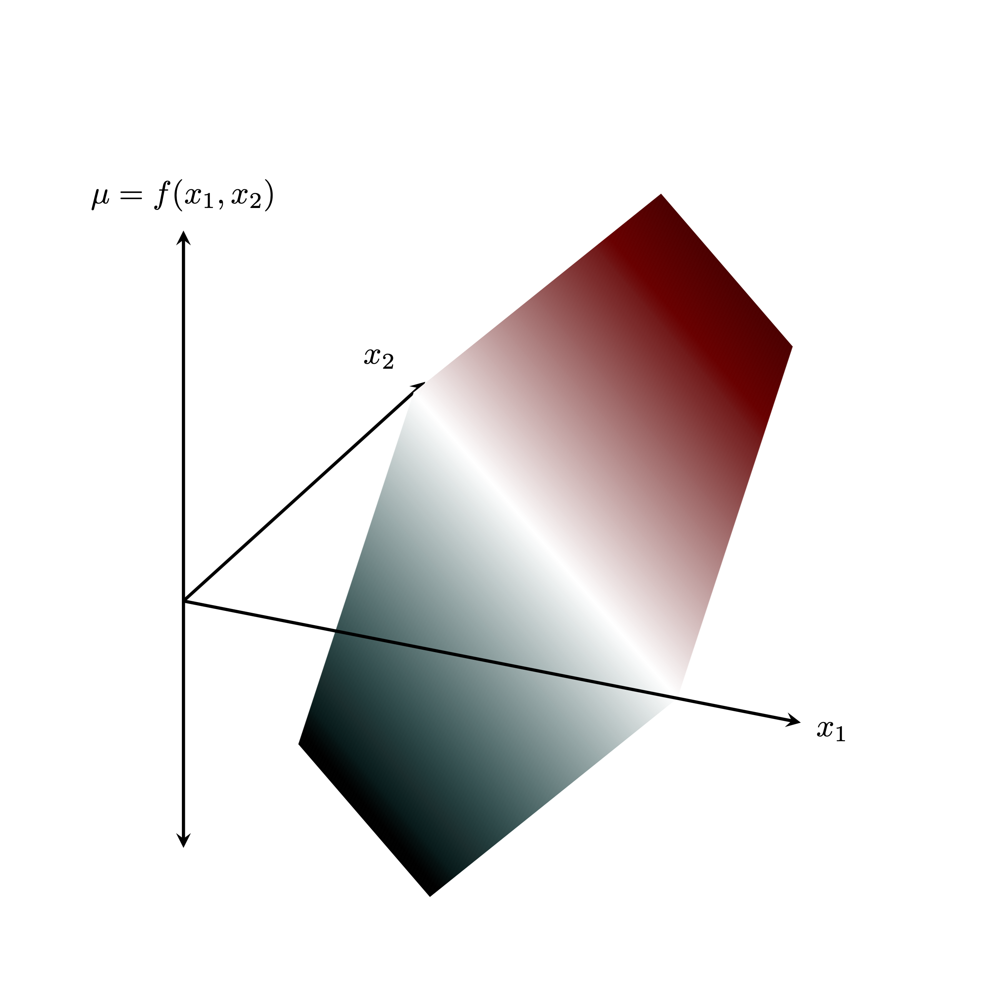
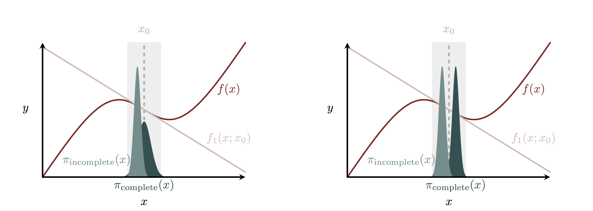
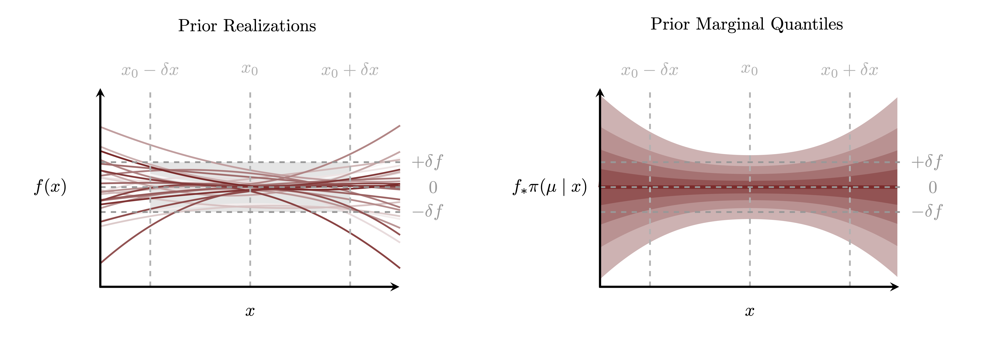
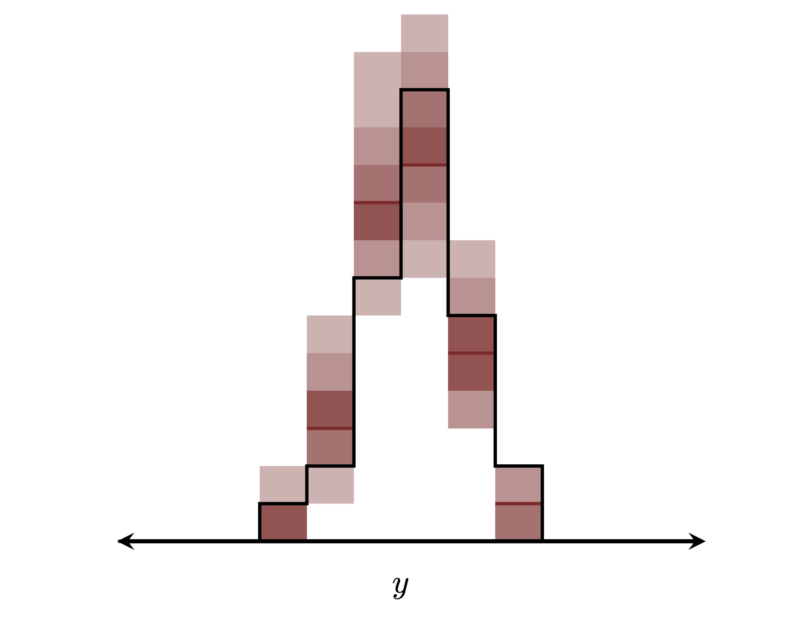
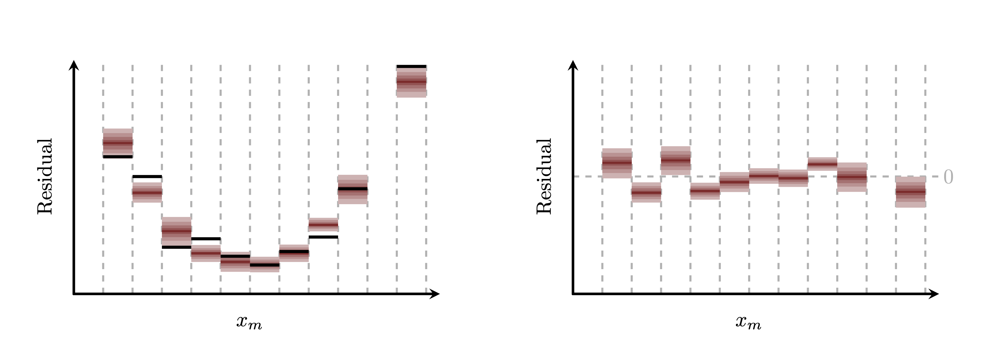
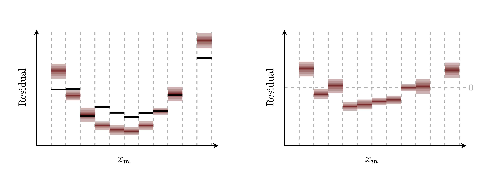
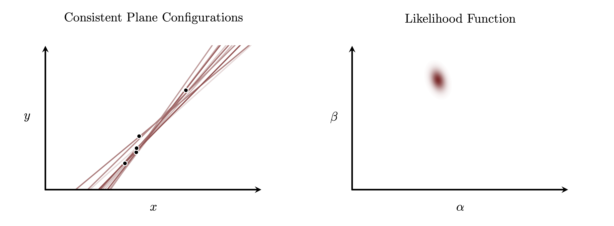

```{r setup, include=FALSE}
knitr::opts_chunk$set(comment=NA)
knitr::opts_knit$set(global.par = TRUE)
```

Regression models are defined by two key assumptions: negligible confounders
and covariates influencing only the centrality of the variate behavior.  In
order to define a particular regression model, however, we need to define the
behavior of that covariate-dependent location function.  Linear functions of the
covariates
$$
f(x) = \alpha + \beta \cdot x
$$
are especially ubiquitous in the statistics zeitgeist, although it's not clear
if that ubiquity is due to any universal utility or just mathematical
simplicity.

In this case study I consider linear functions of input covariates as _local
approximations_ of more general functional behavior within a neighborhood of
covariate configurations.  The theory of Taylor approximations grounds these
models in an explicit context that offers interpretability and guidance for how
they, and the heuristics that often accompany them, can be robustly applied in
practice.  Note that this is not a novel perspective -- see for example
@BoxEtAl:2005 -- but here we'll endeavor a comprehensive treatment for how this
perspective informs Bayesian modeling.

We will begin with a review of Taylor approximation theory for both
one-dimensional and multi-dimensional functions with an emphasis on how that
theory informs practical modeling of local functional behavior.  Then we will
apply that theory to the modeling of location functions in regression models,
with a specific emphasis on efficient implementations, prior modeling, and
overall model checking.

# Taylor Approximation Theory
#### I Almost Do (Taylor's Version) {-}

Often the engineering of a function $f : X \rightarrow \mathbb{R}$ is considered
a _global_ task, requiring the ability to evaluate outputs for _every_ input
$x \in X$.  In some cases, however, we don't need to consider functional
behavior at every possible input but instead only _locally_ within a small
neighborhood of inputs.  Modeling local functional behavior is typically a less
demanding problem, especially when we equip ourselves with the theory of
_Taylor expansions_ to guide the construction of local functional behavior from
interpretable polynomial functions that are straightforward to implement.

In this section we will discuss Taylor approximation theory and its applications
for modeling local functional behavior first for one-dimensional input spaces
and then for multi-dimensional input spaces.  We will then consider the
practical consequences of locality.

## One-Dimensional Taylor Approximations { #sec:onedim }
#### The 1 {-}

Let's first consider a one-dimensional input space $X \subset \mathbb{R}$.

The first step in defining _local_ functional behavior is specifying a local
neighborhood of input points $U \subset X$.  Here we will define a local
neighborhood as a _base point_ $x_{0} \in X$ and then a set of points around
that base point, $x_{0} \in U \subset X$.

Evaluating a function $f: X \rightarrow \mathbb{R}$ and its derivatives at the
base point provides a wealth of information about the behavior of that function
immediately around that base point.  In particular if $f$ is a sufficiently nice
function for inputs in $U$ then we can completely reconstruct its local behavior
from this differential information.

Formally we can _Taylor expand_ $f$ into an infinite polynomial whose
coefficients are fixed by increasingly higher-order differential information at
$x_{0}$.  For all $x \in U$ we have
$$
\begin{align*}
f(x)
&=
\sum_{i = 0}^{\infty} \frac{1}{i!}
\frac{ \mathrm{d}^{i} f }{ \mathrm{d} x^{i} } (x_{0}) \, (x - x_{0})^{i}
\\
&=
f(x_{0})
+ \frac{ \mathrm{d} f }{ \mathrm{d} x } (x_{0}) \,
+ (x - x_{0})
+ \frac{1}{2} \frac{ \mathrm{d}^{2} f }{ \mathrm{d} x^{2} } (x_{0}) \,
  (x - x_{0})^{2}
+ \ldots.
\end{align*}
$$
Note that the polynomials depend not on the absolute value of $x$ but rather on
only how far a given input $x$ is from the base point $x_{0}$.  I will refer to
these differences
$$
\Delta x \equiv x - x_{0}
$$
as _perturbations around $x_{0}$_, or simply _perturbations_ for short.

This process of Taylor expansions can be thought of as a way to _extrapolate_
functional behavior at $x_{0}$ to nearby inputs.  The initial term $f(x_{0})$
quantifies the exact functional behavior at $x_{0}$, which we can also consider
as a crude approximation to the local functional behavior.  Each higher-order
term provides a successive _refinement_ of this approximation, incorporating
more sophisticated functional behavior that comes closer to the exact function.
After incorporating an infinite number of terms we exactly reconstruct $f$ for
any local point $x \in U$.

Not every function is nice enough to admit a Taylor expansion within a given
local neighborhood.  For example any ill-behaved derivative evaluations at
$x_{0}$ will obstruct the convergence of the infinite series.  That said even if
all of the derivative evaluations are well-behaved the higher-order terms might
not decay fast enough for the series to converge.  Some functions don't admit
Taylor expansions around any base point, and some admit Taylor expansions around
only specific base points.  Even well-behaved functions typically admit Taylor
expansions only in sufficiently small neighborhoods around any admissible base
points.  The more well-behaved a function is the more base points will give
well-defined Taylor expansions and the further those Taylor expansions will
accurately extrapolate beyond $x_{0}$.

All of that said, even if a Taylor expansion is well-defined within a given
neighborhood $U$ around our base point $x_{0}$ we can't actually implement it in
practice because we'll never be able to evaluate the infinite number of terms,
let alone sum them up to exactly recover the local functional behavior.  What we
can do is _truncate_ the infinite series to give a polynomial with a finite
number of terms.

Incorporating only the first $I + 1$ terms in a Taylor expansion will not
recover $f$ exactly, but the resulting polynomial may provide a useful
_approximation_ to the local functional behavior,
$$
\begin{align*}
f(x)
&=
\sum_{i = 0}^{I} \frac{1}{i!}
\frac{ \mathrm{d}^{i} f }{ \mathrm{d} x^{i} } (x_{0}) \, (x - x_{0})^{i}
+
\sum_{i = I + 1}^{\infty} \frac{1}{i!}
\frac{ \mathrm{d}^{i} f }{ \mathrm{d} x^{i} } (x_{0}) \, (x - x_{0})^{i}
\\
&=
f_{I}(x; x_{0}) + R_{I}(x; x_{0})
\\
&\approx
f_{I}(x; x_{0}).
\end{align*}
$$
I will refer to the first $I + 1$ terms of a Taylor expansion,
$$
f_{I}(x; x_{0}) =
\sum_{i = 0}^{I} \frac{1}{i!}
\frac{ \mathrm{d}^{i} f }{ \mathrm{d} x^{i} } (x_{0}) \, (x - x_{0})^{i},
$$
as an _$I$th-order truncated Taylor polynomial_ or, more appropriate for our
uses, an _$I$th-order Taylor approximation_.

The error of such an approximation is quantified by the remaining terms,
$$
R_{I}(x; x_{0}) =
\sum_{i = I + 1}^{\infty} \frac{1}{i!}
\frac{ \mathrm{d}^{i} f }{ \mathrm{d} x^{i} } (x_{0}) \, (x - x_{0})^{i},
$$
which I will refer to as the _$I$th-order Taylor remainder_.

<center>
<br>
```{r, out.width = "75%", echo=FALSE}

```
<br><br>
</center>

If a function admits a full Taylor expansion around $x_{0}$ then a Taylor
approximation of any order will be well-defined in that neighborhood.  Even when
a full Taylor expansion isn't locally well-defined, however, Taylor
approximations might still be.  Formally if the first $I$ derivatives of $f$
are well-behaved at the base point then we can reconstruct the local functional
behavior for $x \in U$ as
$$
f(x)
=
\sum_{i = 0}^{I} \frac{1}{i!}
\frac{ \mathrm{d}^{i} f }{ \mathrm{d} x^{i} } (x_{0}) \, (x - x_{0})^{i}
+
R_{I}(x; x_{0})
$$
for some remainder function $R_{I}(x; x_{0})$ that vanishes as we get closer to
the base point,
$$
\lim_{x \rightarrow x_{0}} R_{I}(x; x_{0}) = 0.
$$
Only when a Taylor expansion is well-behaved can we identify this remainder with
the infinite series above.

More practically if the first $I + 1$ derivatives are finite not just at the
base point $x_{0}$ but also at all points in the local neighborhood $U$ then the
remainder $R_{I}(x; x_{0})$ will also be finite for all $x \in U$
[@Apostol:1967; @Apostol:1969].  In this case the Taylor remainder provides a
finite bound on the error of any Taylor approximation.

A finite error, however, does not mean that a Taylor approximation is a
_sufficiently good_ approximation for the local behavior of a function.  For
$f_{I}(x; x_{0})$ to be an adequate approximation the error has to be small
enough for the Taylor approximation to provide meaningful insights about the
exact functional behavior around $x_{0}$.  In practice this means that we have
to _engineer_ useful Taylor approximations by modifying the neighborhood and the
order.

For example a small neighborhood $U$ constrains how far any local input
$x \in U$ can be from the given base point $x_{0}$.  This constraint then limits
how large the perturbations $x - x_{0}$ can be, and hence how the large the 
powers $(x - x_{0})^{i}$ from which Taylor approximations are constructed can
be.  Generally the smaller the neighborhood the more quickly these powers will
decay and the smaller the Taylor remainder will be across $U$.  In other words
shrinking the local neighborhood, and extrapolating functional behavior from
$x_{0}$ less aggressively, ensures that an $I$th order Taylor approximation
$f_{I}(x; x_{0})$ will better approximate $f(x)$.

<center>
<br>
```{r, out.width = "75%", echo=FALSE}
knitr::include_graphics("figures/zoom/zoom.png")
```
<br><br>
</center>

At the same time the faster the higher-order derivatives across $U$ decay the
smaller and the more accurate a given Taylor approximation will be; the
_flatter_ $f$ is across $U$ the better each $f_{I}(x; x_{0})$ will approximate
$f(x)$.  Equivalently the flatter the exact function is the more aggressively
we can extrapolate functional behavior from $x_{0}$, and the larger of a local
neighborhood we can afford without compromising the approximation error.

When the exact function $f$ and local neighborhood $U$ are fixed the only way we
can control the approximation error is to increase the order $I$.  If the local
functional behavior across $U$ is sufficiently complex then we will need to
consider high-order Taylor approximations to achieve a given approximation
error.

<center>
<br>
```{r, out.width = "75%", echo=FALSE}

```
<br><br>
</center>

## Multi-Dimensional Taylor Approximations
#### Two Is Better Than One {-}

Taylor approximations generalize to multi-dimensional functions quite naturally
once we account for all of the partial derivative information that informs how
to extrapolate functional behavior from the base point in _any_ direction. The
main challenge in implementing multidimensional Taylor approximations is
organizing all of these partial derivatives.

### Basics
#### Tell Me Why {-}

Generalizing the discussion in the last section we now let the input space $X$
be an $M$-dimensional product space with $M$ one-dimensional components.  In
other words each point $x \in X$ is now identified with $M$ component
variables,
$$
x = (x_{1}, \ldots, x_{m}, \ldots, x_{M}).
$$
For example a base point is defined by $M$ variables, one for each of the
component directions,
$$
x_{0} = (x_{0, 1}, \ldots, x_{0, m}, \ldots, x_{0, M}).
$$

The zeroth-order contribution to a Taylor expansion remains the same as in the
one-dimensional case: the exact functional behavior at the base point,
$$
f_{0}(x; x_{0}) = f(x_{0}) = f(x_{0, 1}, \ldots, x_{0, M}).
$$

At first-order, however, we have to reconcile the fact that there is no longer a
single, one-dimensional derivative.  Instead first-order differential
information about $f$ is encoded in $M$ partial derivative functions,
$$
\frac{\partial f}{\partial x_{m}}(x),
$$
that quantify how the functional behavior changes along each component
direction.  These first-order partial derivatives are incorporated into a Taylor
approximation by multiplying each by the corresponding component perturbation
and then summing the individual contributions together,
$$
f_{1}(x; x_{0})
=
f(x_{0}) +
\sum_{m = 1}^{M} \frac{\partial f}{\partial x_{m}}(x_{0}) \, (x_{m} - x_{0, m}).
$$

Every time we go up one order we have to contend with a deluge of new partial
derivatives; at $I$th order there are $M^{I}$ partial derivatives, although only
$$
{ M + I - 1 \choose I }
=
\frac{ (M + I - 1)! }{ (M - 1)! \, I! }
=
\frac{ (M + I - 1) \cdot (M + I - 2) \cdots (M + 1) \cdot M }
{ I \cdot (I - 1) \cdots 2 \cdot 1 }
$$
are distinct due to symmetry.  For example at second-order we have the $M^{2}$
second-order partial derivative functions,
$$
\frac{\partial^{2} f}{\partial x_{m_{1}} \partial x_{m_{2}} }(x),
$$
that are symmetric in their indices,
$$
\frac{\partial^{2} f}{\partial x_{m_{1}} \partial x_{m_{2}} }(x)
=
\frac{\partial^{2} f}{\partial x_{m_{2}} \partial x_{m_{1}} }(x).
$$
Because of this symmetry there only $M \cdot (M + 1) / 2$ distinct partial
derivative functions out of the $M^{2}$ nominal functions.  I will refer to the
second-order partial derivatives with $m_{1} = m_{2}$ as _on-diagonal_ and those
with $m_{1} \ne m_{2}$ as _off-diagonal_.

The second-order partial derivatives are incorporated into the multi-dimensional
Taylor approximation in a similar way, except that each partial derivative is
matched not with one component perturbation but rather _two_,
$$
\begin{align*}
f_{2}(x; x_{0})
&= \quad
f(x_{0})
\\
& \quad +
\sum_{m = 1}^{M} \frac{\partial f}{\partial x_{m}}(x_{0}) \, (x_{m} - x_{0, m})
\\
& \quad +
\frac{1}{2} \sum_{m_{1} = 1}^{M} \sum_{m_{2} = 1}^{M}
\frac{\partial^{2} f}{\partial x_{m_{1}} \partial x_{m_{2}} }(x_{0})
\, (x_{m_{1}} - x_{0, m_{1}}) \, (x_{m_{2}} - x_{0, m_{2}}).
\end{align*}
$$

More generally the $I$-th order contribution to a Taylor approximation is given
by pairing each index with a corresponding component perturbation,
$$
\frac{1}{I!} \sum_{m_{1} = 1}^{M} \cdots \sum_{m_{i} = 1}^{M}
\cdot \sum_{m_{I} = 1}^{M}
\frac{\partial^{I} f}
{\partial x_{m_{1}} \cdots \partial x_{m_{i}} \cdot \partial x_{m_{I}} }(x_{0})
\, \prod_{i = 1}^{I} (x_{m_{i}} - x_{0, m_{i}}).
$$
The $I!$ factorial coefficient accounts for the over-counting that arises when
we sum over all of the partial derivatives and not just the distinct partial
derivatives.

While the multi-dimensional case is conceptually straightforward, organizing
the partial derivatives and their symmetries can be quite the burden.

### Arrays Verses Tensors { #sec:array_vs_tensor }
#### We Are Never Ever Getting Back Together {-}

One way to facilitate the implementation of multi-dimensional Taylor
approximations is to organize all of the partial derivatives at a given order
into _arrays_.  In particular at the $I$th order we can organize the output of
the $M^{I}$ partial derivative functions into a rectangular $I$-dimensional
array with elements
$$
\mathcal{J}_{m_{1} \cdots m_{i} \cdots m_{I}} (x)
=
\frac{\partial^{I} f}
{\partial x_{m_{1}} \cdots \partial x_{m_{i}} \cdot \partial x_{m_{I}} }(x).
$$
I will refer to these objects as _Jacobian arrays_.

For example with Jacobian arrays we can write a second-order Taylor
approximation in the more compact form
$$
\begin{align*}
f_{2}(x; x_{0})
&= \quad
f(x_{0})
+
\sum_{m = 1}^{M} \frac{\partial f}{\partial x_{m}}(x_{0}) \, (x_{m} - x_{0, m})
\\
& \quad +
\frac{1}{2} \sum_{m_{1} = 1}^{M} \sum_{m_{2} = 1}^{M}
\frac{\partial^{2} f}{\partial x_{m_{1}} \partial x_{m_{2}} }(x_{0})
\, (x_{m_{1}} - x_{0, m_{1}}) \, (x_{m_{2}} - x_{0, m_{2}}).
\\
&= \quad
f(x_{0})
+
\sum_{m = 1}^{M} \mathcal{J}_{m}(x_{0}) \, (x_{m} - x_{0, m})
\\
& \quad +
\frac{1}{2} \sum_{m_{1} = 1}^{M} \sum_{m_{2} = 1}^{M}
\mathcal{J}_{m_{1} m_{2}}(x_{0})
\, (x_{m_{1}} - x_{0, m_{1}}) \, (x_{m_{2}} - x_{0, m_{2}})
\\
&= \quad
f(x_{0})
+
\sum_{m = 1}^{M} \mathcal{J}_{m}(x_{0}) \, \Delta x_{m}
\\
& \quad +
\frac{1}{2} \sum_{m_{1} = 1}^{M} \sum_{m_{2} = 1}^{M}
\mathcal{J}_{m_{1} m_{2}}(x_{0}) \, \Delta x_{m_{1}} \, \Delta x_{m_{2}}.
\end{align*}
$$

In this form the individual terms on the Taylor expansion start to resemble
common operations in linear algebra.  For example the first-order term looks
like the dot product of two vectors and the second-order term looks like a
quadratic form of two vectors and a matrix.

To make this similarity more explicit we might associate the one-dimensional
arrays with vectors,
$$
\Delta \mathbf{x}
=
\begin{pmatrix}
\Delta x_{1} \vphantom{x_{0}} \\ \ldots \\
\Delta x_{m} \vphantom{x_{0}} \\ \ldots \\
\Delta x_{M} \vphantom{x_{0}}
\end{pmatrix}
=
\begin{pmatrix}
x_{1} - x_{0, 1} \\ \ldots \\ x_{m} - x_{0, m} \\ \ldots \\ x_{M} - x_{0, M}
\end{pmatrix}
$$
and
$$
\mathbf{J}_{1}
=
\begin{pmatrix}
\mathcal{J}_{1}(x_{0}) \vphantom{\frac{\partial f}{\partial x_{1}}} \\ \ldots \\
\mathcal{J}_{m}(x_{0}) \vphantom{\frac{\partial f}{\partial x_{1}}} \\ \ldots \\
\mathcal{J}_{M}(x_{0}) \vphantom{\frac{\partial f}{\partial x_{1}}}
\end{pmatrix}
=
\begin{pmatrix}
\frac{\partial f}{\partial x_{1}}(x_{0}) \\ \ldots \\
\frac{\partial f}{\partial x_{m}}(x_{0}) \\ \ldots \\
\frac{\partial f}{\partial x_{M}}(x_{0})
\end{pmatrix},
$$
and the two-dimensional array as a matrix,
$$
\begin{align*}
\mathbf{J}_{2}
&=
\begin{pmatrix}
\mathcal{J}_{11}(x_{0}) &
\ldots &
\mathcal{J}_{1m'}(x_{0}) &
\ldots &
\mathcal{J}_{1M}(x_{0}) \\
\ldots & \ldots & \ldots & \ldots & \ldots \\
\mathcal{J}_{m1}(x_{0}) & \ldots & \mathcal{J}_{mm'}(x_{0}) & \ldots & \mathcal{J}_{mM}(x_{0}) \\
\ldots & \ldots & \ldots & \ldots & \ldots \\
\mathcal{J}_{M1}(x_{0}) & \ldots & \mathcal{J}_{Mm'}(x_{0}) & \ldots & \mathcal{J}_{MM}(x_{0}) \\
\end{pmatrix}
\\
&=
\begin{pmatrix}
\frac{\partial^{2} f}{\partial x_{1} \partial x_{1} } (x_{0}) &
\ldots &
\frac{\partial^{2} f}{\partial x_{1} \partial x_{m'} } (x_{0}) &
\ldots &
\frac{\partial^{2} f}{\partial x_{1} \partial x_{M} } (x_{0}) \\
\ldots & \ldots & \ldots & \ldots & \ldots \\
\frac{\partial^{2} f}{\partial x_{m} \partial x_{1} } (x_{0}) &
\ldots &
\frac{\partial^{2} f}{\partial x_{m} \partial x_{m'} } (x_{0}) &
\ldots &
\frac{\partial^{2} f}{\partial x_{m} \partial x_{M} }(x_{0}) \\
\ldots & \ldots & \ldots & \ldots & \ldots \\
\frac{\partial^{2} f}{\partial x_{M} \partial x_{1} } (x_{0}) &
\ldots &
\frac{\partial^{2} f}{\partial x_{M} \partial x_{m'} } (x_{0}) &
\ldots &
\frac{\partial^{2} f}{\partial x_{M} \partial x_{M} } (x_{0}).
\end{pmatrix}
\end{align*}
$$

With this association the second-order Taylor approximation can be written
entirely with vector-vector and matrix-vector products,
$$
\begin{align*}
f_{2}(x; x_{0})
&=
f(x_{0})
+
\sum_{m = 1}^{M} \mathcal{J}_{m}(x_{0}) \, \Delta x_{m}
+
\frac{1}{2} \sum_{m_{1} = 1}^{M} \sum_{m_{2} = 1}^{M}
\mathcal{J}_{m_{1} m_{2}}(x_{0}) \, \Delta x_{m_{1}} \, \Delta x_{m_{2}}
\\
&=
f(x_{0})
+
\Delta \mathbf{x}^{T} \cdot \mathbf{J}_{1}
+
\frac{1}{2} \, \Delta \mathbf{x}^{T} \cdot \mathbf{J}_{2} \cdot \Delta \mathbf{x}.
\end{align*}
$$
At higher-orders partial derivative arrays can be similarly be associated with
_tensors_ that maps multiple copies of the vector $\mathbf{x}$ to a single real
number.

This linear-algebraic construction can drastically facilitate the implementation
of multivariate Taylor approximations.  Instead of explicitly summing over each
partial derivative evaluation at a given order we can gather them into arrays
and then compute the overall contribution with tensor operations, many of which
are implemented in accessible software packages.

That said we have to employ these associations with care because the Jacobian
arrays _are not actually tensors_.  Importantly they do not transform like
tensors when the input space is transformed. 

If the Jacobian arrays were actually tensors then each term in a Taylor
approximation would be invariant under transformations of the input space.  For
example if $\Delta \mathbf{x}$, $\mathbf{J}_{1}$, and $\mathbf{J}_{2}$ were
transformed into $\Delta \mathbf{x'}$, $\mathbf{J'}_{1}$, and $\mathbf{J'}_{2}$
resepctively then we would always have
$$
\mathbf{x}^{T} \cdot \mathbf{J}_{1}
=
\mathbf{x'}^{T} \cdot \mathbf{J'}_{1}
$$
and
$$
\frac{1}{2} \, \Delta \mathbf{x}^{T} \cdot \mathbf{J}_{2} \cdot \Delta \mathbf{x}
=
\frac{1}{2} \, \Delta \mathbf{x'}^{T} \cdot \mathbf{J'}_{2} \cdot \Delta \mathbf{x'}.
$$

Unfortunately this preservation of the individual terms in a Taylor
approximation isn't true.  In general transforming the input space _mixes_ the
individual contributions in complex ways so that while the entire Taylor
approximation is preserved the individual terms are not.  In particular we
cannot construct $\mathbf{J'}_{2}$ using $\mathbf{J}_{2}$ alone, as we would be
able to if these objects were proper matrices, and instead have to use both
$\mathbf{J}_{2}$ _and_ $\mathbf{J}_{1}$.

Formally Jacobian arrays are related to more complicated algebraic objects
knowns as _jets_.  For an introduction to jets see for example @Betancourt:2018.

Fortunately we don't need to learn about jets to take advantage of the
superficial relationship between Jacobian arrays and tensors in practice.  We
just have to make sure that _parameterization of the input space is fixed once
we associate Jacobian arrays with tensors_.  In other words we have to fix the
input space first before we fill up the Jacobian arrays with partial derivative
evaluations in that parameterization and then apply tensor operations to those
arrays.  Anytime we want to reparameterize the input space we have to redo the
_entire_ construction. 

The relationship between Jacobian arrays and tensors is subtle but often
confused, but if we don't appreciate it enough then we put ourselves into a
precarious position where it's easy to implement multi-dimensional Taylor
approximations incorrectly.

### Polynomial Geometry
#### No Body, No Crime {-}

One nice feature of a Taylor approximation to functional behavior is that the
order directly informs the possible shapes or geometries within the local
neighborhood where the approximation is valid. 

Before discussing these geometric possibilities, however, be warned that we will
be using the fragile association between Jacobian arrays and tensors, here
vectors and matrices, that we introduced in the previous section.  Consequently
the geometry of the functional behaviors will be best interpreted within a fixed
parameterization of the input space.

That said, let's consider a first-order Taylor approximation built up from
linear algebra operations,
$$
f ( \Delta \mathbf{x} )
= f(x_{0}) + \Delta \mathbf{x}^{T} \cdot \mathbf{J}_{1}.
$$
Geometrically the functional behaviors encapsulated in this approximation
correspond _planes_.  Each plane is fixed to the baseline functional behavior
$f(x_{0})$ with the $\mathbf{J}_{1}$ serving as slopes that orient the planes
around that point.

<center>
<br>
```{r, out.width = "50%", echo=FALSE}

```
<br><br>
</center>

An immediate consequence of this geometric interpretation is that a first-order
Taylor approximation will never exhibit any local minima or maxima within the
local neighborhood.  Instead the extrema exist at infinity, far away from any
local neighborhood.

We can verify this with a little bit of multivariable calculus.  If a finite
extremum $\Delta \mathbf{x}^{*}$ exists then the gradient of the functional
behavior will vanish there,
$$
\begin{align*}
\mathbf{0}
&=
\nabla f (\Delta \mathbf{x}^{*} )
\\
\mathbf{0}
&=
\nabla \left[ f(x_{0}) + \Delta \mathbf{x}^{T} \cdot \mathbf{J}_{1}
\right]_{\Delta \mathbf{x} = \Delta \mathbf{x}^{*} }
\\
\mathbf{0}
&=
\mathbf{J}_{1}.
\end{align*}
$$
This constraint, however, holds only when the first-order slopes vanish,
corresponding to a flat plane where _all_ of the points are equally extreme.

On the other hand a second-order Taylor approximation,
$$
f ( \Delta \mathbf{x} )
= f(x_{0}) + \Delta \mathbf{x}^{T} \cdot \mathbf{J}_{1}
+ \Delta \mathbf{x}^{T} \cdot \mathbf{J}_{2} \cdot \Delta \mathbf{x},
$$
exhibits a much wider range of functional behaviors.  In addition to the planes
of the first-order approximation this model also includes _paraboloids_ that
curve around $f(x_{0})$.

Unlike planes, however, paraboloids exhibit finite extrema.  To derive where
these finite extrema will be we can appeal to the vanishing gradient condition
again,
$$
\begin{align*}
\mathbf{0}
&=
\nabla f (\Delta \mathbf{x}^{*} )
\\
\mathbf{0}
&=
\nabla \left[ f(x_{0}) + \Delta \mathbf{x}^{T} \cdot \mathbf{J}_{1}
+ \Delta \mathbf{x}^{T} \cdot \mathbf{J}_{2} \cdot \Delta \mathbf{x}
\right]_{\Delta \mathbf{x} = \Delta \mathbf{x}^{*} }
\\
\mathbf{0}
&=
\mathbf{J}_{1} + 2 \, \mathbf{J}_{2} \cdot \Delta \mathbf{x}^{*}
\\
2 \, \mathbf{J}_{2} \cdot \Delta \mathbf{x}^{*}
&=
- \mathbf{J}_{1}.
\end{align*}
$$
If the determinant of $\mathbf{J}_{2}$ doesn't vanish,
$$
| \mathbf{J}_{2} | \ne 0,
$$
then this equation is satisfied by a unique point,
$$
\begin{align*}
2 \, \mathbf{J}_{2} \cdot \Delta \mathbf{x}^{*}
&=
- \mathbf{J}_{1}
\\
\Delta \mathbf{x}^{*}
&=
- \frac{1}{2} ( \mathbf{J}_{2} )^{-1} \cdot \mathbf{J}_{1}.
\end{align*}
$$
Otherwise the system is ill-posed and there will be an infinite number of
extrema.

Note that an extreme point is not guaranteed to fall within the local
environment where a Taylor approximation is defined.  If we extrapolate out to
the quadratic extrema then we might encounter higher-order behaviors in the
exact functional behavior that render the second-order Taylor approximation,
and its implied extrema, inadequate.  In other words if an extrema falls outside
of the local neighborhood where a Taylor approximation has been validated then
we have to treat it with at least some suspicion.

The precise shape of the parabolic behavior around a well-defined extrema will
depend on the second-order partial derivatives at that point, which in this
case is organized neatly into the second-order Jacobian,
$$
\nabla^{2} f (\Delta \mathbf{x}^{*} )
=
\mathbf{J}_{2}.
$$

If $\mathbf{J}_{2}$ is positive-definite, and all of the eigenvalues of the
matrix are positive, then the functional behavior will curve upwards around the
extreme point; in other words $\Delta \mathbf{x}^{*}$ will be a minimum of the
functional behavior.  Likewise if $\mathbf{J}_{2}$ is negative-definite, and all
of the eigenvalues are negative, then $\Delta \mathbf{x}^{*}$ will correspond to
a maximum.  In both cases the geometry of the functional behavior resembles a
_bowl_ centered at the extrema, oriented right-side up if $\mathbf{J}_{2}$ is
positive-definite and upside-down if $\mathbf{J}_{2}$ is negative-definite.

<center>
<br>
```{r, out.width = "100%", echo=FALSE}

```
<br><br>
</center>

When the signs of the eigenvalues vary, and $\mathbf{J}_{2}$ is indefinite, then
the functional behavior will increase as we move away from
$\Delta \mathbf{x}^{*}$ in some directions but it will decrease as we move
away in others.  The resulting geometry resembles a _saddle_.

<center>
<br>
```{r, out.width = "50%", echo=FALSE}

```
<br><br>
</center>

The geometric interpretability can be a powerful way to elicit domain expertise
about functional behavior within a local neighborhood, and hence motivate the
order of Taylor approximation needed in a given application.  For example if we
know that the functional behavior exhibits an extreme point then we know that a
first-order Taylor approximation will be inadequate and that we will need to
consider at least a second-order approximation.  Moreover any domain expertise
that places the extreme point within a local neighborhood will substantially
constrain the configuration of a second-order Taylor approximation, as will any
domain expertise about whether that extreme point is a maximum, minimum, or a
saddle point.

That said, wielding this geometric intuition does become more difficult as we
consider higher-order Taylor approximation that incorporate more and more
complex functional behaviors.  For example if we go beyond second-order then
Taylor approximations can exhibit multiple, separated extrema, each of which can
exhibit bowl-like or saddle-like shapes independently from the others.  In
addition the behavior of these separate extrema don't cleanly map to individual
approximation parameters but rather weave together in intricate ways. 
While leveraging whatever domain expertise we have into explicit constraints on
higher-order Taylor approximation configurations is more complicated, it can
still be accomplished with care.

## Baseline Dependence
#### I Know Places {-}

Mechanically the polynomial defined by a Taylor approximation can be evaluated
globally, mapping any input $x \in X$ to some output.  The connection of that
polynomial to the function being approximated, however, is restricted to the
local neighborhood of inputs $U \subset X$ around the baseline point $x_{0}$. 
In other words a Taylor approximation is not defined by a polynomial alone but
rather a polynomial associated with a base point and a surrounding local
neighborhood.

Even when the exact functional behavior being approximated is fixed, the
behavior of a Taylor approximation $f_{I}(x; x_{0})$ can vary _wildly_ as the
baseline $x_{0}$ moves to different locations within the input space.

<center>
<br>
```{r, out.width = "66%", echo=FALSE}

```
<br><br>
</center>

The more non-linear the exact function is the more strongly the behavior of the
polynomials defined by Taylor approximations will vary with the baseline point.

Extrapolating too far away from the baseline point strains the local nature of
a Taylor approximation.  Eventually a Taylor approximation will become so
inaccurate that it provides no useful information about the exact functional
behavior at those distant points.  Ultimately a single Taylor approximation may
not be able to model functional behavior across multiple neighborhoods at the
same time.  At some point we may have to consider introducing _multiple_
baselines $x_{0}$ and multiple Taylor approximation local to those baselines.

In order to use Taylor approximations effectively in practice our first step
should always be defining the local neighborhood of relevant inputs at which we
will need to evaluate functional behavior.  Once we have defined this local
neighborhood we can construct a sufficiently accurate Taylor approximation
within that local context.  Recovering from a poorly chosen baseline, far from
the inputs relevant to a given application, is both conceptually difficult and
computationally expensive.

## Covariate Boundaries
#### Exile {-}

As we saw in [Section 1.1](#sec:onedime) an $I$-th order Taylor approximation
will be well-behaved within a local neighborhood only when the first to
$I$th-order derivatives of the exact function $f$ are well-behaved in that
neighborhood.  In particular the derivative evaluations have to yield not only
unique values but also finite values.  Unfortunately this can be a problem for
functions that are defined on only a subset of the input space.

Consider for example the function
$$
\begin{alignat*}{6}
f :\; &\mathbb{R}^{+}& &\rightarrow& \; &\mathbb{R}^{+}&
\\
&x& &\mapsto& &x^{-\alpha}&
\end{alignat*}
$$
which is well-defined for only positive, real-valued inputs
$\mathbb{R}^{+} \subset \mathbb{R}$.  For $\alpha > 0$ the output of this
function diverges towards positive infinity as we approach the boundary $x = 0$
from positive inputs.

<center>
<br>
```{r, out.width = "50%", echo=FALSE}

```
<br><br>
</center>

At the same time the first-order derivative,
$$
\frac{ \mathrm{d} f }{ \mathrm{d} x}(x) = - \frac{\alpha}{x^{\alpha + 1}},
$$
rapidly diverges towards negative infinity.

<center>
<br>
```{r, out.width = "50%", echo=FALSE}

```
<br><br>
</center>

Higher-order derivatives alternate between diverging to positive and negative
infinity,
$$
\frac{ \mathrm{d}^{i} f }{ \mathrm{d} x^{i} }(x)
=
(-1)^i \, \frac{(\alpha + i)!}{\alpha!} \, \frac{1}{x^{\alpha + i}}.
$$

<center>
<br>
```{r, out.width = "50%", echo=FALSE}

```
<br><br>
</center>

Just past the boundary at small but negative inputs the function $f$ is
undefined.  The inconsistent values to the left and right of the boundary
imply that all of the derivatives are ill-defined at $x = 0$.  Consequently we
cannot construct Taylor approximations from a base points right on the boundary
$x_{0} = 0$. 

Taylor approximations around base points at positive inputs near the boundary
will be ungainly at best.  For a fixed $x_{0}$ the magnitude of the derivative
evaluations $\mathrm{d}^{i} f / \mathrm{d} x^{i} \, (x_{0})$ will increase with
the order $i$.  At the same time the signs of these evaluations will oscillate,
leading to an awkward sequence of polynomial terms that poorly converges to the
exact function $f$. 

The only way to ensure that the final Taylor approximation reasonably
approximates $f$ is to narrow the local neighborhood enough that the
perturbations $(\Delta x)^{i}$ are small enough to ensure that the magnitudes
$$
\mathrm{d}^{i} f / \mathrm{d} x^{i} (x_{0}) \, (\Delta x)^{i}
$$
are reasonable enough for the Taylor approximation to be well-behaved.  In
practice these means that Taylor approximations will be limited to ever more
confined neighborhoods as we consider inputs closer and closer to the boundary.

One way to avoid these boundary effects is to avoid the boundary entirely.
In particular instead of trying to approximate the nominal, constrained function
we can approximate a transformed, unconstrained function.

Consider for example a fixed auxiliary function that maps from an unconstrained
real space to the constrained input space of our function,
$$
\begin{alignat*}{6}
g :\; &\mathbb{R}& &\rightarrow& \; &\mathbb{R}^{+}&
\\
&z& &\mapsto& &g(z)&.
\end{alignat*}
$$
The composition of this function with $f$ defines a completely unconstrained
function,
$$
\begin{alignat*}{6}
f \circ g :\; &\mathbb{R}& &\rightarrow& \; &\mathbb{R}&
\\
&z& &\mapsto& &f(g(z))&,
\end{alignat*}
$$
without any boundaries that might frustrate Taylor approximations.

In other words while the functional dependence on $x$ exhibits boundaries the
functional dependence on $z = g^{-1}(x)$ does not.  The unconstraining
transformation effectively exiles the problematic boundary to infinity where it
won't influence the behavior of Taylor approximations at more reasonable inputs. 
At the same time the transformation tends to expand small neighborhoods near the
boundary into wider regions, decompressing the nominal functional behavior so
that it can be better resolved by Taylor approximations.

Provided that the auxiliary function $g$ is completely known then modeling the
composition $f \circ g$ with the inputs $g^{-1}(x)$ still effectively models the
initial functional behavior $f$ with the inputs $x$.  The transformed input
space, however, provides more flexibility in how we can locally approximate that
functional behavior.

One possible function to consider in our example is the exponential
$$
\begin{alignat*}{6}
g :\; &\mathbb{R}& &\rightarrow& \; &\mathbb{R}^{+}&
\\
&z& &\mapsto& &\exp(z)&
\end{alignat*}
$$
with inverse
$$
\begin{alignat*}{6}
g^{-1} :\; &\mathbb{R}^{+}& &\rightarrow& \; &\mathbb{R}&
\\
&x& &\mapsto& &\log(x)&.
\end{alignat*}
$$
The unconstrained composite function then becomes
$$
\begin{align*}
f \circ g(z)
&=
g(z)^{-\alpha}
\\
&=
\exp(z)^{-\alpha}
\\
&=
\exp(-\alpha \, z)
\end{align*}
$$
with the derivatives
$$
\frac{ \mathrm{d}^{i} f \circ g}{ \mathrm{d} z^{i} }(z)
=
(-\alpha)^{i} \, \exp(-\alpha \, z).
$$
These derivatives still oscillate in sign but now their magnitudes are much less
extreme for reasonable input values, resulting in much better behaved Taylor
approximations.

<center>
<br>
```{r, out.width = "100%", echo=FALSE}

```
<br><br>
</center>

# Taylor Regression Models
#### Invisible String {-}

As I discuss in my
[variate-covariate modeling case study](https://betanalpha.github.io/assets/case_studies/variate_covariate_modeling.html)
regression models, or more accurately _curve fitting_ models, are derived from
two key assumptions.  First we assume that there is no confounding behavior that
couples the conditional variate and marginal covariate models together,
$$
\pi(y, x, \theta, \phi, \gamma)
=
\pi(y \mid x, \theta, \phi) \, \pi(x \mid \gamma),
$$
so that we can ignore the marginal covariate model entirely when inferring the
covariation between $y$ and $x$ and using it to inform predictions of
incomplete observations.  Second we assume the remaining conditional variate
model can be characterized with probabilistic variation around a deterministic
function of the covariates,
$$
\pi(y \mid x, \theta, \phi) = \pi(y \mid \mu = f(x, \theta), \phi),
$$
where $\mu$ is a location parameter that configures the centrality of the
variate distribution and $\phi$ configures the probabilistic variation around
that centrality.

A particular regression model is then defined with the choice of a particular
model for the probabilistic variation and location functional behavior.
The theory of Taylor approximations that we developed in the previous section
provides a powerful method for modeling the location functional behavior within
a local neighborhood of input covariates.  Once we have identified the range of
covariate inputs of interest in an application we can model the location
function with an appropriate Taylor approximation to give a
_Taylor regression model_.  This approach provides an _interpretable_
mathematical form for the centrality of the conditional variate model that,
amongst other benefits, facilitates principled prior modeling.

In this section we'll review the foundations of Taylor regression modeling and
its practical implementation with a special emphasis on how many popular
heuristics can be be given a more formal motivation.

## Parameter Interpretation
#### The Story of Us {-}

A classic one-dimensional linear model of a location function is characterized
by an _intercept_ $\alpha$ and a _slope_ $\beta$,
$$
f(x) = \alpha + \beta \, x.
$$
On the other hand a one-dimensional, first-order Taylor approximation to a
general location function $f$ around the baseline $x_{0}$ is given by
$$
\begin{align*}
f_{1}(x; x_{0})
&=
f(x_{0})
+ \frac{ \mathrm{d} f }{ \mathrm{d} x }(x_{0}) \, (x - x_{0})
\\
&=
f(x_{0}) - \frac{ \mathrm{d} f }{ \mathrm{d} x }(x_{0}) \, x_{0}
+
\frac{ \mathrm{d} f }{ \mathrm{d} x }(x_{0}) \, x.
\end{align*}
$$
Comparing the two we can associate the constant terms of the first-order Taylor
approximation with an intercept,
$$
\alpha =
f(x_{0}) + \frac{ \mathrm{d} f }{ \mathrm{d} x }(x_{0}) \, (x - x_{0}),
$$
and the linear term with a slope,
$$
\beta = \frac{ \mathrm{d} f }{ \mathrm{d} x }(x_{0}).
$$

In other words the Taylor approximation provides a concrete interpretation of
the intercept and slope in terms the location functional behavior at $x_{0}$.
Instead of working out how to infer the abstract parameters $\alpha$ and $\beta$
we can consider inference of the explicit local behaviors $f(x_{0})$,
$\mathrm{d} f / \mathrm{d} x (x_{0})$, and $\mathrm{d} f / \mathrm{d} x(x_{0})$.
Critically this interpretation depends on the chosen baseline; changing $x_{0}$
changes the structure of the Taylor approximation and hence its association to
a linear model.

Higher-order Taylor approximations introduce higher-order powers of the input
covariate which we can rearrange into an interpretable polynomial that
generalizes the linear covariate model.  For example a second-order Taylor
approximation can be written as
$$
\begin{align*}
f_{2}(x; x_{0})
&=
f(x_{0})
+ \frac{ \mathrm{d} f }{ \mathrm{d} x }(x_{0}) \, (x - x_{0})
+ \frac{1}{2} \frac{ \mathrm{d}^{2} f }{ \mathrm{d} x^{2} }(x_{0}) \,
  (x - x_{0})^{2}
\\
&= \quad
\underbrace{ f(x_{0})
- \frac{ \mathrm{d} f }{ \mathrm{d} x }(x_{0}) \, x_{0}
+ \frac{1}{2} \frac{ \mathrm{d}^{2} f }{ \mathrm{d} x^{2} }(x_{0}) \,
  x_{0}^{2}
 }_{\alpha}
\\
&\quad
+ \underbrace{ \left( \frac{ \mathrm{d} f }{ \mathrm{d} x }(x_{0})
  - \frac{ \mathrm{d}^{2} f }{ \mathrm{d} x^{2} }(x_{0}) \, x_{0} \right)
 }_{\beta_{1}} \, x
+ \underbrace{
   \frac{1}{2} \frac{ \mathrm{d}^{2} f }{ \mathrm{d} x^{2} }(x_{0})
  }_{\beta_{2}} \, x^{2}.
\end{align*}
$$
I will refer to $\beta_{1}$ as a _first-order slope_ and $\beta_{2}$ as a
_second-order slope_.  Similarly higher-order differential terms can associate
with higher-order slopes.  We'll come back to motivate this nomenclature more
precisely in [Section 2.3](#sec:impl).

An immediate annoyance with this approach is the polynomial coefficients, and
ultimately the parameters in our model, are associated with a mixture of
function and derivative evaluations.  For example in a first-order Taylor
approximation the effective intercept is given by contributions from the
function and its first-order derivative evaluated at the baseline; likewise the
intercept in a second-order Taylor approximation mixes evaluations of the
function, its first-order derivative, _and_ it's second-order derivative.  In
order to build a principled prior model for the location function parameters we
have to be able to reason about not just these individual behaviors but also how
they are woven together to form the final polynomial.

Fortunately there is a straightforward way to isolate these different
contributions and clean up the interpretation of the local location function
model.  The key is to work with not the covariates directly but rather with
their deviations from the chosen baseline.  Following our general Taylor
approximation terminology I will refer to these _centered_ covariates,
$$
\Delta x = x - x_{0},
$$
as covariate _perturbations_.

Working with covariate perturbations not only integrates the implicit baseline
dependence of a Taylor approximation but also decouples the various orders of
derivates in the interpretation of the intercept and slopes.  For example with
covariate perturbations a first-order Taylor approximation becomes
$$
\begin{align*}
f_{1}(x; x_{0})
&=
f(x_{0}) \; + \frac{ \mathrm{d} f }{ \mathrm{d} x }(x_{0}) \, (x - x_{0})
\\
&=
f(x_{0}) \; + \frac{ \mathrm{d} f }{ \mathrm{d} x }(x_{0}) \, \Delta x
\\
&=
\underbrace{f(x_{0}) \vphantom{ \frac{0}{0} } }_{\alpha}
+
\underbrace{\frac{ \mathrm{d} f }{ \mathrm{d} x }(x_{0})}_{\beta} \, \Delta x.
\end{align*}
$$
Now the intercept depends on _only_ the baseline functional behavior with no
contamination from the first-order derivative, while the slope depends on only
that baseline first-order derivative behavior.

Centering the input covariates becomes particularly beneficial when working with
higher-order Taylor approximations.  For example at second-order we have
$$
\begin{align*}
f_{2}(x; x_{0})
&=
f(x_{0}) \; + \frac{ \mathrm{d} f }{ \mathrm{d} x }(x_{0}) \, (x - x_{0})
+ \frac{1}{2} \frac{ \mathrm{d}^{2} f }{ \mathrm{d} x^{2} }(x_{0}) \,
  (x - x_{0})^{2}
\\
&=
f(x_{0}) \; + \frac{ \mathrm{d} f }{ \mathrm{d} x }(x_{0}) \, \Delta x
\hspace{8.5mm}
+ \frac{1}{2} \frac{ \mathrm{d}^{2} f }{ \mathrm{d} x^{2} }(x_{0}) \,
\\
&=
\underbrace{ f(x_{0}) \vphantom{ \frac{0}{0} } }_{\alpha}
+ \underbrace{ \frac{ \mathrm{d} f }{ \mathrm{d} x }(x_{0}) }_{\beta_{1}} \,
  \Delta x \hspace{6.75mm}
+ \underbrace{ \frac{1}{2} \frac{ \mathrm{d}^{2} f }{ \mathrm{d} x^{2} }(x_{0})
  }_{\beta_{2}} \,
\Delta x^{2}.
\\
\end{align*}
$$
Each parameter in the location function model is associated with a unique
derivative, drastically simplifying their interpretation and hence our ability
to reason about the parameter behaviors.

Multi-dimensional Taylor approximations invoke multiple partial derivatives at
each order which then correspond to multiple component slopes,
$$
\begin{align*}
f_{1}(x; x_{0})
&= f(x_{0}) + \sum_{i = 1}^{I} \frac{ \partial f }{ \partial x_{i} }(x_{0}) \,
   (x_{i} - x_{0, i})
\\
f(x)
&= \alpha \hspace{6.5mm} + \sum_{i = 1}^{I} \beta_{i} \, \Delta x_{i}.
\end{align*}
$$
In other words centering the covariates allows us to directly match the slopes
to the Jacobian arrays.

Following the discussion in [Section 1.2.2](#sec:array_vs_tensor) we can further
associate these component slopes with tensors,
$$
\begin{align*}
f_{1}(x; x_{0})
&= \alpha + \sum_{i = 1}^{I} \beta_{i} \, \Delta x_{i}
\\
f(x)
&= \alpha + \boldsymbol{\beta}^{T} \, \Delta \mathbf{x},
\end{align*}
$$
provided that we keep the parameterization of the covariate space fixed.

## Local Scope { #sec:local_dependence }
#### A Place in This World {-}

A Taylor approximation accurately reconstructs the exact functional behavior
only in some local neighborhood around the baseline input $x_{0}$.  In the
regression context a Taylor approximation can capture only the local behavior of
a general location function in some neighborhood of a baseline covariate
configuration.  Consequently a Taylor approximation provides the basis of a
useful regression model only if _all_ covariate configurations of interest
concentrate within this local neighborhood.  This includes the values of the
covariates in any complete observations from which we can infer conditional
variate model behavior and the those in any incomplete observations which we are
interested in completing with variate predictions.

In other words a Taylor regression model will be adequate only if all of the
marginal covariate models of interest concentrate in the neighborhood where the
Taylor approximation error is negligible.  While the assumption of a regression
model promises that we don't need to explicitly build marginal covariates models
in order to predict missing variates, the assumption of a Taylor regression
model requires that consider at least the qualitative features of the relevant
marginal covariate models to ensure that a Taylor approximation will be
sufficient to transfer inferences from complete observations to predictive
completions of incomplete observations.

For example if the distribution of covariates from complete observations leaks
outside of the local neighborhood of a Taylor approximation then the growing
approximation error can render any inferences meaningless.

<center>
<br>
```{r, out.width = "100%", echo=FALSE}

```
<br><br>
</center>

Polynomial configurations consistent with complete observations that aren't
contained within the local neighborhood will be skewed away from a proper Taylor
approximation.  More generally if the Taylor approximation error is too large
across the observed covariates then the the model parameters will no longer
be interpretable as the local differential structure at the baseline.

<center>
<br>
```{r, out.width = "50%", echo=FALSE}
knitr::include_graphics("figures/bad_fit/bad_fit.png")
```
<br><br>
</center>

Having the covariates from just complete observations concentrate within the
local neighborhood, however, doesn't guarantee the utility of a Taylor
regression model. If the covariates from incomplete observations concentrate in
a _different_ neighborhood than covariates from complete observations then the
functional behavior local to each neighborhood will also be different.

<center>
<br>
```{r, out.width = "50%", echo=FALSE}

```
<br><br>
</center>

In this case the location functional behaviors inferred from complete
observations will poorly generalize to variate predictions for incomplete
observations.

<center>
<br>
```{r, out.width = "50%", echo=FALSE}

```
<br><br>
</center>

Ultimately the baseline dependence of Taylor approximations can introduce a
subtle coupling the between the local behavior of the conditional variate model
and the marginal covariate model.  In other words even if there is negligible
confounding between the exact conditional variate model and the marginal
covariate model, the _approximate_ behavior of the conditional variate model can
be effectively confounded with the marginal covariate behavior!

Only when the marginal covariate distributions for _both_ the complete and
incomplete observations concentrate within the same local neighborhood can a
single Taylor approximation be adequate for both inference and prediction tasks.

<center>
<br>
```{r, out.width = "50%", echo=FALSE}

```
<br><br>
</center>

This point cannot be overemphasized -- the decoupling of an exact conditional
variate model and marginal covariate model does not imply that
_local approximations_ to the conditional variate model will also be decoupled
from the the marginal covariate model because the marginal covariate behavior
defines the necessary scope of those local approximations.   The lack of
confounding will be preserved only when all marginal covariate behaviors
concentrate within the scope of a single local approximation.  In order to
verify this we have to mindful of the behavior of _all_ potential covariate
observations of interest and, if not model that behavior outright, at least
consider its basic properties.

Finally the locality of Taylor approximations introduced one last practical 
limitation.  Within any local neighborhood an _infinite_ number of exact
functions will share the same Taylor approximations to any given order.  Only
when we look at covariate inputs outside of that local neighborhood will those
locally equivalent functions begin to diverge and distinguish themselves.

<center>
<br>
```{r, out.width = "50%", echo=FALSE}

```
<br><br>
</center>

Consequently quantifying the local functional behavior will _never_ be able to
provide guidance on how to extrapolate beyond that local neighborhood.  By their
very construction Taylor regression models cannot discriminate between data
generating processes that manifest in the same local behavior.  Without that
discrimination we have only meager information about how our inferences might
generalize to more global circumstances.

## Efficient Implementations { #sec:impl }
#### How You Get the Girl {-}

The most effective implementation of Taylor regression models typically takes
advantage of the linear algebraic operations that we discussed in
[Section 1.2.2](#sec:array_vs_tensor).

### First-Order Implementations
#### Style {-}

Consider, for example, a regression model utilizing a first-order Taylor
approximation.  When the input covariate space is fixed we can organize the
slopes into an array and manipulate that array as if it were a vector,
$$
f_{1}( \mathbf{x}; \mathbf{x}_{0} )
= \alpha + \Delta \mathbf{x}^{T} \cdot \boldsymbol{\beta}.
$$

In most applications we will need to evaluate the functional behavior at
multiple covariate configurations,
$$
\{ \tilde{\mathbf{x}}_{1}, \ldots,
   \tilde{\mathbf{x}}_{n}, \ldots,
   \tilde{\mathbf{x}}_{N} \},
$$
which requires repeated evaluations of the Taylor approximation,
$$
\begin{matrix}
f_{1}(\tilde{\mathbf{x}}_{1}; \mathbf{x}_{0}) \\ \ldots \\
f_{1}(\tilde{\mathbf{x}}_{n}; \mathbf{x}_{0}) \\ \ldots \\
f_{1}(\tilde{\mathbf{x}}_{N}; \mathbf{x}_{0})
\end{matrix}
\begin{matrix}
= \\ \\ = \\ \\ =
\end{matrix}
\begin{matrix}
\alpha + \Delta \tilde{\mathbf{x}}_{1}^{T} \cdot \boldsymbol{\beta}
\\ \ldots \\
\alpha + \Delta \tilde{\mathbf{x}}_{n}^{T} \cdot \boldsymbol{\beta}
\\ \ldots \\
\alpha + \Delta \tilde{\mathbf{x}}_{N}^{T} \cdot \boldsymbol{\beta}.
\end{matrix}
$$

Conveniently these repeated vector-vector products can be manipulated into a
single matrix-vector product by treating each evaluation as elements of a
vector,
$$
\begin{pmatrix}
f_{1}(\tilde{\mathbf{x}}_{1}; \mathbf{x}_{0}) \\ \ldots \\
f_{1}(\tilde{\mathbf{x}}_{n}; \mathbf{x}_{0}) \\ \ldots \\
f_{1}(\tilde{\mathbf{x}}_{N}; \mathbf{x}_{0})
\end{pmatrix}
=
\begin{pmatrix}
\alpha + \Delta \tilde{\mathbf{x}}_{1}^{T} \cdot \boldsymbol{\beta}
\\ \ldots \\
\alpha + \Delta \tilde{\mathbf{x}}_{n}^{T} \cdot \boldsymbol{\beta}
\\ \ldots \\
\alpha + \Delta \tilde{\mathbf{x}}_{N}^{T} \cdot \boldsymbol{\beta}.
\end{pmatrix}
$$
Within this organization we can then pull out the common intercept and slope
vector,
$$
\begin{pmatrix}
f_{1}(\tilde{\mathbf{x}}_{1}; \mathbf{x}_{0}) \\ \ldots \\
f_{1}(\tilde{\mathbf{x}}_{n}; \mathbf{x}_{0}) \\ \ldots \\
f_{1}(\tilde{\mathbf{x}}_{N}; \mathbf{x}_{0})
\end{pmatrix}
=
\quad\!
\alpha \, \mathbf{1}  +
\begin{pmatrix}
\Delta \tilde{\mathbf{x}}_{1}^{T} \\ \ldots \\
\Delta \tilde{\mathbf{x}}_{n}^{T} \\ \ldots \\
\Delta \tilde{\mathbf{x}}_{N}^{T}
\end{pmatrix} \cdot \boldsymbol{\beta}.
$$
What is left is a matrix equation,
$$
\mathbf{f} = \alpha \, \mathbf{1} + \mathbf{X} \cdot \boldsymbol{\beta}
$$
where
$$
\mathbf{f}
=
\begin{pmatrix}
f_{1}(\tilde{\mathbf{x}}_{1}; \mathbf{x}_{0}) \\ \ldots \\
f_{1}(\tilde{\mathbf{x}}_{n}; \mathbf{x}_{0}) \\ \ldots \\
f_{1}(\tilde{\mathbf{x}}_{N}; \mathbf{x}_{0})
\end{pmatrix}
$$
is a vector of function outputs,
$$
\alpha \, \mathbf{1}
=
\alpha \,
\begin{pmatrix}
1 \\ \ldots \\ 1 \\ \ldots \\ 1
\end{pmatrix}
=
\begin{pmatrix}
\alpha \\ \ldots \\ \alpha \\ \ldots \\ \alpha
\end{pmatrix}
$$
is a vector of repeated intercepts, and
$$
\mathbf{X}
=
\begin{pmatrix}
\Delta \tilde{\mathbf{x}}_{1}^{T} \\ \ldots \\
\Delta \tilde{\mathbf{x}}_{n}^{T} \\ \ldots \\
\Delta \tilde{\mathbf{x}}_{N}^{T}
\end{pmatrix}
=
\begin{pmatrix}
\Delta \tilde{x}_{1, 1} & \ldots &
\Delta \tilde{x}_{1, m} & \ldots &
\Delta \tilde{x}_{1, M} \\
\ldots \\
\Delta \tilde{x}_{n, 1} & \ldots &
\Delta \tilde{x}_{n, m} & \ldots &
\Delta \tilde{x}_{n, M} \\
\ldots \\
\Delta \tilde{x}_{N, 1} & \ldots &
\Delta \tilde{x}_{N, m} & \ldots &
\Delta \tilde{x}_{N, M} \\
\end{pmatrix}
$$
is a matrix of the covariate perturbations for each observation.  This matrix
is often referred to as the _design matrix_ for the given observations.

In other words once we've organized all of the covariate perturbations into a
matrix, with one row for each component observation and one column for each
component covariate, we can evaluate all of the first-order Taylor approximation
evaluations with a single matrix-vector product and vector-vector sum.

We can push this organization even further by _expanding_ our notation of the
input covariate space, and hence the design matrix.  In particular let's append
the covariate space with a constant component, $x_{n, M + 1} = 1$ so that the
expanded design $M + 1$ by $N$ matrix becomes
$$
\mathbf{Z}
=
\begin{pmatrix} \mathbf{1} & \mathbf{X}\end{pmatrix}
=
\begin{pmatrix}
1 &
\Delta \tilde{x}_{1, 1} & \ldots &
\Delta \tilde{x}_{1, m} & \ldots &
\Delta \tilde{x}_{1, M} \\
\ldots \\
1 &
\Delta \tilde{x}_{n, 1} & \ldots &
\Delta \tilde{x}_{n, m} & \ldots &
\Delta \tilde{x}_{n, M} \\
\ldots \\
1 &
\Delta \tilde{x}_{N, 1} & \ldots &
\Delta \tilde{x}_{N, m} & \ldots &
\Delta \tilde{x}_{N, M}\\
\end{pmatrix}
$$
To complement this expanded design matrix we buffer the initial slope vector
with a new component $\beta_{0}$ which gives a $M + 1$-dimensional vector,
$$
\boldsymbol{\gamma}
=
\begin{pmatrix} \beta_{0} \\ \boldsymbol{\beta} \end{pmatrix}.
$$
The corresponding matrix-vector product then becomes
$$
\begin{align*}
\mathbf{Z} \cdot \boldsymbol{\gamma}
&=
\begin{pmatrix} \mathbf{1} & \mathbf{X} \end{pmatrix} \cdot
\begin{pmatrix} \beta_{0} \\ \boldsymbol{\beta} \end{pmatrix}
\\
&=
\mathbf{1} \, \beta_{0} + \mathbf{X} \cdot \boldsymbol{\beta}
\\
&=
\mathbf{f}.
\end{align*}
$$

If we identify this added component with the intercept, $\beta_{0} = \alpha$,
then this single matrix-vector product exactly recovers the ensemble of
first-order Taylor approximation evaluations that we constructed above.  With
the ready availability of efficient matrix-vector multiplication software this
implementation of a first-order Taylor approximation is particularly
convenient in practice.  Because we aggregate all of the parameters into a
single vector I will refer to this as an _amalgamated_ implementation.

### Higher-Order Implementations { #sec:high_order_impl }
#### Tied Together with a Smile {-}

At first glance it might seem like this compact implementation is applicable to
only first-order Taylor approximations.  Higher-order Taylor approximations,
after all, apply _nonlinear_ operations to the covariate perturbations that
can't immediately be represented with a single matrix-vector product.  That said
there is a subtle way to manipulate these non-linear contributions into a linear
form if we continue to expand our notion of the input space.

Consider, for example, a second-order Taylor approximation.  Assuming that the
parameterization of the covariate space is fixed we can implement an evaluation
of this model with an inner product and quadratic form,
$$
f_{2}(\mathbf{x}; \mathbf{x}_{0})
=
\alpha
+
\Delta \mathbf{x}^{T} \cdot \boldsymbol{\beta}_{1}
+
\Delta \mathbf{x}^{T} \cdot \boldsymbol{\beta}_{2} \cdot \Delta \mathbf{x}.
$$
As we saw above the first two terms can manipulated into one big matrix-vector
product.  What about the quadratic form,
$$
\Delta \mathbf{x}^{T} \cdot \boldsymbol{\beta}_{2} \cdot \Delta \mathbf{x}?
$$

While the quadratic form is not linear in the nominal covariate perturbations
$\Delta \mathbf{x}$ it is linear with respect to certain _transformations_ of
those perturbations.  To see how let's expand the quadratic form into two
terms,
$$
\begin{align*}
\Delta \mathbf{x}^{T} \cdot \boldsymbol{\beta}_{2} \cdot \Delta \mathbf{x}
&=
\sum_{m_{1} = 1}^{M} \sum_{m_{2} = 1}^{M}
\Delta x_{m_{1}} \, \beta_{2, m_{1} m_{2}} \, \Delta x_{m_{2}}
\\
&=
\sum_{m = 1}^{M} \beta_{2, mm} \, \Delta x_{m}^{2}
+
\sum_{m_{1} = 1}^{M} \sum_{m_{2} = 1}^{M}
\beta_{2, m_{1} m_{2}} \, \Delta x_{m_{1}} \, \Delta x_{m_{2}},
\\
&=
\sum_{m = 1}^{M} \beta_{2, mm} \, \Delta x_{m}^{2}
+
\sum_{m_{1} = 1}^{M} \sum_{m_{2} = 1}^{m_{1} - 1}
\beta_{2, m_{1} m_{2}} \,
2 \, \Delta x_{m_{1}} \, \Delta x_{m_{2}}.
\end{align*}
$$
In the last step we have taken advantage of the symmetry of the second-order
slopes, $\beta_{2, m_{1} m_{2}} = \beta_{2, m_{2} m_{1}}$.

The _diagonal_ contributions in the first term are already amenable to a
matrix-vector product.  If we define the $M$-dimensional vectors
$$
\boldsymbol{\beta}_{2d} =
\begin{pmatrix}
\beta_{2, 11} \\ \ldots \\
\beta_{2, mm} \\ \ldots \\
\beta_{2, MM}
\end{pmatrix}
$$
and
$$
\Delta^{2}_{d} \mathbf{x} =
\begin{pmatrix}
\Delta x_{1}^{2} \\ \ldots \\ \Delta x_{m}^{2} \\ \ldots \\ \Delta x_{M}^{2}
\end{pmatrix}
$$
then we can write
$$
\sum_{m = 1}^{M} \frac{1}{2} \, \beta_{2, mm} \, \Delta x_{m}^{2}
=
\left( \Delta^{2}_{d} \mathbf{x} \right)^{T} \cdot \boldsymbol{\beta}_{2d}.
$$

Although it might not be as obvious we can apply the same approach to the second
term as well.  Here we need $M \, (M - 1) / 2$-dimensional vectors that collect
all of the _off-diagonal_ terms together,
$$
\boldsymbol{\beta}_{2o} =
\begin{pmatrix}
\beta_{2, 21} \\ \ldots \\
\beta_{2, m_{1} 1} \\ \ldots \\
\beta_{2, m_{1} (m_{1} - 1)} \\ \ldots \\
\beta_{2, M m_{2}} \\ \ldots \\
\beta_{2, M (M - 1)}
\end{pmatrix}
$$
and
$$
\Delta^{2}_{o} \mathbf{x}  =
\begin{pmatrix}
2 \, \Delta x_{2} \, \Delta x_{1} \\ \ldots \\
2 \, \Delta x_{m_{1}} \, \Delta x_{1} \\ \ldots \\
2 \, \Delta x_{m_{1}} \, \Delta x_{m_{1} - 1} \\ \ldots \\
2 \, \Delta x_{M} \, \Delta x_{m_{2}} \\ \ldots \\
2 \, \Delta x_{M} \, \Delta x_{M - 1}
\end{pmatrix}
$$
so that
$$
\sum_{i = 1}^{I} \sum_{j = 1}^{i - 1}
\frac{1}{2} \, \beta_{2, ij} \, 2 \, \Delta x_{i} \, \Delta x_{j}
=
\left( \Delta^{2}_{o} \mathbf{x} \right)^{T} \cdot \boldsymbol{\beta}_{2o}.
$$

To evaluate the quadratic term across repeated observations we can construct a
second-order design matrix,
$$
\mathbf{X}_{2}
=
\begin{pmatrix}
\mathbf{X}_{2d} & \mathbf{X}_{2o}
\end{pmatrix}
=
\begin{pmatrix}
\left( \Delta^{2}_{d} \tilde{\mathbf{x}}_{1} \right)^{T} &
\left( \Delta^{2}_{o} \tilde{\mathbf{x}}_{1} \right)^{T} \\
\ldots & \ldots \\
\left( \Delta^{2}_{d} \tilde{\mathbf{x}}_{n} \right)^{T} &
\left( \Delta^{2}_{o} \tilde{\mathbf{x}}_{n} \right)^{T} \\
\ldots & \ldots \\
\left( \Delta^{2}_{d} \tilde{\mathbf{x}}_{N} \right)^{T} &
\left( \Delta^{2}_{o} \tilde{\mathbf{x}}_{N} \right)^{T},
\end{pmatrix}
$$
and evaluate the single matrix-vector product
$$
\begin{align*}
\mathbf{X}_{2} \cdot \boldsymbol{\gamma}
&=
\begin{pmatrix}
\mathbf{X}_{2d} & \mathbf{X}_{2o}
\end{pmatrix}
\cdot
\begin{pmatrix}
\boldsymbol{\beta}_{2d} \\ \boldsymbol{\beta}_{2o}
\end{pmatrix}
\\
&=
\mathbf{X}_{2d} \cdot \boldsymbol{\beta}_{2d} +
\mathbf{X}_{2o} \cdot \boldsymbol{\beta}_{2o}
\\
&=
\sum_{n = 1}^{N}
\Delta \mathbf{x}_{n}^{T} \cdot \boldsymbol{\beta}_{2} \cdot \Delta \mathbf{x}_{n}.
\end{align*}
$$

Once we can implement the quadratic evaluations with a single matrix-vector
product we can pack evaluations of the entire second-order Taylor approximation
into a single, amalgamated matrix-vector product.  We start by constructing an
amalgamated design matrix,
$$
\mathbf{Z}
=
\begin{pmatrix}
\mathbf{1} & \mathbf{X} & \mathbf{X}_{2d} & \mathbf{X}_{2o}
\end{pmatrix}
=
\begin{pmatrix}
1 &
\Delta \mathbf{x}_{1}^{T} &
\left( \Delta^{2}_{d} \tilde{\mathbf{x}}_{1} \right)^{T} &
\left( \Delta^{2}_{o} \tilde{\mathbf{x}}_{1} \right)^{T} \\
\ldots & \ldots & \ldots & \ldots \\
1 &
\Delta \mathbf{x}_{n}^{T} &
\left( \Delta^{2}_{d} \tilde{\mathbf{x}}_{n} \right)^{T} &
\left( \Delta^{2}_{o} \tilde{\mathbf{x}}_{n} \right)^{T} \\
\ldots & \ldots & \ldots & \ldots \\
1 &
\Delta \mathbf{x}_{N}^{T} &
\left( \Delta^{2}_{d} \tilde{\mathbf{x}}_{N} \right)^{T} &
\left( \Delta^{2}_{o} \tilde{\mathbf{x}}_{N} \right)^{T}
\end{pmatrix}
$$
and amalgamated slope vector,
$$
\boldsymbol{\beta}
=
\begin{pmatrix}
\beta_{0} \\
\boldsymbol{\beta}_{1} \\
\boldsymbol{\beta}_{2d} \\
\boldsymbol{\beta}_{2o} \\
\end{pmatrix},
$$
so that
$$
\begin{align*}
\mathbf{Z} \cdot \mathbf{\beta}
&=
\beta_{0} \, \mathbf{1}
+ \mathbf{X}_{1} \cdot \boldsymbol{\beta}_{1}
+ \mathbf{X}_{2d} \cdot \boldsymbol{\beta}_{2d}
+ \mathbf{X}_{2o} \cdot \boldsymbol{\beta}_{2o}
\\
&= \mathbf{f}.
\end{align*}
$$

With a bit of mathematical logistics the higher-degree polynomial evaluations
from higher-order Taylor approximations can be implemented in a similar fashion.
With an $M$-dimensional covariate space there will be $M$ diagonal perturbations
and
$$
{ M + I - 1 \choose I } - M
$$
off-diagonal perturbations at $I$-th order, and the same number of corresponding
$I$-order slopes.  Appending these higher-order perturbations to the initial
design matrix and the corresponding higher-order slopes to the initial slope
vector organizes the repeated evaluations of the entire $I$-th order Taylor
approximation evaluation into a single matrix-vector product.

### Linear Verses Linearized Models
#### Call It What You Want {-}

This organization can be helpful for implementing Taylor approximation models,
especially if higher-order tensor operations like quadratic form evaluations are
not readily available.  Indeed many statistical software packages were
historically limited to matrix-vector products and divisions such that the
_only_ location function models that could be efficiently implemented had to be
of this form.

Because of this there is a tradition of manipulating models into matrix-vector
products so that they can be implemented in common software packages.  Examples
include splines, gaussian processes, and even some survival models.  For a
particular example consider modeling a one-dimensional location function as the
sum of a line and a sinusoidal function,
$$
f(x) = f_{0} + \beta \, x + A \, \sin(\omega \, x + \phi).
$$
If the frequency $\omega$ and $\phi$ are known, so that only the baseline value
$f_{0}$, the slope $\beta$, and the amplitude $A$ need to be inferred, then we
can introduce a new covariate
$$
z = \sin(\omega \, x + \phi)
$$
with respect to which the location function model reduces to a linear form,
$$
\begin{align*}
f(x)
&= f_{0} + \beta \, x + A \, z
\\
&= f_{0} +
\begin{pmatrix} x & z \end{pmatrix} \cdot
\begin{pmatrix} \beta \\ A \end{pmatrix}.
\end{align*}
$$
Repeated evaluations of this model can be then be implemented with a single
matrix-vector product as described above.

That said if the $\omega$ and $\phi$ are not known exactly, and need to be
inferred along with $f_{0}$, $\beta$, and $A$, then the definition of $z$ will
vary along with the configuration of the model and we will no longer be able to
massage the sinusoidal function into this linear form.  The opportunities for
matrix-vector implementations are circumstantial, and a reliance on them can
stifle modeling flexibility.

Models of functional behavior that can be manipulated into a matrix-vector
product like this may not be linear in the _covariates_, but they are linear in
the _parameters_.  In many fields this latter notion of linearity is prioritized
so that the term "linear model" refers to _any_ regression model that can be 
mplemented with a single product of a fixed matrix and a vector of parameters,
regardless of how that matrix is constructed.

To avoid any confusion I will maintain this common, mechanistic definition of a
linear model and use other terminology when discussing models that are linear in
the covariates, such as first-order Taylor approximations.  For example I often
refer to first-order Taylor approximations as _linearized_ models, with the past
participle emphasizing that we are extracting the linear part of a more general
functional behavior.

When a location function model _happens_ to have the right form, exploiting a
matrix-vector product implementation can be very effective.  That said I do not
recommend starting with a linear model abstraction.  One reason is that, while
linear models do encapsulate a surprisingly large number of functional behavior
models, they do still limit the breadth of possible models.  This can lead to
awkward analysis constraints, especially when developing bespoke models from
domain expertise.

Another is that the encapsulation of the covariate dependencies into an
amalgamated design matrix obscures the relationship between the function outputs
and the elementary covariate inputs.  For example in the sinusoidal example
above we would never be able to reconstruct the original oscillating functional
model if were were given only the amalgamated design matrix with covariates $x$
and $z$.  The obfuscated relationships frustrate our ability to properly
interpret the underlying functional model which then limits principled prior
modeling and model critique.

The frustration of meaningful prior modeling is especially concerning.  While
all of the parameters in an amalgamated slope vector have the same mechanistic
structure they will in general have very different interpretations, and hence
different component prior models will be appropriate for each.  A single
component prior model applied uniformly across all of the slopes is highly
unlikely to correspond to actual domain expertise.  In practice we can implement
a non-uniform prior model by extracting different segments of the amalgamated
slope vector, but this requires us to tear apart the amalgamation and
compromise the elegance of the linear model.  This may not even be possible in
software packages that don't expose the individual elements of the
amalgamated slope vector.

Ultimately I advocate for the development of a principled model for the location
function behavior based on domain expertise before worrying about efficient
implementations.  Once an appropriate model has been developed we can then look
for coincident opportunities to organize the function evaluations into
matrix-vector products instead forcing that structure when it is not
appropriate.  Fortunately modern probabilistic programming languages like Stan
facilitate both of these tasks.

## Prior Modeling
#### Tolerate It {-}

One of the most powerful features of Taylor approximation models is that their
interpretability provides a scaffolding across which we can translate our domain
expertise into building principled prior models.  In this section we discuss how
to build and analyze containment prior models for the parameters in Taylor
approximation models.

### Containment Prior Models
#### Dancing with Our Hands Tied {-}

Building prior models for polynomial functions is notoriously difficult. Because
the powers of the input covariate, and hence their contribution to the overall
output, are strongly correlated it is not obvious how to distribute domain
expertise across the individual coefficients.  Fortunately the local nature of
Taylor approximations, and the local interpretability of each parameter, eases
the challenge quite a bit.

Following the recommendations in my
[prior modeling case study](https://betanalpha.github.io/assets/case_studies/prior_modeling.html)
we'll use _component containment prior models_.  Each component containment
prior model softly constrains the configurations of one parameter within
elicited extremity thresholds using a normal density function.

<center>
<br>
```{r, out.width = "50%", echo=FALSE}

```
<br><br>
</center>

When we use covariate perturbations each parameter in a Taylor approximation
model is directly connected to differential behavior of various orders at the
base point $x_{0}$.  Any domain expertise about this differential behavior can
then be used to inform extremity thresholds for the corresponding parameters.

For example the intercept is identified with the baseline functional behavior,
$$
\alpha = f(x_{0}).
$$
Knowledge that constraints the possible baseline outputs immediately informs a
principled prior model for the intercept.  Likewise the first-order slopes are
identified with first-order partial derivatives,
$$
\beta_{1, m} = \frac{ \partial f }{ \partial x_{m} }(x_{0}),
$$
so that any information about the differential change in the functional behavior
wtih respect to each component covariate informs a prior model for the
first-order slopes.

That said directly reasoning about differential information can be awkward,
especially if we're not practiced in it.  Fortunately we can also isolate the
behavior of individual parameters by considering particular configurations of
the covariates.  In particular we can often extract useful domain expertise for
the various contributions to the functional behavior by reasoning about certain
_hypothetical_ marginal covariate models.

For example consider the hypothetical marginal covariate model that completely
concentrates at their baseline value,
$$
\pi(x) = \delta( \mathbf{x} - \mathbf{x}_{0})
$$
or equivalently
$$
\pi(\Delta x) = \delta( \Delta x).
$$
For this singular distribution of covariates the function evaluations of any
Taylor approximation are determined entirely by the intercept,
$$
f_{i}(x = x_{0}; x_{0}) = \alpha.
$$
As above any knowledge we have about the possible functional behaviors at
$x_{0}$ directly informs a component prior model for $\alpha$.

To isolate higher-order contributions we have to consider hypothetical marginal
covariate models where all but one component covariate is restricted to their
baseline configurations,
$$
\begin{align*}
\pi(x)
&=
\pi(x_{1}, \ldots, x_{m}, \ldots, x_{M})
\\
&=
\pi(x_{m}) \, \prod_{m' \ne m} \delta( x_{m'} - x_{0, m'}).
\end{align*}
$$
The behavior of a Taylor approximation under this hypothetical circumstance is
then determined entirely by the exceptional covariate component,
$$
f_{i}(x; x_{0}) =
\alpha
+ \Delta x_{m} \, \beta_{1, m}
+ \Delta x_{m}^{2} \, \beta_{2, mm}
+ \ldots.
$$

Because the powers $\Delta x_{m}^{i}$ are coupled this hypothetical doesn't
isolate the contribution from a single term, and hence a single parameter.  The
contribution from the individual terms, however, can then be reasoned about
_iteratively_.  After eliciting information about the baseline functional
behavior we can consider the possible contributions from the first-order term,
$$
\begin{align*}
f(0, \ldots, x_{m}, \ldots, 0)
&\approx
\alpha + \Delta x_{m} \, \beta_{1, m}
\\
f(0, \ldots, x_{m}, \ldots, 0) - \alpha
&\approx
\Delta x_{m} \, \beta_{1, m}
\\
\frac{ f(0, \ldots, x_{m}, \ldots, 0) - \alpha }{ \Delta x_{m} }
&\approx
\beta_{1, m},
\end{align*}
$$
Consequently we can elicit extremity thresholds for $\beta_{1, m}$ by
considering how the functional behavior might change _relative to the baseline
behavior_ as $x_{m}$, and only $x_{m}$, is moved away from its baseline
configuration.

The characteristic values for $\Delta x_{m}$ is determined by the breadth of the
hypothetical marginal covariate model, which then raises the question of what
hypothetical breadths might be particularly informative to consider.  If we
leverage the local scope of a Taylor approximation then a natural choice is the
boundary of the local neighborhood where that approximation is well-behaved;
if the width of the local neighborhood in the $m$th direction can be written
as
$$
\varpi_{m} U = [ x_{0, m} - \delta x_{m}, x_{0, m} + \delta x_{m} ]
$$
then a natural choice is $\delta x_{m}$.

In other words we can focus our elicitation on bounding the reasonable
functional behavior at the edge of the local neighborhood,
$$
\delta \beta_{1, m} = \frac{ \delta f }{ \delta x_{m} }.
$$

<center>
<br>
```{r, out.width = "50%", echo=FALSE}

```
<br><br>
</center>

While this strategy can be a useful default keep in mind that it is not always
the best choice.  In some cases smaller deviations within the local neighborhood
can be more interpretable and hence more facilitating to domain expertise
elicitation.

The second-order contribution from the $m$th covariate follows by analyzing the
residual behavior relative to the first-order Taylor approximation,
$$
\begin{align*}
f(0, \ldots, x_{m}, \ldots, 0)
&\approx
\alpha + \Delta x_{m} \, \beta_{1, m} + \Delta x_{m}^{2} \, \beta_{2, mm}
\\
f(0, \ldots, x_{m}, \ldots, 0) - \alpha - \Delta x_{m} \, \beta_{1, m}
&\approx
\Delta x_{m}^{2} \, \beta_{2, mm}
\\
\frac{ f(0, \ldots, x_{m}, \ldots, 0) - \alpha - \Delta x_{m} \, \beta_{1, m} }
{ \Delta x_{m}^{2} }
&\approx
\beta_{2, mm}.
\end{align*}
$$
Reasoning about this quadratic excess can be subtle, but a simple heuristic that
often does well in practice is to consider the same change in functional
behavior that we used above but then account for the quadratic dependence on the
covariate,
$$
\delta \beta_{2, mm} = \frac{ \delta f }{ (\delta x_{m})^{2} }.
$$
Similarly we could elicit an extremity threshold for the third-order
contribution as
$$
\delta \beta_{3, mmm} = \frac{ \delta f }{ (\delta x_{m})^{3} }.
$$
If $\delta x_{m}$ is large enough then the extremity thresholds at each order
will pretty quickly decay because of the increasing denominators.

Technically we
would need to elicit a separate $\delta f$ for each contribution, but that is
often too demanding to be practical.  A more realistic choice is to use the
same $\delta f$ for all contributions.

One weakness of using the same functional variation $\delta f$ for all
contributions, instead of eliciting separate variations for each contribution,
is that the effective variation for the entire function behavior, with all of
those convolved together, can be much stronger.  For example even if the first
and second-order contributions are softly bounded by $\delta f$ their sum will
not be.

<center>
<br>
```{r, out.width = "100%", echo=FALSE}

```
<br><br>
</center>

The aggregated variation from multiple terms might even be strong enough to
strongly conflict with our domain expertise.  In order to ensure that heuristics
like this perform well in a given application we have to explicitly investigate
that aggregate behavior with informative prior pushforward checks.

Once we have elicited thresholds for one covariate component we can repeat for
the others.  At higher-orders we also have to consider the off-diagonal
contributions, which requires the consideration of multiple covariates at the
same time.  For example at second-order we would have
$$
\begin{align*}
f(0, \ldots, x_{m}, \ldots, x_{m'} \ldots, 0)
&\approx
\alpha
+ \Delta x_{m} \, \beta_{1, m} + \Delta x_{m'} \, \beta_{1, m'}
+ \Delta x_{m} \Delta x_{m'} \, \beta_{2, mm'}
\\
f(0, \ldots, x_{m}, \ldots, x_{m'} \ldots, 0) - \alpha
- \Delta x_{m} \, \beta_{1, m} - \Delta x_{m'} \, \beta_{1, m'}
&\approx
\Delta x_{m} \Delta x_{m'} \, \beta_{2, mm'}
\\
\frac{   f(0, \ldots, x_{m}, \ldots, x_{m'} \ldots, 0) - \alpha
       - \Delta x_{m} \, \beta_{1, m} - \Delta x_{m'} \, \beta_{1, m'} }
{ \Delta x_{m} \Delta x_{m'} }
&\approx
\beta_{2, mm'}.
\end{align*}
$$
Following the heuristic strategy we might then elicit extremity thresholds as
$$
\delta \beta_{2, mm'} = \frac{ \delta f }{ \delta x_{m} \, \delta x_{m'} }.
$$

Once we've set informative perturbations for each covariate, $\delta x_{m}$, and
an appropriate variation in functional behavior, $\delta f$, then we can
systematically construct extremity thresholds, and hence component containment
prior models, for each slope in a Taylor approximation model.  We just have to
be careful that the component prior models for each parameter are sufficient to
constrain the overall functional behavior.

### Prior Pushforward Checks { #sec:prior_checks }
#### Death by a Thousand Cuts {-}

Regardless of how we construct a prior model for the parameters in a Taylor
approximation model we need to be careful that the prior model implies that
the full functional output are consistent with our domain expertise. 
Fortunately we can investigate this consistency with a variety of prior
pushforward checks.

#### Marginal Checks

If we have an explicit marginal covariate model then a natural object to
investigate is the pushforward distribution of that covariate distribution along
the Taylor approximation itself -- in other words the distribution of function
outputs corresponding to the distribution of covariate inputs,
$$
f_{*} \pi( \mu )
=
\int \mathrm{d} \theta \, \mathrm{d} \theta \, \mathrm{d} x \,
\pi(\theta) \, \pi(\gamma) \, \pi(x \mid \gamma) \,
\delta( \mu - f_{i}(x; x_{0}, \theta))).
$$
We can compare the tails of this pushforward distribution to elicited thresholds
for the output behavior to see if our prior model allows functional behavior
that is too extreme.

<center>
<br>
```{r, out.width = "50%", echo=FALSE}

```
<br><br>
</center>

In practice we can readily visualize this pushforward distribution by
histogramming simulated output values,
$$
\begin{align*}
\tilde{\theta}_{s} &\sim \pi(\theta)
\\
\tilde{\gamma}_{s} &\sim \pi(\gamma)
\\
\tilde{x}_{s} &\sim \pi(x \mid \tilde{\gamma}_{s})
\\
\tilde{\mu}_{s} &= f_{i}(\tilde{x}_{s}; x_{0}, \tilde{\theta}_{s}).
\end{align*}
$$

<center>
<br>
```{r, out.width = "50%", echo=FALSE}

```
<br><br>
</center>

When we don't have an explicit marginal covariate model we can always resort to
the empirical distribution defined by an ensemble of observed covariate values,
$$
\{ \tilde{x}_{1}, \ldots, \tilde{x}_{n}, \ldots, \tilde{x}_{N} \}.
$$
The corresponding pushforward distribution then becomes
$$
f_{*} \pi( \mu )
=
\sum_{n = 1}^{N} \int \mathrm{d} \theta \, \pi(\theta) \,
\delta( \mu - f_{i}(\tilde{x}_{n}; x_{0}, \theta))).
$$
Implementing this pushfoward distribution in practice is similar to above only
using the observed covariate values in place of values simulated from an
explicit marginal covariate model,
$$
\begin{align*}
\tilde{\theta}_{s} &\sim \pi(\theta)
\\
\mu_{s1} &= f_{i}(\tilde{x}_{1}; x_{0}, \tilde{\theta}_{s}) \\
\ldots \\
\mu_{sn} &= f_{i}(\tilde{x}_{n}; x_{0}, \tilde{\theta}_{s}) \\
\ldots \\
\mu_{sN} &= f_{i}(\tilde{x}_{N}; x_{0}, \tilde{\theta}_{s}).
\end{align*}
$$

#### One-Dimensional Conditional Checks

This pushforward check, however, quantifies only the _marginal_ outputs of the
Taylor approximation and not its shape.  In order to investigate the shapes
allowed by a prior model we need to visualize the functional behavior
_conditional_ on particular covariate inputs,
$$
f_{*} \pi( \mu \mid \tilde{x})
=
\int \mathrm{d} \theta \, \pi(\theta) \,
\delta( \mu - f_{i}(\tilde{x}; x_{0}, \theta)).
$$

For one-dimensional covariate spaces this is straightforward.  We first
construct a covariate grid spanning reasonable input values and then simulate
outputs at each grid points $\tilde{x}_{g}$,
$$
\begin{align*}
\tilde{\theta}_{s} &\sim \pi(\theta)
\\
\tilde{\mu}_{s} &= f_{i}(\tilde{x}_{g}; x_{0}, \tilde{\theta}_{s}).
\end{align*}
$$
The conditional pushforward distributions $f_{*} \pi( \mu | \tilde{x}_{g})$ can
then be visualized with, for example, a spaghetti plot of realizations or a
ribbon plot of marginal quantiles.

<center>
<br>
```{r, out.width = "100%", echo=FALSE}

```
<br><br>
</center>

For a sufficiently fine grid of input covariate configurations these plots
effectively communicate the continuous dependence of the possible functional
outputs for each covariate input.

#### Multi-Dimensional Conditional Checks

Unfortunately this prior check is not viable when the covariate space is
multi-dimensional because we cannot visualize how the possible function outputs
vary with each component covariate at the same time.  Moreover, without any
other information we have no way to project that multi-dimensional input space
into something one-dimensional that we can visualize.

The key to investigating the shape of multi-dimensional functions is to take
advantage of a marginal covariate model to isolate each component covariate one
at a time.  Given a marginal covariate model we can construct a conditional
distribution for each component covariate,
$$
\begin{align*}
\pi(x_{\setminus m} \mid x_{m}, \gamma)
&=
\pi(x_{1}, \ldots, x_{m - 1}, x_{m + 1}, \ldots, x_{M} \mid x_{m}, \gamma)
\\
&\propto
\pi(x_{1}, \ldots, x_{m - 1}, x_{m}, x_{m + 1}, \ldots, x_{M} \mid \gamma).
\end{align*}
$$
For a given configuration of the conditioning component $\tilde{x}_{m}$ we can
then use this conditional distribution to marginalize out the remaining
components, and hence the possible function outputs,
$$
\begin{align*}
f_{*} \pi(\mu \mid \tilde{x}_{m})
&=
\int \mathrm{d} \theta \, \mathrm{d} \gamma \,
\prod_{m' \ne m} \mathrm{d} x_{m'} \,
\pi(\theta) \, \pi(\gamma) \, \pi(x_{\setminus m} \mid x_{m} \mid \gamma)
\\
& \hspace{8mm}
\cdot \delta( \mu - f_{i}(x_{1}, \ldots, x_{m - 1}, \tilde{x}_{m},
                    x_{m + 1}, \ldots, x_{M}; x_{0} \theta)).
\end{align*}
$$
Repeating this for each covariate allows us to visualize the marginal functional
behavior along each component of the total covariate space.

Given an explicit conditional variate model we can implement this check by
histogramming simulated output values for each $\tilde{x}_{m}$ of interest,
$$
\begin{align*}
\tilde{\theta}_{s} &\sim \pi(\theta)
\\
\tilde{\gamma}_{s} &\sim \pi(\gamma)
\\
\{ \tilde{x}_{1, s}, \ldots, \tilde{x}_{m - 1, s},
   \tilde{x}_{m + 1, s}, \ldots, \tilde{x}_{M} \}
& \sim \pi(x_{\setminus m} \mid \tilde{x}_{m} \mid \tilde{\gamma}_{s})
\\
\tilde{\mu}_{s} &=
f_{i}(\tilde{x}_{1, s}, \ldots, \tilde{x}_{m - 1, s}, \tilde{x}_{m},
      \tilde{x}_{m + 1, s}, \ldots, \tilde{x}_{M}; x_{0}, \tilde{\theta}_{s}).
\end{align*}
$$

If we do not have an explicit conditional variate model at hand then we can
once again appeal to the empirical distribution implicit in an ensemble of
observations.  The main limitation of this approach is that we will no longer
be able to condition on arbitrary values of a component covariate.

In order to construct conditional distributions compatible with an empirical
distribution of covariates we need to condition not on single points but rather
entire _intervals_,
$$
I[x_{L, m}, x_{U, m}] =
\{ x_{m} \mid x_{L, m} < x_{m} < x_{U, m} \}.
$$
Given an explicit marginal covariate model the conditional distribution of
functional behavior given an interval in the $m$th component covariate is given
by
$$
\begin{align*}
f_{*} \pi(\mu \mid I[x_{L, m}, x_{U, m}] )
&=
\int \mathrm{d} \theta \, \prod_{m' \ne m} \mathrm{d} x_{m'} \,
\pi(\theta) \, \pi(x)
\\
& \hspace{8mm}
\cdot \mathbb{I}[ x_{L, m} < x_{m} < x_{U, m} ] \,
\delta( \mu - f_{i}(x; x_{0}, \theta)).
\end{align*}
$$
The corresponding conditional distribution for an empirical distribution of
covariates is given by
$$
\begin{align*}
f_{*} \pi(\mu \mid I[x_{L, m}, x_{U, m}] )
&=
\sum_{n = 1}^{N}
\int \mathrm{d} \theta \, \pi(\theta)
\\
& \hspace{13mm}
\cdot \mathbb{I}[ x_{L, m} < \tilde{x}_{m, n} < x_{U, m} ] \,
\delta( \mu - f_{i}(\tilde{x}_{n}; x_{0}, \theta)).
\end{align*}
$$

My preferred summary function for visualizing this conditional behavior is built
up from medians within each interval.  We start by partitioning the conditioning
component $x_{m}$ into $B$ bins separated by the $B + 1$ points,
$$
\xi_{1} < x_{2} < \ldots < \xi_{b} < \ldots < \xi_{B} < \xi_{B + 1}.
$$

<center>
<br>
```{r, out.width = "50%", echo=FALSE}

```
<br><br>
</center>

Given a simulated configuration of the Taylor approximation we can then
evaluate the function outputs at all of the observed covariates,
$$
\begin{align*}
\tilde{\theta}_{s} &\sim \pi(\theta)
\\
\mu_{s1} &= f_{i}(\tilde{x}_{1}; x_{0}, \tilde{\theta}_{s}) \\
\ldots \\
\mu_{sn} &= f_{i}(\tilde{x}_{n}; x_{0}, \tilde{\theta}_{s}) \\
\ldots \\
\mu_{sN} &= f_{i}(\tilde{x}_{N}; x_{0}, \tilde{\theta}_{s}).
\end{align*}
$$

<center>
<br>
```{r, out.width = "50%", echo=FALSE}

```
<br><br>
</center>

We can then calculate the median of the function outputs from the covariates
that fall into each bin.

<center>
<br>
```{r, out.width = "50%", echo=FALSE}

```
<br><br>
</center>

Repeating this for multiple prior samples of the functional behavior gives an
ensemble of bin medians.

<center>
<br>
```{r, out.width = "50%", echo=FALSE}

```
<br><br>
</center>

Finally we can summarize the ditribution of medians in each bin with empirical
quantile bands.

<center>
<br>
```{r, out.width = "50%", echo=FALSE}

```
<br><br>
</center>

Iterating this procedure for each bin allows us to visualize the marginal
sensitivity of the functional behavior to the chosen covariate.  Repeating this
for each covariate then traces out a sequence of conditional prior pushforward
checks that visualizes a wealth of information about the consequences of our
chosen prior model.

While these bin median prior pushforward checks took some time to derive, they
are relatively straightforward to implement programmatically.  Once we have
code that automatically constructs and visualizes the quantile bands for each
bin we can quickly analyze the shape of the functional behavior encoded in a
prior model along any direction in the covariate space.

Finally while appealing to an empirical distribution of observed covariates is
natural in many cases, we shouldn't overlook our ability to use _any_ marginal
covariate model in the analysis of a prior model.  Even if we don't want to
model the observed covariates we can always consider hypothetical marginal
covariate models are exhibit certain features of interest, for example
extrapolations beyond the scope of any observed covariates.

### Standardization
#### Delicate {-}

One of the most common heuristics suggested for the application of linear models
is the _standardization_ of the variates and covariates.  Standardization of a
one-dimensional variable with respect to some distribution introduces a
translation and scaling so that the component mean becomes zero and the
component variance becomes one.  Consequently in order to implement a
standardization we need to first define a marginal covariate model.  Notice the
emerging pattern -- while regression models can ignore the marginal covariate
behavior in theory at least some qualitative assumptions about the marginal
covariate model are needed to implement regression models in practice.

To reduce the modeling burden standardization is often based not on some
explicit marginal covariate model but rather on an implicit empirical
distribution defined by an ensemble of observations.  If
$$
\hat{\mu}_{y} = \frac{1}{N} \sum_{n = 1}^{N} \tilde{y}_{n}
$$
and
$$
\hat{\sigma}_{y} = \sqrt{ \frac{1}{N}
\sum_{n = 1}^{N} (\tilde{y}_{n} - \hat{\mu}_{y})^{2} }
$$
are the empirical mean and empirical standard deviation of the variates
respectively then we can define empirically standardized variates as
$$
\tilde{y'}_{n} = \frac{ \tilde{y}_{n} - \hat{\mu}_{y} }{ \hat{\sigma}_{y} }.
$$
Likewise if
$$
\hat{\mu}_{x_{m}} = \frac{1}{N} \sum_{n = 1}^{N} \tilde{x}_{n, m}
$$
and
$$
\hat{\sigma}_{x_{m}} = \sqrt{ \frac{1}{N}
\sum_{n = 1}^{N} (\tilde{x}_{n, m} - \hat{\mu}_{x_{m}})^{2} }
$$
are the empirical mean and empirical standard deviation of the $m$th component
covariate then the empirically standardized component covariate becomes
$$
\tilde{x'}_{n, m} =
\frac{ \tilde{x}_{n, m} - \hat{\mu}_{x_{m}} }{ \hat{\sigma}_{x_{m}} }.
$$

Mathematically standardization is just a reparameterization of the observational
space, mapping the variate and covariates into equivalent variables with
different units.  In other words standardization is only a _superficial_
transformation; if the parameters of the model are reparameterized at the same
time then the model, and any inferences and predictions derived from it, will be
exactly the same.  Critically because standardization is a _linear_
transformation Jacobian arrays, and linear algebra implementations of Taylor
approximations, are actually preserved.

Standardization will change the model, however, when the parameters are _not_
reparameterized along with the observational space.  This might happen in
practice, for example, when the implementation of a model is hidden behind a
software implementation and not accessible to a user.  In this case users would
be able to freely process the observed variates and covariates before passing
them to the software, but they would not be able to easily configure how the
software will consume those inputs. 

For instance the regularization of parameters in inferential methods, such as
component prior models in Bayesian methods or component penalty functions in a
frequentist estimator methods, may by hardcoded or not clearly exposed for user
configuration.  Here standardization effectively changes the behavior of the
default regularization, implicitly providing users with some control over the
behavior of the software.

For example the empirical centering introduces an implicit baseline, and hence
a local scope to a polynomial regression model.  Centering the variates can be
interpreted as a crude attempt to remove the baseline functional behavior so
that the intercept will be closer to zero.  Likewise centering the covariates
transforms them into relative perturbations around the component empirical
means.  In both cases parameters defined relative to the empirical baselines
might be more compatible with zero values, and hence amenable to default
component prior models that concentrate around zero or component penalty
functions that are minimized at zero.

At the same time the empirical scaling approximately homogenizes the variation
of the variates and covariates.  If we use the breadth of the observed
covariates to define the local neighborhood for a Taylor approximation then the
empirical scaling of the covariates can be interpreted as crudely transforming
the local neighborhood to a standard width in each covariate direction.

Critically such scalings immediately change the interpretation of the extremity
thresholds on which containment prior models are built.  If $\delta f$ is an
appropriate threshold for variation in functional behavior given a component
perturbation $\delta x_{m}$ then under an empirical scaling the corresponding
slope threshold becomes
$$
\begin{align*}
\frac{ \delta f' }{ \delta x'_{m} }
&=
\frac{ \delta f / \hat{\sigma}_{f} }{ \delta x_{m} / \hat{\sigma}_{x_{m}} }
\\
&=
\frac{ \delta f }{ \hat{\sigma}_{f} } \,
\frac{ \hat{\sigma}_{x_{m}} }{ \delta x_{m} }.
\end{align*}
$$
If both $\delta f / \hat{\sigma}_{f}$ and $\delta x_{m} / \hat{\sigma}_{x_{m}}$
are close to unity then $\delta f' / \delta x'_{m}$ becomes reasonably
well-approximated by $1$, or at least well-bounded by $10$, which are common
default regularization scales.

Ultimately the common recommendation of empirical standardization implicitly
assumes that this heuristic transforms the input data so that the default
configuration of statistical methods implemented in software packages better
conforms to our actual domain expertise.  Unfortunately there is no guarantee
that empirical standardization will actually have this effect, and these
transformations can just as easily modify the software configuration to be less
compatible with our domain expertise.  Consequently these heuristics should be
considered fragile at best.

For example the most interpretable covariate baseline may not be near the
empirical mean of the observed covariates, especially if the distribution of
covariates is skewed or multimodal.  In this case centering around an empirical
baseline can will Taylor approximation models into irrelevant neighborhoods.
Likewise the local neighborhood around a baseline where we want to approximate
functional behavior is not always aligned with the breadth of the observed
covariates.  If we are interested in extrapolating beyond the observed
covariates, for example, then we would need to consider larger neighborhoods
than the one implicitly defined by the empirical standard deviations.

In other words if the empirical distribution of the covariates doesn't
reasonably approximate a meaningful marginal covariate model, or at least a
hypothetical one that encodes the domain expertise needed to inform principled
regularizations, then empirical standardization will lead to poor results.

One practical difficulty with empirical standardization is maintaining
consistency across multiple data sets.  The inferences and predictions informed
by a regression model fit to empirically standardized data will be applicable
only to other data sets that have been processed with _the exact same
transformations_.  In particular if we don't store the empirical means and
standard deviations from that initial data set and apply them to the empirical
standardization of all future data sets then the interpretation of the model and
its inferences will vary across those data sets.  We cannot achieve
self-consistent results by empirically standardizing each data set to itself! 

This is an especially easy mistake to make when empirical standardization is
implemented automatically in software.  Another hazard of automated empirical
standardization is that it makes it easy to ignore the behavior of observed
covariates and, for example, overlook when incomplete observations fall outside
of the scope of a Taylor approximation model.  Automated empirical
standardization is particularly dangerous if a user has introduced redundant
covariates to implement a polynomial model in linear modeling software, as
described in [Section 2.3.2](#sec:high_order_impl).  Empirically
standardizing the elementary component covariates and the derived component
covariates independently will effectively convolve the contributions from each
term in the polynomial.

When empirical standardization is the _only_ way to configure a regression model
then it can be a valuable tool in spite of its fragility.  That said, with
modern probabilistic programming tools like Stan we are no longer limited to
models implemented behind impenetrable black boxes.  By developing regression
models from the ground up we have full control of their structure in which case
explicitly incorporating meaningful covariate baselines and local neighborhoods
is not only possible but also straightforward.

With the availability of these tools I _strongly_ advocate against empirical
standardization when building regression models, especially those based on
Taylor approximations to a general location function.  Taking the time to elicit
meaningful baselines and neighborhoods not only affords more principled prior
models but also forces us to confront the limitations of a given Taylor
approximation and be better prepared to apply these models only when
appropriate.

## Posterior Retrodictive Checks
#### I Forgot That You Existed {-}

As we saw in [Section 2.2](#sec:local_dependence) a Taylor approximation
provides an interpretable model of local functional behavior only when the
approximation error is small.  When a Taylor approximation is too rigid the
configurations compatible with observed data will appear contorted relative to
elicited domain expertise.  In particular a prior model based on the local
interpretability of a Taylor approximation will provide useful constraints only
when the Taylor approximation is sufficiently accurate.

Because we don't know what the exact location functional behavior is in practice
we can't quantify the error of a Taylor approximation directly.  We can,
however, look for the empirical consequences of an inadequate Taylor
approximation with some carefully designed posterior retrodictive checks.
One benefit of these posterior retrodictive checks is that they will allow us
to build Taylor approximation models iteratively, starting with the lowest
viable order and then expanding to include contributions from successively
higher orders until we have achieved an adequate fit to the observed data.

Fortunately our design of useful summary statistics for these posterior
retrodictive checks doesn't have to start from scratch.  We have already
developed ways to examine the marginal and conditional aspects of local
functional behavior in our construction of [prior checks](#sec:prior_checks).
Here we'll extent the summary functions developed for prior pushforward checks
to incorporate the probabilistic scatter of variates around the location
function.

For the marginal behavior of the variates can be isolated with a histogram
summary statistic.  Once we've chosen appropriate bins across the variate space
we count how many observations fall into each bin.  Given an explicit marginal
covariance model we can generate posterior predictive simulations for input to
this summary statistic as
$$
\begin{align*}
\tilde{\theta}_{s} &\sim \pi(\theta)
\\
\tilde{\phi}_{s} &\sim \pi(\phi)
\\
\tilde{\gamma}_{s} &\sim \pi(\gamma)
\\
\tilde{x}_{s} &\sim \pi(x \mid \tilde{\gamma}_{s})
\\
\tilde{\mu}_{s} &= f_{i}(\tilde{x}_{s}; x_{0}, \tilde{\theta}_{s})
\\
\tilde{y}_{s} &\sim \pi(y \mid \tilde{\mu}_{s}, \tilde{\phi}_{s}).
\end{align*}
$$
Without an explicit marginal covariate model we can instead consider the
empirical distribution defined by an ensemble of observed covariate values,
$$
\begin{align*}
\tilde{\theta}_{s} &\sim \pi(\theta)
\\
\tilde{\phi}_{s} &\sim \pi(\phi)
\\
\mu_{s1} &= f_{i}(\tilde{x}_{1}; x_{0}, \tilde{\theta}_{s}) \\
\ldots \\
\mu_{sn} &= f_{i}(\tilde{x}_{n}; x_{0}, \tilde{\theta}_{s}) \\
\ldots \\
\mu_{sN} &= f_{i}(\tilde{x}_{N}; x_{0}, \tilde{\theta}_{s})
\\
\tilde{y}_{s1} &\sim \pi(y \mid \tilde{\mu}_{s1}, \tilde{\phi}_{s}) \\
\ldots \\
\tilde{y}_{sn} &\sim \pi(y \mid \tilde{\mu}_{sn}, \tilde{\phi}_{s}) \\
\ldots \\
\tilde{y}_{sN} &\sim \pi(y \mid \tilde{\mu}_{sN}, \tilde{\phi}_{s}).
\end{align*}
$$
In either case the posterior predictive distribution of histogram counts is
readily visualized with quantile bands in each bin which allows for a direct
comparison to the observed data.

<center>
<br>
```{r, out.width = "50%", echo=FALSE}

```
<br><br>
</center>

Systematic deviations between the observed variate histogram and the posterior
predictive variate histograms indicates either that our model for the
probabilistic variation around the location function is inadequate, or that the
model for the location function itself is adequate.  In order to disentangle
these possibilities we have to isolate the adequacy of the local location
function model.  This requires summary statistics that capture the covariation
between the variates and the covariates.

As with our prior checks when the covariate space is one-dimensional this
conditional investigation can be achieved by visualizing how the variate
behavior changes along a grid of covariate inputs, $\tilde{x}_{g}$,
$$
\begin{align*}
\tilde{\theta}_{s} &\sim \pi(\theta)
\\
\tilde{\phi}_{s} &\sim \pi(\phi)
\\
\tilde{\mu}_{s} &= f_{i}(\tilde{x}_{g}; x_{0}, \tilde{\theta}_{s})
\\
\tilde{y}_{s} &= \pi(\tilde{\mu}_{s} \mid \phi).
\end{align*}
$$
These posterior predictive simulations can be visually summarized with marginal
quantile plots across the grid.

<center>
<br>
```{r, out.width = "50%", echo=FALSE}

```
<br><br>
</center>

For one-dimensional covariate spaces these two posterior retrodictive checks
allow us to quickly isolate potential problems.  When the Taylor approximation
isn't sufficiently accurate then we will see tension in both the marginal
and conditional checks.  The shape of the residual deviations in the conditional
check directly informs the functional behavior missing from our model, and hence
productive steps towards a better model.

For example the discrepancies in both marginal and conditional checks here
suggests that the Taylor approximation is the source of the model inadequacy. 
In particular the sudden positive deviations at large inputs and sudden negative
deviations at small inputs that manifests in the conditional check suggests that
the Taylor approximation is missing a cubic component.

<center>
<br>
```{r, out.width = "100%", echo=FALSE}

```
<br><br>
</center>

On the other hand the lack of systematic discrepancy in the conditional check
here suggests that the probabilistic variation model is more suspect than the
location function model.  For example the excess of large variates is consistent
with a heavy-tailed variation model.

<center>
<br>
```{r, out.width = "100%", echo=FALSE}

```
<br><br>
</center>

Only when both checks exhibit agreement between the observed data and the
posterior predictive distribution should we be comfortable with the suitability
of our model.

<center>
<br>
```{r, out.width = "100%", echo=FALSE}

```
<br><br>
</center>

Higher-dimensional covariate spaces complicate these retrodictive investigations
for the same reason they complicated our previous prior analysis -- we can't
visualize the dependence of the covariates on all of the covariate dimensions
at the same time.  Fortunately we can appeal to the same resolution that we
developed for prior checks and use an explicit marginal covariate model or
implicit empirical covariate distribution to project the covariation to one
covariate dimension at a time.

In particular once we've chosen a component covariate and binned its values we
can use a sequence of bin medians as a summary statistic to isolate the marginal
correlation of the variates on that component covariate.

<center>
<br>
```{r, out.width = "100%", echo=FALSE}

```
<br><br>
</center>

One subtle side effect of this approach is that correlation between the
individual component covariates in the covariate distribution used can
introduce unexpected conditional behaviors.  In particular the correlation can
bias the variate behavior in each bin beyond what is expected from the assumed
Taylor approximation alone.  Consequently the binned medians will not always
follow the shapes of a given location function model.

To understand this behavior better let's consider a first-order Taylor
approximation model with a two-dimensional covariate space,
$$
\pi(y \mid \Delta x_{1}, \Delta x_{2},
\alpha, \beta_{1, 1}, \beta_{1, 2}, \sigma ) =
\text{normal}(y \mid  \alpha
                    + \beta_{1, 1} \, \Delta x_{1}
                    + \beta_{1, 2} \, \Delta x_{2}, \sigma).
$$
Moreover let's assume that the observed covariate perturbations $\Delta x_{1}$
and $(\Delta x_{2})^{2}$ are strongly correlated.

<center>
<br>
```{r, out.width = "50%", echo=FALSE}

```
<br><br>
</center>

If we fix the first component covariate perturbation to the value
$\Delta \tilde{x}_{1}$ then the conditional mean of the variates becomes
$$
\begin{align*}
\mathbb{M}[y \mid \Delta \tilde{x}_{1},
                  \alpha, \beta_{1, 1}, \beta_{1, 2}, \sigma ]
&=
\int \mathrm{d} \Delta x_{2}
\pi(y \mid x_{1}, x_{2}, \alpha, \beta_{1, 1}, \beta_{1, 2}, \sigma )
\, \pi(\Delta x_{2} \mid \Delta \tilde{x}_{1}) \, y
\\
&=
\alpha
+ \beta_{1, 1} \, \Delta \tilde{x}_{1}
+ \beta_{1, 2} \,
\int \mathrm{d} \Delta x_{2} \,
\pi(\Delta x_{2} \mid \Delta \tilde{x}_{1}) \, \Delta x_{2}
\\
&=
\alpha
+ \beta_{1, 1} \, \Delta \tilde{x}_{1}
+ \beta_{1, 2} \, \mathbb{M}[ \Delta x_{2} \mid \Delta x_{1} ].
\end{align*}
$$

When the covariate perturbations are correlated then the conditional covariate
mean $\mathbb{M}[ \Delta x_{2} \mid \Delta x_{1} ]$ will exhibit a nontrivial
dependence on $\Delta x_{1}$.  This in turn can bias the conditional variate
mean away from the linear dependence that we might have naively expected from
the first two terms.

<center>
<br>
```{r, out.width = "50%", echo=FALSE}

```
<br><br>
</center>

One consequence of this potential bias is we cannot determine whether a
first-order Taylor approximation will be sufficient just by examining the
linearity of the observed bin medians!

Fortunately this bias affects the observed data and the posterior predictive
simulations in the same way.  Even though the bin medians might not conform to
our naive expectations _comparisons_ between them, and hence our posterior
retrodictive checks, will still be meaningful.  In particular systematic
behavior in the _residuals_ will still inform any missing model structure
because the bias cancels exactly.

When the linear Taylor approximation is adequate then the posterior retrodictive
residuals won't exhibit any systematic behavior.

<center>
<br>
```{r, out.width = "50%", echo=FALSE}

```
<br><br>
</center>

On the other hand when the true local functional behavior has a nontrivial
quadratic contribution then we should see a quadratic trend in the posterior
retrodictive residuals.

<center>
<br>
```{r, out.width = "50%", echo=FALSE}

```
<br><br>
</center>

A routine of always plotting the posterior retrodictive residuals is a powerful
way to avoid being mislead by the artifacts of correlated covariates.

# Demonstrations
#### Look What You Made Me Do {-}

Now let's put all of that discussion and mathematics into practice with some
code exercises that demonstrate the key concepts of this case study.

We start by appealing to vanity and configuring our graphics.

```{r}
c_light <- c("#DCBCBC")
c_light_highlight <- c("#C79999")
c_mid <- c("#B97C7C")
c_mid_highlight <- c("#A25050")
c_dark <- c("#8F2727")
c_dark_highlight <- c("#7C0000")

c_light_teal <- c("#6B8E8E")
c_mid_teal <- c("#487575")
c_dark_teal <- c("#1D4F4F")

library(colormap)
nom_colors <- c("#DCBCBC", "#C79999", "#B97C7C", "#A25050", "#8F2727", "#7C0000")

par(family="CMU Serif", las=1, bty="l", cex.axis=1, cex.lab=1, cex.main=1,
    xaxs="i", yaxs="i", mar = c(5, 5, 1, 1))
```

At the same time we should set `R`'s pseudo-random number generator seed.

```{r}
set.seed(99776655)
```

Next we'll consider some abstract one-dimensional and multi-dimensional examples
that illustrate the mathematical structure and implementation of Taylor out of
any applied context.  Finally we'll work through an example with an explicit
applied context.

## One-Dimensional Examples

In this section we'll focus on the building up intuition for Taylor
approximations and their integration into regression models.

### Setup

Let's start by defining a nonlinear function whose local behavior we can
attempt to capture with Taylor approximations.  In particular we'll consider the
test function $f : \mathbb{R} \rightarrow \mathbb{R}$
$$
f(x) = \frac{ x^{3} - \gamma \, x }{ 1 + \xi \, x^{2} }
$$

```{r}
fs <- function(xs) {
  gamma <- 2
  zeta <- 0.25
  (xs**3 - gamma * xs) / (1 + zeta * xs**2)
}

xs <- seq(-3.5, 3.5, 0.01)
ys <- fs(xs)

par(mfrow=c(1, 1))

plot(xs, ys, type="l", lwd=2, col=c_dark,
     xlab="x", xlim=c(-3, 3), ylab="f(x)", ylim=c(-7, 7))
abline(h=0, col="gray")
```

As worked through in the [Appendix](#sec:appendix), the first derivative of this
test function can be calculated analytically,
$$
\frac{ \mathrm{d} f }{ \mathrm{d} x } (x)
=
\frac{ 1 }{ ( 1 + \xi \, x^{2} )^{2} } \Big[
\xi \, x^{4}
+ (3 + \gamma \, \xi ) \, x^{2}
 - \gamma \Big].
$$

```{r}
dfdxs <- function(xs) {
  gamma <- 2
  zeta <- 0.25
  (zeta * xs**4 + (3 + gamma * zeta) * xs**2 - gamma) / (1 + zeta * xs**2)**2
}

dys <- dfdxs(xs)

par(mfrow=c(1, 1))

plot(xs, dys, type="l", lwd=2, col=c_dark,
     xlab="x", xlim=c(-3, 3), ylab="df/dx(x)", ylim=c(-7, 7))
abline(h=0, col="gray")
```

The second derivative follows with a bit more work,
$$
\frac{ \mathrm{d}^{2} f }{ \mathrm{d} x^{2} } (x)
=
\frac{
- 2 \, x \, \big( 1 + \gamma \, \xi \big) \, \big( \xi \, x^{2} - 3 \big) }
{ ( 1 + \xi \, x^{2} )^{3} }.
$$

```{r}
df2dx2s <- function(xs) {
  gamma <- 2
  zeta <- 0.25
  2 * xs * (-zeta * xs**2 + 3) * (1 + gamma * zeta) / (1 + zeta * xs**2)**3
}

d2ys <- df2dx2s(xs)

par(mfrow=c(1, 1))

plot(xs, d2ys, type="l", lwd=2, col=c_dark,
     xlab="x", xlim=c(-3, 3), ylab="df^2/dx^2(x)", ylim=c(-7, 7))
abline(h=0, col="gray")
```

### Linear Approximations

With our test function defining the global functional behavior let's consider
how Taylor approximations capture local functional behavior.

To define a first-order Taylor approximation we need to specify a base input
$x_{0}$, and then the functional and first-order differential behavior at that
point to define an intercept and slope respectively.

```{r}
x0 <- 0
alpha <- fs(x0)
beta <- dfdxs(x0)
```

The resulting line well-approximates the test function near $x_{0}$ but the
approximation error quickly grows as we move away from that baseline.

```{r}
par(mfrow=c(1, 2))

plot(xs, ys, type="l", lwd=2, col=c_dark,
     xlab="x", xlim=c(-3, 3), ylab="f(x)", ylim=c(-7, 7))
lines(xs, alpha + beta * (xs - x0), lwd=2, col=c_light)
abline(v=x0, col="gray")

plot(xs, alpha + beta * (xs - x0) - ys, type="l", lwd=2, col=c_light,
     xlab="x", xlim=c(-3, 3), ylab="Approximation Error", ylim=c(-7, 7))
abline(v=x0, col="gray")
abline(h=0, col="gray")
```

```{r}

```

This approximation, however, is good enough to recover to function outputs for
any distribution of inputs that concentrates within a sufficiently narrow local
neighborhood.

```{r}
mu1 <- x0
tau1 <- 0.15
x1 <- rnorm(100, mu1, tau1)
```

```{r}
par(mfrow=c(1, 2))

plot(xs, ys, type="l", lwd=2, col=c_dark,
     xlab="x", xlim=c(-3, 3), ylab="f(x)", ylim=c(-7, 7))
lines(xs, alpha + beta * (xs - x0), lwd=2, col=c_light)
abline(v=x0, col="gray")

rect(x0 - 3 * tau1, -7, x0 + 3 * tau1, 7, col=c("#BBBBBB44"), border=FALSE)
abline(v=x0 - 3 * tau1, col=c("#BBBBBB"), lty=1, lw=2)
abline(v=x0,            col=c("#BBBBBB"), lty=1, lw=2)
abline(v=x0 + 3 * tau1, col=c("#BBBBBB"), lty=1, lw=2)

par(new = T)

hist(x1, breaks=seq(-3, 3, 0.1), col=c_dark_teal, border=c_light_teal,
     main="", xlim=c(-3, 3), xlab="", xaxt='n', ylim=c(0, 100), ylab="", yaxt='n')

plot(xs, alpha + beta * (xs - x0) - ys, type="l", lwd=2, col=c_light,
    xlab="x", xlim=c(-3, 3), ylab="Approximation Error", ylim=c(-7, 7))
abline(v=x0, col="gray")
abline(h=x0, col="gray")
  
rect(x0 - 3 * tau1, -7, x0 + 3 * tau1, 7, col=c("#BBBBBB44"), border=FALSE)
abline(v=x0 - 3 * tau1, col=c("#BBBBBB"), lty=1, lw=2)
abline(v=x0,            col=c("#BBBBBB"), lty=1, lw=2)
abline(v=x0 + 3 * tau1, col=c("#BBBBBB"), lty=1, lw=2)

par(new = T)

hist(x1, breaks=seq(-3, 3, 0.1), col=c_dark_teal, border=c_light_teal,
    main="", xlim=c(-3, 3), xlab="", xaxt='n', ylim=c(0, 100), ylab="", yaxt='n')
```

If we move the baseline then the Taylor approximation captures completely
different local functional behaviors.  In the local neighborhood around this
baseline the test function is much flatter and the the first-order Taylor
approximation enjoys a smaller error over a wider region.

```{r}
x0 <- 2.5
alpha <- fs(x0)
beta <- dfdxs(x0)
```

```{r}
par(mfrow=c(1, 2))

plot(xs, ys, type="l", lwd=2, col=c_dark,
     xlab="x", xlim=c(-3, 3), ylab="f(x)", ylim=c(-7, 7))
lines(xs, alpha + beta * (xs - x0), lwd=2, col=c_light)
abline(v=x0, col="gray")

plot(xs, alpha + beta * (xs - x0) - ys, type="l", lwd=2, col=c_light,
     xlab="x", xlim=c(-3, 3), ylab="Approximation Error", ylim=c(-7, 7))
abline(v=x0, col="gray")
abline(h=0, col="gray")
```

```{r}
mu2 <- x0
tau2 <- 0.15
x2 <- rnorm(100, mu2, tau2)
```

This new Taylor approximation will then be applicable to wider expanse of
inputs.

```{r}
par(mfrow=c(1, 2))

plot(xs, ys, type="l", lwd=2, col=c_dark,
     xlab="x", xlim=c(-3, 3), ylab="f(x)", ylim=c(-7, 7))
lines(xs, alpha + beta * (xs - x0), lwd=2, col=c_light)
abline(v=x0, col="gray")

rect(x0 - 3 * tau1, -7, x0 + 3 * tau1, 7, col=c("#BBBBBB44"), border=FALSE)
abline(v=x0 - 3 * tau1, col=c("#BBBBBB"), lty=1, lw=2)
abline(v=x0,            col=c("#BBBBBB"), lty=1, lw=2)
abline(v=x0 + 3 * tau1, col=c("#BBBBBB"), lty=1, lw=2)

par(new = T)

hist(x2, breaks=seq(-3, 3, 0.1), col=c_dark_teal, border=c_light_teal,
     main="", xlim=c(-3, 3), xlab="", xaxt='n', ylim=c(0, 100), ylab="", yaxt='n')

plot(xs, alpha + beta * (xs - x0) - ys, type="l", lwd=2, col=c_light,
    xlab="x", xlim=c(-3, 3), ylab="Approximation Error", ylim=c(-7, 7))
abline(v=x0, col="gray")
abline(h=0, col="gray")
  
rect(x0 - 3 * tau1, -7, x0 + 3 * tau1, 7, col=c("#BBBBBB44"), border=FALSE)
abline(v=x0 - 3 * tau1, col=c("#BBBBBB"), lty=1, lw=2)
abline(v=x0,            col=c("#BBBBBB"), lty=1, lw=2)
abline(v=x0 + 3 * tau1, col=c("#BBBBBB"), lty=1, lw=2)

par(new = T)

hist(x2, breaks=seq(-3, 3, 0.1), col=c_dark_teal, border=c_light_teal,
    main="", xlim=c(-3, 3), xlab="", xaxt='n', ylim=c(0, 100), ylab="", yaxt='n')
```

Moving to a neighborhood where the test function more strongly varies, however,
stresses how well the first-order Taylor approximation can capture the local
behavior of the test function.

```{r}
x0 <- -1
alpha <- fs(x0)
beta <- dfdxs(x0)

```{r}
par(mfrow=c(1, 2))

plot(xs, ys, type="l", lwd=2, col=c_dark,
     xlab="x", xlim=c(-3, 3), ylab="f(x)", ylim=c(-7, 7))
lines(xs, alpha + beta * (xs - x0), lwd=2, col=c_light)
abline(v=x0, col="gray")

plot(xs, alpha + beta * (xs - x0) - ys, type="l", lwd=2, col=c_light,
     xlab="x", xlim=c(-3, 3), ylab="Approximation Error", ylim=c(-7, 7))
abline(v=x0, col="gray")
abline(h=0, col="gray")
```

Moreover stretching the local neighborhood too far further exposes the error
in the Taylor approximation.

```{r}
mu3 <- x0
tau3 <- 0.3
x3 <- rnorm(100, mu3, tau3)
```

```{r}
par(mfrow=c(1, 2))

plot(xs, ys, type="l", lwd=2, col=c_dark,
     xlab="x", xlim=c(-3, 3), ylab="f(x)", ylim=c(-7, 7))
lines(xs, alpha + beta * (xs - x0), lwd=2, col=c_light)
abline(v=x0, col="gray")

rect(x0 - 3 * tau1, -7, x0 + 3 * tau1, 7, col=c("#BBBBBB44"), border=FALSE)
abline(v=x0 - 3 * tau1, col=c("#BBBBBB"), lty=1, lw=2)
abline(v=x0,            col=c("#BBBBBB"), lty=1, lw=2)
abline(v=x0 + 3 * tau1, col=c("#BBBBBB"), lty=1, lw=2)

par(new = T)

hist(x3, breaks=seq(-3, 3, 0.1), col=c_dark_teal, border=c_light_teal,
     main="", xlim=c(-3, 3), xlab="", xaxt='n', ylim=c(0, 100), ylab="", yaxt='n')

plot(xs, alpha + beta * (xs - x0) - ys, type="l", lwd=2, col=c_light,
    xlab="x", xlim=c(-3, 3), ylab="Approximation Error", ylim=c(-7, 7))
abline(v=x0, col="gray")
abline(h=0, col="gray")
  
rect(x0 - 3 * tau1, -7, x0 + 3 * tau1, 7, col=c("#BBBBBB44"), border=FALSE)
abline(v=x0 - 3 * tau1, col=c("#BBBBBB"), lty=1, lw=2)
abline(v=x0,            col=c("#BBBBBB"), lty=1, lw=2)
abline(v=x0 + 3 * tau1, col=c("#BBBBBB"), lty=1, lw=2)

par(new = T)

hist(x3, breaks=seq(-3, 3, 0.1), col=c_dark_teal, border=c_light_teal,
    main="", xlim=c(-3, 3), xlab="", xaxt='n', ylim=c(0, 100), ylab="", yaxt='n')
```

When applying Taylor approximations in practice we have to be acutely aware of
how compatible the local neighborhood of the approximation is with the relevant
input values.

For example consider a regression model build around our test function with
normal scatter $\sigma = 0.25$.  Given this model of the probabilistic variation
we can simulate variates for the first two input distributions above.

```{r}
sigma <- 0.25

mu1 <- 0
tau1 <- 0.15
x_in <- rnorm(100, mu1, tau1)
y_in <- rnorm(100, fs(x1), sigma)

mu2 <- 2
tau2 <- 0.175
x_out <- rnorm(100, mu2, tau2)
y_out <- rnorm(100, fs(x2), sigma)
```

A Taylor approximation local to the first input distribution can accommodate
the variate-covariate relationship well in that neighborhood.  Unfortunately it
does a poor job extrapolating to the variate-covariate relationship in the
neighborhood of the second input distribution.

```{r}
par(mfrow=c(1, 1))

x0 <- 0
alpha <- fs(x0)
beta <- dfdxs(x0)

plot(xs, ys, type="l", lwd=2, col=c_dark,
     xlab="x", xlim=c(-3, 3), ylab="mu(x)", ylim=c(-7, 7))
lines(xs, alpha + beta * (xs - x0), lwd=2, col=c_light)
abline(v=x0, col="gray")

points(x_in, y_in, pch=16, cex=1.5, col="white")
points(x_in, y_in, pch=16, cex=1.2, col="black")

points(x_out, y_out, pch=16, cex=1.5, col="white")
points(x_out, y_out, pch=16, cex=1.2, col=c_mid_teal)
```

### Inference With Covariate Distribution One

Familiar with the very basics of first-order Taylor approximations let's
use them to modal the location function of a normal regression model and
demonstrate a robust inference methodology.

We start by setting up Stan so that it will be ready to quantify posteriors
from these regression models.

```{r}
library(rstan)
rstan_options(auto_write = TRUE)            # Cache compiled Stan programs
options(mc.cores = parallel::detectCores()) # Parallelize chains
parallel:::setDefaultClusterOptions(setup_strategy = "sequential")

util <- new.env()
source('stan_utility.R', local=util)
```

Before simulating any data to fit we analyze the consequences of a somewhat
arbitrary prior model.

```{r}
writeLines(readLines("stan_programs/linear_1d_prior.stan"))
```

We'll set the baseline to $x_{0} = 0$, corresponding to the first covariate
distribution we simulated above, and analyze the possible first-order Taylor
approximation behaviors across a relatively wide grid of inputs.

```{r}
x0 <- 0
N_grid <- 200
x_grid <- seq(-3.5, 3.5, 7 / (N_grid - 1))
```

Notice that the containment prior model approximately constrains the baseline
functional behavior to the interval
$$
\begin{align*}
[-2.3 \cdot \omega_{\alpha}, 2.3 \cdot \omega_{\alpha}]
&=
[-2.3 \cdot 3, 2.3 \cdot 3]
\\
&\approx
[-7, 7],
\end{align*}
$$
while the variation from the slope across the grid is confined to
$$
\begin{align*}
[-2.3 \cdot \omega_{\beta} \cdot \delta x,
  2.3 \cdot \omega_{\beta} \cdot \delta x]
&=
[-2.3 \cdot 1 \cdot 3.5, 2.3 \cdot 1 \cdot 3.5]
\\
&\approx
[-8, 8].
\end{align*}
$$

```{r, warning=FALSE, message=FALSE}
fit <- stan(file="stan_programs/linear_1d_prior.stan",
            data=list("x0" = x0, "N_grid" = N_grid, "x_grid" =  x_grid),
            seed=8438338, refresh=0)

samples = extract(fit)
```

Indeed we see this containment realized in the location functional behavior
induced by the prior model.

<details>
<summary>Click for definition of `plot_realizations`</summary>
```{r}
plot_realizations <- function(t, x, name, xname, yname, xlim, ylim) {
  I <- length(x[,1])

  plot_idx <- seq(1, I, 80)
  J <- length(plot_idx)
  line_colors <- colormap(colormap=nom_colors, nshades=J)

  plot(1, type="n", xlab=xname, ylab=yname, main=name,
       xlim=xlim, ylim=ylim)
  for (j in 1:J)
    lines(t, x[plot_idx[j],], col=line_colors[j], lwd=2)
}
```
</details>

<details>
<summary>Click for definition of `plot_marginal_quantiles`</summary>
```{r}
plot_marginal_quantiles <- function(t, x, name, xname, yname, xlim, ylim=c(-3, 7)) {
  probs = c(0.1, 0.2, 0.3, 0.4, 0.5, 0.6, 0.7, 0.8, 0.9)
  cred <- sapply(1:length(t), function(n) quantile(x[,n], probs=probs))

  plot(1, type="n", main=name,
       xlab=xname, ylab=yname, xlim=xlim, ylim=ylim)
  polygon(c(t, rev(t)), c(cred[1,], rev(cred[9,])),
          col = c_light, border = NA)
  polygon(c(t, rev(t)), c(cred[2,], rev(cred[8,])),
          col = c_light_highlight, border = NA)
  polygon(c(t, rev(t)), c(cred[3,], rev(cred[7,])),
          col = c_mid, border = NA)
  polygon(c(t, rev(t)), c(cred[4,], rev(cred[6,])),
          col = c_mid_highlight, border = NA)
  lines(t, cred[5,], col=c_dark, lwd=2)
}
```
</details>

```{r}
par(mfrow=c(2, 1), mar=c(5, 5, 2, 1))

plot_realizations(x_grid, samples$mu_grid,
                  "Prior Realizations",
                  "x", "mu", c(-3.5, 3.5), c(-15, 15))
abline(v=x0, lwd=2, col="grey", lty=3)

plot_marginal_quantiles(x_grid, samples$mu_grid,
                        "Prior Marginal Quantiles",
                        "x", "mu", c(-3.5, 3.5), c(-15, 15))
abline(v=x0, lwd=2, col="grey", lty=3)
```

Content with the consequences of our prior model we can now move on to
simulating some data.  We will start by simulating variates for the first
covariate distribution.  Because our chosen covariate baseline aligns with this
distribution the first-order Taylor approximation should have a reasonable
chance of success.

```{r}
sigma <- 0.1
y1 <- rnorm(100, fs(x1), sigma)
data <- list("N" = 100, "x" = x1, "y" = y1)
```

<details>
<summary>Click for definition of `plot_line_hist`</summary>
```{r}
plot_line_hist <- function(s, min_val, max_val, delta, xlab, main="") {
  bins <- seq(min_val, max_val, delta)
  B <- length(bins) - 1
  idx <- rep(1:B, each=2)
  x <- sapply(1:length(idx),
              function(b) if(b %% 2 == 1) bins[idx[b]] else bins[idx[b] + 1])
  x <- c(min_val - 10, x, max_val + 10)

  counts <- hist(s, breaks=bins, plot=FALSE)$counts
  y <- counts[idx]
  y <- c(0, y, 0)

  ymax <- max(y) + 1

  plot(x, y, type="l", main=main, col="black", lwd=2,
       xlab=xlab, xlim=c(min_val, max_val),
       ylab="Counts", yaxt='n', ylim=c(0, ymax))
}
```
</details>

```{r}
par(mfrow=c(1, 2), mar = c(5, 5, 1, 1))

plot_line_hist(data$x, -1, 1, 0.1, "x")

plot(data$x, data$y, pch=16, cex=1, col="white",
     main="", xlim=c(-1, 1), xlab="x", ylim=c(-2, 2), ylab="y")
points(data$x, data$y, pch=16, cex=0.75, col="black")

x0 <- 0
alpha <- fs(x0)
beta <- dfdxs(x0)

lines(xs, alpha + beta * (xs - x0), lwd=2, col=c_light_teal)
lines(xs, fs(xs), lwd=2, col=c_dark_teal)

text(-0.1, 1.5, "First-Order\nTaylor\nApproximation", col=c_light_teal)
text(0.675, -0.3, "Exact\nFunctional\nBehavior", col=c_dark_teal)
```

The first-order Taylor approximation seems to be adequate across the span of the
observed covariates.  To confirm let's go to the code.

```{r}
data$x0 <- x0
data$N_grid <- 200
data$x_grid <- seq(-3.5, 3.5, 7 / (data$N_grid - 1))
```

```{r}
writeLines(readLines("stan_programs/linear_1d.stan"))
```

```{r, warning=FALSE, message=FALSE}
fit <- stan(file="stan_programs/linear_1d.stan",
            data=data, seed=8438338, refresh=0)
```

There don't seem to be any problems with the posterior quantification.

```{r}
util$check_all_diagnostics(fit)
```

Consequently let's investigate that posterior thoroughly.

```{r}
samples = extract(fit)
```

<details>
<summary>Click for definition of `plot_marginal`</summary>
</details>
```{r}
plot_marginal <- function(values, name, display_xlims, title="") {
  bin_lims <- range(values)
  delta <- diff(bin_lims) / 50
  breaks <- seq(bin_lims[1], bin_lims[2] + delta, delta)

  hist(values, breaks=breaks, prob=T,
       main=title, xlab=name, xlim=display_xlims,
       ylab="", yaxt='n',
       col=c_dark, border=c_dark_highlight)
}
```
</details>

The marginal posterior for the intercept concentrates around the exact
baseline functional behavior and the marginal posterior for the slope
concentrates around the exact baseline first derivative, confirming the
interpretability of the first-order Taylor approximation.

```{r}
par(mfrow=c(1, 3), mar=c(5, 2, 3, 2))

plot_marginal(samples$alpha, "alpha", c(-0.1, 0.1))
abline(v=fs(x0), lwd=4, col="white")
abline(v=fs(x0), lwd=2, col="black")

plot_marginal(samples$beta, "beta", c(-2.5, -1))
abline(v=dfdxs(x0), lwd=4, col="white")
abline(v=dfdxs(x0), lwd=2, col="black")

plot_marginal(samples$sigma, "sigma", c(0, 0.2))
abline(v=0.1, lwd=4, col="white")
abline(v=0.1, lwd=2, col="black")
```

This interpretability, however, arises only because the Taylor approximation is
sufficiently accurate for all of the input covariates.  In practice we have to
confirm this sufficiency using posterior retrodictive checks.

One summary statistic that we could consider is the projection statistic that
isolates each individual variate observation.

```{r}
par(mfrow=c(2, 2))

hist(samples$y_pred[,5], breaks=50, main="", xlab="y[5]", yaxt='n', ylab="",
     col=c_dark, border=c_dark_highlight)
abline(v=data$y[5], col="white", lty=1, lw=4)
abline(v=data$y[5], col="black", lty=1, lw=2)

hist(samples$y_pred[,10], breaks=50, main="", xlab="y[10]", yaxt='n', ylab="",
     col=c_dark, border=c_dark_highlight)
abline(v=data$y[10], col="white", lty=1, lw=4)
abline(v=data$y[10], col="black", lty=1, lw=2)

hist(samples$y_pred[,15], breaks=50, main="", xlab="y[15]", yaxt='n', ylab="",
     col=c_dark, border=c_dark_highlight)
abline(v=data$y[15], col="white", lty=1, lw=4)
abline(v=data$y[15], col="black", lty=1, lw=2)

hist(samples$y_pred[,20], breaks=50, main="", xlab="y[20]", yaxt='n', ylab="",
     col=c_dark, border=c_dark_highlight)
abline(v=data$y[20], col="white", lty=1, lw=4)
abline(v=data$y[20], col="black", lty=1, lw=2)
```

That said checking each individual observation quickly becomes ungainly as the
number of observations grows.  Moreover scanning through so many individual
posterior retrodictive checks opens up a vulnerability to a multiple comparisons
problem -- the more checks we consider the more likely we are to encounter
individual variate observations that fluctuate away from the posterior
predictive distribution by pure chance and not any model limitation.

The easiest way to avoid these issues is to consider a summary statistic that
integrates all of the variates together while exposing more systematic
structures.  For example when analyzing the variate behavior we might consider
a histogram summary statistic as we discussed above.

<details>
<summary>Click for definition of `marginal_variate_retro`</summary>
```{r}
marginal_variate_retro <- function(obs, pred, bin_min, bin_max, B) {
  if (is.na(bin_min)) bin_min <- min(pred)
  if (is.na(bin_max)) bin_max <- max(pred)
  breaks <- seq(bin_min, bin_max, (bin_max - bin_min) / B)

  idx <- rep(1:B, each=2)
  xs <- sapply(1:length(idx), function(b) if(b %% 2 == 0) breaks[idx[b] + 1] else breaks[idx[b]] )

  filt_obs <- obs[bin_min < obs & obs < bin_max]
  obs <- hist(filt_obs, breaks=breaks, plot=FALSE)$counts
  pad_obs <- do.call(cbind, lapply(idx, function(n) obs[n]))

  N <- dim(pred)[1]
  post_pred <- sapply(1:N,
                      function(n) hist(pred[n, bin_min < pred[n,] & pred[n,] < bin_max],
                                       breaks=breaks, plot=FALSE)$counts)
  probs = c(0.1, 0.2, 0.3, 0.4, 0.5, 0.6, 0.7, 0.8, 0.9)
  cred <- sapply(1:B, function(b) quantile(post_pred[b,], probs=probs))
  pad_cred <- do.call(cbind, lapply(idx, function(n) cred[1:9, n]))

  plot(1, type="n", main="",
       xlim=c(bin_min, bin_max), xlab="y",
       ylim=c(0, max(c(obs, cred[9,]))), ylab="Counts")

  polygon(c(xs, rev(xs)), c(pad_cred[1,], rev(pad_cred[9,])),
          col = c_light, border = NA)
  polygon(c(xs, rev(xs)), c(pad_cred[2,], rev(pad_cred[8,])),
          col = c_light_highlight, border = NA)
  polygon(c(xs, rev(xs)), c(pad_cred[3,], rev(pad_cred[7,])),
          col = c_mid, border = NA)
  polygon(c(xs, rev(xs)), c(pad_cred[4,], rev(pad_cred[6,])),
          col = c_mid_highlight, border = NA)
  lines(xs, pad_cred[5,], col=c_dark, lwd=2)

  lines(xs, pad_obs, col="white", lty=1, lw=2.5)
  lines(xs, pad_obs, col="black", lty=1, lw=2)
}
```
</details>

The resulting posterior retrodictive check shows no signs of problems.

```{r}
par(mfrow=c(1, 1))
marginal_variate_retro(data$y, samples$y_pred, -2, 2, 20)
```

To really access the adequacy of our regression model we need to examine the
covariation between the variates and the covariates.  Because the covariate
space is one-dimensional here we can visualize that behavior directly along
the covariate grid.

```{r}
par(mfrow=c(1, 1), mar=c(5, 5, 2, 1))

plot_realizations(data$x_grid, samples$mu_grid,
                  "Posterior Realizations",
                  "x", "y", c(-3.5, 3.5), c(-7, 7))

lines(data$x_grid, alpha + beta * (data$x_grid - x0), lwd=4, col="white")
lines(data$x_grid, alpha + beta * (data$x_grid - x0), lwd=2, col=c_light_teal)

lines(data$x_grid, fs(data$x_grid), lwd=3, col="white")
lines(data$x_grid, fs(data$x_grid), lwd=2, col=c_dark_teal)

points(data$x, data$y, pch=16, cex=1.0, col="white")
points(data$x, data$y, pch=16, cex=0.75, col="black")

text(-1, 5.5, "First-Order\nTaylor Approximation", col=c_light_teal)
text(-2.5, 2, "Inferred\nFunctional Behavior", col=c_dark)
text(-1.5, -5.5, "Exact Functional Behavior", col=c_dark_teal)
```

```{r}
plot_marginal_quantiles(data$x_grid, samples$mu_grid,
                        "Posterior Marginal Quantiles",
                        "x", "y", c(-3.5, 3.5), c(-7, 7))

lines(data$x_grid, alpha + beta * (data$x_grid - x0), lwd=4, col="white")
lines(data$x_grid, alpha + beta * (data$x_grid - x0), lwd=2, col=c_light_teal)

lines(data$x_grid, fs(data$x_grid), lwd=3, col="white")
lines(data$x_grid, fs(data$x_grid), lwd=2, col=c_dark_teal)

points(data$x, data$y, pch=16, cex=1.0, col="white")
points(data$x, data$y, pch=16, cex=0.75, col="black")

text(-1, 5.5, "First-Order\nTaylor Approximation", col=c_light_teal)
text(-2.5, 2, "Inferred\nFunctional Behavior", col=c_dark)
text(-1.5, -5.5, "Exact Functional Behavior", col=c_dark_teal)
```

We can clearly see that the first-order Taylor approximation follows the exact
location function behavior in the neighborhood of the observed covariates.
As we move away from that central neighborhood, however, that approximation
quickly breaks down.

To resolve the details of the approximation performance we can zoom into the
neighborhood of the observed covariates.  Towards the edge we can start to
see the breakdown of the local Taylor approximation but that error is within
the probabilistic variation of the variates.

```{r}
par(mfrow=c(1, 2))

plot_realizations(data$x_grid, samples$mu_grid,
                  "Posterior Realizations",
                  "x", "y", c(-0.6, 0.6), c(-1.5, 1.5))

lines(data$x_grid, alpha + beta * (data$x_grid - x0), lwd=4, col="white")
lines(data$x_grid, alpha + beta * (data$x_grid - x0), lwd=2, col=c_light_teal)

lines(data$x_grid, fs(data$x_grid), lwd=4, col="white")
lines(data$x_grid, fs(data$x_grid), lwd=2, col=c_dark_teal)

points(data$x, data$y, pch=16, cex=1.0, col="white")
points(data$x, data$y, pch=16, cex=0.75, col="black")

plot_marginal_quantiles(data$x_grid, samples$mu_grid,
                        "Posterior Marginal Quantiles",
                        "x", "y", c(-0.6, 0.6), c(-1.5, 1.5))

lines(data$x_grid, alpha + beta * (data$x_grid - x0), lwd=4, col="white")
lines(data$x_grid, alpha + beta * (data$x_grid - x0), lwd=2, col=c_light_teal)

lines(data$x_grid, fs(data$x_grid), lwd=4, col="white")
lines(data$x_grid, fs(data$x_grid), lwd=2, col=c_dark_teal)

points(data$x, data$y, pch=16, cex=1.0, col="white")
points(data$x, data$y, pch=16, cex=0.75, col="black")
```

Comparing the data to the inferred functional behavior is informative but it
isn't a true posterior retrodictive check because it doesn't account for the
probabilistic variation of the observed variates.  In order to determine if
any tension is meaningful we need to convolve the inferred local functional
behavior with the inferred variation.  The concentration of the complete
observations within the posterior predictive marginal quantiles confirms the
adequacy of our model within the local neighborhood of the covariates.

```{r}
par(mfrow=c(1, 1))

plot_marginal_quantiles(data$x_grid, samples$y_pred_grid, "",
                        "x", "y", c(-0.6, 0.6), c(-1.5, 1.5))

points(data$x, data$y, pch=16, cex=1.0, col="white")
points(data$x, data$y, pch=16, cex=0.75, col="black")
```

### Inference With Covariate Distribution Two

Flush with confidence let's see how well the first-order Taylor regression model
performs on the second covariate distribution that we generated above.  To
begin we have to adjust our baseline to match what we know about the new
covariate distribution and then analyze the possible Taylor approximation
behaviors around that point.

```{r}
x0 <- 2.5
```

```{r, warning=FALSE, message=FALSE}
fit <- stan(file="stan_programs/linear_1d_prior.stan",
            data=list("x0" = x0, "N_grid" = N_grid, "x_grid" =  x_grid),
            seed=8438338, refresh=0)

samples = extract(fit)
```

While structure of the model hasn't changed the different baseline results in
different functional behavior.  Effectively the new baseline translates the
prior functional behavior along the input covariate space.  This allows for
much more variation to accumulate by the time we reach the left boundary
$x = -3.5$.

```{r}
par(mfrow=c(2, 1), mar=c(5, 5, 2, 1))

plot_realizations(x_grid, samples$mu_grid,
                  "Prior Realizations",
                  "x", "y", c(-3.5, 3.5), c(-15, 15))
abline(v=x0, lwd=2, col="grey", lty=3)

plot_marginal_quantiles(x_grid, samples$mu_grid,
                        "Prior Marginal Quantiles",
                        "x", "y", c(-3.5, 3.5), c(-15, 15))
abline(v=x0, lwd=2, col="grey", lty=3)
```

With that in mind let's simulate some variates to accompany these new
covariates.

```{r}
y2 <- rnorm(100, fs(x2), sigma)
data <- list("N" = 100, "x" = x2, "y" = y2)
```

In this one-dimensional case the approximate linearity between the observed
covariates and the variates suggests that a first-order Taylor approximation
will may still perform well.

```{r}
par(mfrow=c(1, 2), mar=c(5, 5, 2, 1))

plot_line_hist(data$x, 1.5, 3.5, 0.1, "x")

plot(data$x, data$y, pch=16, cex=1.0, col="white",
     main="", xlim=c(1.5, 3.5), xlab="x", ylim=c(0, 8), ylab="y")
points(data$x, data$y, pch=16, cex=0.75, col="black")

x0 <- 2.5
alpha <- fs(x0)
beta <- dfdxs(x0)

lines(xs, alpha + beta * (xs - x0), lwd=2, col=c_light_teal)
lines(xs, fs(xs), lwd=2, col=c_dark_teal)

text(2.35, 1, "First-Order\nTaylor\nApproximation", col=c_light_teal)
text(2.65, 7, "Exact\nFunctional\nBehavior", col=c_dark_teal)
```

To confirm the adequacy of the linearized model, however, we need to fit the
data and analyze the posterior distribution.

```{r}
data$x0 <- x0
data$N_grid <- 200
data$x_grid <- seq(-3.5, 3.5, 7 / (data$N_grid - 1))
```

```{r, warning=FALSE, message=FALSE}
fit <- stan(file="stan_programs/linear_1d.stan",
            data=data, seed=8438338, refresh=0)
```

Once again the diagnostics look clean.

```{r}
util$check_all_diagnostics(fit)
```

The marginal posterior distributions of the intercept and slope have shifted
from the previous fit, but that shift aligns them with the function and
first-order derivative behavior at the new baseline.

```{r}
samples = extract(fit)

par(mfrow=c(1, 3), mar=c(5, 1, 3, 1))

plot_marginal(samples$alpha, "alpha", c(4.05, 4.25))
abline(v=fs(x0), lwd=4, col="white")
abline(v=fs(x0), lwd=2, col="black")

plot_marginal(samples$beta, "beta", c(4.0, 5.0))
abline(v=dfdxs(x0), lwd=4, col="white")
abline(v=dfdxs(x0), lwd=2, col="black")

plot_marginal(samples$sigma, "sigma", c(0, 0.2))
abline(v=0.1, lwd=4, col="white")
abline(v=0.1, lwd=2, col="black")
```

To evaluate the adequacy of the first-order Taylor approximation we appeal to
our carefully engineered summary statistics.  In this case there is no
retrodictive tension in either the marginal or conditional checks.

```{r}
par(mfrow=c(1, 1), mar=c(5, 5, 2, 1))

marginal_variate_retro(data$y, samples$y_pred, 0, 8, 15)
```

```{r}
par(mfrow=c(1, 1))

plot_marginal_quantiles(data$x_grid, samples$y_pred_grid, "",
                        "x", "y", c(1.5, 3.5), c(-2, 8))

points(data$x, data$y, pch=16, cex=1.0, col="white")
points(data$x, data$y, pch=16, cex=0.75, col="black")
```

To more directly compare our inferences to the exact location function and its
linearization we investigate the location function realizations.

```{r}
plot_realizations(data$x_grid, samples$mu_grid, "Posterior Realizations",
                  "x", "y", c(-3.5, 3.5), c(-28, 7))

lines(data$x_grid, alpha + beta * (data$x_grid - x0), lwd=4, col="white")
lines(data$x_grid, alpha + beta * (data$x_grid - x0), lwd=2, col=c_light_teal)

lines(data$x_grid, fs(data$x_grid), lwd=4, col="white")
lines(data$x_grid, fs(data$x_grid), lwd=2, col=c_dark_teal)

points(data$x, data$y, pch=16, cex=1.0, col="white")
points(data$x, data$y, pch=16, cex=0.75, col="black")

text(-2.7, -12.5, "First-Order\nTaylor Expansion", col=c_light_teal)
text(-1.8, -22, "Inferred\nFunctional Behavior", col=c_dark)
text(-2.25, 3, "Exact Functional Behavior", col=c_dark_teal)
```

```{r}
plot_marginal_quantiles(data$x_grid, samples$mu_grid, "Posterior Marginal Quantiles",
                        "x", "y", c(-3.5, 3.5), c(-28, 7))

lines(data$x_grid, alpha + beta * (data$x_grid - x0), lwd=4, col="white")
lines(data$x_grid, alpha + beta * (data$x_grid - x0), lwd=2, col=c_light_teal)

lines(data$x_grid, fs(data$x_grid), lwd=4, col="white")
lines(data$x_grid, fs(data$x_grid), lwd=2, col=c_dark_teal)

points(data$x, data$y, pch=16, cex=1.0, col="white")
points(data$x, data$y, pch=16, cex=0.75, col="black")

text(-2.7, -12.5, "First-Order\nTaylor Expansion", col=c_light_teal)
text(-1.8, -22, "Inferred\nFunctional Behavior", col=c_dark)
text(-2.25, 3, "Exact Functional Behavior", col=c_dark_teal)
```

Zooming into the covariate axis we see that errors in the Taylor approximation
don't become substantial until we reach the tails of the covariate distribution.

```{r}
par(mfrow=c(1, 2))

plot_realizations(data$x_grid, samples$mu_grid,
                  "Posterior Realizations",
                  "x", "y", c(1.5, 3.5), c(-2, 8))

lines(data$x_grid, alpha + beta * (data$x_grid - x0), lwd=4, col="white")
lines(data$x_grid, alpha + beta * (data$x_grid - x0), lwd=2, col=c_light_teal)

lines(data$x_grid, fs(data$x_grid), lwd=4, col="white")
lines(data$x_grid, fs(data$x_grid), lwd=2, col=c_dark_teal)

points(data$x, data$y, pch=16, cex=1.0, col="white")
points(data$x, data$y, pch=16, cex=0.75, col="black")

plot_marginal_quantiles(data$x_grid, samples$mu_grid,
                        "Posterior Marginal Quantiles",
                        "x", "y", c(1.5, 3.5), c(-2, 8))

lines(data$x_grid, alpha + beta * (data$x_grid - x0), lwd=4, col="white")
lines(data$x_grid, alpha + beta * (data$x_grid - x0), lwd=2, col=c_light_teal)

lines(data$x_grid, fs(data$x_grid), lwd=4, col="white")
lines(data$x_grid, fs(data$x_grid), lwd=2, col=c_dark_teal)

points(data$x, data$y, pch=16, cex=1.0, col="white")
points(data$x, data$y, pch=16, cex=0.75, col="black")
```

### Inference With Covariate Distribution Three

What about the third distribution of covariates that we simulated above?  Once
again we start by choosing an appropriate baseline and taking a quick look at
the functional behavior induced by the prior model.

```{r}
x0 <- -1
```

```{r, warning=FALSE, message=FALSE}
fit <- stan(file="stan_programs/linear_1d_prior.stan",
            data=list("x0" = x0, "N_grid" = N_grid, "x_grid" =  x_grid),
            seed=8438338, refresh=0)

samples = extract(fit)
```

```{r}
par(mfrow=c(2, 1), mar=c(5, 5, 2, 1))

plot_realizations(x_grid, samples$mu_grid,
                  "Prior Realizations",
                  "x", "y", c(-3.5, 3.5), c(-15, 15))
abline(v=x0, lwd=2, col="grey", lty=3)

plot_marginal_quantiles(x_grid, samples$mu_grid,
                        "Prior Marginal Quantiles",
                        "x", "y", c(-3.5, 3.5), c(-15, 15))
abline(v=x0, lwd=2, col="grey", lty=3)
```

The shifting baseline shifts the functional behavior, as expected.

Without any surprises we move on to the simulation of variates.

```{r}
y3 <- rnorm(100, fs(x3), sigma)
data <- list("N" = 100, "x" = x3, "y" = y3)
```

The immediate difference between this covariate distribution and the previous
two is it's breadth -- the observed covariates span a much wider range of
values.  At the same time the scatter plot of the observed variates-covariate
pairs exhibits some strong nonlinear behavior which casts some preliminary
doubt on the sufficiency of the first-order model.

```{r}
par(mfrow=c(1, 2), mar=c(5, 5, 2, 1))

plot_line_hist(data$x, -2.5, 0.5, 0.1, "x")

plot(data$x, data$y, pch=16, cex=1.0, col="white",
     main="", xlim=c(-2.5, 0.5), xlab="x", ylim=c(-3, 3), ylab="y")
points(data$x, data$y, pch=16, cex=0.75, col="black")

x0 <- -1
alpha <- fs(x0)
beta1 <- dfdxs(x0)
beta2 <- 0.5 * df2dx2s(x0)

lines(xs, alpha + beta1 * (xs - x0), lwd=2, col=c_light_teal)
lines(xs, alpha + beta1 * (xs - x0) + beta2 * (xs - x0)**2, lwd=2, col=c_mid_teal)
lines(xs, fs(xs), lwd=2, col=c_dark_teal)

text(-0.95, 2, "First-Order\nTaylor\nApproximation", col=c_light_teal)
text(-1.25, -2, "Second-Order\nTaylor\nApproximation", col=c_mid_teal)
text(0.1, 1, "Exact\nFunctional\nBehavior", col=c_dark_teal)
```

Because we know the exact functional behavior in this case we already know that
the breadth of the covariate distribution is pushing the accuracy of the
first-order Taylor approximation.  In practice, however, we would have to
identify this inadequacy by examining the posterior distribution.  Let's give
that a try.

```{r}
data$x0 <- x0
data$N_grid <- 200
data$x_grid <- seq(-3.5, 3.5, 7 / (data$N_grid - 1))
```

```{r, warning=FALSE, message=FALSE}
fit1 <- stan(file="stan_programs/linear_1d.stan",
             data=data, seed=8438338, refresh=0)
```

The diagnostics don't indicate any obstructions to accurate posterior
quantification.

```{r}
util$check_all_diagnostics(fit1)
```

Unfortunately the posterior doesn't seem to align with our expectations.  The
inferred intercept is much smaller than the exact baseline functional behavior
and the inferred variation is much larger than the exact variation used to
simulate the variates.

```{r}
samples1 = extract(fit1)

par(mfrow=c(1, 3), mar=c(5, 1, 3, 1))

plot_marginal(samples1$alpha, "alpha", c(0, 1))
abline(v=fs(x0), lwd=4, col="white")
abline(v=fs(x0), lwd=2, col="black")

plot_marginal(samples1$beta, "beta", c(0, 2))
abline(v=dfdxs(x0), lwd=4, col="white")
abline(v=dfdxs(x0), lwd=2, col="black")

plot_marginal(samples1$sigma, "sigma", c(0, 0.6))
abline(v=0.1, lwd=4, col="white")
abline(v=0.1, lwd=2, col="black")
```

In practice we wouldn't have exact behavior to compare to, but we would have
posterior retrodictive checks.  Here the marginal check indicates that the
posterior predictions are marginally too narrow and too symmetric.

```{r}
par(mfrow=c(1, 1), mar=c(5, 5, 3, 1))
marginal_variate_retro(data$y, samples1$y_pred, NA, NA, 15)
```

The conditional check suggests that our model is missing higher-order
contributions that are evident in the observed data.

```{r}
plot_marginal_quantiles(data$x_grid, samples1$y_pred_grid, "",
                        "x", "y", c(-2, 0), c(-2, 2))

points(data$x, data$y, pch=16, cex=1.0, col="white")
points(data$x, data$y, pch=16, cex=0.75, col="black")
```

Together these checks suggest that, unless we can narrow the empirical covariate
distribution, we need to upgrade to a higher-order Taylor approximation.

Because in this case we know the truth we can confirm this suggestion by
comparing the inferred functional behavior to the exact location function and
local first-order Taylor approximation.

```{r}
par(mfrow=c(1, 1), mar=c(5, 5, 3, 1))

plot_realizations(data$x_grid, samples1$mu_grid,
                  "Posterior Realizations", "x", "y",
                  c(-1.75, 0), c(-1, 2))

lines(data$x_grid, alpha + beta1 * (data$x_grid - x0), lwd=4, col="white")
lines(data$x_grid, alpha + beta1 * (data$x_grid - x0), lwd=2, col=c_light_teal)

points(data$x, data$y, pch=16, cex=1.0, col="white")
points(data$x, data$y, pch=16, cex=0.75, col="black")

text(-0.85, 1.5, "First-Order\nTaylor Approximation", col=c_light_teal)
text(-0.9, 0.2, "Inferred\nFunctional Behavior", col=c_dark)
```

With only linear contributions our first-order model is too rigid to capture
the behavior of the observed data.  In order to achieve the least-worst fit it
has to contort itself, pulling down from the actual Taylor approximation to
interpolate through the data as well as possible.  The residual tension is
alleviated slightly by the increased variability.

The natural extension of our first-order model to consider is the introduction
of a quadratic contribution.  Note that by giving the first-order and
second-order slopes the same component containment priors we're allowing the
quadratic term to contribute more strongly to the local functional behavior.
If this prior model proved to be too loose then we might have to reconsider a
more careful scaling.

```{r}
writeLines(readLines("stan_programs/quadratic_1d_prior.stan"))
```

```{r, warning=FALSE, message=FALSE}

fit <- stan(file="stan_programs/quadratic_1d_prior.stan",
            data=list("x0" = x0, "N_grid" = N_grid, "x_grid" =  x_grid),
            seed=8438338, refresh=0)

samples = extract(fit)
```

Indeed the prior pushforward distributions exhibit much more variation from the
wide range of possible quadratic contributions.

```{r}
par(mfrow=c(2, 1), mar=c(5, 5, 2, 1))

plot_realizations(x_grid, samples$mu_grid,
                  "Prior Realizations",
                  "x", "y", c(-3.5, 3.5), c(-15, 15))
abline(v=x0, lwd=2, col="grey", lty=3)

plot_marginal_quantiles(x_grid, samples$mu_grid,
                        "Prior Marginal Quantiles",
                        "x", "y", c(-3.5, 3.5), c(-15, 15))
abline(v=x0, lwd=2, col="grey", lty=3)
```

That said the overall functional behaviors don't look extreme enough to consider
a more careful evaluation of our available domain expertise.  Instead we'll
march on to analyze the posterior distribution for this expanded model.

```{r}
writeLines(readLines("stan_programs/quadratic_1d.stan"))
```

```{r, warning=FALSE, message=FALSE}
fit2 <- stan(file="stan_programs/quadratic_1d.stan",
             data=data, seed=8438338, refresh=0)
```

We have no indications of incomplete posterior quantification from the
diagnostics.

```{r}
util$check_all_diagnostics(fit2)
```

It looks like we've made a step in the right direction.  Not only does the
posterior behavior for the second-order slope concentrate around the scaled
baseline second-order differential behavior, but also the posterior behavior for
intercept now aligns with the baseline functional behavior.  Moreover the
posterior behavior for the variability has relaxed back to the exact value we
used when simulating the data.

```{r}
samples2 = extract(fit2)

par(mfrow=c(2, 2), mar=c(5, 1, 3, 1))

plot_marginal(samples2$alpha, "alpha", c(0.6, 0.9))
abline(v=fs(x0), lwd=4, col="white")
abline(v=fs(x0), lwd=2, col="black")

plot_marginal(samples2$beta1, "beta1", c(0.8, 1.4))
abline(v=dfdxs(x0), lwd=4, col="white")
abline(v=dfdxs(x0), lwd=2, col="black")

plot_marginal(samples2$beta2, "beta2", c(-2.5, -1.5))
abline(v=0.5 * df2dx2s(x0), lwd=4, col="white")
abline(v=0.5 * df2dx2s(x0), lwd=2, col="black")

plot_marginal(samples2$sigma, "sigma", c(0, 0.2))
abline(v=0.1, lwd=4, col="white")
abline(v=0.1, lwd=2, col="black")
```

We can see this more clearly by directly comparing the marginal posterior
behaviors.

<details>
<summary>Click for definition of `plot_marginal_comp`</summary>
```{r}
plot_marginal_comp <- function(values1, values2, name,
                               display_xlims, display_ylims, title="") {
  r1 <- range(values1)
  r2 <- range(values2)

  bin_lims <- c(min(r1[1], r2[1]), max(r1[2], r2[2]))
  delta <- diff(bin_lims) / 50
  breaks <- seq(bin_lims[1], bin_lims[2] + delta, delta)

  hist(values1, breaks=breaks, prob=T,
       main=title, xlab=name, xlim=display_xlims,
       ylab="", yaxt='n', ylim=display_ylims,
       col=c_light, border=c_light_highlight)
 
  hist(values2, breaks=breaks, prob=T, add=T,
       col=c_dark, border=c_dark_highlight)
}
```
</details>

Only in the second-order model does the posterior behavior conform with the
Taylor approximation interpretation.

```{r}
par(mfrow=c(1, 2), mar=c(5, 5, 3, 1))

plot_marginal_comp(samples1$alpha, samples2$alpha, "alpha",
                   c(0.25, 1.0), c(0, 29))
abline(v=fs(x0), lwd=4, col="white")
abline(v=fs(x0), lwd=2, col="black")

text(0.805, 25, cex=1.25, label="f(x0)",
     pos=4, col="black")
text(0.25, 15, cex=1.25, label="First-Order\nModel",
     pos=4, col=c_light)
text(0.3, 20, cex=1.25, label="Second-Order\nModel",
     pos=4, col=c_dark)

plot_marginal_comp(samples1$sigma, samples2$sigma, "sigma",
                   c(0, 0.6), c(0, 40))
abline(v=0.1, lwd=4, col="white")
abline(v=0.1, lwd=2, col="black")

text(0.3, 20, cex=1.25, label="First-Order\nModel",
     pos=4, col=c_light)
text(0.125, 28, cex=1.25, label="Second-Order\nModel",
     pos=4, col=c_dark)
text(0.125, 35, cex=1.25, label="True\nValue",
     pos=4, col="black")
```

To verify this improvement without comparison to the true behaviors we consult
our posterior retrodictive checks.  Now both the marginal and conditional checks
show no sign of systematic tension between the posterior predictive behavior and
the observed data.

```{r}
par(mfrow=c(1, 2))
marginal_variate_retro(data$y, samples2$y_pred, -2, 2, 15)

plot_marginal_quantiles(data$x_grid, samples2$y_pred_grid, "",
                        "x", "y", c(-2, 0), c(-2, 2))
points(data$x, data$y, pch=16, cex=1.0, col="white")
points(data$x, data$y, pch=16, cex=0.75, col="black")
```

Even more evidence that the second-order model better captures the structure of
the data than the first-order model is seen when we compare the inferred
functional behavior from the former to the exact functional behavior.

```{r}
par(mfrow=c(1, 1))

plot_realizations(data$x_grid, samples2$mu_grid,
                  "Posterior Realizations",
                  "x", "y", c(-3.5, 3.5), c(-28, 7))

quad_ys <- alpha + beta1 * (data$x_grid - x0) + beta2 * (data$x_grid - x0)**2
lines(data$x_grid, quad_ys, lwd=4, col="white")
lines(data$x_grid, quad_ys, lwd=2, col=c_light_teal)

lines(data$x_grid, fs(data$x_grid), lwd=4, col="white")
lines(data$x_grid, fs(data$x_grid), lwd=2, col=c_dark_teal)

points(data$x, data$y, pch=16, cex=1.0, col="white")
points(data$x, data$y, pch=16, cex=0.75, col="black")

text(0.5, -13, "Second-Order\nTaylor Approximation", col=c_light_teal)
text(2.65, -4, "Inferred\nFunctional Behavior", col=c_dark)
text(0.5, 5, "Exact Functional Behavior", col=c_dark_teal)
```

```{r}
plot_marginal_quantiles(data$x_grid, samples2$mu_grid,
                        "Posterior Marginal Quantiles",
                        "x", "y", c(-3.5, 3.5), c(-28, 7))

lines(data$x_grid, quad_ys, lwd=4, col="white")
lines(data$x_grid, quad_ys, lwd=2, col=c_light_teal)

lines(data$x_grid, fs(data$x_grid), lwd=4, col="white")
lines(data$x_grid, fs(data$x_grid), lwd=2, col=c_dark_teal)

points(data$x, data$y, pch=16, cex=1.0, col="white")
points(data$x, data$y, pch=16, cex=0.75, col="black")

text(0.5, -13, "Second-Order\nTaylor Approximation", col=c_light_teal)
text(2.65, -4, "Inferred\nFunctional Behavior", col=c_dark)
text(0.5, 5, "Exact Functional Behavior", col=c_dark_teal)
```

In the neighborhood of the observed covariates the second-order Taylor
approximation is able to accurately reconstruct the local functional behavior.

```{r}
par(mfrow=c(1, 2))

plot_realizations(data$x_grid, samples2$mu_grid,
                  "Posterior Realizations",
                  "x", "y", c(-2, 0), c(-2, 2))

quad_ys <- alpha + beta1 * (data$x_grid - x0) + beta2 * (data$x_grid - x0)**2
lines(data$x_grid, quad_ys, lwd=4, col="white")
lines(data$x_grid, quad_ys, lwd=2, col=c_light_teal)

lines(data$x_grid, fs(data$x_grid), lwd=4, col="white")
lines(data$x_grid, fs(data$x_grid), lwd=2, col=c_dark_teal)

points(data$x, data$y, pch=16, cex=1.0, col="white")
points(data$x, data$y, pch=16, cex=0.75, col="black")

plot_marginal_quantiles(data$x_grid, samples2$mu_grid,
                        "Posterior Marginal Quantiles",
                        "x", "y", c(-2, 0), c(-2, 2))

lines(data$x_grid, quad_ys, lwd=4, col="white")
lines(data$x_grid, quad_ys, lwd=2, col=c_light_teal)

lines(data$x_grid, fs(data$x_grid), lwd=4, col="white")
lines(data$x_grid, fs(data$x_grid), lwd=2, col=c_dark_teal)

points(data$x, data$y, pch=16, cex=1.0, col="white")
points(data$x, data$y, pch=16, cex=0.75, col="black")
```

Our posterior retrodictive checks -- and direct comparison to the ground truth
-- suggests that the second-order Taylor approximation is sufficient for
modeling these observed covariates.  To provide even more confirmation we can go
one step further and fit a third-order model.  If the second-order model is
sufficient then the cubic contribution should be consistent with zero.

As we're only verifying the adequacy of the second-order model we'll continue to
be a generous with our containment prior modeling and give all of the slopes
the same extremity scales.  Away from the baseline contributions from the cubic
term will start to dominate, followed by the quadratic term.

```{r}
writeLines(readLines("stan_programs/cubic_1d_prior.stan"))
```

```{r, warning=FALSE, message=FALSE}
fit <- stan(file="stan_programs/cubic_1d_prior.stan",
            data=list("x0" = x0, "N_grid" = N_grid, "x_grid" =  x_grid),
            seed=8438338, refresh=0)

samples = extract(fit)
```

The weak priors on the quadratic and cubic terms results in a pinched
distribution of functional behaviors as the prior regularization becomes weaker
and weaker the further away we move from the baseline $x_{0}$.

```{r}
par(mfrow=c(2, 1), mar=c(5, 5, 2, 1))

plot_realizations(x_grid, samples$mu_grid,
                  "Prior Realizations",
                  "x", "y", c(-3.5, 3.5), c(-15, 15))
abline(v=x0, lwd=2, col="grey", lty=3)

plot_marginal_quantiles(x_grid, samples$mu_grid,
                        "Prior Marginal Quantiles",
                        "x", "y", c(-3.5, 3.5), c(-15, 15))
abline(v=x0, lwd=2, col="grey", lty=3)
```

With that in mind let's investigate the posterior distribution for the
third-order model.

```{r}
writeLines(readLines("stan_programs/cubic_1d.stan"))
```

```{r, warning=FALSE, message=FALSE}
fit3 <- stan(file="stan_programs/cubic_1d.stan",
             data=data, seed=8438338, refresh=0)
```

Stan continues to show no problems in exploring all of the consistent model
configurations.

```{r}
util$check_all_diagnostics(fit3)
```

The marginal posteriors conform to the Taylor-approximation interpretation, with
the posterior behavior of the third-order slope concentrating near zero.  This
suggests that the third-order derivative at $x_{0}$, and hence the difference
between the second-order and third-order Taylor approximation models, is
negligible.

```{r}
samples3 = extract(fit3)

par(mfrow=c(2, 3), mar=c(5, 1, 3, 1))

plot_marginal(samples3$alpha, "alpha", c(0.7, 0.9))
abline(v=fs(x0), lwd=4, col="white")
abline(v=fs(x0), lwd=2, col="black")

plot_marginal(samples3$beta1, "beta1", c(0.8, 1.5))
abline(v=dfdxs(x0), lwd=4, col="white")
abline(v=dfdxs(x0), lwd=2, col="black")

plot_marginal(samples3$beta2, "beta2", c(-2.5, -1.5))
abline(v=0.5 * df2dx2s(x0), lwd=4, col="white")
abline(v=0.5 * df2dx2s(x0), lwd=2, col="black")

plot_marginal(samples3$beta3, "beta3", c(-1.5, 1))

plot_marginal(samples3$sigma, "sigma", c(0, 0.2))
abline(v=0.1, lwd=4, col="white")
abline(v=0.1, lwd=2, col="black")
```

Inference of the lower-order terms is unchanged between the two fits.

```{r}
par(mfrow=c(1, 3))

plot_marginal_comp(samples2$alpha, samples3$alpha, "alpha", c(0.5, 1), c(0, 40))
abline(v=fs(x0), lwd=4, col="white")
abline(v=fs(x0), lwd=2, col="black")

plot_marginal_comp(samples2$beta1, samples3$beta1, "beta1", c(0.5, 1.5), c(0, 20))
abline(v=dfdxs(x0), lwd=4, col="white")
abline(v=dfdxs(x0), lwd=2, col="black")

plot_marginal_comp(samples2$beta2, samples3$beta2, "beta2", c(-2.5, -1.5), c(0, 10))
abline(v=0.5 * df2dx2s(x0), lwd=4, col="white")
abline(v=0.5 * df2dx2s(x0), lwd=2, col="black")
```

As are the posterior retrodictive checks.

```{r}
par(mfrow=c(1, 2), mar=c(5, 5, 3, 1))
marginal_variate_retro(data$y, samples3$y_pred, -2, 2, 15)


plot_marginal_quantiles(data$x_grid, samples3$y_pred_grid, "",
                        "x", "y", c(-2, 0), c(-2, 2))
points(data$x, data$y, pch=16, cex=1.0, col="white")
points(data$x, data$y, pch=16, cex=0.75, col="black")
```

With more data we might be able to resolve the local contributions from
higher-order derivatives, but for this particular set of observations the
second-order model is satisfactory.

### Extrapolating Inferences

In each of the previous examples we were able to locate at Taylor approximation
in the center of the observed covariates.  Unfortunately this isn't alway
possible.  For example what happens when we have complete observations from the
first covariate distribution but want to predict variates to accompany the
covariates from the second distribution?

```{r}
x0 <- 0

data <- list("N" = 100, "x" = x1, "y" = y1, "x2" = x2, "y2" = y2)
```

<details>
<summary>Click for definition of `plot_line_hist_comp`</summary>
```{r}
plot_line_hist_comp <- function(s1, s2, min, max, delta, xlab,
                                main="", col1="black", col2=c_mid_teal) {
  bins <- seq(min, max, delta)
  B <- length(bins) - 1
  idx <- rep(1:B, each=2)
  x <- sapply(1:length(idx),
              function(b) if(b %% 2 == 1) bins[idx[b]] else bins[idx[b] + 1])
  x <- c(min - 10, x, min + 10)

  counts <- hist(s1, breaks=bins, plot=FALSE)$counts
  y1 <- counts[idx]
  y1 <- c(0, y1, 0)

  counts <- hist(s2, breaks=bins, plot=FALSE)$counts
  y2 <- counts[idx]
  y2 <- c(0, y2, 0)

  ymax <- max(y1, y2) + 1

  plot(x, y1, type="l", main=main, col=col1, lwd=2,
       xlab=xlab, xlim=c(min, max),
       ylab="Counts", yaxt='n', ylim=c(0, ymax))
  lines(x, y2, col=col2, lwd=2)
}
```
</details>

```{r}
par(mfrow=c(1, 2), mar = c(5, 5, 3, 3))

plot_line_hist_comp(data$x, data$x2, -4, 6.5, 0.1, "x")
text(-2.5, 10, cex=1.25, label="Complete\nObservations",
     pos=4, srt=90, col="black")
text(4.5, 10, cex=1.25, label="Incomplete\nObservations",
     pos=4, srt=90, col=c_mid_teal)

plot(data$x, data$y, pch=16, cex=1.5, col="white",
     main="", xlim=c(-1, 3.5), xlab="x", ylim=c(-5, 5), ylab="y")
points(data$x, data$y, pch=16, cex=1.2, col="black")

alpha <- fs(x0)
beta <- dfdxs(x0)
xs <- seq(-1, 3.5, 0.1)

lines(xs, alpha + beta * (xs - x0), lwd=2, col=c_light_teal)
lines(xs, fs(xs), lwd=2, col=c_dark_teal)

text(0.5, -4, "First-Order\nTaylor\nApproximation", col=c_light_teal)
text(1, 4, "Exact\nFunctional\nBehavior", col=c_dark_teal)
```

Even without knowing the exact location function the lack of overlap in the
covariate distributions should raise our suspicions.  In order to extrapolate
inferences from one to predictions in the other we'll need the location function
to be relatively consistent across that gap.  In this case, however, the
nonlinearity of the exact location function makes this impossible.

To see what this means in practice let's fit the first data set and attempt to
make predictions for the second data set.

```{r}
data$x0 <- x0
data$N_grid <- 200
data$x_grid <- seq(-3.5, 3.5, 7 / (data$N_grid - 1))
```

```{r, warning=FALSE, message=FALSE}
fit <- stan(file="stan_programs/linear_1d.stan",
            data=data, seed=8438338, refresh=0)
```

There are no computational problems.

```{r}
util$check_all_diagnostics(fit)
```

Moreover the posterior inferences are consistent with a first-order Taylor
approximation in the neighborhood of the first covariate distribution.

```{r}
samples = extract(fit)

par(mfrow=c(1, 3), mar = c(5, 1, 3, 1))

plot_marginal(samples$alpha, "alpha", c(-0.1, 0.1))
abline(v=fs(x0), lwd=4, col="white")
abline(v=fs(x0), lwd=2, col="black")

plot_marginal(samples$beta, "beta", c(-2.5, -1))
abline(v=dfdxs(x0), lwd=4, col="white")
abline(v=dfdxs(x0), lwd=2, col="black")

plot_marginal(samples$sigma, "sigma", c(0, 0.2))
abline(v=0.1, lwd=4, col="white")
abline(v=0.1, lwd=2, col="black")
```

Similarly our posterior retrodictive checks don't indicate any model
inadequacies in the local neighborhood of the covariates used in the fit.

```{r}
par(mfrow=c(1, 2), mar = c(5, 5, 3, 1))
marginal_variate_retro(data$y, samples$y_pred, -2, 2, 20)


plot_marginal_quantiles(data$x_grid, samples$y_pred_grid, "",
                        "x", "y", c(-1, 3.5), c(-7, 7))
points(data$x, data$y, pch=16, cex=1.0, col="white")
points(data$x, data$y, pch=16, cex=0.75, col="black")
```

Unfortunately the validity of the inferred functional behavior starts to
deteriorate as soon as we move beyond that local neighborhood.  By the time we
reach the incomplete covariates the inferred functional behavior is far from
the exact functional behavior.

```{r}
par(mfrow=c(1, 1), mar = c(5, 5, 2, 1))

plot_realizations(data$x_grid, samples$mu_grid,
                  "Posterior Realizations",
                  "x", "y", c(-3.5, 3.5), c(-14, 21))

lines(data$x_grid, alpha + beta * (data$x_grid - x0), lwd=4, col="white")
lines(data$x_grid, alpha + beta * (data$x_grid - x0), lwd=2, col=c_light_teal)

lines(data$x_grid, fs(data$x_grid), lwd=4, col="white")
lines(data$x_grid, fs(data$x_grid), lwd=2, col=c_dark_teal)

points(data$x, data$y, pch=16, cex=1.0, col="white")
points(data$x, data$y, pch=16, cex=0.75, col="black")

points(data$x2, data$y2, pch=16, cex=1.0, col="white")
points(data$x2, data$y2, pch=16, cex=0.75, col=c_mid_teal)

text(-2, 10, "First-Order\nTaylor Approximation", col=c_light_teal)
text(2, -8, "Inferred\nFunctional Behavior", col=c_dark)
text(-1.25, -6, "Exact Functional Behavior", col=c_dark_teal)

```{r}
plot_marginal_quantiles(data$x_grid, samples$mu_grid,
                        "Posterior Marginal Quantiles",
                        "x", "y", c(-3.5, 3.5), c(-14, 21))

lines(data$x_grid, alpha + beta * (data$x_grid - x0), lwd=4, col="white")
lines(data$x_grid, alpha + beta * (data$x_grid - x0), lwd=2, col=c_light_teal)

lines(data$x_grid, fs(data$x_grid), lwd=4, col="white")
lines(data$x_grid, fs(data$x_grid), lwd=2, col=c_dark_teal)

points(data$x, data$y, pch=16, cex=1.0, col="white")
points(data$x, data$y, pch=16, cex=0.75, col="black")

points(data$x2, data$y2, pch=16, cex=1.0, col="white")
points(data$x2, data$y2, pch=16, cex=0.75, col=c_mid_teal)

text(-2, 10, "First-Order\nTaylor Approximation", col=c_light_teal)
text(2, -8, "Inferred\nFunctional Behavior", col=c_dark)
text(-1.25, -6, "Exact Functional Behavior", col=c_dark_teal)
```

The danger with building models up from local functional behavior is that we
have no idea how well that local behavior might extrapolate.  Robust
extrapolation requires _global_ models of functional behavior that are rigid
enough to transfer inferences from one neighborhood of inputs to another.

If the complete and incomplete covariate distributions don't overlap then we
should default to questioning how well inferences from a Taylor regression model
might generalize.  The only way to evaluate that generalization performance is
to acquire complete observations from the external covariate distribution.  In
this case we can complement our conditional posterior retrodicive check with a
conditional posterior _predictive_ check to demonstrate the problems.

```{r}
plot_marginal_quantiles(data$x_grid, samples$y_pred_grid, "",
                        "x", "y", c(-1, 3.5), c(-7, 7))

points(data$x, data$y, pch=16, cex=1.0, col="white")
points(data$x, data$y, pch=16, cex=0.75, col="black")

points(data$x2, data$y2, pch=16, cex=1.0, col="white")
points(data$x2, data$y2, pch=16, cex=0.75, col=c_mid_teal)
```

### Improving A Poor Variation Model

For our final one-dimensional example let's see what happens when the model
for the probabilistic variation around the location function is inadequate.
Contrary to the previous examples let's simulate some data with heavy-tailed
variability.

```{r}
mu <- 1
tau <- 0.05
nu <- 2
sigma <- 0.25

x <- rnorm(100, mu, tau)
y <- fs(x) + sigma * rt(100, nu)

data <- list("N" = 100, "x" = x, "y" = y)
```

As is often the case this heavy-tailed variability isn't obvious visually and
can often be confused for large normal variability.

```{r}
par(mfrow=c(1, 2), mar = c(5, 5, 2, 1))

plot_line_hist(data$x, 0.75, 1.25, 0.05, "x")

plot(data$x, data$y, pch=16, cex=1.5, col="white",
     main="", xlim=c(0.75, 1.25), xlab="x", ylim=c(-1.75, 0), ylab="y")
points(data$x, data$y, pch=16, cex=1.2, col="black")

x0 <- 1
alpha <- fs(x0)
beta <- dfdxs(x0)

lines(xs, alpha + beta * (xs - x0), lwd=2, col=c_light_teal)
lines(xs, fs(xs), lwd=2, col=c_dark_teal)

text(0.875, -1.2, "First-Order\nTaylor\nApproximation", col=c_light_teal)
text(1.15, -0.3, "Exact\nFunctional\nBehavior", col=c_dark_teal)
```

What happens when we attempt to fit these complete observations using a
first-order Taylor regression model with only normal variation?

```{r}
data$x0 <- x0
data$N_grid <- 200
data$x_grid <- seq(-3.5, 3.5, 7 / 199)
```

```{r, warning=FALSE, message=FALSE}
fit <- stan(file="stan_programs/linear_1d.stan",
            data=data, seed=8438338, refresh=0)
```

The posterior quantification appears to be clean.

```{r}
util$check_all_diagnostics(fit)
```

Unfortunately while the intercept and slope conform to their Taylor
approximation interpretations the inferred scale for the assumed normal
variability is much larger than the true scale.

```{r}
samples = extract(fit)

par(mfrow=c(1, 3), mar = c(5, 1, 3, 1))

plot_marginal(samples$alpha, "alpha", c(-1.5, 0.5))
abline(v=fs(x0), lwd=4, col="white")
abline(v=fs(x0), lwd=2, col="black")

plot_marginal(samples$beta, "beta", c(-6, 7))
abline(v=dfdxs(x0), lwd=4, col="white")
abline(v=dfdxs(x0), lwd=2, col="black")

plot_marginal(samples$sigma, "sigma", c(0, 2.5))
abline(v=0.25, lwd=4, col="white")
abline(v=0.25, lwd=2, col="black")
```

If we didn't have the ground truth for comparison how might we identify this
problem?  Our posterior retrodictive checks, of course.  The marginal check
exhibits strong disparity between the narrow narrow core and heavy tails of
the observed variates and the more rounded posterior predictive distribution.

```{r}
par(mfrow=c(1, 1), mar = c(5, 5, 3, 1))
marginal_variate_retro(data$y, samples$y_pred, -5, 4, 25)
```

That, however, could be due to limitations from the local location function
modeling.  In that case we would see systematic deviations in the conditional
check as we did above, but here the conditional check looks okay.

```{r}

plot_marginal_quantiles(data$x_grid, samples$y_pred_grid, "",
                        "x", "y", c(0.75, 1.25), c(-3, 2))
points(data$x, data$y, pch=16, cex=1.0, col="white")
points(data$x, data$y, pch=16, cex=0.75, col="black")
```

This pattern in the retrodictive checks suggests that the variability model is
to blame.  This is also consistent with the bias in the scale inferences --
with the rigid assumption of normal variability the only way model can
accommodate the excess of tail events is to expand the scale.


To that end let's consider a first-order Taylor regression model with a
Student-t model for the variability.  Note that the component prior model for
the degrees of freedom parameter suppresses zero but not infinity so that we
expand around the initial normal model at $\nu = \infty$.

```{r}
writeLines(readLines("stan_programs/linear_1d_student.stan"))
```

```{r, warning=FALSE, message=FALSE}
fit <- stan(file="stan_programs/linear_1d_student.stan",
            data=data, seed=8438339, refresh=0)
```

Posterior quantification appears to have concluded without issue.

```{r}
util$check_all_diagnostics(fit)
```

Not only does the inferred degrees of freedom concentrate around the true value
from which we simulated the data but also the scale is now able to relax back to
the true value.

```{r}
samples = extract(fit)

par(mfrow=c(2, 2), mar = c(5, 1, 3, 1))

plot_marginal(samples$alpha, "alpha", c(-1, -0.5))
abline(v=fs(x0), lwd=4, col="white")
abline(v=fs(x0), lwd=2, col="black")

plot_marginal(samples$beta, "beta", c(-2, 4))
abline(v=dfdxs(x0), lwd=4, col="white")
abline(v=dfdxs(x0), lwd=2, col="black")

plot_marginal(1 / samples$nu_inv, "nu", c(0, 3))
abline(v=2, lwd=4, col="white")
abline(v=2, lwd=2, col="black")

plot_marginal(samples$sigma, "sigma", c(0, 0.5))
abline(v=0.25, lwd=4, col="white")
abline(v=0.25, lwd=2, col="black")
```

With the added flexibility the deviations in both retrodictive checks has
vanished, and the model appears to be doing an adequate job at capturing the
structure of the observed data.

```{r}
par(mfrow=c(1, 2), mar = c(5, 5, 2, 1))

marginal_variate_retro(data$y, samples$y_pred, -5, 4, 25)

plot_marginal_quantiles(data$x_grid, samples$y_pred_grid, "",
                        "x", "y", c(0.75, 1.25), c(-3, 2))

points(data$x, data$y, pch=16, cex=1.0, col="white")
points(data$x, data$y, pch=16, cex=0.75, col="black")
```

## Multi-Dimensional Examples

Practiced in the implementation and analysis of one-dimensional Taylor
regression models let's now brace the intricacies that can arise when working
with higher-dimensional covariate spaces.

### First-Order Model

To pace our dive into multi-dimensional covariate spaces let's start with a
location function that is exactly linear everywhere so that a first-order
Taylor regression model should be able to recover this functional behavior not
only locally to any covariate baseline but also globally for all covariate
inputs.

```{r}
f <- function(x) {
  z0 <- c(-1, 3, 0)
  delta_x = x - z0

  gamma0 <- 10
  gamma1 <- c(2, -3, 1)

  (gamma0 + t(delta_x) %*% gamma1)
}

dfdx <- function(x) {
  gamma1 <- c(2, -3, 1)

  (gamma1)
}

d2fdx2 <- function(x) {
  rbind(c(0, 0, 0), c(0, 0, 0), c(0, 0, 0))
}
```

We'll also start off by assuming that the component covariates are uncorrelated
with each other, so that they can be simulated independently.  For convenience
the simulation packs the component covariate observations into a design matrix.

```{r}
writeLines(readLines("stan_programs/simu_linear_multi.stan"))
```

Covariates will be centered around the given baseline, emulating the
circumstance where the covariate baseline is chosen to accommodate observed
covariates.

```{r}
x0 <- c(0, 2, -1)
```

```{r, warning=FALSE, message=FALSE}
simu <- stan(file="stan_programs/simu_linear_multi.stan",
             iter=1, warmup=0, chains=1, data=list("x0" = x0),
             seed=4838282, algorithm="Fixed_param")

X <- extract(simu)$X[1,,]
y <- extract(simu)$y[1,]

data <- list("M" = 3, "N" = 100, "x0" = x0, "X" = X, "y" = y)
```

We can provide a reasonable summary to the data by visualizing the component
covariates marginally, their binary interactions with each other, and their
binary interactions with the observed variates.  While this doesn't exhaust
all of the structure in the data it does inform the basic circumstances for a
regression model.

```{r}
par(mfrow=c(3, 3), mar = c(5, 5, 2, 1))

plot_line_hist(data$X[,1], -7, 11, 1.5, "x1")
plot_line_hist(data$X[,2], -7, 11, 1.5, "x2")
plot_line_hist(data$X[,3], -7, 11, 1.5, "x3")

plot(data$X[,1], data$X[,2], pch=16, cex=1.0, col="black",
     main="", xlim=c(-7, 11), xlab="x1", ylim=c(-7, 11), ylab="x2")

plot(data$X[,1], data$X[,3], pch=16, cex=1.0, col="black",
     main="", xlim=c(-7, 11), xlab="x1", ylim=c(-7, 11), ylab="x3")

plot(data$X[,2], data$X[,3], pch=16, cex=1.0, col="black",
     main="", xlim=c(-7, 11), xlab="x2", ylim=c(-7, 11), ylab="x3")

plot(data$X[,1], data$y, pch=16, cex=1.0, col="black",
     main="", xlim=c(-7, 11), xlab="x1", ylim=c(-15, 35), ylab="y")

plot(data$X[,2], data$y, pch=16, cex=1.0, col="black",
     main="", xlim=c(-7, 11), xlab="x2", ylim=c(-15, 35), ylab="y")

plot(data$X[,3], data$y, pch=16, cex=1.0, col="black",
     main="", xlim=c(-7, 11), xlab="x3", ylim=c(-15, 35), ylab="y")
```

Unlike in the one-dimensional case we cannot analyze the functional behaviors
implied by the prior model without some covariate distribution to project that
behavior down to each dimension of the covariate space.  Here we will use the
empirical distribution of the covariates in the observed data.

```{r}
writeLines(readLines("stan_programs/linear_multi_prior.stan"))
```

```{r, warning=FALSE, message=FALSE}
fit <- stan(file="stan_programs/linear_multi_prior.stan",
            data=data, seed=8438338, refresh=0)

samples = extract(fit)
```

For example we can gauge the overall variation in the location function across
the empirical covariate distribution with a distribution of location function
output histograms.

<details>
<summary>Click for definition of `marginal_location`</summary>
```{r}
marginal_location <- function(f, bin_min, bin_max, B) {
  if (is.na(bin_min)) bin_min <- min(f)
  if (is.na(bin_max)) bin_max <- max(f)
  breaks <- seq(bin_min, bin_max, (bin_max - bin_min) / B)

  idx <- rep(1:B, each=2)
  xs <- sapply(1:length(idx), function(b) if(b %% 2 == 0) breaks[idx[b] + 1] else breaks[idx[b]] )

  N <- dim(f)[1]
  prior_f <- sapply(1:N,
                    function(n) hist(f[n, bin_min < f[n,] & f[n,] < bin_max],
                                     breaks=breaks, plot=FALSE)$counts)
  probs = c(0.1, 0.2, 0.3, 0.4, 0.5, 0.6, 0.7, 0.8, 0.9)
  cred <- sapply(1:B, function(b) quantile(prior_f[b,], probs=probs))
  pad_cred <- do.call(cbind, lapply(idx, function(n) cred[1:9, n]))

  plot(1, type="n", main="",
       xlim=c(bin_min, bin_max), xlab="mu",
       ylim=c(min(cred[1,]), max(cred[9,])), ylab="Counts")

  polygon(c(xs, rev(xs)), c(pad_cred[1,], rev(pad_cred[9,])),
          col = c_light, border = NA)
  polygon(c(xs, rev(xs)), c(pad_cred[2,], rev(pad_cred[8,])),
          col = c_light_highlight, border = NA)
  polygon(c(xs, rev(xs)), c(pad_cred[3,], rev(pad_cred[7,])),
          col = c_mid, border = NA)
  polygon(c(xs, rev(xs)), c(pad_cred[4,], rev(pad_cred[6,])),
          col = c_mid_highlight, border = NA)
  lines(xs, pad_cred[5,], col=c_dark, lwd=2)
}
```
</details>

```{r}
par(mfrow=c(1, 1), mar = c(5, 5, 3, 1))
marginal_location(samples$mu, -200, 200, 25)
```

Similarly we can visualize the shape of the location function behavior with
marginal quantile ribbons that quantify the variation of bin medians as we
discussed in the main text.

<details>
<summary>Click for definition of `conditional_location`</summary>
```{r}
conditional_location <- function(obs_covar, x_name, f, y_name, bin_min, bin_max, B) {
  breaks <- seq(bin_min, bin_max, (bin_max - bin_min) / B)
  idx <- rep(1:B, each=2)
  xs <- sapply(1:length(idx), function(b)
    if(b %% 2 == 1) breaks[idx[b]] else breaks[idx[b] + 1])

  S <- length(f[,1])

  probs = c(0.1, 0.2, 0.3, 0.4, 0.5, 0.6, 0.7, 0.8, 0.9)
  cred <- matrix(NA, nrow=9, ncol=B)

  for (b in 1:B) {
    bin_idx <- which(breaks[b] <= obs_covar & obs_covar < breaks[b + 1])
 
    if (length(bin_idx)) {
      bin_f_medians <- sapply(1:S, function(s) median(f[s, bin_idx]))
      cred[,b] <- quantile(bin_f_medians, probs=probs)
    }
  }

  # Compute graphical bounds before replacing NAs with zeros
  ymin <- min(cred[1,], na.rm=T)
  ymax <- max(cred[9,], na.rm=T)

  for (b in 1:B) {
    if ( is.na(cred[1, b]) ) cred[,b] = rep(0, length(probs))
  }

  pad_cred <- do.call(cbind, lapply(idx, function(n) cred[1:9, n]))

  plot(1, type="n", main="",
       xlim=c(bin_min, bin_max), xlab=x_name,
       ylim=c(ymin, ymax), ylab=y_name)

  polygon(c(xs, rev(xs)), c(pad_cred[1,], rev(pad_cred[9,])),
          col = c_light, border = NA)
  polygon(c(xs, rev(xs)), c(pad_cred[2,], rev(pad_cred[8,])),
          col = c_light_highlight, border = NA)
  polygon(c(xs, rev(xs)), c(pad_cred[3,], rev(pad_cred[7,])),
          col = c_mid, border = NA)
  polygon(c(xs, rev(xs)), c(pad_cred[4,], rev(pad_cred[6,])),
          col = c_mid_highlight, border = NA)

  for (b in 1:B) {
    if (length(which(breaks[b] <= obs_covar & obs_covar < breaks[b + 1]))) {
      lines(xs[(2 * b - 1):(2 * b)],
            pad_cred[5,(2 * b - 1):(2 * b)],
            col=c_dark, lwd=2)
    }
  }
}
```
</details>

```{r}
par(mfrow=c(1, 3), mar = c(5, 5, 2, 1))

conditional_location(data$X[,1], "x1", samples$mu, "mu", -7, 11, 20)
abline(v=data$x0[1], lwd=2, col="grey", lty=3)
conditional_location(data$X[,2], "x2", samples$mu, "mu", -7, 11, 20)
abline(v=data$x0[2], lwd=2, col="grey", lty=3)
conditional_location(data$X[,3], "x3", samples$mu, "mu", -7, 11, 20)
abline(v=data$x0[3], lwd=2, col="grey", lty=3)
```

In this abstract example we don't have any domain expertise to contrast these
visualizations against, but the relatively bounded functional behavior at least
demonstrates that this prior model offers reasonable containment.

Having considered the consequences of the prior model we can now attempt to fit
the data with a multi-dimensional, first-order Taylor approximation regression
model.  Note how the use of the design matrix implementation makes for a
reasonably comptact Stan program.

```{r}
writeLines(readLines("stan_programs/linear_multi.stan"))
```

```{r, warning=FALSE, message=FALSE}
fit <- stan(file="stan_programs/linear_multi.stan", data=data,
            seed=8438338, refresh=0)
```

Quantifying the posterior appears to proceed smoothly.

```{r}
util$check_all_diagnostics(fit)
```

As in the one-dimensional case the accuracy of the first-order Taylor
approximation in the local neighborhood of the observed covariates ensures that
parameters inferences conform to the Taylor approximation interpretation.  The
marginal posterior for the intercept concentrates around the baseline
functional behavior while the marginal posterior for the component slopes
concentrates around the corresponding component partial derivative evaluations.

```{r}
samples = extract(fit)

par(mfrow=c(2, 3), mar = c(5, 1, 3, 1))

plot_marginal(samples$alpha, "alpha", c(13.5, 14.5))
abline(v=f(x0), lwd=4, col="white")
abline(v=f(x0), lwd=2, col="black")

plot_marginal(samples$sigma, "sigma", c(0, 1))
abline(v=0.5, lwd=4, col="white")
abline(v=0.5, lwd=2, col="black")

plot.new()

plot_marginal(samples$beta[,1], "beta_1", c(1.8, 2.2))
abline(v=dfdx(x0)[1], lwd=4, col="white")
abline(v=dfdx(x0)[1], lwd=2, col="black")

plot_marginal(samples$beta[,2], "beta_2", c(-3.2, -2.8))
abline(v=dfdx(x0)[2], lwd=4, col="white")
abline(v=dfdx(x0)[2], lwd=2, col="black")

plot_marginal(samples$beta[,3], "beta_3", c(0.8, 1.2))
abline(v=dfdx(x0)[3], lwd=4, col="white")
abline(v=dfdx(x0)[3], lwd=2, col="black")
```

We can confirm that the first-order Taylor approximation recovers the linear
location function with marginal and conditional retrodictive checks.

```{r}
par(mfrow=c(1, 1), mar = c(5, 5, 3, 1))
marginal_variate_retro(data$y, samples$y_pred, -20, 50, 15)
```

For the conditional retrodictive checks we appeal to the bin median summary
statistic.

<details>
<summary>Click for definition of `conditional_variate_retro`</summary>
```{r}
conditional_variate_retro <- function(obs_var, obs_covar, pred_var,
                                      x_name, bin_min, bin_max, B) {
  breaks <- seq(bin_min, bin_max, (bin_max - bin_min) / B)
  idx <- rep(1:B, each=2)
  xs <- sapply(1:length(idx), function(b)
    if(b %% 2 == 1) breaks[idx[b]] else breaks[idx[b] + 1])

  S <- length(pred_var[,1])

  probs = c(0.1, 0.2, 0.3, 0.4, 0.5, 0.6, 0.7, 0.8, 0.9)
  obs_var_medians <- rep(NA, B)
  cred <- matrix(NA, nrow=9, ncol=B)

  for (b in 1:B) {
    bin_idx <- which(breaks[b] <= obs_covar & obs_covar < breaks[b + 1])
 
    if (length(bin_idx)) {
      obs_var_medians[b] <- median(obs_var[bin_idx])
      bin_pred_medians <- sapply(1:S, function(s) median(pred_var[s, bin_idx]))
      cred[,b] <- quantile(bin_pred_medians, probs=probs)
    }
  }

  # Compute graphical bounds before replacing NAs with zeros
  ymin <- min(min(cred[1,], na.rm=T), min(obs_var_medians, na.rm=T))
  ymax <- max(max(cred[9,], na.rm=T), max(obs_var_medians, na.rm=T))

  for (b in 1:B) {
    if ( is.na(cred[1, b]) ) cred[,b] = rep(0, length(probs))
  }

  pad_cred <- do.call(cbind, lapply(idx, function(n) cred[1:9, n]))

  plot(1, type="n", main="",
       xlim=c(bin_min, bin_max), xlab=x_name,
       ylim=c(ymin, ymax), ylab="y_pred - y_obs")

  polygon(c(xs, rev(xs)), c(pad_cred[1,], rev(pad_cred[9,])),
          col = c_light, border = NA)
  polygon(c(xs, rev(xs)), c(pad_cred[2,], rev(pad_cred[8,])),
          col = c_light_highlight, border = NA)
  polygon(c(xs, rev(xs)), c(pad_cred[3,], rev(pad_cred[7,])),
          col = c_mid, border = NA)
  polygon(c(xs, rev(xs)), c(pad_cred[4,], rev(pad_cred[6,])),
          col = c_mid_highlight, border = NA)

  for (b in 1:B) {
    if (length(which(breaks[b] <= obs_covar & obs_covar < breaks[b + 1]))) {
      lines(xs[(2 * b - 1):(2 * b)],
            pad_cred[5,(2 * b - 1):(2 * b)],
            col=c_dark, lwd=2)
         
      lines(xs[(2 * b - 1):(2 * b)],
            c(obs_var_medians[b], obs_var_medians[b]),
            col="white", lwd=3)
               
      lines(xs[(2 * b - 1):(2 * b)],
            c(obs_var_medians[b], obs_var_medians[b]),
            col="black", lwd=2)
    }
  }
}
```
</details>

```{r}
par(mfrow=c(1, 3), mar = c(5, 5, 3, 1))

conditional_variate_retro(data$y, data$X[,1], samples$y_pred,
                            "x1", -6, 10, 20)
conditional_variate_retro(data$y, data$X[,2], samples$y_pred,
                            "x2", -6, 10, 20)
conditional_variate_retro(data$y, data$X[,3], samples$y_pred,
                            "x3", -6, 10, 20)
```

Because the component covariates are uncorrelated the posterior predictive
distribution of bin medians follows the linear behavior of the inferred
location function.  This won't, however, hold in general.  Regardless the most
informative aspect of the conditional retrodictive check is the residual
deviation between the posterior predictive behavior and the observed behavior.

<details>
<summary>Click for definition of `conditional_variate_retro_residual`</summary>
```{r}
conditional_variate_retro_residual <- function(obs_var, obs_covar, pred_var,
                                               name, bin_min, bin_max, B) {
  breaks <- seq(bin_min, bin_max, (bin_max - bin_min) / B)
  idx <- rep(1:B, each=2)
  xs <- sapply(1:length(idx), function(b)
    if(b %% 2 == 1) breaks[idx[b]] else breaks[idx[b] + 1])

  S <- length(pred_var[,1])

  probs = c(0.1, 0.2, 0.3, 0.4, 0.5, 0.6, 0.7, 0.8, 0.9)
  cred <- matrix(NA, nrow=9, ncol=B)

  for (b in 1:B) {
    bin_idx <- which(breaks[b] <= obs_covar & obs_covar < breaks[b + 1])
 
    if (length(bin_idx)) {
      bin_pred_medians <- sapply(1:S, function(s) median(pred_var[s, bin_idx]))
      cred[,b] <- quantile(bin_pred_medians, probs=probs) - median(obs_var[bin_idx])
    }
    if ( is.na(cred[1, b]) ) cred[,b] = rep(0, length(probs))
  }

  pad_cred <- do.call(cbind, lapply(idx, function(n) cred[1:9, n]))

  ymin <- min(pad_cred[1,], na.rm=T)
  ymax <- max(pad_cred[9,], na.rm=T)

  plot(1, type="n", main="",
       xlim=c(bin_min, bin_max), xlab=name,
       ylim=c(ymin, ymax), ylab="y_pred - y_obs")

  abline(h=0, col="gray80", lwd=2, lty=3)

  polygon(c(xs, rev(xs)), c(pad_cred[1,], rev(pad_cred[9,])),
          col = c_light, border = NA)
  polygon(c(xs, rev(xs)), c(pad_cred[2,], rev(pad_cred[8,])),
          col = c_light_highlight, border = NA)
  polygon(c(xs, rev(xs)), c(pad_cred[3,], rev(pad_cred[7,])),
          col = c_mid, border = NA)
  polygon(c(xs, rev(xs)), c(pad_cred[4,], rev(pad_cred[6,])),
          col = c_mid_highlight, border = NA)

  for (b in 1:B) {
    if (length(which(breaks[b] <= obs_covar & obs_covar < breaks[b + 1]))) {
      lines(xs[(2 * b - 1):(2 * b)], pad_cred[5,(2 * b - 1):(2 * b)], col=c_dark, lwd=2)
    }
  }
}
```
</details>

```{r}
par(mfrow=c(1, 3), mar = c(5, 5, 3, 1))

conditional_variate_retro_residual(data$y, data$X[,1], samples$y_pred,
                                     "x1", -6, 10, 20)
conditional_variate_retro_residual(data$y, data$X[,2], samples$y_pred,
                                     "x2", -6, 10, 20)
conditional_variate_retro_residual(data$y, data$X[,3], samples$y_pred,
                                     "x3", -6, 10, 20)
```

The scattering of the retrodictive residuals around zero demonstrates gives no
indications that the first-order Taylor approximation model is inadequate over
the range of observed covariates.

### Second-Order Model

Now let's tackle a quadratic location function that requires a second-order
Taylor approximation over a sufficiently wide range of the observed covariates.

```{r}
f <- function(x) {
  z0 <- c(3, 1, -2)
  delta_x = x - z0

  gamma0 <- 10
  gamma1 <- c(2, -3, 1)
  gamma2 <- rbind(c(0.5, -0.5, -2.0), c(-0.5, 0.25, -1.0), c(-2.0, -1.0, 1.0))

  (gamma0 + t(delta_x) %*% gamma1 + t(delta_x) %*% gamma2 %*% delta_x)
}

dfdx <- function(x) {
  z0 <- c(3, 1, -2)
  delta_x = x - z0

  gamma0 <- 10
  gamma1 <- c(2, -3, 1)
  gamma2 <- rbind(c(0.5, -0.5, -2.0), c(-0.5, 0.25, -1.0), c(-2.0, -1.0, 1.0))

  (gamma1 + 2 * gamma2 %*% delta_x)
}

d2fdx2 <- function(x) {
  gamma2 <- rbind(c(0.5, -0.5, -2.0), c(-0.5, 0.25, -1.0), c(-2.0, -1.0, 1.0))
  (2 * gamma2)
}
```

Once again covariates are simulated around a given baseline.

```{r}
x0 <- c(0, 2, -1)
```

```{r}
writeLines(readLines("stan_programs/simu_quadratic_multi.stan"))
```

```{r, warning=FALSE, message=FALSE}
simu <- stan(file="stan_programs/simu_quadratic_multi.stan",
             iter=1, warmup=0, chains=1, data=list("x0" = x0),
             seed=4838282, algorithm="Fixed_param")

X <- extract(simu)$X[1,,]
y <- extract(simu)$y[1,]

data <- list("M" = 3, "N" = 100, "x0" = x0, "X" = X, "y" = y)
```

There are hints of nonlinear interactions between the variate and the component
covariates in the observed data.  Because the component covariates are
uncorrelated this suggests that we might need to employ a higher-order Taylor
approximation.

```{r}
par(mfrow=c(3, 3), mar = c(5, 5, 2, 1))

plot_line_hist(data$X[,1], -6, 9, 1, "x1")
plot_line_hist(data$X[,2], -6, 9, 1, "x2")
plot_line_hist(data$X[,3], -6, 9, 1, "x3")

plot(data$X[,1], data$X[,2], pch=16, cex=1.5, col="black",
     main="", xlim=c(-6, 9), xlab="x1", ylim=c(-6, 9), ylab="x2")

plot(data$X[,1], data$X[,3], pch=16, cex=1.5, col="black",
     main="", xlim=c(-6, 9), xlab="x1", ylim=c(-6, 9), ylab="x3")

plot(data$X[,2], data$X[,3], pch=16, cex=1.5, col="black",
     main="", xlim=c(-6, 9), xlab="x2", ylim=c(-6, 9), ylab="x3")

plot(data$X[,1], data$y, pch=16, cex=1.5, col="black",
     main="", xlim=c(-6, 9), xlab="x1", ylim=c(-50, 225), ylab="y")

plot(data$X[,2], data$y, pch=16, cex=1.5, col="black",
     main="", xlim=c(-6, 9), xlab="x2", ylim=c(-50, 225), ylab="y")

plot(data$X[,3], data$y, pch=16, cex=1.5, col="black",
     main="", xlim=c(-6, 9), xlab="x3", ylim=c(-50, 225), ylab="y")
```

Before considering a higher-order model, however, let's see how well a
first-order model does.  Because we're using the same prior model as above we
don't have to repeat the prior checks.

```{r, warning=FALSE, message=FALSE}
fit <- stan(file="stan_programs/linear_multi.stan", data=data,
            seed=8438338, refresh=0)
```

There are no indications of computational problems.

```{r}
util$check_all_diagnostics(fit)
```

Unfortunately our inferences leave much to be desired.  Inferences for the
intercept stray far away from the corresponding Taylor approximation
interpretation, and the variability scale $\sigma$ is far above the true value
we used in the simulations.

```{r}
samples_linear = extract(fit)

par(mfrow=c(2, 3), mar = c(5, 1, 3, 1))

plot_marginal(samples_linear$alpha, "alpha", c(10, 40))
abline(v=f(x0), lwd=4, col="white")
abline(v=f(x0), lwd=2, col="black")

plot_marginal(samples_linear$sigma, "sigma", c(0, 30))
abline(v=0.5, lwd=4, col="white")
abline(v=0.5, lwd=2, col="black")

plot.new()

plot_marginal(samples_linear$beta[,1], "beta_1", c(-10, 5))
abline(v=dfdx(x0)[1], lwd=4, col="white")
abline(v=dfdx(x0)[1], lwd=2, col="black")

plot_marginal(samples_linear$beta[,2], "beta_2", c(-6, 2))
abline(v=dfdx(x0)[2], lwd=4, col="white")
abline(v=dfdx(x0)[2], lwd=2, col="black")

plot_marginal(samples_linear$beta[,3], "beta_3", c(0, 20))
abline(v=dfdx(x0)[3], lwd=4, col="white")
abline(v=dfdx(x0)[3], lwd=2, col="black")
```

In any real analysis we would be ignorant to these inferential problems.
Instead we have to rely on our retrodictive checks to sniff out signs of
model inadequacy.

The marginal variate check exhibits substantial tension between the posterior
predictive behavior and the observed behavior.  Here we see that the observed
variates have a narrower core but heavier, more skewed tail than what the
posterior predicts.

```{r}
par(mfrow=c(1, 1), mar = c(5, 5, 3, 1))
marginal_variate_retro(data$y, samples_linear$y_pred, -100, 250, 20)
```

The conditional check exhibits even more clear deviations.

```{r}
par(mfrow=c(2, 3), mar = c(5, 5, 3, 1))
conditional_variate_retro(data$y, data$X[,1], samples_linear$y_pred,
                            "x1", -6, 9, 20)
conditional_variate_retro(data$y, data$X[,2], samples_linear$y_pred,
                            "x2", -6, 9, 20)
conditional_variate_retro(data$y, data$X[,3], samples_linear$y_pred,
                            "x3", -6, 9, 20)

conditional_variate_retro_residual(data$y, data$X[,1], samples_linear$y_pred,
                                     "x1", -6, 9, 20)
conditional_variate_retro_residual(data$y, data$X[,2], samples_linear$y_pred,
                                     "x2", -6, 9, 20)
conditional_variate_retro_residual(data$y, data$X[,3], samples_linear$y_pred,
                                     "x3", -6, 9, 20)
```

The systematically quadratic shape of the residuals offers strong evidence for
including a quadratic contribution to our model.  This would also explain the
poor inferences.  In order to interpolate through the observed data the
first-order Taylor approximation has to contort itself away from the
differential interpretation.  At the same time the variability scale to be
large enough to give the linear model enough slack for that contortion.

Following these insights let's give a second-order Taylor regression model a
try.  As always we start by analyzing the consequences of the prior model.
Note that the second-order slopes here are contained to smaller values than
the first-order slopes, ensuring more moderate functional behavior.

```{r}
writeLines(readLines("stan_programs/quadratic_multi_prior.stan"))
```

```{r, warning=FALSE, message=FALSE}
fit <- stan(file="stan_programs/quadratic_multi_prior.stan",
            data=data, seed=8438338, refresh=0)

samples = extract(fit)
```

Because of this the prior functional behavior for this second-order model
expands only moderately around the prior functional behavior from the
first-order model.

```{r}
par(mfrow=c(1, 1), mar = c(5, 5, 3, 1))
marginal_location(samples$mu, -200, 200, 25)

```{r}
par(mfrow=c(1, 3), mar = c(5, 5, 2, 1))

conditional_location(data$X[,1], "x1", samples$mu, "mu", -6, 9, 20)
abline(v=data$x0[1], lwd=2, col="grey", lty=3)
conditional_location(data$X[,2], "x2", samples$mu, "mu", -6, 9, 20)
abline(v=data$x0[2], lwd=2, col="grey", lty=3)
conditional_location(data$X[,3], "x3", samples$mu, "mu", -6, 9, 20)
abline(v=data$x0[3], lwd=2, col="grey", lty=3)
```

The critical question is whether or not this expanded model is good enough to
accommodate the structure of the observed data.

```{r}
writeLines(readLines("stan_programs/quadratic_multi.stan"))
```

To answer this question we have to first fit that data.

```{r, warning=FALSE, message=FALSE}
fit <- stan(file="stan_programs/quadratic_multi.stan", data=data,
            seed=8438338, refresh=0)
```

The computation looks clean.

```{r}
util$check_all_diagnostics(fit)
```

Posterior inferences for all of the location function parameters now conform
to what we would expect from the Taylor approximation interpretation if the
second-order model was indeed adequate.  Moreover the variability scale has not
dropped back down to the true value.

```{r}
samples_quad = extract(fit)

par(mfrow=c(4, 3), mar = c(5, 1, 3, 1))

plot_marginal(samples_quad$alpha, "alpha", c(20, 21))
abline(v=f(x0), lwd=4, col="white")
abline(v=f(x0), lwd=2, col="black")

plot_marginal(samples_quad$sigma, "sigma", c(0, 1))
abline(v=0.5, lwd=4, col="white")
abline(v=0.5, lwd=2, col="black")

plot.new()

plot_marginal(samples_quad$beta1[,1], "beta1_1 (x1)", c(-6.5, -5.5))
abline(v=dfdx(x0)[1], lwd=4, col="white")
abline(v=dfdx(x0)[1], lwd=2, col="black")

plot_marginal(samples_quad$beta1[,2], "beta1_2 (x2)", c(-1.8, -1.3))
abline(v=dfdx(x0)[2], lwd=4, col="white")
abline(v=dfdx(x0)[2], lwd=2, col="black")

plot_marginal(samples_quad$beta1[,3], "beta1_3 (x3)", c(12.5, 13.5))
abline(v=dfdx(x0)[3], lwd=4, col="white")
abline(v=dfdx(x0)[3], lwd=2, col="black")

plot_marginal(samples_quad$beta2_d[,1], "beta2_11 (x1^2)", c(0.45, 0.55))
abline(v=0.5 * d2fdx2(x0)[1, 1], lwd=4, col="white")
abline(v=0.5 * d2fdx2(x0)[1, 1], lwd=2, col="black")

plot_marginal(samples_quad$beta2_d[,2], "beta2_22 (x2^2)", c(0.2, 0.35))
abline(v=0.5 * d2fdx2(x0)[2, 2], lwd=4, col="white")
abline(v=0.5 * d2fdx2(x0)[2, 2], lwd=2, col="black")

plot_marginal(samples_quad$beta2_d[,3], "beta2_33 (x3^2)", c(0.9, 1.1))
abline(v=0.5 * d2fdx2(x0)[3, 3], lwd=4, col="white")
abline(v=0.5 * d2fdx2(x0)[3, 3], lwd=2, col="black")

plot_marginal(samples_quad$beta2_o[,1], "beta2_12 (x1 * x2)", c(-0.55, -0.45))
abline(v=0.5 * d2fdx2(x0)[1, 2], lwd=4, col="white")
abline(v=0.5 * d2fdx2(x0)[1, 2], lwd=2, col="black")

plot_marginal(samples_quad$beta2_o[,2], "beta2_13 (x1 * x3)", c(-2.1, -1.9))
abline(v=0.5 * d2fdx2(x0)[1, 3], lwd=4, col="white")
abline(v=0.5 * d2fdx2(x0)[1, 3], lwd=2, col="black")

plot_marginal(samples_quad$beta2_o[,3], "beta2_23 *x2 * x3)", c(-1.1, -0.9))
abline(v=0.5 * d2fdx2(x0)[2, 3], lwd=4, col="white")
abline(v=0.5 * d2fdx2(x0)[2, 3], lwd=2, col="black")
```

We can see the drastic change in inferential more clearly by comparing the
shared parameters directly.  With a proper quadratic contribution in the
second-order model the intercept contribution and variability scale no longer
have to contort themselves as they had to in the first-order model.

```{r}
par(mfrow=c(3, 2), mar = c(5, 1, 3, 1))

plot_marginal(samples_linear$alpha, "alpha", c(10, 40))
title("Linear Model")

plot_marginal(samples_quad$alpha, "alpha", c(10, 40))
title("Quadratic Model")

plot_marginal(samples_linear$sigma, "sigma", c(0, 20))
title("Linear Model")

plot_marginal(samples_quad$sigma, "sigma", c(0, 20))
title("Quadratic Model")
```

The posterior inferences for the slopes in the two models are compatible with
each other, but those from the quadratic model enjoy much smaller uncertainties.

```{r}
par(mfrow=c(3, 2), mar = c(5, 1, 3, 1))

plot_marginal(samples_linear$beta[,1], "beta1_1 (x1)", c(-12, -3))
title("Linear Model")

plot_marginal(samples_quad$beta1[,1], "beta1_1 (x1)", c(-12, -3))
title("Quadratic Model")

plot_marginal(samples_linear$beta[,2], "beta1_2 (x2)", c(-6, 3))
title("Linear Model")

plot_marginal(samples_quad$beta1[,2], "beta1_2 (x2)", c(-6, 3))
title("Quadratic Model")

plot_marginal(samples_linear$beta[,3], "beta1_3 (x3)", c(10, 20))
title("Linear Model")

plot_marginal(samples_quad$beta1[,3], "beta1_3 (x3)", c(10, 20))
title("Quadratic Model")
```

In practice we have to confirm the adequacy of the second-order model not by
comparing posterior inferences to the ground truth but rather by evaluating the
posterior retrodictive checks.

```{r}
par(mfrow=c(1, 1), mar = c(5, 5, 3, 1))
marginal_variate_retro(data$y, samples_quad$y_pred, -120, 250, 15)
```

```{r}
par(mfrow=c(2, 3), mar = c(5, 5, 3, 1))
conditional_variate_retro(data$y, data$X[,1], samples_quad$y_pred,
                            "x1", -6, 9, 20)
conditional_variate_retro(data$y, data$X[,2], samples_quad$y_pred,
                            "x2", -6, 9, 20)
conditional_variate_retro(data$y, data$X[,3], samples_quad$y_pred,
                            "x3", -6, 9, 20)

conditional_variate_retro_residual(data$y, data$X[,1], samples_quad$y_pred,
                                     "x1", -6, 9, 20)
conditional_variate_retro_residual(data$y, data$X[,2], samples_quad$y_pred,
                                     "x2", -6, 9, 20)
conditional_variate_retro_residual(data$y, data$X[,3], samples_quad$y_pred,
                                     "x3", -6, 9, 20)
```

Here the posterior retrodictive checks confirm that the second-order model is
rich enough to capture the structure of the observed data.

### Correlated Covariates

In the previous two exercises the component covariates were uncorrelated.  This
exceptional circumstance allowed the structure of the multi-dimensional
location function to be preserved under projections to just one of the input
variables.  Because correlated component covariates muddle the structure of the
latent location function we have to be careful when interpreting these
projections.

To demonstrate this point let's rework the previous exercises only with
correlated covariate distributions.  We start with the linear location
function.

```{r}
f <- function(x) {
  z0 <- c(-1, 3, 0)
  delta_x = x - z0

  gamma0 <- 10
  gamma1 <- c(2, -3, 1)

  (gamma0 + t(delta_x) %*% gamma1)
}

dfdx <- function(x) {
  gamma1 <- c(2, -3, 1)

  (gamma1)
}

d2fdx2 <- function(x) {
  rbind(c(0, 0, 0), c(0, 0, 0), c(0, 0, 0))
}
```

By assumption a change in the marginal covariate model doesn't affect the
implementation or behavior of the conditional variate model, but it does affect
how we simulate covariates and hence how we conditionally simulate variates.

```{r}
writeLines(readLines("stan_programs/simu_linear_multi_corr.stan"))
```

```{r}
x0 <- c(0, 2, -1)
```

```{r, warning=FALSE, message=FALSE}
simu <- stan(file="stan_programs/simu_linear_multi_corr.stan",
             iter=1, warmup=0, chains=1, data=list("x0" = x0),
             seed=4838282, algorithm="Fixed_param")

X <- extract(simu)$X[1,,]
y <- extract(simu)$y[1,]

data <- list("M" = 3, "N" = 100, "x0" = x0, "X" = X, "y" = y)
```

Although the exact location function is linear the scatter plots between the
observed component covariates and the observed variates appears exhibit
nonlinear behaviors.  This is an artifact of the nonlinear interactions between
the component covariates that manifests when we attempt to project the some of
those components away in a scatter plot.

```{r}
par(mfrow=c(3, 3), mar = c(5, 5, 2, 1))

plot_line_hist(data$X[,1], -8, 8, 1, "x1")
plot_line_hist(data$X[,2], -8, 8, 1, "x2")
plot_line_hist(data$X[,3], -8, 8, 1, "x3")

plot(data$X[,1], data$X[,2], pch=16, cex=1.0, col="black",
     main="", xlim=c(-8, 8), xlab="x1", ylim=c(-8, 8), ylab="x2")

plot(data$X[,1], data$X[,3], pch=16, cex=1.0, col="black",
     main="", xlim=c(-8, 8), xlab="x1", ylim=c(-8, 8), ylab="x3")

plot(data$X[,2], data$X[,3], pch=16, cex=1.0, col="black",
     main="", xlim=c(-8, 8), xlab="x2", ylim=c(-8, 8), ylab="x3")

plot(data$X[,1], data$y, pch=16, cex=1.0, col="black",
     main="", xlim=c(-8, 8), xlab="x1", ylim=c(-15, 50), ylab="y")

plot(data$X[,2], data$y, pch=16, cex=1.0, col="black",
     main="", xlim=c(-8, 8), xlab="x2", ylim=c(-15, 50), ylab="y")

plot(data$X[,3], data$y, pch=16, cex=1.0, col="black",
     main="", xlim=c(-8, 8), xlab="x3", ylim=c(-15, 50), ylab="y")
```

The modified covariate behavior will also propagate to the prior checks that
depend on the empirical covariate distribution.

```{r, warning=FALSE, message=FALSE}
fit <- stan(file="stan_programs/linear_multi_prior.stan",
            data=data, seed=8438338, refresh=0)

samples = extract(fit)
```

Because the prior model is relative weak, however, the modification in the
covariate behavior doesn't have a huge impact on the prior pushforward
behavior.

```{r}
par(mfrow=c(1, 1), mar = c(5, 5, 3, 1))
marginal_location(samples$mu, -200, 200, 25)
```

```{r}
par(mfrow=c(1, 3), mar = c(5, 5, 2, 1))

conditional_location(data$X[,1], "x1", samples$mu, "mu", -8, 8, 20)
abline(v=data$x0[1], lwd=2, col="grey", lty=3)

conditional_location(data$X[,2], "x2", samples$mu, "mu", -8, 8, 20)
abline(v=data$x0[2], lwd=2, col="grey", lty=3)

conditional_location(data$X[,3], "x3", samples$mu, "mu", -8, 8, 20)
abline(v=data$x0[3], lwd=2, col="grey", lty=3)
```

Having analyzed the prior let's dig into the posterior.

```{r, warning=FALSE, message=FALSE}
fit <- stan(file="stan_programs/linear_multi.stan", data=data,
            seed=8438338, refresh=0)
```

There are no diagnostic indications of inaccurate posterior quantification.

```{r}
util$check_all_diagnostics(fit)
```

As expected from the negligible confounder assumption implied by the adoption of
a regression model, the posterior inferences of the conditional variate model
behavior are exactly the same as there were above.  In particular the parameters
conform to their differential Taylor approximation interpretations.

```{r}
samples = extract(fit)

par(mfrow=c(2, 3), mar = c(5, 1, 3, 1))

plot_marginal(samples$alpha, "alpha", c(13.5, 14.5))
abline(v=f(x0), lwd=4, col="white")
abline(v=f(x0), lwd=2, col="black")

plot_marginal(samples$sigma, "sigma", c(0, 1))
abline(v=0.5, lwd=4, col="white")
abline(v=0.5, lwd=2, col="black")

plot.new()

plot_marginal(samples$beta[,1], "beta_1", c(1.5, 2.5))
abline(v=dfdx(x0)[1], lwd=4, col="white")
abline(v=dfdx(x0)[1], lwd=2, col="black")

plot_marginal(samples$beta[,2], "beta_2", c(-3.2, -2.8))
abline(v=dfdx(x0)[2], lwd=4, col="white")
abline(v=dfdx(x0)[2], lwd=2, col="black")

plot_marginal(samples$beta[,3], "beta_3", c(0.5, 1.5))
abline(v=dfdx(x0)[3], lwd=4, col="white")
abline(v=dfdx(x0)[3], lwd=2, col="black")
```

The marginal retrodictive check looks doesn't show much difference, either.

```{r}
par(mfrow=c(1, 1), mar = c(5, 5, 3, 1))
marginal_variate_retro(data$y, samples$y_pred, -15, 55, 15)
```

It's when we get to the conditional checks that the correlated covariate
distribution manifests.  The behavior of the bin medians doesn't follow the
linear trend of the location function.  Instead the binning allows the
nonlinear interactions between the component covariates to influence the bin
medians away from the linear behavior that we might naively expected.

```{r}
par(mfrow=c(2, 3), mar = c(5, 5, 3, 1))

conditional_variate_retro(data$y, data$X[,1], samples$y_pred,
                            "x1", -8, 8, 20)
conditional_variate_retro(data$y, data$X[,2], samples$y_pred,
                            "x2", -8, 8, 20)
conditional_variate_retro(data$y, data$X[,3], samples$y_pred,
                            "x3", -8, 8, 20)

conditional_variate_retro_residual(data$y, data$X[,1], samples$y_pred,
                                     "x1", -8, 8, 20)
conditional_variate_retro_residual(data$y, data$X[,2], samples$y_pred,
                                     "x2", -8, 8, 20)
conditional_variate_retro_residual(data$y, data$X[,3], samples$y_pred,
                                     "x3", -8, 8, 20)
```

What matters in these conditional checks is not the behavior of the observed
data alone or the behavior of the posterior predictions alone; all that matters
is the comparison between the two.  Because the first-order model is adequate
here the observed data and posterior predictions are warped by covariate
distribution in _exactly the same way_.

The posterior retrodictive residuals factor out the absolute trends making the
relative consistency much easier to see.

Finally let's consider the quadratic location function exercise to see what a
meaningful posterior retrodictive deviation looks like with a correlated
covariate distribution.

```{r}
f <- function(x) {
  z0 <- c(3, 1, -2)
  delta_x = x - z0

  gamma0 <- 10
  gamma1 <- c(2, -3, 1)
  gamma2 <- rbind(c(0.5, -0.5, -2.0), c(-0.5, 0.25, -1.0), c(-2.0, -1.0, 1.0))

  (gamma0 + t(delta_x) %*% gamma1 + t(delta_x) %*% gamma2 %*% delta_x)
}

dfdx <- function(x) {
  z0 <- c(3, 1, -2)
  delta_x = x - z0

  gamma0 <- 10
  gamma1 <- c(2, -3, 1)
  gamma2 <- rbind(c(0.5, -0.5, -2.0), c(-0.5, 0.25, -1.0), c(-2.0, -1.0, 1.0))

  (gamma1 + 2 * gamma2 %*% delta_x)
}

d2fdx2 <- function(x) {
  gamma2 <- rbind(c(0.5, -0.5, -2.0), c(-0.5, 0.25, -1.0), c(-2.0, -1.0, 1.0))
  (2 * gamma2)
}
```

```{r}
writeLines(readLines("stan_programs/simu_quadratic_multi_corr.stan"))
```

```{r}
x0 <- c(0, 2, -1)
```

```{r, warning=FALSE, message=FALSE}

simu <- stan(file="stan_programs/simu_quadratic_multi_corr.stan",
             iter=1, warmup=0, chains=1, data=list("x0" = x0),
             seed=4838282, algorithm="Fixed_param")

X <- extract(simu)$X[1,,]
y <- extract(simu)$y[1,]

data <- list("M" = 3, "N" = 100, "x0" = x0, "X" = X, "y" = y)
```

Once again the interactions between the component covariates muddles the
interactions between the observed component covariates and the observed variates
in the projective scatter plots.

```{r}
par(mfrow=c(3, 3), mar = c(5, 5, 2, 1))

plot_line_hist(data$X[,1], -9, 9, 1, "x1")
plot_line_hist(data$X[,2], -9, 9, 1, "x2")
plot_line_hist(data$X[,3], -9, 9, 1, "x3")

plot(data$X[,1], data$X[,2], pch=16, cex=1.5, col="black",
     main="", xlim=c(-9, 9), xlab="x1", ylim=c(-9, 9), ylab="x2")

plot(data$X[,1], data$X[,3], pch=16, cex=1.5, col="black",
     main="", xlim=c(-9, 9), xlab="x1", ylim=c(-9, 9), ylab="x3")

plot(data$X[,2], data$X[,3], pch=16, cex=1.5, col="black",
     main="", xlim=c(-9, 9), xlab="x2", ylim=c(-9, 9), ylab="x3")

plot(data$X[,1], data$y, pch=16, cex=1.5, col="black",
     main="", xlim=c(-9, 9), xlab="x1", ylim=c(-25, 325), ylab="y")

plot(data$X[,2], data$y, pch=16, cex=1.5, col="black",
     main="", xlim=c(-9, 9), xlab="x2", ylim=c(-25, 325), ylab="y")

plot(data$X[,3], data$y, pch=16, cex=1.5, col="black",
     main="", xlim=c(-9, 9), xlab="x3", ylim=c(-25, 325), ylab="y")
```

A different covariate distribution means that prior pushforwards that depend on
observed covariates will also be different.

```{r, warning=FALSE, message=FALSE}
fit <- stan(file="stan_programs/linear_multi_prior.stan",
            data=data, seed=8438338, refresh=0)

samples = extract(fit)
```

```{r}
par(mfrow=c(1, 1), mar = c(5, 5, 3, 1))
marginal_location(samples$mu, -200, 200, 25)
```

```{r}
par(mfrow=c(1, 3), mar = c(5, 5, 2, 1))

conditional_location(data$X[,1], "x1", samples$mu, "mu", -9, 9, 20)
abline(v=data$x0[1], lwd=2, col="grey", lty=3)
conditional_location(data$X[,2], "x2", samples$mu, "mu", -9, 9, 20)
abline(v=data$x0[2], lwd=2, col="grey", lty=3)
conditional_location(data$X[,3], "x3", samples$mu, "mu", -9, 9, 20)
abline(v=data$x0[3], lwd=2, col="grey", lty=3)
```

We try a first-order model first.

```{r, warning=FALSE, message=FALSE}
fit <- stan(file="stan_programs/linear_multi.stan", data=data,
            seed=8438338, refresh=0)

util$check_all_diagnostics(fit)

samples_linear = extract(fit)
```

The marginal retrodictive check indicates an inadequate model, but doesn't
isolate what behaviors are missing.

```{r}
par(mfrow=c(1, 1), mar = c(5, 5, 3, 1))
marginal_variate_retro(data$y, samples_linear$y_pred, -200, 325, 20)
```

The conditional retrodictive checks, however, clearly indicate that the
location function model is insufficient to capture the structure of the data.

```{r}
par(mfrow=c(2, 3), mar = c(5, 5, 3, 1))

conditional_variate_retro(data$y, data$X[,1], samples_linear$y_pred,
                            "x1", -9, 9, 20)
conditional_variate_retro(data$y, data$X[,2], samples_linear$y_pred,
                            "x2", -9, 9, 20)
conditional_variate_retro(data$y, data$X[,3], samples_linear$y_pred,
                            "x3", -9, 9, 20)

conditional_variate_retro_residual(data$y, data$X[,1], samples_linear$y_pred,
                                     "x1", -9, 9, 20)
conditional_variate_retro_residual(data$y, data$X[,2], samples_linear$y_pred,
                                     "x2", -9, 9, 20)
conditional_variate_retro_residual(data$y, data$X[,3], samples_linear$y_pred,
                                     "x3", -9, 9, 20)
```

Again it's not the nonlinearity of the bin median trends that indicates a
problem here, it's the fact that the observed and posterior predictive bin
median behaviors are different.  The retrodictive residuals not only isolate
this difference but also the nature of the difference.  Here we can see the
quadratic deviation much more clearly in the residual plots than in the
absolute plots.

Paying attention to how our model fails we move onto the second-order model.

```{r, warning=FALSE, message=FALSE}
fit <- stan(file="stan_programs/quadratic_multi_prior.stan",
            data=data, seed=8438338, refresh=0)

samples = extract(fit)
```

```{r}
par(mfrow=c(1, 1), mar = c(5, 5, 3, 1))
marginal_location(samples$mu, -300, 300, 25)
```

```{r}
par(mfrow=c(1, 3), mar = c(5, 5, 2, 1))

conditional_location(data$X[,1], "x1", samples$mu, "mu", -9, 9, 20)
abline(v=data$x0[1], lwd=2, col="grey", lty=3)
conditional_location(data$X[,2], "x2", samples$mu, "mu", -9, 9, 20)
abline(v=data$x0[2], lwd=2, col="grey", lty=3)
conditional_location(data$X[,3], "x3", samples$mu, "mu", -9, 9, 20)
abline(v=data$x0[3], lwd=2, col="grey", lty=3)
```

```{r, warning=FALSE, message=FALSE}
fit <- stan(file="stan_programs/quadratic_multi.stan", data=data,
            seed=8438338, refresh=0)

util$check_all_diagnostics(fit)

samples_quad <- extract(fit)
```

With the added flexibility in our model the retrodictive tension has
dissipated, suggesting that the second-order model is indeed sufficient for
fitting this particular set of complete observations.

```{r}
par(mfrow=c(1, 1), mar = c(5, 5, 3, 1))
marginal_variate_retro(data$y, samples_quad$y_pred, -50, 300, 20)
```

```{r}
par(mfrow=c(2, 3), mar = c(5, 5, 3, 1))
conditional_variate_retro(data$y, data$X[,1], samples_quad$y_pred,
                            "x1", -9, 9, 20)
conditional_variate_retro(data$y, data$X[,2], samples_quad$y_pred,
                            "x2", -9, 9, 20)
conditional_variate_retro(data$y, data$X[,3], samples_quad$y_pred,
                            "x3", -9, 9, 20)

conditional_variate_retro_residual(data$y, data$X[,1], samples_quad$y_pred,
                                     "x1", -9, 9, 20)
conditional_variate_retro_residual(data$y, data$X[,2], samples_quad$y_pred,
                                     "x2", -9, 9, 20)
conditional_variate_retro_residual(data$y, data$X[,3], samples_quad$y_pred,
                                     "x3", -9, 9, 20)
```

The behavior of the bin medians continues to deviate from what we'd expected
from our location function model, but only due to artifacts in the projection
of the correlated component covariates.  Only the retrodictive residuals are
unaffected by these artifacts.

### Heavy-Tailed Variates

Problems with the variability model for multi-dimensional regression models
manifests in the same way as they do for one-dimensional regression models.  To
confirm let's work through an example where the location function is linear
but the variability model exhibits heavier tails than a normal model does.

```{r}
f <- function(x) {
  z0 <- c(2, -2, 1)
  delta_x = x - z0

  gamma0 <- 10
  gamma1 <- c(2, -3, 1)

  (gamma0 + t(delta_x) %*% gamma1)
}

dfdx <- function(x) {
  gamma1 <- c(2, -3, 1)

  (gamma1)
}
```

```{r}
writeLines(readLines("stan_programs/simu_linear_multi_student1.stan"))
```

```{r}
x0 <- c(1, -1, 3)
```

```{r, warning=FALSE, message=FALSE}
simu <- stan(file="stan_programs/simu_linear_multi_student1.stan",
             iter=1, warmup=0, chains=1, data=list("x0" = x0),
             seed=4838282, algorithm="Fixed_param")

X <- extract(simu)$X[1,,]
y <- extract(simu)$y[1,]

data <- list("M" = 3, "N" = 1000, "x0" = x0, "X" = X, "y" = y)
```

As in the one-dimensional case it's difficult to identify heavy tails just by
visually inspecting the data.

```{r}
par(mfrow=c(3, 3), mar = c(5, 5, 2, 1))

plot_line_hist(data$X[,1], -1, 3, 0.1, "x1")
plot_line_hist(data$X[,2], -3, 1, 0.1, "x2")
plot_line_hist(data$X[,3],  1, 5, 0.1, "x3")

plot(data$X[,1], data$X[,2], pch=16, cex=1.5, col="black",
     main="", xlim=c(-1, 3), xlab="x1", ylim=c(-3, 1), ylab="x2")

plot(data$X[,1], data$X[,3], pch=16, cex=1.5, col="black",
     main="", xlim=c(-1, 3), xlab="x1", ylim=c(1, 5), ylab="x3")

plot(data$X[,2], data$X[,3], pch=16, cex=1.5, col="black",
     main="", xlim=c(-3, 1), xlab="x2", ylim=c(1, 5), ylab="x3")

plot(data$X[,1], data$y, pch=16, cex=1.5, col="black",
     main="", xlim=c(-1, 3), xlab="x1", ylim=c(-75, 75), ylab="y")

plot(data$X[,2], data$y, pch=16, cex=1.5, col="black",
     main="", xlim=c(-3, 1), xlab="x2", ylim=c(-75, 75), ylab="y")

plot(data$X[,3], data$y, pch=16, cex=1.5, col="black",
     main="", xlim=c(1, 5), xlab="x3", ylim=c(-75, 75), ylab="y")
```

To resolve the model problems we need to look through a posterior lens.

```{r, warning=FALSE, message=FALSE}
fit <- stan(file="stan_programs/linear_multi.stan", data=data,
            seed=8438338, refresh=0)

util$check_all_diagnostics(fit)
```

Knowing the ground truth we can see that the local location function model
parameters are recovered well but the variability scale is substantially
inflated from its true value.

```{r}
samples = extract(fit)

par(mfrow=c(2, 3), mar = c(5, 1, 3, 1))

plot_marginal(samples$alpha, "alpha", c(5.5, 8))
abline(v=f(x0), lwd=4, col="white")
abline(v=f(x0), lwd=2, col="black")

plot_marginal(samples$sigma, "sigma", c(0, 8))
abline(v=2, lwd=4, col="white")
abline(v=2, lwd=2, col="black")

plot.new()

plot_marginal(samples$beta[,1], "beta_1", c(-2, 6))
abline(v=dfdx(x0)[1], lwd=4, col="white")
abline(v=dfdx(x0)[1], lwd=2, col="black")

plot_marginal(samples$beta[,2], "beta_2", c(-7, 0))
abline(v=dfdx(x0)[2], lwd=4, col="white")
abline(v=dfdx(x0)[2], lwd=2, col="black")

plot_marginal(samples$beta[,3], "beta_3", c(-3, 5))
abline(v=dfdx(x0)[3], lwd=4, col="white")
abline(v=dfdx(x0)[3], lwd=2, col="black")
```

In more realistic circumstances where we don't know the ground truth we appeal
to our posterior retrodictive checks. The retrodictive discrepancy that arises
in the marginal check but not in the conditional check immediately suggests
limitations of the variability model.  Indeed it not only suggests a limitation
but also the nature of the limitation, in this case heavier tails than what
the initial normal variability model can accommodate.

```{r}
par(mfrow=c(1, 1), mar = c(5, 5, 3, 1))
marginal_variate_retro(data$y, samples$y_pred, -40, 50, 75)
```

```{r}
par(mfrow=c(2, 3), mar = c(5, 5, 2, 1))

conditional_variate_retro(data$y, data$X[,1], samples$y_pred,
                            "x1", -1, 3, 50)
conditional_variate_retro(data$y, data$X[,2], samples$y_pred,
                            "x2", -3, 1, 50)
conditional_variate_retro(data$y, data$X[,3], samples$y_pred,
                            "x3", 1, 5, 50)

conditional_variate_retro_residual(data$y, data$X[,1], samples$y_pred,
                                     "x1", -1, 3, 50)
conditional_variate_retro_residual(data$y, data$X[,2], samples$y_pred,
                                     "x2", -3, 1, 50)
conditional_variate_retro_residual(data$y, data$X[,3], samples$y_pred,
                                     "x3", 1, 5, 50)
```

The natural extension of our model to accommodate the heavy tails exhibited by
the observed data is a Student-t variability model that generalizes the initial
normal variability model.

```{r}
writeLines(readLines("stan_programs/linear_multi_student.stan"))
```

```{r, warning=FALSE, message=FALSE}
fit <- stan(file="stan_programs/linear_multi_student.stan",
            data=data, seed=8438338, refresh=0)

util$check_all_diagnostics(fit)
```

With this added flexibility all of marginal posterior inferences behave as
expected.  The local location function parameters concentrate around the local
differential information expected from the Taylor approximation perspective and
the variability model parameters $\sigma$ and $\nu$ concentrates around the
true values used to simulate the data.

```{r}
samples = extract(fit)

par(mfrow=c(2, 3), mar = c(5, 1, 3, 1))

plot_marginal(samples$alpha, "alpha", c(5.5, 8))
abline(v=f(x0), lwd=4, col="white")
abline(v=f(x0), lwd=2, col="black")

plot_marginal(samples$sigma, "sigma", c(0, 4))
abline(v=2, lwd=4, col="white")
abline(v=2, lwd=2, col="black")

plot_marginal(1 / samples$nu_inv, "nu", c(0, 4))
abline(v=nu, lwd=4, col="white")
abline(v=nu, lwd=2, col="black")

plot_marginal(samples$beta[,1], "beta_1", c(-2, 6))
abline(v=dfdx(x0)[1], lwd=4, col="white")
abline(v=dfdx(x0)[1], lwd=2, col="black")

plot_marginal(samples$beta[,2], "beta_2", c(-7, 0))
abline(v=dfdx(x0)[2], lwd=4, col="white")
abline(v=dfdx(x0)[2], lwd=2, col="black")

plot_marginal(samples$beta[,3], "beta_3", c(-3, 5))
abline(v=dfdx(x0)[3], lwd=4, col="white")
abline(v=dfdx(x0)[3], lwd=2, col="black")
```

More importantly the retrodictive tension in the marginal posterior retrodictive
check has dissipated.

```{r}
par(mfrow=c(1, 1), mar = c(5, 5, 3, 1))
marginal_variate_retro(data$y, samples$y_pred, -40, 50, 75)
```

```{r}
par(mfrow=c(2, 3), mar = c(5, 5, 2, 1))

conditional_variate_retro(data$y, data$X[,1], samples$y_pred,
                            "x1", -1, 3, 50)
conditional_variate_retro(data$y, data$X[,2], samples$y_pred,
                            "x2", -3, 1, 50)
conditional_variate_retro(data$y, data$X[,3], samples$y_pred,
                            "x3", 1, 5, 50)

conditional_variate_retro_residual(data$y, data$X[,1], samples$y_pred,
                                     "x1", -1, 3, 50)
conditional_variate_retro_residual(data$y, data$X[,2], samples$y_pred,
                                     "x2", -3, 1, 50)
conditional_variate_retro_residual(data$y, data$X[,3], samples$y_pred,
                                     "x3", 1, 5, 50)
```

In this example our ability to resolve the heavy tails relied on the marginal
behavior of the variates.  Unfortunately this check isn't always so informative.
The marginal behavior of the variates is in general a convolution of the
regression variability and the variation in the covariate distribution.

Here the covariate variation was relatively small so that the regression
variability dominated the marginal variate behavior allowing us to see the
discern the heavy tails.  When the variation in the covariate distribution
dominates, however, problems in the regression variability model will be much
more difficult to resolve.

To demonstrate let's go through our exercise again only with a much wider range
of simulated covariate observations.

```{r}
writeLines(readLines("stan_programs/simu_linear_multi_student2.stan"))
```

```{r, warning=FALSE, message=FALSE}
simu <- stan(file="stan_programs/simu_linear_multi_student2.stan",
             iter=1, warmup=0, chains=1, data=list("x0" = x0),
             seed=4838282, algorithm="Fixed_param")

X <- extract(simu)$X[1,,]
y <- extract(simu)$y[1,]

data <- list("M" = 3, "N" = 1000, "x0" = x0, "X" = X, "y" = y)
```

One key difference in the observed data is that the scale of empirical variation
in the variates is now much closer to the scale of variation in the component
covariates.

```{r}
par(mfrow=c(3, 3), mar = c(5, 5, 2, 1))

plot_line_hist(data$X[,1], -7, 10, 0.5, "x1")
plot_line_hist(data$X[,2], -10, 7, 0.5, "x2")
plot_line_hist(data$X[,3], -6, 12, 0.5, "x3")

plot(data$X[,1], data$X[,2], pch=16, cex=1.0, col="black",
     main="", xlim=c(-7, 10), xlab="x1", ylim=c(-10, 7), ylab="x2")

plot(data$X[,1], data$X[,3], pch=16, cex=1.0, col="black",
     main="", xlim=c(-7, 10), xlab="x1", ylim=c(-6, 12), ylab="x3")

plot(data$X[,2], data$X[,3], pch=16, cex=1.0, col="black",
     main="", xlim=c(-10, 7), xlab="x2", ylim=c(-6, 12), ylab="x3")

plot(data$X[,1], data$y, pch=16, cex=1.0, col="black",
     main="", xlim=c(-7, 10), xlab="x1", ylim=c(-50, 75), ylab="y")

plot(data$X[,2], data$y, pch=16, cex=1.0, col="black",
     main="", xlim=c(-10, 7), xlab="x2", ylim=c(-50, 75), ylab="y")

plot(data$X[,3], data$y, pch=16, cex=1.0, col="black",
     main="", xlim=c(-6, 12), xlab="x3", ylim=c(-50, 75), ylab="y")
```

As before we attempt a normal variability model first.

```{r, warning=FALSE, message=FALSE}

fit <- stan(file="stan_programs/linear_multi.stan",
            data=data, seed=8438338, refresh=0)

util$check_all_diagnostics(fit)
```

Once again the inferred variation scale $\sigma$ is larger than the true value.
The inferred local location model parameters, however, all concentrate around
the values we would expect from the linearization of the exact location
function.

```{r}
samples = extract(fit)

par(mfrow=c(2, 3), mar = c(5, 1, 3, 1))

plot_marginal(samples$alpha, "alpha", c(6, 7.5))
abline(v=f(x0), lwd=4, col="white")
abline(v=f(x0), lwd=2, col="black")

plot_marginal(samples$sigma, "sigma", c(0, 8))
abline(v=0.5, lwd=4, col="white")
abline(v=0.5, lwd=2, col="black")

plot.new()

plot_marginal(samples$beta[,1], "beta_1", c(0, 4))
abline(v=dfdx(x0)[1], lwd=4, col="white")
abline(v=dfdx(x0)[1], lwd=2, col="black")

plot_marginal(samples$beta[,2], "beta_2", c(-4, -2))
abline(v=dfdx(x0)[2], lwd=4, col="white")
abline(v=dfdx(x0)[2], lwd=2, col="black")

plot_marginal(samples$beta[,3], "beta_3", c(0, 2))
abline(v=dfdx(x0)[3], lwd=4, col="white")
abline(v=dfdx(x0)[3], lwd=2, col="black")
```

Unfortunately the inflated inferences for $\sigma$ no longer have a substantial
impact on the marginal posterior retrodictive check.  The strong variation of
the component covariates obscures the regression variability so that the
marginal check is much less sensitive to the regression variability model as it
was before.  There are maybe hints at heavier tails in the observed data but
those hints are weak at best.

```{r}
par(mfrow=c(1, 1), mar = c(5, 5, 3, 1))
marginal_variate_retro(data$y, samples$y_pred, -50, 75, 50)
```

```{r}
par(mfrow=c(2, 3), mar = c(5, 5, 3, 1))

conditional_variate_retro(data$y, data$X[,1], samples$y_pred,
                            "x1", -7, 10, 50)
conditional_variate_retro(data$y, data$X[,2], samples$y_pred,
                            "x2", -10, 7, 50)
conditional_variate_retro(data$y, data$X[,3], samples$y_pred,
                            "x3", -6, 12, 50)

conditional_variate_retro_residual(data$y, data$X[,1], samples$y_pred,
                                     "x1", -7, 10, 50)
conditional_variate_retro_residual(data$y, data$X[,2], samples$y_pred,
                                     "x2", -10, 7, 50)
conditional_variate_retro_residual(data$y, data$X[,3], samples$y_pred,
                                     "x3", -6, 12, 50)
```

In some sense the normal variability fit is good enough for this particular data
set.  The danger is that these inferences will poorly generalize to other
observations, especially those with narrow covariate distributions.  There may
yet be better summary statistics that yield posterior retrodictive checks that
are more sensitive to these issues, but for now it's important to understand
some of the the limiations of our two workhorse checks.

### Amalgamated Implementations

To this point we have implemented each term in our first-order and second-order
Taylor approximation models separately.  In this section we'll look at
amalgamated implementations that fuse all of the contributions into a single
matrix-vector product.

Let's start with a linear location model which can be adequately fit with a
first-order Taylor regression model.

```{r}
f <- function(x) {
  z0 <- c(-1, 3, 0)
  delta_x = x - z0

  gamma0 <- 10
  gamma1 <- c(2, -3, 1)

  (gamma0 + t(delta_x) %*% gamma1)
}

dfdx <- function(x) {
  gamma1 <- c(2, -3, 1)

  (gamma1)
}
```

```{r}
x0 <- c(0, 2, -1)
```

```{r, warning=FALSE, message=FALSE}
simu <- stan(file="stan_programs/simu_linear_multi.stan",
             iter=1, warmup=0, chains=1, data=list("x0" = x0),
             seed=4838282, algorithm="Fixed_param")

X <- extract(simu)$X[1,,]
y <- extract(simu)$y[1,]

data <- list("M" = 3, "N" = 100, "x0" = x0, "X" = X, "y" = y)
```

For comparison we'll fit this data using the first-order model implementation
that we have been using so far.

```{r, warning=FALSE, message=FALSE}
fit <- stan(file="stan_programs/linear_multi.stan", data=data,
            seed=8438338, refresh=0)

util$check_all_diagnostics(fit)

samples1 = extract(fit)
```

Now we can consider the amalgamated implementation.  In order to fuse the
constant and linear contributions together we pad the design matrix of covariate
perturbations with a row of ones.

```{r}
writeLines(readLines("stan_programs/linear_multi_amal.stan"))
```

```{r, warning=FALSE, message=FALSE}

fit <- stan(file="stan_programs/linear_multi_amal.stan", data=data,
            seed=8438338, refresh=0)

util$check_all_diagnostics(fit)

samples2 = extract(fit)
```

Because these two Stan programs implement exactly the same probability density
function they yield the equivalent inferences.  Indeed they would be exactly the
same if not for floating point arithmetic.

```{r}
par(mfrow=c(3, 2), mar = c(5, 1, 3, 1))

plot_marginal(samples1$beta[,1], "beta1_1", c(1.8, 2.2))
abline(v=dfdx(x0)[1], lwd=4, col="white")
abline(v=dfdx(x0)[1], lwd=2, col="black")
title("Expanded\nImplementation")

plot_marginal(samples2$beta1[,1], "beta1_1", c(1.8, 2.2))
abline(v=dfdx(x0)[1], lwd=4, col="white")
abline(v=dfdx(x0)[1], lwd=2, col="black")
title("Amalgamated\nImplementation")

plot_marginal(samples1$beta[,2], "beta1_2", c(-3.2, -2.8))
abline(v=dfdx(x0)[2], lwd=4, col="white")
abline(v=dfdx(x0)[2], lwd=2, col="black")
title("Expanded\nImplementation")

plot_marginal(samples2$beta1[,2], "beta1_2", c(-3.2, -2.8))
abline(v=dfdx(x0)[2], lwd=4, col="white")
abline(v=dfdx(x0)[2], lwd=2, col="black")
title("Amalgamated\nImplementation")

plot_marginal(samples1$beta[,3], "beta1_3", c(0.8, 1.2))
abline(v=dfdx(x0)[3], lwd=4, col="white")
abline(v=dfdx(x0)[3], lwd=2, col="black")
title("Expanded\nImplementation")

plot_marginal(samples2$beta1[,3], "beta1_3", c(0.8, 1.2))
abline(v=dfdx(x0)[3], lwd=4, col="white")
abline(v=dfdx(x0)[3], lwd=2, col="black")
title("Amalgamated\nImplementation")
```

The key differences between these two implementations in readability,
compactness, and performance.  The amalgamated implementation is more compact
but also a bit harder to read.  It will also run slightly faster due to the
optimized matrix-vector product routines available in most software libraries.

That said buffering the design matrix with a row of ones isn't that drastic of
a change.  Amalgamated implementations diverge more strongly as we continue to
higher-order models.  Here we'll consider just a second-order model.

```{r}
f <- function(x) {
  z0 <- c(3, 1, -2)
  delta_x = x - z0

  gamma0 <- 10
  gamma1 <- c(2, -3, 1)
  gamma2 <- rbind(c(0.5, -0.5, -2.0), c(-0.5, 0.25, -1.0), c(-2.0, -1.0, 1.0))

  (gamma0 + t(delta_x) %*% gamma1 + t(delta_x) %*% gamma2 %*% delta_x)
}

dfdx <- function(x) {
  z0 <- c(3, 1, -2)
  delta_x = x - z0

  gamma0 <- 10
  gamma1 <- c(2, -3, 1)
  gamma2 <- rbind(c(0.5, -0.5, -2.0), c(-0.5, 0.25, -1.0), c(-2.0, -1.0, 1.0))

  (gamma1 + 2 * gamma2 %*% delta_x)
}

d2fdx2 <- function(x) {
  gamma2 <- rbind(c(0.5, -0.5, -2.0), c(-0.5, 0.25, -1.0), c(-2.0, -1.0, 1.0))
  (2 * gamma2)
}
```

```{r}
x0 <- c(0, 2, -1)
```

```{r, warning=FALSE, message=FALSE}

simu <- stan(file="stan_programs/simu_quadratic_multi.stan",
             iter=1, warmup=0, chains=1, data=list("x0" = x0),
             seed=4838282, algorithm="Fixed_param")

X <- extract(simu)$X[1,,]
y <- extract(simu)$y[1,]

data <- list("M" = 3, "N" = 100, "x0" = x0, "X" = X, "y" = y)
```

For comparison we fit the expanded implementation we used been using so far.

```{r, warning=FALSE, message=FALSE}
fit <- stan(file="stan_programs/quadratic_multi.stan", data=data,
            seed=8438338, refresh=0)

util$check_all_diagnostics(fit)

samples1 = extract(fit)
```

The quadratic amalgamated implementation requires that we buffer the initial
design matrix with not only ones but also the diagonal and off-diagonal
higher-order covariate perturbations.  This requires some careful organization
but fortunately that organization can be implemented programatically.

```{r}
writeLines(readLines("stan_programs/quadratic_multi_amal.stan"))
```

```{r, warning=FALSE, message=FALSE}
fit <- stan(file="stan_programs/quadratic_multi_amal.stan", data=data,
            seed=8438338, refresh=0)

util$check_all_diagnostics(fit)

samples2 = extract(fit)
```

We can verify the correctness of this programmatic amalgamation of the
second-order Taylor approximation evaluations into a single matrix-vector
product by comparing to the initial expanded implementation.

```{r}
par(mfrow=c(3, 2), mar = c(5, 1, 3, 1))

plot_marginal(samples1$beta2_d[,1], "beta2_11", c(0.45, 0.55))
abline(v=0.5 * d2fdx2(x0)[1, 1], lwd=4, col="white")
abline(v=0.5 * d2fdx2(x0)[1, 1], lwd=2, col="black")
title("Expanded\nImplementation")

plot_marginal(samples2$beta2_d[,1], "beta2_11", c(0.45, 0.55))
abline(v=0.5 * d2fdx2(x0)[1, 1], lwd=4, col="white")
abline(v=0.5 * d2fdx2(x0)[1, 1], lwd=2, col="black")
title("Amalgamated\nImplementation")

plot_marginal(samples1$beta2_d[,2], "beta2_22", c(0.2, 0.35))
abline(v=0.5 * d2fdx2(x0)[2, 2], lwd=4, col="white")
abline(v=0.5 * d2fdx2(x0)[2, 2], lwd=2, col="black")
title("Expanded\nImplementation")

plot_marginal(samples2$beta2_d[,2], "beta2_22", c(0.2, 0.35))
abline(v=0.5 * d2fdx2(x0)[2, 2], lwd=4, col="white")
abline(v=0.5 * d2fdx2(x0)[2, 2], lwd=2, col="black")
title("Amalgamated\nImplementation")

plot_marginal(samples1$beta2_d[,3], "beta2_33", c(0.9, 1.1))
abline(v=0.5 * d2fdx2(x0)[3, 3], lwd=4, col="white")
abline(v=0.5 * d2fdx2(x0)[3, 3], lwd=2, col="black")
title("Expanded\nImplementation")

plot_marginal(samples2$beta2_d[,3], "beta2_33", c(0.9, 1.1))
abline(v=0.5 * d2fdx2(x0)[3, 3], lwd=4, col="white")
abline(v=0.5 * d2fdx2(x0)[3, 3], lwd=2, col="black")
title("Amalgamated\nImplementation")
```

```{r}
par(mfrow=c(3, 2), mar = c(5, 1, 3, 1))

plot_marginal(samples1$beta2_o[,1], "beta2_12", c(-0.55, -0.45))
abline(v=0.5 * d2fdx2(x0)[1, 2], lwd=4, col="white")
abline(v=0.5 * d2fdx2(x0)[1, 2], lwd=2, col="black")
title("Expanded\nImplementation")

plot_marginal(samples2$beta2_o[,1], "beta2_12", c(-0.55, -0.45))
abline(v=0.5 * d2fdx2(x0)[1, 2], lwd=4, col="white")
abline(v=0.5 * d2fdx2(x0)[1, 2], lwd=2, col="black")
title("Amalgamated\nImplementation")

plot_marginal(samples1$beta2_o[,2], "beta2_13", c(-2.05, -1.95))
abline(v=0.5 * d2fdx2(x0)[1, 3], lwd=4, col="white")
abline(v=0.5 * d2fdx2(x0)[1, 3], lwd=2, col="black")
title("Expanded\nImplementation")

plot_marginal(samples2$beta2_o[,2], "beta2_13", c(-2.05, -1.95))
abline(v=0.5 * d2fdx2(x0)[1, 3], lwd=4, col="white")
abline(v=0.5 * d2fdx2(x0)[1, 3], lwd=2, col="black")
title("Amalgamated\nImplementation")

plot_marginal(samples1$beta2_o[,3], "beta2_23", c(-1.05, -0.95))
abline(v=0.5 * d2fdx2(x0)[2, 3], lwd=4, col="white")
abline(v=0.5 * d2fdx2(x0)[2, 3], lwd=2, col="black")
title("Expanded\nImplementation")

plot_marginal(samples2$beta2_o[,3], "beta2_23", c(-1.05, -0.95))
abline(v=0.5 * d2fdx2(x0)[2, 3], lwd=4, col="white")
abline(v=0.5 * d2fdx2(x0)[2, 3], lwd=2, col="black")
title("Amalgamated\nImplementation")
```

### Iterative Optimization

Finally let's put all of our newfound experience in multi-dimensional Taylor
expansions to use and try to find the minimum of a nonlinear location function.
In these exercises we will assume that we have some control over the behavior
of the observed covariates, and hence how we interrogate the system.  This will
allow us to iterate our search over local neighborhoods until we find a local
minimum, emulating optimization procedures that often occur in industry.

We'll start with a known quadratic location function and then a more unknown
location function with a bit more complexity.

#### Quadratic Location Function

To start let's define a quadratic objective function.

```{r}
f <- function(x) {
  z0 <- c(-5, 8)
  delta_x = x - z0

  gamma0 <- -7
  gamma1 <- c(4, -6)
  gamma2 <- rbind(c(3, -1), c(-1, 1))

  (gamma0 + t(delta_x) %*% gamma1 + t(delta_x) %*% gamma2 %*% delta_x)
}

dfdx <- function(x) {
  z0 <- c(-5, 8)
  delta_x = x - z0

  gamma0 <- -7
  gamma1 <- c(4, -6)
  gamma2 <- rbind(c(3, -1), c(-1, 1))

  (gamma1 + 2 * gamma2 %*% delta_x)
}

d2fdx2 <- function(x) {
  z0 <- c(-5, 8)
  delta_x = x - z0

  gamma0 <- -7
  gamma1 <- c(4, -6)
  gamma2 <- rbind(c(3, -1), c(-1, 1))

  (2 * gamma2)
}
```

Because this objective function is convex it features a unique minimum.

```{r}
N <- 100
x1 <- seq(-20, 20, 40 / (N - 1))
x2 <- seq(-20, 20, 40 / (N - 1))
exact_f_evals <- matrix(data = 0, nrow = N, ncol = N)

for (n in 1:N) {
  for (m in 1:N) {
    x <- c(x1[n], x2[m])
    exact_f_evals[n, m] <- f(x)
  }
}

par(mfrow=c(1, 1), mar = c(5, 5, 3, 1))

contour(x1, x2, exact_f_evals, nlevels=50,
        main="Location Function",
        xlab="x1", xlim=c(-20, 20),
        ylab="x2", ylim=c(-20, 20),
        drawlabels = FALSE, col = c_dark, lwd = 2)
```

Using the quadratic geometry of the objective function we can derive that
unique minimum analytically.

```{r}
z0 <- c(-5, 8)
gamma1 <- c(4, -6)
gamma2 <- rbind(c(3, -1), c(-1, 1))

x_star <- -0.5 * solve(gamma2) %*% gamma1 + z0

contour(x1, x2, exact_f_evals, nlevels=50,
        main="Location Function",
        xlab="x1", xlim=c(-20, 20),
        ylab="x2", ylim=c(-20, 20),
        drawlabels = FALSE, col = c_dark, lwd = 2)
     
points(x_star[1], x_star[2], pch=18, cex=1.25, col=c_dark_teal)
```

In order to find this minimum empirically we need a way of probing the objective
functional behavior.  Let's say that the covariate correspond to environmental
settings over which we have some control, the objective function maps those
inputs to system outputs, and the variates correspond to noisy measurements of
those outputs.

Complete observations then inform the behavior of the objective function in the
local neighborhood of the observed covariates.  If we have some control over the
covariates then we can interrogate the system behavior in different
neighborhoods to guide our search.  Let's say that we can only weakly control
the covariates in the sense that we can approximately fix their centrality andn
breadth but not their particular values.

Here we'll initialize our search with covariate configurations clustered around
the origin.

```{r}
x0 <- c(0, 0)
tau_x <- 0.1
```

<details>
<summary>Click here to see how system measurements in `data1` are simulated.</summary>
```{r}
writeLines(readLines("stan_programs/simu_quadratic_2d.stan"))
```

```{r, warning=FALSE, message=FALSE}
simu <- stan(file="stan_programs/simu_quadratic_2d.stan",
             data=list("x0" = x0, "tau_x" = tau_x),
             iter=1, warmup=0, chains=1,
             seed=4838282, algorithm="Fixed_param")

X <- extract(simu)$X[1,,]
y <- extract(simu)$y[1,]

data1 <- list("M" = 2, "N" = 250, "x0" = x0, "X" = X, "y" = y)
```
</details>

The observed variates don't exhibit any sign of a local optimum -- the smallest
variates occur at a boundary of the local covariate neighborhood.

```{r}
par(mfrow=c(2, 3), mar = c(5, 5, 2, 1))

plot_line_hist(data1$X[,1], -0.4, 0.4, 0.05, "x1")
plot_line_hist(data1$X[,2], -0.4, 0.4, 0.05, "x2")

plot.new()

plot(data1$X[,1], data1$X[,2], pch=16, cex=1.0, col="black",
     main="", xlim=c(-0.4, 0.4), xlab="x1", ylim=c(-0.4, 0.4), ylab="x2")

plot(data1$X[,1], data1$y, pch=16, cex=1.0, col="black",
     main="", xlim=c(-0.4, 0.4), xlab="x1", ylim=c(250, 325), ylab="y")

plot(data1$X[,2], data1$y, pch=16, cex=1.0, col="black",
     main="", xlim=c(-0.4, 0.4), xlab="x2", ylim=c(250, 325), ylab="y")
```

To get a more precise picture of the local behavior of the system let's fit a
first-order Taylor regression model in this neighborhood.

```{r, warning=FALSE, message=FALSE}
fit <- stan(file="stan_programs/linear_multi.stan", data=data1,
            seed=8438338, refresh=0)

util$check_all_diagnostics(fit)

samples = extract(fit)
```

Before consulting our posterior inferences we have to validate that this
linearized model is sufficiently accurate within the local neighborhood of the
observed covariates by investigating our posterior retrodictive checks.

```{r}
par(mfrow=c(1, 1), mar = c(5, 5, 3, 1))
marginal_variate_retro(data1$y, samples$y_pred, 250, 325, 30)

```{r}
par(mfrow=c(2, 2), mar = c(5, 5, 2, 1))

conditional_variate_retro(data1$y, data1$X[,1], samples$y_pred,
                            "x1", -0.4, 0.4, 50)
conditional_variate_retro(data1$y, data1$X[,2], samples$y_pred,
                            "x2", -0.4, 0.4, 50)

conditional_variate_retro_residual(data1$y, data1$X[,1], samples$y_pred,
                                     "x1", -0.4, 0.4, 50)
conditional_variate_retro_residual(data1$y, data1$X[,2], samples$y_pred,
                                     "x2", -0.4, 0.4, 50)
```

Both the marginal and conditional checks look good -- there is perhaps a weak
hint of quadratic contributions in the observed data at large values of $x_{1}$
but otherwise the retrodictive residuals look clean.  This gives us confidence
in the interpretation of the local location function parameters.  Indeed
inferences for the intercept and slope conform to the local differential
structure of the exact quadratic location function.

```{r}
par(mfrow=c(2, 2), mar = c(5, 1, 3, 1))

plot_marginal(samples$alpha, "alpha", c(279.5, 280.5))
abline(v=f(data1$x0), lwd=4, col="white")
abline(v=f(data1$x0), lwd=2, col="black")

plot_marginal(samples$sigma, "sigma", c(0, 1))
abline(v=0.5, lwd=4, col="white")
abline(v=0.5, lwd=2, col="black")

plot_marginal(samples$beta[,1], "beta1", c(45, 55))
abline(v=dfdx(data1$x0)[1], lwd=4, col="white")
abline(v=dfdx(data1$x0)[1], lwd=2, col="black")

plot_marginal(samples$beta[,2], "beta2", c(-35, -30))
abline(v=dfdx(data1$x0)[2], lwd=4, col="white")
abline(v=dfdx(data1$x0)[2], lwd=2, col="black")
```

The slopes indicate that the location function decreases as we move towards
smaller values of the first component covariate and larger values of the
second component covariate.  Unfortunately the linearized model doesn't give us
any guidance in _how far_ to move; extrapolating the linear behavior would take
us all the way to infinity.

Let's make a small jump in that direction but, more importantly, widen the
covariate distribution to probe a more expansive neighborhood of system
behaviors.

```{r}
x0 <- c(-0.25, 0.25)
tau_x <- 1
```

<details>
<summary>Click here to see how system measurements in `data2` are simulated.</summary>
```{r, warning=FALSE, message=FALSE}

simu <- stan(file="stan_programs/simu_quadratic_2d.stan",
             data=list("x0" = x0, "tau_x" = tau_x),
             iter=1, warmup=0, chains=1,
             seed=4838282, algorithm="Fixed_param")

X <- extract(simu)$X[1,,]
y <- extract(simu)$y[1,]

data2 <- list("M" = 2, "N" = 250, "x0" = x0, "X" = X, "y" = y)
```
</details>

This wider expanse exposes the measurements to much more of the system's
behavior.  Note that the observed variates now push down to smaller values than
in the previous measurement.

```{r}
par(mfrow=c(2, 3), mar = c(5, 5, 2, 1))

plot_line_hist(data2$X[,1], -4, 4, 0.5, "x1")
plot_line_hist(data2$X[,2], -4, 4, 0.5, "x2")

plot.new()

plot(data2$X[,1], data2$X[,2], pch=16, cex=1.0, col="black",
     main="", xlim=c(-4, 4), xlab="x1", ylim=c(-4, 4), ylab="x2")

plot(data2$X[,1], data2$y, pch=16, cex=1.0, col="black",
     main="", xlim=c(-4, 4), xlab="x1", ylim=c(125, 525), ylab="y")

plot(data2$X[,2], data2$y, pch=16, cex=1.0, col="black",
     main="", xlim=c(-4, 4), xlab="x2", ylim=c(125, 525), ylab="y")
```

As before we'll try to obtain a more precise picture from Bayesian inference of
local functional behavior.

```{r, warning=FALSE, message=FALSE}
fit <- stan(file="stan_programs/linear_multi.stan", data=data2,
            seed=8438338, refresh=0)

util$check_all_diagnostics(fit)

samples = extract(fit)
```

Our posterior retrodictive checks demonstrate that this wider expanse of
observed covariates has revealed higher-order location function behavior.  The
retrodicive residuals in the conditional check in particular suggest that we
need to incorporate a quadratic contribution.

```{r}
par(mfrow=c(1, 1), mar = c(5, 5, 3, 1))
marginal_variate_retro(data2$y, samples$y_pred, 75, 575, 30)

```{r}
par(mfrow=c(2, 2), mar = c(5, 5, 2, 1))

conditional_variate_retro(data2$y, data2$X[,1], samples$y_pred,
                            "x1", -4, 4, 50)
conditional_variate_retro(data2$y, data2$X[,2], samples$y_pred,
                            "x2", -4, 4, 50)

conditional_variate_retro_residual(data2$y, data2$X[,1], samples$y_pred,
                                     "x1", -4, 4, 50)
conditional_variate_retro_residual(data2$y, data2$X[,2], samples$y_pred,
                                     "x2", -4, 4, 50)
```

Fortunately at this point we are versed in higher-order Taylor regression
models.  Here we'll use an implementation particular to the two-dimensional
behavior that we're studying.  In particular we'll calculate the extrema of the
quadratic geometry and the determinant of matrix of second-order
partial derivatives.

```{r}
writeLines(readLines("stan_programs/quadratic_2d.stan"))
```

```{r, warning=FALSE, message=FALSE}
fit <- stan(file="stan_programs/quadratic_2d.stan", data=data2,
            seed=8438338, refresh=0)

util$check_all_diagnostics(fit)

samples = extract(fit)
```

Looking through the posterior retrodictive checks gives us some confidence that
the second-order model is adequate for characterizing the local system behavior.

```{r}
par(mfrow=c(1, 1), mar = c(5, 5, 3, 1))
marginal_variate_retro(data2$y, samples$y_pred, 100, 550, 20)
```

```{r}
par(mfrow=c(2, 2), mar = c(5, 5, 2, 1))

conditional_variate_retro(data2$y, data2$X[,1], samples$y_pred,
                            "x1", -4, 4, 50)
conditional_variate_retro(data2$y, data2$X[,2], samples$y_pred,
                            "x2", -4, 4, 50)

conditional_variate_retro_residual(data2$y, data2$X[,1], samples$y_pred,
                                     "x1", -4, 4, 50)
conditional_variate_retro_residual(data2$y, data2$X[,2], samples$y_pred,
                                     "x2", -4, 4, 50)
```

This is confirmed by the inferences for the location function behavior
concentrating around the local differential structure of the exact location
function.

```{r}
par(mfrow=c(3, 3), mar = c(5, 1, 3, 1))

plot_marginal(samples$alpha, "alpha", c(259, 260.5))
abline(v=f(data2$x0), lwd=4, col="white")
abline(v=f(data2$x0), lwd=2, col="black")

plot_marginal(samples$sigma, "sigma", c(0, 1))
abline(v=0.5, lwd=4, col="white")
abline(v=0.5, lwd=2, col="black")

plot.new()

plot_marginal(samples$beta1[,1], "beta1_1 (x1)", c(47.5, 48.5))
abline(v=dfdx(data2$x0)[1], lwd=4, col="white")
abline(v=dfdx(data2$x0)[1], lwd=2, col="black")

plot_marginal(samples$beta1[,2], "beta1_2 (x1)", c(-31.5, -30.5))
abline(v=dfdx(data2$x0)[2], lwd=4, col="white")
abline(v=dfdx(data2$x0)[2], lwd=2, col="black")

plot.new()

plot_marginal(samples$beta2_d[,1], "beta2_11 (x1^2)", c(2.8, 3.2))
abline(v=0.5 * d2fdx2(data2$x0)[1, 1], lwd=4, col="white")
abline(v=0.5 * d2fdx2(data2$x0)[1, 1], lwd=2, col="black")

plot_marginal(samples$beta2_d[,2], "beta2_22 (x2^2)", c(0.8, 1.2))
abline(v=0.5 * d2fdx2(data2$x0)[2, 2], lwd=4, col="white")
abline(v=0.5 * d2fdx2(data2$x0)[2, 2], lwd=2, col="black")

plot_marginal(samples$beta2_o, "beta2_12 (x1 * x2)", c(-1.2, -0.8))
abline(v=0.5 * d2fdx2(data2$x0)[1, 2], lwd=4, col="white")
abline(v=0.5 * d2fdx2(data2$x0)[1, 2], lwd=2, col="black")
```

With confidence in our model we can use the inferred location function geometry
to identify the compatible extrema.  Because the location function is
two-dimensional we can use the sign of the determinant and first diagonal slope
to evaluate whether each sampled extremum is a minimum, maximum, or saddle
point.

```{r}
par(mfrow=c(1, 1), mar = c(5, 5, 3, 1))

contour(x1, x2, exact_f_evals, nlevels=50,
        main="Location Function",
        xlab="x1", xlim=c(-20, 20),
        ylab="x2", ylim=c(-20, 20),
        drawlabels = FALSE, col = c_dark, lwd = 2)

points(data2$X[,1], data2$X[,2], pch=16, cex=0.75, col="black")

# Minima
min_idx <- samples$det_beta2 > 0 & samples$beta2_d[, 1] > 0
points(samples$x_star[, 1][min_idx], samples$x_star[, 2][min_idx],
       pch=18, cex=0.75, col=c_light_teal)

# Maxima
max_idx <- samples$det_beta2 > 0 & samples$beta2_d[, 1] < 0
points(samples$x_star[, 1][max_idx], samples$x_star[, 2][max_idx],
       pch=18, cex=0.75, col=c_mid_teal)

# Saddle Points
sdl_idx <- samples$det_beta2 < 0
points(samples$x_star[, 1][sdl_idx], samples$x_star[, 2][sdl_idx],
      pch=18, cex=0.75, col=c_light)

points(x_star[1], x_star[2], pch=18, cex=2.0, col="white")
points(x_star[1], x_star[2], pch=18, cex=1.25, col=c_dark_teal)
```

Because our second-order Taylor approximation completely captures the global
structure of the exact location function the inferred extrema are spot on.
All of the sampled extrema are minima and they concentrate around the exact
minima.

In practical circumstances where we don't know the exact, global behavior of the
location function we have to proceed with a bit more care.  The inferred minimum
here extrapolates far beyond the local scope of observed covariates, and we have
no way of verifying whether or not the second-order Taylor approximation
continues to be accurate so far away.

What we can do is use the inferred minimum to inform covariate behavior for
another iteration.  If the extrapolation of the second-order model is reasonable
then inferences in this new neighborhood will confirm our previous inferences and
provide more precise information about the location of the minimum.  Otherwise
we can use these new inferences to inform another step towards the true minimum.

```{r}
x0 <- c(mean(samples$x_star[,1]), mean(samples$x_star[,2]))
tau_x <- sd(samples$x_star[,2])
```

<details>
<summary>Click here to see how system measurements in `data3` are simulated.</summary>
```{r, warning=FALSE, message=FALSE}

simu <- stan(file="stan_programs/simu_quadratic_2d.stan",
             data=list("x0" = x0, "tau_x" = tau_x),
             iter=1, warmup=0, chains=1,
             seed=4838282, algorithm="Fixed_param")

X <- extract(simu)$X[1,,]
y <- extract(simu)$y[1,]

data3 <- list("M" = 2, "N" = 250, "x0" = x0, "X" = X, "y" = y)
```
</details>

This new observation seems fruitful.  Not only has the value of the observed
variates plummeted but also we can see signs of a minimum in the component
covariate-variate scatter plots.

```{r}
par(mfrow=c(2, 3), mar = c(5, 5, 2, 1))

plot_line_hist(data3$X[,1], -7, -1, 0.5, "x1")
plot_line_hist(data3$X[,2], 9, 15, 0.5, "x2")

plot.new()

plot(data3$X[,1], data3$X[,2], pch=16, cex=1.0, col="black",
     main="", xlim=c(-7, -1), xlab="x1", ylim=c(9, 15), ylab="x2")

plot(data3$X[,1], data3$y, pch=16, cex=1.0, col="black",
     main="", xlim=c(-7, -1), xlab="x1", ylim=c(-25, 10), ylab="y")

plot(data3$X[,2], data3$y, pch=16, cex=1.0, col="black",
     main="", xlim=c(9, 15), xlab="x2", ylim=c(-25, 10), ylab="y")
```

What does our second-order model have to say in this new neighborhood?

```{r, warning=FALSE, message=FALSE}
fit <- stan(file="stan_programs/quadratic_2d.stan", data=data3,
            seed=8438338, refresh=0)

util$check_all_diagnostics(fit)

samples = extract(fit)
```

The posterior retrodictive checks continue to show no signs of misfit,
consistent with the ability of the second-order Taylor approximation to
capture the exact quadratic location function anywhere in covariate space.

```{r}
par(mfrow=c(1, 1), mar = c(5, 5, 3, 1))
marginal_variate_retro(data3$y, samples$y_pred, -25, 0, 35)

par(mfrow=c(2, 2), mar = c(5, 5, 2, 1))

conditional_variate_retro(data3$y, data3$X[,1], samples$y_pred,
                            "x1", -6, -2, 50)
conditional_variate_retro(data3$y, data3$X[,2], samples$y_pred,
                            "x2", 9, 15, 50)

conditional_variate_retro_residual(data3$y, data3$X[,1], samples$y_pred,
                                     "x1", -6, -2, 50)
conditional_variate_retro_residual(data3$y, data3$X[,2], samples$y_pred,
                                     "x2", 9, 15, 50)
```

The inferred location function behavior is compatible with the local
differential structure.

```{r}
par(mfrow=c(3, 3), mar = c(5, 1, 3, 1))

plot_marginal(samples$alpha, "alpha", c(-17, -15.5))
abline(v=f(data3$x0), lwd=4, col="white")
abline(v=f(data3$x0), lwd=2, col="black")

plot_marginal(samples$sigma, "sigma", c(0, 1))
abline(v=0.5, lwd=4, col="white")
abline(v=0.5, lwd=2, col="black")

plot.new()

plot_marginal(samples$beta1[,1], "beta1_1 (x1)", c(0, 1))
abline(v=dfdx(data3$x0)[1], lwd=4, col="white")
abline(v=dfdx(data3$x0)[1], lwd=2, col="black")

plot_marginal(samples$beta1[,2], "beta1_2 (x2)", c(0, 1))
abline(v=dfdx(data3$x0)[2], lwd=4, col="white")
abline(v=dfdx(data3$x0)[2], lwd=2, col="black")

plot.new()

plot_marginal(samples$beta2_d[,1], "beta2_11 (x1^2)", c(2.5, 3.5))
abline(v=0.5 * d2fdx2(data3$x0)[1, 1], lwd=4, col="white")
abline(v=0.5 * d2fdx2(data3$x0)[1, 1], lwd=2, col="black")

plot_marginal(samples$beta2_d[,2], "beta2_22 (x2^2)", c(0.5, 1.5))
abline(v=0.5 * d2fdx2(data3$x0)[2, 2], lwd=4, col="white")
abline(v=0.5 * d2fdx2(data3$x0)[2, 2], lwd=2, col="black")

plot_marginal(samples$beta2_o, "beta2_12 (x1 * x2)", c(-1.5, -0.5))
abline(v=0.5 * d2fdx2(data3$x0)[1, 2], lwd=4, col="white")
abline(v=0.5 * d2fdx2(data3$x0)[1, 2], lwd=2, col="black")
```

What is more relevant, however, is the inferred extremum.  The posterior
extremum samples are all minima and they concentrate strongly around the true
minimum.

```{r}
par(mfrow=c(1, 1), mar = c(5, 5, 3, 1))

contour(x1, x2, exact_f_evals, nlevels=50,
        main="Location Function",
        xlab="x1", xlim=c(-20, 20),
        ylab="x2", ylim=c(-20, 20),
        drawlabels = FALSE, col = c_dark, lwd = 2)

points(data3$X[,1], data3$X[,2], pch=16, cex=0.75, col="black")

# Minima
min_idx <- samples$det_beta2 > 0 & samples$beta2_d[, 1] > 0
points(samples$x_star[, 1][min_idx], samples$x_star[, 2][min_idx],
       pch=18, cex=0.75, col=c_light_teal)

# Maxima
max_idx <- samples$det_beta2 > 0 & samples$beta2_d[, 1] < 0
points(samples$x_star[, 1][max_idx], samples$x_star[, 2][max_idx],
       pch=18, cex=0.75, col=c_mid_teal)

# Saddle Points
sdl_idx <- samples$det_beta2 < 0
points(samples$x_star[, 1][sdl_idx], samples$x_star[, 2][sdl_idx],
      pch=18, cex=0.75, col=c_light)

points(x_star[1], x_star[2], pch=18, cex=2.0, col="white")
points(x_star[1], x_star[2], pch=18, cex=1.25, col=c_dark_teal)
```

Looking back in the iterations of observed covariate behavior we see an
explore/exploit pattern classic to optimization methods.  Our initial probe is
too narrow to provide much information so we need to explore a wider breadth in
order to inform a big jump.  Once we've jumped into the neighborhood of the true
minimum we can start narrowing down the search until we've achieved the desired
precision.

```{r}
par(mfrow=c(3, 2), mar = c(5, 5, 3, 1))

plot(data1$X[,1], data1$X[,2], pch=16, cex=1.0, col="black",
     main="First Observation",
     xlim=c(-10, 5), xlab="x1", ylim=c(-5, 15), ylab="x2")
plot_line_hist(data1$y, -25, 525, 10, "y")

plot(data2$X[,1], data2$X[,2], pch=16, cex=1.0, col="black",
     main="Second Observation",
     xlim=c(-10, 5), xlab="x1", ylim=c(-5, 15), ylab="x2")
plot_line_hist(data2$y, -25, 525, 10, "y")

plot(data3$X[,1], data3$X[,2], pch=16, cex=1.0, col="black",
     main="Third Observation",
     xlim=c(-10, 5), xlab="x1", ylim=c(-5, 15), ylab="x2")
plot_line_hist(data3$y, -25, 525, 10, "y")
```

One inefficiency in this sequence is that we used only a first-order model in
the first iteration.  Our posterior retrodictive checks confirmed that this
model was adequate within the narrow neighborhood of observed covariates, but
upon second consideration it's not compatible with our domain expertise.  The
assumption of a minimum implies that the location function has to be at least
quadratic.

To that end let's go back and consider how the iterative optimization would have
proceeded if we started with the second-order model required by our domain
expertise.

```{r, warning=FALSE, message=FALSE}
fit <- stan(file="stan_programs/quadratic_2d.stan", data=data1,
            seed=8438338, refresh=0)

util$check_all_diagnostics(fit)

samples = extract(fit)
```

Unsurprisingly the second-order model is just as adequate as the more rigid
first-order model that it generalizes.

```{r}
par(mfrow=c(1, 1), mar = c(5, 5, 3, 1))
marginal_variate_retro(data1$y, samples$y_pred, 250, 325, 20)
```

```{r}
par(mfrow=c(2, 2), mar = c(5, 5, 2, 1))

conditional_variate_retro(data1$y, data1$X[,1], samples$y_pred,
                            "x1", -0.4, 0.4, 50)
conditional_variate_retro(data1$y, data1$X[,2], samples$y_pred,
                            "x2", -0.4, 0.4, 50)

conditional_variate_retro_residual(data1$y, data1$X[,1], samples$y_pred,
                                     "x1", -0.4, 0.4, 50)
conditional_variate_retro_residual(data1$y, data1$X[,2], samples$y_pred,
                                     "x2", -0.4, 0.4, 50)
```

Inferences for a quadratic location function, however, are sensitive to
higher-order contributions to the local location function.

```{r}
par(mfrow=c(3, 3), mar = c(5, 1, 3, 1))

plot_marginal(samples$alpha, "alpha", c(279.5, 280.5))
abline(v=f(data1$x0), lwd=4, col="white")
abline(v=f(data1$x0), lwd=2, col="black")

plot_marginal(samples$sigma, "sigma", c(0, 1))
abline(v=0.5, lwd=4, col="white")
abline(v=0.5, lwd=2, col="black")

plot.new()

plot_marginal(samples$beta1[,1], "beta1_1 (x1)", c(48, 52))
abline(v=dfdx(data1$x0)[1], lwd=4, col="white")
abline(v=dfdx(data1$x0)[1], lwd=2, col="black")

plot_marginal(samples$beta1[,2], "beta1_2 (x2)", c(-34, -30))
abline(v=dfdx(data1$x0)[2], lwd=4, col="white")
abline(v=dfdx(data1$x0)[2], lwd=2, col="black")

plot.new()

plot_marginal(samples$beta2_d[,1], "beta2_11 (x1^2)", c(-10, 10))
abline(v=0.5 * d2fdx2(data1$x0)[1, 1], lwd=4, col="white")
abline(v=0.5 * d2fdx2(data1$x0)[1, 1], lwd=2, col="black")

plot_marginal(samples$beta2_d[,2], "beta2_22 (x2^2)", c(-10, 10))
abline(v=0.5 * d2fdx2(data1$x0)[2, 2], lwd=4, col="white")
abline(v=0.5 * d2fdx2(data1$x0)[2, 2], lwd=2, col="black")

plot_marginal(samples$beta2_o, "beta2_12 (x1 * x2)", c(-5, 5))
abline(v=0.5 * d2fdx2(data1$x0)[1, 2], lwd=4, col="white")
abline(v=0.5 * d2fdx2(data1$x0)[1, 2], lwd=2, col="black")
```

While inferences for the quadratic contributions are weak they do provide
guidance on where to search next.  A few of the posterior extremum samples are
maxima with locations scattered around the covariate space, but most are
minima or saddle points very close to the true minimum.

```{r}
N <- 100
x1 <- seq(-100, 100, 200 / (N - 1))
x2 <- seq(-100, 100, 200 / (N - 1))
exact_f_evals <- matrix(data = 0, nrow = N, ncol = N)

for (n in 1:N) {
  for (m in 1:N) {
    x <- c(x1[n], x2[m])
    exact_f_evals[n, m] <- f(x)
  }
}

par(mfrow=c(1, 3), mar = c(5, 5, 3, 1))

# Minima
contour(x1, x2, exact_f_evals, nlevels=25,
        main="Location Function (Minima)",
        xlab="x1", xlim=c(-100, 100),
        ylab="x2", ylim=c(-100, 100),
        drawlabels = FALSE, col = c_dark, lwd = 2)

points(data2$X[,1], data2$X[,2], pch=16, cex=0.75, col="black")

min_idx <- samples$det_beta2 > 0 & samples$beta2_d[, 1] > 0
points(samples$x_star[, 1][min_idx], samples$x_star[, 2][min_idx],
       pch=18, cex=0.75, col=c_light_teal)

points(x_star[1], x_star[2], pch=18, cex=2.0, col="white")
points(x_star[1], x_star[2], pch=18, cex=1.25, col=c_dark_teal)

# Maxima
contour(x1, x2, exact_f_evals, nlevels=25,
        main="Location Function (Maxima)",
        xlab="x1", xlim=c(-100, 100),
        ylab="x2", ylim=c(-100, 100),
        drawlabels = FALSE, col = c_dark, lwd = 2)

points(data2$X[,1], data2$X[,2], pch=16, cex=0.75, col="black")

max_idx <- samples$det_beta2 > 0 & samples$beta2_d[, 1] < 0
points(samples$x_star[, 1][max_idx], samples$x_star[, 2][max_idx],
       pch=18, cex=0.75, col=c_mid_teal)

points(x_star[1], x_star[2], pch=18, cex=2.0, col="white")
points(x_star[1], x_star[2], pch=18, cex=1.25, col=c_dark_teal)
    
# Saddle Points
contour(x1, x2, exact_f_evals, nlevels=25,
        main="Location Function (Saddle Points)",
        xlab="x1", xlim=c(-100, 100),
        ylab="x2", ylim=c(-100, 100),
        drawlabels = FALSE, col = c_dark, lwd = 2)

points(data2$X[,1], data2$X[,2], pch=16, cex=0.75, col="black")

sdl_idx <- samples$det_beta2 < 0
points(samples$x_star[, 1][sdl_idx], samples$x_star[, 2][sdl_idx],
      pch=18, cex=0.75, col=c_light)

points(x_star[1], x_star[2], pch=18, cex=2.0, col="white")
points(x_star[1], x_star[2], pch=18, cex=1.25, col=c_dark_teal)
```

In particular the posterior uncertainties inform the breadth of the next round
of measurements ensuring that we explore as much as we need to.

```{r}
x0 <- c(median(samples$x_star[,1]), median(samples$x_star[,2]))
tau_x <- mad(samples$x_star[,2])
```

<details>
<summary>Click here to see how system measurements in `data4` are simulated.</summary>
```{r, warning=FALSE, message=FALSE}
simu <- stan(file="stan_programs/simu_quadratic_2d.stan",
             data=list("x0" = x0, "tau_x" = tau_x),
             iter=1, warmup=0, chains=1,
             seed=4838282, algorithm="Fixed_param")

X <- extract(simu)$X[1,,]
y <- extract(simu)$y[1,]

data4 <- list("M" = 2, "N" = 250, "x0" = x0, "X" = X, "y" = y)
```
</details>

We once again reach for a second-order model to infer the local functional
behavior.

```{r, warning=FALSE, message=FALSE}
fit <- stan(file="stan_programs/quadratic_2d.stan", data=data4,
            seed=8438338, refresh=0)

util$check_all_diagnostics(fit)

samples = extract(fit)
```

Despite the breadth of this new covariate neighborhood the second-order model
seems to be doing well.

```{r}
par(mfrow=c(1, 1), mar = c(5, 5, 3, 1))
marginal_variate_retro(data4$y, samples$y_pred, -1000, 10000, 25)
```

The posterior predictive distribution of bin medians here is so narrow that it's
hard to see it behind the observed bin medians.  Plotting the two separately
shows just how strongly they argree.

```{r}
par(mfrow=c(1, 2), mar = c(5, 5, 3, 1))
marginal_variate_retro(data4$y, matrix(-2000, nrow=4000, ncol=100),
                       -1000, 10000, 25)
marginal_variate_retro(rep(-2000, data4$N), samples$y_pred,
                       -1000, 10000, 25)
```

```{r}
par(mfrow=c(2, 2), mar = c(5, 5, 2, 1))
conditional_variate_retro(data4$y, data4$X[,1], samples$y_pred,
                            "x1", -35, 35, 50)
conditional_variate_retro(data4$y, data4$X[,2], samples$y_pred,
                            "x2", -35, 35, 50)

conditional_variate_retro_residual(data4$y, data4$X[,1], samples$y_pred,
                                     "x1", -35, 35, 50)
conditional_variate_retro_residual(data4$y, data4$X[,2], samples$y_pred,
                                     "x2", -35, 35, 50)
```

One advantage of this huge search window is that strongly constrains the local
functional behavior.  Because the second-order model appears to be adequate over
the entire window these strong inferences should be reliable.

```{r}
par(mfrow=c(3, 3), mar = c(5, 1, 3, 1))

plot_marginal(samples$alpha, "alpha", c(106, 108))
abline(v=f(data4$x0), lwd=4, col="white")
abline(v=f(data4$x0), lwd=2, col="black")

plot_marginal(samples$sigma, "sigma", c(0, 1))
abline(v=0.5, lwd=4, col="white")
abline(v=0.5, lwd=2, col="black")

plot.new()

plot_marginal(samples$beta1[,1], "beta1_1 (x1)", c(3.7, 3.8))
abline(v=dfdx(data4$x0)[1], lwd=4, col="white")
abline(v=dfdx(data4$x0)[1], lwd=2, col="black")

plot_marginal(samples$beta1[,2], "beta1_2 (x2)", c(-19.4, -19.2))
abline(v=dfdx(data4$x0)[2], lwd=4, col="white")
abline(v=dfdx(data4$x0)[2], lwd=2, col="black")

plot.new()

plot_marginal(samples$beta2_d[,1], "beta2_11 (x1^2)", c(2.995, 3.005))
abline(v=0.5 * d2fdx2(data4$x0)[1, 1], lwd=4, col="white")
abline(v=0.5 * d2fdx2(data4$x0)[1, 1], lwd=2, col="black")

plot_marginal(samples$beta2_d[,2], "beta2_22 (x2^2)", c(0.995, 1.005))
abline(v=0.5 * d2fdx2(data4$x0)[2, 2], lwd=4, col="white")
abline(v=0.5 * d2fdx2(data4$x0)[2, 2], lwd=2, col="black")

plot_marginal(samples$beta2_o, "beta2_12 (x1 * x2)", c(-1.005, -0.995))
abline(v=0.5 * d2fdx2(data4$x0)[1, 2], lwd=4, col="white")
abline(v=0.5 * d2fdx2(data4$x0)[1, 2], lwd=2, col="black")
```

Indeed these posterior inferences strongly exclude a maximum or saddle point and
pin down the location of the extemum to a vary narrow neighborhood.

```{r}
N <- 100
x1 <- seq(-40, 40, 80 / (N - 1))
x2 <- seq(-40, 40, 80 / (N - 1))
exact_f_evals <- matrix(data = 0, nrow = N, ncol = N)

for (n in 1:N) {
  for (m in 1:N) {
    x <- c(x1[n], x2[m])
    exact_f_evals[n, m] <- f(x)
  }
}

par(mfrow=c(1, 1), mar = c(5, 5, 3, 1))

contour(x1, x2, exact_f_evals, nlevels=25,
        main="Location Function",
        xlab="x1", xlim=c(-40, 40),
        ylab="x2", ylim=c(-40, 40),
        drawlabels = FALSE, col = c_dark, lwd = 2)

points(data4$X[,1], data4$X[,2],
       pch=16, cex=0.75, col="black")

# Minima
min_idx <- samples$det_beta2 > 0 & samples$beta2_d[, 1] > 0
points(samples$x_star[, 1][min_idx], samples$x_star[, 2][min_idx],
       pch=18, cex=0.75, col=c_light_teal)

# Maxima
max_idx <- samples$det_beta2 > 0 & samples$beta2_d[, 1] < 0
points(samples$x_star[, 1][max_idx], samples$x_star[, 2][max_idx],
       pch=18, cex=0.75, col=c_mid_teal)

# Saddle Points
sdl_idx <- samples$det_beta2 < 0
points(samples$x_star[, 1][sdl_idx], samples$x_star[, 2][sdl_idx],
      pch=18, cex=0.75, col=c_light)

points(x_star[1], x_star[2], pch=18, cex=2.0, col="white")
points(x_star[1], x_star[2], pch=18, cex=1.25, col=c_dark_teal)
```

Zooming in we can see that the distribution of inferred minima falls right on
top of the true minimum.

```{r}
N <- 200
x1 <- seq(-4.6, -4.4, 0.2 / (N - 1))
x2 <- seq(11.4, 11.6, 0.2 / (N - 1))
exact_f_evals <- matrix(data = 0, nrow = N, ncol = N)

for (n in 1:N) {
  for (m in 1:N) {
    x <- c(x1[n], x2[m])
    exact_f_evals[n, m] <- f(x)
  }
}

par(mfrow=c(1, 1), mar = c(5, 5, 3, 1))

contour(x1, x2, exact_f_evals, nlevels=25,
        main="Location Function",
        xlab="x1", xlim=c(-4.6, -4.4),
        ylab="x2", ylim=c(11.4, 11.6),
        drawlabels = FALSE, col = c_dark, lwd = 2)

# Minima
min_idx <- samples$det_beta2 > 0 & samples$beta2_d[, 1] > 0
points(samples$x_star[, 1][min_idx], samples$x_star[, 2][min_idx],
       pch=18, cex=0.75, col=c_light_teal)

# Maxima
max_idx <- samples$det_beta2 > 0 & samples$beta2_d[, 1] < 0
points(samples$x_star[, 1][max_idx], samples$x_star[, 2][max_idx],
       pch=18, cex=0.75, col=c_mid_teal)

# Saddle Points
sdl_idx <- samples$det_beta2 < 0
points(samples$x_star[, 1][sdl_idx], samples$x_star[, 2][sdl_idx],
      pch=18, cex=0.75, col=c_light)

points(x_star[1], x_star[2], pch=18, cex=2.0, col="white")
points(x_star[1], x_star[2], pch=18, cex=1.25, col=c_dark_teal)
```

To be really confident we can use these strong inferences to inform one more
interation.

<details>
<summary>Click here to see how system measurements in `data5` are simulated.</summary>
```{r}
x0 <- c(median(samples$x_star[,1]), median(samples$x_star[,2]))
tau_x <- mad(samples$x_star[,2])
```

```{r, warning=FALSE, message=FALSE}
simu <- stan(file="stan_programs/simu_quadratic_2d.stan",
             data=list("x0" = x0, "tau_x" = tau_x),
             iter=1, warmup=0, chains=1,
             seed=4838282, algorithm="Fixed_param")

X <- extract(simu)$X[1,,]
y <- extract(simu)$y[1,]

data5 <- list("M" = 2, "N" = 250, "x0" = x0, "X" = X, "y" = y)
```
</details>

Again we that following our inferences naturally yields an explore/exploit
pattern in the covariate observations.

```{r}
par(mfrow=c(3, 2), mar = c(5, 5, 3, 1))

plot(data1$X[,1], data1$X[,2], pch=16, cex=1.0, col="black",
     main="First Observation",
     xlim=c(-40, 40), xlab="x1", ylim=c(-40, 40), ylab="x2")
plot_line_hist(data1$y, -25, 10000, 100, "y")

plot(data4$X[,1], data4$X[,2], pch=16, cex=1.0, col="black",
     main="Second Observation",
     xlim=c(-40, 40), xlab="x1", ylim=c(-40, 40), ylab="x2")
plot_line_hist(data4$y, -25, 10000, 100, "y")

plot(data5$X[,1], data5$X[,2], pch=16, cex=1.0, col="black",
     main="Third Observation",
     xlim=c(-40, 40), xlab="x1", ylim=c(-40, 40), ylab="x2")
plot_line_hist(data5$y, -25, 10000, 100, "y")
```

Only this time the initial quadratic model is able to be much more aggressive
and accelerate the optimization substantially.

#### Unknown Objective Function

Now let's apply this strategy to an unknown objective function where we don't
have any prior knowledge about the global structure and hence how much to trust
the extrapolations from second-order models.

We start with covariates clustered around the origin as before.

```{r}
x0 <- c(0, 0)
tau_x <- 0.1
```

<details>
<summary>Click here to see how system measurements in `data1` are simulated.</summary>
```{r}
writeLines(readLines("stan_programs/simu_cubic_2d.stan"))
```

```{r, warning=FALSE, message=FALSE}
simu <- stan(file="stan_programs/simu_cubic_2d.stan",
             data=list("x0" = x0, "tau_x" = tau_x),
             iter=1, warmup=0, chains=1,
             seed=4838282, algorithm="Fixed_param")

X <- extract(simu)$X[1,,]
y <- extract(simu)$y[1,]

data1 <- list("M" = 2, "N" = 250, "x0" = x0, "X" = X, "y" = y)
```
</details>

As in the previous example it looks like the covariate origin is far away from
any extrema.

```{r}
par(mfrow=c(2, 3), mar = c(5, 5, 2, 1))

plot_line_hist(data1$X[,1], -0.4, 0.4, 0.05, "x1")
plot_line_hist(data1$X[,2], -0.4, 0.4, 0.05, "x2")

plot.new()

plot(data1$X[,1], data1$X[,2], pch=16, cex=1.0, col="black",
     main="", xlim=c(-0.4, 0.4), xlab="x1", ylim=c(-0.4, 0.4), ylab="x2")

plot(data1$X[,1], data1$y, pch=16, cex=1.0, col="black",
     main="", xlim=c(-0.4, 0.4), xlab="x1", ylim=c(250, 325), ylab="y")

plot(data1$X[,2], data1$y, pch=16, cex=1.0, col="black",
     main="", xlim=c(-0.4, 0.4), xlab="x2", ylim=c(250, 325), ylab="y")
```

Instead of starting with the second-order model we'll be a bit more deliberate
and start with a first-order model.

```{r, warning=FALSE, message=FALSE}
fit <- stan(file="stan_programs/linear_multi.stan", data=data1,
            seed=8438338, refresh=0)

util$check_all_diagnostics(fit)

samples = extract(fit)
```

The posterior retrodictive checks don't exhibit any limitations of the
first-order model, at least in the narrow neighborhood of these observed
covariates.

```{r}
par(mfrow=c(1, 1), mar = c(5, 5, 3, 1))
marginal_variate_retro(data1$y, samples$y_pred, 250, 325, 30)
```

```{r}
par(mfrow=c(2, 2), mar = c(5, 5, 2, 1))

conditional_variate_retro(data1$y, data1$X[,1], samples$y_pred,
                            "x1", -0.4, 0.4, 50)
conditional_variate_retro(data1$y, data1$X[,2], samples$y_pred,
                            "x2", -0.4, 0.4, 50)

conditional_variate_retro_residual(data1$y, data1$X[,1], samples$y_pred,
                                     "x1", -0.4, 0.4, 50)
conditional_variate_retro_residual(data1$y, data1$X[,2], samples$y_pred,
                                     "x2", -0.4, 0.4, 50)
```

Confident in the validity of our model let's investigate its inferences.

```{r}
par(mfrow=c(2, 2), mar = c(5, 1, 3, 1))

plot_marginal(samples$alpha, "alpha", c(279.5, 280.5))
plot_marginal(samples$sigma, "sigma", c(0, 1))
plot_marginal(samples$beta[,1], "beta1", c(45, 55))
plot_marginal(samples$beta[,2], "beta2", c(-35, -30))
```

The positive $\beta_{1}$ suggests that the location function will be minimized
as smaller values of the first component covariate, while the negative
$\beta_{2}$ suggests that we need to move to larger values of the second
component covariate.  The linear behavior of the first-order model doesn't offer
any guidance in how far to move, so let's just take a small step.  At the same
time we'll expand the breadth of the covariates in an attempt to collect more
local information about the location function.

```{r}
x0 <- c(-0.25, 0.25)
tau_x <- 0.5
```

<details>
<summary>Click here to see how system measurements in `data2` are simulated.</summary>
```{r, warning=FALSE, message=FALSE}

simu <- stan(file="stan_programs/simu_cubic_2d.stan",
             data=list("x0" = x0, "tau_x" = tau_x),
             iter=1, warmup=0, chains=1,
             seed=4838282, algorithm="Fixed_param")

X <- extract(simu)$X[1,,]
y <- extract(simu)$y[1,]

data2 <- list("M" = 2, "N" = 250, "x0" = x0, "X" = X, "y" = y)
```
</details>

This new exploration has definitely been fruitful -- the observed variates in
this wider search window fall to smaller values than we encountered in the
previous measurment.

```{r}
par(mfrow=c(2, 3), mar = c(5, 5, 2, 1))

plot_line_hist(data2$X[,1], -2, 2, 0.25, "x1")
plot_line_hist(data2$X[,2], -2, 2, 0.25, "x2")

plot.new()

plot(data2$X[,1], data2$X[,2], pch=16, cex=1.0, col="black",
     main="", xlim=c(-2, 2), xlab="x1", ylim=c(-2, 2), ylab="x2")

plot(data2$X[,1], data2$y, pch=16, cex=1.0, col="black",
     main="", xlim=c(-2, 2), xlab="x1", ylim=c(125, 425), ylab="y")

plot(data2$X[,2], data2$y, pch=16, cex=1.0, col="black",
     main="", xlim=c(-2, 2), xlab="x2", ylim=c(125, 425), ylab="y")
```

For now let's stick to the first-order model until there are signs that we need
to move on.

```{r, warning=FALSE, message=FALSE}
fit <- stan(file="stan_programs/linear_multi.stan", data=data2,
            seed=8438338, refresh=0)

util$check_all_diagnostics(fit)

samples = extract(fit)
```

Speaking of signs to move on, the retrodictive residuals in the conditional
check clearly indicate that we're missing necessary quadratic contributions.

```{r}
par(mfrow=c(1, 1), mar = c(5, 5, 3, 1))
marginal_variate_retro(data2$y, samples$y_pred, 100, 450, 20)
```

```{r}
par(mfrow=c(2, 2), mar = c(5, 5, 2, 1))

conditional_variate_retro(data2$y, data2$X[,1], samples$y_pred,
                            "x1", -2, 2, 50)
conditional_variate_retro(data2$y, data2$X[,2], samples$y_pred,
                            "x2", -2, 2, 50)

conditional_variate_retro_residual(data2$y, data2$X[,1], samples$y_pred,
                                     "x1", -2, 2, 50)
conditional_variate_retro_residual(data2$y, data2$X[,2], samples$y_pred,
                                     "x2", -2, 2, 50)
```

Leaving no regrets we move on past local linearization.

```{r, warning=FALSE, message=FALSE}
fit <- stan(file="stan_programs/quadratic_2d.stan", data=data2,
            seed=8438338, refresh=0)

util$check_all_diagnostics(fit)

samples2 = extract(fit)
```

The posterior retrodictive performance for the second-order model is much better
with no signs of model inadequacy.

```{r}
par(mfrow=c(1, 1), mar = c(5, 5, 3, 1))
marginal_variate_retro(data2$y, samples2$y_pred, 100, 450, 20)
```

```{r}
par(mfrow=c(2, 2), mar = c(5, 5, 2, 1))

conditional_variate_retro(data2$y, data2$X[,1], samples2$y_pred,
                            "x1", -2, 2, 50)
conditional_variate_retro(data2$y, data2$X[,2], samples2$y_pred,
                            "x2", -2, 2, 50)

conditional_variate_retro_residual(data2$y, data2$X[,1], samples2$y_pred,
                                     "x1", -2, 2, 50)
conditional_variate_retro_residual(data2$y, data2$X[,2], samples2$y_pred,
                                     "x2", -2, 2, 50)
```

Indeed the inferred behavior for the location function features substantial
quadratic contributions.  Note also the decrease in the variability scale
relative to the first-order model which is consistent with the first-order
model contorting itself to poorly accomodate the quadratic behavior.

```{r}
par(mfrow=c(3, 3), mar = c(5, 1, 3, 1))

plot_marginal(samples2$alpha, "alpha", c(259, 261))
plot_marginal(samples2$sigma, "sigma", c(0, 1))

plot.new()

plot_marginal(samples2$beta1[,1], "beta1_1", c(47, 49))
plot_marginal(samples2$beta1[,2], "beta1_2", c(-32, -30))

plot.new()

plot_marginal(samples2$beta2_d[,1], "beta2_11", c(2.5, 3.5))
plot_marginal(samples2$beta2_d[,2], "beta2_22", c(0.5, 1.5))
plot_marginal(samples2$beta2_o, "beta2_12", c(-1.5, -0.5))
```

We can then use the posterior distribution to infer where the extremum might be
located.

```{r}
par(mfrow=c(1, 1), mar = c(5, 5, 3, 1))

plot(data2$X[,1], data2$X[,2], pch=16, cex=0.75, col="black",
     xlab="x1", xlim=c(-10, 10), ylab="x2", ylim=c(-5, 30))

# Minima
min_idx <- samples2$det_beta2 > 0 & samples2$beta2_d[, 1] > 0
points(samples2$x_star[, 1][min_idx], samples2$x_star[, 2][min_idx],
       pch=18, cex=0.75, col=c_light_teal)

# Maxima
max_idx <- samples2$det_beta2 > 0 & samples2$beta2_d[, 1] < 0
points(samples2$x_star[, 1][max_idx], samples2$x_star[, 2][max_idx],
       pch=18, cex=0.75, col=c_mid_teal)

# Saddle Points
sdl_idx <- samples2$det_beta2 < 0
points(samples2$x_star[, 1][sdl_idx], samples2$x_star[, 2][sdl_idx],
      pch=18, cex=0.75, col=c_light)
```

The posterior extremum samples are all minima and they concentrate pretty far
outside of the current local neighborhood where we the local Taylor regression
model has been validated.  All we can do is speculatively follow those
inferences and investigate the functional behavior there.

```{r}
x0 <- c(mean(samples2$x_star[,1]), mean(samples2$x_star[,2]))
tau_x <- sd(samples2$x_star[,2])
```

<details>
<summary>Click here to see how system measurements in `data3` are simulated.</summary>
```{r, warning=FALSE, message=FALSE}
simu <- stan(file="stan_programs/simu_cubic_2d.stan",
             data=list("x0" = x0, "tau_x" = tau_x),
             iter=1, warmup=0, chains=1,
             seed=4838282, algorithm="Fixed_param")

X <- extract(simu)$X[1,,]
y <- extract(simu)$y[1,]

data3 <- list("M" = 2, "N" = 250, "x0" = x0, "X" = X, "y" = y)
```
</details>

The observed variates continue to push down to smaller values in this new
locale.  At the same time we're starting to resolve some curvature consistent
with a minimum.

```{r}
par(mfrow=c(2, 3), mar = c(5, 5, 2, 1))

plot_line_hist(data3$X[,1], -15, 25, 2, "x1")
plot_line_hist(data3$X[,2], -15, 25, 2, "x2")

plot.new()

plot(data3$X[,1], data3$X[,2], pch=16, cex=1.0, col="black",
     main="", xlim=c(-15, 25), xlab="x1", ylim=c(-15, 25), ylab="x2")

plot(data3$X[,1], data3$y, pch=16, cex=1.0, col="black",
     main="", xlim=c(-15, 25), xlab="x1", ylim=c(-100, 600), ylab="y")

plot(data3$X[,2], data3$y, pch=16, cex=1.0, col="black",
     main="", xlim=c(-15, 25), xlab="x2", ylim=c(-100, 600), ylab="y")
```

To get a more clear picture we have to consult inferences.

```{r, warning=FALSE, message=FALSE}
fit <- stan(file="stan_programs/quadratic_2d.stan", data=data3,
            seed=8438338, refresh=0)

util$check_all_diagnostics(fit)

samples3 = extract(fit)
```

Unfortunately our posterior retrodictive checks suggest that even the
second-order model isn't sufficient in this new, expansive neighborhood.  In
hindsight this isn't necessarily surprising given how wide the search window is.

```{r}
par(mfrow=c(1, 1), mar = c(5, 5, 3, 1))
marginal_variate_retro(data3$y, samples3$y_pred, -100, 800, 20)
```

```{r}
par(mfrow=c(2, 2), mar = c(5, 5, 2, 1))

conditional_variate_retro(data3$y, data3$X[,1], samples3$y_pred,
                            "x1", -15, 25, 50)
conditional_variate_retro(data3$y, data3$X[,2], samples3$y_pred,
                            "x2", -15, 25, 50)

conditional_variate_retro_residual(data3$y, data3$X[,1], samples3$y_pred,
                                     "x1", -15, 25, 50)
conditional_variate_retro_residual(data3$y, data3$X[,2], samples3$y_pred,
                                     "x2", -15, 25, 50)
```

At this point we could consider a third-order model, but instead let's see what
extremum inferences we derive from the second-order model.  Once again the
posterior extremum samples are all minimum, and their locations extrapolat
outside of the local neighborhood.  This kind of extremum chasing is common when
exploring sufficiently nonlinear location functions.

```{r}
par(mfrow=c(1, 1), mar = c(5, 5, 3, 1))

plot(data3$X[,1], data3$X[,2], pch=16, cex=0.5, col="black", main="",
     xlab="x1", xlim=c(-15, 10), ylab="x2", ylim=c(-5, 30))

# Minima
min_idx <- samples3$det_beta2 > 0 & samples3$beta2_d[, 1] > 0
points(samples3$x_star[, 1][min_idx], samples3$x_star[, 2][min_idx],
       pch=18, cex=0.75, col=c_light_teal)

# Maxima
max_idx <- samples3$det_beta2 > 0 & samples3$beta2_d[, 1] < 0
points(samples3$x_star[, 1][max_idx], samples3$x_star[, 2][max_idx],
       pch=18, cex=0.75, col=c_mid_teal)

# Saddle Points
sdl_idx <- samples3$det_beta2 < 0
points(samples3$x_star[, 1][sdl_idx], samples3$x_star[, 2][sdl_idx],
      pch=18, cex=0.75, col=c_light)
```

Although it's not capturing all of the local structure of the location function,
the second-order model isn't a terrible approximation -- note the magnitude of
the retrodictive residuals to the magnitude of the observed variates.  Instead
of implementing a third-order model let's follow the inferences of the
second-order model being careful not to take them for granted.

```{r}
x0 <- c(mean(samples3$x_star[,1]), mean(samples3$x_star[,2]))
tau_x <- sd(samples3$x_star[,2])
```

The speculative search continues to reward us with smaller variate observations,
but in this new search window we don't see any signs of a local minimum anymore.

<details>
<summary>Click here to see how system measurements in `data4` are simulated.</summary>
```{r, warning=FALSE, message=FALSE}

simu <- stan(file="stan_programs/simu_cubic_2d.stan",
             data=list("x0" = x0, "tau_x" = tau_x),
             iter=1, warmup=0, chains=1,
             seed=4838282, algorithm="Fixed_param")

X <- extract(simu)$X[1,,]
y <- extract(simu)$y[1,]

data4 <- list("M" = 2, "N" = 250, "x0" = x0, "X" = X, "y" = y)
```
</details>

```{r}
par(mfrow=c(2, 3), mar = c(5, 5, 2, 1))

plot_line_hist(data4$X[,1], -7.2, -6.7, 0.05, "x1")
plot_line_hist(data4$X[,2], 6.5, 7.0, 0.05, "x2")

plot.new()

plot(data4$X[,1], data4$X[,2], pch=16, cex=1.0, col="black",
     main="", xlim=c(-7.2, -6.7), xlab="x1", ylim=c(6.5, 7.0), ylab="x2")

plot(data4$X[,1], data4$y, pch=16, cex=1.0, col="black",
     main="", xlim=c(-7.2, -6.7), xlab="x1", ylim=c(5, 15), ylab="y")

plot(data4$X[,2], data4$y, pch=16, cex=1.0, col="black",
     main="", xlim=c(6.5, 7.0), xlab="x2", ylim=c(5, 15), ylab="y")
```


```{r, warning=FALSE, message=FALSE}
fit <- stan(file="stan_programs/quadratic_2d.stan", data=data4,
            seed=8438338, refresh=0)

util$check_all_diagnostics(fit)

samples4 = extract(fit)
```

Interestingly in this new neighborhood the second-order model appears to be much
more adequate than in the previous neighborhood.  There some indication of weak
cubic contribution at large values of $x_{1} but nothing drastic.

```{r}
par(mfrow=c(1, 1), mar = c(5, 5, 3, 1))
marginal_variate_retro(data4$y, samples4$y_pred, 8, 17, 20)
```

```{r}
par(mfrow=c(2, 2), mar = c(5, 5, 2, 1))

conditional_variate_retro(data4$y, data4$X[,1], samples4$y_pred,
                            "x1", -7.2, -6.7, 30)
conditional_variate_retro(data4$y, data4$X[,2], samples4$y_pred,
                            "x2", 6.5, 7.0, 30)

conditional_variate_retro_residual(data4$y, data4$X[,1], samples4$y_pred,
                                     "x1", -7.2, -6.7, 30)
conditional_variate_retro_residual(data4$y, data4$X[,2], samples4$y_pred,
                                     "x2", 6.5, 7.0, 30)
```

Posterior inferences for the intercept has dropped and second-order slopes have
increased relative to the first-order slopes.  All of these behaviors are
consistent with progression towards a local minimum.

```{r}
par(mfrow=c(3, 3), mar = c(5, 1, 3, 1))

plot_marginal(samples4$alpha, "alpha", c(11.5, 12.25))
plot_marginal(samples4$sigma, "sigma", c(0, 1))

plot.new()

plot_marginal(samples4$beta1[,1], "beta1_1", c(-2, 7))
plot_marginal(samples4$beta1[,2], "beta1_2", c(2, 12))

plot.new()

plot_marginal(samples4$beta2_d[,1], "beta2_11", c(-8, 10))
plot_marginal(samples4$beta2_d[,2], "beta2_22", c(-11, 10))
plot_marginal(samples4$beta2_o, "beta2_12", c(-6, 6))
```

Unfortuantely the inferred extrema are pretty wild.  The posterior extremum
samples vary from minima to maxima and saddles points with the location of each
spanning a wide range of locations.

```{r}
par(mfrow=c(1, 3), mar = c(5, 5, 3, 1))

# Minima
plot(data4$X[,1], data4$X[,2], pch=16, cex=0.5, col="black",
     main="Updated Search (Minima)",
     xlab="x1", xlim=c(-30, 10), ylab="x2", ylim=c(-5, 30))

min_idx <- samples4$det_beta2 > 0 & samples4$beta2_d[, 1] > 0
points(samples4$x_star[, 1][min_idx], samples4$x_star[, 2][min_idx],
       pch=18, cex=0.75, col=c_light_teal)

# Maxima
plot(data4$X[,1], data4$X[,2], pch=16, cex=0.5, col="black",
     main="Updated Search (Maxima)",
     xlab="x1", xlim=c(-30, 10), ylab="x2", ylim=c(-5, 30))
  
max_idx <- samples4$det_beta2 > 0 & samples4$beta2_d[, 1] < 0
points(samples4$x_star[, 1][max_idx], samples4$x_star[, 2][max_idx],
       pch=18, cex=0.75, col=c_mid_teal)

# Saddle Points
plot(data4$X[,1], data4$X[,2], pch=16, cex=0.5, col="black",
     main="Updated Search (Saddle Points)",
     xlab="x1", xlim=c(-30, 10), ylab="x2", ylim=c(-5, 30))
  
sdl_idx <- samples4$det_beta2 < 0
points(samples4$x_star[, 1][sdl_idx], samples4$x_star[, 2][sdl_idx],
      pch=18, cex=0.75, col=c_light)
```

Focusing on our search we'll ignore the maxima and saddles points and focus on
the inferred minima.  Here we'll also use medians to define the new search
window to reduce the impact of the heavy tail.

```{r}
x0 <- c(median(samples4$x_star[min_idx,1]), median(samples4$x_star[min_idx,2]))
tau_x <- mad(samples4$x_star[min_idx,1])
```

<details>
<summary>Click here to see how system measurements in `data5` are simulated.</summary>
```{r, warning=FALSE, message=FALSE}

simu <- stan(file="stan_programs/simu_cubic_2d.stan",
             data=list("x0" = x0, "tau_x" = tau_x),
             iter=1, warmup=0, chains=1,
             seed=4838282, algorithm="Fixed_param")

X <- extract(simu)$X[1,,]
y <- extract(simu)$y[1,]

data5 <- list("M" = 2, "N" = 250, "x0" = x0, "X" = X, "y" = y)
```
</details>

Now this is for what we are looking!  The observed variates have almost reach
zero and the observed variate-component covariate scatter plots clearly show
signs of a local minimum.

```{r}
par(mfrow=c(2, 3), mar = c(5, 5, 2, 1))

plot_line_hist(data5$X[,1], -12, -1, 0.5, "x1")
plot_line_hist(data5$X[,2], -1, 9, 0.5, "x2")

plot.new()

plot(data5$X[,1], data5$X[,2], pch=16, cex=1.0, col="black",
     main="", xlim=c(-12, -1), xlab="x1", ylim=c(-1, 9), ylab="x2")

plot(data5$X[,1], data5$y, pch=16, cex=1.0, col="black",
     main="", xlim=c(-12, -1), xlab="x1", ylim=c(-25, 75), ylab="y")

plot(data5$X[,2], data5$y, pch=16, cex=1.0, col="black",
     main="", xlim=c(-1, 9), xlab="x2", ylim=c(-25, 75), ylab="y")
```

```{r, warning=FALSE, message=FALSE}
fit <- stan(file="stan_programs/quadratic_2d.stan", data=data5,
            seed=8438338, refresh=0)

util$check_all_diagnostics(fit)

samples5 = extract(fit)
```

The conditional retrodictive checks indicate that we're missing some mild cubic
behavior, but again note the scale of the retrodictive residuals to the
magnitude of the observed variates.  For informing a search this might be good
enough.

```{r}
par(mfrow=c(1, 1), mar = c(5, 5, 3, 1))
marginal_variate_retro(data5$y, samples5$y_pred, -15, 110, 30)
```

The posterior extremum samples are not only all minima but also their locations
concentrate within the local neighborhood.  Finally our search has appeared to
converge.

```{r}
par(mfrow=c(1, 1), mar = c(5, 5, 3, 1))

plot(data5$X[,1], data5$X[,2], pch=16, cex=0.5, col="black",
     main="Updated Search",
     xlab="x1", xlim=c(-15, 10), ylab="x2", ylim=c(-5, 10))

# Minima
min_idx <- samples5$det_beta2 > 0 & samples5$beta2_d[, 1] > 0
points(samples5$x_star[, 1][min_idx], samples5$x_star[, 2][min_idx],
       pch=18, cex=0.75, col=c_light_teal)

# Maxima
max_idx <- samples5$det_beta2 > 0 & samples5$beta2_d[, 1] < 0
points(samples5$x_star[, 1][max_idx], samples5$x_star[, 2][max_idx],
       pch=18, cex=0.75, col=c_mid_teal)

# Saddle Points
sdl_idx <- samples5$det_beta2 < 0
points(samples5$x_star[, 1][sdl_idx], samples5$x_star[, 2][sdl_idx],
       pch=18, cex=0.75, col=c_light)
```

For comparison let's collect some data around these inferred minima.

```{r}
x0 <- c(mean(samples5$x_star[,1]), mean(samples5$x_star[,2]))
tau_x <- sd(samples5$x_star[,2])
```

<details>
<summary>Click here to see how system measurements in `data6` are simulated.</summary>
```{r, warning=FALSE, message=FALSE}

simu <- stan(file="stan_programs/simu_cubic_2d.stan",
             data=list("x0" = x0, "tau_x" = tau_x),
             iter=1, warmup=0, chains=1,
             seed=4838282, algorithm="Fixed_param")

X <- extract(simu)$X[1,,]
y <- extract(simu)$y[1,]

data6 <- list("M" = 2, "N" = 250, "x0" = x0, "X" = X, "y" = y)
```
</details>

Looking back we can see that the first three stages of the search largely
focuses on exploration.  We continued to find smaller and smaller variate
observations but also much larger variate observations at the same time.

```{r}
par(mfrow=c(3, 2), mar = c(5, 5, 3, 1))

plot(data1$X[,1], data1$X[,2], pch=16, cex=1.0, col="black",
     main="First Observation", xlim=c(-11, 6), xlab="x1", ylim=c(-5, 20), ylab="x2")
plot_line_hist(data1$y, 0, 700, 20, "y")

plot(data2$X[,1], data2$X[,2], pch=16, cex=1.0, col="black",
     main="Second Observation", xlim=c(-11, 6), xlab="x1", ylim=c(-5, 20), ylab="x2")
plot_line_hist(data2$y, 0, 700, 20, "y")

plot(data3$X[,1], data3$X[,2], pch=16, cex=1.0, col="black",
     main="Third Observation", xlim=c(-11, 6), xlab="x1", ylim=c(-5, 20), ylab="x2")
plot_line_hist(data3$y, 0, 700, 20, "y")
```

At the fourth iteration, however, the search really found its grove.  We still
needed a few more iterations to navigate the nonlinear location function these
updates were largely refinements -- note the different variate scale in these
plots relative to the previous plots.

```{r}
par(mfrow=c(3, 2), mar = c(5, 5, 3, 1))

plot(data4$X[,1], data4$X[,2], pch=16, cex=1.0, col="black",
     main="Fourth Observation", xlim=c(-11, -4), xlab="x1", ylim=c(0, 8), ylab="x2")
plot_line_hist(data4$y, 0, 150, 1, "y")

plot(data5$X[,1], data5$X[,2], pch=16, cex=1.0, col="black",
     main="Fifth Observation", xlim=c(-11, -4), xlab="x1", ylim=c(0, 8), ylab="x2")
plot_line_hist(data5$y, 0, 150, 1, "y")

plot(data6$X[,1], data6$X[,2], pch=16, cex=1.0, col="black",
     main="Sixth Observation", xlim=c(-11, -4), xlab="x1", ylim=c(0, 8), ylab="x2")
plot_line_hist(data6$y, 0, 150, 1, "y")
```

So how did we do?  Because all of the guiding measurements are simulated we can
compare our inferred minimum to the exact location function.

```{r}
f3 <- function(x) {
  z0 <- c(-5, 8)
  delta_x = x - z0

  gamma0 <- -7
  gamma1 <- c(4, -6)
  gamma2 <- rbind(c(3, -1), c(-1, 1))

  (gamma0 + t(delta_x) %*% gamma1 + t(delta_x) %*% gamma2 %*% delta_x +
   (x[1] / 2.75 - 0)**3 + (x[2] / 2.25 - 0)**3 )
}

N <- 100
x1 <- seq(-25, 5, 30 / (N - 1))
x2 <- seq(-15, 15, 30 / (N - 1))

exact_f3_evals <- matrix(data = 0, nrow = N, ncol = N)
for (n in 1:N) {
  for (m in 1:N) {
    x <- c(x1[n], x2[m])
    exact_f3_evals[n, m] <- f3(x)
  }
}

par(mfrow=c(1, 1), mar = c(5, 5, 3, 1))

contour(x1, x2, exact_f3_evals, nlevels=75,
        drawlabels = FALSE,
        col=c_dark, lwd = 2,
        xlab="x1", xlim=c(-25, 5), ylab="x2", ylim=c(-15, 15),
        main="Final Search")

points(samples5$x_star[, 1][min_idx], samples5$x_star[, 2][min_idx],
       pch=18, cex=0.75, col=c_light_teal)
```

Nailed it. The global geometry of the exact location function also explains the
somewhat indirect path we took due to extrapolating too far based only on the
local geometry in each search window.

The second-order model did well here despite indications that it wasn't a
perfect fit in some of the later search windows.  Implementing a third-order
model may have accelerated the optimization, but only at the cost of having to
manage the more complicated geometry of that model.  We have many compromises to
make but at least our deep understanding of these methods helps to inform the
potential consequences of those choices.

## We All Scream For Good Approximations

That's enough abstract examples.  Let's end with a more concrete example that
will allow us to demonstrate not only the practical application of Taylor
regression models but also principled prior modeling.

### Summer Sales

Consider if you will a small ice cream shop located in a quaint New England town
that is swarmed by tourists every summer.  The sudden demand brought on by the
sudden influx of people, especially during the two weak peak of the season can
make it difficult to properly stock ingredients and price the hand crafted
treats that are made from them.

Fortunately we have our statistical prowess and carefully collected data
consisting of daily sales in American dollars, daily price of standard ice cream
cone in American cents, daily temperature in Fahrenheit, and the number of daily
bookings at nearby hotels.  We might imagine that this data is historical,
spanning many years with all currency inflation-adjusted, geographical, spanning
multiple shops across multiple neighborhoods, or some mixture of both.  The
critical assumption we'll make is that there is no systematic heterogeneity
introduced through that aggregation.

While imminent temperature and bookings can be forecast and price can be
controlled, sales are harder to predict.  This makes them natural variates with
the other variables filling up a three-dimensional covariate space.

<details>
<summary>Click here to see how the sales data is simulated and spoil the fun.</summary>
```{r}
writeLines(readLines("stan_programs/simu_sales.stan"))
```

```{r, warning=FALSE, message=FALSE}
simu <- stan(file="stan_programs/simu_sales.stan",
             iter=1, warmup=0, chains=1,
             seed=4838282, algorithm="Fixed_param")

t <- extract(simu)$t[1,]
p <- extract(simu)$p[1,]
b <- extract(simu)$b[1,]
s <- extract(simu)$s[1,]

data <- list("M" = 3, "N" = length(s), "X" = cbind(t, p, b), "y" = s)
```
</details>

Exploring the data we can see that are clear correlations between the observed
sales and the observed temperatures, prices, and bookings.  If we can learn
this correlation then we may be able to use to predict sales for future seasons
and maybe even optimize prices.

```{r}
par(mfrow=c(3, 3), mar = c(5, 5, 2, 1))

plot_line_hist(data$X[,1], 65, 95, 1, "Temp (oF)")
plot_line_hist(data$X[,2], 250, 350, 5, "Price (c$)")
plot_line_hist(data$X[,3], 200, 2200, 50, "Bookings")

plot(data$X[,1], data$X[,2], pch=16, cex=1.0, col="black", main="",
     xlim=c(65, 95), xlab="Temp (oF)",
     ylim=c(250, 350), ylab="Price (c$)")

plot(data$X[,1], data$X[,3], pch=16, cex=1.0, col="black",main="",
     xlim=c(65, 95), xlab="Temp (oF)",
     ylim=c(200, 2200), ylab="Bookings")

plot(data$X[,2], data$X[,3], pch=16, cex=1.0, col="black", main="",
     xlim=c(250, 350), xlab="Price (c$)",
     ylim=c(200, 2200), ylab="Bookings")

plot(data$X[,1], data$y, pch=16, cex=1.0, col="black", main="",
     xlim=c(65, 95), xlab="Temp (oF)",
     ylim=c(2000, 4000), ylab="Sales ($)")

plot(data$X[,2], data$y, pch=16, cex=1.0, col="black", main="",
     xlim=c(250, 350), xlab="Price (c$)",
     ylim=c(2000, 4000), ylab="Sales ($)")

plot(data$X[,3], data$y, pch=16, cex=1.0, col="black", main="",
     xlim=c(200, 2200), xlab="Bookings",
     ylim=c(2000, 4000), ylab="Sales ($)")
```

### Potential Confounders

Before we can reach for a regression model, however, we have to consider the
implicit assumptions.  In particular we have to consider possible confounding
behavior that obstruct the decoupling of the conditional variate model and the
marginal covariate model.

For example if reported sales were prone to censoring when it was too hot,
perhaps due to computer issues or outright employee exhaustion, then sales would
be confounded by temperature.

Similarly while hotter days often drive up sales too many hot days in a row
might lead to saturated sales.  In this case temperature distributions
concentrating at large values can change the conditional sales behavior.

If prices are consistently updated from previous sales then conditioning sales
on prices, against the natural narratively generative structure, can lead to
awkward confounding.

Customers might be sensitive not only to the price but the stability of prices.
In this case the width of the recent price distribution might influence the
propensity of purchases.

Sales might also be limited by finite supply.  While booking distributions
concentrating at moderate values might correspond to demand that can be aptly
met with available supply, booking distributions concentrating at larger values
might correspond to excess demand that exhausts the supply and saturates sales
regardless of temperature and price.

If the local ice cream becomes so popular that tourists start to visit our town
just for the ice cream then sales and bookings would both depend on the latent
popularity, introducing subtle confounding in the variate-covarite decompositon.

A regression model assumes that all of these possibilities are negligible.  If
we are worried that some of these circumstances might be realistic then the
variate-covariate approach becomes less productive and we will often find more
success directly modeling the data generating process.  For example confounding
due to limited supply is often accommodated by directly modeling supply -- how
many ingredients there and how quickly employees can convert them into sellable
products, -- demand -- the number of people out, the propensity for refreshment,
the availability of other refreshment options --, and their interaction.

For this exercise we will assume that all of the possible confounding can
safely be ignored, opening the door for regression models.  We will also ignore
any discreteness to the variables, assuming that they can be reasonably
approximated as continuous and amenable to Taylor approximations.

### First-Order Inference

Without confounders we are safe to drop the marginal covariate model and work
entirely with the conditional variate model of sales, $s$, given temperature
$t$, price $p$, and bookings $b$.  If we assume that the unstructured variation
in sales is normal then are lead to the regression model
$$
\pi(s \mid t, p, b, \sigma) = \text{normal}(s \mid f(t, p, b), \sigma).
$$

In order to model $f(x) = f(t, p, b)$ locally with Taylor approximations we need
to define a covariate baseline.  Here we will take baselines that correspond to
a typical summer temperature, ice cream cone price, and local bookings.

```{r}
t0 <- 75
p0 <- 275
b0 <- 1000
data$x0 <- c(t0, p0, b0)
```

A Bayesian Taylor regression model around this baseline also requires a prior
model quantifying what behaviors of $f(t, p, b)$ around $x_{0}$ are compatible
with our (hypothetical) domain expertise.  Let's start by building up domain
expertise for parameters in a first-order model.

Historically typically sales rarely fall two thousand dollars and rarely exceed
four thousand dollars.  This immediately suggests a component containment prior
model that constrains
$$
\$2000 \lessapprox \alpha = f(x_{0}) \lessapprox \$4000.
$$

Temperature can have a dramatic influence on sales, but moderate fluctuations
in temperature are unlikely to push sales beyond the previous extremity
thresholds.  This suggests the containment
$$
\left| \beta_{1} = \frac{ \delta f }{ \delta t } \right |
\lessapprox
\frac{ \$1000 }{ 5 ^{\circ}\mathrm{F} } = 200 \$ / ^{\circ}\mathrm{F}.
$$
The relationship is more likely to be positive than negative, but we won't
explicitly incorporate that knowledge.

Tourists have demonstrated a bit more sensitivity to price.  Changing the
price of an ice cream cone by an entire dollar can easily move sales by
thousands of dollars.  This suggest the containment
$$
\left| \beta_{2} = \frac{ \delta f }{ \delta p } \right |
\lessapprox
\frac{ \$2000 }{ 100 \mathrm{c}\$} = 20 \$ / \mathrm{c}\$.
$$
Because the relationship is more likely to be negative we could consider an
asymmetric containment, but again we'll leave that more precise domain expertise
on the table.

Finally extreme variable in sales requires pretty strong fluctuations in the
number of local hotel bookings.  In order to moves total sales by a thousand
dollars we would need at least a 25% change in the bookings.  This corresponds
to the containment
$$
\left| \beta_{2} = \frac{ \delta f }{ \delta b } \right |
\lessapprox
\frac{ \$1000 }{ 250 } = 4 \$.
$$
As with temperature the relationship here is more likely to be positive and
hence amenable to an asymmetric interval but we'll stick to the less informative
symmetric interval.

While we have elicited only basic domain expertise, these containment intervals
already suggest a relatively informative prior model especially in comparison to
many of the heuristic prior models that are popular in practice.  The asymmetry
between the containment intervals is particularly important to incorporate into
our prior model.

We can readily implement these containment intervals with a properly tuned
normal density functions.  In order to ensure that the overall first-order
Taylor approximation behavior is reasonable, however, we'll need to investigate
the prior pushforward functional behavior.

```{r}
writeLines(readLines("stan_programs/linear_multi_prior_sales.stan"))
```

```{r, warning=FALSE, message=FALSE}
fit <- stan(file="stan_programs/linear_multi_prior_sales.stan",
            data=data, seed=8438338, refresh=0)

samples = extract(fit)
```

```{r}
par(mfrow=c(1, 1), mar = c(5, 5, 3, 1))
marginal_location(samples$mu, -1000, 7000, 50)
```

```{r}
par(mfrow=c(1, 3), mar = c(5, 5, 2, 1))

conditional_location(data$X[,1], "Temp (oF)", samples$mu, "mu", 65, 95, 20)
abline(v=data$x0[1], lwd=2, col="grey", lty=3)
conditional_location(data$X[,2], "Price (c$)", samples$mu, "mu", 250, 350, 20)
abline(v=data$x0[2], lwd=2, col="grey", lty=3)
conditional_location(data$X[,3], "Bookings", samples$mu, "mu", 200, 2200, 20)
abline(v=data$x0[3], lwd=2, col="grey", lty=3)
```

While our prior model is relatively weak it is able to constrain the first-order
Taylor approximation to reasonable behaviors.  There is a tiny amount of prior
probability on negative sales, but not enough that I would be worried about
violating the implicit positivity constraint.

With our prior model set and evaluated let's see what a first-order Taylor
regression model has to say about our sales data.

```{r}
writeLines(readLines("stan_programs/linear_multi_sales.stan"))
```

```{r, warning=FALSE, message=FALSE}

fit <- stan(file="stan_programs/linear_multi_sales.stan", data=data,
            seed=8438338, refresh=0)

util$check_all_diagnostics(fit)
```

The posterior inferences indicate that increasing temperatures and bookings
correlate with more sales while increasing price correlates with less sales.

```{r}
samples = extract(fit)

par(mfrow=c(2, 3), mar = c(5, 1, 3, 1))

plot_marginal(samples$alpha, "alpha ($)", c(2850, 3100))
plot_marginal(samples$sigma, "sigma", c(80, 140))

plot.new()

plot_marginal(samples$beta[,1], "beta_1 $/oF", c(0, 25))
plot_marginal(samples$beta[,2], "beta_2 $/c$", c(-8, -1))
plot_marginal(samples$beta[,3], "beta_3 $/counts", c(0, 0.5))
```

These inferences, however, are valid only if the linearized model can adequately
fit the data.  To verify this we consult our posterior retrodictive checks.

```{r}
par(mfrow=c(1, 1), mar = c(5, 5, 3, 1))
marginal_variate_retro(data$y, samples$y_pred, 2000, 4000, 30)

```{r}
par(mfrow=c(2, 3), mar = c(5, 5, 3, 1))

conditional_variate_retro(data$y, data$X[,1], samples$y_pred,
                            "Temp (oF)", 65, 95, 20)
conditional_variate_retro(data$y, data$X[,2], samples$y_pred,
                            "Price (c$)", 250, 350, 20)
conditional_variate_retro(data$y, data$X[,3], samples$y_pred,
                            "Bookings", 200, 2200, 20)

conditional_variate_retro_residual(data$y, data$X[,1], samples$y_pred,
                            "Temp (oF)", 65, 95, 20)
conditional_variate_retro_residual(data$y, data$X[,2], samples$y_pred,
                            "Price (c$)", 250, 350, 20)
conditional_variate_retro_residual(data$y, data$X[,3], samples$y_pred,
                            "Bookings", 200, 2200, 20)
```

Unfortunately the substantial retrodictive discrepancy suggests that we should
take the first-order model inferences with a grain of salt.  In order to
extract meaingful inferences we'll need a better model for the location
function.

### Second-Order Inference

At this point expanding to a second-order model isn't much of an implementation
problem, but we do need to consider a principled prior on the new parameters.

Carefully contrasting each quadratic contribution to our (hypothetical) domain
expertise we arrive at the containment intervals
$$
\begin{align*}
\left| \beta_{2,11} = \frac{ \delta^{2} f }{ \delta t^{2} } \right |
&\lessapprox
\frac{ \$500 }{ 25 ^{\circ}\mathrm{F}^{2} }
= 20 \$ / ^{\circ}\mathrm{F}^{2}.
\\
\left| \beta_{2,22} = \frac{ \delta^{2} f }{ \delta p^{2} } \right |
&\lessapprox
\frac{ \$1000 }{ 1000 c\$^{2} }
= 1 \$ / c\$^{2}
\\
\left| \beta_{2,33} = \frac{ \delta^{2} f }{ \delta b^{2} } \right |
&\lessapprox
\frac{ \$1000 }{ 250^2 }
= 20 \$ / 0.016 \$
\\
\left| \beta_{2,12} = \frac{ \delta^{2} f }{ \delta t \, \delta p } \right |
&\lessapprox
\frac{ \$500 }{ 5 ^{\circ}\mathrm{F} \cdot 100 c\$ }
= 1 \$ / (^{\circ}\mathrm{F} \, c\$)
\\
\left| \beta_{2,13} = \frac{ \delta^{2} f }{ \delta t \, \delta b } \right |
&\lessapprox
\frac{ \$500 }{ 5 ^{\circ}\mathrm{F} \cdot 250 }
= 0.4 \$ / ^{\circ}\mathrm{F}
\\
\left| \beta_{2,23} = \frac{ \delta^{2} f }{ \delta p \, \delta b } \right |
&\lessapprox
\frac{ \$500 }{ 100 c\$ \cdot 250 } = 0.02 \$ / c\$.
\end{align*}
$$

We continue to use normal density functions to achieve this containment.

```{r}
writeLines(readLines("stan_programs/quadratic_multi_prior_sales.stan"))
```

```{r, warning=FALSE, message=FALSE}
fit <- stan(file="stan_programs/quadratic_multi_prior_sales.stan",
            data=data, seed=8438338, refresh=0)

samples = extract(fit)
```

Even with the relatively strong containment on the second-order slopes the
resulting functional behavior is much more variable than before.  In particular
the prior probability of negative sales is much higher, perhaps bordering on
concern.

```{r}
par(mfrow=c(1, 1), mar = c(5, 5, 3, 1))
marginal_location(samples$mu, -3000, 9000, 50)
```

```{r}
par(mfrow=c(1, 3), mar = c(5, 5, 2, 1))

conditional_location(data$X[,1], "Temp (oF)", samples$mu, "mu", 65, 95, 20)
abline(v=data$x0[1], lwd=2, col="grey", lty=3)
conditional_location(data$X[,2], "Price (c$)", samples$mu, "mu", 250, 350, 20)
abline(v=data$x0[2], lwd=2, col="grey", lty=3)
conditional_location(data$X[,3], "Bookings", samples$mu, "mu", 200, 2200, 20)
abline(v=data$x0[3], lwd=2, col="grey", lty=3)
```

This suggests that, despite how informative it is relative to many default prior
models, our prior model is a bit conservative relative to our domain expertise.
If we end up with unsatisfactory inferences, for example if we see a nontrivial
posterior probability of negative sales, then we know that there are plenty of
opportunities to elicit more precise domain expertise and incorporate it into
a more informative prior model.

Now let's see what this fully armed and operational second-order Taylor
regression model can do.

```{r}
writeLines(readLines("stan_programs/quadratic_multi_sales.stan"))
```

```{r, warning=FALSE, message=FALSE}

fit <- stan(file="stan_programs/quadratic_multi_sales.stan", data=data,
            seed=8438338, refresh=0)

util$check_all_diagnostics(fit)

samples = extract(fit)
```

Both posterior retrodictive checks look much better.  Notice how small the
magnitude of the retrodictive residuals are relative to the magnitude of the
observed variates.

```{r}
par(mfrow=c(1, 1), mar = c(5, 5, 3, 1))
marginal_variate_retro(data$y, samples$y_pred, 2000, 4000, 30)
```

```{r}
par(mfrow=c(2, 3), mar = c(5, 5, 3, 1))

conditional_variate_retro(data$y, data$X[,1], samples$y_pred,
                          "Temp (oF)", 65, 95, 20)
conditional_variate_retro(data$y, data$X[,2], samples$y_pred,
                          "Price (c$)", 250, 350, 20)
conditional_variate_retro(data$y, data$X[,3], samples$y_pred,
                          "Bookings", 200, 2200, 20)

conditional_variate_retro_residual(data$y, data$X[,1], samples$y_pred,
                                   "Temp (oF)", 65, 95, 20)
conditional_variate_retro_residual(data$y, data$X[,2], samples$y_pred,
                                   "Price (c$)", 250, 350, 20)
conditional_variate_retro_residual(data$y, data$X[,3], samples$y_pred,
                                   "Bookings", 200, 2200, 20)
```

Confident in the adequacy of our second-order model we can now start
investigating the insights within our posterior inferences.

```{r}
par(mfrow=c(4, 3), mar = c(5, 1, 3, 1))

plot_marginal(samples$alpha, "alpha ($)", c(2900, 3050))
plot_marginal(samples$sigma, "sigma", c(80, 130))

plot.new()

plot_marginal(samples$beta1[,1], "beta1_1 ($/oF)", c(-10, 35))
plot_marginal(samples$beta1[,2], "beta1_2 ($/c$)", c(-10, -0))
plot_marginal(samples$beta1[,3], "beta1_3 ($/counts)", c(0, 0.8))

plot_marginal(samples$beta2_d[,1], "beta2_11 ($/oF^2", c(-5, 2))
plot_marginal(samples$beta2_d[,2], "beta2_22 ($/c$^2)", c(-0.1, 0.1))
plot_marginal(samples$beta2_d[,3], "beta2_33 ($/counts^2)", c(-0.001, 0.001))

plot_marginal(samples$beta2_o[,1], "beta2_12 ($/(oF c$))", c(-0.25, 0.5))
plot_marginal(samples$beta2_o[,2], "beta2_13 ($/(oF counts))", c(-0.05, 0.05))
plot_marginal(samples$beta2_o[,3], "beta2_23 ($/(c$ counts))", c(-0.01, 0.01))
```

The first order trends are similar to what we saw in the first-order model.
Increasing temperatures and bookings will correlate with more sales while
increasing price will correlate with less sales, all of which are compatible
with our domain expertise.

Temperature also introduces a negative quadratic trend which suggests that sales
eventually plateau at a high enough temperature before beginning to decrease.
This makes sense; if the temperature becomes hot enough to be unbearable then
people will often stay inside.

We also see a non-trival interaction between temperature and price which suggests
that customers become less price sensitive as the temperature increases.  This
also makes sense given how much more refreshing a fresh ice cream cone can
appear to be under the blazing sun.

These inferences can be used to not only understand previous sales but also
optimize the circumstances for future sales.  For example given forecasts for
temperature and bookings in the upcoming peak season we might be interested in
how to set the price of an ice cream cone to maximize sales.

If we write $x_{i} = p$ and $x_{\bar{i}} = (t, b)$ then within our quadratic
model this conditional optimum is given by
$$
\begin{align*}
\mathbf{0}
&=
\nabla f (\Delta \mathbf{x}^{*}_{i}, \mathbf{x}_{\bar{i}} )
\\
\mathbf{0}
&=
\nabla_{i} \Big[ \quad
\alpha
\\
&\quad\quad\quad
+ \Delta \mathbf{x}^{T}_{i} \cdot \boldsymbol{\beta}_{1, i}
+ \Delta \mathbf{x}^{T}_{\bar{i}} \cdot \boldsymbol{\beta}_{1, \bar{i}}
\\
&\quad\quad\quad
+ \Delta \mathbf{x}^{T}_{i} \cdot \boldsymbol{\beta}_{2, ii}
  \cdot \Delta \mathbf{x}_{i}
\\
&\quad\quad\quad
+ 2 \, \Delta \mathbf{x}^{T}_{\bar{i}} \cdot \boldsymbol{\beta}_{2, \bar{i}i}
       \cdot \Delta \mathbf{x}_{i}
\\
&\quad\quad\quad
+ \Delta \mathbf{x}^{T}_{\bar{i}} \cdot \boldsymbol{\beta}_{2, \bar{i}\bar{i}}
  \cdot \Delta \mathbf{x}
\quad\quad\quad\quad \Big]_{\Delta \mathbf{x}_{i} = \Delta \mathbf{x}_{i}^{*} }
\\
\mathbf{0}
&=
\boldsymbol{\beta}_{1, i}
+ 2 \, \boldsymbol{\beta}_{2, ii} \cdot \Delta \mathbf{x}_{i}^{*}
+ 2 \, \boldsymbol{\beta}_{2, i\bar{i}} \cdot \Delta \mathbf{x}_{\bar{i}}
\\
2 \, \boldsymbol{\beta}_{2, ii} \cdot \Delta \mathbf{x}_{i}^{*}
&=
- \left( \boldsymbol{\beta}_{1, i}
+ 2 \, \boldsymbol{\beta}_{2, i\bar{i}} \cdot \Delta \mathbf{x}_{\bar{i}} \right)
\\
\Delta \mathbf{x}_{i}^{*}
&=
- \frac{1}{2} ( \boldsymbol{\beta}_{2, ii} )^{-1}
\left( \boldsymbol{\beta}_{1, i}
+ 2 \, \boldsymbol{\beta}_{2, i\bar{i}} \cdot \Delta \mathbf{x}_{\bar{i}} \right).
\end{align*}
$$

Given the projections

```{r}
temp_proj <- 90
book_proj <- 2000
```

the optimal price becomes

```{r}
opt_price <- - 0.5 * (samples$beta1[,2] +
                      2 * samples$beta2_o[,1] * temp_proj +
                      2 * samples$beta2_o[,3] * book_proj) / samples$beta2_d[2] +
                      data$x0[2]

par(mfrow=c(1, 1), mar = c(5, 1, 3, 1))
plot_marginal_comp(data$X[,2], opt_price, "Optimal Price (c$)",
                   c(225, 375), c(0, 0.075))
text(250, 0.05, cex=1.25, label="Optimal\nProjected\nPrice",
     pos=4, col=c_dark)
text(320, 0.02, cex=1.25, label="Historical\nPrices",
     pos=4, col=c_light)
```

This optimal price is on the lower end of the historical prices given the
fortuitously high, but not too high, temperature and strong bookings.  That said
this optimization depends on all of our assumptions, including not just the
second-order Taylor approximation but also the normal variability model and,
perhaps most importantly, the lack of confounding behavior.  Confounding in
particular would drastically complicate how we can extrapolate insights from
historical data to future circumstances.

# Additional Topics
#### So It Goes... {-}

In this case study we have covered linear regression models in some depth, but
here there are still more considerations that, while they are not uncommon to
encounter in practice, we will not have the opportunity to cover thoroughly
here.  In this section I will briefly summarize some of these topics and in a
few cases link to more comprehensive discussions.

## Degeneracies From Collinearity
#### Come Back... Be Here {-}

Recall that a first-order Taylor approximation to the location function can be
interpreted as a plane oriented around the baseline input.  With enough complete
observations that plane will be _overdetermined_, and none of its configuration
will exactly intersect _every_ observed variate-covariate pair at the same time. 
The consistent configurations of the plane will be limited to only those that
interpolate through all of the observations reasonably well.  This results in a
weakly degenerate likelihood function, and hence a well-behaved posterior
distribution.

<center>
<br>
```{r, out.width = "100%", echo=FALSE}

```
<br><br>
</center>

Where then are not enough complete observations, however, then the plane will
be able to contort itself to exactly accommodate all of the data at once.  More
formally if there are only $M + 1$ complete observations, where $M$ is the
dimension of the covariate space, then one plane configuration will be able to
fit all of the data perfectly.  If there are fewer than $M + 1$ complete
observations then an _infinite_ number of plane configurations will be able to
exactly accommodate the observed data

<center>
<br>
```{r, out.width = "100%", echo=FALSE}

```
<br><br>
</center>

This circumstance where all of the observed variate-covariate pairs fall onto at
least one plane configuration is referred to as a _collinearity_.  The term is
also used more casually to refer to the resulting likelihood functions and
posterior distributions.

Because of the probabilistic scatter inherent to regression models the resulting
likelihood function will concentrate around the plane configurations that
perfectly accommodate all of the data.  This results a non-compact degeneracy
between the intercept and slopes.

<center>
<br>
```{r, out.width = "100%", echo=FALSE}

```
<br><br>
</center>

Discussions of collinearity often focus on the coupling of the the intercept and
slope parameters, but collinearity also introduces a frustrating coupling
between the configuration of the plane and the configuration of the
probabilistic scatter around that plane.  When the magnitude of the scatter is
large the plane parameters are more weakly informed by the observed data and the
likelihood function will extend out far from the subset of perfectly fitting
configurations.  As the scatter is reduced, however, the likelihood function
rapidly collapses towards those perfectly fitting configurations.

<center>
<br>
```{r, out.width = "100%", echo=FALSE}

```
<br><br>
</center>

This results in a pathological _funnel_ geometry that frustrates accurate
computation.

<center>
<br>
```{r, out.width = "50%", echo=FALSE}

```
<br><br>
</center>

Analytically quantifying the geometry of collinear likelihood functions can be
done with some careful machinery from linear algebra.  I tackle this problem in
my
[collinear regression case study](https://betanalpha.github.io/assets/case_studies/underdetermined_linear_regression.html).

## Degeneracies From Correlated Covariates
#### I'm Only Me When I'm with You {-}

The foundational assumption of negligible confounders implies that the behavior
of conditional variate model is completely independent of the behavior of the
marginal covariate model.  In particular it implies that the configuration of
the location function that maps observed covariates into latent locations is
completely independent of the distribution of those inputs.

That said _inferences_ of that location functional behavior can be impacted by
the distribution of the covariates.  For example correlations between the
individual component covariates can induce strong degeneracies in the
configuration of a Taylor approximation model.

To see how consider a two-dimensional covariate space and a marginal covariate
model where the two components $x_{1}$ and $x_{2}$ are perfectly correlated,
$$
\pi(x_{1}, x_{2}) = \pi(x_{1}) \, \delta( x_{1} - x_{2} ).
$$
If the component baselines are also the same,
$$
x_{0, 1} = x_{0, 2}
$$
then each component covariate introduces an equivalent contribution to a
first-order Taylor approximation,
$$
\begin{align*}
f_{1}(x; x_{0})
&=
\alpha +
\beta_{1, 1} \, (x_{1} - x_{0, 1}) + \beta_{1, 2} \, (x_{2} - x_{0, 2})
\\
&=
\alpha +
\beta_{1, 1} \, (x_{1} - x_{0, 1}) + \beta_{1, 2} \, (x_{1} - x_{0, 1})
\\
&=
\alpha +
( \beta_{1, 1} + \beta_{1, 2} ) \, (x_{1} - x_{0, 1})
\end{align*}
$$
Because of this the two slopes $\beta_{1, 1}$ and $\beta_{1, 2}$ will be
completely non-identified -- any configuration of the two with the same sum will
yield an equivalent fit to any observations -- which results in degenerate
likelihood functions.

In more realistic circumstances the distribution of the component covariates
is unlikely to be perfectly correlated, but sufficiently strongly correlations
can still introduce problematic inferential degeneracies.

Conveniently we can reparameterize Taylor approximation models to accommodate
these degeneracies and substantially improve the geometry of the realized
likelihood function.  I discuss this _QR reparameterization_ in more detail in
[its own case study](https://betanalpha.github.io/assets/case_studies/qr_regression.html),
although I warn the reader that the material is long overdue for an update.

## Hierarchical Regression Models
#### Everything Has Changed {-}

Another common consideration is heterogeneity in the configuration of a location
function in a regression model.  In particular once we've built a base
regression model we might ask if the location functional behavior systematically
varies across different contexts.

The difficulty with addressing this consideration is that functional behavior
can vary in _many_ different ways.  Incorporating heterogeneity across
exchangeable circumstances requires more than just the assignment of a
one-dimensional hierarchical model -- we have to determine which behaviors might
vary, identify which parameters configure that behavior, and then construct an
hierarchical population model for all of those parameters that is compatible
with our domain expertise.

Consider, for example, a first-order Taylor approximation model for the location
function.  Could the intercept vary from one context to another?  What about the
component slopes? If so _which_ component slopes could vary and which should be
fixed?  In constructing a meaningful population model we also have to consider
how the heterogeneities in each parameter might be coupled across circumstances.

In my opinion the most productive way to approach hierarchical regression models
is to consider not the individual parameters but the functional behavior itself,
in particular what qualitative properties might be heterogeneous and in what
ways they might vary.  Once we've build up those qualitative possibilities we
can then contemplate a compatible mathematical model.

## Feature Selection
#### Should've Said No {-}

In all of our discussions we have taken the covariate space as fixed.  In
particularly heuristic regression models, however, there is often a question
of which component variables might meaningfully influence the location behavior
and hence be incorporated into the covariate space of the model.  Because this
question of _feature selection_ is so vague there is little opportunity for
theory to guide its answer. 

One approach is to treat different choices of covariate spaces as the basis for
different models in which case deciding between them becomes a
_model comparison_ problem.  To formalize this approach we would need explicitly
define a utility function that defines the consequences of choosing one model
over another. 

Often people fall back to implicit predictive performance metrics, although as I
discuss in my
[workflow case study](https://betanalpha.github.io/assets/case_studies/principled_bayesian_workflow.html#142_If_Everyone_Else_Jumped_Off_A_Bridge)
I find that these are too fragile to be useful for model comparison.  This is
especially true in the regression setting where exact predictive performance for
one distribution of covariates may not translate to predictive performance for
another.  Estimated predictive performance can be even more choatic.

Another approach is to reframe the decision problem into an inferential one.
Some functional models can be configured to be insensitive to some of the
component covariates which effectively culls them from the model.  For example
in a first-order Taylor approximation a component covariate will decouple from
the model inferences and predictions if the corresponding slope is close to
zero.  From this perspective we can build up understanding of which component
covariates are most important by analyzing posterior inferences.

Ultimately I find that questions of feature selection are often a consequence
of overrelying on regression heuristics.  In my experience the only way to
address these considerations productively is to step back from those heuristics,
think more carefully about the underlying data generating processes, and allow
that domain expertise guide possible resolutions.

# Conclusion
#### Long Story Short {-}

The mathematical structure of regression models with polynomial location
functions is relatively simple, but that simplicity is deceiving.  Simple models
are often the most difficult to apply robustly in practice because that
simplicity is sufficient for extracting meaningful insights from observed data
in only particular circumstances.  We are left with the responsibility for
determining what those circumstances are and how to identify them in individual
analyses.

In the case of polynomial location models the theory of Taylor approximations
provides a powerful scaffolding that guides these tasks.  By providing an
explicit interpretation to polynomial models we can connect them to our domain
expertise and incorporate them into our analyses in a principled way.

That said this Taylor approximation perspective is not universally accepted,
and some argue that linear location models are better motivated from other
criteria.  That said any time someone argues that a linear location function is
sufficient because "effects are small" they are implicitly appealing to Taylor
approximations, and it's only with a formal theory of local linear
approximations that we can ground these heuristics into a robust methodology.

Finally although we have focused on the application of Taylor approximations to
modeling the location function in regression models much of the methodology
that we have developed in this case study can be applied whenever we want to
inject a deterministic dependence into a model.  For example we could use
Taylor approximations to model small variations in the probabilistic scatter
of a regression model, or in non-regression models entirely.

# Acknowledgements
#### Someone Loves You {-}

I thank yureq, Tatsuo Okubo, and Jason Martin for helpful comments.

A very special thanks to everyone supporting me on Patreon: Aapeli Nevala,
Adam Bartonicek, Adam Fleischhacker, Adan, Adriano Yoshino, Alan Chang,
Alan O'Donnell, Alessandro Varacca, Alexander Bartik, Alexander Noll,
Alexander Rosteck, Anders Valind, Andrea Serafino, Andrew Mascioli,
Andrew Rouillard, Andrew Vigotsky, Angie_Hyunji Moon, Angus Williams,
Antoine Soubret, Ara Winter, asif zubair, Austin Rochford, Austin Rochford,
Avraham Adler, Ben Matthews, Ben Swallow, Benoit Essiambre, Bertrand Wilden,
Bo Schwartz Madsen, Brian Hartley, Bryan Yu, Brynjolfur Gauti Jnsson,
Cameron Smith, Camron, Canaan Breiss, Cat Shark, Charles Naylor, Chase Dwelle,
Chris Jones, Chris Zawora, Christopher Mehrvarzi, Chuck Carlson, Cole Monnahan,
Colin Carroll, Colin McAuliffe, Cruz, Damon Bayer, Dan Killian, dan mackinlay,
Dan Muck, Dan W Joyce, Dan Waxman, Dan Weitzenfeld, Daniel,
Daniel Edward Marthaler, Daniel Rowe, Darshan Pandit, Darthmaluus ,
David Burdelski, David Galley, David Humeau, David Wurtz, dilsher singh dhillon,
Doug Rivers, Dr. Jobo, Dr. Omri Har Shemesh, Dylan Murphy, Ed Cashin, Ed Henry,
edith darin, Eric LaMotte, Erik Banek, Ero Carrera, Eugene O'Friel, Evan Cater,
Fabio Pereira, Fabio Zottele, Felipe Gonzlez, Fergus Chadwick, Finn Lindgren,
Florian Wellmann, Francesco Corona, Francis, Geoff Rollins, George Ho,
Granville Matheson, Greg Sutcliffe, Guido Biele, Hamed Bastan-Hagh, Haonan Zhu,
Harrison Katz, Hector Munoz, Henri Wallen, Hugo Botha, Huib Meulenbelt,
Hkan Johansson, Ian , Ignacio Vera, Ilaria Prosdocimi, Isaac S, Isaac Vock, J,
J Michael Burgess, Ja Li, Jair Andrade, James McInerney, James Wade, JamesU,
Janek Berger, Jason Martin, Jason Pekos, Jeff Dotson, Jeff Helzner,
Jeff Stulberg, Jeffrey Erlich, Jesse Wolfhagen, Jessica Graves, Joe Wagner,
John Flournoy, Jon , Jonathan H. Morgan, Jonathan St-onge, Jonathon Vallejo,
Joran Jongerling, Jose Pereira, Josh Weinstock, Joshua Duncan, Joshua Griffith,
Josu Mendoza, Justin Bois, Karim Naguib, Karim Osman, Keith O'Rourke,
Kejia Shi, Kevin Foley, Kristian Grdhus Wichmann, Kdr Andrs, lizzie ,
LOU ODETTE, Luiz Pessoa, Luke Hewitt, Lus F, Marc Dotson,
Marc Trunjer Kusk Nielsen, Marcel Lthi, Marek Kwiatkowski, Mario Becerra,
Mark Donoghoe, Mark Worrall, Markus P., Martin Modrk, Marty, Matthew,
Matthew Hawthorne, Matthew Kay, Matthew T Stern, Matthieu LEROY,
Maurits van der Meer, Maxim Kesin, Melissa Wong, Merlin Noel Heidemanns,
Michael Colaresi, Michael DeWitt, Michael Dillon, Michael Lerner, Mick Cooney,
Mikael, Mike Lawrence, Mrton Vaitkus, N Sanders, Name, Nathaniel Burbank,
Nic Fishman, Nicholas Clark, Nicholas Cowie, Nicholas Erskine, Nicholas Ursa,
Nick S, Nicolas Frisby, Octavio Medina, Ole Rogeberg, Oliver Crook, Olivier Ma,
Pablo Len Villagr, Patrick  Kelley, Patrick Boehnke, Pau Pereira Batlle,
Peter Smits, Pieter van den Berg , ptr, Putra Manggala,
Ramiro Barrantes Reynolds, Ravin Kumar, Ral Peralta Lozada, Riccardo Fusaroli,
Richard Nerland, Robert Frost, Robert Goldman, Robert kohn, Robert Mitchell V,
Robin East, Robin Taylor, Rong Lu, Ross McCullough, Ryan Grossman, Ryan Wesslen,
Rmi , S Hong, Scott Block, Scott Brown, Sean Pinkney, Sean Wilson, Serena,
Seth Axen, shira, Simon Duane, Simon Lilburn, Srivatsa Srinath, sssz, Stan_user,
Stefan, Stephanie Fitzgerald, Stephen Lienhard, Steve Bertolani, Stone Chen,
Sus, Susan Holmes, Svilup, Sren Berg, Tagir Akhmetshin, Tao Ye, Tate Tunstall,
Tatsuo Okubo, Teresa Ortiz, Thiago  de Paula Oliveira, Thomas Kealy,
Thomas Lees, Thomas Vladeck, Tiago Cabao, Tobychev , Tom Knowles, Tom McEwen,
Tom Frda, Tony Wuersch, Virginia Fisher, Vitaly Druker, Vladimir Markov,
Wil Yegelwel, Will Farr, Will Kurt, Will Tudor-Evans, woejozney, yolhaj , yureq,
Zach A, Zad Rafi, Zhengchen Cai, and Zwelithini Tunyiswa.

# Appendix { -#sec:appendix }
#### End Game {-}

Consider the test function
$$
f(x) = \frac{ x^{3} - \gamma \, x }{ 1 + \xi \, x^{2} }.
$$

The first derivative is given by
$$
\begin{align*}
\frac{ \mathrm{d} f }{ \mathrm{d} x } (x)
&=
\frac{ 3 \, x^{2} - \gamma }{ 1 + \xi \, x^{2} }
- 2 \, \xi \, x
\frac{ x^{3} - \gamma \, x }{ ( 1 + \xi \, x^{2} )^{2} }
\\
&=
\frac{ 1 }{ ( 1 + \xi \, x^{2} )^{2} } \Big[
( 3 \, x^{2} - \gamma) (1 + \xi \, x^{2} )
- 2 \, \xi \, x \, (x^{3} - \gamma \, x ) \Big]
\\
&=
\frac{ 1 }{ ( 1 + \xi \, x^{2} )^{2} } \Big[
3 \, x^{2} + 3 \, \xi \, x^{4} - \gamma - \gamma \, \xi \, x^{2}
- 2 \, \xi \,  x^{4} + 2 \, \gamma \, \xi \, x^{2} \Big]
\\
&=
\frac{ 1 }{ ( 1 + \xi \, x^{2} )^{2} } \Big[
( - 2 \, \xi + 3 \, \xi ) \, x^{4}
+ (3 - \gamma \, \xi + 2 \, \gamma \, \xi ) \, x^{2}
 - \gamma \Big]
 \\
&=
\frac{ 1 }{ ( 1 + \xi \, x^{2} )^{2} } \Big[
\xi \, x^{4}
+ (3 + \gamma \, \xi ) \, x^{2}
 - \gamma \Big].
\end{align*}
$$

The second derivative follows similarly,
$$
\begin{align*}
\frac{ \mathrm{d}^{2} f }{ \mathrm{d} x^{2} } (x)
&=
\frac{ \mathrm{d} }{ \mathrm{d} x } \frac{ \mathrm{d} f }{ \mathrm{d} x } (x)
\\
&=
\frac{ \mathrm{d} }{ \mathrm{d} x }
\frac{ 1 }{ ( 1 + \xi \, x^{2} )^{2} } \Big[
\xi \, x^{4}
+ (3 + \gamma \, \xi ) \, x^{2}
 - \gamma \Big]
\\
&=
\frac{ 1 }{ ( 1 + \xi \, x^{2} )^{2} } \Big[
4 \, \xi \, x^{3}
+ 2 \, (3 + \gamma \, \xi ) \, x \Big]
- 4 \, \xi \, x
\frac{ 1 }{ ( 1 + \xi \, x^{2} )^{3} } \Big[
\xi \, x^{4}
+ (3 + \gamma \, \xi ) \, x^{2}
 - \gamma \Big]
\\
&=
\frac{ 1 }{ ( 1 + \xi \, x^{2} )^{3} } \Big[
(  4 \, \xi \, x^{3} + 2 \, (3 + \gamma \, \xi ) \, x ) \, ( 1 + \xi \, x^{2} )
- 4 \, \xi \, x \, ( \xi \, x^{4} + (3 + \gamma \, \xi ) \, x^{2} - \gamma ) \Big]
\\
&=
\frac{ 1 }{ ( 1 + \xi \, x^{2} )^{3} } \Big[
4 \, \xi \, x^{3} + 2 \, (3 + \gamma \, \xi ) \, x
+ 4 \, \xi^{2} \, x^{5} + 2 \, \xi \, (3 + \gamma \, \xi ) \, x^{3}
- 4 \, \xi^{2} \, x^{5}
- 4 \, \xi \, (3 + \gamma \, \xi ) \, x^{3}
+ 4 \, \gamma \, \xi \, x
\Big]
\\
&=
\frac{ 1 }{ ( 1 + \xi \, x^{2} )^{3} } \Big[
\big( 4 \, \xi^{2} - 4 \, \xi^{2} \big) \, x^{5}
+ 2 \, \xi \, \big( 2 + 3 + \gamma \, \xi - 6 - 2 \, \gamma \, \xi ) \big) \, x^{3}
+ \big( 6 + 2 \, \gamma \, \xi + 4 \, \gamma \, \xi \big) \, x
\Big]
\\
&=
\frac{ 1 }{ ( 1 + \xi \, x^{2} )^{3} } \Big[
2 \, \xi \, \big( -1 - \gamma \, \xi \big) \, x^{3}
+ \big( 6 + 6 \, \gamma \, \xi \big) \, x
\Big]
\\
&=
\frac{ 1 }{ ( 1 + \xi \, x^{2} )^{3} } \Big[
- 2 \, \xi \, \big( 1 + \gamma \, \xi \big) \, x^{3}
+ 6 \big( 1 + \gamma \, \xi \big) \, x
\Big]
\\
&=
\frac{ 1 }{ ( 1 + \xi \, x^{2} )^{3} } \Big[
\big( 1 + \gamma \, \xi \big) \,
\big( - 2 \, \xi \, x^{3} + 6  \, x \big) \Big]
\\
&=
\frac{ - 2 \, x \, \big( 1 + \gamma \, \xi \big) \, \big( \xi \, x^{2} - 3 \big) }
{ ( 1 + \xi \, x^{2} )^{3} }.
\end{align*}
$$

# References {-}
#### The Outside {-}

<div id="refs"></div>

# License {-}
#### Don't Blame Me {-}

A repository containing the material used in this case study is available on
[GitHub](https://github.com/betanalpha/knitr_case_studies/tree/master/linearized_modeling).

The code in this case study is copyrighted by Michael Betancourt and licensed
under the new BSD (3-clause) license:

https://opensource.org/licenses/BSD-3-Clause

The text and figures in this case study are copyrighted by Michael Betancourt
and licensed under the CC BY-NC 4.0 license:

https://creativecommons.org/licenses/by-nc/4.0/

# Original Computing Environment {-}
#### I Knew You Were Trouble {-}

```{r, comment=NA}
writeLines(readLines(file.path(Sys.getenv("HOME"), ".R/Makevars")))
```

```{r, comment=NA}
sessionInfo()
```
