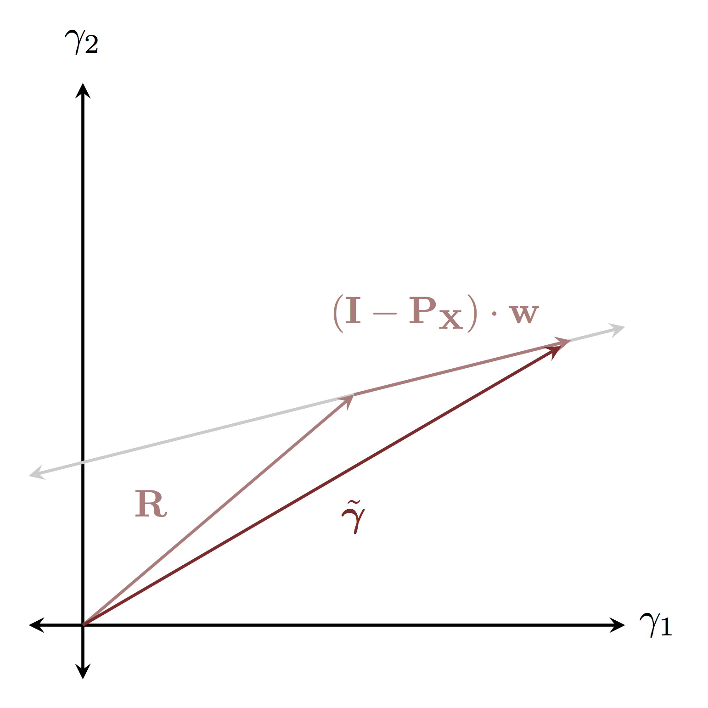
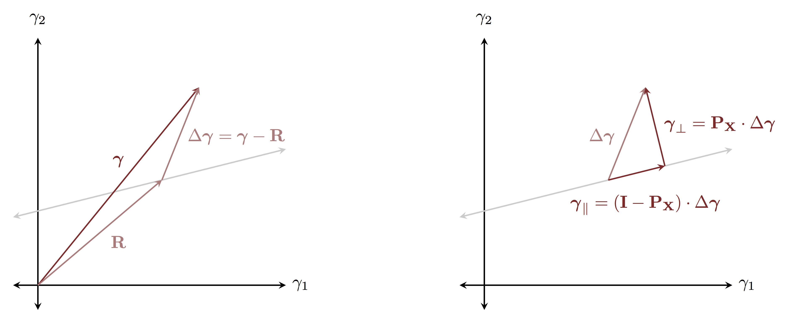

```{r setup, include=FALSE}
knitr::opts_chunk$set(comment=NA)
```

A linear regression is _underdetermined_ when there are fewer observations than
parameters.  In this case the likelihood function does not concentrate on a 
compact neighborhood but rather an _underdetermined hyperplane_ of degenerate
model configurations.  The corresponding posterior density has a surprisingly 
interesting geometry, even with weakly-informative prior densities that ensure
a well-defined fit.  In this short note I walk through the nature of this
geometry and why underdetermined regressions are so hard to fit.

Let's consider a basic linear regression with $M$ slopes, $\boldsymbol{\beta}$, 
a single intercept, $\alpha$, and an unknown measurement variation, $\sigma$.
The regression will be underdetermined if there are fewer than $M + 1$
observations to constrain all of the slopes and the intercept.  Let's see what
happens when we try to fit a linear regression with many fewer observations.

First we simulate data using $M = 200$ slopes and only $N = 100$ observations.

```{r}
writeLines(readLines("generate_data.stan"))
```

```{r}
c_light <- c("#DCBCBC")
c_light_highlight <- c("#C79999")
c_mid <- c("#B97C7C")
c_mid_highlight <- c("#A25050")
c_dark <- c("#8F2727")
c_dark_highlight <- c("#7C0000")

c_light_trans <- c("#DCBCBC80")
c_dark_trans <- c("#8F272780")
c_green_trans <- c("#00FF0080")

library(rstan)
rstan_options(auto_write = TRUE)
options(mc.cores = parallel::detectCores())

util <- new.env()
source('stan_utility.R', local=util)

fit <- stan(file='generate_data.stan', iter=1,
            chains=1, seed=194838, algorithm="Fixed_param")

X <- extract(fit)$X[1,,]
y <- extract(fit)$y[1,]
N <- dim(X)[1]
M <- dim(X)[2]

stan_rdump(c("N", "M", "X", "y"), file="linear_regression.data.R")
```

We then proceed to fit the simulated data using weakly informative priors on
all of the parameters to ensure a well-defined posterior distribution.

```{r}
writeLines(readLines("linear_regression.stan"))
```

```{r, cache=TRUE}
input_data <- read_rdump("linear_regression.data.R")
fit <- stan(file='linear_regression.stan', data=input_data, seed=4938483)

util$check_all_diagnostics(fit)
```

Whoa, that's unpleasant.  According to the split $\hat{R}$ for each parameter
the four chains we ran didn't mix at all, and the E-FMI warnings indicate that
the geometry encountered by each individual chain was not particularly pleasant.
There are no divergences but the treedepth saturation warning indicates that 
the adapted step sizes were quite small, further suggesting an unpleasant 
posterior geometry.  Before running with a larger maximum treedepth let's build 
up some intuition about what to expect in our likelihood function, and hence our 
fit.  

Typically as the measurement variation vanishes the likelihood function would 
concentrate on a single configuration of slopes and intercept, 
$\tilde{\boldsymbol{\gamma}} = (\tilde{\boldsymbol{\beta}}, \tilde{\alpha})$.  
Because we don't have enough observations, however, the likelihood function in 
our underdetermined regression concentrates on a hyperplane of configurations.
Ignoring the small contribution due to the priors, this hyperplane is defined by
$$
\tilde{\boldsymbol{\gamma}} = \mathbf{R} + 
(\mathbf{I} - \mathbf{P}_{\mathbf{X}}) \cdot \mathbf{w}
$$
where 
$$
\mathbf{R} = \mathbf{X}^{+} \cdot \mathbf{y},
$$
$$
\mathbf{P}_{\mathbf{X}} = 
\mathbf{X}^{+} \cdot (\mathbf{X} \cdot \mathbf{X}^{+})^{-1} \cdot \mathbf{X},
$$
and $\mathbf{w}$ is any vector.  Here $\mathbf{X}$ is the _buffered_ design
matrix that includes a column of ones to incorporate the intercept and $^{+}$
indicates the _Moore-Penrose pseudo-inverse_.  In practice the action of the 
pseudo-inverse on a vector, $\mathbf{b}$, can be calculated by solving the 
linear system
$$
(\mathbf{X}^{T} \cdot \mathbf{X}) \cdot (\mathbf{X}^{+} \cdot \mathbf{b}) \cdot
\mathbf{X}^{T} \cdot \mathbf{b}.
$$

Geometrically $\mathbf{P}_{X}$ defines a _projection_ operator that projects out
the component of a vector _orthogonal_ to the underdetermined hyperplane.  At 
the same time $\mathbf{I} - \mathbf{P}_{X}$ defines a projection operator that
projects out the component of a vector _along_ the underdetermined hyperplane.
In other words, any point on the underdetermined hyperplane, 
$\tilde{\boldsymbol{\gamma}}$, can be decomposed into the vector from the origin 
to the hyerplane, $\mathbf{R}$, and a vector along the hyperplane,  
$(\mathbf{I} - \mathbf{P}_{\mathbf{X}}) \cdot \mathbf{w}$.

<br><br>

<br><br>

Moreover, we can decompose any configuration $\boldsymbol{\gamma}$ into the
vector $R$ and the distance from the configuration to the underdetermined
hyperplane, $\Delta \boldsymbol{\gamma}$.  That distance can then be further
decomposed into perpendicular and parallel components using the projection
operator, $\mathbf{P}_{\mathbf{X}}$.

<br><br>

<br><br>

As the measurement variation, $\sigma$, increases away from zero the 
concentration of the likelihood function, and hence our posterior density,
around the underdetermined hyperplane, weakens.  Because we include $\sigma$ as 
a parameter in our model, our fit will have to contend with this varying 
concentrations around the hyperplane.

Let's try our fit again, only this time calculating the perpendicular and
parallel components of the distance from each sampled configuration and the
underdetermined hyperplane.

```{r}
writeLines(readLines("linear_regression_w_proj.stan"))
```

This time we also make sure to give our trajectories the room they need by
expanding the maximum treedepth.

```{r, cache=TRUE}
fit <- stan(file='linear_regression_w_proj.stan', data=input_data, seed=4938483,
            control=list(max_treedepth=15))

util$check_n_eff(fit)
util$check_rhat(fit)
util$check_div(fit)
util$check_treedepth(fit, 15)
util$check_energy(fit)
```

There are no more effective sample size, split $\hat{R}$, or treedepth warnings, 
but the energy fraction of missing information warnings persist.  Let's explore 
what's happening around the underdetermined hyperplane.

As $\sigma$ decreases our samples are drawn towards the hyperplane which
manifests in a strong correlation between $\sigma$ and the distance $\delta$.
The posterior doesn't push all the way to $\sigma = 0$ because the few 
observations that we do have are enough to contain the likelihood for the
measurement variability above $\sigma \approx 0.5$.

```{r}
partition <- util$partition_div(fit)
div_params <- partition[[1]]
nondiv_params <- partition[[2]]

plot(log(nondiv_params$sigma), log(nondiv_params$delta),
     col=c_dark_trans, pch=16, cex=0.8, main="",
     xlab="log(sigma)", ylab="log(delta)", xlim=c(-3, 2))
points(log(div_params$sigma), log(div_params$delta),
       col=c_green_trans, pch=16, cex=0.8)
```

More troubling, the shrinkage towards the hyperplane pulls the perpendicular
components of the model configuration towards zero in both directions which
manifests as a funnel!  The tapering of the funnel is limited by the posterior
for $\sigma$, but it is still challenging enough to require small integrator 
step sizes and long numerical trajectories.  Had we fewer observations the 
funnel would collapse even further and make the fitting all the more
difficult.

```{r}
plot(nondiv_params$"gamma_perp[1]", log(nondiv_params$sigma),
     col=c_dark_trans, pch=16, cex=0.8, main="",
     xlab="gamma_perp[1]", ylab="log(sigma)")
points(div_params$"gamma_perp[1]", log(div_params$sigma),
       col=c_green_trans, pch=16, cex=0.8)
```

The parallel components also manifest a bit of a funnel, but instead of 
shrinking towards zero they just shrink towards the bulk of our weakly
informative priors.  Without these priors to contain the posterior distribution
the parallel components would expand out towards infinity regardless of the
value of $\sigma$.

```{r}
plot(nondiv_params$"gamma_par[1]", log(nondiv_params$sigma),
     col=c_dark_trans, pch=16, cex=0.8, main="",
     xlab="gamma_par[1]", ylab="log(sigma)")
points(div_params$"gamma_par[1]", log(div_params$sigma),
       col=c_green_trans, pch=16, cex=0.8)
```

Unfortunately there's not much that we can do to ameliorate the geometry of the
underdetermined regression posterior.  Unlike hierarchical models, the funnel 
manifests directly in the observational model and hence isn't immediately 
amenable to reparameterizations.  A prior incorporating additional 
domain expertise about the minimal reasonable scale for $\sigma$ within a 
specific measurement process could cut off more of the funnel.  With only
$N = 100$ observations, however, the posterior already learns to suppress 
$\sigma \lesssim 0.5$ which isn't far from the true value of $\sigma = 1$.
Consequently there isn't much room for additional information.

Ultimately the geometry of underdetermined regression posteriors is not
particularly well-researched and optimal implementations are still very open
areas of research!

# Acknowledgements

A very special thanks to everyone supporting me on Patreon: Aki Vehtari, 
Alan O'Donnell, Andre Zapico, Andrew Rouillard, Austin Rochford, Avraham Adler, 
Bo Schwartz Madsen, Bryan Yu, Cat Shark, Charles Naylor, Christopher Howlin, 
Colin Carroll, Daniel Simpson, David Pascall, David Roher, David Stanard, 
Ed Cashin, Eddie Landesberg, Elad Berkman, Eric Jonas, Ethan Goan, 
Finn Lindgren, Granville Matheson, Hernan Bruno, J Michael Burgess, 
Joel Kronander, Jonas Beltoft Gehrlein, Joshua Mayer, Justin Bois, 
Lars Barquist, Luiz Carvalho, Marek Kwiatkowski, Matthew Kay, 
Maurits van der Meer, Maxim Kesin, Michael Dillon, Michael Redman, 
Noah Silverman, Ole Rogeberg, Oscar Olvera, Paul Oreto, Peter Heinrich, 
Putra Manggala, Ravin Kumar, Riccardo Fusaroli, Richard Torkar, Robert Frost, 
Robin Taylor, Sam Petulla, Sam Zorowitz, Seo-young Kim, Seth Axen, 
Sharan Banagiri, Simon Duane, Stephen Oates, Stijn, Vladislavs Dovgalecs, 
and yolha.

# Original Computing Environment

```{r, comment=NA}
writeLines(readLines(file.path(Sys.getenv("HOME"), ".R/Makevars")))
```

```{r, comment=NA}
devtools::session_info("rstan")
```
