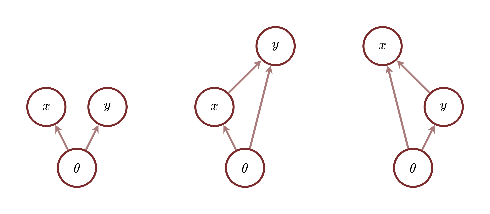
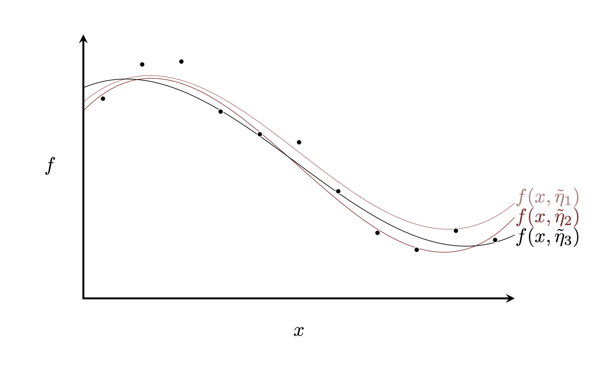

```{r setup, include=FALSE}
knitr::opts_chunk$set(comment=NA)
knitr::opts_knit$set(global.par = TRUE)
```

Not every observation is whole.  In many circumstances some components of the
observational space are straightforward to observe while some are more difficult
to capture.  This disparity motivates _variate-covariate_ models that learn the
statistical relationships between these components to predictively complete
incomplete observations when needed.  With some strong assumptions
variate-covariate models eventually yield the infamous, although poorly named,
regression models.

In this case study we'll review the foundations of variate-covariate modeling
and techniques for building and implementing these models in practice,
demonstrating the resulting in methodology with some extensive examples.
Throughout I will attempt to relate this modeling perspective to more
conventional treatments of regression modeling.

# Foundations of Variate-Covariate Modeling

We begin by establishing the foundational concepts of variates, covariates, and
models that consistently incorporate the two.  We will then review some of the
more common configurations of these models that lead to substantial
simplifications, and the practical consequences of those simplifications.

## Variates and Covariates

We often consider the observational space to be indivisible, with all of its
components observed or predicted together.  In some applications, however, not
all of the components are always observed.  This results in a _missing data_
problem.

Consider for example the observational space
$$
Y_{1} \times \ldots \times Y_{n} \times \ldots \times Y_{N}
$$
with the component variables
$$
(y_{1}, \ldots, y_{n}, \ldots, y_{N})
$$
and the complete observational model
$$
\pi(y_{1}, \ldots, y_{n}, \ldots, y_{N} \mid \theta).
$$
When the first component is missing the resulting observation is modeled by the
marginal observational model
$$
\pi(y_{2}, \ldots, y_{n}, \ldots, y_{N} \mid \theta)
=
\int \mathrm{d} y_{1} \,
\pi(y_{1}, \ldots, y_{n}, \ldots, y_{N} \mid \theta).
$$
Likewise if the first two components are missing then the resulting observation
is modeled by
$$
\pi(y_{3}, \ldots, y_{n}, \ldots, y_{N} \mid \theta)
=
\int \mathrm{d} y_{1} \, \mathrm{d} y_{2} \,
\pi(y_{1}, \ldots, y_{n}, \ldots, y_{N} \mid \theta),
$$
and so on.

One of the most common missing data problems arises when the observational space
decomposes into two components, one of which is included only in _some_
observations while the other is included in _all_ observations.  Notationally I
will refer to the observational space in this case as $Y \times X$ with the
_variates_ $y \in Y$ included only in some observations and the _covariates_
$x \in X$ included in all observations.  In many cases the variate space $Y$
and the covariate space $X$ will also consist of multiple components of their
own, but to simplify the notation I will generally denote them with single
variables.

Moreover I will refer to an observation that contains just covariate values,
$\tilde{x}$, without an accompanying variate observation as an _incomplete_
observation.  On the other hand I will refer to an observation that contains
both covariate and variate values, $(\tilde{y}, \tilde{x})$, as a _complete_
observation.

There are many equivalent, or nearly equivalent, terminologies that one will
find in the statistics and machine learning literature.  For example complete
observations are often referred to as "in samples" data with incomplete
observations referred to as "out of sample" data.  Additionally complete
observations used to fit a model are often denoted  "training data" while
complete observations intentionally censored to incomplete observations to
assess predictive performance are denoted "testing data".

## Variate-Covariate Models

Once the full observational space has been partitioned, modeling complete and
incomplete observations is conceptually straightforward.  Complete observations
are modeled with a complete observational model,
$$
\pi(y, x \mid \theta),
$$
while incomplete observations are modeled with the corresponding marginal
observational model,
$$
\pi(x \mid \theta)
= \int \mathrm{d} y \,
\pi(y, x \mid \theta).
$$

Neither of these models, however, informs what unobserved variate configurations
are consistent with an incomplete observation $\tilde{x}$.  In order to complete
an incomplete, and lonely, observation we need to understand the statistical
relationship between the variates $y$ and the covariates $x$; not how $y$
varies alone but rather how $y$ _covaries_ with $x$.

<center>
<br>
```{r, out.width = "75%", echo=FALSE}

```
<br><br>
</center>

If we can learn this covariation from complete observations then we might be
able to apply it to predicting missing variates.

Mathematically the covariation between $y$ and $x$ is captured in the
conditional observational model
$$
\pi(y \mid x, \theta)
$$
that lifts the incomplete observational model back to the complete observational
model.  In other words the statistical resolution of an incomplete observation
motivates a particular conditional decomposition of the complete observational
model $\pi(y, x \mid \theta)$ into a _conditional variate model_
$\pi(y \mid x, \theta)$ and a _marginal covariate model_ $\pi(x \mid \theta)$,
$$
\pi(y, x \mid \theta) = \pi(y \mid x, \theta) \, \pi(x \mid \theta).
$$

This decomposition is motivated by the variate prediction task; critically it
does not assume any narratively generative relationship.  Variates and
covariates are differentiated not by what is generated first in a complete
observation but rather by what tends to be missing in a given application.
The categorization of the observational space into variates and covariates can
differ from one application to the next even when the data generating process
remains the same up to the censoring process!

Narratively generative assumptions might motivate a completely different
decomposition of the complete observational model $\pi(y, x \mid \theta)$.

<center>
<br>
```{r, out.width = "75%", echo=FALSE}

```
<br><br>
</center>

The number of conditional decompositions, and possible generative stories,
explodes even further when the variate and covariate spaces are themselves
composite.

For example consider measurements, $y$, made at varying spatial locations, $x$.
In this case the conditional decomposition
$$
\pi(y, x \mid \theta) = \pi(y \mid x, \theta) \, \pi(x \mid \theta)
$$
captures the structure of the data generating process.  When the spatial
locations are fixed by the measurement process, but not all measurements have
been completed, $y$ becomes a natural variate and $x$ a natural covariate, and
this narratively generative decomposition aligns with the natural
variate-covariate decomposition.  On the other hand if all of the measurements
are observed but some of the location information has been lost then the
non-narratively generative decomposition
$$
\pi(y, x \mid \theta) = \pi(x \mid y, \theta) \, \pi(y \mid \theta)
$$
captures the appropriate variate-covariate structure.

Without any narratively generative structure to facilitate model development
constructing a conditional variate model and marginal covariate model directly
isn't always straightforward, especially if the interaction between the variates
and covariates is complicated.  In those cases it is often easier to use any
narratively generative structure to first build the complete observational model
before decomposing it into appropriate conditional variate and marginal
covariate models.

# You Complete Me (Statistically)

Conceptually incomplete observations inform the model configurations through the
marginal covariate model,
$$
\pi(\theta \mid \tilde{x}) \propto \pi(\tilde{x} \mid \theta) \, \pi(\theta),
$$
while complete observations inform the model configurations through both the
conditional variate model and marginal covariate model,
$$
\pi(\theta \mid \tilde{y}, \tilde{x})
\propto
\pi(\tilde{y} \mid \tilde{x}, \theta) \,
\pi(\tilde{x} \mid \theta) \, \pi(\theta).
$$
Any constraints on these model configurations $\theta$ informs predictions of
missing variates through the partial evaluation of the conditional variate
model,
$$
\pi(y \mid \tilde{x}, \theta).
$$
Mathematically integrating complete and incomplete observations into consistent
predictions, however, isn't always straightforward.

The key to avoiding mathematical errors is to always work with the full Bayesian
model,
$$
\pi(y, x, \theta) = \pi(y \mid x, \theta) \, \pi(x \mid \theta) \, \pi(\theta).
$$
Evaluating the full model on whatever variables have been observed
_automatically_ integrates all of the available information to form consistent
inferences of the model configurations and consistent predictions of any missing
variates.

In this section we will investigate various evaluations of the full Bayesian
model to understand how the conditional variate model and marginal covariate
model contribute to these inferential outcomes in different circumstances.  I
have placed a particular focus on how these contributions are determined by the
assumed interactions between the two models.  To introduce the mathematical
derivations more gently we will begin by considering a single observation before
moving on to multiple observations where inferences and predictions are woven
together.

Before that, however, let me emphasize that these derivations are meant to only
illustrate how inferences from the conditional variate model and the marginal
covariate model are intertwined in complex ways.  To implement these inferences
in practice we only ever need to construct the full Bayesian model and evaluate
it on all of the observed variables!

## Single Observation

Let's begin our analysis of the variate-covariate model by considering what
happens when we evaluate the full Bayesian model for a single observation,
$$
\pi(y, x, \theta) = \pi(y \mid x, \theta) \, \pi(x \mid \theta) \, \pi(\theta),
$$
on both a complete and an incomplete observation.  We will first consider the
model configurations monolithically before decomposing them into multiple
parameters that capture the individual and common dependencies of the
conditional variate and marginal covariate models.

### Encapsulated Model Configurations

When the model configurations are treated as a monolithic variable $\theta$
they inform both the the marginal covariate model and the conditional variate
model.  Consequently we will in general learn about the model configurations
from both complete and incomplete observations.

<center>
<br>
```{r, out.width = "75%", echo=FALSE}

```
<br><br>
</center>

Keep in mind that we're denoting the variate and covariate spaces with single
variables to ease the notational burden here.  The variate and covariate spaces
could themselves decomposes into multiple components, for example if modeling
looking at repeated observations.

<center>
<br>
```{r, out.width = "75%", echo=FALSE}

```
<br><br>
</center>

Given a complete observation $(\tilde{y}, \tilde{x})$ the posterior distribution
for $\theta$ becomes
$$
\begin{align*}
\pi(\theta \mid \tilde{y}, \tilde{x})
&\propto
\pi(\tilde{y}, \tilde{x}, \theta)
\\
&\propto
\pi(\tilde{y} \mid \tilde{x}, \theta) \,
\pi(\tilde{x} \mid \theta) \,
\pi(\theta).
\end{align*}
$$
We can also recover this posterior distribution by incorporating the covariates
and variates sequentially.  The evaluated marginal covariate model first updates
the prior model into a covariate only posterior distribution,
$$
\pi(\theta \mid \tilde{x}) \propto \pi(\tilde{x} \mid \theta) \, \pi(\theta).
$$
Then the evaluated conditional variate model updates this into the full
posterior distribution,
$$
\pi(\theta \mid \tilde{y}, \tilde{x})
\propto
\pi(\tilde{y} \mid \tilde{x}, \theta) \, \pi(\theta \mid \tilde{x}).
$$

When only an incomplete observation of covariates $\tilde{x}$ is available the
conditional variate model informs a predictive distribution for the missing
variate.  To see this we first marginalize out the model configurations from the
full Bayesian model,
$$
\begin{align*}
\pi(y, x)
&=
\int \mathrm{d} \theta \, \pi(y, x, \theta)
\\
&=
\int \mathrm{d} \theta \,
\pi(y \mid x, \theta) \, \pi(x \mid \theta) \, \pi(\theta),
\end{align*}
$$
and then evaluate on the observed covariate,
$$
\begin{align*}
\pi(y \mid \tilde{x})
&\propto
\pi(y, \tilde{x})
\\
&\propto
\int \mathrm{d} \theta \,
\pi(y \mid \tilde{x}, \theta) \, \pi(\tilde{x} \mid \theta) \, \pi(\theta)
\\
&\propto
\int \mathrm{d} \theta \,
\pi(y \mid \tilde{x}, \theta) \, \pi(\theta \mid \tilde{x}).
\end{align*}
$$
Here the prior model and the evaluated marginal covariate model inform the model
configurations $\theta$, which then inform the conditional variate model how to
make predictions for the unobserved variate $y$.

### Component Model Configurations

In most cases not every component of the model configuration space will inform
both the conditional variate model and the marginal covariate model.  A more
realistic picture arises when we decompose the model configuration space into
component parameters that influence just the conditional variate model, $\eta$,
component parameters that influence just the marginal covariate model, $\gamma$,
and component parameters that influence both, $\psi$,
$$
\theta = (\eta, \gamma, \psi).
$$

The parameters $\psi$ couple the behavior of the conditional variate model and
marginal covariate together so that if one changes so too must the other.
Because this coupling complicates inferential behavior the $\psi$ are known as
_confounders_.

Under this decomposition the full Bayesian model becomes
$$
\pi(y, x, \eta, \gamma, \psi)
=
\pi(y \mid x, \eta, \psi) \, \pi(x \mid \gamma, \psi) \,
\pi(\eta) \, \pi(\gamma) \, \pi(\psi).
$$

<center>
<br>
```{r, out.width = "75%", echo=FALSE}

```
<br><br>
</center>

Given a complete observation $(\tilde{y}, \tilde{x})$ we can inform a posterior
distribution over all of these parameters,
$$
\pi(\eta, \gamma, \psi, \mid \tilde{y}, \tilde{x})
\propto
\pi(\tilde{y} \mid \tilde{x}, \eta, \psi) \,
\pi(\tilde{x} \mid \gamma, \psi) \,
\pi(\eta) \, \pi(\gamma) \, \pi(\psi).
$$
The observed covariates inform $\gamma$ and $\psi$ through the marginal
covariate model while the covariation between the observed variates and
covariates informs $\eta$ and $\psi$ through the conditional variate model.

To make predictions for the missing variate accompanying an observed covariate
we proceed as before.  First we marginalize the parameters out of the full
Bayesian model,
$$
\begin{align*}
\pi(y, x)
&=
\int \mathrm{d} \eta \, \mathrm{d} \gamma \, \mathrm{d} \psi \,
\pi(y, x, \eta, \gamma, \psi)
\\
&=
\int \mathrm{d} \eta \, \mathrm{d} \gamma \, \mathrm{d} \psi \,
\pi(y \mid x, \eta, \psi) \, \pi(x \mid \gamma, \psi) \,
\pi(\eta) \, \pi(\gamma) \, \pi(\psi)
\\
&=
\int \mathrm{d} \psi
\left[ \int \mathrm{d} \eta \, \pi(y \mid x, \eta, \psi) \, \pi(\eta) \right]
\left[ \int \mathrm{d} \gamma \, \pi(x \mid \gamma, \psi) \, \pi(\gamma) \right]
\pi(\psi).
\end{align*}
$$
Then we condition on the observed covariates $\tilde{x}$,
$$
\begin{align*}
\pi(y \mid \tilde{x})
&\propto
\pi(y, \tilde{x})
\\
&\propto
\int \mathrm{d} \psi
\left[
\int \mathrm{d} \eta \, \pi(y \mid \tilde{x}, \eta, \psi) \, \pi(\eta)
\right]
\left[
\int \mathrm{d} \gamma \, \pi(\tilde{x} \mid \gamma, \psi) \, \pi(\gamma)
\right]
\pi(\psi).
\end{align*}
$$

Without any observed variates $\eta$ is informed by only the prior model.
Integrating out $\eta$ gives a marginal predictive distribution for the missing
variate that depends on only the unknown confounding behavior,
$$
\int \mathrm{d} \eta \, \pi(y \mid \tilde{x}, \eta, \psi) \, \pi(\eta)
\propto \pi(y \mid \tilde{x}, \psi).
$$

While the parameters $\gamma$ don't inform this predictive distribution they do
influence what we learn about that confounding parameters $\psi$ from the
observed covariates.  After integrating out $\gamma$ we can interpret the last
two terms as a marginal posterior distribution for the confounding variables
given just the observed covariates,
$$
\left[
\int \mathrm{d} \gamma \, \pi(\tilde{x} \mid \gamma, \psi) \, \pi(\gamma)
\right]
\pi(\psi)
\propto
\pi(\psi \mid \tilde{x}).
$$

The final predictive distribution is then given by weighting the
confounder-dependent predictive distribution by this marginal posterior for the
confounding behavior,
$$
\pi(y \mid \tilde{x})
\propto
\int \mathrm{d} \psi \, \pi(y \mid \tilde{x}, \psi) \, \pi(\psi \mid \tilde{x}).
$$

Because of the confounding behavior both the marginal covariate model and the
conditional variate model are necessary for making consistent inferences and
predictions.

### No Confounders {#sec:single_no_confounders}

Inferential outcomes simplify dramatically when there are no confounding
parameters.  In this case the full Bayesian model decomposes into independent
conditional variate and marginal covariate models,
$$
\pi(y, x, \eta, \gamma)
=
\pi(y \mid x, \eta) \, \pi(x \mid \gamma) \, \pi(\eta) \, \pi(\gamma).
$$

<center>
<br>
```{r, out.width = "75%", echo=FALSE}

```
<br><br>
</center>

Given a complete observation $(\tilde{y}, \tilde{x})$ the posterior distribution
over $\eta$ and $\psi$ becomes
$$
\begin{align*}
\pi(\eta, \gamma \mid \tilde{y}, \tilde{x})
&\propto
\pi(\tilde{y} \mid \tilde{x}, \eta) \, \pi(\tilde{x} \mid \gamma) \,
\pi(\eta) \, \pi(\gamma)
\\
&\propto
\pi(\tilde{y} \mid \tilde{x}, \eta) \, \pi(\eta) \,
\pi(\tilde{x} \mid \gamma) \, \pi(\gamma)
\\
&\propto
\pi(\eta \mid \tilde{y}, \tilde{x}) \, \pi(\gamma \mid \tilde{x}).
\end{align*}
$$
Without any confounding parameters inferences for the conditional variate
parameter $\eta$ and the marginal covariate model $\gamma$ completely decouple!
The empirical covariation between $\tilde{y}$ and $\tilde{x}$ informs the
configuration of the conditional variate model completely independently of how
$\tilde{x}$ informs the configuration of the marginal covariate model.
Consequently we can learn the conditional variate parameters $\eta$ without
constructing a marginal covariate model at all.

Predictions for unobserved variates simplify as well.  The marginal distribution
for the full observational space is given by
$$
\begin{align*}
\pi(y, x)
&=
\int \mathrm{d} \eta \, \mathrm{d} \gamma \, \pi(y, x, \eta, \gamma)
\\
&=
\int \mathrm{d} \eta \, \mathrm{d} \gamma \,
\pi(y \mid x, \eta) \, \pi(x \mid \gamma) \, \pi(\eta) \, \pi(\gamma)
\\
&=
\left[ \int \mathrm{d} \eta \, \pi(y \mid x, \eta) \, \pi(\eta) \right]
\left[ \int \mathrm{d} \gamma \, \pi(x \mid \gamma) \, \pi(\gamma) \right].
\end{align*}
$$
Conditioning on the observed covariates $\tilde{x}$ then gives the predictive
distribution for the missing variate $y$,
$$
\begin{align*}
\pi(y \mid \tilde{x})
&\propto
\pi(y, \tilde{x})
\\
&\propto
\left[
\int \mathrm{d} \eta \, \pi(y \mid \tilde{x}, \eta) \, \pi(\eta)
\right]
\left[
\int \mathrm{d} \gamma \, \pi(\tilde{x} \mid \gamma) \, \pi(\gamma)
\right].
\end{align*}
$$

In this case the evaluation of the marginal covariate model is just a constant
that can be dropped entirely to give
$$
\pi(y \mid \tilde{x})
\propto \int \mathrm{d} \eta \, \pi(y \mid \tilde{x}, \eta) \, \pi(\eta).
$$
Once again the marginal covariate model is irrelevant; given an observed
covariate we can make predictions for the unobserved variate using only the
conditional variate model and the marginal prior model for $\eta$.

Being able to disregard the marginal covariate model entirely significantly
reduces our modeling burden, especially when the provenance of the covariates is
poorly understood.  This is possible, however, only in the absence of
confounding behaviors and cannot be taken for granted.

## Multiple Observations

Generalizing these evaluations to multiple observations, some of which might be
complete and some of which might be incomplete, is straightforward _if the
configurations of the conditional variate and marginal covariate models are
fixed_.  If those configurations vary across observations, however, then we
have to proceed very carefully.  In this section we will investigate inferential
outcomes under various assumptions about the heterogeneity of the conditional
variate and marginal covariate model configurations.

### Encapsulated Model Configurations

To warm up let's consider the entire model configuration space encapsulated into
a single variable $\theta$ once again and build models for homogenous and
heterogeneous configurations.

If the monolithic model configuration is fixed across observations then the full
Bayesian model is given by
$$
\pi(y_{1}, x_{1}, \ldots, y_{K}, x_{K}, \theta)
=
\left[ \prod_{k = 1}^{K} \pi(y_{k} \mid x_{k}, \theta) \,
\pi(x_{k} \mid \theta) \right] \pi(\theta).
$$

<center>
<br>
```{r, out.width = "75%", echo=FALSE}

```
<br><br>
</center>

For just two observations, $(y_{1}, x_{1})$ and $(y_{2}, x_{2})$, this reduces
to
$$
\pi(y_{1}, x_{1}, y_{2}, x_{2}, \theta)
=
\pi(y_{1} \mid x_{1}, \theta) \, \pi(x_{1} \mid \theta) \,
\pi(y_{2} \mid x_{2}, \theta) \, \pi(x_{2} \mid \theta) \,
\pi(\theta).
$$

When the first observation is complete but the second is incomplete, so that we
have $\tilde{y}_{1}$ and $\tilde{x}_{1}$ but only $\tilde{x}_{2}$, we can
construct a predictive distribution for the missing variate as
$$
\begin{align*}
\pi(y_{2} \mid \tilde{y}_{1}, \tilde{x}_{1}, \tilde{x}_{2})
&\propto
\pi(\tilde{y}_{1}, \tilde{x}_{1}, y_{2}, \tilde{x}_{2})
\\
&\propto
\int \mathrm{d} \theta \,
\pi(\tilde{y}_{1}, \tilde{x}_{1}, y_{2}, \tilde{x}_{2}, \theta)
\\
&\propto
\int \mathrm{d} \theta \,
\pi(\tilde{y}_{1} \mid \tilde{x}_{1}, \theta) \,
\pi(\tilde{x}_{1} \mid \theta) \,
\pi(y_{2} \mid \tilde{x}_{2}, \theta) \,
\pi(\tilde{x}_{2} \mid \theta) \,
\pi(\theta)
\\
&\propto
\int \mathrm{d} \theta \,
\pi(y_{2} \mid \tilde{x}_{2}, \theta) \,
\pi(\tilde{y}_{1} \mid \tilde{x}_{1}, \theta) \,
\pi(\tilde{x}_{1} \mid \theta) \, \pi(\tilde{x}_{2} \mid \theta) \,
\pi(\theta).
\end{align*}
$$

The last three terms can be written as a posterior distribution for $\theta$
given both covariate observations,
$$
\pi(\tilde{x}_{1} \mid \theta) \, \pi(\tilde{x}_{2} \mid \theta) \,
\pi(\theta) \propto \pi(\theta \mid \tilde{x}_{1}, \tilde{x}_{2}).
$$
This quantifies how much the prior model and the marginal covariate model inform
the model configurations $\theta$.

Evaluating the conditional variate model on the observed variate $\tilde{y}_{1}$
defines a likelihood function that updates this covariate posterior distribution
into a posterior distribution informed by all of the observed quantities,
$$
\begin{align*}
\pi(\tilde{y}_{1} \mid \tilde{x}_{1}, \theta) \,
\pi(\tilde{x}_{1} \mid \theta) \, \, \pi(\tilde{x}_{2} \mid \theta) \,
\pi(\theta)
&\propto
\pi(\tilde{y}_{1} \mid \tilde{x}_{1}, \theta) \,
\pi(\theta \mid \tilde{x}_{1}, \tilde{x}_{2})
\\
&\propto
\pi(\theta \mid \tilde{y}_{1}, \tilde{x}_{1}, \tilde{x}_{2}).
\end{align*}
$$

Finally the predictive distribution for the missing variate $y_{2}$ can be
interpreted as the conditional variate model evaluated at $\tilde{x}_{2}$
averaged over this posterior distribution,
$$
\pi(y_{2} \mid \tilde{y}_{1}, \tilde{x}_{1}, \tilde{x}_{2})
\propto
\int \mathrm{d} \theta \,
\pi(y_{2} \mid \tilde{x}_{2}, \theta) \,
\pi(\theta \mid \tilde{y}_{1}, \tilde{x}_{1}, \tilde{x}_{2}).
$$

Conversely when the model configuration varies across observations the full
Bayesian model is given by
$$
\pi(y_{1}, x_{1}, \ldots, y_{K}, x_{K}, \theta_{1}, \ldots, \theta_{K})
=
\prod_{k = 1}^{K} \pi(y_{k} \mid x_{k}, \theta_{k}) \,
\pi(x_{k} \mid \theta_{k}) \, \pi(\theta_{k}).
$$

<center>
<br>
```{r, out.width = "75%", echo=FALSE}

```
<br><br>
</center>

If these individual observations also consist of multiple components that
behave homogeneously then this model could be expanded to
$$
\pi(y_{1}, x_{1}, \ldots, y_{N}, x_{N}, \theta_{1}, \ldots, \theta_{K})
=
\prod_{n = 1}^{N} \pi(y_{n} \mid x_{n}, \theta_{k(n)}) \,
\pi(x_{n} \mid \theta_{k(n)}) \prod_{k = 1}^{K}  \pi(\theta_{k}),
$$
where $k(n)$ identifies to which observation, and hence model configuration,
each component belongs.

<center>
<br>
```{r, out.width = "75%", echo=FALSE}

```
<br><br>
</center>

Again for notational simplicity we will consider only $y_{k}$ and $x_{k}$ here,
and not any substructure.

For $K = 2$ observations the full Bayesian model for the multiple observations
reduces to
$$
\pi(y_{1}, x_{1}, y_{2}, x_{2}, \theta_{1}, \theta_{2})
=
\pi(y_{1} \mid x_{1}, \theta_{1}) \, \pi(x_{1} \mid \theta_{1}) \,
\pi(\theta_{1}) \,
\pi(y_{2} \mid x_{2}, \theta_{2}) \, \pi(x_{2} \mid \theta_{2}) \,
\pi(\theta_{2}).
$$

If the first observation is complete but the second is incomplete as before we
can construct a predictive distribution for the missing variate as
$$
\begin{align*}
\pi(y_{2} \mid \tilde{y}_{1}, \tilde{x}_{1}, \tilde{x}_{2})
&\propto
\pi(\tilde{y}_{1}, \tilde{x}_{1}, y_{2}, \tilde{x}_{2})
\\
&\propto
\int \mathrm{d} \theta_{1} \, \mathrm{d} \theta_{2} \,
\pi(\tilde{y}_{1}, \tilde{x}_{1}, y_{2}, \tilde{x}_{2}, \theta_{1}, \theta_{2})
\\
&\propto
\int \mathrm{d} \theta \, \mathrm{d} \theta_{2} \,
\pi(\tilde{y}_{1} \mid \tilde{x}_{1}, \theta_{1}) \,
\pi(\tilde{x}_{1} \mid \theta_{1}) \, \pi(\theta_{1}) \,
\pi(y_{2} \mid \tilde{x}_{2}, \theta_{2}) \,
\pi(\tilde{x}_{2} \mid \theta_{2}) \, \pi(\theta_{2})
\\
&\propto
\int \mathrm{d} \theta_{1}
\pi(\tilde{y}_{1} \mid \tilde{x}_{1}, \theta_{1}) \,
\pi(\tilde{x}_{1} \mid \theta_{1}) \, \pi(\theta_{1})
\int \mathrm{d} \theta_{2}
\pi(y_{2} \mid \tilde{x}_{2}, \theta_{2}) \,
\pi(\tilde{x}_{2} \mid \theta_{2}) \, \pi(\theta_{2}).
\end{align*}
$$

Because the model configurations are completely heterogeneous inferences for the
two observations completely decouple.  Indeed because the first integral is a
constant the predictive distribution reduces to
$$
\pi(y_{2} \mid \tilde{y}_{1}, \tilde{x}_{1}, \tilde{x}_{2})
\propto
\int \mathrm{d} \theta_{2}
\pi(y_{2} \mid \tilde{x}_{2}, \theta_{2}) \,
\pi(\tilde{x}_{2} \mid \theta_{2}) \, \pi(\theta_{2}),
$$
which is the exact same predictive distribution we derived when we had just
one incomplete observation, $\tilde{x}_{2}$.  We need some common structure in
order transfer inferences from one context to another.

### Component Model Configurations

In more realistic settings the model configurations aren't monolithically
homogenous or heterogeneous across observations.  Instead some components might
vary while others remain fixed, allowing at least some information to be pooled
between different observations.

The behaviors quantified by each of the three component parameters
$\theta = (\eta, \gamma, \psi)$ can in general feature some element that is
homogenous and some element that is heterogenous across observations.  For
demonstration purposes we will consider here heterogeneous parameters informing
the marginal covariate model, $\gamma_{k}$, homogenous parameters informing the
conditional variate model, $\eta$, heterogenous parameters informing the
conditional variate model, $\zeta_{k}$, and finally heterogenous confounding
parameters informing both models, $\psi_{k}$.  I will refer to the $\zeta_{k}$
as _treatment_ parameters as they often model active interventions designed to
influence the covariation between the variates and covariates.

Under these assumptions the full Bayesian model becomes
$$
\begin{align*}
&\pi(y_{1}, x_{1}, \ldots, y_{K}, x_{K}, \eta, \zeta_{1}, \ldots, \zeta_{K},
\gamma_{1}, \ldots, \gamma_{K}, \psi_{1}, \ldots, \psi_{K})
\\
&\quad =
\left[ \prod_{k = 1}^{K}
\pi(y_{k} \mid x_{k}, \eta, \zeta_{k}, \psi_{k}) \,
\pi(x_{k} \mid \gamma_{k}, \psi_{k}) \,
\pi(\zeta_{k}) \, \pi(\gamma_{k}) \, \pi(\psi_{k}) \right] \pi(\eta).
\end{align*}
$$

<center>
<br>
```{r, out.width = "75%", echo=FALSE}

```
<br><br>
</center>

For reference if each of these observations contains multiple components then
the model can also be expanded into
$$
\begin{align*}
&\pi(y_{1}, x_{1}, \ldots, y_{N}, x_{N}, \eta, \zeta_{1}, \ldots, \zeta_{K},
\gamma_{1}, \ldots, \gamma_{K}, \psi_{1}, \ldots, \psi_{K})
\\
&\quad =
\left[ \prod_{n = 1}^{N}
\pi(y_{n} \mid x_{n}, \eta, \zeta_{k(n)}, \psi_{k(n)}) \,
\pi(x_{n} \mid \gamma_{k(n)}, \psi_{k(n)})
\right]
\left[ \prod_{k = 1}^{K}
\pi(\zeta_{k}) \, \pi(\gamma_{k}) \, \pi(\psi_{k})
\right] \pi(\eta).
\end{align*}
$$

<center>
<br>
```{r, out.width = "75%", echo=FALSE}

```
<br><br>
</center>

For two observations: $(y_{1}, x_{1})$ and $(y_{2}, x_{2})$ the full Bayesian
model reduces to
$$
\begin{align*}
&\pi(y_{1}, x_{1}, y_{2}, x_{2}, \eta,
\zeta_{1}, \zeta_{2}, \gamma_{1}, \gamma_{2}, \psi_{1}, \psi_{2})
\\
&\quad\quad\quad\quad = \quad
\pi(y_{1} \mid x_{1}, \eta, \zeta_{1}, \psi_{1}) \,
\pi(x_{1} \mid \gamma_{1}, \psi_{1}) \,
\pi(\zeta_{1}) \, \pi(\gamma_{1}) \, \pi(\psi_{1})
\\
&\quad\quad\quad\quad \quad\;\; \cdot
\pi(y_{2} \mid x_{2}, \eta, \zeta_{2}, \psi_{2}) \,
\pi(x_{2} \mid \gamma_{2}, \psi_{2}) \,
\pi(\zeta_{2}) \, \pi(\gamma_{2}) \, \pi(\psi_{2})
\\
&\quad\quad\quad\quad \quad\;\; \cdot
\pi(\eta).
\end{align*}
$$

If both observations are complete, and we have both
$(\tilde{y}_{1}, \tilde{x}_{1})$ and $(\tilde{y}_{2}, \tilde{x}_{2})$, then we
can inform all of the parameters beyond the prior model.  The joint posterior
distribution becomes
$$
\begin{align*}
\pi(\eta, \zeta_{1}, \zeta_{2}, \gamma_{1}, \gamma_{2}, \psi_{1}, \psi_{2}
\mid \tilde{y}_{1}, \tilde{x}_{1}, \tilde{y}_{2}, \tilde{x}_{2})
&\propto
\pi(\tilde{y}_{1}, \tilde{x}_{1}, \tilde{y}_{2}, \tilde{x}_{2},
\eta, \zeta_{1}, \zeta_{2}, \gamma_{1}, \gamma_{2}, \psi_{1}, \psi_{2})
\\
&\propto \quad
\pi(\tilde{y}_{1} \mid \tilde{x}_{1}, \eta, \zeta_{1}, \psi_{1}) \,
\pi(\tilde{x}_{1} \mid \gamma_{1}, \psi_{1}) \,
\pi(\zeta_{1}) \, \pi(\gamma_{1}) \, \pi(\psi_{1})
\\
&\quad\;\; \cdot
\pi(\tilde{y}_{2} \mid \tilde{x}_{2}, \eta, \zeta_{2}, \psi_{2}) \,
\pi(\tilde{x}_{2} \mid \gamma_{2}, \psi_{2}) \,
\pi(\zeta_{2}) \, \pi(\gamma_{2}) \, \pi(\psi_{2})
\\
&\quad\;\; \cdot
\pi(\eta).
\end{align*}
$$
The marginal covariate model allows $\tilde{x}_{1}$ to inform $\psi_{1}$ and
$\gamma_{1}$ and $\tilde{x}_{2}$ to inform $\psi_{2}$ and $\gamma_{2}$.  At the
same time the conditional variate model allows the the covariation between
$\tilde{y}_{1}$ and $\tilde{x}_{1}$ to inform $\zeta_{1}$ and $\psi_{1}$
while the covariation between $\tilde{y}_{2}$ and $\tilde{x}_{2}$ informs
$\zeta_{2}$ and $\psi_{1}$.  Both complete observations inform the shared
parameter $\eta$.

When only the first observation is complete, so that we have
$(\tilde{y}_{1}, \tilde{x}_{1})$ but only $\tilde{x}_{2}$, we can construct a
predictive distribution for the unobserved variate $y_{2}$,
$$
\begin{align*}
\pi(y_{2} \mid \tilde{y}_{1}, \tilde{x}_{1}, \tilde{x}_{1})
&\propto
\pi(\tilde{y}_{1}, \tilde{x}_{1}, y_{2}, \tilde{x}_{1})
\\
&\propto
\int \mathrm{d} \eta \,
\mathrm{d} \zeta_{1} \, \mathrm{d} \zeta_{2} \,
\mathrm{d} \gamma_{1} \, \mathrm{d} \gamma_{2} \,
\mathrm{d} \psi_{1} \, \mathrm{d} \psi_{2} \,
\pi(\tilde{y}_{1}, \tilde{x}_{1}, y_{2}, \tilde{x}_{2},
\eta, \zeta_{1}, \zeta_{2}, \gamma_{1}, \gamma_{2}, \psi_{1}, \psi_{2})
\\
&\propto
\int \mathrm{d} \eta \,
\mathrm{d} \zeta_{1} \, \mathrm{d} \zeta_{2} \,
\mathrm{d} \gamma_{1} \, \mathrm{d} \gamma_{2} \,
\mathrm{d} \psi_{1} \, \mathrm{d} \psi_{2} \,
\\
&\hspace{10mm} \;\;\,
\pi(\tilde{y}_{1} \mid \tilde{x}_{1}, \eta, \zeta_{1}, \psi_{1}) \,
\pi(x_{1} \mid \gamma_{1}, \psi_{1}) \,
\pi(\zeta_{1}) \, \pi(\gamma_{1}) \, \pi(\psi_{1})
\\
&\hspace{10mm} \cdot
\pi(y_{2} \mid \tilde{x}_{2}, \eta, \zeta_{2}, \psi_{2}) \,
\pi(x_{2} \mid \gamma_{2}, \psi_{2}) \,
\pi(\zeta_{2}) \, \pi(\gamma_{2}) \, \pi(\psi_{2})
\\
&\hspace{10mm} \cdot
\pi(\eta)
\\
&\propto
\int \mathrm{d} \psi_{1} \, \mathrm{d} \psi_{2} \,
\pi(\psi_{1}) \, \pi(\psi_{2})
\\
&\hspace{10mm}
\int \mathrm{d} \eta \, \pi(\eta)
\\
&\hspace{20mm}
\int \mathrm{d} \zeta_{2} \,
\pi(y_{2} \mid \tilde{x}_{2}, \eta, \zeta_{2}, \psi_{2}) \, \pi(\zeta_{2})
\\
&\hspace{20mm}
\int \mathrm{d} \zeta_{1} \,
\pi(\tilde{y}_{1} \mid \tilde{x}_{1}, \eta, \zeta_{1}, \psi_{1}) \, \pi(\zeta_{1})
\\
&\hspace{10mm}
\int \mathrm{d} \gamma_{1} \, \mathrm{d} \gamma_{2} \,
\pi(\tilde{x}_{1} \mid \gamma_{1}, \psi_{1}) \,
\pi(\tilde{x}_{2} \mid \gamma_{2}, \psi_{2}) \,
\pi(\gamma).
\end{align*}
$$

Rewriting the last term as
$$
\int \mathrm{d} \gamma_{1} \, \mathrm{d} \gamma_{2} \,
\pi(\tilde{x}_{1} \mid \gamma, \psi_{1}) \,
\pi(\tilde{x}_{2} \mid \gamma, \psi_{2}) \,
\pi(\psi_{1}) \, \pi(\psi_{2}) \, \pi(\gamma)
\propto
\pi(\psi_{1}, \psi_{2} \mid \tilde{x}_{1}, \tilde{x}_{2})
$$
clarifies that it quantifies how the observed covariates $\tilde{x}_{1}$ and
$\tilde{x}_{2}$ inform the heterogenous confounding parameters.

Similarly we can rewrite the second term as
$$
\int \mathrm{d} \zeta_{1} \,
\pi(\tilde{y}_{1} \mid \tilde{x}_{1}, \eta, \zeta_{1}, \psi_{1}) \,
\pi(\zeta_{1}) \pi(\eta)
\propto
\pi(\eta \mid \tilde{y}_{1}, \tilde{x}_{1}, \psi_{1}).
$$
In words this term quantifies how the complete observation
$(\tilde{x}_{1}, \tilde{y}_{1})$ informs the homogenous parameter $\eta$
_given a fixed value of the confounding variable $\psi_{1}$_.

Finally the first term can be manipulated into
$$
\int \mathrm{d} \zeta_{2} \,
\pi(y_{2} \mid \tilde{x}_{2}, \eta, \zeta_{2}, \psi_{2}) \, \pi(\zeta_{2})
\propto
\pi(y_{2} \mid \tilde{x}_{2}, \eta, \psi_{2}).
$$
Without observing $y_{2}$ only the prior model $\pi(\zeta_{2})$ informs the
treatment parameter configuration for this incomplete observation.

Altogether we have
$$
\begin{align*}
\pi(y_{2} \mid \tilde{y}_{1}, \tilde{x}_{1}, \tilde{x}_{1})
&\propto
\int \mathrm{d} \psi_{1} \, \mathrm{d} \psi_{2} \, \mathrm{d} \eta \,
\pi(y_{2} \mid \tilde{x}_{2}, \eta, \psi_{2}) \,
\pi(\eta \mid \tilde{y}_{1}, \tilde{x}_{1}, \psi_{1}) \,
\pi(\psi_{1}, \psi_{2} \mid \tilde{x}_{1}, \tilde{x}_{2}).
\end{align*}
$$
Through the marginal covariate model $\tilde{x}_{1}$ and $\tilde{x}_{2}$ inform
$\gamma_{1}$, $\gamma_{2}$, and the confounding parameters $\psi_{1}$ and
$\psi_{2}$.  The conditional variate model allows the complete observation
$(\tilde{y}_{1}, \tilde{x}_{1})$ to inform $\eta$, the treatment parameter
$\zeta_{1}$, and the confounding parameter $\psi_{1}$.  Given all of this
information, as well as the prior model for the treatment parameter $\zeta_{2}$,
the conditional variate model also informs the predictions for the unobserved
variate $y_{2}$ given $\tilde{x}_{2}$.

In order to derive consistent inferences and predictions in this case we need
to build both a marginal covariate model and a conditional variate model, and
jointly infer their configurations across observations.

### No Treatment, No Confounders {#sec:multi_no_confounders}

The structure of the predictive distribution simplifies dramatically when there
are no confounding or treatment parameters.  In this case the marginal covariate
and conditional variate models once again decouple in both inferences and
predictions.

Without any confounding or treatment parameters the full Bayesian model reduces
to
$$
\begin{align*}
&\pi(y_{1}, x_{1}, \ldots, y_{K}, x_{K}, \eta, \gamma_{1}, \gamma_{2})
\\
&\quad =
\left[ \prod_{k = 1}^{K} \pi(y_{k} \mid x_{k}, \eta) \,
\pi(x_{k} \mid \gamma_{k}) \, \pi(\gamma_{k}) \right]
\pi(\eta).
\end{align*}
$$

<center>
<br>
```{r, out.width = "75%", echo=FALSE}

```
<br><br>
</center>

For two observations $(y_{1}, x_{1})$ and $(y_{2}, x_{2})$ this becomes
$$
\pi(y_{1}, x_{1}, y_{2}, x_{2}, \eta, \gamma_{1}, \gamma_{2})
 =
\pi(y_{1} \mid x_{1}, \eta) \,
\pi(x_{1} \mid \gamma_{1}) \, \pi(\gamma_{1})
\pi(y_{2} \mid x_{2}, \eta) \,
\pi(x_{2} \mid \gamma_{2}) \, \pi(\gamma_{2}) \,
\pi(\eta).
$$

If both observations are complete then the posterior distribution becomes
$$
\begin{align*}
\pi(\eta, \gamma_{1}, \gamma_{2} \mid y_{1}, x_{1}, y_{2}, x_{2})
&\propto
\pi(\eta, \gamma_{1}, \gamma_{2} \mid
\tilde{y}_{1}, \tilde{x}_{1}, \tilde{y}_{2}, \tilde{x}_{2})
\\
&\propto
\pi(\tilde{y}_{1} \mid \tilde{x}_{1}, \eta) \,
\pi(\tilde{x}_{1} \mid \gamma_{1}) \, \pi(\gamma_{1}) \,
\pi(\tilde{y}_{2} \mid \tilde{x}_{2}, \eta) \,
\pi(\tilde{x}_{2} \mid \gamma_{2}) \, \pi(\gamma_{2}) \,
\pi(\eta)
\\
&\propto
\big[ \pi(\tilde{y}_{1} \mid \tilde{x}_{1}, \eta) \,
\pi(\tilde{y}_{2} \mid \tilde{x}_{2}, \eta) \,
\pi(\eta) \big]
\big[ \pi(\tilde{x}_{1} \mid \gamma_{1}) \, \pi(\gamma_{1}) \,
\pi(\tilde{x}_{2} \mid \gamma_{2}) \, \pi(\gamma_{2})
\big]
\\
&\propto
\big[
\pi(\eta \mid \tilde{y}_{1}, \tilde{x}_{1}, \tilde{y}_{2}, \tilde{x}_{2})
\big]
\big[
\pi(\gamma_{1} \mid \tilde{x}_{1}) \, \pi(\gamma_{2} \mid \tilde{x}_{2})
\big].
\end{align*}
$$
The observed covariation between the variate-covariate pairs inform $\eta$
through the conditional variate model _independently_ of the marginal
covariate model or its configurations.  When we're interested in inferring only
the statistical relationship between the variates and the covariates we don't
need to consider the marginal covariate model at all!

If only the first observation is complete then we can construct a predictive
distribution for the unobserved variate $y_{2}$,
$$
\begin{align*}
\pi(y_{2} \mid \tilde{y}_{1}, \tilde{x}_{1}, \tilde{x}_{2})
&\propto
\pi(\tilde{y}_{1}, \tilde{x}_{1}, y_{2}, \tilde{x}_{2})
\\
&\propto
\int \mathrm{d} \eta \, \mathrm{d} \gamma_{1} \, \mathrm{d} \gamma_{2} \,
\pi(\tilde{y}_{1}, \tilde{x}_{1}, y_{2}, \tilde{x}_{2},
\eta, \gamma_{1}, \gamma_{2})
\\
&\propto
\int \mathrm{d} \eta \, \mathrm{d} \gamma_{1} \, \mathrm{d} \gamma_{2} \,
\pi(\tilde{y}_{1} \mid \tilde{x}_{1}, \eta) \,
\pi(x_{1} \mid \gamma_{1}) \, \pi(\gamma_{1}) \,
\pi(y_{2} \mid \tilde{x}_{2}, \eta) \,
\pi(x_{2} \mid \gamma_{2}) \, \pi(\gamma_{2}) \,
\pi(\eta)
\\
&\propto \;\; \int \mathrm{d} \eta \,
\pi(y_{2} \mid \tilde{x}_{2}, \eta) \,
\pi(\tilde{y}_{1} \mid \tilde{x}_{1}, \eta) \, \pi(\eta)
\\
&\quad \cdot
\int \mathrm{d} \gamma_{1} \,
\pi(\tilde{x}_{1} \mid \gamma_{1}) \, \pi(\gamma_{1})
\int \mathrm{d} \gamma_{2} \,
\pi(\tilde{x}_{2} \mid \gamma_{2}) \, \pi(\gamma_{2})
\\
&\propto \;\; \int \mathrm{d} \eta \,
\pi(y_{2} \mid \tilde{x}_{2}, \eta) \,
\pi(\eta \mid \tilde{y}_{1}, \tilde{x}_{1})
\\
&\quad \cdot
\int \mathrm{d} \gamma_{1} \,
\pi(\gamma_{1} \mid \tilde{x}_{1})
\int \mathrm{d} \gamma_{2} \,
\pi(\gamma_{2} \mid \tilde{x}_{2})
\\
&\propto \;\; \int \mathrm{d} \eta \,
\pi(y_{2} \mid \tilde{x}_{2}, \eta) \,
\pi(\eta \mid \tilde{y}_{1}, \tilde{x}_{1}).
\end{align*}
$$
Without any confounders the contributions from the marginal covariate model
reduce to constants that can be ignored; the marginal covariate model completely
decouples from the prediction.  Instead the covariation in the complete
observation informs the configuration of the conditional variate model which
then quantifies the unobserved variate values $y_{2}$ consistent with the
observed covariate $\tilde{x}_{2}$.

So long as the configuration of the conditional variate model is homogeneous we
can transfer inferences across observations, using the covariation in complete
observations to inform predictions of missing variates in incomplete
observations.  Moreover this transfer is viable no matter the behavior of the
covariates in either context; we can not only disregard whether the
configuration of the marginal covariate model is homogenous or heterogenous
across observations but also avoiding building that model entirely!

### Treatment, No Confounders

A slightly less simple case occurs when there are no confounding parameters but
we do have heterogenous treatment parameters.  Here the full Bayesian model
reduces to
$$
\begin{align*}
&\pi(y_{1}, x_{1}, \ldots, y_{K}, x_{K},
\eta, \zeta_{1}, \ldots, \zeta_{K}, \gamma_{1}, \ldots, \gamma_{K})
\\
&\quad =
\left[ \prod_{k = 1}^{K} \pi(y_{k} \mid x_{k}, \eta, \zeta_{k}, \psi_{k}) \,
\pi(x_{k} \mid \gamma_{k}) \, \pi(\zeta_{k}) \, \pi(\gamma_{k}) \right]
\pi(\eta).
\end{align*}
$$

<center>
<br>
```{r, out.width = "75%", echo=FALSE}
knitr::include_graphics("figures/dgms/8/8.png")
```
<br><br>
</center>

For two observations $(y_{1}, x_{1})$ and $(y_{2}, x_{2})$ this becomes
$$
\begin{align*}
&\pi(y_{1}, x_{1}, y_{2}, x_{2},
\eta, \zeta_{1}, \zeta_{2}, \gamma_{1}, \gamma_{2})
\\
&\quad\quad\quad\quad = \quad
\pi(y_{1} \mid x_{1}, \eta, \zeta_{1}, \psi_{1}) \,
\pi(x_{1} \mid \gamma_{1}, \psi_{1}) \, \pi(\zeta_{1}) \, \pi(\gamma_{1})
\\
&\quad\quad\quad\quad \quad\;\; \cdot
\pi(y_{2} \mid x_{2}, \eta, \zeta_{2}, \psi_{2}) \,
\pi(x_{2} \mid \gamma_{2}, \psi_{2}) \, \pi(\zeta_{2}) \, \pi(\gamma_{2})
\\
&\quad\quad\quad\quad \quad\;\; \cdot
\pi(\eta).
\end{align*}
$$

A single complete observation $(\tilde{y}_{k}, \tilde{x}_{k})$ informs the
corresponding treatment parameter $\zeta_{k}$.  Two complete observations
$(\tilde{y}_{1}, \tilde{x}_{1})$ and $(\tilde{y}_{2}, \tilde{x}_{2})$ allow us
to infer both $\zeta_{1}$ and $\zeta_{2}$ and compare them,
$$
\begin{align*}
\pi(\eta, \zeta_{1}, \zeta_{2}, \gamma_{1}, \gamma_{2} \mid
\tilde{y}_{1}, \tilde{x}_{1}, \tilde{y}_{2}, \tilde{x}_{2})
&\propto
\pi(\tilde{y}_{1}, \tilde{x}_{1}, \tilde{y}_{2}, \tilde{x}_{2},
\eta, \zeta_{1}, \zeta_{2}, \gamma_{1}, \gamma_{2})
\\
&\propto \quad
\pi(\tilde{y}_{1} \mid \tilde{x}_{1}, \eta, \zeta_{1}) \,
\pi(\tilde{x}_{1} \mid \gamma_{1}) \, \pi(\zeta_{1}) \, \pi(\gamma_{1})
\\
&\quad\;\; \cdot
\pi(\tilde{y}_{2} \mid \tilde{x}_{2}, \eta, \zeta_{2}) \,
\pi(\tilde{x}_{2} \mid \gamma_{2}) \, \pi(\zeta_{2}) \, \pi(\gamma_{2})
\\
&\quad\;\; \cdot
\pi(\eta)
\\
&\propto \quad
\pi(\tilde{y}_{1} \mid \tilde{x}_{1}, \eta, \zeta_{1}) \, \pi(\zeta_{1})
\\
&\quad\;\; \cdot
\pi(\tilde{y}_{2} \mid \tilde{x}_{2}, \eta, \zeta_{2}) \, \pi(\zeta_{2})
\\
&\quad\;\; \cdot
\pi(\eta) \,
\pi(\tilde{x}_{1} \mid \gamma_{1}) \, \pi(\gamma_{1})
\pi(\tilde{x}_{2} \mid \gamma_{2}) \, \pi(\gamma_{2})
\\
&\propto \quad
\pi(\zeta_{1} \mid \tilde{y}_{1}, \tilde{x}_{1}, \eta)
\\
&\quad\;\; \cdot
\pi(\zeta_{2} \mid \tilde{y}_{2}, \tilde{x}_{2}, \eta)
\\
&\quad\;\; \cdot
\pi(\eta) \,
\pi(\gamma_{1} \mid \tilde{x}_{1}) \, \pi(\gamma_{2} \mid \tilde{x}_{2})
\\
&\propto \quad
\pi(\zeta_{1} \mid \tilde{y}_{1}, \tilde{x}_{1}, \eta)
\\
&\quad\;\; \cdot
\pi(\zeta_{2} \mid \tilde{y}_{2}, \tilde{x}_{2}, \eta)
\\
&\quad\;\; \cdot
\pi(\eta).
\end{align*}
$$
Once again without any confounding parameters inferences of the marginal
covariate model configurations and the conditional variate model configurations
completely decouple from each other.  Using only the conditional variate model
we can construct a marginal posterior distribution for $\zeta_{1}$ and
$\zeta_{2}$ that allows us to directly compare the two treatment behaviors.

Because the treatment parameters vary from observation to observation we need
multiple complete observations to infer the heterogenous configurations of the
conditional variate model beyond the given prior model.  Prediction of missing
variates corresponding to an incomplete covariate observation is less useful
here unless the treatment parameters are somehow coupled in the model, for
example probabilistically with a non-independent prior model
$\pi(\zeta_{1}, \zeta_{2})$ or deterministically with an assumed functional
relationship $\zeta_{1} = f(\zeta_{2})$.

### No Treatment, Confounders

Finally let's consider the circumstance where we don't have any heterogenous
treatment parameters but we do have heterogenous confounding parameters.  In
this case the full Bayesian model is given by
$$
\begin{align*}
&\pi(y_{1}, x_{1}, \ldots, y_{K}, x_{K},
\eta, \gamma_{1}, \ldots, \gamma_{K}, \psi_{1}, \ldots, \psi_{K})
\\
&\quad =
\left[ \prod_{k = 1}^{K} \pi(y_{k} \mid x_{k}, \eta, \psi_{k}) \,
\pi(x_{k} \mid \gamma_{k}, \psi_{k}) \, \pi(\gamma_{k}) \, \pi(\psi_{k}) \right]
\pi(\eta).
\end{align*}
$$

<center>
<br>
```{r, out.width = "75%", echo=FALSE}

```
<br><br>
</center>

For two observations $(y_{1}, x_{1})$ and $(y_{2}, x_{2})$ this reduces to
$$
\begin{align*}
&\pi(y_{1}, x_{1}, y_{2}, x_{2},
\eta, \gamma_{1}, \gamma_{2}, \psi_{1}, \psi_{2})
\\
&\quad\quad\quad\quad = \quad
\pi(y_{1} \mid x_{1}, \eta, \psi_{1}) \,
\pi(x_{1} \mid \gamma_{1}, \psi_{1}) \, \pi(\gamma_{1}) \, \pi(\psi_{1})
\\
&\quad\quad\quad\quad \quad\;\; \cdot
\pi(y_{2} \mid x_{2}, \eta, \psi_{2}) \,
\pi(x_{2} \mid \gamma_{2}, \psi_{2}) \, \pi(\gamma_{2}) \, \pi(\psi_{2})
\\
&\quad\quad\quad\quad \quad\;\; \cdot
\pi(\eta).
\end{align*}
$$

When both observations are complete the posterior distribution becomes
$$
\begin{align*}
\pi(\eta, \gamma_{1}, \gamma_{2}, \psi_{1}, \psi_{2} \mid
\tilde{y}_{1}, \tilde{x}_{1}, \tilde{y}_{2}, \tilde{x}_{2})
&\propto
\pi(\tilde{y}_{1}, \tilde{x}_{1}, \tilde{y}_{2}, \tilde{x}_{2},
\eta, \gamma_{1}, \gamma_{2}, \psi_{1}, \psi_{2})
\\
&\propto \quad
\pi(\tilde{y}_{1} \mid \tilde{x}_{1}, \eta, \psi_{1}) \,
\pi(\tilde{x}_{1} \mid \gamma_{1}, \psi_{1}) \, \pi(\gamma_{1}) \, \pi(\psi_{1})
\\
&\quad\;\; \cdot
\pi(\tilde{y}_{2} \mid \tilde{x}_{2}, \eta, \psi_{2}) \,
\pi(\tilde{x}_{2} \mid \gamma_{2}, \psi_{2}) \, \pi(\gamma_{2}) \, \pi(\psi_{2})
\\
&\quad\;\; \cdot
\pi(\eta).
\end{align*}
$$
The confounding parameters $\psi_{1}$ and $\psi_{2}$ couple the conditional
variate model and the marginal covariate models together; changing $\psi_{k}$
changes not only the marginal covariate behavior but also the covaration between
the variate and the covariate.  We need both model components to learn the
heterogenous configurations that give rise to both observations in order to
construct consistent inferences for any of the parameters.

When only the first observation is complete the predictive distribution for the
missing second variate becomes
$$
\begin{align*}
\pi(y_{2} \mid \tilde{y}_{1}, \tilde{x}_{1}, \tilde{x}_{1})
&\propto
\pi(\tilde{y}_{1}, \tilde{x}_{1}, y_{2}, \tilde{x}_{1})
\\
&\propto
\int \mathrm{d} \eta \, \mathrm{d} \gamma_{1} \, \mathrm{d} \gamma_{2} \,
\mathrm{d} \psi_{1} \, \mathrm{d} \psi_{2} \,
\pi(\tilde{y}_{1}, \tilde{x}_{1}, y_{2}, \tilde{x}_{2},
\eta, \gamma_{1}, \gamma_{2}, \psi_{1}, \psi_{2})
\\
&\propto
\int \mathrm{d} \eta \, \mathrm{d} \gamma_{1} \, \mathrm{d} \gamma_{2} \,
\mathrm{d} \psi_{1} \, \mathrm{d} \psi_{2} \, \pi(\eta)
\\
&\hspace{10mm} \;\;\,
\pi(\tilde{y}_{1} \mid \tilde{x}_{1}, \eta, \psi_{1}) \,
\pi(x_{1} \mid \gamma_{1}, \psi_{1}) \, \pi(\gamma_{1}) \, \pi(\psi_{1})
\\
&\hspace{10mm} \cdot
\pi(y_{2} \mid \tilde{x}_{2}, \eta, \psi_{2}) \,
\pi(x_{2} \mid \gamma_{2}, \psi_{2}) \, \pi(\gamma_{2}) \, \pi(\psi_{2})
\\
&\propto
\int \mathrm{d} \psi_{1} \, \mathrm{d} \psi_{2} \,
\pi(\psi_{1}) \, \pi(\psi_{2})
\\
&\hspace{10mm}
\int \mathrm{d} \eta \,
\pi(y_{2} \mid \tilde{x}_{2}, \eta, \psi_{2}) \,
\pi(\tilde{y}_{1} \mid \tilde{x}_{1}, \eta, \psi_{1}) \, \pi(\eta)
\\
&\hspace{10mm}
\int \mathrm{d} \gamma_{1} \,
\pi(\tilde{x}_{1} \mid \gamma_{1}, \psi_{1}) \, \pi(\gamma_{1})
\int \mathrm{d} \gamma_{2} \,
\pi(\tilde{x}_{2} \mid \gamma_{2}, \psi_{2}) \, \pi(\gamma_{2}).
\end{align*}
$$
The confounding parameters obstruct a clean sequence of inferences that informs
the final prediction.  Both the conditional variate model and marginal covariate
model are needed to consistently separate out inferences of $\eta$ and
$\psi_{1}$ from the complete observation.  The marginal covariate model allows
the incomplete observation $\tilde{x}_{2}$ to inform $\psi_{2}$ which, along
with the previous inferences of $\eta$, allow the conditional variate model to
inform predictions for the unobserved $y_{2}$.

Naively assuming the simplifications that arise when there are no confounding or
treatment parameters, in particular ignoring the contributions from the marginal
covariate model and presuming a homogenous configuration of the conditional
covariate model, introduces two immediate problems.  Firstly without the
marginal covariate model the conditional variate model is left to inform both
$\eta$ and $\psi_{1}$ alone.  This results in artificially increased
uncertainties that not only limit inferential precision but also can obstruct
accurate posterior computation.  Secondly if we apply the configuration of
the conditional variate model from the first observation to predictions of
the missing $y_{2}$ in the second observation then subsequent predictions will
suffer from strong errors unless $\psi_{2}$ happens to be very close to
$\psi_{1}$.

We cannot take any modeling shortcuts when confounding parameters couple the
marginal covariate and conditional variate models!

# Building Conditional Variate Models

Ideally we would engineer a conditional variate model from the appropriate
decomposition of a meaningful full Bayesian model,
$$
\pi(y, x, \theta) = \pi(y \mid x, \theta) \, \pi(x \mid \theta) \, \pi(\theta).
$$
For example we might construct $\pi(y, x, \theta)$ from narratively generative
considerations before decomposing it based on what components of the
observational space on prone to missingness.

Sometimes, however, it is more convenient to construct a conditional variate
model directly, without having first constructed a full Bayesian model and
possibly without constructing an accompanying marginal covariate model at all.
In this section we discuss the circumstances in which a conditional variate
model is sufficient before I introduce some heuristics that can facilitate this
direct construction.  We will then discuss some of the practical consequences of
using these heuristic models in practice.

## Confound'it

In general we need to construct both a conditional variate model and a marginal
covariate model in order to derive well-behaved inferences from complete
variate-covariate observations.  Our investigation in
[Section 2.1.3](#sec:single_no_confounders) and
[Section 2.2.3](#sec:multi_no_confounders), however, showed that without
confounding behavior inferences for these two model components completely
decouple.  We can derive well-behaved inferences for the conditional variate
model configurations, and apply them to predictions of missing variates, without
any reference to the marginal covariate model.

In this case we can avoid the burden of explicitly constructing a marginal
covariate model entirely, and inferences of the remaining conditional variate
model configurations can be translated to _any_ full Bayesian model that
decomposes into the same conditional variate model but a different, unconfounded
marginal covariate model.  Using only the conditional variate model we can pool
complete observations with _different_ covariate distributions to inform
self-consistent inferences, and then apply those inferences to predictions of
missing variates accompanying covariates following _any_ other distribution.

To understand when we can take advantage of these massive simplifications we
need to thoroughly understand the realistic potential of confounding.  In this
section we dive deeper into confounding behavior from a modeling perspective
and the various circumstances in which we can have some confidence in its
negligibility.

### Coupling

By definition the presence of confounding behavior implies that the covariation
between the variates and the covariates, as captured by the conditional variate
model, is coupled to the distribution of the covariates, as captured by the
marginal covariate model.  In other words any change in the covariation due to
changes in confounding parameters immediately implies a change in the marginal
covariate behavior, and vice versa.  Equivalently the _lack_ of confounding
behavior is distinguished by independence between the conditional variate
distribution and marginal covariate distribution.

Consider for example a disease that may or may not be correlated with exposure
to a potentially dangerous substance and a diagnostic test of that disease in an
individual.  If the exposure received by each individual in a population has
been well-surveyed but tests are expensive and comparatively rarer then we might
consider exposure as a covariate and the binary test output as an often missing
variate.  In this case a key parameter of the corresponding conditional variate
model will be how susceptible an individual is to the suspected exposure.

Confounding is introduced when the distribution of observed covariates is also
influenced by this susceptibility.  For example if complete observations are
drawn from individuals who volunteer then those less susceptible, and
experiencing fewer or weaker effects of the disease, might be less inclined to
volunteer while those more susceptible, and experiencing more or stronger
symptoms, might be more inclined to volunteer.  In this case the distribution
of observed covariates will be coupled to the susceptibility of the observed
individuals and hence the covariation between exposure and test results.

What if tests are performed on everyone employed at a particular company?
Confounding might arise here if company employees are subjected to more
exposure than the general population and more susceptible individuals tend to
seek alternative employment options.  Similarly testing performed within a
particular neighborhood would manifest confounding behavior if exposure varies
from neighborhood to neighborhood and individuals are able to move relatively
freely between them.  More susceptible individuals will tend to move to less
exposed neighborhoods, displacing less susceptible individuals to the more
exposed neighborhoods and confounding the exposure distribution in each
neighborhood with the susceptibility of individuals in those neighborhoods.

As another example consider a more controlled experiment where a source device
generates some input, such as colliding beams of particles or a stream of
ionized molecules, that is incident on a detector apparatus that converts that
input into a recordable output measurement, such as as an electrical readout.
Here we might model the configuration of the inputs as covariates and the
configuration of the final readout as variates.

An absence of confounders implies that that the conversion of inputs to outputs
in the detector apparatus proceeds independently of the preparation of the
inputs, but this can't always be guaranteed.  For example consider a smaller
laboratory with a limited power source fueling both the source and detector
equipment.  If the generation of stronger inputs drains too much power then less
power will be available to amplify the conversion in the detector apparatus,
resulting in weaker and maybe even missing outputs.  One of the telltale signs
of this kind of confounding is that the final distribution of _observed_
covariates differs from the initial distribution of covariates prepared for the
experiment.

Ultimately confounding behavior is not a property of a conditional variate model
or a marginal covariate model alone but rather their interaction in the full
Bayesian model.  Many different data generating processes might result in the
same conditional variate model but different marginal covariate model and vice
versa.  Some of these data generating processes might exhibit
variate-covariate decompositions afflicted by confounding behaviors while some
might be conveniently confounder-free.  If we want to argue for the absence of
confounding behavior, and the sufficiency of just a conditional variate model,
then we have to, at least conceptually, confront the full context of that entire
data generating process.

### Designed Experiments

The most reliable strategy for avoiding confounding behavior is a carefully
designed experiment that endows the variate-covariate decomposition with a
narratively generative interpretation.  If the generating of the covariates,
as modeled by the marginal covariate model, occurs before and independently of
the conditional generation of the variates, as modeled by the conditional
variate model, then the variate-covariate decomposition
$$
\pi(y, x, \eta, \gamma)
=
\pi(y \mid x, \eta) \, \pi(x \mid \gamma) \, \pi(\eta, \gamma),
$$
will not only be narratively generative but also free of confounders.  In this
case the distribution of covariates can be interpreted as the initial
configuration of the experiment while the variates become the outcome of
measurements of that configured system.

One of the most common experimental designs of this form is a _randomization_
design where subjects that will be observed in a study are selected from a
population based on a random, or more likely pseudo-random sequence.  Because
these pseudo-random sequences are generated from a predetermined set of rules
there is no way for them to be influenced by external factors, let alone any
factors that might influence covariation captured by the conditional variate
model.

Note that randomization itself is not critical here; any experiment that is able
to configure the distribution of covariates before any measurements are made, or
even just without any knowledge of those measurement outcomes, will avoid any
confounding behaviors.  In the physical sciences, for example, covariate
distributions are often configured to be uniform over a range of interesting
behaviors, or discretized to a uniform grid within that scope, independently of
how the measurements themselves proceed.

The ability for these designs to suppress confounding behavior, however, is
limited by how well they can actually be _implemented_ in practice.  Imperfect
implementations of these designs can introduce subtle confounding behavior that
must be modeled in order for meaningful inferences to be drawn.

One of the more common implementation failures occurs when some measurements
are censored, and neither the covariates or variates are recorded.  In this case
the observed covariate distribution will differ from the designed covariate
distribution.  If the censoring process is correlated with the covariation
between the inputs and outputs then the marginal covariate model for the
_observed_ covariate distribution will be confounded with the conditional
variate model even if the marginal covariate model expected from the
experimental design is not!

For example a randomized experimental design can be compromised by subjects
dropping out from the study before measurements are made.  If the probability
of dropping out is correlated with the behavior of conditional measurement
process then the marginal covariate model for the _remaining_ subjects will be
confounded with the conditional variate model of that measurement process.

In any deliberate experiment we cannot take the implementation of an
experimental design for granted.  We have to carefully validate the execution
of any experimental design before we take any modeling short cuts, such as
ignoring the marginal covariate model, enabled that by design.  Ultimately we
don't model how measurements _should have been made_ but rather
_how they are actually made_.  The latter is often much more interesting, but
also much more challenging.

### Natural Experiments

A lack of confounding behavior isn't always the consequence of an intentionally
designed experiment.  Sometimes circumstances outside of our direct control
conveniently conspire to obstruct confounding behavior.  These fortunate
conditions are often referred to as _natural experiments_ [@AngristEtAl:2001].

As with deliberate experiments, natural experiments are characterized by a
narratively generative structure where the generating of the covariates is
independent of the conditional generation of the variates.  In natural
experiments this is typically a consequence of some external phenomenon that
selects out covariate observations but has no influence on the accompanying
variate observations.  If we can infer conditional variate model configurations
in these fortunate circumstances then we can apply those inferences to
predictions of missing variates in any other unconfounded circumstance,
including intentional interventions.

In most cases the existence of a natural experiment is an assumption that we
make based on our domain expertise.  Because natural experiments are
unintentional they usually can't be controlled and studied to determine their
validity in any given circumstance.  At best we can utilize standard model
validation techniques, such as posterior retrodictive checks, to determine how
appropriate a model based on an assumed natural experiment might be.

To demonstrate a natural experiment let's go back to the test-exposure example
that we introduced above, where many methods of obtaining individuals to test
introduced potential confounding behavior.  Now, however, consider a concert
where all attendees were tested as a requirement for entry.  When interest in
the concert and ability to attend are not influenced by susceptibility, which
is not a trivial assumption by any means, this entry testing forms a convenient
natural experiment.

If we also observe other manifestations of an external phenomenon that generates
a natural experiment, beyond just the covariates, then we can also incorporate
them into our inferences by including them in an expanded model.  For example if
$\gamma$ parameterizes the possible behaviors of the external phenomenon and $z$
denotes another observations besides the covariates then the joint model admits
a narratively generative decomposition,
$$
\pi(x, z, \gamma)
=
\pi(x, z \mid \gamma) \, \pi(\gamma).
$$
Motivated by the variate-covariate decomposition, however, we can also consider
the further decomposing the latent model as
$$
\pi(x, z, \gamma)
=
\pi(x \mid z, \gamma) \, \pi(z \mid \gamma) \, \pi(\gamma).
$$
Assuming no confounding in this latent structure introduces two stages of
conditioning in the full model,
$$
\begin{align*}
\pi(y, x, z, \eta, \gamma)
&=
\pi(y \mid x, \eta) \, \pi(x, z, \gamma)
\\
&=
\pi(y \mid x, \eta) \, \pi(x \mid z, \gamma) \,
\pi(z \mid \gamma) \, \pi(\gamma).
\end{align*}
$$

<center>
<br>
```{r, out.width = "75%", echo=FALSE}

```
<br><br>
</center>

In the econometrics literature these auxiliary observations would be considered
a special case of _instrumental variables_.

Because they rely on coincidence, natural experiments are much more fragile than
deliberate experiments.  For example they often can suppress confounding
behavior only for certain groups of variate-covariate observations.  In these
cases we can use the natural experiments to fully infer conditional variate
model configurations for the unconfounded groups but not all groups.

### Looking Within

When confounding behavior cannot be avoided we have to explicitly model it in
order to derive inferences that can generalized beyond the scope of the
observed covariates.  That modeling task, however, is not always feasible in
practice.

If we are not confident enough in our understanding of a system to build an
appropriate marginal covariate model, and any confounding with the conditional
variate model that it would exhibit, then we can still construct inferences that
are valid _only in the scope of the given observation_.  In general inferences
derived from only a conditional variate model,
$$
\pi(\theta \mid \tilde{y}, \tilde{x})
=
\pi(\tilde{y} \mid \tilde{x}, \theta) \, \pi(\theta),
$$
are well-defined for only the observed covariates $\tilde{x}$.  They do not
characterize general covariation for any other covariate observations unless we
can verify that any confounding behavior is negligible.

Forcing conditional inferences in these cases requires that we accept the
responsibility of clearly communicating the resulting limitations of those
inferences.  Otherwise the audience might inadvertently assume that the forced
conditional inferences generalize, and be left to deal with any poor
consequences of that assumption on their own.

## Recipe du Variate

If we ignore the marginal covariate model -- because we are confident in the
absence of confounding behavior, take the confounding behavior for granted, or
simply force conditional inferences -- then we are often left to develop a
conditional variate model outside of a narratively generative context.  In these
cases we often have to rely on heuristics to motivate a model that is as
appropriate as possible for a given application.

### Step One: Model The Variates {-}

A useful first step in a direct construction of a conditional variate model is
to use the structure of the variates to motivate an appropriate
[family of probability density functions](https://betanalpha.github.io/assets/case_studies/probability_densities.html),
$$
\pi(y \mid \theta).
$$
The type -- binary, integer, real, vector, etc -- and constraints --
interval-valued, positive-valued, simplex-valued, etc -- of the variates
substantially limits the possible families.  Any other available domain
expertise can then be used to select an appropriate family from these
compatible candidates.

Consider for example variates that take on positive integer values,
$y \in \mathbb{N}$.  The simplest family of probability density functions over
these values in the Poisson family.  Another option is the negative binomial
family.  While there are other, more sophisticated possibilities, these two
families offer an accommodating starting point for modeling.

Likewise for interval-constrained real valued variates we might consider the
beta family of probability density functions.  For positive-constrained real
valued variates we might consider the gamma, inverse-gamma, or log normal
families depending on what we know about the tail behavior of the variates.

### Step Two: Inject The Covariates {-}

Once we've settled on a family of probability density functions we can introduce
explicit covariate dependence by replacing any or all of the family parameters
with deterministic functions of the covariates,
$$
\pi(y \mid x, \eta) = \pi(y \mid f(x, \eta)).
$$
The choice of parameters to replace with deterministic functions, and the
structure of those functions, determines the range of covariation behaviors
supported by the resulting conditional variate model.  Families of probability
density functions with particularly interpretable parameters allow for more
principled incorporation of the covariates.

For example consider unconstrained, real-valued variates $y \in \mathbb{R}$
modeled with the normal family of probability density functions,
$$
\pi(y \mid \mu, \sigma) = \text{normal}(y \mid \mu, \sigma).
$$
To elevate this choice to a conditional variate model we need to replace the
location parameter $\mu$, the scale parameter $\sigma$, or even both with
deterministic functions of the covariates.

If we believe that the covariates will influence the centrality of the variate
values but not their breadth then we might replace only the location parameter
with the parameterized function $f(-, \eta) : X \rightarrow \mathbb{R}$,
$$
\pi(y \mid x, \eta, \sigma) = \text{normal}(y \mid f(x, \eta), \sigma).
$$
Alternatively if we believe that the covariates will influence the breadth but
not the centrality of the variate distribution then we might replace the scale
parameter with a parameterized function
$g(-, \theta) : X \rightarrow \mathbb{R}^{+}$,
$$
\pi(y \mid x, \mu, \eta) = \text{normal}(y \mid \mu, g(x, \eta)).
$$
Moreover there's no reason why both behaviors can't be moderated by the
covariates at the same time,
$$
\pi(y \mid x, \theta, \eta, \zeta) =
\text{normal}(y \mid f(x, \theta, \eta), g(x, \theta, \zeta)).
$$
Here the parameter $\theta$ shared by both functions allows the influence of the
covariate values on the centrality and breadth to be coupled.

Families of probability density functions that manifest richer behaviors also
feature more parameters; more parameters requires more choices to be made when
introducing covariate dependence.  The decision of which parameters should
depend on the covariates, let alone how they should depend, can quickly become
overwhelming.  This burden, however, is a fundamental cost of a more heuristic
approach to constructing conditional variate models.  There are many assumptions
to make and our modeling responsibility is to acknowledge those possibilities
and not take any one for granted.

That said reparameterizations of the base family of probability density
functions can often facilitate these design challenges.  Consider for example
variates taking positive, real values, $y \in \mathbb{R}^{+}$ that we decide to
model with the gamma family.  The most common parameterization of the gamma
family is through shape and rate parameters, both of which moderate the
centrality and breadth of the resulting probability distributions.  If we want
the covariates to influence just the centrality of the variates then both the
shape and rate parameters will have to replaced with functions of the
covariates.  The location-dispersion parameterization of the gamma family,
however, isolates control of the centrality directly into the one location
parameter.  The natural choice in this parameterization is to replace just that
location parameter with a deterministic function of the covariates, leaving the
dispersion parameter alone.

By first eliciting what properties of the variate distribution we want to relate
to the covariate values, and then reparameterization the base family of
probability density functions so that these properties are moderated by just a
few parameters, we can make the the engineering of an appropriate conditional
variate model much more straightforward.

### Corollary: Visualizing Functional Behaviors {-}

Marginal inferences for a single, one-dimensional parameter are
[straightforward to visualize](https://betanalpha.github.io/assets/case_studies/sampling.html#32_Quantifying_Pushforward_Distributions).
Visualizing inferences for an entire covariate-dependent function $f(x, \eta)$
that replaces such a parameter in a heuristic conditional variate model,
however, is a bit more complicated due to the dependence on both the input
covariate $x$ and functional configuration parameter $\eta$.

Given a joint probability distribution over the covariate inputs and parameter
values we can construct a pushforward distribution over functional outputs,
$$
f_{*} \pi(\theta)
=
\int \mathrm{d} x \, \mathrm{d} \eta \,
\pi(x) \, \pi(\eta) \, \mathbb{I} [ f(x, \eta) - \theta ],
$$
that is amenable to visualization.  In practice we can construct these
visualizations from Monte Carlo estimators derived from the samples
$$
\begin{align*}
\tilde{x}_{i}, \tilde{\eta}_{i} &\sim \pi(x, \eta)
\\
\theta_{i} &= f(\tilde{x}_{i}, \tilde{\eta}_{i}).
\end{align*}
$$
This joint distribution can for example be constructed from a conditional
variate model and prior model for $\eta$,
$$
\begin{align*}
\pi(x, \eta)
&= \int \mathrm{d} \gamma \, \pi(x, \gamma, \eta)
\\
&= \int \mathrm{d} \gamma \, \pi(x \mid \gamma, \eta) \,
\pi(\gamma) \, \pi(\eta),
\end{align*}
$$
or if there is no confounding simply
$$
\pi(x, \eta)
=
\left[ \int \mathrm{d} \gamma \, \pi(x \mid \gamma) \, \pi(\gamma) \right] \,
\pi(\eta).
$$
Alternatively we might utilize a posterior distribution for $\eta$ informed by
previous observations.

When we have multiple covariate observations,
$$
(\tilde{x}_{1}, \ldots, \tilde{x}_{n}, \ldots, \tilde{x}_{N}),
$$
then we can also utilize the corresponding empirical distribution instead of an
explicit marginal covariate model,
$$
\begin{align*}
\tilde{\eta}_{i} &\sim \pi(\eta)
\\
\theta_{ni} &= f(\tilde{x}_{n}, \tilde{\eta}_{i}).
\end{align*}
$$

The immediate limitation of this approach is that it quantifies the functional
behavior in only the particular context of a given marginal covariate model or
empirical covariate distribution.  If we are interested in how the functional
behavior might generalize to other marginal covariate behaviors then we would
have to construct a new pushforward distribution for each marginal covariate
model of interest.  Alternatively we could not marginalize over the covariate
inputs at all.

Using only a probability distribution for the parameter $\eta$ we can construct
a pushforward distribution for the function value _at each covariate input_,
$$
f_{*} \pi(\theta(x))
=
\int \mathrm{d} \eta \, \pi(\eta) \, \mathbb{I} [ f(x, \eta) - \theta(x) ],
$$
or with samples
$$
\begin{align*}
\tilde{\eta}_{i} &\sim \pi(\eta)
\\
\theta_{i}(x) &= f(x, \tilde{\eta}_{i}).
\end{align*}
$$
When the covariate space is one-dimensional we can visualize the pushforward
distributions for an interval of covariate inputs at the same time to
communicate a more comprehensive picture of the functional behavior.

For example we can interpolate a single sequence of sampled function values
$\theta_{i}(x_{n})$ along a fine grid of covariate inputs $x_{n}$ to visualize
a single realization of the functional behavior.

<center>
<br>
```{r, out.width = "75%", echo=FALSE}

```
<br><br>
</center>

Overlaying multiple interpolations begins to capture the full distribution of
functional behaviors.

<center>
<br>
```{r, out.width = "75%", echo=FALSE}

```
<br><br>
</center>

These _spaghetti plots_ are dense with information, communicating how the
function outputs are coupled across the entire range of covariate inputs.
Unfortunately if we try to overlay too many sampled functional behaviors then
we lose the ability to trace each function realization by eye, and the utility
of this visualization begins to decrease.

<center>
<br>
```{r, out.width = "75%", echo=FALSE}

```
<br><br>
</center>

At the same time if we don't plot enough function realizations then we only
poorly resolve the tails of the functional behavior distribution.  An
alternative visualization that communicates the tails more precisely is to
interpolate the marginal quantiles of functional behavior at each covariate
input.  Here I plot bands filling in between the 10% to 90% marginal quantiles,
20% to 80%, 30% to 70%, 40% to 60%, and finally a line for the 50% median.

<center>
<br>
```{r, out.width = "75%", echo=FALSE}

```
<br><br>
</center>

Provided that these marginal quantiles can be accurately estimated for each
covariate input then this _ribbon plot_ or _fan plot_ conveys a wealth of
information about the distribution of functional behaviors.

The immediate limitation of this approach is that by plotting only _marginal_
quantiles at each covariate input we lose all information about the correlation
between functional behaviors at different covariate values.  One unfortunate
consequence of this is that marginal quantile bands won't contain entire
function realizations as often as we might naively expect, appearing narrower
than spaghetti plots.  Another issue is that marginal quantiles obscure
multimodal functional behavior.

While both spaghetti plots and ribbon plots have their limitations I find that
they complement each other well and typically include both in my own analyses.

<center>
<br>
```{r, out.width = "100%", echo=FALSE}
knitr::include_graphics("figures/both_worlds/both_worlds.png")
```
<br><br>
</center>

Finally, in the special case where a covariate-dependent function replaces a
location parameter we can overlay the functional behavior visualizations with
points for any complete observations.  This overlay visualizes the probabilistic
scatter of the observed variates around the centrality defined by the
deterministic functional output.

<center>
<br>
```{r, out.width = "100%", echo=FALSE}

```
<br><br>
</center>

This may look strikingly similar to anyone who has implemented a _curve fitting_
analysis before.  We'll discuss the intimate relationship between
location-based conditional variate models and curve fitting in
[Section 4](#sec:location).

Overlaying location functional behavior and complete observations is
particularly useful when visualizing posterior functional behavior.  The
interpolation of the location functional behavior through the observed data
visually qualifies how well the assumed functional form is able to capture the
structure of those observations.

<center>
<br>
```{r, out.width = "100%", echo=FALSE}

```
<br><br>
</center>

## Conditional Validation

Without confounding parameters the marginal covariate model doesn't affect
posterior inferences or predictions.  In these very special cases we can ignore
the marginal covariate model entirely, with all our limited modeling effort
focused on the development of a useful conditional variate model.

Simulation of complete observations, however, does depend on the marginal
variate model.  When the marginal covariate model is ignored we have no way to
simulate covariates and hence no way to conditionally simulate variates.  This
immediately obstructs any technique that requires simulated data, such as
algorithmic and inferential calibration and posterior retrodictive checks.

While we cannot simulate complete observations without the marginal covariate
model, we can simulate variates _conditional_ on fixed covariate values using
only the conditional variate model,
$$
\tilde{y}_{i} \sim \pi(y \mid \tilde{x}, \theta).
$$
If we have an ensemble of covariates values, for example from complete or
incomplete observations, then we can use those conditional simulations to
implement simulation-based techniques within the limited scope of those
particular covariate values.

For example given a fixed covariate value $\tilde{x}$ we can implement a
conditional prior predictive check for the conditional variate model,
$$
\begin{align*}
\tilde{\theta}_{i} &\sim \pi(\theta)
\\
\tilde{y}_{i} &\sim \pi(y \mid \tilde{x}, \tilde{\theta}_{i}).
\end{align*}
$$
Similarly we can implement prior pushforward checks on the functional behavior
of any covariant-dependent functions,
$$
\begin{align*}
\tilde{\eta}_{i} &\sim \pi(\eta)
\\
\theta_{i}(x) &= f(\tilde{x}, \tilde{\eta}_{i}).
\end{align*}
$$
The prior consequences probed by these checks, however, are limited by the fixed
covariate value.  We can't exclude the possibility that other covariate values
would manifest more extreme prior consequences that would conflict with our
domain expertise.

Similarly Bayesian calibration can scrutinize only the relatively narrow range
of posterior distribution behaviors that arise from those conditional variate
behaviors,
$$
\begin{align*}
\tilde{\theta}_{i} &\sim \pi(\theta)
\\
\tilde{y}_{i} &\sim \pi(y \mid \tilde{x}, \tilde{\theta}_{i})
\\
&\pi(\theta \mid \tilde{y}_{i}, \tilde{x}).
\end{align*}
$$
Algorithmic and inferential calibration based on these sampled posterior
behaviors will be too optimistic if other covariate values manifest more extreme
posterior etiquette.

Likewise posterior retrodictive checks limited to conditional variate samples
can compare only observed and retrodicted variates in the narrow context of the
fixed covariate values.  A model that seems adequate for the observed covariates
may not generalize well to other covariate configurations that stress the
modeling assumptions differently.

If an analysis will only ever consider a known, fixed ensemble of covariate
values then these conditional model validations might be sufficient.  Certainly
they are better than implementing no model validations at all.  When we perform
only conditional model validations, however, we cannot take the generalizability
of these model critiques for granted.

The most robust model validation would incorporate not only a conditional
variate model but also a marginal covariate model.  That said, in the absence of
confounding behavior we don't necessarily need to use a marginal covariate
model compatible with observed covariates.  Instead we can employ any marginal
covariate model that is particularly well-suited to model critique.

For example we might engineer a marginal covariate model that is over-dispersed
relative to our expectation of reasonable covariate values.  Performing full
model validation techniques with covariates samples from this model would yield
particularly robust critiques.

Similarly validation against a uniform distribution of covariate configurations
within some finite boundaries can identify problematic behavior that would
manifest in any marginal covariate model that concentrates within those
boundaries.  Even better we can bin the covariate space into disjoint regions,
and then repeat all model validations against uniform covariate distributions
across each of those regions, to localize what covariate behaviors give rise to
any problematic behavior.  For posterior retrodictive checks we just have to
make sure that the bins are large enough to contain at least some observed
covariates.

# Location, Location, Location {#sec:location}

By far the most common conditional variate models assume a family of probability
density functions with a location parameter and then replace that location
parameter, and only that location parameter, with a deterministic function of
the covariates, $f(x, \eta)$.  Mathematically we can interpret the resulting
conditional variate model as some baseline deterministic behavior $f(x, \eta)$
convolved with some probabilistic variation that quantifies how observed
variates "scatter" around the baseline values.

If there are no confounding parameters then inference for this class of
conditional variates model becomes equivalent to quantifying which deterministic
functions $f(x, \eta)$ interpolate through the observed variate-covariate pairs.
In other words this class exactly formalizes the paradigmatic task of
"curve fitting"!

<center>
<br>
```{r, out.width = "75%", echo=FALSE}

```
<br><br>
</center>

Because this type of model has evolved independently, if not developed outright,
in many different fields it carries all kinds of terminological and notational
baggage.  While a term like "location-based conditional variate model without
confounders" might be mathematically precise, it doesn't exactly roll off the
tongue.  More importantly the term also won't be found in the literature of any
statistical or applied field.  Here we'll review some of the conventional ways
that these models are presented, and the limitations of those conventions.

## Regression To The Obscene

The most ubiquitous term for a location-based conditional variate model without
confounders is a _regression model_, although the term itself is of questionable
relevance.

Historically the term first arose in Francis Galton's studies of hereditary
features [@Galton:1886].  In analyzing the height of parents and their grown
children he built a point estimator consistent with the conditional variate
model
$$
\delta h_{\text{child}} \sim
\text{normal}(\beta \cdot \delta h_{\text{parent}}, \sigma),
$$
where $\delta h$ are deviations in observed height from a baseline height.  He
estimated that $\beta$ was less than $1$ so that
$$
\mathbb{E}_{\pi}[ I_{\delta h_{\text{child}}} ]
= \beta \cdot \delta h_{\text{parent}}
\le \delta h_{\text{parent}},
$$
where $I_{\delta h_{\text{child}}}$ is the identify function on the space of
children's height deviations.  In other words he found that children's heights
in his study tended to "regress" to the baseline relative to their parent's
heights.

Afterwards statisticians began to formalize and generalize this _regression
analysis_, largely working with point estimators that implicitly assumed linear
conditional variate models of the form
$$
y \sim \text{normal}(\alpha + \beta \cdot x, \sigma).
$$
Although these models exhibit regression behavior only in special circumstances,
the term regression persisted; while the models evolved the
terminology...regressed.  Today "regression model" is often used to refer to any
location-based conditional variate model without confounders regardless of
whether or not they actually exhibit any kind of regression behavior.

Personally I abhor the term "regression analysis" because it obfuscates the
critical assumptions that are being made, making it far too easy for
undertrained analysts to apply them in inappropriate circumstances.  That said
the term has become so ubiquitous that pushing against it is likely to be
futile.  We may just have to accept our regressive overlords.

## Here, There, and Everywhere

Another opportunity for confusion is the precise meaning of a location
parameter.  Some restrict location parameters to only those parameters that
quantify the means of each probability density function in a given family, but
others allow location parameters to specify other notions of centrality such as
the median.  The latter is particularly useful when working with families of
probability density functions that might not have well-defined means, such as
the Cauchy family.

I take this more general perspective and consider any parameter that quantifies
a mean, median, or any other well-defined notion of centrality as a valid
location parameter.  Some examples are included in the following table.

<!--html_preserve-->
<center>
<table style="width:50%; text-align: center;">
  <tr style="background-color:#F0F0F0; height: 30px;">
    <th>Family</th>
    <th>Parameterization</th>
    <th>Location Parameter</th>
    <th>Centrality Measure</th>
  </tr>
  <tr>
    <td>Normal</td>
    <td>Location</td>
    <td>Location</td>
    <td>Mean/Median</td>
  </tr>
  <tr>
    <td></td>
    <td>Scale</td>
    <td></td>
    <td></td>
  </tr>
  <tr style="background-color:#F0F0F0;">
    <td>Student's t</td>
    <td>Location</td>
    <td>Location</td>
    <td>Median</td>
  </tr>
  <tr style="background-color:#F0F0F0;">
    <td></td>
    <td>Scale</td>
    <td></td>
    <td></td>
  </tr>
  <tr style="background-color:#F0F0F0;">
    <td></td>
    <td>Degrees of Freedom</td>
    <td></td>
    <td></td>
  </tr>
  <tr>
    <td>Cauchy</td>
    <td>Location</td>
    <td>Location</td>
    <td>Median</td>
  </tr>
  <tr>
    <td></td>
    <td>Scale</td>
    <td></td>
    <td></td>
  </tr>
  <tr style="background-color:#F0F0F0;">
    <td>Gamma</td>
    <td>Location</td>
    <td>Location</td>
    <td>Mean</td>
  </tr>
  <tr style="background-color:#F0F0F0;">
    <td></td>
    <td>Dispersion</td>
    <td></td>
    <td></td>
  </tr>
  <tr>
    <td>Beta</td>
    <td>Location</td>
    <td>Location</td>
    <td>Mean</td>
  </tr>
  <tr>
    <td></td>
    <td>Dispersion</td>
    <td></td>
    <td></td>
  </tr>
  <tr style="background-color:#F0F0F0;">
    <td>Bernoulli</td>
    <td>Probability</td>
    <td>Probability</td>
    <td>Mean</td>
  </tr>
  <tr>
    <td>Binomial</td>
    <td>Probability</td>
    <td>Probability</td>
    <td>Mean</td>
  </tr>
  <tr>
    <td></td>
    <td>Number of Trials</td>
    <td></td>
    <td></td>
  </tr>
  <tr style="background-color:#F0F0F0;">
    <td>Poisson</td>
    <td>Intensity</td>
    <td>Intensity</td>
    <td>Mean</td>
  </tr>
  <tr>
    <td>Negative Binomial</td>
    <td>Location</td>
    <td>Location</td>
    <td>Mean</td>
  </tr>
  <tr>
    <td></td>
    <td>Dispersion</td>
    <td></td>
    <td></td>
  </tr>
</table>
</center>
<!--/html_preserve-->

## Scatter Brained

When the variates are real valued, $Y = \mathbb{R}$, and the conditional variate
model utilizes any location-scale family of probability density functions, there
are at least two natural implementations of that model.  If $\mu$ denotes the
location parameter, $\sigma$ denotes the scale parameter, and $\phi$ denotes the
rest of the model configuration space then we can implement the conditional
variate model directly with the probability density function,
$$
y \sim \pi(\mu, \sigma, \phi),
$$
or indirectly with a deterministic transformation,
$$
\begin{align*}
y &= \mu + \epsilon
\\
\epsilon &\sim \pi(0, \sigma, \phi).
\end{align*}
$$
After replacing the location parameter with a deterministic function of the
covariates we can interpret the latter, indirect implementation as an _additive_
scatter, perturbation, or corruption of the underlying deterministic behavior,
$$
\begin{align*}
y &= f(x, \eta) + \epsilon
\\
\epsilon &\sim \pi(0, \sigma, \phi).
\end{align*}
$$
In other words $f(x, \eta)$ becomes the "signal" and $\epsilon$ the "noise".

In fields dominated by normal conditional variate models,
$$
\pi(y \mid x, \eta, \sigma) = \text{normal}(f(x, \eta), \sigma).
$$
this indirect notation is often used by default.  Unfortunately this default
notation forces the assumption of a location-scale family which substantially
limits the scope of possible models.

For example when the variates are positively constrained, $Y = \mathbb{R}^{+}$,
we can't model additive probabilistic variation independently of the baseline
value $f(x, \eta)$ without eventually violating the positively constraint.
Sometimes, however, we can separate out the variation as a _multiplicative_
scatter, perturbation, or corruption of the underlying deterministic behavior.

Take for instance the location-dispersion parameterization of the gamma family
of probability density functions.  We can implement the family both directly,
$$
y \sim \text{gamma}(\mu, \phi),
$$
and indirectly
$$
\begin{align*}
y &= \mu \cdot \epsilon
\\
\epsilon &\sim \text{gamma}(1, \phi).
\end{align*}
$$
Consequently we can write a gamma conditional variate model as the product of
some underlying deterministic behavior and some multiplicative variation,
$$
\begin{align*}
y &= f(x, \eta) \cdot \epsilon
\\
\epsilon &\sim \text{gamma}(1, \phi).
\end{align*}
$$

Many families of probability density functions, however, don't admit any
indirect implementation.  Discrete variates, for example, can't be reconstructed
from continuous transformations of a real-valued variable at all!

Worse, these indirect implementations are often interpreted with a particular
narratively generative structure where some phenomenological system evolves
deterministically before the final state is corrupted in the observation.  When
this narratively generative interpretation is unintended, especially when the
conditional variate model itself is not meant to be narratively generative or
potential confounding behavior is being ignored, this default interpretation of
the indirect implementation will facilitate misunderstanding and misuse of the
model.

Because of the mathematical and interpretational limitations of these
indirect notations I strongly prefer to specify conditional variate models
directly as a probability density function and avoid any ambiguity in the
structure of the model or its intended meaning.

## Discrete Covariates

If covariate space is discrete then any location-based conditional variate model
is technically specified by a countable number of parameters, one for each
location function evaluation,
$$
\pi(y \mid x_{n}, \theta)
=
\pi(f(x_{n}, \eta), \phi)
\equiv
\pi(f_{n}, \phi).
$$

If we ignore any continuity in the discrete function evaluations $f_{n}$ then
our remaining domain expertise becomes approximately exchangeable, suggesting
that we model the $f_{n}$
[hierarchically](https://betanalpha.github.io/assets/case_studies/hierarchical_modeling.html).
If the discrete covariate space features multiple components then
[overlapping factor models](https://betanalpha.github.io/assets/case_studies/factor_modeling.html)
become appropriate.  These models are commonly referred to as
_random effects models_.

Discretizing the covariate inputs to a continuous function, so that we need to
model only a finite number of function outputs and not an entire parametric
function, can sometimes allow for more modeling flexibility.  A fine
discretization can capture even detailed functional behavior at the cost of a
much higher-dimensional model configuration space.  Cruder discretizations
yield lower-dimensional models that are easier to manage but also capture only
more rudimentary functional behavior.

# Breaking Point Estimators

Much of the statistical, and increasingly computer science, literature on
"regression analysis" focuses on not models but rather point estimation of
variate expectation values, and then often just the asymptotic behavior of those
point estimators.  This perspective can make it difficult to translate results
from that literature to more explicit modeling approaches.  In this section I do
my best to expand upon the modeling assumptions that are typically, and
implicitly, made in some of the most common treatments.

Most regression analysis estimation methods presume no confounding behavior and
a conditional variate model of the form
$$
\pi(y \mid f(x, \eta), \phi),
$$
where $f(x, \eta)$ replaces a mean parameter.  In this case the conditional
expectation value of the variate identify function is given by
$$
\mathbb{E}_{\pi}[ \mathbb{I}_{Y} \mid x ] = f(x, \eta).
$$
If we first construct a point estimator for the model configurations from a
complete observation, $\hat{\eta}(\tilde{y}, \tilde{x})$, then we can estimate
this conditional expectation value with
$$
\mathbb{E}_{\pi}[ \mathbb{I}_{Y} \mid x ]
\approx
f(x, \hat{\eta}(\tilde{y}, \tilde{x}))
\equiv
\hat{f}(x).
$$

The difference between the conditional expectation value evaluated at a given
$x$ and at some baseline value $x_{0}$,
$$
\begin{align*}
\text{ACE}(x, x_{0})
&=
\mathbb{E}_{\pi}[ \mathbb{I}_{Y} \mid x ]
- \mathbb{E}_{\pi}[ \mathbb{I}_{Y} \mid x_{0} ]
\\
&= f(x, \eta) - f(x_{0}, \eta),
\end{align*}
$$
is often denoted the _average conditional effect_.  Given the point estimator we
constructed above the average conditional effect is immediately estimated by
$$
\widehat{\text{ACE}}(x, x_{0})
\approx
\hat{f}(x) - \hat{f}(x_{0})
=
f(x, \hat{\eta}(\tilde{y}, \tilde{x}))
- f(x_{0}, \hat{\eta}(\tilde{y}, \tilde{x})).
$$
Similarly the _average treatment effect_ is defined as the difference between
the conditional expectation values in two different circumstances, nominally
with and without some external treatment,
$$
\begin{align*}
\text{ATE}(x)
&=
\mathbb{E}_{\pi_{T}}[ \mathbb{I}_{Y} \mid x ]
- \mathbb{E}_{\pi_{NT}}[ \mathbb{I}_{Y} \mid x ]
\\
&= f(x, \eta_{T}) - f(x, \eta_{NT}).
\end{align*}
$$
Estimation of average treatment effects is then given by the difference of
location function estimators derived from treatment and non-treatment
observations,
$$
\widehat{\text{ATE}}(x)
\approx
\hat{f}_{T}(x) - \hat{f}_{NT}(x)
=
f(x, \hat{\eta}(\tilde{y}_{T}, \tilde{x}_{T}))
- f(x, \hat{\eta}(\tilde{y}_{NT}, \tilde{x}_{NT})).
$$

Asymptotic consistency of these estimators requires that the conditional variate
model is well-approximated by a normal model,
$$
\prod_{n = 1}^{N} \pi(y_{n} \mid f(x_{n}, \eta), \phi)
\approx
\prod_{n = 1}^{N} \text{normal}(y_{n} \mid f(x_{n}, \eta), \sigma),
$$
for sufficiently many complete observations.  If one takes this asymptotic limit
for granted for small $N$ then they have effectively assumed that normal model.

Many regression analysis methods further assume that the covariate function
$f(x, \eta)$ is linear,
$$
f(x, \alpha, \beta) = \alpha + \beta \cdot x,
$$
in which case the average conditional effect reduces to
$$
\begin{align*}
\widehat{\text{ACE}}(x, x_{0})
&=
f(x, \alpha, \beta) - f(x_{0}, \alpha, \beta)
\\
&=
\beta \cdot (x - x_{0}).
\end{align*}
$$
Likewise if we assume a common constant term then the average treatment effect
reduces to
$$
\begin{align*}
\widehat{\text{ATE}}(x)
&=
f(x, \alpha, \beta_{T}) - f(x, \alpha, \beta_{NT})
\\
&=
(\beta_{T} - \beta_{NT}) \cdot x.
\end{align*}
$$
The average conditional effect can then be estimated by with a point estimator
for the "slope" $\beta$, while estimating the average treatement effect requires
point estimtors for the slopes in both treatment and non-treatment regimes.
"Nonlinear" regression analysis methods allow the covariate function to take on
more complex forms; in a future case study I will discuss why the linear model
assumption can be a useful approximation to many different nonlinear models in
certain circumstances.

The most common regression analysis estimation methods assume no confounders,
location-based conditional variate models, and linear covariate functions.
In fact these assumptions are so ubiquitous that they have informed the design
of some of the most popular statistical analysis software packages.  When
practitioners are limited to these software implementations they are locked into
these assumptions whether they are appropriate for their analyses or not.

Estimation methods moving beyond these default assumptions have come to be
referred to as "causal inference" techniques despite the fact that they are
still based on a conditional variate model that may having nothing to do with
the narratively generative structure of the assumed data generating process.
In other words "causal inference" in this setting has more to do with the
generalizability of statistical patterns then explicitly modeling any generative
or causal structure.

For example nonparametric causal inference techniques model the
covariate-dependent location function as an element of an infinite-dimensional
function space instead of a finite-dimensional parametric family.  The most
common methods, however, still presume no confounders and a normal conditional
variate model [@HillEtAl:2020].

Propensity score techniques assume a linear, often normal, model but attempt to
compensate for heterogeneous confounding in the slope parameter
[@AbadieEtAl:2006].  Under confounding the slopes estimated from treatment and
non-treatment observations will be influenced both by the intervention and the
varying marginal covariate behavior.  Under certain circumstances re-weighting
the non-treatment observations so that the empirical covariate distribution
matches the empirical covariate distribution in the treatment observations will
eliminate the influence of the confounding behavior in expectation so that
standard estimators for $\beta_{T}$ and $\beta_{NT}$ remain unbiased.

Another method for working with confounding behavior is the do-calculus
[@Pearl:2009].  The do-calculus introduces a do-operator that conceptually
replaces one, potentially confounded, marginal covariate model with another,
potentially unconfounded, marginal covariate model.  Intuitively the do-operator
models the effects of particular interventions that alter the marginal covariate
model without altering the conditional variate model.  The do-operator can be
explicitly implemented for linear normal models and partially implemented for
nonlinear normal models.  Implementing the do-operator more generally requires
building a
[joint model](https://betanalpha.github.io/assets/case_studies/generative_modeling.html#26_A_Tangled_Web)
for the two data generating processes that give rise to the two marginal
covariate models [@LattimoreEtAl:2019a; @LattimoreEtAl:2019b].

One of the huge advantages of flexible modeling tools like Stan is that we are
not forced into any default assumptions for the conditional variate model or
marginal covariate model.  Consequently we don't need to appeal to methods that
try to compensate for poor assumptions.  We can build a model that captures the
variate and covariate behaviors in all of the contexts of interest; the
resulting posterior will automatically incorporate all of the complex
inferential interactions when we condition on any observed data.  Well-behaved
posterior inferences for quantities like the average conditional effect result
with no additional methodology required!

# Finding Demo(strations)

With all of that discussion out of the way let's demonstrate the many aspects
of variate-covariate modeling with some nontrivial examples.  We begin with a
mathematically-motivated example that illustrates the subtle relationship
between variate-covariate decompositions and narratively generative ones before
moving on to three examples that simulate more realistic analyses.

## Set Up

In order to work through example, however, we need to configure our local `R`
environment.

```{r, warning=FALSE, message=FALSE}
library(rstan)
rstan_options(auto_write = TRUE)
options(mc.cores = parallel::detectCores())
parallel:::setDefaultClusterOptions(setup_strategy = "sequential")

util <- new.env()
source('stan_utility.R', local=util)

library(colormap)

c_light <- c("#DCBCBC")
c_light_highlight <- c("#C79999")
c_mid <- c("#B97C7C")
c_mid_highlight <- c("#A25050")
c_dark <- c("#8F2727")
c_dark_highlight <- c("#7C0000")

c_light_teal <- c("#6B8E8E")
c_mid_teal <- c("#487575")
c_dark_teal <- c("#1D4F4F")

par(family="CMU Serif", las=1, bty="l", cex.axis=1, cex.lab=1, cex.main=1,
    xaxs="i", yaxs="i", mar = c(5, 5, 3, 1))
```

## One Step Forward, Two Steps Back {#sec:exercise_one}

Our first example explores what happens when the variate-covariate decomposition
is aligned and not aligned with the narratively generative structure of the
model.  We'll consider the full Bayesian model built up from the narratively
generative decomposition
$$
\pi(y, x, \sigma, \mu, \tau)
=
\text{normal}(y \mid x, \sigma) \, \text{normal}(x \mid \mu, \tau).
$$

If the variable $y$ is prone to missingness then this narratively generative
decomposition is also the natural variate-covariate decomposition.  On the
other hand when the variable $x$ is prone to missingness we need to consider
an entirely different conditional decomposition of the full Bayesian model.

In this example we'll implement models in both circumstances and explore their
consequences.

### Simulate Data

We begin by simulating values of $y$ and $x$ that we'll use to inform our
inferences.  Here data will be simulated from two different configurations of
the marginal model $\text{normal}(x \mid \mu, \tau)$ but a common configuration
for the conditional model $\text{normal}(y \mid x, \sigma)$.

```{r}
mu1 <- -4
tau1 <- 1

mu2 <- 2
tau2 <- 3

sigma <- 1
```

Within each of those two configurations we will simulate $100$ component
observations.

```{r}
N <- 100

set.seed(34838370)

x1 <- rnorm(N, mu1, tau1)
y1 <- rnorm(N, x1, sigma)

x2 <- rnorm(N, mu2, tau2)
y2 <- rnorm(N, x2, sigma)
```

Plotting the simulated values of $y$ verses the simulated values of $x$ exhibits
the same covariation because the conditional model configuration is the same.

```{r}
par(mfrow=c(1, 1))

plot(x1, y1, pch=16, cex=1.5, col="white", main="",
     xlab="x", ylab="y", xlim=c(-10, 10), ylim=c(-10, 10))
points(x1, y1, pch=16, cex=1.2, col="black")
text(-2, -7, cex=1.25, label="Observations From\nFirst Configuration",
     pos=4, col="black")

points(y2, x2, pch=16, cex=1.5, col="white")
points(y2, x2, pch=16, cex=1.2, col=c_mid_teal)
text(1, -3, cex=1.25, label="Observations From\nSecond Configuration",
     pos=4, col=c_mid_teal)
```

### Forward Full Model

Now let's assume that the variables $y$ are prone to missingness so that the
narratively generative decomposition also becomes the variate-covariate
decomposition.  Moreover let's assume that $y_{1}$ and $x_{1}$ form a complete
observation while $x_{2}$ forms only an incomplete observation with the
accompanying $y_{2}$ unobserved.

```{r}
data <- list(N=N, x1=x1, y1=y1, x2=x2)
```

In this case we can use the complete observation to inform the configuration of
the conditional variate model, and hence predictions of the missing $y_{2}$.

<details>
<summary>Click for definition of `plot_line_hist_comp`</summary>
```{r}
plot_line_hist_comp <- function(s1, s2, min, max, delta, xlab,
                                main="", col1="black", col2=c_mid_teal) {
  bins <- seq(min, max, delta)
  B <- length(bins) - 1
  idx <- rep(1:B, each=2)
  x <- sapply(1:length(idx),
              function(b) if(b %% 2 == 1) bins[idx[b]] else bins[idx[b] + 1])
  x <- c(0, x, 40)

  counts <- hist(s1, breaks=bins, plot=FALSE)$counts
  y1 <- counts[idx]
  y1 <- c(0, y1, 0)

  counts <- hist(s2, breaks=bins, plot=FALSE)$counts
  y2 <- counts[idx]
  y2 <- c(0, y2, 0)

  ymax <- max(y1, y2) + 1

  plot(x, y1, type="l", main=main, col=col1, lwd=2,
       xlab=xlab, xlim=c(min, max),
       ylab="Counts", yaxt='n', ylim=c(0, ymax))
  lines(x, y2, col=col2, lwd=2)
}
```
</details>

```{r}
par(mfrow=c(1, 2))

plot_line_hist_comp(x1, x2, -11, 11, 0.75, "x")
text(-2.75, 22, cex=1.25, label="Complete\nObservations",
     pos=4, col="black")
text(-2.75, 16.5, cex=1.25, label="Incomplete\nObservations",
     pos=4, col=c_mid_teal)

plot(x1, y1, pch=16, cex=1.5, col="white",
     main="Empirical Covariation From\nComplete Observation",
     xlab="x1", ylab="y1", xlim=c(-10, 10), ylim=c(-10, 10))
points(x1, y1, pch=16, cex=1.2, col="black")
```

To start let's use the full model, including not only the conditional variate
model but also the marginal covariate model.

```{r}
writeLines(readLines("stan_programs/fit_forward_full.stan"))
```

The full forward models fits quickly with no indications of inaccuracies.

```{r, warning=FALSE, message=FALSE}
fit <- stan(file='stan_programs/fit_forward_full.stan',
            data=data, seed=5838299, refresh=1000)

util$check_all_diagnostics(fit)
```

Indeed all of the model configurations are recovered well.  The complete
observation informs $\sigma$ through the conditional variate model and
$\mu_{1}$ and $\tau_{1}$ through the marginal covariate model.  While the
incomplete observation doesn't contribute to inferences of the conditional
variate model configuration it does inform $\mu_{2}$ and $\tau_{2}$ through the
marginal covariate model.

```{r}
forward_full_samples <- extract(fit)
```

<details>
<summary>Click for definition of `plot_marginal`</summary>
```{r}
plot_marginal <- function(name, posterior_samples, truth,
                          display_xlims, title="") {
  posterior_values <- posterior_samples[name][[1]]
  bin_lims <- range(posterior_values)
  delta <- diff(range(posterior_values)) / 50
  breaks <- seq(bin_lims[1], bin_lims[2]+ delta, delta)

  hist(posterior_values, breaks=breaks,
       main=title, xlab=name, xlim=display_xlims,
       ylab="", yaxt='n',
       col=c_dark, border=c_dark_highlight)

  abline(v=truth, col="white", lty=1, lwd=3)
  abline(v=truth, col="black", lty=1, lwd=2)
}
```
</details>

```{r}
par(mfrow=c(2, 3))

plot_marginal("mu1", forward_full_samples, mu1, c(-4.5, -3.5))
plot_marginal("tau1", forward_full_samples, tau1, c(0.5, 1.5))

plot.new()

plot_marginal("mu2", forward_full_samples, mu2, c(1, 3))
plot_marginal("tau2", forward_full_samples, tau2, c(2, 4))

plot_marginal("sigma", forward_full_samples, sigma, c(0, 2))
```

Inferences of the conditional variate model informed also inform predictions of
the missing variate $y_{2}$.  Here we visualize marginal predictions for each
component of $y_{2}$ ordered by their index.

<details>
<summary>Click for definition of `plot_pred_comp_by_index`</summary>
```{r}
plot_pred_comp_by_index <- function(obs, preds, main, ylab, ylim) {
  N <- length(obs)
  idx <- rep(1:N, each=2)
  x <- sapply(1:length(idx),
              function(k) if(k %% 2 == 0) idx[k] + 0.5 else idx[k] - 0.5)

  probs = c(0.1, 0.2, 0.3, 0.4, 0.5, 0.6, 0.7, 0.8, 0.9)
  cred <- sapply(1:N, function(n) quantile(preds[,n], probs=probs))
  pad_cred <- do.call(cbind, lapply(idx, function(k) cred[1:9,k]))

  plot(1, type="n", main=main,
       xlim=c(0.5, N + 0.5), xlab="Index",
       ylim=ylim, ylab=ylab)

  polygon(c(x, rev(x)), c(pad_cred[1,], rev(pad_cred[9,])),
          col = c_light, border = NA)
  polygon(c(x, rev(x)), c(pad_cred[2,], rev(pad_cred[8,])),
          col = c_light_highlight, border = NA)
  polygon(c(x, rev(x)), c(pad_cred[3,], rev(pad_cred[7,])),
          col = c_mid, border = NA)
  polygon(c(x, rev(x)), c(pad_cred[4,], rev(pad_cred[6,])),
          col = c_mid_highlight, border = NA)
  for (k in 1:N) {
    lines(x[(2 * k - 1):(2 * k)], pad_cred[5,(2 * k - 1):(2 * k)],
          col=c_dark, lwd=2)
    lines(x[(2 * k - 1):(2 * k)], c(obs[k], obs[k]),
          col="white", lwd=4)
    lines(x[(2 * k - 1):(2 * k)], c(obs[k], obs[k]),
          col=c_mid_teal, lwd=2)
  }
}
```
</details>

<details>
<summary>Click for definition of `plot_pred_res_by_index`</summary>
```{r}
plot_pred_res_by_index <- function(obs, preds, main, ylab, ylim) {
  N <- length(obs)
  idx <- rep(1:N, each=2)
  x <- sapply(1:length(idx),
              function(k) if(k %% 2 == 0) idx[k] + 0.5 else idx[k] - 0.5)

  probs = c(0.1, 0.2, 0.3, 0.4, 0.5, 0.6, 0.7, 0.8, 0.9)
  cred <- sapply(1:N, function(n) quantile(preds[,n] - obs[n], probs=probs))
  pad_cred <- do.call(cbind, lapply(idx, function(k) cred[1:9,k]))

  plot(1, type="n", main=main,
       xlim=c(0.5, N + 0.5), xlab="Observation Index",
       ylim=ylim, ylab=ylab)

  abline(h=0, col="#DDDDDD", lty=2, lwd=2)

  polygon(c(x, rev(x)), c(pad_cred[1,], rev(pad_cred[9,])),
          col = c_light, border = NA)
  polygon(c(x, rev(x)), c(pad_cred[2,], rev(pad_cred[8,])),
          col = c_light_highlight, border = NA)
  polygon(c(x, rev(x)), c(pad_cred[3,], rev(pad_cred[7,])),
          col = c_mid, border = NA)
  polygon(c(x, rev(x)), c(pad_cred[4,], rev(pad_cred[6,])),
          col = c_mid_highlight, border = NA)
  for (k in 1:N) {
    lines(x[(2 * k - 1):(2 * k)], pad_cred[5,(2 * k - 1):(2 * k)],
          col=c_dark, lwd=2)
  }
}
```
</details>

```{r}
par(mfrow=c(1, 1))
plot_pred_comp_by_index(y2, forward_full_samples$y2_pred, "Forward Full Model",
                        "Predicted y2", c(-11, 11))
```

```{r}
plot_pred_res_by_index(y2, forward_full_samples$y2_pred, "Forward Full Model",
                       "Residuals\n(Predicted y2 - Observed y2)", c(-5, 5))
```

Overall the predictive distributions are consistent with the missing variate
values.  Our model is able to statistically complete the incomplete
observations.

### Forward Conditional Model

The narratively generative decomposition doesn't exhibit any confounding
parameters which suggests that we should be able to inform predictions of the
missing variates using only the conditional variate model even though the
empirical covariate distributions are not the same.

```{r}
writeLines(readLines("stan_programs/fit_forward_conditional.stan"))
```

Without having the model the marginal covariate distributions the fit is even
faster.

```{r, warning=FALSE, message=FALSE}
fit <- stan(file='stan_programs/fit_forward_conditional.stan', data=data,
            seed=5838299, refresh=1000)

util$check_all_diagnostics(fit)
```

Inferences for the lone conditional variate model configuration, $\sigma$,
recover the true value well.  Indeed they're consistent with inferences from the
full model.

```{r}
forward_conditional_samples <- extract(fit)

par(mfrow=c(1, 2))

plot_marginal("sigma", forward_full_samples, sigma,
              c(0.5, 1.5), "Forward Full Model")
plot_marginal("sigma", forward_conditional_samples, sigma,
              c(0.5, 1.5), "Forward Conditional\nVariate Model")
```

Similarly predictions for the missing variates are also equivalent to those
from the full forward model.

```{r}
par(mfrow=c(1, 1))
plot_pred_comp_by_index(y2, forward_conditional_samples$y2_pred,
                        "Forward Conditional Variate Model",
                        "Predicted y2", c(-11, 11))
```

```{r}
plot_pred_res_by_index(y2, forward_conditional_samples$y2_pred,
                       "Forward Conditional Variate Model",
                       "Residuals\n(Predicted y2 - Observed y2)", c(-5, 5))
```

Because of the lack of confounders the marginal covariate model decouples from
the conditional variate model and we can ignore it entirely if we are interested
only in predicting missing variates.

### Reverse Full Model

Now let's flip things around and consider what happens when the variable $x$ is
prone to missingness and becomes the natural variate.  In other words we change
the roles of $x$ and $y$ so that the incomplete observation is given not by
$x_{2}$ but rather $y_{2}$.

```{r}
data <- list(N=N, x1=x1, y1=y1, y2=y2)
```

Superficially the setup looks similar.

```{r}
par(mfrow=c(1, 2))

plot_line_hist_comp(y1, y2, -10, 20, 0.75, "y")
text(-2.75, 19, cex=1.25, label="Complete\nObservations",
     pos=4, col="black")
text(1.25, 15, cex=1.25, label="Incomplete\nObservations",
     pos=4, col=c_mid_teal)

plot(y1, x1, pch=16, cex=1.5, col="white",
     main="Empirical Covariation From\nComplete Observation",
     xlab="y1", ylab="x1", xlim=c(-10, 10), ylim=c(-10, 10))
points(y1, x1, pch=16, cex=1.2, col="black")
```

In order to fit this model, however, we need to work out a new conditional
variate model and marginal covariate model.  Fortunately this can be done
analytically; I've sequestered the full derivation to the
[Appendix](#sec:appendix) but the final result is given by
$$
\begin{align*}
\pi(y, x \mid \mu, \tau, \sigma)
&= \;
\text{normal} \left( x \mid
\frac{ \tau^{2} \, y + \sigma^{2} \, \mu }{ \sigma^{2} + \tau^{2} },
\sqrt{ \frac{ \sigma^{2} \, \tau^{2} }{ \sigma^{2} + \tau^{2} } } \right)
\\
&\quad \cdot
\, \text{normal} \left( y \mid \mu, \sqrt{ \sigma^{2} \, \tau^{2} } \right).
\end{align*}
$$
Although both the conditional variate model and marginal covariate model are
still defined by normal probability density functions their configurations are
much more complicated.  In particular we now have confounding behavior between
the two; heterogeneity in the covariate behavior requires heterogeneity in the
covariation between the variate and covariate.

The location of the conditional variate model is now specified by a nontrivial
linear function,
$$
\begin{align*}
\theta(x)
&=
\frac{ \tau^{2} \, y + \sigma^{2} \, \mu }{ \sigma^{2} + \tau^{2} }
\\
&=
\frac{ \tau^{2} }{ \sigma^{2} + \tau^{2} } \, y
+ \frac{ \sigma^{2} \, \mu }{ \sigma^{2} + \tau^{2} }.
\end{align*}
$$
To visualize this functional behavior we'll reconstruct the function values
along a grid of covariate values.

```{r}
data$N_grid <- 1000
data$y_grid <- seq(-10, 10, 20 / (data$N_grid - 1))
```

The full reverse model is straightforward to implement in Stan.

```{r}
writeLines(readLines("stan_programs/fit_reverse_full.stan"))
```

Despite the increased complexity there do not appear to be any fitting issues.

```{r, warning=FALSE, message=FALSE}
fit <- stan(file='stan_programs/fit_reverse_full.stan',
            data=data, seed=5838299, refresh=1000)
       
util$check_all_diagnostics(fit)
```

Even better all of the model configurations are recovered well.

```{r}
reverse_full_samples <- extract(fit)

par(mfrow=c(2, 3))

plot_marginal("mu1", reverse_full_samples, mu1, c(-4.5, -3.5))
plot_marginal("tau1", reverse_full_samples, tau1, c(0.5, 1.5))

plot.new()

plot_marginal("mu2", reverse_full_samples, mu2, c(1, 3))
plot_marginal("tau2", reverse_full_samples, tau2, c(2, 4))

plot_marginal("sigma", reverse_full_samples, sigma, c(0, 2))
```

Even though we don't have observations of $x_{2}$ the observed $y_{2}$ are able
to inform $\mu_{2}$ and $\tau_{2}$ through the marginal covariate model which
then informs the heterogeneity in the configuration of the conditional variate
model.  Confounders are not a problem when we model them!

Predictions for the missing variates also perform well.

```{r}
par(mfrow=c(1, 1))
plot_pred_comp_by_index(x2, reverse_full_samples$x2_pred,
                        "Reverse Full Model",
                        "Predicted x2", c(-11, 11))
```

```{r}
plot_pred_res_by_index(x2, reverse_full_samples$x2_pred,
                       "Reverse Full Model",
                       "Residuals\n(Predicted x2 - Observed x2)", c(-3, 3))
```

To investigate these predictions more closely let's explore the functional
behavior of the location of the conditional variate model.

<details>
<summary>Click for definition of `plot_realizations`</summary>
```{r}
plot_realizations <- function(grid, f_samples, xlab, xlim, ylab, ylim,
                              x1_obs=NA, y1_obs=NA, x2_obs=NA, y2_obs=NA) {
  I <- dim(f_samples)[1]

  plot_idx <- seq(1, I, 250)
  J <- length(plot_idx)

  nom_colors <- c("#DCBCBC", "#C79999", "#B97C7C",
                  "#A25050", "#8F2727", "#7C0000")
  line_colors <- colormap(colormap=nom_colors, nshades=2 * J)

  plot(1, type="n", xlab=xlab, ylab=ylab,
       main="Conditional Variate Model\nLocation Function Realizations",
       xlim=xlim, ylim=ylim)
  for (j in 1:J)
    lines(grid, f_samples[plot_idx[j],], col=line_colors[0.25 * J + j], lwd=2)

  points(x1_obs, y1_obs, pch=16, cex=1.00, col="white")
  points(x1_obs, y1_obs, pch=16, cex=0.75, col="black")

  points(x2_obs, y2_obs, pch=16, cex=1.00, col="white")
  points(x2_obs, y2_obs, pch=16, cex=0.75, col=c_mid_teal)
}
```
</details>

```{r}
par(mfrow=c(1, 1))

plot_realizations(data$y_grid, reverse_full_samples$f1_grid,
                  "y", c(-10, 10), "x", c(-10, 10), y1, x1, y2, x2)
text(-7, -8.5, cex=1.25, label="Complete Observations", pos=4, col="black")
text(-7, 6, cex=1.25, label="Incomplete Observations", pos=4, col=c_mid_teal)
```

```{r}
plot_realizations(data$y_grid, reverse_full_samples$f2_grid,
                  "y", c(-10, 10), "x", c(-10, 10), y1, x1, y2, x2)
text(-7, -8.5, cex=1.25, label="Complete Observations", pos=4, col="black")
text(-7, 6, cex=1.25, label="Incomplete Observations", pos=4, col=c_mid_teal)
```

Because of the heterogeneous conditional variate model configurations the
inferred location behavior is different for the two observations.  If we
extrapolated the location behavior from one observation to the other we would
end up with poor predictive performance.

We can see this more directly by convolving the location behavior with the
variability of the normal conditional variate model.  This gives a full
predictive distribution for the missing $x_{2}$.

<details>
<summary>Click for definition of `plot_pred_by_grid`</summary>
```{r}
plot_pred_by_grid <- function(grid, preds, xlab, xlim, ylab, ylim,
                              x1_obs=NA, y1_obs=NA, x2_obs=NA, y2_obs=NA) {
  probs = c(0.1, 0.2, 0.3, 0.4, 0.5, 0.6, 0.7, 0.8, 0.9)
  cred <- sapply(1:length(grid),
                 function(n) quantile(preds[,n], probs=probs))

  plot(1, type="n", main="Predictive Marginal Quantiles",
       xlab=xlab,  ylab=ylab, xlim=xlim, ylim=ylim)
  polygon(c(grid, rev(grid)), c(cred[1,], rev(cred[9,])),
         col = c_light, border = NA)
  polygon(c(grid, rev(grid)), c(cred[2,], rev(cred[8,])),
          col = c_light_highlight, border = NA)
  polygon(c(grid, rev(grid)), c(cred[3,], rev(cred[7,])),
          col = c_mid, border = NA)
  polygon(c(grid, rev(grid)), c(cred[4,], rev(cred[6,])),
          col = c_mid_highlight, border = NA)
  lines(grid, cred[5,], col=c_dark, lwd=2)

  points(x1_obs, y1_obs, pch=16, cex=1.00, col="white")
  points(x1_obs, y1_obs, pch=16, cex=0.75, col="black")

  points(x2_obs, y2_obs, pch=16, cex=1.00, col="white")
  points(x2_obs, y2_obs, pch=16, cex=0.75, col=c_mid_teal)
}
```
</details>

```{r}
par(mfrow=c(1, 1))

plot_pred_by_grid(data$y_grid, reverse_full_samples$x2_pred_grid,
                  "y", c(-10, 10), "x", c(-10, 10), y1, x1, y2, x2)
text(-7, -8.5, cex=1.25, label="Complete Observations", pos=4, col="black")
text(-7, 6, cex=1.25, label="Incomplete Observations", pos=4, col=c_mid_teal)
```

This predictive distribution captures the covariation of the incomplete
observation well but only poorly captures the covariation of the complete
observation.

### Reverse Conditional Model

Finally let's consider what happens if we ignore the marginal covariate models
and use only the conditional variate model in a single configuration.  Our model
becomes substantially simpler, but that simplification should lead to poor
performance because of the neglected confounders.

```{r}
writeLines(readLines("stan_programs/fit_reverse_conditional.stan"))
```

```{r, warning=FALSE, message=FALSE}
fit <- stan(file='stan_programs/fit_reverse_conditional.stan',
            data=data, seed=5838299, refresh=1000)

util$check_all_diagnostics(fit)
```

Although we've dropped the marginal covariate model, inferences of the
parameters from the first observation are reasonably accurate.  Note, however,
that they are much more uncertain than the inferences informed by the full
reverse model because the covariates no longer provide information beyond their
covariation with the variates.

```{r}
reverse_conditional_samples <- extract(fit)

par(mfrow=c(1, 3))

plot_marginal("mu1", reverse_conditional_samples, mu1, c(-5, -3))
plot_marginal("tau1", reverse_conditional_samples, tau1, c(0.5, 1.5))
plot_marginal("sigma", reverse_conditional_samples, sigma, c(0.5, 1.5))
```

The consequences of this poor assumption become more evident when we look at the
predictive performance.  Extrapolating the configuration of the conditional
variate model from the complete observation to the incomplete observation yields
predictions that are consistently smaller than the missing variates.

```{r}
par(mfrow=c(1, 1))
plot_pred_comp_by_index(x2, reverse_conditional_samples$x2_pred,
                        "Reverse Full Model",
                        "Predicted x2", c(-10, 10))
```

```{r}
plot_pred_res_by_index(x2, reverse_conditional_samples$x2_pred,
                       "Reverse Full Model",
                       "Residuals\n(Predicted x2 - Observed x2)", c(-8, 3))
```

We can see the source of this discrepancy already in the behavior of the
location function and the predictive distribution that concentrates around the
location function.  The configuration of the conditional variate model for the
complete observation does not generalize to the incomplete observation because
of the heterogeneity induced by the confounding parameters.

```{r}
par(mfrow=c(1, 1))

plot_realizations(data$y_grid, reverse_conditional_samples$f_grid,
                  "y", c(-10, 10), "x", c(-10, 10), y1, x1, y2, x2)
text(-7, -8.5, cex=1.25, label="Complete Observations", pos=4, col="black")
text(-7, 6, cex=1.25, label="Incomplete Observations", pos=4, col=c_mid_teal)
```

```{r}
plot_pred_by_grid(data$y_grid, reverse_conditional_samples$x2_pred_grid,
                  "y", c(-10, 10), "x", c(-10, 10), y1, x1, y2, x2)
text(-7, -8.5, cex=1.25, label="Complete Observations", pos=4, col="black")
text(-7, 6, cex=1.25, label="Incomplete Observations", pos=4, col=c_mid_teal)
```

## Fouri-yay

For our next demonstration let's consider a hypothetical experiment where a
system is prepared in an initial, one-dimensional state.  At time zero the state
is released and begins to oscillate at a fixed frequency.  Repeated measurements
of the oscillating system are then made across time using a static measurement
apparatus.

Here the measurements are natural variates and the times at which the variates
are made natural covariates.  If we model the measurement apparatus with normal
variability then the conditional variate model becomes
$$
\pi(y \mid x, A, \omega, \phi, \sigma)
=
\text{normal}(A \cdot \sin(\omega \cdot x + \phi), \sigma).
$$

After familiarizing ourselves with the experiment we are presented with two data
sets to analyze.

```{r, eval=FALSE, echo=FALSE, warning=FALSE, message=FALSE}
N1 <- 45
N2 <- 42

simu_data <- list("N1" = N1, "N2" = N2)

simu_fit <- stan(file='stan_programs/simu_sin.stan', data=simu_data,
                 iter=1, warmup=0, chains=1, refresh=1000,
                 seed=4838282, algorithm="Fixed_param")

x1 <- extract(simu_fit)$x1[1,]
y1 <- extract(simu_fit)$y1[1,]
x2 <- extract(simu_fit)$x2[1,]
y2 <- extract(simu_fit)$y2[1,]

stan_rdump(c("N1", "x1", "y1", "N2", "x2"), file="data/sin1.data.R")
stan_rdump(c("N2", "x2", "y2"), file="data/sin1_missing.data.R")


N1 <- 75
N2 <- 65

simu_data <- list("N1" = N1, "N2" = N2)

simu_fit <- stan(file='stan_programs/simu_sin_conf.stan', data=simu_data,
                 iter=1, warmup=0, chains=1, refresh=1000,
                 seed=4838282, algorithm="Fixed_param")

x1 <- extract(simu_fit)$x1[1,]
y1 <- extract(simu_fit)$y1[1,]
x2 <- extract(simu_fit)$x2[1,]
y2 <- extract(simu_fit)$y2[1,]

stan_rdump(c("N1", "x1", "y1", "N2", "x2"), file="data/sin2.data.R")
stan_rdump(c("N2", "x2", "y2"), file="data/sin2_missing.data.R")
```

### First Measurement
 
The first data set consists of a complete and incomplete observation.

```{r}
data <- read_rdump('data/sin1.data.R')

names(data)
```

Here the complete measurement includes times and output measurements but the
incomplete measurement contains only measurement times and not the measurements
themselves.

The two observations cover different measurement times, with the complete
observation times more uniform and the incomplete observation times more
concentrated towards zero.  The covariation in the complete measurement
exhibits the oscillations that we expect from the experimental design.

```{r}
par(mfrow=c(1, 2))

plot_line_hist_comp(data$x1, data$x2, 0, 14, 0.75, "x (Time)")
text(5, 6, cex=1.25, label="Complete\nObservations",
     pos=4, col="black")
text(2, 8, cex=1.25, label="Incomplete\nObservations",
     pos=4, col=c_mid_teal)

plot(data$x1, data$y1, pch=16, cex=1.5, col="white",
     main="Empirical Covariation From\nComplete Observation",
     xlab="x (Time)", ylab="y (Measurement)", xlim=c(0, 12), ylim=c(-5, 5))
points(data$x1, data$y1, pch=16, cex=1.2, col="black")
```

To isolate the oscillation behavior we'll infer the behavior of the location
function along a grid of measurement times.

```{r}
data$N_grid <- 1000
data$x_grid <- seq(0, 10, 10 / (data$N_grid - 1))
```

If we assume that the measurement times and measurement output are unconfounded
then we should be able to get away with just the conditional variate model.

```{r}
writeLines(readLines("stan_programs/fit_and_predict_sin.stan"))
```

There don't seem to be any problems quantifying the resulting posterior
distribution.

```{r, warning=FALSE, message=FALSE}
fit <- stan(file='stan_programs/fit_and_predict_sin.stan',
            data=data, refresh=1000, seed=4838282)

util$check_all_diagnostics(fit)
```

The posterior inferences of the conditional variate model parameters all seem
reasonable.

```{r}
samples <- extract(fit)

par(mfrow=c(2, 2))

plot_marginal("A", samples, NA, c(2, 4))
plot_marginal("phi", samples, NA, c(3, 5))
plot_marginal("omega", samples, NA, c(1.5, 2.5))
plot_marginal("sigma", samples, NA, c(0, 1))
```

To quantify how well this model captures the empirical covariation in the
complete observation we need a summary statistic around which we can construct
a posterior retrodictive check conditional on the observed covariates.  Here
let's consider a histogram of the observed variates.

<details>
<summary>Click for definition of `plot_hist_retro`</summary>
```{r}
plot_hist_retro <- function(data, pred_samples, name, min, max, delta,
                            xlim_override=NA) {

  breaks <- seq(min, max, delta)
  B <- length(breaks) - 1

  idx <- rep(1:B, each=2)
  xs <- sapply(1:length(idx),
               function(b) if(b %% 2 == 1) breaks[idx[b]] else breaks[idx[b] + 1])

  obs <- hist(data, breaks=breaks, plot=FALSE)$counts
  pad_obs <- do.call(cbind, lapply(idx, function(n) obs[n]))

  post_pred <- sapply(1:4000,
                      function(n) hist(pred_samples[n,], breaks=breaks, plot=FALSE)$counts)
  probs = c(0.1, 0.2, 0.3, 0.4, 0.5, 0.6, 0.7, 0.8, 0.9)
  cred <- sapply(1:B, function(b) quantile(post_pred[b,], probs=probs))
  pad_cred <- do.call(cbind, lapply(idx, function(n) cred[1:9, n]))

  xlim <- c(min, max)
  if (!is.na(xlim_override))
    xlim <- xlim_override

  plot(1, type="n", main="Posterior Predictive Distribution",
       xlim=xlim, xlab=name,
       ylim=c(0, max(c(obs, cred[9,]))), ylab="")

  polygon(c(xs, rev(xs)), c(pad_cred[1,], rev(pad_cred[9,])),
          col = c_light, border = NA)
  polygon(c(xs, rev(xs)), c(pad_cred[2,], rev(pad_cred[8,])),
          col = c_light_highlight, border = NA)
  polygon(c(xs, rev(xs)), c(pad_cred[3,], rev(pad_cred[7,])),
          col = c_mid, border = NA)
  polygon(c(xs, rev(xs)), c(pad_cred[4,], rev(pad_cred[6,])),
          col = c_mid_highlight, border = NA)
  lines(xs, pad_cred[5,], col=c_dark, lwd=2)

  lines(xs, pad_obs, col="white", lty=1, lw=2.5)
  lines(xs, pad_obs, col="black", lty=1, lw=2)
}
```
</details>

The conditional posterior retrodictions are consistent with the observed
variates and we have nothing that indicates limitations of our modeling
assumptions for this particular observation.

```{r}
par(mfrow=c(1, 1))
plot_hist_retro(data$y1, samples$y1_pred, "y1", -6, 6, 0.75)
```

Confident in our model we can investigate the oscillation behavior.  For
completeness we'll visualize both function realizations and marginal quantiles.

<details>
<summary>Click for definition of `plot_marginal_quantiles`</summary>
```{r}
plot_marginal_quantiles <- function(grid, f_samples, xlab, xlim, ylab, ylim,
                                    x_obs=NA, y_obs=NA) {
  probs = c(0.1, 0.2, 0.3, 0.4, 0.5, 0.6, 0.7, 0.8, 0.9)
  cred <- sapply(1:length(grid),
                 function(n) quantile(f_samples[,n], probs=probs))

  plot(1, type="n", main="Marginal Quantiles",
       xlab=xlab, xlim=xlim, ylab=ylab, ylim=ylim)
  polygon(c(grid, rev(grid)), c(cred[1,], rev(cred[9,])),
          col = c_light, border = NA)
  polygon(c(grid, rev(grid)), c(cred[2,], rev(cred[8,])),
        col = c_light_highlight, border = NA)
  polygon(c(grid, rev(grid)), c(cred[3,], rev(cred[7,])),
        col = c_mid, border = NA)
  polygon(c(grid, rev(grid)), c(cred[4,], rev(cred[6,])),
        col = c_mid_highlight, border = NA)
   
  lines(grid, cred[5,], col=c_dark, lwd=2)

  points(x_obs, y_obs, pch=16, cex=1.00, col="white")
  points(x_obs, y_obs, pch=16, cex=0.75, col="black")
}
```
</details>

As expected from our modeling assumptions the measurements scatter around the
state of the evolving system.

```{r}
par(mfrow=c(1, 1))
plot_realizations(data$x_grid, samples$f_grid,
                  xlab="Time", xlim=c(0, 10),
                  ylab="Location Function", ylim=c(-3.5, 3.5),
                  data$x1, data$y1)
```

```{r}
plot_marginal_quantiles(data$x_grid, samples$f_grid,
                        xlab="Time", xlim=c(0, 10),
                        ylab="Location Function", ylim=c(-3.5, 3.5),
                        data$x1, data$y1)
```

Confident in our model we can proceed to considering predictions for the missing
variates, in this case how we expect the system to behave at different times.

First let's look at predictions for the incomplete times $x_{2}$.  Note that
the incomplete times are not in sequential order so the oscillations in the
predictions don't manifest all that clearly.

<details>
<summary>Click for definition of `plot_pred_by_index`</summary>
```{r}
plot_pred_by_index <- function(preds, main, ylab, ylim) {
  K <- length(preds[1,])
  idx <- rep(1:K, each=2)
  x <- sapply(1:length(idx),
              function(k) if(k %% 2 == 0) idx[k] + 0.5 else idx[k] - 0.5)

  probs = c(0.1, 0.2, 0.3, 0.4, 0.5, 0.6, 0.7, 0.8, 0.9)
  cred <- sapply(1:K, function(k) quantile(preds[, k], probs=probs))
  pad_cred <- do.call(cbind, lapply(idx, function(n) cred[1:9,n]))

  plot(1, type="n", main=main,
       xlim=c(0.5, K + 0.5), xlab="Observation Index",
       ylim=ylim, ylab=ylab)

  polygon(c(x, rev(x)), c(pad_cred[1,], rev(pad_cred[9,])),
          col = c_light, border = NA)
  polygon(c(x, rev(x)), c(pad_cred[2,], rev(pad_cred[8,])),
          col = c_light_highlight, border = NA)
  polygon(c(x, rev(x)), c(pad_cred[3,], rev(pad_cred[7,])),
          col = c_mid, border = NA)
  polygon(c(x, rev(x)), c(pad_cred[4,], rev(pad_cred[6,])),
          col = c_mid_highlight, border = NA)
  for (k in 1:K) {
    lines(x[(2 * k - 1):(2 * k)], pad_cred[5,(2 * k - 1):(2 * k)],
          col=c_dark, lwd=2)
  }
}
```
</details>

```{r}
par(mfrow=c(1, 1))
plot_pred_by_index(samples$y2_pred, "Prediction For Missing Variates",
                   ylab="Predicted y2", ylim=c(-5, 5))
```

Everything looks reasonable, although we can't quantify predictive performance
without knowing the actual outcome of measurements at those times.

We can also put together a more comprehensive picture by plotting predictions
for all times and indicating the times with missing measurement outcomes with
grey lines.  This not only captures the oscillating behavior but also allows us
to compare to the complete observation as well.

<details>
<summary>Click for definition of `plot_pred_by_grid`</summary>
```{r}
plot_pred_by_grid <- function(grid, covs, preds, main, xlab, xlim, ylab, ylim,
                              x1, y1) {
  K <- length(preds[1,])
  probs = c(0.1, 0.2, 0.3, 0.4, 0.5, 0.6, 0.7, 0.8, 0.9)
  cred <- sapply(1:K, function(k) quantile(preds[,k], probs=probs))

  plot(1, type="n", main=main,
       xlab=xlab, xlim=xlim, ylab=ylab, ylim=ylim)

  for (cov in covs)
    abline(v=cov, col="#CCCCCC", lty=1, lwd=2)

  polygon(c(grid, rev(grid)), c(cred[1,], rev(cred[9,])),
          col = c_light, border = NA)
  polygon(c(grid, rev(grid)), c(cred[2,], rev(cred[8,])),
          col = c_light_highlight, border = NA)
  polygon(c(grid, rev(grid)), c(cred[3,], rev(cred[7,])),
          col = c_mid, border = NA)
  polygon(c(grid, rev(grid)), c(cred[4,], rev(cred[6,])),
          col = c_mid_highlight, border = NA)
  lines(grid, cred[5,], col=c_dark, lwd=2)

  points(x1, y1, pch=16, cex=1.00, col="white")
  points(x1, y1, pch=16, cex=0.75, col="black")
}
```
</details>

```{r}
par(mfrow=c(1, 1))
plot_pred_by_grid(data$x_grid, data$x2, samples$y2_pred_grid,
                  "Predictions For Missing Variates",
                  xlab="Time", xlim=c(0, 10),
                  ylab="Predicted y2", ylim=c(-5, 5),
                  data$x1, data$y1)
```

While we've been busy modeling our colleagues have been busy measuring, and
we've just received measurements for those previously incomplete observations.

```{r}
missing_data <- read_rdump('data/sin1_missing.data.R')
```

Let's look at the predictive performance, shall we?

```{r}
plot_pred_comp_by_index(missing_data$y2, samples$y2_pred,
                        "Predictive Performance",
                        "Predicted y2", c(-5, 5))
```

```{r}
plot_pred_res_by_index(missing_data$y2, samples$y2_pred,
                       "Predictive Performance",
                       "Residuals\n(Predicted y2 - Observed y2)", c(-5, 5))
```

The predictions for each missing variate component are spot on.  Once again we
can also achieve a more comprehensive view by visualizing predicives for all
times.

<details>
<summary>Click for definition of `plot_pred_comp_by_grid`</summary>
```{r}
plot_pred_comp_by_grid <- function(grid, covs, preds, main, xlab, xlim,
                                   ylab, ylim, x1, y1, x2, y2) {
  K <- length(preds[1,])
  probs = c(0.1, 0.2, 0.3, 0.4, 0.5, 0.6, 0.7, 0.8, 0.9)
  cred <- sapply(1:K, function(k) quantile(preds[,k], probs=probs))

  plot(1, type="n", main=main,
       xlab=xlab, xlim=xlim, ylab=ylab, ylim=ylim)

  for (cov in covs)
    abline(v=cov, col="#CCCCCC", lty=1, lwd=2)

  polygon(c(grid, rev(grid)), c(cred[1,], rev(cred[9,])),
          col = c_light, border = NA)
  polygon(c(grid, rev(grid)), c(cred[2,], rev(cred[8,])),
          col = c_light_highlight, border = NA)
  polygon(c(grid, rev(grid)), c(cred[3,], rev(cred[7,])),
          col = c_mid, border = NA)
  polygon(c(grid, rev(grid)), c(cred[4,], rev(cred[6,])),
          col = c_mid_highlight, border = NA)
  lines(grid, cred[5,], col=c_dark, lwd=2)

  points(x1, y1, pch=16, cex=1.00, col="white")
  points(x1, y1, pch=16, cex=0.75, col="black")

  points(x2, y2, pch=16, cex=1.00, col="white")
  points(x2, y2, pch=16, cex=0.75, col=c_mid_teal)
}
```
</details>

```{r}
par(mfrow=c(1, 1))
plot_pred_comp_by_grid(data$x_grid, data$x2, samples$y2_pred_grid,
                       "Predictions For Missing Variates",
                       xlab="Time", xlim=c(0, 10),
                       ylab="Predicted y2", ylim=c(-5, 5),
                       data$x1, data$y1, data$x2, missing_data$y2)
```

The single conditional variate model configuration not only fits the complete
observation well but also generalizes to the incomplete observation.  Our
assumption of no confounding behavior has fortunately proven to be reasonable.

### Second Measurement

Let's push our luck by trying to fit a second set of observations.

```{r}
data <- read_rdump('data/sin2.data.R')
```

The precise empirical covariate distributions aren't exactly the same as before
but we do see a familiar oscillation in the empirical covariation of the
complete observation.

```{r}
par(mfrow=c(1, 2))

plot_line_hist_comp(data$x1, data$x2, 0, 22, 0.75, "x (Time)")
text(1.5, 18.5, cex=1.25, label="Complete\nObservations",
     pos=4, col="black")
text(8.5, 13, cex=1.25, label="Incomplete\nObservations",
     pos=4, col=c_mid_teal)

plot(data$x1, data$y1, pch=16, cex=1.5, col="white",
     main="Empirical Covariation From\nComplete Observation",
     xlab="x (Time)", ylab="y (Measurement)", xlim=c(0, 12), ylim=c(-5, 5))
points(data$x1, data$y1, pch=16, cex=1.2, col="black")
```

Let's try the same model as before.

```{r}
data$N_grid <- 1000
data$x_grid <- seq(0, 10, 10 / (data$N_grid - 1))
```

```{r, warning=FALSE, message=FALSE}
fit <- stan(file='stan_programs/fit_and_predict_sin.stan',
            data=data, refresh=1000, seed=4838282)

util$check_all_diagnostics(fit)
```

There are no indications of computational problems and the posterior inferences
once again seem reasonable.

```{r}
samples <- extract(fit)

par(mfrow=c(2, 2))

plot_marginal("A", samples, NA, c(2, 4))
plot_marginal("phi", samples, NA, c(3, 5))
plot_marginal("omega", samples, NA, c(1, 3))
plot_marginal("sigma", samples, NA, c(0, 1))
```

The conditional retrodictive check of the variate histogram doesn't indicate
any problems.

```{r}
par(mfrow=c(1, 1))
plot_hist_retro(data$y1, samples$y1_pred, "y1", -6, 6, 0.75)
```

The inferred oscillations appear reasonable as well.

```{r}
plot_realizations(data$x_grid, samples$f_grid,
                  xlab="Time", xlim=c(0, 10),
                  ylab="Location Function", ylim=c(-3.5, 3.5),
                  data$x1, data$y1)
```

```{r}
plot_marginal_quantiles(data$x_grid, samples$f_grid,
                        xlab="Time", xlim=c(0, 10),
                        ylab="Location Function", ylim=c(-3.5, 3.5),
                        data$x1, data$y1)
```

As do the predictions for new measurements around those oscillations.

```{r}
par(mfrow=c(1, 1))
plot_pred_by_grid(data$x_grid, data$x2, samples$y2_pred_grid,
                  "Predictions For Missing Variates",
                  xlab="Time", xlim=c(0, 10),
                  ylab="Predicted y2", ylim=c(-5, 5),
                  data$x1, data$y1)
```

We're walking on sunshine.  That is we are until we receive the completed
measurements that bring us back down to earth.

```{r}
missing_data <- read_rdump('data/sin2_missing.data.R')
```

```{r}
par(mfrow=c(1, 1))
plot_pred_comp_by_grid(data$x_grid, data$x2, samples$y2_pred_grid,
                      "Predictions For Missing Variates",
                      xlab="Time", xlim=c(0, 10),
                      ylab="Predicted y2", ylim=c(-5, 5),
                      data$x1, data$y1, data$x2, missing_data$y2)
```

The fact that the retrodictions perform reasonably well but the predictions
don't suggests heterogeneity in the behavior of the conditional variate model.
Because the empirical covariate distributions are different this also suggests
that confounding might be at play.

### Confounders Keepers

Going back to the experimental protocol we find that the measurement times were
predefined to follow two different gamma models.

```{r}
data$alpha1 <- 3
data$beta1 <- 0.25

data$alpha2 <- 38
data$beta2 <- 4.5
```

Unfortunately those expected covariate distributions aren't actually consistent
with the observed covariate distributions!

```{r}
par(mfrow=c(1, 2))

hist(data$x1, breaks=seq(0, 30, 0.75), prob=T,
     main="Covariates From\nComplete Observations",
     xlab="x1", xlim=c(0, 30), ylab="", yaxt='n',
     col=c_light, border=c_light_highlight)
xs <- seq(0, 30, 0.01)
ys <- dgamma(xs, data$alpha1, data$beta1)
lines(xs, ys, col=c_dark, lwd=2)

hist(data$x2, breaks=seq(0, 30, 0.75), prob=T,
     main="Covariates From\nIncomplete Observations",
     xlab="x2", xlim=c(0, 30), ylab="", yaxt='n',
     col=c_light, border=c_light_highlight)
xs <- seq(0, 30, 0.01)
ys <- dgamma(xs, data$alpha2, data$beta2)
lines(xs, ys, col=c_dark, lwd=2)
```

This discrepancy suggests that not all of the designed measurements were
recorded.  Any dependence on the probability of recording an observation with
the configuration of the experiment, and hence the conditional variate model
will introduce cofounding behavior.

For example consider an exponential selection function such that the
probability of recording a measurement rapidly decays with increasing
measurement time.

```{r}
par(mfrow=c(1, 1))

xs <- seq(0, 30, 0.01)

input_ys <- dgamma(xs, 3, 0.25)
select_ys <- exp(-2 * xs)

plot(xs, input_ys, type="l", lwd=2, main="",
     xlab="x1", xlim=c(0, 30), ylab="", yaxt='n', ylim=c(0, 1), col=c_dark)
text(15, 0.1, cex=1.25, label="Input Covarite\nDensity Function",
     pos=4, col=c_dark)

lines(xs, select_ys, col=c_mid, lwd=2)
text(0.25, 0.9, cex=1.25, label="Selection Function",
     pos=4, col=c_mid)
```

In this case we can analytically derive the probability density function for the
recorded measurements,
$$
\begin{align*}
\pi_{\text{recorded}}(x)
&\propto
e^{-\lambda \, x} \, \text{gamma}(x \mid \alpha, \beta)
\\
&\propto
e^{-\lambda \, x} \, \frac{ \beta^{\alpha} }{ \Gamma(\alpha) }
x^{\alpha - 1} e^{-\beta \, x}
\\
&\propto
\frac{ \beta^{\alpha} }{ (\beta + \lambda)^{\alpha} }
\frac{ (\beta + \lambda)^{\alpha} }{ \Gamma(\alpha) }
x^{\alpha - 1} e^{-(\beta + \lambda) \, x}
\\
&\propto
\frac{ \beta^{\alpha} }{ (\beta + \lambda)^{\alpha} }
\text{gamma}(x \mid \alpha, \beta + \lambda),
\end{align*}
$$
or with normalization,
$$
\begin{align*}
\pi_{\text{recorded}}(x)
&=
\frac{
\frac{ \beta^{\alpha} }{ (\beta + \lambda)^{\alpha} }
\text{gamma}(x \mid \alpha, \beta + \lambda)
}{
\int \mathrm{d} x \,
\frac{ \beta^{\alpha} }{ (\beta + \lambda)^{\alpha} } \,
\text{gamma}(x \mid \alpha, \beta + \lambda)}
\\
&=
\frac{
\frac{ \beta^{\alpha} }{ (\beta + \lambda)^{\alpha} }
\text{gamma}(x \mid \alpha, \beta + \lambda)
}{
\frac{ \beta^{\alpha} }{ (\beta + \lambda)^{\alpha} }
\int \mathrm{d} x \, \text{gamma}(x \mid \alpha, \beta + \lambda)}
\\
&=
\frac{
\frac{ \beta^{\alpha} }{ (\beta + \lambda)^{\alpha} }
\text{gamma}(x \mid \alpha, \beta + \lambda)
}{
\frac{ \beta^{\alpha} }{ (\beta + \lambda)^{\alpha} }
}
\\
\\
&=
\text{gamma}(x \mid \alpha, \beta + \lambda).
\end{align*}
$$

```{r}
par(mfrow=c(1, 1))

output_ys <- dgamma(xs, 3, 0.25 + 2)

plot(xs, input_ys, type="l", lwd=2, main="",
     xlab="x1", xlim=c(0, 30), ylab="", yaxt='n', ylim=c(0, 1), col=c_dark)
text(15, 0.1, cex=1.25, label="Input Covarite\nDensity Function",
     pos=4, col=c_dark)

lines(xs, select_ys, col=c_mid, lwd=2)
text(0.25, 0.9, cex=1.25, label="Selection Function",
     pos=4, col=c_mid)

lines(xs, output_ys, type="l", col=c_light, lwd=2)
text(2.25, 0.5, cex=1.25, label="Output Covarite\nDensity Function",
     pos=4, col=c_light)
```

Confounding arises when the selection rate $\lambda$ depends on any of the
conditional variate model parameters.  Here let's hypothesize that our
laboratory has a limited power supply and setting up systems that oscillate at
higher frequencies reduces the power left over for the measurements.  Eventually
this residual power is depleted and measurements at later times can no longer be
recorded.

Even if the designed experiment avoids confounders this realization of the
experiment does not.  Different configurations of the conditional variate model
will lead to different selections and hence different marginal covariate models.
More importantly different marginal covariate behavior will be associated with
different covariation behavior.

We can model this phenomenon by taking $\lambda = \gamma \, \omega$ for some
unknown paramter $\gamma$.

```{r}
writeLines(readLines("stan_programs/fit_and_predict_sin_conf.stan"))
```

Now we can let Stan do its magic.  Notice that we reduce the initialization
range to avoid a small, extraneous mode at $\phi = 0$.

```{r, warning=FALSE, message=FALSE}
fit <- stan(file='stan_programs/fit_and_predict_sin_conf.stan',
            data=data, refresh=1000, seed=4838282, init_r=1)

util$check_all_diagnostics(fit)
```

There are no indications of fitting problems and the resulting posterior
inferences seem reasonable.  As expected the configuration of the conditional
variate model, in this case the frequency, does vary between the two
measurements!

```{r}
samples <- extract(fit)

par(mfrow=c(2, 3))

plot_marginal("A", samples, NA, c(2, 4))
plot_marginal("phi", samples, NA, c(3, 5))
plot_marginal("omega1", samples, NA, c(1, 3))
plot_marginal("omega2", samples, NA, c(0, 2))
plot_marginal("gamma", samples, NA, c(0, 1))
plot_marginal("sigma", samples, NA, c(0, 1))
```

Having modeled the marginal covariate behavior we can now construct retrodictive
checks for histograms of $x_{1}$, $x_{2}$, and $y_{1}$.  Fortunately all three
look good.

```{r}
par(mfrow=c(1, 3))

plot_hist_retro(data$x1, samples$x1_pred, "x1", 0, 16, 0.75)
plot_hist_retro(data$x2, samples$x2_pred, "x2", 0, 16, 0.75)
plot_hist_retro(data$y1, samples$y1_pred, "y1", -6, 6, 0.75)
```

Both measurements exhibit sinusoidal behavior, but the oscillation frequencies
are no longer heterogeneous.

```{r}
par(mfrow=c(2, 2))

plot_realizations(data$x_grid, samples$f1_grid,
                  xlab="Time", xlim=c(0, 10),
                  ylab="Location Function", ylim=c(-3.5, 3.5),
                  data$x1, data$y1)
plot_marginal_quantiles(data$x_grid, samples$f1_grid,
                        xlab="Time", xlim=c(0, 10),
                        ylab="Location Function", ylim=c(-3.5, 3.5),
                        data$x1, data$y1)
                   
plot_realizations(data$x_grid, samples$f2_grid,
                  xlab="Time", xlim=c(0, 10),
                  ylab="Location Function", ylim=c(-3.5, 3.5),
                  NA, NA)
plot_marginal_quantiles(data$x_grid, samples$f2_grid,
                        xlab="Time", xlim=c(0, 10),
                        ylab="Location Function", ylim=c(-3.5, 3.5),
                        NA, NA)
```

Because we're explicitly modeling this heterogeneity our predictions
automatically account for it.

```{r}
par(mfrow=c(1, 1))
plot_pred_by_grid(data$x_grid, data$x2, samples$y2_pred_grid,
                  "Predictions For Missing Variates",
                  xlab="Time", xlim=c(0, 10),
                  ylab="Predicted y2", ylim=c(-5, 5),
                  NA, NA)
```

Trepiditiously we wait for the accompanying measurements to arrive.

```{r}
missing_data <- read_rdump('data/sin2_missing.data.R')
```

Fortunately our more sophisticated model has performed admirably.

```{r}
par(mfrow=c(1, 1))
plot_pred_comp_by_grid(data$x_grid, data$x2, samples$y2_pred_grid,
                       "Predictions For Missing Variates",
                       xlab="Time", xlim=c(0, 10),
                       ylab="Predicted y2", ylim=c(-5, 5),
                       NA, NA, data$x2, missing_data$y2)
```

## Great Calibrations

In the previous exercise we saw how the conditional variate behavior can
influence the marginal covariate behavior.  Here we'll consider some more
narratively generative confounding where the configuration of the marginal
covariate model influences the conditional variate model.

Consider a detector which converts some incident source $x$ into a measurable
output $y$, such as a stream of particles to an electronic signal that can be
digitized and recorded.  For this detector to be useful in practice we need to
calibrate the conversion process from inputs to outputs so that we can infer
what inputs gave rise to any given output.

During this calibration task the input intensity $x$ is a natural covariate
while the output $y$ is a natural variate.  The marginal covariate model
captures the configuration of the input while the conditional variate model
captures the configuration of the detector itself.  If the detector operates
independently of the source creation then this system should be free of
confounders and we should be able to get away with the conditional variate model
alone.

```{r, eval=FALSE, echo=FALSE, warning=FALSE, message=FALSE}
N1 <- 100
N2 <- 110

simu_data <- list("N1" = N1, "N2" = N2)

simu_fit <- stan(file='stan_programs/simu_det.stan', data=simu_data,
                 iter=1, warmup=0, chains=1, refresh=1000,
                 seed=4838282, algorithm="Fixed_param")

x1 <- extract(simu_fit)$x1[1,]
y1 <- extract(simu_fit)$y1[1,]
x2 <- extract(simu_fit)$x2[1,]
y2 <- extract(simu_fit)$y2[1,]

stan_rdump(c("N1", "x1", "y1", "N2", "x2"), file="data/det1.data.R")
stan_rdump(c("N2", "x2", "y2"), file="data/det1_missing.data.R")


N1 <- 105
N2 <- 111

simu_data <- list("N1" = N1, "N2" = N2)

simu_fit <- stan(file='stan_programs/simu_det_conf.stan', data=simu_data,
                 iter=1, warmup=0, chains=1, refresh=1000,
                 seed=4838282, algorithm="Fixed_param")

x1 <- extract(simu_fit)$x1[1,]
y1 <- extract(simu_fit)$y1[1,]
x2 <- extract(simu_fit)$x2[1,]
y2 <- extract(simu_fit)$y2[1,]

stan_rdump(c("N1", "x1", "y1", "N2", "x2"), file="data/det2.data.R")
stan_rdump(c("N2", "x2", "y2"), file="data/det2_missing.data.R")
```

### Fit Measurement

To start let's consider two calibration measurements, a complete observation
where both the input and output are known and an incomplete observation where
only the input is known.

```{r}
data <- read_rdump('data/det1.data.R')

names(data)
```

The distribution of inputs varies between the two observations and the
empirical covariation between input and output is roughly linear.

```{r}
par(mfrow=c(1, 2))

plot_line_hist_comp(data$x1, data$x2, 0, 100, 5, "x (Intensity)")
text(-3, 17, cex=1.25, label="Complete\nObservations",
     pos=4, col="black")
text(4, 30, cex=1.25, label="Incomplete\nObservations",
     pos=4, col=c_mid_teal)

plot(data$x1, data$y1, pch=16, cex=1.5, col="white",
     main="Empirical Covariation From\nComplete Observation",
     xlab="x (Intensity)", ylab="y (Detector Output)",
     xlim=c(0, 100), ylim=c(0, 10))
points(data$x1, data$y1, pch=16, cex=1.2, col="black")
```

```{r}
data$N_grid <- 1000
data$x_grid <- seq(0.1, 100, 99.9 / (data$N_grid - 1))
```

We begin with the optimistic assumption that there are no confounding behaviors
that couple the conditional variate model and marginal covariate model together,
and construct only the latter.  We will model the detector output with a
location-dispersion parameterized gamma family,
$$
\pi(y \mid \mu, \psi) = \text{gamma}_{\text{ld}}(y \mid \mu, \psi)
$$
which implies that the relative variability of the detector is given by
$$
\frac{\mathbb{s}}{\mathbb{m}}
=
\frac{ \sqrt{ \mu \, \psi } }{ \mu }
=
\sqrt{ \frac{\psi}{\mu} }.
$$
Finally we will assume that the centrality of this output is proportional to the
input signal,
$$
\mu = \lambda \, x,
$$
so that the conditional variate model becomes
$$
\pi(y \mid x, \lambda, \psi)
=
\text{gamma}_{\text{ld}}(y \mid \lambda \, x, \psi).
$$

```{r}
writeLines(readLines("stan_programs/fit_and_predict_det.stan"))
```

With the model specified in a Stan program we can let the Stan attempt to
quantify the resulting posterior distribution.

```{r, warning=FALSE, message=FALSE}
fit <- stan(file='stan_programs/fit_and_predict_det.stan',
            data=data, refresh=1000, seed=4838282)

util$check_all_diagnostics(fit)
```

With nothing indicating any fitting problems we continue on to investigating
our posterior inferences.

```{r}
samples <- extract(fit)

par(mfrow=c(1, 2))

plot_marginal("lambda", samples, NA, c(0, 0.2))
plot_marginal("psi", samples, NA, c(0, 0.5))
```

A conditional posterior retrodictive check of a variate histogram shows no sign
of model limitations.

```{r}
par(mfrow=c(1, 1))
plot_hist_retro(data$y1, samples$y1_pred, "y1", 0, 20, 0.75)
```

The posterior functional behavior captures the range of linear calibrations
consistent with the complete observation.

```{r}
plot_realizations(data$x_grid, samples$f_grid,
                  xlab="Input", xlim=c(0, 100),
                  ylab="Location Function", ylim=c(0, 10),
                  data$x1, data$y1)
```

```{r}
plot_marginal_quantiles(data$x_grid, samples$f_grid,
                        xlab="Input", xlim=c(0, 100),
                        ylab="Location Function", ylim=c(0, 10),
                        data$x1, data$y1)
```

If our assumptions are correct then we can use our inferences to predict how the
detector will respond when given the inputs from the incomplete observation as
well.

```{r}
par(mfrow=c(1, 1))
plot_pred_by_index(samples$y2_pred, "Prediction For Missing Variates",
                   ylab="Predicted y2", ylim=c(0, 12))
```

```{r}
par(mfrow=c(1, 1))
plot_pred_by_grid(data$x_grid, data$x2, samples$y2_pred_grid,
                  "Predictions For Missing Variates",
                  xlab="Input", xlim=c(0, 100),
                  ylab="Predicted Output", ylim=c(0, 12),
                  data$x1, data$y1)
```

Once somebody runs the detector through those inputs we can evaluate how well
these predictions perform.

```{r}
missing_data <- read_rdump('data/det1_missing.data.R')
```

```{r}
plot_pred_comp_by_index(missing_data$y2, samples$y2_pred,
                        "Predictive Performance",
                        "Predicted y2", c(0, 12))
```

```{r}
plot_pred_res_by_index(missing_data$y2, samples$y2_pred,
                       "Predictive Performance",
                       "Residuals\n(Predicted y2 - Observed y2)", c(-5, 5))
```

```{r}
plot_pred_comp_by_grid(data$x_grid, data$x2, samples$y2_pred_grid,
                       "Predictions For Missing Variates",
                       xlab="Input", xlim=c(0, 100),
                       ylab="Predicted y2", ylim=c(0, 12),
                       data$x1, data$y1, data$x2, missing_data$y2)
```

In this case it looks like the detector is behaving similarly across both
observations which gives us hope that it can be consistently calibrated and
used for any input source.

### Second Measurement

Before going too far, however, let's analyze calibration data that comes from
another facility using an equivalent detector.

```{r}
data <- read_rdump('data/det2.data.R')
```

```{r}
par(mfrow=c(1, 2))

plot_line_hist_comp(data$x1, data$x2, 0, 105, 5, "x (Intensity)")
text(-3.5, 16.5, cex=1.25, label="Complete\nObservations",
     pos=4, col="black")
text(1, 30, cex=1.25, label="Incomplete\nObservations",
     pos=4, col=c_mid_teal)

plot(data$x1, data$y1, pch=16, cex=1.5, col="white",
     main="Empirical Covariation From\nComplete Observation",
     xlab="x (Intensity)", ylab="y (Detector Output)",
     xlim=c(0, 100), ylim=c(0, 10))
points(data$x1, data$y1, pch=16, cex=1.2, col="black")
```

```{r}
data$N_grid <- 1000
data$x_grid <- seq(0.1, 100, 99.9 / (data$N_grid - 1))
```

Provided that the second facility operates the detector identically we should be
able to use the same model.

```{r, warning=FALSE, message=FALSE}
fit <- stan(file='stan_programs/fit_and_predict_det.stan',
            data=data, refresh=1000, seed=4838282)

util$check_all_diagnostics(fit)
```

There are no fitting issues that might indicate inaccurate posterior
quantification and the posterior inferences appear reasonable.

```{r}
samples <- extract(fit)

par(mfrow=c(1, 2))

plot_marginal("lambda", samples, NA, c(0, 0.2))
plot_marginal("psi", samples, NA, c(0, 0.5))
```

Our conditional posterior retrodictive check for the observed variates looks
good too.

```{r}
par(mfrow=c(1, 1))
plot_hist_retro(data$y1, samples$y1_pred, "y1", 0, 18, 0.75)
```

As before a linear calibration of the detector output seems to be adequately
describing the behavior of the complete observation.

```{r}
plot_realizations(data$x_grid, samples$f_grid,
                  xlab="Input", xlim=c(0, 100),
                  ylab="Location Function", ylim=c(0, 10),
                  data$x1, data$y1)
```

```{r}
plot_marginal_quantiles(data$x_grid, samples$f_grid,
                        xlab="Input", xlim=c(0, 100),
                        ylab="Location Function", ylim=c(0, 10),
                        data$x1, data$y1)
```

Assuming that the behavior of the detector is independent of the distribution of
inputs we should be able to use the detector calibration to predict the output
for the incomplete observations.

```{r}
par(mfrow=c(1, 1))
plot_pred_by_grid(data$x_grid, data$x2, samples$y2_pred_grid,
                  "Predictions For Missing Variates",
                  xlab="Input", xlim=c(0, 100),
                  ylab="Predicted Output", ylim=c(0, 12),
                  data$x1, data$y1)
```

Being cautious let's compare these predictions to actual observations at those
inputs.

```{r}
missing_data <- read_rdump('data/det2_missing.data.R')

par(mfrow=c(1, 1))
plot_pred_comp_by_grid(data$x_grid, data$x2, samples$y2_pred_grid,
                       "Predictions For Missing Variates",
                       xlab="Input", xlim=c(0, 100),
                       ylab="Predicted y2", ylim=c(0, 12),
                       data$x1, data$y1, data$x2, missing_data$y2)
```

The components of the second observation do seem to scatter around the linear
calibration, but that scatter is much more variable than what our model
predicts.  The failure of our inferences to generalize to the second observation
suggests something is introducing heterogeneity, and possible confounding, into
our experiments.

### Embrace The Confounding

Consulting with the technicians at the second facility we learn that the power
might once again be an issue.  The detector relies on lots of power to convert
the input into an electronic readout; the more power fed into the detector the
lower the variability of the conversion.  Unfortunately the creation of the
input source itself is also power hungry, especially for larger inputs.

The technicians confirmed that the second facility doesn't have the ample power
supply that the first facility does; the creation of the the input sources
depletes the residual power available for the detector, limiting its resolution.
More importantly this power constraint introduces a confounding between the
marginal covariate model of the input source and the conditional variate model
of the detector.

Here let's assume that the input sources are well-modeled with a
location-dispersion gamma family of probability density functions,
$$
\pi(x) = \text{gamma}_{\text{ld}}(\mu, \phi),
$$
and that the variability of the detector scales with the centrality of that
distribution,
$$
\psi \rightarrow \psi + 10^{-3} \, \gamma \, \mu.
$$
The larger the input the lower the resolution.

```{r}
writeLines(readLines("stan_programs/fit_and_predict_det_conf.stan"))
```

Stan cordially accepts our model.

```{r, warning=FALSE, message=FALSE}
fit <- stan(file='stan_programs/fit_and_predict_det_conf.stan',
            data=data, refresh=1000, seed=4838282)

util$check_all_diagnostics(fit)
```

Fortunately there don't seem to be any computational problems.  Our posterior
inferences indeed show heterogeneity of the detector configuration due to the
heterogeneity in the input sources.

```{r}
samples <- extract(fit)

par(mfrow=c(3, 3))

plot_marginal("lambda", samples, NA, c(0, 0.2))
plot_marginal("psi", samples, NA, c(0, 0.5))
plot_marginal("gamma", samples, NA, c(0, 10))

plot.new()

plot_marginal("mu1", samples, NA, c(0, 100))
plot_marginal("phi1", samples, NA, c(0, 30))

plot.new()

plot_marginal("mu2", samples, NA, c(0, 100))
plot_marginal("phi2", samples, NA, c(0, 30))
```

Marginal retrodictive checks of the observed inputs and output all look good.

```{r}
par(mfrow=c(1, 3))

plot_hist_retro(data$x1, samples$x1_pred, "x1", 0, 250, 10)
plot_hist_retro(data$x2, samples$x2_pred, "x2", 0, 250, 10)
plot_hist_retro(data$y1, samples$y1_pred, "y1", 0, 16, 0.75)
```

Because the power constraint affects only the breadth of the conditional variate
model, and not its centrality, we still have a single, homogeneous detector
calibration.

```{r}
par(mfrow=c(1, 1))
plot_realizations(data$x_grid, samples$f_grid,
                  xlab="Input", xlim=c(0, 100),
                  ylab="Location Function", ylim=c(0, 12),
                  data$x1, data$y1)
```

```{r}
plot_marginal_quantiles(data$x_grid, samples$f_grid,
                        xlab="Input", xlim=c(0, 100),
                        ylab="Location Function", ylim=c(0, 12),
                        data$x1, data$y1)
```

Now, however, the resolution varies between measurements.  Because the cause of
this varying resolution has been incorporated into our model it is automatically
accounted for when making predictions.

```{r}
par(mfrow=c(1, 1))
plot_pred_by_grid(data$x_grid, data$x2, samples$y2_pred_grid,
                  "Predictions For Missing Variates",
                  xlab="Input", xlim=c(0, 100),
                  ylab="Predicted Output", ylim=c(0, 12),
                  data$x1, data$y1)
```

In this case our explanation for the poor generalization of the conditional
model appears to be reasonable as the full model now generalizes much better.

```{r}
missing_data <- read_rdump('data/det2_missing.data.R')

par(mfrow=c(1, 1))
plot_pred_comp_by_grid(data$x_grid, data$x2, samples$y2_pred_grid,
                       "Predictions For Missing Variates",
                       xlab="Input", xlim=c(0, 100),
                       ylab="Predicted y2", ylim=c(0, 12),
                       data$x1, data$y1, data$x2, missing_data$y2)
```

## Susceptibility Variability

Our final example concerns infection that arises from exposure to a potentially
toxic substance that has permeated the residential and industrial environments
of a small town.  With careful interrogation the exposure sustained by an
individual can be worked out, but infection status requires an expensive test
that is not available to all.  Consequently exposure becomes a natural covariate
while binary infection status becomes a natural variate.  Here we will assume
that the probability of infection increases exponentially with exposure,
$$
p(x) = 1 - e^{\alpha \, x},
$$
where the parameter $\alpha$ quantifies how susceptible an individual is to the
toxic substance.  This implies the conditional variate model
$$
p(y \mid x, \alpha) = \text{Bernoulli}(y \mid 1 - e^{\alpha \, x})
$$
for the binary variate. 

To complicate matters some individuals have also been given an experimental
treatment that influences the susceptibility,
$$
p(x) = 1 - e^{(\alpha + \zeta) \, x}.
$$
Our goal is to infer the efficacy of this treatement, $\zeta$, from population
data alone.

```{r, eval=FALSE, echo=FALSE, warning=FALSE, message=FALSE}
N1 <- 200
N2 <- 175

simu_data <- list("N1" = N1, "N2" = N2)

simu_fit <- stan(file='stan_programs/imu_inf.stan', data=simu_data,
                 iter=1, warmup=0, chains=1, refresh=1000,
                 seed=4838282, algorithm="Fixed_param")

x1 <- extract(simu_fit)$x1[1,]
y1 <- extract(simu_fit)$y1[1,]
x2 <- extract(simu_fit)$x2[1,]
y2 <- extract(simu_fit)$y2[1,]

stan_rdump(c("N1", "x1", "y1", "N2", "x2", "y2"), file="data/inf1.data.R")


N1 <- 1103
N2 <- 1075

simu_data <- list("N1" = N1, "N2" = N2)

simu_fit <- stan(file='stan_programs/simu_inf_conf.stan', data=simu_data,
                 iter=1, warmup=0, chains=1, refresh=1000,
                 seed=4838282, algorithm="Fixed_param")

x1 <- extract(simu_fit)$x1[1,]
y1 <- extract(simu_fit)$y1[1,]
x2 <- extract(simu_fit)$x2[1,]
y2 <- extract(simu_fit)$y2[1,]

stan_rdump(c("N1", "x1", "y1", "N2", "x2", "y2"), file="data/inf2.data.R")
```

### Consistency In All Things

Our first analysis concerns observations from individuals who were tested
randomly at a town festival.  All observations are complete, with both exposure
estimates and recorded test results, but some individuals had already been given
experimental treatment.  We will group the untreated individuals into the first
observation and the treated individuals into the second.

```{r}
data <- read_rdump('data/inf1.data.R')

names(data)
```

The exposures experienced by the two populations are not the same; treated
individuals seem to suffer less exposure than the untreated individuals.

```{r}
par(mfrow=c(1, 1))

plot_line_hist_comp(data$x1 ,data$x2, 0, 32, 1,
                   "Exposure", "Covariate Observations")
text(8, 10, cex=1.25, label="Untreated Individuals", pos=4, col="black")
text(1.5, 70, cex=1.25, label="Treated Individuals", pos=4, col=c_mid_teal)
```

At the same time the empirical covariation with the infection status appears
similar as demonstrated by the comparable crossing of the infected and
uninfected populations.

```{r}
par(mfrow=c(1, 2))

plot_line_hist_comp(data$x1[data$y1 == 0], data$x1[data$y1 == 1],
                    0, 32, 1, "Exposure", "Untreated Individuals",
                    c_dark, c_mid)
                    text(3, 29, cex=1.25, label="y=0", pos=4, col=c_dark)
                    text(8, 10, cex=1.25, label="y=1", pos=4, col=c_mid)

plot_line_hist_comp(data$x2[data$y2 == 0], data$x2[data$y2 == 1],
                    0, 32, 1, "Exposure", "Treated Individuals",
                    c_dark, c_mid)
```

Assuming that susceptibility is not confounded by exposure we can get away with
just the conditional infection model.  The untreated individuals should then
allow us to infer the baseline susceptibility $\alpha$ while the treated
individuals will allow us to infer the treatment-moderated susceptibility
$\alpha + \zeta$.  Together this should allow us to extract the treatment effect
$\zeta$.

```{r}
data$N_grid <- 1000
data$x_grid <- seq(0, 30, 30 / (data$N_grid - 1))
```

```{r}
writeLines(readLines("stan_programs/fit_and_predict_inf.stan"))
```

Let's give this simplified model a go.

```{r, warning=FALSE, message=FALSE}

fit <- stan(file='stan_programs/fit_and_predict_inf.stan',
            data=data, refresh=1000, seed=4838282)

util$check_all_diagnostics(fit)
```

The warnings here are all for inferred functional behavior and predictions which
are constant; consequently they can be ignored and we have no indication of
computational problems that compromise our posterior inferences.  Those
posterior inferences suggest that the treatment appears to reduce
susceptibility, although the uncertainties are relatively large.

```{r}
samples <- extract(fit)

par(mfrow=c(1, 2))

plot_marginal("alpha", samples, NA, c(0.25, 1))
plot_marginal("zeta", samples, NA, c(-0.5, 0.5))
```

To validate our model we need to compare the observed test results to posterior
retrodictions.  Binary data can be hard to visualize so here we look at the
empirical probability of infection ,
$$
\hat{p} =
\frac{n_{\text{infected}}}{n_{\text{infected}} + n_{\text{not infected}}},
$$
in exposure bins.  Here gray rectangles indicate exposure bins with no counts
and hence ill-defined empirical probabilities.

<details>
<summary>Click for definition of `plot_p_hist_retro`</summary>
```{r}
empirical_prob <- function(x, y, breaks, total_counts) {
  counts <- hist(x[y == 1], breaks=breaks, plot=FALSE)$counts
  p <- counts / total_counts
  replace(p, is.na(p), 0)
}

plot_p_hist_retro <- function(x_obs, y_obs, y_pred, min, max, delta,
                              xlab, main, col) {
  breaks <- seq(min, max, delta)
  B <- length(breaks) - 1

  idx <- rep(1:B, each=2)
  xs <- sapply(1:length(idx),
               function(b) if(b %% 2 == 1) breaks[idx[b]] else breaks[idx[b] + 1])

  total_counts <- hist(x_obs, breaks=breaks, plot=FALSE)$counts

  obs <- empirical_prob(x_obs, y_obs, breaks, total_counts)
  pad_obs <- do.call(cbind, lapply(idx, function(n) obs[n]))

  post_pred <- sapply(1:4000,
                    function(n) empirical_prob(x_obs, y_pred[n, ], breaks, total_counts))
  probs = c(0.1, 0.2, 0.3, 0.4, 0.5, 0.6, 0.7, 0.8, 0.9)
  cred <- sapply(1:B, function(b) quantile(post_pred[b,], probs=probs))
  pad_cred <- do.call(cbind, lapply(idx, function(n) cred[1:9, n]))

  plot(1, type="n", main=main,
       xlim=c(min, max), xlab=xlab,
       ylim=c(0, 1.01), ylab="Empirical Probability")

  polygon(c(xs, rev(xs)), c(pad_cred[1,], rev(pad_cred[9,])),
          col = c_light, border = NA)
  polygon(c(xs, rev(xs)), c(pad_cred[2,], rev(pad_cred[8,])),
          col = c_light_highlight, border = NA)
  polygon(c(xs, rev(xs)), c(pad_cred[3,], rev(pad_cred[7,])),
          col = c_mid, border = NA)
  polygon(c(xs, rev(xs)), c(pad_cred[4,], rev(pad_cred[6,])),
          col = c_mid_highlight, border = NA)

  for (b in 1:B) {
    if (total_counts[b] > 0) {
      lines(xs[(2 * b - 1):(2 * b)], pad_cred[5,(2 * b - 1):(2 * b)],
            col=c_dark, lwd=4)
      lines(xs[(2 * b - 1):(2 * b)],  pad_obs[(2 * b - 1):(2 * b)],
            col="white", lwd=3)
      lines(xs[(2 * b - 1):(2 * b)],  pad_obs[(2 * b - 1):(2 * b)],
            col=col, lwd=2)
    } else {
      polygon(c(xs[(2 * b - 1):(2 * b)], rev(xs[(2 * b - 1):(2 * b)])),
              c(0, 0, 1.01, 1.01),
              col="#EEEEEE", border = NA)
    }
  }
}
```
</details>

Fortunately there doesn't appear to be any systematic deviations between the
observations and our retrodictions that would indicate limitations in our model.

```{r}
par(mfrow=c(1, 1))
plot_p_hist_retro(data$x1, data$y1, samples$y1_pred, 0, 30, 1,
                 "Exposure", "Untreated Individuals", "black")
```

```{r}
plot_p_hist_retro(data$x2, data$y2, samples$y2_pred, 0, 30, 1,
                 "Exposure", "Treated Individuals", "black")
```

Finally we can compare the infection probability as a function of exposure to
the behavior in the two observations.

<details>
<summary>Click for definition of `plot_matrix_comp`</summary>
```{r}
plot_matrix_comp <- function(x_grid, f1_samples, f2_samples, x1, y1, x2, y2,
                             lab1_xy, lab2_xy) {
  par(mfrow=c(3, 2))

  xlim <- range(x_grid)
  breaks <- seq(xlim[1], xlim[2], 1)

  ylim <- c(0, 1)

  # Observed Covariates
  plot_line_hist_comp(x1[y1 == 0], x1[y1 == 1], xlim[1], xlim[2], 1,
                      "Exposure", "Untreated Individuals", c_dark, c_mid)
  text(lab1_xy[1], lab1_xy[2], cex=1.25, label="y=0", pos=4, col=c_dark)
  text(lab2_xy[1], lab2_xy[2], cex=1.25, label="y=1", pos=4, col=c_mid)

  plot_line_hist_comp(x2[y2 == 0], x2[y2 == 1], xlim[1], xlim[2], 1,
                      "Exposure", "Treated Individuals", c_dark, c_mid)

  # Realizations
  I <- dim(f1_samples)[1]

  plot_idx <- seq(1, I, 250)
  J <- length(plot_idx)

  nom_colors <- c("#DCBCBC", "#C79999", "#B97C7C",
                  "#A25050", "#8F2727", "#7C0000")
  line_colors <- colormap(colormap=nom_colors, nshades=2 * J)

  plot(1, type="n", xlab="Exposure", ylab="Infection Probability",
       main="Function Realizations", xlim=xlim, ylim=ylim)
  for (j in 1:J)
    lines(x_grid, f1_samples[plot_idx[j],],
          col=line_colors[0.25 * J + j], lwd=2)

  plot(1, type="n", xlab="Exposure", ylab="Infection Probability",
       main="Function Realizations", xlim=xlim, ylim=ylim)
  for (j in 1:J)
    lines(x_grid, f2_samples[plot_idx[j],],
          col=line_colors[0.25 * J + j], lwd=2)

  # Marginal Quantiles
  probs = c(0.1, 0.2, 0.3, 0.4, 0.5, 0.6, 0.7, 0.8, 0.9)
  cred <- sapply(1:length(x_grid),
                 function(n) quantile(f1_samples[,n], probs=probs))

  plot(1, type="n", main="Marginal Quantiles",
       xlab="Exposure", ylab="Infection Probability",
       xlim=xlim, ylim=ylim)
  polygon(c(x_grid, rev(x_grid)), c(cred[1,], rev(cred[9,])),
          col = c_light, border = NA)
  polygon(c(x_grid, rev(x_grid)), c(cred[2,], rev(cred[8,])),
          col = c_light_highlight, border = NA)
  polygon(c(x_grid, rev(x_grid)), c(cred[3,], rev(cred[7,])),
          col = c_mid, border = NA)
  polygon(c(x_grid, rev(x_grid)), c(cred[4,], rev(cred[6,])),
          col = c_mid_highlight, border = NA)
  lines(x_grid, cred[5,], col=c_dark, lwd=2)

  cred <- sapply(1:length(x_grid),
                 function(n) quantile(f2_samples[,n], probs=probs))

  plot(1, type="n", main="Marginal Quantiles",
       xlab="Exposure", ylab="Infection Probability",
       xlim=xlim, ylim=ylim)
  polygon(c(x_grid, rev(x_grid)), c(cred[1,], rev(cred[9,])),
          col = c_light, border = NA)
  polygon(c(x_grid, rev(x_grid)), c(cred[2,], rev(cred[8,])),
          col = c_light_highlight, border = NA)
  polygon(c(x_grid, rev(x_grid)), c(cred[3,], rev(cred[7,])),
          col = c_mid, border = NA)
  polygon(c(x_grid, rev(x_grid)), c(cred[4,], rev(cred[6,])),
          col = c_mid_highlight, border = NA)
  lines(x_grid, cred[5,], col=c_dark, lwd=2)
}
```
</details>

```{r}
plot_matrix_comp(data$x_grid,
                 samples$p_nt_grid, samples$p_t_grid,
                 data$x1, data$y1,
                 data$x2, data$y2,
                 c(1.25, 29), c(7, 10))
```

The infection probability increases more slowly for the treated population,
consistent with our posterior inferences for $\zeta$.

### A Tale Of Two Companies

Next we consider observations performed at two different companies.  Once again
all observations are complete, with both exposure and test results.  In this
case only individuals at the second company were treated.

```{r}
data <- read_rdump('data/inf2.data.R')
```

The empirical behavior of the variates and covariates appears similar to our
previous analysis.

```{r}
par(mfrow=c(1, 1))

plot_line_hist_comp(data$x1,data$x2, 0, 22, 1,
                    "Exposure", "Covariate Observations")
text(8, 50, cex=1.25, label="First Company", pos=4, col="black")
text(1.5, 500, cex=1.25, label="Second Company", pos=4, col=c_mid_teal)
```

```{r}
par(mfrow=c(1, 2))

plot_line_hist_comp(data$x1[data$y1 == 0], data$x1[data$y1 == 1],
                    0, 32, 1, "Exposure", "First Company",
                    c_dark, c_mid)
text(2, 200, cex=1.25, label="y=0", pos=4, col=c_dark)
text(8, 50, cex=1.25, label="y=1", pos=4, col=c_mid)

plot_line_hist_comp(data$x2[data$y2 == 0], data$x2[data$y2 == 1],
                    0, 32, 1, "Exposure", "Second Company",
                    c_dark, c_mid)
```

Without any suspicion of confounding behavior let's try the conditional variate
model once more.

```{r}
data$N_grid <- 1000
data$x_grid <- seq(0, 22, 22 / (data$N_grid - 1))
```

```{r, warning=FALSE, message=FALSE}
fit <- stan(file='stan_programs/fit_and_predict_inf.stan',
            data=data, refresh=1000, seed=4838282)

util$check_all_diagnostics(fit)
```

Again the only warnings here are for functional behavior and predictions that
are constant and hence can be ignored, allowing us to examine the estimated
posterior inferences.  Interestingly the baseline appears to have shifted
slightly while the treatment effect is now concentrated at _positive_ values
indicating that the treatment actually exacerbates susceptibility!

```{r}
samples <- extract(fit)

par(mfrow=c(1, 2))

plot_marginal("alpha", samples, NA, c(0, 1))
plot_marginal("zeta", samples, NA, c(-1, 1))
```

The binned posterior retrodictive checks that we employeed earlier don't show
any defects in our modeling assumptions.

```{r}
par(mfrow=c(1, 1))
plot_p_hist_retro(data$x1, data$y1, samples$y1_pred, 0, 22, 1,
                  "Exposure", "Observations At First Company", "black")
```

```{r}
plot_p_hist_retro(data$x2, data$y2, samples$y2_pred, 0, 22, 1,
                  "Exposure", "Observations At Second Company", "black")
```

Nor does the functional behavior of the infection probability.

```{r}
plot_matrix_comp(data$x_grid,
                 samples$p_nt_grid, samples$p_t_grid,
                 data$x1, data$y1,
                 data$x2, data$y2,
                 c(1.25, 200), c(7, 50))
```

Nothing indicates any flaws in our analysis, except for maybe the disagreement
in inferences for $\alpha$ and $\zeta$ between this analysis and the previous
one.  This is unfortunate because our inferences for the treatment effect are
actually way off.

```{r}
par(mfrow=c(1, 1))
plot_marginal("zeta", samples, -0.35, c(-1, 1))
```

In this case $\zeta$ is compensating for unmodeled confounding between the
marginal covariate model and the conditional variate model.  This results in an
excellent fit to the data but misleading interpretations of the model
parameters.  Such aninsidious failure model is common when confounding behavior
is ignored, which is one of the reasons why confounding behavior is so
dangerous.

### Workplace Hazards

If we were less eager to avoid modeling the marginal covariate behavior, we
might have realized the potential confounding in this system.  Given enough
employee mobility individuals who are more susceptible to infection are likely
to seek employment at companies where they experience less exposure to the
inciting toxic substance.  Those who are less susceptible will then tend to
fill out the employment of the companies with higher exposure.  This results in
a confounding between employee exposure on the job and susceptibility.

Let's model this confounding by having the susceptibility also moderate the
shape of the covariate distribution,
$$
\pi(x) = \text{exponential}(\gamma \, \alpha),
$$
where $\gamma$ is common across all populations.

```{r}
writeLines(readLines("stan_programs/fit_and_predict_inf_conf.stan"))
```

Crossing our fingers we start the fit.

```{r, warning=FALSE, message=FALSE}
fit <- stan(file='stan_programs/fit_and_predict_inf_conf.stan',
            data=data, refresh=1000, seed=4838282)

util$check_all_diagnostics(fit)
```

Recognizing that these warnings are just for constant predictions we can be
reasonably confident in the accuracy of our posterior inferences and move on to
inspecting the marginal posterior distributions for each parameter.  Within
these assumptions the data do prefer different susceptibilities for the two
companies and we now recover the treatment effect reasonably well.

```{r}
samples <- extract(fit)

par(mfrow=c(2, 2))

plot_marginal("gamma", samples, NA, c(-1, 1))
plot_marginal("alpha1", samples, NA, c(0, 1))
plot_marginal("alpha2", samples, NA, c(0.5, 1.5))
plot_marginal("zeta", samples, -0.35, c(-1, 1))
```

Posterior retrodictive checks for the marginal covariate and conditional
variate behavior all show no signs of model misfit.

```{r, warning=FALSE}
par(mfrow=c(2, 2))

plot_hist_retro(data$x1, samples$x1_pred, "x1", 0, 50, 1, c(0, 22))

plot_p_hist_retro(data$x1, data$y1, samples$y1_pred, 0, 22, 1,
                  "Exposure", "Observations At First Company", "black")

plot_hist_retro(data$x2, samples$x2_pred, "x2", 0, 22, 1)

plot_p_hist_retro(data$x2, data$y2, samples$y2_pred, 0, 22, 1,
                  "Exposure", "Observations At Second Company", "black")
```

The functional behavior of the infection probabilities are exactly the same as
before, only how they're driven by parameters with proper interpretations.

```{r}
plot_matrix_comp(data$x_grid,
                 samples$p_nt_grid, samples$p_t_grid,
                 data$x1, data$y1,
                 data$x2, data$y2,
                 c(1.25, 200), c(7, 50))
```

# Conclusion

Variate-covariate models are some of the most ubiquitous models in statistical
analysis.  The implementation of these models in practice, however, is often
hidden behind confusing terminologies and notations, not to mention rigid
software, that obfuscate the underlying assumptions.  As a consequence many
practical variate-covariate model implementations end up defaulting to
inappropriate assumptions, resulting in fragile analyses and sad Keanus.

By embracing a modeling perspective, however, we can confront the required
modeling assumptions directly and avoid unreasonable assumptions from the very
beginning.  Flexible modeling and inference tools like Stan make this direct
approach as straightforward as possible.  Even if we are forced to adopt
aggressive assumptions due to practical constraints, we will at least be in a
position to understand the potential consequences of those assumptions and
communicate those dangers along with any analysis results.

# Appendix {-#sec:appendix}

In this appendix we derive the non-narratively generative decomposition we used
in [Section 6.2](#sec:exercise_one).

We start by defining the full observational model with a narratively generative
decomposition,
$$
\begin{equation*}
\pi(y, x \mid \mu, \tau, \sigma)
=
\text{normal}(y \mid x, \sigma) \, \text{normal}(x \mid \mu, \tau).
\end{equation*}
$$
If $y$ is prone to missingness but $x$ is always observed then the
variate-covariate decomposition aligns with this narratively generative
decomposition.

What happens, however, if the situation is reversed and it is the conditioning
variable $x$ that is prone to missingness?  In this case we need the other
conditional decomposition of the observational model,
$$
\begin{equation*}
\pi(y, x \mid \mu, \tau, \sigma)
=
\pi(x \mid y, \mu, \tau, \sigma) \, \pi(y \mid \mu, \tau, \sigma).
\end{equation*}
$$
Fortunately in this case we can work out these conditional components
analytically.

First let's factor all of the exponential arguments in the full observational
model together,
$$
\begin{align*}
\pi(y, x \mid \mu, \tau, \sigma)
&=
\text{normal}(y \mid x, \sigma) \, \text{normal}(x \mid \mu, \tau)
\\
&=
\frac{1}{\sqrt{2 \pi \, \sigma^{2} }}
\exp \left[ - \frac{1}{2} \left( \frac{y - x}{\sigma} \right)^{2} \right]
\frac{1}{\sqrt{2 \pi \, \tau^{2} }}
\exp \left[ - \frac{1}{2} \left( \frac{x - \mu}{\tau} \right)^{2} \right]
\\
&=
\frac{1}{\sqrt{2 \pi \, \sigma^{2} }}
\frac{1}{\sqrt{2 \pi \, \tau^{2} }}
\exp \left[ - \frac{1}{2} \left(
\left( \frac{y - x}{\sigma} \right)^{2} + \left( \frac{x - \mu}{\tau} \right)^{2}
\right) \right]
\\
&\equiv
\frac{1}{\sqrt{2 \pi \, \sigma^{2} }}
\frac{1}{\sqrt{2 \pi \, \tau^{2} }}
\exp \left[ - \frac{1}{2} f(x, y, \sigma, \mu, \tau) \right].
\end{align*}
$$

Now we need to expand both squares and collect all of the $x$ terms together,
$$
\begin{align*}
f(x, y, \sigma, \mu, \tau)
&=
\left( \frac{y - x}{\sigma} \right)^{2} + \left( \frac{x - \mu}{\tau} \right)^{2}
\\
&=
\frac{ y^{2} }{ \sigma^{2} }
- 2 \frac{ x \, y }{ \sigma^{2} }
+ \frac{ x^{2} }{ \sigma^{2} }
+ \frac{ x^{2} }{ \tau^{2} }
- 2 \frac{ x \, \mu }{ \tau^{2} }
+ \frac{ \mu^{2} }{ \tau^{2} }
\\
&=
\frac{ \sigma^{2} + \tau^{2} }{ \sigma^{2} \, \tau^{2} } x^{2}
- 2 \frac{ \tau^{2} \, y + \sigma^{2} \, \mu }{ \sigma^{2} \, \tau^{2} } x
+ \frac{ y^{2} }{ \sigma^{2} } + \frac{ \mu^{2} }{ \tau^{2} }.
\end{align*}
$$

At this point we factor $x$ into a square,
$$
\begin{align*}
f(x, y, \sigma, \mu, \tau)
&=
\frac{ \sigma^{2} + \tau^{2} }{ \sigma^{2} \, \tau^{2} } x^{2}
- 2 \frac{ \tau^{2} \, y + \sigma^{2} \, \mu }{ \sigma^{2} \, \tau^{2} } x
+ \frac{ y^{2} }{ \sigma^{2} } + \frac{ \mu^{2} }{ \tau^{2} }
\\
&=\quad
\frac{ \sigma^{2} + \tau^{2} }{ \sigma^{2} \, \tau^{2} }
\left( x -
\frac{ \sigma^{2} \, \tau^{2} }{ \sigma^{2} + \tau^{2} }
\frac{ \tau^{2} \, y + \sigma^{2} \, \mu }{ \sigma^{2} \, \tau^{2} } \right)^{2}
\\
&\quad
- \frac{ \sigma^{2} \, \tau^{2} }{ \sigma^{2} + \tau^{2} }
\left( \frac{ \tau^{2} \, y + \sigma^{2} \, \mu }{ \sigma^{2} \, \tau^{2} } \right)^{2}
+ \frac{ y^{2} }{ \sigma^{2} } + \frac{ \mu^{2} }{ \tau^{2} }
\\
&=\quad
\frac{ \sigma^{2} + \tau^{2} }{ \sigma^{2} \, \tau^{2} }
\left( x -
\frac{ \tau^{2} \, y + \sigma^{2} \, \mu }{ \sigma^{2} + \tau^{2} } \right)^{2}
\\
&\quad
- \frac{ \sigma^{2} \, \tau^{2} }{ \sigma^{2} + \tau^{2} }
\left( \frac{ \tau^{2} \, y + \sigma^{2} \, \mu }{ \sigma^{2} \, \tau^{2} } \right)^{2}
{ \sigma^{4} \, \tau^{4} }
+ \frac{ y^{2} }{ \sigma^{2} } + \frac{ \mu^{2} }{ \tau^{2} }
\\
&\equiv\quad
\frac{ \sigma^{2} + \tau^{2} }{ \sigma^{2} \, \tau^{2} }
\left( x -
\frac{ \tau^{2} \, y + \sigma^{2} \, \mu }{ \sigma^{2} + \tau^{2} } \right)^{2}
\\
&\quad
+ g(x, y, \sigma, \mu, \tau).
\end{align*}
$$

Those last three terms can then be simplified to
$$
\begin{align*}
g(x, y, \sigma, \mu, \tau)
&=
- \frac{ \sigma^{2} \, \tau^{2} }{ \sigma^{2} + \tau^{2} }
\left( \frac{ \tau^{2} \, y + \sigma^{2} \, \mu }{ \sigma^{2} \, \tau^{2} } \right)^{2}
{ \sigma^{4} \, \tau^{4} }
+ \frac{ y^{2} }{ \sigma^{2} } + \frac{ \mu^{2} }{ \tau^{2} }
\\
&=
- \frac{ \sigma^{2} \, \tau^{2} }{ \sigma^{2} + \tau^{2} }
\frac{ \tau^{4} \, y^{2} + 2 \, \tau^{2} \, \sigma^{2} \, y \, \mu + \sigma^{4} \, \mu }
{ \sigma^{4} \, \tau^{4} }
+ \frac{ y^{2} }{ \sigma^{2} } + \frac{ \mu^{2} }{ \tau^{2} }
\\
&=
- \frac{ \tau^{4} \, y^{2} + 2 \, \tau^{2} \, \sigma^{2} \, y \, \mu + \sigma^{4} \, \mu }
{ \sigma^{2} \, \tau^{2} (\sigma^{2} + \tau^{2} ) }
+ \frac{ y^{2} }{ \sigma^{2} } + \frac{ \mu^{2} }{ \tau^{2} }
\\
&=
\frac{ - \tau^{4} \, y^{2} - 2 \, \tau^{2} \, \sigma^{2} \, y \, \mu - \sigma^{4} \, \mu
+ \tau^{2} (\sigma^{2} + \tau^{2}) y^{2} + \sigma^{2} (\sigma^{2} + \tau^{2}) \mu^{2} }
{ \sigma^{2} \, \tau^{2} (\sigma^{2} + \tau^{2} ) }
\\
&=
\frac{ - \tau^{4} \, y^{2} - 2 \, \tau^{2} \, \sigma^{2} \, y \, \mu
- \sigma^{4} \, \mu + \tau^{2} \, \sigma^{2} \, y^{2} + \tau^{4} \, y^{2}
- + \sigma^{4} \, \mu^{2} + \sigma^{2} \, \tau^{2} \, \mu^{2} }
{ \sigma^{2} \, \tau^{2} (\sigma^{2} + \tau^{2} ) }
\\
&=
\frac{ - 2 \, \tau^{2} \, \sigma^{2} \, y \, \mu
+ \tau^{2} \, \sigma^{2} \, y^{2} + \sigma^{2} \, \tau^{2} \, \mu^{2} }
{ \sigma^{2} \, \tau^{2} (\sigma^{2} + \tau^{2} ) }
\\
&=
\frac{ \sigma^{2} \, \tau^{2} \left( y^{2} - 2 \, y \, \mu + \mu^{2} \right) }
{ \sigma^{2} \, \tau^{2} (\sigma^{2} + \tau^{2} ) }
\\
&=
\frac{ y^{2} - 2 \, y \, \mu + \mu^{2} }
{ \sigma^{2} + \tau^{2} }
\\
&=
\frac{ (y - \mu)^{2} }{ \sigma^{2} + \tau^{2} }.
\end{align*}
$$

Consequently
$$
\begin{align*}
f(x, y, \sigma, \mu, \tau)
&=
\frac{ \sigma^{2} + \tau^{2} }{ \sigma^{2} \, \tau^{2} }
\left( x -
\frac{ \tau^{2} \, y + \sigma^{2} \, \mu }{ \sigma^{2} + \tau^{2} } \right)^{2}
+ g(x, y, \sigma, \mu, \tau)
\\
&=
\frac{ \sigma^{2} + \tau^{2} }{ \sigma^{2} \, \tau^{2} }
\left( x -
\frac{ \tau^{2} \, y + \sigma^{2} \, \mu }{ \sigma^{2} + \tau^{2} } \right)^{2}
+ \frac{ (y - \mu)^{2} }{ \sigma^{2} + \tau^{2} }
\end{align*}
$$
and
$$
\begin{align*}
\pi(y, x \mid \mu, \tau, \sigma)
&=
\frac{1}{\sqrt{2 \pi \, \sigma^{2} }}
\frac{1}{\sqrt{2 \pi \, \tau^{2} }}
\exp \left[ - \frac{1}{2} f(x, y, \sigma, \mu, \tau) \right]
\\
&=
\frac{1}{\sqrt{2 \pi \, \sigma^{2} }}
\frac{1}{\sqrt{2 \pi \, \tau^{2} }}
\exp \left[ - \frac{1}{2} \left( \left( x -
\frac{ \tau^{2} \, y + \sigma^{2} \, \mu }{ \sigma^{2} + \tau^{2} } \right)^{2}
+ \frac{ (y - \mu)^{2} }{ \sigma^{2} + \tau^{2} } \right) \right]
\\
&=
\frac{1}{\sqrt{2 \pi \, \sigma^{2} }}
\frac{1}{\sqrt{2 \pi \, \tau^{2} }}
\exp \left[ - \frac{1}{2} \left(
\frac{ \sigma^{2} + \tau^{2} }{ \sigma^{2} \, \tau^{2} } \left( x -
\frac{ \tau^{2} \, y + \sigma^{2} \, \mu }{ \sigma^{2} + \tau^{2} } \right)^{2}
+ \frac{ (y - \mu)^{2} }{ \sigma^{2} + \tau^{2} } \right) \right]
\\
&= \;
\frac{1}{\sqrt{2 \pi \, \sigma^{2} \, \tau^{2} / (\sigma^{2} + \tau^{2}) }}
\exp \left[ - \frac{1}{2}
\frac{ \sigma^{2} + \tau^{2} }{ \sigma^{2} \, \tau^{2} } \left( x -
\frac{ \tau^{2} \, y + \sigma^{2} \, \mu }{ \sigma^{2} + \tau^{2} } \right)^{2}
\right]
\\
&\quad \cdot
\frac{1}{\sqrt{2 \pi \, (\sigma^{2} + \tau^{2}) }}
\exp \left[ - \frac{1}{2} + \frac{ (y - \mu)^{2} }{ \sigma^{2} + \tau^{2} } \right]
\\
&= \;
\text{normal} \left( x \mid
\frac{ \tau^{2} \, y + \sigma^{2} \, \mu }{ \sigma^{2} + \tau^{2} },
\sqrt{ \frac{ \sigma^{2} \, \tau^{2} }{ \sigma^{2} + \tau^{2} } } \right)
\\
&\quad \cdot
\text{normal} \left( y \mid \mu, \sqrt{ \sigma^{2} \, \tau^{2} } \right).
\end{align*}
$$

In this case both conditional decompositions yield normal probability density
functions, but those in the non-narratively-generative decomposition share
confounding parameters while those in the narratively generative decomposition
do not.

# Acknowledgements {-}

A very special thanks to everyone supporting me on Patreon: Aapeli Nevala,
Abhinav Katoch, Adam Bartonicek, Adam Fleischhacker, Adriano Yoshino,
Alan O'Donnell, Alessandro Varacca, alex , Alex ANDORRA, Alexander Bartik,
Alexander Noll, Alexander Rosteck, Anders Valind, Andrea Serafino,
Andrew Mascioli, Andrew Rouillard, Angus Williams, Antoine Soubret, Ara Winter,
Arya, asif zubair, Austin Carter, Austin Rochford, Austin Rochford,
Avraham Adler, Basit Chaudhry, bbbbb, Ben Matthews, Ben Swallow,
Benoit Essiambre, Bertrand Wilden, Bo Schwartz Madsen, Brian Hartley, Bryan Yu,
Brynjolfur Gauti Jnsson, Cameron Smith, Canaan Breiss, Cat Shark,
Charles Naylor, Chase Dwelle, Chris Jones, Chris Zawora, Christopher Mehrvarzi,
Chuck Carlson, Cole Monnahan, Colin Carroll, Colin McAuliffe, D, Damien Mannion,
Damon Bayer, Dan Killian, dan mackinlay, Dan Muck, Dan W Joyce, Dan Weitzenfeld,
Daniel Edward Marthaler, Daniel Hocking, Daniel Rowe, Darshan Pandit,
David Burdelski, David Humeau, David Pascall, David Wurtz, Derek G Miller,
dilsher singh dhillon, Doug Rivers, Dr. Jobo, Dylan Murphy, Ed Cashin, Ed Henry,
Eduardo, Eric LaMotte, Erik Banek, Ero Carrera, Ethan Goan, Eugene, Evan Cater,
Fabio Zottele, Federico Carrone, Felipe Gonzlez, Fergus Chadwick,
Finn Lindgren, Florian Wellmann, Francesco Corona, Geoff Rollins, George Ho,
Granville Matheson, Greg Sutcliffe, Guido Biele, Hamed Bastan-Hagh, Haonan Zhu,
Harrison Katz, Henri Wallen, Hugo Botha, Huib Meulenbelt, Hyunji Moon,
Hkan Johansson, Ian , Ignacio Vera, Ilaria Prosdocimi, Isaac S, J,
J Michael Burgess, Jair Andrade, James McInerney, James Wade, JamesU,
Janek Berger, Jason Martin, Jason Pekos, Jeff Dotson, Jeff Helzner,
Jeff Stulberg, Jeffrey Arnold, Jeffrey Erlich, Jessica Graves, Joe Wagner,
Joel Ong, John Flournoy, Jon , Jonathan H. Morgan, Jonathan St-onge,
Jonathon Vallejo, Joran Jongerling, Jose Pereira, Josh Weinstock, Joshua Duncan,
Joshua Griffith, Joshua Mayer, Josu Mendoza, Justin Bois, Karim Naguib,
Karim Osman, Kejia Shi, Kevin Foley, Konsta Happonen, Kdr Andrs, lizzie ,
Luiz Carvalho, Luiz Pessoa, Luke Hewitt, Marc Dotson, Marc Trunjer Kusk Nielsen,
Marcel Lthi, Marco Gorelli, Marek Kwiatkowski, Mario Becerra, Mark Donoghoe,
Mark Worrall, Markus P., Martin Modrk, Matthew, Matthew Hawthorne, Matthew Kay,
Matthew Quick, Matthew T Stern, Matthieu , Maurits van der Meer, Maxim Kesin,
Melissa Wong, Merlin Noel Heidemanns, Michael Colaresi, Michael DeWitt,
Michael Dillon, Michael Lerner, Michael Tracy, Mick Cooney, Miguel de la Varga,
Mike Lawrence, MisterMentat , Mutual Information, Mrton Vaitkus, N , Name,
Nathaniel Burbank, Nic Fishman, Nicholas Cowie, Nicholas Erskine, Nicholas Ursa,
Nick S, Nicolas Frisby, Noah Guzman, Octavio Medina, Ole Rogeberg, Oliver Crook,
Olivier Ma, Omri Har Shemesh, Pablo Len Villagr, Patrick Boehnke,
Pau Pereira Batlle, Paul Oreto, Peter Smits, Pieter van den Berg , ptr,
Ramiro Barrantes Reynolds, Ravin Kumar, Ral Peralta Lozada, Reece Willoughby,
Riccardo Fusaroli, Robert Frost, Robert Goldman, Robert kohn, Robert Mitchell V,
Robin East, Robin Taylor, Rong Lu, Ryan Grossman, Rmi , S Hong, Scott Block,
Scott Brown, Serena, Seth Axen, Shira, sid phani, Simon Dirmeier, Simon Duane,
Simon Lilburn, Srivatsa Srinath, sssz, Stan_user, Stephanie Fitzgerald,
Stephen Lienhard, Steve Bertolani, Stone Chen, Sus, Susan Holmes, Svilup,
Sren Berg, Tao Ye, Teresa Ortiz, Thomas Kealy, Thomas Vladeck, Tho Galy-Fajou,
Tiago Cabao, Tim Howes, Tobychev , Tom Knowles, Tom McEwen, Tommy Naugle,
Tony Wuersch, Virginia Fisher, vittorio trotta, Vladimir Markov, Wil Yegelwel,
Will Dearden, Will Farr, Will Kurt, Will Tudor-Evans, yolhaj , yureq , Z ,
Zach A, Zad Rafi, Zhengchen Cai, and Zwelithini Tunyiswa.

# References {-}

<div id="refs"></div>

# License {-}

A repository containing the material used in this case study is available on
[GitHub](https://github.com/betanalpha/knitr_case_studies/tree/master/variate_covariate_modeling).

The code in this case study is copyrighted by Michael Betancourt and licensed
under the new BSD (3-clause) license:

https://opensource.org/licenses/BSD-3-Clause

The text and figures in this case study are copyrighted by Michael Betancourt
and licensed under the CC BY-NC 4.0 license:

https://creativecommons.org/licenses/by-nc/4.0/

# Original Computing Environment {-}

```{r, comment=NA}
writeLines(readLines(file.path(Sys.getenv("HOME"), ".R/Makevars")))
```

```{r, comment=NA}
sessionInfo()
```
